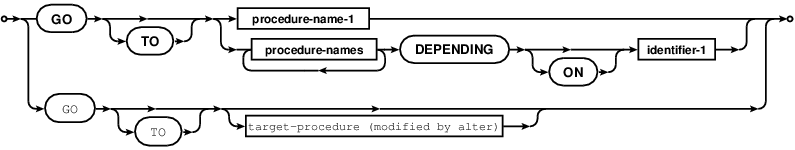
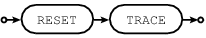
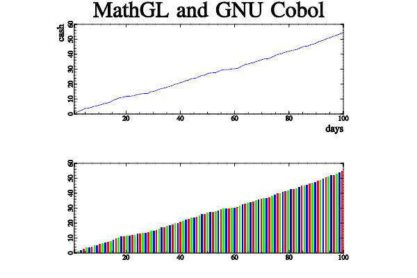
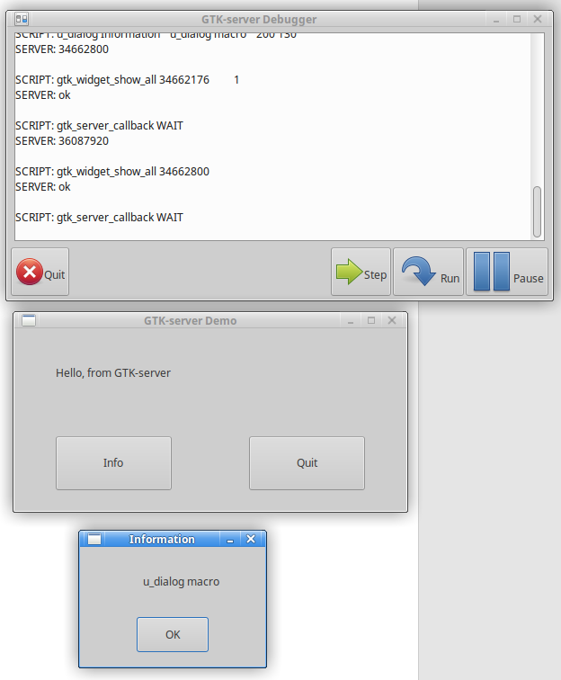
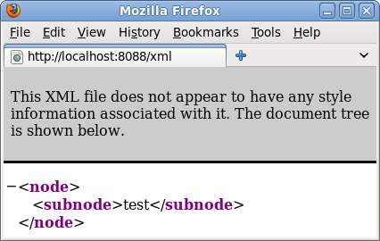

.. meta::
   :description: The GnuCOBOL FAQ, How To, and COBOL cookbook
   :keywords: COBOL, GnuCOBOL, FAQ, C, compiler, GNU, cookbook

.. |br| raw:: html

   <br />

.. last Modified: 2024-01-15/18:06-0500 
.. comment out section-numbering for latexpdf build
.. section-numbering::

.. highlight:: text

.. _top:

============
GnuCOBOL FAQ
============

.. Formatted for docutils, ReStructuredText. rst-buidhtml and now Sphinx
.. PDF form with the latexpdf builder. Texinfo form now Sphinx, make texinfo


.. only:: html

    :ref:`genindex`
    :floatright:`<a href="#tutorial">Tutorial</a>`

|

.. sidebar:: Status

    This is a programming aid and technical reference for the GnuCOBOL COBOL
    compiler.  A work in progress documenting GnuCOBOL Frequently Asked
    Questions and programming in COBOL with GnuCOBOL.

    Along with exploratory mixing of COBOL with Ada, BASIC, C, Datalog,
    Elixir, Fortran, Go, Haxe, Inform, J, Java, Javascript, Lua, MUMPS,
    Neko, Python, REXX, SNUSP, Tcl/Tk, Unicon, Vala, Wren, X86, to name a
    few, while missing some letters.  Mostly COBOL, GnuCOBOL.

    Sourced at gcfaq.rst_.  Courtesty of ReStructuredText_, Sphinx_, Pandoc_,
    and Pygments_. PDF format available at GnuCOBOLFAQ.pdf_.

    GnuCOBOL 3.1.2 is the release version. *GnuCOBOL 4 with XFD, and C++
    versions are available for testing*.  OpenCOBOL became GNU Cobol on
    September 27th, 2013, officially dubbed a GNU package.  The spelling of
    GNU Cobol changed to GnuCOBOL on September 20th, 2014.  Copyrights were
    assigned to the Free Software Foundation on June 17th, 2014.

    This FAQ is more than a FAQ_ and less than a FAQ. Someday that will
    change and this document will be split into a GnuCOBOL manual, a cookbook,
    and a simplified Frequently Asked Questions file. *The mythical, Someday*.

    .. contents::
       :backlinks: entry
       :depth: 1

    *Website favicon by Mark James, help.png from the FAMFAMFAM Silk icon set.*
    http://creativecommons.org/licenses/by/2.5/

    *Banner courtesy of KolourPaint, Copyright 2015 Brian Tiffin. Licensed
    under CC-BY-SA 2.0. Includes Sire, the Draft Horse, and the GNU Head
    by Aurelioi A. Heckert.* |br| http://www.gnu.org/graphics/heckert_gnu.html
    |br| https://commons.wikimedia.org/wiki/Category:Old_English_Black
    |br| http://creativecommons.org/licenses/by-sa/2.0/

    Comments, corrections, and suggestions regarding this document can be
    posted to `GnuCOBOL FAQ feedback`_ hosted in the GnuCOBOL project space.


.. Maintainer TODO and reminder
.. Suggestions in general:
   Why is this called a FAQ?
   Good question
   What is the header level order?
   Good question; double equals (above and below), double dash, dash,
   period, commas, apostrophe

::

    Dedicated to the living memory of Roger While (1950-2015)

.. index:: Roger While, While; Roger, Keisuke Nishida, Nishida; Keisuke

.. index:: Ron Norman, Norman; Ron, Sergey Kashyrin, Kashyrin; Sergey

:Authors:
    | Brian Tiffin [btiffin]_
    |
    | GnuCOBOL answers, quotes and contributions:
    |   John Ellis [John]_, Eugenio Di Lorenzo, Jim Currey,
    |   Bill Klein [wmklein]_, Ganymede, Rildo Pragana,
    |   Bill Woodger [woodger]_, Federico Priolo, cdg,  Sauro Menna,
    |   Arnold Trembley, Frank Swarbrick [Swarbrick]_, Angus, DamonH, Parhs,
    |   Gerald Chudyk, Steve Williams, László Erdős, Reinhard Prehofer,
    |   Marco Ridoni, Colin Duquesnoy, many others.
    |
    | GnuCOBOL compiler by:
    |   **Simon Sobisch** [human]_,
    |   **Roger While** [Roger]_,
    |   **Keisuke Nishida** [Keisuke]_,
    |   **Ron Norman** [Ron]_,
    |   **Sergey Kashyrin** [Sergey]_,
    |   **Edward Hart** [Hart]_,
    |   **James K. Lowden**, [James]_,
    |   **Philipp Böhme** [Philipp]_,
    |   **Dave Pitts** [Pitts]_,
    |   **Joe Robbins** [Joe]_,
    |   **Luke Smith** [Luke]_,
    |   **Vincent Coen** [Vince]_,
    |   **Brian Tiffin**, [btiffin]_
    |   (with the invaluable assistance of many others)
    |
    | Special credits to
    |   **Gary Cutler** author of the `GnuCOBOL Programmers Guide`_
    |   Joseph James Frantz for hosting and advocacy [aoirthoir]_
:Version:
    3.0.412, March 4th, 2020+2
:Status:
    never complete; like a limit, :math:`\lim_{aq\to0}f(aq) = 42`
:Copyright:
    |copyleft|
:License:
    This file is part of the GnuCOBOL FAQ.

    This documentation is free; you can redistribute and/or modify it under
    the terms of the GNU General Public License as published by the
    Free Software Foundation; either version 3 of the License, or (at your
    option) any later version.

    This documentation is distributed in the hope that it will be useful, but
    WITHOUT ANY WARRANTY; without even the implied warranty of MERCHANTABILITY
    or FITNESS FOR A PARTICULAR PURPOSE. See the GNU General Public
    License for more details.

    You should have received a copy of the GNU General Public License
    along with this document.  If not, see <http://www.gnu.org/licenses/>.

:ChangeLog:
    ChangeLog_

:Acknowledgment:
    Below is a copy of the long standing acknowledgment request that appears in
    all versions of the CODASYL COBOL Journal of Development and most ANSI/ISO
    COBOL standards.

.. index:: acknowledgment, CODASYL, Grace Hopper, Hopper; Grace

::

    Any organization interested in reproducing the COBOL standard and
    specifications in whole or in part, using ideas from this document as the basis
    for an instruction manual or for any other purpose, is free to do so.  However,
    all such organizations are requested to reproduce the following acknowledgment
    paragraphs in their entirety as part of the preface to any such publication:

The COBOL standard acknowledgment. With respect and gratitude.

::

    COBOL is an industry language and is not the property of any company or group
    of companies, or of any organization or group of organizations.

    No warranty, expressed or implied, is made by any contributor or by the CODASYL
    COBOL Committee as to the accuracy and functioning of the programming system
    and language.  Moreover, no responsibility is assumed by any contributor, or by
    the committee, in connection therewith.

    The authors and copyright holders of the copyrighted materials used herein

        FLOW-MATIC (trademark of Sperry Rand Corporation), Programming for the UNIVAC
        (R) I and II, Data Automation Systems copyrighted 1958, 1959, by Sperry Rand
        Corporation; IBM Commercial Translator Form No. F28-8013, copyrighted 1959 by
        IBM; FACT, DSI 27A5260-2760, copyrighted 1960 by Minneapolis-Honeywell

    have specifically authorized the use of this material, in whole or in part, in
    the COBOL specifications.  Such authorization extends to the reproduction and
    use of COBOL specifications in programming manuals or similar publications.

    Any organization using a short passage from this document, such as in a book
    review, is requested to mention "COBOL" in acknowledgment of the source.

Many thanks to the original designers, supporting organizations, and
individuals of the day.

.. Note:: Regarding COBOL Standards, Official COBOL Standards:
   There are many references to **standards** in this document.
   Very few of them are *technically* correct references.
   Apologies to all the hard working men and women of the technical
   committees for this unintentional slight.  For specific details
   on what wordings should be used please see
   `What are the Official COBOL Standards?`_

.. only:: html

    .. sidebar:: GnuCOBOL

        :ref:`genindex`

        .. contents::
           :backlinks: entry
           :depth: 2

-----------------
What is GnuCOBOL?
-----------------
GnuCOBOL_ is a COBOL_ compiler. GnuCOBOL is a GNU free software package.

GnuCOBOL implements a substantial part of the `COBOL 85`_, `COBOL 2002`_,
`COBOL 2014`_ and upcoming `COBOL 202x`_ standards, as well as many extensions
from existing COBOL compilers.

GnuCOBOL compiles COBOL into C then compiles the intermediate code with the
configured C compiler, usually gcc, into assembler for object code, linked
into executable machine code.

COBOL to C to executable on GNU/Linux, Mac OS X, Microsoft Windows, OS/400,
z/OS 390 mainframes, smart phones, almost all platforms.  *libcob was ported
to an 8bit microcontroller with LCD display*.

GnuCOBOL was OpenCOBOL.  OpenCOBOL started around 2002, and on September 26th,
2013, GnuCOBOL was accepted and dubbed a GNU package by Dr. Richard Stallman.
*One day before the 30th anniversary of the GNU project announcement*.

The official page for GnuCOBOL is:

http://savannah.gnu.org/projects/gnucobol

A valuable reference, the ``GnuCOBOL Programmer's Guide`` can be
found at `GnuCOBOL Programmers Guide`_.

The original ``OpenCOBOL Programmer's Guide`` can be found at
`OpenCOBOL Programmers Guide`_.

In this author's opinion, GnuCOBOL is a world class COBOL compiler, very
capable with almost all of the COBOL 85 specifications, plus having some very
modern, next generation potentials.

.. index:: motto

**GnuCOBOL REDEFINES programming** is the motto.

*Coincidentally, that motto is compilable source code*.

.. sourcecode:: cobolfree

       identification division.
       program-id. motto.
       data division.
       working-storage section.

       1, computer                                                   . 2
          programming value is "Highly rewarding".


       2, GnuCOBOL REDEFINES programming                         pic xx.
                                                               procedure
                                                               division.
       3. display GnuCOBOL.

::

    prompt$ cobc -xj -free motto.cob
    Hi

*Ignore the tricky formatting, that was all for looks on a particular forum
that only allowed 52 characters with a horizontal scrollbar.  GnuCOBOL
normally looks far more professional than the odd snippet of fun you may read
in this document.*

And a little marketing:

.. only:: html

   .. image:: images/cobc-marketing.png
      :width: 55%

.. only:: latex

   .. image:: images/cobc-marketing.png

--------------
What is COBOL?
--------------
COBOL_ is an acronym for COmmon Business Oriented Language. This author
has always thought of it as "Common Business" Oriented more than
Common "Business Oriented", but that emphasis is perhaps up to the reader's
point of view.

*As an aside: I'd like to steal the O in COmmon, and haven't found a suitable
word as of yet.*  Common *Originally* Business Oriented Language, was tried,
trying to connote "it's been extended", but it sounds diminishing, like
GnuCOBOL can't do Business anymore. Which isn't the case.  *So, the quest
continues*.

*A discussion group posting on LinkedIn tweaked this again, Common Object
Business Oriented Language.*  I like it.  And with GnuCOBOL C++, perhaps
Sergey can lead the charge/change.

*Later...* and even better, perhaps:

Common Objective Business Oriented Language.

A stable, business oriented language, that helps people meet the common
objectives; across all the computing platforms, around the globe. *That is not
an official acronym or anything, just a suggestion*.


.. index:: GPL, LGPL, license; GPL, license; LGPL, legals, FSF

-------------------------
How is GnuCOBOL licensed?
-------------------------
The compiler is licensed under the `GNU General Public License`_.

The run-time library is licensed under `GNU Lesser General Public License`_.

All source codes were copyright by the respective authors. With many thanks
to Roger While and Keisuke Nishida for sharing their work with the world.

::

    On June 17th, 2015, the legal transfer of all components of the GnuCOBOL
    source code tree, from all authors, to the Free Software Foundation, was
    announced as official.  The rights to copy the GnuCOBOL project source
    codes are now in the care, and capable hands, of the FSF.

What this licensing means, roughly, is::

  You are allowed to write GnuCOBOL programs that use the libcob run time
  library however you like.  Closed, proprietary, commercial use is allowed as
  part of the LGPL user freedoms.  You can ship GnuCOBOL generated programs in
  binary form as you wish, (with exceptions; mentioned below).

  Modifications to the compiler itself, if ever distributed, need to
  provide access to source code and be licensed under the GNU GPL.

  Modifications to the run time library code, if distributed to others,
  should also provide access to the source code of the library changes,
  and be licensed under the LGPL, but other redistribution models are
  allowed.

  This ensures that no one is allowed to provide people with access to a
  compiler that they can't change, rebuild, and redistribute freely.

  If modified sources are personal, or never distributed outside an
  organization, there is no burden to release the source of a custom
  compiler.  The main intents of the GPL are to ensure end user freedoms.
  And the LGPL code to be usable, as given, in closed run-time systems.

  I think.  I am not a lawyer.

Berkeley Data Base license::

  Please note: this applies to default GnuCOBOL binary builds.

  Any version of the compiler that is configured to use Berkeley DB
  beyond version 1.85 must abide by the Oracle license, and sources of the
  COBOL programs that use libdb must be shipped with any binaries. There are
  alternatives to libdb, but deep down, GnuCOBOL encourages free software.

  GnuCOBOL, by default is built with libdb for ISAM operations.  Be aware of
  the implications, call Oracle, or build in something like the VBISAM engine.

GnuCOBOL is distributed in the hope that it will be useful,
but WITHOUT ANY WARRANTY; without even the implied warranty of
MERCHANTABILITY or FITNESS FOR A PARTICULAR PURPOSE.  See the
GNU General Public License for more details.

.. note::
    While GnuCOBOL can be held to a high standard of quality and
    robustness, the authors **do not** claim it to be a "Standard Conforming"
    implementation of COBOL.


.. index::
   single: platforms
   single: GNU/Linux
   single: POSIX
   single: Windows
   single: OS/X
   single: AS/400
   single: HP Integrity HPUX
   single: RS600 AIX 5
   single: z/OS OMVS/USS

-----------------------------------------
What platforms are supported by GnuCOBOL?
-----------------------------------------
GnuCOBOL has been built on a lot of operating systems.

`OpenCobol 1.0`_ hosted on SourceForge.net, compiles on:

* All 32-bit MS Windows (95/98/NT/2000/XP)
* All POSIX (Linux/BSD/UNIX-like OSes)
* OS/X

`GnuCOBOL 1.1`_, the first official GNU release version has been built on

* MS Windows native
* MS Windows with Cygwin
* GNU/Linux
* POSIX Systems including OpenSolaris
* OS/X
* AS/400
* HP Integrity HPUX 11.23
* RS600 AIX 5
* 390 Mainframe z/OS OMVS/USS
* others, Raspberry Pi ("\$35 for hardware, OS and GnuCOBOL")

`GnuCOBOL 2.2`_, is now making into official repositories. As an example,
Ubuntu 18.04, ``sudo apt install gnucobol`` is release 2.2.

`GnuCOBOL 3.1`_, released in November 2020 will be in some
distributions.  Along with GnuCOBOL 3.1.1, and GnuCOBOL 3.1.2, released in
December 2020.  More and more distributions are providing current releases.

With each contribution, GnuCOBOL ends up supported on more and more platforms.


.. index:: packages, apt, deb

--------------------------------------
Are there pre-built GnuCOBOL packages?
--------------------------------------
Yes.

.. include:: latest-download.txt

Debian_ APT_, and RPM packages exist.  Packages for NetBSD.  Many.
Google ``opencobol packages`` for older builds, and ``gnu cobol`` for any late
breaking news.


A Debian Advanced Package Tool binary package exists for GnuCOBOL 1.1 as
``open-cobol`` and lists dependencies of

* libc6 (>= 2.7-1),
* libcob1,
* libcob1-dev (= 1.0-1),
* libdb4.5 (>= 4.5.20-3),
* libdb4.5-dev,
* libgmp3-dev,
* libgmp3c2,
* libltdl3-dev,
* libncurses5 (>= 5.6+20071006-3)

Thanks to the gracious efforts of Bart Martens, bartm on Debian's .org domain.

More recently the official repos will have package ``gnucobol`` and it is
usually version 2.2.

.. index:: yum, rpm, Fedora, RedHat

Fedora and RedHat ``yum`` repositories usually have ``open-cobol`` as a choice
for

::

    yum install open-cobol

GnuCOBOL packages are slowly being introduced, and will likely see a revision
from open-cobol-1.1 to GnuCOBOL 3.0 and gnucobol, after some release
announcements and posting to GNU servers.

.. index:: repology

........
repology
........

There is a page with just about all details of *official* packaging at

https://repology.org/metapackage/gnucobol/versions

Please note that *none* of these packages are project affiliated, but come
to you out of the goodness of the hearts of the volunteers involved.

The **official** project releases are in source form and will be posted
to ftp.gnu.org.

.. index:: kiska, zOS, HP, mainframe, packages, C++

....................
kiska.net repository
....................

Also check out kiska.net_ for binary builds on various platforms.
Thanks to Sergey Kashyrin, who is also the author of the version
that emits C++ intermediates.

.. index:: SourceForge

...........
sourceforge
...........
There are GnuCOBOL links at http://cobol.sourceforge.net

In particular,
http://sourceforge.net/projects/cobol/files/open-cobol/ can come
in handy, with sources and MinGW binaries at a minimum. Maybe more
as time goes on.

.. index:: windows, MinGW, Arnold Trembley

.................
|windowstm| MinGW
.................
Arnold Trembley has been supporting the project with installers for a long
time now.  His latest is bundled with the OCIDE distribution, or see

**This is the link you want to follow first**

https://www.arnoldtrembley.com/GnuCOBOL.htm

Then take a look through

https://gnucobol.sourceforge.io/files/

for the latest.  Usually in synch with Arnold's releases, but there is usually
a few days between Arnold posting a new build and the links being updated.

,,,,,,,,,,
Older cuts
,,,,,,,,,,

Arnold put together an INNO installer, based on Gary Cutler's MinGW
builds of OpenCOBOL 1.1.  Makes it pretty easy to get COBOL running on a PC.
You can find it attached to SourceForge discussions, or at Arnold's site:

* https://www.arnoldtrembley.com/OpenCOBOL-MinGw-installer.zip and
* https://www.arnoldtrembley.com/GnuCOBOL-MinGw-Installer.zip with a build guide
* http://opencobol.add1tocobol.com/guides/GnuCOBOL-1.1-MinGW-Build-Guide.pdf


.. index:: MinGW official

..............
MinGW official
..............
An official GnuCOBOL project MinGW build, put together by Simon Sobisch, is
stored on SourceForge, at

http://sourceforge.net/projects/gnucobol/files/gnu-cobol/1.1/ directly
downloaded as

.. raw:: latex

   \begin{scriptsize}\begin{verbatim}

       http://sourceforge.net/projects/gnucobol/files/gnu-cobol/1.1/GnuCOBOL_1.1_MinGW_BDB_PDcurses_MPIR.7z/download

   \end{verbatim}\end{scriptsize}

.. only:: html

   http://sourceforge.net/projects/gnucobol/files/gnu-cobol/1.1/GnuCOBOL_1.1_MinGW_BDB_PDcurses_MPIR.7z/download

As the name implies, this complete compiler build includes Berkeley DB for
ISAM, PDCurses for extended screen IO, and MPIR for the decimal arithmetic and
other multiprecision math features of GnuCOBOL.

This build is now also included in Colin's OpenCOBOLIDE_.

.. index:: visual studio

.. _visual studio:

.....................................
|windowstm| Visual Studio vc11 native
.....................................
Paraphrased from some posts by Simon on the forge:

.. raw:: latex

   \begin{footnotesize}\begin{verbatim}

       New upload of
       http://sourceforge.net/projects/gnucobol/files/gnu-cobol/2.0/gnu-cobol-2.0_nightly_r411_win32_vc11_bin.7z
       - works correctly now

       http://sourceforge.net/projects/gnucobol/files/gnu-cobol/win_prerequistes/win_prerequistes_vc11.7z
       was uploaded, too

   \end{verbatim}\end{footnotesize}

.. only:: html

   New upload of
   http://sourceforge.net/projects/gnucobol/files/gnu-cobol/2.0/gnu-cobol-2.0_nightly_r411_win32_vc11_bin.7z
   - works correctly now

   http://sourceforge.net/projects/gnucobol/files/gnu-cobol/win_prerequistes/win_prerequistes_vc11.7z
   was uploaded, too

Keep an eye on http://sourceforge.net/projects/gnucobol/files/gnu-cobol/2.0/
for the latest snapshots.

::

    If you don't know already: GC translates COBOL to C and compiles it using a
    C compiler. For Win8 I'd use VS2012 or higher (Express Versions work fine).
    After installing it go to the downloads area and grab the first "official"
    nightly build direct from svn: ... link above

    it's quite easy to build GnuCOBOL 2.0 on your own: checkout 2.0-branch,
    download the win_prerequisites from sourceforge download area, unpack it to
    build_windows, open the VS solution you need (maybe changing defaults.h to
    match your path) and click compile.

.................
Mario's file pile
.................
Mario Matos is building up a pile of files of GnuCOBOL related archives, in
the cloud at

https://meocloud.pt/link/4275816b-59bc-4fe9-96a3-f2c7a24e9246/GnuCOBOL/

There are archives for lots of different cuts of GnuCOBOL for Windows along
with a plethora of other tools and utilities, with nuggets of wisdom and
how-to information sprinkled throughout.


................
Online compilers
................
There are a few sites that provide online compilation for trials and testing.

GnuCOBOL (or an older OpenCOBOL, depending on when the site installed their
compilers) can be tried at:

- https://www.tutorialspoint.com/compile_cobol_online.php
- https://ideone.com/l/cobol

There are others.  I'll try and keep this list up to date as new sites come to
be known.

**Please note:**  These are publicly accessible sites, owned by others.

::

    Do NOT post code to a website if you need to keep it private
    Do NOT post code to a website if you have no rights to copy

Outside that warning, online compiler sites are great for quick trials and
showing friends and acquaintances how cool GnuCOBOL is.


.. index:: recent, current

--------------------------------------------
What is the most recent version of GnuCOBOL?
--------------------------------------------

See `What is the current version of GnuCOBOL?`_

.. include:: latest-download.txt

.. index:: complete, substitute

-------------------------
How complete is GnuCOBOL?
-------------------------
`OpenCOBOL 1.0`_ implements a substantial portion of `COBOL 85`_,
supports many of the advances and clarifications of `COBOL 2002`_,
and includes many extensions in common use from Micro Focus COBOL,
ACUCOBOL and other existent compilers.

`GnuCOBOL 2.2`_ implements a more substantial portion of the `COBOL 85`_
Dialect, `COBOL 2002`_ and a growing number of vendor extensions.

`GnuCOBOL 3.1`_ adds Report Writer and a host of features that have been
developed in the reportwriter branch along with even more support for
`COBOL 2014`_, `COBOL 202x`_ and existent COBOL extensions.

The GnuCOBOL 4 pre-release continues expanding on old and new COBOL features
along with Standard syntax and extensions.

Compatibility support includes:

* MF for Micro Focus
* IBM for IBM compatibility
* MVS
* BS2000
* ACU
* RM
* REALIA

GnuCOBOL implements most COBOL technical features and statements (excluding
Object COBOL), allowing source code such as

.. sourcecode:: cobolfree

    CALL "cfunction" USING BY REFERENCE ADDRESS OF VAR-IN-LINKAGE-SECTION.

Passing the equivalent of ``char**``, pointer to pointer to char.  Just as a
small example of the level of coverage and flexibility provided by GnuCOBOL.

User Defined Functions can add a level of conciseness to COBOL.

.. sourcecode:: cobolfree

    MOVE FUNCTION COMPANY-RULE39(SALES-RECORD) TO BONUS

GnuCOBOL supports most intrinsic functions, as well as a few extensions.

.. sourcecode:: cobolfree

    DISPLAY
        FUNCTION UPPER-CASE(
            FUNCTION SUBSTITUTE(
                "This is the orginal string.";
                "original"; "new"; "string"; "text"
            )
        )

Allowing for substitution of mixed length strings, something not normally so
easy in COBOL.  The above will output::

    THIS IS THE NEW TEXT.

.. index:: disclaimer

.. note::
    While GnuCOBOL can be held to a high standard of quality and
    robustness, the authors **do not** claim it to be a "Standard Conforming"
    implementation of COBOL. *Even though it covers a lot of Standard; there
    is no claim, official and or otherwise*.

-----------------------------
Will I be amazed by GnuCOBOL?
-----------------------------
This author believes so.  For a free implementation of COBOL, GnuCOBOL may
surprise you in the depth and breadth of its COBOL feature support, usability
and robustness.

COBOL use has historically been quite secretive and low key.  Its domain of
use being very secretive and low key. COBOL programmers rarely work on systems
that would allow for open internet chat regarding details, let alone
*existence* of the programs involved.  It is a tribute to the professionalism
of these programmers that most people rarely, if ever, hear the name COBOL, a
programming language with billions of lines of source code compiled and in
production around the world, for over half a century.

GnuCOBOL is poised to change that historic trend, and allow for the long
overdue sharing of wisdom that legions of COBOL developers have accumulated
over 60 years of success and failure.  The GnuCOBOL conversation may be more
POSIX_ than mainframe, but there is now room to share, critique and pass on the
hard lessons learned from critical systems computing.  Given that millions of
COBOL programmers kept billions of lines of COBOL source out of the press,
surely some of the wisdom can be passed on in a way that keeps all the secrets
secret while curious developers are exposed to COBOL outside the vaults.

.. index:: acknowledgment; thanks

----------------------------
Who do I thank for GnuCOBOL?
----------------------------
Many people.  In particular **Keisuke Nishida**, **Roger While**, **Simon
Sobisch**, **Ron Norman**, **Edward Hard**, **Dave Pitts** and **Sergey
Kashyrin**.

See the THANKS file in the source code archive for more names of people that
have worked on the OpenCOBOL, now GnuCOBOL, project.  Roger points out
that the list is woefully incomplete.  To quote::

    The OC project would not have been where it is today without the
    significant/enormous help from many-many persons. The THANKS
    file does not even do justice to this.

.. index:: test; check

-----------------------------------
Does GnuCOBOL include a Test Suite?
-----------------------------------
Why yes it does.  74 syntax tests, 170 coverage tests, and 16 data
representation tests in the February 2009 pre-release.

88 syntax, 253 coverage, and 22 data tests in a 2010 cut.  456 tests in the
2014 sources, and growing.  (501 tests in early 2015).

2.0-rc3 in early 2017 includes 34 general usage, 203 syntax, 21 listing, 409
coverage, and 26 data representation tests for a total of 693 test areas
during build.

2.2 official runs some 700+ internal checks.

3.1 in 2018 was approaching a total of 1,000 ``make check`` checks.

3.1.2 released in December of 2020 includes 1086 checks.

The 4.0 pre-release has over 1,130 internal integrity checks.

From a development tarball::

    $ make check

will evaluate and report on the test suite.  See `make check listing`_
for a current output listing of a test run.

``make check`` is built with Autotools autotest, a Perl based test harness.

It supports a few options, one in particular::

    $ TESTSUITEFLAGS='--jobs=4' make check

will run tests in parallel, pick a number appropriate to the number of cores.

A quad core pass with ``--jobs=4``

::

    00:24.86 elapsed 300%CPU

and without TESTSUITEFLAGS *(some may be pre-cached etc...)*

::

    01:24.72 elapsed 100%CPU

85 seconds down to 25 seconds, when tested in parallel.

.. index:: test; educational

......................................
Educational benefits of the test suite
......................................
The code in *tests/testsuite.dir* is a treasure trove of source code that
demonstrates the various features of GnuCOBOL and how to use them.

The code is embedded in Autoconf Autotest macros, in particular ``AT_DATA``
blocks hold GnuCOBOL sources.  With a little bit of practice these
distractions can be overlooked, as inside the code is just COBOL.

There are good examples of some of the more technical aspects of COBOL in
these tests.  Often focused on a single issue, some include a fair amount
of COBOL while testing for expected results.

For example, in *testsuite.dir/run_returncode.at*

.. sourcecode:: cobolfree

    AT_SETUP([RETURN-CODE nested])
    AT_KEYWORDS([returncode])

    AT_DATA([prog.cob], [
           IDENTIFICATION   DIVISION.
           PROGRAM-ID.      prog.
           PROCEDURE        DIVISION.
               MOVE 1 TO RETURN-CODE.
               IF RETURN-CODE NOT = 1
                  DISPLAY RETURN-CODE NO ADVANCING
                  END-DISPLAY
               END-IF.
               CALL "mod1"
               END-CALL.
               IF RETURN-CODE NOT = 2
                  DISPLAY RETURN-CODE NO ADVANCING
                  END-DISPLAY
               END-IF.
               MOVE ZERO TO RETURN-CODE.
               STOP RUN.
           PROGRAM-ID.      mod1.
           PROCEDURE        DIVISION.
               IF RETURN-CODE NOT = 1
                  DISPLAY RETURN-CODE NO ADVANCING
                  END-DISPLAY
               END-IF.
               MOVE 2 TO RETURN-CODE.
               EXIT PROGRAM.
           END PROGRAM mod1.
           END PROGRAM prog.
    ])

    AT_CHECK([$COMPILE prog.cob], [0], [], [])
    AT_CHECK([./prog], [0], [], [])

    AT_CLEANUP

That code, while testing the ``RETURN-CODE`` special register, also
illustrates how to nest sub-programs in COBOL. There are thousands of feature
demonstrations for GnuCOBOL programming in the test suite.

*The compiler developers aim to always use warning free COBOL in these tests,
in upper case, so they may not have the most modern appearance.* This is a
testament to the long life of COBOL, and the backward compatible defaults that
have carried over in the COBOL Standards from 1960 through modern times.
GnuCOBOL supports all the improvements and advancements that COBOL now
empowers, but the tests are written in support of the goal for backward
compatible long lived source code, for business stability across decades of
COBOL evolution.


.. index:: test; NIST, test; COBOL85

---------------------------------------
Does GnuCOBOL pass the NIST Test Suite?
---------------------------------------
Mostly. Not all. All attempted tests are passed. Over 9000.

The National Institute of Standards and Technology, NIST, maintained, and now
archives a COBOL 85 implementation verification suite of tests.  A compressed
archive of the tests, last updated in 1993, to include Intrinsic Functions,
A copy of the archive has been placed in

https://sourceforge.net/projects/gnucobol/files/nist/

*This used to be at:* http://www.itl.nist.gov/div897/ctg/cobol_form.htm and
redistribution comes with conditions; this is for official purposes of testing
a COBOL compiler build.  It is not for general redistribution.

GnuCOBOL passes many of the tests included in the NIST sponsored COBOL 85 test
suite.

While the system successfully compiles over 400 modules, failing none of the
over 9700 tests attempted; GnuCOBOL does **not** claim conformance to any level
of COBOL *Standard*.

Instructions for use of the NIST suite is included in the build archive under::

    tests/cobol85/README

Basically, it is a simple ``uncompress`` and ``make`` then sit back and relax.
The scripts run GnuCOBOL over some 424 programs/modules and includes thousands
of different, purposely complicated stress test passes.

*It got easier too*, just type ``make checkall`` during a source build to
automatically download, extract and run the NIST test suite.

::

    Test Modules
    ------------

    Core tests:

      NC - COBOL nucleus tests
      SM - COPY sentence tests
      IC - CALL sentence tests

    File I-O tests:

      SQ - Sequential file I-O tests
      RL - Relative file I-O tests
      IX - Indexed file I-O tests
      ST - SORT sentence tests
      SG - Segment tests

    Advanced facilities:

      RW - REPORT SECTION tests
      IF - Intrinsic Function tests
      SG - Segment tests
      DB - Debugging facilities tests
      OB - Obsolete facilities tests

With the addition of GLOBAL support, the GnuCOBOL-reportwriter pre-release
fails none of the attempted tests.

The summary.log from a run in November 2013 with initial Report Writer
support::

    ------ Directory Information -------   --- Total Tests Information ---
    Module Programs Executed Error Crash   Pass Fail Deleted Inspect Total
    ------ -------- -------- ----- -----  ----- ---- ------- ------- -----
    NC           95       95     0     0   4371    0       4      26  4401
    SM           17       17     0     0    293    0       2       1   296
    IC           25       25     0     0    247    0       4       0   251
    SQ           85       85     0     0    521    0       0      89   610
    RL           35       35     0     0   1830    0       5       0  1835
    IX           42       42     0     0    510    0       1       0   511
    ST           40       40     0     0    289    0       0       0   289
    SG           13       13     0     0    313    0       0       0   313
    OB            7        7     0     0     34    0       0       0    34
    IF           45       45     0     0    735    0       0       0   735
    RW            6        6     0     0     42    0       0       0    42
    DB           14       14     0     0    404    0       4      27   435
    ------ -------- -------- ----- -----  ----- ---- ------- ------- -----
    Total       424      424     0     0   9589    0      20     143  9752

**This is up from the 1.1 Feb 2009 release count of 9082.**

.. index:: test; missing

...............
What's missing?
...............
GnuCOBOL does not yet include support for::


    Advanced facilities:

      CM - COMMUNICATION SECTION tests

and limits tests within the::

      DB - Debugging facilities tests
      OB - Obsolete facilities tests

sections.

.. index:: test; benchmark, benchmark

-----------------------------------
What about GnuCOBOL and benchmarks?
-----------------------------------
COBOL has a legacy dating back to 1959.  Many features of the COBOL
standard provide defaults more suitable to mainframe architecture than the
personal computer a 3rd millennium GnuCOBOL developer will likely be using.

GnuCOBOL, by default, generates code optimized for big-endian_ hardware.
Fairly dramatic speed improvements on Intel architecture can come from simple
``USAGE IS COMPUTATIONAL-5`` clauses in the DATA DIVISION.

.. index:: test; telco, telco

.............
telco billing
.............

There is a benchmark posted at http://speleotrove.com/decimal/telco.html and
thanks to Bill Klein [wmklein]_, there is a COBOL entry.  From the source
code listed below, you should only have to modify

.. sourcecode:: cobolfree

       Input-Output Section.
        File-Control.
           Select InFile  Assign to
                "C:\expon180.1e6".
           Select OutFile  Assign to
                "C:\TELCO.TXT"
                        Line
                        Sequential.

to point to the correct filename for your local copy of the benchmark
million entry file and a suitable OutFile name for a clean compile and
run.

*Update:*  There is a version tuned for GnuCOBOL, especially the ROUNDED
NEAREST-EVEN support.  It gives correct results for what would be common
default GnuCOBOL settings and compiler configurations, and Banker's
Rounding.  *Listed below*.

In summary, the benchmark reads a large input file containing a suitably
distributed list of telephone call durations (each in seconds). For each call,
a charging rate is chosen and the price calculated and rounded to hundredths.
One or two taxes are applied (depending on the type of call) and the total cost
is converted to a character string and written to an output file. Running
totals of the total cost and taxes are kept; these are displayed at the end of
the benchmark for verification.

A run on an older pentium 4 and the million number file gave::

  $ echo 'N' | time ./telco
  Enter 'N' to skip calculations:
  0.46user 1.08system 0:01.61elapsed 96%CPU (0avgtext+0avgdata 0maxresident)k
  0inputs+134776outputs (0major+345minor)pagefaults 0swaps

  $ echo '' | time ./telco
  Enter 'N' to skip calculations:
  11.37user 1.41system 0:12.95elapsed 98%CPU (0avgtext+0avgdata 0maxresident)k
  24inputs+134776outputs (0major+360minor)pagefaults 0swaps

  $ tail TELCO.TXT
      35    D  |         0.31         0.02         0.01 |         0.34
     193    D  |         1.73         0.11         0.05 |         1.89
     792    L  |         1.03         0.06              |         1.09
     661    D  |         5.91         0.39         0.20 |         6.50
      44    L  |         0.06         0.00              |         0.06
     262    L  |         0.34         0.02              |         0.36
  -------------+----------------------------------------+-------------
     Totals:   |   922,067.11    57,628.30    25,042.17 | 1,004,737.58
    Start-Time:09:37:23.93
      End-Time:09:37:36.83

2 seconds for the short test, 12 for the long, on a fairly small machine.

A more recent 1.1 pre-release, on a dual quad-core Xeon box running
Linux SLES 10 64-bit::

  $ tail TELCO.TXT
       35    D  |         0.31         0.02         0.01 |         0.34
      193    D  |         1.73         0.11         0.05 |         1.89
      792    L  |         1.03         0.06              |         1.09
      661    D  |         5.91         0.39         0.20 |         6.50
       44    L  |         0.06         0.00              |         0.06
      262    L  |         0.34         0.02              |         0.36
   -------------+----------------------------------------+-------------
      Totals:   |   922,067.11    57,628.30    25,042.17 | 1,004,737.58
     Start-Time:21:40:48.52
       End-Time:21:40:51.92

3.4 seconds cache-hot, long test. Not bad.

With Bill's permission, the benchmark code is listed here: (with the
first few lines added for the benefit of an indent based code
highlighter)

.. literalinclude:: listings/telco.cob
   :language: cobolfree

.. only:: html

    Download: :download:`listings/telco.cob`


Data files and other code listings are copyright Mike Cowlishaw and IBM, so go
to the speleotrove site, linked above, for all the details.

*I'll opine; Bill's and Roger's COBOL is a LOT easier to read than the other
entries, being C, C#, Java. (The Turbo Pascal link seems broken, can't speak
to the readability), but I'm calling COBOL for the win on this one, wire to
wire.*

,,,,,,,,,,,,,,,,,,,,,,,,,,,,,,
Roger's telco benchmark update
,,,,,,,,,,,,,,,,,,,,,,,,,,,,,,

.. literalinclude:: listings/telco5.cob
   :language: cobolfree

.. only:: html

    Download: :download:`listings/telco5.cob`


.. index:: CGI, browser

-----------------------------
Can GnuCOBOL be used for CGI?
-----------------------------
Yes.  Through standard IO redirection and the extended
``ACCEPT ... FROM ENVIRONMENT ...`` feature, GnuCOBOL is more than capable
of supporting advanced Common Gateway Interface programming.  See
`How do I use GnuCOBOL for CGI?`_ for a sample *Hello Web* program.

.. index:: environment

Also see `Can GnuCOBOL display the process environment space?`_

.. index:: cloud; JuJu

Here's a screenshot of GnuCOBOL running in Apache server CGI, in the Cloud as
a Juju Charm.


More specially, this screenshot was taken on a Fedora 19, XFCE desktop with a
libvirt VM install of Ubuntu 13.04, running Firefox and browsing a locally
spawned cloud instance. The instantiation of the Juju Charm creates
another virtual machine, installs a base operating system, compiles and
installs GnuCOBOL with Report Writer, builds up a small testsuite of CGI ready
COBOL applications, installs everything, starts apache and serves up the pages.

*And it all just works*

.. index:: FastCGI

.....................
GnuCOBOL with FastCGI
.....................
FastCGI can also work with GnuCOBOL.  A small wrinkle in the tectonics_ is
that the standard IO C header file that is generated by ``cobc`` needs to be
swapped out for ``fcgi_stdio.h``.  This isn't too bad, as ``cobc`` can be used
to generate intermediate C and after a quick text replacement, can then be
called a second time to compile the generated C code into an executable
suitable for placing in the web server space.

.. sourcecode:: make

    # Sample make rule for using FastCGI with GnuCOBOL
    .RECIPEPREFIX = >

    program: program.cob
    > cobc -x -C program.cob
    > sed -i 's/<stdio.h/<fcgi_stdio.h/' program.c
    > LD_RUN_PATH=. cobc -x program.c -lfcgi

The CGI processing code then needs to add a simple looping structure
internally.

.. sourcecode:: cobolfree

      *> FastCGI from COBOL sample
      *>   fastcgi-accept is a binary-long
      *>   carriage-return is x"0d" and newline is x"0a"
       procedure division.

       call "FCGI_Accept" returning fastcgi-accept
           on exception
               display
                   "FCGI_Accept call error, link with -lfcgi"
               end-display
       end-call

       perform until fastcgi-accept is less than zero

      *> Always send out the Content-type before any other IO
           display "Content-type: text/html" carriage-return newline
           end-display

           display "<html><body>" end-display
           display
               "<h3>FastCGI environment with GnuCOBOL</h3>"
           end-display

           ... rest of CGI handling ...

           call "FCGI_Accept" returning fastcgi-accept
               on exception
                   move -1 to fastcgi-accept
           end-call

       end-perform

Some platforms (ala Cygwin) may need

.. sourcecode:: cobolfree

       call STATIC "FCGI_Accept" returning fastcgi-accept

to get proper linkage with libfcgi.

.. index:: FastCGI

..................................
FastCGI without changing #includes
..................................
The makefile steps used above can actually be simplified by passing an
``--include`` option to the C compiler.

.. sourcecode:: bash

    cobc -x program.cob -A '--include fcgi_stdio.h' -lfcgi


.. index:: build; hosted

..........................
running on hosted services
..........................
For those developers looking to serve GnuCOBOL applications on hosted systems
without super user privileges, see `How do I use LD_RUN_PATH with GnuCOBOL?`_
for some pointers on getting hosted executables installed properly.
``LD_RUN_PATH`` can make it easier for CGI programs to find a locally
installed ``libcob`` runtime, something a hosted service may not provide.


.. index:: GUI, graphics, GTK, Tcl; Tk

----------------------------
Does GnuCOBOL support a GUI?
----------------------------
Yes, but not out of the box.  There is not |currently| anything that ships
with the product.

Third party extensions for Tcl/Tk and linkage to GTK+ and other frameworks do
allow for graphical user interfaces.  See
`Does GnuCOBOL support the GIMP ToolKit, GTK+?`_ and
`Can GnuCOBOL interface with Tcl/Tk?`_.

.. index:: GTK+, cobweb; gtk, cobweb-gtk, GTK-server

...
GTK
...
The expectation is that GTK+ will be completely bound as a callable
interface.  That is |currently| not the case, with perhaps 2% of the
GTK+ functionality wrapped (but with that 2%, fully functional graphical
interfaces are possible).


*An experimental FUNCTION-ID wrapper is working out well*

This procedure division: (part the of the library self-test)

.. sourcecode:: cobol

   cobweb
   GTK+
          *> test basic windowing
           procedure division.
           move new-window("cobweb-gtk", width-hint, height-hint)
             to gtk-window-data
           move new-box(gtk-window, HORIZONTAL, spacing, homogeneous)
             to gtk-box-data
           move new-image(gtk-box, "blue66.png") to gtk-image-data
           move new-label(gtk-box, "And? ") to gtk-label-data
           move new-entry(gtk-box, "cobweb-entry-activated")
             to gtk-entry-data
           move new-button(gtk-box, "Expedite", "cobweb-button-clicked")
             to gtk-button-data
           move new-vte(gtk-box, vte-cols, vte-rows) to gtk-vte-data
           move new-spinner(gtk-box) to gtk-spinner-data

           move gtk-go(gtk-window) to extraneous
           goback.

produced


*with the shell vte, being a fully functional terminal widget*.

9 moves for a gui.

............
A GTK server
............
Peter van Eerten, author of BaCon_, also develops an interpretive scripting
interface to GTK.  Commands are passed to the GLib/GTK libraries as text
lines.  A very COBOL friendly way of programming a Graphical User Interface.
No external code is required, just READ_ and WRITE_ statements.

See `GTK-server`_ for a sample and download links.  ``GTK-server`` can support
GTK 1, GTK+ 2 and GTK+ 3 library installs and developers can customize which
functions are available (along with sophisticated macros) in a simple and
elegant configuration file.

.. index:: Tcl, Tcl; Tk

......
Tcl/Tk
......
The Tcl/Tk engine by Rildo Pragana is already quite complete but does
place most of the burden of GUI development squarely on the Tk side.

Another wrapper for Tcl/Tk is being developed for GnuCOBOL 2 that leverages
User Defined Functions, and exposes an event loop to COBOL programmers.

And there is an optional build sequence being built for Tcl as an Intrinsic
Function.

::

    prompt$ cd gnucobol-source-dir/branches/gnu-cobol-builtin-script
    prompt$ ./configure --with-tcl
    prompt$ make; make check && sudo make install

That option to ./configure when building ``cobc`` will provide a built in Tcl
interpreter that is Tk ready.

.. sourcecode:: cobolfree

    move function tcl-unrestricted("source tkgui.tcl") to tcl-result

That easy.  ``cobc`` will take care of the Tcl integration.  To allow the
Tcl/Tk event loop to play nice with GnuCOBOL, add

.. sourcecode:: tcl

    tkwait window .

to your Tk script.  Where . represents a Tk window (in this case, the top
level window).


.. index:: Vala, Vala; WebKit, browser

............
Vala, WebKit
............
Vala will also open up a quick path to GUI development with GnuCOBOL.
There is already an embedded web browser using the Vala bindings to
WebKit.  See `Can GnuCOBOL interface with Vala?`_ for a lot more details.

.. index:: Broadway, browser

...................
Redirect to browser
...................
GDK 3 supports a backend called Broadway.  Transform GTK desktop applications
to websockets and HTML5 web guis.  Here is a GnuCOBOL sample, written to
explore the desktop GTK calendar widget, redirected to a browser using GDK
Broadway, *with clicks in the browser window invoking GnuCOBOL graphical event
callback handlers, no change to the desktop application source code*.


More on this in `A GTK+ calendar`_

Here is a GTK based interactive periodic table of the elements, written in GNU
Cobol (6 lines of C support code), linked to GTK+ 3.0, and running with

.. sourcecode:: sh

    broadwayd :1 &
    BROADWAY_DISPLAY=:1 GDK_BACKEND=broadway ./cobweb-periodic

Without recompiling, the events and graphics are handled by the browser.


See `cobweb-periodic listing`_ for the source code that produced that image.
*Please note that with recent changes to GTK+ theming, as of 3.16, the buttons
are no longer properly coloured.  New code needs to be written to provide CSS
property management for GTK+ button colours.*


.. index:: X11

...
X11
...
There are also a few examples of using X11 directly from GnuCOBOL.  See `Can
GnuCOBOL interface with X11?`_ for details.

.. index:: COBJAPI, Java; AWT

........
Java AWT
........
Another very powerful option for graphics programming is available with
the COBJAPI user defined function repository.  See `What is COBJAPI?`_ for
more information.

.. index:: XForms

......
XForms
......

One step up from X11, XForms is a framework for building graphical user
interfaces on systems that support X11.

See `Can GnuCOBOL interface with XForms?`_ for details.


.. index:: Agar, libagar, Nadeau; Julien

....
Agar
....
The Agar (libagar) toolkit can also be put to good use with GnuCOBOL.  A
project has started to bind libagar features in GnuCOBOL user defined
functions.  Along with a GUI there is also cross-platform support for things
like datasources, networking, and system access tools.

See `Can GnuCOBOL interface with Agar?`_ for details.


.. index:: IDE, IDE; GPS, IDE; Geany, IDE; OpenCOBOLIDE

--------------------------
Does GnuCOBOL have an IDE?
--------------------------

IDE
   Interactive Development Environment

Yes.  (And no, there is no IDE that ships with the product but there is a
contributor interactive development environment, written explicitly for
GnuCOBOL). There are also other IDEs that support COBOL.

The add1tocobol team was working to create extensions for the GNAT Programming
Studio.  This was working out quite nicely, but more effort would be required
to make this a viable alternative for GnuCOBOL developers.

See `Can the GNAT Programming Studio be used with GnuCOBOL?`_ for more
information.  **Update: this effort is likely abondoned**. See OpenCOBOLIDE,
below, for the current leading, and project approved, GnuCOBOL IDE.

There is also the Eclipse IDE and a major project for integrating COBOL but
this will not be GnuCOBOL specific.

Many text editors have systems in place for invoking compilers.  SciTE, Crimson
Editor, Vim and emacs, to name but a few of the dozens of programmer text
editors that support edit/compile/test development cycles.  See `Kate`_ for
some notes and details on the GnuCOBOL development potentials in the KDE
Advanced Text Editor.

See `Is there a good text editor for GnuCOBOL development?`_ for some
alternatives to using an Interactive Development Environment.

See `Does GnuCOBOL work with make?`_ for some information on command line
compile assistance.

.. index:: Gix-IDE, Gix, Ridoni; Marco

.......
Gix-IDE
.......
Breaking news in February 2020+1 was the announcement from Marco Ridoni of his
Gix GnuCOBOL IDE project.  Currently for Windows, but GNU/Linux and MacOS
build scripts and make files are forth coming.

- IDE, Qt-based, with Scintilla highlighting during edits
- Native debugging, custom module
- ESQL support, rewritten from Sergey's esqlOC codebase
- HTTP REST services, HTTP server provided, JSON input/output
- DB management ala DCLGEN and examining COBOL table/field properties
- Packaged, at least for Visual Studio and MinGW
- Cross-platform.  Windows now, GNU/Linux and MacOS need some more work

https://sourceforge.net/p/gnucobol/discussion/cobol/thread/6f9cc8fe2a/#525e

Repository at: https://github.com/mridoni/gix/


.. index:: OpenCOBOLIDE, Duquesnoy; Colin

............
OpenCOBOLIDE
............

There is a GnuCOBOL specific IDE getting good press, posted in PyPi at
https://pypi.python.org/pypi/OpenCobolIDE

.. stale

By Colin Duquesnoy. He just released version 4.7.6 (December 2016), and it now
includes a MinGW binary build that Arnold Trembley helped put together for
developers running Microsoft Windows.  (see `What is the current version of
GnuCOBOL?`_)

Older news from Colin::

    OpenCobolIDE 4.6.2 now includes this new build of GnuCOBOL:
    https://launchpad.net/cobcide/4.0/4.6.2
    (mirror: https://github.com/OpenCobolIDE/OpenCobolIDE/releases/tag/4.6.2)

Nice system.  People like it.  There have been over 12,000 downloads of the
Windows installer. Which turns out to be a very quick and easy way to get up
and running with GnuCOBOL in a Windows environment.

From Robert W. Mills, author of ``cobolmac``,
(See `Does GnuCOBOL support source code macros?`_)

::

    For the past week I have been using OpenCobolIDE to do all my GnuCOBOL
    development. Being able to see your compile time errors while editing your
    source is something I missed after I left the HPe3000 world.

    Had a problem after corrupting the recent file list. Think it might have
    happened when I deleted a file, outside of OpenCobolIDE, when it was
    up-and-running.

    I fired off an email to Colin Duquesnoy (the main author) about my problem,
    went to bed (it was nearly 1 o'clock in the morning), and found a reply in my
    inbox 1st thing the next morning. Was back up and coding by 8 o'clock.

    Impressed by the product and the support response (a 7 hour turnaround for
    FREE!!).

    Would recommend it to anybody.

It is best to visit the LaunchPad cobcide parent pages for the latest source
code, GNU/Linux packages and Windows installers at

https://launchpad.net/cobcide/+download

.....
Geany
.....

Geany is a light weight GTK based development environment
and has surprisingly pleasant COBOL support.
http://www.geany.org/

There are other IDEs that support COBOL.  Google may respond with a list that
suits taste.

.. index:: production; stories

-------------------------------------------------
Can GnuCOBOL be used for production applications?
-------------------------------------------------
Depends.  GnuCOBOL is still in active development.  Feature coverage is
growing, and while the current implementation offers great coverage,
applicability to any given situation would need to be analyzed, and risks
evaluated, before commitment to production use.

The licensing allows for commercial use, but GnuCOBOL also ships with
notice of indemnity, meaning that there are no guarantees when using
GnuCOBOL, directly or indirectly.

And yes, GnuCOBOL is used in production environments.

See the chapter on `GnuCOBOL in production`_ for a growing list of
details regarding GnuCOBOL in production environments.

.. index:: stories; Roger

From [Roger]_:

::

    Incidentally, OC has been (and still is) used in production
    environments since 2005.
    (This includes projects that I personally worked on plus other
      projects reported to me; these worldwide)

    The OC project would not have been where it is today without the
    significant/enormous help from many-many persons. The THANKS
    file does not even do justice to this.

.. index:: stories; Brian

.......................
FAQ author's take on it
.......................
If GnuCOBOL is going to break, it's going to break right in front of you,
during compiles.  If something is not fully supported, GnuCOBOL fails very
early on in the trial process.  With most COBOL 85 and many nifty COBOL 2014
features, if cobc doesn't complain during compiles, then GnuCOBOL is a very
trustworthy and robust COBOL.  If you work with newer features, beyond 1989
intrinsics, there may be more reason to keep an eye on things. It would be due
diligent to run comprehensive tests before committing to mandatory regulatory
reporting systems or other life and core critical deployments. Be prepared to
scan emitted C source codes. Know that GnuCOBOL is a free software system.
Critical issues can be, are being, and will be addressed.  No permission is
required to try and make GnuCOBOL a better, more reliable system, and there is
a host of very smart people willing to pitch a hand forwarding that goal.

.. index:: stories; Nagasaki

...................
Nagasaki Prefecture
...................
Reported on opencobol.org_, The Nagasaki Prefecture, population 1.44
million and 30,000 civil employees is using GnuCOBOL in support of
its payroll management system. A team of 3 ported and maintain a suite of
200 COBOL programs, mingled with Perl and specialized reporting modules,
running on Nec PX9000 big iron and Xeon servers.

.. index:: stories; Curry Adkins

..........................
Stories from Currey Adkins
..........................
Another post from opencobol.org_ in April 2009, *reprinted with permission*.

::

  GnuCOBOL viability

  For those concerned about the viability of OpenCOBOL in a production
  environment, I offer our situation as an example.

  We started loading OpenCOBOL to a Debian (Etch) Parisc box in mid March. With
  some valuable help from this forum we were up and running in a few days.

  We then explored the CGI capabilities and moved our home-brewed CGI handler
  (written in HP3000 Cobol) over. We ended up changing only a few lines.

  As Marcr's post indicates, we found a MySql wrapper and made some minor
  changes to it.

  Starting the second week in April we were in full development of new systems
  for commercial use.

  Please accept our congratulations to the community and our gratitude for the
  help from the forum.

  jimc

Another reference by Jim, some 6 months later in February 2010,  which seems
to be enough time for any rose-coloured glass effect to have worn off if it
was going to.

::

  For our part, the answer is yes.

  You may want to read an earlier thread about this. Search on OpenCOBOL
  viability.

  Having worked with Cobol since the 1960's, my mindset is that no
  conversion is automatic.

  In our case we are not converting from a specific dialect like MF,
  but instead are either writing entirely new systems or are changing
  features (making them web based for example) in older systems.

  There are some identified failures in OpenCOBOL execution that have
  been discussed in this forum. We have found them to be inconsequential
  and simply work around them. Then again I do not remember working with
  a bug-free compiler.

  Our environment is Debian Linux, OpenCOBOL 1.1, MySQL, ISAM (the one
  provided with the 1.1 prerelease), HTML (via CGI) and a new PreProcessor
  to relieve the tedium of writing SQL statements.

  If you have some "nay sayers" in your organization and would like some
  support I will be happy to speak with them.

  jimc

I hope people don't mind a little advertising in this FAQ, but Jim has done a
lot for GnuCOBOL, and his company is a community minded company.
http://curreyadkins.com/custom-programming-linux-php-apache-open-source/

.. index:: stories; accounting

.................
Public Accounting
.................

Another from opencobol.org_

::

    As part of an initial study of COBOL compilers for finding an alternative to
    that of Micro Focus, OpenCobol was selected to develop a model for the
    compilation of a public accounting package (1.5 million lines).

    The model had to validate this choice, including with the use of sequential
    indexed files, with OpenCobol version 0.33 and small adjustments to the COBOL
    code (mainly using reserved keywords and keywords not implemented).

    After the functional qualification of this model, the software is in production
    since July, 2011 under Linux RedHat Enterprise Linux 4 Advanced Server 32-bit
    virtualized environment VMWARE ESX – 4 GB of RAM - processor dual AMD Opteron
    6176 (tm).

    The software package is deployed for 650 users whose 150 connected
    simultaneously, at the peaks of activity and in comparison with the previous
    platform on AIX 4.3 and Micro Focus, performance gain is in a report, at best,
    1-10 (batch of exploitation of entrustment), at worst, 1 to 4 (batch of
    recalculation).

    With the rise of the package version, a functional validation is in progress
    since September 2011 with OpenCobol version 1.1 under Linux RedHat Enterprise
    Linux 5 Advanced Server 64-bit and dual Quad-Core AMD Opteron 8356 (tm)
    processor. No loss of performance related to the new version of OpenCobol (but
    related to the package of 10% to 20% loss) after campaign in the two
    environments.

.. index:: accounting, accounting; ACAS, Coen; Vincent

....
ACAS
....
From Vincent Coen, also author of the CobXRef utility used by ``cobc -Xref``.

Applewood Computers Accounting System.

::

    If you wish you can also add the fact that the Account package ACAS has
    also been migrated over to GOC and is used in productions for various
    users. There is at least one more Accounting system called APAC that
    has been migrated over from Micro Focus in the last year or so

    I have also migrated both Mainframe Cobol applications to GOC running on
    Unix, Linux & Sun variants based systems for companies and governments
    in the UK and elsewhere including countries where English is not the
    spoken language (but luckily the programming is generally in English or
    similar) including languages which is written right to left.

    Again luckily I did not have to convert/migrate the manuals.

    As a guess I would say that over 2 million code lines have been migrated
    at this time where the target compiler has been v1.1 and more lately
    v2.0/v2.1.

...............
A platform port
...............

From SourceForge::

    It is done. We used open Cobol to migrate old archive-Data from Z/os to
    Unix/linux.  At the end of the year we stop working on Z/OS because all our
    Data and Software is migrated to SAP and Linux/Unix. But there were many old
    archive-Data files wich coudn't migrated to SAP. So our solution was to use
    OpenCobol to do the Job. We also could do it with our IBM-Cobol-Compiler but
    there is one problem. When the Z/OS is gone, you have no chance to repair any
    mistake. So wie transferred all our archive-Data in binary sequential format to
    Linux. Then, some open-Cobol-Programs convertet them from EBDCIC to ASCII -
    cvs-Format. This was my idear because this is a format that every database and
    so on can read and understand. So we use OpenCobol-Programs for converting and
    formatting and may be siron, web oracle or what else to bring the data to the
    enduser. The old data were sequential tape-files and VSAM-KSDS and the binary
    files for trnansfer were createt by the sort-utility. The only thing was, to
    remember to use binary mode for then transfer to linux and to keep the
    record-information (PL/1 Copybooks, Cobol-Copies, SIRON-GENATS) also on the
    linux-side. So the big trucks can come at the end of the year and carry away
    the about 30 years so loved IBM Mainfraime. But i have my ownd S/370, the
    machine i began my IT-Carrier. It is running under Hercules with MVS 3.8 and i
    love it. As a hobby i wrote a Fullscreen-controled Horse-Management-System with
    ifox00 (assembler) and Cobol68. I wrote some assembler-routines to bring the
    dynamic call also to cobol 68 and it works so fine....
    Real computing is a IBM Mainfraime. I love the real System-Console and so on...
    When you ever worked with such a machine you know what it really means..
    Mouting tapes, inserting paper in a line-printer, starting jobs with real
    cards, all that i have done and it was the most fun with this old machines and
    technics.

.................
The COBJAPI angle
.................

With László Erdős's COBJAPI contribution, an entirely new way of
programming COBOL has appeared.  Rod Gobby was impressed enough to take on
the task of porting his company software inventory to this new system.

::

    So since 1977 I've gone from FORTRAN, to Assembler, to PL/I, to Business
    BASIC, to MS-COBOL, to Power Basic, to GnuCOBOL. At each language change my
    code generators have gained more features -- so now my non-OOP Power Basic
    is generating OOP GnuCOBOL. The application specs have essentially remained
    unchanged for 30 years, but the code looks a lot more sexy, now that I'm
    back with COBOL. :-)

    By the way, COBJAPI just keeps getting better. A simple event loop
    integrates nicely with our GnuCOBOL classes, especially now that we seem to
    have overcome some issues with ENTRY and CALL. ;-)

    Rod

Another quote from Oscar on SourceForge

::

   ...
   this is amazing what you can do with this compiler and now that java GUI
   can be invoked using COBJAPI i feel so great.

See `What is COBJAPI?`_ for some details on this very powerful sub-system.


.. index:: thank-you note

................
A thank-you note
................
From Gerhard on SourceForge, February 3rd, 2017::

    I want to thank everyone for your help in getting me started in GnuCOBOL.
    I was able to develop my first two COBOL programs from scratch. I used
    several FUNCTIONs, built several multidimensional arrays, and called a C
    program to return several values back to my program. These were the first
    COBOL programs I've developed from scratch. I've done minor COBOL
    maintenance in the past. We successfully implemented my two programs for
    an ADP to Construction Management System interface at a company with over
    20,000 employees. The project was a huge success and my team will use
    these two programs as models for future development.

    Thank you and Thank you again!!!

What more could a volunteer team ask for?

https://sourceforge.net/p/gnucobol/discussion/cobol/thread/dc356ed1/


.. index:: support; commercial

..................
Commercial Support
..................
Although we'd rather that free COBOL is also fiscally free; anyone needing
commercially backed technical support or development assistance can contact
Open COBOL by the C Side.  OCCSide Corporation.

Full disclosure: This author is a involved in the corporation, and we maintain
a contact and project management space at http://occside.peoplecards.ca/


.. index:: FAQ, FAQ; COBOL, William Klein, Klein, Klein; William

---------------------------------------------
Where can I get more information about COBOL?
---------------------------------------------
The `COBOL FAQ`_ by William M Klein is a great place to start.

*A copy of Bill's works were placed on SourceForge, with his permission:*

https://sourceforge.net/p/gnucobol/discussion/contrib/thread/e04e33df/

A google of the search words "COBOL" or "GnuCOBOL" or "OpenCOBOL" are bound to
lead to enough days worth of reading of in-depth articles, opinions and
technical information to satisfy the greatest of curiosities.

*Please ignore the "COBOL is dead" tone that many of these articles may be
permeated with.*  COBOL isn't dead, but it is usually used in domains that
require the highest level of secrecy, so the billions of lines of production
COBOL in use around the globe, rarely, if ever, get mentioned in internet
chatter.  Hopefully by reading through this document, and keeping an open eye
on reality versus trends, you will see the importance that COBOL has held, does
hold, *and will* hold in the computing and programming arena.

A new spec for COBOL 2014 was Published in May 2014 by Donald Nelson of
ISO/IEC with adoption by ANSI in October 2014. Not dead, or dying or any such
thing.  With free COBOL, in GnuCOBOL, it's still dancing.

Work on the next COBOL 202x Standard started in 2018.

*As a side note, when the original specification was being written, one of the
committee members, Howard Bromberg commissioned a tomestone, in 1960.* Ignore the
trend setter tones and look to the reality.
http://www.computerhistory.org/fellowawards/hall/bios/Grace,Hopper/

An archive of a pre-vote draft for the COBOL 2014 spec is stashed at
`COBOL-2014 <http://web.archive.org/web/20160314072348if_/http://www.cobolstandard.info/j4/files/std.zip>`_

along with a copy at open-std.org at

http://www.open-std.org/jtc1/sc22/open/ISO-IECJTC1-SC22_N4561_ISO_IEC_FCD_1989__Information_technol.pdf

Work on the next COBOL 202x Standard started in late 2017.

.. note::
    While GnuCOBOL can be held to a high standard of quality and robustness,
    the authors **do not** claim it to be a "Standard Conforming" implementation
    of COBOL.


.. index:: Rosetta Code

..........................
COBOL programming examples
..........................
For COBOL code samples, (aside from the listings included in this document,
and with a much wider range of authoring style), the Rosetta Code website is a
very good reference.  See `Rosetta Code`_ for more information on this
comprehensive programming language resource.


.. index:: Coughlan; Micheal, CSIS, University of Limerick, courseware

........................
COBOL Programming Course
........................
One of the preeminent COBOL learning resources on the internet, are the
tutorials, example programs, COBOL programming exercises, lecture and other
notes written for the Department of Computer Science and Information Systems of
the University of Limerick, by Michael Coughlan.

http://www.csis.ul.ie/cobol/ for all the links, and

http://www.csis.ul.ie/cobol/course/Default.htm for most of the courseware links,
but don't miss out on the other pages linked on the "All Things COBOL" main
page.  These pages are over a decade old, and like all things COBOL, still
very relevant at that young of an age.


.. index:: Fisher; Peggy, Up and Running with COBOL

.........................
Up and Running with COBOL
.........................
Hosted by Peggy Fisher, and Lynda.com, there is a very well done set of video
tutorials available for getting Up and Running with COBOL.  Peggy runs through
setting up GnuCOBOL with Windows and Notepad++, and then follows up with

- Describing Data
- Control Structures
- Sequential Files
- Advanced Sequential Files
- Direct Access files
- Tables in COBOL
- String Handling

Well spoken, well paced.  About 50 videos, taking a little over 3 hours start
to finish.

Recommended for anyone wanted to get setup with GnuCOBOL on Windows, and a
recommended share to anyone looking to get into COBOL programming in general.

Peggy touches on mainframe issues when discussing some COBOL issues, so
this is a fairly solid start for anyone interested in COBOL programming.

There is a scrolling transcript that keeps pace with the dialogue, and these
are professional grade videos.

https://www.lynda.com/COBOL-tutorials/Up-Running-COBOL/411377-2.html


.. index:: Moseley; Jay

..............
jaymoseley.com
..............
Jay Moseley has written up quite a few COBOL related tutorials, and has added
a lot to the world of the Hercules System/390 emulator. He dug in and wrote up
bootstrapping instructions for old MVS releases so people can experiment with
versions of big iron operating systems on home computers.  Including getting a
public domain copy of a 1972 version of IBM ANS COBOL up and running.

See Hercules_ for more details.

Jay has also added a GnuCOBOL page to his large mix of information pages.

http://jaymoseley.com/gnucobol/index.html

You'll find sample programs for parsing CSV, displaying the number of days
between dates, and lots more.

See REPORT_ for a very complete sample and introduction to using the
ReportWriter features that are available in the reportwriter branch of
the GnuCOBOL source tree.


.. index:: tutorialspoint, courseware

..................
tutorialspoint.com
..................

There is an online learning centre, tutorialspoint.com *Simply Easy Learning*,
and they have posted courseware for COBOL, JCL, and many other topics.

Before reading any further, note this critique, from Bill Woodger (July,
2015)::

    Mmmm... to me the tutuorialspoint stuff is pretty shoddy. To imply that
    you need Hercules to run COBOL is... let's say, quaint. On top of that
    they seem to imply that a Hercules user would use z/OS. z/OS is a
    licensed product, and IBM will not, full-stop and no questions, license
    it for Hercules.

    I think I've yet to see a page from there that I didn't dislike, because
    it will confuse, mislead or plain lie to a new user of COBOL, through
    omission and commission.

    I think the Cork stuff is orders of magnitude more useful to someone
    starting out with COBOL.

    I do not think tutorialspoint should be linked-to from the GnuCOBOL
    Project.  We can obviously discuss this further, If necessary, I can
    come up with an "oh, no, I don't like the look of that" for, say, each
    of 20 pages.

*As you can tell, I disagree with not pointing out the tutorialspoint tutorial,
but you will likely be much better off starting with Micheal Coughlan's CSIS
tutorials, listed above.*

The COBOL course includes source listings with a Try It button, OpenCOBOL used
in the background to run compiles and display results to the web forms.  (*Once
GnuCOBOL 2.0 makes its way into the main free software distribution repositories,
they will very likely upgrade to the latest builds*)

They also include instructions for setting up Hercules, a System/370 emulator,
and include IBM MVS samples, including JCL_ listings to launch UCOB compiles.
The Hercules samples are "at home only" and have not been linked to the web
form Try It buttons.  Any COBOL tried online will be passed through a GnuCOBOL
compiler, and will, by necessity, only work with sources supported by
GnuCOBOL (*or more accurately, OpenCOBOL pre-release 1.1*).

http://www.tutorialspoint.com/cobol/index.htm

.. index::
   pair: support; online community
   single: SourceForge

.. index:: Skolnick; Robert, newcobug.com, cobug.com

............
newcobug.com
............
After the passing of Thomas Perry in 2014, cobug.com went off the air.  It is
archived in the Wayback Machine, and those pages became the starting point for
Robert Skolnick's new newcobug.com site.

https://web.archive.org/web/20140108215107/http://www.cobug.com/cobol.html

cobug.com was for many years, a go to place for all things COBOL related, in
particular a vendor agnostic, but still commercially oriented set of COBOL pages.

Robert will be trying to ensure the continuity of the site, and modernizing it
along the way, at http://newcobug.com.  He has even gone as far as adding a
subdomain, (*which we have not yet taken full advantage of*), for GnuCOBOL
related COBOL issues.  http://gnucobol.newcobug.com.  Robert, being involved
with a large internet service provider in Brazil, is well versed in all things
internet, and newcobug.com has a very good chance of becoming the new
cobug.com.

.. index:: SimoTime Technologies

.....................
SimoTime Technologies
.....................
Some of the most well written, professional, publicly available COBOL sources
can be viewed (not always copied) at http://simotime.com.

SimoTime Technologies has a very comprehensive website that acts as both a
COBOL learning centre, and as a template for complete, robust, well
disciplined COBOL programming.

The SimoTime COBOL Connection includes a wide range of practical COBOL
programming examples, along with full descriptions of why certain things are
done the way they are done.  http://simotime.com/indexcbl.htm

Highly recommended.  A few of the listings are freely available, but most
require a licensing agreement with SimoTime Technologies. Take care to read
through the licensing terms for each page before copying any sources.

Most listings in the COBOL Connection will compile with GnuCOBOL unaltered,
but please abide by the usage terms.  Most pages on the site include
allowances for personal review and evaluation and count as fair use in that
context (at least by Canadian standards), but anything beyond that would
require reaching an agreement with SimoTime.

Use the site to see how well disciplined COBOL should look and then hopefully
carry that over to your own works.


.. index:: more information

------------------------------------------------
Where can I get more information about GnuCOBOL?
------------------------------------------------
Current project activities are at SourceForge_.

The discussions on the opencobol.org_ website *permanently redirected to
SourceForge*, have been archived at
http://gnucobol.sourceforge.net/files/opencobol.org-archive.tar.gz (2Mb)
and as plain text at
http://gnucobol.sourceforge.net/files/opencobol.org-archive.txt (8Mb).


add1tocobol.com_ is a place to find out about a few of the fan initiatives.
(An older website is readonly at http://oldsite.add1tocobol.com)


.. index:: Guide, Gary Cutler

...............................
The GnuCOBOL Programmer's Guide
...............................
A very well written and masterful OpenCOBOL reference and COBOL development
guide.  By Gary Cutler, `GnuCOBOL Programmers Guide`_.

................................
The OpenCobol Programmer's Guide
................................
Is still available, at `OpenCOBOL Programmers Guide`_.


.. index:: contribute

-----------------------------------------
Can I help out with the GnuCOBOL project?
-----------------------------------------
Absolutely.  Visit the SourceForge_ project space and either post a message
asking what needs to be done, or perhaps join the development mailing list to
find out the current state of development. See `Is there a GnuCOBOL mailing
list?`_ for some details.  GnuCOBOL is an official GNU, GPL licensed, free
software project, with a small team that handles the read/write permissions on
SourceForge.  The project is very open to code submissions.  Having this
central point of development allows for the consistency and the very high level
of quality control enjoyed by GnuCOBOL users.

.......................
Contribution Guidelines
.......................
First to clarify a little bit.  The GnuCOBOL "project" has two parts.  The
official GnuCOBOL compiler source tree, and external free software
contributions, currently held in a source tree named ``contrib``.  Ok three
parts; from the point of view of the "project", we will gladly reference free
software, commentary, and other free resources related to GnuCOBOL and COBOL by
simple request or notice from authors.  The keyword is free, freedom free.  In
term of the "project", free COBOL is the main theme.  Terminology wise, the
"project" encompasses more than *the GnuCOBOL project*, a name normally
associated with the official source tree, but being only a small part of the
big picture.

Officially, GnuCOBOL is a GNU_ project, so we will abide by the rules and
recommendations provided by this very successful free software foundation.
Write access to the sources is restricted to those that have signed legal
copyright transfer documents, noted below.

GnuCOBOL is also a COBOL project.  Not all contributions are part of the
legally copyrighted GnuCOBOL sources, owned by the Free Software Foundation,
Inc. Be that code, documentation, or other media.  Contributions can be made
under other forms and licensing, and they are addressed separately.  No blocks
will be put in place of anyone wanting to help, aside from the overriding
concerns that pay homage to the principles of free software.

.. index:: contribute; GNU legal

The GNU recommendations can be found at
http://www.gnu.org/prep/standards/standards.html which includes

::

    If the program you are working on is copyrighted by the Free Software
    Foundation, then when someone else sends you a piece of code to add to the
    program, we need legal papers to use it—just as we asked you to sign papers
    initially. Each person who makes a nontrivial contribution to a program must
    sign some sort of legal papers in order for us to have clear title to the
    program; the main author alone is not enough.

    So, before adding in any contributions from other people, please tell us, so we
    can arrange to get the papers. Then wait until we tell you that we have
    received the signed papers, before you actually use the contribution.

    This applies both before you release the program and afterward. If you receive
    diffs to fix a bug, and they make significant changes, we need legal papers for
    that change.

    This also applies to comments and documentation files. For copyright law,
    comments and code are just text. Copyright applies to all kinds of text, so we
    need legal papers for all kinds.

There is more commentary on the  need for the inconvenience and a lot more in
the GNU Coding Standards, , but again, the "project" is more than *the compiler
project*.

That's GNU, and contributions to the GnuCOBOL source tree.  Contributions
outside that tree are also welcome, as long they count as free software.

GnuCOBOL adds, *from the project lead, Simon Sobisch*, human_;

::

    Entries MUST be L/GPL. That's Lesser General Public License and/or General
    Public Licence.

    Authors MUST be willing to hand copyright over to the FSF.

    COBOL source modules MUST compile warning/error free, with options

    1. -W
    2. with any of the standard "-std=" options.
    3. with either option -fixed(default) or -free
    4. Any/all combination of above

    Further these COBOL modules MUST execute correctly however they have been
    compiled (-std=).

.. index:: contribute; samples

The rule for project approved samples can be seen as:

::

    Should work. Preferable they compile warning free with -Wall (not have to).
    Reference format doesn't matter. If it doesn't work with some configurations
    (or better: need a specific configuration) this has to be documented.

And that's for code.

*Full disclosure:  I've been writing samples for this FAQ that usually compile
warning free with -W by adding scope terminators with END-DISPLAY, END-ACCEPT,
END-COMPUTE etc.  I thought approved samples followed the MUST rule.*

*It has been pointed out that a few of these scope terminators aren't just more
typing, they also clutter long understood source code constructs when there are
no conditional imperatives such as ON EXCEPTION.*

*DOH!  2008 through 2015.  I don't really want to count how many hours have been
spent typing END-DISPLAY into code examples.  As of Oct 2015, there will be
less of those.*

.. index:: contribute; other

Other contributions include cheerleading, bug reports, discussions, notice of
free COBOL that works with the compiler, *or should, but needs porting*, etc.

And a big one, *which will require signatures for reassignment*,
internationalization and translations.

.. index:: contribute; translation

...................
Translation Efforts
...................
A new project has started to see native language support in the ``cobc``
compiler and run-time systems. Skip ahead a little to see the links for the
new efforts.  What follows in historical information, just for completeness.

From Simon, some many moons ago, when he went by the nickname *human*.

*Subject: OC in your native language - translators needed*

Hi folks!

We're starting to translate upcoming versions into different languages. The
necessary code changes for OC 2.0 were already done.  Now we need translators.

Before posting every stuff here I want to gather the translators here. Who is
able and willing to translate the strings (currently 724) into what language(s)
[or has somebody who does this]?

From the last discussions I remember people wanting to do this for French,
Italian, Spanish, German but I don't remember who exactly said that he/she will
help. We already have a Japanese translation, but that needs an heavy update.

*Later edit*

For a new translation create a new catalogue from the pot file.  I encourage
everybody to use a GUI for that. Some explanations how to do that with my
favourite language file editor [url=http://www.poedit.net/]Poedit[/url] and
some general instructions:

- File->New catalogue from POT-file (choose latest open-cobol.pot)
- Insert project name: "open-cobol 2.0" and the rest as needed
- Save file with chosen language abbreviation like it is placed in
  http://www.iana.org/assignments/language-subtag-registry
- Start translation

Some hints for Poedit first-time-users:

- Choose the string you want to translate in the upper pane.
- Translate the text in the lower pane.
- Always keep special characters like %s, %d, \n, ... The % are place holders
  (values will be inserted there by OpenCOBOL). \n is a line break, \t a tab, etc
- Use [ALT]+[C] often. It copies the original string to the translation field
  where you can change what's needed. This function can be found in edit menu,
  too.
- If you're not sure if one of the translations is correct mark it as fuzzy
  with [ALT]+[U] or via edit menu.

Current assignments of translations:
fr: eraso (finished [updates will be needed later])
[earlier: Bear (maybe aouizerate, too)]
hi: Yanni
de: erstazi
es: jcurrey (finished [updates will be needed later])
ja: minemaz (later)
it: ?federico?

OK, here is the http://www.filedropper.com/open-cobol]pot-file from 11-09-06.

human

*Update: March 2015*

The GnuCOBOL translation effort will be included in an official translation
project.  Thanks to the many volunteers there.  From Simon:

http://translationproject.org/

::

    Hi folks!

    We're starting to translate upcoming versions into different
    languages. The necessary code changes for OC 2.0 were already done.
    Now we need translators.

    Before posting every stuff here I want to gather the translators
    here. Who is able and willing to translate the strings (currently 667)
    into what language(s)
    [or has somebody who does this]?

    From the last discussions I remember people wanting to do this for
    French, Italian, Spanish, German but I don't remember who exactly said
    that he/she will help. We already have a Japanese translation, but
    that needs an heavy update.

    ...

Later::

    GnuCOBOL 2.0 includes support for English, Spanish and Japanese
    messages, errors and warnings.  Source portable object .po files
    are nearly complete for Dutch, French and German.  Italian can't
    be too far off.

Activity will take place on http://translationproject.org

To try Spanish messaging, see `Setting Locale`_, basically  ``export
LC_MESSAGES=es_ES`` before calling the compiler.

And please note that these translations are only the compiler and libcob
run-time messages, **not** COBOL syntax or reserved word spellings in source
code.  COBOL is, by specification, an English programming language.


.. index:: contact; mailing list, mailing list

---------------------------------
Is there a GnuCOBOL mailing list?
---------------------------------
Yes.

The GnuCOBOL project mailing lists are graciously hosted on
savannah.gnu.org.

http://savannah.gnu.org/mail/?group=gnucobol

There are lists for bugs, messages, users and dev.

An archive of the users list is available for browsing at

http://lists.gnu.org/archive/html/gnucobol-users/

Subscribe to the users list at

https://lists.gnu.org/mailman/listinfo/gnucobol-users

Once you have subscribed, the list will accept messages at
gnucobol-users@gnu.org

A private mailing list is managed for developers, and anyone that signs up as
a contributor will be provided with access to the (low volume) dev list.
Everyone is allowed to view, subscribe and post to the other lists.

The mailing lists were transferred to Savannah in December 2016, replacing
the long standing SourceForge list archived at

http://sourceforge.net/p/gnucobol/mailman/open-cobol-list/


.. index:: standards, COBOL; standards

--------------------------------------------------------
Where can I find more information about COBOL standards?
--------------------------------------------------------
The `COBOL 85`_ standard is documented in

* ANSI X3.23-1985
* ISO 1989-1985
* ANSI X3.23a-1989
* ANSI X3.23b-1993

*This is highly subject to change*, but a Draft of COBOL 2014 is/was
available at http://www.cobolstandard.info/j4/index.htm and in
particular http://www.cobolstandard.info/j4/files/std.zip

In May 2014, the new specification for COBOL 2014 was Published by ISO/IEC. The
document was approved in early summer, and adopted by ANSI in October, 2014.

.. note::
    While GnuCOBOL can be held to a high standard of quality and
    robustness, the authors **do not** claim it to be a "Standard Conforming"
    implementation of COBOL.

.. index:: source

------------------------------------
Can I see the GnuCOBOL source codes?
------------------------------------
Absolutely.  Being a free software system, all sources that are
used to build the compiler are available and free.

Visit http://sourceforge.net/p/gnucobol/code/HEAD/tree/ to browse
the current SVN repository.

The SourceForge Files section has links to older release and pre-release
archives.

Most distributions of GNU/Linux will also have source code bundles.  For
example

.. sourcecode:: bash

    $ apt-get source open-cobol

on Debian GNU/Linux will retrieve the most recent released package
sources.

.. index:: ROBODoc, COBODoc, documentation; ROBODoc, Slothouber; Frans

....................
A ROBODoc experiment
....................
A ROBODoc_ experimental project to document the source codes is hosted
at ocrobo_. See `ROBODoc Support`_ for a sample configuration file.

The ROBODoc homepage is at http://rfsber.home.xs4all.nl/Robo/robodoc.html.

Frans accepted changes to the main ROBODoc source tree, hosted at
https://github.com/gumpu/ROBODoc to be more friendly with COBOL sourcecode,
dashes in names being the biggest change.

Downloads of versions beyond 4.99.42 of ROBODoc will be COBOL friendly when
passed the ``--cobol`` command line option.  ROBODoc is in the Fedora package
repos and work is in progress to have this package re-included in Debian
repositories.

.. index:: Doxygen, documentation; Doxygen, documentation; API

..............................................
A Doxygen pass across the compiler source code
..............................................
This is mentioned elsewhere, but the GnuCOBOL compiler source code
bundle works beautifully with Doxygen.  Mix application and compiler
sources for overwhelmingly complete call graphs.

`Is there GnuCOBOL API documentation?`_

Dimitri van Heesch's 1.7.4 release of Doxygen, http://www.doxygen.org was used
to produce http://opencobol.add1tocobol.com/doxy/.

...............................................
A Doxygen pass, application with compiler suite
...............................................
Along with Gary's ``OCic.cbl`` http://opencobol.add1tocobol.com/doxyapp/ to
demonstrate how easy it is to generate world class, audit friendly source
code documentation, drilled right down to how the COBOL run-time is interacting
with the operating system.

.. index:: documentation; colour, documentation; ReStructuredText, Pygments

.................................................
What was used to colour the source code listings?
.................................................

I wrote  a Pygments lexer, mushed it into a local copy of Pygments_
and then call a rst2html-pygments.py program.  Requires a fair amount
of mucking about.  See ReStructuredText_ and Pygments_ for some details.

**As of January 2013, the COBOL lexer is in mainline Pygments.  No more mucking
about required.** Georg Brandl did a wonderful job of refactoring the COBOL
highlighter into his Pygments system.  Many thanks to Georg, Tim and team
Pocoo.

https://bitbucket.org/birkenfeld/pygments-main/pull-request/72/adding-an-opencobol-lexer

This is now included on SourceForge.  In the discussion groups, source code can
be highlighted using SourceForge markup.  A blank line, a line starting with
six tildes, another line starting with two colons, followed by a language tag.
Many, available, but for fixed form COBOL use cobol, for less indented, free
form COBOL, use cobolfree. Then code, then six closing tildes.

::

    As an example; here is a SourceForge message with a code block.  Blank line
    before the tildes counts, otherwise it isn't seen as a code block paragraph.
    Sadly, spaces in a visually blank line can confuse the start of paragraph
    detection.  If it looks like highlighting should be working, and isn't,
    backspace over the preceding line, just in case.

    ~~~~~~
    ::cobol
     SAMPLE
           * Next big thing
            IDENTIFICATION DIVISION.
            PROGRAM-ID. big-thing-42.
            PROCEDURE DIVISION.
            DISPLAY "ok, what now?"
            GOBACK.
    ~~~~~~
    then more message, (and the message part doesn't need the blank line after
    the closing tildes, as the closers inform the markup of what's what).

    ~~~~~~
    ::cobolfree
        PERFORM 3 TIMES
            DISPLAY "Yeah, that!"
        END-PERFORM
    ~~~~~~

    and more message, which can have a preceding blank line.

    Otherwise, to get the forge to highlight code, indent the block by four
    spaces.  The tildes can be more convient for COBOL listings though,
    as it can save moving text around, inside the browser edit widget.

Giving:

.. sourcecode:: cobol

     SAMPLE
           * Next big thing
            IDENTIFICATION DIVISION.
            PROGRAM-ID. big-thing-42.
            PROCEDURE DIVISION.
            DISPLAY "ok, what now?"
            GOBACK.

and

.. sourcecode:: cobolfree

    PERFORM 3 TIMES
        DISPLAY "Yeah, that!"
    END-PERFORM

This is a context free regular expression colourizer.  It gets true COBOL
wrong, but mostly right, for the benefit of colour.

Initial indentation counts.  Code starting with column 8 followed by a comment
in column 7 can confuse the indentation detection.  That can be fixed by adding
a sequence number tag in columns 1 through 6 to the first line of code in the
listing.

.. index:: opencobol.org

-------------------------------
What happened to opencobol.org?
-------------------------------
Due to robot spam, new registrations on opencobol.org were disabled in 2012.

The active site is now hosted by SourceForge, at

http://sourceforge.net/projects/gnucobol/

*In case anyone is wondering, as of May 2014, 1 (one) entry has shown up in the
spam folder and required moderation.  Thanks, SourceForge; frees up many hours
of volunteer time.  Many. There was spam in the reviews, well, hit count
hounds, and even those seem to be dealt with, quietly in the background. Nice.*

opencobol.org was **redirected to the SourceForge site in October of 2015**.

The Wayback Machine has a fair number of archive snapshots.  Most recent
copies are simple redirects, but most of the old site materials can be viewed
from https://web.archive.org/web/20130901141240/http://www.opencobol.org/

Other snapshots can be chosen from
https://web.archive.org/web/20130701000000*/http://opencobol.org

There is also a text archive of the forum posts, and knowledge base, stashed
away at

http://gnucobol.sourceforge.net/files/opencobol.org-archive.txt

which is about 8 megabytes of text. Sadly this archive does not include all the
metadata (author, and timestamps) that were included with the forum entries, but
is still a treasure trove of GnuCOBOL related technical wisdoms.


-----------------------
What is COBOL in Latin?
-----------------------
I came up with Publicus Negotiatio Cursus Lingua, and then smarter people
suggested:

- negotium orientatur lingua plebeius
- generalis negotium pertineo lingua
- de communi codice pro calculorum negotii
- codex communis pro calculorum negotii

I like the last one.  ccpcn, pronounce that as kick-pickin'.

Thanks to Ray, Paul, and Daniel on LinkedIn.


.. index:: contribute; source code

----------------------------------------
Where can I find open COBOL source code?
----------------------------------------
Although open source COBOL is still rare, *and free even rarer*, that is slowly
changing. This entry will be a perpetually growing list, until the universe is
at peace.

.. math::

    \begin{flalign*}&\lim_{\textsc{cobol}\to\infty}f(\textsc{cobol}) = 42^{42}\end{flalign*}

Last updated: June 11th, 2013.  If you know of a worthy entry, drop me a note.

......
At GNU
......

http://savannah.gnu.org/projects/gnucobol

..............
on SourceForge
..............
GnuCOBOL is hosted on SourceForge at http://sourceforge.net/projects/gnucobol/

Other projects include:

- http://sourceforge.net/projects/cobcurses/ A curses screen design utility for OpenCOBOL
- http://sourceforge.net/projects/koopa/ a COBOL parser (generator)
- http://sourceforge.net/projects/cobol/ the open COBOL Utilities Project
- http://sourceforge.net/projects/record-editor/ which accepts COBOL copy books
- http://sourceforge.net/projects/cobol2html/ which auto documents COBOL
- http://sourceforge.net/projects/cobolxmlfilepar/ a one pass XML parser
- http://sourceforge.net/projects/acas/ Applewood Computers Accounting System
- http://sourceforge.net/projects/geekcode21gener/ Geekcode generator, written in COBOL
- http://sourceforge.net/projects/ocic-gui/ Gary Cutler's Compiler assistant, rewritten in a C# gui
- http://sourceforge.net/projects/apac-accounting/ a Business Management system

...........
add1tocobol
...........

The good folk that host this FAQ, also host http://oldsite.add1tocobol.com and
http://add1tocobol.com

...........
Stickleback
...........

Wim Niemans' Project Stickleback, http://stickleback.nlbox.com/

............
other places
............

- https://sites.google.com/site/cobolunit/ a Unit Testing framework for COBOL,
  written in COBOL


.. index:: bubble-generator, Hipp; Dr. Richard

-------------------------
What is bubble-generator?
-------------------------

Or, where did the GnuCOBOL syntax diagrams come from?

Dr. Richard Hipp created a small set of Tcl/Tk scripts to assist in drawing
syntax diagrams for SQLite.  These public domain scripts were modified
slightly to create the syntax diagrams used in the GnuCOBOL FAQ, as
``bubble-cobol.tcl`` and ``bubble-cobol-data.tcl``.  In keeping with the
spirit set by Dr. Hipp, the syntax diagrams in this document are also
dedicated to the public domain.

Sourced from the SQLite repository, and discovered at
http://wiki.tcl.tk/21708.  In this author's opinion, true to Richard's other
works, these scripts produce beautiful diagrams.  Tcl/Tk is used to produce
Postscript outputs, which are then further processed by ImageMagick to produce
the final .gif and .png images.

Extra font control was added, and in the GnuCOBOL FAQ version of the syntax
diagrams, a non-bold font is used to denote GnuCOBOL extensions that are not
part of the COBOL 2014 specification. *Or at least, attempts were made to do
so.*  GnuCOBOL does not claim any level of conformance to standard, and **the
syntax diagrams in this document are not indicative of COBOL syntax as
defined by ISO and/or ANSI**.

Although subject to change and correction, the sources used are listed here
under `bubble-cobol.tcl`_.


--------------
Is COBOL dead?
--------------
No.


.. index:: jokes, jokes; lame

---------------------------
Do you know any good jokes?
---------------------------
Maybe.

* A computer without COBOL and Fortran is like a piece of chocolate cake
  without ketchup or mustard.

  *John Krueger*

* A determined coder can write COBOL programs in any language.

  *Author: unknown*

* Rumour has it that the object oriented specification for COBOL was code
  named

  *ADD 1 TO COBOL GIVING COBOL.*

  *Author: unknown*

  A less verbose, more concise version; *very unCOBOL that*

  *ADD 1 TO COBOL.*

  *Thanks to aoirthoir*

  And, just because;

  *ADD 1 TO COBOL GIVING GnuCOBOL*

* A common disrespect of COBOL joke is that the acronym stands for:

  Completely Obsolete Business Oriented Language.

  *Author unkown*

  We know better.  The reality is:

  Can't Obsolesce Because Of Legacy.  *And why would you want to?*

  *Brian Tiffin*

* COBOL

  Certainly Old But Often Limber.

  *Brian Tiffin*

* Ruby on Rails?  Don't forget COBOL ON COGS.

  http://www.coboloncogs.org/INDEX.HTM

* Eat COBOL, 200 billion lines can't be wrong.

  *Brian Tiffin*

* What did COBOL yell to the escaping thief?

  **STOP RUN RETURNING NOW.**

  *Brian Tiffin*

* A COBOL programmer's husband asks, "*Honey can you go to the store and get
  some milk.  And if they have eggs, get a dozen*."  After twenty minutes she
  returns and flops 12 bags of milk on the table.  He looks at her curiously,
  "*Honey, why did you do that*?"  She responds flatly, "**They had eggs**."

  *Author unknown*

* What did COBOL reply to the executive?  *Yes, I can*

  **PERFORM JUMPS THRU HOOPS.**

  *Brian Tiffin*

* What did GnuCOBOL reply to the executive? *Sir, I can*

  **PERFORM JUMPS THRU FLAMING-HOOPS UNTIL HELL-FREEZES-OVER.**

  *And being COBOL, I have to show you how little code it takes:*

.. sourcecode:: cobolfree

    identification division.
    program-id. freeze.

    data division.
    working-storage section.
    01 hell                   pic 9.
       88 hell-freezes-over value 1.

    procedure division.
    perform jumps thru flaming-hoops until hell-freezes-over.
    stop run.

    jumps.
    flaming-hoops.
    divide 1 by 0 giving hell.

* Wrote COBOL all morning, all afternoon and into the night.
  *Another carpe*, **diem'ed**.

  *Brian Tiffin, ripped from a meme, then farberized*

* The lady down the street didn't believe I could build a car out of
  spaghetti.

  You should have seen the look on her face when I drove pasta.

  *Author unknown*

* This is your captain speaking.

  THIS IS YOUR CAPTAIN SHOUTING.

  *Author unknown*

* How many COBOL programmers does it take to change a light bulb?

  One. COBOL programmers understand how the world works, they can change a
  light bulb. *Which then lets them see their keyboard so they can fill out
  screen PF103D, submit job LB103R and request approval for a backup T5W-60.*

  *Brian Tiffin*

.......
Really?
.......

Ok, sorry for the lame.

.. index:: Adams; Scott, Dilbert

Here is a link to some actual humour; Bob the Dinosaur, thanks to Scott Adams.

http://dilbert.com/strips/comic/1997-11-04/

.. index:: Weinersmith; Zach, SMBC, frogSort, Hopper; Grace

And another one; Grace Hopper, by Zach Weinersmith at Saturday Morning
Breakfast Cereal.

http://www.smbc-comics.com/?id=2516  (with a small snip from the actual comic,
Copyright 2012 Zach Weiner)


Zach also coined the phrase, "off-by-frog".

http://www.smbc-comics.com/?id=2831

That comic spawned the writing of ``frogSort``, officially known as the
**Weinersmith Fly By Frog Sort**, or ``weiner sort``.

*Sorry, back to lame; sweet, sweet, lame.*

.. sourcecode:: cobolfree

      *> ********************************************************
      *>  frogSort, called for help with 10-94, request for count
      *>  The Weinersmith Fly By Frog Sort, weiner sort for short
      *> ********************************************************
       identification division.
       program-id. frogsort.
       data division.
       working-storage section.
       01 opinion          usage binary-long.
       01 shared-value     pic 99.
          88 fair          value 1.
       01 caveman-count    pic x(12) value "[-]+++++++++".
       01 spacer           pic x(10) value spaces.

       linkage section.
       01 jars.
          05 flies        pic 9 occurs 21 times.

      *> ********************************************************
       procedure division using jars.
       start-here.
       move function length(jars) to shared-value
       display "Grog sort jars.  frogSort"
       display "http://www.smbc-comics.com/?id=2831"
       .

       forkanother.
           call "fork" returning opinion end-call
           if opinion is zero then
               subtract 1 from shared-value
               if not fair then go forkanother.
       .

       call "sleep" using by value flies(shared-value) end-call
       display
           "Jar: " function char(shared-value + 65) " reporting "
           caveman-count(1 : flies(shared-value) + 3) " flies,"
           spacer(1 : 10 - flies(shared-value))
           "that would be " flies(shared-value) " to you, futureman."
       call "wait" using by value 0

       stop run returning 107.
       end program frogsort.

Which is an easter egg in the cbrain_ esoteric programming language, when
requesting help for Citizen Band code 10-94, Request for long count. Returns CB
code 10-7, Leaving air, radio off.

::

    prompt$ ./cbrainrun
    10-12 Welcome to cbrain v0.42
    cb: 1094
    cb: help
    Grog sort jars.  frogSort
    http://www.smbc-comics.com/?id=2831
    Jar: U reporting [-] flies,          that would be 0 to you, futureman.
    Jar: K reporting [-] flies,          that would be 0 to you, futureman.
    Jar: A reporting [-] flies,          that would be 0 to you, futureman.
    Jar: L reporting [-]+ flies,         that would be 1 to you, futureman.
    Jar: B reporting [-]+ flies,         that would be 1 to you, futureman.
    Jar: M reporting [-]++ flies,        that would be 2 to you, futureman.
    Jar: C reporting [-]++ flies,        that would be 2 to you, futureman.
    Jar: N reporting [-]+++ flies,       that would be 3 to you, futureman.
    Jar: D reporting [-]+++ flies,       that would be 3 to you, futureman.
    Jar: O reporting [-]++++ flies,      that would be 4 to you, futureman.
    Jar: E reporting [-]++++ flies,      that would be 4 to you, futureman.
    Jar: P reporting [-]+++++ flies,     that would be 5 to you, futureman.
    Jar: F reporting [-]+++++ flies,     that would be 5 to you, futureman.
    Jar: Q reporting [-]++++++ flies,    that would be 6 to you, futureman.
    Jar: G reporting [-]++++++ flies,    that would be 6 to you, futureman.
    Jar: R reporting [-]+++++++ flies,   that would be 7 to you, futureman.
    Jar: H reporting [-]+++++++ flies,   that would be 7 to you, futureman.
    Jar: S reporting [-]++++++++ flies,  that would be 8 to you, futureman.
    Jar: I reporting [-]++++++++ flies,  that would be 8 to you, futureman.
    Jar: T reporting [-]+++++++++ flies, that would be 9 to you, futureman.
    Jar: J reporting [-]+++++++++ flies, that would be 9 to you, futureman.

.. index:: jokes; haiku

..............
A 5-7-5 haiku?
..............

How about a 5-7-5 haiku?

.. sourcecode:: cobolfree

    program-id. one.
    procedure division. add
    1 to return-code.

   *btiffin*

Compiles to a program that returns a failure code when run.  Fails as poetry,
fails as code.     Your welcome.

*I wasn't allowed to post that as an actual Haiku on wikipedia.*  Call it a 5-7-5.
Because, it isn't, really, Haiku.

So...ummm, it could be ``program-id. sun.`` or...

::

    springing into life
    soaking sun, drinking summer
    falling to winter

Take that.  *I respect the wikipedia discussion decision, but come on,* program
one compiles and executes. *Even if it was based on Canadian elementary and
high-school, missing the point, 5-7-5 fake haiku.*


..............
One in cbrain_
..............

.. sourcecode:: bf

    0[5-7-5 in cbrain]

     72 . 65
    . 73 . 75 .
     85 . 42

Displaying HAIKU and returning 42.


.. index:: history

=======
History
=======

.. sidebar:: History

    .. only:: html

       :ref:`genindex`

    .. contents::
       :local:
       :backlinks: entry
       :depth: 1

-----------------------------
What is the history of COBOL?
-----------------------------

Starting in 1959, a committee was formed under the sponsorship of the United
States Department of Defense to recommend a short range option regarding
business computing. The Conference on Data System Languages (CODASYL)  led by
Joe Wegstein of National Bureau of Standards (now National Institute of
Standards and Technology) developed a new language, and created the first
standardized business computer programming language.

The COmmon Business Oriented Language acronym was announced on September 18th,
1959.

Late in 1960, *essentially* the same COBOL program ran on two different
hardware platforms, and stakeholders espied the potential for fulfilling the
objective of industry wide, compatible business systems.

.. index:: Hopper; Grace

`Rear Admiral Grace Hopper`_ is affectionately referred to as the
*(grand)mother of the COBOL language*, as she and her previous work with
FLOW-MATIC, greatly influenced the specifications of the first COBOL. She is
said to have argued strongly for words over symbols.  So, COBOL has ADD,
SUBTRACT, MULTIPLY, and DIVIDE and not just +, -, \*, and /.

.. only:: html

   .. figure:: images/gracehopper-1961.jpg
      :target: http://www.computerhistory.org/collections/catalog/102722559

      Grace Hopper discussing COBOL in 1961.

      Courtesy of Jeffrey Chuan Chu, and the Computer History Museum.
      http://www.computerhistory.org/collections/catalog/102722559

.. only:: latex

   .. figure:: images/gracehopper-1961.jpg
      :width: 75%
      :target: http://www.computerhistory.org/collections/catalog/102722559

      Grace Hopper discussing COBOL in 1961.

      Courtesy of Jeffrey Chuan Chu, and the Computer History Museum.
      http://www.computerhistory.org/collections/catalog/102722559

*Grace is often referred to as Admiral Grace Hopper.  She was not actually an
admiral. She was promoted to captain by the United States Navy in 1973, then,
by special Presidential appointment, to commodore in 1983.  The rank title of
commodore was officially changed by the Navy in 1985, to rear admiral (lower
half).*

...................
Published Standards
...................
Standards have been published for:

* COBOL-68
* COBOL-74
* COBOL-85
* COBOL-89 Intrinsic Functions
* COBOL-2002
* COBOL-2014

and these roughly correspond to the year they were produced.  Note the
y2k_ flavour of four digit naming occurred after the millennium change. Again,
please note that these are not offical titles.  Official titles look more like
the newest one (2014), shown here:

**ISO/IEC 1989:2014**
*Information technology -- Programming languages, their environments and system
software interfaces -- Programming language COBOL*, which was published in May
2014.

.. index:: Wikipedia

See the Wikipedia entry for COBOL_ which has a lot more details. Including
names other than just Grace Hopper, who also deserve to be credited with the
initial design and implementation of *what was eventually named* COBOL-60.

.. index:: Gartner

....................
The Gartner estimate
....................
Estimates vary, but it is reasonable to believe that of the some
300,000,000,000 (three hundred thousand million, 300 billion) lines of computer
source code in production as of 1995, 200,000,000,000 (200 billion)
lines were COBOL.  A full 2/3rds of the world's source code at the time.

*Please note: the above line count estimate is approaching urban legend status
and its reutterance is frowned upon now*.  I looked, and only witnessed a cycle
of referenced material, but found no material.  Besides, it's an old number.

Even then, there was, is, and will be, a lot of source form COBOL.  A lot.

Compiled COBOL literally *(literately?)* dominates in many core critical
Business, and perhaps even some Engineering computing areas.  When records and
fields are being processed, like say financial transactions or inventories,
COBOL shines in legible correctness. Words and not always just code. Good for
business. Started that way in 1959, still that way; and more, now and into
the unforseeable future.

.. index:: standards, ISO, IEC, ANSI

--------------------------------------
What are the Official COBOL Standards?
--------------------------------------
Many thanks to William Klein, [wmklein]_ for details on what wordings are to
be used when referencing COBOL Standards::

    There are several references to "COBOL 85" and these are often
    distinguished from "Intrinsic Functions".

    The official (but really obscure) term that should be used is "Amended
    Third Standard COBOL". The "clearer" (and IMHO better) term that should
    be used is something like

     - "'85 Standard COBOL with its amendments"

    By 1991 (actually 1993 for ISO rather than ANSI) there was no such thing
    as "just '85 Standard COBOL". The only recognized Standard was the
    "base" document (X3.23-1985) ALONG with its two amendments
     - Intrinsic Functions Module Amendment
     - Corrections Amendment

    An interesting related fact is that the "Intrinsic Functions Module" was
    OPTIONAL in the ANSI and ISO COBOL Standards but was REQUIRED (at the
    HIGH level) for FIPS COBOL. As the "certification tests" were aimed at
    getting US government contracts, most vendors (who were still doing
    certification) actually treated Intrinsic Functions required not
    optional for "High-level" certification. (They were NOT included in the
    FIPS intermediate certification process).

    Bottom-Line:
     Although some intrinsic functions were added in the '02 Standard (and
    more are included in the draft revision), it is not proper (in my
    opinion) to distinguish between supporting the '85 Standard and
    supporting intrinsic functions.

    P.S. The corrections amendment did make some technical changes but all
    of these were included in the '02 Standard. Therefore, hopefully, what
    it did won't impact OpenCOBOL much.

.. index:: standards; 2014

..........
COBOL 2014
..........

**ISO/IEC 1989:2014**
*Information technology -- Programming languages, their environments and system
software interfaces -- Programming language COBOL*, was published in May 2014.

http://www.iso.org/iso/home/store/catalogue_tc/catalogue_detail.htm?csnumber=51416

There is a pre-vote copy stashed away at open-std.org

.. raw:: latex

   \begin{footnotesize}\begin{verbatim}

   http://www.open-std.org/jtc1/sc22/open/ISO-IECJTC1-SC22_N4561_ISO_IEC_FCD_1989__Information_technol.pdf

   \end{verbatim}\end{footnotesize}

.. only:: html

   http://www.open-std.org/jtc1/sc22/open/ISO-IECJTC1-SC22_N4561_ISO_IEC_FCD_1989__Information_technol.pdf

.. note::
    While GnuCOBOL can be held to a high standard of quality and
    robustness, the authors **do not** claim it to be a "Standard Conforming"
    implementation of COBOL.

.. Maintainer: Details on official names of other standards still missing

--------------------------------------------
What is the development history of GnuCOBOL?
--------------------------------------------
OpenCOBOL was initially developed by Keisuke Nishida [Keisuke]_
from experience working on TinyCOBOL_ originally developed by Rildo Pragana.

The first public release was version 0.9.0 on January 25th, 2002.

Development continued apace, with version 0.30 released by Keisuke on
August 8th, 2004.

Roger While [Roger]_ then took up the role as lead developer on
October 30th, 2004.

Simon Sobisch accepted the role of project lead on August 6th, 2014.

Sergey Kashyrin [Sergey]_ posted the C++ emitter, GnuCOBOL 2.0 CPP on
September 27th, 2013.  The same day Richard Stallman dubbed OpenCOBOL
an official GNU project, as GNU Cobol.  Sergey followed along with the
rename. **September 21st, 2014, the spelling change to GnuCOBOL.**

Ron Norman [Ron]_ had code posted for Report Writer, which became GnuCOBOL with
Report Writer on November 23rd, 2013.

Version 0.9
    Keisuke publicly announced OpenCOBOL on January 25th, 2002.
Version 0.30
    was released on August 8th, 2004.
Version 0.31
    was released February 1st, 2005.
Version 0.32
    was released May 12th, 2005.
Version 0.33
    started on May 13th, 2005.
Version 1.0
    was released on December 27th, 2007.
Version 1.1
    was released on SourceForge on May 4th, 2012.
Version 1.1CE
    went into active development on May 4th, 2012.
Version 2.0
    was released in September 2013.
Version 2.0 CPP, C++
    was released in September 2013.
Version 2.0rc-1
    was released on SourceForge on August 13th, 2016.
Version 2.0rc-2
    was released on SourceForge on November 6th, 2016.
Version 2.2
    was officially release on GNU FTP on September 6th, 2017.
Report Writer Version
    was posted to SourceForge for trial in November 2013.
GNU
    OpenCOBOL was accepted as an official GNU project on September 27th, 2013
    and was rebranded as GNU Cobol.
GNU Cobol version 1.1
    was posted with a digital signature to ftp.gnu.org/gnu/gnucobol
    on January 18th, 2014. Due to a mismatch caused during build testing,
    the first cut source kit was replaced, January 20th, 2014.
GnuCOBOL
    GnuCOBOL became the preferred spelling on September 21st, 2014.
FSF
    Copyright ownership for the entire OpenCOBOL (now GnuCOBOL) source
    tree by the Free Software Foundation become legally binding on June 17th,
    2015.  This copyright reassignment covers all releases of the source code,
    dating back to Keisuke's original 0.9 public announcement in 2002.

----------------------------------------
What is the current version of GnuCOBOL?
----------------------------------------

ftp://ftp.gnu.org/gnu/gnucobol/

GnuCOBOL 3.1.2, released on December 23rd, 2020.

- https://ftp.gnu.org/gnu/gnucobol/gnucobol-3.1.2.tar.gz
- ftp://ftp.gnu.org/gnu/gnucobol/gnucobol-3.1.2.tar.gz

Signed via GNU Privacy Guard,

- https://ftp.gnu.org/gnu/gnucobol/gnucobol-3.1.2.tar.gz.sig
- ftp://ftp.gnu.org/gnu/gnucobol/gnucobol-3.1.2.tar.gz.sig

GnuCOBOL 3.1 was released on November 11th, 2020.

ftp://ftp.gnu.org/gnu/gnucobol/gnucobol-3.1.tar.gz

GnuCOBOL 2.2 was released on September 6th, 2017.

ftp://ftp.gnu.org/gnu/gnucobol/gnucobol-2.2.tar.gz

Previous release was GnuCOBOL 1.1, shortly after rebranding from OpenCOBOL.

ftp://ftp.gnu.org/gnu/gnucobol/gnu-cobol-1.1.tar.gz

GnuCOBOL is also hosted on SourceForge, release files kept in the download
section at

https://sourceforge.net/projects/gnucobol/files

Many GNU/Linux distributions have an open-cobol package, ready to install.
Packages named gnucobol will be more current, based on the version 2 or later
sources.

.. include:: latest-download.txt

**Older releases**

Simon Sobisch has put together a MinGW binary build of GnuCOBOL 1.1 for use
with Windows(tm), hosted at
http://sourceforge.net/projects/gnucobol/files/gnu-cobol/1.1/ file name is
GnuCOBOL_1.1_MinGW_BDB_PDcurses_MPIR.7z

Other versions include:

* 1.1 Stable by Keisuke Nishada and Roger While
* 2.0 Pre-release with FUNCTION-ID support by Roger While.
* 2.0 C++ emitter by Sergey Kashryin

**These are all on SourceForge at http://sourceforge.net/p/gnucobol/code/**

http://sourceforge.net/p/gnucobol/code/HEAD/tree/branches/gnu-cobol-2.0/ is
the main branch.

A pre-release, with Report Writer module by Ron Norman is the feature leading
development source.

The next official releases will be from the GnuCOBOL 2.0 branch. *This is the
branch that has the most complete continuity of Roger While's compiler
developments.*

Making the choice:

These are all good compilers.  Until you are preparing for production rollouts,
don't worry too much about which version of the sources you use to build up
applications.  GnuCOBOL COBOL is pretty much COBOL, and these versions
vary more in implementation details than anything else.  Porting between
versions will likely be zero effort, beyond verification.

For COBOL 85 with a little 2002, GnuCOBOL 1.1 is still a very valid choice.

For User Defined Functions, Report Writer, C++ emitter, IEEE FLOAT, then 2.0 is
the better starting point. Slightly more risk, worthy of extra testing and
analysis before committing to production use, *until such time that there is a
release announcement*.

**Even older versions**:

OpenCOBOL 1.0 was released December 27th, 2007 by Roger While [Roger]_.

The decision to go 1.0 from the 0.33 version followed many incremental
enhancements from 2005 through till late in 2007.

OpenCOBOL 1.1 pre-release became active on December 27th, 2007 and major
developments occurred publicly until February, 2009.  The pre-release source
tar can be found at `GnuCOBOL 1.1`_ with installer instructions at `GnuCOBOL
Install`_ and in the INSTALLING text file of the sources.

The 1.1 pre-release of February 2009 was tagged as release on SourceForge in
May of 2012.  The 1.1 community edition is now in development as the 2.0 branch
at http://sourceforge.net/projects/gnucobol

**Newer versions**:

GnuCOBOL with Report Writer will merged into mainline trunk and after a 2.3
fix up pass, will finally end the split between the 2.0 branch and the
reportwriter branch.  Feature packed, Ron is doing world class work with the
reportwriter branch which also includes a large number of practical COBOL
updates.*

2.3 is the trunk branch at this point. It'll be released to fix any reported
bugs in 2.2, as preparations are made for the Report Writer merge.

...............................
Building the 2.2 stable release
...............................

.. sourcecode:: bash

    $ tar xvf gnucobol-2.2tar.gz
    $ cd gnucobol-2.2
    $ ./configure
    $ make
    $ make check
    $ sudo make install
    $ sudo ldconfig

Default configuration places the newly created binaries in
``/usr/local``. ``cobc``, in ``/usr/local/bin`` and other files in
``/usr/local/share/gnucobol``.

...................
Building from trunk
...................

Get the source

.. sourcecode:: bash

    $ svn checkout svn://svn.code.sf.net/p/gnucobol/code/trunk gnucobol
    $ cd gnucobol/

The SVN tree assumes a development setup that includes GNU autotools.

.. sourcecode:: bash

    $ build_aux/bootstrap

Will build the initial ``./configure`` script.  ``bootstrap`` does some low
level work to create this file.

Set up for an out of tree build.  *Not necessary, but cleaner.*

.. sourcecode:: bash

    $ mkdir build
    $ cd build
    $ ../configure --help   # to see any options you may want to tweak
    $ ../configure          # note the .. up directory, while in build/


Then make, and test

.. sourcecode:: bash

    $ make
    $ make check

For more validation, the NIST COBOL 85 test suite can be used with

.. sourcecode:: bash

    $ make check-all

Then install and refresh the linker cache

.. sourcecode:: bash

    $ sudo make install
    $ sudo ldconfig

Ensure things are setup in the proper prefix location with

.. sourcecode:: bash

    $ type cobc
    $ cobc --version

...............................
Building the 2.2 stable version
...............................
After a download and extract from
http://sourceforge.net/projects/gnucobol/files/latest/download?source=files

.. sourcecode:: bash

    $ tar xvf gnucobol-2.2.tar.gz
    $ cd gnucobol-2.2
    $ ./configure
    $ make
    $ make check     # (or make checkall)
    $ sudo make install
    $ sudo ldconfig

will place a new set of binaries in ``/usr/local``, ready to roll.

The ``ldconfig`` after ``make install`` is important, GnuCOBOL
installs shared libraries, and the link loader cache needs to
be informed.

Be sure to see
`What are the configure options available for building GnuCOBOL?`_
for all the available options for building from sources.

The above instructions also apply to the GnuCOBOL 2.0 releases.

........................................
Building GnuCOBOL 3.0 release candidates
........................................

Get a copy of the latest source kit from SourceForge

https://sourceforge.net/projects/gnucobol/files/gnu-cobol/3.0/gnucobol-3.0-rc1.tar.gz

or

https://sourceforge.net/projects/gnucobol/files/gnu-cobol/3.0/gnucobol-3.0-rc-1_win.zip

Prerequisites include GMP, ncurses, Berkeley DB (or VB-ISAM) and the GNU build
tools (gcc and friends), or other C compiler suite.


.. sourcecode:: bash

    $ tar xvf gnu-cobol-3.0-rc-1.tar.gz
    $ cd gnucobol-3.0
    $ ./configure
    $ make
    $ make check
    $ make test
    $ sudo make install
    $ sudo ldconfig

Use ``./configure --help`` to list all of the available build configuration
options.

``make check`` does almost 700 internal tests, and ``make test`` runs a freshly
built compiler with the NIST COBOL-85 test suite.  These are important steps
(``make check`` in particular) and should pass before any ``make install``.

If there are problems, visit the SourceForge Help getting started
forum and experts will help you work out any local installation issues.

https://sourceforge.net/p/gnucobol/discussion/help/

.............
occurlrefresh
.............
If you build of OpenCOBOL 1.1 or GnuCOBOL (any) and have libcurl, you will be
able to compile the ``occurlrefresh.cbl`` (with ``occurlsym.cpy``) application
and an early ``occurl.c`` libCURL wrapper that allows file transfers off the
internet.  ``occurlrefresh`` includes default filenames for retrieving the
most recent pre-release source archive and only updates the local copy if
there has been a newer upstream release as determined by timestamp.

Thanks to [aoirthoir]_ for hosting these; |currently| at

* `occurlrefresh.cbl <http://opencobol.add1tocobol.com/occurlrefresh.cbl>`_
* `occurlsym.cpy <http://opencobol.add1tocobol.com/occurlsym.cpy>`_
* `occurl.c <http://opencobol.add1tocobol.com/occurl.c>`_

and then simply

.. sourcecode:: bash

    $ ./occurlrefresh

to download any new development archives.  libCURL tests the modification
timestamps, so this procedure is very resource efficient, only pulling from the
server if there is something new.  A ``-b`` option is accepted that will spawn
off ``tar``, ``configure`` and the ``make`` pass to compile a fresh copy.
``-b`` does not do an install, you'll still have to do that manually after
verifying that everything is ok.

.................................
Building the reportwriter version
.................................

Get the source

.. sourcecode:: bash

    $ svn checkout svn://svn.code.sf.net/p/gnucobol/code/branches/reportwriter \
      gnu-cobol-rw
    $ cd gnu-cobol-rw/

or with wget, *thanks to Simon for the snippet*.

.. sourcecode:: bash

    $ mkdir reportwriter
    $ wget -N -e robots=off -r -np -nH --cut-dirs =5 \
      http://svn.code.sf.net/p/gnucobol/code/branches/reportwriter
    $ chmod 775 configure tests/testsuite
    $ touch cobc/*pars*.c* cobc/pplex.c* cobc/scanner.c* cobc/*.hpp tests/testsuite

GnuCOBOL has removed pre configured scripts, and now uses a bootstrap method
to create the ``configure`` script.

.. sourcecode:: bash

    $ build_aux/bootstrap

Set up for an out of tree build.  *Not necessary, but cleaner.*

.. sourcecode:: bash

    $ mkdir build
    $ cd build
    $ ../configure --help   # to see any options you may want to tweak
    $ ../configure          # note the .. up directory, while in build/

and the make, test, and install

.. sourcecode:: bash

    $ make
    $ make check
    $ sudo make install
    $ sudo ldconfig

and for more validation, the NIST COBOL 85 test suite

.. sourcecode:: bash

    $ cd tests/cobol85
    $ wget http://www.itl.nist.gov/div897/ctg/suites/newcob.val.Z
    $ uncompress newcob.val.Z
    $ make test

Party, big party.  Dancing, and woo hoos, like it's 1985.  *Actually, the
last test suite update was in 1993, shortly after Intrinsic Functions*.

While the test is running, take a look at REPORT_.

*Or, read through some of the NIST test code, perhaps SM/SM101A.CBL, a program
that puts* ``COPY`` *through its paces.*  Please note that **newcob.val is not
for redistribution**.  Get it from the source, and share the link, not the
file.

While Ron still works in the reportwriter branch, GnuCOBOL 3.0+ has the Report
Writer module and many of Ron's other enhancements to the compiler included
now. *After many years of split, GnuCOBOL has merged in the Report Writer*.


----------------------------
What is the future of COBOL?
----------------------------
That is a good question. *What follows is strictly opinion, and readers are
encouraged to make the future and not wait for it to just happen.*

COBOL is still very much in use with large systems, and big iron COBOL is a
big business, all on its own.  Millions are spent setting up and maintaining
COBOL development systems.  Many millions.  That can be seen as a good thing,
a bad thing, or a neutral thing.  Some people are deeply invested in COBOL and
see change as anathema.  Some people are itching to get away from what they
see as a money pit, stagnant as the world progresses.  Some may be suffering
internal conflict, split by both those extreme views.

Reality is likely somewhere in the middle.  *And part of the opinion, this
author leans to staying with COBOL unless there are some serious reasons not
to.  User interface, interoperability and networking portions of hertitage
applications come to mind.*  With GnuCOBOL, staying with COBOL may be a more
attractive option.  Source codes may need only minimal change, the money pit
shrinks considerably, or disappears, and at the same time interoperability
potentials increase, considerably.  Keep all the heritage COBOL, extend
into the future and build up and out, not sideways.

COBOL 2014 has some very nice features.  Not all the features a modern
development team may want or need, *networking and user interface come to mind
again*, but a very solid core for problem solving.  GnuCOBOL being a compiler
heavily rooted in C (or C++, thanks to Sergey), bridges the business computing
model enshrined in COBOL, with the computer sciences enshrined in just about
all the other programming development systems in use today.  There are C
implementations of nearly all mainstream programming languages.  Java is
actually based on a C implementation, as is Python, Perl, Ruby, PHP, to name
but a few.  There are C implementations of Ada, Fortran, BASIC, Lisp, Prolog,
Javascript, a very long list.  COBOL is a first class citizen in all of these
environments with GnuCOBOL.  GnuCOBOL bridges the gap between Business and
Science, and can take on either role, fully, or in a mixed paradigm.

Need a network module?  CALL it, or use ``cobc`` to link object code directly
into a master program.  Need a slicker user interface, use cobweb-gtk or
cobweb-tk and offer up modern screens.  CALL a few other modules and have a
browser ready interface.  Need the flexibility of some advanced data structure
or multiprocessing system?  Link it in.  Need the Cloud?  Put an instance of
GnuCOBOL on your Cloud.  Need a DevOps strategy, well, build that layer around
heritage and let your GnuCOBOL developers talk with your GnuCOBOL operations
teams.  Need to interoperate with some monster third party system?  Dig in,
knowing full well that it'll all work at the common layer of the C application
binary interface.

The future of COBOL is what we will make of it.  High costs no longer needs to
be the primary area of modernization discussions surrounding heritage COBOL
systems.  They can be, for those that feel the need to spend; and there will
be vendors willing to sign you up, for decades to come.  Or, for those
willing, GnuCOBOL will be waiting to ease some of the financial burdens, and
open up the future to the opportunities that await.


==============
Using GnuCOBOL
==============

.. sidebar:: Using GnuCOBOL

    .. only:: html

       :ref:`genindex`

    .. contents::
       :local:
       :backlinks: entry
       :depth: 1

.. index:: install, build, build; install

--------------------------
How do I install GnuCOBOL?
--------------------------
Installation instructions can be found at `GnuCOBOL Install`_, but there are
now a few ways to install GnuCOBOL.

.. include:: latest-download.txt

.. index:: build; source, reportwriter

..........................
From source with GNU/Linux
..........................

.. sourcecode:: bash

    $ wget http://sourceforge.net/projects/gnucobol/files/gnu-cobol/3.0/gnucobol-3.0-rc1.tar.gz
    $ tar xvf gnucobol-3.0.tar.gz
    $ cd gnu-cobol-3.0
    $ ./configure
    $ make
    $ make check
    $ sudo make install
    $ sudo ldconfig

January 2015:

A note on versions.  OpenCOBOL 1.1 Feb 2009 was the last public pre-release of
what is now GnuCOBOL.

There were two rebranding passes.  OpenCOBOL to GNU Cobol then to GnuCOBOL.
GNU Cobol 1.1 is the package listed here.  It is OpenCOBOL 1.1 with rebranding,
and a fair number of bug fixes and improvements.

Alternatively, for later, more feature rich, but less tested GnuCOBOL 2, change
the wget to::

    wget -N -e robots=off -r -np -nH --cut-dirs =5 \
        http://svn.code.sf.net/p/gnucobol/code/branches/gnu-cobol-2.0

for the master development branch.  Or, Report Writer. Close to 2.0, but
diverged earlier, now merged into GnuCOBOL 3.0 pre-releases.

::

    wget -N -e robots=off -r -np -nH --cut-dirs =5 \
        http://svn.code.sf.net/p/gnucobol/code/branches/reportwriter

or for a C++ version, again, an earlier 2.0 branch point::

    wget -N -e robots=off -r -np -nH --cut-dirs =5 \
        http://svn.code.sf.net/p/gnucobol/code/branches/gnu-cobol-cpp

or, to experiment with FLI COBOL, (FUNCTION PYTHON, JVM, LUA, TCL, REXX)::

    wget -N -e robots=off -r -np -nH --cut-dirs =5 \
        http://svn.code.sf.net/p/gnucobol/code/branches/gnu-cobol-builtin-script

*The backslashes represent an ignored newline. If you combine the lines, drop
the backslash. It is only there for width control in this document, the wget
command is all one line.*

Reportwriter has been folded into trunk now.  The C++ version is close to
baseline 2.1.  gnu-cobol-cpp will remain a separate branch for the forseeable
future.

FLI COBOL is Foreign Language Intrinsic COBOL, embedded scripting with

- FUNCTION PYTHON(text, args...)
- FUNCTION REXX(text, args...)
- FUNCTION TCL(text, args...)
- FUNCTION JVM(class, method, jni-spec, args...)
- FUNCTION LUA(text, args...)
- plans for FUNCTION qjs, mruby, nekovm, jsi, ...

If you are reading this for the first time, and looking for a COBOL 85
compiler, go with the gnu-cobol-2.1 instructions.  All these compilers
are valid, working COBOL compilers.  gnu-cobol-1.1 (which is very close to
open-cobol-1.1, the version in most major distros) is very likely the most
common installation type, by far.  Years and years of accumulated installs.

GnuCOBOL 2.1 is making headway.

GnuCOBOL 3.0 is close to ready, but not stamped for production by the
development team quite yet.  It too is a valid COBOL compiler, passing over
9700 NIST tests, but, production use would come with warnings to include an
extra round of verification and site suitability testing.

Please see `What are the differences between OpenCOBOL 1.1 and GnuCOBOL 1.1?`_

For anyone that needs to care, 1.1 is GPL (and LGPL) 2+. All newer cuts are GPL
(and LGPL) 3+.

All sources, in all branched, back to the initial 0.9 public release by
Keisuke Nishida have had copyrights reassigned to the Free Software
Foundation.


.. index:: install; Debian

......
Debian
......
The Debian binary package makes installing GnuCOBOL 1.0 a snap.  From **root**
or using sudo

.. sourcecode:: bash

    $ apt-get install open-cobol (old version now)

    $ apt install gnucobol

......
Ubuntu
......
The Ubuntu repositories are very similar to Debian, using the same APT_ tool set.

**Note on linking:**  Please be aware that Ubuntu has made a change to default
link optimization that currently REQUIRE an external setting for the proper use
of GnuCOBOL (and the older named OpenCOBOL) with dynamic libraries.

.. sourcecode:: bash

    export COB_LD_FLAGS+='-Wl, --no-as-needed'

before any compiles that use ``-l`` (minus ell) options to include named libraries.

This can also be accomplished without the exported environment variable during
compiles by asking ``cobc`` to pass arguments through the C compiler to the
link phase.

.. sourcecode:: bash

    cobc -Q "-Wl, --no-as-needed"

See `Why can't libcob find my link modules at run-time?`_ for further details.


.. index:: install; Fedora

......
Fedora
......
From the main Fedora repositories

.. sourcecode:: bash

    $ yum install open-cobol (old version)

    $ sudo dnf install gnucobol


.. index:: install; Windows, build; Windows

.......
Windows
.......

And then we get to |WindowsTM|.  A lot of people seem to have trouble with
getting GnuCOBOL up and running with Windows.  This situation has steadily
improved since 2009, and continues to improve as of 2020.

.. include:: latest-download.txt

,,,,,,,,,,,,,,,,,,,,
Older news, pre 2020
,,,,,,,,,,,,,,,,,,,,

The fastest method to get GnuCOBOL running on Windows is likely via the
OpenCobolIDE by Colin Duquesnoy with the MinGW GnuCOBOL package by Arnold
Trembley.

A Windows installer is hosted at

https://launchpad.net/cobcide/+download

**For ease of use with Windows and GnuCOBOL, start there**.

That will install the IDE, and MinGW build of GnuCOBOL (at time of writing
2.0-rc2), from early 2017.  A click and go Setup.exe file.

Next, builds can be from sources using Cygwin or MinGW.  These two extensions
to Windows provide a necessary layer of POSIX features that GnuCOBOL was
created with (and for).

With Cygwin, you can simply follow the instructions listed above for building
on GNU/Linux.  Cygwin provides almost all of the same tools.

For MinGW, read the OC_GettingStarted_Windows document by
[wmklein]_ available online at

    * http://opencobol.add1tocobol.com/oc_gettingstarted_windows.html
    * http://gnucobol.sourceforge.net/guides/OC_GettingStarted_Windows.pdf

Also see `What is the current version of GnuCOBOL?`_ and `visual studio`_.

One recent addition for easing the burden with Windows installs came from
Arnold Trembley.  He put together an amalgam of instructions and code to
create a bundle that when extracted should have you up and running with a
MinGW GnuCOBOL system in a very short period of time.

From Arnold::

    I worked with Realia COBOL 4.2 for OS/2 and DOS back in the early 1990's.
    It was an excellent compiler, but too expensive for me to buy for personal
    use.  Unlike Microfocus COBOL, there were no license fees for executables
    you created using Realia COBOL. CA (formerly Computer Associates) bought
    Realia, and I don't think CA-Realia COBOL is available any more.

    Two days was just for me to fumble around with building the GnuCOBOL 2.0
    from source, while writing a manual (still unfinished) on how to do it. My
    end goal is to create an installer for the GnuCOBOL 2.0 (like I did for
    GnuCOBOL 1.1) so you can run a setup.exe for it like any other windows
    application. But if GC 2.0 will be included in a future release of
    OpenCOBOLIDE that would be even better.

    I have a working version of GnuCOBOL 2.0 (r624 from 10JUL2015) built with
    MinGW, if you would like to try it, but it's a 52 megabyte zip file with
    no documentation or installer. You can download it from here:

    http://www.arnoldtrembley.com/GC20base.zip

    Create a folder named something like c:\GnuCOBOL or C:\GC20 and unzip the
    contents into it while preserving the directory structure. Read the CMD
    files for an idea of how to setup the environment variables. Several
    months ago I tested it with OpenCOBOLIDE, and I was able to compile a
    small COBOL program.

And from a happy customer (Eugenio Di Lorenzo) that just wanted to get
GnuCOBOL installed with a minimum of fuss::

    Good Job Arnold. This is what I need.

    Just downloaded, unpacked and it works out of the box !  1 minute for
    installation.  After that I configured preferences in OCIDE and all works
    fine.  Thanks a lot.

    I suggest to store this zip file or something similar into the sourceforge
    site.

Following Eugenio's advice, a home for Arnold's works will be in the
GnuCOBOL project space at:

http://gnucobol.sourceforge.net/files/index.html


.. index:: install; Macintosh, build; Macintosh

.........
Macintosh
.........

From Ganymede on opencobol.org_

**HOWTO: Installling OpenCOBOL 1.0.0 (with BerkeleyDB) under Mac OS 10.5.x-10.6.x**

::

  On Mac OS X 10.5.x/10.6.x, I have successfully managed to compile and install
  OpenCOBOL 1.0.0 (including libdb linking), and am now happily compiling
  production systems with it. It's not *entirely* straightforward, as it involves
  installing GMP via MacPorts -- the *only way* that GMP will install properly
  because of some eccentricities in Apple's Xcode development tools (particularly
  with relation to c99 in gcc), unless you are willing to patch things by hand.
  In addition, the earlier BerkeleyDB versions (the 4.x.x ones available via
  MacPorts) cause some strange ioctl errors at runtime under Mac OS X Leopard and
  Snow Leopard when attempting certain types of ORGANIZATION IS INDEXED
  operations; precisely what conditions causes this I am yet to fully ascertain.
  The upshot of it is that in order to compile and run a complete OpenCOBOL 1.0.0
  installation on Leopard and Snow Leopard, one has to 1) install GMP via
  MacPorts; but 2) compile and install a recent version of BerkeleyDB natively.

  Probably at some point, I'm going to package this into a pretty-pretty
  precompiled .app and .dmg along with a rudimentary Cocoa compiler interface.
  Until then, however -- my COBOL on Mac comrades! -- please do the following:

  -- INSTALLATION STEPS (Tested on both 10.5.x and 10.6.x) --
  1) Download an appropriate MacPorts distribution for your OS:
  <http://distfiles.macports.org/MacPorts/>
  If you want to use the installer:
  * For 10.5.x: MacPorts-1.8.0-10.5-Leopard.dmg
  * For 10.6.x: MacPorts-1.8.0-10.6-SnowLeopard.dmg
  From source, MacPorts-1.8.0.tar.gz is confirmed to work on both versions.
  NB: Make sure PATH is properly set by install in your active user's ~/.profile.
  2) Update MacPorts: sudo port -d selfupdate
  3) Install GMP with MacPorts: sudo port install gmp
  4) Download the Oracle Berkeley DB 5.0.21 (or later) .tar.gz source:
  <http://www.oracle.com/technology/products/berkeley-db/db/index.html>
  5) Untar, cd to the Berkeley DB source folder, then:
  cd /build_unix
  6) Do the following to configure, make and install Berkeley DB:
  ../dist/configure
  make
  sudo make install
  7) Download and untar OpenCOBOL 1.0.0, cd to directory
  8) Run ./configure, setting CPPFLAGS and LDFLAGS as below (CHANGING ANY
  VERSION-SPECIFIC PATHS TO WHAT YOU JUST INSTALLED) as follows:

  ./configure
  CPPFLAGS="-I/opt/local/var/macports/software/gmp/5.0.1_0/opt/local/include/
  -I/usr/local/BerkeleyDB.5.0/include/"
  LDFLAGS="-L/opt/local/var/macports/software/gmp/5.0.1_0/opt/local/lib
  -L/usr/local/BerkeleyDB.5.0/lib/"

  9) Make and install:
  make
  sudo make install
  10) Et voila! Try exiting the directory and invoking cobc.

  -- YOU SHOULD THEN BE ABLE TO DO SOMETHING LIKE THIS: --

  phrygia.ganymede-labs.com:bottles ganymede$ sw_vers
  ProductName: Mac OS X
  ProductVersion: 10.5.6
  BuildVersion: 9G55
  phrygia.ganymede-labs.com:bottles ganymede$ cobc -V
  cobc (OpenCOBOL) 1.0.0
  Copyright (C) 2001-2007 Keisuke Nishida
  Copyright (C) 2007 Roger While
  phrygia.ganymede-labs.com:bottles ganymede$ cobc -v -x bottles.cbl
  preprocessing bottles.cbl into
  /var/folders/KI/KI15WC0KGMmvvO980RztgU+++TI/-Tmp-//cob75450_0.cob translating
  /var/folders/KI/KI15WC0KGMmvvO980RztgU+++TI/-Tmp-//cob75450_0.cob into
  /var/folders/KI/KI15WC0KGMmvvO980RztgU+++TI/-Tmp-//cob75450_0.c
    gcc -pipe -c -I/usr/local/include
  -I/opt/local/var/macports/software/gmp/5.0.1_0/opt/local/include/
  -I/usr/local/BerkeleyDB.5.0/include/ -I/usr/local/include -O2 -Wno-unused
  -fsigned-char -Wno-pointer-sign -o
  /var/folders/KI/KI15WC0KGMmvvO980RztgU+++TI/-Tmp-//cob75450_0.o
  /var/folders/KI/KI15WC0KGMmvvO980RztgU+++TI/-Tmp-//cob75450_0.c gcc -pipe
  -L/opt/local/var/macports/software/gmp/5.0.1_0/opt/local/lib
  -L/usr/local/BerkeleyDB.5.0/lib/ -o bottles
  /var/folders/KI/KI15WC0KGMmvvO980RztgU+++TI/-Tmp-//cob75450_0.o
  -L/opt/local/var/macports/software/gmp/5.0.1_0/opt/local/lib
  -L/usr/local/BerkeleyDB.5.0/lib/ -L/usr/local/lib -lcob -lm -lgmp
  -L/usr/local/lib -lintl -liconv -lc -R/usr/local/lib -lncurses -ldb


  With lots of sloppy LINKAGE SECTION kisses,
  -- Ganymede

,,,,,,,,
homebrew
,,,,,,,,

And an update from Martin Ward.  This is likely how GnuCOBOL 2 compile from
source efforts should be approached in 2015 and beyond.  Martin needed
32 bit pointers, and struggled through to come up with a ``homebrew``
solution to his GnuCOBOL build.

::

    I tried brew install gnu-cobol --universal but that just installs the
    64 bit version. I would prefer to compile from source: which means
    installing 32 bit versions of libdb and gmp.  brew install gmp --32-bit
    will install a 32 bit version of gmp, but this option does not affect the
    installation of libdb.

    I compiled db-6.1.26 with CFLAGS=-m32 and installed it, and then built
    GnuCOBOL with: ./configure CFLAGS=-m32
    CPPFLAGS=-I/usr/local/BerkeleyDB.6.1/include/
    LDFLAGS=-L/usr/local/BerkeleyDB.6.1/lib/

    This works!

And a follow up update posted to the SourceForge forums

::

    1) brew install gmp@4
    2) export LDFLAGS='-L/usr/local/opt/gmp@4/lib'
    3) export CPPFLAGS='-I/usr/local/opt/gmp@4/include'
    4) ./configure

    One update:

    export LDFLAGS='-L/usr/local/opt/gmp@4/lib -L/usr/local/opt/berkeley-db/lib'
    export CPPFLAGS='-I/usr/local/opt/gmp@4/include -I/usr/local/opt/berkeley-db/include'
    ./configure


.. index:: install; CentOS, build; CentOS, CentOS

......
CentOS
......

From the discussion forum on SourceForge, by Stuart Bishop.

::

    Just to document this a little further as I've got this install down pat and
    repeated many times - to do an install of Opencobol-1.1 on a newly installed
    Centos-6.6:

    After installing a "Basic Server" Centos-6.6 from CD 1 of 2…

    Login to your CentOS Box, and su to root

    install dependencies 1 of 2
    yum install gmp gmp-devel libtool ncurses ncurses-devel ncurses-libs make

    install dependencies 2 of 2
    yum install libdbi libdbi-devel libtool-ltdl libtool-ltdl-devel db4 db4-devel

    Obtain gmp-5.1.3.tar; ./configure; make; make check; make install

    Download open-cobol 1.1.tar.gz; you can use wget
    yum install wget
    wget http://downloads.sourceforge.net/project/open-cobol/
    Copy to say /usr/local and decompress and extract

    cd /usr/local/open-cobol-1.1

    Build and install with ./configure; make; make check; make install

But, GnuCOBOL has some nice fixes, as it was being rebranded from OpenCOBOL.

The wget might be better as

::

    $ wget http://sourceforge.net/projects/gnucobol/files/gnu-cobol/1.1/gnu-cobol-1.1.tar.gz
     ...
    $ cd ...gnu-cobol-1.1
     ...

or one of the others, listed above; reportwriter, C++, fileio rewrite, 2.0;
Go with the 2.0 pre-releases, it's the master branch, and reportwriter, for
very well done REPORT SECTION support.  Passes NIST suport tests, and most
report code thrown at it, say back to 68.  Almost 50 years of backwards
compatibility and a chance to revitalize COBOL assets, perhaps thought lost to
price / value ratios for run-time fees versus perceived value for some older
report layouts.

.. index:: MINIX,  Tanenbaum; Andrew S., McCavery; Pat

.....
MINIX
.....

MINIX
    From "mini-Unix", a POSIX compliant Unix-like operating system based on a
    microkernel architecture.  By Andrew S. Tanenbaum.


From Pat McCavery, on installing with MINIX 3.

::

    Hi Guys

    I have installed GnuCOBOL on Minix 3. I just wanted to report about it and
    leave a some instructions if someone is interested later.

    I think that these instructions will help with BSD installs as Minix heavily
    borrows from NetBSD.

    But first off, why Minix?

    Minix was just a toy when Linus studied it but it has gone through revisions.
    Minix 3 aims to be a high reliability embedded OS.

    It is highly compartmentalized and a failure in a driver should not bring it
    down. Also there is a reincarnation server that will try to revive drivers
    that have failed.

    Drivers are in userland.

    It's much smaller then Linux.

    However it has a very small user base. You can't just assume that things have
    been tested, there isn't enough of a community to get the coverage and things
    need to be well tested without relying on the herd for protection.

    Here is how things went:

    I installed gmp 5.1.3 and VBISAM both with configure prefix="/usr"

    vbisam needed chmod +x install-sh

    I renamed doc/cbrunt.tex to hide it and I touched to create an empty
    cbrunt.tex file

    I installed texi2html 1.82 I am not sure it helped with anything

    I installed help2man-1.44.1

    I installed bison and flex Fromm the minix repo(which is really mostly
    untested NetBSD packages)

    I installed autoconf 2.69 and automake 1.15 both with prefix="/usr"

    autoconf failed at test 503 with make check but I installed it anyways.

    I installed GnuCOBOL with configure --with-vbisam

    692 test ran, 4 failed, 2 were expected fails.

    The two unexpected fails were:
    COB_PRE_LOAD with entry points
    First read on empty sequential file.

    I don't think Minix has shared objects and I didn't need libtool

    the compiler was clang.

Another OS that supports GnuCOBOL.  Thanks to Pat for the info.


.. index:: build; configure, build; options

---------------------------------------------------------------
What are the configure options available for building GnuCOBOL?
---------------------------------------------------------------
*configure* is a de facto standard development tool for POSIX_ compliant
operating systems, in particular GNU/Linux. It examines the current
environment and creates a Makefile suitable for the target computer and the
package being built.

For GnuCOBOL, the ``./configure`` script accepts ``--help`` as a command line
option to display all of the available configuration choices.

::

    `configure' configures GnuCOBOL 1.1 to adapt to many kinds of systems.

    Usage: ./configure [OPTION]... [VAR=VALUE]...

    To assign environment variables (e.g., CC, CFLAGS...), specify them as
    VAR=VALUE.  See below for descriptions of some of the useful variables.

    Defaults for the options are specified in brackets.

    Configuration:
      -h, --help              display this help and exit
          --help=short        display options specific to this package
          --help=recursive    display the short help of all the included packages
      -V, --version           display version information and exit
      ---quiet, --silent   do not print `checking...' messages
          --cache-file=FILE   cache test results in FILE [disabled]
      -C, --config-cache      alias for `--cache-file=config.cache'
      -n, --no-create         do not create output files
          --srcdir=DIR        find the sources in DIR [configure dir or `..']

    Installation directories:
      --prefix=PREFIX         install architecture-independent files in PREFIX
                              [/usr/local]
      --exec-prefix=EPREFIX   install architecture-dependent files in EPREFIX
                              [PREFIX]

    By default, `make install' will install all the files in
    `/usr/local/bin', `/usr/local/lib' etc.  You can specify
    an installation prefix other than `/usr/local' using `--prefix',
    for instance `--prefix=$HOME'.

    For better control, use the options below.

    Fine tuning of the installation directories:
      --bindir=DIR           user executables [EPREFIX/bin]
      --sbindir=DIR          system admin executables [EPREFIX/sbin]
      --libexecdir=DIR       program executables [EPREFIX/libexec]
      --datadir=DIR          read-only architecture-independent data [PREFIX/share]
      --sysconfdir=DIR       read-only single-machine data [PREFIX/etc]
      --sharedstatedir=DIR   modifiable architecture-independent data [PREFIX/com]
      --localstatedir=DIR    modifiable single-machine data [PREFIX/var]
      --libdir=DIR           object code libraries [EPREFIX/lib]
      --includedir=DIR       C header files [PREFIX/include]
      --oldincludedir=DIR    C header files for non-gcc [/usr/include]
      --infodir=DIR          info documentation [PREFIX/info]
      --mandir=DIR           man documentation [PREFIX/man]

    Program names:
      --program-prefix=PREFIX            prepend PREFIX to installed program names
      --program-suffix=SUFFIX            append SUFFIX to installed program names
      --program-transform-name=PROGRAM   run sed PROGRAM on installed program names

    System types:
      --build=BUILD     configure for building on BUILD [guessed]
      --host=HOST       cross-compile to build programs to run on HOST [BUILD]

    Optional Features:
      --disable-FEATURE       do not include FEATURE (same as --enable-FEATURE=no)
      --enable-FEATURE[=ARG]  include FEATURE [ARG=yes]
      --enable-maintainer-mode  enable make rules and dependencies not useful
                              (and sometimes confusing) to the casual installer
      --disable-dependency-tracking  speeds up one-time build
      --enable-dependency-tracking   do not reject slow dependency extractors
      --enable-experimental   (GnuCOBOL) enable experimental code (Developers only!)
      --enable-param-check    (GnuCOBOL) enable CALL parameter checking
      --enable-shared[=PKGS]
                              build shared libraries [default=yes]
      --enable-static[=PKGS]
                              build static libraries [default=yes]
      --enable-fast-install[=PKGS]
                              optimize for fast installation [default=yes]
      --disable-libtool-lock  avoid locking (might break parallel builds)
      --disable-rpath         do not hardcode runtime library paths
      --disable-nls           do not use Native Language Support

    Optional Packages:
      --with-PACKAGE[=ARG]    use PACKAGE [ARG=yes]
      --without-PACKAGE       do not use PACKAGE (same as --with-PACKAGE=no)
      --with-cc=<cc>          (GnuCOBOL) specify the C compiler used by cobc
      --with-seqra-extfh      (GnuCOBOL) Use external SEQ/RAN file handler
      --with-cisam            (GnuCOBOL) Use CISAM for ISAM I/O
      --with-disam            (GnuCOBOL) Use DISAM for ISAM I/O
      --with-vbisam           (GnuCOBOL) Use VBISAM for ISAM I/O
      --with-index-extfh      (GnuCOBOL) Use external ISAM file handler
      --with-db1              (GnuCOBOL) use Berkeley DB 1.85 (libdb-1.85)
      --with-db               (GnuCOBOL) use Berkeley DB 3.0 or later (libdb)(default)
      --with-lfs64            (GnuCOBOL) use large file system for file I/O (default)
      --with-dl               (GnuCOBOL) use system dynamic loader (default)
      --with-patch-level      (GnuCOBOL) define a patch level (default 0)
      --with-varse         (GnuCOBOL) define variable sequential format (default 0)
      --with-gnu-ld           assume the C compiler uses GNU ld [default=no]
      --with-pic              try to use only PIC/non-PIC objects [default=use
                              both]
      --with-tags[=TAGS]
                              include additional configurations [automatic]
      --with-gnu-ld           assume the C compiler uses GNU ld default=no
      --with-libiconv-prefix[=DIR]  search for libiconv in DIR/include and DIR/lib
      --without-libiconv-prefix     don't search for libiconv in includedir and libdir
      --with-libintl-prefix[=DIR]  search for libintl in DIR/include and DIR/lib
      --without-libintl-prefix     don't search for libintl in includedir and libdir

    Some influential environment variables:
      CC          C compiler command
      CFLAGS      C compiler flags
      LDFLAGS     linker flags, e.g. -L<lib dir> if you have libraries in a
                  nonstandard directory <lib dir>
      CPPFLAGS    C/C++ preprocessor flags, e.g. -I<include dir> if you have
                  headers in a nonstandard directory <include dir>
      CPP         C preprocessor
      CXXCPP      C++ preprocessor

    Use these variables to override the choices made by 'configure' or to help
    it to find libraries and programs with nonstandard names/locations.

    Report bugs to <open-cobol-list@lists.sourceforge.net>.

.. index:: build; options

.........................................
GnuCOBOL build time environment variables
.........................................

LD_RUN_PATH
  Embeds build time library paths in the compiler.  Handy when on hosts without
  root access.  Point cobc at user built libcob and dependency libraries when
  needed. If set while compiling as well, CGI binaries will know where to find
  libcob and any other custom DSO files.

LD_LIBRARY_PATH
  Run time shared library path, can effect lookup order during ``./configure,
  make``, but mentioned here as an alternative to LD_RUN_PATH. Complicating
  factor when running GnuCOBOL CGI on shared hosts. An intermediate script is
  needed to set LD_LIBRARY_PATH to point to local user account libcob.  (Or
  hint to staff to install GnuCOBOL, very likely (as of 2014) in repositories
  as ``open-cobol``. Some package maintainers have separated the GPL compiler
  and LGPL run-time support into ``open-cobol`` and ``libcob1`` (along with
  -dev header packages for both).

COB_CC
  The C compiler invoked during the cobc build chain.

COB_CFLAGS
  The flags passed to the C compiler during the build chain.

COB_LDFLAGS
  The link flags pass to the C compiler.

COB_LIBS
  The default -l libraries used during the C compiler phase.  -lm -lcob
  etcetera.  These commands and options are displayed with cobc -v.

COB_CONFIG_DIR
  Hmm, news says this was dropped, but it'll effect where .conf dialect
  support files are found.

COB_COPY_DIR
  Path to COPY books.

COBCPY
  Path to COPY books.  Knowing Roger these are cumulative.

COB_LIBRARY_PATH
  Sets a default.

COB_VARSEQ_FORMAT
  Determines a few code paths during make.

COB_UNIX_LF
  Sets a default.

.. index:: build; dependencies

------------------------------------------
Does GnuCOBOL have any other dependencies?
------------------------------------------
GnuCOBOL relies on a native C compiler with POSIX_ compatibility.
GCC being a freely available compiler collection supported by most
operating systems |currently| in use.

GnuCOBOL requires the following external libraries to be installed:

GNU MP (libgmp) 4.1.2 or later
    libgmp is used to implement decimal arithmetic.
    GNU MP is licensed under GNU Lesser General Public License.

GNU Libtool (libltdl)
    libltdl is used to implement dynamic CALL statements.
    GNU Libtool is licensed under GNU Lesser General Public License.

NOTE - Libtool is not required for Linux and Windows
(including MinGW and Cygwin)

The following libraries are optional:

Berkeley DB (libdb) 1.85 or later
    libdb can be used to implement indexed file I/O and SORT/MERGE.
    Berkeley DB is licensed under the original BSD License (1.85) or their own
    open-source license (2.x or later). Note that, as of 2.x, if you linked
    your software with Berkeley DB, you must distribute the source code of
    your software along with your software, or you have to strike a deal with
    Oracle Corporation.

    For more information about Oracle Berkeley DB dual licensing see:

    http://www.oracle.com/technetwork/database/berkeleydb/downloads/licensing-098979.html

Ncurses (libncurses) 5.2 or later
    libncurses can be used to implement SCREEN SECTION.
    Ncurses is licensed under a BSD-style license.

.. index:: compile; stages

------------------------------------
How does the GnuCOBOL compiler work?
------------------------------------
GnuCOBOL is a multi-stage command line driven compiler.  Command line
options control what stages are performed during processing.

1. Preprocess
#. Translate
#. Compile
#. Assemble
#. Link
#. Build
#. Job run

GnuCOBOL produces intermediate C source code that is then passed to a configured
C compiler and other tools. the GNU C compiler, ``gcc`` being a standard.

The main tool, ``cobc``, by default, produces modules, linkable shared
object files. Use ``cobc -x`` to produce executables (with a main).

..........................
Example of GnuCOBOL stages
..........................

Documenting the output of the various stages of GnuCOBOL compilation.

....................
Original source code
....................

*hello.cob*

.. sourcecode:: cobol

    000100* HELLO.COB GnuCOBOL FAQ example
    000200 IDENTIFICATION DIVISION.
    000300 PROGRAM-ID. hello.
    000400 PROCEDURE DIVISION.
    000500     DISPLAY "Hello, world".
    000600     STOP RUN.

.. index:: compile; preprocess

..........
Preprocess
..........

.. sourcecode:: bash

   $ cobc -E hello.cob

Preprocess only pass. One operation of the preprocessor is to convert
FIXED format to FREE format.  COPY_ includes are also read in along
with REPLACE_ substitution. The above command displayed:


.. sourcecode:: cobolfree

    # 1 "hello.cob"

    IDENTIFICATION DIVISION.
    PROGRAM-ID. hello.
    PROCEDURE DIVISION.
     DISPLAY "Hello, world".
     STOP RUN.


.. index:: compile; translate

.........
Translate
.........

.. sourcecode:: bash

    $ cobc -C hello.cob

Translate only; preprocesses and then translates the COBOL sources into C.
You can examine these files to get a good sense of how the GnuCOBOL
environment interacts with the native C facilities.
GnuCOBOL 1.1 produced ``hello.c.h`` and ``hello.c``.

.........
hello.c.h
.........

.. sourcecode:: c

    /* Generated by            cobc 1.1.0 */
    /* Generated from          hello.cob */
    /* Generated at            Oct 04 2008 00:19:36 EDT */
    /* GnuCOBOL build date    Oct 01 2008 22:15:19 */
    /* GnuCOBOL package date  Oct 01 2008 16:31:26 CEST */
    /* Compile command         cobc -C hello.cob */

    /* PROGRAM-ID : hello */

    static unsigned char b_5[4] __attribute__((aligned));        /* COB-CRT-STATUS */
    static unsigned char b_1[4] __attribute__((aligned));        /* RETURN-CODE */
    static unsigned char b_2[4] __attribute__((aligned));        /* SORT-RETURN */
    static unsigned char b_3[4] __attribute__((aligned));        /* NUMBER-OF-CALL-PARAMETERS */

    /* attributes */
    static cob_field_attr a_1        = {16, 4, 0, 0, NULL};
    static cob_field_attr a_2        = {33, 0, 0, 0, NULL};

    /* fields */
    static cob_field f_5        = {4, b_5, &a_1};        /* COB-CRT-STATUS */

    /* constants */
    static cob_field c_1        = {12, (unsigned char *)"Hello, world", &a_2};

    /* ---------------------------------------------- */

.......
hello.c
.......

.. sourcecode:: c

    /* Generated by            cobc 1.1.0 */
    /* Generated from          hello.cob */
    /* Generated at            Oct 04 2008 00:19:36 EDT */
    /* GnuCOBOL build date    Oct 01 2008 22:15:19 */
    /* GnuCOBOL package date  Oct 01 2008 16:31:26 CEST */
    /* Compile command         cobc -C hello.cob */

    #define  __USE_STRING_INLINES 1
    #include <stdio.h>
    #include <stdlib.h>
    #include <string.h>
    #include <math.h>
    #include <libcob.h>

    #define COB_SOURCE_FILE                "hello.cob"
    #define COB_PACKAGE_VERSION        "1.1"
    #define COB_PATCH_LEVEL                0

    /* function prototypes */
    static int hello_ (const int);

    int hello (void);


    /* functions */

    int
    hello ()
    {
      return hello_ (0);
    }

    /* end functions */

    static int
    hello_ (const int entry)
    {

    #include "hello.c.h"  /* local variables */

      static int initialized = 0;
      static cob_field *cob_user_parameters[COB_MAX_FIELD_PARAMS];
      static cob_module module = { NULL, NULL, &f_5, NULL, cob_user_parameters, 0, '.',
                                   '$', ',', 1, 1, 1, 0};


      /* perform frame stack */
      int frame_index;
      struct frame {
        int  perform_through;
        void *return_address;
      } frame_stack[255];

      /* Start of function code */

      if (unlikely(entry < 0)) {
        if (!initialized) {
            return 0;
        }
        initialized = 0;
        return 0;
      }

      module.next = cob_current_module;
      cob_current_module = &module;

      if (unlikely(initialized == 0))
        {
          if (!cob_initialized) {
            cob_fatal_error (COB_FERROR_INITIALIZED);
          }
          cob_check_version (COB_SOURCE_FILE, COB_PACKAGE_VERSION, COB_PATCH_LEVEL);
          if (module.next)
            cob_set_cancel ((const char *)"hello", (void *)hello, (void *)hello_);
          (*(int *) (b_1)) = 0;
          (*(int *) (b_2)) = 0;
          (*(int *) (b_3)) = 0;
          memset (b_5, 48, 4);


          initialized = 1;
        }

      /* initialize frame stack */
      frame_index = 0;
      frame_stack[0].perform_through = -1;

      /* initialize number of call params */
      (*(int *) (b_3))   = cob_call_params;
      cob_save_call_params = cob_call_params;

      goto l_2;

      /* PROCEDURE DIVISION */


      /* hello: */

      l_2:;

      /* MAIN SECTION: */

      /* MAIN PARAGRAPH: */

      /* hello.cob:5: DISPLAY */
      {
        cob_new_display (0, 1, 1, &c_1);
      }
      /* hello.cob:6: STOP */
      {
        cob_stop_run ((*(int *) (b_1)));
      }

      cob_current_module = cob_current_module->next;
      return (*(int *) (b_1));

    }

    /* end function stuff */

.. index:: compile; assemble

..................
Generate assembler
..................

Using the -S switch asks ``cobc`` to ask the C compiler tool chain to
not process farther than the assembler code generation phase.

.. sourcecode:: bash

    $ cobc -S hello.cob

.......
hello.s
.......

.. sourcecode:: gas


        .file        "cob9141_0.c"
        .text
    .globl hello
        .type        hello, @function
    hello:
        pushl        %ebp
        movl        %esp, %ebp
        subl        $8, %esp
        movl        $0, (%esp)
        call        hello_
        leave
        ret
        .size        hello, .-hello
        .data
        .align 4
        .type        module.5786, @object
        .size        module.5786, 28
    module.5786:
        .long        0
        .long        0
        .long        f_5.5782
        .long        0
        .long        cob_user_parameters.5785
        .byte        0
        .byte        46
        .byte        36
        .byte        44
        .byte        1
        .byte        1
        .byte        1
        .byte        0
        .local        cob_user_parameters.5785
        .comm        cob_user_parameters.5785,256,32
        .local        initialized.5784
        .comm        initialized.5784,4,4
        .section        .rodata
    .LC0:
        .string        "Hello, world"
        .data
        .align 4
        .type        c_1.5783, @object
        .size        c_1.5783, 12
    c_1.5783:
        .long        12
        .long        .LC0
        .long        a_2.5781
        .align 4
        .type        f_5.5782, @object
        .size        f_5.5782, 12
    f_5.5782:
        .long        4
        .long        b_5.5776
        .long        a_1.5780
        .align 4
        .type        a_2.5781, @object
        .size        a_2.5781, 8
    a_2.5781:
        .byte        33
        .byte        0
        .byte        0
        .byte        0
        .long        0
        .align 4
        .type        a_1.5780, @object
        .size        a_1.5780, 8
    a_1.5780:
        .byte        16
        .byte        4
        .byte        0
        .byte        0
        .long        0
        .local        b_3.5779
        .comm        b_3.5779,4,16
        .local        b_2.5778
        .comm        b_2.5778,4,16
        .local        b_1.5777
        .comm        b_1.5777,4,16
        .local        b_5.5776
        .comm        b_5.5776,4,16
        .section        .rodata
    .LC1:
        .string        "1.1"
    .LC2:
        .string        "hello.cob"
    .LC3:
        .string        "hello"
        .text
        .type        hello_, @function
    hello_:
        pushl        %ebp
        movl        %esp, %ebp
        subl        $2072, %esp
        movl        8(%ebp), %eax
        shrl        $31, %eax
        testl        %eax, %eax
        je        .L4
        movl        initialized.5784, %eax
        testl        %eax, %eax
        jne        .L5
        movl        $0, -2052(%ebp)
        jmp        .L6
    .L5:
        movl        $0, initialized.5784
        movl        $0, -2052(%ebp)
        jmp        .L6
    .L4:
        movl        cob_current_module, %eax
        movl        %eax, module.5786
        movl        $module.5786, cob_current_module
        movl        initialized.5784, %eax
        testl        %eax, %eax
        sete        %al
        movzbl        %al, %eax
        testl        %eax, %eax
        je        .L7
        movl        cob_initialized, %eax
        testl        %eax, %eax
        jne        .L8
        movl        $0, (%esp)
        call        cob_fatal_error
    .L8:
        movl        $0, 8(%esp)
        movl        $.LC1, 4(%esp)
        movl        $.LC2, (%esp)
        call        cob_check_version
        movl        module.5786, %eax
        testl        %eax, %eax
        je        .L9
        movl        $hello_, 8(%esp)
        movl        $hello, 4(%esp)
        movl        $.LC3, (%esp)
        call        cob_set_cancel
    .L9:
        movl        $b_1.5777, %eax
        movl        $0, (%eax)
        movl        $b_2.5778, %eax
        movl        $0, (%eax)
        movl        $b_3.5779, %eax
        movl        $0, (%eax)
        movl        $4, 8(%esp)
        movl        $48, 4(%esp)
        movl        $b_5.5776, (%esp)
        call        memset
        movl        $1, initialized.5784
    .L7:
        movl        $0, -4(%ebp)
        movl        $-1, -2044(%ebp)
        movl        $b_3.5779, %edx
        movl        cob_call_params, %eax
        movl        %eax, (%edx)
        movl        cob_call_params, %eax
        movl        %eax, cob_save_call_params
    .L10:
        movl        $c_1.5783, 12(%esp)
        movl        $1, 8(%esp)
        movl        $1, 4(%esp)
        movl        $0, (%esp)
        call        cob_new_display
        movl        $b_1.5777, %eax
        movl        (%eax), %eax
        movl        %eax, (%esp)
        call        cob_stop_run
    .L6:
        movl        -2052(%ebp), %eax
        leave
        ret
        .size        hello_, .-hello_
        .ident        "GCC: (Debian 4.3.1-9) 4.3.1"
        .section        .note.GNU-stack,"",@progbits


Produces ``hello.s``.

.. index:: compile; object

...................
Produce object code
...................

.. sourcecode:: bash

    $ cobc -c hello.cob

Compile and assemble, do not link.  Produces ``hello.o``.

.. index:: compile; module, DSO

.............
Build modules
.............

.. sourcecode:: bash

    $ cobc -m hello.cob
    $ cobc hello.cob

Build dynamically loadable module.  This is the *default behaviour*.
Either example produces ``hello.so`` or ``hello.dll``.

.. sourcecode:: bash

   $ cobc -b hello.cob

``-b`` also creates a DSO_. In this simple case, the extended Build is the
same as the single Module build with ``-m``.  ``-b`` will build a dynamically
loadable module that includes all the entry points from all of the files
included on a command line.  It's fun; you can mix .cob, .c, , .s, .o, and -l
libs and GnuCOBOL does the right thing glueing it all together. ``-b`` ``Build
together`` is eminently suited to Programming In The Large and using
``cobcrun``.

.. sourcecode:: bash

   $ cobc -b hello.cob support.c

will put together a single DSO_ that includes all the functions from
``support.c``, as well as the entry points defined in ``hello.cob``.

.. sourcecode:: bash

   $ cobc -m hello.cob support.c

will create two separate DSO_ files, one for ``hello`` and one for
``support``.

.. index:: execute; DSO

..........
Module run
..........

.. sourcecode:: bash

    $ cobcrun hello
    Hello, world

Will scan for the DSO_ *hello.so*, and then load, link, and execute the
**hello** function name.  Note: the DSO extension is not given to cobcrun.  It
is specific to the platform in use. It might be .so, or .dll, or .dylib, or,
...; GnuCOBOL will do the right thing, no extension is given to ``cobcrun``.

.. Maintainer: Need a little OS/X info here

.. index:: compile; executable

.................
Create executable
.................

.. sourcecode:: bash

    $ cobc -x hello.cob

Create an executable program.  This examples produces ``hello`` or
``hello.exe``.

**Important:**.  *cobc* produces a *Dynamic Shared Object* by default.  To
create executables that include a *main* entry point, you need to use ``-x``.

.. sourcecode:: bash

    $ ./hello
    Hello, world

GnuCOBOL also supports features for multiple source, multiple language
programming, detailed in the FAQ at `Does GnuCOBOL support modules?`_.

.......
Run job
.......
There is an additional ``cobc`` switch in GnuCOBOL 2.0, ``-j`` that asks the
compiler to execute the program (or module) after compilation.

.. sourcecode:: bash

    $ cobc -xj hello.cob
    Hello, world

The job switch allows GnuCOBOL programmers to follow a Compile, Link and Go
development paradigm.  ``-j`` will invoke ``cobcrun`` when ``-m`` or ``-b``
builds are requested.

.....................
Interpreter directive
.....................

It even goes one step further, using the power of *hash-bang* POSIX style
shell interpreter directives.  GnuCOBOL programs can be treated as scripts.

For example, given the text file, ``hello-cobol.sh``

.. sourcecode:: cobolfree

    #!/usr/local/bin/cobc -xj
    000100* HELLO.COB GnuCOBOL FAQ example
    000200 IDENTIFICATION DIVISION.
    000300 PROGRAM-ID. hello.
    000400 PROCEDURE DIVISION.
    000500     DISPLAY "Hello, world".
    000600     STOP RUN.

with ``chmod +x hello-cobol.sh`` you get

.. sourcecode:: bash

    $ ./hello-cobol.sh
    Hello, world

Scripted COBOL. (Or at least it feels like it; the text passed to the
interpreter, which is effectively ``cobc``, is compiled (and executed) due to
the ``-xj`` compiler switches).

............................
sizes for hello on Fedora 16
............................

The directory listing after using the various cobc options::

    -rwxrwxr-x. 1 btiffin btiffin  9730 Apr 22 00:25 hello
    -rw-rw-r--. 1 btiffin btiffin  2253 Apr 22 00:26 hello.c
    -rw-rw-r--. 1 btiffin btiffin   835 Apr 22 00:26 hello.c.h
    -rw-rw-r--. 1 btiffin btiffin   391 Apr 22 00:26 hello.c.l.h
    -rw-rw-r--. 1 btiffin btiffin   181 Apr 22 00:24 hello.cob
    -rw-rw-r--. 1 btiffin btiffin  3288 Apr 22 00:24 hello.o
    -rw-rw-r--. 1 btiffin btiffin  2577 Apr 22 00:26 hello.s
    -rwxrwxr-x. 1 btiffin btiffin  9334 Apr 22 00:27 hello.so

Not bad. Small programs, small native binaries.  As things should be.


.. index:: cobc, compiler, compile; cobc

-------------
What is cobc?
-------------
``cobc`` is the GnuCOBOL compiler.  It processes source code into object,
library or executable code.  ``cobc`` can also produce listings, and/or
cross-reference files. You can also ask ``cobc`` to leave intermediate
generated C sources on disk for perusal or further processing.


See `What compiler options are supported?`_ for more information.

With most installations, ``man cobc`` and ``info cobc`` will be available
anytime you need a little assistance when working with the compiler.

``cobc --help`` is always available, and will display the many compile time
options.

``cobc --version`` will display build date and release version.

``cobc --info`` will display various platform and configuration information.

To get a complete picture of your compile and runtime environments:

- ``cobc --version``
- ``cobc --info``
- ``cobc --list-reserved``
- ``cobc --std=cobol2002 --list-reserved``, shows word list for a given conf
- ``cobc --list-intrinsics``
- ``cobc --list-mnemonics``
- ``cobc --list-system``
- ``cobcrun --version``, (libcob and cobcrun versions)
- ``cobcrun --info``, (build info for libcob)
- ``cobcrun --runtime-conf``, will take into account any active overrides


.. index:: cobcrun, execute; cobcrun

----------------
What is cobcrun?
----------------
``cobcrun`` is the GnuCOBOL driver program that allows the execution of
programs stored in GnuCOBOL modules.

The ``cobc`` compiler, by default, produces modules (the ``-m`` option).
These modules are linkable dynamic shared objects (DSO).  Using GNU/Linux
for example

.. sourcecode:: bash

    $ cobc -x hello.cob
    $ ./hello
    Hello, world

    $ cobc hello.cob
    $ cobcrun hello
    Hello, world

The ``cobc -x hello.cob`` built an executable binary called ``hello``.  The
``cobc hello.cob`` produced a DSO_ ``hello.so``, and ``cobcrun`` resolves the
entry point and executes the code, right from the DSO_.

``cobcrun`` *is the compiler author's preferred way to manage GnuCOBOL
development.*  It alleviates knowing which source file needs ``-x`` while
encouraging proper modular programming, a mainstay of GnuCOBOL.

...............
path and module
...............
There is a ``cobcrun`` command line switch, ``-M`` in GnuCOBOL 2.0 that offers
even more flexibility when running modules.  Without ``-M``, the entry symbol
needs to match the external `DSO_` name.  The module path modifier allows
separate names for the library and the entry point (any entry point within the
DSO).

It will preset ``COB_LIBRARY_PATH`` with any optional path and ``COB_PRE_LOAD``
with an optional module basename.  Ending slash only sets path.
``-M`` will accept path/file, path/, or file.

.. sourcecode:: bash

    # build up a library, lots of subprograms in a single DSO
    cobc -b multiprog.cob program??.cob

    # run program06 in library multiprog, with a single argc/argv string
    cobcrun -M multiprog program06 "command line argument"

    # equivalent to cobcrun multiprog, without -M, if CWD is ~/cobol/multiprog
    cobcrun -M /home/me/cobol/multiprog multiprog

    # sample in a job control scenario
    # exit code 0 is ok, 1 to 9 and the catch-all are problems,
    #     30 thru 89 are special case codes that start program30, ..., program89
    cobcrun -M /home/me/cobol/multiprog program27 "program27-inputfilename.dat" \
    "program27-outputfilename.rpt"
    case $? in
                0) echo "program27 complete" ;;
            [1-9]) echo "program27 fell over with status $?" ;;
       [3-8][0-9]) cobcrun -M /home/me/cobol/multiprog program$? "for say, state taxes"
                *) echo "batch job fell over with status $?" ;;
    esac


.. index:: cob-config, build; cob-config

-------------------
What is cob-config?
-------------------
``cob-config`` is a small program that can be used to display the C compiler
flags and libraries required for compiling.  Using GNU/Linux for example

.. sourcecode:: bash

    $ cob-config
    Usage: cob-config [OPTIONS]
    Options:
            [--prefix[=DIR]]
            [--exec-prefix[=DIR]]
            [--version]
            [--libs]
            [--cflags]
    $ cob-config --libs
    -L/usr/local/lib -lcob -lm -lgmp -lncurses -ldb
    $ cob-config --cflags
    -I/usr/local/include

You may need to use these features during mixed source language development,
usually by back-ticking the command output inline with other ``gcc`` commands.


.. index:: compile, compile; options

------------------------------------
What compiler options are supported?
------------------------------------
The GnuCOBOL system strives to follow standards, yet also remain
a viable compiler option for the many billions of existing lines of
COBOL sources, by supporting many existing extensions to the COBOL
language.  Many details of the compile can be controlled with
command line options.  Please also see
`What are the GnuCOBOL compile time configuration files?`_ for
more details on this finely tuned control.

.. Note to maintainers. $ cobc --help and indent 4 spaces.

::

    $ cobc -V
    cobc (GnuCOBOL) 1.1.0
    Copyright (C) 2001-2008 Keisuke Nishida / Roger While
    Built    Oct 29 2008 16:32:02
    Packaged Oct 28 2008 19:05:45 CET

    $ cobc --help
    Usage: cobc [options] file...

    Options:
      --help                Display this message
      --version, -V         Display compiler version
      -v                    Display the programs invoked by the compiler
      -x                    Build an executable program
      -m                    Build a dynamically loadable module (default)
      -std=<dialect>        Compile for a specific dialect :
                              cobol2002   Cobol 2002
                              cobol85     Cobol 85
                              ibm         IBM Compatible
                              mvs         MVS Compatible
                              bs2000      BS2000 Compatible
                              mf          Micro Focus Compatible
                              default     When not specified
                            See config/default.conf and config/*.conf
      -free                 Use free source format
      -fixed                Use fixed source format (default)
      -O, -O2, -Os          Enable optimization
      -g                    Produce debugging information in the output
      -debug                Enable all run-time error checking
      -o <file>             Place the output into <file>
      -b                    Combine all input files into a single
                            dynamically loadable module
      -E                    Preprocess only; do not compile, assemble or link
      -C                    Translation only; convert COBOL to C
      -S                    Compile only; output assembly file
      -c                    Compile and assemble, but do not link
      -t <file>             Generate and place a program listing into <file>
      -I <directory>        Add <directory> to copy/include search path
      -L <directory>        Add <directory> to library search path
      -l <lib>              Link the library <lib>
      -D <define>           Pass <define> to the C compiler
      -conf=<file>          User defined dialect configuration - See -std=
      --list-reserved       Display reserved words
      --list-intrinsics     Display intrinsic functions
      --list-mnemonics      Display mnemonic names
      -save-temps(=<dir>)   Save intermediate files (default current directory)
      -MT <target>          Set target file used in dependency list
      -MF <file>            Place dependency list into <file>
      -ext <extension>      Add default file extension

      -W                    Enable ALL warnings
      -Wall                 Enable all warnings except as noted below
      -Wobsolete            Warn if obsolete features are used
      -Warchaic             Warn if archaic features are used
      -Wredefinition        Warn incompatible redefinition of data items
      -Wconstant            Warn inconsistent constant
      -Wparentheses         Warn lack of parentheses around AND within OR
      -Wstrict-typing       Warn type mismatch strictly
      -Wimplicit-define     Warn implicitly defined data items
      -Wcall-params         Warn non 01/77 items for CALL params (NOT set with -Wall)
      -Wcolumn-overflow     Warn text after column 72, FIXED format (NOT set with -Wall)
      -Wterminator          Warn lack of scope terminator END-XXX (NOT set with -Wall)
      -Wtruncate            Warn possible field truncation (NOT set with -Wall)
      -Wlinkage             Warn dangling LINKAGE items (NOT set with -Wall)
      -Wunreachable         Warn unreachable statements (NOT set with -Wall)

      -ftrace               Generate trace code (Executed SECTION/PARAGRAPH)
      -ftraceall            Generate trace code (Executed SECTION/PARAGRAPH/STATEMENTS)
      -fsyntax-only         Syntax error checking only; don't emit any output
      -fdebugging-line      Enable debugging lines ('D' in indicator column)
      -fsource-location     Generate source location code (Turned on by -debug or -g)
      -fimplicit-init       Do automatic initialization of the Cobol runtime system
      -fsign-ascii          Numeric display sign ASCII (Default on ASCII machines)
      -fsign-ebcdic         Numeric display sign EBCDIC (Default on EBCDIC machines)
      -fstack-check         PERFORM stack checking (Turned on by -debug or -g)
      -ffold-copy-lower     Fold COPY subject to lower case (Default no transformation)
      -ffold-copy-upper     Fold COPY subject to upper case (Default no transformation)
      -fnotrunc             Do not truncate binary fields according to PICTURE
      -ffunctions-all       Allow use of intrinsic functions without FUNCTION keyword
      -fmfcomment           '*' or '/' in column 1 treated as comment (FIXED only)
      -fnull-param          Pass extra NULL terminating pointers on CALL statements

....................
For 2.0 that becomes
....................

::

    GnuCOBOL compiler for most COBOL dialects with lots of extensions

    Usage: cobc [options]... file...

    Options:
      -h, -help             display this help and exit
      -V, -version          display compiler version and exit
      -i, -info             display compiler information (build/environment)
      -v, -verbose          display compiler version and the commands
                            invoked by the compiler
      -vv, -verbose=2       like -v but additional pass verbose option
                            to assembler/compiler
      -vvv, -verbose=3      like -vv but additional pass verbose option
                            to linker
      -q, -brief            reduced displays, commands invoked not shown
      -###                 like -v but commands not executed
      -x                    build an executable program
      -m                    build a dynamically loadable module (default)
      -j [<args>], -job[=<args>]    run program after build, passing <args>
      -std=<dialect>        warnings/features for a specific dialect
                            <dialect> can be one of:
                            cobol2014, cobol2002, cobol85, default,
                            ibm, mvs, bs2000, mf, acu;
                            see configuration files in directory config
      -F, -free             use free source format
      -fixed                use fixed source format (default)
      -O, -O2, -Os          enable optimization
      -g                    enable C compiler debug / stack check / trace
      -d, -debug            enable all run-time error checking
      -o <file>             place the output into <file>
      -b                    combine all input files into a single
                            dynamically loadable module
      -E                    preprocess only; do not compile or link
      -C                    translation only; convert COBOL to C
      -S                    compile only; output assembly file
      -c                    compile and assemble, but do not link
      -T <file>             generate and place a wide program listing
      into <file>
      -t <file>             generate and place a program listing into <file>
      --tlines=<lines>      specify lines per page in listing, default = 55
      --no-symbols          specify no symbols in listing
      -P[=<dir or file>]    generate preprocessed program listing (.lst)
      -Xref                 generate cross reference through 'cobxref'
                            (V. Coen's 'cobxref' must be in path)
      -I <directory>        add <directory> to copy/include search path
      -L <directory>        add <directory> to library search path
      -l <lib>              link the library <lib>
      -A <options>          add <options> to the C compile phase
      -Q <options>          add <options> to the C link phase
      -D <define>           define <define> for COBOL compilation
      -K <entry>            generate CALL to <entry> as static
      -conf=<file>          user-defined dialect configuration; see -std
      -list-reserved        display reserved words
      -list-intrinsics      display intrinsic functions
      -list-mnemonics       display mnemonic names
      -list-system          display system routines
      -save-temps[=<dir>]   save intermediate files
                            - default: current directory
      -ext <extension>      add file extension for resolving COPY

      -W                    enable all warnings
      -Wall                 enable most warnings (all except as noted below)
      -Wno-<warning>        disable warning enabled by -W or -Wall
      -Wno-unfinished       don't warn if unfinished features are used
                            - ALWAYS active
      -Wobsolete            warn if obsolete features are used
      -Warchaic             warn if archaic features are used
      -Wredefinition        warn incompatible redefinition of data items
      -Wconstant            warn inconsistent constant
      -Woverlap             warn overlapping MOVE items
      -Wpossible-overlap    warn MOVE items that may overlap depending on variables
                            - NOT set with -Wall
      -Wparentheses         warn lack of parentheses around AND within OR
      -Wstrict-typing       warn type mismatch strictly
      -Wimplicit-define     warn implicitly defined data items
      -Wcorresponding       warn CORRESPONDING with no matching items
      -Winitial-value       warn Initial VALUE clause ignored
      -Wprototypes          warn missing FUNCTION prototypes/definitions
      -Wcall-params         warn non 01/77 items for CALL params
                            - NOT set with -Wall
      -Wcolumn-overflow     warn text after program-text area, FIXED format
                            - NOT set with -Wall
      -Wterminator          warn lack of scope terminator END-XXX
                            - NOT set with -Wall
      -Wtruncate            warn possible field truncation
                            - NOT set with -Wall
      -Wlinkage             warn dangling LINKAGE items
                            - NOT set with -Wall
      -Wunreachable         warn unreachable statements
                            - NOT set with -Wall

      -fsign=[ASCII|EBCDIC] define display sign representation
                            - default: machine native
      -ffold-copy=[UPPER|LOWER]     fold COPY subject to value
                            - default: no transformation
      -ffold-call=[UPPER|LOWER]     fold PROGRAM-ID, CALL, CANCEL subject to value
                            - default: no transformation
      -fdefaultbyte=0..255  initialize fields without VALUE to decimal value
                            - default: initialize to picture
      -fintrinsics=[ALL|intrinsic function name(,name,...)] intrinsics to be used without FUNCTION keyword
      -ftrace               generate trace code
                            - executed SECTION/PARAGRAPH
      -ftraceall            generate trace code
                            - executed SECTION/PARAGRAPH/STATEMENTS
                            - turned on by -debug
      -fsyntax-only         syntax error checking only; don't emit any output
      -fdebugging-line      enable debugging lines
                            - 'D' in indicator column or floating >>D
      -fsource-location     generate source location code
                            - turned on by -debug/-g/-ftraceall
      -fimplicit-init       automatic initialization of the COBOL runtime system
      -fstack-check         PERFORM stack checking
                            - turned on by -debug or -g
      -fsyntax-extension    allow syntax extensions
                            - e.g. switch name SW1, etc.
      -fwrite-after         use AFTER 1 for WRITE of LINE SEQUENTIAL
                            - default: BEFORE 1
      -fmfcomment           '*' or '/' in column 1 treated as comment
                            - FIXED format only
      -facucomment          '$' in indicator area treated as '*',
                            '|' treated as floating comment
      -fnotrunc             allow numeric field overflow
                            - non-ANSI behaviour
      -fodoslide            adjust items following OCCURS DEPENDING
                            - requires implicit/explicit relaxed syntax
      -fsingle-quote        use a single quote (apostrophe) for QUOTE
                            - default: double quote
      -frecursive-check     check recursive program call
      -foptional-file       treat all files as OPTIONAL
                            - unless NOT OPTIONAL specified

      -ftab-width=1..12     set number of spaces that are asumed for tabs
      -ftext-column=72..255 set right margin for source (fixed format only)
      -fpic-length=<number> maximum number of characters allowed in the character-string
      -fword-length=1..61   maximum word-length for COBOL words / Programmer defined words
      -fliteral-length=<number>     maximum literal size in general
      -fnumeric-literal-length=1..38        maximum numeric literal size
      -fassign-clause=<value>       set way of interpreting ASSIGN
      -fbinary-size=<value> binary byte size - defines the allocated bytes according to PIC
      -fbinary-byteorder=<value>    binary byte order
      -ffilename-mapping    resolve file names at run time using environment variables.
      -fpretty-display      alternate formatting of numeric fields
      -fbinary-truncate     numeric truncation according to ANSI
      -fcomplex-odo         allow complex OCCURS DEPENDING ON
      -findirect-redefines  allow REDEFINES to other than last equal level number
      -flarger-redefines-ok allow larger REDEFINES items
      -frelax-syntax-checks allow certain syntax variations (e.g. REDEFINES position)
      -fperform-osvs        exit point of any currently executing perform is recognized if reached
      -fsticky-linkage      linkage-section items remain allocated between invocations
      -frelax-level-hierarchy       allow non-matching level numbers
      -fhostsign            allow hexadecimal value 'F' for NUMERIC test of signed PACKED DECIMAL field
      -faccept-update       set WITH UPDATE clause as default for ACCEPT dest-item, instead of WITH NO UPDATE
      -faccept-auto         set WITH AUTO clause as default for ACCEPT dest-item, instead of WITH TAB
      -fconsole-is-crt      assume CONSOLE IS CRT if not set otherwise
      -fprogram-name-redefinition   program names don't lead to a reserved identifier
      -fno-echo-means-secure        NO-ECHO hides input with asterisks like SECURE
      -fcomment-paragraphs=<support>        comment paragraphs in IDENTIFICATION DIVISION (AUTHOR, DATE-WRITTEN, ...)
      -fmemory-size-clause=<support>        MEMORY-SIZE clause
      -fmultiple-file-tape-clause=<support> MULTIPLE-FILE-TAPE clause
      -flabel-records-clause=<support>      LABEL-RECORDS clause
      -fvalue-of-clause=<support>   VALUE-OF clause
      -fdata-records-clause=<support>       DATA-RECORDS clause
      -ftop-level-occurs-clause=<support>   OCCURS clause on top-level
      -fsynchronized-clause=<support>       SYNCHRONIZED clause
      -fgoto-statement-without-name=<support>       GOTO statement without name
      -fstop-literal-statement=<support>    STOP-LITERAL statement
      -fdebugging-line=<support>    DEBUGGING MODE and indicator 'D'
      -fuse-for-debugging=<support> USE FOR DEBUGGING
      -fpadding-character-clause=<support>  PADDING CHARACTER clause
      -fnext-sentence-phrase=<support>      NEXT SENTENCE phrase
      -feject-statement=<support>   EJECT statement
      -fentry-statement=<support>   ENTRY statement
      -fmove-noninteger-to-alphanumeric=<support>   move noninteger to alphanumeric
      -fodo-without-to=<support>    OCCURS DEPENDING ON without to
      -fsection-segments=<support>  section segments
      -falter-statement=<support>   ALTER statement
      -fcall-overflow=<support>     OVERFLOW clause for CALL
      -fnumeric-boolean=<support>   boolean literals (B'1010')
      -fhexadecimal-boolean=<support>       hexadecimal-boolean literals (BX'A')
      -fnational-literals=<support> national literals (N'UTF-16 string')
      -fhexadecimal-national-literals=<support>     hexadecimal-national literals (NX'265E')
      -facucobol-literals=<support> ACUCOBOL-GT literals (#B #O #H #X)
      -fword-continuation=<support> continuation of COBOL words
      -fnot-exception-before-exception=<support>    NOT ON EXCEPTION before ON EXCEPTION
      -faccept-display-extensions=<support> extensions to ACCEPT and DISPLAY
      -frenames-uncommon-levels=<support>   RENAMES of 01-, 66- and 77-level items
      -fprogram-prototypes=<support>        CALL/CANCEL with program-prototype-name
      -freference-out-of-declaratives=<support>     references to sections not in DECLARATIVES from within DECLARATIVES
            where <support> is one of the following:
            'ok', 'warning', 'archaic', 'obsolete', 'skip', 'ignore', 'error',
            'unconformable'
      -fnot-reserved=<word> word to be taken out of the reserved words list
      -freserved=<word>     word to be added to reserved words list
      -freserved=<word>:<alias>     word to be added to reserved words list as alias


    Report bugs to: bug-gnucobol@gnu.org
    or (preferably) use the issue tracker via the home page.
    GnuCOBOL home page: <http://www.gnu.org/software/gnucobol/>
    General help using GNU software: <http://www.gnu.org/gethelp/>

.............................
For reportwriter that becomes
.............................

::

    prompt$ cobc --info
    cobc (GnuCOBOL) 2.0.0
    Copyright (C) 2016 Free Software Foundation, Inc.
    License GPLv3+: GNU GPL version 3 or later <http://gnu.org/licenses/gpl.html>
    This is free software; see the source for copying conditions.  There is NO
    warranty; not even for MERCHANTABILITY or FITNESS FOR A PARTICULAR PURPOSE.
    Written by Keisuke Nishida, Roger While, Ron Norman, Simon Sobisch, Edward
    Hart
    Built     Jun 15 2016 07:38:33
    Packaged  Oct 25 2015 21:40:28 UTC
    C version "5.2.1 20151010"

    build information
    build environment        : x86_64-pc-linux-gnu
    CC                       : gcc
    CPPFLAGS                 :
    CFLAGS                   : -g -O0 -pipe -fsigned-char -Wall
                               -Wwrite-strings -Wmissing-prototypes
                               -Wno-format-y2k
    LD                       : /usr/bin/ld -m elf_x86_64
    LDFLAGS                  : -Wl,-z,relro,-z,now,-O1

    GnuCOBOL information
    COB_CC                   : gcc
    COB_CFLAGS               : -I/usr/local/include -pipe
    COB_LDFLAGS              :
      env: COB_LDFLAGS       : -Wl,--no-as-needed
    COB_LIBS                 : -L/usr/local/lib -lcob -lm -lvbisam -lgmp
                               -lncurses -ldl
    COB_CONFIG_DIR           : /usr/local/share/gnu-cobol/config
    COB_COPY_DIR             : /usr/local/share/gnu-cobol/copy
    COB_MSG_FORMAT           : GCC
    COB_MODULE_EXT           : so
    COB_EXEEXT               :
    64bit-mode               : yes
    BINARY-C-LONG            : 8 bytes
    Extended screen I/O      : ncurses
    Variable format          : 0
    Sequential handler       : Internal
    ISAM handler             : VBISAM

    prompt$ cobc --help
    GnuCOBOL compiler for most COBOL dialects with lots of extensions

    usage: cobc [options]... file...

    options:
      -h, -help             display this help and exit
      -V, -version          display compiler version and exit
      -i, -info             display compiler information (build/environment)
      -v, -verbose          display the commands invoked by the compiler
      -vv                   display compiler version and the commands
                            invoked by the compiler
      -x                    build an executable program
      -m                    build a dynamically loadable module (default)
      -j(=<args>), -job(=<args>) run job, with optional arguments passed to program/module
      -std=<dialect>        warnings/features for a specific dialect
                            <dialect> can be one of:
                            cobol2014, cobol2002, cobol85, default,
                            ibm, mvs, bs2000, mf, acu;
                            see configuration files in directory config
      -F, -free             use free source format
      -fixed                use fixed source format (default)
      -O, -O2, -Os          enable optimization
      -g                    enable C compiler debug / stack check / trace
      -d, -debug            enable all run-time error checking
      -o <file>             place the output into <file>
      -b                    combine all input files into a single
                            dynamically loadable module
      -E                    preprocess only; do not compile or link
      -C                    translation only; convert COBOL to C
      -S                    compile only; output assembly file
      -c                    compile and assemble, but do not link
      -P(=<dir or file>)    generate preprocessed program listing (.lst)
      -Xref                 generate cross reference through 'cobxref'
                            (V. Coen's 'cobxref' must be in path)
      -I <directory>        add <directory> to copy/include search path
      -L <directory>        add <directory> to library search path
      -l <lib>              link the library <lib>
      -A <options>          add <options> to the C compile phase
      -Q <options>          add <options> to the C link phase
      -D <define>           define <define> for COBOL compilation
      -K <entry>            generate CALL to <entry> as static
      -conf=<file>          user defined dialect configuration - See -std=
      -cb_conf=<tag:value>  override configuration entry
      -list-reserved        display reserved words
      -list-intrinsics      display intrinsic functions
      -list-mnemonics       display mnemonic names
      -list-system          display system routines
      -save-temps(=<dir>)   save intermediate files
                            - default: current directory
      -ext <extension>      add default file extension

      -W                    enable ALL warnings
      -Wall                 enable all warnings except as noted below
      -Wno-<feature>        disable warning enabled by -W or -Wall
      -Wobsolete            warn if obsolete features are used
      -Warchaic             warn if archaic features are used
      -Wredefinition        warn incompatible redefinition of data items
      -Wconstant            warn inconsistent constant
      -Woverlap             warn overlapping MOVE items
      -Wparentheses         warn lack of parentheses around AND within OR
      -Wstrict-typing       warn type mismatch strictly
      -Wimplicit-define     warn implicitly defined data items
      -Wcorresponding       warn CORRESPONDING with no matching items
      -Wexternal-value      warn EXTERNAL item with VALUE clause
      -Wprototypes          warn missing FUNCTION prototypes/definitions
      -Wcall-params         warn non 01/77 items for CALL params
                            - NOT set with -Wall
      -Wcolumn-overflow     warn text after program-text area, FIXED format
                            - NOT set with -Wall
      -Wterminator          warn lack of scope terminator END-XXX
                            - NOT set with -Wall
      -Wtruncate            warn possible field truncation
                            - NOT set with -Wall
      -Wlinkage             warn dangling LINKAGE items
                            - NOT set with -Wall
      -Wunreachable         warn unreachable statements
                            - NOT set with -Wall

      -fsign=<value>        define display sign representation
                            - ASCII or EBCDIC (default: machine native)
      -ffold-copy=<value>   fold COPY subject to value
                            - UPPER or LOWER (default: no transformation)
      -ffold-call=<value>   fold PROGRAM-ID, CALL, CANCEL subject to value
                            - UPPER or LOWER (default: no transformation)
      -fdefaultbyte=<value> initialize fields without VALUE to decimal value
                            - 0 to 255 (default: initialize to picture)
      -fintrinsics=<value>  intrinsics to be used without FUNCTION keyword
                            - ALL or intrinsic function name(,name,...)
      -ftrace               generate trace code
                            - executed SECTION/PARAGRAPH
      -ftraceall            generate trace code
                            - executed SECTION/PARAGRAPH/STATEMENTS
                            - turned on by -debug
      -fsyntax-only         syntax error checking only; don't emit any output
      -fdebugging-line      enable debugging lines
                            - 'D' in indicator column or floating >>D
      -fsource-location     generate source location code
                            - turned on by -debug/-g/-ftraceall
      -fimplicit-init       automatic initialization of the COBOL runtime system
      -fstack-check         PERFORM stack checking
                            - turned on by -debug or -g
      -fsyntax-extension    allow syntax extensions
                            - eg. switch name SW1, etc.
      -fwrite-after         use AFTER 1 for WRITE of LINE SEQUENTIAL
                            - default: BEFORE 1
      -fmfcomment           '*' or '/' in column 1 treated as comment
                            - FIXED format only
      -facucomment          '$' in indicator area treated as '*',
                            '|' treated as floating comment
      -fnotrunc             allow numeric field overflow
                            - non-ANSI behaviour
      -fodoslide            adjust items following OCCURS DEPENDING
                            - requires implicit/explicit relaxed syntax
      -fsingle-quote        use a single quote (apostrophe) for QUOTE
                            - default: double quote
      -frecursive-check     check recursive program call
      -frelax-syntax        relax syntax checking
                            - eg. REDEFINES position
      -foptional-file       treat all files as OPTIONAL
                            - unless NOT OPTIONAL specified


    Report bugs to: bug-gnucobol@gnu.org or
    use the preferred issue tracker via home page.
    GnuCOBOL home page: <http://www.gnu.org/software/gnucobol/>
    General help using GNU software: <http://www.gnu.org/gethelp/>

...............
And with 3.0-rc
...............

::

    prompt$ cobc --info
    cobc (GnuCOBOL) 3.0-dev.0
    Copyright (C) 2018 Free Software Foundation, Inc.
    License GPLv3+: GNU GPL version 3 or later <http://gnu.org/licenses/gpl.html>
    This is free software; see the source for copying conditions.  There is NO
    warranty; not even for MERCHANTABILITY or FITNESS FOR A PARTICULAR PURPOSE.
    Written by Keisuke Nishida, Roger While,
               Ron Norman, Simon Sobisch, Edward Hart
    Built     Jun 14 2018 03:13:41
    Packaged  Sep 30 2017 10:21:38 UTC
    C version "6.3.1 20161221 (Red Hat 6.3.1-1)"

    build information
    build environment        : x86_64-pc-linux-gnu
    CC                       : gcc
    C version                : "6.3.1 20161221 (Red Hat 6.3.1-1)"
    CPPFLAGS                 :
    CFLAGS                   : -O2 -pipe -finline-functions -fsigned-char
                               -Wall -Wwrite-strings -Wmissing-prototypes
                               -Wno-format-y2k -U_FORTIFY_SOURCE
    LD                       : /usr/bin/ld -m elf_x86_64
    LDFLAGS                  : -Wl,-z,relro,-z,now,-O1

    GnuCOBOL information
    COB_CC                   : gcc
    COB_CFLAGS               : -I/usr/local/include -Wno-unused
                               -fsigned-char -Wno-pointer-sign -pipe
      env: COB_CFLAGS        : -I/home/btiffin/clean/trunk
                               -I/home/btiffin/clean/trunk/libcob
                               -I/usr/local/include -Wno-unused
                               -fsigned-char -Wno-pointer-sign -pipe
    COB_LDFLAGS              :
      env: COB_LDFLAGS       : -L/home/btiffin/clean/trunk/libcob/.libs
    COB_LIBS                 : -L/usr/local/lib -lcob -lm -lvbisam -lgmp
                               -lncursesw -ldl
      env: COB_LIBS          : -L/home/btiffin/clean/trunk/libcob/.libs
                               -lcob -lm -lvbisam -lgmp -lncursesw -ldl
    COB_CONFIG_DIR           : /usr/local/share/gnucobol/config
      env: COB_CONFIG_DIR    : /home/btiffin/clean/trunk/config
    COB_COPY_DIR             : /usr/local/share/gnucobol/copy
      env: COB_COPY_DIR      : /home/btiffin/clean/trunk/copy
    COB_MSG_FORMAT           : GCC
    COB_OBJECT_EXT           : o
    COB_MODULE_EXT           : so
    COB_EXE_EXT              :
    64bit-mode               : yes
    BINARY-C-LONG            : 8 bytes
    extended screen I/O      : ncursesw
    variable format          : 0
    sequential handler       : built-in
    ISAM handler             : VBISAM
    mathematical library     : GMP

    prompt$ cobc --help
    GnuCOBOL compiler for most COBOL dialects with lots of extensions

    Usage: cobc [options]... file...

    Options:
      -h, -help             display this help and exit
      -V, -version          display compiler version and exit
      -i, -info             display compiler information (build/environment)
                            and exit
      -v, -verbose          display compiler version and the commands
                            invoked by the compiler
      -vv, -verbose=2       like -v but additional pass verbose option
                            to assembler/compiler
      -vvv, -verbose=3      like -vv but additional pass verbose option
                            to linker
      -q, -brief            reduced displays, commands invoked not shown
      -###                  like -v but commands not executed
      -x                    build an executable program
      -m                    build a dynamically loadable module (default)
      -j [<args>], -job[=<args>]    run program after build, passing <args>
      -std=<dialect>        warnings/features for a specific dialect
                            <dialect> can be one of:
                            default, cobol2014, cobol2002, cobol85, xopen,
                            ibm-strict, ibm, mvs-strict, mvs,
                            mf-strict, mf, bs2000-strict, bs2000,
                            acu-strict, acu, rm-strict, rm;
                            see configuration files in directory config
      -F, -free             use free source format
      -fixed                use fixed source format (default)
      -O, -O2, -O3, -Os     enable optimization
      -O0                   disable optimization
      -g                    enable C compiler debug / stack check / trace
      -d, -debug            enable all run-time error checking
      -o <file>             place the output into <file>
      -b                    combine all input files into a single
                            dynamically loadable module
      -E                    preprocess only; do not compile or link
      -C                    translation only; convert COBOL to C
      -S                    compile only; output assembly file
      -c                    compile and assemble, but do not link
      -T <file>             generate and place a wide program listing into <file>
      -t <file>             generate and place a program listing into <file>
      --tlines=<lines>      specify lines per page in listing, default = 55
      -P[=<dir or file>]    generate preprocessed program listing (.lst)
      -Xref                 specify cross reference in listing
      -I <directory>        add <directory> to copy/include search path
      -L <directory>        add <directory> to library search path
      -l <lib>              link the library <lib>
      -A <options>          add <options> to the C compile phase
      -Q <options>          add <options> to the C link phase
      -D <define>           define <define> for COBOL compilation
      -K <entry>            generate CALL to <entry> as static
      -conf=<file>          user-defined dialect configuration; see -std
      -list-reserved        display reserved words
      -list-intrinsics      display intrinsic functions
      -list-mnemonics       display mnemonic names
      -list-system          display system routines
      -save-temps[=<dir>]   save intermediate files
                            * default: current directory
      -ext <extension>      add file extension for resolving COPY

    Warning options:
      -W                    enable all warnings
      -Wall                 enable most warnings (all except as noted below)
      -Wno-<warning>        disable warning enabled by -W or -Wall
      -Wno-unfinished       do not warn if unfinished features are used
                            * ALWAYS active
      -Wno-pending          do not warn if pending features are mentioned
                            * ALWAYS active
      -Wobsolete            warn if obsolete features are used
      -Warchaic             warn if archaic features are used
      -Wredefinition        warn about incompatible redefinition of data items
      -Wtruncate            warn about field truncation from constant assignments
      -Wpossible-truncate   warn about possible field truncation
                            * NOT set with -Wall
      -Woverlap             warn about overlapping MOVE of items
      -Wpossible-overlap    warn about MOVE of items that may overlap depending on variables
                            * NOT set with -Wall
      -Wparentheses         warn about lack of parentheses around AND within OR
      -Wstrict-typing       warn strictly about type mismatch
      -Wimplicit-define     warn about implicitly defined data items
      -Wcorresponding       warn about CORRESPONDING with no matching items
      -Winitial-value       warn if initial VALUE clause is ignored
      -Wprototypes          warn about missing FUNCTION prototypes/definitions
      -Warithmetic-osvs     warn if arithmetic expression precision has changed
      -Wcall-params         warn about non 01/77 items for CALL parameters
                            * NOT set with -Wall
      -Wconstant-expression  warn about expressions that always resolve to true/false
      -Wcolumn-overflow     warn about text after program-text area, FIXED format
                            * NOT set with -Wall
      -Wterminator          warn about lack of scope terminator END-XXX
                            * NOT set with -Wall
      -Wlinkage             warn about dangling LINKAGE items
                            * NOT set with -Wall
      -Wunreachable         warn about likely unreachable statements
                            * NOT set with -Wall
      -Wno-dialect          do not warn about dialect specific issues
                            * ALWAYS active
      -Wothers              do not warn about different issues
                            * ALWAYS active
      -Werror               treat all warnings as errors
      -Werror=<warning>     treat specified <warning> as error

    Compiler options:
      -fsign=[ASCII|EBCDIC] define display sign representation
                            * default: machine native
      -ffold-copy=[UPPER|LOWER]     fold COPY subject to value
                            * default: no transformation
      -ffold-call=[UPPER|LOWER]     fold PROGRAM-ID, CALL, CANCEL subject to value
                            * default: no transformation
      -fdefaultbyte=<value> initialize fields without VALUE to value
                            * decimal 0..255 or any quoted character
                            * default: initialize to picture
      -fmax-errors=<number> maximum number of errors to report before
                            compilation is aborted
                            * default: 100
      -fdump=<scope>        dump data fields on abort, <scope> may be
                            a combination of: ALL, WS, LS, RD, FD, SC
      -fintrinsics=[ALL|intrinsic function name(,name,...)]
                            intrinsics to be used without FUNCTION keyword

      -fno-recursive_check  disable check of recursive program call;
                            effectively compiling as RECURSIVE program
      -ftrace               generate trace code
                            * scope: executed SECTION/PARAGRAPH
      -ftraceall            generate trace code
                            * scope: executed SECTION/PARAGRAPH/STATEMENTS
                            * turned on by -debug
      -fsyntax-only         syntax error checking only; don't emit any output
      -fdebugging-line      enable debugging lines
                            * 'D' in indicator column or floating >>D
      -fsource-location     generate source location code
                            * turned on by -debug/-g/-ftraceall
      -fimplicit-init       automatic initialization of the COBOL runtime system
      -fstack-check         PERFORM stack checking
                            * turned on by -debug or -g
      -fwrite-after         use AFTER 1 for WRITE of LINE SEQUENTIAL
                            * default: BEFORE 1
      -fmfcomment           '*' or '/' in column 1 treated as comment
                            * FIXED format only
      -facucomment          '$' in indicator area treated as '*',
                            '|' treated as floating comment
      -fnotrunc             allow numeric field overflow
                            * non-ANSI behaviour
      -fodoslide            adjust items following OCCURS DEPENDING
                            * implies -fcomplex-odo
      -fsingle-quote        use a single quote (apostrophe) for QUOTE
                            * default: double quote
      -foptional-file       treat all files as OPTIONAL
                            * unless NOT OPTIONAL specified
      -fno-theader           suppress all headers and output of compilation
                             options from listing while keeping page breaks
      -fno-tsource           suppress source from listing
      -fno-tmessages         suppress warning and error summary from listing
      -ftsymbols             specify symbols in listing

    Compiler dialect configuration options:
      -freserved-words=<value>      use of complete/fixed reserved words
      -ftab-width=1..12      set number of spaces that are asumed for tabs
      -ftext-column=72..255  set right margin for source (fixed format only)
      -fpic-length=<number>  maximum number of characters allowed in the PICTURE character-string
      -fword-length=1..61    maximum word-length for COBOL (= programmer defined) words
      -fliteral-length=<number>     maximum literal size in general
      -fnumeric-literal-length=1..38        maximum numeric literal size
      -fassign-clause=<value>       set way of interpreting ASSIGN
      -fbinary-size=<value>  binary byte size - defines the allocated bytes according to PIC
      -fbinary-byteorder=<value>    binary byte order
      -fscreen-section-rules=<value>        which compiler's rules to apply to SCREEN SECTION item clauses
      -ffilename-mapping     resolve file names at run time using environment variables.
      -fpretty-display       alternate formatting of numeric fields
      -fbinary-truncate      numeric truncation according to ANSI
      -fcomplex-odo          allow complex OCCURS DEPENDING ON
      -findirect-redefines   allow REDEFINES to other than last equal level number
      -flarger-redefines-ok  allow larger REDEFINES items
      -frelax-syntax-checks  allow certain syntax variations (e.g. REDEFINES position)
      -frelax-level-hierarchy       allow non-matching level numbers
      -fselect-working       require ASSIGN USING items to be in WORKING-STORAGE
      -fsticky-linkage       LINKAGE-SECTION items remain allocated between invocations
      -fmove-ibm             MOVE operates as on IBM (left to right, byte by byte)
      -fperform-osvs         exit point of any currently executing perform is recognized if reached
      -farithmetic-osvs      limit precision in intermediate results to precision of final result (less accurate)
      -fconstant-folding     evaluate constant expressions at compile time
      -fhostsign             allow hexadecimal value 'F' for NUMERIC test of signed PACKED DECIMAL field
      -fprogram-name-redefinition   program names don't lead to a reserved identifier
      -faccept-update        set WITH UPDATE clause as default for ACCEPT dest-item, instead of WITH NO UPDATE
      -faccept-auto          set WITH AUTO clause as default for ACCEPT dest-item, instead of WITH TAB
      -fconsole-is-crt       assume CONSOLE IS CRT if not set otherwise
      -fno-echo-means-secure        NO-ECHO hides input with asterisks like SECURE
      -fline-col-zero-default       assume the first item in a field DISPLAY goes at LINE 0 COL 0, not LINE 1 COL 1
      -fdisplay-special-fig-consts  special behaviour of DISPLAY SPACE/ALL X'01'/ALL X'02'/ALL X'07'
      -fbinary-comp-1        COMP-1 is a 16-bit signed integer
      -fmove-non-numeric-lit-to-numeric-is-zero     imply zero in move of non-numeric literal to numeric items
      -fcomment-paragraphs=<support>        comment paragraphs in IDENTIFICATION DIVISION (AUTHOR, DATE-WRITTEN, ...)
      -fmemory-size-clause=<support>        MEMORY-SIZE clause
      -fmultiple-file-tape-clause=<support> MULTIPLE-FILE-TAPE clause
      -flabel-records-clause=<support>      LABEL-RECORDS clause
      -fvalue-of-clause=<support>   VALUE-OF clause
      -fdata-records-clause=<support>       DATA-RECORDS clause
      -ftop-level-occurs-clause=<support>   OCCURS clause on top-level
      -fsynchronized-clause=<support>       SYNCHRONIZED clause
      -fgoto-statement-without-name=<support>       GOTO statement without name
      -fstop-literal-statement=<support>    STOP-literal statement
      -fstop-identifier-statement=<support> STOP-identifier statement
      -fdebugging-mode=<support>    DEBUGGING MODE and debugging indicator
      -fuse-for-debugging=<support> USE FOR DEBUGGING
      -fpadding-character-clause=<support>  PADDING CHARACTER clause
      -fnext-sentence-phrase=<support>      NEXT SENTENCE phrase
      -flisting-statements=<support>        listing-directive statements EJECT, SKIP1, SKIP2, SKIP3
      -ftitle-statement=<support>   listing-directive statement TITLE
      -fentry-statement=<support>   ENTRY statement
      -fmove-noninteger-to-alphanumeric=<support>   move noninteger to alphanumeric
      -fmove-figurative-constant-to-numeric=<support>       move figurative constants to numeric
      -fmove-figurative-space-to-numeric=<support>  move figurative constant SPACE to numeric
      -fmove-figurative-quote-to-numeric=<support>  move figurative constant QUOTE to numeric
      -fodo-without-to=<support>    OCCURS DEPENDING ON without to
      -fsection-segments=<support>  section segments
      -falter-statement=<support>   ALTER statement
      -fcall-overflow=<support>     OVERFLOW clause for CALL
      -fnumeric-boolean=<support>   boolean literals (B'1010')
      -fhexadecimal-boolean=<support>       hexadecimal-boolean literals (BX'A')
      -fnational-literals=<support> national literals (N'UTF-16 string')
      -fhexadecimal-national-literals=<support>     hexadecimal-national literals (NX'265E')
      -facu-literals=<support>      ACUCOBOL-GT literals (#B #O #H #X)
      -fword-continuation=<support> continuation of COBOL words
      -fnot-exception-before-exception=<support>    NOT ON EXCEPTION before ON EXCEPTION
      -faccept-display-extensions=<support> extensions to ACCEPT and DISPLAY
      -frenames-uncommon-levels=<support>   RENAMES of 01-, 66- and 77-level items
      -fsymbolic-constant=<support> constants defined in SPECIAL-NAMES
      -fconstant-78=<support>       constant with level 78 item (note: has left to right precedence in expressions)
      -fconstant-01=<support>       constant with level 01 CONSTANT AS/FROM item
      -fperform-varying-without-by=<support>        PERFORM VARYING without BY phrase (implies BY 1)
      -fprogram-prototypes=<support>        CALL/CANCEL with program-prototype-name
      -freference-out-of-declaratives=<support>     references to sections not in DECLARATIVES from within DECLARATIVES
      -fnumeric-value-for-edited-item=<support>     numeric literals in VALUE clause of numeric-edited items
      -fincorrect-conf-sec-order=<support>  incorrect order of CONFIGURATION SECTION paragraphs
      -fdefine-constant-directive=<support> allow >> DEFINE CONSTANT var AS literal
      -ffree-redefines-position=<support>   REDEFINES clause not following entry-name in definition
      -frecord-delimiter=<support>  RECORD DELIMITER clause
      -fsequential-delimiters=<support>     BINARY-SEQUENTIAL and LINE-SEQUENTIAL phrases in RECORD DELIMITER
      -frecord-delim-with-fixed-recs=<support>      RECORD DELIMITER clause on file with fixed-length records
      -fmissing-statement=<support> missing statement (e.g. empty IF / PERFORM)
      -fzero-length-literals=<support>      zero-length literals, e.g. '' and ""
            where <support> is one of the following:
            'ok', 'warning', 'archaic', 'obsolete', 'skip', 'ignore', 'error', 'unconformable'
      -fnot-reserved=<word>  word to be taken out of the reserved words list
      -freserved=<word>      word to be added to reserved words list
      -freserved=<word>:<alias>     word to be added to reserved words list as alias
      -fnot-register=<word>  special register to disable
      -fregister=<word>      special register to enable


    Report bugs to: bug-gnucobol@gnu.org
    or (preferably) use the issue tracker via the home page.
    GnuCOBOL home page: <http://www.gnu.org/software/gnucobol/>
    General help using GNU software: <http://www.gnu.org/gethelp/>

...................
A note on -A and -Q
...................
The -A and -Q switches can get a bit tricky.  These pass options on to the C
compiler and some escaping is sometimes necessary.

For example: To pass a defined symbol all the way through to the Assembly layer
you could use::

    cobc -xjgv -debug -A '-Wa\,--defsym,DEBUG=1' cpuid.cob vendor.s brand.s negate.s

to inform the compiler toolchain to pass the DEBUG=1 option to ``gcc``, which would
then pass the option to ``as``, as in::

    Command line:   cobc -xjgv -debug -A -Wa\,--defsym,DEBUG=1 cpuid.cob vendor.s brand.s negate.s
    Preprocessing:  cpuid.cob -> cpuid.i
    Return status:  0
    Parsing:        cpuid.i (cpuid.cob)
    Return status:  0
    Translating:    cpuid.i -> cpuid.c (cpuid.cob)
    Executing:      gcc -std=gnu99 -c -I/usr/local/include -pipe -Wno-unused
                    -fsigned-char -Wno-pointer-sign -g -Wa\,--defsym,DEBUG=1 -o
                    "/tmp/cob8643_0.o" "cpuid.c"
    Return status:  0
    Executing:      gcc -std=gnu99 -c -I/usr/local/include -pipe -Wno-unused
                    -fsigned-char -Wno-pointer-sign -g -Wa\,--defsym,DEBUG=1 -fPIC
                    -DPIC -o "/tmp/cob8643_1.o" "vendor.s"
    Return status:  0
    Executing:      gcc -std=gnu99 -c -I/usr/local/include -pipe -Wno-unused
                    -fsigned-char -Wno-pointer-sign -g -Wa\,--defsym,DEBUG=1 -fPIC
                    -DPIC -o "brand.o" "brand.s"
    Return status:  0
    Executing:      gcc -std=gnu99 -c -I/usr/local/include -pipe -Wno-unused
                    -fsigned-char -Wno-pointer-sign -g -Wa\,--defsym,DEBUG=1 -fPIC
                    -DPIC -o "negate.o" "negate.s"
    Return status:  0
    Executing:      gcc -std=gnu99 -Wl,--export-dynamic -o "cpuid"
                    "/tmp/cob8643_0.o" "/tmp/cob8643_1.o" "brand.o" "negate.o"
                    -L/usr/local/lib -lcob -lm -lvbisam -lgmp -lncursesw -ldl
    Return status:  0

    Executing:      ./cpuid
    Vendor: AuthenticAMD, with highest CPUID function: 13
    CPUID normal maximum  : 00000000000000000013
    Processor Brand string: AMD A10-5700 APU with Radeon(tm) HD Graphics
    Number: 7fffffe2, Address: 0x6031e0
    Number: 8000001e, Address: 0x6031e0
    CPUID extended maximum: 00000000002147483678, 0x8000001E
    Return status:  0

In this case the assembler support files included these lines

.. sourcecode:: gas

    .ifdef DEBUG
    # prep the printf call, args are rdi, rsi, rdx and rax
        movq    $msg, %rdi
        movl    %edx, %esi
        movq    8(%rsp), %rdx
        xorb    %al,%al
        call    printf
    .endif

with conditional assembly directives that produced the::

    Number: 7fffffe2, Address: 0x6031e0
    Number: 8000001e, Address: 0x6031e0

output lines during the execution of cpuid, by assembling in calls to
``printf``.  In this case ALL the assembled files are getting the DEBUG=1
definition, and finer control would mean splitting up the ``cobc`` command into
separate steps, if that was not wanted in some of the other assembler files.


.. index:: dialects, compile; dialects

----------------------------------------
What dialects are supported by GnuCOBOL?
----------------------------------------
Using the ``std=<dialect>`` compiler option, GnuCOBOL can be configured to
compile using specific historical COBOL compiler features and quirks.

Supported dialects include:

* default
* acu
* cobol85
* cobol2002
* cobol2014
* ibm
* mvs
* mf
* bs2000

In 3.0-rc:

* acu
* acu-strict
* bs2000
* bs2000-strict
* cobol2002
* cobol2014
* cobol85
* default
* ibm
* ibm-strict
* mf
* mf-strict
* mvs
* mvs-strict
* rm
* rm-strict
* xopen

For details on what options and switches are used to support these dialect
compiles, see the ``config/`` directory of your GnuCOBOL installation.  For
Debian GNU/Linux, that will be ``/usr/share/open-cobol/config/`` if you used
APT to install a GnuCOBOL package or ``/usr/local/share/open-cobol/config/``
after a build from the source archive.  Or, ``/usr/share/gnucobol/config``
for packages from the GnuCOBOL versions of the source tree, as they become
available.

For example: the *bs2000.conf* file restricts data representations to 2, 4 or
8 byte binary while  *mf.conf* allows data representations from 1 thru 8 bytes.
*cobol85.conf* allows debugging lines, *cobol2002.conf* configures the
compiler to warn that this feature is obsolete.

The *-strict* dialect options are configured to be restrictive on supported
reserved word use.  Use these options to help ensure your source code will
compile with other compilers. Use the non strict versions to assist in porting
code from other compilers and have them work as expected in terms of data
layouts but still allow GnuCOBOL features and reserved word use that may not
be part of the actual dialect.


.. index:: literal values

........................
Supported Literal values
........................

GnuCOBOL strives to be a useful COBOL compiler.  By supporting features
provided by other compilers, there are some extensions in GnuCOBOL that will
not be in the COBOL standards document.  GnuCOBOL does not claim any level of
conformance with any official COBOL specifications, but does strive to be
useful.

The ``cobc`` compiler supports:

.. sourcecode:: cobolfree

    DISPLAY B#101                        *> base 2 numeric literal
    DISPLAY O#1777777777777777777777     *> base 8 numeric literal
    DISPLAY X#ffffffffffffffff           *> base 16 numeric literal
    DISPLAY H#ffffffffffffffff           *> base 16 numeric literal


    DISPLAY B"000001010"                 *> numeric as base 2
    DISPLAY BX"00001010"                 *> string literal in base 2
    DISPLAY H"DECAFBAD"                  *> numeric as base 16

    DISPLAY N"ABCDE"                     *> 16bit character National
    DISPLAY NX"20304050"                 *> 16bit National in base 16

    DISPLAY L"ABCDE"                     *> L String literal??

    DISPLAY "ABC" & "DEF"                *> string literal concatenation
    DISPLAY X"0a00"                      *> string as base 16 pairs
       MOVE Z"C-string" TO add-zero-byte *> nul byte suffix literal


.. index:: copy; search path

------------------------------------------------------------------------
What extensions are used if cobc is called with/without "-ext" for COPY?
------------------------------------------------------------------------
From Roger on opencobol.org_

::

  In the following order -
  CPY, CBL, COB, cpy, cbl, cob and finally with no extension.

  User specified extensions (in the order as per command line) are inspected
  PRIOR to the above defaults.

  ie. They take precedence.

From Simon on SourceForge

::

    The standard extensions for copybooks are (in the given order):

        no extension
        CPY
        CBL
        COB
        cpy
        cbl
        cob

    Given

        COBCPY=/globdir1:../globdir2

    and a command line with

        "-I/mydir1 -I ../mydir2 -e myext"

    and the standard installation path for COB_COPY_DIR

        /usr/local/share/gnu-cobol/config

    with the statement "COPY mybook." The following files are checked, in the
    following order (relative to current file)

        mybook
        mybook.myext
        mybook.CPY
        mybook.CBL
        mybook.COB
        mybook with lowercase standard extensions (cpy, cbl, cob)
        /mydir1/mybook
        /mydir1/mybook.myext
        /mydir1/mybook.CPY
        /mydir1/mybook.CBL
        /mydir1/mybook with other standard extensions
        ../mydir2/mybook
        ../mydir2/mybook.myext
        ../mydir2/mybook.CPY
        ../mydir2/mybook.CBL
        ../mydir2/mybook with other standard extensions
        /globdir1/mybook
        /globdir1/mybook.myext
        /globdir1/mybook.CPY
        /globdir1/mybook.CBL
        /globdir1/mybook with other standard extensions
        ../globdir2/mybook
        ../globdir2/mybook.myext
        ../globdir2/mybook.CPY
        ../globdir2/mybook.CBL
        ../globdir2/mybook with other standard extensions
        /usr/local/share/gnu-cobol/copy/mybook
        /usr/local/share/gnu-cobol/copy/mybook.myext
        /usr/local/share/gnu-cobol/copy/mybook.CPY
        /usr/local/share/gnu-cobol/copy/mybook.CBL
        /usr/local/share/gnu-cobol/copy/mybook with other standard extensions

    If all these 64 files are not found you'll see

        myprog.cob:line: Error: mybook: file not found

The ``/usr/local/share/gnu-cobol`` is relative to the installation prefix.  It
might be ``/usr/share/gnu-cobol`` or other system directory, and can be set
during ``./configure`` when building GnuCOBOL from source.


.. index:: compile; configuration

-------------------------------------------------------
What are the GnuCOBOL compile time configuration files?
-------------------------------------------------------
To assist in the support of the various existent COBOL compilers, GnuCOBOL
reads configuration files controlling various aspects of a compile pass.

Each supported dialect will also have a *.conf* file in the
``config/`` sub-directory of its installation.  For Debian GNU/Linux, these
will be in ``/usr/share/open-cobol/config/`` or
``/usr/local/share/open-cobol/config`` under default package and default
*make* conditions.

For example, the default configuration, *default.conf* is::

    # COBOL compiler configuration                                        -*- sh -*-

    # Value: any string
    name: "GnuCOBOL"

    # Value: int
    tab-width: 8
    text-column: 72

    # Value: `cobol2002', `mf', `ibm'
    #
    assign-clause: mf

    # If yes, file names are resolved at run time using environment variables.
    # For example, given ASSIGN TO "DATAFILE", the actual file name will be
    #  1. the value of environment variable `DD_DATAFILE' or
    #  2. the value of environment variable `dd_DATAFILE' or
    #  3. the value of environment variable `DATAFILE' or
    #  4. the literal "DATAFILE"
    # If no, the value of the assign clause is the file name.
    #
    # Value: `yes', `no'
    filename-mapping: yes

    # Value: `yes', `no'
    pretty-display: yes

    # Value: `yes', `no'
    auto-initialize: yes

    # Value: `yes', `no'
    complex-odo: no

    # Value: `yes', `no'
    indirect-redefines: no

    # Value:         signed  unsigned  bytes
    #                ------  --------  -----
    # `2-4-8'        1 -  4                2
    #                5 -  9                4
    #               10 - 18                8
    #
    # `1-2-4-8'      1 -  2                1
    #                3 -  4                2
    #                5 -  9                4
    #               10 - 18                8
    #
    # `1--8'         1 -  2    1 -  2      1
    #                3 -  4    3 -  4      2
    #                5 -  6    5 -  7      3
    #                7 -  9    8 -  9      4
    #               10 - 11   10 - 12      5
    #               12 - 14   13 - 14      6
    #               15 - 16   15 - 16      7
    #               17 - 18   17 - 18      8
    binary-size: 1-2-4-8

    # Value: `yes', `no'
    binary-truncate: yes

    # Value: `native', `big-endian'
    binary-byteorder: big-endian

    # Value: `yes', `no'
    larger-redefines-ok: no

    # Value: `yes', `no'
    relaxed-syntax-check: no

    # Perform type OSVS - If yes, the exit point of any currently executing perform
    # is recognized if reached.
    # Value: `yes', `no'
    perform-osvs: no

    # If yes, non-parameter linkage-section items remain allocated
    # between invocations.
    # Value: `yes', `no'
    sticky-linkage: no

    # If yes, allow non-matching level numbers
    # Value: `yes', `no'
    relax-level-hierarchy: no

    # not-reserved:
    # Value: Word to be taken out of the reserved words list
    # (case independent)

    # Dialect features
    # Value: `ok', `archaic', `obsolete', `skip', `ignore', `unconformable'
    author-paragraph:                        obsolete
    memory-size-clause:                        obsolete
    multiple-file-tape-clause:                obsolete
    label-records-clause:                obsolete
    value-of-clause:                        obsolete
    data-records-clause:                obsolete
    top-level-occurs-clause:                skip
    synchronized-clause:                ok
    goto-statement-without-name:        obsolete
    stop-literal-statement:                obsolete
    debugging-line:                        obsolete
    padding-character-clause:                obsolete
    next-sentence-phrase:                archaic
    eject-statement:                        skip
    entry-statement:                        obsolete
    move-noninteger-to-alphanumeric:    error
    odo-without-to:                        ok

.. index:: compile; default

.........................
reportwriter default.conf
.........................

::

    # GnuCOBOL compiler configuration
    #
    # Copyright (C) 2001,2002,2003,2004,2005,2006,2007 Keisuke Nishida
    # Copyright (C) 2007-2012 Roger While
    #
    # This file is part of GnuCOBOL.
    #
    # The GnuCOBOL compiler is free software: you can redistribute it
    # and/or modify it under the terms of the GNU General Public License
    # as published by the Free Software Foundation, either version 3 of the
    # License, or (at your option) any later version.
    #
    # GnuCOBOL is distributed in the hope that it will be useful,
    # but WITHOUT ANY WARRANTY; without even the implied warranty of
    # MERCHANTABILITY or FITNESS FOR A PARTICULAR PURPOSE.  See the
    # GNU General Public License for more details.
    #
    # You should have received a copy of the GNU General Public License
    # along with GnuCOBOL.  If not, see <http://www.gnu.org/licenses/>.


    # Value: any string
    name: "GnuCOBOL"

    # Value: enum
    standard-define                 0
    #        CB_STD_OC = 0,
    #        CB_STD_MF,
    #        CB_STD_IBM,
    #        CB_STD_MVS,
    #        CB_STD_BS2000,
    #        CB_STD_85,
    #        CB_STD_2002

    # Value: int
    tab-width:                      8
    text-column:                    72

    # Value: 'mf', 'ibm'
    #
    assign-clause:                  mf

    # If yes, file names are resolved at run time using
    # environment variables.
    # For example, given ASSIGN TO "DATAFILE", the file name will be
    #  1. the value of environment variable 'DD_DATAFILE' or
    #  2. the value of environment variable 'dd_DATAFILE' or
    #  3. the value of environment variable 'DATAFILE' or
    #  4. the literal "DATAFILE"
    # If no, the value of the assign clause is the file name.
    #
    filename-mapping:               yes

    # Alternate formatting of numeric fields
    pretty-display:                 yes

    # Allow complex OCCURS DEPENDING ON
    complex-odo:                    no

    # Allow REDEFINES to other than last equal level number
    indirect-redefines:             no

    # Binary byte size - defines the allocated bytes according to PIC
    # Value:         signed  unsigned  bytes
    #                ------  --------  -----
    # '2-4-8'        1 -  4    same        2
    #                5 -  9    same        4
    #               10 - 18    same        8
    #
    # '1-2-4-8'      1 -  2    same        1
    #                3 -  4    same        2
    #                5 -  9    same        4
    #               10 - 18    same        8
    #
    # '1--8'         1 -  2    1 -  2      1
    #                3 -  4    3 -  4      2
    #                5 -  6    5 -  7      3
    #                7 -  9    8 -  9      4
    #               10 - 11   10 - 12      5
    #               12 - 14   13 - 14      6
    #               15 - 16   15 - 16      7
    #               17 - 18   17 - 18      8
    #
    binary-size:                    1-2-4-8

    # Numeric truncation according to ANSI
    binary-truncate:                yes

    # Binary byte order
    # Value: 'native', 'big-endian'
    binary-byteorder:               big-endian

    # Allow larger REDEFINES items
    larger-redefines-ok:            no

    # Allow certain syntax variations (eg. REDEFINES position)
    relaxed-syntax-check:           no

    # Perform type OSVS - If yes, the exit point of any currently
    # executing perform is recognized if reached.
    perform-osvs:                   no

    # If yes, linkage-section items remain allocated
    # between invocations.
    sticky-linkage:                 no

    # If yes, allow non-matching level numbers
    relax-level-hierarchy:          no

    # If yes, allow reserved words from the 85 standard
    cobol85-reserved:               no

    # Allow Hex 'F' for NUMERIC test of signed PACKED DECIMAL field
    hostsign:                       no

    # not-reserved:
    # Value: Word to be taken out of the reserved words list
    # (case independent)
    # Words that are in the (proposed) standard but may conflict

    # Dialect features
    # Value: 'ok', 'archaic', 'obsolete', 'skip', 'ignore', 'unconformable'

    alter-statement:                        obsolete
    author-paragraph:                       obsolete
    data-records-clause:                    obsolete
    debugging-line:                         obsolete
    eject-statement:                        skip
    entry-statement:                        obsolete
    goto-statement-without-name:            obsolete
    label-records-clause:                   obsolete
    memory-size-clause:                     obsolete
    move-noninteger-to-alphanumeric:        error
    multiple-file-tape-clause:              obsolete
    next-sentence-phrase:                   archaic
    odo-without-to:                         ok
    padding-character-clause:               obsolete
    section-segments:                       ignore
    stop-literal-statement:                 obsolete
    synchronized-clause:                    ok
    top-level-occurs-clause:                ok
    value-of-clause:                        obsolete

.........................
differences with ibm.conf
.........................

.. sourcecode:: diff

    $ diff -u config/default.conf config/ibm.conf
    --- config/default.conf 2014-02-21 14:29:56.154806798 -0500
    +++ config/ibm.conf     2014-02-21 14:29:56.159806822 -0500
    @@ -20,10 +20,10 @@


     # Value: any string
    -name: "GnuCOBOL"
    +name: "IBM COBOL"

     # Value: enum
    -standard-define                        0
    +standard-define                        2
     #        CB_STD_OC = 0,
     #        CB_STD_MF,
     #        CB_STD_IBM,
    @@ -38,7 +38,7 @@

     # Value: 'mf', 'ibm'
     #
    -assign-clause:                 mf
    +assign-clause:                 ibm

     # If yes, file names are resolved at run time using
     # environment variables.
    @@ -52,13 +52,13 @@
     filename-mapping:              yes

     # Alternate formatting of numeric fields
    -pretty-display:                        yes
    +pretty-display:                        no

     # Allow complex OCCURS DEPENDING ON
    -complex-odo:                   no
    +complex-odo:                   yes

     # Allow REDEFINES to other than last equal level number
    -indirect-redefines:            no
    +indirect-redefines:            yes

     # Binary byte size - defines the allocated bytes according to PIC
     # Value:         signed  unsigned  bytes
    @@ -81,10 +81,10 @@
     #               15 - 16   15 - 16      7
     #               17 - 18   17 - 18      8
     #
    -binary-size:                   1-2-4-8
    +binary-size:                   2-4-8

     # Numeric truncation according to ANSI
    -binary-truncate:               yes
    +binary-truncate:               no

     # Binary byte order
     # Value: 'native', 'big-endian'
    @@ -98,20 +98,20 @@

     # Perform type OSVS - If yes, the exit point of any currently
     # executing perform is recognized if reached.
    -perform-osvs:                  no
    +perform-osvs:                  yes

     # If yes, linkage-section items remain allocated
     # between invocations.
    -sticky-linkage:                        no
    +sticky-linkage:                        yes

     # If yes, allow non-matching level numbers
    -relax-level-hierarchy:         no
    +relax-level-hierarchy:         yes

     # If yes, allow reserved words from the 85 standard
     cobol85-reserved:              no

     # Allow Hex 'F' for NUMERIC test of signed PACKED DECIMAL field
    -hostsign:                      no
    +hostsign:                      yes

     # not-reserved:
     # Value: Word to be taken out of the reserved words list
    @@ -125,8 +125,8 @@
     author-paragraph:                      obsolete
     data-records-clause:                   obsolete
     debugging-line:                                obsolete
    -eject-statement:                       skip
    -entry-statement:                       obsolete
    +eject-statement:                       ok
    +entry-statement:                       ok
     goto-statement-without-name:           obsolete
     label-records-clause:                  obsolete
     memory-size-clause:                    obsolete
    @@ -138,5 +138,5 @@
     section-segments:                      ignore
     stop-literal-statement:                        obsolete
     synchronized-clause:                   ok
    -top-level-occurs-clause:               ok
    +top-level-occurs-clause:               skip
     value-of-clause:                       obsolete

.. index:: compile; make, Makefile

-----------------------------
Does GnuCOBOL work with make?
-----------------------------
Absolutely.  Very well, but no built in rules for GNU ``make`` *yet*.

Makefile command entries, (after the rule, **commands are normally preceded by
TAB, not spaces**, but for the sake of this FAQ, a different RECIPEPREFIX is
used to allow easier copy'n'paste from the web browser).

A sample (*unsophisticated*) ``makefile``

.. sourcecode:: basemake

    # Makefile for the GnuCOBOL FAQ
    # Brian Tiffin, Modified: 2015-11-14/06:58-0500
    # Dedicated to the public domain, all rights waived
    .RECIPEPREFIX = >

    # default options, note that -g will leave intermediate files
    COBCOPTS = -W -g -debug

    # filenames to cleanup
    COBCCLEAN = $*.c $*.s $*.i $*.c.h $*.c.l* $*.so $*.html $*

    # Simple GnuCOBOL rules.  Customize to taste,
    # create an executable
    %: %.cob
    > cobc $(COBCOPTS) -x $^ -o $@

    # create an executable, and run it
    %.run: %.cob
    > cobc $(COBCOPTS) -xj $^ -o $@

    # create an executable, and mark date-compiled
    #%.mark: %.cob
    #> sed -i 's#date-compiled\..*$$#date-compiled\. '\
    #"$$(date +%Y-%m-%d/%H:%M%z)"'\.#' $^
    #> cobc $(COBCOPTS) -x $^ -o $@

    # create a dynamic module
    %.so: %.cob
    > cobc $(COBCOPTS) -m $^ -o $@

    # create a linkable object
    %.o: %.cob
    > cobc $(COBCOPTS) -c $^ -o $@

    # generate C code
    %.c: %.cob
    > cobc $(COBCOPTS) -C $^

    # generate assembly
    %.s: %.cob
    > cobc $(COBCOPTS) -S $^

    # generate intermediates in tmps
    %.i: %.cob
    > [ -d tmps ] || mkdir tmps
    > cobc $(COBCOPTS) --save-temps=tmps -c $^

    # create an executable; if errors, call vim in quickfix
    %.q: %.cob
    > cobc $(COBCOPTS) -x $^ 2>errors.err || vi -q

    # make binary; capture warnings, call vim quickfix
    %.qw: %.cob
    > cobc $(COBCOPTS) -x $^ 2>errors.err ; vi -q

    # run ocdoc to get documentation
    %.ocdoc: %.cob
    > ./ocdoc $^ $*.rst $*.html $*.css

    # run rst2html
    %.html: %.cob
    > sed ':loop;/!rst.marker!/{d};N;b loop' $^ | sed '$$d' \
        | sed 's/:SAMPLE:/$*/' | rst2html >$*.html

    # run cobxref
    %.lst: %.cob
    > cobc $(COBCOPTS) -Xref $^

    # run cobolmac, .cbl to .cob
    %.mac: %.cbl
    > cobolmac <$^ >$*.cob

    # clean up -g files, with interactive prompting, just in case
    %.clean: %.cob
    > @echo "Remove: " $(COBCCLEAN)
    > @(read -p "Are you sure? " -r; \
        if [[ $$REPLY =~ ^[Yy]$$ ]]; then rm $(COBCCLEAN) ; fi)

    # tectonics for occurlrefresh
    occurlrefresh: occurl.c occurlsym.cpy occurlrefresh.cbl
    > cobc -x $(COBCOPTS) occurlrefresh.cbl occurl.c -lcurl

And now to work with a small program called ``program.cob``, use

.. sourcecode:: bash

  prompt$ make program       # for executables
  prompt$ make program.run   # compile and run
  prompt$ make program.mark  # change date-compiled and compile
  prompt$ make program.o     # for object files
  prompt$ make program.so    # for shared library
  prompt$ make program.q     # compile and call vi in quickfix mode
  prompt$ make program.clean # clean up cobc generated files
  prompt$ make program.html  # generate documentation


The last rule, *occurlrefresh* is an example of how a multi-part project
can be supported.  Simply type

.. sourcecode:: bash

  $ make occurlrefresh

and make will check the timestamps for occurl.c, occurlsym.cpy and
occurlrefresh.cbl and then build up the executable if any of those files
have changed compared to the timestamp of the binary.

The ``program.mark`` rule is a little dangerous, it modifies the source before
continuing on to ``cobc -x``. *Probably not overly wise in a production
environment.*

See Tectonics_ for another word to describe building code.


.. index:: source; skeleton

-----------------------------------------------------------
Do you have a reasonable source code skeleton for GnuCOBOL?
-----------------------------------------------------------
Maybe.  Style is a very personal developer choice.  GnuCOBOL pays
homage to this freedom of choice.

Below is a template that can be loaded into Vim when editing new files of type
``.cob`` or ``.cbl``.

.. sourcecode:: vim

    " Auto load COBOL template
    autocmd BufNewFile  *.cob      0r ~/lang/cobol/header.cob
    autocmd BufNewFile  *.cbl      0r ~/lang/cobol/header.cob

The filename is installation specific, and would need to change in any given
``~/.vimrc`` config file.  But in the local case, it loads from
``$HOME/lang/cobol/header.cob`` and looks like:

.. sourcecode:: cobolfree

    GCobol >>SOURCE FORMAT IS FREE
    REPLACE ==:SAMPLE:== BY ==program-name==.
    >>IF docpass NOT DEFINED
          *> ***************************************************************
          *>****J* project/:SAMPLE:
          *> AUTHOR
          *>   Brian Tiffin
          *> DATE
          *>   20150405  Modified:
          *> LICENSE
          *>   Copyright 2015 Brian Tiffin
          *>   GNU Lesser General Public License, LGPL, 3.0 (or greater)
          *> PURPOSE
          *>   :SAMPLE: program.
          *> TECTONICS
          *>   cobc -x -g -debug :SAMPLE:.cob
          *> ***************************************************************
           identification division.
           program-id. :SAMPLE:.
           author.
           date-compiled.
           date-written.
           installation.
           remarks.
           security.

           environment division.
           configuration section.
           source-computer.
           object-computer.
           special-names.
           repository.
               function all intrinsic.

           input-output section.
           file-control.
           i-o-control.

           data division.
           file section.

           working-storage section.

           local-storage section.
           linkage section.
           report section.
           screen section.

          *> ***************************************************************
           procedure division.

           goback.
          *> ***************************************************************

          *> informational warnings and abends
           soft-exception.
             display "Module:              " module-id upon syserr
             display "Module-path:         " module-path upon syserr
             display "Module-source:       " module-source upon syserr
             display "Exception-file:      " exception-file upon syserr
             display "Exception-status:    " exception-status upon syserr
             display "Exception-location:  " exception-location upon syserr
             display "Exception-statement: " exception-statement upon syserr
           .

           hard-exception.
               perform soft-exception
               stop run returning 127
           .

           end program :SAMPLE:.
          *> ***************************************************************
          *>****
    >>ELSE

.. sourcecode:: rst

    !rst-marker!
    ========
    :SAMPLE:
    ========

    .. contents::

    Introduction
    ------------

    Usage
    -----

        prompt$ ./:SAMPLE:

    Source
    ------

    .. include::  :SAMPLE:.cob
       :code: cobolfree
       :end-before: !rst-marker
    >>END-IF

It includes empty versions (that still compile) of most sections, in the right
order.  Deleting the unnecessary lines is pretty easy, and act as handy
reminders.

This skeleton also includes starter lines for in source documentation.  The
only rule for those documentation lines is that no line can start with ``>`` or
``$`` (as that would trigger the GnuCOBOL preprocessor as it scans through the
text looking for ``>>END-IF``, or ``>>ELSE``, or other compiler directives).
These lines can be processed with ``rst2html`` and there is a sample make rule
listed under, `Does GnuCOBOL work with make?`_ as ``make program.html`` that
includes the simple steps for extracting and processing the documentation.

A few other ``./vimrc`` settings allow for automatically filling in the
``author`` and ``date-written`` paragraphs, as well as setting the
``Modified:`` timestamp when writing out the buffer. Customize with your own
name and timestamp preferences.

.. sourcecode:: vim

    " Auto update modified time stamp
    "    Modified: must occur in the first 32 lines,
    "    32 chars of data before Modified: tag remembered
    "    modify strftime to suit
    function! LastModified()
        if &modified
            let save_cursor = getpos(".")
            let n = min([32, line("$")])
            keepjumps exe '1,' . n . 's#^\(.\{,32}Modified:\).*#\1'
                \ . strftime(" %Y-%m-%d/%H:%M%z") . '#e'
            keepjumps exe '1,' . n . 's#^\(.\{,32}@modified \).*#\1'
                \ . strftime("%Y-%m-%d/%H:%M%z") . '#e'
            keepjumps exe '1,' . n . 's#^\(.\{,32}author.\)$#\1'
                \ . ' YOUR NAME HERE.' . '#e'
            keepjumps exe '1,' . n . 's#^\(.\{,32}date-written.\).*#\1'
                \ . strftime(" %Y-%m-%d/%H:%M%z") . '.' . '#e'
            call histdel('search', -1)
            call setpos('.', save_cursor)
        endif
    endfunction
    au BufWritePre * call LastModified()


Here is a FIXED form header that this author used to use.  It includes
``ocdoc`` lines.

.. sourcecode:: cobol

    GCobol >>SOURCE FORMAT IS FIXED
          *> ***************************************************************
          *><* ===========
          *><*
          *><* ===========
          *><* :Author:
          *><* :Date:
          *><* :Purpose:
          *><* :Tectonics: cobc
          *> ***************************************************************
           identification division.
           program-id. .

           environment division.
           configuration section.
           source-computer. posix.
           object-computer.

           special-names.

           repository.
               function all intrinsic.

           input-output section.
           file-control.
          *>   select
          *>   assign to
          *>   organization is
          *>   .

           data division.
           file section.
          *>fd .
          *>    01 .

           working-storage section.
           local-storage section.
           linkage section.
           screen section.

          *> ***************************************************************
           procedure division.

           goback.
           end program .
          *><*
          *><* Last Update: dd-Mmm-yyyy

Fill in the *program-id* and *end program* to compile.  Fill in the ocdoc
title for generating documentation.  See `What is ocdoc?`_ for more
information on *(one method of)* inline documentation.

Here are some other templates that can be cut and pasted.

Fixed form, in lowercase, *with some starter lines thrown in as reminders*.

.. sourcecode:: cobol

    GNU    >>SOURCE FORMAT IS FIXED
    Cobol *> ***************************************************************
          *> Author:
          *> Date:
          *> Purpose:
          *> Tectonics: cobc -x -g head-full.cob
          *>            COB_SET_DEBUG=Y ./head-full
          *> ***************************************************************
      id   identification division.
           program-id. sample.

     site  environment division.
           configuration section.
           source-computer. posix with debugging mode.
           object-computer. posix.

           special-names.

           repository.
               function all intrinsic.

           input-output section.
           file-control.
               select standard-in
               assign to keyboard
               organization is line sequential
               status is stdin-file-status
               .

               select standard-out
               assign to display
               organization is line sequential
               status is stdout-file-status
               .

     data  data division.
     file  file section.
           fd standard-in.
               01 stdin-line       pic x(32768).
           fd standard-out.
               01 stdout-line      pic x(32768).

    store  working-storage section.
           01 stdin-file-status.
              05 stdin-status      pic 99.
              05 stdin-substatus   pic 99.

           01 stdout-file-status.
              05 stdout-status     pic 99.
              05 stdout-substatus  pic 99.

           01 countdown            pic 99.
           01 display-count        pic z9.
           01 joke-limiter         pic x     value low-value.
              88 refrain                     value high-value.

           local-storage section.
           linkage section.
           report section.
           screen section.

          *> ***************************************************************
     code  procedure division.
     decl  declaratives.

           helpful-debug section.
               use for debugging on cleanse.
           cleanse-debug.
               display
                   "DEBUG: cleansing input: " trim(stdin-line trailing)
                   upon syserr
           .

           bark-on-stdin-errors section.
               use after standard error on standard-in.
           bark-stdin.
               display
                   "Something bad happened on KEYBOARD" upon syserr
           .

           bark-on-stdout-errors section.
               use after standard error on standard-out.
           bark-stdout.
               display
                   "Something bad happened on DISPLAY" upon syserr
           .

           end declaratives.

     main  mainline section.

          *> Turn on statement tracer lines <*
           ready trace

           open input standard-in
           if stdin-status greater than 10
               perform soft-exception
           end-if

           open output standard-out
           if stdout-status greater than 10
               perform soft-exception
           end-if

          *> Turn off statement tracer lines <*
           reset trace

           perform until stdin-status greater than 9
               move "What is your command? " to stdout-line
               write stdout-line end-write
               if stdout-status greater than 10
                   perform soft-exception
               end-if

               read standard-in
                   at end
                       exit perform
               end-read
               if stdin-status greater than 10
                   perform soft-exception
               end-if

               perform cleanse

               evaluate stdin-line also true
                   when "help"         also any
                       display "We all want a little help"
                       display "help, quit or exit exit"
                   when "quit"         also any
                       display
                           "I know you want to quit, but I'm being"
                           " unfriendly; type 'exit', you user you"
                   when "exit"         also refrain
                       display "fine, leaving now"
                       exit perform
                   when "exit"         also any
                       display "Ha!  No quit for you"
                       display
                           "Wasting your time for "
                       end-display
                       perform varying countdown from 10 by -1
                           until countdown equal zero
                           move countdown to display-count
                           display
                               display-count "... " with no advancing
                           call
                               "fflush" using NULL
                               on exception continue
                           end-call
                           call "C$SLEEP" using 1 end-call
                       end-perform
                       display "keep trying"
                       set refrain to true
                   when other
                       display "try 'help'"
               end-evaluate
           end-perform

     done  goback.

          *> ***************************************************************
     aide  helper section.

          *> rudimentary changes to stdin, show off a few functions <*
           cleanse.
               move trim(substitute(lower-case(stdin-line),
                   "'", space, '"', space))
                 to stdin-line
           .

     warn  soft-exception.
             display "Exception-file:      " exception-file upon syserr
             display "Exception-status:    " exception-status upon syserr
             display "Exception-location:  " exception-location upon syserr
             display "Exception-statement: " exception-statement upon syserr
           .

     fail  hard-exception.
             perform soft-exception
             stop run returning 127
           .

     unit  end program sample.

Fixed form in UPPERCASE

.. sourcecode:: cobol

    GCobol >>SOURCE FORMAT IS FIXED
          ******************************************************************
          * Author:
          * Date:
          * Purpose:
          * Tectonics: cobc
          ******************************************************************
           IDENTIFICATION DIVISION.
           PROGRAM-ID. .

           ENVIRONMENT DIVISION.
           CONFIGURATION SECTION.

           INPUT-OUTPUT SECTION.
           FILE-CONTROL.
               SELECT
               ASSIGN TO
               ORGANIZATION IS
               .

           DATA DIVISION.
           FILE SECTION.
           FD .
               01 .

           WORKING-STORAGE SECTION.

           LOCAL-STORAGE SECTION.

           LINKAGE SECTION.

           SCREEN SECTION.

          ******************************************************************
           PROCEDURE DIVISION.

           GOBACK.
           END PROGRAM .

The GCobol "sequence number" can safely be removed.  It is there to ensure
proper alignment in the browser, solely for the ReStructuredText markup used
for the GnuCOBOL FAQ documentation.

FREE FORM can be compiled with ``cobc -free`` or use the supported compiler
directive::

       >>SOURCE FORMAT IS FREE

The above line must start in column 7 unless ``cobc -free`` is used.

.. sourcecode:: cobolfree

  *> **  >>SOURCE FORMAT IS FREE
  *> *********************************************************************
  *> Author:
  *> Date:
  *> Purpose:
  *> Tectonics: cobc -free
  *> *********************************************************************
  identification division.
  program-id. .

  environment division.
  configuration section.

  input-output section.
  file-control.
      select
          assign to
          organization is
      .

  data division.
  file section.
  fd .
      01 .

  working-storage section.

  local-storage section.

  linkage section.

  screen section.

  procedure division.

  goback.
  end program .

These files can be downloaded from

* `headfix.cob <http://opencobol.add1tocobol.com/sources/headfix.cob>`_
* `headfixuppper.cob <http://opencobol.add1tocobol.com/sources/headfixupper.cob>`_
* `headfree.cob <http://opencobol.add1tocobol.com/sources/headfree.cob>`_
* `head-full.cob <http://opencobol.add1tocobol.com/sources/head-full.cob>`_

As listed above, ``head-full.cob`` has a lot of gunk in it, and is more
useful as a reminder than a day to day default. See `autoload a skeleton`_.

Please excuse the small sample command interpreter, it's my homage to
Python and::

    $ python
    Python 2.7.5 (default, Nov 12 2013, 16:18:42)
    [GCC 4.8.2 20131017 (Red Hat 4.8.2-1)] on linux2
    Type "help", "copyright", "credits" or "license" for more information.
    >>> exit
    Use exit() or Ctrl-D (i.e. EOF) to exit
    >>>

If you know I want to exit, just exit, don't tell me I did it wrong.
Having said that, this reminder source plays out ala::

    $ cobc -x -g head-full.cob
    $ COB_SET_DEBUG=Y ./head-full
    Source :    'head-full.cob'
    Program-Id: sample           Statement: OPEN                   Line: 93
    Program-Id: sample           Statement: IF                     Line: 94
    Program-Id: sample           Statement: OPEN                   Line: 98
    Program-Id: sample           Statement: IF                     Line: 99
    Program-Id: sample           Statement: RESET TRACE            Line: 103
    What is your command?

quit

::

    DEBUG: cleansing input: quit
    I know you want to quit, but I'm being unfriendly; type 'exit', you user you
    What is your command?

'exit'

::

    DEBUG: cleansing input: 'exit'
    Ha!  No quit for you
    Wasting your time for
    10...  9...  8...  7...  6...  5...  4...  3...  2...  1... keep trying
    What is your command?

"EXIT"

::

    DEBUG: cleansing input: "EXIT"
    fine, leaving now

.. Note::

   There are tricks to ensure that ``FIXED FORMAT`` source code can be
   compiled in a both a ``FIXED`` and ``FREE FORMAT`` mode.  That includes:

   - using free form end of line comments, ``*>`` in column 7 and 8,
     or later
   - no sequence numbers or notes in column 1-6, *the saddest concession*
   - write DEBUG line compiler directives with the ``>>D`` starting
     in column 5 (so the ``D`` ends up in column 7)
   - avoid ``-`` continuation lines, ``&`` being a handy replacement
     that may well enhance readability when literals are involved
   - judicious use of the ``>>SOURCE FORMAT IS ...`` directive,
     placed at column 8 or later,  to toggle around tricky bits of
     comment and code sections

.. index:: filter

-----------------------------------------------------------------
Can GnuCOBOL be used to write command line stdin, stdout filters?
-----------------------------------------------------------------
Absolutely.  It comes down to ``SELECT name ASSIGN TO KEYBOARD`` for
standard input, and ``SELECT name ASSIGN TO DISPLAY`` for standard out.

Below is a skeleton that can be used to write various filters.  These
programs can be used as command line pipes, or with redirections.

.. sourcecode:: bash

  $ cat datafile | filter
  $ filter <inputfile >outputfile

``filter.cob.``  You'll want to change the 01-transform paragraph to do all
the processing of each record.  This skeleton simply copies stdin to stdout,
*with a limit of 32K records* so that may need to be changed as well or
tests made to ensure the default LINE SEQUENTIAL mode of
KEYBOARD and DISPLAY are appropriate for the task at hand.

.. sourcecode:: cobol


  GCobol >>SOURCE FORMAT IS FIXED
        *> ***************************************************************
        *><* ===========
        *><* filter
        *><* ===========
        *><* :Author:    Brian Tiffin
        *><* :Date:      20090207
        *><* :Purpose:   Standard IO filters
        *><* :Tectonics: cobc -x filter.cob
        *> ***************************************************************
         identification division.
         program-id. filter.

         environment division.
         configuration section.

         input-output section.
         file-control.
             select standard-input assign to keyboard.
             select standard-output assign to display.

         data division.
         file section.
         fd standard-input.
             01 stdin-record     pic x(32768).
         fd standard-output.
             01 stdout-record    pic x(32768).

         working-storage section.
         01  file-status         pic x  value space.
             88 end-of-file             value high-value
                when set to false is          low-value.

        *> ***************************************************************
         procedure division.
         main section.
         00-main.

         perform 01-open

         perform 01-read

         perform
              until end-of-file
                  perform 01-transform
                  perform 01-write
                  perform 01-read
         end-perform
         .

         00-leave.
         perform 01-close
         .

         goback.
        *> end main

         support section.
         01-open.
         open input standard-input
         open output standard-output
         .

         01-read.
         read standard-input
              at end set end-of-file to true
         end-read
         .

        *> All changes here
         01-transform.
         move stdin-record to stdout-record
         .
        *>

         01-write.
         write stdout-record end-write
         .

         01-close.
             close standard-input
             close standard-output
         .

         end program filter.
        *><*
        *><* Last Update: dd-Mmm-yyyy


.. index:: CBL_GC_HOSTED

.............
CBL_GC_HOSTED
.............
A recent entry in the GnuCOBOL system call library allows for quick access to
some of the common variables hosted by the C run-time system.

``CBL_GC_HOSTED`` provides access to

- stdin     sets pointer to stream
- stdout    sets pointer to stream
- stderr    sets pointer to stream
- argc      sets binary-long
- argv      sets pointer to char pointer pointer
- errno     sets pointer with address of errno

If GnuCOBOL is built with HAVE_TIMEZONE defined, CBL_GC_HOSTED can also return

- tzname    sets pointer to pointer to two element char pointer array
- timezone  sets binary-c-long, number of seconds West of UTC.
- daylight  sets binary-long, 0/1 flag for daylight savings time

Treat all returned values as read only, except for errno which is a reference
to the actual field and can be read and modified through a BASED integer.

.. sourcecode:: cobolfree

   *> POSIX stream IO mix and match with GnuCOBOL
    01 result           usage binary-long.

    01 stdin            usage pointer.
    01 errno-address    usage pointer.
    01 errno            usage binary-long based.

    01 buffer           pic x(80).
    01 got              usage pointer.

   *> POSIX timezone information
    01 tzname           usage pointer.
    01 tznames          usage pointer based.
       05 tzs           usage pointer occurs 2 times.
    01 timezone         usage binary-c-long.
    01 daylight         usage binary-long.


    call "CBL_GC_HOSTED" stdin "stdin"
    call "CBL_GC_HOSTED" errno-address "errno"
    set address of errno to errno-address

    call "fgets" using buffer by value 80 stdin returning got
    if got equal null then
        display "stdin error: " errno upon syserr
        move 0 to err
    end-if

    set environment "TZ" to "PST8PDT"
    call "tzset" returning omitted
    call "CBL_GC_HOSTED" tzname "tzname" returning result
    if result equal zero and tzname not equal null then
        set address of tznames to tzname
        if tzs(1) not equal null then
            call "printf" using
                by content "first tzname: %s" & x"0a00"
                by value tzs(1)
        end-if
    end-if

The ``CBL_GC_HOSTED`` system call makes it just a little bit easier to
interact with POSIX and C from GnuCOBOL.


.. index:: print, printing

-------------------------------------------
How do you print to printers with GnuCOBOL?
-------------------------------------------
GnuCOBOL and COBOL in general does not directly support printers.  That
role is delegated to the operating system.  Having said that, there are
a few ways to get data to a printer.

.. index:: printing; redirect

..........................
printing with standard out
..........................
Writing directly to standard out, as explained in
`Can GnuCOBOL be used to write command line stdin, stdout filters?`_ and
then simply piping to ``lpd`` should usually suffice to get text to your
printer.

.. sourcecode:: bash

    $ ./cobprog | lp
    $ ./yearend | lp -d $PRESIDENTSPRINTER

Don't try the above with the DISPLAY verb; use WRITE TO stdout, with stdout
selected and assigned to the ``DISPLAY`` name.

.. index:: printing; SYSTEM

........................
calling the system print
........................
Files can be routed to the printer from a running program with sequences
such as

.. sourcecode:: cobolfree

    CALL "SYSTEM"
        USING "lp os-specific-path-to-file"
        RETURNING status
    END-CALL

.. index:: printing; CUPS

...........................
print control library calls
...........................
And then we open up the field of callable libraries for print support.
Below is some template code for sending files to a local CUPS_ install.

.. sourcecode:: cobol

    GCobol >>SOURCE FORMAT IS FIXED
          *> ***************************************************************
          *> Author:    Brian
          *> Date:      10-Aug-2009
          *> Purpose:   CUPS quick print
          *> Tectonics: cobc -lcups -x cupscob.cob
          *> ***************************************************************
           identification division.
           program-id. cupscob.

           data division.
           working-storage section.
           01 result      usage binary-long.
           01 cupsError   usage binary-long.
           01 msgPointer  usage pointer.
           01 msgBuffer   pic   x(1024) based.
           01 msgDisplay  pic   x(132).

          *> ***************************************************************
           procedure division.
           call "cupsPrintFile"
             using
               "cupsQueue" & x"00"
               "filename.prn" & x"00"
               "GnuCOBOL CUPS interface" & x"00"
               by value 0
               by reference NULL
             returning result
           end-call

           if result equals zero
               call "cupsLastError" returning cupsError
               display "Err: " cupsError

               call "cupsLastErrorString" returning msgPointer
               set address of msgBuffer to msgPointer
               string
                   msgBuffer delimited by x"00"
                 into msgDisplay
               end-string
               display function trim(msgDisplay)
           else
               display "Job: " result
           end-if

           goback.
           end program cupscob.

......................
print to PDF with CUPS
......................
As it turns out, the above code snippet can be used to print directly to a
PDF defined cups-pdf printer.  By

.. sourcecode:: bash

  $ apt-get install cups cups-pdf

Under Debian, you can then

.. sourcecode:: cobolfree

    call "cupsPrintFile"
        using
            "PDFer"       & x"00"
            "cupscob.cob" & x"00"
            "cupscob.pdf" & x"00"
            by value 0
            by reference NULL
        returning result
    end-call

Assuming ``PDFer`` is a Class or printer with a PDF member.  A PDF
version of the text in ``cupscob.cob`` will be placed in ``~/PDF/``
as ``cupscob.pdf``.

Roger While added this wisdom::

  Check if your particular distro has cups-pdf in
  its repository. (eg. Using Yast with Suse).
  If yes, install from there.
  If no, use one of the RPM finders on the web to find
  a version for your distro.
  eg. www.rpmfind.com

  The installation of cups-pdf should automatically set
  up a dummy printer with the name "cups-pdf".
  So you do not actually need to define a class.
  You can print directly to "cups-pdf".
  (Check defined printers with eg. "lpstat -t")

  The output file location is dependent on the cups-pdf
  configuration file normally located at /etc/cups/cups-pdf.conf.
  So, eg. on my box the location is defined thus -
  Out ${HOME}/Documents/PDFs

The code with a little more documentation, in case it turns out to be useful.

.. sourcecode:: cobolfree

    call "cupsPrintFile"              *> requires -lcups
        using
            "cups-pdf"    & x"00"         *> printer class
            "cupscob.cob" & x"00"         *> input filename
            "cupscob.pdf" & x"00"         *> title
            by value 0                    *> num_options
            by reference NULL             *> options struct <*
        returning result
        on exception
            display "hint: use -lcups for cupsPrintFile"
    end-call

.. index:: printing; prtcbl, Currey; Jim

...................
Jim Currey's prtcbl
...................
Jim kindly donated this snippet. One of his earliest efforts establishing
a base of GnuCOBOL resources.  prtcbl produces source code listing with
results piped to a printer.

**A few customizations**.  This version requires a change to a filename for
printer control, location of copybooks, and possible changes to the system
lp command line.

Stash a print setup string in the file so named. The program prompts
for input, output and printer.

Jim pointed out that this was early attempts with OpenCOBOL as a
tool to support better in house development, *and was nice
enough to let me reprint it.*

.. sourcecode:: cobol

  GCobol IDENTIFICATION DIVISION.
         PROGRAM-ID. PRTCBL.
        *AUTHOR. J C CURREY.
        ************************************************************
        *      PRINTS A COBOL SOURCE FILE WITH IT'S COPY BOOKS     *
        *                                                          *
        *   VERSION 001--ORIGINAL VERSION                          *
        *                 3/26/2009--J C CURREY                    *
        *                                                          *
        *           002--ADDS .CPY (CAPS) IF .cpy FAILS TO FIND    *
        *                  FILE AND EXPANDS INPUT TO 132 CHARACTERS*
        *                 4/09/2009--J C CURREY                    *
        *                                                          *
        *           003--ADDS NOLIST AND LIST SUPPORT (NOTE NOT    *
        *                  SUPPORTED BY OPENCOBOL COMPILER)        *
        *                  **NOLIST IN COL 7-14 TURNS OFF LISTING  *
        *                  **LIST IN COL 7-12 TURNS ON LISTING     *
        *                 4/22/2009--J C CURREY                    *
        *                                                          *
        *           004--ADDS SUPPORT FOR /testing-set-1/copybooks *
        *                Copybooks are searched for first in the   *
        *                local directory and if not found, then in *
        *                /testing-set-1/copybooks                  *
        *                 5/7/2009--J C CURREY                     *
        *                                                          *
        *           005--CORRECTS MISSING LINE ISSUE ON PAGE BREAKS*
        *                IN THE COPY FILE PRINTING SECTION.        *
        *                1285451--SANDY DOSS                       *
        *                06/19/2009--JEREMY MONTOYA                *
        *                                                          *
        *           006--USES EXTERNAL PCL CODE FILE TO INSERT PCL *
        *                CODE INTO PRINT FILE FOR FORMATTING.      *
        *                1330505--JIM CURREY                       *
        *                12/14/2009--PETE MCTHOMPSON               *
        ************************************************************
         ENVIRONMENT DIVISION.
         INPUT-OUTPUT SECTION.
         FILE-CONTROL.
  121409     SELECT FORMAT-FILE ASSIGN TO WS-NAME-FORMAT-FILE
  121409       ORGANIZATION IS LINE SEQUENTIAL.
             SELECT PRINT-FILE ASSIGN TO WS-NAME-PRINT-FILE
               ORGANIZATION IS LINE SEQUENTIAL.
             SELECT INPUT-FILE ASSIGN TO WS-NAME-INPUT-FILE
               ORGANIZATION IS LINE SEQUENTIAL
               FILE STATUS IS WS-INPUT-FILE-STATUS.
             SELECT COPY-FILE ASSIGN TO WS-NAME-COPY-FILE
               ORGANIZATION IS LINE SEQUENTIAL
               FILE STATUS IS WS-COPY-FILE-STATUS.
         DATA DIVISION.
         FILE SECTION.
        *
         FD  PRINT-FILE.
  121409 01  FORMAT-LINE                         PIC X(140).
         01  PRINT-LINE.
             05  OR-LINE-NUMBER                  PIC Z(6).
             05  OR-FILLER-1                     PIC XX.
             05  OR-TEXT                         PIC X(132).
  121409*
  121409 FD  FORMAT-FILE.
  121409 01  FORMAT-RECORD                       PIC X(140).
        *
         FD  INPUT-FILE.
         01  INPUT-RECORD.
             05  IR-BUFFER                       PIC X(132).

         FD  COPY-FILE.
         01  COPY-RECORD.
             05  CR-BUFFER                       PIC X(132).
        **NOLIST
        * THIS IS ANOTHER LINE
        **LIST
        *
         WORKING-STORAGE SECTION.
        ****************************************************
        *   CONSTANTS, COUNTERS AND WORK AREAS             *
        ****************************************************
         01  WS-NAME-PROGRAM                     PIC X(12) VALUE
  121409                                            "prtcbl   006".
         01  WS-NO-PARAGRAPH                     PIC S9(4) COMP.
         01  WS-I                                PIC S9(4) COMP.
         01  WS-J                                PIC S9(4) COMP.
         01  WS-K                                PIC S9(4) COMP.
         01  WS-NAME-PRINT-FILE                  PIC X(64) VALUE SPACES.
         01  WS-NAME-INPUT-FILE                  PIC X(64) VALUE SPACES.
         01  WS-INPUT-FILE-STATUS                PIC XX VALUE "00".
  050709 01  WS-NAME-COPY-FILE                   PIC X(128) VALUE SPACES.
  050709 01  WS-HOLD-NAME-COPY-FILE              PIC X(128) VALUE SPACES.
  121409 01  WS-NAME-FORMAT-FILE                 PIC X(128) VALUE SPACES.
         01  WS-COPY-FILE-STATUS                 PIC XX VALUE "00".
         01  WS-LINE-PRINTER-NAME                PIC X(16) VALUE SPACES.
         01  WS-LINE-NUMBER                      PIC S9(6) COMP
                                                      VALUE ZERO.
         01  WS-PAGE-LINE-COUNTER                PIC S9(4) COMP
                                                      VALUE 999.
         01  WS-PAGE-NUMBER                      PIC S9(4) COMP
                                                      VALUE ZERO.
         01  WS-PRINT-COMMAND                    PIC X(128).
        *
         01  WS-ESCAPE-CHARACTER                 PIC X VALUE X"1B".
        *
         01  WS-HEADING-LINE                     PIC X(132).
         01  WS-CURRENT-DATE                     PIC X(21).
         01  WS-ED4S                             PIC ZZZZ-.
  042209 01  WS-SWITCH-PRINT                     PIC X VALUE SPACE.
        ****************************************************************
        *                PROCEDURE DIVISION                            *
        ****************************************************************
         PROCEDURE DIVISION.
         0000-MAIN SECTION.
             PERFORM 1000-INITIALIZATION THRU 1990-EXIT.
             PERFORM 2000-PROCESS THRU 2990-EXIT.
             PERFORM 9000-END-OF-PROGRAM THRU 9990-EXIT.
             STOP RUN.
        ****************************************************************
        *               INITIALIZATION                                 *
        ****************************************************************
         1000-INITIALIZATION.
             MOVE 1000 TO WS-NO-PARAGRAPH.
             DISPLAY "I) ", WS-NAME-PROGRAM, " BEGINNING AT--"
               FUNCTION CURRENT-DATE.
         1002-GET-INPUT-FILE.
             DISPLAY "A) ENTER INPUT-FILE NAME " WITH NO ADVANCING.
             ACCEPT WS-NAME-INPUT-FILE.
             OPEN INPUT INPUT-FILE.
             IF WS-INPUT-FILE-STATUS IS EQUAL TO 35
               DISPLAY "W) INPUT FILE NOT FOUND"
               GO TO 1002-GET-INPUT-FILE.
             DISPLAY "A) ENTER PRINT-FILE (WORK FILE) NAME "
               WITH NO ADVANCING.
             ACCEPT WS-NAME-PRINT-FILE.
             DISPLAY "A) ENTER PRINTER NAME " WITH NO ADVANCING.
             ACCEPT WS-LINE-PRINTER-NAME.
             OPEN OUTPUT PRINT-FILE.
  121409     MOVE "laserjet_113D.txt" TO WS-NAME-FORMAT-FILE.
  121409     OPEN INPUT FORMAT-FILE.
  121409 1010-OUTPUT-PCL-CODES.
  121409     READ FORMAT-FILE NEXT RECORD AT END GO TO 1020-FORMAT-EOF.
  121409     MOVE FORMAT-RECORD TO FORMAT-LINE.
  121409     WRITE FORMAT-LINE.
  121409     GO TO 1010-OUTPUT-PCL-CODES.
  121409 1020-FORMAT-EOF.
  121409     CLOSE FORMAT-FILE.
         1990-EXIT.
             EXIT.
        **************************************************************
        *                 DETAIL SECTION                             *
        **************************************************************
         2000-PROCESS.
             MOVE 2000 TO WS-NO-PARAGRAPH.
             READ INPUT-FILE NEXT RECORD AT END GO TO 2990-EXIT.
             ADD 1 TO WS-LINE-NUMBER.
             IF WS-PAGE-LINE-COUNTER IS GREATER THAN 112
               PERFORM 2800-HEADINGS THRU 2890-EXIT.
             MOVE WS-LINE-NUMBER TO OR-LINE-NUMBER.
             MOVE SPACES TO OR-FILLER-1.
             MOVE INPUT-RECORD TO OR-TEXT.
  042209     IF IR-BUFFER (7:6) IS EQUAL TO "**LIST"
  042209       MOVE "Y" TO WS-SWITCH-PRINT.
  042209     IF WS-SWITCH-PRINT IS EQUAL TO "N"
  042209       THEN NEXT SENTENCE
  042209       ELSE WRITE PRINT-LINE
  042209            ADD 1 TO WS-PAGE-LINE-COUNTER.
  042209      IF IR-BUFFER (7:8) IS EQUAL TO "**NOLIST"
  042209       MOVE "N" TO WS-SWITCH-PRINT.
             IF IR-BUFFER (7:1) IS EQUAL TO "*" GO TO 2000-PROCESS.
             MOVE 1 TO WS-I.
         2010-COMPARE-LOOP.
             IF IR-BUFFER (WS-I:2) IS EQUAL TO "*>" GO TO 2090-ENDER.
             IF IR-BUFFER (WS-I:6) IS EQUAL TO " COPY " GO TO 2020-COPY.
             ADD 1 TO WS-I.
             IF WS-I IS LESS THAN 73 GO TO 2010-COMPARE-LOOP.
             GO TO 2000-PROCESS.
         2020-COPY.
             SUBTRACT 1 FROM WS-LINE-NUMBER.
             ADD 6 TO WS-I.
             MOVE 1 TO WS-J.
             MOVE SPACES TO WS-NAME-COPY-FILE.
         2022-MOVE-LOOP.
             IF IR-BUFFER (WS-I:1) IS EQUAL TO SPACE
               GO TO 2030-OPEN-COPYFILE.
             IF IR-BUFFER (WS-I:1) IS EQUAL TO "."
               MOVE ".cpy" to WS-NAME-COPY-FILE (WS-J:4)
                 GO TO 2030-OPEN-COPYFILE.
             MOVE IR-BUFFER (WS-I:1) TO WS-NAME-COPY-FILE (WS-J:1).
             ADD 1 TO WS-I, WS-J.
             IF WS-I IS GREATER THAN 73
               OR WS-J IS GREATER THAN 64
                 THEN MOVE "**PROBLEM WITH.COPY STATEMENT ABOVE**"
                        TO OR-TEXT
                      WRITE PRINT-LINE
                      ADD 1 TO WS-PAGE-LINE-COUNTER
                      GO TO 2000-PROCESS.
             GO TO 2022-MOVE-LOOP.
         2030-OPEN-COPYFILE.
             OPEN INPUT COPY-FILE.
             IF WS-COPY-FILE-STATUS IS NOT EQUAL TO "00"
  040909       MOVE ".CPY" TO WS-NAME-COPY-FILE (WS-J:4)
  040909       OPEN INPUT COPY-FILE
  040909       IF WS-COPY-FILE-STATUS IS NOT EQUAL TO "00"
  050709         MOVE WS-NAME-COPY-FILE TO WS-HOLD-NAME-COPY-FILE
  050709         STRING "/testing-set-1/copybooks/"
  050709           WS-HOLD-NAME-COPY-FILE
  050709             INTO WS-NAME-COPY-FILE
        *     DISPLAY "D) AT.COPY FILE OPEN NAME=\", WS-NAME-COPY-FILE, "\"
  050709         OPEN INPUT COPY-FILE
  050709           IF WS-COPY-FILE-STATUS IS NOT EQUAL TO "00"
  050709             ADD 25 TO WS-J
  050709             MOVE ".cpy" TO WS-NAME-COPY-FILE (WS-J:4)
        *     DISPLAY "D) AT.COPY FILE OPEN NAME=\", WS-NAME-COPY-FILE, "\"
  050709             OPEN INPUT COPY-FILE
  050709             IF WS-COPY-FILE-STATUS IS NOT EQUAL TO "00"
  050709               MOVE "***COPY FILE ABOVE NOT FOUND***" TO OR-TEXT
  050709               WRITE PRINT-LINE
  050709               ADD 1 TO WS-LINE-NUMBER
  050709               ADD 1 TO WS-PAGE-LINE-COUNTER
  050709               GO TO 2000-PROCESS
  050709             END-IF
  050709           END-IF
  040909       END-IF
  040909     END-IF.
         2032-PRINT-LOOP.
             READ COPY-FILE NEXT RECORD AT END GO TO 2039-EOF.
             ADD 1 TO WS-LINE-NUMBER.
  061909*    MOVE WS-LINE-NUMBER TO OR-LINE-NUMBER.
  061909*    MOVE SPACES TO OR-FILLER-1.
  061909*    MOVE COPY-RECORD TO OR-TEXT.
             IF WS-PAGE-LINE-COUNTER IS GREATER THAN 112
               PERFORM 2800-HEADINGS THRU 2890-EXIT.
  061909     MOVE WS-LINE-NUMBER TO OR-LINE-NUMBER.
  061909     MOVE SPACES TO OR-FILLER-1.
  061909     MOVE COPY-RECORD TO OR-TEXT.
  042209     IF CR-BUFFER (7:6) IS EQUAL TO "**LIST"
  042209       MOVE "Y" TO WS-SWITCH-PRINT.
  042209     IF WS-SWITCH-PRINT IS EQUAL TO "N"
  042209       THEN NEXT SENTENCE
  042209       ELSE WRITE PRINT-LINE
  042209            ADD 1 TO WS-PAGE-LINE-COUNTER.
  042209      IF CR-BUFFER (7:8) IS EQUAL TO "**NOLIST"
  042209       MOVE "N" TO WS-SWITCH-PRINT.
             GO TO 2032-PRINT-LOOP.
         2039-EOF.
             CLOSE COPY-FILE.
  042209     MOVE "Y" TO WS-SWITCH-PRINT.
         2090-ENDER.
             GO TO 2000-PROCESS.
        *
        *    PAGE HEADINGS
        *
         2800-HEADINGS.
             INITIALIZE PRINT-LINE.
             ADD 1 TO WS-PAGE-NUMBER.
             MOVE FUNCTION CURRENT-DATE TO WS-CURRENT-DATE.
             MOVE WS-NAME-INPUT-FILE TO PRINT-LINE.
             MOVE WS-PAGE-NUMBER TO WS-ED4S.
             MOVE "PAGE" TO PRINT-LINE (66:4).
             MOVE WS-ED4S TO PRINT-LINE (71:4).
             MOVE WS-CURRENT-DATE (5:2) TO PRINT-LINE (80:2).
             MOVE "/" TO PRINT-LINE (82:1).
             MOVE WS-CURRENT-DATE (7:2) TO PRINT-LINE (83:2).
             MOVE "/" TO PRINT-LINE (85:1).
             MOVE WS-CURRENT-DATE (1:4) TO PRINT-LINE (86:4).
             MOVE WS-CURRENT-DATE (9:2) TO PRINT-LINE (92:2).
             MOVE ":" TO PRINT-LINE (94:1).
             MOVE WS-CURRENT-DATE (11:2) TO PRINT-LINE (95:2).
             MOVE ":" TO PRINT-LINE (97:1).
             MOVE WS-CURRENT-DATE (13:2) TO PRINT-LINE (98:2).
             IF WS-PAGE-NUMBER IS EQUAL TO 1
               THEN WRITE PRINT-LINE
               ELSE WRITE PRINT-LINE AFTER ADVANCING PAGE.
             INITIALIZE PRINT-LINE.
             WRITE PRINT-LINE.
             MOVE 4 TO WS-PAGE-LINE-COUNTER.
         2890-EXIT.
             EXIT.
        *
        *    END OF JOB
        *
         2990-EXIT.
             EXIT.
        ****************************************************************
        *             TERMINATION                                      *
        ****************************************************************
         9000-END-OF-PROGRAM.
             MOVE 9000 TO WS-NO-PARAGRAPH.
             CLOSE INPUT-FILE.
             CLOSE PRINT-FILE.
  121409*    STRING "lp -d " DELIMITED BY SIZE,
  121409*      WS-LINE-PRINTER-NAME DELIMITED BY SIZE,
  121409*      "-o sides=two-sided-long-edge " DELIMITED BY SIZE,
  121409*      "-o lpi=11 -o cpi=18 -o page-left=34 " DELIMITED BY SIZE,
  121409*      WS-NAME-PRINT-FILE DELIMITED BY SIZE
  121409*        INTO WS-PRINT-COMMAND.
             STRING "lp -d " DELIMITED BY SIZE,
               WS-LINE-PRINTER-NAME DELIMITED BY SIZE,
               "-o raw " DELIMITED BY SIZE,
               WS-NAME-PRINT-FILE DELIMITED BY SIZE
                 INTO WS-PRINT-COMMAND.
             CALL "SYSTEM" USING WS-PRINT-COMMAND.
             DISPLAY "I) " WS-NAME-PROGRAM " COMPLETED NORMALLY AT--"
                 FUNCTION CURRENT-DATE.
         9990-EXIT.
             EXIT.


.. index:: execute; background

----------------------------------------------
Can I run background processes using GnuCOBOL?
----------------------------------------------
Absolutely.  Using the ``CALL "SYSTEM"`` service.  Some care must be
shown to properly detach the input output handles, and to instruct
the processes to ignore hangup signals along with the "run in
a background subshell" control.

.. sourcecode:: cobolfree

    CALL "SYSTEM"
        USING
            "nohup whatever 0</dev/null 1>mystdout 2>mystderr &"
        RETURNING result
    END-CALL

That runs ``whatever`` in the background, detaches stdin, sends standard
output to the file ``mystdout`` and standard error to ``mystderr``.

*The above example is for POSIX_ shell operating systems.  As always,
the commands sent through SYSTEM are VERY operating system dependent.*


.. index:: documentation; API

------------------------------------
Is there GnuCOBOL API documentation?
------------------------------------
Absolutely.  Sort of.  And it's beautiful, complete and awe inspiring.

Dimitri van Heesch's 1.7.4 release of Doxygen, http://www.doxygen.org was used
to produce http://opencobol.add1tocobol.com/doxy/ and along with Gary's
OCic.cbl http://opencobol.add1tocobol.com/doxyapp/ to highlight the absolutely
beautiful compiler and application documentation available for GnuCOBOL now.
These pages were produced with very little effort with only a few small tweaks
to the Doxygen generated Doxyfile (to turn on all files, and to generate call
graphs). The sample pass produces a 1400 page beauty of a reference manual in
PDF generated from the Doxygen LaTex output.  *2950 pages for the sample
application run*.

GnuCOBOL ships as a developer tarball and Doxygen was let loose on the source
tree after a ./configure and make pass.  When the -C output of Gary Cutler's
OCic.cbl was placed into the tree, the output includes the call graphs that
exercise some of the GnuCOBOL run-time library.  This application level
documentation is world class.

Regarding the above "sort of".  This was a near effortless use of Doxygen.
GnuCOBOL was not touched and the sources have no explicit Doxygen tags.  It
also excludes many of the automake, libtool, bison and flex source files.  Even
still, beautiful.  The compiler API is now an easy grok, and application level
documentation (doxyapp using OCic.cbl as a sample) should satisfy the world's
most ruthless code auditor and meticulous development team lead.

See http://opencobol.add1tocobol.com/doxy/d2/dd4/structcb__field.html for a
tantalizing sample of cb_field collaboration diagram and completeness of source
code coverage.  See
http://opencobol.add1tocobol.com/doxyapp/d4/da8/OCic_8c.html for a view of how
Doxygen handles the application level documentation.  All for free.


.. index:: compile; LD_RUN_PATH, build; LD_RUN_PATH

---------------------------------------
How do I use LD_RUN_PATH with GnuCOBOL?
---------------------------------------
``LD_RUN_PATH`` can be a saving grace for developers that want to build
GnuCOBOL on hosted environments.  ``LD_RUN_PATH`` is similar to
``LD_LIBRARY_PATH`` but builds the shared library path into ``cobc`` and then
all of the binaries *compiled* with cobc.  That means you can cherry pick the
link loader paths when you build GnuCOBOL in a way that can add support for
unsupported host features.

If you want a recent version of ncurses on your hosting service, but don't have
root permissions, you can build it into one of your own directories then

::

    EXPORT LD_RUN_PATH=mylibdir
    ./configure ; make ; make install

to build your GnuCOBOL.  All compiles with ``cobc`` will now include mylibdir
during compiles, and better yet, the binaries produced will also include
mylibdir in the search path at run-time.

If you don't have *RECORD_PATH* in your ``cobc`` then you can simply compile
with

.. sourcecode:: bash

  LD_RUN_PATH=mylibdir cobc -x nextbigthing.cob

to achieve similar results.

With the CGI interface, see `How do I use GnuCOBOL for CGI?`_, you can now
build up a complete web side solution using GnuCOBOL with little worry about
being stuck on link library dependencies or running scripts to setup any path
variables before safely using your cgi-bin binaries.

``LD_RUN_PATH`` is magical when root permissions are unavailable or undesired
when installing local built libraries.  It can also avoid some security
problems that can occur when you rely on ``LD_LIBRARY_PATH`` user environment
settings.  Outputs from ``cobc`` will have **your** search path and not some
``/home/badusers`` trickery settings, as ``LD_RUN_PATH`` searches come
*before* ``LD_LIBRARY_PATH``.  Relying on ``LD_LIBRARY_PATH`` is deemed a
**Don't do** by some experts.  ``LD_RUN_PATH`` is a much safer bet.  Downside;
susceptible to files being moved on disk to new pathnames, which can require a
re-compile.  For production installs, ``LD_RUN_PATH`` and setting rpath in an
executable is a worthy consideration.


.. index:: build; tools

-----------------------------------------------------------------
What GNU build tool options are available when building GnuCOBOL?
-----------------------------------------------------------------
The sources for the GnuCOBOL compiler follows GNU_ standards whenever
possible.  This includes being built around the GNU build system.

......
Basics
......
From an end-user perspective, what this means is that the source code
distributions follow these basic steps::

    tar xvf open-cobol-1.1.tar.gz
    cd open-cobol-1.1
    ./configure
    make
    make check
    sudo make install
    sudo ldconfig

But that is just scratching the surface of the possibilities.  See
`What are the configure options available for building GnuCOBOL?`_ for
the first steps with ``./configure``.

.. index:: build; out-of-tree

..................
Out of tree builds
..................
Next up, GnuCOBOL fully supports out-of-source-tree builds.

From Roger::

    I mentioned in the past the preferred way of doing
    a configure/build ie. Out-of-source-tree build.

    eg.
    We have OC 2.0 in /home/open-cobol-2.0

    We want to test -
    OC with BDB
    OC with vbisam
    OC without db (ISAM)

    mkdir /home/oc20110710bdb
    cd /home/oc20110710bdb
    /home/open-cobol-2.0/configure --enable-debug
    make
    make check
    cd tests
    cd cobol85
    # <Get newcob.val - per README>
    make test

    mkdir /home/oc20110710vbisam
    cd /home/oc20110710vbisam
    /home/open-cobol-2.0/configure --enable-debug --with-vbisam
    make
    make check
    cd tests
    cd cobol85
    # <Get newcob.val - per README>
    make test

    mkdir /home/oc20110710nodb
    cd /home/oc20110710nodb
    /home/open-cobol-2.0/configure --enable-debug --without-db
    make
    make check
    cd tests
    cd cobol85
    # <Get newcob.val - per README>
    make test

    For the last example both the OC and ANSI85 tests have been adjusted
    to cater for lack of ISAM functionality.

    To set your current environment to compile/execute from any of the above
    (ie. without doing a "make install" from any directory), then
    either "source" or execute as part of current environment
    (with . ) the following files from the build directory -
    tests/atconfig
    tests/atlocal

    (Note in that order)

    So eg.
    . /home/oc20110710vbisam/tests/atconfig
    . /home/oc20110710vbisam/tests/atlocal

    will set compiler/runtime to this environment in the current shell.

    Note that both the OC tests and the ANSI85 tests do this internally
    (Fairly obvious otherwise we would not be testing the right thing).

    Of course, from any of the above example directories you can do
    a final "make install".

This can be made a lot easier to remember by using a shell function.

Add the following to ``$HOME/.bashrc`` (and **edit the path names**).

.. sourcecode:: sh

    # multiple versions of GnuCOBOL, when built from source
    # ### UPDATE source PATHNAMES to match local installation ###
    use-cobol () {
        local ROOTPATH="$HOME"/builds
        case "$1" in
        2\.0 | 2)
             source "$ROOTPATH"/branches/gnu-cobol-2.0/tests/atconfig
             source "$ROOTPATH"/branches/gnu-cobol-2.0/tests/atlocal
             ;;
        reportwriter | rw)
             source "$ROOTPATH"/branches/reportwriter/tests/atconfig
             source "$ROOTPATH"/branches/reportwriter/tests/atlocal
             ;;
        cpp | c\+\+)
             source "$ROOTPATH"/branches/gnu-cobol-cpp/tests/atconfig
             source "$ROOTPATH"/branches/gnu-cobol-cpp/tests/atlocal
             ;;
        fileiorewrite )
             source "$ROOTPATH"/branches/fileiorewrite/tests/atconfig
             source "$ROOTPATH"/branches/fileiorewrite/tests/atlocal
             ;;
        release | gnucobol)
             source "$ROOTPATH"/trunk/gnu-cobol/tests/atconfig
             source "$ROOTPATH"/trunk/gnu-cobol/tests/atlocal
             ;;
        *)
             echo "Use use-cobol 2 rw cpp fileiorewrite or release"
             ;;
        esac
    }

And now, it is a simpler::

    prompt$ use-cobol 2.0
    prompt$ use-cobol reportwriter
    prompt$ use-cobol c++

You could also add strings to the case statement patterns to match personal
taste, as in ``2\.0 | 2 | simon)`` and use::

    prompt$ use-cobol simon
    prompt$ use-cobol ron
    prompt$ use-cobol sergey
    prompt$ use-cobol joe
    prompt$ use-cobol experiment

if that is easier to remember.  And use what ever name for the ``use-cobol``
function that you please.

Please note that because of the way shell scripts work, those ``atconfig`` and
``atlocal`` lines don't work from an external script.  You have to invoke the
``source`` shell command from the current shell, and shell functions do that.

If you like to keep your ~/.bashrc clean, then source in the definition of the
function. As long as the function runs from the current shell and not a
sub-shell it will work, otherwise all the environment settings are forgotten,
as the environment is never passed up to a parent process, only down to
children.


.. index:: test; autotest, test; check

................
Autotest options
................
By developing the GnuCOBOL system around the GNU build tools, developers
receive a great many options *for free*.

``make check`` can include TESTSUITEFLAGS.

The TESTSUITEFLAGS allows for options that include:

- ``make check TESTSUITEFLAGS="--list"``
  to list the available tests and descriptions
- ``"--verbose"``
  to show a little more information during the tests
- ``"--jobs=n"``
  to run n tests in parallel.  On multi core systems, the speed up is fairly
  dramatic.  For 425 tests, normally 1 minute 22 seconds, ``--jobs=4`` ran in
  36 seconds (on a small little AMD Athlon(tm) II X2 215 Processor).  The more
  cores, the more dramatic the improvement.

----------------------------------------------------
Why don't I see any output from my GnuCOBOL program?
----------------------------------------------------
This is *actually* a frequently asked question, and it usually has the same
answer.

*Or, it used to. There has been a change to core libcob that should alleviate
this problem for most programs.  The explanation below will only pertain to
people running a version of the compiler dated before January 2017. More
recent builds will have COB_EXIT_WAIT*.

GnuCOBOL uses the Curses and NCurses packages for advanced terminal features and
SCREEN SECTION handling.  This uses ``stdscr`` for input and output, and not the
standard CONSOLE, SYSIN, SYSOUT character interface modes.  One feature of the
Curses handler is the concept of a secondary screen buffer, which is erased during
initialization and then disappears at rundown.  This can happen so fast on short
display programs that it looks like nothing happens.

.. sourcecode:: cobolfree

    program-id. helloat.
    DISPLAY "Hello, world" LINE 5 COLUMN 5
    goback.

Running that code will cause the Curses package to initialize a secondary
buffer, display the Hello string, then immediately restore the original screen
buffer during ``goback``.  It will look like nothing is output when ./helloat
is run.  There are a few fixes for this.

- delay rundown with a ``CALL "C$SLEEP" USING 5 END-CALL``
- ``ACCEPT OMITTED`` which will wait for a carriage return (GnuCOBOL 2.0)
- ``ACCEPT unused-variable`` can also be used to pause a program before exit
- or even better, dump the secondary buffer from all Curses screen handling

(ACCEPT OMITTED actually waits for any "terminating" keyboard input, carriage
return, function keys, and some others).

The last option from the above list, removing the secondary buffer, is
discussed below under RMCUP, SMCUP.


.. index:: COB_EXIT_WAIT

.............
COB_EXIT_WAIT
.............
GnuCOBOL now includes a test at rundown and can pause a program exit to allow
the last display to stay on screen.  Two configuration settings,
**COB_EXIT_WAIT** (default true) and **COB_EXIT_MSG** (default 'end of
program, please press a key to exit') are now available.

``COB_EXIT_WAIT`` true will pause a program during rundown if extended screen
IO was activated and display the message defined in ``COB_EXIT_MSG``.  By
default, the problem of fast display followed by restoration of the shadow
display buffer should no longer be an issue for developers using SCREEN IO in
GnuCOBOL.  Set ``COB_EXIT_WAIT`` to false to let programs finish without the
key press.

This setting is part of the GnuCOBOL run time configuration,
:file:`config/runtime.cfg` and be set there.  See `What is runtime.cfg?`_ for
more details.

Even with this enhancement to GnuCOBOL, this author still recommends turning
off RMCUP/SMCUP as detailed below.


.. index:: RMCUP, SMCUP

...............
SMCUP and RMCUP
...............

https://blogs.oracle.com/samf/entry/smcup_rmcup_hate is a great article that
discusses, and sledgehammer fixes, the curses init screen clearing issue,
leaving output on the stdout terminal, not an alternate screen.

First to find out the actual terminal capabilities, (and what control file
is going to change)::

    $ infocmp | head -2

shows::

    # Reconstructed via infocmp from file: /home/btiffin/.terminfo/x/xterm-256color
    xterm-256color|xterm with 256 colors,

There is some voodoo with ``infocmp`` (and ``tic``, the terminal information
compiler), to worry about.  By default, infocmp reads local user files, but this
change can also effect the entire system, if run as root.

Using a super user context::

    [btiffin@localhost junk]$ sudo infocmp | head -2
    # Reconstructed via infocmp from file: /usr/share/terminfo/x/xterm-256color
    xterm-256color|xterm with 256 colors,

gives us the system file.

After creating a *just in case* copy of ``/usr/share/terminfo/x/xterm-256color`` it
is time to get rid of the alternate stdscr.

.. sourcecode:: bash

    $ infocmp >xterm.terminfo
    $ vi xterm.terminfo
    $ # get rid of smcup= and rmcup= upto and including the comma
    $ tic xterm.terminfo

in my case, the temporary *xterm.terminfo* looked like::

    ...
    rin=\E[%p1%dT, rmacs=\E(B, rmam=\E[?7l, rmcup=\E[?1049l,
    rmir=\E[4l, rmkx=\E[?1l\E>, rmm=\E[?1034l, rmso=\E[27m,
    rmul=\E[24m, rs1=\Ec, rs2=\E[!p\E[?3;4l\E[4l\E>, sc=\E7,
    setab=\E[4%p1%dm, setaf=\E[3%p1%dm,
    setb=\E[4%?%p1%{1}%=%t4%e%p1%{3}%=%t6%e%p1%{4}%=%t1%e%p1%{6}%=%t3%e%p1%d%;m,
    setf=\E[3%?%p1%{1}%=%t4%e%p1%{3}%=%t6%e%p1%{4}%=%t1%e%p1%{6}%=%t3%e%p1%d%;m,
    sgr=%?%p9%t\E(0%e\E(B%;\E[0%?%p6%t;1%;%?%p2%t;4%;%?%p1%p3%|%t;7%;%?%p4%t;5%;%?%p7%t;8%;m,
    sgr0=\E(B\E[m, smacs=\E(0, smam=\E[?7h, smcup=\E[?1049h,
    ...

and becomes::

    ...
    rin=\E[%p1%dT, rmacs=\E(B, rmam=\E[?7l,
    rmir=\E[4l, rmkx=\E[?1l\E>, rmm=\E[?1034l, rmso=\E[27m,
    rmul=\E[24m, rs1=\Ec, rs2=\E[!p\E[?3;4l\E[4l\E>, sc=\E7,
    setab=\E[4%p1%dm, setaf=\E[3%p1%dm,
    setb=\E[4%?%p1%{1}%=%t4%e%p1%{3}%=%t6%e%p1%{4}%=%t1%e%p1%{6}%=%t3%e%p1%d%;m,
    setf=\E[3%?%p1%{1}%=%t4%e%p1%{3}%=%t6%e%p1%{4}%=%t1%e%p1%{6}%=%t3%e%p1%d%;m,
    sgr=%?%p9%t\E(0%e\E(B%;\E[0%?%p6%t;1%;%?%p2%t;4%;%?%p1%p3%|%t;7%;%?%p4%t;5%;%?%p7%t;8%;m,
    sgr0=\E(B\E[m, smacs=\E(0, smam=\E[?7h,
    ...

``rmcup`` and ``smcup`` edited out. (*The end bits of the first and last lines
of the listing.*)

After the tic command completes, there is a shiny new local
``/home/btiffin/.terminfo/x/xterm-256color`` compiled terminfo file that has no
alternate terminal screen capabilities.  All output will happen in the primary
screen buffer.  I see no downside to this.

As long as you don't run the *terminal info compiler*, ``tic``, as *root*, the
files in ``/usr/share/terminfo/...`` will still be the originals, and a new
local copy is made.  ``tic`` will overwrite the system file if it can, but will
move on and create a local compiled file, if it cannot write to the system.
Until you are sure, best to run this locally and not as the superuser.

The script in Sam's blog, mentioned above, will alleviate doing this manually
every time the system updates the terminfo database.

So now, code like the following that displays data on line 2, column 12 and
line 3, column 13

.. sourcecode:: cobolfree

       identification division.
       program-id. helloscreen.
       procedure division.
       display "Hello, world" at 0212
       display "Goodbye, smcup/rmcup" at 0313
       goback.
       end program helloscreen.

and then the command below; *which still blanks the screen, but now leaves
output on the terminal after goback.*

::

    [btiffin@home forum]$ ./helloscreen

           Hello, world
            Goodbye, smcup/rmcup
    [btiffin@home forum]$

GnuCOBOL displays things using advanced terminal capabilities, but leaves the
data on screen after image exit.

Never worry about smcup/rmcup hate on curses init again.  Not just GnuCOBOL
and curses, but ``vi``, ``less``, ``man`` and any other alternate screen
application.  For the win.  This change effects old school TE TI termcap calls
too.

Curses will still play havoc with screen section programs in pipes; as stdin,
stdout are a little special with curses involved.  This is a minor annoyance
that won't come up as often and piping screen interactive programs has always
been laden in voodoo anyway.


.. index:: execute; limits

-----------------------------------------------
What are the GnuCOBOL compiler run-time limits?
-----------------------------------------------
*This may well be a long term entry, updated as facts come in*

Some limits are only found by careful examination of code.

.. index:: limits; identifier length

For instance, field names are limited to 31 characters, unless
``-frelax-syntax`` is used in which case the maximum is 61.

Some limits are enumerated.

...............
libcob/common.h
...............
From ``libcob/common.h`` May 2014

.. sourcecode:: c

    /* Buffer size definitions */

    #define COB_MINI_BUFF           256
    #define COB_SMALL_BUFF          1024
    #define COB_NORMAL_BUFF         2048
    #define COB_FILE_BUFF           4096
    #define COB_MEDIUM_BUFF         8192
    #define COB_LARGE_BUFF          16384
    #define COB_MINI_MAX            (COB_MINI_BUFF - 1)
    #define COB_SMALL_MAX           (COB_SMALL_BUFF - 1)
    #define COB_NORMAL_MAX          (COB_NORMAL_BUFF - 1)
    #define COB_FILE_MAX            (COB_FILE_BUFF - 1)
    #define COB_MEDIUM_MAX          (COB_MEDIUM_BUFF - 1)
    #define COB_LARGE_MAX           (COB_LARGE_BUFF - 1)

    /* Perform stack size */
    #define COB_STACK_SIZE          255

    /* Maximum size of file records */
    #define MAX_FD_RECORD           65535

    /* Maximum number of parameters */
    #define COB_MAX_FIELD_PARAMS    36

    /* Maximum number of field digits */
    #define COB_MAX_DIGITS          38

    /* Max digits in binary field */
    #define COB_MAX_BINARY          39

    /* Maximum number of cob_decimal structures */
    #define COB_MAX_DEC_STRUCT      32

    /* Maximum group and single field size */
    #define COB_MAX_FIELD_SIZE      268435456

    ...

How configurable are these, when needs press?  Change developer would need to
comb over the run-time, to make sure there aren't hidden assumptions.

.. index:: limits; COB_MAX_FIELD_PARAMS, limits; call arguments

For instance, MAX_FIELD_PARAMS, is included in a field by field copy in
``libcob/call.c`` indexed by number.  Change to that value would need
other source changes in support.

.. index:: limits; maximum digits

Umm, start mucking around with MAX_DIGITS, and expect to comb over a LOT of GNU
Cobol source.  The first 500 lines of ``libcob/common.h`` is optimization
macros, let alone the hooks in numeric.c, move, and on and on into the big
blue.  Or, read this, go, "oh yeah?  I can write that." and show me up *while
enhancing the world*.

.. index:: limits; COB_MAX_FIELD_SIZE, limits; field size

COBOL fields (and group total) can be 258 megabytes, COB_MAX_FIELD_SIZE.

.. index:: limits; record sizes

MAX_FD_RECORD limits are likely entangled by external forces, and again, more
reading if you want to change this.

.. index:: limits; terminal buffer

Terminal buffer is MEDIUM_BUFF, 8K, as is the free form line limit.

.. index:: limits; environment lookup

Environment variable lookup space is LARGE_BUFF, so 16K.

Details are usually gleaned with a ``grep`` across the source tree.


.. index:: execute; environment

-----------------------------------------------------
What are the GnuCOBOL run-time environment variables?
-----------------------------------------------------

.. index:: COB_LEGACY

COB_LEGACY
  Effect screen attributes for non input fields when set to Y.

.. index:: COB_LIBRARY_PATH

COB_LIBRARY_PATH
  Augments the run time DSO search path.

.. index:: COB_LS_NULLS

COB_LS_NULLS
  Inserts a 0 byte before any x value less than x'20' when set to Y.
  From asking around, this is very likely related to legacy print file
  support.  *I may be rumour mongering, but I trust the sources*.

.. index:: COB_LS_FIXED

COB_LS_FIXED
  Writes to LINE SEQUENTIAL files will be padded with spaces to the FD
  length when set to Y.

.. index:: COB_PRE_LOAD

COB_PRE_LOAD
  A colon separated list of DSO names.  This comes in very handy when coming
  to grips with both foreign libraries and GnuCOBOL dynamic shared object
  files.

.. index:: COB_SET_DEBUG

COB_SET_DEBUG
  Turns on >>D lines when set to Y.

.. index:: COB_SYNC

COB_SYNC
  Explicit flush after writes when set.

GnuCOBOL 1.1 COB_SYNC values:

::

        none of the values below: don't do extra synch - the system (and
    additional for indexed files the library used) decide when the buffer
    should be written to the file (in general keys are stored more often and
    if locking is active more is done) - it is guaranteed to be done on
    CLOSE... --> this is the standard and is normally completely fine.

        Y or y: after all file-changes (WRITE, REWRITE, DELETE) do an extra
    synch of the indexed files via the library, all other files will receive
    an fflush()/)

        P or p: additional send fsync() to all files to be physically written
    to disk and wait until this is finished (real slow)

GnuCOBOL 2.0 settings

::


        false values: don't do extra synch - the system (and additional for
    indexed files the library used) decide when the buffer should be written
    to the file (in general keys are stored more often and if locking is
    active more is done) - it is guaranteed to be done on CLOSE... --> this is
    the standard and is normally completely fine.

        true values or P: after all sucessful file commands nearly identical
    to the P option of GnuCOBOL 1.1: if fdatasync() is available use this
    (force data write and wait for it but don't force writing of metadata like
    last access/write stamps), otherwise use fsync

There is an *extreme performance penalty* with ``COB_SYNC`` set.  Be warned.

The setting was added for systems that need files to be immediately written
because of likely power outages without UPS, or similar concerns, not for
file sharing issues.

For the GnuCOBOL-reportwriter branch, Ron has added code to allow ``COB_SYNC``
settings on a per-file basis, but until those changes are merged into GnuCOBOL
2.0, the ``COB_SYNC`` setting is global, and effects all file write operations
during a run.

.. index:: DB_HOME

DB_HOME
  Used by Berkeley DB for file sharing, pointing to file directory.

.. index:: ESC_DELAY

ESC_DELAY
  For ncurses, SCREEN SECTION, detection of the ESC key is delayed, allowing
  for detection of extended keyboard keys, ala Function and cursor keys.
  Historically, on slow serial lines of old, this delay was set to a noticable
  value, approaching one second.  Now, the delay can be safely set to less
  than 100 milliseconds, roughly the threshold of human noticeability.
  export ESC_DELAY=25 being a sane choice.

OCREPORTDEBUG
  *This is Ron's, it may go away*

- COB_BELL
- COB_DISABLE_WARNINGS
- COB_ENV_MANGLE
- COB_FILE_PATH
- COB_LS_USES_CR
- COB_REDIRECT_DISPLAY
- COB_SCREEN_EXCEPTIONS
- COB_SCREEN_ESC
- COB_SET_TRACE
- COB_SORT_CHUNK
- COB_SORT_MEMORY
- COB_TIMEOUT_SCALE
- COB_TRACE_FILE
- COB_UNIX_LF
- COB_VARSEQ_FORMAT
- LOGNAME
- TEMP
- TMP
- TMPDIR
- USERNAME

.. index:: OpenCOBOL

----------------------------------------------------------------
What are the differences between OpenCOBOL 1.1 and GnuCOBOL 1.1?
----------------------------------------------------------------
Thanks to Simon Sobisch, for putting these back port ChangeLog notes
together.  *Nice*

    the differences of OpenCOBOL 1.1 and GnuCOBOL 1.1
    (this release had the temporary name GNU Cobol, but I'll
    stick to the newer one when referencing it

........
General:
........

- test suite and ANSI 85 tests will pass if no ISAM is configured, too (ISAM
  tests are skipped in this case)
- configure: Added check for using GMP library, better checks for BDB
- included CBL_OC_DUMP for hex-dumping
- security issue: following CVE-2009-4029 distribution tarballs are created
  with mode 755, not 777
- tarstamp.h includes a printable definition for COB_NUM_TAR_DATE & COB_NUM_TAR_TIME
- name change shows it's really free, not only open-source (like others) and it
  shows it has a quality that's worth to be GNU
- credits to more of the people involved
- minor fixes of typing errors
- support for icc, better support for IBM390, MSC, BORLANDC, WATCOMC
- remove extraneous include files (most stuff was integrated in libcob.h)
- fix warnings from C compiler when building GnuCOBOL
- compiler configuration files are complete (include every option)

.......
libcob:
.......

- FUNCTIONs: correctly compute RANDOM number [bugs:#72], don't crash on
  large-scale numbers with INTEGER and MOD, don't loose precision with MOD and
  REM [bugs:#37]
- ACCEPT DAY OF WEEK fixed
- new system routine C$GETPID
- fix INSPECT converting for SPACE[S] / ZERO[ES] ...
- fixes for UNSTRING: delimited by all delimiter size > 1, see [bugs:#54];
  UNSTRING INTO; UNSTRING with multiple variable length fields
- ACCEPT SCREEN: Changed insert key default to off, added environment variable
  COB_INSERT_MODE, Y or y to get old behaviour (insert default becomes on)
- ACCEPT: fix for PDCurses and numpad in general; new return values Tab = 2007,
  Back tab = 2008; end key positions to end of data (was end of field), backspace
  key moves remainder left (inserts space at end or 0 for numerics)
- fix for PDCurses with COLOR_PAIRS
- fixing results for SUBTRACT int FROM PIC S9(n)V9(m) COMP-3, ADD 1 TO PIC
  S9(n)V9(m) VALUE -0.1, ADD with binary-truncate:no (for example with -std=ibm
  or std=mf)
- fileio: lineseq_write adds '\n' in some cases (compatibility to MF) - be
  aware that this changes current behaviour (when WRITE AFTER/BEFORE are mixed)
- fileio: Fix problem to rewrite INDEXED (VBISAM) record with alternate key
- fileio: Prevent runtime crash when ASSIGN is missing in SELECT FILE

.....
cobc:
.....

- new options --info (output of most important configuration/environment
  details); --list-system (displaying all registered system routines), -A and -Q
  (add options to C compile / link phase)
- Warn if -Debug is used (because likely -debug was intended)
- support for spaces in path names passed to cobc
- enable linking of already assembled modules for different UNIXes
- FREE: Remove of exception for NULL address (as this is explicit allowed)
- fix incorrect counting of number of digits for "$", "+", and "-" [bugs:#39]
- Lexer was missing comment lines in FREE format, i.e. trying to process "*
  COPY 12345." and look for "12345" file as a copybook :-)
- Added check for maximum size of group items
- new compiler configuration default-organization: set to either
  record-sequential (default=old behaviour) or line-sequential
- better warning/error messages

.......
Related
.......

- (closed) Bugs: #37 http://sourceforge.net/p/gnucobol/bugs/37/
- (closed) Bugs: #39 http://sourceforge.net/p/gnucobol/bugs/39/
- (closed) Bugs: #54 http://sourceforge.net/p/gnucobol/bugs/54/
- (closed) Bugs: #72 http://sourceforge.net/p/gnucobol/bugs/72/

.. index:: runtime.cfg, configuration

--------------------
What is runtime.cfg?
--------------------
:file:`runtime.cfg` is an assistive file the allows control over the run time
environment for GnuCOBOL.

Placed in the same directory as the configuration files,
:file:`config/runtime.cfg` supports a small domain specific language, for
setting and resetting various environment variables that influence a lot of
GnuCOBOL features.

You can also include other configuration files, specific for the job at hand.

Valid keywords include:

* setenv
* unsetenv
* include
* includeif
* reset

The settings that will be used during a program run can be seen by using

::

    prompt$ cobcrun -r

For example::

    GnuCOBOL 2.0-rc3.0 runtime configuration
     via  /usr/local/share/gnucobol/config/runtime.cfg

     CALL configuration
        : COB_LOAD_CASE         : not set
        : COB_PHYSICAL_CANCEL   : false (default)
        : COB_PRE_LOAD          : not set
        : COB_LIBRARY_PATH      : not set

     File I/O configuration
        : COB_FILE_PATH         : not set
        : COB_VARSEQ_FORMAT     : 0 (default)
        : COB_LS_FIXED          : false (default)
        : COB_LS_NULLS          : false (default)
        : COB_SORT_CHUNK        : 256 KB (default)
        : COB_SORT_MEMORY       : 128 MB (default)
        : COB_SYNC              : false (default)

     Screen I/O configuration
        : COB_BELL              : BEEP (default)
        : COB_REDIRECT_DISPLAY  : false (default)
        : COB_SCREEN_ESC        : false (default)
        : COB_SCREEN_EXCEPTIONS : false (default)
        : COB_INSERT_MODE       : false (default)
        : COB_TIMEOUT_SCALE     : 0 (1000) (default)
        : COB_LEGACY            : false (default)
        : COB_EXIT_WAIT         : true (default)
        : COB_EXIT_MSG          : 'end of program, please press a key to exit'
    (default)

     Miscellaneous
        : COB_DISABLE_WARNINGS  : false (default)
        : COB_ENV_MANGLE        : false (default)
        : COB_SET_TRACE         : false (default)
        : COB_TRACE_FILE        : not set

     System configuration
     env: USERNAME              : 'btiffin' (set by LOGNAME)
     env: LANG                  : 'en_CA.UTF-8'
        : OSTYPE                : not set
     env: TERM                  : 'xterm'
        : LC_CTYPE              : C
        : LC_NUMERIC            : C
        : LC_COLLATE            : en_CA.UTF-8
        : LC_MESSAGES           : en_CA.UTF-8
        : LC_MONETARY           : en_CA.UTF-8
        : LC_TIME               : en_CA.UTF-8


The default :file:`config/runtime.cfg` includes documentation on how each
setting works and what environment variable can be used to influence each
runtime option.

The filename used is :file:`config/runtime.cfg` or a name set in the
environment variable :envvar:`COB_RUNTIME_CONFIG`.

Please note that these are NOT compile time options, but are set during
program initialization.  Each run of a program can be different, depending on
these settings.

An example from March of 2017.  Please see your local copy of
:file:`config/runtime.cfg` for specifics, as this file can change from release
to release of the GnuCOBOL compiler.

::

    # GnuCOBOL runtime configuration
    #
    # Copyright (C) 2015, 2016 Free Software Foundation, Inc.
    # Written by Simon Sobisch, Ron Norman
    #
    # This file is part of the GnuCOBOL runtime.
    #
    # The GnuCOBOL runtime is free software: you can redistribute it
    # and/or modify it under the terms of the GNU Lesser General Public License
    # as published by the Free Software Foundation, either version 3 of the
    # License, or (at your option) any later version.
    #
    # GnuCOBOL is distributed in the hope that it will be useful,
    # but WITHOUT ANY WARRANTY; without even the implied warranty of
    # MERCHANTABILITY or FITNESS FOR A PARTICULAR PURPOSE.  See the
    # GNU General Public License for more details.
    #
    # You should have received a copy of the GNU Lesser General Public License
    # along with GnuCOBOL.  If not, see <http://www.gnu.org/licenses/>.


    #
    ## General instructions
    #

    # The initial runtime.cfg file is found in the  $COB_CONFIG_DIR/config
    # (  COB_CONFIG_DIR  defaults to  installdir/gnucobol  ).
    # The environment variable  COB_RUNTIME_CONFIG  may define a different runtime
    # configuration file to read.

    # If settings are included in the runtime environment file multiple times
    # then the last setting value is used, no warning occurs.

    # Settings via environment variables always take precedence over settings
    # that are given in runtime configuration files. And the environment is
    # checked after completing processing of the runtime configuration file(s)

    # All values set to string variables or environment variables are checked
    # for  ${envvar}  and replacement is done at the time of the setting.

    # Any environment variable may be set with the directive  setenv  .
    # Example:  setenv COB_LIBARAY_PATH ${LD_LIBRARY_PATH}

    # Any environment variable may be unset with the directive  unsetenv
    # (one var per line).
    # Example:  unsetenv COB_LIBRARY_PATH

    # Runtime configuration files can include other files with the directive
    # include.
    # Example:  include my-runtime-configuration-file

    # To include another configuration file only if it is present use the directive
    # includeif.
    # You can also use  ${envvar}  inside this.
    # Example:  includeif ${HOME}/mygc.cfg

    # If you want to reset a parameter to its default value use:
    #    reset parametername

    # Most runtime variables have boolean values, some are switches, some have
    # string values, integer values and some are size values.
    # The boolean values will be evaluated as following:
    # 	to true:	  1, Y, ON, YES, TRUE  (no matter of case)
    # 	to false:	  0, N, OFF
    # A 'size' value is an integer optionally followed by K, M, or G for kilo, mega
    # or giga.

    # For convenience a parameter in the runtime.cfg file may be defined by using
    # either the environment variable name or the parameter name.
    # In most cases the environment variable name is the parameter name (in upper
    # case) with the prefix  COB_  .

    #
    ## General environment
    #

    # Environment name:  COB_DISABLE_WARNINGS
    #   Parameter name:  disable_warnings
    #          Purpose:  turn off runtime warning messages
    #             Type:  boolean
    #          Default:  false
    #          Example:  DISABLE_WARNINGS  TRUE

    # Environment name:  COB_ENV_MANGLE
    #   Parameter name:  env_mangle
    #          Purpose:  names checked in the environment would get non alphanumeric
    #                    change to '_'
    #             Type:  boolean
    #          Default:  false
    #          Example:  ENV_MANGLE  TRUE

    # Environment name:  COB_SET_TRACE
    #   Parameter name:  set_trace
    #          Purpose:  to enable to COBOL trace feature
    #             Type:  boolean
    #          Default:  false
    #          Example:  SET_TRACE  TRUE

    # Environment name:  COB_TRACE_FILE
    #   Parameter name:  trace_file
    #          Purpose:  to define where COBOL trace output should go
    #             Type:  string
    #          Default:  stderr
    #          Example:  TRACE_FILE  ${HOME}/mytrace.log

    #
    ## Call environment
    #

    # Environment name:  COB_LIBRARY_PATH
    #   Parameter name:  library_path
    #          Purpose:  paths for dynamically-loadable modules
    #             Type:  string
    #             Note:  the default paths .:/installpath/extras are always
    #                    added to the given paths
    #          Example:  LIBRARY_PATH    /opt/myapp/test:/opt/myapp/production

    # Environment name:  COB_PRE_LOAD
    #   Parameter name:  pre_load
    #          Purpose:  modules that are loaded during startup, can be used
    #                    to CALL COBOL programs or C functions that are part
    #                    of a module library
    #             Type:  string
    #             Note:  the modules listed should NOT include extensions, the
    #                    runtime will use the right ones on the various platforms,
    #                    COB_LIBRARY_PATH is used to locate the modules
    #          Example:  PRE_LOAD      COBOL_function_library:external_c_library

    # Environment name:  COB_LOAD_CASE
    #   Parameter name:  load_case
    #          Purpose:  resolve ALL called program names to UPPER or LOWER case
    #             Type:  Only use  UPPER  or  LOWER
    #          Default:  if not set program names in CALL are case sensitive
    #          Example:  LOAD_CASE  UPPER

    # Environment name:  COB_PHYSICAL_CANCEL
    #   Parameter name:  physical_cancel
    #          Purpose:  physically unload a dynamically-loadable module on CANCEL,
    #                    this frees some RAM and allows the change of modules during
    #                    run-time but needs more time to resolve CALLs (both to
    #                    active and not-active programs)
    #            Alias:  default_cancel_mode, LOGICAL_CANCELS (0 = yes)
    #             Type:  boolean (evaluated for true only)
    #          Default:  false
    #          Example:  PHYSICAL_CANCEL  TRUE

    #
    ## File I/O
    #

    # Environment name:  COB_VARSEQ_FORMAT
    #   Parameter name:  varseq_format
    #          Purpose:  declare format used for variable length sequential files
    #                    - different types and lengths precede each record
    #                    - 'length' is the data length & does not include the prefix
    #             Type:  0   means 2 byte record length (big-endian) + 2 NULs
    #                    1   means 4 byte record length (big-endian)
    #                    2   means 4 byte record length (local machine int)
    #                    3   means 2 byte record length (big-endian)
    #          Default:  0
    #          Example:  VARSEQ_FORMAT 1

    # Environment name:  COB_FILE_PATH
    #   Parameter name:  file_path
    #          Purpose:  define default location where data files are stored
    #             Type:  file path directory
    #          Default:  .  (current directory)
    #          Example:  FILE_PATH ${HOME}/mydata

    # Environment name:  COB_LS_FIXED
    #   Parameter name:  ls_fixed
    #          Purpose:  Defines if LINE SEQUENTIAL files should be fixed length
    #                    (or variable, by removing trailing spaces)
    #            Alias:  STRIP_TRAILING_SPACES  (0 = yes)
    #             Type:  boolean
    #          Default:  false
    #          Example:  LS_FIXED TRUE

    # Environment name:  COB_LS_NULLS
    #   Parameter name:  ls_nulls
    #          Purpose:  Defines for LINE SEQUENTIAL files what to do with data
    #                    which is not DISPLAY type.  This could happen if a LINE
    #                    SEQUENTIAL record has COMP data fields in it.
    #             Type:  boolean
    #          Default:  false
    #             Note:  The TRUE setting will handle files that contain COMP data
    #                    in a similar manner to the method used by Micro Focus COBOL
    #          Example:  LS_NULL = TRUE

    # Environment name:  COB_SYNC
    #   Parameter name:  sync
    #          Purpose:  Should the file be synced to disk after each write/update
    #             Type:  boolean
    #          Default:  false
    #          Example:  SYNC: TRUE

    # Environment name:  COB_SORT_MEMORY
    #   Parameter name:  sort_memory
    #          Purpose:  Defines how much RAM to assign for sorting data
    #             Type:  size  but must be more than 1M
    #          Default:  128M
    #          Example:  SORT_MEMORY 64M

    # Environment name:  COB_SORT_CHUNK
    #   Parameter name:  sort_chunk
    #          Purpose:  Defines how much RAM to assign for sorting data in chunks
    #             Type:  size  but must be within 128K and 16M
    #          Default:  256K
    #          Example:  SORT_CHUNK 1M

    #
    ## Screen I/O
    #

    # Environment name:  COB_BELL
    #   Parameter name:  bell
    #          Purpose:  Defines how a request for the screen to beep is handled
    #             Type:  FLASH, SPEAKER, FALSE, BEEP
    #          Default:  BEEP
    #          Example:  BELL SPEAKER

    # Environment name:  COB_REDIRECT_DISPLAY
    #   Parameter name:  redirect_display
    #          Purpose:  Defines if DISPLAY output should be sent to 'stderr'
    #             Type:  boolean
    #          Default:  false
    #          Example:  redirect_display Yes

    # Environment name:  COB_SCREEN_ESC
    #   Parameter name:  screen_esc
    #          Purpose:  Enable handling of ESC key during ACCEPT
    #             Type:  boolean
    #          Default:  false
    #             Note:  is only evaluated if COB_SCREEN_EXCEPTIONS is active
    #          Example:  screen_esc Yes

    # Environment name:  COB_SCREEN_EXCEPTIONS
    #   Parameter name:  screen_exceptions
    #          Purpose:  enable exceptions for function keys during ACCEPT
    #             Type:  boolean
    #          Default:  false
    #          Example:  screen_exceptions Yes

    # Environment name:  COB_TIMEOUT_SCALE
    #   Parameter name:  timeout_scale
    #          Purpose:  specify translation in milliseconds for ACCEPT clauses
    #                    BEFORE TIME value / AFTER TIMEOUT
    #             Type:  integer
    #                    0 means 1000 (Micro Focus COBOL compatible), 1 means 100
    #                    (ACUCOBOL compatible), 2 means 10, 3 means 1
    #          Default:  0
    #          Example:  timeout_scale 3

    # Environment name:  COB_INSERT_MODE
    #   Parameter name:  insert_mode
    #          Purpose:  specify default insert mode for ACCEPT; 0=off, 1=on
    #             Type:  boolean
    #          Default:  false
    #          Example:  insert_mode Y

    # Environment name:  COB_LEGACY
    #   Parameter name:  legacy
    #          Purpose:  keep behaviour of former runtime versions, currently only
    #                    for setting screen attributes for non input fields
    #             Type:  boolean
    #          Default:  not set
    #          Example:  legacy true

    # Environment name:  COB_EXIT_WAIT
    #   Parameter name:  exit_wait
    #          Purpose:  to wait on main program exit if an extended screenio
    #                    DISPLAY was issued without an ACCEPT following
    #             Type:  boolean
    #          Default:  true
    #          Example:  COB_EXIT_WAIT off

    # Environment name:  COB_EXIT_MSG
    #   Parameter name:  exit_msg
    #          Purpose:  string to display if COB_EXIT_WAIT is processed, set to ''
    #                    if no actual display but an ACCEPT should be done
    #             Type:  string
    #          Default:  'end of program, please press a key to exit' (localized)
    #          Example:  COB_EXIT_MSG ''

    # Note: If you want to slightly speed up a program's startup time, remove all
    #       of the comments from the actual real file that is processed

And the delta between current GnuCOBOL 2.0 and ReportWriter as of January
2017::

    105a106,114
    > # Environment name:  COB_CURRENT_DATE
    > #   Parameter name:  current_date
    > #          Purpose:  specify an alternate Date/Time to be returned to ACCEPT
    clauses
    > #                    This is used for testing purposes
    > #            Alias:  COB_DATE
    > #             Type:  Numeric string in format YYYYDDMMHH24MISS
    > #          Default:  The operating system date is use
    > #          Example:  COB_CURRENT_DATE "2016/03/16 16:40:52"
    >
    159a169,171
    > #                    b32 means 4 byte record length (big-endian)
    > #                    l32 means 4 byte record length (little-endian)
    > #                    mf  means Micro Focus default
    162a175,201
    > # Environment name:  COB_VARREL_FORMAT
    > #   Parameter name:  varrel_format
    > #          Purpose:  declare format to be used for variable length relative
    > #                    files (different types and lengths preceding each
    record)
    > #             Type:  0   means local machine 'size_t'
    > #                    b32 means 4 byte record length (big-endian)
    > #                    l32 means 4 byte record length (little-endian)
    > #                    b64 means 8 byte record length (big-endian)
    > #                    l64 means 8 byte record length (little-endian)
    > #                    mf  means Micro Focus default
    > #                    gc  means GnuCOBOL default (local 'size_t')
    > #          Default:  0
    > #          Example:  VARREL_FORMAT B32
    >
    > # Environment name:  COB_FIXREL_FORMAT
    > #   Parameter name:  fixrel_format
    > #          Purpose:  declare format to be used for fixed length relative
    > #                    files (different types and lengths preceding each
    record)
    > #             Type:  b32 means 4 byte record length (big-endian)
    > #                    l32 means 4 byte record length (little-endian)
    > #                    b64 means 8 byte record length (big-endian)
    > #                    l64 means 8 byte record length (little-endian)
    > #                    mf  means Micro Focus default
    > #                    gc  means GnuCOBOL default (local 'size_t')
    > #          Default:  gc  fixed size with no record length prefix
    > #          Example:  FIXREL_FORMAT B32
    >
    188c227,247
    < #          Example:  LS_NULL = TRUE
    ---
    > #          Example:  LS_NULLS = TRUE
    >
    > # Environment name:  COB_LS_VALIDATE
    > #   Parameter name:  ls_validate
    > #          Purpose:  Defines for LINE SEQUENTIAL files that the data should
    be
    > #                    validated. If any record has non-DISPLAY characters
    then
    > #                    an error status of 30 is returned
    > #             Type:  boolean
    > #          Default:  true
    > #             Note:  The TRUE setting does data validation
    > #                    The FALSE setting lets non-DISPLAY characters be
    written
    > #                    If LS_NULLS is set, then LS_VALIDATE is not checked
    > #          Example:  LS_VALIDATE = FALSE
    >
    > # Environment name:  COB_MF_FILES
    > #   Parameter name:  mf_files
    > #          Purpose:  Declares that all files in the program should follow
    > #                    Micro Focus format
    > #             Type:  boolean
    > #          Default:  false
    > #          Example:  MF_FILES = TRUE
    253,259d311
    <
    < # Environment name:  COB_INSERT_MODE
    < #   Parameter name:  insert_mode
    < #          Purpose:  specify default insert mode for ACCEPT; 0=off, 1=on
    < #             Type:  boolean
    < #          Default:  false
    < #          Example:  insert_mode Y


--------------------------------------------------
How do I get the length of a LINE SEQUENTIAL read?
--------------------------------------------------
When using ``ACCESS MODE IS LINE SEQUENTIAL`` the number of bytes read for the
current record will be set in an identifier by using an FD_ VARYING_
``DEPENDING ON`` clause.

For example,

.. sourcecode:: cobolfree

    FD infile
        RECORD IS VARYING IN SIZE FROM 1 TO 65535 CHARACTERS
        DEPENDING ON infile-record-length.
    01 infile-record.
       05 infile-data      PIC X OCCURS FROM 1 TO 65535 TIMES
                           DEPENDING ON infile-record-length.

That can be shortened to

.. sourcecode:: cobolfree

    FD infile RECORD VARYING DEPENDING ON infile-record-length.

Implicitly set on READ, and controls lengths of WRITE_ when explicitly set
before a WRITE or REWRITE_ operation.

This FD VARYING clause can also be specified with normal SEQUENTIAL (BINARY
SEQUENTIAL) access mode, but that mode is more generally used with already
known values and fixed length records.

The identifier can be pretty much any NUMERIC_ type, but is limited to PIC 9(9)
in size, just shy of one billion for record lengths.


.. index::
   single: linking
   single: ld
   single: LD_LIBRARY_PATH
   single: LD_RUN_PATH
   single: ldconfig
   single: DSO
   single: COB_LDFLAGS
   single: COB_PRE_LOAD
   single: COB_LIBRARY_PATH
   single: no-as-needed

--------------------------------------------------
Why can't libcob find my link modules at run-time?
--------------------------------------------------
Under normal circumstances, this is not a problem.  But, |windowstm|, GNU/Linux
and other operating systems can suffer from a layer of complexity that needs to
be overcome for smooth use of dynamic link libraries.

**One important issue regarding Ubuntu based distributions of GNU/Linux**:  A
change was made by |Canonical| regarding the link load optimizer, that breaks
GnuCOBOL's ability to find dynamic shared objects, by not including hints as
to what libraries are required in executables.

Setting

.. sourcecode:: bash

     export COB_LDFLAGS='-Wl, --no-as-needed'

before running ``cobc`` will work around the problem until new versions
of GnuCOBOL 2.0 (or later) make their way into the Ubuntu repositories.

And now for some of the more common complexities that developers face.

Most advanced operating systems include a cache of, and/or, a search path to
loadable link modules.  This may need to be managed by GnuCOBOL application
developers to play well with the operating system at hand.

GNU/Linux uses a fair number of environment variables for controlling the
search path and a fairly sophisticated system that manages the DSO_ ecosystem.
For historic reasons, almost all the variables and utilities start with LD, as
`ld` is the "link LoaDer".

``LD_LIBRARY_PATH`` is likely the most commonly used way to manage the search
path for loading dynamic shared objects.  ``LD_RUN_PATH`` can also be used, and
it hard codes some of the search path in the native executable.

GnuCOBOL adds a layer to the run-time search path with ``COB_LIBRARY_PATH`` and
can pre load libraries through the used of ``COB_PRE_LOAD``.

Compile time options can be specified in ``COB_LDFLAGS`` and the C compiler's
``LDFLAGS``.

GnuCOBOL version 2 includes ``cobc`` command line options that allow custom
options to be passed to the underlying C compiler during compilation, which
can be used to solve most, if not all, technical challenges.

::

   -I <directory>        Add <directory> to copy/include search path
   -L <directory>        Add <directory> to library search path
   -l <lib>              Link the library <lib>
   -A <options>          Add <options> to the C compile phase
   -Q <options>          Add <options> to the C link phase
   -K <entry>            Generate CALL to <entry> as static

For more information see:

- `What is COB_PRE_LOAD?`_
- `How do I use LD_RUN_PATH with GnuCOBOL?`_
- `What is COB_LIBRARY_PATH?`_
- `CALL`_

More information can be found in some of the more complex example build rules
used with things like the SWIG entry at

- `Does GnuCOBOL work with SWIG?`_

......................
colons and semi-colons
......................
Here is a note from massimo and Ivan on a SourceForge thread as they were
coming to grips with linkage issues on Windows.

The problem::

    libcob: Cannot find module 'gtk_init'

The trial::

    here following my env variables:

    set path=..\bin\;..\runtime_acu;%path%;

    :: needed at compile time (serve OLDNAMES.LIB prelevata da
    s:\std\wip\generator\include e messa in
    s:\std\wip\maw\gnu\gnu_cobol_2.0\mylib\
    include=..\include
    LIB=..\lib;
    PKG_CONFIG_PATH=..\lib\pkgconfig
    set COB_LDFLAGS=-Wl,--no-as-needed
    (I find out similar issue on linux solved with this)
    set COB_LIBS= ..\lib\gtk\*.lib
    set COB_LIBRARY_PATH=..\bin;..\runtime_acu;..\lib;.
    set COB_CONFIG_DIR=..\config
    set COB_PRE_LOAD=..\bin\libgtk-3-0.dll;..\bin\libgdk-3-0.dll;
    ..\bin\libgobject-2.0-0.dll;
    ..\bin\libpango-1.0-0.dll;..\bin\libglib-2.0-0.dll;
    ..\bin\libgdk_pixbuf-2.0-0.dll; acu_io_bridge.dll;..\runtime_acu\wrun32.dll

And a little later, a solution::

    Finally I found out the issue!!!!!

    All the values in my set script were separated by ;(semi colon standard
    windows) , but mingw want them separated by : (colon standard linux).  I
    changed all the ; to : (specially in cob_preload and cob_library_path)
    and it worked.

    Hope this can be usefull for somenone else.

    cheers
    Ivan


.. index:: performance; measurement, timing

--------------------------------------
How do I measure GnuCOBOL performance?
--------------------------------------
With great care and attention to detail.

Measuring performance is a rather tricky business.  There are many pitfalls in
gleaning accurate performance information.  But for day to day ballpark
estimates there are a variety of tools to sate curiousity, from simple to
outright complex.

.. index:: benchmarks

..........
Benchmarks
..........
There are not a lot of publicly available COBOL benchmark programs.  This is
partly due to the historically closed nature of big business COBOL and partly
due to the lack of a free COBOL compiler of GnuCOBOL quality during the long
history of COBOL development. That status should change now that GnuCOBOL is
more widely available.

One benchmark used with GnuCOBOL is the Telco billing program, listed in the
FAQ at `What about GnuCOBOL and benchmarks?`_ from code written by Bill Klein
and modified by Roger While.  More benchmarking suites will be added to this
FAQ as they become known and available.

.........
GNU/Linux
.........
*For most of the examples listed below,* ``anagrams.cob`` *was used.  Sources
for this word sorting application can be found on Rosetta Code at:*

http://rosettacode.org/wiki/Anagrams#COBOL

There are some very easy ways to get a rough measure of GnuCOBOL program
performance when running GNU/Linux.


The ``time`` command is one of the first level entries.

::

    prompt$ time cobc -x anagrams.cob

    real    0m0.115s
    user    0m0.088s
    sys     0m0.020s

Compiling the code took just over 1/10th of a second from a human perspective
with about 2/100ths of a second of measurable time in the Linux kernel,
and another 8/100ths of a second in GNU userland.  CPU values, I/O and
especially I/O waits can influence the ``real`` value considerably.

::

    prompt$ time ./anagrams
    2016-04-28T05:16:17.999194355, 000018977 seconds past midnight
    25104 words, most anagrams: 05
    abel      [abel, able, bale, bela, elba]
    acert     [caret, carte, cater, crate, trace]
    aegln     [angel, angle, galen, glean, lange]
    aeglr     [alger, glare, lager, large, regal]
    aeln      [elan, lane, lean, lena, neal]
    eilv      [evil, levi, live, veil, vile]
    2016-04-28T05:16:18.034565633, 000018978 seconds past midnight

    real    0m0.042s
    user    0m0.032s
    sys     0m0.008s

These are very rough estimates, and very dependent on current system activity
and a host of other factors.  Rough estimates, also limited by available
resolution of measurable time slices.

The timestamps displayed by GnuCOBOL started at 17.999 and ended at 18.034, so
just over 3/10ths of a second for the run, including all the I/O to disk and
screen.  Which is pretty close to the 4/10ths reported by ``time`` for the
``real`` field. As shown, the code scanned for anagrams from a list of 25104
words, read in from a text file with one word per line.

.. index:: gprof

The ``gprof`` command is another entry level tool.  These profiling feature
are added by passing the ``-pg`` option to the ``gcc`` compile step when
building a GnuCOBOL executable (or object code).

::

    prompt$ cobc -x -Q '-pg' anagrams.cob
    prompt$ ./anagrams
    2016-04-28T05:13:01.894518641, 000018781 seconds past midnight
    25104 words, most anagrams: 05
    abel      [abel, able, bale, bela, elba]
    acert     [caret, carte, cater, crate, trace]
    aegln     [angel, angle, galen, glean, lange]
    aeglr     [alger, glare, lager, large, regal]
    aeln      [elan, lane, lean, lena, neal]
    eilv      [evil, levi, live, veil, vile]
    2016-04-28T05:13:01.933875670, 000018781 seconds past midnight

    prompt$ ls -larct
    -rwxrwxr-x  1 username groupname  20024 Apr 28 05:05 anagrams
    -rw-rw-r--  1 username groupname   2797 Apr 28 05:05 gmon.out

    prompt$ gprof anagrams
    Flat profile:

    Each sample counts as 0.01 seconds.
     no time accumulated

      %   cumulative   self              self     total
     time   seconds   seconds    calls  Ts/call  Ts/call  name
      0.00      0.00     0.00        1     0.00     0.00  anagrams
      0.00      0.00     0.00        1     0.00     0.00  anagrams_

The ``gcc`` ``-pg`` compile and link option inserts code to allow for simple
function call profiling.  This data is captured to ``gmon.out`` during a run.
Turns out the anagram sample ran too fast for ``gprof`` to pick out much data.

.. index:: perf

A second level tool is the Linux kernel ``perf`` tool.  It goes much deeper in
analysis.

``perf`` creates a ``perf.data`` during recording and pumps out a wide variety
of information during reporting.  This is a kernel tool as of Linux 2.6.31
(released in 2009), and is still deemed a lightweight performance measurement
tool advertised as "*more than just counters*".

Recording a run::

    prompt$ perf record ./anagrams
    2016-04-28T05:23:07.574207248, 000019387 seconds past midnight
    25104 words, most anagrams: 05
    abel      [abel, able, bale, bela, elba]
    acert     [caret, carte, cater, crate, trace]
    aegln     [angel, angle, galen, glean, lange]
    aeglr     [alger, glare, lager, large, regal]
    aeln      [elan, lane, lean, lena, neal]
    eilv      [evil, levi, live, veil, vile]
    2016-04-28T05:23:07.610477929, 000019387 seconds past midnight
    [ perf record: Woken up 1 times to write data ]
    [ perf record: Captured and wrote 0.008 MB perf.data (176 samples) ]

And then reporting details from the generated ``perf.data``::

    prompt$ perf report --stdio | cat
    Warning:
    Kernel address maps (/proc/{kallsyms,modules}) were restricted.

    # Total Lost Samples: 0
    #
    # Samples: 176  of event 'cycles'
    # Event count (approx.): 127807808
    #
    # Overhead  Command   Shared Object     Symbol
    # ........  ........  ................  ...................................
    #
        33.08%  anagrams  libcob.so.4.0.0   [.] sort_compare
        14.03%  anagrams  libc-2.21.so      [.] msort_with_tmp.part.0
         7.27%  anagrams  libc-2.21.so      [.] _IO_getc
         6.57%  anagrams  libc-2.21.so      [.] __memcpy_sse2
         5.31%  anagrams  libc-2.21.so      [.] __GI___mempcpy
         4.79%  anagrams  anagrams          [.] anagrams_
         2.30%  anagrams  [unknown]         [k] 0xffffffffxxxxxxxx
         2.25%  anagrams  libcob.so.4.0.0   [.] cob_move
         1.99%  anagrams  libc-2.21.so      [.] __GI___qsort_r
         1.99%  anagrams  libc-2.21.so      [.] _int_free
         1.95%  anagrams  libc-2.21.so      [.] __memcmp_sse4_1
         1.32%  anagrams  libcob.so.4.0.0   [.] cob_decimal_get_field
         1.14%  anagrams  libc-2.21.so      [.] __libc_calloc
         1.13%  anagrams  libcob.so.4.0.0   [.] cob_read_next
         1.10%  anagrams  libc-2.21.so      [.] __memmove_ssse3
         0.66%  anagrams  [unknown]         [k] 0xffffffffxxxxxxxx
         0.66%  anagrams  [unknown]         [k] 0xffffffffxxxxxxxx
         0.66%  anagrams  [unknown]         [k] 0xffffffffxxxxxxxx
         0.66%  anagrams  libcob.so.4.0.0   [.] cob_set_exception
         0.66%  anagrams  libgmp.so.10.2.0  [.] __gmpn_add_n
         0.66%  anagrams  libcob.so.4.0.0   [.] _IO_getc@plt
         0.66%  anagrams  libcob.so.4.0.0   [.] __gmpz_set_ui@plt
         0.66%  anagrams  libgmp.so.10.2.0  [.] __gmpz_sizeinbase
         0.66%  anagrams  libcob.so.4.0.0   [.] cob_intr_formatted_current_date
         0.64%  anagrams  [unknown]         [k] 0xffffffffxxxxxxxx
         0.64%  anagrams  [unknown]         [k] 0xffffffffxxxxxxxx
         0.54%  anagrams  [unknown]         [k] 0xffffffffxxxxxxxx
         0.52%  anagrams  [unknown]         [k] 0xffffffffxxxxxxxx
         0.51%  anagrams  ld-2.21.so        [.] _dl_map_object
         0.50%  anagrams  libcob.so.4.0.0   [.] lineseq_read
         0.50%  anagrams  ld-2.21.so        [.] strcmp
         0.49%  anagrams  libcob.so.4.0.0   [.] cob_malloc
         0.49%  anagrams  [unknown]         [k] 0xffffffffxxxxxxxx
         0.48%  anagrams  [unknown]         [k] 0xffffffffxxxxxxxx
         0.48%  anagrams  [unknown]         [k] 0xffffffffxxxxxxxx
         0.45%  anagrams  libc-2.21.so      [.] __memset_sse2
         0.43%  anagrams  [unknown]         [k] 0xffffffffxxxxxxxx
         0.42%  anagrams  [unknown]         [k] 0xffffffffxxxxxxxx
         0.41%  anagrams  libc-2.21.so      [.] memchr
         0.27%  anagrams  [unknown]         [k] 0xffffffffxxxxxxxx
         0.05%  anagrams  [unknown]         [k] 0xffffffffxxxxxxxx
         0.01%  anagrams  [unknown]         [k] 0xffffffffxxxxxxxx

Showing where the anagram program spent most of its time. ``perf`` is a kernel
tool, and normally needs root access to get at some of the details.  Those
details are not included in this GNU userspace run and ``perf`` gave a warning
pointing that out.

.......................
Other measurement tools
.......................
There are a lot of performance measurment tools, but for anything beyond very
rough estimates, there needs to be a fair investment in time and attention to
detail as each sample is analysed.

For Microsoft Windows, a few searches of MSDN will lead to list of official
performance analysis tools that are available to developers on that platform.

For Apple, looking at XCode tools such as ``Instruments`` will provide a good
start at measuring performance of GnuCOBOL executables.

.. index:: performance; -debug

...............................
-debug performance implications
...............................
Adding ``-debug`` to a ``cobc`` command line has very negligible impact on
run-time of GnuCOBOL programs.  There are quite a few extra C code lines
generated, mostly to track section, paragraph and source line number for
exception reporting, and there are also boundary checks added and a few other
safey measures, but overall they don't add much burden to executables.  These
C source lines usually compile down to a few small tests or variable settings,
and will have little overall impact on performance, except in the most extreme
cases of number crunching applications.

The anagrams.cob timing measurments with and without -debug ended up within
the margin of error for the values.  There was a wider range of timing values
between various runs, then was detected by adding -debug, or not.

The GnuCOBOL project recommends compiling programs with -debug, even for
production installs.  Unless there are mitigating circumstances, the extra
protections and ability for GnuCOBOL to report exact line numbers during
exceptions are well worth it, and the -debug option is recommended by the
project contributors. It's optional and needs to be explicitly requested, but
even for production builds, this setting is a recommended practice.

.. index:: bugs, known problems

---------------------------
Are there bugs in GnuCOBOL?
---------------------------
Yes, some.

Not to put GnuCOBOL in the wrong light.  It's a capable compiler, but it's not
perfect, considering the nearly infinite permutations allowed in COBOL
software development.  Complexities can sometimes lead to compilation
problems.  But, in terms of trust, if the compilation succeeds, odds are
strongly in favour of the runtime code doing the right thing.  GnuCOBOL bugs
are most often triggered at compile time, *and there are usually work
arounds*.  If there are problems with generated code, the problem will usually
be immediately evident on initial tests.

If the compilation succeeds, and initial tests succeed, you can place as much
faith in GnuCOBOL as any other complex compiler.  When more faith is required,
the generated C source codes can be passed through a myriad of static analysis
and validation programs that are available for free and for fee.  Beyond that,
the generated assembler listings can be examined, and beyond that, runtime
debuggers are always available.

To increase peace of mind, ``valgrind`` is a very capable tool. *With point
releases, the core GnuCOBOL test suite passes without leak, both in compiler
and compiled code, or it doesn't ship.*

Almost done with the reputation disclaimers and marketing speak, but two more
things needs to be addressed, *and this is not unique to GnuCOBOL*.

::

      15. Disclaimer of Warranty.

      THERE IS NO WARRANTY FOR THE PROGRAM, TO THE EXTENT PERMITTED BY
    APPLICABLE LAW.  EXCEPT WHEN OTHERWISE STATED IN WRITING THE COPYRIGHT
    HOLDERS AND/OR OTHER PARTIES PROVIDE THE PROGRAM "AS IS" WITHOUT WARRANTY
    OF ANY KIND, EITHER EXPRESSED OR IMPLIED, INCLUDING, BUT NOT LIMITED TO,
    THE IMPLIED WARRANTIES OF MERCHANTABILITY AND FITNESS FOR A PARTICULAR
    PURPOSE.  THE ENTIRE RISK AS TO THE QUALITY AND PERFORMANCE OF THE PROGRAM
    IS WITH YOU.  SHOULD THE PROGRAM PROVE DEFECTIVE, YOU ASSUME THE COST OF
    ALL NECESSARY SERVICING, REPAIR OR CORRECTION.

      16. Limitation of Liability.

      IN NO EVENT UNLESS REQUIRED BY APPLICABLE LAW OR AGREED TO IN WRITING
    WILL ANY COPYRIGHT HOLDER, OR ANY OTHER PARTY WHO MODIFIES AND/OR CONVEYS
    THE PROGRAM AS PERMITTED ABOVE, BE LIABLE TO YOU FOR DAMAGES, INCLUDING ANY
    GENERAL, SPECIAL, INCIDENTAL OR CONSEQUENTIAL DAMAGES ARISING OUT OF THE
    USE OR INABILITY TO USE THE PROGRAM (INCLUDING BUT NOT LIMITED TO LOSS OF
    DATA OR DATA BEING RENDERED INACCURATE OR LOSSES SUSTAINED BY YOU OR THIRD
    PARTIES OR A FAILURE OF THE PROGRAM TO OPERATE WITH ANY OTHER PROGRAMS),
    EVEN IF SUCH HOLDER OR OTHER PARTY HAS BEEN ADVISED OF THE POSSIBILITY OF
    SUCH DAMAGES.


And now on to the realities of some known problems.

Of special note are the edge cases surrounding foreign function interfacing
and BY VALUE parameter handling with CALL and PROCEDURE DIVISION USING.  COBOL
has a very specific, and rigid, view of data types, and it is sometimes tricky
mapping that to non-COBOL programs with different features allowed in call
frame setup.

``CALL BY VALUE`` and ``PROCEDURE DIVISION USING BY VALUE`` need special
care and attention.

When calling ``FUNCTION-ID`` numeric literals can cause problems, the data is
currently passed to the function as a string form.  ``PIC 9 ANY LENGTH`` in
the ``LINKAGE SECTION`` may work, but the best work around is to use
intermediate working storage and ``MOVE``, as then GnuCOBOL will have explicit
data types to work with.  Numerical literals currently have no default type
with GnuCOBOL User Defined Functions.  This will be fixed, but for now, the
intermediate working storage method works the best.

User Defined Functions cannot return ``POINTER`` data, but can return a
record that has a ``POINTER`` as the first field.

.. sourcecode:: cobolfree

    01 user-pointer USAGE POINTER.

    MOVE user-function(user-data) TO user-pointer

Will not properly compile.  It's a bug, and it will be fixed.

.. sourcecode:: cobolfree

    01 user-record.
       05 user-pointer USAGE POINTER.

    MOVE user-function(user-data) to user-record

Will properly compile and execute.  Functions are great for returning group
items, so the above ``RETURNING`` block can add all sorts of other fields to
the return values for user functions.

In terms of core COBOL, there are still a few bugs that need to be found and
fixed, but not many.  The NIST testsuite passes with flying colours, the
internal integrity checks during compiler builds are extensive and growing.

-----------------------------------------------------
How do C data types map to GnuCOBOL data definitions?
-----------------------------------------------------
Very carefully. The C standard is somewhat ambiguous about data types, with a
few specific exceptions.

For the most part, the C standard (and GnuCOBOL is best when used with C99
expectations), defines data types using *at least* qualifiers.  A ``short`` is
at least as large as a ``char``, possibly larger.  An ``int`` is at least as
big as a ``short``, and a ``long`` is at least at big as an ``int``.  And one
of the few exceptions, by standard ``sizeof(char)`` is 1, by definition.  That
means a ``char`` is an 8 bit byte, but the signed/unsigned default is still
implementation defined.

Sadly, by C standard ``char``, ``signed char``, and ``unsigned char`` are
three distinct types.  Many people may assume unsigned, and that a C compiler
will allow 0 thru 255, and not -128 through 127, but you need to look at the
implementation details.  This author is a :t:`gcc` user, and GNU C implements
``char`` as ``signed char``.

.. sourcecode:: c

    #include <stdio.h>

    int
    main(int argc, char** argv)
    {
        char c;
        c = 127;
        printf("%d\n", c);
        c += 1;
        printf("%d\n", c);
        c += 1;
        printf("%d\n", c);
        return 0;
    }

Which produces:

::

    prompt$ gcc chars.c
    prompt$ ./a.out
    127
    -128
    -127

Yayy, C standard.

COBOL is rarely ambiguous.  A ``BINARY-CHAR`` is an 8 bit byte, defaulting
to ``SIGNED`` unless otherwise specified with an ``UNSIGNED`` qualifier. By
spec.

A ``BINARY-SHORT`` is 16 bits, again ``SIGNED`` unless otherwise specified.

A ``BINARY-LONG`` is 32 bits, ``SIGNED``.

A ``BINARY-DOUBLE`` is 64 bits, ``SIGNED`` by default.

So, when coding to a :t:`C` ``long``, the native system may compile 16 bits,
32 bits, or 64 bits ``signed`` by default.  Only ``char`` suffers from no
specified ``signed`` or ``unsigned`` default.   (In extreme cases you might
even get an 8 bit ``long`` quantity, but by then you are likely programming
embedded chips and probably know more about what you are doing than most
developers).  What this all means is that mapping from COBOL to C is a little
bit hit or miss and hard to get completely cross platform results without
building in a knowledge base of target systems (or writing a support tool that
compiles native C and then modifies compiler directives to pass in COBOL
preprocessor defines, or some such).

By and large we get away with

8 bit char, 16 bit short, 32 bit int, and 64 bit long.  For robust software,
that doesn't really cut it, and for interfacing to C it becomes a bit of a
shell game.  One of the more notorious culprits is Microsoft C Win64.  A
pointer is 64 bits, a ``long int`` is 32 bits and a ``long long int`` is 64
bits.  By that convention I guess a 128 bit integral value will be ``long long
long long int``, and the kids will really be up against it.  96 bits being a
``long long long int``.  Current standards are leaving the ambiguous
definitions and adding more sane type names. C99 defines explicit ``uint8_t``,
``uint_16``, etcetera.  The future may not be as bleak as ``long long long
long int``. But C99 also adds ``uint_fast8_t``  and ``int_least64_t``  style
unfixed width types, so perhaps the games get to continue.  Who wouldn't want
to use ``..fast..``, sounds fast.

GnuCOBOL has an extension ``BINARY-C-LONG``, that compiles the right size for
a :t:`C` ``long``, (by knowing what the target C compiler is and, well, just
knowing, by rote built in knowledge base).

More fortunately, the floating point types are little more sane, COBOL
``FLOAT-SHORT`` is a :t:`C` ``float`` and a ``FLOAT-LONG`` is a :t:`C`
``double``. Then again, COBOL isn't really a friend of binary floating
point, built instead for robust support of decimal arithmetic.

..........
Structures
..........

C usually pads structures for optimal CPU performance.  An 8 bit field
followed by a 32 bit field will usually leave 3 bytes of padding to align the
32 field on a mod 4 base address.  COBOL is not defined that way, record
groups are contiguous, normally.  GnuCOBOL supports the SYNCHRONIZED_
data attribute clause, or ``SYNCH`` for short.  The compiler will pad grouped
fields that are marked as ``SYNCH`` to match the assumptions of the native C
compiler.

.. index:: static executable

----------------------------------------------------------------
Is it possible to create statically linked GnuCOBOL executables?
----------------------------------------------------------------
Yes, with a little effort in terms of the tectonics_.

.. note::

    This was only tested with Xubuntu 16.04 GNU/Linux, on a 64bit machine
    with GCC 5.4 and GnuCOBOL 2.0-rc3 configured with --with-vbisam.

And a reminder from Simon about the differences between static and dynamic
linking in terms of licensing:

.. attention::

    For static linking make sure to get the license dependencies right -
    they often differ when you want to statically link a library.
    See COPYING.LESSER or the nice summary at
    https://www.gnu.org/licenses/gpl-faq.html#LGPLStaticVsDynamic

    And this is only the part for libcob, libvbisam, libc, libgmp (all
    licensed as LGPL) - you'd have to recheck the other dependencies.

    In short: if you want to ship the executable as one file you will also
    have to provide all *object files* of your generated COBOL source (or
    the source, whatever you like more) as this would allow the user to
    relink it with a modified version.
    This is not necessary if you let GnuCOBOL be installed on the system
    beforehand and just use this version for dynamic library loading.

    Simon


Because GnuCOBOL is built using autotools and integrated libtool, there is a
static version of libcob.a created during source builds.  With a small change
to the tool chain calls, the generated C files can be used to build a
statically linked executable.

It comes down to using ``-Wl,-Bstatic`` and ``-Wl,-Bdynamic`` wrapped around
the ``-lcob`` portion of the final compile pass.

This is fairly easy to get at when using ``-v -save-temp`` options on an
initial ``cobc`` compile and then capturing the steps for use in a second
pass.

For instance, using the following simple COBOL program:

.. sourcecode:: cobolfree

    *>GCOB
           identification division.
           program-id. statically.

           procedure division.
           display "statically linked"

           goback.
           end program statically.

*statically.cob*

And then an initial pass to get at the tool chain steps::

    prompt$ cobc -x -v -save-temp statically.cob
    cobc (GnuCOBOL) 2.0-rc3.0
    Built     Feb 24 2017 13:48:33  Packaged  Nov 05 2016 15:27:33 UTC
    C version "5.4.0 20160609"
    loading standard configuration file 'default.conf'
    command line:   cobc -x -v -save-temp statically.cob
    preprocessing:  statically.cob -> statically.i
    return status:  0
    parsing:        statically.i (statically.cob)
    return status:  0
    translating:    statically.i -> statically.c (statically.cob)
    executing:      gcc -c -I/usr/local/include -Wno-unused -fsigned-char
                    -Wno-pointer-sign -pipe -o "statically.o" "statically.c"
    return status:  0
    executing:      gcc -Wl,--export-dynamic -o "statically" "statically.o"
                    -Wl,--no-as-needed -L/usr/local/lib -lcob -lm
                    -lvbisam -lgmp -lncurses -ldl
    return status:  0

Capturing the critical lines in a Makefile (to avoid a little typing):

.. sourcecode:: make

    # Creating a static libcob executable
    .RECIPEPREFIX = >

    statically: statically.cob
    > cobc -save-temp -x statically.cob
    > gcc -c -I/usr/local/include -Wno-unused -fsigned-char \
          -Wno-pointer-sign -pipe -g -o "statically.o" "statically.c"
    > gcc -o "statically" "statically.o" -Wl,--no-as-needed \
          -L/usr/local/lib -Wl,-Bstatic -lcob -lvbisam \
          -Wl,-Bdynamic -lm -lgmp -lncurses -ldl

This version wraps the -lcob (and -lvbisam) for a static link.
All the other dependencies are left as dynamic.

Now, a second pass::

    prompt$ make -B statically
    cobc -save-temp -x statically.cob
    gcc -c -I/usr/local/include -Wno-unused -fsigned-char \
        -Wno-pointer-sign -pipe -g -o "statically.o" "statically.c"
    gcc -o "statically" "statically.o" -Wl,--no-as-needed \
        -L/usr/local/lib -Wl,-Bstatic -lcob -lvbisam \
        -Wl,-Bdynamic -lm -lgmp -lncurses -ldl

The source is still passed to ``cobc`` (to ensure a proper preprocessor pass
and C intermediate code generation) and then a second set of ``gcc`` commands
is used to tweak the outcome. The result is a much larger binary with
``libcob.a`` and ``libvbisam.a`` built in.

::

    prompt$ ls -go statically
    -rwxrwxr-x 1 969264 Feb 24 17:50 statically

    prompt$ ldd statically
            linux-vdso.so.1 =>  (0x00obfuscated)
            libm.so.6 => /lib/x86_64-linux-gnu/libm.so.6 (0x00obfuscated)
            libgmp.so.16 => /usr/local/lib/libgmp.so.16 (0x00obfuscated)
            libncurses.so.5 => /lib/x86_64-linux-gnu/libncurses.so.5 (0x00obfuscated)
            libtinfo.so.5 => /lib/x86_64-linux-gnu/libtinfo.so.5 (0x00obfuscated)
            libdl.so.2 => /lib/x86_64-linux-gnu/libdl.so.2 (0x00obfuscated)
            libc.so.6 => /lib/x86_64-linux-gnu/libc.so.6 (0x00obfuscated)
            /lib64/ld-linux-x86-64.so.2 (0x00obfuscated)

``libcob`` and ``libvbisam`` are not listed. This is compared to a normal
compile of::

    prompt$ cobc -x statically.cob
    prompt$ ls -go statically
    -rwxrwxr-x 1 13408 Feb 24 17:52 statically

    prompt$ ldd statically
            linux-vdso.so.1 =>  (0x00obfuscated)
            libcob.so.4 => /usr/local/lib/libcob.so.4 (0x00obfuscated)
            libm.so.6 => /lib/x86_64-linux-gnu/libm.so.6 (0x00obfuscated)
            libvbisam.so.1 => /usr/local/lib/libvbisam.so.1 (0x00obfuscated)
            libgmp.so.16 => /usr/local/lib/libgmp.so.16 (0x00obfuscated)
            libncurses.so.5 => /lib/x86_64-linux-gnu/libncurses.so.5 (0x00obfuscated)
            libtinfo.so.5 => /lib/x86_64-linux-gnu/libtinfo.so.5 (0x00obfuscated)
            libdl.so.2 => /lib/x86_64-linux-gnu/libdl.so.2 (0x00obfuscated)
            libc.so.6 => /lib/x86_64-linux-gnu/libc.so.6 (0x00obfuscated)
            /lib64/ld-linux-x86-64.so.2 (0x00obfuscated)

Both copies have the same result (although the first copy is actually a
normal dynamically linked binary and the display message isn't very truthful)::

    prompt$ cobc -x statically.cob
    prompt$ ./statically
    statically linked

    prompt$ make -B statically
    prompt$ ./statically
    statically linked

To show that the new Makefile rule can be used after source code changes,
let's create a more informative program.

.. sourcecode:: cobolfree

    *>GCOB
           identification division.
           program-id. statically.

           procedure division.
           display "static linking of libcob"
           call "SYSTEM" using "ls -go statically"
           goback.
           end program statically.

And (without changing the Makefile, as the modified commands follow an initial
``cobc`` pass, which will generate new intermediates before invoking the
second phase)::

    prompt$ make -B statically
    cobc -save-temp -x statically.cob
    gcc -c -I/usr/local/include -Wno-unused -fsigned-char \
        -Wno-pointer-sign -pipe -g -o "statically.o" "statically.c"
    gcc -o "statically" "statically.o" -Wl,--no-as-needed \
        -L/usr/local/lib -Wl,-Bstatic -lcob -lvbisam \
        -Wl,-Bdynamic -lm -lgmp -lncurses -ldl

    prompt$ ./statically
    static linking of libcob
    -rwxrwxr-x 1 969312 Feb 24 18:05 statically

Followed by a normal dynamic compile, and a much smaller executable::

    prompt$ cobc -xj statically.cob
    static linking of libcob
    -rwxrwxr-x 1 13480 Feb 24 18:06 statically

With a little bit of prep work, GnuCOBOL can be used to produce native
executables that do not depend on a GnuCOBOL installation on the target
machine.  (Assuming a compatible platform, 64bit/32bit, similar operating
system, etc).

.. attention::

    Even though this process can create shippable binaries, be wary of
    any and all component licensing when distributing code.  Almost all
    default components of GnuCOBOL are GPL/LGPL but other external
    dependencies may include other licensing and distribution
    responsibilities.  Static and dynamic linking are usually treated
    differently when it comes to licensing obligations.

-----------------------------------------------------
Is there a good text editor for GnuCOBOL development?
-----------------------------------------------------
Yes, many. This answer will be woefully incomplete given the amount of choice
available.

...
Vim
...
Author's choice.  Very good support for GnuCOBOL syntax highlighting, loading
new file templates, and just all round great text editing.  See `Does Vim
support GnuCOBOL?`_ for a lot more details.

.....
Emacs
.....
The world's other best text editor.  Especially when used with the Emacs VIm
Layer.

...
THE
...
The Hessling Editor.  This one should make anyone coming from the mainframe
environment feel right at home. Supports look and feel modes for
XEDIT/KEDIT/ISPF and a few other specialties.  A command based terminal user
interface editor packed with power.  Handles fixed length text (no new line),
knows about EBCDIC and ASCII, supports REXX scripting and includes COBOL
highlighting.

See http://hessling-editor.sourceforge.net/ for downloads and documentation.

Some quick hints for highlighting:

- ``'set parser cobol cobol'`` to load a COBOL highlighter
- ``'set autocolour *.cob cobol'`` to automatically highlight .cob files.

THE ships with a COBOL token highlighter, but it is not loaded by default.
The default ``cobol.tld`` is best used with :cobol:`FORMAT FIXED` source code.

........................
KDE Advanced Text Editor
........................
Kate.  Supports COBOL quite well, and recently gained Vim modal editing
powers.  A GUI editor with pseudo console features.  See `Kate`_ for a more
detailed write up.

.........
Notepad++
.........
Developers on Windows might want to take a look at Notepad++, a well received
text editor on that platform.

......
Others
......
There are many.  The editors mentioned above is just scratching the surface.

Also see `Does GnuCOBOL have an IDE?`_ for alternatives to using a simple text
editor for GnuCOBOL development.


-----------------------------------------------------------------
How can I properly manage numeric fields with extended screen IO?
-----------------------------------------------------------------
This covers both SCREEN SECTION and extended ACCEPT and DISPLAY.

It turns out to be a little bit technical.  There is a difference in the way
that the runtime engine handles data accepted from screens and console mode.

Extended IO requires USAGE DISPLAY, and is not yet capable of editing "by
PICTURE".  There is an extra step (or two) required to get numeric data from
screens into properly aligned working storage. For instance, decimal point
handling needs a little bit of extra code.

Eugenio Di Lorenzo has written up an example to demonstrate:

.. sourcecode:: cobolfree

           >>SOURCE FORMAT IS FREE
    IDENTIFICATION DIVISION.
    program-id. GCACCEPT9.
    *>
    ***********************************************************************************
    *> GnuCOBOL
    *> Purpose:    SHOWS HOW TO ACCEPT & CHECK A NUMBER WITH DCIMALS & SIGN FROM A
    FILED ON SCREEN
    *> Tectonics:  cobc -x GCACCEPT.COB  (use GnuCOBOL 2.0 or greater)
    *> Usage:      GCACCEPT
    *> Author:     Eugenio Di Lorenzo - Italia (DILO)
    *> License:    Copyright 2017 E.Di Lorenzo - GNU Lesser General Public License, LGPL, 3.0 (or greater)
    *> Version:    1.0 2017.03.01
    *> Changelog:  1.0 first release.
    *>
    ***********************************************************************************
    ENVIRONMENT DIVISION.
    Configuration Section.
     SPECIAL-NAMES.
       CRT STATUS IS wKeyPressed
       Decimal-Point is Comma.

    DATA DIVISION.
    WORKING-STORAGE SECTION.
    78  K-ESCAPE      VALUE 2005.

    01 black   constant as 0.
    01 blue    constant as 1.
    01 green   constant as 2.
    01 cyan    constant as 3.
    01 red     constant as 4.
    01 magenta constant as 5.
    01 yellow  constant as 6.
    01 white   constant as 7.
    01 pro         pic X value  '_'.
    01 wKeyPressed pic 9999.

    01 wRetCode    PIC 9999.

    *>
    ***************************************************************************************
    *> HOW IT WORKS:
    *>
    ***************************************************************************************
    *> Field9 is your numeric field you have to accept and next you can store for example in a file
    *> in this example it is PIC S9(7)V99 = 9 bytes, 7 integers & 2 decimals signed
    *> FieldX is the field you have to use in the ACCEPT statement
    *> in this example it is 11 bytes = 9 digits + the sign (+ or -) + the comma
    *> FieldZ is a working filed to display the number on screen after the ACCEPT (11 bytes)
    *> it is same length than FieldX but it is edited

    01 Field9   PIC S9(7)V99. *> this is the numeric field (example to be stored in a file)
    01 FieldX   PIC X(11).
    01 FieldZ   PIC -(7)9,99. *> max edited number is -9999999,99 (11 chars)


    *> **************************************************************
    *>           P R O C E D U R E   D I V I S I O N
    *> **************************************************************
    PROCEDURE DIVISION.
      *> sets in order to detect the PgUp, PgDn, PrtSc(screen print), Esc keys,
      set environment 'COB_SCREEN_EXCEPTIONS' TO 'Y'.
      set environment 'COB_SCREEN_ESC'        TO 'Y'.

      display 'GnuCOBOL - HOW TO MANAGE NUMERIC DATA ON SCREEN'
                                         at 0205 with  Background-Color white Foreground-Color blue reverse-video
      display '-----------------------------------------------'
                                         at 0305 with  Background-Color white Foreground-Color blue reverse-video
      display 'Type an amount .....:'    at 0505 with  Background-Color white Foreground-Color blue reverse-video
      display 'signed with 2 decimals'   at 0540 with  Background-Color white Foreground-Color blue reverse-video
      display '12345678901'              at 0627 with  Background-Color white Foreground-Color blue reverse-video
      display '(decimal point is comma)' at 0640 with  Background-Color white Foreground-Color blue reverse-video
      display 'ESC = EXIT'               at 2305 with  Background-Color white Foreground-Color blue reverse-video
      .
    Accept-Field.
      accept FieldX at 0527 with  Background-Color blue Foreground-Color cyan
             update prompt character is pro auto-skip reverse-video

      if wKeyPressed = K-ESCAPE go to End-Program end-if

    *> INTRINSIC FUNCTION: TEST-NUMVAL(STRING)
    *> --------------------------------------
    *> tests the given string for conformance to the rules used by intrinsic FUNCTION NUMVAL.
    *> Returns 0 if the value conforms, a character position of the first non conforming character,
    *> or the length of the field plus one for other cases such as all spaces.
    *> example: you can type +123,44 (is ok) ; -145,,23 (is ko) ; 123- (is ok) etc
      move function test-numval(FieldX) to wRetCode
      display  'RetCode.............:' at 1305 with  Background-Color white Foreground-Color blue reverse-video
      display  wRetCode   at 1334 with  Background-Color white Foreground-Color blue reverse-video

      display ' '
            at 1505 with  Background-Color white Foreground-Color black reverse-video

      if wRetCode > length of FieldX
         *> the field is empty ! program move zero to the field
         move zero to FieldX

         move function numval(FieldX) to Field9 FieldZ
         *> following statement is used to display the amount on screen after the ACCEPT
         move FieldZ to FieldX
         display FieldX                             at 0527 with  Background-Color white Foreground-Color blue reverse-video

         display 'correct format number '           at 1505 with  Background-Color white Foreground-Color green reverse-video
         display '=> empty field ! forced to ZERO.' at 1520 with  Background-Color red   Foreground-Color green reverse-video
         display 'Edited Number.......:'                  at 0905 with Background-Color white Foreground-Color blue reverse-video
         display  FieldZ                                  at 0927 with Background-Color white Foreground-Color blue reverse-video
         display 'Number in memory....:'                  at 1105 with Background-Color white Foreground-Color blue reverse-video
         display  Field9                                  at 1129 with Background-Color white Foreground-Color blue reverse-video
         display 'PIC S9(7)V99 = 9 bytes, 7 int & 2 dec.' at 1140 with Background-Color white Foreground-Color blue reverse-video
      else
         *> field is not empty
         if wRetCode not = ZERO
            *> field is not correct
            display 'incorrect format number '            at 1505 with Background-Color white Foreground-Color red reverse-video
            display '- 1st wrong character at position: ' at 1529 with Background-Color white Foreground-Color red reverse-video
            display wRetCode                              at 1564 with Background-Color white Foreground-Color red reverse-video
         else
            *> field is correct

            move function numval(FieldX) to Field9 FieldZ
            *> following statement is used to display the amount on screen after the ACCEPT
            move FieldZ to FieldX
            display FieldX                             at 0527 with Background-Color white Foreground-Color blue reverse-video

            display 'correct format number '                 at 1505 with Background-Color white Foreground-Color green reverse-video
            display 'Edited Number.......:'                  at 0905 with Background-Color white Foreground-Color blue reverse-video
            display  FieldZ                                  at 0927 with Background-Color white Foreground-Color blue reverse-video
            display 'Number in memory....:'                  at 1105 with Background-Color white Foreground-Color blue reverse-video
            display  Field9                                  at 1129 with Background-Color white Foreground-Color blue reverse-video
            display 'PIC S9(7)V99 = 9 bytes, 7 int & 2 dec.' at 1140 with Background-Color white Foreground-Color blue reverse-video

          end-if
      end-if

     go Accept-Field
     .
    End-Program.
     goback.

    *>
    *****************************************************************************************************************************
    *> HOW TO MANAGE A SIGE NUMERIC FIELD ON SCREEN (short form whitout demo statements)
    *>
    *****************************************************************************************************************************
    *>  display 'Type an amount .....:'  at 0505 with  Background-Color white Foreground-Color blue reverse-video
    *>  .
    *>Accept-Field.
    *>  accept FieldX at 0527 with  Background-Color blue Foreground-Color cyan
    *>         update prompt character is pro auto-skip reverse-video
    *>  if function test-numval(FieldX) > length of FieldX
    *>     move zero to FieldX
    *>     move function numval(FieldX) to Field9 FieldZ
    *>     move FieldZ to FieldX
    *>     display FieldX  at 0527 with Background-Color white Foreground-Color blue reverse-video
    *>  else
    *>     if function test-numval(FieldX) not = ZERO
    *>        display 'incorrect format number ' at 1505 with  Background-Color white Foreground-Color red reverse-video
    *>        go to Accept-Field
    *>       else
    *>        move function numval(FieldX) to Field9 FieldZ
    *>        move FieldZ to FieldX
    *>        display FieldX at 0527 with Background-Color white Foreground-Color blue reverse-video
    *>      end-if
    *>  end-if

With a screen shot of the code in action:


.. index:: refmod, reference modification

---------------------------------------------
Does GnuCOBOL support reference modification?
---------------------------------------------
Yes. Usually referred to as "refmod".

Reference modification is a field access modifier added in COBOL-85.

::

    field(offset : length)

Only a segment of the field is returned, starting at *offset* for the given *length*.

.. sourcecode:: cobolfree

    01 some-field PIC x(10) VALUE "abcdefghij".

    ...

    DISPLAY some-field
    DISPLAY some-field(1:5)
    DISPLAY some-field(6:5)
    DISPLAY some-field(8:)

Shows::

    abcdefghij
    abcde
    fghij
    hij

The last code line shows that the default width, if left blank, is "the
rest of the field".

That refmode syntax can also be used in combination with subscripts::

    table-field(current-index)(offset : length)

And with other name qualifiers::

    table-field OF account-group(current-index)(offset IN accounts : len)

Note that it is offset : length, *not* start : end.

And don't use "length" in actual code as LENGTH_ is a reserved word.

OF_ and IN_ are interchangeable aliases.

Offset is standard COBOL 1 relative ordinal numbering, the first position is
1.

The width, if left blank is computed to be the rest of the field given the
starting offset and current field size (with OCCURS_ DEPENDING_ ON_ taken into
consideration, if applicable).

See below under `debug mode bounds checking`_ for the impact of values that
are outside the bounds of the current field size; either by starting at an
invalid offset, or for a width that exceeds the size of the field.

.. index:: expression, expression; limit

..................................
reference modification expressions
..................................
refmod is one of the few places (outside of COMPUTE_) that COBOL syntax
allows compile time/run time arithmetic expressions.  The offset and length
can be arbitrarily complex computations (upto a compiler limit; at time of
writing, 32 stacked (nested) operations per expression).

.. sourcecode:: cobolfree

    DISPLAY some-field( 1 + 2 + 3 : 4 + 5 * 6 / 4 )

COBOL order of precedence rules apply and parenthesis can be used to group and
control the order of operations.

.. sourcecode:: cobolfree

    DISPLAY some-field( (1 + 2) * 3 : 4 + 5 * 6 / 4 )

Recent versions of GnuCOBOL 2.0 will compute the result of any literal
expressions during compile time.  Older OpenCOBOL versions did not. All parts
of the computation that can be pre-calculated will be compiled in as simple
literals.

Variables can also be used.

.. sourcecode:: cobolfree

    DISPLAY some-field(
               base-offset + current-offset : function length(subject-field))

As with any expression, the minus sign dash leads to a need to use proper
spacing.

.. sourcecode:: cobolfree

    DISPLAY some-field(1:a-3)
    DISPLAY some-fielf(1:a - 3)

Parse as two different things. The first is a reference to identifier **a-3**
and the second is identifier **a** minus 3.

Recommendation is to always use full spacing with COBOL expressions.

.. sourcecode:: cobolfree

    DISPLAY some-field(1 : a-3 + 4 + b - 3)

``a-3`` and ``b`` being identifiers in that example.

Spacing around parenthesis is usually a matter of personal taste, or shop
standard.

A compiler expression optimization will actually generate code as ``a-3 + b
-1`` for that simple example above, reducing the literal math at compile time.

..........................
debug mode bounds checking
..........................
One thing to watch for with reference modification is bounds checking.

As with table subscripting, COBOL defaults to no check.  That means code can
access data outside the actual field storage area when using reference
modification.

.. sourcecode:: cobolfree

    01 some-field PIC x(8).
    01 mod-len USAGE BINARY-LONG value 10.

    ...
    DISPLAY some-field(1 : mod-len)

That code will display the field data plus 2 character worth of whatever
happens to be in memory beyond the end of the field.

With ``cobc -debug`` that will cause a runtime abend::

    libcob: refmod.cob: 33: length of 'some-field' out of bounds: 10

Literals can be checked at compile time::

    DISPLAY some-field(1 : 10)

    prompt$ cobc -x refmod.cob
    refmod.cob: in paragraph 'sample-main':
    refmod.cob: 33: error: length of 'some-field' out of bounds: 10

That compile time test is defeated when the offset and/or length is in a
variable. Invalid access will need to rely of -debug bounds checking in that
case. But who wants runtime abends? Show proper care and attention when using
refmod features.

If code relies on reference modification to access data outside the space
defined for a field, you can't use *-debug* runtime checks available in the
``cobc`` compiler. So keep those types of routines to a minimum. Compile those
segments separately and link the object code, if the source actually requires
out of bounds refmod to function properly. *-debug* actually emits extra code
for the checks, so you can get away with separately compiled segments and
still benefit from all the other runtime check features in most of an
application.

Don't write new code that relies on out of bounds refmod.  The excuse for that
type of code has been superseded by ANY LENGTH qualifiers in the LINKAGE
SECTION.


.. index:: mouse

------------------------------------
Does GnuCOBOL support using a mouse?
------------------------------------
Yes.

See `How do I enable mouse support in GnuCOBOL programs?`_ for details.


.. index:: cobgdb, Enhanced debug

---------------------------------------
What is the GnuCOBOL Enhanced Debugger?
---------------------------------------
Symas and Camelian are hosting a download of cbl-gdb.  Includes a ``cobcd``
compile wrapper, extensions in GDB for COBOL data access and tracking, and a
(not tested here) VSCodium debugger module with vsix technology.

The link as of May 2020 is a personal server; obfuscating the address.

::

    http colon slash slash
    www dot dubner dot com slash symas slash repos slash cblgdb-2.3.tar.gz

Licensed as 3 clause BSD.

.......
Install
.......
After you have done the ``tar xvf`` of *cblgdb-2.3.tar.gz*, you'll have a
``cblgdb-2.3`` subdirectory.

The README.md file is short.  Requires GnuCOBOL-3.1-dev or later.  There are
some ``cobc`` command options added that are required by ``cobcd``.

The ``./configure`` file is not a normal GNU autoconf configure.  This is a
custom setup script that will do its best to ensure dependencies are in place.

After system setup, type ``make``.  When that looks good, then ``sudo make
install``.

......
Sample
......
This is from an introductory run (sight as yet unseen).

Using one of the samples in, *samples/ref_test_1/*

::

    prompt$ make -B
    COBCDEVEL=1 COBCDNOCLEAN=2 COBCDFLAGS=--free COBCDXM=-x ../../cobcd rtest.cbl

    prompt$ ./rtest
    entering: rtest
    Addition result: (should be 4.44): +04.44
    Subtraction result: (should be 1.23) +01.23
    ABCDEFGHIJKLMNOPQRSTUVWXYZ

Normal run. Now for some debug. (gdb -q quiets the banner)

::

    prompt$ gdb -q rtest
    Reading symbols from rtest...done.
    registering CPrint (Usage is "print  <COBOL identifier>") [Version 2.3]
    registering CWatch (Usage is "cwatch <COBOL identifier>")

Note the COBOL.

::

    (gdb) start
    Temporary breakpoint 1 at 0x40111b: file rtest.cbl, line 3.
    Starting program: /home/btiffin/inst/cblgdb-2.3/samples/ref_test_1/rtest

    [Thread debugging using libthread_db enabled]
    Using host libthread_db library "/lib64/libthread_db.so.1".

    Temporary breakpoint 1, 0x000000000040111b in main (argc=0, argv=0x7fffffffdc50) at rtest.cbl:3
    3       PROCEDURE DIVISION.

Note the rtest.cbl:3, and PROCEDURE DIVISION on start.

When following along; GDB displays the source line of the next
instruction/source line, not what just happened. The what just happened part
is now sitting waiting for print and explore. The next source line is what you
are getting ready for at the gdb prompt, I'm mentioning this as the commentary
is usually one line behind what the current step line displays. GDB also
remembers the last command, and ENTER repeats. All the empty (gdb) prompts are
step commands.

::

    (gdb) step
    0x00007ffff7b8a4d0 in cob_module_global_enter () from /usr/local/lib/libcob.so.4

    (gdb)
    Single stepping until exit from function cob_module_global_enter,
    which has no line number information.
    RTEST_ (entry=0) at rtest.cbl:4
    4       DISPLAY "entering: rtest".

    (gdb)
    entering: rtest
    5       CALL 'ADD-SUB'.

    (gdb)
    0x000000000040159b in ADD__SUB () at rtest.cbl:32
    32      ADDITION.

    (gdb)
    0x00007ffff7b8a4d0 in cob_module_global_enter () from /usr/local/lib/libcob.so.4

    (gdb)
    Single stepping until exit from function cob_module_global_enter,
    which has no line number information.
    0x00007ffff74f3a70 in memset_ifunc () from /lib64/libc.so.6

    (gdb)
    Single stepping until exit from function memset_ifunc,
    which has no line number information.
    0x00007ffff750ccb0 in __memset_sse2_unaligned () from /lib64/libc.so.6

    (gdb)
    Single stepping until exit from function __memset_sse2_unaligned,
    which has no line number information.
    ADD__SUB_ (entry=0) at rtest.cbl:33
    33      MOVE 1.23 TO WS-ADDEND-1.

There is still intermixing of a little libc, I don't mind that.  *It turns out
there are different ways of interacting with cobcd, and debugging while in GDB
can be made a "COBOL only" experience.* GDB allows a lot of customizations and
can get set up to meet personal preferences, with personal shortcuts.

::

    (gdb) print ws-addend-1
    "0000"

This prints the value of ws-addend-1, COBOL variable name, in gdb, *before the
MOVE*. The source displayed will be the next step in gdb. That print command
was done after the source listing, but before the actual step into the ``MOVE
1.23 TO WS-ADDEND-1`` statement.

::

    (gdb) step
    34      MOVE 3.21 TO WS-ADDEND-2.

    (gdb) print ws-addend-1
    "0123"

The new value, from move to ws-addend-1, next step will be the move to ws-addend-2

::

    (gdb) step
    35      CALL 'ADD-THEM' USING WS-FOR-ADD.

    (gdb) print ws-addend-2
    "0321"

The value printed, S99V99. And next step will be the sub-program call;
followed by a bunch more steps, with the blank "just hit enter to do last
command" gdb mode.

::

    (gdb) step
    0x0000000000401ed0 in ADD__THEM (b_41=0x7fffffffdc50 "\001") at rtest.cbl:65
    65      DoTheAddition.

    (gdb)
    0x00007ffff7b8a4d0 in cob_module_global_enter () from /usr/local/lib/libcob.so.4

    (gdb)
    Single stepping until exit from function cob_module_global_enter,
    which has no line number information.
    ADD__THEM_ (entry=0, b_41=0x606160 <b_16> "000001230321") at rtest.cbl:66
    66          MOVE LK-PARAM-1 TO LS-Accumulator.

    (gdb)
    67          ADD  LK-PARAM-2 TO LS-Accumulator.
    (gdb)
    68          MOVE LS-Accumulator TO LK-RESULT.
    (gdb)
    69          GOBACK.
    (gdb)
    ADD__SUB_ (entry=0) at rtest.cbl:36
    36      DISPLAY 'Addition result: (should be 4.44): ' WITH NO ADVANCING.

More C mixin, but still only a couple of steps worth. This could continue, but
it's already a tl;dr.  End with a ``print *`` to see working store.

::

    (gdb) print *
      1 : 01 WS-FOR-ADD/ADD-SUB [W-S] : "044401230321"
      2 : 02 WS-SUM/WS-FOR-ADD/ADD-SUB [W-S] : +04.44
      3 : 02 WS-ADDEND-1/WS-FOR-ADD/ADD-SUB [W-S] : "0123"
      4 : 02 WS-ADDEND-2/WS-FOR-ADD/ADD-SUB [W-S] : "0321"
      5 : 01 WS-FOR-SUBTRACT/ADD-SUB [W-S] : "000000000000"
      6 : 02 WS-DIFFERENCE/WS-FOR-SUBTRACT/ADD-SUB [W-S] : +00.00
      7 : 02 WS-MINUEND/WS-FOR-SUBTRACT/ADD-SUB [W-S] : "0000"
      8 : 02 WS-SUBTRAHEND/WS-FOR-SUBTRACT/ADD-SUB [W-S] : "0000"
      9 : 01 TESTER/ADD-SUB [W-S] : "000000000000000000"
     10 : 02 TESTER-02/TESTER/ADD-SUB [W-S] : "000000000000000000"
     11 : 10 TEST-1/TESTER-02/TESTER/ADD-SUB [W-S] : "000000000"
     12 : 20 BOB/TEST-1/TESTER-02/TESTER/ADD-SUB [W-S] : "000000000"
     13 : 20 BOB/TEST-2/TESTER-02/TESTER/ADD-SUB [W-S] : "000000000"
     14 : 10 TEST-2/TESTER-02/TESTER/ADD-SUB [W-S] : "000000000"
     15 : 66 BILL/ADD-SUB [W-S] : "000000000"
     16 : 01 LS-ALPHABET/ADD-SUB [L-S] : "                          "

Nice.

::

    (gdb) cont
    Continuing.
    Addition result: (should be 4.44): +04.44
    Subtraction result: (should be 1.23) +01.23
    ABCDEFGHIJKLMNOPQRSTUVWXYZ
    [Inferior 1 (process 2683) exited normally]
    (gdb)

And let it finish up, ``cont`` being continue.

Didn't exercise the WATCH potential or show off any of the other goodies in
this short intro. This, will be a handy tool.


.. index:: UDF, User Defined Function

---------------------------------------
How do I write a user defined function?
---------------------------------------
GnuCOBOL supports FUNCTION-ID.

The Standard uses the acronym UDF, User Defined Functions.

To *use* a User defined functions it needs to be explicitly mentioned in the
REPOSITORY paragraph of the CONFIGURATION SECTION of any callers.

A user defined function is treated as a separate sub-program, with all four
divisions.  Starting with IDENTIFICATION DIVISION, but instead of PROGRAM-ID.,
use FUNCTION-ID..

Functions are not allowed to modify the ENVIRONMENT assumptions of a caller,
and many ENVIRONMENT DIVISION paragraphs are disallowed (things like DECIMAL
POINT IS, etc).

Data is passed in the LINKAGE SECTION of the DATA DIVISION, including the
return value.  GnuCOBOL will generate code to allocate memory for the return
value inside the function.  Memory is not allocated for the input parameters,
as is true for most LINKAGE SECTION data references.  Even though the return
value is mentioned in the LINKAGE SECTION, a programmer does not need to
explicitly allocate any memory when setting the return.

User defined functions *must* provide an explicit returning field; COBOL does
not provide for void returns in user defined functions. Invoking user
defined functions is *always* in the context of a sending field data
reference being used by the current COBOL statement.  Function return values
are never receiving fields.  You don't move data *to* the result of a COBOL
function, you retrieve data *from* a function.

The PROCEDURE DIVISION header will include USING and RETURNING phrases.

A FUNCTION-ID program scope is terminated with an END FUNCTION [name] clause.

In a quirk with GnuCOBOL, return values are somewhat limited in type.  POINTER
is not a supported return value in GnuCOBOL for instance (at time of writing,
May 2020). A group item *is* allowed as a return.  *If the first (and possibly
only) item in the group is a POINTER, then the caller can act as if a POINTER
was returned.* This is used to great effect with some of the cobweb
repositories.

When the FUNCTION-ID PROCEDURE DIVISION ends, usually with GOBACK, the return
value will be released to the enclosing COBOL statement that invoked the
function. Common statements that use functions are MOVE, COMPUTE, DISPLAY and
just about any other COBOL statement where a sending field is mentioned.

Another quirk in the GnuCOBOL implementation is that numeric literals are
passed to functions as USAGE DISPLAY items. This differs from normal CALL
assumptions that convert USAGE DISPLAY numeric items to integer in a call
frame.  *For literal values, 1234 in source, functions get a character field
view of the data, not an integer as may be assumed*.  It is common to see
FUNCTION NUMVAL(1234) used to force a numeric parameter to be passed to the
function and any binary numeric linkage field items.  This only applies to
**numeric literals** in source code.  Any BINARY-LONG data items (for
instance) referenced via working storage identifier will have the proper type
passed to linkage.  In the case of seeing

.. sourcecode:: cobolfree

    MOVE FUNCTION NEW-WINDOW(640, 480) TO window-structure

The 640 and 480 will be passed as PIC 999 data items, not USAGE BINARY.

You will commonly see

.. sourcecode:: cobolfree

    01 window-width USAGE BINARY-LONG.

    MOVE 640 to window-width
    MOVE FUNCTION NEW-WINDOW(window-width...

Or

.. sourcecode:: cobolfree

    MOVE FUNCTION NEW-WINDOW(FUNCTION NUMVAL(640), FUNCTION NUMVAL(480))
      TO window-structure

With FUNCTION ALL INTRINSIC in the caller ENVIRONMENT, that shortens to

.. sourcecode:: cobolfree

    MOVE NEW-WINDOW(NUMVAL(640), NUMVAL(480)) TO window-structure

As of May 2020, even if you don't need any actual result value, in a function
meant more for effect, like FUNCTION DRAW-CIRCLE, you still need to invoke the
function from a COBOL statement that uses a sending field context.  It is
common to see values discarded using an extraneous data value.

.. sourcecode:: cobolfree

    01 extraneous pic x.
    MOVE cool-effect("fireworks") TO extraneous

GnuCOBOL only supports BY REFERENCE for function parameters, BY VALUE or BY
CONTENT clauses are not yet supported (as of May 2020).

This has the implication that parameters to user defined functions cannot be
constants.  ``01 identifier CONSTANT AS value`` cannot be passed by reference,
as that would potentially allow modification.  Constants can't be passed to
user defined functions.  Even though it may be read only usage, the compiler
still needs to pass by reference, and needs a slot in working store to do so.

And finally an example.

.. sourcecode:: cobolfree

    IDENTIFICATION DIVISION.
    FUNCTION-ID. udf-sample.

    DATA DIVISION.
    LINKAGE SECTION.
    01 data-value   PIC S9(9).
    01 data-binary  USAGE BINARY-LONG.
    01 data-decimal PIC 9 ANY NUMERIC.   *> caller sets width
    01 data-fixed   PIC X(16).
    01 data-buffer  PIC X ANY LENGTH.    *> caller sets width
    01 return-value.
       05 binary-result USAGE BINARY-LONG.
       05 decimal-result PIC S9(9).

    PROCEDURE DIVISION USING
        data-value data-binary data-decimal data-fixed data-buffer
        RETURNING return-value.

    DISPLAY "value: " data-value " binary: " data-binary
            " decimal: " data-decimal
    DISPLAY "fixed: " data-fixed
    DISPLAY "buffer length: " FUNCTION LENGTH(data-buffer)
    DISPLAY "buffer: "  FUNCTION TRIM(data-buffer)

    MOVE FUNCTION LENGTH TO binary-result decimal-result
    GOBACK.
    END FUNCTION udf-sample.

That could be called from

.. sourcecode:: cobolfree

    IDENTIFICATION DIVISION.
    PROGRAM-ID. use-udf.

    ENVIRONMENT DIVISION.
    CONFIGURATION SECTION.
    REPOSITORY.
        FUNCTION udf-sample
        FUNCTION ALL INTRINSIC.

    DATA DIVISION.
    WORKING-STORAGE SECTION.
    01 udf-value   PIC S9(9).
    01 udf-binary  USAGE BINARY-LONG.
    01 udf-decimal PIC 9(9).
    01 udf-fixed   PIC X(16).
    01 udf-buffer  PIC X(80).
    01 udf-return.
       05 binary-result USAGE BINARY-LONG.
       05 decimal-result PIC S9(9).

    PROCEDURE DIVISION USING
        udf-value udf-binary udf-decimal udf-fixed udf-buffer
        RETURNING udf-return.

    MOVE FUNCTION udf-sample TO udf-return

    GOBACK.
    END PROGRAM use-udf.

::

    prompt$ cobc -xj use-udf.cob udf-sample.cob


.. index:: cobfile

----------------
What is cobfile?
----------------

A ``cobfile`` utility has been added to the GnuCOBOL source tree, in the
*bin/* support source sub-directory.  Used to create/execute file copy/convert
programs.  Generates COBOL programs and copybooks from skeletons contained in
*cobfile.c*.  Ron wrote this utility as a command line interpreter with a
small set of commands.  It can use ``readline`` for advanced terminal input if
available during ``./configure``, and can also run in a batch mode.

``cobfile`` will scan and process a *cobfile.conf* file is found within the
GnuCOBOL config search path.

Invocation options include::

	Options:
	  -i  cmdfile    Read commands from this file
	  -p  progid     Define PROGRAM-ID
	  -k, -keep      Keep the generated COBOL code
	  -D  env=val    Define environment variable
	  -h, -help      display this help and exit
	  -V, -version   display version and exit

Commands (terminated by semi-colons) include::

      INPUT
      OUTPUT
      SKIP=
      COPY=
      GEN
      RUN
      SKIPIF[condition]
      COBC[opts]
      PROGRAMID=name
      QUIT / EXIT
      HELP

Line comments can start in column 1, as ``*`` or ``#``.


.. index:: gcdiff

---------------
What is gcdiff?
---------------
There is now a ``gcdiff`` utility included in the *bin/* source tree. This
routine is for ``make check`` testing where some outputs are not fixed.
Dates, times, page numbers and the like.  Specially marked reference text will
allow these fields to vary when comparing test program outputs.

Invocation options::

	Options:
	  -C x           character 'x' indicates ignore
	  -e STR         string STR is ignored
	  -n STR         string STR is ignored; alpha chars are DIGITS in testfile
	  -f STR         STR is date/time pattern; date/time in testfile must be
	                     close to modification time of testfile
	  -T STR         STR is date/time pattern; date/time in testfile must be
	                     close to current time of day
	  -v STR         STR is date/time pattern; verify date/time in testfile
	  -I STR         if STR is on line of referencefile, ignore complete line
	  -x secs        seconds of difference allowed in time compare; default: 300
	  -w             ignore all spaces
	  -U             Keep trailing spaces (remove underscore)
	  -h, -help      display this help and exit
	  -V, -version   display version and exit
	  referencefile  base text file (reference case) to compare with
		-T,current time
		-v,verify time
		-f,'testfile' time
		-e,just ignore
	  testfile       text file created by the test case to be compared

Patterns include::

	DDD MMM dd HH:MM:SS YYYY
	MMM DD YYYY HH:MI:SS
	MMM DD YYYY HH-MI-SS
	MMM DD YYYY HH:MM:SS
	YYYY/MM/DD HH:MI:SS
	YYYY/MM/DD
	HH:MM:SS
	HH:MI:SS
	YY/MM/DD
	 V.R.P
	HH:MM
	HH:MI
	YYYY
	 dd
	MMM
	DDD
    along with day and month names (in English)

    Strings can be set with ``-I``, that if found will cause the line to
    be ignored for comparison.

``gcdiff`` will return a 0 status if the test output only differs from the
reference text within the specially marked fields as long as those fields
match the pattern.


.. index:: reserved, words

==============
Reserved Words
==============

.. only:: html

   :ref:`genindex`

.. contents::
   :local:
   :backlinks: entry
   :depth: 1

.. index:: COBOL; reserved

-------------------------------------
What are the GnuCOBOL RESERVED words?
-------------------------------------
COBOL_ is a reserved word rich language.  The GnuCOBOL compiler recognizes:

.. Note to maintainers. Built with $ cobc --list-reserved, followed by a
   74 column wide reformat and 4 space indent.  The counts were calculated
   from $ wc and grepping for the literal "-1" in the cobc/reserved.c source.

.. only:: html

   .. sidebar:: Reserved Words

      :ref:`genindex`

      .. contents::
         :local:
         :backlinks: entry
         :depth: 1

.. only:: latex

   Only supported words are listed below, all known words have entries:

   .. include:: supported-words.txt

GnuCOBOL 3.0 pre-release lists **900** recognized words, 824 marked
implemented, as of July 2018.

592 words listed in the reportwriter branch, 472 marked implemented
by January 2015.

514 words in OC 1.1, 136 marked not yet implemented.
378 functional reserved words, in August 2008.

.. index:: ! ACCEPT, verbs; accept

......
ACCEPT
......
Makes data available from the keyboard or operating system to named data items.
GnuCOBOL supports both standard and extended ``ACCEPT`` statements.

Most extended ``ACCEPT`` statements will require an advanced terminal screen
initialization, which can obscure ``CONSOLE`` input and output.  *See*
`Why don't I see any output from my GnuCOBOL program?`_ *for some details on
this issue.*

.. only:: html

   .. image:: images/accept-statement.png
      :width: 55%

.. only:: latex

   .. image:: images/accept-statement.png
      :width: 100%


A short list of ACCEPT sources:

.. sourcecode:: cobolfree

    ACCEPT variable FROM CONSOLE.

    ACCEPT variable FROM ENVIRONMENT "path".
    ACCEPT variable FROM COMMAND-LINE.

    ACCEPT variable FROM ARGUMENT-NUMBER
    ACCEPT variable FROM ARGUMENT-VALUE

    ACCEPT variable AT 0101.
    ACCEPT screen-variable.

    ACCEPT today FROM DATE.
    ACCEPT today FROM DATE YYYYMMDD.
    ACCEPT thetime FROM TIME.

    ACCEPT theday FROM DAY.
    ACCEPT theday FROM DAY YYYYDDD.

    ACCEPT weekday FROM DAY-OF-WEEK.

    ACCEPT thekey FROM ESCAPE KEY.

    ACCEPT username FROM USER NAME.

    ACCEPT exception-stat FROM EXCEPTION STATUS.

    ACCEPT some-data FROM device-name.

Extended attributes (requires :cobol:`WITH` keyword):

.. only:: html

   .. image:: images/extended-accept.png
      :width: 34%

.. only:: latex

   .. image:: images/extended-accept.png
      :width: 60%

Please note: :cobol:`ACCEPT datafield WITH extended-attributes` will cause
initialization of the extended IO Terminal User Interface system.  That means
all further IO to the display is subject to the rules of `SMCUP and RMCUP`_.

.. index::
   single: ACCEPT; omitted
   single: extension; accept omitted

,,,,,,,,,,,,,,
ACCEPT OMITTED
,,,,,,,,,,,,,,

.. sourcecode:: cobolfree

    ACCEPT OMITTED.   *> Waits for a keystroke that includes terminator.

This form of accept will wait for a keyboard event that terminates input;
function keys, or Enter/Return, among others.  ``CRT STATUS``
(``COB-CRT-STATUS`` if not explicitly defined) is set with the keycode, listed
in ``copy/screenio.cpy``.  :cobol:`ACCEPT OMITTED` also handles a few other
keycode terminations not normally used to complete an extended accept:

- COB-SCR-INSERT
- COB-SCR-DELETE
- COB-SCR-BACKSPACE
- COB-SCR-KEY-HOME
- COB-SCR-KEY-END

You can used extended attributes with :cobol:`OMITTED`, handy for setting
timeouts or positioning.

,,,,,,,,,,,,,,,,,,,
ACCEPT ON EXCEPTION
,,,,,,,,,,,,,,,,,,,

Empty input from the keyboard (Ctrl-D in a GNU/Linux terminal, for instance)
can be detected with :cobol:`ON EXCEPTION` conditional statements.

.. sourcecode:: cobolfree

    ACCEPT datafield
        ON EXCEPTION
            display "datafield got EOF, not changed"
    END-ACCEPT

Otherwise, on EOF and console ACCEPT, COBOL will continue, with the accept
destination field unchanged.

See AT_, WITH_.

,,,,,,,,,,,,,,,,
EXCEPTION-STATUS
,,,,,,,,,,,,,,,,

.. sourcecode:: cobolfree

    ACCEPT exception-pic9-4 FROM EXCEPTION-STATUS

comes in handy when dealing with

.. sourcecode:: cobolfree

    COMPUTE delicate-value ROUNDED MODE IS PROHIBITED
              = interest-by-loop - interest-by-new-formula
        ON SIZE ERROR
            DISPLAY
                "Rats.  Call the boss, the new formula fell over"
                UPON SYSERR
    END-COMPUTE

    ACCEPT unexpected-rounding  FROM EXCEPTION-STATUS
    IF unexpected-rounding NOT EQUAL "0000" THEN
        DISPLAY
            "Rats. Unexpected rounding. Code " unexpected-rounding
            UPON SYSERR
    END-IF

.. index:: ! ACCESS

......
ACCESS
......
Defines a file's access mode.  One of DYNAMIC_, RANDOM_, SEQUENTIAL_, or LINE_
SEQUENTIAL.

``LINE SEQUENTIAL`` is not standard in the specification, but common with
many COBOL implementations, and very handy when processing text files.

See `How do I get the length of a LINE SEQUENTIAL read?`_ for some details.

An example setting up RANDOM access by key:

.. sourcecode:: cobolfree

    SELECT filename
        ASSIGN TO "filename.dat"
        ACCESS MODE IS RANDOM
        RELATIVE KEY IS keyfield.


.. index:: ! ACTIVE-CLASS

............
ACTIVE-CLASS
............
Not yet implemented. Object COBOL feature.


.. index:: ! ADD, verbs; add

...
ADD
...
Sums two or more numerics, with an eye toward financial precision and
error detection. Can also be used with `CORRESPONDING`_ to add entire
groups of matching fieldnames together.

.. sourcecode:: cobolfree

    ADD 1 TO cobol

    ADD 1 TO cobol GIVING GnuCOBOL

    ADD
        a b c d f g h i j k l m n o p q r s t u v w x y z
        GIVING total-of
        ON SIZE ERROR
            PERFORM log-problem
        NOT ON SIZE ERROR
            PERFORM graph-result
    END-ADD

.. only:: html

   .. image:: images/add-statement.png
      :width: 55%

.. only:: latex

   .. image:: images/add-statement.png
      :width: 100%


With ROUNDED_ options:

.. only:: html

   .. image:: images/rounded-phrase.png
      :width: 34%

.. only:: latex

   .. image:: images/rounded-phrase.png
      :width: 70%

,,,,,,,,,,,,,
TO and GIVING
,,,,,,,,,,,,,

Bill Woodger points out that using TO and GIVING together can lead to some
confusion.  With

.. sourcecode:: cobolfree

    ADD 1 TO GnuCOBOL

``GnuCOBOL`` is a *receiving field* and is modified, adding the literal to
current contents.

.. sourcecode:: cobolfree

    ADD 1 TO GnuCOBOL GIVING NewCOBOL

``GnuCOBOL`` is a *sending field* and is not modified.  Even though it reads
well as English, some programmers may assume that the ``TO`` field is being
changed, when it is not.  A more concise expression might be:

.. sourcecode:: cobolfree

    ADD 1 GnuCOBOL GIVING NewCOBOL

Both are valid, both are to specificiation, but you might make a maintainer's
life easier if you don't use both TO and GIVING in the same statement.

,,,,,,,,,,,,,,,,,
ADD CORRESPONDING
,,,,,,,,,,,,,,,,,

.. sourcecode:: cobolfree

      *> Modified: 2016-05-18/19:10-0400
       COPY sample-template REPLACING
       ==:DATABOOK:== BY
       ==

       01 data-group.
          05 top-group.
             10 field-a        pic 9(5) value 1.
             10 field-b        pic 9(5) value 2.
             10 inner-group.
                15 field-c     pic 9(5) value 3.
             10 field-d        pic 9(5) value 4.
          05 field-e           pic 9(5) value 5.
          05 field-f           pic x(3) value "006".
          05 field-g           pic x(3) value "abc".

       01 other-group.
          05 top-group.
             10 field-c        pic 9(5).
             10 field-b        usage binary-long.
             10 field-a        usage float-short.
          05 field-d           pic s9(5).
          05 field-z           pic s9(5).
          05 field-f           pic 9(3).
          05 field-g           pic 9(3).

       ==
       ==:CODEBOOK:== BY
       ==

       add corresponding data-group to other-group
       display "field-a: " field-a of other-group
       display "field-b: " field-b of other-group
       display "field-c: " field-c of other-group
       display "field-d: " field-d of other-group
       display "field-z: " field-z of other-group
       display "field-f: " field-f of other-group
       display "field-g: " field-g of other-group

       ==
       .

field-a, field-b match. field-c, field-d do not (due to grouping level).
fielf-g is an erroneous outcome. There is a bug. The ADD CORRESPONDING, which
is treated partly as a field by field add, but also partly like a raw group
data add. (Hint: it has to do with low-nibbles in the ASCII encoding system,
"abc" is equivalent to x"616263") but the non-numeric data should not be
included in the field match.

::

    prompt$ cobc -xj add-sample.cob
    field-a: 1
    field-b: +0000000002
    field-c: 00000
    field-d: +00000
    field-z: +00000
    field-f: 006
    field-g: 123

See `Sample shortforms`_ for the ``sample-template`` listing.


.. index:: ! ADDRESS

.......
ADDRESS
.......
Allows program access to memory address reference and, under controlled
conditions, assignment.

.. sourcecode:: cobolfree

    SET pointer-variable TO ADDRESS OF linkage-store

    SET ADDRESS OF based-var TO pointer-from-c

    SET prog-pointer TO ADDRESS OF PROGRAM "entry-point"

    CALL "program" RETURNING ADDRESS OF linkage-or-based-var

For an example, using a POINTER along with a BASED POINTER, it is possible to
traverse a C, null terminated, string *without a buffer allocation*, see `Can
GnuCOBOL display the process environment space?`_


.. index:: ! ADVANCING

.........
ADVANCING
.........
Programmer control of newline output and paging.

.. sourcecode:: cobolfree

    DISPLAY "Legend: " WITH NO ADVANCING
    WRITE printrecord AFTER ADVANCING PAGE
    WRITE printrecord BEFORE ADVANCING 3 LINES

    SELECT printseq
        ASSIGN TO LINE ADVANCING FILE "printer-file"


.. index:: ! AFTER

.....
AFTER
.....

- An optional INSPECT_ clause
- An optional WRITE_ clause
- When specifying out-of-band, declarative procedures
- Nested PERFORM_ clause
- influence when loop conditional testing occurs

A sample with nested AFTER and TEST AFTER

.. sourcecode:: cobolfree

    PERFORM
        WITH TEST AFTER
        VARYING variable FROM 1 BY 1
        UNTIL variable > 10
            AFTER inner FROM 1 BY 1
            UNTIL inner > 4
                 DISPLAY variable ", " inner
    END-PERFORM.

Will display 55 lines of output. 1 to 11 and 1 to 5.  Removing the
*WITH TEST AFTER* clause would cause 40 lines of output.  1 to 10 and 1 to 4.

Same nested loop without the TEST AFTER control flow modifier

.. sourcecode:: cobolfree

    PERFORM
        VARYING variable FROM 1 BY 1
        UNTIL variable > 10
            AFTER inner FROM 1 BY 1
            UNTIL inner > 4
                DISPLAY variable ", " inner
    END-PERFORM

Which gives 40 output lines.  The WITH TEST AFTER in the original listing
applies to both the outer and the nested loops.

With ``INSPECT``:

.. sourcecode:: cobolfree

    INSPECT variable REPLACING "/" BY ":" AFTER INITIAL SPACE

With ``WRITE``, usually when generating output destined for printing:

.. sourcecode:: cobolfree

    WRITE title-record AFTER ADVANCING PAGE
    WRITE record-name AFTER ADVANCING 2 LINES

Declartives:

.. sourcecode:: cobolfree

    procedure division.
    declaratives.
    handlers section.
    use after standard error procedure on input.
        display "Error during read" upon syserr
        exit
    .
    end declaratives.


.. index:: ! ALIGNED

.......
ALIGNED
.......
Not yet implemented feature that will influence the internal alignment of
not yet implemented USAGE_ ``BIT`` fields.


.. index:: ! ALL

...
ALL
...
A multipurpose reserved in context word.

.. sourcecode:: cobolfree

    INSPECT variable REPLACING ALL "123" WITH "456".

    MOVE ALL QUOTES TO var.

Unfortunately, GnuCOBOL does yet support the ``ALL`` subscripting keyword for
Intrinsic Functions, so

.. sourcecode:: cobolfree

    COMPUTE biggest = FUNCTION MAX(table-field(ALL))

will not work in GnuCOBOL, *yet*.


.. index:: ! ALLOCATE, verbs; allocate, memory; allocate

........
ALLOCATE
........
Allocates working storage for a BASED_ element, or allocate a given size of
heap storage.

.. only:: html

   .. image:: images/allocate-statement.png
      :width: 55%

.. only:: latex

   .. image:: images/allocate-statement.png
      :width: 100%

.. sourcecode:: cobolfree

    01 pointer-var         usage POINTER.
    01 character-field     pic x(80) BASED value "Sample".

    ALLOCATE 1024 characters returning pointer-var
    ALLOCATE character-field
    ALLOCATE character-field INITIALIZED RETURNING pointer-var

See FREE_.


.. index:: ! ALPHABET

........
ALPHABET
........
ALPHABET is a clause in the `SPECIAL-NAMES`_ paragraph of the `CONFIGURATION`_
`SECTION`_ of the `ENVIRONMENT`_ `DIVISION`_.

The COBOL ALPHABET clause allows fairly complete control over the characters
sets included in some statements.

.. sourcecode:: cobolfree

   * Set up for a mixed case SORT COLLATING SEQUENCE IS
    ENVIRONMENT DIVISION.
    CONFIGURATION SECTION.
    SPECIAL-NAMES.
        ALPHABET mixed IS "AaBbCcDdEeFfGgHhIiJjKkLlMm" &
                          "NnOoPpQqRrSsTtUuVvWwXxYyZz".

    DATA DIVISION.
    01 accounts.
       05 tables-data OCCURS 1 TO 1000 TIMES
              DEPENDING ON total-accounts
              ASCENDING KEY account-key
              INDEXED BY account-index.


    SORT table-data
        ON DESCENDING KEY account-key
        COLLATING SEQUENCE IS mixed.

Generates a sort (ASCII) ordering keeping upper and lower case letters
together.  *The ALPHABET used in this example is not complete enough for
general use, and should usually account for all slots in a character set
encoding*.

Repeated in the entry on `ASCII`_, here is a short GnuCOBOL fragment
that will convert between EBCDIC and ASCII character set encodings.

.. sourcecode:: cobolfree

    ENVIRONMENT DIVISION.
    CONFIGURATION SECTION.
    SPECIAL-NAMES.
    ALPHABET ALPHA IS ASCII.
    ALPHABET BETA IS EBCDIC.

    PROCEDURE DIVISION.
    INSPECT variable CONVERTING ALPHA TO BETA

*Please note: Only safe for use on character data fields.  This can completely
trash usage binary numerics.  Do not use character encoding transforms on
numeric data or group items that include numeric data.*

ALPHABET entries can be described using keywords, ASCII, EBCDIC, NATIVE or by
LOCALE name, or by using literals, or character ranges (which use the current
operating environment native character set during compile, ASCII on most POSIX
systems).

Opinion:

Although small alphabets can be used to very good effect (when the data range
is known and validated), most ALPHABET definitions should try and fill all
character encoding slots. That is 0-127 in ASCII (which is 1 thru 128 in COBOL
ordinal numbering). 0-255 for byte sized character encodings common on
personal computers (the top half being very specific to default operating
system environments and current process settings). NATIONAL data may require
all 65,536 slots be filled for a safe, general purpose ALPHABET.


.. index:: ! ALPHABETIC

..........
ALPHABETIC
..........
One of the GnuCOBOL data class (*category*) tests.

.. sourcecode:: cobolfree

    IF variable IS ALPHABETIC
        DISPLAY "alphabetic"
    END-IF

``ALPHABETIC`` is defined as a data item that uses **only** ``A`` in the
``PICTURE`` clause.  Finding examples of ALPHABETIC data use is difficult,
which means this type is rarely used, favouring ALPHANUMERIC_ instead.

When tested, only data that are upper case ``A to Z`` and lower case ``a to z``
will return true, all others, including any digits ``0 to 9`` will return false.


.. index:: ! ALPHABETIC-LOWER

................
ALPHABETIC-LOWER
................
One of the GnuCOBOL data class (*category*) tests.

.. sourcecode:: cobolfree

    IF variable IS ALPHABETIC-LOWER
        DISPLAY "alphabetic-lower"
    END-IF


.. index:: ! ALPHABETIC-UPPER

................
ALPHABETIC-UPPER
................
One of the GnuCOBOL data class (*category*) tests.

.. sourcecode:: cobolfree

    DISPLAY variable "alphabetic-upper " WITH NO ADVANCING
    IF variable IS ALPHABETIC-UPPER
        DISPLAY "true A-Z, and nothing but A to Z"
    ELSE
        DISPLAY "false A-Z, something else in here"
    END-IF


.. index:: ! ALPHANUMERIC

............
ALPHANUMERIC
............
A COBOL data category, probably the most common.  PIC X.  `ALPHANUMERIC` can be
used with INITIALIZE, along with other category names.

.. sourcecode:: cobolfree

    INITIALIZE data-record REPLACING ALPHANUMERIC BY literal-value


.. index:: ! ALPHANUMERIC-EDITED

...................
ALPHANUMERIC-EDITED
...................
A trickier to describe COBOL data category.  See PICTURE_ for details on the
editing characters available with GnuCOBOL.

.. sourcecode:: cobolfree

    INITIALIZE data-record
        REPLACING ALPHANUMERIC-EDITED BY identifier-1


.. index:: ! ALSO

....
ALSO
....
A powerful, multiple conditional expression feature of EVALUATE_.

.. sourcecode:: cobolfree

    EVALUATE variable ALSO second-var ALSO statuate-42
        WHEN "A"      ALSO 1 THRU 5   ALSO ANY         PERFORM first-case
        WHEN "A"      ALSO 6          ALSO 1 THRU 8    PERFORM second-case
        WHEN "A"      ALSO 6          ALSO 9           PERFORM special-case
        WHEN "A"      ALSO 7 THRU 9   ALSO ANY         PERFORM third-case
        WHEN OTHER                                     PERFORM invalid-case
    END-EVALUATE


.. index:: ! ALTER, verbs; alter

.....
ALTER
.....
Obsolete, but still supported verb that modifies the jump target for ``GO TO``
statements.


Use with care.  Unless you are writing a state machine engine, maybe.
``ALTER`` should rarely be used in COBOL applications without due reason.

GnuCOBOL 2.0 may support this *verb*, to increase support for legacy code, but
**NOT as homage to a good idea**.  *To be honest, I might like to see a
GnuCOBOL Flying Spaghetti Monster (that works), simply for the eye rolling of
righteous indignation, and perhaps the schadenfreude.*

Reality is, 2.0 does support ALTER.  NIST Test Suite runs now pass over 9,700
tests, up from just under 9,100 with 1.1.

A contrived example of ALTER label PROCEEDING TO.  Two samples of the output
follow, one without, and one with COB_SET_TRACE enabled.

.. sourcecode:: cobolfree

       identification division.
       program-id. altering.
       author. Brian Tiffin.
       date-written. 2015-10-28/06:36-0400.
       remarks. Demonstrate ALTER.

       procedure division.
       main section.

      *> And now for some altering.
       contrived.
       ALTER story TO PROCEED TO beginning
       GO TO story
       .

      *> Jump to a part of the story
       story.
       GO.
       .

      *> the first part
       beginning.
       ALTER story TO PROCEED to middle
       DISPLAY "This is the start of a changing story"
       GO TO story
       .

      *> the middle bit
       middle.
       ALTER story TO PROCEED to ending
       DISPLAY "The story progresses"
       GO TO story
       .

      *> the climatic finish
       ending.
       DISPLAY "The story ends, happily ever after"
       .

      *> fall through to the exit
       exit program.

Giving::

    prompt$ cobc -xj -debug altering.cob
    This is the start of a changing story
    The story progresses
    The story ends, happily ever after

    prompt$ COB_SET_TRACE=Y ./altering
    Source:     'altering.cob'
    Program-Id: altering         Entry:     altering               Line: 8
    Program-Id: altering         Section:   main                   Line: 8
    Program-Id: altering         Paragraph: contrived              Line: 11
    Program-Id: altering         Statement: ALTER                  Line: 12
    Program-Id: altering         Statement: GO TO                  Line: 13
    Program-Id: altering         Paragraph: story                  Line: 17
    Program-Id: altering         Paragraph: beginning              Line: 22
    Program-Id: altering         Statement: ALTER                  Line: 23
    Program-Id: altering         Statement: DISPLAY                Line: 24
    This is the start of a changing story
    Program-Id: altering         Statement: GO TO                  Line: 25
    Program-Id: altering         Paragraph: story                  Line: 17
    Program-Id: altering         Paragraph: middle                 Line: 29
    Program-Id: altering         Statement: ALTER                  Line: 30
    Program-Id: altering         Statement: DISPLAY                Line: 31
    The story progresses
    Program-Id: altering         Statement: GO TO                  Line: 32
    Program-Id: altering         Paragraph: story                  Line: 17
    Program-Id: altering         Paragraph: ending                 Line: 36
    Program-Id: altering         Statement: DISPLAY                Line: 37
    The story ends, happily ever after
    Program-Id: altering         Statement: EXIT PROGRAM           Line: 41
    Program-Id: altering         Exit:      altering
    prompt$

Again, except for passing more tests within the NIST COBOL85 stress test, *use
of ALTER may be frowned upon by others*.  But, under some circumstances, may
be a justified path to modify a complex system faced with new legal
requirements and only a few minutes to spare before a monthly report needs to
be filed.  Know it is there, and use with care and understanding.

Another issue to consider is self modifying code runs counter to many modern
instruction caching and predictive branch techniques, and there is always a
possibilty that a new value for a jump may not be properly synched between
active cache and addressable memory.

A more realistic and pragmatic view from Bill Woodger:

::

    By the time I started, an ALTERed GO TO was already anathema. Not only
    where I worked, but people who'd come from other sites, and the computer
    press.

    In itself, it is not a bad thing, but it seems in most of its uses, it was
    done badly. It was used to (attempt to) implement business-logic, in large
    programs.

    Large programs of the time already suffered from being largely
    "fall-through" (lack of use of PERFORM). Ordinary GO TO and DEPENDING ON
    were already used, often badly or tortuously (a GO TO solely to jump over
    a few conditions, a DEPENDING ON relating to a transaction-type, flying
    off to one of 70 paragraphs, almost all of which (but you could be sure,
    not all) would GO TO the top of that processing again to read another
    record.

    You make that worse by using ALTER just because you can.

    The common complaint with ALTER is  that it obscures the flow of the
    program for analysis, and it obscures you when something takes a dive at
    2am and you're looking at a core-dump and wondering what was the current
    value of the ALTERered GOs.

    The latter argument is a bit fake, because the generated pseudo-assembler
    shows you where the current barch-to address is stored. It may be valid for
    other compilers.

    The classic actual presumed OK use of ALTER is for performance. A branch
    is faster than any test-and-branch. The more tests you can avoid (since
    they can no longer ever be true, different from the "jump over" GO TO) the
    faster the program runs.

    An implementation of "PERFORM" using ALTERed GO TOs would be faster than an
    actual PEFORM (in IBM Mainframe COBOLs) because you don't have to cater for
    fall-through/GO TO/PERFORM potentially affecting the same label.

    (As an aside I implemented "PERFORM" with GOTO &name in IBM's VS/Script
    GML, because it didn't have anything for "perform" and having it made it
    about 90% simpler to write a particular system specification).

    I don't know what the original intent of ALTER was.

    ALTER can be used safely. But it can't be used safely because no-one
    believes it can be used safely. Reality vs Myth, score one for Myth.

And then more from Bill:

::

    If COBOL didn't have PERFORM...

.. sourcecode:: cobolfree

           ALTER PERFORM-IT TO PROCEED TO A
           ALTER RETURN-TO TO PROCEED TO NEXT-PARA
           GO TO PERFORM-IT
           .
       NEXT-PARA.
           ALTER PERFORM-IT TO PROCEED TO B
           ALTER RETURN-TO TO PROCEED TO WERE-DONE
           GO TO PERFORM-IT
           .
       WERE-DONE.
           DISPLAY the-counter
           GOBACK
           .
       A.
           ADD 1 TO the-counter
           GO TO RETURN-TO
           .
       B.
           ADD 2 TO the-counter
           GO TO RETURN-TO
           .
       PERFORM-IT.
           GO TO
           .
       RETURN-TO.
           GO TO
           .

Or:

.. sourcecode:: cobolfree

           ALTER RETURN-TO TO PROCEED TO NEXT-PARA
           GO TO A
           .
       NEXT-PARA.
           ALTER RETURN-TO TO PROCEED TO WERE-DONE
           GO TO B
           .
       WERE-DONE.
           DISPLAY the-counter
           GOBACK
           .
       A.
           ADD 1 TO the-counter
           GO TO RETURN-TO
           .
       B.
           ADD 2 TO the-counter
           GO TO RETURN-TO
           .
       RETURN-TO.
           GO TO
           .

::

    On an IBM Mainframe and prior to the greatly-improved optimisation
    with their COBOL II compilers, that would avoid a whole heap of code
    generated "after" the end of the paragraph, which determines whether a
    PERFORM was active, so a return is needed, otherwise glibbly dribbling
    on.

    Of course applied piecemeal to reuse different pieces of code from
    different points in the business-logic (multiple exits from the
    paragraphs, effectively, even though only one exit, they are multiple
    because they are to multiple potential locations) then you start to see
    the torture that can ensue. "If I put an ALTER there, and another one
    there, then I don't need to change anything else". Making a piece of
    code into a PERFORMed paragraph or SECTION when it is originally in a
    fall-through program takes a little more to do.

    Obviously, if you don't start out with a fall-though program in the
    first place, it is different. Reusing a piece of code doesn't have to
    become opaque.

    The only-24-hours-in-a-day part of "performance" were much more serious
    with much slower machines.

    Remember also that the big fall-through program is on 12,000 punched
    cards. "Restructuring" is more than trivial effort. You're being paid to
    make the small change, not paid to take three days to do it and two
    weeks to test it, even if the program is a bit nicer afterwards (no way
    at all to rewrite the whole program).

    I was lucky and never had to use punched cards, but I worked with a lot
    of people who did, and they made me fully aware of the many problems.

    Access via terminal to programs stored on disk probably had a greater
    impact on structured programming than we can imagine today.

Simon Sobisch added some commentary to the commentary::

    > Remember also that the big fall-through program is on 12,000 punched
    > cards. "Restructuring" is more than trivial effort.

    Missing option to restructure the program because of punchcard - this is
    the best explanation for "why did someone ever wanted to use ALTER"
    ever!

    BTW: I'm one of the "this COBOL program needs a restructure"
    programmers. Not "just because" but "because it's very likely that
    someone [possibly I myself] needs to change the program again - if I
    took 2 hours to understand the program logic this time I'll invest 2
    other hours to make sure this won't happen again, restructure it, change
    the comments to actually match the logic, ..".  And restructuring old
    sources is sometimes the best option to deeply understand their logic,
    enabling you to find the bug / place where to add the feature missing.
    If you're in a hurry: keep the changed version for later when you have
    the time to test it and just copy the necessary changes into the
    original version for now.

    I'm thankfull for having the sources on disk and multiline editors with
    syntax highlighting, options to copy-and-paste, search [and replace],
    ... It's a wonderful time for programmers!


.. index:: ! ALTERNATE

.........
ALTERNATE
.........
Defines an ALTERNATE key for ISAM_ data structures.

.. sourcecode:: cobolfree

    SELECT file
        ASSIGN TO filename
        ACCESS MODE IS RANDOM
        RECORD KEY IS key-field
        ALTERNATE KEY IS alt-key WITH DUPLICATES.


.. index:: ! AND

...
AND
...
A logic operator.  COBOL rules of precedence are; NOT, AND, OR.

.. sourcecode:: cobolfree

    IF field = "A" AND num = 3
        DISPLAY "got A3"
    END-IF

COBOL also allows abbreviated combined relational conditions.

.. sourcecode:: cobolfree

   IF NOT (a NOT > b AND c AND NOT d)
      code
   END-IF

is equivalent to

.. sourcecode:: cobolfree

   IF NOT (((a NOT > b) AND (a NOT > c)) AND (NOT (a NOT > d)))
       code
   END-IF


.. index:: ! ANY

...
ANY
...
Allows for any value is TRUE in an EVALUATE_ statement WHEN_ clause.

.. sourcecode:: cobolfree

   EVALUATE  TRUE  ALSO  TRUE
       WHEN a > 3  ALSO  ANY      *> b can be any value **
           PERFORM a-4-b-any
       WHEN a = 3  ALSO  b = 1
           PERFORM a-3-b-1
   END-EVALUATE


.. index:: ! ANYCASE

.......
ANYCASE
.......
Not yet implemented.  Will allow case insensitive match of currency
symbols with FUNCTION NUMVAL-C.


.. index:: ! ARE

...
ARE
...
Allows for multiple conditional VALUES_.

.. sourcecode:: cobolfree

   01 cond-1   PIC X.
      88 first-truth   VALUES ARE "A" "B" "C".
      88 second-truth  VALUES ARE "X" "Y" "Z".


.. index:: ! AREA

....
AREA
....
Controls SORT_, MERGE_ and RECORD_ data definitions.

.. sourcecode:: cobolfree

   I-O-CONTROL.
       SAME RECORD AREA FOR file1, file2.


.. index:: ! AREAS

.....
AREAS
.....
Plural readability option for AREA_

.. sourcecode:: cobolfree

    SAME RECORD AREAS


.. index:: ! ARGUMENT-NUMBER

...............
ARGUMENT-NUMBER
...............
Holds the number of OS parsed command line arguments, and can act as the
explicit index when retrieving ARGUMENT-VALUE_ data.  ARGUMENT-NUMBER can be
used in ACCEPT FROM and DISPLAY UPON expressions.

.. sourcecode:: cobolfree

    ACCEPT command-line-argument-count FROM ARGUMENT-NUMBER

    DISPLAY 2 UPON ARGUMENT-NUMBER
    ACCEPT indexed-command-line-argument FROM ARGUMENT-VALUE

See COMMAND-LINE_ for more information on the unparsed command invocation
string.


.. index:: ! ARGUMENT-VALUE

..............
ARGUMENT-VALUE
..............
Returns the next command line argument.  This post from John on
opencobol.org_ is an excellent idiom for parsing command line arguments
without too much worry as to the order.

.. sourcecode:: cobolfree

               >>source format is free
        *>*****************************************************************
        *> Author:    jrls (John Ellis)
        *> Date:      Nov-2008
        *> Purpose:   command line processing
        *>*****************************************************************
        identification division.
        program-id. cmdline.
        data division.
        *>
        working-storage section.
        *>******************************************
        01 argv                 pic x(100) value spaces.
           88 recv                         value "-r", "--recv".
           88 email                        value "-e", "--email".
           88 delivered                    value "-d", "--delivered".
        01 cmdstatus            pic x    value spaces.
           88 lastcmd                    value "l".
        01 reptinfo.
           05 rept-recv         pic x(30) value spaces.
           05 rept-howsent      pic x(10) value spaces.
        *>
        procedure division.
         0000-start.
        *>
            perform until lastcmd
                 move low-values        to argv
                 accept argv            from argument-value
                 if argv > low-values
                    perform 0100-process-arguments
                 else
                    move "l"            to cmdstatus
                 end-if
            end-perform
            display reptinfo.
            stop run.
        *>
         0100-process-arguments.
        *>
             evaluate true
                 when recv
                    if rept-recv = spaces
                       accept rept-recv from argument-value
                    else
                       display "duplicate " argv
                    end-if
                 when email
                    move "email"        to rept-howsent
                 when delivered
                    move "delivered"    to rept-howsent
                 when other display "invalid switch: " argv
             end-evaluate.

Example run::

    ./cmdline --recv "john ellis" -e -f
    invalid switch: -f
    john ellis                    email


.. index:: ! ARITHMETIC

..........
ARITHMETIC
..........
Not yet implemented feature of the not yet implemented OPTIONS_
paragraph of the IDENTIFICATION_ DIVISION_.


.. index:: ! AS

...
AS
...
Can be used to change the external linkage name of a program or function.

.. sourcecode:: cobolfree

    PROGRAM-ID. program-name AS literal.

Part of a CONSTANT_ clause

.. sourcecode:: cobolfree

    01 const-id AS 123.
    01 str-const AS "abc".

Can also change the reference name for EXTERNAL_ items.

.. sourcecode:: cobolfree

    01 shared-data pic x(4) is external AS "newname".


.. index:: ! ASCENDING

.........
ASCENDING
.........
COBOL_ table support.

.. sourcecode:: cobolfree

    01 CLUBTABLE.
       05 MEMBER-DATA OCCURS 1 TO 7000000000 TIMES
            DEPENDING ON PEOPLE
            ASCENDING KEY IS HOURS-DONATED.

Sort order control.

.. sourcecode:: cobolfree

    sort clubtable ASCENDING key hours-donated

Also see DESCENDING_.


.. index:: ! ASCII, architecture; ASCII

.....
ASCII
.....
American Standard Code for Information Interchange.

One of the two main character encodings supported by GnuCOBOL.

See EBCDIC_ for the other common encoding used in COBOL programming.

ASCII to EBCDIC conversion the GnuCOBOL way

.. sourcecode:: cobolfree

    SPECIAL-NAMES.
    ALPHABET ALPHA IS ASCII.
    ALPHABET BETA IS EBCDIC.

    PROCEDURE DIVISION.
    INSPECT variable CONVERTING ALPHA TO BETA

*But note that that is only safe for character data.  Numeric fields will not
always convert properly with that mechanism.*

See the GNU/Linux command ``man ascii`` for a full list of ASCII characters
and numeric values.  Keep in mind that COBOL is an ordinal system, and
counting starts at one.  See `FUNCTION ORD`_ `FUNCTION CHAR`_ for some details
of this potential issue when programming.


.. index:: ! ASSIGN

......
ASSIGN
......
Assign a name to a file or other external resource.

.. sourcecode:: cobolfree

    SELECT input-file
    ASSIGN TO "filename.ext"

.. sourcecode:: cobolfree

    SELECT input-file
    ASSIGN USING DYNAMIC identifier

.. sourcecode:: cobolfree

    SELECT input-file
    ASSIGN TO EXTERNAL identifier


The actual filename used is dependent on a configuration setting.
Under default configuration settings, ``filename-mapping`` is set to ``yes``.

See `What are the GnuCOBOL compile time configuration files?`_ for details.

::

    # If yes, file names are resolved at run time using
    #   environment variables.
    # For example, given ASSIGN TO "DATAFILE", the actual
    #   file name will be
    #  1. the value of environment variable 'DD_DATAFILE' or
    #  2. the value of environment variable 'dd_DATAFILE' or
    #  3. the value of environment variable 'DATAFILE' or
    #  4. the literal "DATAFILE"
    # If no, the value of the assign clause is the file name.
    #
    # Value: 'yes', 'no'
    filename-mapping: yes

So, under GNU/Linux, bash shell

.. sourcecode:: bash

  $ export DD_DATAFILE='/tmp/opencobol.dat'
  $ ./myprog

the program will find the data in ``/tmp/opencobol.dat``

.. sourcecode:: bash

  $ export DD_DATAFILE='/tmp/other.dat'
  $ ./myprog

This run of the same program will find the data in ``/tmp/other.dat``

As shown in the sample .conf comments, the order of environment variable
lookup proceeds through three environment variables before using a literal
as the filename.

* DD_DATAFILE
* dd_DATAFILE
* DATAFILE
* and finally "DATAFILE"

DATAFILE is the **name** used in

.. sourcecode:: cobolfree

  ASSIGN TO name

The name can be any valid COBOL identifier, or string leading to a valid
operating system filename.

GnuCOBOL also accepts device name qualifiers such as:

- PRINTER
- PRINT
- DISC
- DISK
- TAPE
- RANDOM
- CARD-PUNCH
- CARD-READER
- CASSETTE
- INPUT
- INPUT OUTPUT
- MAGNETIC TAPE
- OUTPUT
- LINE ADVANCING
- DISPLAY
- KEYBOARD

``KEYBOARD`` comes in especially handy with CGI programming, giving access to
POST data which is set up by web servers as the standard in for CGI
programs.

Many of the device qualifiers are accepted as syntax but have no logical
effect on handling.  For instance, a ``CASSETTE`` or ``CARD-PUNCH`` qualifier
is simply ignored, with the native operating system managing the attributes of
any filenames that happen to reference any non file system devices.

.. index:: ! AT

...
AT
...
Controls cursor positioning of ACCEPT and DISPLAY screen oriented verbs.

.. sourcecode:: cobolfree

   *> Display at line 1, column 4 <*
    DISPLAY "Name:" AT 0104
   *> Accept starting at line 1, column 10 for length of field <*
    ACCEPT name-var AT 0110

``AT`` syntax allows for 4 digit and 6 digit values.  *llcc* or *lllccc*,
where the total length determines if the line and column subfields are treated
as 2 or 3 digits each.


.. index:: ! ATTRIBUTE

.........
ATTRIBUTE
.........
Manage screen field attributes.  SET_ ON OFF for

- BELL_
- BLINK_
- HIGHLIGHT_
- LOWLIGHT_
- REVERSE-VIDEO_
- UNDERLINE_
- LEFTLINE_
- OVERLINE_

.. sourcecode:: cobolfree

   SET screen-name ATTRIBUTE BLINK OFF


.. index:: ! AUTHOR

......
AUTHOR
......
An informational statement in the IDENTIFICATION_ DIVISION.  Deemed OBSOLETE,
but still commonly seen.  GnuCOBOL treats this as a *to end of line* comment
phrase, periods are not required. Multiples ``AUTHOR`` statements are allowed.


.. index:: ! AUTO

....
AUTO
....
Automatic cursor flow to next field in screen section.


.. index:: ! AUTO-SKIP

.........
AUTO-SKIP
.........
Alias for AUTO_


.. index:: ! AUTOMATIC

.........
AUTOMATIC
.........
LOCK MODE IS AUTOMATIC.  See MANUAL_ and EXCLUSIVE_ for more LOCK options.


.. index:: ! AUTOTERMINATE

.............
AUTOTERMINATE
.............
Alias for AUTO_


.. index:: ! AWAY-FROM-ZERO

..............
AWAY-FROM-ZERO
..............
A rounding MODE_. See `ROUNDED`_ for more details on the different modes.

================ ===== ===== ===== ===== ===== ===== ===== ===== ===== =====
AWAY-FROM-ZERO   +2.49 -2.49 +2.50 -2.50 +3.49 -3.49 +3.50 -3.50 +3.51 -3.51
================ ===== ===== ===== ===== ===== ===== ===== ===== ===== =====
Becomes           +3    -3    +3    -3    +4    -4    +4    -4    +4    -4
================ ===== ===== ===== ===== ===== ===== ===== ===== ===== =====

A COBOL example (also demonstrating user names that are the same as in context
compiler words):

.. sourcecode:: cobol

    GCobol IDENTIFICATION   DIVISION.
           PROGRAM-ID.      prog.
           ENVIRONMENT      DIVISION.
           CONFIGURATION    SECTION.
           DATA             DIVISION.
           WORKING-STORAGE  SECTION.
           01  X               PIC 9 VALUE 0.
           01  AWAY-FROM-ZERO  PIC 9 VALUE 0.
           PROCEDURE        DIVISION.
               COMPUTE X ROUNDED MODE AWAY-FROM-ZERO
                       AWAY-FROM-ZERO = 1.1
               DISPLAY X ", " AWAY-FROM-ZERO NO ADVANCING
               STOP RUN.

displays::

    2, 1

X being rounded away from zero from 1.1 to 2.


.. index:: ! B-AND

.....
B-AND
.....

GnuCOBOL 4 or later.

A bitwise AND.  Each bit of the right hand side is AND'ed with the
corresponding bit in the value of the left hand side to give a resulting set
of bits.

Designed for integral values.

Earlier versions.

See `What STOCK CALL LIBRARY does GnuCOBOL offer?`_ **CBL_AND** for an
alternative to this bitwise operation.


.. index:: ! B-NOT

.....
B-NOT
.....

GnuCOBOL 4 or later.

A bitwise NOT operator.  Results in a value from flipping each bit of the
single argument.  Designed for integral values.

Earlier versions.   See `What STOCK CALL LIBRARY does
GnuCOBOL offer?`_ **CBL_NOT** for alternatives allowing bitwise operations.


.. index:: ! B-OR

....
B-OR
....

GnuCOBOL 4 or later.

A bitwise OR.  Each bit of the right hand side is OR'ed with the corresponding
bit in the value of the left hand side to give a resulting set of bits.

Designed for integral values.

Earlier versions.

See `What STOCK CALL LIBRARY does GnuCOBOL offer?`_ **CBL_OR** for an
alternative to this bitwise operation.

For example:

.. sourcecode:: cobol

  GCobol >>SOURCE FORMAT IS FIXED
        *> ***************************************************************
        *> Author:    Brian Tiffin
        *> Date:      20110626
        *> Purpose:   Demonstrate alternative for B-OR
        *> Tectonics: cobc -x bits.cob
        *> ***************************************************************
         identification division.
         program-id. bits.

         data division.
         working-storage section.
         01 s1 pic 999 usage comp-5.
         01 t2 pic 999 usage comp-5.
         01 len   pic 9.
         01 result usage binary-long.

        *> ***************************************************************
         procedure division.
         move 2 to s1
         move 4 to t2
         move 1 to len

        *> CBL_OR takes source, target and length value  2 OR 4 is 6.   **
         call "CBL_OR" using s1 t2 by value len returning result end-call
         display s1 space t2 space len space result

         goback.
         end program bits.

giving::

  $ cobc -x bits.cob
  $ ./bits
  002 006 1 +0000000000

``s1`` is read, ``t2`` is read and written.

For a COBOL source code solution to BIT operations, Paul Chandler was nice
enough to publish BITWISE.cbl and a full listing is included at `BITWISE`_.


.. index:: ! B-XOR

.....
B-XOR
.....

GnuCOBOL 4 or later.

A bitwise exclusive OR.  Each bit of the right hand side is XOR'ed with the
corresponding bit in the value of the left hand side to give a resulting set
of bits. Exclusive OR is true if one or the other bits is true, but not both.

Designed for integral values.

Earlier versions.

See `What STOCK CALL LIBRARY does GnuCOBOL offer?`_ **CBL_XOR** for an
alternative to this bitwise operation.


.. index:: ! BACKGROUND-COLOR, colour; background

................
BACKGROUND-COLOR
................

.. sourcecode:: cobolfree

    05 BLANK SCREEN BACKGROUND-COLOR 7 FOREGROUND-COLOR 0.


.. index:: ! background-colour, colour; background

.................
BACKGROUND-COLOUR
.................
Alternate spelling for `BACKGROUND-COLOR`_.


.. index:: ! BASED, memory; based

.....
BASED
.....
Defines unallocated working storage. The address of the variable will need to
be set before access or a run-time error will occur.

.. sourcecode:: cobolfree

    01 based-var PIC X(80) BASED.

A sample posted by [human]_

.. sourcecode:: cobol

  GCobol*-----------------------------------------------------------------
         IDENTIFICATION DIVISION.
         PROGRAM-ID. 'MEMALL'.
         ENVIRONMENT DIVISION.
         CONFIGURATION SECTION.
         SPECIAL-NAMES. DECIMAL-POINT IS COMMA.
         INPUT-OUTPUT SECTION.
         FILE-CONTROL.
         DATA DIVISION.
         FILE SECTION.
        *
         WORKING-STORAGE SECTION.
        *
         77  mychar      pic x.
         01  REC-TEST BASED.
             03 REC-TEST-PART1 PIC X(5500000).
             03 REC-TEST-PART2 PIC X(0100000).
             03 REC-TEST-PART3 PIC X(1200000).
             03 REC-TEST-PART4 PIC X(1200000).
             03 REC-TEST-PART5 PIC X(1700000).
        *-----------------------------------------------------------------
         LINKAGE SECTION.
        *-----------------------------------------------------------------
         PROCEDURE DIVISION.
         declaratives.
         end declaratives.
        *-----------------------------------------------------------------
         main section.
         00.
             FREE ADDRESS OF REC-TEST
             display 'MEMALL loaded and REC-TEST FREEd before ALLOCATE'
             accept   mychar
        *
             IF ADDRESS OF REC-TEST = NULL
                display 'REC-TEST was not allocated before'
             ELSE
                display 'REC-TEST was allocated before'
             END-IF
             accept  mychar
        *
             ALLOCATE  REC-TEST
             move all '9' to REC-TEST
             display 'REC-TEST allocated and filled with '
                  REC-TEST (1:9)
             accept  mychar
        *
             IF ADDRESS OF REC-TEST = NULL
                display 'REC-TEST was not allocated before'
                ALLOCATE  REC-TEST
                display 'REC-TEST allocated again, filled with '
                     REC-TEST (1:9)
             ELSE
                display 'REC-TEST was allocated before'
             END-IF
             accept  mychar
        *
        *
             FREE ADDRESS OF REC-TEST
             display 'REC-TEST FREEd'
             accept  mychar
        *
             stop run
        *
             continue.
         ex. exit program.
        *-----------------------------------------------------------------
        *--- End of program MEMALL ---------------------------------------


.. index:: ! BEEP

....
BEEP
....
Ring the terminal bell during DISPLAY_ output.  Alias for BELL_

.. sourcecode:: cobolfree

    DISPLAY "Beeeeep" LINE 3 COLUMN 1 WITH BEEP END-DISPLAY.


.. index:: ! BEFORE

......
BEFORE
......
Sets up a PERFORM_ loop to test the conditional before execution of the
loop body.  See AFTER_ for the alternative.  ``BEFORE`` is the default.

.. sourcecode:: cobolfree

    MOVE 1 TO counter
    PERFORM WITH TEST BEFORE
        UNTIL counter IS GREATER THAN OR EQUAL TO limiter
            CALL "subprogram" USING counter RETURNING result END-CALL
            MOVE result TO answers(counter)
            ADD 1 TO counter END-ADD
    END-PERFORM

Also used with the WRITE verb.

.. sourcecode:: cobolfree

    WRITE record-name
        BEFORE ADVANCING some-number LINES

And to control how the INSPECT verb goes about its job.

.. sourcecode:: cobolfree

    INSPECT character-var TALLYING
       the-count FOR ALL "tests" BEFORE "prefix"

And in the declaratives for REPORT SECTION control.

.. sourcecode:: cobolfree

   USE BEFORE REPORTING
    ...


.. index:: ! BELL

....
BELL
....
Ring the terminal bell during DISPLAY_ output. Alias for BEEP_

.. sourcecode:: cobolfree

    DISPLAY "Beeeeep" LINE 3 COLUMN 1 WITH BELL END-DISPLAY.


.. index:: ! BINARY, data; binary

......
BINARY
......
Native computational storage form.  COBOL supports two main storage USAGE
types, BINARY and DISPLAY.  DISPLAY form holds each digit as character data,
base 10.  BINARY form (or USAGE COMPUTATIONAL) is stored in digital base 2
patterns, native to computing machines in general.  Details vary depending on
platform.

.. sourcecode:: cobolfree

    01 result PIC S9(8) USAGE BINARY VALUE -1234.

Memory will be allocated in working storage to hold ``result`` initialized to
*negative one thousand two hundred thirty four*, as bits appropriate for the
current platform and configuration settings.


.. index:: ! BINARY-C-LONG, data; binary-c-long

.............
BINARY-C-LONG
.............
Extension.

With GnuCOBOL's tight integration with the C Application Binary Interface
the compiler authors have built in support that guarantees a native system
C *long* value being the same bit size between COBOL and C modules. This
increases coverage of the plethora of open C library functions that can
be directly used with the CALL_ verb.  Including cases where callback
functions that require *long* stack parameters (that can't as easily be
wrapped in thin C code layers) can now be used more effectively and safely.


.. index:: ! BINARY-CHAR, data; binary-char

...........
BINARY-CHAR
...........
Defines an 8 bit usage item stored in native base 2 form.


.. index:: ! BINARY-DOUBLE, data; binary-double

.............
BINARY-DOUBLE
.............
Defines a 64 bit usage item, stored in native form depending on configuration
settings.  Machines may store values with the highest order bit at the right
(little endian), or left (big endian).  Network order is big-endian which is
also the form used by IBM mainframe computers.  Most Intel based personal
computers use little-endian form


.. index:: ! BINARY-INT, data; binary-int

..........
BINARY-INT
..........
Extension. Equivalent to `BINARY-LONG`_ 32 bit data item.


.. index:: ! BINARY-LONG, data; binary-long

...........
BINARY-LONG
...........
32 bit native USAGE_ modifier.

::

    BINARY-LONG SIGNED    -2147483648 [-2**31] < n < 2147483648 [2**31]
    BINARY-LONG UNSIGNED                    0 <= n < 4294967296 [2**32]

Will *almost* fit in an ``S9(9)`` or ``9(9)``.  In COBOL, picture 9(10)
doesn't really work either, as the 10 digits needed to hold 4,294,967,296
would allow for 9,999,999,999 and that actually requires 34 bits of
information.

The largest value that COBOL can hold in 32 bits and still represent the
decimal value required by PICTURE_ 9, is 999,999,999. It is a fundamental
difference between base-2 and base-10 representations.

For ``PIC 9(9) USAGE COMP-5``, COBOL allocates 32 bits.  Just don't try
and go to a billion in binary and then display it as ``USAGE DISPLAY`` as
things won't be right.

*There was longstanding misinformation here, pointed out by Simon, the old,
wrong documentation was* ``S9(8)``.  Repeat.  Wrong.  Don't believe everything
you read here.  Verify it, just in case.

As an example, with GnuCOBOL in January of 2016

.. sourcecode:: cobol

    GCobol >>SOURCE FORMAT IS FREE
           identification division.
           program-id. comp32.

           environment division.
           configuration section.
           repository. function all intrinsic.

           data division.
           working-storage section.
           01 comp32               PIC S9(9) USAGE COMP-5.
           01 comp34               PIC S9(10) USAGE COMP-5.

           procedure division.
           display "comp32 s9(9)  usage comp-5 length: "
               function length(comp32) " and "
               function byte-length(comp32) " byte-length"

           display "comp34 s9(10) usage comp-5 length: "
               function length(comp34) " and "
               function byte-length(comp34) " byte-length"
           display space

           perform varying tally from 1 by 1 until tally > 3
               evaluate tally
                   when 1 display "2 ** 29 ok"
                   when 2 display "2 ** 30 DISPLAY IS TRUNCATED FOR comp32"
                   when 3 display "2 ** 31 size error detected for comp32"
               end-evaluate

               compute comp32 = 2 ** (28 + tally)
                   on size error perform soft-exception
                   not on size error
                       display "comp32 = 2 ** (28 + " tally ") =  " comp32
               end-compute

               compute comp34 = 2 ** (28 + tally)
                   on size error perform soft-exception
                   not on size error
                       display "comp34 = 2 ** (28 + " tally ") = " comp34
               end-compute
               display space
           end-perform
           goback.
          *> ***************************************************************

          *> informational warnings and abends
           soft-exception.
             display space upon syserr
             display "--Exception Report-- " upon syserr
             display "Time of exception:   " current-date upon syserr
             display "Module:              " module-id upon syserr
             display "Module-path:         " module-path upon syserr
             display "Module-source:       " module-source upon syserr
             display "Exception-file:      " exception-file upon syserr
             display "Exception-status:    " exception-status upon syserr
             display "Exception-location:  " exception-location upon syserr
             display "Exception-statement: " exception-statement upon syserr
             display space upon syserr
           .

           hard-exception.
               perform soft-exception
               stop run returning 127
           .

           end program comp32.

With a run sample of::

    prompt$ cobc -xj -debug comp32.cob
    comp32 s9(9)  usage comp-5 length: 000000004 and 000000004 byte-length
    comp34 s9(10) usage comp-5 length: 000000008 and 000000008 byte-length

    2 ** 29 ok
    comp32 = 2 ** (28 + 00001) =  +536870912
    comp34 = 2 ** (28 + 00001) = +0536870912

    2 ** 30 DISPLAY IS TRUNCATED FOR comp32
    comp32 = 2 ** (28 + 00002) =  +073741824
    comp34 = 2 ** (28 + 00002) = +1073741824

    2 ** 31 size error detected for comp32

    --Exception Report--
    Time of exception:   2016013107083456-0500
    Module:              comp32
    Module-path:         /home/btiffin/lang/cobol/forum/comp32
    Module-source:       comp32.cob
    Exception-file:      00
    Exception-status:    EC-SIZE-OVERFLOW
    Exception-location:  comp32; ; 31
    Exception-statement: COMPUTE

    comp34 = 2 ** (28 + 00003) = +2147483648

You can't blame COBOL for the erroneous display of ``2 ** 30`` when converted
to decimal.  You can't blame the computer either.  You can only lament the
tragedy that is the human machine interface, and rise to the challenge.


.. index:: ! BINARY-LONG-LONG, data; binary-long-long

................
BINARY-LONG-LONG
................
Extension. Equivalent to `BINARY-DOUBLE`_.


.. index:: ! BINARY-SHORT, data; binary-short

............
BINARY-SHORT
............
16 bit native USAGE_.  Will fit in ``S9(5)``, or ``9(5)``, but note that due
to the differences in decimal and binary representations, the picture may end
up with invalid decimal data.  32767 will display properly with ``pic s9(5)``,
70000 (for example) will not, as it requires more then 16 bits in base-2.


.. index:: ! BIT, unimplemented; bit

...
BIT
...
Not yet implemented.   See `What STOCK CALL LIBRARY does
GnuCOBOL offer?`_ for alternatives allowing bitwise operations.


.. index:: ! BLANK

.....
BLANK
.....

.. sourcecode:: cobolfree

    05 BLANK SCREEN BACKGROUND-COLOR 7 FOREGROUND-COLOR 0.


.. index:: ! BLINK

.....
BLINK
.....
*Aaaaaah, my eyes!!*

Causes a screen display field to blink.

When you are in a Windows environment, the BLINK attribute may not produce the
blinking effect, but turn on HIGHLIGHT in the background colour. This is
dependent on the implementation of the lower level screen management library
used to build ``libcob``.  This is not allowed using normal code (HIGHLIGHT
attribute is referred only to foreground colour), BLINK then allows a useful
extension of the possibilities of colour management on the screen when in Text
User Interface mode.


.. index:: ! BLOCK

.....
BLOCK
.....
A supported, but ignored, file control block control clause.
Most POSIX operating systems do not honour attempts to override file and
record block sizing.  Some TAPE_ device drivers may honour the setting, but
GnuCOBOL simply ignores the phrase.

.. sourcecode:: cobolfree

  FD file-name
    BLOCK CONTAINS 1 TO n RECORDS


.. index:: ! BOOLEAN, unimplemented; boolean

.......
BOOLEAN
.......
An as yet unsupported data category.


.. index:: ! BOTTOM

......
BOTTOM
......
A LINAGE_ setting for the number of lines to use for a bottom margin.  The
bottom margin defaults to zero lines.

.. sourcecode:: cobolfree

    FD  mini-report
          linage is 16 lines
              with footing at 15
              lines at top 2
              lines at bottom 2.


.. index:: ! BY

...
BY
...
``VARYING`` loop variable step value.  GnuCOBOL requires this clause and there
is no default step value. Can be any numeric type or value, positive or
negative, integer or floating point.

.. sourcecode:: cobolfree

  PERFORM the-procedure
      VARYING step-counter FROM 1 BY step-size
      UNTIL step-counter > counter-limit


.. index:: ! BYTE-LENGTH

...........
BYTE-LENGTH
...........
Human incisors average about 16mm.

More to the point, BYTE-LENGTH returns the length, in bytes, of a data item.
See `FUNCTION BYTE-LENGTH`_.  This will become more important as NATIONAL_
data item support increases in the GnuCOBOL implementations.


.. index:: ! CALL, verbs; call

....
CALL
....
The GnuCOBOL ``CALL`` verb provides access to library functions.  It accepts a
string literal or a name stored in a character field identifier to resolve the
control flow transfer address.

As of version 3, GnuCOBOL also supports using an entry point stored in a
`PROGRAM-POINTER`_, avoiding the dynamic runtime lookup. *GnuCOBOL keeps a
cache of lookups during a program run*.  Repeated use of a named function does
not suffer much penalty, but PROGRAM-POINTER will be just that little bit
faster.  To set a ``PROGRAM-POINTER`` use `SET`_ ``program-reference TO ENTRY
"name"`` (or get the address from an API, and take part in callback
programming).

If the called procedure returns, COBOL control flow proceeds in sequence from
the statement immediately following the END-CALL.

The ``CALL`` verb accepts conditional blocks, [`NOT`_] `ON`_ `EXCEPTION`_, and
you may need to use an explicit ``END-CALL``.

**Side note**

Early versions of this document had ``END-ACCEPT`` and ``END-DISPLAY``
everywhere.  It was pointed out that this was probably off putting, and rarely
necessary.  So, a big editor-automated purge occurred. It changed at least one
program example.

.. sourcecode:: cobolfree

    CALL "function"
        ON EXCEPTION
            DISPLAY "error: exception calling function"
        NOT ON EXCEPTION
            DISPLAY "Working as intended"
    END-CALL

That is not the same as

.. sourcecode:: cobolfree

    CALL "function"
        ON EXCEPTION
            DISPLAY "error calling function" END-DISPLAY
        NOT ON EXCEPTION
            DISPLAY "Working as intended" END-DISPLAY
    END-CALL

In the first fragment, the ``NOT ON EXCEPTION`` binds to the ``DISPLAY
"error...`` statement, not the ``CALL``.  Doh!  *Thanks to Edward Hart for
spotting that one when it came up.* It means you only get the "Working" if the
call fails, displays the error message (and that DISPLAY won't have an
exception, so the negative conditional phrase adds "Working" *to the error
message*).

It compiles as:

.. sourcecode:: cobolfree

    CALL "function"
        ON EXCEPTION
            DISPLAY "error: exception calling function"
                NOT ON EXCEPTION
                    DISPLAY "Working as intended"
    END-CALL

Not really *Working as intended*.

*End side note on the importance of keeping an eye on explicit terminators.*

The ``USING`` phrase of ``CALL`` allows argument passing to and from
subprograms. GnuCOBOL includes internal rules for the data representation of
the call frame entities, and these depend on the COBOL PICTURE_ and USAGE_
clauses.

``USING identifier-1 BY VALUE`` works in most cases, but GnuCOBOL needs a
little more work to make this a completely smooth and stress free feature.
The ``SIZE n`` modifier can help here when there are bit-width issues with
integer fields.  ``BY VALUE`` gets tricky if the receiving program uses
different storage classes than the caller. (COMP-3 vs COMP for instance, let
alone PIC 9 USAGE DISPLAY forms linked to binary storage).  At this time, the
compiler is not yet complete in coverage and some responsibility needs to fall
on the programmer to ensure proper ``CALL`` frames regarding data sizes and
types.

subprogram return values are captured with a ``RETURNING`` phrase. A special
register, `RETURN-CODE`_ is maintained by GnuCOBOL when no `RETURNING`_ phrase
is used.  GnuCOBOL assumes an integer return value when calling unless told to
with ``RETURNING`` `OMITTED`_, (void return, ``RETURN-CODE`` set to 0) or
`NOTHING`_ (``RETURN-CODE`` not touched along with the void return
assumptions).

.. only:: html

   .. image:: images/call-statement.png
      :width: 55%

.. only:: latex

   .. image:: images/call-statement.png
      :width: 100%

See `What STOCK CALL LIBRARY does GnuCOBOL offer?`_ for a list of ``CALL``
entry names that are included in the GnuCOBOL run-time support libraries.

And, with just a little bit of care managing the bit widths of data items
used, GnuCOBOL has direct access to the entire C API/ABI code base, all via
the ``CALL`` verb.

For some old, historical information see
http://gnucobol.sourceforge.net/historical/open-cobol/C-Interface.html

``CALL`` is the verb that opens up access to the plethora of C based ABI_
libraries.  A **plethora**, *and the standard C library is accessible without
explicit linkage* as a bonus.

One item of note is C pointers.  Especially those passed around as handles.
When calling a C routine that returns a handle, the ``RETURNING`` identifier
(USAGE POINTER) will receive a C pointer.  To use that handle in later
``CALL`` statements, the argument from COBOL should usually be passed ``BY
VALUE``.  This passes the C pointer, not the address of the COBOL identifier,
as the default ``BY REFERENCE`` argument handling would do.

Below is a sample that allows fairly carefree use of ``CBL_OC_DUMP`` during
development.  ``ON EXCEPTION CONTINUE``.

.. sourcecode:: cobol

  GCobol*>>SOURCE FORMAT IS FIXED
        *> ***************************************************************
        *> Author:    Brian Tiffin
        *> Date:      20110701
        *> Purpose:   Try C library formatted printing, and CALL exception
        *> Tectonics: cobc -x callon.cob
        *>        or  cobc -x callon.cob CBL_OC_DUMP.cob
        *> ***************************************************************
         identification division.
         program-id. callon.

         data division.
         working-storage section.
         01 result      usage binary-long.

         01 pie         usage float-short.
         01 stuff       pic x(12) value 'abcdefghijkl'.

        *> ***************************************************************
         procedure division.
         move 3.141592654 to pie

        *> Get a dump of the memory at pie, but don't stop if not linked
         call "CBL_OC_DUMP" using pie 4 on exception continue end-call
         display "Continues even if external function not available"

        *> Call C's printf, abort if not available
         call static "printf" using
             "float-short: %10.8f" & x"0a00"
             by value pie
             returning result
         end-call
         display pie space length of pie space result
         display "static functions rarely, if ever, trigger on exception"

        *> Get a dump of the memory used by stuff, don't stop if no link
         call "CBL_OC_DUMP" using stuff 12 on exception continue end-call
         display "Continues even if external function not available"

        *> Get a dump of the memory used by stuff, abort if not linked <*
         call "CBL_OC_DUMP" using stuff 12 end-call
         display "Will abend without DUMP, this might not be displayed"

         goback.
         end program callon.

See `What is CBL_OC_DUMP?`_ for details of the subprogram.

A run-time session shows::

  $ cobc -x callon.cob
  $ ./callon
  Continues even if external function not available
  float-short: 3.14159274
  static functions rarely, if ever, trigger on exception
  3.1415927 4 +0000000024
  Continues even if external function not available
  libcob: Cannot find module 'CBL_OC_DUMP'
  $ cobc -x callon.cob CBL_OC_DUMP.cob
  $ ./callon

  Offset  HEX-- -- -- -5 -- -- -- -- 10 -- -- -- -- 15 --   CHARS----1----5-
  000000  db 0f 49 40                                       ..I@............
  Continues even if external function not available

  float-short: 3.14159274
  3.1415927 4 +0000000024
  static functions rarely, if ever, trigger on exception

  Offset  HEX-- -- -- -5 -- -- -- -- 10 -- -- -- -- 15 --   CHARS----1----5-
  000000  61 62 63 64 65 66 67 68 69 6a 6b 6c               abcdefghijkl....
  Continues even if external function not available

  Offset  HEX-- -- -- -5 -- -- -- -- 10 -- -- -- -- 15 --   CHARS----1----5-
  000000  61 62 63 64 65 66 67 68 69 6a 6b 6c               abcdefghijkl....
  Will abend without DUMP, this might not be displayed

So, the first ``CALL`` to ``CBL_OC_DUMP`` doesn't 'fail' as the ``ON EXCEPTION
CONTINUE`` traps the condition and lets the program carry on without a dump
displayed.  The last ``CALL`` does abend the program, with 'Cannot find
module' when ``CBL_OC_DUMP`` is not compiled in or accessible at runtime.

*It's expensive, but during development ON EXCEPTION CONTINUE can be a handy
thing.* Not for production; there is a measurable cost for a failed symbol
lookup.

,,,,,,,,,,,,
CALL STATIC
,,,,,,,,,,,,
Sometimes it is just nice to link in subprograms at compile time.

GnuCOBOL 2.0 and up supports a -K"name" (multiple uses allowed) ``cobc``
option to inform the compiler to link that call module statically, into the
object code.  By default CALL is dynamic. The ``STATIC`` modifier tweaks the
compiler tool chain to include object code.

.. sourcecode:: cobolfree

    CALL STATIC "puts" USING a-zstring END-CALL

will link to the libc function at compile time, and not rely on the run-time
dynamic linker.  Works well with Cygwin compiles, which can have a tough time
finding the POSIX support DLLs at run-time. See STATIC_.

*One gripe:* Under certain conditions the ``STATIC`` modifier requires the C
compile phase to have access to call frame signature prototypes, from C header
source files, that GnuCOBOL may not have #included during C source code
generation.  It can lead to the C compiler complaining about serious call
frame assumption problems. The code may still run fine, but you are on your
own if the arguments are incorrect (and this can include things like assumed
return value as a C int).

Plus, the warnings make the compile smell funny (even though it probably
doesn't), so, *griping*.  It'll likely be fixed someday.  Perhaps a >>IMP
pragma to get at system header files during the C phase.

,,,,,,,,,,,,
CALL STDCALL
,,,,,,,,,,,,
Changes the call frame handler. With ``STDCALL``, called subprogram are
responsible for parameter stack cleanup adjustment, not the caller.  ``_std``
modifier is generated in the intermediate C sources.  See STDCALL_.

,,,,,,,,,,,,,,,,,
RETURNING OMITTED
,,,,,,,,,,,,,,,,,

One sticky point with COBOL and ``CALL``.  Foreign functions, C in particular,
can specify ``void`` return.  That means no value is placed on top of the call
frame.  Unless told otherwise, COBOL will assume that value is there, possibly
popping it off, and corrupting, a call frame stack. To ``CALL`` void C, *or
assembler routine, for another case*, use ``CALL ... RETURNING OMITTED``.


.. index:: ! CANCEL, verbs; cancel

......
CANCEL
......
Virtual cancel of a module is supported.  Physical cancel support is on the
development schedule.

.. only:: html

   .. image:: images/cancel-statement.png

.. only:: latex

   .. image:: images/cancel-statement.png
      :width: 34%


.. index:: ! CAPACITY

........
CAPACITY
........
*Not yet supported.*


.. index:: ! CD, unsupported

...
CD
...
A control clause of the as yet unsupported COMMUNICATION_ DIVISION.


.. index:: ! CENTER

......
CENTER
......
An as yet unsupported keyword.


.. index:: ! CF

...
CF
...
Short form for CONTROL FOOTING, a clause used in REPORT SECTION.


.. index:: ! CH

...
CH
...
Short form for CONTROL HEADING, a clause used in PAGE descriptors in the
REPORT SECTION.


.. index:: ! CHAIN

.....
CHAIN
.....
*Not yet supported.*

Invokes a subprogram, with no return of control implied.  The chained
program unit virtually becomes the main program within the run unit.


.. index:: ! CHAINING

........
CHAINING
........
Passes procedure division data through ``WORKING-STORAGE`` from the command
line. Technically from the argc/argv parameters used by the C ABI_.

Note that this does not pass ``CALL ... USING`` data, but command line
arguments.

.. sourcecode:: cobolfree

    GCOBOL identification division.
           program-id. chained.

           environment division.
           configuration section.
           repository.
               function all intrinsic.

           data division.
           working-storage section.
           01 str                  pic x(80).

           procedure division chaining str.
           display "In chained with :" trim(str) ":"

           accept str from command-line
           display "COMMAND-LINE    :" trim(str) ":"

           goback.
           end program chained.

Sample run::

    prompt$ cobc -x -j='"this is a test"' chained.cob
    In chained with :this is a test:
    COMMAND-LINE    :this is a test:

And now, invoked from a ``CALL``, the ``CHAINING`` data is still that of the
command line. Even though the call "works", ``CALL`` does not set command
arguments just because the called program uses ``CHAINING``.

Having said that, the ``COMMAND-LINE`` special register *can* be modified
before hand. In the sample run below, the :file:`chained.cob` program gets
both the actual first element from the operating system argv, AND the special
register set in :file:`caller.cob`.

A caller program.

.. sourcecode:: cobolfree

    GCOBOL identification division.
           program-id. caller.

           data division.
           working-storage section.

           procedure division.

           display "new COMMAND-LINE argument value" upon command-line
           call "chained" using "** this is NOT passed by chaining **"

           goback.
           end program caller.

::

    prompt$ cobc -x caller.cob chained.cob
    prompt$ ./caller "this is the original argv"
    In chained with :this is the original argv:
    COMMAND-LINE    :new COMMAND-LINE argument value:

``CHAINING str`` receives the operating system value, not the argument used by
``CALL``.  On top of that, the ``CHAINING`` value is not a copy of the current
``COMMAND-LINE`` special register, but the actual operating system argument.

The module has the explicitly set internal COMMAND-LINE special register value
from :file:`caller.cob`, and the chained argv.  This *might* come in handy,
but is probably not something you'd want to do to someone that has to maintain
your code; if you want them to know what is going on and where data is coming
from.


.. index:: ! CHARACTER

.........
CHARACTER
.........

.. sourcecode:: cobolfree

    PADDING CHARACTER IS

A soon to be obsolete feature.


.. index:: ! CHARACTERS

..........
CHARACTERS
..........
A multi use keyword.

Used in SPECIAL-NAMES_

.. sourcecode:: cobol

  GCobol >>SOURCE FORMAT IS FIXED
        *> ***************************************************************
        *> Author:    Brian Tiffin
        *> Date:      20101031
        *> Purpose:   Try out SYMBOLIC CHARACTERS
        *> Tectonics: cobc -x figurative.cob
        *> Rave:      GnuCOBOL is stone cold cool
        *> ***************************************************************
         identification division.
         program-id. figurative.

         environment division.
         configuration section.
         special-names.
             symbolic characters TAB is 10
                                 LF  is 11
                                 CMA is 45.

         data division.
         working-storage section.
         01 a-comma pic x(1) value ",".
         01 lots-of-commas pic x(20).

        *> ***************************************************************
         procedure division.
         display
             "thing" TAB "tabbed thing" LF
             "and" TAB "another tabbed thing" LF
             "other" CMA " things"

         move a-comma to lots-of-commas
         display "MOVE a-comma : " lots-of-commas

         move CMA to lots-of-commas
         display "MOVE symbolic: " lots-of-commas

         goback.
         end program figurative.

Output::

  $ cobc -x figuratives.cob
  $ ./figuratives
  thing   tabbed thing
  and     another tabbed thing
  other, things
  MOVE a-comma : ,
  MOVE symbolic: ,,,,,,,,,,,,,,,,,,,,

Used in INSPECT_

.. sourcecode:: cobolfree

    INSPECT str TALLYING TALLY FOR CHARACTERS BEFORE INITIAL ','

    INSPECT str REPLACING CHARACTERS BY '*' AFTER INITIAL ':'

Used in a File Description FD_

.. sourcecode:: cobolfree

  FD file-name
     BLOCK CONTAINS integer-1 TO integer-2 CHARACTERS
     RECORD IS VARYING IN SIZE FROM integer-5 TO integer-6 CHARACTERS
        DEPENDING ON identifier-1.

In the above case, ``identifier-1`` will set a record size limit for write, but
will be filled with the actual length read for reads.  Handy for LINE
SEQUENTIAL files and getting at how many characters come in on each line.

Used in ALLOCATE_

.. sourcecode:: cobolfree

    ALLOCATE 100 * cell-size CHARACTERS RETURNING heap-pointer


.. index:: ! CLASS

.....
CLASS
.....
Used to create character classes in SPECIAL-NAMES.  In some circumstances,
character classes can be used to validate data in a very concise way.

.. sourcecode:: cobolfree

  ENVIRONMENT DIVISION.
  CONFIGURATION SECTION.
  SPECIAL-NAMES.
  CLASS octals IS '0' THRU '7'.

  CLASS host-class IS 'A' THROUGH 'Z'
                      'a' THROUGH 'z'
                      '0' THROUGH '9'
                      '-', '.'.

  ...

  PROCEDURE DIVISION.
  IF user-value IS NOT octals
      DISPLAY "Sorry, not a valid octal number"
  ELSE
      DISPLAY user-value
  END-IF

  IF network-host IS NOT host-class
      DISPLAY "Invalid (pre international domain name standard) host"
  END-IF


.. index:: ! CLASS-ID, unimplemented; class-id

........
CLASS-ID
........
An as yet unsupported Object COBOL class identifier clause.


.. index:: ! CLASSIFICATION, unimplemented; classification

..............
CLASSIFICATION
..............
An as yet unsupported source code internationalization clause.


.. index:: ! CLOSE, verbs; close

.....
CLOSE
.....
Close an open file. GnuCOBOL will implicitly close all open resources
at termination of a run unit and will display a warning message
stating it did so, and the danger of potentially unsafe termination.

.. sourcecode:: cobolfree

    CLOSE input-file


.. index:: ! COB-CRT-STATUS

..............
COB-CRT-STATUS
..............
Predefined PIC 9(4) special register for CRT_ status.  This field is not
predefined if an explicit

.. sourcecode:: cobolfree

    CRT STATUS IS user-field

is used in a SPECIAL-NAMES_ paragraph.


.. index:: ! COBOL

.....
COBOL
.....
A ``PROCEDURE DIVISION`` qualifier, laying down a normal COBOL entry point.

See EXTERN_ for the other type of program entry qualifier.


.. index:: ! CODE

....
CODE
....
A clause of a report descriptor, RD_.


.. index:: ! CODE-SET, unimplemented; code-set

........
CODE-SET
........
An as yet unsupported data internationalization clause.


.. index:: ! COL

...
COL
...
Alias for COLUMN_.


.. index:: ! COLLATING

.........
COLLATING
.........
Allows definition within a program unit of a character set.

.. sourcecode:: cobolfree

   OBJECT-COMPUTER. name.
     PROGRAM COLLATING SEQUENCE IS alphabet-1.


.. index:: ! COLS

....
COLS
....
Alias for COLUMNS_.


.. index:: ! COLUMN

......
COLUMN
......
* A REPORT SECTION RD_ descriptor clause.
* Also used for positional DISPLAY and ACCEPT, which implicitly uses
  SCREEN SECTION style ncurses screen IO.

.. sourcecode:: cobolfree

  DISPLAY var-1 LINE 1 COLUMN 23

When using the condensed form of extended AT, the first two (or three) digits
are LINE and the last two (or three) digits are COLUMN.  *These literal values
can be either four or six digits*.

.. sourcecode:: cobolfree

    DISPLAY "Text" AT 0203
    DISPLAY "Text" AT 002101 WITH REVERSE-VIDEO


.. index:: ! COLUMNS

.......
COLUMNS
.......
An RD_ clause, plural of COLUMN_.


.. index:: ! comma

.....
COMMA
.....

A SPECIAL-NAMES_ clause supporting commas in numeric values versus the
default period decimal point.  COBOL was way ahead of the internationalization
curve, *and this feature has caused compiler writers no little grief in its time,
a challenge they rise to and deal with for the world's benefit*.

.. sourcecode:: cobolfree

    DECIMAL POINT IS COMMA


.. index:: ! COMMAND-LINE

............
COMMAND-LINE
............
Provides access to command line arguments.

.. sourcecode:: cobolfree

    ACCEPT the-args FROM COMMAND-LINE END-ACCEPT

COMMAND-LINE is a single character field.

See ARGUMENT-VALUE_ and ARGUMENT-NUMBER_ for access to separate shell expanded
arguments.

The special system library CBL_GC_HOSTED can also be used to access the
commonly referred to ``argc`` and ``argv`` argument count and array of
separate argument string pointers that are passed to ``main`` funtions
by POSIX friendly operating systems.


.. index:: ! COMMIT, verbs; commit

......
COMMIT
......
Flushes ALL current locks, synching file I/O buffers.  GnuCOBOL supports
safe transactional processing with ROLLBACK_ capabilities. *Assuming the
ISAM handler configured when building the compiler can support LOCK_*


In tandem with ROLLBACK, the commitment boundary is from OPEN to first COMMIT
or ROLLBACK, then until the next COMMIT or ROLLBACK, repeating until CLOSE.

Only a single commitment point is ever active, per file.


.. index:: ! common

......
COMMON
......

.. sourcecode:: cobolfree

   PROGRAM-ID. CBL_OC_PROGRAM IS COMMON PROGRAM.

Ensures a nested subprogram is also available to other nested subprograms
with a program unit hierarchy.


.. index:: ! COMMUNICATION, section; communication

.............
COMMUNICATION
.............
|currently| unsupported section, but see
`Does GnuCOBOL support Message Queues?`_ for an alternative.


.. index:: ! COMP, data; comp

....
COMP
....
A binary USAGE_ form.  Short for COMPUTATIONAL_.  By COBOL standard, this form
is an implementation depedent form.  Usually one of the fastest native forms,
but not that safe when transferring data between machines, even those compiled
with the same version of GnuCOBOL, as it depends on hardware platform.


.. index:: ! COMP-1, data; comp-1

......
COMP-1
......
Equivalent of FLOAT-SHORT_ single precision floating point.  GnuCOBOL uses
IEEE 754 standard floating point representation.

Alias for COMPUTATIONAL-1_


.. index:: ! COMP-2, data; comp-2

......
COMP-2
......
Equivalent of FLOAT-LONG_ double precision floating point.  GnuCOBOL uses
IEEE 754 standard floating point representation.

See COMPUTATIONAL-2_


.. index:: ! COMP-3, data; comp-3

......
COMP-3
......
PACKED DECIMAL binary storage form. See COMPUTATIONAL-3_


.. index:: ! COMP-4, data; comp-4

......
COMP-4
......

Equivalent to BINARY_ and COMP_. See COMPUTATIONAL-4_


.. index:: ! COMP-5, data; comp-5

......
COMP-5
......
A hardware preferred binary storage form, with allowed PICTURE_.  This can
lead to some interesting edge cases.

For example; PIC S9(4) will need 2 bytes of storage.  That leads to values
between -32768 and +32767.  But, a PIC S9(4) is limited to display usage in
the range -9999 to +9999.  Internal and external view can differ considerably.

Dual PIC and BINARY fields need to be treated with care and respect.  COMP-5
is subject to external high order truncation when displayed by PICTURE and
during PICTURE based MOVE instructions.   The compiler option ``-fnotrunc``
can modify this behaviour and may display fields wider than the PICTURE.

COMP-5 is always native memory storage order, independent of the
``binary-byteorder`` configuration setting.

COMP-5 will share the same byte order forms as C programs on the same platform.

COMP-5 byte order may not be suitable for some network data when using common
Intel chip sets, as the internet uses ``big-endian`` form and Intel is
commonly ``little-endian`` layout.

A compile time test, using the Compiler Directive Facility is available with a
predefined ENDIAN symbol.  It will hold BIG or LITTLE at compile time.

.. sourcecode:: cobolfree

    >>IF ENDIAN = "BIG"
    big end code
    >>END-IF

    >>IF ENDIAN = "LITTLE"
    little end code
    >>END-IF

See COMPUTATIONAL-5_


.. index:: ! COMP-6, data; comp-6

......
COMP-6
......
Unsigned `COMP-3`, UNSIGNED PACKED.

See COMPUTATIONAL-6_ and COMPUTATIONAL-3_


.. index:: ! COMP-X, data; comp-x

......
COMP-X
......
A binary USAGE_ format with PICTURE_ data allowed to be any alphanumeric type.
PIC X data can be treated as computational numerics with COMP-X.

Stored in memory dependent on the ``binary-byteorder`` configuration setting.
Can be ``native`` or ``big-endian`` order.  COMP-X allows binary data that use
PIC X definitions.  By default, GnuCOBOL stores BINARY_ data in ``big-endian``
order.

Please note that the ``binary-byteorder`` setting can vary from compile to
compile and the same source code can produce different binary fields when this
setting is changed between compiles.  GnuCOBOL keeps an internal flag attached
to each and every field that determines whether byte reording code is needed
when managing platform byte order and current 'COBOL' byte order.

Unless involved in cross platform data sharing or networking, programmers will
rarely have to worry about this as the compiler keeps track and swaps bytes
as needed.

.. sourcecode:: cobolfree

      *> Modified: 2016-04-30/01:52-0400
       COPY sample-template REPLACING
       ==:DATABOOK:== BY
       ==

       01 from-x     pic x(4) comp-x value "WXYZ".

       ==
       ==:CODEBOOK:== BY
       ==

       display from-x
       add 1 to from-x
       display from-x

       ==
       .

Giving::

    $ cobc -xj compx-sample.cob
    sample-template.cob: 12: Warning: Numeric value is expected
    465407834
    465407835

See `Sample shortforms`_ for the ``sample-template`` listing.

COMPUTATIONAL-X_ is the long form alias of COMP-X.


.. index:: ! COMPUTATIONAL, data; computational

.............
COMPUTATIONAL
.............
Implementors choice binary storage form; GnuCOBOL is a big-endian_ default.
With most Intel personal computers and operating systems like GNU/Linux,
COMPUTATIONAL-X_ will run faster, as internal byte swapping can be avoided.

The default byte-order is controlled by compile time configuration though, and
care must be taken when making assumptions if data is being transferred over
the network or between machines.  See `What are the GnuCOBOL compile time
configuration files?`_ and `What is runtime.cfg?`_ for more details on these
low level issues.  As this is compile time control, looking at current
settings may not be accurate compared to the executable, which may have been
compiled when different settings where in place.  This can really only be
verified from inside the executable itself, with a byte-order test at runtime.

An example for byte-order testing can be found in the CBL_OC_DUMP sources

.. sourcecode:: cobolfree

    OCDUMP 77  byline                pic 999    usage comp-5.

           TEST-ENDIAN SECTION.
           00.
          *    Number-bytes are shuffled in Big-Little endian
               move 128 to byline
               set address of byte to address of byline
               if function ord(byte) > 0
                  set  is-big-endian-yes to true
               else
                  set  is-big-endian-no  to true
               end-if
          *
               continue.
           ex. exit.

Where the first byte of the value 128 in byline will be zero for little-endian
and non-zero for big-endian storage.  Endian order testing has to make
assumptions about known bit layouts of multiple byte numeric data to be
reliable and it is difficult to make this determination by external means.
Native order is not always applicable as GnuCOBOL will add code to swap bytes
depending on the `byte-order` configuration setting at compile time if needed.

.. index:: ! COMPUTATIONAL-1, data; computational-1

...............
COMPUTATIONAL-1
...............
Single precision float.  Equivalent to FLOAT-SHORT_.


.. index:: ! COMPUTATIONAL-2, data; computational-2

...............
COMPUTATIONAL-2
...............
Double precision float. Equivalent to FLOAT-LONG_.


.. index:: ! COMPUTATIONAL-3, data; computational-3

...............
COMPUTATIONAL-3
...............
Equivalent to PACKED DECIMAL.  Packed decimal is stored as two digits per
byte, always sign extended and influenced by a .conf setting *binary-size*.
COMPUTATIONAL-6_ is UNSIGNED PACKED.


.. index:: ! COMPUTATIONAL-4, data; computational-4

...............
COMPUTATIONAL-4
...............
Equivalent to BINARY.


.. index:: ! COMPUTATIONAL-5, data; computational-5

...............
COMPUTATIONAL-5
...............
Native form.


.. index:: ! COMPUTATIONAL-6, data; computational-6

...............
COMPUTATIONAL-6
...............
Unsigned packed decimal form, see COMPUTATIONAL-3_.


.. index:: ! COMPUTATIONAL-X, data; computational-x

...............
COMPUTATIONAL-X
...............
Binary form, allowing PIC X data to be treated as a computational numeric
value.


.. index:: ! COMPUTE, verbs; compute

.......
COMPUTE
.......
Computational arithmetic.


GnuCOBOL supports the normal gamut of arithmetic expressions.

- Add +
- Subtract -
- Multiply *
- Divide /
- Raise to power **

Order of precedence rules apply.

#. Unary minus, unary plus
#. Exponentiation
#. Multiplication, division
#. Addition, subtraction
#. Parentheses can be used to manage precedence

.. sourcecode:: cobolfree

    COMPUTE circular-area = radius ** 2 * FUNCTION PI END-COMPUTE

**Spaces and expressions**

Due to COBOL allowing *dash* in user names, care must be taken to
properly space arithmetic expressions.

Some examples of seemingly ambiguous and potentially dangerous code

.. sourcecode:: cobol

  GCobol*> ***************************************************************
         identification division.
         program-id. computing.

         data division.
         working-storage section.
         01 answer pic s9(8).
         01 var    pic s9(8).

        *> ***************************************************************
         procedure division.
         compute answer = 3*var-1 end-compute

         goback.
         end program computing.

That is *not* three times var *minus one*,  it is 3 times **var-1** GnuCOBOL
will complain.

.. sourcecode:: bash

  $ cobc -x computing.cob
  computing.cob:18: Error: 'var-1' is not defined

whew, saved!

.. sourcecode:: cobol

  GCobol*> ***************************************************************
         identification division.
         program-id. computing.

         data division.
         working-storage section.
         01 answer pic s9(8).
         01 var    pic s9(8).
         01 var-1  pic s9(8).

        *> ***************************************************************
         procedure division.
         compute answer = 3*var-1 end-compute

         goback.
         end program computing.

With the above source, the compile will succeed.

.. sourcecode:: bash

  $ cobc -x computing.cob

GnuCOBOL will, (properly, according to standard), compile this as **three**
times **var-1**.  Not saved, if you meant **3** times **var** minus **1**.

*GnuCOBOL programmers are strongly encouraged to use full spacing inside
COMPUTE statements.*

.. sourcecode:: cobol

  GCobol*> ***************************************************************
         identification division.
         program-id. computing.

         data division.
         working-storage section.
         01 answer pic s9(8).
         01 var    pic s9(8).
         01 var-1  pic s9(8).

        *> ***************************************************************
         procedure division.
         compute
             answer = 3 * var - 1
             on size error
                 display "Problem, call the ghost busters"
             not on size error
                 display "All good, answer is within range"
         end-compute

         goback.
         end program computing.

COMPUTE supports ON SIZE ERROR, NOT ON SIZE ERROR conditionals for safety, and
many ROUNDED_ modifiers for bankers.  There are eight (8) different roundings.

.. sourcecode:: cobolfree

    COMPUTE
        total ROUNDED MODE NEAREST-AWAY-FROM-ZERO =
          total - amount * rate / time-span
    END-COMPUTE

With the default being NEAREST-AWAY-FROM-ZERO with ROUNDED, and TRUNCATION when
the ROUNDED_ keyword is not present.


.. index:: ! CONDITION

.........
CONDITION
.........
As yet unsupported USE AFTER EXCEPTION CONDITION clause.

.. index:: ! CONFIGURATION, section; configuration

.............
CONFIGURATION
.............
A SECTION_ of the ENVIRONMENT_ DIVISION.  Holds paragraphs for

- SOURCE-COMPUTER_
- OBJECT-COMPUTER_
- SPECIAL-NAMES_
- REPOSITORY_


.. index:: ! CONSTANT, data; constant, immutable

........
CONSTANT
........
A data definition keyword allowing for constant values.  These values cannot
be passed by reference, nor can the data name be used with ``ADDRESS OF``.

.. sourcecode:: cobolfree

  01 enumerated-value CONSTANT AS 500.
  01 some-string      CONSTANT AS "immutable value".


.. index:: ! CONTAINS

........
CONTAINS
........
An FD_ clause:

.. sourcecode:: cobolfree

  FD a-file RECORD CONTAINS 80 CHARACTERS.


.. index:: ! CONTENT

.......
CONTENT
.......
A CALL_ clause that controls how arguments are passed.

.. sourcecode:: cobolfree

  CALL "subprog" USING BY CONTENT alpha-var.

alpha-var will not be modifiable by subprog, as a copy is passed.

See REFERENCE_ and VALUE_ for the other CALL argument controls.


.. index:: ! CONTINUE, verbs; continue

........
CONTINUE
........

A placeholder, no operation verb. That's not quite true, ``continue`` breaks
out of the current statement, doing nothing else.


The sample below isn't good design, only a *poor* example.

.. sourcecode:: cobolfree

   if action-flag = "C" or "R" or "U" or "D"
       continue
   else
       display "invalid action-code"
   end-if

A pretty handy use for ``continue``, while developing and coming to grips with
C structures and unknown datums:

.. sourcecode:: cobolfree

    call "CBL_OC_DUMP" using cstruct ON EXCEPTION CONTINUE end-call

Including CBL_OC_DUMP in the cobc tectonics_, causes a hex dump. Without
linkage; no runtime error, just continue, avoiding a stop run.


COBOL 2020 adds ``CONTINUE AFTER s.ns SECONDS`` a timed sleep. Actual
resolution and sub second granularity will be platform dependent, but assume
milliseconds to be a safe worst case.  Only available in GnuCOBOL 3.2 or
greater.  ``CONTINUE AFTER 5.000005 SECONDS`` would sleep for 5 and 5 one
millionth of a second.  The 5 millionths might be too much to ask for most
operating systems and the actual sleep time may not be exactly 5.000005
seconds.


.. index:: ! CONTROL

.......
CONTROL
.......
REPORT SECTION clause for setting control break data fields.


.. index:: ! CONTROLS

........
CONTROLS
........
REPORT SECTION clause for setting control break data fields.


.. index:: ! CONVERSION, unimplemented; conversion

..........
CONVERSION
..........
*Not yet implemented.*

An ignored screen attribute.


.. index:: ! CONVERTING

..........
CONVERTING
..........
A clause of the INSPECT_ verb.

.. sourcecode:: cobolfree

  INSPECT X CONVERTING "012345678" TO "999999999".

GnuCOBOL supports an extension statement, TRANSFORM_ which is identical in
effect to ``INSPECT CONVERTING``.


.. index:: ! COPY, copybook, preprocess; copy

....
COPY
....
The COBOL include preprocessor verb. Source text is inserted from an external
text file, sometimes called a *copybook*, and treated as if it was typed into
the current source file (with some possible REPLACING_ modifications during the
copy include operation).


Also see REPLACE_ and `Does GnuCOBOL support COPY includes?`_.

For example

Given ``cobweb-gtk-data-preamble.cpy``

.. sourcecode:: cobolfree

    *> Repository default data names
     01 gtk-window-record.
        05 gtk-window       usage pointer.
        05 gwr-pointer      usage pointer.
        05 gwr-number       usage binary-long.
    *> ...

with ``cobweb-gtk.cob``

.. sourcecode:: cobolfree

    *> Include some data
     data division.
     working-storage section.

     01 important-field pic x.

     COPY cobweb-gtk-data-preamble.

     01 more-working-store pic xx.

     procedure division.

     COPY cobweb-gtk-preamble.

     move new-button(new-box(new-window("Put up a GUI"),
         "An OK button", "cobweb-gtk-clicked"))
       to extraneous

     goback.
     end program sample.

then ``cobc -x cobweb-gtk.cob`` which will start up a compile, with part of the
data division loaded with some ease of use data field names that may ship with
FUNCTION-ID repositories, perhaps the REPOSITORY list itself in another
copybook, and perhaps some init code needed by the library or application.

See `What extensions are used if cobc is called with/without "-ext" for COPY?`_
for details regarding the search path used by ``COPY``.

,,,,,,,,,,,,,,
COPY REPLACING
,,,,,,,,,,,,,,
In the real world, copybooks are often created with some form of tag.  The tag
is replaced at compile time so that multiple copies of the same record layout
can be used without having conflicting names.

*copybook.cpy*

.. sourcecode:: cobolfree

    01 :tag:-record.
       05 :tag:-keyfield           PIC X(8).
       05 :tag:-description        PIC X(32).
       05 :tag:-itemlist           PIC X(8) OCCURS subitems TIMES.

*contrived.cob*

.. sourcecode:: cobolfree

    identification division.
    program-id. contrived.

    data division.
    working-storage section.

    COPY copybook REPLACING ==:tag:== BY ==ws==   subitems BY 16.
    COPY copybook REPLACING ==:tag:== BY ==old==  subitems BY 0.

    procedure division.
    move "abcdefgh" to ws-keyfield old-keyfield

    PERFORM read-next-partnumber

    if ws-keyfield equal old-keyfield
        display "lookup didn't change key " ws-keyfield
    else
        display "new key " ws-keyfield " was " old-keyfield
    end-if

    goback.

    read-next-partnumber.
    move "hgfedcba" to ws-keyfield
    .

    end program contrived.

,,,,,,,,,,,,,,,,,,
Full stop and COPY
,,,,,,,,,,,,,,,,,,

Many samples in this document are single sentence COBOL programs.  No periods
in the procedure division, except the last and only one, required to end a
COBOL program source unit.  This is likely an extremely rare style of
production COBOL development.  There will be numerous required full stop
periods in the procedure division, to separate sections and named paragraphs
in almost all useful COBOL programs.  Mentioning this here to setup the
context for the following notice.

Of note:

COPY statements always needs a period, regardless of where they are in the
source program.  The period terminates the COPY statement, and does NOT get
included in the compilation source.


.. index:: ! CORR

....
CORR
....
Alias for CORRESPONDING_.

.. index:: ! CORRESPONDING

.............
CORRESPONDING
.............
Move, or do arthimetic, any and all sub fields with matching names within
records.

.. sourcecode:: cobolfree

    01 bin-record.
       05 first-will usage binary-short.
       05 second-will usage binary-long.
       05 this-wont-move usage binary-long.
       05 third-will usage binary-short.
    01 num-record.
       05 first-will pic 999.
       05 second-will pic s9(9).
       05 third-will pic 999.
       05 this-doesnt-match pic s9(9).

    move corresponding bin-record to num-record
    display
        first-will in num-record
        second-will in num-record
        third-will in num-record

.. index:: ! COUNT

.....
COUNT
.....
Sets the count of characters set in an UNSTRING_ substring.

From the GnuCOBOL Programmer's Guide's UNSTRING entry.

.. sourcecode:: cobolfree

  UNSTRING Input-Address
      DELIMITED BY "," OR "/"
      INTO
          Street-Address DELIMITER D1 COUNT C1
          Apt-Number DELIMITER D2 COUNT C2
          City DELIMITER D3 COUNT C3
          State DELIMITER D4 COUNT C4
          Zip-Code DELIMITER D5 COUNT C5
  END-UNSTRING

.. index:: ! CRT

...
CRT
...

.. sourcecode:: cobolfree

  SPECIAL-NAMES.
      CONSOLE IS CRT
      CRT STATUS is identifier-1.

**CONSOLE IS CRT** allows "CRT" and "CONSOLE" to be used interchangeably
on DISPLAY but this is a default for newer GnuCOBOL implementations.

**CRT STATUS IS** establishes a PIC 9(4) field for screen ACCEPT status codes.
There is also an implicit **COB-CRT-STATUS** register defined for all
programs, that will be used if no explicit field is established.

.. index:: ! CRT-UNDER

.........
CRT-UNDER
.........
Alias for `CRT`_.

.. index:: ! CURRENCY

........
CURRENCY
........

.. sourcecode:: cobolfree

  SPECIAL-NAMES.
      CURRENCY SIGN IS literal-1.

Default currency sign is the dollar sign "$".

.. index:: ! CURSOR

......
CURSOR
......
Tracks the line/column location of screen ACCEPT.

.. sourcecode:: cobolfree

  SPECIAL-NAMES.
      CURSOR IS identifier-2.

identifier-2 is to be declared as PIC 9(4) or 9(6).  If 4, the field is
LLCC. With 9(6) it is LLLCCC where L is line and C is column, zero relative.

.. index:: ! CYCLE

.....
CYCLE
.....
A clause that causes EXIT PERFORM to return to the top of a loop.
See FOREVER_ for an example.

.. index:: ! DATA, divisions; data

....
DATA
....
A magical DIVISION_. One of COBOL's major strength is the rules surrounding the
DATA DIVISION and pictorial record definitions.

.. index:: ! DATA-POINTER, unimplemented; data-pointer

............
DATA-POINTER
............
An as yet unsupported Object COBOL feature.

.. index:: ! DATE

....
DATE
....
An ACCEPT_ source.  6 digit and 8 digit Gregorian dates.

#. ACCEPT ident-1 FROM DATE
#. ACCEPT ident-2 FROM DATE YYYYMMDD_

.. sourcecode:: cobolfree

       identification division.
       program-id. dates.

       data division.
       working-storage section.
       01 date-2nd
          03 date-yy   pic 9(2).
          03 date-mm   pic 9(2).
          03 date-dd   pic 9(2).
       01 date-3rd
          03 date-yyyy pic 9(4).
          03 date-mm   pic 9(2).
          03 date-dd   pic 9(2).

       procedure division.
       accept date-2nd from date end-accept

      *> Just before the 3rd millennium, programmers admitted     <*
      *>   that 2 digit year storage was a bad idea and ambiguous <*
       accept date-3rd from date yyyymmdd end-accept

       display date-2nd space date-3rd

       goback.
       end program dates.

::

  ./dates
  110701 20110701

.. index:: ! DATE-COMPILED

.............
DATE-COMPILED
.............
An informational paragraph in the IDENTIFICATION_ DIVISION.  Deemed OBSOLETE,
but still in use. GnuCOBOL treats this as an end of line comment keyword, in
the same way as ``*>``.  Terminating periods are not required, and will be
ignored.

.. index:: ! DATE-MODIFIED

.............
DATE-MODIFIED
.............
An informational paragraph in the IDENTIFICATION_ DIVISION.  Deemed OBSOLETE,
but still in use. GnuCOBOL treats this as an end of line comment keyword.
Terminating periods are not required, and will be ignored.

.. index:: ! DATE-WRITTEN

............
DATE-WRITTEN
............
An informational paragraph in the IDENTIFICATION_ DIVISION.  Deemed OBSOLETE,
but still in use. GnuCOBOL treats this as an end of line comment keyword.
Terminating periods are not required, and will be ignored.

.. index:: ! DAY

...
DAY
...
An ACCEPT_ source.  Access the current date in Julian form.  Returns
yyddd and yyyyddd formats.

#. ACCEPT ident-1 FROM DAY
#. ACCEPT ident-2 FROM DAY YYYYDDD_

.. sourcecode:: cobol

  GCobol >>SOURCE FORMAT IS FIXED
        *> ***************************************************************
        *> Author:    Brian Tiffin
        *> Date:      2011182 (July 01)
        *> Purpose:   Accept from day in Julian form
        *> Tectonics: cobc -x days.cob
        *> ***************************************************************
         identification division.
         program-id. days.

         data division.
         working-storage section.
         01 julian-2nd.
            03 julian-yy   pic 9(2).
            03 julian-days pic 9(3).
         01 julian-3rd.
            03 julian-yyyy pic 9(4).
            03 julian-days pic 9(3).

         procedure division.
         accept julian-2nd from day end-accept

        *> Just before the 3rd millennium, programmers admitted     <*
        *> that 2 digit year storage was a bad idea and ambiguous   <*
         accept julian-3rd from day yyyyddd end-accept

         display julian-2nd space julian-3rd

         goback.
         end program days.

::

  $ make days
  cobc -W -x days.cob -o days
  $ ./days
  11182 2011182

.. index:: ! DAY-OF-WEEK

...........
DAY-OF-WEEK
...........
An ACCEPT_ source. Single digit day of week.  1 for Monday, 7 for Sunday.

.. sourcecode:: cobolfree

   accept the-day from day-of-week

.. index:: ! de

...
DE
...
Report Writer shortcut for DETAIL.  This author found this type of shortcut
very unCOBOL, until trying to layout a report, when it made a lot more
practical sense *in FIXED form COBOL*.

.. index:: ! DEBUGGING

.........
DEBUGGING
.........
A SOURCE-COMPUTER clause and DECLARATIVE phrase.

.. sourcecode:: cobolfree

   ENVIRONMENT DIVISION.
   CONFIGURATION SECTION.
   SOURCE-COMPUTER mine
     WITH DEBUGGING MODE.

DEBUGGING MODE can also be toggled on with the *-fdebugging-line* cobc option,
and will compile in 'D' lines.

.. sourcecode:: cobolfree

   PROCEDURE DIVISION.
   DECLARATIVES.
   decl-debug section.
     USE FOR DEBUGGING ON ALL PROCEDURES
   decl-paragraph.
     DISPLAY "Why is this happening to me?"
   END DECLARATIVES.

USE FOR DEBUGGING sets up a section that is executed when the named section is
entered.  Powerful.  It can also name a file, and the debug section is
evaluated after open, close, read, start etc. Identifiers can be also be named
and the debug section will trigger when referenced (usually after).


.. index:: ! DECIMAL-POINT

.............
DECIMAL-POINT
.............
Allows internationalization for number formatting.

.. sourcecode:: cobolfree

       IDENTIFICATION DIVISION.
       PROGRAM-ID. 'virgule'.
       ENVIRONMENT DIVISION.
       CONFIGURATION SECTION.
       SPECIAL-NAMES.
       DECIMAL-POINT IS COMMA.

The code above will cause GnuCOBOL to interpret numeric literals along the
lines of 123,45 as one hundred twenty three and forty five one hundredths
or 123.45.

DECIMAL-POINT IS COMMA, while world friendly, can be the cause of
ambiguous parsing and care must be taken by developers that use
comma to separate parameters to FUNCTIONs.


.. index:: ! DECLARATIVES

............
DECLARATIVES
............
An imperative entry that can control exception handling
of file operations and turn on debug entry points.

.. sourcecode:: cobolfree

   procedure division.
   declaratives.
   handle-errors section.
       use after standard error procedure on filename-1.
   handle-error.
       display "Something bad happened with " filename-1
   .
   helpful-debug section.
       use for debugging on main-file.
   help-me.
       display "Just touched " main-file
   .
   end declaratives.

.. index:: ! DEFAULT

.......
DEFAULT
.......
A multi-use clause used in

- CALL_ ... SIZE IS DEFAULT
- ENTRY_ ... SIZE IS DEFAULT
- INITIALIZE_ ... WITH ... THEN TO DEFAULT

.. index:: ! DELETE, verbs; delete

......
DELETE
......
- Allows removal of records from RELATIVE_ and INDEXED_ files.
- Allows removing files by COBOL name, including all associated support files.

.. only:: html

   .. image:: images/delete-statement.png
      :width: 55%

.. only:: latex

   .. image:: images/delete-statement.png
      :width: 100%

.. sourcecode:: cobolfree

  DELETE filename-1 RECORD
    INVALID KEY
      DISPLAY "no delete"
    NOT INVALID KEY
      DISPLAY "record removed"
  END-DELETE

,,,,,,,,,,,
DELETE FILE
,,,,,,,,,,,
GnuCOBOL 2.0 and up, allows for file deletes.

.. sourcecode:: cobolfree

    DELETE FILE
        filename-1 filename-2 filename-3
    END-DELETE

That code will remove files by FD SELECT name, including any implicit .idx key
index files used by ISAM handlers.

No error will be raised if the assigned filename does not exist.  If the file
is open, DELETE FILE will fail with status "41", Already Open.

A working example:

.. sourcecode:: cobolfree

    identification division.
    program-id. delfile.

    environment division.
    input-output section.
    file-control.
    select testing-file assign to "testing.tt"
        status is file-status.

    data division.
    working-storage section.
    01 file-status pic xx.

    procedure division.
    open input testing-file
    display "open status  : " file-status

    delete file testing-file
    display "delete status: " file-status

    close testing-file
    display "close status : " file-status

    >>IF DELETE DEFINED
        delete file testing-file
        display "delete status: " file-status
    >>END-IF

    goback.
    end program delfile.

Attempt to delete an open file, with conditionally compiled code to attempt
the delete again after closing.

::

    prompt$ echo -n >testing.tt
    prompt$ cobc -xj delfile.cob
    open status  : 00
    delete status: 41
    close status : 00

    prompt$ ls testing.tt
    testing.tt

    prompt$ cobc -DDELETE -xj delfile.cob
    open status  : 00
    delete status: 41
    close status : 00
    delete status: 00

    prompt$ ls testing.tt
    ls: cannot access 'testing.tt': No such file or directory

    prompt$ cobc -xj delfile.cob
    open status  : 35
    delete status: 00
    close status : 42

    prompt$ ls testing.tt
    ls: cannot access 'testing.tt': No such file or directory

That capture shows:

Creating a file :file:`testing.tt`. *Just happens to be empty, but that has no
bearing on the code runs that follow.*

First run:

- Open succeeds, "00".
- Delete File fails, "41", Already Open, but there is no runtime error.
- Close succeeds, "00".
- First program pass completes, file still exists.

Second run, with conditional compile of delete after close code. File
:file:`testing.tt` still exists:

- Open succeeds.
- Delete File fails.
- Close succeeds.
- Second Delete File succeeds, file status "00".
- Second program pass completes, file no longer exists.

Third run, without delete after close code compilation, but no :file:`testing.tt`
exists:

- Open fails, "35", Not Exists.
- Delete File "succeeds", "00", but there was no file to begin with.
- Close fails, "42", Not Open.
- Third program pass completes. The OPEN was for input and no file was
  created. No file was deleted as there wasn't any file, :file:`testing.tt`
  still doesn't exist.


.. index:: ! DELIMITED

.........
DELIMITED
.........
A fairly powerful keyword used with the STRING_ and UNSTRING_ verbs.  Accepts
literals and the BY SIZE_ modifier.

.. sourcecode:: cobolfree

    STRING null-terminated
        DELIMITED BY LOW-VALUE
        INTO no-zero
    END-STRING

.. index:: ! DELIMITER

.........
DELIMITER
.........
Tracks which delimiter was used for a substring in an UNSTRING_ operation.

From Gary's OCic.cbl

.. sourcecode:: cobolfree

   UNSTRING Expand-Code-Rec
       DELIMITED BY ". " OR " "
       INTO SPI-Current-Token
       DELIMITER IN Delim
       WITH POINTER Src-Ptr
   END-UNSTRING


.. index:: ! DEPENDING

.........
DEPENDING
.........
Sets a control identifier for variable OCCURS_ table definitions.  Also used
in computed GO_ statements; if the jump index does not match a label position,
no jump is taken and control flows to the next statement instead.

.. sourcecode:: cobolfree

   01 TABLE-DATA.
      05 TABLE-ELEMENTS
          OCCURS 1 TO 100 TIMES DEPENDING ON crowd-size
          INDEXED BY cursor-var.
        10 field-1 PIC X.

.. sourcecode:: cobolfree

    GO TO para-1 para-2 para-3 DEPENDING ON jump-number


.. index:: ! DESCENDING

..........
DESCENDING
..........
Controls a descending sort and/or retrieval order, with

- SORT_ filename ON DESCENDING KEY alt-key
- OCCURS_ 1 TO max-size TIMES DESCENDING KEY key-for-table

.. index:: ! DESTINATION, unimplemented; destination

...........
DESTINATION
...........
Currently unsupported data descriptor.  Part of VALIDATE.


.. index:: ! DETAIL

......
DETAIL
......
A report descriptor detail line control clause.


.. index:: ! DISABLE, unimplemented; disable

.......
DISABLE
.......
An unsupported COMMUNICATION SECTION control verb.


.. index:: ! DISC

....
DISC
....
Alternate spelling for `DISK`_.


.. index:: ! DISK

....
DISK
....
A SELECT devicename phrase.

.. sourcecode:: cobolfree

  ASSIGN TO DISK USING dataname

Alternative spelling of **DISC** is allowed.


.. index:: ! DISPLAY, verbs; display

.......
DISPLAY
.......
A general purpose output, and operating environment setting verb.

.. only:: html

   .. image:: images/display-statement.png
      :width: 55%

.. only:: latex

   .. image:: images/display-statement.png
      :width: 100%

- prints values to default console or other device

- set the current ARGUMENT-NUMBER_ influencing subsequent access
  ACCEPT FROM ARGUMENT-VALUE_ statements

- specify explicit COMMAND-LINE_ influencing subsequent access
  with ACCEPT FROM COMMAND-LINE, but not ARGUMENT-VALUE access

- sets environment variables, as part of a two step process.
  (Use the more concise SET ENVIRONMENT_ instead)

  #. DISPLAY "envname" UPON ENVIRONMENT-NAME_
  #. DISPLAY "envname-value" UPON ENVIRONMENT-VALUE_

.. sourcecode:: cobolfree

  DISPLAY "First value: " a-variable " and another string"

  DISPLAY "1" 23 "4"

The setting of environment variables does not influence the owning process
shell.

.. sourcecode:: cobolfree

  DISPLAY "ENVNAME" UPON ENVIRONMENT-NAME
  DISPLAY "COBOL value" UPON ENVIRONMENT-VALUE
       ON EXCEPTION stop run
       NOT ON EXCEPTION continue
  END-DISPLAY
  CALL "SYSTEM" USING "echo $ENVNAME"

gives::

  $ ENVNAME="parent shell value"
  $ ./disps
  COBOL value
  $ echo $ENVNAME
  parent shell value

Extended attributes (requires WITH keyword):

.. only:: html

   .. image:: images/extended-display.png
      :scale: 85%

.. only:: latex

   .. image:: images/extended-display.png
      :width: 60%

Please note: :cobol:`DISPLAY datafield WITH extended-attributes` will cause
initialization of the extended IO Terminal User Interface system.  That means
all further IO to the display is subject to the rules of `SMCUP and RMCUP`_.


.. index:: ! DIVIDE, verbs; divide

......
DIVIDE
......
Highly precise arithmetic.

.. only:: html

   .. image:: images/divide-statement.png
      :width: 55%

.. only:: latex

   .. image:: images/divide-statement.png
      :width: 100%

Supports various forms:

- DIVIDE INTO
- DIVIDE INTO GIVING
- DIVIDE BY GIVING
- DIVIDE INTO with REMAINDER
- DIVIDE BY with REMAINDER

For example:

.. sourcecode:: cobolfree

  DIVIDE dividend BY divisor GIVING answer ROUNDED REMAINDER r
      ON SIZE ERROR
          PERFORM log-division-error
          SET division-error TO TRUE
      NOT ON SIZE ERROR
          SET division-error TO FALSE
  END-DIVIDE

The 2014 standard requires conforming implementations to use 1,000
digits of precision for intermediate results.  There will be no rounding
errors when properly calculating financials in a COBOL program.

.. index:: ! DIVISION

........
DIVISION
........
Ahh, sub-divisions.  I think my favourite is the DATA DIVISION.  It gives
COBOL a distinctive and delicious flavour in a picturesque codescape.

Divisions must be specified in the order below within each source program unit.

#. IDENTIFICATION_ DIVISION.
#. ENVIRONMENT_ DIVISION.
#. DATA_ DIVISION.
#. PROCEDURE_ DIVISION.

A handy mnemonic may be *"I Enter Data Properly"*.

GnuCOBOL is flexible enough to compile files with only a PROCEDURE DIVISION,
and even then it really only needs a PROGRAM-ID_.  See
`What is the shortest GnuCOBOL program?`_ for an example.

.. index:: ! DOWN

....
DOWN
....
Allows decrement of an index control or pointer variable.

.. sourcecode:: cobolfree

  SET ind-1 DOWN BY 2

  SET ptr-1 DOWN BY 8

Also used for SCREEN SECTION scroll control.

.. sourcecode:: cobolfree

  SCROLL DOWN 5 LINES

.. index:: ! DUPLICATES

..........
DUPLICATES
..........
Allows duplicate keys in indexed files.

.. sourcecode:: cobolfree

  SELECT filename
    ALTERNATE RECORD KEY IS altkey WITH DUPLICATES

Also for SORT control.

.. sourcecode:: cobolfree

  SORT filename ON DESCENDING KEY keyfield
    WITH DUPLICATES IN ORDER
    USING sort-in GIVING sort-out.

.. index:: ! DYNAMIC

.......
DYNAMIC
.......
A file access mode allowing runtime control over SEQUENTIAL and RANDOM access
for INDEXED and RELATIVE ORGANIZATION.

.. sourcecode:: cobolfree

  SELECT filename
    ORGANIZATION IS RELATIVE
    ACCESS MODE IS DYNAMIC


.. index:: ! EBCDIC, architecture; EBCDIC

......
EBCDIC
......
Extended Binary Coded Decimal Interchange Code.

A character encoding common to mainframe systems, therefore COBOL, therefore
GnuCOBOL.  Different than ASCII_ and GnuCOBOL supports both through
efficient mappings. See https://en.wikipedia.org/wiki/EBCDIC for more info.

ASCII to EBCDIC conversion the GnuCOBOL way

.. sourcecode:: cobolfree

    SPECIAL-NAMES.
    ALPHABET ALPHA IS NATIVE.
    ALPHABET BETA IS EBCDIC.

    PROCEDURE DIVISION.
    INSPECT variable CONVERTING ALPHA TO BETA

.. index:: ! EC , unimplemented; ec

...
EC
...
An unsupported short form for USE AFTER EXCEPTION CONDITION

.. index:: ! EGI, unimplemented; egi

...
EGI
...
An unsupported COMMUNICATION SECTION word.

.. index:: ! ELSE, verbs; else

....
ELSE
....
Alternate conditional branch point.

.. sourcecode:: cobolfree

  IF AGE IS ZERO
     DISPLAY "Cigar time"
  ELSE
     DISPLAY "What is it with kids anyway?"
  END-IF

For multi branch conditionals, see EVALUATE_.

.. index:: ! EMI, unimplemented; emi

...
EMI
...
An unsupported COMMUNICATION SECTION word.

.. index:: ! EMPTY-CHECK

...........
EMPTY-CHECK
...........
Alias for the `REQUIRED`_ screen attribute.

.. index:: ! ENABLE, unimplemented; enable

......
ENABLE
......
An unsupported COMMUNICATION SECTION control verb.

.. index:: ! END

...
END
...
Ends things.

- END FUNCTION
- END PROGRAM
- END DECLARATIVES

.. index:: ! END-ACCEPT

..........
END-ACCEPT
..........
Explicit terminator for ACCEPT_.

.. index:: ! END-ADD

.......
END-ADD
.......
Explicit terminator for ADD_.

.. index:: ! END-CALL

........
END-CALL
........
Explicit terminator for CALL_.

.. index:: ! END-CHAIN, unimplemented; end-chain

.........
END-CHAIN
.........
*Not yet implemented.*

Will be an explicit terminator for CHAIN_.

.. index:: ! END-COMPUTE

...........
END-COMPUTE
...........
Explicit terminator for COMPUTE_.

.. index:: ! END-DELETE

..........
END-DELETE
..........
Explicit terminator for DELETE_.


.. index:: ! END-DISPLAY

...........
END-DISPLAY
...........
Explicit terminator for DISPLAY_.

*Many samples from this FAQ used to use END-DISPLAY, they are being purged,
as of October 2015, unless necessary*.

.. index:: ! END-DIVIDE

..........
END-DIVIDE
..........
Explicit terminator for DIVIDE_.

.. index:: ! END-EVALUATE

............
END-EVALUATE
............
Explicit terminator for EVALUATE_.

.. index:: ! END-IF

......
END-IF
......
Explicit terminator for IF_.

.. index:: ! END-MULTIPLY

............
END-MULTIPLY
............
Explicit terminator for MULTIPLY_.

.. index:: ! END-OF-PAGE

...........
END-OF-PAGE
...........
A LINAGE_ phrase used by WRITE_ controlling end of page imperative clause.

.. index:: ! END-PERFORM

...........
END-PERFORM
...........
Explicit terminator for PERFORM_.

.. index:: ! END-READ

........
END-READ
........
Explicit terminator for READ_.

.. index:: ! END-RECEIVE

...........
END-RECEIVE
...........
Explicit terminator for RECEIVE_.

.. index:: ! END-RETURN

..........
END-RETURN
..........
Explicit terminator for RETURN_.

.. index:: ! END-REWRITE

...........
END-REWRITE
...........
Explicit terminator for REWRITE_.

.. index:: ! END-SEARCH

..........
END-SEARCH
..........
Explicit terminator for SEARCH_.

.. index:: ! END-START

.........
END-START
.........
Explicit terminator for START_.

.. index:: ! END-STRING

..........
END-STRING
..........
Explicit terminator for STRING_.

.. index:: ! END-SUBTRACT

............
END-SUBTRACT
............
Explicit terminator for SUBTRACT_.

.. index:: ! END-UNSTRING

............
END-UNSTRING
............
Explicit terminator for UNSTRING_.

.. index:: ! END-WRITE

.........
END-WRITE
.........
Explicit terminator for WRITE_.

.. index:: ! ENTRY

.....
ENTRY
.....
Allows for CALL entry points without being fully specified subprograms.
Great for defining callbacks required by many GUI frameworks.

See `Does GnuCOBOL support the GIMP ToolKit, GTK+?`_ for an example.

.. index:: ! ENTRY-CONVENTION

................
ENTRY-CONVENTION
................
An as yet unsupported clause.

.. index:: ! ENVIRONMENT, divisions; environment

...........
ENVIRONMENT
...........
Divisional name.  And allows access to operating system environment
variables. GnuCOBOL supports

- CONFIGURATION_ SECTION
- INPUT-OUTPUT_ SECTION

within the ENVIRONMENT DIVISION.

Also a context sensitive keyword for access to the process environment
variables.

- SET ENVIRONMENT "env-var" TO value
- ACCEPT var FROM ENVIRONMENT "env-var" END-ACCEPT

.. index:: ! ENVIRONMENT-NAME

................
ENVIRONMENT-NAME
................
Provides access to the running process environment variables.

.. index:: ! ENVIRONMENT-VALUE

.................
ENVIRONMENT-VALUE
.................
Provides access to the running process environment variables.

.. index:: ! EO , unimplemented; eo

...
EO
...
An unsupported short form for USE AFTER EXCEPTION OBJECT

.. index:: ! EOL

...
EOL
...
ERASE_ to End Of Line.

.. index:: ! EOP

...
EOP
...
LINAGE_ clause short form for END-OF-PAGE_.

.. index:: ! EOS

...
EOS
...
ERASE_ to End Of Screen.

.. index:: ! EQUAL

.....
EQUAL
.....
Conditional expression to compare two data items for equality.

.. index:: ! EQUALS

......
EQUALS
......
Conditional expression to compare two data items for equality.

.. index:: ! ERASE

.....
ERASE
.....
A screen section data attribute clause that can control which portions
of the screen are cleared during DISPLAY_, and ACCEPT_.

.. sourcecode:: cobolfree

  01 form-record.
     02 first-field PIC xxx
        USING identifier-1
        ERASE EOL.

.. index:: ! ERROR

.....
ERROR
.....
A DECLARATIVES_ clause that can control error handling.

.. sourcecode:: cobolfree

    USE AFTER STANDARD ERROR PROCEDURE ON filename-1

Program return control.

.. sourcecode:: cobolfree

    STOP RUN WITH ERROR STATUS stat-var.

.. index:: ! ESCAPE

......
ESCAPE
......
Programmer access to escape key value during ACCEPT_.

.. sourcecode:: cobolfree

   ACCEPT identifier FROM ESCAPE KEY END-ACCEPT

Data type is 9(4).

.. index:: ! ESI

...
ESI
...
Unsupported COMMUNICATION SECTION control.

.. index:: ! EVALUATE, verbs; evaluate

........
EVALUATE
........
A very powerful and concise selection construct.

.. only:: html

   .. image:: images/evaluate-statement.png

.. only:: latex

   .. image:: images/evaluate-statement.png
      :width: 60%

.. sourcecode:: cobolfree

  *> evaluate variables and an expression
  EVALUATE a ALSO b ALSO TRUE
      WHEN 1 ALSO 1 THRU 9 ALSO c EQUAL 1 PERFORM all-life
      WHEN 2 ALSO 1 THRU 9 ALSO c EQUAL 2 PERFORM life
      WHEN 3 THRU 9 ALSO 1 ALSO c EQUAL 9 PERFORM disability
      WHEN OTHER PERFORM invalid
  END-EVALUATE

  *> evaluate on arbitrary expressions
  EVALUATE TRUE
      WHEN d = 1
          PERFORM d-is-one
      WHEN d > 1
          PERFORM d-greater-one
      WHEN OTHER
          PERFORM d-zero-or-negative
  END-EVALUATE

  EVALUATE the-day
      WHEN "MONDAY"
          PERFORM week-start-report
      WHEN "FRIDAY"
          PERFORM weeks-end-report
          PERFORM prepare-for-weekend
      WHEN OTHER
          PERFORM daily-report
  END-EVALUATE

  *> evaluate on false
  EVALUATE FALSE
      WHEN d = 1
          PERFORM d-not-one
      WHEN OTHER
          PERFORM d-is-one
  END-EVALUATE


.. index:: ! EXCEPTION

.........
EXCEPTION
.........
Allow detection of CALL problem.

.. sourcecode:: cobolfree

  CALL "CBL_OC_DUMP" ON EXCEPTION CONTINUE END-CALL

.. index:: ! EXCEPTION-OBJECT, unimplemented; exception-object

................
EXCEPTION-OBJECT
................
Unsupported object COBOL data item reference.

.. index:: ! EXCLUSIVE

.........
EXCLUSIVE
.........
Mode control for file locks.


.. index:: ! EXIT, verbs; exit

....
EXIT
....
A program control flow verb.  Used for both inline, and paragraph/section
programming.

.. only:: html

   .. image:: images/exit-statement.png

.. only:: latex

   .. image:: images/exit-statement.png
      :width: 60%

GnuCOBOL supports

- EXIT
- EXIT PARAGRAPH_
- EXIT SECTION_
- EXIT FUNCTION_
- EXIT PROGRAM_
- EXIT PERFORM_ [CYCLE_]

``EXIT PERFORM CYCLE`` causes an inline perform to return control to the
VARYING_, UNTIL_ or TIMES_ clause, testing the conditional to see if another
cycle is required.  EXIT PERFORM without the CYCLE option causes flow to
continue passed the end of the current PERFORM loop.


.. index:: ! EXPANDS, unimplemented; expands

.......
EXPANDS
.......
Unsupported COMMUNICATION SECTION control.

.. index:: ! EXTEND

......
EXTEND
......
Open a resource in an append mode.


.. index:: ! EXTERN

......
EXTERN
......
A ``PROCEDURE DIVISION`` qualifier, laying down code that can safely be called
from C without knowledge of normal COBOL libcob requirements.

See COBOL_ for the other type of program entry qualifier.

.. sourcecode:: cobolfree

    PROCEDURE DIVISION EXTERN USING BY VALUE A


.. index:: ! EXTERNAL

........
EXTERNAL
........
Clause to specify external data item, file connection and program unit.

.. sourcecode:: cobolfree

  77 shared-var PIC S9(4) IS EXTERNAL AS 'shared_var'.

*Can come in handy while cheating, errr, during development, before a better
data coupling design pattern is established*.

.. sourcecode:: cobol

          *> ********************************************************
          *> Callback event handlers
          *> ********************************************************

           REPLACE ==FIELDSIZE== BY ==80==.

    id     identification division.
           program-id. cobweb-button-clicked.

           environment division.
           configuration section.
           repository.
               function entry-get-text
               function all intrinsic.

           data division.
           working-storage section.
           01 gtk-entry-data                               external.
              05 gtk-entry         usage pointer.
           01 the-text-entry       pic x(FIELDSIZE).

           linkage section.
           01 gtk-widget           usage pointer.
           01 gtk-window           usage pointer.

           procedure division using by value gtk-widget gtk-window.

           move entry-get-text(gtk-entry) to the-text-entry
           display trim(the-text-entry) " (via button)"

    done   goback.
           end program cobweb-button-clicked.

from early cobweb-gui.cob. A button linked to a text entry through an external.
``gtk-entry-data`` being an 01 external definition in cobweb-gui main as well.

.. sourcecode:: cobolfree

    01 gtk-box-data.
       05 gtk-box           usage pointer.
    01 gtk-label-data.
       05 gtk-label         usage pointer.
    01 gtk-entry-data                        external.
       05 gtk-entry         usage pointer.
    01 gtk-button-data.
       05 gtk-button        usage pointer.

*Please note, as advised, this is cheating. A more practical data coupling
will be developed, before cobweb-gtk hits a 1.0 reference implementation.*

.. index:: ! FACTORY, unimplemented; factory

.......
FACTORY
.......
An unsupported object COBOL keyword.

.. index:: ! FALSE

.....
FALSE
.....
Logical false and conditional set condition.

.. sourcecode:: cobolfree

    01 record-1      pic 9.
       88 conditional-1 values 1,2,3 when set to false is 0.

    set conditional-1 to true
    display record-1

    set conditional-1 to false
    display record-1

    if conditional-1
        display "BAD"
    end-if

Runs as::

  $ ./conditionals
  1
  0

Also used in ``EVALUATE``, inverting the normal sense of WHEN

.. sourcecode:: cobolfree

    evaluate false
        when 1 equal 1
            display "Not displayed, as 1 equal 1 is true"
        when 1 equal 2
            display "This displays because 1 equal 2 is false"
        when other
            display "the truest case, nothing is false"
    end-evaluate

.. index:: ! FD

...
FD
...
The record side of the COBOL file system.  The File Descriptor.  COBOL provides
lots of control over file access.  FD is part of that engine.

Sort files use `SD`_

Some FD phrases are old, and their uses have been overtaken by features of modern
operating systems.

* BLOCK CONTAINS
* RECORDING MODE IS

Others are pretty cool.  `LINAGE`_ is one example.  FD supports a mini report
writer feature.  Control over lines per page, header, footer and a line
counter, ``LINAGE IS``, that is implicitly maintained by GnuCOBOL during file
writes.  These files are usually reports, but they don't have to be, ``LINAGE``
can be used for a simple step counter when you'd like progress displays of
file updates.

Other recognized file descriptions include:

* RECORD IS VARYING IN SIZE FROM 1 TO 999999999 DEPENDING ON size-variable
  Record sizes need to fit in PIC 9(9), just shy of a thousand million.

* CODE-SET IS alphabet-name
* DATA RECORD IS data-name
* LABEL RECORDS ARE STANDARD (or OMITTED)
* RECORD CONTAINS 132 CHARACTERS

.. sourcecode:: cobolfree

  FD filename-sample
     RECORD IS VARYING IN SIZE FROM 1 TO 32768 CHARACTERS
       DEPENDING ON record-size-sample.

.. index:: ! FILE

....
FILE
....
``FILE`` is another multi use COBOL word.

* A SECTION of the DATA DIVISION.

The ``FILE`` section holds file description paragraphs and buffer layouts.

.. sourcecode:: cobolfree

   data division.
   FILE section.
   fd cobol-file-selector.
   01 cobol-io-buffer        pic x(132).

* a context word for setting name for FILE STATUS fields in `FILE-CONTROL`_
  paragraphs.

Some programmers don't like seeing COBOL code that does not verify and test
``FILE STATUS``, so you should. It is a recommended practice.

See `GnuCOBOL FILE STATUS codes`_ below for the supported status codes.

Please note that this author has a bad habit of sometimes using ``PIC 99``
when defining ``FILE STATUS`` fields.  The standard states that file status
values are ``PIC XX``, alphanumeric entities.  (That just happen to look like
numbers, but that is not guaranteed, use ``PIC XX`` and convert to numbers or
better, compare using character data; ``infile-status equal "00"`` etcetera).

.. sourcecode:: cobolfree

   environment division.
   input-output section.
   file-control.
      select optional data-file assign to file-name
          organization is line sequential
          FILE STATUS is data-file-status.
      select mini-report assign to "mini-report".

* a context word as part of the PROCEDURE DIVISION declarative statements
  allowing for out-of-band exception handling for file access.

Exception handling with declaratives can be powerful, but some programmers find
the out of band nature of where the source code that caused a problem
compared to where the error handler is, distasteful.

.. sourcecode:: cobolfree

   procedure division.
   declaratives.

   error-handling section.
       USE AFTER EXCEPTION FILE filename-maybe.
   error-handler.
       display "Exception on filename"
   .
   end declaratives.

Support for USE AFTER EXCEPTION FILE is a work in progress. Using
`DECLARATIVES`_  forces use of section names in the ``PROCEDURE DIVISION``.

* a context word as part of DELETE FILE filenames.

.. sourcecode:: cobolfree

   DELETE FILE file-selector-1 file-selector-2

``DELETE FILE`` is supported in GnuCOBOL 2.0.


.. index:: status, file; status codes, ISAM; status codes

,,,,,,,,,,,,,,,,,,,,,,,,,,
GnuCOBOL FILE STATUS codes
,,,,,,,,,,,,,,,,,,,,,,,,,,

The condition of a COBOL I/O operation is set in an
identifier specified in a *FILE STATUS IS* clause.

John Ellis did us the favour of codifying the GnuCOBOL FILE STATUS codes


From http://oldsite.add1tocobol.com/tiki-list_file_gallery.php?galleryId=1
**statcodes.cpy** courtesy of John Ellis.

.. sourcecode:: cobolfree

      01  status-code                pic x(2) value spaces.
          88  SUCCESS                    value '00'.
          88  SUCCESS_DUPLICATE          value '02'.
          88  SUCCESS_INCOMPLETE         value '04'.
          88  SUCCESS_OPTIONAL           value '05'.
          88  SUCCESS_NO_UNIT            value '07'.
          88  END_OF_FILE                value '10'.
          88  OUT_OF_KEY_RANGE           value '14'.
          88  KEY_INVALID                value '21'.
          88  KEY_EXISTS                 value '22'.
          88  KEY_NOT_EXISTS             value '23'.
          88  PERMANENT_ERROR            value '30'.
          88  INCONSISTENT_FILENAME      value '31'.
          88  BOUNDARY_VIOLATION         value '34'.
          88  NOT_EXISTS                 value '35'.
          88  PERMISSION_DENIED          value '37'.
          88  CLOSED_WITH_LOCK           value '38'.
          88  CONFLICT_ATTRIBUTE         value '39'.
          88  ALREADY_OPEN               value '41'.
          88  NOT_OPEN                   value '42'.
          88  READ_NOT_DONE              value '43'.
          88  RECORD_OVERFLOW            value '44'.
          88  READ_ERROR                 value '46'.
          88  INPUT_DENIED               value '47'.
          88  OUTPUT_DENIED              value '48'.
          88  I_O_DENIED                 value '49'.
          88  RECORD_LOCKED              value '51'.
          88  END_OF_PAGE                value '52'.
          88  I_O_LINAGE                 value '57'.
          88  FILE_SHARING               value '61'.
          88  NOT_AVAILABLE              value '91'.


Download and then in your WORKING-STORAGE SECTION use

    COPY "statcodes.cpy".

.. index:: checkfilestatus, Williams; Steve

Or, perhaps even better, is a callable sub-program developed by Steve Williams
as part of his most excellent World Cities COBOL tutorial samples,
``checkfilestatus.cpy``.

Hosted at
http://sourceforge.net/p/gnucobol/contrib/HEAD/tree/trunk/samples/worldcities/

.. sourcecode:: cobolfree

    GCOBOL >> SOURCE FORMAT IS FREE
    identification division.
    program-id. checkfilestatus.

    data division.
    working-storage section.
    01  status-message pic x(72).
    01  display-message pic x(72) value spaces.

    linkage section.
    01  file-name pic x(64).
    01  file-status pic x(2).

    procedure division using file-name file-status.
    start-checkfilestatus.
        if file-status = '00' or '10'
            goback
        end-if
        evaluate file-status
        when 00 move 'SUCCESS.' TO status-message
        when 02 move 'SUCCESS DUPLICATE.' TO status-message
        when 04 move 'SUCCESS INCOMPLETE.' TO status-message
        when 05 move 'SUCCESS OPTIONAL.' TO status-message
        when 07 move 'SUCCESS NO UNIT.' TO status-message
        when 10 move 'END OF FILE.' TO status-message
        when 14 move 'OUT OF KEY RANGE.' TO status-message
        when 21 move 'KEY INVALID.' TO status-message
        when 22 move 'KEY EXISTS.' TO status-message
        when 23 move 'KEY NOT EXISTS.' TO status-message
        when 30 move 'PERMANENT ERROR.' TO status-message
        when 31 move 'INCONSISTENT FILENAME.' TO status-message
        when 34 move 'BOUNDARY VIOLATION.' TO status-message
        when 35 move 'FILE NOT FOUND.' TO status-message
        when 37 move 'PERMISSION DENIED.' TO status-message
        when 38 move 'CLOSED WITH LOCK.' TO status-message
        when 39 move 'CONFLICT ATTRIBUTE.' TO status-message
        when 41 move 'ALREADY OPEN.' TO status-message
        when 42 move 'NOT OPEN.' TO status-message
        when 43 move 'READ NOT DONE.' TO status-message
        when 44 move 'RECORD OVERFLOW.' TO status-message
        when 46 move 'READ ERROR.' TO status-message
        when 47 move 'INPUT DENIED.' TO status-message
        when 48 move 'OUTPUT DENIED.' TO status-message
        when 49 move 'I/O DENIED.' TO status-message
        when 51 move 'RECORD LOCKED.' TO status-message
        when 52 move 'END-OF-PAGE.' TO status-message
        when 57 move 'I/O LINAGE.' TO status-message
        when 61 move 'FILE SHARING FAILURE.' TO status-message
        when 91 move 'FILE NOT AVAILABLE.' TO status-message
        end-evaluate
        string 'ERROR ' delimited by size
            file-name delimited by space
            space delimited by size
            status-message delimited by '.'
            into display-message
        end-string
        display display-message end-display
        stop run
        .
    end program checkfilestatus.

Giving human readable messages when reporting on status conditions.


.. index:: ! FILE-CONTROL

............
FILE-CONTROL
............
Files.  The paragraph in the INPUT-OUTPUT_ section, in the ENVIRONMENT_
division.  It's verbose, a little voodooey, and totally worth it.

.. sourcecode:: cobolfree

   environment division.
   input-output section.
   FILE-CONTROL.
     select optional data-file assign to file-name
         organization is line sequential
         file status is data-file-status.

     select mini-report assign to "mini-report".

.. index:: ! FILE-ID

.......
FILE-ID
.......
File naming clause.  Assigned name may be device, FD clause specifies value of
the file identifier.

.. sourcecode:: cobolfree

   VALUE OF FILE-ID IS file-ids in summary-array

more specifically

.. sourcecode:: cobolfree

   environment division.
   input-output section.
   file-control.
       select cobol-file-selector
       assign to disk
       organization            indexed
       access mode             dynamic
       record key              fd-key-field
       file status             file-status-field.

   data division.
   file section.
   fd cobol-file-selector label record standard
       VALUE OF FILE-ID is "actual-filename.dat".

An alternative, and likely more common, method is to set the actual filename
(*or the enviroment variable that references the actual filename*) in the
``ASSIGN`` clause.  GnuCOBOL has a configuration setting to control how the
actual filenames are mapped, see `ASSIGN`_.  ``VALUE OF FILE-ID`` is not ISO
standard COBOL.

.. index:: ! FILLER, data; filler

......
FILLER
......
Data division clause, for unnamed data allocations; filler, if you will.

.. sourcecode:: cobolfree

   01 the-record.
      05 first-field  pic x(10).
      05 filler       pic x(35) value "this space intentionally left blank".
      04 third-field  pic x(10).

``FILLER`` is an optional word, and this code snippet is equivalent.

.. sourcecode:: cobolfree

  01 the-record.
      05 first-field  pic x(10).
      05              pic x(35) value "this space intentionally left blank".
      05 third-field  pic x(10).

COBOL even allows the compiler to count the length of FILLER sub-fields when
literals are involved.  No need for the ``pic x(35)``.

.. sourcecode:: cobolfree

  01 the-record.
      05 first-field  pic x(10).
      05                        value "this space intentionally left blank".
      05 third-field  pic x(10).

Personal preference of this author is to explicitly type FILLER.


.. index:: ! FINAL

.....
FINAL
.....
A Report Writer feature to allow for end or report summation control.

.. sourcecode:: cobolfree

    CONTROLS ARE FINAL, datafield-1, datafield-2

.. index:: ! FIRST

.....
FIRST
.....
Inside an RD_ report description, specifies placement of ``FIRST DETAIL`` line.


.. index:: ! FLOAT-BINARY-128, unimplemented; float-binary-128

................
FLOAT-BINARY-128
................
*Not yet supported*. 128 bit floating point data type.


.. index:: ! FLOAT-BINARY-32, unimplemented; float-binary-32

................
FLOAT-BINARY-32
................
*Not yet supported*. 32 bit floating point data type.


.. index:: ! FLOAT-BINARY-64, unimplemented; float-binary-64

................
FLOAT-BINARY-64
................
*Not yet supported*. 64 bit floating point data type.


.. index:: ! FLOAT-DECIMAL-16, data; float-decimal-16

................
FLOAT-DECIMAL-16
................
IEEE Std 754-2008 defined 16 digit floating decimal data type.

64 bit internal storage.

.. sourcecode:: cobolfree

    #!/usr/local/bin/cobc -xj

          *> Modified: 2015-12-19/20:56-0500
           COPY sample-template REPLACING
           ==:DATABOOK:== BY
           ==

           01 ieee-754-16          usage float-decimal-16.

           ==
           ==:CODEBOOK:== BY
           ==

           compute ieee-754-16 = 2 ** 32
           perform 32 times
               display ieee-754-16
               divide ieee-754-16 by 4 giving ieee-754-16
           end-perform

           ==
           .

With a run sample showing default formatting::

    prompt$ ./float-decimal-16-sample.cob
    4294967296E0
    1073741824E0
    268435456E0
    67108864E0
    16777216E0
    4194304E0
    1048576E0
    262144E0
    65536E0
    16384E0
    4096E0
    1024E0
    256E0
    64E0
    16E0
    4E0
    1E0
    25E-2
    625E-4
    15625E-6
    390625E-8
    9765625E-10
    244140625E-12
    6103515625E-14
    152587890625E-16
    38146972656E-16
    9536743164E-16
    2384185791E-16
    596046447E-16
    149011611E-16
    37252902E-16
    9313225E-16

See `Sample shortforms`_ for the ``sample-template`` listing.


.. index:: ! FLOAT-DECIMAL-34, data; float-decimal-34

................
FLOAT-DECIMAL-34
................
IEEE Std 754-2008 defined 34 digit floating decimal data type.

128 bit internal storage.

.. sourcecode:: cobolfree

    #!/usr/local/bin/cobc -xj

          *> Modified: 2015-12-19/21:42-0500
           COPY sample-template REPLACING
           ==:DATABOOK:== BY
           ==

           01 ieee-754-34          usage float-decimal-34.
           01 as-dotnines          pic v9(34).
           01 as-nines             pic z(20).

           ==
           ==:CODEBOOK:== BY
           ==

           compute ieee-754-34 = 2 ** 64
           perform 64 times
               if ieee-754-34 less than 1.0 then
                   move ieee-754-34 to as-dotnines
                   display ieee-754-34 ", " as-dotnines
               else
                   move ieee-754-34 to as-nines
                   display ieee-754-34 ", " as-nines
               end-if
               divide ieee-754-34 by 4 giving ieee-754-34
           end-perform

           ==
           .

And a run to show default and two sample picture forms::

    $ ./float-decimal-34-sample.cob
    18446744073709551616E0, 18446744073709551616
    4611686018427387904E0,  4611686018427387904
    1152921504606846976E0,  1152921504606846976
    288230376151711744E0,   288230376151711744
    72057594037927936E0,    72057594037927936
    18014398509481984E0,    18014398509481984
    4503599627370496E0,     4503599627370496
    1125899906842624E0,     1125899906842624
    281474976710656E0,      281474976710656
    70368744177664E0,       70368744177664
    17592186044416E0,       17592186044416
    4398046511104E0,        4398046511104
    1099511627776E0,        1099511627776
    274877906944E0,         274877906944
    68719476736E0,          68719476736
    17179869184E0,          17179869184
    4294967296E0,           4294967296
    1073741824E0,           1073741824
    268435456E0,            268435456
    67108864E0,             67108864
    16777216E0,             16777216
    4194304E0,              4194304
    1048576E0,              1048576
    262144E0,               262144
    65536E0,                65536
    16384E0,                16384
    4096E0,                 4096
    1024E0,                 1024
    256E0,                  256
    64E0,                   64
    16E0,                   16
    4E0,                    4
    1E0,                    1
    25E-2, 0.2500000000000000000000000000000000
    625E-4, 0.0625000000000000000000000000000000
    15625E-6, 0.0156250000000000000000000000000000
    390625E-8, 0.0039062500000000000000000000000000
    9765625E-10, 0.0009765625000000000000000000000000
    244140625E-12, 0.0002441406250000000000000000000000
    6103515625E-14, 0.0000610351562500000000000000000000
    152587890625E-16, 0.0000152587890625000000000000000000
    3814697265625E-18, 0.0000038146972656250000000000000000
    95367431640625E-20, 0.0000009536743164062500000000000000
    2384185791015625E-22, 0.0000002384185791015625000000000000
    59604644775390625E-24, 0.0000000596046447753906250000000000
    1490116119384765625E-26, 0.0000000149011611938476562500000000
    37252902984619140625E-28, 0.0000000037252902984619140625000000
    931322574615478515625E-30, 0.0000000009313225746154785156250000
    23283064365386962890625E-32, 0.0000000002328306436538696289062500
    582076609134674072265625E-34, 0.0000000000582076609134674072265625
    145519152283668518066406E-34, 0.0000000000145519152283668518066406
    36379788070917129516601E-34, 0.0000000000036379788070917129516601
    909494701772928237915E-33, 0.0000000000009094947017729282379150
    2273736754432320594787E-34, 0.0000000000002273736754432320594787
    568434188608080148696E-34, 0.0000000000000568434188608080148696
    142108547152020037174E-34, 0.0000000000000142108547152020037174
    35527136788005009293E-34, 0.0000000000000035527136788005009293
    8881784197001252323E-34, 0.0000000000000008881784197001252323
    222044604925031308E-33, 0.0000000000000002220446049250313080
    55511151231257827E-33, 0.0000000000000000555111512312578270
    138777878078144567E-34, 0.0000000000000000138777878078144567
    34694469519536141E-34, 0.0000000000000000034694469519536141
    8673617379884035E-34, 0.0000000000000000008673617379884035
    2168404344971008E-34, 0.0000000000000000002168404344971008

A float-decimal-34 as a 128 bit value::

    2 ** 128 as D-34  = 3402823669209384634633746074317682E5

And to maximum numeric digits (from 126 bits)::

    2 ** 126 as 9(38) = 85070591730234615865843651857942050000
     as numeric-edit  = 85,070,591,730,234,615,865,843,651,857,942,050,000

See `Sample shortforms`_ for the ``sample-template`` listing.


.. index:: ! FLOAT-EXTENDED, unimplemented; float-extended

..............
FLOAT-EXTENDED
..............
*Not yet supported*. GnuCOBOL recognizes but does not yet support
FLOAT-EXTENDED and will abend a compile.


.. index:: ! FLOAT-INFINITY, unimplemented; float-infinity

..............
FLOAT-INFINITY
..............
*Not yet supported*. Value will represent floting point infinity.


.. index:: ! FLOAT-LONG, data; float-long

..........
FLOAT-LONG
..........
GnuCOBOL supports floating point long.

.. sourcecode:: cobolfree

    identification division.
    program-id. threes.

    data division.
    working-storage section.
    01 fshort usage float-short.
    01 flong  usage float-long.
    01 fpic   pic   9v9(35).

    procedure division.
    compute fshort = 1 / 3
    display "(1/3) as short " fshort
    compute flong = 1 / 3
    display "(1/3) as long  " flong
    compute fpic = 1 / 6
    display "(1/6) as pic   " fpic
    compute fpic rounded = 1 / 6
    display "(1/6) rounded  " fpic
    goback.

    end program threes.

displays::

    $ ./threes
    (1/3) as short 0.333333343267440796
    (1/3) as long  0.333333333333333315
    (1/6) as pic   0.16666666666666666666666666666666666
    (1/6) rounded  0.16666666666666666666666666666666667

.. index:: ! FLOAT-NOT-A-NUMBER, unimplemented; float-not-a-number

..................
FLOAT-NOT-A-NUMBER
..................
*Not yet supported*. Value will represent a special bit pattern for floating
point NAN.

.. index:: ! FLOAT-SHORT, data; float-short

...........
FLOAT-SHORT
...........
GnuCOBOL supports short floating point.

.. index:: ! FOOTING

.......
FOOTING
.......
A LINAGE_ clause that specifies the footer area of a page.  A WRITE_ statement
to a linage report file will set END-OF-PAGE when the LINAGE-COUNTER_ is
within the footing area.  This can be used to skip over or trigger summary
lines.  The footing area is part of the *page body*.  When not specified, the
footing area is the last line of the page body.

.. sourcecode:: cobolfree

    FD  mini-report
          linage is 16 lines
              with footing at 13
              lines at top 2
              lines at bottom 2.

    ...

    write report-line from report-line-data
        at end-of-page
            write report-line from running-summary end-write

            if more-detail-records then
                add 1 to page-count
                write report-line from report-header
                    after advancing page
                end-write
            end-if
    end-write

In the above, the ``AT END-OF-PAGE`` condition is true when writing to report
line 13, (and 14, the write of the running-summary) before advancing past the
bottom margin and top margin and writing an initial header line on the next
report page. *Assuming there are more records to process* given this little
example.


.. index:: ! FOR

...
FOR
...
Multi purpose keyword

* Used in INSPECT field TALLYING tally-field FOR ...
* USE FOR DEBUGGING
* SAME AREA FOR

.. index:: ! FOREGROUND-COLOR, colour; foreground

................
FOREGROUND-COLOR
................
Screen section foreground color control.
See `What are the GnuCOBOL SCREEN SECTION colour values?`_

.. index:: ! FOREGROUND-COLOR, colour; foreground

.................
FOREGROUND-COLOUR
.................
Alternate spelling for `FOREGROUND-COLOR`_.

.. index:: ! FOREVER, extension; forever, flow; forever

.......
FOREVER
.......
Provides for infinite loops. Use EXIT PERFORM or EXIT PERFORM CYCLE to
control program flow.

.. sourcecode:: cobolfree

    identification division.
    program-id. foreverloop.

    data division.
    working-storage section.
    01 cobol   pic 9 value 0.
    01 c       pic 9 value 1.
    01 fortran pic 9 value 2.

    procedure division.

    perform forever
        add 1 to cobol
        display "cobol at " cobol

        if cobol greater than fortran
            exit perform
        end-if

        if cobol greater than c
            exit perform cycle
        end-if

        display "cobol still creeping up on c"
    end-perform

    display "cobol surpassed c and fortran"

    goback.
    end program foreverloop.

Which produces::

  $ cobc -free -x foreverloop.cob
  $ ./foreverloop
  cobol at 1
  cobol still creeping up on c
  cobol at 2
  cobol at 3
  cobol surpassed c and fortran

I asked on opencobol.org_ for some input, and an interesting conversation
ensued.  I've included the forum thread archive, nearly in its entirety, to
give a sense of various programmer styles and group thought processing. See
`Performing FOREVER?`_.

.. index:: ! FORMAT, preprocess; format

......
FORMAT
......
Source format directive.  ``cobc`` defaults to ``FIXED`` format source. If
``--free`` is specified then the directive can start in column one, but due to
``FIXED`` format convention, by default, the directive must start in column 8
or later, allowing for the initial sequence number and comment columns.

So, to enter free format COBOL, it has to be with the first greater than symbol
in column 8 or later.  Looks weird, for ``FREE`` code, but it's a rule. Unless
you override the default ``FIXED`` behaviour with ``cobc --free``.

Most samples in this manual start with a trivial short comment and

.. sourcecode:: cobol

  123456 >>SOURCE FORMAT IS FIXED

both to terrify and confuse beginners and to trick source code highlighters
that rely on indentation.  Mostly for for the former.

.. index:: ! FREE, verbs; free, memory; free, preprocess; free

....
FREE
....


- Properly cleans up ALLOCATE_ alloted memory
- source format directive.

.. sourcecode:: cobolfree

   >>SOURCE FORMAT IS FREE

    01 var PIC X(1024) BASED.

    ALLOCATE var
    CALL "buffer-thing" USING BY REFERENCE var END-CALL
    MOVE var TO working-store
    FREE var

.. index:: ! FROM, flow; from

....
FROM
....
- source of information clause to ``ACCEPT``
- initial value in a ``PERFORM VARYING`` loop
- subtraction

.. sourcecode:: cobolfree

  ACCEPT var FROM ENVIRONMENT "path"
      ON EXCEPTION
          DISPLAY "No path" END-DISPLAY
      NOT ON EXCEPTION
          DISPLAY var END-DISPLAY
  END-ACCEPT

  PERFORM VARYING loop-index FROM 1 BY 1 UNTIL loop-index > loop-value
      SUBTRACT transaction-value(loop-index) FROM balance
  END-PERFORM

.. index:: statement terminators

Note: *Versions of the FAQ between Oct 2015 and July 2016 had a bug in this
listing; it had to do with statement terminators.*

The old listing had a code fragment of

.. sourcecode:: cobolfree

  ACCEPT var FROM ENVIRONMENT "path"
      ON EXCEPTION
          DISPLAY "No path"
      NOT ON EXCEPTION
          DISPLAY var
  END-ACCEPT

And that actually parses as

.. sourcecode:: cobolfree

  ACCEPT var FROM ENVIRONMENT "path"
      ON EXCEPTION
          DISPLAY "No path"
              NOT ON EXCEPTION
                  DISPLAY var
  END-ACCEPT

The ``NOT ON EXCEPTION`` clause was attached to the inner DISPLAY, not part of
the ACCEPT statement.  One of the places where COBOL can look right at a
glance, but actually does what it is told, perhaps not what you meant.

As pointed out by Simon, in the conversation that uncovered this bug,
*explained thanks to the sharp eyes of Edward*, ``cobc -Wterminator`` would
display a warning for this source structure.  The explicit END-DISPLAY_ is
required in this case for properly functioning code.


.. index:: ! FULL

....
FULL
....
A screen section screen item control operator, requesting the normal terminator
be ignored until the field is completely full or completely empty.

.. index:: ! FUNCTION, flow; function

........
FUNCTION
........
Allows use of the many GnuCOBOL supported intrinsic functions.

.. sourcecode:: cobolfree

    DISPLAY FUNCTION TRIM("   trim off leading spaces" LEADING).

See `Does GnuCOBOL implement any Intrinsic FUNCTIONs?`_ for details.

.. index:: ! FUNCTION-ID, flow; function-id

...........
FUNCTION-ID
...........
Implemented in GnuCOBOL 2.0 and later versions, including Sergey's C++
intermediate source version.

Functional COBOL is relatively new, although it has been in the spec for
a while, it is not yet widely available to COBOL programmers.  User Defined
Functions are a modern COBOL feature.

Below is an example that defines a ``read-url`` function, that can be used
in COBOL expressions, just as an intrinsic function.

This code is experimental, and hopefully a real ``read-url``
will be published in a ``cobweb`` shareable library, very soon.

**curlit.cob** an example of using the ``read-url`` function.

.. sourcecode:: cobol

    GNU    >>SOURCE FORMAT IS FIXED
    Cobol *> ***************************************************************
          *> Author:    Brian Tiffin
    READ  *> Date:      20131211
    URL   *> Purpose:   Read a web resource into working store
    SAMPLE*> Credits:   Curl project sample getinmemory.c
          *> License:   GPL 3.0+
          *> Tectonics: cobc -lcurl -x curlit.cob
          *> ***************************************************************
           identification division.
           program-id. curlit.

           environment division.
           configuration section.
           repository.
               function read-url
               function all intrinsic.

           data division.
           working-storage section.

           copy "gccurlsym.cpy".

           01 web-page             pic x(16777216).
           01 curl-status          usage binary-long.

           01 gnucobolcgi          pic x(69)
                value "http://opencobol.add1tocobol.com/gnucobolcgi/" &
                      "gnucobol.cgi?query=thing".

          *> ***************************************************************
           procedure division.

          *>
          *> Read a web resource, or query into fixed ram.
          *>   Caller is in charge of sizing the buffer,
          *>     (or getting trickier with the write callback)
          *> Pass URL and working-storage variable,
          *>   get back libcURL error code or 0 for success

           move read-url("https://google.com", web-page) to curl-status

          *>
          *> Now tesing the result, relying on the gccurlsym
          *>   GnuCOBOL Curl Symbol copy book

           if curl-status not equal zero then
               display
                   curl-status " "
                   CURLEMSG(curl-status) upon syserr
           end-if

          *>
          *> And display the page (suitable for piping to w3m if .html)

           display trim(web-page trailing) with no advancing

          *> FUNCTION-ID can be used pretty much anywhere a sending field
          *> is expected, so it doesn't have to be a move, and the request
          *> isn't limited to just page resources, query lines will work too

           initialize web-page
           compute curl-status = read-url(gnucobolcgi, web-page) end-compute
           if curl-status not equal zero then
               display
                   curl-status " "
                   CURLEMSG(curl-status) upon syserr
           else
               display trim(web-page trailing) with no advancing
           end-if

          *>
          *> or if it's unreliable, but worthy information, skip the check
          *>    one line networking

           move spaces to web-page
           move read-url("https://en.wikipedia.org/wiki/GNU_Cobol", web-page)
             to curl-status
           display trim(web-page trailing) with no advancing

           move spaces to web-page
           move read-url(
                   "http://sourceforge.net/rest/p/gnucobol/", web-page)
             to curl-status
           display trim(web-page trailing) with no advancing

          *>
          *> libcurl can report on many error conditions

           move spaces to web-page
           move read-url("http://notfoundsite.moc", web-page)
             to curl-status
           perform check

           move read-url("http://peoplecards.ca", web-page)
             to curl-status
           display trim(web-page trailing) with no advancing

           goback.
          *> ***************************************************************

           check.
           if curl-status not equal zero then
               display
                   curl-status " "
                   CURLEMSG(curl-status) upon syserr
           end-if.

           end program curlit.
          *> ***************************************************************
          *> ***************************************************************


          *>
          *> The function hiding all the curl details
          *>
          *> Purpose:   Call libcURL and read into memory
          *> ***************************************************************
           identification division.
           function-id. read-url.

           environment division.
           configuration section.
           repository.
               function all intrinsic.

           data division.
           working-storage section.

           copy "gccurlsym.cpy".

           01 curl-handle          usage pointer.
           01 callback-handle      usage procedure-pointer.
           01 memory-block.
              05 memory-address    usage pointer sync.
              05 memory-size       usage binary-long sync.
              05 running-total     usage binary-long sync.
           01 curl-result          usage binary-long.

           linkage section.
           01 url                  pic x any length.
           01 buffer               pic x any length.
           01 curl-status          usage binary-long.

          *> ***************************************************************
           procedure division using url buffer returning curl-status.
           display "Read: " url upon syserr

          *> initialize libcurl, hint at missing library if need be
           call "curl_global_init" using by value CURL_GLOBAL_ALL
               on exception
                   display
                       "need libcurl, link with -lcurl" upon syserr
                   stop run returning 1
           end-call

          *> initialize handle
           call "curl_easy_init" returning curl-handle end-call
           if curl-handle equal NULL then
               display "no curl handle" upon syserr
               stop run returning 1
           end-if

          *> Set the URL
           call "curl_easy_setopt" using
               by value curl-handle
               by value CURLOPT_URL
               by reference concatenate(trim(url trailing), x"00")
           end-call

          *> follow all redirects
           call "curl_easy_setopt" using
               by value curl-handle
               by value CURLOPT_FOLLOWLOCATION
               by value 1
           end-call

          *> set the call back to write to memory
           set callback-handle to address of entry "curl-write-callback"
           call "curl_easy_setopt" using
               by value curl-handle
               by value CURLOPT_WRITEFUNCTION
               by value callback-handle
           end-call

          *> set the curl handle data handling structure
           set memory-address to address of buffer
           move length(buffer) to memory-size
           move 1 to running-total

           call "curl_easy_setopt" using
               by value curl-handle
               by value CURLOPT_WRITEDATA
               by value address of memory-block
           end-call

          *> some servers demand an agent
           call "curl_easy_setopt" using
               by value curl-handle
               by value CURLOPT_USERAGENT
               by reference concatenate("libcurl-agent/1.0", x"00")
           end-call

          *> let curl do all the hard work
           call "curl_easy_perform" using
               by value curl-handle
               returning curl-result
           end-call

          *> the call back will handle filling ram, return the result code
           move curl-result to curl-status
           goback.
           end function read-url.

          *> ***************************************************************
          *> ***************************************************************

    curl  *> Supporting callback
    call  *> Purpose:   libcURL write callback
    back  *> ***************************************************************
           identification division.
           program-id. curl-write-callback.

           environment division.
           configuration section.
           repository.
               function all intrinsic.

           data division.
           working-storage section.
           01 real-size            usage binary-long.

          *> libcURL will pass a pointer to this structure in the callback
           01 memory-block         based.
              05 memory-address    usage pointer sync.
              05 memory-size       usage binary-long sync.
              05 running-total     usage binary-long sync.

           01 content-buffer       pic x(65536) based.
           01 web-space            pic x(16777216) based.
           01 left-over            usage binary-long.

           linkage section.
           01 contents             usage pointer.
           01 element-size         usage binary-long.
           01 element-count        usage binary-long.
           01 memory-structure     usage pointer.

          *> ***************************************************************
           procedure division
               using
                  by value contents
                  by value element-size
                  by value element-count
                  by value memory-structure
              returning real-size.

           set address of memory-block to memory-structure
           compute real-size = element-size * element-count end-compute

          *> Fence off the end of buffer
           compute
               left-over = memory-size - running-total
           end-compute
           if left-over > 0 and < real-size then
               move left-over to real-size
           end-if

          *> if there is more buffer, and data not zero length
           if (left-over > 0) and (real-size > 1) then
               set address of content-buffer to contents
               set address of web-space to memory-address

               move content-buffer(1:real-size)
                 to web-space(running-total:real-size)

               add real-size to running-total
           end-if

          *> That if should have an else that raises a size exception <*

           goback.
           end program curl-write-callback.

and the copybook for libCURL messages, **gccurlsym.cpy**.

.. sourcecode:: cobol

    GNU   *> manifest constants for libcurl
    Cobol *> Usage: COPY occurlsym  inside data division
          *>  Taken from include/curl/curl.h 2013-12-19

    curl  *> Functional enums
           01 CURL_MAX_HTTP_HEADER CONSTANT AS     102400.

           78 CURL_GLOBAL_ALL                      VALUE 3.

           78 CURLOPT_FOLLOWLOCATION               VALUE 52.
           78 CURLOPT_WRITEDATA                    VALUE 10001.
           78 CURLOPT_URL                          VALUE 10002.
           78 CURLOPT_USERAGENT                    VALUE 10018.
           78 CURLOPT_WRITEFUNCTION                VALUE 20011.

          *> Result codes
           78 CURLE_OK                             VALUE 0.
          *> Error codes
           78 CURLE_UNSUPPORTED_PROTOCOL           VALUE 1.
           78 CURLE_FAILED_INIT                    VALUE 2.
           78 CURLE_URL_MALFORMAT                  VALUE 3.
           78 CURLE_OBSOLETE4                      VALUE 4.
           78 CURLE_COULDNT_RESOLVE_PROXY          VALUE 5.
           78 CURLE_COULDNT_RESOLVE_HOST           VALUE 6.
           78 CURLE_COULDNT_CONNECT                VALUE 7.
           78 CURLE_FTP_WEIRD_SERVER_REPLY         VALUE 8.
           78 CURLE_REMOTE_ACCESS_DENIED           VALUE 9.
           78 CURLE_OBSOLETE10                     VALUE 10.
           78 CURLE_FTP_WEIRD_PASS_REPLY           VALUE 11.
           78 CURLE_OBSOLETE12                     VALUE 12.
           78 CURLE_FTP_WEIRD_PASV_REPLY           VALUE 13.
           78 CURLE_FTP_WEIRD_227_FORMAT           VALUE 14.
           78 CURLE_FTP_CANT_GET_HOST              VALUE 15.
           78 CURLE_OBSOLETE16                     VALUE 16.
           78 CURLE_FTP_COULDNT_SET_TYPE           VALUE 17.
           78 CURLE_PARTIAL_FILE                   VALUE 18.
           78 CURLE_FTP_COULDNT_RETR_FILE          VALUE 19.
           78 CURLE_OBSOLETE20                     VALUE 20.
           78 CURLE_QUOTE_ERROR                    VALUE 21.
           78 CURLE_HTTP_RETURNED_ERROR            VALUE 22.
           78 CURLE_WRITE_ERROR                    VALUE 23.
           78 CURLE_OBSOLETE24                     VALUE 24.
           78 CURLE_UPLOAD_FAILED                  VALUE 25.
           78 CURLE_READ_ERROR                     VALUE 26.
           78 CURLE_OUT_OF_MEMORY                  VALUE 27.
           78 CURLE_OPERATION_TIMEDOUT             VALUE 28.
           78 CURLE_OBSOLETE29                     VALUE 29.
           78 CURLE_FTP_PORT_FAILED                VALUE 30.
           78 CURLE_FTP_COULDNT_USE_REST           VALUE 31.
           78 CURLE_OBSOLETE32                     VALUE 32.
           78 CURLE_RANGE_ERROR                    VALUE 33.
           78 CURLE_HTTP_POST_ERROR                VALUE 34.
           78 CURLE_SSL_CONNECT_ERROR              VALUE 35.
           78 CURLE_BAD_DOWNLOAD_RESUME            VALUE 36.
           78 CURLE_FILE_COULDNT_READ_FILE         VALUE 37.
           78 CURLE_LDAP_CANNOT_BIND               VALUE 38.
           78 CURLE_LDAP_SEARCH_FAILED             VALUE 39.
           78 CURLE_OBSOLETE40                     VALUE 40.
           78 CURLE_FUNCTION_NOT_FOUND             VALUE 41.
           78 CURLE_ABORTED_BY_CALLBACK            VALUE 42.
           78 CURLE_BAD_FUNCTION_ARGUMENT          VALUE 43.
           78 CURLE_OBSOLETE44                     VALUE 44.
           78 CURLE_INTERFACE_FAILED               VALUE 45.
           78 CURLE_OBSOLETE46                     VALUE 46.
           78 CURLE_TOO_MANY_REDIRECTS             VALUE 47.
           78 CURLE_UNKNOWN_TELNET_OPTION          VALUE 48.
           78 CURLE_TELNET_OPTION_SYNTAX           VALUE 49.
           78 CURLE_OBSOLETE50                     VALUE 50.
           78 CURLE_PEER_FAILED_VERIFICATION       VALUE 51.
           78 CURLE_GOT_NOTHING                    VALUE 52.
           78 CURLE_SSL_ENGINE_NOTFOUND            VALUE 53.
           78 CURLE_SSL_ENGINE_SETFAILED           VALUE 54.
           78 CURLE_SEND_ERROR                     VALUE 55.
           78 CURLE_RECV_ERROR                     VALUE 56.
           78 CURLE_OBSOLETE57                     VALUE 57.
           78 CURLE_SSL_CERTPROBLEM                VALUE 58.
           78 CURLE_SSL_CIPHER                     VALUE 59.
           78 CURLE_SSL_CACERT                     VALUE 60.
           78 CURLE_BAD_CONTENT_ENCODING           VALUE 61.
           78 CURLE_LDAP_INVALID_URL               VALUE 62.
           78 CURLE_FILESIZE_EXCEEDED              VALUE 63.
           78 CURLE_USE_SSL_FAILED                 VALUE 64.
           78 CURLE_SEND_FAIL_REWIND               VALUE 65.
           78 CURLE_SSL_ENGINE_INITFAILED          VALUE 66.
           78 CURLE_LOGIN_DENIED                   VALUE 67.
           78 CURLE_TFTP_NOTFOUND                  VALUE 68.
           78 CURLE_TFTP_PERM                      VALUE 69.
           78 CURLE_REMOTE_DISK_FULL               VALUE 70.
           78 CURLE_TFTP_ILLEGAL                   VALUE 71.
           78 CURLE_TFTP_UNKNOWNID                 VALUE 72.
           78 CURLE_REMOTE_FILE_EXISTS             VALUE 73.
           78 CURLE_TFTP_NOSUCHUSER                VALUE 74.
           78 CURLE_CONV_FAILED                    VALUE 75.
           78 CURLE_CONV_REQD                      VALUE 76.
           78 CURLE_SSL_CACERT_BADFILE             VALUE 77.
           78 CURLE_REMOTE_FILE_NOT_FOUND          VALUE 78.
           78 CURLE_SSH                            VALUE 79.
           78 CURLE_SSL_SHUTDOWN_FAILED            VALUE 80.
           78 CURLE_AGAIN                          VALUE 81.

          *> Error strings
           01 LIBCURL_ERRORS.
              02 CURLEVALUES.
                 03 FILLER PIC X(30) VALUE "CURLE_UNSUPPORTED_PROTOCOL    ".
                 03 FILLER PIC X(30) VALUE "CURLE_FAILED_INIT             ".
                 03 FILLER PIC X(30) VALUE "CURLE_URL_MALFORMAT           ".
                 03 FILLER PIC X(30) VALUE "CURLE_OBSOLETE4               ".
                 03 FILLER PIC X(30) VALUE "CURLE_COULDNT_RESOLVE_PROXY   ".
                 03 FILLER PIC X(30) VALUE "CURLE_COULDNT_RESOLVE_HOST    ".
                 03 FILLER PIC X(30) VALUE "CURLE_COULDNT_CONNECT         ".
                 03 FILLER PIC X(30) VALUE "CURLE_FTP_WEIRD_SERVER_REPLY  ".
                 03 FILLER PIC X(30) VALUE "CURLE_REMOTE_ACCESS_DENIED    ".
                 03 FILLER PIC X(30) VALUE "CURLE_OBSOLETE10              ".
                 03 FILLER PIC X(30) VALUE "CURLE_FTP_WEIRD_PASS_REPLY    ".
                 03 FILLER PIC X(30) VALUE "CURLE_OBSOLETE12              ".
                 03 FILLER PIC X(30) VALUE "CURLE_FTP_WEIRD_PASV_REPLY    ".
                 03 FILLER PIC X(30) VALUE "CURLE_FTP_WEIRD_227_FORMAT    ".
                 03 FILLER PIC X(30) VALUE "CURLE_FTP_CANT_GET_HOST       ".
                 03 FILLER PIC X(30) VALUE "CURLE_OBSOLETE16              ".
                 03 FILLER PIC X(30) VALUE "CURLE_FTP_COULDNT_SET_TYPE    ".
                 03 FILLER PIC X(30) VALUE "CURLE_PARTIAL_FILE            ".
                 03 FILLER PIC X(30) VALUE "CURLE_FTP_COULDNT_RETR_FILE   ".
                 03 FILLER PIC X(30) VALUE "CURLE_OBSOLETE20              ".
                 03 FILLER PIC X(30) VALUE "CURLE_QUOTE_ERROR             ".
                 03 FILLER PIC X(30) VALUE "CURLE_HTTP_RETURNED_ERROR     ".
                 03 FILLER PIC X(30) VALUE "CURLE_WRITE_ERROR             ".
                 03 FILLER PIC X(30) VALUE "CURLE_OBSOLETE24              ".
                 03 FILLER PIC X(30) VALUE "CURLE_UPLOAD_FAILED           ".
                 03 FILLER PIC X(30) VALUE "CURLE_READ_ERROR              ".
                 03 FILLER PIC X(30) VALUE "CURLE_OUT_OF_MEMORY           ".
                 03 FILLER PIC X(30) VALUE "CURLE_OPERATION_TIMEDOUT      ".
                 03 FILLER PIC X(30) VALUE "CURLE_OBSOLETE29              ".
                 03 FILLER PIC X(30) VALUE "CURLE_FTP_PORT_FAILED         ".
                 03 FILLER PIC X(30) VALUE "CURLE_FTP_COULDNT_USE_REST    ".
                 03 FILLER PIC X(30) VALUE "CURLE_OBSOLETE32              ".
                 03 FILLER PIC X(30) VALUE "CURLE_RANGE_ERROR             ".
                 03 FILLER PIC X(30) VALUE "CURLE_HTTP_POST_ERROR         ".
                 03 FILLER PIC X(30) VALUE "CURLE_SSL_CONNECT_ERROR       ".
                 03 FILLER PIC X(30) VALUE "CURLE_BAD_DOWNLOAD_RESUME     ".
                 03 FILLER PIC X(30) VALUE "CURLE_FILE_COULDNT_READ_FILE  ".
                 03 FILLER PIC X(30) VALUE "CURLE_LDAP_CANNOT_BIND        ".
                 03 FILLER PIC X(30) VALUE "CURLE_LDAP_SEARCH_FAILED      ".
                 03 FILLER PIC X(30) VALUE "CURLE_OBSOLETE40              ".
                 03 FILLER PIC X(30) VALUE "CURLE_FUNCTION_NOT_FOUND      ".
                 03 FILLER PIC X(30) VALUE "CURLE_ABORTED_BY_CALLBACK     ".
                 03 FILLER PIC X(30) VALUE "CURLE_BAD_FUNCTION_ARGUMENT   ".
                 03 FILLER PIC X(30) VALUE "CURLE_OBSOLETE44              ".
                 03 FILLER PIC X(30) VALUE "CURLE_INTERFACE_FAILED        ".
                 03 FILLER PIC X(30) VALUE "CURLE_OBSOLETE46              ".
                 03 FILLER PIC X(30) VALUE "CURLE_TOO_MANY_REDIRECTS      ".
                 03 FILLER PIC X(30) VALUE "CURLE_UNKNOWN_TELNET_OPTION   ".
                 03 FILLER PIC X(30) VALUE "CURLE_TELNET_OPTION_SYNTAX    ".
                 03 FILLER PIC X(30) VALUE "CURLE_OBSOLETE50              ".
                 03 FILLER PIC X(30) VALUE "CURLE_PEER_FAILED_VERIFICATION".
                 03 FILLER PIC X(30) VALUE "CURLE_GOT_NOTHING             ".
                 03 FILLER PIC X(30) VALUE "CURLE_SSL_ENGINE_NOTFOUND     ".
                 03 FILLER PIC X(30) VALUE "CURLE_SSL_ENGINE_SETFAILED    ".
                 03 FILLER PIC X(30) VALUE "CURLE_SEND_ERROR              ".
                 03 FILLER PIC X(30) VALUE "CURLE_RECV_ERROR              ".
                 03 FILLER PIC X(30) VALUE "CURLE_OBSOLETE57              ".
                 03 FILLER PIC X(30) VALUE "CURLE_SSL_CERTPROBLEM         ".
                 03 FILLER PIC X(30) VALUE "CURLE_SSL_CIPHER              ".
                 03 FILLER PIC X(30) VALUE "CURLE_SSL_CACERT              ".
                 03 FILLER PIC X(30) VALUE "CURLE_BAD_CONTENT_ENCODING    ".
                 03 FILLER PIC X(30) VALUE "CURLE_LDAP_INVALID_URL        ".
                 03 FILLER PIC X(30) VALUE "CURLE_FILESIZE_EXCEEDED       ".
                 03 FILLER PIC X(30) VALUE "CURLE_USE_SSL_FAILED          ".
                 03 FILLER PIC X(30) VALUE "CURLE_SEND_FAIL_REWIND        ".
                 03 FILLER PIC X(30) VALUE "CURLE_SSL_ENGINE_INITFAILED   ".
                 03 FILLER PIC X(30) VALUE "CURLE_LOGIN_DENIED            ".
                 03 FILLER PIC X(30) VALUE "CURLE_TFTP_NOTFOUND           ".
                 03 FILLER PIC X(30) VALUE "CURLE_TFTP_PERM               ".
                 03 FILLER PIC X(30) VALUE "CURLE_REMOTE_DISK_FULL        ".
                 03 FILLER PIC X(30) VALUE "CURLE_TFTP_ILLEGAL            ".
                 03 FILLER PIC X(30) VALUE "CURLE_TFTP_UNKNOWNID          ".
                 03 FILLER PIC X(30) VALUE "CURLE_REMOTE_FILE_EXISTS      ".
                 03 FILLER PIC X(30) VALUE "CURLE_TFTP_NOSUCHUSER         ".
                 03 FILLER PIC X(30) VALUE "CURLE_CONV_FAILED             ".
                 03 FILLER PIC X(30) VALUE "CURLE_CONV_REQD               ".
                 03 FILLER PIC X(30) VALUE "CURLE_SSL_CACERT_BADFILE      ".
                 03 FILLER PIC X(30) VALUE "CURLE_REMOTE_FILE_NOT_FOUND   ".
                 03 FILLER PIC X(30) VALUE "CURLE_SSH                     ".
                 03 FILLER PIC X(30) VALUE "CURLE_SSL_SHUTDOWN_FAILED     ".
                 03 FILLER PIC X(30) VALUE "CURLE_AGAIN                   ".
           01 FILLER REDEFINES LIBCURL_ERRORS.
              02 CURLEMSG OCCURS 81 TIMES PIC X(30).

Functional COBOL can open up new usage models, and will definitely help
with source code sharing and reusable COBOL frameworks.

**call-wrap** wrapping a subprogram CALL as a user defined function.

Here is a sample that allows for **some** callable subprograms to be used in a
functional manner (this version is limited to CALL signatures that take an
integer and return an integer, but can be modified for other argument lists).

.. sourcecode:: cobol

    GNU    >>SOURCE FORMAT IS FIXED
    Cobol *> ***************************************************************
          *> Date:      20131005
    Wrap  *> Purpose:   Wrap CALL in FUNCTION
    CALL  *> Tectonics: cobc -x call-wrap.cob
    in UDF*> ***************************************************************
           identification division.
           program-id. call-wrap.

           environment division.
           configuration section.
           repository.
               function all intrinsic
               function f.

           data division.
           working-storage section.
           01 a                    pic s9(9) value 2.

          *> ***************************************************************
           procedure division.

          *> These are just tests
           display "a is                   : " a

           perform 4 times
               move f("square", a) to a
               display 'f("square", a) is      : ' a
           end-perform

           display 'f("square-root", a) is : ' f("square-root", a)

           goback.
           end program call-wrap.
          *> ***************************************************************

          *> ***************************************************************
          *>  functional call wrapper
          *>
           identification division.
           function-id. f.

           data division.
           linkage section.
           01 call-name            pic x any length.
           01 argument-integer     pic s9(9).
           01 argument-result      pic s9(9).

           procedure division
               using call-name argument-integer returning argument-result.

          *> Need RAISE support added in, should get on that
           call call-name
               using argument-integer returning argument-result
               on exception
                   continue
           end-call

           goback.
           end function f.
          *> ***************************************************************

          *> ***************************************************************
          *>  this is a made up example CALL target, square an int
           identification division.
           program-id. square.

           data division.
           working-storage section.
           01 the-square           pic s9(9).

           linkage section.
           01 input-integer        pic s9(9).
           01 output-integer       pic s9(9).

           procedure division using input-integer returning output-integer.

           set address of output-integer to address of the-square
           compute
               output-integer = input-integer * input-integer
           end-compute

           goback.
           end program square.
          *> ***************************************************************

          *> ***************************************************************
          *>  another made up example, this one has for fun data conversions
           identification division.
           program-id. square-root.

           data division.
           working-storage section.
           01 the-root             pic s9(9).
           01 the-float            usage float-short.

           linkage section.
           01 input-integer        pic s9(9).
           01 output-integer       pic s9(9).

           procedure division using input-integer returning output-integer.

          *> move the integer to a float for libc sqrt
           compute the-float = input-integer end-compute

           call static "sqrt" using
               by value the-float
               returning the-float
           end-call

          *> back to integer for the return <*
           set address of output-integer to address of the-root
           compute output-integer = the-float end-compute

           goback.
           end program square-root.

This is a little fragile, and fully robust bindings would require a complete
marshaling layer, but this works for call signatures with integer sized
returns.  ``f`` would be a poor choice of name for a generic functional
wrapper, but it should be short, for use in expressions.

::

    $ cobc -x -g -debug -W call-wrap.cob
    $ ./call-wrap
    a is                   : +000000002
    f("square", a) is      : +000000004
    f("square", a) is      : +000000016
    f("square", a) is      : +000000256
    f("square", a) is      : +000065536
    f("square-root", a) is : +000000256

.. index:: ! FUNCTION-POINTER, data; function-pointer, memory; function-pointer

................
FUNCTION-POINTER
................
An entry address data type, for pointing to user defined functions.

See `PROGRAM-POINTER`_.

.. index:: ! GENERATE, verbs; generate

........
GENERATE
........
The action verb for Report Writer output lines.


See `REPORT`_ for an example.

Also see INITIATE_, TERMINATE_.

.. index:: ! GET, unimplemented; get

...
GET
...
Unsupported.

.. index:: ! GIVING

......
GIVING
......
Destination control for computations, and return value clause.

.. sourcecode:: cobolfree

    ADD 1 TO cobol GIVING GnuCOBOL.

.. index:: ! GLOBAL, data; global

......
GLOBAL
......
Multi use keyword for scope modification.

* working storage scope attribute
* a file description, `FD`_ scope attribute
* USE [GLOBAL] FOR REPORTING declarative

A global identifier is accessible to all contained programs.

.. sourcecode:: cobolfree

      * Main program
       IDENTIFICATION   DIVISION.
       PROGRAM-ID.      main-global.

       DATA             DIVISION.
       WORKING-STORAGE SECTION.
       01 built-on      PIC xxxx/xx/xxBxx/xx/xxBxxxxxxx GLOBAL.
       01 shared-value  PIC x(32)                       GLOBAL.
       01 newline       PIC x VALUE x"0a"               GLOBAL.

       PROCEDURE        DIVISION.
           DISPLAY "Enter main-global   - " WITH NO ADVANCING
           MOVE FUNCTION WHEN-COMPILED TO built-on
           INSPECT built-on REPLACING
               ALL "/" BY ":" AFTER INITIAL SPACE
               ALL " " BY "." AFTER INITIAL SPACE
               ALL "/" BY "-"
             FIRST " " BY "/"
           DISPLAY "Built on " built-on

           MOVE FUNCTION MODULE-ID TO shared-value
           DISPLAY "shared-value is :" FUNCTION TRIM(shared-value) ":"
           CALL "nested-global"
           DISPLAY "Back in main-global"
           DISPLAY "shared-value is :" FUNCTION TRIM(shared-value) ":"

           STOP RUN.

      * Nested program, accesses GLOBAL data from Main
       IDENTIFICATION   DIVISION.
       PROGRAM-ID.      nested-global.

       PROCEDURE        DIVISION.
           DISPLAY newline "Enter nested-global - Built on " built-on

           DISPLAY
               "Caller    " FUNCTION MODULE-CALLER-ID       newline
               "Date      " FUNCTION MODULE-DATE            newline
               "Formatted " FUNCTION MODULE-FORMATTED-DATE  newline
               "Id        " FUNCTION MODULE-ID              newline
               "Path      " FUNCTION MODULE-PATH            newline
               "Source    " FUNCTION MODULE-SOURCE          newline
               "Time      " FUNCTION MODULE-TIME            newline

           MOVE FUNCTION MODULE-ID TO shared-value
           EXIT PROGRAM.

       END PROGRAM nested-global.
       END PROGRAM main-global.

::

    prompt$ cobc -xj main-global.cob
    Enter main-global   - Built on 2015-10-27/23:32:46.00-0400
    shared-value is :main-global:

    Enter nested-global - Built on 2015-10-27/23:32:46.00-0400
    Caller    main-global
    Date      20151027
    Formatted Oct 27 2015 23:32:46
    Id        nested-global
    Path      /home/btiffin/lang/cobol/faq/main-global
    Source    main-global.cob
    Time      233246

    Back in main-global
    shared-value is :nested-global:


.. index:: ! GO, verbs; go, flow; go to

...
GO
...
GO TO is your friend.  Edsger was wrong.  Transfer control to a
named paragraph or section.



See ALTER_ for details of monster grade go to power.

GO can also be qualified, for branching to same named paragraphs within
different sections.

Control flow can jump forward or back; paragraph names can be forward
referenced.

Any DEPENDING ON value is one relative, the first entry is branched to on 1.
If there is no label in a position matching the DEPENDING ON value, no jump
occurs and control flows to the next statement.

GnuCOBOL supports:

- ``GO TO label``
- ``GO TO list of labels DEPENDING on some-value``
- ``GO TO X OF A``
- with ALTER, a plain ``GO.``, where the target is set by ALTER_ and is a
  no-op until altered.

Reading code with a plain

.. sourcecode:: cobolfree

    GO.

is a very good sign that ``ALTER`` is in play.  The syntax allows for the much
less friendly:

.. sourcecode:: cobolfree

    GO paragraph.

A named target may be altered after the fact, but that is much harder to spot
than an unlabeled ``GO``.

There are times when ``GO`` is appropriate, but it should be used purposefully
and within reasonable limits.

Here is an unreasonable, contrived example, a hodge podge of the various GO
forms, that when collected into one source file, cook up as "bsketti".

Gloss over this one.  The latter listings will limit the forms to maintain some
semblance of sanity.

.. sourcecode:: cobolfree

      *> A contrivance of spaghetti
       identification division.
       program-id. going.
       author. Brian Tiffin.
       date-written. 2015-10-28/21:56-0400.
       remarks. Demonstrate GO, qualified GO, computed GO, and ALTER.

       data division.
       working-storage section.
       01 province             pic 9 value 2.

      *> ************************************************************
       procedure division.
       main section.

      *> First a simple GO TO.
       GO TO jumpover
       DISPLAY "This is never seen"
       .

      *> target of the first GO
       jumpover.
       DISPLAY "In jumpover"
       DISPLAY space
       .

      *> And now a fall through into some sections

      *> Branches to, and within sections
      *> The first part of section-a is an unlabelled paragraph
       section-a section.
       GO TO paragraph-x
       DISPLAY "This is never seen"
       .

      *> There are three paragraph-x labels
       paragraph-x.
       DISPLAY "In paragraph-x of section-a"

      *> Now a jump to a section
       GO TO section-b
       DISPLAY "This is never seen"
       .

      *> this section is jumped to from section-a
       section-b section.
       paragraph-x.
       DISPLAY "In paragraph-x of section-b"

      *> And now, a true spaghetti dance, with back branching
       GO TO paragraph-z
       .

       paragraph-y.
       DISPLAY "back branch to paragraph-y of section-b"

      *> qualified GO TO of paragraph within a section.
       GO TO paragraph-x OF section-c
       .

       paragraph-z.
       DISPLAY "In paragraph-z of section-b"
       GO TO paragraph-y
       .

      *> c-section
       section-c section.
       paragraph-one.
       DISPLAY "This is never seen"
       .

      *> there are three paragraph-x labels, each in different sections
       paragraph-x.
       DISPLAY "In paragraph-x of section-c"
       DISPLAY space
       .

      *> Fall through into a computed GO example

      *> Now a computed GO DEPENDING within an unlabelled paragraph.
       computed-go section.
       DISPLAY "motto, depending on province: " province
       GO TO quebec, ontario, manitoba DEPENDING ON province
       .

      *> I remember / That born under the lily / I grow under the rose.
       quebec.
       DISPLAY "Je me souviens / "
       DISPLAY "Que né sous le lys / "
       DISPLAY "Je croîs sous la rose."
       GO home
       .

       *> Loyal she began. Loyal she remains.
       ontario.
       DISPLAY "Ut incepit Fidelis sic permanet."
       GO home
       .

      *> Glorious and free
       manitoba.
       DISPLAY "Gloriosus et liber."
       GO home
       .

      *> And now for some altering.
       home.
       DISPLAY space

       ALTER story TO PROCEED TO beginning
       GO TO story
       .

      *> Jump to a part of the story
       story.
       GO.
       .

      *> the first part
       beginning.
       ALTER story TO PROCEED to middle
       DISPLAY "This is the start of a changing story"
       GO TO story
       .

      *> the middle bit
       middle.
       ALTER story TO PROCEED to ending
       DISPLAY "The story progresses"
       GO TO story
       .

      *> the climatic finish
       ending.
       DISPLAY "The story ends, happily ever after"
       .

      *> fall through to the exit
       EXIT PROGRAM.

Giving::

    $ cobc -xj going.cob
    In jumpover

    In paragraph-x of section-a
    In paragraph-x of section-b
    In paragraph-z of section-b
    back branch to paragraph-y of section-b
    In paragraph-x of section-c

    motto, depending on province: 2
    Ut incepit Fidelis sic permanet.

    This is the start of a changing story
    The story progresses
    The story ends, happily ever after

Ok, now for listings of a more educational nature.

.. sourcecode:: cobolfree

      *> Simple GO TO
       IDENTIFICATION DIVISION.
       PROGRAM-ID. going-paragraph.
       AUTHOR. Brian Tiffin.
       DATE-WRITTEN. 2015-10-28/22:10-0400.
       REMARKS. Demonstrate GO.

       PROCEDURE DIVISION.
       main section.
       entry-point.

      *> A simple GO TO.
       GO TO jumpover
       DISPLAY "This is never seen"
       .

      *> target of the GO
       jumpover.
       DISPLAY "In jumpover"
       .

      *> fall through to the exit
       EXIT PROGRAM.

Section and qualified GO (with just a little spaghetti).

.. sourcecode:: cobolfree

      *> GO section and to qualified paragraph labels
       IDENTIFICATION DIVISION.
       PROGRAM-ID. going-section.
       AUTHOR. Brian Tiffin.
       DATE-WRITTEN. 2015-10-28/22:10-0400.
       REMARKS. Demonstrate section and qualified GO

       PROCEDURE DIVISION.
       main section.
       entry-point.

       GO TO section-a
       DISPLAY "This is never seen"
       .

      *> Branches to, and within sections
      *> The first part of section-a is an unlabelled paragraph
       section-a section.

       GO TO paragraph-x
       DISPLAY "This is never seen"
       .

      *> There are three paragraph-x labels
       paragraph-x.
       DISPLAY "In paragraph-x of section-a"

      *> Now a jump to another section
       GO TO section-b
       DISPLAY "This is never seen"
       .

      *> this section is jumped to from section-a
       section-b section.
       paragraph-x.
       DISPLAY "In paragraph-x of section-b"

      *> And now, a little spaghettia dance, with back branching
       GO TO paragraph-z
       .

       paragraph-y.
       DISPLAY "back branch to paragraph-y of section-b"

      *> qualified GO TO of paragraph within a section.
       GO TO paragraph-x OF section-c
       .

       paragraph-z.
       DISPLAY "In paragraph-z of section-b"
       GO TO paragraph-y
       .

      *> c-section
       section-c section.
       paragraph-one.
       DISPLAY "This is never seen"
       .

      *> there are three paragraph-x labels, each in different sections
       paragraph-x.
       DISPLAY "In paragraph-x of section-c"
       .

      *> fall through to the exit
       EXIT PROGRAM.

Which shows::

     prompt$ cobc -xj going-section.cob
     In paragraph-x of section-a
     In paragraph-x of section-b
     In paragraph-z of section-b
     back branch to paragraph-y of section-b
     In paragraph-x of section-c

Some commentary from Bill Woodger, regarding qualified GO.  *Previous
versions of these code listings did not include qualified GO TO and that
part of the sample is due to his suggetion, listed below.*

.. sourcecode:: cobolfree

    A SECTION.
       If not-needed-no-more
           GO TO X
       end-if
    ...
    X.
        EXIT.
    B SECTION.
       If not-needed-no-more
           GO TO X
       end-if
    ...
    X.
        EXIT.

::

    In both those cases within a SECTION, the GO TO
    paragraph-existing-within-SECTION is implicitly qualified as
    GO TO X OF A and GO TO X OF B.

    The point of using X is that of the old Copy/Paste with GO TO. If you
    religiously "number" all the exits uniquely, when a SECTION is copied
    and pasted (by someone else, of course) and the closing paragraph is
    renamed but one of the GO TOs using it is not... pickle ensures.

    On the other hand, if all the exits-from-SECTION-paragraphs are named
    the same, the implicit qualification "saves" you.

    You can, of course, explicitly qualify a GO TO. However, why would you
    ever need or want to do that?

And now a small contrived sample of computed GO.

.. sourcecode:: cobolfree

      *> A computed GO TO
       IDENTIFICATION DIVISION.
       PROGRAM-ID. going-computed.
       AUTHOR. Brian Tiffin.
       DATE-WRITTEN. 2015-10-28/22:10-0400.
       REMARKS. Demonstrate computed GO.

       DATA DIVISION.
       WORKING-STORAGE SECTION.
       01 province             pic 9 value 2.

      *> ************************************************************
       PROCEDURE DIVISION.
       main section.

      *> Now a computed GO DEPENDING
       DISPLAY "motto, depending on province: " province
       GO TO quebec, ontario, manitoba DEPENDING ON province
       .

      *> I remember / That born under the lily / I grow under the rose.
       quebec.
       DISPLAY "Je me souviens / "
       DISPLAY "Que né sous le lys / "
       DISPLAY "Je croîs sous la rose."
       GO home
       .

       *> Loyal she began. Loyal she remains.
       ontario.
       DISPLAY "Ut incepit Fidelis sic permanet."
       GO home
       .

      *> Glorious and free
       manitoba.
       DISPLAY "Gloriosus et liber."
       GO home
       .

      *> And out
       home.
       EXIT PROGRAM.

Which shows::

    prompt$ cobc -xj going-computed.cob
    motto, depending on province: 2
    Ut incepit Fidelis sic permanet.

See ALTER_ for the example of modified GO TO branching, pulled out from
the spaghetti code in the original ``going.cob`` listing.

.. index:: go; to entry

,,,,,,,,,,,
GO TO ENTRY
,,,,,,,,,,,
While intended for code generators there is also a ``GO TO ENTRY`` extension
in GnuCOBOL.  Jump targets are specified with ``ENTRY FOR GO TO 'label'``.
These *are not* paragraphs, but labeled lines, added to the compiler to ease
automatic COBOL code generation.

An example take from the test suite:

.. sourcecode:: cobolfree

       IDENTIFICATION DIVISION.
       PROGRAM-ID. prog.
       DATA DIVISION.
       WORKING-STORAGE SECTION.
       01 JUMP-ENTRY    PIC 9  VALUE 6.
          88 EXT-MODUS  VALUES 3, 4.
       LINKAGE SECTION.
       PROCEDURE DIVISION.
           GO TO ENTRY 'STMT05'.
       MAIN.
           GO TO ENTRY 'STMT01'
                       'STMT02'
                       'STMT03'
                       'STMT04'
                       'STMT05'
           DEPENDING ON JUMP-ENTRY
           DISPLAY 'NOT JUMPED'
           GOBACK.
       ENTRY FOR GO TO 'STMT01'
           DISPLAY 'STMT01'
       ENTRY FOR GO TO 'STMT02'
           PERFORM 3 TIMES
       ENTRY FOR GO TO 'STMT03'
              DISPLAY 'STMT03'
       ENTRY FOR GO TO 'STMT04'  DISPLAY 'STMT04'
              IF EXT-MODUS EXIT PERFORM END-IF
           END-PERFORM
       ENTRY FOR GO TO 'STMT05'
           DISPLAY 'STMT05'
           SUBTRACT 1 FROM JUMP-ENTRY
           GO TO MAIN.

,,,,,,,,,,,,,,,,,,,,,,,,,,,
Other GO related blathering
,,,,,,,,,,,,,,,,,,,,,,,,,,,

For details on an esoteric programming language written with a core engine
built around computed GO TO, see `What is small s.c.r.i.p.t.?`_.

Meandering a little bit now. Of the four esoteric programming languages I've
written with GnuCOBOL, small s.c.r.i.p.t. is my favourite.

The home page for small s.c.r.i.p.t. is officially on the esolangs.org site,
but;

**Please be warned**, esoteric programming fell to a somewhat unfortunate name
choice back in 1997, and has since been heavily polluted with swear words.
small s.c.r.i.p.t. is a derivative of one of these named systems, the most
popular esolang, and you will encounter strong language on that site, but not
within ``small s.c.r.i.p.t.`` itself.

See `small s.c.r.i.p.t. <http://esolangs.org/wiki/Small_s.c.r.i.p.t.>`_ on the
Esoteric Programming Language site, esolangs.org, for more details of this
scripting language, written around computed ``GO DEPENDING ON``.

The GO DEPENDING statement that implements the core engine of small, holds 256
labels, one for each slot in the 8bit character set.  Most just jump to "echo"
but some few are small s.c.r.i.p.t. immediate numeric, control flow,  and
operational symbols.

small also includes a version of GO, setting the current source offset, with
the exclamation mark operator.

::

    small '05!ab1! c1! d'

displays::

    bcd

Go to absolute postion 5; display 'b', go to relative postion 1 (a skip);
display 'c', skip, display 'd'.

GO is your friend, or can be, when shown the proper respect, and applied to the
proper problems.


.. index:: ! GOBACK, verbs; goback, flow; goback

......
GOBACK
......
A return.  This will work correctly for all cases.  A return to the
operating system or a return to a called program.


.. sourcecode:: cobolfree

    GOBACK.

Unlike ``STOP RUN``, GOBACK will properly unwind nested programs, and only
return to the operating system when it occurs in a top level program.

.. index:: ! GREATER

.......
GREATER
.......
COBOL conditional expression, IF A GREATER THAN B.  See LESS_

.. index:: ! GROUP

.....
GROUP
.....
Report Writer data line grouping clause.

.. index:: ! GROUP-USAGE, unimplemented; group-usage

...........
GROUP-USAGE
...........
An unsupported BIT_ clause.

.. index:: ! HEADING

.......
HEADING
.......
Report Writer RD clause specifying first line of page for ``HEADING``.

.. index:: ! HIGH-VALUE

..........
HIGH-VALUE
..........
A figurative ALPHABETIC_ constant, being the highest character value in the
COLLATING_ sequence.  It's invalid to MOVE_ HIGH-VALUE to a NUMERIC_ field.

.. index:: ! HIGH-VALUES

...........
HIGH-VALUES
...........
Plural of HIGH-VALUE_.

.. index:: ! HIGHLIGHT

.........
HIGHLIGHT
.........
Screen control for field intensity.  In some Windows implementations of screen
management, this attribute only effects FOREGROUND colour. Use BLINK to
management the intensity of the background colour with these implementations.

.. index:: ! I-O

...
I-O
...
An OPEN_ mode allowing for both read and write.

.. index:: ! I-O-CONTROL

...........
I-O-CONTROL
...........
A paragraph in the INPUT-OUTPUT_ section, allowing sharing memory areas for
different files.

.. sourcecode:: cobolfree

  ENVIRONMENT DIVISION.
  INPUT-OUTPUT SECTION.
  I-O-CONTROL.
      SAME RECORD AREA FOR filename-1 filename-2.

.. index:: ! ID

...
ID
...
Short form for IDENTIFICATION_.

.. index:: ! IDENTIFICATION, divisions; identification

..............
IDENTIFICATION
..............
The initial division for GnuCOBOL programs.

.. sourcecode:: cobolfree

    IDENTIFICATION DIVISION.
    PROGRAM-ID. sample.

Many historical paragraphs from the IDENTIFICATION DIVISION have been
deemed obsolete. GnuCOBOL will treat these as end of line comments.
Including

* AUTHOR
* DATE-WRITTEN
* DATE-MODIFIED
* DATE-COMPILED
* INSTALLATION
* REMARKS
* SECURITY

.. index:: ! IF , flow; if

...
IF
...
Conditional branching.


In COBOL, conditionals are quite powerful and
there are many conditional expressions allowed with concise shortcuts.

.. sourcecode:: cobolfree

    IF A = 1 OR 2
        MOVE 1 TO B
    END-IF

That is equivalent to

.. sourcecode:: cobolfree

    IF (A = 1) OR (A = 2)
        MOVE 1 TO B
    END-IF

.. index:: ! IGNORE

......
IGNORE
......
Modifier to `READ`_ to inform system to ignore locks.

.. sourcecode:: cobolfree

    READ infile WITH IGNORE LOCK

.. index:: ! IGNORING

........
IGNORING
........

.. sourcecode:: cobolfree

   READ filename-1 INTO identifer-1 IGNORING LOCK END-READ

.. index:: ! IMPLEMENTS, unimplemented; implements

..........
IMPLEMENTS
..........
Unsupported Object COBOL expression.

.. index:: ! IN

...
IN
...
A data structure reference and name conflict resolution qualifier.

.. sourcecode:: cobolfree

    MOVE "abc" TO field IN the-record IN the-structure

Synonym for OF_

.. index:: ! INDEX, data; index

.....
INDEX
.....
A COBOL data type for indexing structures, and implicitly used by such things
as in memory table SORT_.

.. sourcecode:: cobolfree

  01 cursor-var USAGE INDEX.

  SET cursor-var UP BY 1.

.. index:: ! INDEXED

.......
INDEXED
.......
An ISAM file organization.

.. sourcecode:: cobolfree

         environment division.
         input-output section.
         file-control.
            select optional indexing
            assign to "indexing.dat"
            organization is indexed
            access mode is dynamic
            record key is keyfield of indexing-record
            alternate record key is splitkey of indexing-record
                with duplicates
            .

Sets an indexing control identifier for OCCURS data arrays.

.. sourcecode:: cobolfree

   01 TABLE-DATA.
      05 TABLE-ELEMENTS
          OCCURS 1 TO 100 TIMES DEPENDING ON crowd-size
          INDEXED BY cursor-var.
        10 field-1 PIC X.

.. index:: ! INDICATE

........
INDICATE
........
GROUP INDICATE is a REPORT SECTION RD_ clause that specifies that printable
item is output only on the first occurrence of its report group for that
INITIATE, control break, or page advance.

.. index:: ! INDIRECT, unimplemented; indirect

........
INDIRECT
........
*Not yet implemented.*

.. index:: ! INHERITS, unimplemented; inherits

........
INHERITS
........
An unsupported Object COBOL clause.

.. index:: ! INITIAL

.......
INITIAL
.......
A modifier for the PROGRAM-ID_ clause, that causes the entire DATA DIVISION
to be set to an initial state each time the subprogram is executed by CALL.

.. sourcecode:: cobol

  GCobol >>SOURCE FORMAT IS FIXED
        *> ***************************************************************
        *> Author:    Brian Tiffin
        *> Date:      20111226
        *> Purpose:   Small sample of INITIAL procedure division clause
        *> Tectonics: cobc -x -w -g -debug initialclause.cob
        *> ***************************************************************
         identification division.
         program-id. initialclause.

        *> -*********-*********-*********-*********-*********-*********-**
         procedure division.
         call "with-initial" end-call
         call "without-initial" end-call
         call "with-initial" end-call
         call "without-initial" end-call
         call "without-initial" end-call
         goback.
         end program initialclause.


        *> -*********-*********-*********-*********-*********-*********-**
        *> -*********-*********-*********-*********-*********-*********-**
         identification division.
         program-id. with-initial is initial.

         data division.
         working-storage section.
         01 the-value pic 99 value 42.

        *> -*********-*********-*********-*********-*********-*********-**
         procedure division.
         display "Inside with-initial with   : " the-value
         multiply the-value by 2 giving the-value
             on size error
                 display "size overflow"
         end-multiply
         goback.
         end program with-initial.


        *> -*********-*********-*********-*********-*********-*********-**
        *> -*********-*********-*********-*********-*********-*********-**
         identification division.
         program-id. without-initial.

         data division.
         working-storage section.
         01 the-value pic 99 value 42.

        *> -*********-*********-*********-*********-*********-*********-**
         procedure division.
         display "Inside without-initial with: " the-value
         multiply the-value by 2 giving the-value
             on size error
                 display "size overflow"
         end-multiply
         goback.
         end program without-initial.

Gives::

  [btiffin@home cobol]$ ./initialclause
  Inside with-initial with   : 42
  Inside without-initial with: 42
  Inside with-initial with   : 42
  Inside without-initial with: 84
  size overflow
  Inside without-initial with: 84
  size overflow

INITIAL sets the-value to 42 upon each and every entry, without-initial
multiplies through 42, 84, 168 (or would have, if not constrained to pic 99).


.. index:: ! INITIALISE

..........
INITIALISE
..........
Alternate spelling for the `INITIALIZE`_ verb.


.. index:: ! INITIALISED

...........
INITIALISED
...........
Alternate spelling for `INITIALIZED`_.


.. index:: ! INITIALIZE, verbs; initialize

..........
INITIALIZE
..........
Sets selected data to specified values.


Where ``category-name`` is:

.. only:: html

   .. image:: images/category-name.png
      :scale: 100%

.. only:: latex

   .. image:: images/category-name.png
      :width: 34%

A sample of the INITIALIZE verb posted to `opencobol.org`_ by `human`_

.. sourcecode:: cobol

  GCobol*-----------------------------------------------------------------
         IDENTIFICATION DIVISION.
         PROGRAM-ID. 'INITTEST'.
         ENVIRONMENT DIVISION.
         CONFIGURATION SECTION.
         SPECIAL-NAMES. DECIMAL-POINT IS COMMA.
         INPUT-OUTPUT SECTION.
         DATA DIVISION.
        *
         WORKING-STORAGE SECTION.
        *
         77  mychar      pic x.
         77  mynumeric   pic 9.
         01  REC-TEST BASED.
             03 REC-TEST-PART1 PIC X(10) value all '9'.
             03 REC-TEST-PART2 PIC X(10) value all 'A'.
         01  fillertest.
             03 fillertest-1 PIC 9(10) value 2222222222.
             03 filler       PIC X     value '|'.
             03 fillertest-2 PIC X(10) value all 'A'.
             03 filler       PIC 9(03) value 111.
             03 filler       PIC X     value '.'.
        *-----------------------------------------------------------------
         LINKAGE SECTION.
        *-----------------------------------------------------------------
         PROCEDURE DIVISION.
        *-----------------------------------------------------------------
         Main section.
         00.
        *
             display 'fillertest '
                     'on start:'
             end-display
             display fillertest
             end-display
             accept  mychar
        *
             initialize fillertest
             display 'fillertest '
                     'after initialize:'
             end-display
             display fillertest
             end-display
             accept  mychar
        *
             initialize fillertest replacing numeric by 9
             display 'fillertest '
                     'after initialize replacing numeric by 9:'
             end-display
             display fillertest
             end-display
             accept  mychar
        *
             initialize fillertest replacing alphanumeric by 'X'
             display 'fillertest '
                     'after initialize replacing alphanumeric by "X":'
             end-display
             display fillertest
             end-display
             accept  mychar
        *
             initialize fillertest replacing alphanumeric by all 'X'
             display 'fillertest '
                     'after initialize replacing alphanumeric by all "X":'
             end-display
             display fillertest
             end-display
             accept  mychar
        *
             initialize fillertest with filler
             display 'fillertest '
                     'after initialize with filler:'
             end-display
             display fillertest
             end-display
             accept  mychar
        *
             initialize fillertest all to value
             display 'fillertest '
                     'after initialize all to value:'
             end-display
             display fillertest
             end-display
             accept  mychar
        *
             ALLOCATE  REC-TEST
             display 'REC-TEST after allocating:'
             end-display
             display REC-TEST
             end-display
             accept  mychar
        *
             initialize REC-TEST all to value
             display 'REC-TEST after initalize all to value:'
             end-display
             display REC-TEST
             end-display
             accept  mychar
        *
             stop run
        *
             continue.
         ex. exit program.
        *-----------------------------------------------------------------
        *--- End of program INITTEST -------------------------------------

..        *><*

Outputs::

        fillertest on start:
        2222222222|AAAAAAAAAA111.
        fillertest after initialize:
        0000000000|          111.
        fillertest after initialize replacing numeric by 9:
        0000000009|          111.
        fillertest after initialize replacing alphanumeric by "X":
        0000000009|X         111.
        fillertest after initialize replacing alphanumeric by all "X":
        0000000009|XXXXXXXXXX111.
        fillertest after initialize with filler:
        0000000000           000
        fillertest after initialize all to value:
        2222222222|AAAAAAAAAA111.
        REC-TEST after allocating:

        REC-TEST after initalize all to value:
        9999999999AAAAAAAAAA

.. index:: ! INITIALIZED

...........
INITIALIZED
...........
A modifier for the ALLOCATE_ verb, filling the target with a default value.

.. sourcecode:: cobolfree

    77 based-var   PIC X(9) BASED VALUE "ALLOCATED".
    77 pointer-var USAGE POINTER.

    ALLOCATE based-var
    DISPLAY ":" based-var ":"
    FREE based-var
    ALLOCATE based-var INITIALIZED RETURNING pointer-var
    DISPLAY ":" based-var ":"

displays::

    :         :
    :ALLOCATED:


.. index:: ! INITIATE, verbs; initiate

........
INITIATE
........
Initialize internal storage and controls for named ``REPORT SECTION`` entries.


Also see GENERATE_, TERMINATE_ and REPORT_.


.. index:: ! INPUT, verbs; input

.....
INPUT
.....
A mode of the OPEN_ verb for file access.

.. sourcecode:: cobolfree

    OPEN INPUT datafile

Note that ``OPEN INPUT`` will fail if the named files does not exist, unless
the associated SELECT_ phrase includes the OPTIONAL_ keyword. GnuCOBOL returns
a status "35" and aborts a run without an ``OPTIONAL`` ``SELECT``.

A SORT_ clause allowing programmer controlled input read passes where
sortable records are passed to the sort algorithm using RELEASE_.

.. sourcecode:: cobolfree

       procedure division.
       sort sort-work
           on descending key work-rec
           collating sequence is mixed
           input procedure is sort-transform
           output procedure is output-uppercase.

       display sort-return
       goback.

See the SORT_ entry for an example program that exercises an ``INPUT
PROCEDURE``.


.. index:: ! INPUT-OUTPUT, section; input-output

............
INPUT-OUTPUT
............
A section in the ENVIRONMENT DIVISION of a COBOL source file containing FILE
and I-O control paragraphs.

.. sourcecode:: cobolfree

       environment division.
       input-output section.
       file-control.
           select htmlfile
           assign to filename
           organization is record sequential.

GnuCOBOL supports

- FILE-CONTROL_
- I-O-CONTROL_

paragraphs within the INPUT-OUTPUT SECTION.


.. index:: ! INSPECT, verbs; inspect

.......
INSPECT
.......
Provides very powerful parsing and replacement to COBOL, and GnuCOBOL supports
the full gamut of options. GnuCOBOL also supports a few common extensions,
such as the ``TRAILING`` modifier for ``INSPECT ... REPLACING ...``.


With ``tallying-phrase``


And ``replacing-phrase``


Where ``before-after-phrase`` is

.. only:: html

   .. image:: images/before-after-phrase.png

.. only:: latex

   .. image:: images/before-after-phrase.png
      :width: 50%

A small example that reformats ``WHEN-COMPILED`` for a more readable display:

.. sourcecode:: cobol

 GCobol identification division.
        program-id. inspecting.

        data division.
        working-storage section.
        01  ORIGINAL            pic XXXX/XX/XXBXX/XX/XXXXXXX/XX.
        01  DATEREC             pic XXXX/XX/XXBXX/XX/XXXXXXX/XX.

        procedure division.

        move function when-compiled to DATEREC ORIGINAL

        INSPECT DATEREC REPLACING ALL "/" BY ":" AFTER INITIAL SPACE

        display "Formatted function WHEN-COMPILED " ORIGINAL
        display " after INSPECT REPLACING         " DATEREC

        goback.
        end program inspecting.

Example output::

  Formatted function WHEN-COMPILED 2010/03/25 23/05/0900-04/00
   after INSPECT REPLACING         2010/03/25 23:05:0900-04:00

See ASCII_ for a quick way of converting character data to EBCDIC_.


.. index:: printable

,,,,,,,,,,,,,,,,,,,,
printable characters
,,,,,,,,,,,,,,,,,,,,
Here is a short sample of replacing character fields with printable, *and
trimmable* fields, or printable with dotted replacements.

It is a work in progress. This example uses two different methods.  Two
working-storage fields, or only one field and an all-code ALPHABET.  Plus this
is using details for CCSID-37, EBCDIC code page 37.  It may include a a lot
more printables than would normally be practical for z/OS work.

.. sourcecode:: cobol

    ocular*> Printable characters
          *> tectonics: cobc -xjd printables.cob | cat -v
           identification division.
           program-id. printables.

           environment division.
           configuration section.
           special-names.
               alphabet all-codes is 01 thru 256.

           repository.
               function all intrinsic.

           data division.
           working-storage section.
          *> maybe-printable is pretty much equivalent to all-codes alphabet
           01 maybe-printable constant as
                 x"000102030405060708090A0B0C0D0E0F" &
                 x"101112131415161718191A1B1C1D1E1F" &
                 x"202122232425262728292A2B2C2D2E2F" &
                 x"303132333435363738393A3B3C3D3E3F" &
                 x"404142434445464748494A4B4C4D4E4F" &
                 x"505152535455565758595A5B5C5D5E5F" &
                 x"606162636465666768696A6B6C6D6E6F" &
                 x"707172737475767778797A7B7C7D7E7F" &
                 x"808182838485868788898A8B8C8D8E8F" &
                 x"909192939495969798999A9B9C9D9E9F" &
                 x"A0A1A2A3A4A5A6A7A8A9AAABACADAEAF" &
                 x"B0B1B2B3B4B5B6B7B8B9BABBBCBDBEBF" &
                 x"C0C1C2C3C4C5C6C7C8C9CACBCCCDCECF" &
                 x"D0D1D2D3D4D5D6D7D8D9DADBDCDDDEDF" &
                 x"E0E1E2E3E4E5E6E7E8E9EAEBECEDEEEF" &
                 x"F0F1F2F3F4F5F6F7F8F9FAFBFCFDFEFF".

          *> convert to spaces
           01 printable constant as
           >>IF CHARSET = "EBCDIC"
                 x"40404040404040404040404040404040" &
                 x"40404040404040404040404040404040" &
                 x"40404040404040404040404040404040" &
                 x"40404040404040404040404040404040" &
                 x"404142434445464748494A4B4C4D4E4F" &
                 x"505152535455565758595A5B5C5D5E5F" &
                 x"606162636465666768696A6B6C6D6E6F" &
                 x"707172737475767778797A7B7C7D7E7F" &
                 x"808182838485868788898A8B8C8D8E8F" &
                 x"909192939495969798999A9B9C9D9E9F" &
                 x"A0A1A2A3A4A5A6A7A8A9AAABACADAEAF" &
                 x"B0B1B2B3B4B5B6B7B8B9BABBBCBDBEBF" &
                 x"C0C1C2C3C4C5C6C7C8C9CACBCCCDCECF" &
                 x"D0D1D2D3D4D5D6D7D8D9DADBDCDDDEDF" &
                 x"E0E1E2E3E4E5E6E7E8E9EAEBECEDEEEF" &
                 x"F0F1F2F3F4F5F6F7F8F9FAFBFCFDFE40" &
           >>ELSE
                 x"20202020202020202020202020202020" &
                 x"20202020202020202020202020202020" &
                 x"202122232425262728292A2B2C2D2E2F" &
                 x"303132333435363738393A3B3C3D3E3F" &
                 x"404142434445464748494A4B4C4D4E4F" &
                 x"505152535455565758595A5B5C5D5E5F" &
                 x"606162636465666768696A6B6C6D6E6F" &
                 x"707172737475767778797A7B7C7D7E20" &
                 x"20202020202020202020202020202020" &
                 x"20202020202020202020202020202020" &
                 x"20202020202020202020202020202020" &
                 x"20202020202020202020202020202020" &
                 x"20202020202020202020202020202020" &
                 x"20202020202020202020202020202020" &
                 x"20202020202020202020202020202020" &
                 x"20202020202020202020202020202020".
           >>END-IF

          *> convert to periods
           01 dotted constant as
           >>IF CHARSET = "EBCDIC"
                 x"7D7D7D7D7D7D7D7D7D7D7D7D7D7D7D7D" &
                 x"7D7D7D7D7D7D7D7D7D7D7D7D7D7D7D7D" &
                 x"7D7D7D7D7D7D7D7D7D7D7D7D7D7D7D7D" &
                 x"7D7D7D7D7D7D7D7D7D7D7D7D7D7D7D7D" &
                 x"404142434445464748494A4B4C4D4E4F" &
                 x"505152535455565758595A5B5C5D5E5F" &
                 x"606162636465666768696A6B6C6D6E6F" &
                 x"707172737475767778797A7B7C7D7E7F" &
                 x"808182838485868788898A8B8C8D8E8F" &
                 x"909192939495969798999A9B9C9D9E9F" &
                 x"A0A1A2A3A4A5A6A7A8A9AAABACADAEAF" &
                 x"B0B1B2B3B4B5B6B7B8B9BABBBCBDBEBF" &
                 x"C0C1C2C3C4C5C6C7C8C9CACBCCCDCECF" &
                 x"D0D1D2D3D4D5D6D7D8D9DADBDCDDDEDF" &
                 x"E0E1E2E3E4E5E6E7E8E9EAEBECEDEEEF" &
                 x"F0F1F2F3F4F5F6F7F8F9FAFBFCFDFE7D" &
           >>ELSE
                 x"2E2E2E2E2E2E2E2E2E2E2E2E2E2E2E2E" &
                 x"2E2E2E2E2E2E2E2E2E2E2E2E2E2E2E2E" &
                 x"202122232425262728292A2B2C2D2E2F" &
                 x"303132333435363738393A3B3C3D3E3F" &
                 x"404142434445464748494A4B4C4D4E4F" &
                 x"505152535455565758595A5B5C5D5E5F" &
                 x"606162636465666768696A6B6C6D6E6F" &
                 x"707172737475767778797A7B7C7D7E2E" &
                 x"2E2E2E2E2E2E2E2E2E2E2E2E2E2E2E2E" &
                 x"2E2E2E2E2E2E2E2E2E2E2E2E2E2E2E2E" &
                 x"2E2E2E2E2E2E2E2E2E2E2E2E2E2E2E2E" &
                 x"2E2E2E2E2E2E2E2E2E2E2E2E2E2E2E2E" &
                 x"2E2E2E2E2E2E2E2E2E2E2E2E2E2E2E2E" &
                 x"2E2E2E2E2E2E2E2E2E2E2E2E2E2E2E2E" &
                 x"2E2E2E2E2E2E2E2E2E2E2E2E2E2E2E2E" &
                 x"2E2E2E2E2E2E2E2E2E2E2E2E2E2E2E2E".
           >>END-IF

           01 testing.
              05 value x"00010203" & " abcd " & x"0d0a" & x"8899EEFF".

           procedure division.
           sample-main.

          *> First using the two working-storage character fields
           display testing
           inspect testing converting maybe-printable to printable
           display ":" testing ":"
           display space

          *> Second using an ALPHABET and the replacement character field
           initialize testing with filler all to value
           display testing
           inspect testing converting all-codes to printable
           display ":" testing ":"
           display space

          *> third using the ALPHABET and the dotted replacement
           initialize testing with filler all to value
           display testing
           inspect testing converting all-codes to dotted
           display ":" testing ":"

           goback.
           end program printables.

The plan is to eventually have a copybook that ships with GnuCOBOL, or
Intrinsic Function extension to handle conversion/testing for printable
fields.

Sample run showing::

    prompt$ cobc -xjd printables.cob | cat -v
    ^@^A^B^C abcd ^M
    M-^HM-^YM-nM-^?
    :     abcd       :

    ^@^A^B^C abcd ^M
    M-^HM-^YM-nM-^?
    :     abcd       :

    ^@^A^B^C abcd ^M
    M-^HM-^YM-nM-^?
    :.... abcd ......:

The raw data is split into two lines as ``cat -v`` sees the ``x"0a"`` as a
newline, not a character to use ``^ and M-`` notation for.

Use ``INSPECT CONVERTING`` for single character mappings and ``INSPECT
REPLACING`` for equal length character string changes.

The `FUNCTION SUBSTITUTE`_ extension built into GnuCOBOL allows unequal length
string replacements.


.. index:: ! INSTALLATION

............
INSTALLATION
............
An informational clause in the IDENTIFICATION_ DIVISION.  Deemed OBSOLETE,
but still in use. GnuCOBOL treats this as an end of line comment keyword,
*periods not required*, all source up to the next newline is simply ignored.


.. index:: ! INTERFACE, unimplemented; interface

.........
INTERFACE
.........
Unsupported.


.. index:: ! INTERFACE-ID, unimplemented; interface-id

............
INTERFACE-ID
............
*Not yet implemented.* An unsupported Object COBOL clause in the
IDENTIFICATION_ division.


.. index:: ! INTERMEDIATE, unimplemented; intermediate

............
INTERMEDIATE
............
*Not yet implemented.*


.. index:: ! INTO

....
INTO
....
Division. See DIVIDE_ for more details.

.. sourcecode:: cobolfree

  DIVIDE A INTO B GIVING C.

With READ_

.. sourcecode:: cobolfree

   READ filespec RECORD INTO record-space

With RETURNING_

.. sourcecode:: cobolfree

   CALL "subprogram" RETURNING INTO result

With STRING_ and UNSTRING_

.. sourcecode:: cobolfree

    STRING source-field DELIMITED BY LOW-VALUE ... INTO destination-field

    UNSTRING source-field DELIMITED BY "," INTO dest-field-1 ...


.. index:: ! INTRINSIC

.........
INTRINSIC
.........
Used in REPOSITORY to allow the optional use of "FUNCTION" keyword.


.. sourcecode:: cobolfree

       environment division.
       configuration section.
       repository.
           function all intrinsic.

The source unit will now allow for program lines such as

.. sourcecode:: cobolfree

       move trim("  abc") to dest
       move function trim("  abc") to dest

to compile the same code.


.. index:: ! INVALID

.......
INVALID
.......
Key exception imperative phrase.

.. sourcecode:: cobolfree

   READ filename-1
       INVALID KEY
           DISPLAY "Bad key" END-DISPLAY
       NOT INVALID KEY
           DISPLAY "Good read" END-DISPLAY
   END-READ

Please note that scope terminators are very good idea inside imperative
clauses, so it is wise to get in the habit of explicitly terminating any and
all reserved words that allow optional terminators, otherwise there is risk
that one imperative conditional will be syntactically attached to an
unintended phrase, leading to hard to track down and non-obvious problems.

.. index:: ! INVOKE, unimplemented; invoke

......
INVOKE
......
Unsupported Object COBOL method call.


.. index:: ! IS

...
IS
...
Readability word.  ``A IS LESS THAN B`` is equivalent to ``A LESS B``.


.. index:: ! JUST, data; just

....
JUST
....
Alias for JUSTIFIED_.

.. index:: ! JUSTIFIED, data; justified

.........
JUSTIFIED
.........
Tweaks storage rules in weird JUST_ ways, lessening the voodoo behind MOVE_
instructions, *he said, sarcastically*.

.. sourcecode:: cobolfree

   77 str1 pic x(40) justified right.

.. index:: ! KEPT

....
KEPT
....
File I-O locking modifier.

.. sourcecode:: cobolfree

    READ WITH KEPT LOCK

.. index:: ! KEY

...
KEY
...
Multi use, always means key::

- RELATIVE KEY IS
- ALTERNATE RECORD KEY IS
- NOT INVALID KEY
- SORT filename ON DESCENDING KEY keyfield
- START indexing KEY IS LESS THAN keyfield

.. index:: ! KEYBOARD

........
KEYBOARD
........
A special value for Standard Input device.  Handy for getting at CGI POST data.

.. sourcecode:: cobolfree

    file-control.
        select cgi-in
        assign to keyboard.

.. index:: ! LABEL

.....
LABEL
.....
A record label.  As with most record labels, falling into disuse.

.. index:: ! LAST

....
LAST
....
* Used in START to prepare a read of the last record.

.. sourcecode:: cobolfree

    START filename-1 LAST
        INVALID KEY
            MOVE ZERO TO record-count
            >>D DISPLAY "No last record for " filename-1
    END-START

* A Report Writer RD clause specifying line on page for ``LAST DETAIL`` report
  output.

.. index:: ! LC_ALL

......
LC_ALL
......
A reserved but unsupported category group. See `Setting Locale`_. GnuCOBOL is
'locale' aware, but it is currently more *external* than in COBOL source.  For
now, it is safest to assume **LC_ALL=C**, but this can be configured
differently when GnuCOBOL is built.

.. index:: ! LC_COLLATE

..........
LC_COLLATE
..........
A reserved but unsupported  category name. Will be used with SET.

.. index:: ! LC_CTYPE

........
LC_CTYPE
........
A reserved but unsupported Locale category name. Will be used with SET.

.. index:: ! LC_MESSAGES

...........
LC_MESSAGES
...........
A reserved but unsupported category name. See `Setting Locale`_. GnuCOBOL is
'locale' aware, but it is currently more *external* than in COBOL source.

GnuCOBOL 2.0 extends locale support to the compiler messages.

.. sourcecode:: bash

    $ export LC_MESSAGES=es_ES
    $ cobc -x fdfgffd.cob
    cobc: fdfgffd.cob: No existe el fichero o el directorio

.. index:: ! LC_MONETARY

...........
LC_MONETARY
...........
A reserved but unsupported Locale category name. Will be used with SET.

.. index:: ! LC_NUMERIC

..........
LC_NUMERIC
..........
A reserved but unsupported Locale category name. Will be used with SET.

.. index:: ! LC_TIME

.......
LC_TIME
.......
A reserved but unsupported Locale category name. Will be used with SET.

.. index:: ! LEADING

.......
LEADING
.......
Multipurpose.

.. sourcecode:: cobolfree

   DISPLAY FUNCTION TRIM(var-1 LEADING)

   INSPECT FUNCTION REVERSE(TEST-CASE)
       TALLYING B-COUNT
       FOR LEADING ' '.
   DISPLAY B-COUNT.

   INSPECT X REPLACING LEADING ZEROS BY SPACES.

as well as use in the COBOL preprocessor:

.. sourcecode:: cobolfree

   COPY "copy.inc"
       REPLACING LEADING ==TEST== BY ==FIRST==
                 LEADING ==NORM== BY ==SECOND==.

.. index:: ! LEFT

....
LEFT
....
SYNCHRONIZED_ control.

.. index:: ! LEFT-JUSTIFY, unimplemented; left-justify

............
LEFT-JUSTIFY
............
*Not yet implemented.*

.. index:: ! LEFTLINE

........
LEFTLINE
........
Screen attribute.  Horizontal line will appear to the left of the field.

See `OVERLINE`_ and `UNDERLINE`_.

.. index:: ! LENGTH

......
LENGTH
......
A 'cell-count' length.  Not always the same as BYTE-LENGTH_.

Due to a possible ambiguity with `FUNCTION LENGTH`_, the **OF** keyword is
mandatory in some parsing contexts during compiles.

.. index:: ! LENGTH-CHECK

............
LENGTH-CHECK
............
Alias for the `FULL`_ screen attribute.

.. index:: ! LESS

....
LESS
....
A comparison operation.

.. sourcecode:: cobolfree

   IF requested LESS THAN OR EQUAL TO balance
       PERFORM transfer
   ELSE
       PERFORM reject
   END-IF

.. index:: ! LIMIT

.....
LIMIT
.....
Report Writer RD clause for ``PAGE LIMIT IS lines-per-page LINES``.

.. index:: ! LIMITS

......
LIMITS
......
Recognized Report Writer clause.

.. index:: ! LINAGE

......
LINAGE
......
LINAGE is a clause in a File Descriptor FD_ which triggers the run time library
to maintain a LINAGE-COUNTER_ *SPECIAL-REGISTER* during file ``WRITE``
operations and can be used for paging, skip line control,  *and others* such
and FOOTING_ areas.

.. sourcecode:: cobol

 COBOL *****************************************************************
       * Example of LINAGE File Descriptor
       * Author: Brian Tiffin
       * Date:   10-July-2008
       * Tectonics: $ cocb -x linage.cob
       *            $ ./linage <filename ["linage.cob"]>
       *            $ cat -n mini-report
       *****************************************************************
        IDENTIFICATION DIVISION.
        PROGRAM-ID. linage-demo.

        ENVIRONMENT DIVISION.
        INPUT-OUTPUT SECTION.
        FILE-CONTROL.
            select optional data-file assign to file-name
                organization is line sequential
                file status is data-file-status.
            select mini-report assign to "mini-report".

        DATA DIVISION.
        FILE SECTION.
        FD  data-file.
        01  data-record.
            88 endofdata        value high-values.
            02 data-line        pic x(80).
        FD  mini-report
            linage is 16 lines
                with footing at 15
                lines at top 2
                lines at bottom 2.
        01  report-line         pic x(80).

        WORKING-STORAGE SECTION.
        01  command-arguments   pic x(1024).
        01  file-name           pic x(160).
        01  data-file-status    pic xx.
        01  lc                  pic 99.
        01  report-line-blank.
            02 filler           pic x(18) value all "*".
            02 filler           pic x(05) value spaces.
            02 filler           pic x(34)
                VALUE "THIS PAGE INTENTIONALLY LEFT BLANK".
            02 filler           pic x(05) value spaces.
            02 filler           pic x(18) value all "*".
        01  report-line-data.
            02 body-tag         pic 9(6).
            02 line-3           pic x(74).
        01  report-line-header.
            02 filler           pic x(6) VALUE "PAGE: ".
            02 page-no          pic 9999.
            02 filler           pic x(24).
            02 filler           pic x(5) VALUE " LC: ".
            02 header-tag       pic 9(6).
            02 filler           pic x(23).
            02 filler           pic x(6) VALUE "DATE: ".
            02 page-date        pic x(6).

        01  page-count          pic 9999.

        PROCEDURE DIVISION.

        accept command-arguments from command-line end-accept.
        string
            command-arguments delimited by space
            into file-name
        end-string.
        if file-name equal spaces
            move "linage.cob" to file-name
        end-if.

        open input data-file.
        read data-file
            at end
                display "File: " function trim(file-name) " open error"
                go to early-exit
        end-read.

        open output mini-report.

        write report-line
            from report-line-blank
        end-write.

        move 1 to page-count.
        accept page-date from date end-accept.
        move page-count to page-no.
        write report-line
            from report-line-header
            after advancing page
        end-write.

        perform readwrite-loop until endofdata.

        display
            "Normal termination, file name: "
            function trim(file-name)
            " ending status: "
            data-file-status
        close mini-report.

       * Goto considered harmful?  Bah!  :)
        early-exit.
        close data-file.
        exit program.
        stop run.

       ****************************************************************
        readwrite-loop.
        move data-record to report-line-data
        move linage-counter to body-tag
        write report-line from report-line-data
            end-of-page
                add 1 to page-count end-add
                move page-count to page-no
                move linage-counter to header-tag
                write report-line from report-line-header
                    after advancing page
                end-write
        end-write
        read data-file
            at end set endofdata to true
        end-read
        .

       *****************************************************************
       * Commentary
       * LINAGE is set at a 20 line logical page
       *  16 body lines
       *   2 top lines
       *   A footer line at 15 (inside the body count)
       *   2 bottom lines
       * Build with:
       * $ cobc -x -Wall -Wtruncate linage.cob
       * Evaluate with:
       * $ ./linage
       * This will read in linage.cob and produce a useless mini-report
       * $ cat -n mini-report
       *****************************************************************
        END PROGRAM linage-demo.

Using

.. sourcecode:: bash

    $ ./linage except.cob

Produces a *mini-report* of::

        ******************     THIS PAGE INTENTIONALLY LEFT BLANK     ******************


        PAGE: 0001                         LC: 000000                       DATE: 090206
        000001 IDENTIFICATION DIVISION.
        000002 PROGRAM-ID. MINIPROG.
        000003 ENVIRONMENT DIVISION.
        000004 CONFIGURATION SECTION.
        000005 SOURCE-COMPUTER. LINUX.
        000006 OBJECT-COMPUTER. LINUX.
        000007 SPECIAL-NAMES.
        000008 INPUT-OUTPUT SECTION.
        000009 FILE-CONTROL.
        000010 SELECT PRINTFILE ASSIGN TO "XXRXWXX"
        000011 FILE STATUS RXWSTAT.
        000012 DATA DIVISION.
        000013 FILE SECTION.
        000014 FD PRINTFILE.


        PAGE: 0002                         LC: 000015                       DATE: 090206
        000001 01 PRINTREC PIC X(132).
        000002 WORKING-STORAGE SECTION.
        000003 01 RXWSTAT PIC XX.
        000004 01 str     pic x(4).
        000005 PROCEDURE DIVISION.
        000006 A00-MAIN SECTION.
        000007 001-MAIN-PROCEDURE.
        000008 OPEN INPUT PRINTFILE.
        000009 DISPLAY "File Status: " RXWSTAT.
        000010 DISPLAY "EXCEPTION-FILE: " FUNCTION EXCEPTION-FILE.
        000011 DISPLAY "Return Length: "
        000012 FUNCTION LENGTH (FUNCTION EXCEPTION-FILE).
        000013 DISPLAY "EXCEPTION-STATUS: " FUNCTION EXCEPTION-STATUS.
        000014 DISPLAY "EXCEPTION-STATEMENT: " FUNCTION EXCEPTION-STATEMENT.


        PAGE: 0003                         LC: 000015                       DATE: 090206
        000001 STRING "TOOLONG" DELIMITED SIZE INTO RXWSTAT.
        000002 DISPLAY "EXCEPTION-STATUS: " FUNCTION EXCEPTION-STATUS.
        000003 DISPLAY "EXCEPTION-STATEMENT: " FUNCTION EXCEPTION-STATEMENT.
        000004 DISPLAY "EXCEPTION-LOCATION: " FUNCTION EXCEPTION-LOCATION.
        000005 STOP RUN.

See *except.cob* under the `FUNCTION EXCEPTION-STATUS`_ entry.

.. index:: ! LINAGE-COUNTER

..............
LINAGE-COUNTER
..............
An internal GnuCOBOL noun, or *Special Register*.  Value is readonly and is
maintained during WRITEs to files that have a LINAGE_ clause.  Useful for
quick reports and logical page layouts.

.. index:: ! LINE

....
LINE
....
* LINE SEQUENTIAL_ files.
* Screen and Report section line control.

For ``LINE SEQUENTIAL`` files, the length of a read, and the length to write
can be managed with an FD_ clause.

.. sourcecode:: cobolfree

    FD testfile
        RECORD IS VARYING IN SIZE FROM 0 TO 132 CHARACTERS
        DEPENDING ON actual.

The programmer defined identifier **actual** can be pretty much any NUMERIC_
type. It will be set after READ_ and will determine the length to WRITE_.

See `How do I get the length of a LINE SEQUENTIAL read?`_ for more details.

``LINE`` is also a keyword with extended ACCEPT_, DISPLAY_, with SCREEN_
and REPORT_ SECTION layouts, and descriptors.

.. sourcecode:: cobolfree

    ACCEPT identifier LINE NUMBER 10 POSITION NUMBER 20.

When using the condensed form of extended AT, the first two (or three) digits
are LINE and the last two (or three) digits are COLUMN.  *These literal values
can be either four or six digits*.

.. sourcecode:: cobolfree

    DISPLAY "Text" AT 0203
    DISPLAY "Text" AT 002101 WITH REVERSE-VIDEO


.. index:: ! LINE-COUNTER

............
LINE-COUNTER
............
Special register for the Report Writer module.

.. index:: ! LINES

.....
LINES
.....
* Screen section line control
* Screen occurs control
* and area scrolling
* Report Writer paging control

.. index:: ! LINKAGE, section; linkage

.......
LINKAGE
.......
A SECTION_ in the DATA_ DIVISION.  Used for call frame data handling when
the current run unit may not be in charge of the location of working
storage.  Defaults to uninitialized references which must be set with
USING_ in a CALL or explicitly with SET ADDRESS.  References without
initialization will cause an addressing segfault.

.. index:: ! LOCAL-STORAGE, section; local-storage

.............
LOCAL-STORAGE
.............
A SECTION_ in the DATA_ DIVISION.  Data defined in local storage will be local
to the running module and re-entrant within subprogram call trees.

.. index:: ! LOCALE

......
LOCALE
......
Unsupported in GnuCOBOL 1.1pre-rel. Support added in 2.0

A SPECIAL-NAMES_ entry giving GnuCOBOL an international flair.

.. sourcecode:: cobolfree

   ENVIRONMENT DIVISION.
   CONFIGURATION SECTION.
   SPECIAL-NAMES.
       LOCALE spanish IS 'ES_es'.

.. index:: ! LOCK

....
LOCK
....
Record management.

.. sourcecode:: cobolfree

    SELECT filename-1 ASSIGN TO 'master.dat' LOCK MODE IS MANUAL.

.. index:: ! LOW-VALUE

.........
LOW-VALUE
.........
A figurative ALPHABETIC_ constant, being the lowest character value in
the COLLATING_ sequence.

.. sourcecode:: cobolfree

    MOVE LOW-VALUE TO alphanumeric-1.

    IF alphabetic-1 EQUALS LOW-VALUE
        DISPLAY "Failed validation"
    END-IF.

It's invalid to MOVE_ LOW-VALUE to a numeric field.

.. index:: ! LOW-VALUES

..........
LOW-VALUES
..........
A pluralized form of LOW-VALUE_.  Equivalent.

.. sourcecode:: cobolfree

    MOVE LOW-VALUES TO alphanumeric-1.

.. index:: ! LOWER

.....
LOWER
.....
Screen field attribute. Converting input to lower case.

.. index:: ! LOWLIGHT

........
LOWLIGHT
........
A screen attribute for DISPLAY and SCREEN SECTION fields.

.. sourcecode:: cobolfree

    SCREEN SECTION.
    01 example.
        05 FILLER
            LINE 1 COLUMN 10
            VALUE IS "Example:"
            LOWLIGHT.

Will display the *Example:* legend in a dimmed video if supported
with the current terminal settings.

.. index:: ! MANUAL

......
MANUAL
......
LOCK MODE IS MANUAL WITH LOCK ON MULTIPLE RECORDS.  See AUTOMATIC_ and
EXCLUSIVE_ for more LOCK options.

.. index:: ! MEMORY

......
MEMORY
......
An OBJECT-COMPUTER clause.

.. sourcecode:: cobolfree

    ENVIRONMENT DIVISION.
    CONFIGURATION SECTION.
    OBJECT-COMPUTER.
    MEMORY SIZE IS 8 CHARACTERS.

.. index:: ! MERGE, verbs; merge

.....
MERGE
.....
Combines two or more identically sequenced files on a set of specified keys.


.. sourcecode:: cobolfree

   MERGE sort-file
       ON DESCENDING KEY key-field-1
       WITH DUPLICATES IN ORDER
       COLLATING SEQUENCE IS user-alphabet
       USING filename-1 filename-2
       GIVING filename-3

A more complete example, merging regional transaction files with those of HQ,
in preparation for a batch run.

.. sourcecode:: cobol

    GCobol >>SOURCE FORMAT IS FIXED
          *> ***************************************************************
          *> Author:    Brian Tiffin
          *> Date:      20140610
          *> Purpose:   Demonstrate a merge pass
          *> Tectonics: cobc -x gnucobol-merge-sample.cob
          *> ***************************************************************
           identification division.
           program-id. gnucobol-merge-sample.

           environment division.
           configuration section.
           repository.
               function all intrinsic.

    files  input-output section.
           file-control.
               select master-file
                   assign to "master-sample.dat"
                   organization is line sequential.

               select eastern-transaction-file
                   assign to "east-transact-sample.dat"
                   organization is line sequential.

               select western-transaction-file
                   assign to "west-transact-sample.dat"
                   organization is line sequential.

               select merged-transactions
                   assign to "merged-transactions.dat"
                   organization is line sequential.

               select working-merge
                   assign to "merge.tmp".

    data   data division.
           file section.
           fd master-file.
              01 master-record     pic x(64).

           fd eastern-transaction-file.
              01 transact-rec      pic x(64).

           fd western-transaction-file.
              01 transact-rec      pic x(64).

           fd merged-transactions.
              01 new-rec           pic x(64).

           sd working-merge.
              01 merge-rec.
                 02 master-key     pic 9(8).
                 02 filler         pic x.
                 02 action         pic xxx.
                 02 filler         PIC x(52).

          *> ***************************************************************
          *> not much code
          *>     trick.  DEP, CHQ, BAL are action keywords.  They sort
          *>     descending as DEP, CHQ, BAL, so main can do all deposits,
          *>     then all withdrawals, then balance reports, for each id.
          *> ***************************************************************
    code   procedure division.
           merge working-merge
               on ascending key master-key
                  descending key action
               using eastern-transaction-file,
                     western-transaction-file,
                     master-file
               giving merged-transactions
    done   goback.
           end program gnucobol-merge-sample.

Input data files (64 byte records, 8 character id, 3 character action) of
``master-sample.dat``

::

    11111111 BAL            critical corporate data
    22222222 BAL            even more critical
    33333333 BAL            big account this one
    44444444 BAL            a smaller, but no less important account

and some regional files, ``east-transact-sample.dat``

::

    11111111 CHQ 0001111.11 withdrawal from account one
    33333333 DEP 0333333.33 third of a million in, pocket change
    33333333 CHQ 0000333.33 payroll
    33333333 CHQ 0000333.33 payroll
    33333333 CHQ 0000333.33 payroll
    55555555 DEP 0000555.55 deposit to new record five
    55555555 CHQ 0000055.55 withdrawal from account five

and ``west-transact-sample.dat``

::

    11111111 CHQ 0001111.11 withdrawal from account one
    44444444 DEP 0000044.44 deposit to account four
    66666666 BAL            balance request for account six

giving a new night run tranasction file, ``merged-transactions.dat``.

::

    $ cobc -x gnucobol-merge-sample.cob  -g -debug
    $ COB_SET_TRACE=YES ./gnucobol-merge-sample
    Source:     'gnucobol-merge-sample.cob'
    Program-Id: gnucobol-merge-sample Entry:     gnucobol-merge-sample  Line: 64
    Program-Id: gnucobol-merge-sample Section:   (None)                 Line: 64
    Program-Id: gnucobol-merge-sample Paragraph: (None)                 Line: 64
    Program-Id: gnucobol-merge-sample Statement: MERGE                  Line: 64
    Program-Id: gnucobol-merge-sample Statement: GOBACK                 Line: 70
    Program-Id: gnucobol-merge-sample Exit:      gnucobol-merge-sample

and

::

    $ cat merged-transactions.dat
    11111111 CHQ 0001111.11 withdrawal from account one
    11111111 CHQ 0001111.11 withdrawal from account one
    11111111 BAL            critical corporate data
    22222222 BAL            even more critical
    33333333 DEP 0333333.33 third of a million in, pocket change
    33333333 CHQ 0000333.33 payroll
    33333333 CHQ 0000333.33 payroll
    33333333 CHQ 0000333.33 payroll
    33333333 BAL            big account this one
    44444444 DEP 0000044.44 deposit to account four
    44444444 BAL            a smaller, but no less important account
    55555555 DEP 0000555.55 deposit to new record five
    55555555 CHQ 0000055.55 withdrawal from account five
    66666666 BAL            balance request for account six

- The merged transaction file will be created each time.
- *The MERGE verb will not complain if some input files are not found.*

.. index:: ! MESSAGE, unimplemented; message

.......
MESSAGE
.......
Unsupported Communication Section clause.

.. index:: ! METHOD, unimplemented; method

......
METHOD
......
Unsupported Object COBOL feature.

.. index:: ! METHOD-ID, unimplemented; method-id

.........
METHOD-ID
.........
Unsupported Object COBOL feature.

.. index:: ! MINUS

.....
MINUS
.....
Screen section relative line and column control.  *Relative to last fixed line
or column given in layout.  Two fields in a row, at minus 8, will be aligned,
not offset from each other.*

.. sourcecode:: cobolfree

   05 some-field pic x(16)
       line number is plus 1
       column number is minus 8

.. index:: ! MODE

....
MODE
....
Locking mode.  See MANUAL_, AUTOMATIC_, EXCLUSIVE_.

.. index:: ! MOVE, verbs; move

....
MOVE
....
A workhorse of the COBOL paradigm.  MOVE is a highly flexible, intelligent,
safe, and sometimes perplexing data movement verb.


.. sourcecode:: cobolfree

    01 alphanum-3              PIC XXX.
    01 num2                    PIC 99.

    MOVE "ABCDEFG" TO xvar3
    DISPLAY xvar3

    MOVE 12345 TO num2
    DISPLAY num2

displays::

    ABC
    45

Note the 45, MOVE uses a right to left rule when moving numerics, high digits
are truncated, not low digits. A left to right rule is used when moving
character data.

Entire groups (of similarily named sub items) can be moved with

.. sourcecode:: cobolfree

   MOVE CORRESPONDING ident-1 TO ident-2

only the group items of the same name (and relative hierarchy level) will be
transferred from the ident-1 group to the ident-2 fields.


.. index:: ! MULTIPLE

........
MULTIPLE
........

.. sourcecode:: cobolfree

   LOCK MODE IS MANUAL WITH LOCK ON MULTIPLE RECORDS.


.. index:: ! MULTIPLY, verbs; multiply

........
MULTIPLY
........
A standard mathematics operation.  Overflow and otherwise untrustable results
can be handled with an ``ON SIZE ERROR`` phrase.  COBOL will silently allow
size errors (leaving any receiving fields with previous values) if the phrase
is not used. The responsibility for managing unreliable results is placed in
the hands of the application programmer.


.. sourcecode:: cobolfree

    MULTIPLY var-1 BY var-2 GIVING var-3
        ON SIZE ERROR
            SET invalid-result TO TRUE
    END-MULTIPLY


.. index:: ! NAME, ACCEPT; name

....
NAME
....
An `ACCEPT`_ source for accessing login user names.

.. sourcecode:: cobolfree

    ACCEPT username FROM USER NAME.


.. index:: ! NATIONAL, unimplemented; national

........
NATIONAL
........
NATIONAL character usage.  Not yet supported.  GnuCOBOL does support PICTURE N.


.. index:: ! NATIONAL-EDITED

...............
NATIONAL-EDITED
...............
Category.


.. index:: ! NATIVE

......
NATIVE
......
An ALPHABET_. Most mainframes are EBCDIC_, and most other systems are ASCII_.
Most of this document assumes ASCII coding conventions.  With a reasonable
amount of diligence, GnuCOBOL programs can be written to perform correctly
running under any native platform character set.


.. index:: ! NEAREST-AWAY-FROM-ZERO

......................
NEAREST-AWAY-FROM-ZERO
......................
A ROUNDED_ MODE_.  ``NEAREST-AWAY-FROM-ZERO`` is the GnuCOBOL, *(and COBOL 2014
standard)* default when only the keyword ``ROUNDED``, without ``MODE``, is specified.

======================    ===== ===== ===== ===== ===== ===== ===== ===== ===== =====
NEAREST-AWAY-FROM-ZERO    +2.49 -2.49 +2.50 -2.50 +3.49 -3.49 +3.50 -3.50 +3.51 -3.51
======================    ===== ===== ===== ===== ===== ===== ===== ===== ===== =====
Becomes                    +2    -2    +3    -3    +3    -3    +4    -4    +4    -4
======================    ===== ===== ===== ===== ===== ===== ===== ===== ===== =====


.. index:: ! NEAREST-EVEN

............
NEAREST-EVEN
............
A ROUNDED_ MODE_.  ``NEAREST-EVEN`` is commonly referred to as *Banker's
rounding*. An alternating system where 2.5 rounds down to 2, and 3.5 rounds up to 4.

======================    ===== ===== ===== ===== ===== ===== ===== ===== ===== =====
NEAREST-EVEN              +2.49 -2.49 +2.50 -2.50 +3.49 -3.49 +3.50 -3.50 +3.51 -3.51
======================    ===== ===== ===== ===== ===== ===== ===== ===== ===== =====
Becomes                    +2    -2    +2    -2    +3    -3    +4    -4    +4    -4
======================    ===== ===== ===== ===== ===== ===== ===== ===== ===== =====


.. index:: ! NEAREST-TOWARD-ZERO

...................
NEAREST-TOWARD-ZERO
...................
A ROUNDED_ MODE_.  Positive values round downward, negative values round
upward.

======================    ===== ===== ===== ===== ===== ===== ===== ===== ===== =====
NEAREST-TOWARD-ZERO       +2.49 -2.49 +2.50 -2.50 +3.49 -3.49 +3.50 -3.50 +3.51 -3.51
======================    ===== ===== ===== ===== ===== ===== ===== ===== ===== =====
Becomes                    +2    -2    +2    -2    +3    -3    +3    -3    +4    -4
======================    ===== ===== ===== ===== ===== ===== ===== ===== ===== =====


.. index:: ! NEGATIVE

........
NEGATIVE
........
Conditional expression.

.. sourcecode:: cobolfree

   IF a IS NEGATIVE
       SET in-the-red TO TRUE
   END-IF

.. index:: ! NESTED, unimplemented; nested

......
NESTED
......
An unsupported program-prototype CALL clause.

.. index:: ! NEXT, flow; next sentence

....
NEXT
....
- With READ_, to read the next record, possibly by KEY_.
- Also an obsolete, but supported, control flow verb with ``NEXT SENTENCE``.

.. sourcecode:: cobolfree

    READ index-sequential-file NEXT RECORD INTO ident-1

    IF condition-1
        NEXT SENTENCE
    ELSE
        PERFORM do-something.

**NEXT SENTENCE**

Think of ``NEXT SENTENCE`` as "go look ahead for a full stop source code
period, and jump past it" flow control.  CONTINUE_ is a smarter, inner
structure friendly, "jump out a level - usually by doing nothing" flow control
mechanism.  *Many of the samples in this document are single sentence programs,
and NEXT SENTENCE doesn't really apply with that style*.

.. index:: ! NO

...
NO
...
Specify NO locks, NO sharing, NO rewind, NO carriage return.

.. sourcecode:: cobolfree

    CLOSE filename-1 WITH NO REWIND

    READ file-1 WITH NO LOCK

    DISPLAY field-1 WITH NO ADVANCING

.. index:: ! NO-ECHO

.......
NO-ECHO
.......
Screen field attribute, alias for `SECURE`_, intended for passwords or other
sensitive data input.

.. index:: ! NONE

....
NONE
....
Unsupported DEFAULT_ IS NONE.

.. index:: ! NORMAL

......
NORMAL
......
Program return control

.. sourcecode:: cobolfree

    STOP RUN WITH NORMAL STATUS status-val

See ERROR_

.. index:: ! NOT

...
NOT
...
Conditional negation.  See AND_, OR_. Also used in operational conditional
expressions such as NOT ON SIZE ERROR, *in which case, the conditional
statements can trust that the operation was sound, not overflowing the
receiving data field*.

.. sourcecode:: cobolfree

    IF NOT production
        CALL "test-thing"
            NOT ON EXCEPTION
                DISPLAY "Linkage to thing, OK, called"
        END-CALL
    END-IF


.. index:: ! NOTHING

.......
NOTHING
.......
A GnuCOBOL extension for `CALL`_ `RETURNING`_.  It assumes a void
response and does not effect the previous value of `RETURN-CODE`.

`OMITTED` resets ``RETURN-CODE`` to zero.

.. sourcecode:: cobolfree

    CALL "func" RETURNING NOTHING


.. index:: ! NULL

....
NULL
....
Represents a zero address in a pointer.  A symbolic literal.

.. sourcecode:: cobolfree


    SET ADDRESS OF based-var TO NULL

    IF ptr EQUAL NULL
        DISPLAY "ptr not valid"
    END-IF

NULL is not LOW-VALUE.

It is also not *nothing*. **Don't do this**, *I have mistakenly used*

.. sourcecode:: cobolfree

    CALL "thing" RETURNING NULL END-CALL

*when meaning ``void`` return.*  **It's wrong**.  It's

.. sourcecode:: cobolfree

    CALL "thing" RETURNING OMITTED END-CALL

Please note.

.. sourcecode:: cobolfree

    MOVE CONCATENATE(TRIM(cbl-string TRAILING) NULL) TO c-string

is wrong as well, and is not the same as

.. sourcecode:: cobolfree

    MOVE CONCATENATE(TRIM(cbl-string TRAILING) LOW-VALUE) TO c-string

*or a literal ``x"00"`` for LOW-VALUE*.  NULL is a pointer content type, not
really a value.  It can be referenced

.. sourcecode:: cobolfree

    CALL "c-function" USING NULL

is good code.  NULL can't be dereferenced

.. sourcecode:: cobolfree

    CALL "c-function" USING BY VALUE NULL

is invalid code, and it won't compile.


.. index:: ! NULLS

.....
NULLS
.....
Plural of NULL_.

.. sourcecode:: cobolfree

    MOVE ALL NULLS TO var-space

.. index:: ! NUMBER

......
NUMBER
......
Screen section LINE_ COLUMN_ control.

.. sourcecode:: cobolfree

    05 some-field pic x(16) LINE NUMBER 5.

.. index:: ! NUMBER-OF-CALL-PARAMETERS, extension; number-of-call-parameters

.........................
NUMBER-OF-CALL-PARAMETERS
.........................
Predefined special register for use in subprograms.

.. index:: ! NUMBERS

.......
NUMBERS
.......
Plural of NUMBER_.

.. index:: ! NUMERIC

.......
NUMERIC
.......
- Category-name and category test.
- Linkage data clause for ANY NUMERIC

.. sourcecode:: cobolfree

    if NUMERIC '20140101' then
        display 'only numbers'
    end-if

    if NUMERIC '2014010a' then
        display 'only numbers'
    end-if

The first tests true, and the second does not.

GnuCOBOL 2.0 and above supports a data clause that is the equivalent of `ANY
LENGTH` for numbers.

.. sourcecode:: cobolfree

      *> Tectonics: cobc -xj any-numeric-sample.cob
       identification division.
       program-id. any-numeric.
       author. Brian Tiffin.
       date-written. 2015-12-15/01:08-0500.
       date-modified. 2015-12-15/22:45-0500.
       date-compiled.
       installation. Requires GnuCOBOL 2 or greater.
       remarks. Demonstrate ANY NUMERIC in linkage items.

       environment division.
       configuration section.
       repository.
           function variant-size
           function all intrinsic.

       data division.
       working-storage section.
       01 the-first-number   pic 9(5)  value 42.
       01 the-second-number  pic 9(30) value 42.
       01 the-third-number   pic 99    value 42.
       01 what-size          usage binary-long.

       procedure division.

       move variant-size(the-first-number) to what-size
       perform show-result

       move variant-size(the-second-number) to what-size
       perform show-result

       move variant-size(the-third-number) to what-size
       perform show-result

       goback.

       show-result.
       display "Length  : " what-size
       .

       end program any-numeric.
      *> ***************************************************************

       identification division.
       function-id. variant-size.

       data division.
       linkage section.
       01 a-number           pic 9 any numeric.
       01 what-size          usage binary-long.

       procedure division using a-number returning what-size.

       display "Received: " a-number
       move function length(a-number) to what-size

       goback.
       end function variant-size.

And a run sample of::

    prompt$ cobc -xj any-numeric-sample.cob
    Received: 00042
    Length  : +0000000005
    Received: 000000000000000000000000000042
    Length  : +0000000030
    Received: 42
    Length  : +0000000002


.. index:: ! NUMERIC-EDITED

..............
NUMERIC-EDITED
..............
Category-name.

.. sourcecode:: cobolfree

    INITIALIZE data-record REPLACING NUMERIC-EDITED BY literal-value


.. index:: ! OBJECT, unimplemented; object

......
OBJECT
......
Unsupported Object COBOL feature.


.. index:: ! OBJECT-COMPUTER

...............
OBJECT-COMPUTER
...............
Environment division, configuration section run-time machine paragraph.

GnuCOBOL supports

.. sourcecode:: cobol

  GCobol identification division.
         program-id. runtime-computer.

         environment division.
         configuration section.
         object-computer.
             memory size is 8 characters
             program collating sequence is bigiron-alphabet
             segment-limit is 64
             character classificiation is spanish-locale.
         special-names.
             alphabet bigiron-alphabet is ebcdic
             symbolic characters BS  is  9
                                 TAB is 10
                                 LF  is 11
                             NEWLINE is 11
                                 CMA is 45
             locale spanish-locale is "es_ES".
         repository.
             function all intrinsic.


.. index:: ! OBJECT-REFERENCE, unimplemented; object-reference

................
OBJECT-REFERENCE
................
Unsupported Object COBOL feature.


.. index:: ! OCCURS

......
OCCURS
......
Controls multiple occurrences of data structures, allowing for arrays, commonly
called "tables" in COBOL.  All tables use 1 relative indexing, there is no
element 0 in COBOL *but there can a zero in the* ``depending on`` variable.

.. sourcecode:: cobolfree

    01 days-in-week.
       05 day-name  pic x(9) occurs 7 times.
       05 day-names redefines day-name.
          10 value "Sunday   ".
          10 value "Monday   ".
          10 value "Tuesday  ".
          10 value "Wednesday".
          10 value "Thursday ".
          10 value "Friday   ".
          10 value "Saturday ".

    01 main-table.
       05 main-record occurs 1 to 366 times depending on the-day-in-year.
          10 main-field pic x occurs from 1 to 132 times depending on the-len.

    ...

    display trim(day-name(weekday)) ":"
    move data-size-from-read to the-len
    display main-record(what-day)

Would display a day by name (assuming the first day being Sunday), and then a
``main-record`` with the contained ``main-field`` limited to a given length.


.. index:: ! OF

...
OF
...
A data structure reference and name conflict resolution qualifier.  Also a
critical keyword to disambiguate `FUNCTION LENGTH` from the `LENGTH OF`
phrases.

Synonym for IN_ in many cases.

.. sourcecode:: cobolfree

    MOVE "abc" TO the-field OF the-record IN the-structure

``OF`` also takes on a lexical role for the LENGTH clause as there is a
conflict from this existent extension and the intrinsic function:

.. sourcecode:: cobolfree

    environment division.
    configuration section.
    repository.
        function all intrinsic

    01 some-field         pic x(80).
    01 some-len           constant as LENGTH OF some-field.
    01 other-field        pic x(some-len).

    DISPLAY LENGTH OF other-field
    DISPLAY LENGTH(other-field)

In the above, ``LENGTH OF`` can be used at compile time and run time.
``FUNCTION LENGTH`` is run time only.  The ``OF`` is mandatory for ``LENGTH
OF`` to allow ``FUNCTION LENGTH(item)`` to be used without the ``FUNCTION``
keyword.


.. index:: ! OFF

...
OFF
...
A control status and setting for an external switch. See ON_.

.. sourcecode:: cobolfree

   SPECIAL-NAMES.
       SWITCH-1 IS mainframe
           ON STATUS IS bigiron
           OFF STATUS IS pc

   ...

   SET mainframe TO OFF


.. index:: ! OMITTED

.......
OMITTED
.......
Allows for:

* placeholders in call frames, see OPTIONAL_
* testing for explicitly omitted parameters
* specifying omitted label records
* and void returns for CALL_
* PROCEDURE DIVISION RETURNING OMITTED generates subprograms with ``void``
  returns.  *A GnuCOBOL extension.*
* a console ACCEPT placeholder to await a terminating read without using
  working store

OMITTED with CALL arguments is only allowed with BY REFERENCE_ data.

.. sourcecode:: cobolfree

    CALL "thing" USING
        BY REFERENCE string-var
        BY VALUE number-var
        BY REFERENCE OMITTED
        GIVING NULL
    END-CALL

    ...

    PROGRAM-ID. thing.
    DATA DIVISION.
    WORKING-STORAGE SECTION.
    77 default-float usage float-long.

    LINKAGE-SECTION.
    77 string-var pic x(80).
    77 number-var pic 9(8).
    77 float-var usage float-long.

    PROCEDURE DIVISION
        USING
            BY REFERENCE OPTIONAL string-var
            BY VALUE number-var
            BY REFERENCE OPTIONAL float-var
        RETURNING OMITTED.

    IF float-var IS OMITTED
        SET ADDRESS OF float-var TO ADDRESS OF default-float
    END-IF

For ACCEPT, it can be used to wait for user input of the Press Enter to
continue variety.

.. sourcecode:: cobolfree

       DISPLAY "Tap Enter to continue"
       ACCEPT OMITTED


.. index:: ! ON, conditional

...
ON
...

Turn on a switch. See OFF_.

.. sourcecode:: cobolfree

   SPECIAL-NAMES.
       SWITCH-1 IS mainframe
           ON STATUS IS bigiron
           OFF STATUS IS pc

   ...

   >>DEFINE IS-BIG PARAMETER
   >>IF IS-BIG IS DEFINED

   SET mainframe TO ON

   >>END-IF

Debug control

.. sourcecode:: cobolfree

    USE FOR DEBUGGING ON ALL PROCEDURES

Starts conditional clause.

- [NOT] ON EXCEPTION
- [NOT] ON SIZE ERROR

.. sourcecode:: cobolfree

    ADD 1 TO wafer-thin-mint
        ON SIZE ERROR
            SET get-a-bucket TO TRUE
    END-ADD

Sets a size limiting index on a table

.. sourcecode:: cobol

    table
           01 wordlist             based.
              05 word-table occurs 0 to maxwords times
                  depending ON wordcount
                  descending key is wordstr
                  indexed by wl-index.
                 10 wordstr        pic x(20).
                 10 wordline       usage binary-long.

See SIZE_, EXCEPTION_, AT_.

.. index:: ! ONLY

....
ONLY
....
Sharing control.

.. sourcecode:: cobolfree

   SELECT file-name-1
     ASSIGN TO "actual-name"
     SHARING WITH READ ONLY

ONLY is also an unsupported Object COBOL FACTORY_ phrase.


.. index:: ! OPEN, verbs; open

....
OPEN
....
Opens a file selector.


Modes include

* INPUT_
* OUTPUT_
* I-O_
* EXTEND_

May be OPTIONAL_ in the FD_.

.. sourcecode:: cobolfree

    OPEN INPUT SHARING WITH ALL OTHER infile
    OPEN EXTEND SHARING WITH NO OTHER myfile


.. index:: ! OPTIONAL

........
OPTIONAL
........

* Allows for referencing non-existent files.
* Allows for optionally OMITTED_ call arguments.

Code below shows optional file open and optional CALL arguments.

.. sourcecode:: cobolfree

    ENVIRONMENT DIVISION.
    INPUT-OUTPUT SECTION.
    FILE-CONTROL.
        SELECT OPTIONAL nofile ASSIGN TO "file.not"
               ORGANIZATION IS LINE SEQUENTIAL.

    ...

    DATA DIVISION.
    LINKAGE SECTION.
    77 arg PIC 99.

    PROCEDURE DIVISION USING OPTIONAL arg

    OPEN INPUT nofile
    CLOSE nofile

    IF arg IS OMITTED OR NOT NUMERIC
        MOVE 0 TO RETURN-CODE
    ELSE
        MOVE arg TO RETURN-CODE
    END-IF
    GOBACK.

The use of OPTIONAL in a SELECT statement can be important when input files may
not exist.  Without the OPTIONAL phrase, processing will halt during OPEN
INPUT, which may *or may not* be a useful behaviour.


.. index:: ! OPTIONS

.......
OPTIONS
.......
A paragraph of the IDENTIFICATION_ division. Currently supports
ENTRY-CONVENTION_ and DEFAULT ROUNDED_ program wide settings.

.. sourcecode:: cobolfree

    IDENTIFICATION DIVISION.
    PROGRAM-ID. sample.

    OPTIONS.
        ENTRY-CONVENTION IS EXTERN
        DEFAULT ROUNDED MODE IS NEAREST-EVEN.


.. index:: ! OR

...
OR
...
Logical operation.  See AND_, NOT_.  GnuCOBOL supports COBOL's logical
expression shortcuts. Order of precedence can be controlled with parenthesis,
and default to NOT, AND, OR, right to left.

.. sourcecode:: cobolfree

    IF A EQUAL 1 OR 2 OR 3 OR 5
        DISPLAY "FORE!"
    END-IF

Be careful with NOT OR, it might not do what a quick glance makes it seem.

.. sourcecode:: cobolfree

    MOVE 1 to A
    IF A NOT EQUAL 1 OR 2
        DISPLAY "NOT 1 OR 2 (unexpected?)"
    END-IF

Will display ``NOT 1 OR 2 (unexpected?)``.  *All* values are (not equal to 1)
OR (not equal to 2), including 1 and 2.

1 tests true in that case, not being 2. And 2 tests true, not being 1.  Same
for 3, 4, and all numbers.  Use NOT AND instead, if you really need to use
shortform logicals, or write it as NOT (A = 1 OR 2).


.. index:: ! ORDER

.....
ORDER
.....
Sort clause to influence how duplicates are managed.

.. sourcecode:: cobolfree

    sort sort-work
        ascending key work-rec with duplicates in order
        using  sort-in
        giving sort-out.

In 1.1pre-rel, WITH DUPLICATES IN ORDER is a default.

.. index:: ! ORGANISATION

............
ORGANISATION
............
Alternate spelling for `ORGANIZATION`_.

.. index:: ! ORGANIZATION

............
ORGANIZATION
............
Defines a file's storage organization.  One of

* INDEXED_
* RELATIVE_
* SEQUENTIAL_
* GnuCOBOL also supports a `LINE SEQUENTIAL`_ structure.

.. index:: ! OTHER

.....
OTHER
.....
File sharing option, ALL OTHER, NO OTHER.

EVALUATE_'s else clause.

.. sourcecode:: cobol

    GCobol*> Here be dragons <*
           EVALUATE TRUE
               WHEN a IS 1
                   PERFORM paragraph-1
               WHEN OTHER
                   ALTER paragraph-1 TO paragraph-2
                   PERFORM paragraph-3
           END-EVALUATE

.. index:: ! OUTPUT

......
OUTPUT
......

* File OPEN_ mode.
* Procedure named in SORT_

.. sourcecode:: cobolfree

    sort sort-work
        on descending key work-rec
        collating sequence is mixed
        input procedure is sort-transform
        output procedure is output-uppercase.

.. index:: ! OVERFLOW

........
OVERFLOW
........
Conditional clause for STRING_ and UNSTRING_ that will trigger on space
overflow conditions.

.. index:: ! OVERLINE

........
OVERLINE
........
A display control for SCREEN_ section fields, placing a horizontal line over
the input field.

.. index:: ! OVERRIDE, unimplemented; override

........
OVERRIDE
........
Unsupported Object COBOL METHOD-ID clause.

.. index:: ! PACKED-DECIMAL, data; packed-decimal

..............
PACKED-DECIMAL
..............
Numeric USAGE_ clause, equivalent to COMPUTATIONAL-3_.  Holds
each digit in a 4-bit field.

From the opencobol-2.0 tarball testsuite

.. sourcecode:: cobol

    GCobol >>SOURCE FORMAT IS FIXED

           IDENTIFICATION   DIVISION.
           PROGRAM-ID.      prog.
           DATA             DIVISION.
           WORKING-STORAGE  SECTION.
           01 G-1.
             02 X-1         PIC 9(1) VALUE 1                 PACKED-DECIMAL.
             02 FILLER      PIC X(18) VALUE SPACE.
           01 G-2.
             02 X-2         PIC 9(2) VALUE 12                PACKED-DECIMAL.
             02 FILLER      PIC X(18) VALUE SPACE.
           01 G-3.
             02 X-3         PIC 9(3) VALUE 123               PACKED-DECIMAL.
             02 FILLER      PIC X(18) VALUE SPACE.
           01 G-4.
             02 X-4         PIC 9(4) VALUE 1234              PACKED-DECIMAL.
             02 FILLER      PIC X(18) VALUE SPACE.
           01 G-5.
             02 X-5         PIC 9(5) VALUE 12345             PACKED-DECIMAL.
             02 FILLER      PIC X(18) VALUE SPACE.
           01 G-6.
             02 X-6         PIC 9(6) VALUE 123456            PACKED-DECIMAL.
             02 FILLER      PIC X(18) VALUE SPACE.
           01 G-7.
             02 X-7         PIC 9(7) VALUE 1234567           PACKED-DECIMAL.
             02 FILLER      PIC X(18) VALUE SPACE.
           01 G-8.
             02 X-8         PIC 9(8) VALUE 12345678          PACKED-DECIMAL.
             02 FILLER      PIC X(18) VALUE SPACE.
           01 G-9.
             02 X-9         PIC 9(9) VALUE 123456789         PACKED-DECIMAL.
             02 FILLER      PIC X(18) VALUE SPACE.
           01 G-10.
             02 X-10        PIC 9(10) VALUE 1234567890       PACKED-DECIMAL.
             02 FILLER      PIC X(18) VALUE SPACE.
           01 G-11.
             02 X-11        PIC 9(11) VALUE 12345678901      PACKED-DECIMAL.
             02 FILLER      PIC X(18) VALUE SPACE.
           01 G-12.
             02 X-12        PIC 9(12) VALUE 123456789012     PACKED-DECIMAL.
             02 FILLER      PIC X(18) VALUE SPACE.
           01 G-13.
             02 X-13        PIC 9(13) VALUE 1234567890123    PACKED-DECIMAL.
             02 FILLER      PIC X(18) VALUE SPACE.
           01 G-14.
             02 X-14        PIC 9(14) VALUE 12345678901234   PACKED-DECIMAL.
             02 FILLER      PIC X(18) VALUE SPACE.
           01 G-15.
             02 X-15        PIC 9(15) VALUE 123456789012345  PACKED-DECIMAL.
             02 FILLER      PIC X(18) VALUE SPACE.
           01 G-16.
             02 X-16        PIC 9(16) VALUE 1234567890123456 PACKED-DECIMAL.
             02 FILLER      PIC X(18) VALUE SPACE.
           01 G-17.
             02 X-17        PIC 9(17) VALUE 12345678901234567
                                                             PACKED-DECIMAL.
             02 FILLER      PIC X(18) VALUE SPACE.
           01 G-18.
             02 X-18        PIC 9(18) VALUE 123456789012345678
                                                             PACKED-DECIMAL.
             02 FILLER      PIC X(18) VALUE SPACE.
           01 G-S1.
             02 X-S1        PIC S9(1) VALUE -1               PACKED-DECIMAL.
             02 FILLER      PIC X(18) VALUE SPACE.
           01 G-S2.
             02 X-S2        PIC S9(2) VALUE -12              PACKED-DECIMAL.
             02 FILLER      PIC X(18) VALUE SPACE.
           01 G-S3.
             02 X-S3        PIC S9(3) VALUE -123             PACKED-DECIMAL.
             02 FILLER      PIC X(18) VALUE SPACE.
           01 G-S4.
             02 X-S4        PIC S9(4) VALUE -1234            PACKED-DECIMAL.
             02 FILLER      PIC X(18) VALUE SPACE.
           01 G-S5.
             02 X-S5        PIC S9(5) VALUE -12345           PACKED-DECIMAL.
             02 FILLER      PIC X(18) VALUE SPACE.
           01 G-S6.
             02 X-S6        PIC S9(6) VALUE -123456          PACKED-DECIMAL.
             02 FILLER      PIC X(18) VALUE SPACE.
           01 G-S7.
             02 X-S7        PIC S9(7) VALUE -1234567         PACKED-DECIMAL.
             02 FILLER      PIC X(18) VALUE SPACE.
           01 G-S8.
             02 X-S8        PIC S9(8) VALUE -12345678        PACKED-DECIMAL.
             02 FILLER      PIC X(18) VALUE SPACE.
           01 G-S9.
             02 X-S9        PIC S9(9) VALUE -123456789       PACKED-DECIMAL.
             02 FILLER      PIC X(18) VALUE SPACE.
           01 G-S10.
             02 X-S10       PIC S9(10) VALUE -1234567890     PACKED-DECIMAL.
             02 FILLER      PIC X(18) VALUE SPACE.
           01 G-S11.
             02 X-S11       PIC S9(11) VALUE -12345678901    PACKED-DECIMAL.
             02 FILLER      PIC X(18) VALUE SPACE.
           01 G-S12.
             02 X-S12       PIC S9(12) VALUE -123456789012   PACKED-DECIMAL.
             02 FILLER      PIC X(18) VALUE SPACE.
           01 G-S13.
             02 X-S13       PIC S9(13) VALUE -1234567890123  PACKED-DECIMAL.
             02 FILLER      PIC X(18) VALUE SPACE.
           01 G-S14.
             02 X-S14       PIC S9(14) VALUE -12345678901234 PACKED-DECIMAL.
             02 FILLER      PIC X(18) VALUE SPACE.
           01 G-S15.
             02 X-S15       PIC S9(15) VALUE -123456789012345
                                                             PACKED-DECIMAL.
             02 FILLER      PIC X(18) VALUE SPACE.
           01 G-S16.
             02 X-S16       PIC S9(16) VALUE -1234567890123456
                                                             PACKED-DECIMAL.
             02 FILLER      PIC X(18) VALUE SPACE.
           01 G-S17.
             02 X-S17       PIC S9(17) VALUE -12345678901234567
                                                             PACKED-DECIMAL.
             02 FILLER      PIC X(18) VALUE SPACE.
           01 G-S18.
             02 X-S18       PIC S9(18) VALUE -123456789012345678
                                                             PACKED-DECIMAL.
             02 FILLER      PIC X(18) VALUE SPACE.

           PROCEDURE        DIVISION.
          *>   Dump all values <*
               DISPLAY
                   "PACKED-DECIMAL, 1, 12, 123,"
               END-DISPLAY
               DISPLAY
                   " ..., 123456789012345678"
               END-DISPLAY
               CALL "dump" USING G-1 END-CALL.
               CALL "dump" USING G-2 END-CALL.
               CALL "dump" USING G-3 END-CALL.
               CALL "dump" USING G-4 END-CALL.
               CALL "dump" USING G-5 END-CALL.
               CALL "dump" USING G-6 END-CALL.
               CALL "dump" USING G-7 END-CALL.
               CALL "dump" USING G-8 END-CALL.
               CALL "dump" USING G-9 END-CALL.
               CALL "dump" USING G-10 END-CALL.
               CALL "dump" USING G-11 END-CALL.
               CALL "dump" USING G-12 END-CALL.
               CALL "dump" USING G-13 END-CALL.
               CALL "dump" USING G-14 END-CALL.
               CALL "dump" USING G-15 END-CALL.
               CALL "dump" USING G-16 END-CALL.
               CALL "dump" USING G-17 END-CALL.
               CALL "dump" USING G-18 END-CALL.

               DISPLAY SPACE END-DISPLAY
               DISPLAY
                   "PACKED-DECIMAL, -1, -12, -123,"
               END-DISPLAY
               DISPLAY
                   " ..., -123456789012345678"
               END-DISPLAY
               CALL "dump" USING G-S1 END-CALL.
               CALL "dump" USING G-S2 END-CALL.
               CALL "dump" USING G-S3 END-CALL.
               CALL "dump" USING G-S4 END-CALL.
               CALL "dump" USING G-S5 END-CALL.
               CALL "dump" USING G-S6 END-CALL.
               CALL "dump" USING G-S7 END-CALL.
               CALL "dump" USING G-S8 END-CALL.
               CALL "dump" USING G-S9 END-CALL.
               CALL "dump" USING G-S10 END-CALL.
               CALL "dump" USING G-S11 END-CALL.
               CALL "dump" USING G-S12 END-CALL.
               CALL "dump" USING G-S13 END-CALL.
               CALL "dump" USING G-S14 END-CALL.
               CALL "dump" USING G-S15 END-CALL.
               CALL "dump" USING G-S16 END-CALL.
               CALL "dump" USING G-S17 END-CALL.
               CALL "dump" USING G-S18 END-CALL.

               DISPLAY SPACE END-DISPLAY.
               DISPLAY
                   "PACKED-DECIMAL, 1, 12, 123,"
               END-DISPLAY.
               DISPLAY
                   " ..., 123456789012345678"
                   " after subfield INITIALIZE"
               END-DISPLAY.
               INITIALIZE X-1 ALL TO VALUE.
               CALL "dump" USING G-1 END-CALL.
               INITIALIZE X-2 ALL TO VALUE.
               CALL "dump" USING G-2 END-CALL.
               INITIALIZE X-3 ALL TO VALUE.
               CALL "dump" USING G-3 END-CALL.
               INITIALIZE X-4 ALL TO VALUE.
               CALL "dump" USING G-4 END-CALL.
               INITIALIZE X-5 ALL TO VALUE.
               CALL "dump" USING G-5 END-CALL.
               INITIALIZE X-6 ALL TO VALUE.
               CALL "dump" USING G-6 END-CALL.
               INITIALIZE X-7 ALL TO VALUE.
               CALL "dump" USING G-7 END-CALL.
               INITIALIZE X-8 ALL TO VALUE.
               CALL "dump" USING G-8 END-CALL.
               INITIALIZE X-9 ALL TO VALUE.
               CALL "dump" USING G-9 END-CALL.
               INITIALIZE X-10 ALL TO VALUE.
               CALL "dump" USING G-10 END-CALL.
               INITIALIZE X-11 ALL TO VALUE.
               CALL "dump" USING G-11 END-CALL.
               INITIALIZE X-12 ALL TO VALUE.
               CALL "dump" USING G-12 END-CALL.
               INITIALIZE X-13 ALL TO VALUE.
               CALL "dump" USING G-13 END-CALL.
               INITIALIZE X-14 ALL TO VALUE.
               CALL "dump" USING G-14 END-CALL.
               INITIALIZE X-15 ALL TO VALUE.
               CALL "dump" USING G-15 END-CALL.
               INITIALIZE X-16 ALL TO VALUE.
               CALL "dump" USING G-16 END-CALL.
               INITIALIZE X-17 ALL TO VALUE.
               CALL "dump" USING G-17 END-CALL.
               INITIALIZE X-18 ALL TO VALUE.
               CALL "dump" USING G-18 END-CALL.

               DISPLAY SPACE END-DISPLAY.
               DISPLAY
                   "PACKED-DECIMAL, -1, -12, -123,"
               END-DISPLAY.
               DISPLAY
                   " ..., -123456789012345678"
                   " after subfield INITIALIZE"
               END-DISPLAY.
               INITIALIZE X-S1 ALL TO VALUE.
               CALL "dump" USING G-S1 END-CALL.
               INITIALIZE X-S2 ALL TO VALUE.
               CALL "dump" USING G-S2 END-CALL.
               INITIALIZE X-S3 ALL TO VALUE.
               CALL "dump" USING G-S3 END-CALL.
               INITIALIZE X-S4 ALL TO VALUE.
               CALL "dump" USING G-S4 END-CALL.
               INITIALIZE X-S5 ALL TO VALUE.
               CALL "dump" USING G-S5 END-CALL.
               INITIALIZE X-S6 ALL TO VALUE.
               CALL "dump" USING G-S6 END-CALL.
               INITIALIZE X-S7 ALL TO VALUE.
               CALL "dump" USING G-S7 END-CALL.
               INITIALIZE X-S8 ALL TO VALUE.
               CALL "dump" USING G-S8 END-CALL.
               INITIALIZE X-S9 ALL TO VALUE.
               CALL "dump" USING G-S9 END-CALL.
               INITIALIZE X-S10 ALL TO VALUE.
               CALL "dump" USING G-S10 END-CALL.
               INITIALIZE X-S11 ALL TO VALUE.
               CALL "dump" USING G-S11 END-CALL.
               INITIALIZE X-S12 ALL TO VALUE.
               CALL "dump" USING G-S12 END-CALL.
               INITIALIZE X-S13 ALL TO VALUE.
               CALL "dump" USING G-S13 END-CALL.
               INITIALIZE X-S14 ALL TO VALUE.
               CALL "dump" USING G-S14 END-CALL.
               INITIALIZE X-S15 ALL TO VALUE.
               CALL "dump" USING G-S15 END-CALL.
               INITIALIZE X-S16 ALL TO VALUE.
               CALL "dump" USING G-S16 END-CALL.
               INITIALIZE X-S17 ALL TO VALUE.
               CALL "dump" USING G-S17 END-CALL.
               INITIALIZE X-S18 ALL TO VALUE.
               CALL "dump" USING G-S18 END-CALL.

               DISPLAY SPACE END-DISPLAY.
               DISPLAY
                   "PACKED-DECIMAL, 1, 12, 123,"
               END-DISPLAY.
               DISPLAY
                   " ..., 123456789012345678"
                   " after subfield ZERO"
               END-DISPLAY.
               MOVE ZERO TO X-1.
               CALL "dump" USING G-1 END-CALL.
               MOVE ZERO TO X-2.
               CALL "dump" USING G-2 END-CALL.
               MOVE ZERO TO X-3.
               CALL "dump" USING G-3 END-CALL.
               MOVE ZERO TO X-4.
               CALL "dump" USING G-4 END-CALL.
               MOVE ZERO TO X-5.
               CALL "dump" USING G-5 END-CALL.
               MOVE ZERO TO X-6.
               CALL "dump" USING G-6 END-CALL.
               MOVE ZERO TO X-7.
               CALL "dump" USING G-7 END-CALL.
               MOVE ZERO TO X-8.
               CALL "dump" USING G-8 END-CALL.
               MOVE ZERO TO X-9.
               CALL "dump" USING G-9 END-CALL.
               MOVE ZERO TO X-10.
               CALL "dump" USING G-10 END-CALL.
               MOVE ZERO TO X-11.
               CALL "dump" USING G-11 END-CALL.
               MOVE ZERO TO X-12.
               CALL "dump" USING G-12 END-CALL.
               MOVE ZERO TO X-13.
               CALL "dump" USING G-13 END-CALL.
               MOVE ZERO TO X-14.
               CALL "dump" USING G-14 END-CALL.
               MOVE ZERO TO X-15.
               CALL "dump" USING G-15 END-CALL.
               MOVE ZERO TO X-16.
               CALL "dump" USING G-16 END-CALL.
               MOVE ZERO TO X-17.
               CALL "dump" USING G-17 END-CALL.
               MOVE ZERO TO X-18.
               CALL "dump" USING G-18 END-CALL.

               DISPLAY SPACE END-DISPLAY.
               DISPLAY
                   "PACKED-DECIMAL, -1, -12, -123,"
               END-DISPLAY.
               DISPLAY
                   " ..., -123456789012345678"
                   " after subfield ZERO"
               END-DISPLAY.
               MOVE ZERO TO X-S1.
               CALL "dump" USING G-S1 END-CALL.
               MOVE ZERO TO X-S2.
               CALL "dump" USING G-S2 END-CALL.
               MOVE ZERO TO X-S3.
               CALL "dump" USING G-S3 END-CALL.
               MOVE ZERO TO X-S4.
               CALL "dump" USING G-S4 END-CALL.
               MOVE ZERO TO X-S5.
               CALL "dump" USING G-S5 END-CALL.
               MOVE ZERO TO X-S6.
               CALL "dump" USING G-S6 END-CALL.
               MOVE ZERO TO X-S7.
               CALL "dump" USING G-S7 END-CALL.
               MOVE ZERO TO X-S8.
               CALL "dump" USING G-S8 END-CALL.
               MOVE ZERO TO X-S9.
               CALL "dump" USING G-S9 END-CALL.
               MOVE ZERO TO X-S10.
               CALL "dump" USING G-S10 END-CALL.
               MOVE ZERO TO X-S11.
               CALL "dump" USING G-S11 END-CALL.
               MOVE ZERO TO X-S12.
               CALL "dump" USING G-S12 END-CALL.
               MOVE ZERO TO X-S13.
               CALL "dump" USING G-S13 END-CALL.
               MOVE ZERO TO X-S14.
               CALL "dump" USING G-S14 END-CALL.
               MOVE ZERO TO X-S15.
               CALL "dump" USING G-S15 END-CALL.
               MOVE ZERO TO X-S16.
               CALL "dump" USING G-S16 END-CALL.
               MOVE ZERO TO X-S17.
               CALL "dump" USING G-S17 END-CALL.
               MOVE ZERO TO X-S18.
               CALL "dump" USING G-S18 END-CALL.
               STOP RUN.

With a support file to dump the first 10 bytes of each record

.. sourcecode:: c

    #include <stdio.h>
    #ifdef  __INTEL_COMPILER
    #pragma warning ( disable : 1419 )
    #endif
    int dump (unsigned char *data);
    int dump (unsigned char *data)
    {
      int i;
      for (i = 0; i < 10; i++)
        printf ("%02x", data[i]);
      puts ("");
      return 0;
    }
    /**/

Which compiles and captures as::

    $ cobc -x packed-decimal.cob dump.c
    $ ./packed-decimal
    PACKED-DECIMAL, 1, 12, 123,
     ..., 123456789012345678
    1f202020202020202020
    012f2020202020202020
    123f2020202020202020
    01234f20202020202020
    12345f20202020202020
    0123456f202020202020
    1234567f202020202020
    012345678f2020202020
    123456789f2020202020
    01234567890f20202020
    12345678901f20202020
    0123456789012f202020
    1234567890123f202020
    012345678901234f2020
    123456789012345f2020
    01234567890123456f20
    12345678901234567f20
    0123456789012345678f

    PACKED-DECIMAL, -1, -12, -123,
     ..., -123456789012345678
    1d202020202020202020
    012d2020202020202020
    123d2020202020202020
    01234d20202020202020
    12345d20202020202020
    0123456d202020202020
    1234567d202020202020
    012345678d2020202020
    123456789d2020202020
    01234567890d20202020
    12345678901d20202020
    0123456789012d202020
    1234567890123d202020
    012345678901234d2020
    123456789012345d2020
    01234567890123456d20
    12345678901234567d20
    0123456789012345678d

    PACKED-DECIMAL, 1, 12, 123,
     ..., 123456789012345678 after subfield INITIALIZE
    1f202020202020202020
    012f2020202020202020
    123f2020202020202020
    01234f20202020202020
    12345f20202020202020
    0123456f202020202020
    1234567f202020202020
    012345678f2020202020
    123456789f2020202020
    01234567890f20202020
    12345678901f20202020
    0123456789012f202020
    1234567890123f202020
    012345678901234f2020
    123456789012345f2020
    01234567890123456f20
    12345678901234567f20
    0123456789012345678f

    PACKED-DECIMAL, -1, -12, -123,
     ..., -123456789012345678 after subfield INITIALIZE
    1d202020202020202020
    012d2020202020202020
    123d2020202020202020
    01234d20202020202020
    12345d20202020202020
    0123456d202020202020
    1234567d202020202020
    012345678d2020202020
    123456789d2020202020
    01234567890d20202020
    12345678901d20202020
    0123456789012d202020
    1234567890123d202020
    012345678901234d2020
    123456789012345d2020
    01234567890123456d20
    12345678901234567d20
    0123456789012345678d

    PACKED-DECIMAL, 1, 12, 123,
     ..., 123456789012345678 after subfield ZERO
    0f202020202020202020
    000f2020202020202020
    000f2020202020202020
    00000f20202020202020
    00000f20202020202020
    0000000f202020202020
    0000000f202020202020
    000000000f2020202020
    000000000f2020202020
    00000000000f20202020
    00000000000f20202020
    0000000000000f202020
    0000000000000f202020
    000000000000000f2020
    000000000000000f2020
    00000000000000000f20
    00000000000000000f20
    0000000000000000000f

    PACKED-DECIMAL, -1, -12, -123,
     ..., -123456789012345678 after subfield ZERO
    0c202020202020202020
    000c2020202020202020
    000c2020202020202020
    00000c20202020202020
    00000c20202020202020
    0000000c202020202020
    0000000c202020202020
    000000000c2020202020
    000000000c2020202020
    00000000000c20202020
    00000000000c20202020
    0000000000000c202020
    0000000000000c202020
    000000000000000c2020
    000000000000000c2020
    00000000000000000c20
    00000000000000000c20
    0000000000000000000c

.. index:: ! PADDING

.......
PADDING
.......
Defines a character to use for short record padding.

.. sourcecode:: cobolfree

    ORGANIZATION IS LINE SEQUENTIAL PADDING CHARACTER IS '*'

.. index:: ! PAGE

....
PAGE
....
Write and Report writer clause.

.. sourcecode:: cobolfree

    WRITE theline AFTER ADVANCING PAGE

    PAGE LIMITS ARE 66 LINES 132 COLUMNS
        HEADING iS 4 FIRST DETAIL IS 6
        LAST CONTROL HEADING IS 58
        LAST DETAIL IS 60
        FOOTING IS 62

.. index:: ! PAGE-COUNTER

............
PAGE-COUNTER
............
A special register, qualified by Report Name.

.. index:: ! PARAGRAPH, flow; exit paragraph

.........
PARAGRAPH
.........
An allowable EXIT_ point.

.. sourcecode:: cobolfree

    NAMED-PARAGRAPH.
        PERFORM FOREVER
            IF solution
                EXIT PARAGRAPH
            END-IF
            PERFORM solve-the-puzzle.
        END-PERFORM.


.. index:: ! PERFORM, verbs; perform, flow; perform

.......
PERFORM
.......

A COBOL procedural and inline control flow verb.

Historic COBOL used only *named procedure* performs, modern COBOL adds
*inline* perform loops.

The procedural form.

.. image:: images/perform-procedure-statement.png

And the *inline* loop form.


Both forms using a varying-phrase of


*In the diagram above, the keyword BY was shown in the non-standard font.
GnuCOBOL differs to the standard here, in that BY is not an optional clause in
GnuCOBOL. The spec allows a default of ``BY 1`` if not explicitily stated,
GnuCOBOL has no such default, and the clause is mandatory.*

A named procedure perform inside an inline loop example:

.. sourcecode:: cobolfree

    beginning.
        PERFORM FOREVER
            PERFORM miracles
        END-PERFORM
        GOBACK.

    miracles.
        DISPLAY wonders


.. index:: ! PF

...
PF
...
Report Writer alias for PAGE_ FOOTING_.

.. index:: ! PH

...
PH
...
Report Writer alias for PAGE_ HEADING_.

.. index:: ! PIC, data; pic

...
PIC
...
A commonly used short form of PICTURE_.

.. index:: ! PICTURE, data; picture

.......
PICTURE
.......
The PICTURE clause, more commonly PIC_, is easily one of COBOL's greatest
strengths.  Fully detailed pictorial data definitions.  The internal complexity
is left to compiler authors, while developers and management are free to
describe data at a very high conceptual level.

The two most common picture characters are 9 and X, for numeric and
alphanumeric data respectively.  For alphabetic data, A can be used.

Aside from data storage pictures, a vast array of *edit* pictures are
allowed for control of input and output formatting.

::

    +, -, A, B, N, X, Z, "*", 'CR', 'DB', E, S, V, ".", ",", P, currency symbol

GnuCOBOL offers full standards support of all alpha, alphanumeric and numeric
storage specifiers as well as full support for edit and numeric-edit clauses.
See `currency symbol`_ for details on handling monentary prefixes, which
defaults to "$", *without the quotes*.  CR and DB are literals for display of
CRedit and DeBit items, and there are no actual quotes around them, or the
asterisk, period or comma symbols; shown above for clarity.

PICTURE symbols::

    A    A character position for ALPHABETIC or SPACE
    B    A blank insertion
    E    Marks the start of an exponent for floating point values
    N    A NATIONAL character position
    P    An assumed decimal scaling postion
    S    An indicator of the presence of an operational sign
    V    An indicator of the location of an assumed decimcal point
    X    A character position for any character
    Z    A leading numeric character, space when zero
    9    A character position for digits
    0    A zero insertion
    /    A slash insertion
    ,    A comma insertion
    .    An editing symbol for decimal point alignment, and a period insertion
    +    A sign control symbol
    -    A sign control symbol
    CR   A sign control pair, displayed when value negative
    DB   A sign control pair, displayed when value negative
    *    A cheque protection symbol, leading zeroes replaced by asterisk

    Symbols are case insensitive.  CR, cr, Cr, cR are equivalent for example.

    PICTURE clauses can also contain a valid currency picture, (default is
    dollar sign) defined in the configuration section, special-names
    paragraph. For example:

    CURRENCY SIGN IS "CAD" PICTURE SYMBOL "c"
    CURRENCY SIGN IS "CLP" PICTURE SYMBOL "C"

    Currency sign picture symbols are case sensitive.  Currency picture
    symbols are limited in that they cannot override the other predefined
    symbols or some COBOL syntax symbols.

An example of some of the PICTURE options

.. sourcecode:: cobolfree


    *>>source format is free
    *> ********************************************************************
    *> Author:    jrls (John Ellis)
    *> Date:      Oct-2008
    *> Purpose:   formated output examples using pic strings.
    *> ********************************************************************

    identification division.
    program-id. picstring.
    data division.
    working-storage section.
    *><*

    01  header.
        05  filler          pic xxx  value "ln".
        05  filler          pic x(11) value "    disp1".
        05  filler          pic x(11) value "    disp2".
        05  filler          pic x(11) value "    disp3".
        05  filler          pic x(11) value "    disp4".
        05  filler          pic x(12) value "    disp5".
        05  filler          pic x(9)  value "   an1".
        05  filler          pic x(14) value "      phone".
        05  filler          pic x(10) value "   date".
    *><*
    01  headerLines         pic x(90) value all "-".
    *><*
    01  displayformats.
        05  linenum         pic 99  value 1.
        05  disp1           pic zzz,zz9.99 value zero.
        05  filler          pic x value spaces.
        05  disp2           pic $zz,zz9.99 value zero.
        05  filler          pic x value spaces.
        05  disp3           pic ---,--9.99 value zero.
        05  filler          pic x value spaces.
        05  disp4           pic $-z,zz9.99 value zero.
        05  filler          pic x value spaces.
        05  disp5           pic -zz,zz9.zz- blank  zero value zero.
        05  filler          pic x value spaces.
    *><*an1 is actually a string field because of the embedded blanks,
    *><* thus you put value spaces.
        05  an1             pic 99b99b99    value spaces.
        05  filler          pic x value spaces.
        05  phone           pic bxxxbxxxbxxxx value spaces.
        05  filler          pic x value spaces.
        05  dispdate        pic 99/99/9999  value zero.
    *><*

    procedure division.
    0000-start.
    *><*
        display headerLines.
        display header.
        display headerLines.
    *><****************************************************
        move 220.22         to disp1,
                               disp2.
        move -220.22        to disp3,
                               disp4,
                               disp5.

        inspect disp5 replacing first "-" by "(",
                                first "-" by ")".

        move 10122008       to dispdate.
    *><****************************************************
    *><*Please note the results of moving 'abcd' to an1.
    *><*an1 will show up as 00 00 00 because alpha data was
    *><*moved into instead of numeric data.
    *><*
    *><*The phone field will display " abc def ghij" because
    *><*'b' in the pic string.
    *><****************************************************
        move "abcd"         to an1.
        move "abcdefghij"   to phone.

        display displayformats.

        add 1               to linenum.
        move zero           to disp4,
                               disp5.
    *><****************************************************
    *><*Here after moving data to an1 and phone, I use the
    *><*inspect statement to replace the blanks.
    *><****************************************************
        move "123456"       to an1.
        move "5555551234"   to phone.

        inspect an1 replacing all " " by "-".

        inspect phone replacing first " " by "(",
                                first " " by ")",
                                first " " by "-".

        display displayformats.

        inspect phone converting "23456789" to "adgjmptw".
        display phone.

        perform 0010-endProgram.
    *><*
    0010-endProgram.
        stop run.
    *><*

Outputs::

    -------------------------------------------------------------------------------------
    ln     disp1     disp2    disp3      disp4     disp5      an1         phone      date
    -------------------------------------------------------------------------------------
    01    220.22   $220.22  -220.22   $-220.22   (220.22) 00 00 00  abc def ghij 10/12/2008
    02    220.22   $220.22  -220.22     $ 0.00            12-34-56 (555)555-1234 10/12/2008
    (jjj)jjj-1adg

A PICTURE that allows for comma separated thousands:

.. sourcecode:: cobolfree

    01 show-value     PIC zzz,zzz,999.

    move 1 to show-value
    display ":" show-value ":"

    move 123 to show-value
    display ":" show-value ":"

    move 123456 to show-value
    display ":" show-value ":"

    move 123456789 to show-value
    display ":" show-value ":"

Gives::

    :        001:
    :        123:
    :    123,456:
    :123,456,789:

The commas, which are "insert edit" picture items, when associated with
the special Z and asterisk field edit characters, take on the aspect of the
space fill on zero or asterisk fill on zero nature of the * and Z items.

Floating currency symbols work in a similar, but slightly different way.

.. sourcecode:: cobolfree

    01 show-value     PIC ***,***,999.

Gives::

    :********001:
    :********123:
    :****123,456:
    :123,456,789:

Making this a little more money oriented, and

.. sourcecode:: cobolfree

    01 show-value     PIC $$$,$$$,$$9.

Gives::

    :         $1:
    :       $123:
    :   $123,456:
    :$23,456,789:

Which is not a great way of treating multimillionaire customers, so

.. sourcecode:: cobolfree

    01 show-value     PIC $$$$,$$$,$$9.99.

    move 123456789.50 to show-value
    display ":" show-value ":"

would be a better form, showing::

    :          $1.50:
    :        $123.50:
    :    $123,456.50:
    :$123,456,789.50:

For your bigger customers, GnuCOBOL handles up to 38 characters of picture, so
bring in that business. Then treat people to some powerful programming and
entice them to fill up those accounts and make the big orders.

.. sourcecode:: cobolfree

   01 big-value pic $$$$,$$$,$$$,$$$,$$$,$$$,$$$,$$$,$$$,$$$,$$9.99.

::

    :                                          $1.50:
    :                                        $123.50:
    :                                    $123,456.50:
    :                                $123,456,789.50:
    :                          $1,550,057,000,000.00:

*Accoring to the internet, that last number is the Gross Domestic Product of
Canada as reported in 2015.  Lots and lots of wiggle room.*


.. index:: ! PLUS

....
PLUS
....
Screen section relative line / column control during layout. Relative to last
literal, not last PLUS or MINUS_. In the code below, both value-4 and value-5
will be displayed on line 4.

.. sourcecode:: cobolfree

    01 form-1 AUTO.
       05 LINE 01 COLUMN 01 VALUE "Form!".
       05 LINE PLUS 3 COLUMN 01 VALUE value-4.
       05 LINE PLUS 3 COLUMN 10 VALUE value-5.

.. index:: ! POINTER, data; pointer, memory; pointer

.......
POINTER
.......
Allocates a restricted use variable for holding addresses. These identifiers
are restricted in the sense that you do not normally MOVE_ data to a
``POINTER`` but use the SET_ statement instead.

In COBOL, unlike C, there is no *pointer arthimetic by type*.  Setting a
pointer UP_ or DOWN_ is by single byte units.  There is no automatic
calculation that multiplies the delta value by the size of the thing pointed
to, as COBOL does not distinguish the *pointed at* type and always assumes
single bytes.  For example ``SET ptr-short UP BY 1`` does not add the size of
a short to the reference, but simply increases the contents of the pointer by
1.

Pointers are often used when interfacing with C:

.. sourcecode:: cobolfree

    01  c-handle        USAGE IS POINTER.

    CALL "open-lib" RETURNING c-handle
        ON EXCEPTION
            DISPLAY "Can't link open-lib"
            STOP RUN RETURNING 1
    END-CALL
    IF c-handle EQUAL NULL
        DISPLAY "Can't open-lib"
        STOP RUN RETURNING 1
    END-IF

    CALL "use-lib" USING BY VALUE c-handle BY CONTENT "Hello" & x"00"
    CALL "close-lib" USING BY VALUE c-handle

    *> Interfacing with the C ABI includes a little bit of voodoo.
    *> Pass a REFERENCE or use RETURNING if C sets the value. Use
    *>   VALUE when you want C to have its view of the pointer, not
    *>   the REFERENCE address of the COBOL POINTER.  So most inits
    *>   are BY REFERENCE (or RETURNING) and most usage, including
    *>   rundown of C ABI tools, is usually USING BY VALUE.
    *>

Given that GnuCOBOL is so tightly bound to the C ABI_, there are times when a
COBOL programmer is faced with variable length zero byte terminated C
*strings* and structures.  Many times, a reasonable sized PICTURE_ clause will
suffice, but sometimes that places artificial limits on otherwise less
restrictive code. C character arrays can be arbitrary size, COBOL is fixed.

By the way, the term *string* is used loosely with C, C has no *string* type
but instead has character arrays, most often terminated by a null byte of
zero that determines the size at runtime.

If it is only for DISPLAY purposes, one idiom for accessing C ``char *``
data is using POINTER and BASED memory.  From an embedded Perl sample:

.. sourcecode:: cobol

    data   01 perl-pointer usage pointer.
           01 perl-char    pic x based.
           01 next-char    pic x based.

    code   set address of perl-char to perl-pointer
           perform until perl-char equal x"00"
               set perl-pointer up by 1
               set address of next-char to perl-pointer

               if next-char not equal x"00" then
                   display perl-char with no advancing
               else
                   display perl-char
               end-if

               set address of perl-char to perl-pointer
           end-perform

Similar code sequences can be used to traverse more complicated
structures, sliding through data by setting the address of BASED_
storage.


.. index:: ! POSITION

........
POSITION
........
Alias for COLUMN_ in screen section layouts.  Also an obsolete,
recognized, but not supported, tape layout clause::

    MULTIPLE FILE TAPE CONTAINS file-1 POSITION 1 file-2 POSITION 80

.. index:: ! POSITIVE

........
POSITIVE
........
Class condition.

.. sourcecode:: cobolfree

    IF amount IS POSITIVE
        DISPLAY "Not broke yet"
    END-IF

.. index:: ! PREFIXED, unimplemented; prefixed

........
PREFIXED
........
*Not yet implemented.*

.. index:: ! PRESENT

.......
PRESENT
.......
Report Writer clause used for optional field and group output.

.. sourcecode:: cobolfree

    05 field PIC X(16) PRESENT WHEN sum > 0.

.. index:: ! PREVIOUS

........
PREVIOUS
........
Previous key READ_ control for INDEXED_ files.

.. sourcecode:: cobolfree

    READ file-1 PREVIOUS RECORD

.. index:: ! PRINTER, COBPRINTER, COB_DISPLAY_PRINTER

.......
PRINTER
.......
Special name.

.. sourcecode:: cobolfree

    SPECIAL-NAMES.
        PRINTER IS myprint

    DISPLAY "test" UPON PRINTER

Reacts to

COBPRINTER
    A command used to ``popen`` with data lines written when UPON PRINTER is
    used for WRITE or DISPLAY.

::

    export COBPRINTER='cat >>printfile.txt'

COB_DISPLAY_PRINTER
    A filename that is used with ``fopen(fd-file, "a")`` before each write
    UPON PRINTER.

::

    export COB_DISPLAY_FILE='printfile.txt'


.. index:: ! PRINTING

........
PRINTING
........
Report Writer declarative to SUPPRESS_ report printing.

.. index:: ! PROCEDURE, divisions; procedure

.........
PROCEDURE
.........

* The COBOL DIVISION_ that holds the executable statements.
* Also used with INPUT_ and OUTPUT_ sort procedures.

.. index:: ! PROCEDURE-POINTER, data; procedure-pointer

.................
PROCEDURE-POINTER
.................
Alias for PROGRAM-POINTER_, capable of holding a callable address.

.. sourcecode:: cobolfree

    01 callback-handler USAGE PROCEDURE-POINTER.

    SET callback-handler TO ENTRY "react-to-click"
    CALL "register-event" USING
        BY VALUE object-handle
        BY CONTENT z"onclick"
        BY VALUE callback-handler
    END-CALL

.. index:: ! PROCEDURES

..........
PROCEDURES
..........
Debug module declarative clause.

.. sourcecode:: cobolfree

    USE FOR DEBUGGING ON ALL PROCEDURES

.. index:: ! PROCEED

.......
PROCEED
.......
Used in ALTER_.

.. sourcecode:: cobolfree

    ALTER paragraph-1 TO PROCEED TO paragraph-x

.. index:: ! PROGRAM, flow; exit program

.......
PROGRAM
.......
An EXIT_ point.

.. sourcecode:: cobolfree

    EXIT PROGRAM.

.. index:: ! PROGRAM-ID, flow; program-id

..........
PROGRAM-ID
..........
The program identifier.  Case sensitive, unlike all other GnuCOBOL
identifiers.  GnuCOBOL produces C Application Binary Interface
linkable entities and this identifier must conform to those rules.
Dashes in names are replaced by a hex string equivalent.

.. index:: ! PROGRAM-POINTER, data; program-pointer, flow; program-pointer

...............
PROGRAM-POINTER
...............
A data USAGE_ clause defining a field that can hold the executable
address of a CALL_ routine.

.. sourcecode:: cobolfree

    77 callback USAGE PROGRAM-POINTER.
    ...
    SET callback TO ENTRY a-program-id
    CALL callback
        on exception "no linkage to callback" upon syserr
    END-CALL

.. index:: ! PROHIBITED

..........
PROHIBITED
..........
A `ROUNDED`_ modifier, for no rounding allowed.

.. sourcecode:: cobolfree

    COMPUTE var ROUNDED MODE IS PROHIBITED = 1.1 END-COMPUTE

Sets an exception, 4101, that can be retrieved with

.. sourcecode:: cobolfree

    ACCEPT unexpected-rounding FROM EXCEPTION STATUS END-ACCEPT

For example

.. sourcecode:: cobol

    GCobol
           identification division.
           program-id. SAMPLE.

           data division.
           working-storage section.
           01 unexpected-round   pic 9(4).
           01 delicate-value     pic 99v99.

           procedure division.

          *> No SIZE conditional, will set an exception status
           compute
               delicate-value rounded mode is prohibited = 1.177
           accept unexpected-round from exception status
           display delicate-value ", " unexpected-round

          *> SIZE conditional, but rounding allowed, no exception raised
           compute
               delicate-value rounded = 1.177
               on size error
                   display "size error: " with no advancing
           end-compute
           accept unexpected-round from exception status
           display delicate-value ", " unexpected-round

          *> SIZE conditional, but allowed with assumed
          *>  ROUNDED MODE IS NEAREST-AWAY-FROM-ZERO
           compute
               delicate-value = 1.175 + 1.946
               on size error
                   display "size error: " with no advancing
           end-compute
           accept unexpected-round from exception status
           display delicate-value ", " unexpected-round

          *> trigger a SIZE conditional, set the exception code
           compute
               delicate-value rounded mode is prohibited = 1.175 + 1.946
               on size error
                   display "size error: " with no advancing
           end-compute
           accept unexpected-round from exception status
           display delicate-value ", " unexpected-round

           goback.
           end program SAMPLE.

gives::

    01.17, 4101
    01.18, 0000
    03.12, 0000
    size error: 03.12, 4101

.. index:: ! PROMPT

......
PROMPT
......
Screen section input control.

.. sourcecode:: cobolfree

    PROMPT IS ':'

.. index:: ! PROPERTY, unimplemented; property

........
PROPERTY
........
Unsupported Object COBOL phrase.

.. index:: ! PROTECTED

.........
PROTECTED
.........
Extended ACCEPT_ field attribute.

.. sourcecode:: cobolfree

    ACCEPT variable-1
       LINE <line> COLUMN <column>
       WITH
          AUTO-SKIP | AUTO
          [PROTECTED] SIZE [IS] variable-2 | literal-2
    END-ACCEPT

.. index:: ! PROTOTYPE, unimplemented; prototype

.........
PROTOTYPE
.........
Unsupported Object COBOL phrase.

.. index:: ! PURGE, unimplemented; purge

.....
PURGE
.....
Unsupported Communication Section clause.

.. index:: ! QUEUE, unimplemented; queue

.....
QUEUE
.....
Unsupported Communication Section clause.

.. index:: ! QUOTE

.....
QUOTE
.....
A figurative constant representing '"'.

.. sourcecode:: cobolfree

  DISPLAY QUOTE 123 QUOTE

Outputs::

  "123"

.. index:: ! QUOTES

......
QUOTES
......
A figurative constant representing '"'.

.. sourcecode:: cobolfree

  01 var PICTURE X(4).

  MOVE ALL QUOTES TO var
  DISPLAY var

Outputs::

  """"

.. index:: ! RAISE, unimplemented; raise

.....
RAISE
.....
Exception handling.  There IS support for exceptions in GnuCOBOL but it is
currently fairly limited.  See `FUNCTION EXCEPTION-LOCATION`_ for a sample.
RAISE is not yet recognized.

.. index:: ! RAISING, unimplemented; raising

.......
RAISING
.......
Exception handling.  There IS support for exceptions in GnuCOBOL but it is
currently limited.  RAISING is not yet recognized.

.. index:: ! RANDOM, unimplemented; random

......
RANDOM
......
A file access mode.  RANDOM access allows seeks to any point in a file,
usually by KEY_.

There is also an intrinsic for generating random numbers, `FUNCTION RANDOM`_.

.. index:: ! RD

...
RD
...
Report writer DATA_ division, REPORT_ section descriptor.

.. sourcecode:: cobolfree

    DATA DIVISION.
    REPORT SECTION.
    RD report-1
        PAGE LIMIT IS 66 LINES.

.. index:: ! READ, verbs; read

....
READ
....
A staple of COBOL.  Read a record, *forwards or backwards, with or without
locking*.


.. sourcecode:: cobolfree

    READ infile PREVIOUS RECORD INTO back-record
       AT END
           SET attop TO TRUE
       NOT AT END
           PERFORM cursor-calculator
    END-READ

Please note that using ``AT END`` may not be the best way of handling end of
file.  Bill Woodger is always quick to point out that checking ``FILE STATUS``
is usually the better route.

For instance, if an ``OPEN`` fails, then a ``READ`` loop using ``AT END`` will
never be triggered. Error conditions with a ``READ`` will also not trigger an
``AT END``.  This can lead to infinite loops, or worse, bad data.


.. index:: ! READY, TRACE, verbs; ready

.....
READY
.....
Along with RESET_, allows for programmatic control over TRACE_ line output.


A sample of run-time line trace:

.. sourcecode:: cobolfree

       identification division.
       program-id. tracing.

       data division.
       working-storage section.
       01 indicator pic 9.

       procedure division.
       move 1 to indicator
       READY TRACE
       perform until indicator > 5
           display "traced line: " indicator
           add 1 to indicator
       end-perform
       RESET TRACE
       display "not traced"
       goback.
       end program tracing.

With and without line tracing.

::

    prompt$ cobc -x tracing.cob
    prompt$ ./tracing
    traced line: 1
    traced line: 2
    traced line: 3
    traced line: 4
    traced line: 5
    not traced

    prompt$ cobc -x -debug tracing.cob
    prompt$ ./tracing
    Source :    'tracing.cob'
    Program-Id: tracing          Statement: PERFORM                Line: 11
    Program-Id: tracing          Statement: DISPLAY                Line: 12
    traced line: 1
    Program-Id: tracing          Statement: ADD                    Line: 13
    Program-Id: tracing          Statement: DISPLAY                Line: 12
    traced line: 2
    Program-Id: tracing          Statement: ADD                    Line: 13
    Program-Id: tracing          Statement: DISPLAY                Line: 12
    traced line: 3
    Program-Id: tracing          Statement: ADD                    Line: 13
    Program-Id: tracing          Statement: DISPLAY                Line: 12
    traced line: 4
    Program-Id: tracing          Statement: ADD                    Line: 13
    Program-Id: tracing          Statement: DISPLAY                Line: 12
    traced line: 5
    Program-Id: tracing          Statement: ADD                    Line: 13
    Program-Id: tracing          Statement: RESET TRACE            Line: 15
    not traced

COB_SET_TRACE=Y with ``cobc -debug`` (or -ftrace or -ftraceall) will trace ALL
lines by default, but will still honour RESET and READY TRACE blocks.


.. index:: ! RECEIVE, unimplemented; receive

.......
RECEIVE
.......
An unsupported Communication Section clause.

.. index:: ! RECORD

......
RECORD
......
Multiple use phrase.

.. sourcecode:: cobolfree

    FD file
        RECORD IS VARYING IN SIZE FROM 1 TO 80 CHARACTERS
            DEPENDING ON size-field

    SELECT file
        ASSIGN TO filename
        ACCESS MODE IS RANDOM
        RECORD KEY IS key-field
        ALTERNATE KEY IS alt-key WITH DUPLICATES.

    READ infile NEXT RECORD INTO display-rec END-READ

.. index:: ! RECORDING

.........
RECORDING
.........
An obsolete, recognized, but ignored file descriptor clause.

.. sourcecode:: cobolfree

    FD file
        RECORD IS VARYING IN SIZE FROM 1 TO 80 CHARACTERS
            DEPENDING ON size-field
        RECORDING MODE IS F.

.. index:: ! RECORDS

.......
RECORDS
.......
Multiple use phrase.

.. sourcecode:: cobolfree

    UNLOCK file-1s RECORDS

.. index:: ! RECURSIVE, flow; recursive

.........
RECURSIVE
.........
Specifies a PROGRAM-ID as having the recursive attribute.  Recursive
sub programs can CALL themselves.

This qualifier has implications on how GnuCOBOL allocates storage.
Normally storage is stacked, recursion can chew through
stack space very quickly.  Sub programs marked RECURSIVE are usually
allocated using the memory heap.

.. sourcecode:: cobolfree

    PROGRAM-ID nextbigthing IS RECURSIVE.

.. index:: ! REDEFINES, data; redefines

.........
REDEFINES
.........
A very powerful DATA_ division control allowing for redefinition
of memory storage, including incompatible data by type.

.. sourcecode:: cobolfree

       IDENTIFICATION   DIVISION.
       PROGRAM-ID.      prog.
       DATA             DIVISION.
       WORKING-STORAGE  SECTION.
       01 ALONE         PIC X.
       01 G             REDEFINES ALONE.
         02 A           PIC X.
         02 B           REDEFINES A PIC 9.
       PROCEDURE        DIVISION.
           STOP RUN.

In the above, working-storage memory is only allocated for ALONE.  G references
the same address as ALONE.  Inside G, A is defined, but again, takes up no space
in working-storage.  A references the same address as G, which is ALONE.

B is A, which is G, which is ALONE.

``REDEFINES`` is *very powerful* as it is easy to screw up if you are not
careful.  :-)

If you start creating COBOL records with pointers, computational items and
what not, and start pre-guessing memory overlays with PIC X(n) *or what not*,
then things can go wrong between runs on different machines or instances of
machines. ``REDEFINES`` puts the programmer in the driver seat when it comes
to protecting the datatype in the original data item.

With care, REDEFINES can come in pretty handy too. The variant record layouts
and field type take up no extra space in memory.


.. index:: ! reel

....
REEL
....
A tape device qualifier

.. sourcecode:: cobolfree

    CLOSE file REEL FOR REMOVAL

.. index:: ! REFERENCE

.........
REFERENCE
.........
The default COBOL CALL_ argument passing mode.  CALL arguments can be

::

    BY REFERENCE
    BY CONTENT
    BY VALUE

where by reference passes a reference pointer, allowing data modification
inside sub programs.  User defined functions are always passed arguments
``BY REFERENCE``.

.. index:: ! REFERENCES

..........
REFERENCES
..........
Debugging declarative

.. sourcecode:: cobolfree

    USE FOR DEBUGGING ON ALL REFERENCES TO some-field.

.. index:: ! RELATION, unimplemented; relation

........
RELATION
........
Unsupported.

.. index:: ! RELATIVE

........
RELATIVE
........
File organization where the position of a logical record is determined by its
relative record number.

.. sourcecode:: cobol

    GCobol >>SOURCE FORMAT IS FIXED
          *> ***************************************************************
          *> Author:    Brian Tiffin
          *> Date:      20110806
          *> Purpose:   RELATIVE file organization
          *> Tectonics: cobc -g -debug -W -x relatives.cob
          *> ***************************************************************
           identification division.
           program-id. relatives.

           environment division.
           configuration section.
           repository.
               function all intrinsic.

           input-output section.
           file-control.
               select optional relatives
                   assign to "relatives.dat"
                   file status is filestatus
                   organization is relative
                   access mode is dynamic
                   relative key is nicknum.

           data division.
           file section.
           fd relatives.
              01 person.
                 05 firstname      pic x(48).
                 05 lastname       pic x(64).
                 05 relationship   pic x(32).

           working-storage section.
           77 filestatus pic 9(2).
              88 ineof value 1 when set to false is 0.

           77 satisfaction pic 9.
              88 satisfied value 1 when set to false is 0.

           77 nicknum   pic 9(2).

           77 title-line pic x(34).
              88 writing-names value "Adding, Overwriting.  00 to finish".
              88 reading-names value "Which record?         00 to quit".
           77 problem   pic x(80).

           screen section.
           01 detail-screen.
              05           line 1 column 1  from title-line erase eos.
              05           line 2 column 1  value "Record: ".
              05 pic 9(2)  line 2 column 16 using nicknum.
              05           line 3 column 1  value "First name: ".
              05 pic x(48) line 3 column 16 using firstname.
              05           line 4 column 1  value "Last name: ".
              05 pic x(64) line 4 column 16 using lastname.
              05           line 5 column 1  value "Relation: ".
              05 pic x(32) line 5 column 16 using relationship.
              05 pic x(80) line 6 column 1  from problem.

           01 show-screen.
              05           line 1 column 1  from title-line erase eos.
              05           line 2 column 1  value "Record: ".
              05 pic 9(2)  line 2 column 16 using nicknum.
              05           line 3 column 1  value "First name: ".
              05 pic x(48) line 3 column 16 from firstname.
              05           line 4 column 1  value "Last name: ".
              05 pic x(64) line 4 column 16 from lastname.
              05           line 5 column 1  value "Relation: ".
              05 pic x(32) line 5 column 16 from relationship.
              05 pic x(80) line 6 column 1  from problem.

          *> -*********-*********-*********-*********-*********-*********-**
           procedure division.
           beginning.

          *> Open the file and find the highest record number
          *> which is a sequential read operation after START
               open input relatives

               move 99 to nicknum
               start relatives key is less than or equal to nicknum
                   invalid key
                       move concatenate('NO START' space filestatus)
                         to problem
                       move 00 to nicknum
                   not invalid key
                       read relatives next end-read
               end-start

          *> Close and open for i-o
               close relatives
               open i-o relatives

          *> Prompt for numbers and names to add until 00
               set writing-names to true
               set satisfied to false
               perform fill-file through fill-file-end
                   until satisfied

               close relatives

          *> Prompt for numbers to view names of until 00
               open input relatives

               set reading-names to true
               set satisfied to false
               perform record-request through record-request-end
                   until satisfied

               perform close-shop
           .
           ending.
               goback.

          *> get some user data to add
           fill-file.
               display detail-screen.
               accept detail-screen.
               move spaces to problem
               if nicknum equal 0
                   set satisfied to true
                   go to fill-file-end
               end-if.
           .
           write-file.
               write person
                   invalid key
                       move concatenate("overwriting: " nicknum) to problem
                       rewrite person
                           invalid key
                               move concatenate(
                                   exception-location() space nicknum
                                   space filestatus)
                               to problem
                       end-rewrite
               end-write.
               display detail-screen

           .
           fill-file-end.
           .

          *> get keys to display
           record-request.
               display show-screen
               accept show-screen
               move spaces to problem
               if nicknum equals 0
                   set satisfied to true
                   go to record-request-end
               end-if
           .

          *> The magic of relative record number reads
           read-relation.
               read relatives
                   invalid key
                       move exception-location() to problem
                   not invalid key
                       move spaces to problem
               end-read
               display show-screen
           .

           record-request-end.
           .

          *> get out <*
           close-shop.
               close relatives.
               goback.
           .
           end program relatives.

with sample screens::

  Adding, Overwriting.  00 to finish
  Record:        04
  First name:    Brad____________________________________________
  Last name:     Tiffin__________________________________________________________
  Relation:      brother_________________________

allowing for new record additions or overwrites of existing key numbers, and::

  Which record?         00 to quit
  Record:        03
  First name:    Brian
  Last name:     Tiffin
  Relation:

where typing in a *nicknum* record number retrieves the relative record.


.. index:: ! RELEASE, verbs; release

.......
RELEASE
.......
Release a record to a SORT_.


Used with INPUT PROCEDURE of SORT verb.

.. sourcecode:: cobolfree

    RELEASE record-1 FROM identifier-1

.. index:: ! REMAINDER

.........
REMAINDER
.........
Access to integer remainders during division. See DIVIDE_ and COMPUTE_.

.. sourcecode:: cobolfree

    DIVIDE
        hex-val BY 16 GIVING left-nibble REMAINDER right-nibble
    END-DIVIDE


.. index:: ! REMARKS

.......
REMARKS
.......
An informational paragraph in the IDENTIFICATION_ DIVISION.  Deemed OBSOLETE, but
still in use. GnuCOBOL treats this as an end of line comment.

.. index:: ! REMOVAL

.......
REMOVAL
.......
A close clause.

.. sourcecode:: cobolfree

    CLOSE filename-1 REEL FOR REMOVAL

Specifies that the file is stored on multiple removable tapes/disks.  Not all
systems support such devices.

.. index:: ! RENAMES, data; renames

.......
RENAMES
.......
GnuCOBOL supports regrouping of level 02-49 data items with level 66 and
RENAMES.

.. sourcecode:: cobol

    GCobol >>SOURCE FORMAT IS FIXED
          *> ***************************************************************
          *> Author:    Brian Tiffin
          *> Date:      20110606
          *> Purpose:   Demonstration of 66-level datanames
          *> Tectonics: cobc
          *> ***************************************************************
           identification division.
           program-id. sixtysix.

           data division.
           working-storage section.
           01 master.
              05 field-1 pic s9(9).
              05 field-2 pic x(16).
              05 field-3 pic x(4).
              05 field-4 pic s9(9).
           66 sixtysix renames field-2.
           66 group-66 renames field-2 through field-4.

          *> ***************************************************************
           procedure division.
           move -66 to field-1
           move "sixtysix" to field-2
           move "ABCD" to field-3
           multiply field-1 by -1 giving field-4
           display "master  : " master
           display "field-1 : " field-1
           display "sixtysix: " sixtysix
           display "group-66: " group-66

           goback.
           end program sixtysix.

giving::

    $ ./sixtysix
    master  : 00000006vsixtysix        ABCD000000066
    field-1 : -000000066
    sixtysix: sixtysix
    group-66: sixtysix        ABCD000000066

.. index:: ! REPLACE, preprocess; replace

.......
REPLACE
.......
A COBOL preprocessor text manipulation directive.


For example:

.. sourcecode:: cobolfree

       REPLACE ==MARKER== BY ==DISPLAY "REPLACE EXAMPLE" END-DISPLAY==.
       identification division.
       program-id. prog.

       procedure division.
       MARKER
       goback.
       end program prog.

And then to see how that REPLACE is working, use *cobc* with the -E argument

.. sourcecode:: cobolfree

    # 1 "replacing.cob"

     identification division.
     program-id. prog.

     procedure division.
     DISPLAY "REPLACE EXAMPLE" END-DISPLAY
     goback.
     end program prog.

REPLACE is a state sensitive word that keeps a stack of active replacements
when nested.  How these work can be controlled with

.. sourcecode:: cobolfree

    REPLACE OFF.
    REPLACE LAST OFF.
    REPLACE ALSO ==partial-text== BY ==partial-replacement==.

* `ALSO`_ stacks
* `LAST`_ pops last, forgetting current
* `OFF`_ without `LAST`_ forgets all active replacements.

``REPLACE ALSO`` can be your friend when you need to override some small
issues with generic source code templates.


.. index:: ! REPLACING

.........
REPLACING
.........
- An INSPECT_ sub-clause.
- A COPY_ text manipulation preprocessor clause.

The preprocessor ``REPLACING`` clause uses pseudo-text for its operands; COBOL
text delimited by literal ``==``.  Substitutions can also use straight text,
but pseudo-text is likely more prevalent in existing COBOL sources, as it helps
avoid unintentional replacements of coincidentally matching program sources.

.. sourcecode:: cobolfree

   COPY "copy.inc"
       REPLACING LEADING  ==TEST== BY ==FIRST==
                 TRAILING ==NORM== BY ==SECOND==.

.. index:: report, section; report

.. index:: ! REPORT, section; report

......
REPORT
......
Report Writer section and File descriptor clause.

Thanks to Ron Norman, GnuCOBOL supports the Report Writer module.

This example copied from Jay Moseley's Hercules support for Report Writer
tutorial, with permission.

.. sourcecode:: cobol

     000100 IDENTIFICATION DIVISION.
     000200 PROGRAM-ID. RWEX06.
     000300 AUTHOR. JAY MOSELEY.
     000400 DATE-WRITTEN. APRIL, 2008.
     000410* ************************************************************* *
     000412* * MODIFICATIONS:                                              *
     000414* * CORRECT PARAGRAPH NAME AND GO TO CODING ERRORS.             *
     000416* ************************************************************* *
     000500 DATE-COMPILED.
     000600
     000700* ************************************************************* *
     000800* REPORT WRITER EXAMPLE #6.                                     *
     000900* ************************************************************* *
     001000
     001100 ENVIRONMENT DIVISION.
     001200 CONFIGURATION SECTION.
     001300 SOURCE-COMPUTER. IBM-370.
     001400 OBJECT-COMPUTER. IBM-370.
     001500
     001600 INPUT-OUTPUT SECTION.
     001700 FILE-CONTROL.
     001800
     001900     SELECT PAYROLL-REGISTER-DATA
     002000         ASSIGN TO EXTERNAL DATAIN
     002005                   ORGANIZATION IS LINE SEQUENTIAL.
     002100
     002200     SELECT REPORT-FILE
     002300         ASSIGN TO EXTERNAL LINE ADVANCING SYSPRINT.
     002400
     002500 DATA DIVISION.
     002600 FILE SECTION.
     002700
     002800 FD  PAYROLL-REGISTER-DATA
     002900     LABEL RECORDS ARE OMITTED
     003000     BLOCK CONTAINS 0 RECORDS
     003100     RECORD CONTAINS 80 CHARACTERS
     003200     DATA RECORD IS PAYROLL-REGISTER-RECORD.
     003300
     003400 01  PAYROLL-REGISTER-RECORD.
     003500     03  PRR-DEPARTMENT-NUMBER   PIC 9(02).
     003600     03  FILLER                  PIC X(01).
     003700     03  PRR-EMPLOYEE-KEY.
     003800         05  PRR-EMPLOYEE-NO     PIC 9(04).
     003900         05  FILLER              PIC X(01).
     004000         05  PRR-GENDER          PIC X(01).
     004100         05  FILLER              PIC X(01).
     004200         05  PRR-EMPLOYEE-NAME   PIC X(20).
     004300     03  FILLER                  PIC X(01).
     004400     03  PRR-PAY-DATE            PIC 9(08).
     004500     03  FILLER                  REDEFINES PRR-PAY-DATE.
     004600         05  PRR-PAY-DATE-YEAR   PIC 9(04).
     004700         05  PRR-PAY-DATE-MONTH  PIC 9(02).
     004800         05  PRR-PAY-DATE-DAY    PIC 9(02).
     004900     03  FILLER                  PIC X(01).
     005000     03  PRR-GROSS-PAY           PIC 9(04)V99.
     005100     03  FILLER                  PIC X(01).
     005200     03  PRR-FICA-WH             PIC 9(03)V99.
     005300     03  FILLER                  PIC X(01).
     005400     03  PRR-FED-WH              PIC 9(03)V99.
     005500     03  FILLER                  PIC X(01).
     005600     03  PRR-MISC-DED            PIC 9(03)V99.
     005700     03  FILLER                  PIC X(01).
     005800     03  PRR-NET-PAY             PIC 9(04)V99.
     005900     03  FILLER                  PIC X(09).
     006000
     006100 FD  REPORT-FILE
     006200     LABEL RECORDS ARE OMITTED
     006300     REPORT IS QUARTERLY-PAY-REGISTER.
     006400
     006500 WORKING-STORAGE SECTION.
     006600 77  END-OF-FILE-SWITCH          PIC X(1)    VALUE 'N'.
     006700     88  END-OF-FILE                         VALUE 'Y'.
     006800
     006900 01  WS-EMPLOYEE-KEY.
     007000     03  WS-EMPLOYEE-NUMBER      PIC 9(04).
     007100     03  FILLER                  PIC X(03).
     007200     03  WS-EMPLOYEE-NAME        PIC X(20).
     007300
     007400 01  WS-PERCENTS-COMPUTED.
     007500     03  WPC-DEPT                OCCURS 6 TIMES
     007600                                 INDEXED BY WPCD-IX.
     007700         05  WPC-PERCENT         OCCURS 5 TIMES
     007800                                 INDEXED BY WPCC-IX
     007900                                 PIC 9(3)V99.
     008000
     008100 01  DEPARTMENT-TABLE.
     008200     03  FILLER PIC X(17) VALUE '01MANAGEMENT     '.
     008300     03  FILLER PIC X(50) VALUE ZEROS.
     008400     03  FILLER PIC X(17) VALUE '05ADMINISTRATIVE '.
     008500     03  FILLER PIC X(50) VALUE ZEROS.
     008600     03  FILLER PIC X(17) VALUE '10SKILLED NURSING'.
     008700     03  FILLER PIC X(50) VALUE ZEROS.
     008800     03  FILLER PIC X(17) VALUE '15PATIENT SUPPORT'.
     008900     03  FILLER PIC X(50) VALUE ZEROS.
     009000     03  FILLER PIC X(17) VALUE '20HOUSEKEEPING   '.
     009100     03  FILLER PIC X(50) VALUE ZEROS.
     009200     03  FILLER PIC X(17) VALUE '25MAINTENANCE    '.
     009300     03  FILLER PIC X(50) VALUE ZEROS.
     009400 01  FILLER REDEFINES DEPARTMENT-TABLE.
     009500     03  DEPARTMENT-ENTRY      OCCURS 6 TIMES
     009600                               INDEXED BY DE-IX.
     009700         05  DE-NUMBER         PIC 9(02).
     009800         05  DE-NAME           PIC X(15).
     009900         05  DE-GROSS          PIC 9(08)V99.
     010000         05  DE-FICA           PIC 9(08)V99.
     010100         05  DE-FWT            PIC 9(08)V99.
     010200         05  DE-MISC           PIC 9(08)V99.
     010300         05  DE-NET            PIC 9(08)V99.
     010400
     010500 REPORT SECTION.
     010600 RD  QUARTERLY-PAY-REGISTER
     010700     CONTROLS ARE FINAL, PRR-DEPARTMENT-NUMBER,
     010800         PRR-EMPLOYEE-KEY
     010900     PAGE LIMIT IS 66 LINES
     011000     HEADING 1
     011100     FIRST DETAIL 7
     011200     LAST DETAIL 60.
     011300
     011400 01  TYPE PAGE HEADING.
     011500     02  LINE 1.
     011600         03  COLUMN 39   PIC X(13) VALUE 'C E N T U R Y'.
     011700         03  COLUMN 55   PIC X(13) VALUE 'M E D I C A L'.
     011800         03  COLUMN 71   PIC X(11) VALUE 'C E N T E R'.
     011900     02  LINE 2.
     012000         03  COLUMN 35   PIC X(17) VALUE 'Q U A R T E R L Y'.
     012100         03  COLUMN 55   PIC X(13) VALUE 'P A Y R O L L'.
     012200         03  COLUMN 71   PIC X(15) VALUE 'R E G I S T E R'.
     012300         03  COLUMN 111  PIC X(04) VALUE 'PAGE'.
     012400         03  COLUMN 116  PIC ZZZZ9 SOURCE PAGE-COUNTER.
     012500     02  LINE 4.
     012600         03  COLUMN 06   PIC X(28) VALUE
     012700             '--------- EMPLOYEE ---------'.
     012800         03  COLUMN 40   PIC X(05) VALUE 'GROSS'.
     012900         03  COLUMN 54   PIC X(04) VALUE 'FICA'.
     013000         03  COLUMN 66   PIC X(07) VALUE 'FED W/H'.
     013100         03  COLUMN 80   PIC X(05) VALUE 'MISC.'.
     013200         03  COLUMN 95   PIC X(03) VALUE 'NET'.
     013300     02  LINE 5.
     013400         03  COLUMN 07   PIC X(02) VALUE 'NO'.
     013500         03  COLUMN 22   PIC X(04) VALUE 'NAME'.
     013600         03  COLUMN 41   PIC X(03) VALUE 'PAY'.
     013700         03  COLUMN 55   PIC X(03) VALUE 'TAX'.
     013800         03  COLUMN 68   PIC X(03) VALUE 'TAX'.
     013900         03  COLUMN 79   PIC X(07) VALUE 'DEDUCT.'.
     014000         03  COLUMN 95   PIC X(03) VALUE 'PAY'.
     014100
     014200 01  DEPT-HEAD TYPE CONTROL HEADING PRR-DEPARTMENT-NUMBER
     014300     NEXT GROUP PLUS 1.
     014400     02  LINE PLUS 1.
     014500         03 COLUMN 01    PIC X(18) VALUE
     014600            'DEPARTMENT NUMBER:'.
     014700         03  COLUMN 21   PIC 9(02) SOURCE PRR-DEPARTMENT-NUMBER.
     014800         03  COLUMN 24   PIC X(15) SOURCE DE-NAME (DE-IX).
     014900
     015000 01  EMPLOYEE-DETAIL TYPE DETAIL.
     015100     02  LINE PLUS 1.
     015200         03  COLUMN 01   PIC X(27) SOURCE PRR-EMPLOYEE-KEY.
     015300         03  COLUMN 50   PIC 9(04).99 SOURCE PRR-GROSS-PAY.
     015400         03  COLUMN 60   PIC 9(03).99 SOURCE PRR-FICA-WH.
     015500         03  COLUMN 70   PIC 9(03).99 SOURCE PRR-FED-WH.
     015600         03  COLUMN 80   PIC 9(03).99 SOURCE PRR-MISC-DED.
     015700         03  COLUMN 90   PIC 9(04).99 SOURCE PRR-NET-PAY.
     015800
     015900 01  EMPL-FOOT TYPE CONTROL FOOTING PRR-EMPLOYEE-KEY.
     016000     02  LINE PLUS 1.
     016100         03  COLUMN 06   PIC ZZZ9  SOURCE WS-EMPLOYEE-NUMBER.
     016200         03  COLUMN 14   PIC X(20) SOURCE WS-EMPLOYEE-NAME.
     016300         03  COLUMN 38   PIC $$,$$9.99 SUM PRR-GROSS-PAY.
     016400         03  COLUMN 53   PIC $$$9.99 SUM PRR-FICA-WH.
     016500         03  COLUMN 66   PIC $$$9.99 SUM PRR-FED-WH.
     016600         03  COLUMN 79   PIC $$$9.99 SUM PRR-MISC-DED.
     016700         03  COLUMN 92   PIC $$,$$9.99 SUM PRR-NET-PAY.
     016800
     016900 01  DEPT-FOOT TYPE CONTROL FOOTING PRR-DEPARTMENT-NUMBER
     017000     NEXT GROUP PLUS 2.
     017100     02  LINE PLUS 2.
     017200         03  COLUMN 14   PIC X(20) VALUE
     017300             'DEPARTMENT TOTALS'.
     017400         03  DEPT-FOOT-GROSS       COLUMN 38   PIC $$,$$9.99
     017500                                   SUM PRR-GROSS-PAY.
     017600         03  COLUMN 48   PIC X         VALUE '*'.
     017700         03  DEPT-FOOT-FICA        COLUMN 53   PIC $$$9.99
     017800                                   SUM PRR-FICA-WH.
     017900         03  COLUMN 61   PIC X         VALUE '*'.
     018000         03  DEPT-FOOT-FWT         COLUMN 66   PIC $$$9.99
     018100                                   SUM PRR-FED-WH.
     018200         03  COLUMN 74   PIC X         VALUE '*'.
     018300         03  DEPT-FOOT-MISC        COLUMN 79   PIC $$$9.99
     018400                                   SUM PRR-MISC-DED.
     018500         03  COLUMN 87   PIC X         VALUE '*'.
     018600         03  DEPT-FOOT-NET         COLUMN 92   PIC $$,$$9.99
     018700                                   SUM PRR-NET-PAY.
     018800         03  COLUMN 102  PIC X         VALUE '*'.
     018900
     019000 01  COMP-FOOT TYPE CONTROL FOOTING FINAL.
     019100     02  LINE PLUS 2.
     019200         03  COLUMN 14   PIC X(20) VALUE
     019300             'COMPANY TOTALS'.
     019400         03  CO-GROSS    COLUMN 37   PIC $$$,$$9.99
     019500                         SUM PRR-GROSS-PAY.
     019600         03  COLUMN 48   PIC XX        VALUE '**'.
     019700         03  CO-FICA     COLUMN 51   PIC $$,$$9.99
     019800                         SUM PRR-FICA-WH.
     019900         03  COLUMN 61   PIC XX        VALUE '**'.
     020000         03  CO-FWT      COLUMN 64   PIC $$,$$9.99
     020100                         SUM PRR-FED-WH.
     020200         03  COLUMN 74   PIC XX        VALUE '**'.
     020300         03  CO-MISC     COLUMN 77   PIC $$,$$9.99
     020400                         SUM PRR-MISC-DED.
     020500         03  COLUMN 87   PIC XX        VALUE '**'.
     020600         03  CO-NET      COLUMN 91   PIC $$$,$$9.99
     020700                         SUM PRR-NET-PAY.
     020800         03  COLUMN 102  PIC XX        VALUE '**'.
     020900
     021000 01  REPORT-FOOT TYPE REPORT FOOTING.
     021100     02  LINE 1.
     021200         03  COLUMN 39   PIC X(13) VALUE 'C e n t u r y'.
     021300         03  COLUMN 55   PIC X(13) VALUE 'M e d i c a l'.
     021400         03  COLUMN 71   PIC X(11) VALUE 'C e n t e r'.
     021500     02  LINE 2.
     021600         03  COLUMN 35   PIC X(17) VALUE 'Q u a r t e r l y'.
     021700         03  COLUMN 55   PIC X(13) VALUE 'P a y r o l l'.
     021800         03  COLUMN 71   PIC X(15) VALUE 'R e g i s t e r'.
     021900         03  COLUMN 111  PIC X(04) VALUE 'PAGE'.
     022000         03  COLUMN 116  PIC ZZZZ9 SOURCE PAGE-COUNTER.
     022100     02  LINE 4.
     022200         03  COLUMN 40   PIC X(05) VALUE 'GROSS'.
     022300         03  COLUMN 58   PIC X(04) VALUE 'FICA'.
     022400         03  COLUMN 74   PIC X(07) VALUE 'FED W/H'.
     022500         03  COLUMN 92   PIC X(05) VALUE 'MISC.'.
     022600         03  COLUMN 111  PIC X(03) VALUE 'NET'.
     022700     02  LINE 5.
     022800         03  COLUMN 41   PIC X(03) VALUE 'PAY'.
     022900         03  COLUMN 59   PIC X(03) VALUE 'TAX'.
     023000         03  COLUMN 76   PIC X(03) VALUE 'TAX'.
     023100         03  COLUMN 91   PIC X(07) VALUE 'DEDUCT.'.
     023200         03  COLUMN 111  PIC X(03) VALUE 'PAY'.
     023300
     023400     02  LINE PLUS 2.
     023500         03  COLUMN 05   PIC X(29) VALUE
     023600             '* * * DEPARTMENT TOTALS * * *'.
     023700     02  LINE PLUS 2.
     023800         03  COLUMN 05   PIC 9(02) SOURCE DE-NUMBER (1).
     023900         03  COLUMN 08   PIC X(15) SOURCE DE-NAME (1).
     024000         03  COLUMN 38   PIC $$,$$9.99 SOURCE DE-GROSS (1).
     024100         03  COLUMN 48   PIC ZZ9 SOURCE WPC-PERCENT (1 1).
     024200         03  COLUMN 51   PIC X VALUE '%'.
     024300         03  COLUMN 57   PIC $$$9.99   SOURCE DE-FICA (1).
     024400         03  COLUMN 65   PIC ZZ9 SOURCE WPC-PERCENT (1 2).
     024500         03  COLUMN 68   PIC X VALUE '%'.
     024600         03  COLUMN 74   PIC $$$9.99   SOURCE DE-FWT (1).
     024700         03  COLUMN 82   PIC ZZ9 SOURCE WPC-PERCENT (1 3).
     024800         03  COLUMN 85   PIC X VALUE '%'.
     024900         03  COLUMN 91   PIC $$$9.99   SOURCE DE-MISC (1).
     025000         03  COLUMN 99   PIC ZZ9 SOURCE WPC-PERCENT (1 4).
     025100         03  COLUMN 102  PIC X VALUE '%'.
     025200         03  COLUMN 108  PIC $$,$$9.99 SOURCE DE-NET (1).
     025300         03  COLUMN 118  PIC ZZ9 SOURCE WPC-PERCENT (1 5).
     025400         03  COLUMN 121  PIC X VALUE '%'.
     025500     02  LINE PLUS 2.
     025600         03  COLUMN 05   PIC 9(02) SOURCE DE-NUMBER (2).
     025700         03  COLUMN 08   PIC X(15) SOURCE DE-NAME (2).
     025800         03  COLUMN 38   PIC $$,$$9.99 SOURCE DE-GROSS (2).
     025900         03  COLUMN 48   PIC ZZ9 SOURCE WPC-PERCENT (2 1).
     026000         03  COLUMN 51   PIC X VALUE '%'.
     026100         03  COLUMN 57   PIC $$$9.99   SOURCE DE-FICA (2).
     026200         03  COLUMN 65   PIC ZZ9 SOURCE WPC-PERCENT (2 2).
     026300         03  COLUMN 68   PIC X VALUE '%'.
     026400         03  COLUMN 74   PIC $$$9.99   SOURCE DE-FWT (2).
     026500         03  COLUMN 82   PIC ZZ9 SOURCE WPC-PERCENT (2 3).
     026600         03  COLUMN 85   PIC X VALUE '%'.
     026700         03  COLUMN 91   PIC $$$9.99   SOURCE DE-MISC (2).
     026800         03  COLUMN 99   PIC ZZ9 SOURCE WPC-PERCENT (2 4).
     026900         03  COLUMN 102  PIC X VALUE '%'.
     027000         03  COLUMN 108  PIC $$,$$9.99 SOURCE DE-NET (2).
     027100         03  COLUMN 118  PIC ZZ9 SOURCE WPC-PERCENT (2 5).
     027200         03  COLUMN 121  PIC X VALUE '%'.
     027300     02  LINE PLUS 2.
     027400         03  COLUMN 05   PIC 9(02) SOURCE DE-NUMBER (3).
     027500         03  COLUMN 08   PIC X(15) SOURCE DE-NAME (3).
     027600         03  COLUMN 38   PIC $$,$$9.99 SOURCE DE-GROSS (3).
     027700         03  COLUMN 48   PIC ZZ9 SOURCE WPC-PERCENT (3 1).
     027800         03  COLUMN 51   PIC X VALUE '%'.
     027900         03  COLUMN 57   PIC $$$9.99   SOURCE DE-FICA (3).
     028000         03  COLUMN 65   PIC ZZ9 SOURCE WPC-PERCENT (3 2).
     028100         03  COLUMN 68   PIC X VALUE '%'.
     028200         03  COLUMN 74   PIC $$$9.99   SOURCE DE-FWT (3).
     028300         03  COLUMN 82   PIC ZZ9 SOURCE WPC-PERCENT (3 3).
     028400         03  COLUMN 85   PIC X VALUE '%'.
     028500         03  COLUMN 91   PIC $$$9.99   SOURCE DE-MISC (3).
     028600         03  COLUMN 99   PIC ZZ9 SOURCE WPC-PERCENT (3 4).
     028700         03  COLUMN 102  PIC X VALUE '%'.
     028800         03  COLUMN 108  PIC $$,$$9.99 SOURCE DE-NET (3).
     028900         03  COLUMN 118  PIC ZZ9 SOURCE WPC-PERCENT (3 5).
     029000         03  COLUMN 121  PIC X VALUE '%'.
     029100     02  LINE PLUS 2.
     029200         03  COLUMN 05   PIC 9(02) SOURCE DE-NUMBER (4).
     029300         03  COLUMN 08   PIC X(15) SOURCE DE-NAME (4).
     029400         03  COLUMN 38   PIC $$,$$9.99 SOURCE DE-GROSS (4).
     029500         03  COLUMN 48   PIC ZZ9 SOURCE WPC-PERCENT (4 1).
     029600         03  COLUMN 51   PIC X VALUE '%'.
     029700         03  COLUMN 57   PIC $$$9.99   SOURCE DE-FICA (4).
     029800         03  COLUMN 65   PIC ZZ9 SOURCE WPC-PERCENT (4 2).
     029900         03  COLUMN 68   PIC X VALUE '%'.
     030000         03  COLUMN 74   PIC $$$9.99   SOURCE DE-FWT (4).
     030100         03  COLUMN 82   PIC ZZ9 SOURCE WPC-PERCENT (4 3).
     030200         03  COLUMN 85   PIC X VALUE '%'.
     030300         03  COLUMN 91   PIC $$$9.99   SOURCE DE-MISC (4).
     030400         03  COLUMN 99   PIC ZZ9 SOURCE WPC-PERCENT (4 4).
     030500         03  COLUMN 102  PIC X VALUE '%'.
     030600         03  COLUMN 108  PIC $$,$$9.99 SOURCE DE-NET (4).
     030700         03  COLUMN 118  PIC ZZ9 SOURCE WPC-PERCENT (4 5).
     030800         03  COLUMN 121  PIC X VALUE '%'.
     030900     02  LINE PLUS 2.
     031000         03  COLUMN 05   PIC 9(02) SOURCE DE-NUMBER (5).
     031100         03  COLUMN 08   PIC X(15) SOURCE DE-NAME (5).
     031200         03  COLUMN 38   PIC $$,$$9.99 SOURCE DE-GROSS (5).
     031300         03  COLUMN 48   PIC ZZ9 SOURCE WPC-PERCENT (5 1).
     031400         03  COLUMN 51   PIC X VALUE '%'.
     031500         03  COLUMN 57   PIC $$$9.99   SOURCE DE-FICA (5).
     031600         03  COLUMN 65   PIC ZZ9 SOURCE WPC-PERCENT (5 2).
     031700         03  COLUMN 68   PIC X VALUE '%'.
     031800         03  COLUMN 74   PIC $$$9.99   SOURCE DE-FWT (5).
     031900         03  COLUMN 82   PIC ZZ9 SOURCE WPC-PERCENT (5 3).
     032000         03  COLUMN 85   PIC X VALUE '%'.
     032100         03  COLUMN 91   PIC $$$9.99   SOURCE DE-MISC (5).
     032200         03  COLUMN 99   PIC ZZ9 SOURCE WPC-PERCENT (5 4).
     032300         03  COLUMN 102  PIC X VALUE '%'.
     032400         03  COLUMN 108  PIC $$,$$9.99 SOURCE DE-NET (5).
     032500         03  COLUMN 118  PIC ZZ9 SOURCE WPC-PERCENT (5 5).
     032600         03  COLUMN 121  PIC X VALUE '%'.
     032700     02  LINE PLUS 2.
     032800         03  COLUMN 05   PIC 9(02) SOURCE DE-NUMBER (6).
     032900         03  COLUMN 08   PIC X(15) SOURCE DE-NAME (6).
     033000         03  COLUMN 38   PIC $$,$$9.99 SOURCE DE-GROSS (6).
     033100         03  COLUMN 48   PIC ZZ9 SOURCE WPC-PERCENT (6 1).
     033200         03  COLUMN 51   PIC X VALUE '%'.
     033300         03  COLUMN 57   PIC $$$9.99   SOURCE DE-FICA (6).
     033400         03  COLUMN 65   PIC ZZ9 SOURCE WPC-PERCENT (6 2).
     033500         03  COLUMN 68   PIC X VALUE '%'.
     033600         03  COLUMN 74   PIC $$$9.99   SOURCE DE-FWT (6).
     033700         03  COLUMN 82   PIC ZZ9 SOURCE WPC-PERCENT (6 3).
     033800         03  COLUMN 85   PIC X VALUE '%'.
     033900         03  COLUMN 91   PIC $$$9.99   SOURCE DE-MISC (6).
     034000         03  COLUMN 99   PIC ZZ9 SOURCE WPC-PERCENT (6 4).
     034100         03  COLUMN 102  PIC X VALUE '%'.
     034200         03  COLUMN 108  PIC $$,$$9.99 SOURCE DE-NET (6).
     034300         03  COLUMN 118  PIC ZZ9 SOURCE WPC-PERCENT (6 5).
     034400         03  COLUMN 121  PIC X VALUE '%'.
     034500     02  LINE PLUS 2.
     034600         03  COLUMN 37   PIC $$$,$$9.99 SOURCE CO-GROSS.
     034700         03  COLUMN 48   PIC X(5) VALUE '100%'.
     034800         03  COLUMN 55   PIC $$,$$9.99  SOURCE CO-FICA.
     034900         03  COLUMN 65   PIC X(5) VALUE '100%'.
     035000         03  COLUMN 72   PIC $$,$$9.99  SOURCE CO-FWT.
     035100         03  COLUMN 82   PIC X(5) VALUE '100%'.
     035200         03  COLUMN 89   PIC $$,$$9.99  SOURCE CO-MISC.
     035300         03  COLUMN 99   PIC X(5) VALUE '100%'.
     035400         03  COLUMN 107  PIC $$$,$$9.99 SOURCE CO-NET.
     035500         03  COLUMN 118  PIC X(5) VALUE '100%'.
     035600
     035700 PROCEDURE DIVISION.
     035800
     035900 DECLARATIVES.
     036000
     036100 DEPT-HEAD-USE SECTION. USE BEFORE REPORTING DEPT-HEAD.
     036200 DEPT-HEAD-PROC.
     036300     SET DE-IX TO +1.
     036400     SEARCH DEPARTMENT-ENTRY
     036500         WHEN DE-NUMBER (DE-IX) = PRR-DEPARTMENT-NUMBER
     036600             MOVE ZEROS TO DE-GROSS (DE-IX), DE-FICA (DE-IX),
     036700                           DE-FWT (DE-IX), DE-MISC (DE-IX),
     036800                           DE-NET (DE-IX).
     036900
     037000 DEPT-HEAD-EXIT.
     037100     EXIT.
     037200
     037300 EMPL-FOOT-USE SECTION. USE BEFORE REPORTING EMPL-FOOT.
     037400 EMPL-FOOT-PROC.
     037500     MOVE PRR-EMPLOYEE-KEY TO WS-EMPLOYEE-KEY.
     037600
     037700 EMPL-FOOT-EXIT.
     037800     EXIT.
     037900
     038000 DEPT-FOOT-USE SECTION. USE BEFORE REPORTING DEPT-FOOT.
     038100 DEPT-FOOT-PROC.
     038200     MOVE DEPT-FOOT-GROSS TO DE-GROSS (DE-IX).
     038300     MOVE DEPT-FOOT-FICA TO DE-FICA (DE-IX).
     038400     MOVE DEPT-FOOT-FWT TO DE-FWT (DE-IX).
     038500     MOVE DEPT-FOOT-MISC TO DE-MISC (DE-IX).
     038600     MOVE DEPT-FOOT-NET TO DE-NET (DE-IX).
           *     SUPPRESS PRINTING.
     038700
     038800 DEPT-FOOT-EXIT.
     038900     EXIT.
     039000
     039100 COMP-FOOT-USE SECTION. USE BEFORE REPORTING COMP-FOOT.
     039200 COMP-FOOT-PROC.
     039300     PERFORM COMP-FOOT-CALC
     039400         VARYING WPCD-IX FROM +1 BY +1
     039500         UNTIL WPCD-IX > +6.
     039600     GO TO COMP-FOOT-EXIT.
     039700
     039800 COMP-FOOT-CALC.
     039900     SET DE-IX TO WPCD-IX.
     040000     SET WPCC-IX TO +1.
     040100     COMPUTE WPC-PERCENT (WPCD-IX WPCC-IX) ROUNDED =
     040200         ((DE-GROSS (DE-IX) / CO-GROSS) * 100) + .5.
     040300     SET WPCC-IX TO +2.
     040400     COMPUTE WPC-PERCENT (WPCD-IX WPCC-IX) ROUNDED =
     040500         ((DE-FICA (DE-IX) / CO-FICA) * 100) + .5.
     040600     SET WPCC-IX TO +3.
     040700     COMPUTE WPC-PERCENT (WPCD-IX WPCC-IX) ROUNDED =
     040800         ((DE-FWT (DE-IX) / CO-FWT) * 100) + .5.
     040900     SET WPCC-IX TO +4.
     041000     COMPUTE WPC-PERCENT (WPCD-IX WPCC-IX) ROUNDED =
     041100         ((DE-MISC (DE-IX) / CO-MISC) * 100) + .5.
     041200     SET WPCC-IX TO +5.
     041300     COMPUTE WPC-PERCENT (WPCD-IX WPCC-IX) ROUNDED =
     041400         ((DE-NET (DE-IX) / CO-NET) * 100) + .5.
     041500
     041600 COMP-FOOT-EXIT.
     041700     EXIT.
     041800
     041900 END DECLARATIVES.
     042000
     042100 000-INITIATE.
     042200
     042300     OPEN INPUT PAYROLL-REGISTER-DATA,
     042400          OUTPUT REPORT-FILE.
     042500
     042600     INITIATE QUARTERLY-PAY-REGISTER.
     042700
     042800     READ PAYROLL-REGISTER-DATA
     042900         AT END
     043000             MOVE 'Y' TO END-OF-FILE-SWITCH.
     043200
     043300     PERFORM 100-PROCESS-PAYROLL-DATA THRU 199-EXIT
     043400         UNTIL END-OF-FILE.
     043500
     043600 000-TERMINATE.
     043700     TERMINATE QUARTERLY-PAY-REGISTER.
     043800
     043900     CLOSE PAYROLL-REGISTER-DATA,
     044000           REPORT-FILE.
     044100
     044200     STOP RUN.
     044300
     044400 100-PROCESS-PAYROLL-DATA.
     044500     GENERATE QUARTERLY-PAY-REGISTER.
     044600     READ PAYROLL-REGISTER-DATA
     044700         AT END
     044800             MOVE 'Y' TO END-OF-FILE-SWITCH.
     045000
     045100 199-EXIT.
     045200     EXIT.
     045300

with

.. sourcecode:: bash

     $ cobc -x rwex06.cob
     # example has SELECTs for DATAIN and SYSPRINT
     export DD_DATAIN=./ex06data.txt
     export DD_SYSPRINT=./ex06report.txt
     ./rwex06
     cat ex06report.txt

giving

.. raw:: latex

   \begin{tiny}\begin{verbatim}


                                           C E N T U R Y   M E D I C A L   C E N T E R
                                       Q U A R T E R L Y   P A Y R O L L   R E G I S T E R                         PAGE     1

          --------- EMPLOYEE ---------      GROSS         FICA        FED W/H       MISC.          NET
           NO             NAME               PAY           TAX          TAX        DEDUCT.         PAY

     DEPARTMENT NUMBER:  01 MANAGEMENT

          6622    GAVIN SHAFER            $1,040.00       $60.84      $134.48        $4.75        $839.93
          7078    VERA ALSTON             $1,800.00      $105.30      $138.24        $3.75      $1,552.71
          8093    GRADY KAISER            $2,300.00      $134.57      $247.53        $6.50      $1,911.43

                  DEPARTMENT TOTALS       $5,140.00 *    $300.71 *    $520.25 *     $15.00 *    $4,304.07 *


     DEPARTMENT NUMBER:  05 ADMINISTRATIVE

          1720    PAULINE WINSTON           $680.00       $39.79      $290.36        $3.50        $526.37
          2116    HERMAN COX                $610.00       $35.69       $76.52        $7.25        $490.55
          6925    ADOLF TRUJILLO            $625.00       $36.55      $118.95        $4.00        $465.50

                  DEPARTMENT TOTALS       $1,915.00 *    $112.03 *    $485.83 *     $14.75 *    $1,482.42 *


     DEPARTMENT NUMBER:  10 SKILLED NURSING

          1504    TIFFANY KEIR            $1,740.00      $101.82      $187.74        $1.75      $1,448.69
          6640    ALEXANDER CATHEY        $1,950.00      $114.06      $371.10        $7.25      $1,457.59
          9465    STEVE HUGHES            $1,475.00       $86.30      $239.40        $3.00      $1,146.30

                  DEPARTMENT TOTALS       $5,165.00 *    $302.18 *    $798.24 *     $12.00 *    $4,052.58 *


     DEPARTMENT NUMBER:  15 PATIENT SUPPORT

          2903    KAYLA VERBECK             $840.00       $49.14      $136.32        $5.25        $649.29
          5196    CLAIRE KELLAR             $886.00       $51.82      $102.80        $6.75        $724.63

                  DEPARTMENT TOTALS       $1,726.00 *    $100.96 *    $239.12 *     $12.00 *    $1,373.92 *


     DEPARTMENT NUMBER:  20 HOUSEKEEPING

          5190    MARYANN GLAZENER          $540.00       $31.62       $69.84        $3.50        $435.10
          6580    CAROLINE TROMBETTA        $480.00       $28.08       $51.78        $2.75        $396.39
          9507    ADRIANA CHANGAZI          $498.00       $29.16       $80.82        $6.75        $381.27

                  DEPARTMENT TOTALS       $1,518.00 *     $88.86 *    $202.44 *     $13.00 *    $1,212.76 *


     DEPARTMENT NUMBER:  25 MAINTENANCE

           428    MELVIN BEHRENS            $468.00       $27.36       $50.52        $5.00        $385.12
          2003    BALDWIN SIMONSEN          $670.00       $39.22      $113.46        $4.75        $512.57
          6491    LEO TILLEY                $606.00       $35.46       $46.56        $3.50        $520.48

                  DEPARTMENT TOTALS       $1,744.00 *    $102.04 *    $210.54 *     $13.25 *    $1,418.17 *

                  COMPANY TOTALS         $17,208.00 ** $1,006.78 ** $2,456.42 **    $80.00 **  $13,843.92 **


                                           C e n t u r y   M e d i c a l   C e n t e r
                                       Q u a r t e r l y   P a y r o l l   R e g i s t e r                         PAGE     2

                                            GROSS             FICA            FED W/H           MISC.              NET
                                             PAY               TAX              TAX            DEDUCT.             PAY

         * * * DEPARTMENT TOTALS * * *

         01 MANAGEMENT                    $5,140.00  30%     $300.71  30%     $520.25  21%      $15.00  19%     $4,304.07  31%

         05 ADMINISTRATIVE                $1,915.00  11%     $112.03  11%     $485.83  20%      $14.75  18%     $1,482.42  11%

         10 SKILLED NURSING               $5,165.00  30%     $302.18  30%     $798.24  33%      $12.00  15%     $4,052.58  29%

         15 PATIENT SUPPORT               $1,726.00  10%     $100.96  10%     $239.12  10%      $12.00  15%     $1,373.92  10%

         20 HOUSEKEEPING                  $1,518.00   9%      $88.86   9%     $202.44   8%      $13.00  16%     $1,212.76   9%

         25 MAINTENANCE                   $1,744.00  10%     $102.04  10%     $210.54   9%      $13.25  17%     $1,418.17  10%

                                         $17,208.00 100%   $1,006.78 100%   $2,456.42 100%      $80.00 100%    $13,843.92 100%

   \end{verbatim}\end{tiny}

.. raw:: html

   <pre class="wider">

                                           C E N T U R Y   M E D I C A L   C E N T E R
                                       Q U A R T E R L Y   P A Y R O L L   R E G I S T E R                         PAGE     1

          --------- EMPLOYEE ---------      GROSS         FICA        FED W/H       MISC.          NET
           NO             NAME               PAY           TAX          TAX        DEDUCT.         PAY

     DEPARTMENT NUMBER:  01 MANAGEMENT

          6622    GAVIN SHAFER            $1,040.00       $60.84      $134.48        $4.75        $839.93
          7078    VERA ALSTON             $1,800.00      $105.30      $138.24        $3.75      $1,552.71
          8093    GRADY KAISER            $2,300.00      $134.57      $247.53        $6.50      $1,911.43

                  DEPARTMENT TOTALS       $5,140.00 *    $300.71 *    $520.25 *     $15.00 *    $4,304.07 *


     DEPARTMENT NUMBER:  05 ADMINISTRATIVE

          1720    PAULINE WINSTON           $680.00       $39.79      $290.36        $3.50        $526.37
          2116    HERMAN COX                $610.00       $35.69       $76.52        $7.25        $490.55
          6925    ADOLF TRUJILLO            $625.00       $36.55      $118.95        $4.00        $465.50

                  DEPARTMENT TOTALS       $1,915.00 *    $112.03 *    $485.83 *     $14.75 *    $1,482.42 *


     DEPARTMENT NUMBER:  10 SKILLED NURSING

          1504    TIFFANY KEIR            $1,740.00      $101.82      $187.74        $1.75      $1,448.69
          6640    ALEXANDER CATHEY        $1,950.00      $114.06      $371.10        $7.25      $1,457.59
          9465    STEVE HUGHES            $1,475.00       $86.30      $239.40        $3.00      $1,146.30

                  DEPARTMENT TOTALS       $5,165.00 *    $302.18 *    $798.24 *     $12.00 *    $4,052.58 *


     DEPARTMENT NUMBER:  15 PATIENT SUPPORT

          2903    KAYLA VERBECK             $840.00       $49.14      $136.32        $5.25        $649.29
          5196    CLAIRE KELLAR             $886.00       $51.82      $102.80        $6.75        $724.63

                  DEPARTMENT TOTALS       $1,726.00 *    $100.96 *    $239.12 *     $12.00 *    $1,373.92 *


     DEPARTMENT NUMBER:  20 HOUSEKEEPING

          5190    MARYANN GLAZENER          $540.00       $31.62       $69.84        $3.50        $435.10
          6580    CAROLINE TROMBETTA        $480.00       $28.08       $51.78        $2.75        $396.39
          9507    ADRIANA CHANGAZI          $498.00       $29.16       $80.82        $6.75        $381.27

                  DEPARTMENT TOTALS       $1,518.00 *     $88.86 *    $202.44 *     $13.00 *    $1,212.76 *


     DEPARTMENT NUMBER:  25 MAINTENANCE

           428    MELVIN BEHRENS            $468.00       $27.36       $50.52        $5.00        $385.12
          2003    BALDWIN SIMONSEN          $670.00       $39.22      $113.46        $4.75        $512.57
          6491    LEO TILLEY                $606.00       $35.46       $46.56        $3.50        $520.48

                  DEPARTMENT TOTALS       $1,744.00 *    $102.04 *    $210.54 *     $13.25 *    $1,418.17 *

                  COMPANY TOTALS         $17,208.00 ** $1,006.78 ** $2,456.42 **    $80.00 **  $13,843.92 **


                                           C e n t u r y   M e d i c a l   C e n t e r
                                       Q u a r t e r l y   P a y r o l l   R e g i s t e r                         PAGE     2

                                            GROSS             FICA            FED W/H           MISC.              NET
                                             PAY               TAX              TAX            DEDUCT.             PAY

         * * * DEPARTMENT TOTALS * * *

         01 MANAGEMENT                    $5,140.00  30%     $300.71  30%     $520.25  21%      $15.00  19%     $4,304.07  31%

         05 ADMINISTRATIVE                $1,915.00  11%     $112.03  11%     $485.83  20%      $14.75  18%     $1,482.42  11%

         10 SKILLED NURSING               $5,165.00  30%     $302.18  30%     $798.24  33%      $12.00  15%     $4,052.58  29%

         15 PATIENT SUPPORT               $1,726.00  10%     $100.96  10%     $239.12  10%      $12.00  15%     $1,373.92  10%

         20 HOUSEKEEPING                  $1,518.00   9%      $88.86   9%     $202.44   8%      $13.00  16%     $1,212.76   9%

         25 MAINTENANCE                   $1,744.00  10%     $102.04  10%     $210.54   9%      $13.25  17%     $1,418.17  10%

                                         $17,208.00 100%   $1,006.78 100%   $2,456.42 100%      $80.00 100%    $13,843.92 100%

    </pre>

Please see http://www.jaymoseley.com/hercules/compiling/cobolrw.htm for a full
Report Writer tutorial, and the source archive (plus data for the DATAIN
required above).  Jay gave permission for this copy, but do yourself a favour
and read through the tutorial.  It's well done.

.. index:: ! REPORTING

.........
REPORTING
.........
``USE BEFORE REPORTING`` declarative for Report Writer.

.. index:: ! REPORTS

.......
REPORTS
.......
Report Writer file descriptor clause associating files
with named reports.

.. index:: repository

.. index:: ! REPOSITORY, compile; repository

..........
REPOSITORY
..........

A paragraph of the CONFIGURATION_ SECTION.  GnuCOBOL supports the
**FUNCTION ALL INTRINSIC** clause of the REPOSITORY.  Allows source
code to use intrinsic functions without the FUNCTION_ keyword.

.. sourcecode:: cobol

  GCobol >>SOURCE FORMAT IS FIXED
        *> ***************************************************************
        *> Author:    Brian Tiffin
        *> Date:      20110213
        *> Purpose:   Demonstrate an intrinsic function shortcut
        *> Tectonics: cobc -x functionall.cob
        *> ***************************************************************
         identification division.
         program-id. functionall.

         environment division.
         configuration section.
         repository.
             function all intrinsic.

        *> ***************************************************************
         procedure division.
         display function pi space function e
         display pi space e

         goback.
         end program functionall.

Sample output::

  $ cobc -x functionall.cob
  $ ./functionall
  3.1415926535897932384626433832795029 2.7182818284590452353602874713526625
  3.1415926535897932384626433832795029 2.7182818284590452353602874713526625

Without the **repository** paragraph::

  $ cobc -x functionall.cob
  functionall.cob:19: Error: 'pi' undefined
  functionall.cob:19: Error: 'e' undefined

,,,,,,,,,,,,,,,,,,,,,,,,,,,,
Function library main module
,,,,,,,,,,,,,,,,,,,,,,,,,,,,
There is a plan to have libraries of user defined functions define a *main*
module, named the same as the external library filename (for use with
``cobcrun``) that displays a REPOSITORY paragraph suitable for cut and paste
into application programs.

::

    $ cobcrun cobweb-gtk

.. sourcecode:: cobolfree

    *> cobweb-gtk UDF repository follows
     repository.
         function new-builder
         function new-window
         function new-scrolled-window
         function new-box
         function new-frame
         function new-image
         function new-label
         function new-entry
         function new-button
         function new-checkbutton
         function new-spinner
         function new-vte
         function new-textview
         function rundown-signals
         function signal-attach
         function builder-signal-attach
         function builder-get-object
         function show-widget
         function hide-widget
         function set-sensitive-widget
         function entry-get-text
         function entry-set-text
         function textview-get-text
         function textview-set-text
         function gtk-go
         function all intrinsic.

.. index:: ! REQUIRED

........
REQUIRED
........
Recognized but ignored Screen section field attribute.

.. index:: ! RESERVE, unimplemented; reserve

.......
RESERVE
.......
An unsupported SELECT_ clause.


.. index:: ! RESET, REPORT, TRACE

.....
RESET
.....
- Report Writer data control field clause.
- program trace line output verb



See REPORT_ for more details on SUM reset controls, and page counter resets.

.. sourcecode:: cobolfree

    SUM OF identifier-1 RESET ON FINAL

    NEXT GROUP IS NEXT PAGE WITH RESET

Statement tracing is controlled by environment and cobc options.

- -debug
- -ftrace
- -ftracell
- COB_SET_TRACE environment setting

.. sourcecode:: cobolfree

    READY TRACE
    display "statement trace"
    RESET TRACE

::

    Program-Id: tracing          Statement: DISPLAY                Line: 12
    statement trace

See READY_ for more details.


.. index:: ! RESUME, unimplemented; resume

......
RESUME
......
Unsupported declarative control flow statement.

.. index:: ! RETRY, unimplemented; retry

.....
RETRY
.....
Unsupported record locking wait and retry clause.

- RETRY n TIMES
- RETRY FOR n SECONDS
- RETRY FOREVER


.. index:: ! RETURN, verbs; return

......
RETURN
......
Return records in a SORT_ OUTPUT PROCEDURE.


.. index:: ! RETURN-CODE

...........
RETURN-CODE
...........
Predefined subprogram return value.  USAGE BINARY-LONG.

See `A 5-7-5 haiku?`_

.. index:: ! RETURNING

.........
RETURNING
.........
* Specify the destination of CALL results.

.. sourcecode:: cobolfree

    01 result PIC S9(8).

    CALL "libfunc" RETURNING result END-CALL

* Specify the return field for a subprogram or user defined function.

.. sourcecode:: cobolfree

     PROCEDURE DIVISION USING thing RETURNING otherthing

.. index:: ! REVERSE-VIDEO

.............
REVERSE-VIDEO
.............
SCREEN_ section field display attribute.  Functionality dependent on
terminal and operating system support and settings.

.. index:: ! REVERSED

........
REVERSED
........
An ignored clause for `OPEN`_.

.. index:: ! REWIND

......
REWIND
......
*A really cool lyric in the Black Eyed Peas song, "Hey Mama"*.

Historically used for for tape drive control.  It is supported syntax, but
ignored by GnuCOBOL.

.. sourcecode:: cobolfree

    close tax-file with no rewind


.. index:: ! REWRITE, verbs; rewrite

.......
REWRITE
.......
Allows overwrite of records where the primary key already exists.


.. sourcecode:: cobolfree

    write person
        invalid key
            move concatenate("overwriting: " nicknum) to problem
            rewrite person
                invalid key
                    move concatenate(
                        exception-location() space nicknum
                        space filestatus)
                    to problem
            end-rewrite
    end-write.

And a sample program to show REWRITE used with a sample SEQUENTIAL file.

.. sourcecode:: cobol

    GCOBOL >>SOURCE FORMAT IS FIXED
          *> ***************************************************************
          *><* =================
          *><* rewriting example
          *><* =================
          *><* :Author:    Brian Tiffin
          *><* :Date:      17-Feb-2009, 29-Apr-2016
          *><* :Purpose:   Demonstrate SEQUENTIAL REWRITE
          *><* :Copyright: Dedicated to the public domain
          *><* :Tectonics:
          *><*    cobc -xj rewriting.cob
          *><*    dd if=rewriting.dat cbs=53 conv=unblock status=none
          *> ***************************************************************
           identification division.
           program-id. rewriting-test.

           environment division.
           configuration section.

           input-output section.
           file-control.
              select rewriting
              assign to "rewriting.dat"
              status is rewriting-status
              organization is sequential
              access mode is sequential
              .

           data division.
           file section.
           fd rewriting.
           01 rewriting-record     pic x(44).

           working-storage section.
           01 rewriting-status.
              03 high-status       pic xx.
                 88 rewriting-ok   values '00' thru '09'.

           01 record-stat pic x.
              88 no-more-records value low-value false high-value.

           01 data-line.
              05 value
                 "The first two data lines will be overwritten".

           01 redata-line.
              05 value
                 "I'm a big fan of COBOL and GnuCOBOL features".

          *> ***************************************************************
           procedure division.

          *> Populate a sample database, create or overwrite
           display "WRITE four records" end-display
           perform populate-sample

          *> open the data file again, for input and output
           open i-o rewriting
           perform rewriting-check

           display "REWRITE the first two records" end-display
           perform rewrite-a-record
           perform rewrite-a-record

          *> and with that we are done with rewriting sample
           close rewriting

           goback.
          *> ***************************************************************

          *><* read next sequential paragraph
           read-next-record.
               read rewriting next record
                   at end set no-more-records to true
               end-read
               display "Read: "rewriting-record end-display
               perform rewriting-check
           .

          *><* Write paragraph
           write-rewriting-record.
               write rewriting-record end-write
               perform rewriting-check
           .

           rewrite-rewriting-record.
               rewrite rewriting-record end-rewrite
               perform rewriting-check
           .

          *><* file status quick check.  For this sample, keep running
           rewriting-check.
               if not rewriting-ok then
                   display
                       "file io problem: " rewriting-status upon syserr
                   end-display
               end-if
           .

          *><* demonstrate a record rewrite
           rewrite-a-record.
               perform read-next-record
               if no-more-records then
                   display "no record to rewrite" upon syserr end-display
               else
                   move redata-line to rewriting-record
                   perform rewrite-rewriting-record
               end-if
           .

          *><* populate a sample file
           populate-sample.
               open output rewriting
               perform rewriting-check

               move data-line to rewriting-record
               perform 4 times
                   perform write-rewriting-record
               end-perform

          *> close sample file, as the rewrite demo needs a different mode
               close rewriting
               perform rewriting-check
           .

           end program rewriting-test.
          *><*
          *><* Last Update: 20160429

With a sample run of::

    prompt$ cobc -xj rewriting.cob
    WRITE four records
    REWRITE the first two records
    Read: The first two data lines will be overwritten
    Read: The first two data lines will be overwritten

    prompt$ dd if=rewriting.dat cbs=44 conv=unblock status=none
    I'm a big fan of COBOL and GnuCOBOL features
    I'm a big fan of COBOL and GnuCOBOL features
    The first two data lines will be overwritten
    The first two data lines will be overwritten

The ``dd`` command was used instead of ``cat`` for verification as SEQUENTIAL
files have no implied newlines.  With ``cat``, the file will display as one
long line of data (unless is happens to contain explicit newline bytes).

*REWRITE can work with LINE SEQUENTIAL files (support in the reportwriter
branch), but the record lengths must be identical when each line is
overwritten, and well, it's asking for trouble.  Better to READ and WRITE a
new file.*

Please note that REWRITE is a fairly risky operation.  Failures may leave
files in a state where re-runs are impossible and original information is
effectively lost.


.. index:: ! RF

...
RF
...
Short form for REPORT FOOTING.


.. index:: ! RH

...
RH
...
Short form for REPORT HEADING.


.. index:: ! RIGHT, unimplemented; right

.....
RIGHT
.....
Ignored SYNCHRONIZED_ clause.


.. index:: ! RIGHT-JUSTIFY, unimplemented; right-justify

.............
RIGHT-JUSTIFY
.............
*Not yet implemented.*


.. index:: ! ROLLBACK, verbs; rollback

........
ROLLBACK
........
Recognized but not fully supported revert of transactional file writes.


See COMMIT_.


.. index:: ! ROUNDED

.......
ROUNDED
.......
Well defined rounding clause applied to arithmetic.  Defined well enough
for bank managers to feel comfortable handing their calculations over to
a bunch of programmers.


.. sourcecode:: cobolfree

    COMPUTE total-value ROUNDED = 1.0 / 6.0

Recent standards have defined quite a few explicit ``ROUNDED MODE IS`` behaviour
modifiers.

* `AWAY-FROM-ZERO`_
* `NEAREST-AWAY-FROM-ZERO`_
* `NEAREST-EVEN`_
* `NEAREST-TOWARD-ZERO`_
* `PROHIBITED`_
* `TOWARD-GREATER`_
* `TOWARD-LESSER`_
* `TRUNCATION`_

With the default being ``NEAREST-AWAY-FROM-ZERO`` with modeless ``ROUNDED``,
and ``TRUNCATION`` when the ROUNDED_ keyword is not present.

An example of the various ROUNDED MODE phrases:

.. sourcecode:: cobolfree

    GCobol >>SOURCE FORMAT IS FREE
    >>IF docpass NOT DEFINED
          *> ***************************************************************
          *>****J* gnucobol/rounding
          *> AUTHOR
          *>   Brian Tiffin
          *> DATE
          *>   20151018   Modified:  2015-10-18/14:40-0400
          *> LICENSE
          *>   Copyright 2015 Brian Tiffin
          *>   GNU General Public License, GPL, 3.0 (or greater)
          *> PURPOSE
          *>   ROUNDED MODE examples
          *> TECTONICS
          *>   cobc -x rounding.cob -g -debug
          *> ***************************************************************
           identification division.
           program-id. rounding.
           author. Brian Tiffin.
           date-written. 2015-10-18/14:40-0400.
           remarks. Exercise the various ROUNDED MODE options.

           environment division.
           configuration section.
           repository.
               function all intrinsic.

           data division.
           working-storage section.
           01 samples.
              05 filler occurs 10 times.
                 10 val       pic s9v99.

           01 results.
              05 filler occurs 7 times.
                 10 mode-name pic x(22).
                 10 filler occurs 10 times.
                    15 res    pic s9.

           01 prohibit-bad    pic s9v999 value 2.499.
           01 prohibit-good   pic s9v99 value 2.49.
           01 no-round        pic s9v99.

           01 value-index     pic 99.
           01 mode-index      pic 9.

          *> ***************************************************************
           procedure division.
           move +2.49 to val(1)
           move -2.49 to val(2)
           move +2.50 to val(3)
           move -2.50 to val(4)
           move +3.49 to val(5)
           move -3.49 to val(6)
           move +3.50 to val(7)
           move -3.50 to val(8)
           move +3.51 to val(9)
           move -3.51 to val(10)

           move "away-from-zero" to mode-name(1)
           move "nearest-away-from-zero" to mode-name(2)
           move "nearest-even" to mode-name(3)
           move "nearest-toward-zero" to mode-name(4)
           move "toward-greater" to mode-name(5)
           move "toward-lesser" to mode-name(6)
           move "truncation" to mode-name(7)

           perform varying value-index from 1 by 1 until value-index > 10
               add val(value-index) zero giving res(1, value-index)
                   rounded mode away-from-zero
               add val(value-index) zero giving res(2, value-index)
                   rounded mode nearest-away-from-zero
               add val(value-index) zero giving res(3, value-index)
                   rounded mode nearest-even
               add val(value-index) zero giving res(4, value-index)
                   rounded mode nearest-toward-zero
               add val(value-index) zero giving res(5, value-index)
                   rounded mode toward-greater
               add val(value-index) zero giving res(6, value-index)
                   rounded mode toward-lesser
               add val(value-index) zero giving res(7, value-index)
                   rounded mode truncation
           end-perform
           display "                      " with no advancing
           perform varying value-index from 1 by 1 until value-index > 9
               display val(value-index) " " with no advancing
           end-perform
           display val(10)

           perform varying mode-index from 1 by 1 until mode-index > 7
               display mode-name(mode-index) with no advancing
               perform varying value-index from 1 by 1 until value-index > 10
                   display "  " res(mode-index, value-index) "  "
                       with no advancing
               end-perform
               evaluate true
                   when mode-index = 2
                       display "default ROUNDED"
                   when mode-index = 3
                       display "Banker's rounding"
                   when mode-index = 7
                       display "no ROUNDED given"
                   when other
                       display space
               end-evaluate
           end-perform
           .

          *> fall through to this labelled paragraph
           prohibited-rounding.
           display space
           display "PROHIBITED example"
           display "------------------"
           display "Attempt to ADD " prohibit-bad
                   " ZERO GIVING an s9v99 ROUNDED MODE PROHIBITED"
           add prohibit-bad zero giving no-round rounded mode prohibited
               on size error
                   perform soft-exception
               not on size error
                   display prohibit-bad ", " no-round
           end-add

           display space
           display "Attempt to ADD " prohibit-good
                   " ZERO GIVING an s9v99 ROUNDED MODE PROHIBITED"
           add prohibit-good zero giving no-round rounded mode prohibited
               on size error
                   perform soft-exception
               not on size error
                   display prohibit-good ", " no-round
           end-add

           goback.
          *> ***************************************************************

          *> informational warnings and abends
           soft-exception.
             display "Module:              " module-id upon syserr
             display "Module Path:         " module-path upon syserr
             display "Module Source:       " module-source upon syserr
             display "Exception-file:      " exception-file upon syserr
             display "Exception-status:    " exception-status upon syserr
             display "Exception-location:  " exception-location upon syserr
             display "Exception-statement: " exception-statement upon syserr
           .

           hard-exception.
             perform soft-exception
             stop run returning 127
           .

           end program rounding.
          *> ***************************************************************
          *>****

.. sourcecode:: rst

    >>ELSE
    ==============
    rounding usage
    ==============

    ./rounding

    Introduction
    ------------

    Displays an example of the various ROUNDED MODE clauses supported by
    GnuCOBOL.

    Source
    ------

    .. code-include::  rounding.cob
       :language: cobol
    >>END-IF

Giving::

    prompt$ cobc -x rounding.cob -g -debug
    prompt$ ./rounding

.. raw:: latex

   \begin{scriptsize}\begin{verbatim}

                           +2.49 -2.49 +2.50 -2.50 +3.49 -3.49 +3.50 -3.50 +3.51 -3.51
     away-from-zero          +3    -3    +3    -3    +4    -4    +4    -4    +4    -4
     nearest-away-from-zero  +2    -2    +3    -3    +3    -3    +4    -4    +4    -4  default ROUNDED
     nearest-even            +2    -2    +2    -2    +3    -3    +4    -4    +4    -4  Banker's rounding
     nearest-toward-zero     +2    -2    +2    -2    +3    -3    +3    -3    +4    -4
     toward-greater          +3    -2    +3    -2    +4    -3    +4    -3    +4    -3
     toward-lesser           +2    -3    +2    -3    +3    -4    +3    -4    +3    -4
     truncation              +2    -2    +2    -2    +3    -3    +3    -3    +3    -3  no ROUNDED given

     PROHIBITED example
     ------------------
     Attempt to ADD +2.499 ZERO GIVING an s9v99 ROUNDED MODE PROHIBITED
     Module:              rounding
     Module Path:         /home/btiffin/lang/cobol/forum/rounding
     Module Source:       rounding.cob
     Exception-file:      00
     Exception-status:    EC-SIZE-TRUNCATION
     Exception-location:  rounding; prohibited-rounding; 106
     Exception-statement: ADD

     Attempt to ADD +2.49 ZERO GIVING an s9v99 ROUNDED MODE PROHIBITED
     +2.49, +2.49

   \end{verbatim}\end{scriptsize}

.. raw:: html

   <pre>

                           +2.49 -2.49 +2.50 -2.50 +3.49 -3.49 +3.50 -3.50 +3.51 -3.51
     away-from-zero          +3    -3    +3    -3    +4    -4    +4    -4    +4    -4
     nearest-away-from-zero  +2    -2    +3    -3    +3    -3    +4    -4    +4    -4  default ROUNDED
     nearest-even            +2    -2    +2    -2    +3    -3    +4    -4    +4    -4  Banker's rounding
     nearest-toward-zero     +2    -2    +2    -2    +3    -3    +3    -3    +4    -4
     toward-greater          +3    -2    +3    -2    +4    -3    +4    -3    +4    -3
     toward-lesser           +2    -3    +2    -3    +3    -4    +3    -4    +3    -4
     truncation              +2    -2    +2    -2    +3    -3    +3    -3    +3    -3  no ROUNDED given

     PROHIBITED example
     ------------------
     Attempt to ADD +2.499 ZERO GIVING an s9v99 ROUNDED MODE PROHIBITED
     Module:              rounding
     Module Path:         /home/btiffin/lang/cobol/forum/rounding
     Module Source:       rounding.cob
     Exception-file:      00
     Exception-status:    EC-SIZE-TRUNCATION
     Exception-location:  rounding; prohibited-rounding; 106
     Exception-statement: ADD

     Attempt to ADD +2.49 ZERO GIVING an s9v99 ROUNDED MODE PROHIBITED
     +2.49, +2.49

   </pre>


.. index:: ! ROUNDING, unimplemented; rounding

........
ROUNDING
........
*Not yet implemented.*

Will be part of an `OPTIONS`_ paragraph in the ``IDENTIFICATION DIVISION`` to
explicitly set behaviour for INTERMEDIATE ROUNDING.


.. index:: ! RUN, flow; stop run

...
RUN
...
A stopping point.

.. sourcecode:: cobolfree

    STOP RUN RETURNING 1

Terminates run regardless of nesting depth, returning control (and result) to
operating system.  See GOBACK_ and EXIT PROGRAM_ for other run unit
terminations.

.. index:: ! SAME

....
SAME
....
I-O-CONTROL clause for SAME RECORD AREA.

.. index:: screen, section; screen

.. index:: ! SCREEN, section; screen

......
SCREEN
......
Screen section.  curses/ncurses based terminal user interface.

.. sourcecode:: cobol

    GCobol >>SOURCE FORMAT IS FIXED
          *> ************************************************************ <*
          *> Author:    Brian Tiffin
          *> Date:      20110701
          *> Purpose:   Play with 2.0 screen section
          *> Tectonics: cobc -x screening.cob
          *> ************************************************************ <*
           identification division.
           program-id. screening.

           data division.
           working-storage section.
           01 some-data pic s9(9).

           screen section.
           01 detail-screen.
              03 line 1 column 1 value "title line".
              03 line 2 column 1 value "field: ".
              03 line 2 column 16 using some-data.

          *> ************************************************************ <*
           procedure division.
           accept detail-screen end-accept
           goback.

           end program screening.

being a poor representation of the plethora of field attribute control
allowed in GnuCOBOL screen section.

Screen field attributes include:

- JUSTIFIED RIGHT
- BLANK WHEN ZERO
- OCCURS integer-val TIMES
- BELL, BEEP
- AUTO, AUTO-SKIP, AUTOTERMINATE
- UNDERLINE
- OVERLINE
- SECURE
- REQUIRED
- FULL
- PROMPT
- REVERSE-VIDEO
- BLANK LINE
- BLANK SCREEN
- ERASE EOL
- ERASE EOS
- SIGN IS LEADING SEPARATE CHARACTER
- SIGN IS TRAILING SEPARATE CHARACTER
- LINE NUMBER IS [PLUS] integer-val
- COLUMN NUMBER IS [PLUS] integer-val
- FOREGROUND-COLOR IS integer-val HIGHLIGHT, LOWLIGHT
- BACKGROUND-COLOR IS integer-val BLINK
- PICTURE IS picture-clause USING identifier
- PICTURE IS picture-clause FROM identifier, literal
- PICTURE IS picture-clause TO identifier
- VALUE is literal

During ACCEPT, USING_ fields are read/write, FROM_ fields are read and TO_
fields are write.

See `What are the GnuCOBOL SCREEN SECTION colour values?`_ for colour values.

Also see `Why don't I see any output from my GnuCOBOL program?`_ and `Does
GnuCOBOL support SCREEN SECTION?`_ for more details and tidbits.

.. index:: ! SCROLL

......
SCROLL
......
Screen section attribute for group OCCURS scrolling.

.. sourcecode:: cobolfree

    SCROLL UP 8
    SCROLL DOWN 4

.. index:: ! SD

...
SD
...
SORT_ file data descriptor.

.. sourcecode:: cobolfree

    SD sort-file-1
        RECORD CONTAINS 80 CHARACTERS.


.. index:: ! SEARCH, verbs; search

......
SEARCH
......
A powerful table and file search verb.  Comes in two forms, linear and binary
search all.

Serial search:


Binary search:


Linear search can be used on unsorted data, search all requires
the information to be properly sorted by defined table or file key.

See `Linear SEARCH`_ and `SORT and binary SEARCH ALL` for examples.


.. index:: ! SECONDS, unimplemented; seconds

.......
SECONDS
.......
Clause of unsupported read/write RETRY_ on lock.

.. index:: ! SECTION

.......
SECTION
.......
COBOL source code is organized in DIVISION_, SECTION_, paragraphs and
sentences.  GnuCOBOL supports user named sections and recognizes the
following list of pre-defined sections.

- CONFIGURATION_
- INPUT-OUTPUT_
- FILE_
- WORKING-STORAGE_
- LOCAL-STORAGE_
- LINKAGE_
- REPORT_
- SCREEN_

Use of DECLARATIVES **requires** user named sections.

User defined section and paragraph names provide for source code organization
and use of PERFORM_ (*arguably*, with paragraph THROUGH_ paragraph) for tried
and true COBOL procedural programming.

Most samples in this document do not take advantage of the *programming in the
large* features provided by section programming.  Perhaps check out
http://sourceforge.net/projects/acas/ for PITL sources.

.. index:: ! SECURE

......
SECURE
......
SCREEN_ section field attribute.  Displayed as asterisks.

.. index:: ! SECURITY

........
SECURITY
........
An informational paragraph in the IDENTIFICATION_ DIVISION.  Deemed OBSOLETE,
but still in use. GnuCOBOL treats this as an end of line comment.

.. index:: ! SEGMENT, unimplemented; segment

.......
SEGMENT
.......
Unsupported Communication section clause.

.. index:: ! SEGMENT-LIMIT

.............
SEGMENT-LIMIT
.............
An ignored clause of the OBJECT-COMPUTER paragraph.

.. index:: ! SELECT

......
SELECT
......
FILE-CONTROL_ phrase.  Associates files with names, descriptors, and options.

.. sourcecode:: cobolfree

    ENVIRONMENT DIVISION.
    INPUT-OUTPUT SECTION.
    FILE-CONTROL.
        SELECT OPTIONAL fileresource
            ASSIGN TO external-name
            FILE STATUS IS identifier
            COLLATING SEQUENCE IS alphabet-name
            LOCK MODE IS MANUAL WITH LOCK ON MULTIPLE RECORDS
            RECORD DELIMITER IS STANDARD
            RESERVE num AREA
            SHARING WITH NO OTHER
            ORGANIZATION IS INDEXED
                ACCESS MODE IS DYNAMIC
                RECORD KEY IS key-field
                ALTERNATE RECORD KEY IS key-field-2 WITH DUPLICATES
                ALTERNATE RECORD KEY IS key-field-3
                ALTERNATE RECORD KEY IS splitkey
                    SOURCE IS first-part OF indexing-record
                              last-part OF indexing-record
                    WITH DUPLICATES.

On the issue of verbosity, that phrase counts as verbose.  On the other hand,
naming a quick file can be as simple as

.. sourcecode:: cobolfree

    SELECT myfile ASSIGN TO "name.txt".

For GnuCOBOL, on POSIX, that will be treated as a LINE_ SEQUENTIAL_ file by
default.

Note the OPTIONAL_ in the big crufty file descriptor.  Optional files
allow for OPEN when non existent.

.. index:: ! SELF, unimplemented; self

....
SELF
....
Unsupported Object COBOL clause.

.. index:: ! SEND, unimplemented; send

....
SEND
....
Unsupported Communication section verb.

.. index:: ! SENTENCE, flow; next sentence

........
SENTENCE
........
An obsolete control flow clause.  CONTINUE_ is preferred to NEXT SENTENCE.

Flow jumps to the next sentence, normally determined by full stop period, and
not just the next statement.

.. sourcecode:: cobolfree

    100-entry.
        MOVE data-field TO formatted-field
        IF sub-field IS GREATER THAN 10 THEN
            PERFORM DO-STUFF
        ELSE
            NEXT SENTENCE
        END-IF
        DISPLAY "Still the first sentence".   *> Note the period

        DISPLAY "NEXT SENTENCE would jump to here"
    .

Above, the first display line would be skipped over by NEXT SENTENCE, as the
statement is still part of the MOVE and IF "sentence".  The next sentence
occurs after the full stop.  Used properly, it can be powerful, but it has
hidden GO TO properties that can make it hard to quickly understand code flow.


.. index:: ! SEPARATE

........
SEPARATE
........
Fine tuned control over leading and trailing sign indicator.

.. sourcecode:: cobolfree

    77 field-1 PICTURE S9(8) SIGN IS TRAILING SEPARATE.

This option can make it much easier to port data into and out of systems as the
sign is not encoded in the value, and less prone to binary representation
differences between different hardware architectures.


.. index:: ! SEQUENCE

........
SEQUENCE
........
Controls COLLATING_ sequence for character compares, by defining a
character set.


.. index:: ! SEQUENTIAL, dd

..........
SEQUENTIAL
..........
GnuCOBOL supports both fixed length SEQUENTIAL and newline terminated
LINE_ SEQUENTIAL file access.

The POSIX ``dd`` command can come in handy when dealing with COBOL SEQUENTIAL
file access modes.  Normal SEQUENTIAL (unlike LINE SEQUENTIAL) files have no
implicit newlines between records.  Records are simply a number of bytes,
usually (but not always) equal fixed length.  ``dd`` has options for handling
fixed length records.

For example::

    dd if=inputfile.dat cbs=80 conv=unblock status=none

Will add newlines after reading and converting 80 byte records.

::

   dd if=textfile.txt of=output.dat cbs=80 conv=block status=none

will read a normal newline terminated text file and write out space padded 80
byte records.  See the man page for ``dd`` for more information and the many
options available regarding input, output byte size and conversion types.

See REWRITE_ for a sample program that uses READ, WRITE and REWRITE on a

::

    ORGANIZATION IS SEQUENTIAL
    ACCESS MODE IS SEQUENTIAL

dataset.

,,,,,,,,,,,,,,,,,,,,,,,,,,
Variable length sequential
,,,,,,,,,,,,,,,,,,,,,,,,,,

A contrived example of Variable Length Sequential file processing:

.. sourcecode:: cobolfree

      *> GnuCOBOL variable length sequential read/write, contrived
      *> tectonics: cobc -xjd varseq-sample.cob
       identification division.
       program-id. varseq-sample.

       environment division.
       configuration section.
       repository.
           function all intrinsic.

       input-output section.
       file-control.
           select optional varseq assign to varseq-name
           organization is sequential
           file status is varseq-stat.

       data division.
       file section.
       fd varseq
           record is varying in size
           from 0 to 36 depending on varseq-size.
       01 varseq-record.
          05 pic x occurs 0 to 36 depending on varseq-size.

       working-storage section.
       01 varseq-name.
          05 value "varseq.dat".
       01 varseq-stat          pic xx.
          88 varseq-ok             value "00".
          88 varseq-eof            value "10".
       01 varseq-size          pic 99.

      *> a semi realistic record type, trigger is "CUSTINFO"
       01 varseq-master.
          05 record-marker     pic x(8).
          05 cust-total        pic s9(8)v99 usage comp-5.
          05 cust-hint         pic x(16).

      *> different fillers for the 1 to 36 byte samples
       01 fake-data-1.
          05 value "0123456789abcdefghijklmnopqrstuvwxyz".
       01 fake-data-2.
          05 value "zyxwvutsrqponmlkjihgfedcba9876543210".
       01 fake-data-3.
          05 value "##################------------------".
       01 fake-data-4.
          05 value "==================++++++++++++++++++".

      *> 5 different fake data sources, every fifth is type CUSTINFO
       01 random-integer pic 99.
       01 random-float   usage float-long.

       procedure division.
       varseq-sample.

      *> fill the file with fake data, different lengths
       perform populate-varseq

      *> now read through the fake data
       perform scan-varseq

       goback.
      *> *********************************************************

       populate-varseq.
      *> fill in some semi-realistic customer data
      *>   "CUSTINFO" determines this special record type
       move "CUSTINFO" to record-marker
       move 1234.56 to cust-total
       move "Likes dogs, golf" to cust-hint

       open output varseq
       if not varseq-ok then
           display "error opening " varseq-name " for write "
                    varseq-stat upon syserr
       end-if

      *> contrived loop to fill in 0 to 36 byte records
      *>  every random fifth, write out the semi-realistic customer
      *>      each time customer data is written, double the total
       perform varying tally from 0 by 1 until tally > 36
           move tally to varseq-size
           compute random-float = random() * 5.0
           compute random-integer = random-float + 1.0
           if varseq-size greater than 0 then
               evaluate random-integer
                   when 1
                       move fake-data-1(1:varseq-size) to varseq-record
                   when 2
                       move fake-data-2(1:varseq-size) to varseq-record
                   when 3
                       move fake-data-3(1:varseq-size) to varseq-record
                   when 4
                       move fake-data-4(1:varseq-size) to varseq-record
                   when 5
                       move length(varseq-master) to varseq-size
                       move varseq-master to varseq-record
                       add cust-total to cust-total
               end-evaluate
           end-if
           write varseq-record
           if not varseq-ok then
               display "error writing " varseq-name
                       "at " tally " with " varseq-stat
                  upon syserr
           end-if
       end-perform
      *> write out one more zero length record
       move 0 to varseq-size
       write varseq-record
       if not varseq-ok then
           display "error writing " varseq-name
                   "at 0 with " varseq-stat
              upon syserr
       end-if

      *> close the made up data, report any anomalies
       close varseq
       if not varseq-ok then
           display "error closing write " varseq-name upon syserr
       end-if
       .

      *> do a read pass, if the first eight bytes are the magic key
      *> treat data as the semi-real customer info
      *> total should double on each display of the dog lovin golfer
      *> a real application would likely have a varseq-recordtype field
      *> instead of just looking for "CUSTINFO" as a magic key
       scan-varseq.

       open input varseq
       if not varseq-ok then
           display "error opening " varseq-name " for read "
                    varseq-stat upon syserr
           *> just bail if open fails
           exit paragraph
       end-if

       perform until varseq-eof
           read varseq
           if varseq-ok then
               display "read " varseq-size " bytes " with no advancing
               if varseq-record(1:8) equal "CUSTINFO" then
                   move varseq-record to varseq-master
                   display "Customer info: " cust-total ", " cust-hint
               else
                   display trim(varseq-record)
               end-if
           else
               if not varseq-eof then
                   display "error reading " varseq-name upon syserr
               end-if
           end-if
       end-perform

      *> close the read pass, report any anomalies
       close varseq
       if not varseq-ok and not varseq-eof then
           display "error closing read " varseq-name upon syserr
       end-if
       .

       end program varseq-sample.

Showing (with GnuCOBOL 2.0, configured with VBISAM)::

    prompt$ cobc -xjd varseq-sample.cob
    read 00 bytes
    read 01 bytes z
    read 02 bytes ==
    read 03 bytes ===
    read 32 bytes Customer info: +00001234.56, Likes dogs, golf
    read 05 bytes 01234
    read 06 bytes zyxwvu
    read 07 bytes =======
    read 08 bytes zyxwvuts
    read 09 bytes #########
    read 10 bytes ##########
    read 11 bytes ===========
    read 12 bytes zyxwvutsrqpo
    read 13 bytes #############
    read 32 bytes Customer info: +00002469.12, Likes dogs, golf
    read 32 bytes Customer info: +00004938.24, Likes dogs, golf
    read 16 bytes ================
    read 17 bytes =================
    read 18 bytes 0123456789abcdefgh
    read 19 bytes ==================+
    read 20 bytes 0123456789abcdefghij
    read 21 bytes zyxwvutsrqponmlkjihgf
    read 22 bytes 0123456789abcdefghijkl
    read 32 bytes Customer info: +00009876.48, Likes dogs, golf
    read 24 bytes 0123456789abcdefghijklmn
    read 25 bytes ##################-------
    read 26 bytes 0123456789abcdefghijklmnop
    read 27 bytes 0123456789abcdefghijklmnopq
    read 32 bytes Customer info: +00019752.96, Likes dogs, golf
    read 29 bytes zyxwvutsrqponmlkjihgfedcba987
    read 30 bytes ##################------------
    read 32 bytes Customer info: +00039505.92, Likes dogs, golf
    read 32 bytes ==================++++++++++++++
    read 33 bytes zyxwvutsrqponmlkjihgfedcba9876543
    read 34 bytes ==================++++++++++++++++
    read 35 bytes ##################-----------------
    read 36 bytes ##################------------------
    read 00 bytes

A real program using variable length sequential would have more meaningful
reasons to use the different lengths, very likely with different record
layouts interspersed throughout the file. And there would be a more rigorous
list of type tags used to determine what each record actually contained.  In
this case the records are just random data except for the ones marked
"CUSTINFO".

One feature of variable length records is that there has to be a way to
determine the expected record contents, often marked in the record itself in
the first few bytes of each record.  Otherwise the runtime won't know
where to put records, or what the fields are supposed to mean.

This is one of the reasons that in COBOL, you WRITE_ records and READ_ files.
Each file can have different records. ``READ`` may not know what is next,
but ``WRITE`` always knows what record is being written.

.. index:: ! SET, verbs; set

...
SET
...
Multi-purpose verb for assigning values and operating enviroment settings.


- SET ADDRESS OF ptr-var TO var.
- SET ENVIRONMENT "name" TO "value".
- SET screen-name-1 ATTRIBUTE BLINK OFF
- SET condition-name-1 TO TRUE

That last one is pretty cool.  An 88 level conditional set TRUE will
cause the associated value to change to a value that satisfies the
condition as true.

.. sourcecode:: cobolfree

  01 field-1 pic 99.
     88 cond-1 value 42.

  MOVE 0 TO field-1
  DISPLAY field-1
  SET cond-1 TO TRUE
  DISPLAY field-1

00 and 42 are displayed.


.. index:: ! SHARING

.......
SHARING
.......
File sharing option.

- SHARING WITH NO OTHER
- SHARING WITH ALL OTHER
- SHARING WITH READ ONLY

Functionality dependent on build options and operating system running
GnuCOBOL.


.. index:: ! SIGN

....
SIGN
....
Fine tuned control over leading and trailing sign indicator.

.. sourcecode:: cobolfree

    77 field-1 PICTURE S9(8) SIGN IS TRAILING SEPARATE.


.. index:: ! SIGNED, data; signed

......
SIGNED
......
GnuCOBOL supports the full gamut of COBOL numeric data storage.  SIGNED and
UNSIGNED_ being part and parcel.

.. index:: ! SIGNED-INT, data; signed-int

..........
SIGNED-INT
..........
A native storage format NUMERIC_ data USAGE_ clause (meaning it may be
16/32/64/nnn bits, depending on C ABI specifications for the operating system
and hardware). Equivalent to BINARY-LONG_, BINARY-LONG SIGNED, and
SIGNED-LONG_.

.. index:: ! SIGNED-LONG, data; signed-long

...........
SIGNED-LONG
...........
A native storage format NUMERIC_ data USAGE_ clause. Platform dependent and
can be 32 bits or 64 bits, with SIGN.

.. index:: ! SIGNED-SHORT, data; signed-short

............
SIGNED-SHORT
............
A native storage format NUMERIC_ data USAGE_ clause. Equivalent to
BINARY-SHORT_ SIGNED.

.. index:: ! SIZE

....
SIZE
....
Multi purpose.

- GnuCOBOL allows SIZE IS control on CALL arguments.

.. sourcecode:: cobolfree

    CALL "c-function" USING
        BY VALUE UNSIGNED SIZE IS 2 short-field
        RETURNING new-value
    END-CALL

Will properly pass a 16 bit unsigned value.

- Arithmetic operations allow for declaratives ON SIZE errors.

.. sourcecode:: cobolfree

    ADD 1 TO gnucobol
        ON SIZE ERROR
            SET erroneous TO TRUE
        NOT ON SIZE ERROR
            DISPLAY "ADDING 1 TO COBOL"
    END-ADD

- STRING_ has a DELIMITED BY SIZE option, to include entire fields.

.. sourcecode:: cobolfree

    STRING
       field-1        DELIMITED BY SIZE
       " slash/slash" DELIMITED BY "/"
       field-2        DELIMTTED BY SIZE
       INTO response-field
       ON OVERFLOW
          DISPLAY "response truncated" UPON SYSERR
    END-STRING

- In the OBJECT-COMPUTER paragraph

.. sourcecode:: cobolfree

    MEMORY SIZE IS integer-1 WORDS

but that would scanned and ignored by GnuCOBOL.


.. index:: ! SORT, verbs; sort

....
SORT
....
Sort a file or table.

File sort:


Table sort:


GnuCOBOL fully supports USING, GIVING as well as INPUT PROCEDURE and OUTPUT
PROCEDURE clauses for the SORT verb.

.. sourcecode:: cobol

  GCobol* GnuCOBOL SORT verb example using standard in and standard out
         identification division.
         program-id. sorting.

         environment division.
         input-output section.
         file-control.
             select sort-in
                 assign keyboard
                 organization line sequential.
             select sort-out
                 assign display
                 organization line sequential.
             select sort-work
                 assign "sortwork".

         data division.
         file section.
         fd sort-in.
            01 in-rec        pic x(255).
         fd sort-out.
            01 out-rec       pic x(255).
         sd sort-work.
            01 work-rec      pic x(255).

         procedure division.
         sort sort-work
             ascending key work-rec
             using  sort-in
             giving sort-out.

         goback.
         exit program.
         end program sorting.

In the next sample, demonstrating INPUT PROCEDURE and OUTPUT PROCEDURE
take note of the RETURN_ and RELEASE_ verbs as they are key to record
by record control over sort operations.

Also, just to complicate things, this sample sorts using a mixed-case
alphabet (but also places capital A out of order to demonstrate special
cases that can codified in an ALPHABET_).

.. sourcecode:: cobol

  GCobol >>SOURCE FORMAT IS FIXED
        ******************************************************************
        * Author:    Brian Tiffin
        * Date:      02-Sep-2008
        * Purpose:   A GnuCOBOL SORT verb example
        * Tectonics: cobc -x sorting.cob
        *     ./sorting <input >output
        *   or simply
        *     ./sorting
        *   for keyboard and screen demos
        ******************************************************************
         identification division.
         program-id. sorting.

         environment division.
         configuration section.
        * This sets up a sort order lower then upper except for A and a
         special-names.
             alphabet mixed is " AabBcCdDeEfFgGhHiIjJkKlLmMnNoOpPqQrRsStTu
        -"UvVwWxXyYzZ0123456789".

         input-output section.
         file-control.
             select sort-in
                 assign keyboard
                 organization is line sequential.
             select sort-out
                 assign display
                 organization is line sequential.
             select sort-work
                 assign "sortwork".

         data division.
         file section.
         fd sort-in.
            01 in-rec        pic x(255).
         fd sort-out.
            01 out-rec       pic x(255).
         sd sort-work.
            01 work-rec      pic x(255).

         working-storage section.
         01 loop-flag        pic x value low-value.

         procedure division.
         sort sort-work
             on descending key work-rec
             collating sequence is mixed
             input procedure is sort-transform
             output procedure is output-uppercase.

         display sort-return.
         goback.

        ******************************************************************
         sort-transform.
         move low-value to loop-flag
         open input sort-in
         read sort-in
             at end move high-value to loop-flag
         end-read
         perform
             until loop-flag = high-value
                 move FUNCTION LOWER-CASE(in-rec) to work-rec
                 release work-rec
                 read sort-in
                     at end move high-value to loop-flag
                 end-read
         end-perform
         close sort-in
         .

        ******************************************************************
         output-uppercase.
         move low-value to loop-flag
         open output sort-out
         return sort-work
             at end move high-value to loop-flag
         end-return
         perform
             until loop-flag = high-value
                 move FUNCTION UPPER-CASE(work-rec) to out-rec
                 write out-rec end-write
                 return sort-work
                     at end move high-value to loop-flag
                 end-return
         end-perform
         close sort-out
         .

         exit program.
         end program sorting.

Here is a snippet describing TABLE sorts by [John]_

.. sourcecode:: cobolfree

    table define

        01  nbr-of-columns  pic 9(4) value zero.
        01  tcindex2        usage is index.
        01  dbtables.
            03  tables-columns  occurs 1 to 1000 times
                    depending on nbr-of-columns
                    ascending key tcTable, tcColumn
                                indexed by tcindex.
            05  tcTable     pic x(64)   value spaces.
            05  tcColumn    pic x(64)   value spaces.
                05  tcAlias pic x(10)   value spaces.
            05  tcOrder pic 9(4)    value zero.
                05  tcType  pic x(10)   value spaces.
                05  tcMaxLen    pic 9(4)    value zero.
        *><*
        01  aliasName.
            05          pic x value "t".
            05 anVal        pic 9(3)    value zero.

         01 showdata.
            05  sdTable     pic x(17) value spaces.
            05  sdColumn    pic x(17) value spaces.
            05  sdType      pic x(10) value spaces.
            05  sdOrder     pic zzzzz-.
            05  sdMaxLen    pic zzzzz.

    table load

       perform varying rows from 1 by 1
           until rows > dbNumRows
           call "dbNextRow"     using by value dbResult,
                                      by reference ColumnBuff,
                                      by reference CbuffDesc
                returning dbResult
           add 1            to nbr-of-columns
           set tcindex          up by 1
           move cbTable         to tcTable(tcindex)
           move cbColumn        to tcColumn(tcindex)
           move cbType          to tcType(tcindex)
           move cbOrder         to tcOrder(tcindex)
           move cbMaxLen        to tcMaxLen(tcindex)
           if nbr-of-columns = 1
              add 1         to anVal
           else
              set tcindex2      to tcindex
              set tcindex2      down by 1
              if cbTable <> tcTable(tcindex2)
                 add 1          to anVal
              end-if
           end-if
           move aliasName       to tcAlias(tcindex)
       end-perform.


    table sort

        sort tables-columns ascending key tcTable, tcColumn.

    display table

        perform varying tcindex from 1 by 1
            until tcindex > nbr-of-columns
            move tcTable(tcindex)       to sdTable
            move tcColumn(tcindex)      to sdColumn
            move tcOrder(tcindex)       to sdOrder
            move tcType(tcindex)        to sdType
            move tcMaxLen(tcindex)      to sdMaxLen
            display showdata
        end-perform.

Exercise for the audience.  Could the above code be simplified by using

.. sourcecode:: cobolfree

  MOVE CORRESPONDING cbRecord to table-columns(tcindex)
  ...
  MOVE CORRESPONDING table-columns(tcindex) to showdata

with a few judicious field name changes?

,,,,,,,,,,,,,,,,,,,,,
A GCSORT support tool
,,,,,,,,,,,,,,,,,,,,,

**Update: Rebranded as GCSORT from OCSort**.

There is an external sort utility referenced in `What is GCSORT?`_

,,,,,,,,
IN ORDER
,,,,,,,,

The COBOL spec includes a sub-clause for ``SORT`` when duplicates are
involved.

.. sourcecode:: cobolfree

    SORT
        WITH DUPLICATES

    SORT
        WITH DUPLICATES IN ORDER

The ``IN ORDER`` clause is a default, and effectively ignored with GnuCOBOL,
all sort operations are IN ORDER, meaning that duplicate keyed entries remain
in the same order as they occur in the original input after a sort.  There is
no rearrangement of records with duplicate keys.  This may cause some deltas
with other COBOL compilers when ``IN ORDER`` is not specified, in that those
compilers may well rearrange the records with duplicate keys.  GnuCOBOL will
not and differences may be detected when analyzing GnuCOBOL as a replacement
for other compilers.  Be aware of the default ``IN ORDER`` when testing
GnuCOBOL viability in detail.  Thanks to Mickey White for bringing this
difference to attention.  This default ``IN ORDER`` behaviour applies to
both file and in memory table sorts.

.. index:: ! SORT-MERGE

..........
SORT-MERGE
..........
Used in an I-O-CONTROL paragraph with the SAME clause::

    SAME SORT-MERGE AREA FOR filename-1.

The SORT-MERGE keyword and SORT keyword are equivalent in this case.

.. index:: ! SORT-RETURN

...........
SORT-RETURN
...........
A *SPECIAL-REGISTER* used by the GnuCOBOL SORT routines.

* +000000000 for success
* +000000016 for failure

A programmer may set SORT-RETURN in an INPUT PROCEDURE.

.. index:: ! SOURCE, preprocess; source

......
SOURCE
......
Compiler directive controlling source code handling.

.. sourcecode:: cobolfree

    >>SOURCE FORMAT IS FIXED
    >>SOURCE FORMAT IS FREE

GnuCOBOL allows use of this directive at programmer whim, multiple times per
file, *within current scan rules*.  **cobc** defaults to FIXED format source
handling, so the directive must occur beyond the sequence and indicator
columns, column 8 or later, unless the **-free** compile option is used on the
command line.

This can be handy when keeping indent sensitive syntax highlighters happy; use
the sequence number and comment column for a reference tag, followed by an
explicit

.. sourcecode:: cobolfree

    GCobol >>SOURCE FORMAT IS what-it-is-fixed-being-boxey-but-nice

*or rolly eyes*, wondering why old people can only count to 80, *132 if they
are really old*.

.. sourcecode:: cobolfree

    e_e    >>source free

SOURCE is also used when defining split key ISAM.  Split key support was
added originally added to the reportwriter branch, and will be in GnuCOBOL
3.0.

.. sourcecode:: cobolfree

    SELECT ...
        RECORD KEY IS newkey-name SOURCE is dname-a dname-f dname-c

Also a Report Writer data source clause.

.. sourcecode:: cobol

    011400 01  TYPE PAGE HEADING.
    011500     02  LINE 1.
    011600         03  COLUMN 39   PIC X(13) VALUE 'C E N T U R Y'.
    011700         03  COLUMN 55   PIC X(13) VALUE 'M E D I C A L'.
    011800         03  COLUMN 71   PIC X(11) VALUE 'C E N T E R'.
    011900     02  LINE 2.
    012000         03  COLUMN 35   PIC X(17) VALUE 'Q U A R T E R L Y'.
    012100         03  COLUMN 55   PIC X(13) VALUE 'P A Y R O L L'.
    012200         03  COLUMN 71   PIC X(15) VALUE 'R E G I S T E R'.
    012300         03  COLUMN 111  PIC X(04) VALUE 'PAGE'.
    012400         03  COLUMN 116  PIC ZZZZ9 source PAGE-COUNTER.

.. index:: ! SOURCE-COMPUTER

...............
SOURCE-COMPUTER
...............
A paragraph of the IDENTIFICATION_ division.  Treated as a comment.

.. index:: ! SOURCES

.......
SOURCES
.......
``SOURCES ARE`` report writer clause.

.. index:: ! SPACE

.....
SPACE
.....
A figurative constant representing a space character.

.. index:: ! SPACES

......
SPACES
......
A figurative constant representing space characters.

.. index:: ! SPECIAL-NAMES

.............
SPECIAL-NAMES
.............
GnuCOBOL supports a fair complete set of the SPECIAL-NAMES in common use.

- CONSOLE IS CRT
- SYSIN IS mnemonic-name-1
- SYSOUT IS
- SYSLIST IS
- SYSLST IS
- PRINTER IS
- SYSERR IS
- CONSOLE IS mnemonic-name-7

- SWITCH-1 IS mnemonic-name-n
  ON STATUS IS condition-name-1
  OFF STATUS IS condition-name-2
- SWITCH-2
- ...
- SWITCH-8 IS ...

- C01 IS mnemonic-name-m
- ...
- C12 IS

- ALPHABET alphabet-name IS
  NATIVE, STANDARD-1, STANDARD-2, EBCDIC
  literal-1 THRU literal-2 [ALSO literal-3]

- SYMBOLIC CHARACTERS symbol-character IS integer-1
  IN alphabet-name

- CLASS class-name IS literal THRU literal-2

- LOCALE locale-name IS identifier-1

- CURRENCY SIGN IS literal
- DECIMAL-POINT IS COMMA
- CURSOR IS identifier-1
- CRT STATUS IS identifier-1
- SCREEN CONTROL IS identifier-1 **PENDING**
- EVENT STATUS IS identifier-1  **PENDING**

.. index:: ! STANDARD

........
STANDARD
........

- LABEL RECORDS ARE STANDARD

.. index:: ! STANDARD-1

..........
STANDARD-1
..........

- ALPHABET IS STANDARD-1
- RECORD DELIMITER IS STANDARD-1

equivalent to ASCII_

.. index:: ! STANDARD-2

..........
STANDARD-2
..........

- ALPHABET IS STANDARD-1
- RECORD DELIMITER IS STANDARD-1

equivalent to ASCII_

.. index:: ! STANDARD-BINARY, unimplemented; standard-binary

...............
STANDARD-BINARY
...............
*Not yet implemented.*

.. index:: ! STANDARD-DECIMAL, unimplemented; standard-decimal

................
STANDARD-DECIMAL
................
*Not yet implemented.*

.. index:: ! START, verbs; start

.....
START
.....
Sets internal file fields that will influence sequential READ_ NEXT_
and READ_ PREVIOUS_ for INDEXED_ files.


Can also be used to seek to the FIRST_ or LAST_ record of a file for
SEQUENTIAL_ access modes.

.. sourcecode:: cobolfree

   start indexing
      key is less than
          keyfield of indexing-record
      invalid key
          display "bad start: " keyfield of indexing-record
          set no-more-records to true
      not invalid key
          read indexing previous record
              at end set no-more-records to true
          end-read
   end-start

The conditionals are quite powerful.

.. sourcecode:: cobolfree

    KEY IS GREATER THAN
    KEY IS >
    KEY IS LESS THAN
    KEY IS <
    KEY IS EQUAL TO
    KEY IS =

    KEY IS NOT GREATER THAN
    KEY IS NOT >
    KEY IS NOT LESS THAN
    KEY IS NOT <
    KEY IS NOT EQUAL TO
    KEY IS NOT =

    KEY IS <>
    KEY IS GREATER THAN OR EQUAL TO
    KEY IS >=
    KEY IS LESS THAN OR EQUAL TO
    KEY IS <=

See `Does GnuCOBOL support ISAM?`_ for some example source code.

.. index:: ! STATEMENT, unimplemented; statement

.........
STATEMENT
.........
Unsupported.

.. index:: ! STATIC, compile; static

......
STATIC
......
Static linkage to CALL targets, resolved at compile time.

.. sourcecode:: cobolfree

    CALL STATIC "puts" USING a-zstring RETURNING out-count END-CALL

is handy when working on Cygwin and getting at ``libc`` routines.


.. index:: ! STATUS

......
STATUS
......
Multi-purpose.

- CRT STATUS IS
- FILE STATUS IS
- EVENT STATUS IS
- SWITCH-1 IS thing ON STATUS IS conditional-1

See `GnuCOBOL FILE STATUS codes`_ for more info on ``FILE STATUS``.


.. index:: ! STDCALL

.......
STDCALL
.......
A `CALL`_ modifier, tweaking things explicitly for Win32 call and return
protocols (which is, historically, a difference between Pascal and C
application binary interface argument stack cleanup assumptions).

``STDCALL`` generates code that places the responsibility of parameter stack
cleanup on the called subprogram, not the caller.  This implies the callee
knows how many arguments to expect, and is not as flexible as the default
behaviour. Unlike the default ``cdecl`` mode where callers are responsible
for adjusting the parameter stack after a call.

.. sourcecode:: cobolfree

    CALL STDCALL "CreateWindowEx" USING ...


.. index:: ! STEP

....
STEP
....
Report Writer OCCURS_ sub-clause.


.. index:: ! STOP, verbs; stop, flow; stop run

....
STOP
....
End a run and return control to the operating system.


Example of stop returning a status value:

.. sourcecode:: cobolfree

  STOP RUN RETURNING 5.

Forms include:

- STOP RUN
- STOP RUN RETURNING stat
- STOP RUN GIVING stat
- STOP RUN WITH ERROR STATUS stat
- STOP RUN WITH NORMAL STATUS stat

This permanent stop returns control to the operating system, with no regard
to program nesting.  The entire process is halted.

,,,,,,,,,,,,,,
Temporary STOP
,,,,,,,,,,,,,,

There is a special case, non standard extension, supported with GnuCOBOL 2.0:

- STOP literal

This will pause a program with the given message, assumed to be a string
literal, then await a keyboard return as if ``ACCEPT OMITTED END-ACCEPT`` was
compiled in.  Execution continues after the message has been acknowledged.

Ctrl-C, (or similar) keystroke would send a terminating signal to the program.


.. index:: ! STRING, verbs; string

......
STRING
......
String together a set of variables with controlled delimiters.


.. sourcecode:: cobolfree

  01 var PICTURE X(5).

  STRING
     "abc" DELIMITED BY "b"
     "def" DELIMITED BY SIZE
     "ghi" DELIMITED BY "z"
     INTO var
     ON OVERFLOW
         DISPLAY "var is full at" SPACE LENGTH OF var
  END-STRING

  DISPLAY var

Outputs::

  var is full at 5
  adefg

GnuCOBOL also fully supports the WITH POINTER clause to set the initial
and track the position in the output character variable.

.. index:: ! STRONG, unimplemented; strong

......
STRONG
......
Unsupported.

.. index:: ! SUB-QUEUE-1, unimplemented; sub-queue-1

...........
SUB-QUEUE-1
...........
Unsupported Communication section clause.

.. index:: ! SUB-QUEUE-2, unimplemented; sub-queue-2

...........
SUB-QUEUE-2
...........
Unsupported Communication section clause.

.. index:: ! SUB-QUEUE-3, unimplemented; sub-queue-3

...........
SUB-QUEUE-3
...........
Unsupported Communication section clause.


.. index:: ! SUBTRACT, verbs; subtract

........
SUBTRACT
........
Arithmetic operation.

.. sourcecode:: cobolfree

    SUBTRACT a b c FROM d ROUNDED END-SUBTRACT

    SUBTRACT a FROM b GIVING c
        ON SIZE ERROR
            SET math-error TO TRUE
        NOT ON SIZE ERROR
            SET math-error TO FALSE
    END-SUBTRACT

    SUBTRACT CORRESPONDING record-a FROM record-b ROUNDED
        ON SIZE ERROR
            SET something-wrong TO TRUE
    END-SUBTRACT


.. index:: ! SUM

...
SUM
...
A report writer, break controlled, tally field.

.. sourcecode:: cobolfree

    03  COLUMN 38   PIC $$,$$9.99 SUM PRR-GROSS-PAY.

See REPORT_.


.. index:: ! SUPER, unimplemented; super

.....
SUPER
.....
Unsupported Object COBOL keyword.


.. index:: ! SUPPRESS

........
SUPPRESS
........
* Report Writer SUPPRESS PRINTING declarative.
* File write SUPPRESS WHEN alternate sparse key clause.


.. index:: ! SYMBOL, unimplemented; symbol

......
SYMBOL
......
*Not yet implemented.*

.. sourcecode:: cobolfree

    CURRENCY SIGN IS "&" PICTURE SYMBOL IS 'literal'


.. index:: ! SYMBOLIC

........
SYMBOLIC
........
`SPECIAL-NAMES`_ clause for SYMBOLIC characters, allowing user define
figurative constants similar to QUOTES.

.. sourcecode:: cobolfree

    SPECIAL-NAMES.
        SYMBOLIC CHARACTERS NUL IS 1
                            SOH IS 2
                            BEL IS 8
                            TAB IS 9.

can also be laid out as

.. sourcecode:: cobolfree

    SPECIAL-NAMES.
        SYMBOLIC CHARACTERS    NUL SOH BEL TAB
                        ARE      1   2   8   9.

.. index:: ! SYNC, data; sync

....
SYNC
....
Alias for SYNCHRONIZED_


.. index:: ! SYNCHRONISED, data; synchronised

............
SYNCHRONISED
............
Alternate spelling for SYNCHRONIZED_.


.. index:: ! SYNCHRONIZED, data; synchronized

............
SYNCHRONIZED
............
Control padding inside record definitions, in particular to match C structures.

.. sourcecode:: cobolfree

       01 infile.
          03 slice    occurs 1 to 64 times depending on slices.
             05 lone-char   pic x   synchronized.
             05 stext usage pointer synchronized.
             05 val   float-long    synchronized.
             05 ftext usage pointer synchronized.

The pointers will align with the host expectations when passed to the C ABI_,
*avoiding those embarrassing bus errors during big screen demos and
presentations*.


.. index:: ! SYSTEM-DEFAULT

..............
SYSTEM-DEFAULT
..............
OBJECT-COMPUTER_ clause for locale support.

.. sourcecode:: cobolfree

     CHARACTER CLASSIFICATION IS SYSTEM-DEFAULT


.. index:: ! TAB

...
TAB
...
Extended ACCEPT field attribute. Alias for AUTO_.


.. index:: ! TABLE, unimplemented; table

.....
TABLE
.....
Unsupported keyword, but GnuCOBOL fully supports tables, including SORT_.


.. index:: ! TALLY

.....
TALLY
.....
Automatically defined register.

Defined as:

.. sourcecode:: cobolfree

    GLOBAL PIC 9(5) USAGE BINARY VALUE ZERO

From tests/testsuite.src/run_extensions.at

.. sourcecode:: cobolfree

    IDENTIFICATION   DIVISION.
    PROGRAM-ID.      callee.
    PROCEDURE        DIVISION.
        ADD 1 TO TALLY END-ADD
        CALL "nested" END-CALL
        STOP RUN.

    IDENTIFICATION   DIVISION.
    PROGRAM-ID.      nested.
    PROCEDURE        DIVISION.
        DISPLAY tally END-DISPLAY
        STOP RUN.
    END PROGRAM      nested.

Display 00001.


.. index:: ! TALLYING

........
TALLYING
........
INSPECT_ clause for counting occurrences of a literal.

.. sourcecode:: cobolfree

    INSPECT record-1 TALLYING ident-1 FOR LEADING "0"

.. index:: ! TAPE

....
TAPE
....
A device type used in ASSIGN_.

.. index:: ! TERMINAL, unimplemented; terminal

........
TERMINAL
........
Unsupported Communication section clause.

.. index:: ! TERMINATE, verbs; terminate

.........
TERMINATE
.........
Report Writer verb to finish up a report.


See INITIATE_ and REPORT_.

.. index:: ! TEST, flow; test

....
TEST
....
Allows control over when loop conditionals are tested.  WITH TEST BEFORE is the
default. WITH TEST AFTER will always evaluate the body of the loop at least
once.

.. sourcecode:: cobolfree

         perform
             with test after
             varying x from 1 by xstep
             until x >= function e
                 if x > function e
                     move function e to x-value
                 else
                     move x to x-value
                 end-if
                 compute recip = 1 / x end-compute
                 move recip to y-value
                 write outrec end-write
         end-perform

.. index:: ! TEXT, unimplemented; text

....
TEXT
....
Unsupported Communication section clause.

.. index:: ! THAN

....
THAN
....
Part of the conditional clauses for readability.

.. sourcecode:: cobolfree

  IF A GREATER THAN 10
      DISPLAY "A > 10"
  END-IF

.. index:: ! THEN, flow; then

....
THEN
....
A somewhat disdained keyword that is part of the IF THEN ELSE
control structure.

.. sourcecode:: cobolfree

  IF A > 10 THEN
     DISPLAY "A GREATER THAN 10"
  ELSE
     DISPLAY "A LESS THAN OR EQUAL TO 10"
  END-IF

.. index:: ! THROUGH, flow; thru

.......
THROUGH
.......
Used in definitions for alphabets in SPECIAL-NAMES_ and a procedural clause
allowing PERFORM_ from one label THROUGH (inclusive) to another label and
all paragraphs in between.  Also used to specify grouping with RENAMES_.

.. sourcecode:: cobolfree

    PERFORM 100-open-files THROUGH 100-files-end

.. index:: ! THRU, flow; thru

....
THRU
....
Commonly used alias for THROUGH_.

.. sourcecode:: cobolfree

    01 testing-field pic 9.
       88 first-half   values 0 thru 4
       88 second-half  values 5 thru 9.

    evaluate testing-field
        when 0 thru 7
            display "0 thru 7"
        when first-half
            display "first half"
    end-evaluate

    PERFORM first-paragraph THRU last-paragraph.

.. index:: ! TIME, ACCEPT; time

....
TIME
....
An ACCEPT_ FROM source.  Allows access to current clock; two digit hour,
minute, second, hundreths.

.. sourcecode:: cobolfree

    01 current-time.
       05 ct-hours      pic 99.
       05 ct-minutes    pic 99.
       05 ct-seconds    pic 99.
       05 ct-hundredths pic 99.

    ACCEPT current-time FROM TIME

.. index:: ! TIME-OUT

........
TIME-OUT
........
Alternate spelling for `TIMEOUT`_.

.. index:: ! TIMEOUT

.......
TIMEOUT
.......
A screen field attribute.  An extended ACCEPT will complete, as if a
terminating keystroke had occured, at the end of timeout.

For systems using curses, ncurses, pdcurses, etc, timeout values will be in
milliseconds, scaled by :envvar:`COB_TIMEOUT_SCALE`. Negative values will cause
a blocking read, wait until keyboard interaction. Zero will return immediately,
with a CRT-STATUS indicator if no keystrokes are waiting. *Maybe? depending?*.

.. index:: ! TIMES, flow; times

.....
TIMES
.....

- Used in an OCCURS clause of the data division.

.. sourcecode:: cobolfree

    01 squeeze usage index value 10.
    01 accordian.
       05 pleat occurs 1 to 10 times depending on sqeeze pic x.

- A counted loop.

.. sourcecode:: cobolfree

    PERFORM 5 TIMES
        DISPLAY "DERP"
    END-PERFORM

The implicit internal counter is not accessible to COBOL sources inside the
loop.

.. index:: ! TO

...
TO
...
Multi-purpose destination specifier.

.. sourcecode:: cobolfree

    ADD 1 TO cobol GIVING GnuCOBOL
        ON SIZE ERROR
            DISPLAY "Potential exceeds expectations"
    END-ADD


.. index:: ! TOP

...
TOP
...
A LINAGE_ clause, setting the number of lines used for the top margin of a
page. Default top margin is zero.

.. sourcecode:: cobolfree

        FD  mini-report
            linage is 16 lines
                with footing at 15
                lines at top 2
                lines at bottom 2.


.. index:: ! TOWARD-GREATER

..............
TOWARD-GREATER
..............
A ROUNDED_ MODE_, where all fractions round up.

======================    ===== ===== ===== ===== ===== ===== ===== ===== ===== =====
TOWARD-GREATER            +2.49 -2.49 +2.50 -2.50 +3.49 -3.49 +3.50 -3.50 +3.51 -3.51
======================    ===== ===== ===== ===== ===== ===== ===== ===== ===== =====
Becomes                    +3    -2    +3    -2    +4    -3    +4    -3    +4    -3
======================    ===== ===== ===== ===== ===== ===== ===== ===== ===== =====


.. index:: ! TOWARD-LESSER

.............
TOWARD-LESSER
.............
A ROUNDED_ MODE_, where all fractions round down.

======================    ===== ===== ===== ===== ===== ===== ===== ===== ===== =====
TOWARD-LESSER             +2.49 -2.49 +2.50 -2.50 +3.49 -3.49 +3.50 -3.50 +3.51 -3.51
======================    ===== ===== ===== ===== ===== ===== ===== ===== ===== =====
Becomes                    +2    -3    +2    -3    +3    -4    +3    -4    +3    -4
======================    ===== ===== ===== ===== ===== ===== ===== ===== ===== =====


.. index:: ! TRACE, READY, RESET

.....
TRACE
.....

Turning on and off runtime program statement trace output.

See READY_ and RESET_.

.. sourcecode:: cobolfree

    READY TRACE
    display "traced output, showing source line"
    RESET TRACE


.. index:: ! TRAILING

........
TRAILING
........
Multi-purpose.  FUNCTION TRIM allows a TRAILING keyword.  An INSPECT
TALLYING sub-clause.

.. index:: ! TRAILING-SIGN, unimplemented; trailing-sign

.............
TRAILING-SIGN
.............
*Not yet implemented.*

Will control bit position assumptions for sign bits.

.. index:: ! TRANSFORM, extension; transform, verbs; transform

.........
TRANSFORM
.........
An extension, nearly equivalent to ``INSPECT var CONVERTING pattern-1 TO
pattern-2``.


Patterns need to be the same size, a character position by character position
global replace of the source.

.. sourcecode:: cobolfree

    move "ABBCCCBBA" to data-to-change
    TRANSFORM data-to-change FROM "ABC" TO "XYZ"
    display data-to-change

    XYYZZZYYX

Every A replaced by X, B by Y, C by Z.

.. index:: ! TRUE

....
TRUE
....
- Used in ``EVALUATE`` to trigger control flow when the WHEN test
  expression succeeds as true.
- A SET_ target.
- When used with a conditional 88 level name, will set the corresponding
  field to a listed ``VALUE``, the first, in case of ``VALUES``.

.. sourcecode:: cobolfree

    01 field-1 pic x.
       88 cond-1 values 'a','b','c'.

    move 'b' to field-1
    SET cond-1 TO TRUE

    EVALUATE TRUE
        WHEN field-1 equal 'a'
            display field-1
        WHEN field-1 equal 'b' or 'c'
            display "internal fail setting cond-1 true"
    END-EVALUATE

Displays::

    a

To make friends and influence people, you can also ``EVALUATE FALSE``, which
adds floating, invisible NOT logic to all the conditional tests.  A sure fire
way of getting people to like you.

.. sourcecode:: cobolfree

    EVALUATE FALSE
        WHEN 0 equal 1
            display "Yes, that is, false"
    END-EVALUATE


.. index:: ! TRUNCATION

..........
TRUNCATION
..........
A ROUNDED_ MODE_ behaviour. ``TRUNCATION`` is the default action when no
``ROUNDED`` or ``ROUNDED MODE`` phrase is specified for a calculation. By
default, COBOL simply truncates fractional results, regardless of magnitude.


======================    ===== ===== ===== ===== ===== ===== ===== ===== ===== =====
TRUNCATION                +2.49 -2.49 +2.50 -2.50 +3.49 -3.49 +3.50 -3.50 +3.51 -3.51
======================    ===== ===== ===== ===== ===== ===== ===== ===== ===== =====
Becomes                    +2    -2    +2    -2    +3    -3    +3    -3    +3    -3
======================    ===== ===== ===== ===== ===== ===== ===== ===== ===== =====

2.99 becomes 2 when truncating, -2.99 becomes -2, for example.  For a
receiving field with 2 decimal places, -2.999 becomes -2.99, as does -2.991.


.. index:: ! TYPE

....
TYPE
....
* A Report Writer report group clause.
* Also, an unsupported data description clause.


.. index:: ! TYPEDEF, unimplemented; typedef

.......
TYPEDEF
.......
Unsupported data description clause that will allow user defined record
layouts.


.. index:: ! UCS-4, unimplemented; ucs-4

.....
UCS-4
.....
Currently unsupported Universal Character Set alphabet.  UCS-4 would
store international code points in 4 bytes.


.. index:: ! UNBOUNDED

.........
UNBOUNDED
.........
An unrestricted upper limit for OCCURS_ DEPENDING_ table definitions.

.. sourcecode:: cobolfree

    sample identification division.
           program-id. unbound.

           environment division.
           configuration section.
           special-names.
           repository.
               function all intrinsic.

           data             division.
           working-storage section.
           01 n                pic 9(03).
           01 p                usage pointer.

           linkage section.
          *> unbound tables need to be in linkage
           01 a-table.
              03 rows occurs 0 to unbounded times depending on n.
                 05 col1       pic x.
                 05 filler     pic x value '-'.
                 05 col2       pic xxx.
                 05 filler     pic x value ':'.
                 05 col3       pic x(16).

           procedure division.
          *> 123 is just an arbitrary limit
           display "How many entries (1-123)? " with no advancing
           accept n
           display space
           if n < 1 or > 123 then move 1 to n end-if

          *> show the user requested table length
           display n " entries gives " length(a-table) " table bytes"
           end-display

           allocate function length(a-table) characters
               initialized to all '?' returning p
           set address of a-table to p

          *> Show the first record as question marks
           display rows(1)

          *> Show the last record with some data
           initialize rows(n) with filler all to value then to default
           move "A" to col1(n)
           move "BCD" to col2(n)
           move "Some data" to col3(n)
           display rows(n)
           goback.
           end program unbound.

Sample run::

    prompt$ cobc -xj unbound.cob -debug
    How many entries (1-123)? 27

    027 entries gives 000000594 table bytes
    ??????????????????????
    A-BCD:Some data


.. index:: ! UNDERLINE

.........
UNDERLINE
.........
SCREEN_ section field attribute. For terminfo, the terminal is sent ``smul``,
the character field, and then ``rmul``. For a VT100 or VT100 emulation, that
becomes Escape, open square bracket, 4m (smul) and Escape, open square bracket, 24m
(rmul).

*In this author's opinion, underlining is a terminal capability worthy of
disabling, on a modern X11 console.  Along with blink and SMCUP, RMCUP shadow
screens.*  For extended screen operations with GnuCOBOL, it can be beneficial
to read up on ``termcap`` and ``terminfo``.


.. index:: ! UNIT

....
UNIT
....
A close option, alias for REEL_.

.. sourcecode:: cobolfree

    CLOSE file-1 UNIT WITH NO REWIND

.. index:: ! UNIVERSAL, unimplemented; universal

.........
UNIVERSAL
.........
Unsupported Object COBOL exception object clause.


.. index:: ! UNLOCK, verbs; unlock

......
UNLOCK
......
Manual record unlock and buffer write sync.


A small code sample:

.. sourcecode:: cobolfree

    UNLOCK filename-1 RECORDS


.. index:: ! UNSIGNED, data; unsigned

........
UNSIGNED
........
Usage modifier, specifying that a value will not include any sign and
therefore can't be negative.


.. index:: ! UNSIGNED-INT, data; unsigned-int

............
UNSIGNED-INT
............
A native storage format NUMERIC_ data USAGE_ clause. Equivalent to
BINARY-LONG_ UNSIGNED and the same size as SIGNED-INT_.


.. index:: ! UNSIGNED-LONG, data; unsigned-long

.............
UNSIGNED-LONG
.............
A native storage format NUMERIC_ data USAGE_ clause. Platform dependent and
can be 32 bits or 64 bits, unsigned.


.. index:: ! UNSIGNED-SHORT, data; unsigned-short

..............
UNSIGNED-SHORT
..............
A native storage format NUMERIC_ data USAGE_ clause. Equivalent to
BINARY-SHORT_ UNSIGNED and sized as SIGNED-SHORT_.


.. index:: ! UNSTRING, verbs; unstring

........
UNSTRING
........
A powerful string decomposition verb.


.. sourcecode:: cobolfree

  UNSTRING Input-Address
      DELIMITED BY "," OR "/"
      INTO
          Street-Address DELIMITER D1 COUNT C1
          Apt-Number DELIMITER D2 COUNT C2
          City DELIMITER D3 COUNT C3
          State DELIMITER D4 COUNT C4
          Zip-Code DELIMITER D5 COUNT C5
      WITH POINTER ptr-1
      ON OVERFLOW
          SET more-fields TO TRUE
  END-UNSTRING


.. index:: ! UNTIL, flow; until

.....
UNTIL
.....
Sets a loop conditional.

.. sourcecode:: cobolfree

    PERFORM VARYING ident-1 FROM 1 BY 1 UNTIL ident-1 > 10
        CALL "thing" USING BY VALUE ident-1 END-CALL
    END-PERFORM


.. index:: ! UP

...
UP
...
Index and pointer modification.

.. sourcecode:: cobolfree

    SET ptr-1 UP BY 4
    SET ind-1 UP BY 1

.. index:: ! UPDATE

......
UPDATE
......
SCREEN_ section field attribute.

.. index:: ! UPON, PRINTER, COBPRINTER, COB_DISPLAY_PRINTER

....
UPON
....
A DISPLAY_ destination clause.

.. sourcecode:: cobolfree

    display "Warning: read length truncated" upon syserr

    display "This is going to be cool" UPON PRINTER

There is code going into the reportwriter branch to allow shell script control
when using a PRINTER destination.

- Set :envvar:`COBPRINTER` to a command
  string to be used by ``popen`` to control external print support features.

::

    prompt$ export COBPRINTER='cat >>prt.log'

- Use :envvar:`COB_DISPLAY_PRINTER` as a filename to ``fopen(file, "a");`` for
  each write UPON PRINTER.

::

    prompt$ export COB_DISPLAY_PRINTER='prt.log'

.. index:: ! UPPER

.....
UPPER
.....
A screen field attribute, input data converted to UPPERCASE.

.. index:: ! USAGE, data; usage

.....
USAGE
.....
GnuCOBOL uses standard big-endian_ internal storage by default.  USAGE
clauses influence the data representation.  The INTEL architecture uses
little-endian_ form and GnuCOBOL programmers developing for this common
chipset may need to pay heed to this for performance purposes.  As per
the standards, GnuCOBOL supports COMPUTATIONAL-5 native usage.

GnuCOBOL enables use of one to eight byte binary representations in both
big and little endian forms.

Along with full support of all common COBOL_ PICTURE_ clauses both storage
and display, GnuCOBOL supports USAGE clauses of:

* BINARY
* COMPUTATIONAL, COMP
* COMP-1
* COMP-2
* COMP-3
* COMP-4
* COMP-5
* COMP-X
* FLOAT-LONG
* FLOAT-SHORT
* DISPLAY
* INDEX
* PACKED-DECIMAL
* POINTER
* PROGRAM-POINTER
* SIGNED-SHORT
* SIGNED-INT
* SIGNED-LONG
* UNSIGNED-SHORT
* UNSIGNED-INT
* UNSIGNED-LONG
* BINARY-CHAR SIGNED
* BINARY-CHAR UNSIGNED
* BINARY-CHAR
* BINARY-SHORT SIGNED
* BINARY-SHORT UNSIGNED
* BINARY-SHORT
* BINARY-LONG SIGNED
* BINARY-LONG UNSIGNED
* BINARY-LONG
* BINARY-DOUBLE SIGNED
* BINARY-DOUBLE UNSIGNED
* BINARY-DOUBLE
* BINARY-C-LONG SIGNED
* BINARY-C-LONG UNSIGNED
* BINARY-C-LONG

.. index:: ! USE, flow; use

...
USE
...
Sets up DECLARATIVES_ paragraphs.


- USE BEFORE DEBUGGING
- USE AFTER EXCEPTION

.. index:: ! USER

....
USER
....
An ACCEPT_ source for getting process owner user name.

.. index:: ! USER-DEFAULT

............
USER-DEFAULT
............
OBJECT-COMPUTER_ clause for locale support.

.. sourcecode:: cobolfree

     CHARACTER CLASSIFICATION IS USER-DEFAULT

.. index:: ! USING

.....
USING
.....
Specifies arguments to CALL_ and in PROCEDURE_ declarations.

- BY REFERENCE_ (default, pointer to modifiable data is passed)
- BY CONTENT_ (reference to a copy of the data)
- BY VALUE_ (actual dereferenced value is placed into call frame)

.. index:: ! UTF-16, unimplemented; utf-16

......
UTF-16
......
Unsupported internationalization clause.

.. index:: ! UTF-8, unimplemented; utf-8

.....
UTF-8
.....
Unsupported internationalization clause.

.. index:: ! VAL-STATUS, unimplemented; val-status

..........
VAL-STATUS
..........
Alias for the unsupported VALIDATE-STATUS_ clause of the VALIDATE_ statement.

.. index:: ! VALID, unimplemented; valid

.....
VALID
.....
Unsupported.


.. index:: ! VALIDATE, unimplemented; validate

........
VALIDATE
........
Unsupported data validation verb.


.. index:: ! VALIDATE-STATUS, unimplemented; validate-status

...............
VALIDATE-STATUS
...............
Unsupported clause of the VALIDATE_ statement.


.. index:: ! VALUE

.....
VALUE
.....
Muti use keyword.

- A CALL_ frame argument modifier. Dereferencing the argument.
- Sets initial values in data descriptions
- as well as values deemed true with 88 level conditional names.

.. sourcecode:: cobolfree

    01 important-data    pic x(6) value "secret".

    01 vip-status-test   pic x(3).
       88 vip            value  "you".
       88 guest          values "him", "her".

    call "subprogram" using by value 42 end-call


.. index:: ! VALUES

......
VALUES
......
Plural of VALUE_ when more than one entry is used in an 88 conditional name.

.. sourcecode:: cobolfree

    01 testing-field               PIC 9.
       88 status-ok                value 0.
       88 status-warning           values 1,2,4,5.
       88 status-golook            value 3.
       88 status-error             values 6 thru 8.
       88 status-run-for-the-hills value 9.


.. index:: ! VARYING, flow; VARYING, read length

.......
VARYING
.......
- Sets a looping variable with PERFORM_.

.. sourcecode:: cobolfree

    PERFORM VARYING loop-counter FROM 1 BY 1 UNTIL loop-counter > 10
        DISPLAY loop-counter
    END-PERFORM

- An FD clause for variant sized records

.. sourcecode:: cobolfree

    FD infile
       RECORD IS VARYING IN SIZE FROM 1 TO 65535 CHARACTERS
       DEPENDING ON infile-record-length.
    01 infile-record.
       05 infile-data      PIC X OCCURS 1 TO 65535 TIMES
                           DEPENDING ON infile-record-length.

With the DEPENDING_ clause, GnuCOBOL will set the actual length of a READ_ into
the ``DEPENDING ON`` identifier, which also sets the length for WRITE_.

The entire FD clause can be shortened, without setting a range, to:

.. sourcecode:: cobolfree

    FD infile RECORD VARYING DEPENDING ON infile-record-length.

Especially useful for ``RECORD BINARY SEQUENTIAL`` and ``LINE`` SEQUENTIAL_
file access.

.. index:: ! WAIT, locking

....
WAIT
....
SHARING_ file access LOCK_ timeout management.  **Support depends on ISAM engine
in use**.  BDB, VBISAM, and others, have locking timeout support. On timeout
FILE STATUS_ will be set to "47" input-denied.

.. sourcecode:: cobolfree

    READ infile NEXT RECORD WITH WAIT END-READ

.. index:: ! WHEN, flow; when

....
WHEN
....
A very powerful keyword used in EVALUATE phrases for specifying
conditional expressions.

.. sourcecode:: cobolfree

  EVALUATE TRUE
      WHEN A = 10
          DISPLAY "A = 10"
      WHEN A = 15
          PERFORM A-IS-15
      WHEN B IS EQUAL 6
          PERFORM B-IS-6
      WHEN C IS GREATER THAN 5
          DISPLAY "C > 5"
      WHEN OTHER
          DISPLAY "Default imperative"
   END-EVALUATE

.............
WHEN-COMPILED
.............

An obsolete special register.

.. sourcecode:: cobolfree

       identification division.
       program-id. when-compiled-sample.
       date-written. 2015-10-28/00:17-0400.

       procedure division.
       display when-compiled

       stop run.

The special register returns a build time stamp in the form MM/DD/YYhh.mm.ss
which is an ambiguous value, and its use is discouraged.

::

    prompt$ cobc -xj when-compiled-sample.cob
    10/28/1500.20.10

The preferred method is `FUNCTION WHEN-COMPILED`_.

.. sourcecode:: cobolfree

       identification division.
       program-id. when-compiled-sample.
       date-written. 2015-10-28/00:21-0400.

       procedure division.
       display when-compiled
       display function when-compiled

       stop run.

Producing a more reasonable value::

    $ cobc -xj when-compiled-sample.cob
    10/28/1500.21.29
    2015102800212900-0400

Far less ambiguous, and more in tune with international concerns.

When ``FUNCTION ALL INTRINSIC`` is in effect in the ``CONFIGURATION SECTION``,
the latter output format takes precedence over the old special register form.

.. sourcecode:: cobolfree

       identification division.
       program-id. when-compiled-sample.
       date-written. 2015-10-28/00:21-0400.

       environment division.
       configuration section.
       repository.
           function all intrinsic.

       procedure division.
       display when-compiled
       display function when-compiled

       stop run.

giving::

    prompt$ cobc -xj when-compiled-sample.cob
    2015102800263700-0400
    2015102800263700-0400

Advice:  Use ``FUNCTION WHEN-COMPILED`` explicitly, or ensure code is compiled
with ``FUNCTION ALL INTRINSIC`` set in the REPOSITORY_ paragraph.

Note:  WHEN-COMPILED is set once during any particular compilation pass, all
programs, and/or nested programs within a source build will have the same
value.  The same is true for FUNCTION WHEN-COMPILED.

Also please note: This is for **source code** compiles. Programs in previously
compiled, binary object or link libraries will have their own separate
WHEN-COMPILED value, set when the library was compiled, not when a program
using CALL_ links to it. Both the caller and called will have a setting, taken
from the date and time when ``cobc`` passed over the sources, and not during
any later, non source form, object linkage times.


.. index:: ! WINAPI

......
WINAPI
......
An as yet unimplemented ``PROCEDURE DIVISION`` qualifier

See COBOL_ and EXTERN_ for the other program entry qualifiers.


.. index:: ! WITH

....
WITH
....
Multi-purpose keyword.

- WITH LOCK
- WITH screen-attribute-list
- WITH ROLLBACK (pending)

.. index:: ! WORDS

.....
WORDS
.....
Ignored OBJECT-COMPUTER_ MEMORY_ clause.

.. index:: ! WORKING-STORAGE, section; working-storage

...............
WORKING-STORAGE
...............
A DATA_ division section.  Unless BASED_, all fields are allocated and
fixed in memory (for the running program within a module).

.. index:: ! WRITE, verbs; write

.....
WRITE
.....
Record write to file, with features for page control.

Write sequential:


Random file:

.. image:: images/write-random-statement.png


Unlike READ_ that uses filenames syntax, WRITE uses record buffer syntax by
default, which must be related to the file through the FD_ file descriptor.
GnuCOBOL supports LINAGE_ and WRITE has support for 'report' paging and line
control.

.. sourcecode:: cobolfree

    WRITE record-buff END-WRITE

    WRITE indexed-record
        WITH LOCK
        ON INVALID KEY
            DISPLAY "Key exists, REWRITING..."
            PERFORM rewrite-key
    END-WRITE
    IF indexed-file-status NOT EQUAL ZERO THEN
        DISPLAY "Write problem: " indexed-file-status UPON SYSERR
        PERFORM evasive-manoeuvres
    END-IF

    WRITE record-name-1 AFTER ADVANCING PAGE

    WRITE record-name-1 FROM header-record-1
        AFTER ADVANCING 2 LINES
        AT END-OF-PAGE
            PERFORM write-page-header
            PERFORM write-last-detail-reminder
    END-WRITE


.. index:: ! YYYYDDD, ACCEPT; yyyyddd

.......
YYYYDDD
.......
Modifies ACCEPT var FROM DAY_ to use full 4 digit year for the Julian
date retrieval.

.. sourcecode:: cobolfree

    ACCEPT date-var FROM DAY YYYYDDD


.. index:: ! YYYYMMDD, ACCEPT; yyyymmdd

........
YYYYMMDD
........
Modifies ACCEPT var FROM DATE_ to use full 4 digit year.

.. sourcecode:: cobolfree

    #!/usr/local/bin/cobc -xj

          *> Modified: 2015-12-09/19:38-0500
           COPY sample-template REPLACING
           ==:DATABOOK:== BY
           ==

           01 date-var    pic 99999999.

           ==
           ==:CODEBOOK:== BY
           ==

           accept date-var from date
           display ":" date-var ":"

           accept date-var from date yyyymmdd
           display ":" date-var ":"

           ==
           .

Giving::

    $ ./yyyymmdd-sample.cob
    :00151213:
    :20151213:


.. index:: ! ZERO

....
ZERO
....
Figurative and numeric constant for the value 0.

.. sourcecode:: cobolfree

    #!/usr/local/bin/cobc -xj

          *> Modified: 2015-12-13/00:28-0500
           COPY sample-template REPLACING
           ==:DATABOOK:== BY
           ==

           01 amount pic s9(8)v99 value zero.

           ==
           ==:CODEBOOK:== BY
           ==

           if amount equal zero then
               display zero
           else
               display amount
           end-if

           ==
           .

Giving::

    prompt$ ./zero-sample.cob
    0

As can be see here, the figurative constant is used to set the value, for
testing the value, and as a display item.  When used as a sending field (in
MOVE or DISPLAY for example) figurative contants are limited by the receiving
field length and/or type. If that length is indeterminant, a length of one is
assumed.

See `Sample shortforms`_ for the ``sample-template`` listing.


.. index:: ! ZERO-FILL, unimplemented; zero-fill

.........
ZERO-FILL
.........
*Not yet implemented.* *Extension.*


.. index:: ! ZEROES

......
ZEROES
......
Plural of ZERO_.

.. sourcecode:: cobolfree

    #!/usr/local/bin/cobc -xj

          *> Modified: 2015-12-09/19:38-0500
           COPY sample-template REPLACING
           ==:DATABOOK:== BY
           ==

           01 amount pic s9(8)v99 value all zeroes.

           ==
           ==:CODEBOOK:== BY
           ==

           display amount

           ==
           .

Giving::

    prompt$ ./zeroes-sample.cob
    +00000000.00

See `Sample shortforms`_ for the ``sample-template`` listing.


.. index:: ! ZEROS

.....
ZEROS
.....
Alternate spelling for ZEROES_.

.. sourcecode:: cobolfree

    #!/usr/local/bin/cobc -xj

          *> Modified: 2015-12-09/19:38-0500
           COPY sample-template REPLACING
           ==:DATABOOK:== BY
           ==

           01 amount      pic s9(8)v99.
              88 zilch                 value zeros.
           01 show-amount pic $(8)9.99.

           ==
           ==:CODEBOOK:== BY
           ==

           move amount to show-amount
           if zilch then
               display " GOOSE EGGS "
           else
               display show-amount
           end-if

           ==
           .

Giving::

    prompt$ ./zeros-sample.cob
     GOOSE EGGS

*but that tongue in cheek sample is not something you'd put in a bank report.
In school? Maybe a chuckle.  At work?  Probably sacked.*  In this FAQ?  Go
ahead, roll your eyes, *this is the last reserved word and it deserved a
sample.*

See `Sample shortforms`_ for the ``sample-template`` listing.


.. index:: intrinsic, functions

------------------------------------------------
Does GnuCOBOL implement any Intrinsic FUNCTIONs?
------------------------------------------------

Yes. Most of the COBOL 2014 Standard is covered.

.. only:: html

   .. sidebar:: Intrinsic FUNCTIONs

      :ref:`genindex`

      .. contents::
         :local:
         :backlinks: entry
         :depth: 1

.. only:: latex

   .. include:: supported-functions.txt


.. index:: ! ABS, function; abs

............
FUNCTION ABS
............
Absolute value of numeric argument

.. sourcecode:: cobolfree

    #!/usr/local/bin/cobc -xj

           COPY template REPLACING
           ==:DATABOOK:== BY
           ==

           01 showing pic --9.99.
           01 absing  pic zz9.99.

           01 samples-table.
              05 sample-values.
                 10 filler pic s99v99 value -42.42.
                 10 filler pic s99v99 value -0.42.
                 10 filler pic s99v99 value 42.42.
              05 filler redefines sample-values.
                 10 sample pic s99v99 occurs 3 times indexed by lot.

           ==
           ==:CODEBOOK:== BY
           ==

           perform varying lot from 1 by 1 until lot > 3
               move sample(lot) to showing
               move abs(sample(lot)) to absing

               display "Abs of: " showing " is " absing
           end-perform

           ==
           .

With a run sample of::

    $ ./abs-sample.cob
    Abs of: -42.42 is  42.42
    Abs of:  -0.42 is   0.42
    Abs of:  42.42 is  42.42

See `Sample shortforms`_ for the ``sample-template.cob`` listing.


.. index:: ! ACOS, function; acos

.............
FUNCTION ACOS
.............
The ACOS function returns a numeric value (in radians) that
approximates the arccosine of the argument.

The domain of the arccosine function is -1 to +1. Domain errors
return a result of 0.  The inverse cosine function returns a range
of 0 thru |PISYM|

.. sourcecode:: cobolfree


    #!/usr/local/bin/cobc -xj

           COPY sample-template REPLACING
           ==:DATABOOK:== BY
           ==

           01 x            pic s9v99.
           01 degrees      pic s999v9.
           01 answer       pic s9v9(5).

           ==
           ==:CODEBOOK:== BY
           ==

           perform varying x from -1.0 by 0.25 until x > 1.0
               compute answer = acos(x)
               compute degrees rounded = answer * 180 / pi
               display "acos(" x ") ~= " answer " ~= " degrees "°"
           end-perform

           ==
           .


::

    $ ./acos-sample.cob
    acos(-1.00) ~= +3.14159 ~= +180.0°
    acos(-0.75) ~= +2.41885 ~= +138.6°
    acos(-0.50) ~= +2.09439 ~= +120.0°
    acos(-0.25) ~= +1.82347 ~= +104.5°
    acos(+0.00) ~= +1.57079 ~= +090.0°
    acos(+0.25) ~= +1.31811 ~= +075.5°
    acos(+0.50) ~= +1.04719 ~= +060.0°
    acos(+0.75) ~= +0.72273 ~= +041.4°
    acos(+1.00) ~= +0.00000 ~= +000.0°

See `Sample shortforms`_ for the ``sample-template.cob`` listing.

.. index:: ! ANNUITY, function; annuity

................
FUNCTION ANNUITY
................
Compute the ratio of an annuity paid based on arguments of interest
and number of periods.

.. sourcecode:: cobolfree

     WORKING-STORAGE SECTION.
     77  INTEREST       PIC S9V9999 VALUE 0.08.
     77  MONTHLY        PIC S9V9999 VALUE ZERO.
     77  PERIODS        PIC 99      VALUE 36.
     77  ANNUITY-VALUE  PIC S9V9999 VALUE ZERO.
     PROCEDURE DIVISION.
        COMPUTE MONTHLY ROUNDED = INTEREST / 12
        COMPUTE ANNUITY-VALUE ROUNDED =
            FUNCTION ANNUITY (MONTHLY PERIODS)
        DISPLAY "Monthly rate: " MONTHLY
            " Periods: " PERIODS
            " Annuity ratio: " ANNUITY-VALUE
        END-DISPLAY.

Outputs::

    Monthly rate: +0.0067 Periods: 36 Annuity ratio: +0.0314

.. index:: ! ASIN, function; asin

.............
FUNCTION ASIN
.............
The ASIN function returns a numeric value (in radians) that
approximates the arcsine of the argument.

The domain of the arcsine function is -1 to +1. Domain errors
return a result of 0.  The inverse sine function returns a range
of -|PISYM|/2 thru |PISYM|/2

.. sourcecode:: cobolfree

    #!/usr/local/bin/cobc -xj

           COPY sample-template REPLACING
           ==:DATABOOK:== BY
           ==

           01 x            pic s9v99.
           01 degrees      pic s999v9.
           01 answer       pic s9v9(5).

           ==
           ==:CODEBOOK:== BY
           ==

           perform varying x from -1.0 by 0.25 until x > 1.0
               compute answer = asin(x)
               compute degrees rounded = answer * 180 / pi
               display "asin(" x ") ~= " answer " ~= " degrees "°"
           end-perform

           ==
           .


::

    prompt$ ./asin-sample.cob
    asin(-1.00) ~= -1.57079 ~= -090.0°
    asin(-0.75) ~= -0.84806 ~= -048.6°
    asin(-0.50) ~= -0.52359 ~= -030.0°
    asin(-0.25) ~= -0.25268 ~= -014.5°
    asin(+0.00) ~= +0.00000 ~= +000.0°
    asin(+0.25) ~= +0.25268 ~= +014.5°
    asin(+0.50) ~= +0.52359 ~= +030.0°
    asin(+0.75) ~= +0.84806 ~= +048.6°
    asin(+1.00) ~= +1.57079 ~= +090.0°

See `Sample shortforms`_ for the ``sample-template.cob`` listing.


.. index:: ! ATAN, function; atan

.............
FUNCTION ATAN
.............
The ATAN function returns a numeric value (in radians) that
approximates the arctangent of the argument.

The domain of the arctangent function is all real numbers.
The inverse tangent function returns a range
of -|PISYM|/2 thru |PISYM|/2

.. sourcecode:: cobolfree

    #!/usr/local/bin/cobc -xj

           COPY sample-template REPLACING
           ==:DATABOOK:== BY
           ==

           01 answer       pic s9v9(5).
           01 degrees      pic s999v9.

           01 samples-table.
              05 sample-values.
                 10 filler pic s9(2)v99 value -10.
                 10 filler pic s9(2)v99 value -1.
                 10 filler pic s9(2)v99 value -0.75.
                 10 filler pic s9(2)v99 value -0.5.
                 10 filler pic s9(2)v99 value -0.25.
                 10 filler pic s9(2)v99 value 0.
                 10 filler pic s9(2)v99 value +0.25.
                 10 filler pic s9(2)v99 value +0.5.
                 10 filler pic s9(2)v99 value +0.75.
                 10 filler pic s9(2)v99 value +1.
                 10 filler pic s9(2)v99 value +10.
              05 filler redefines sample-values.
                 10 x      pic s9(2)v99 occurs 11 times indexed by lot.
           ==
           ==:CODEBOOK:== BY
           ==

           perform varying lot from 1 by 1 until lot > 11
               compute answer = atan(x(lot))
               compute degrees rounded = answer * 180 / pi
               display "atan(" x(lot) ") ~= " answer " ~= " degrees "°"
           end-perform

           ==
           .

          *> Plot with
          *> gnuplot
          *>   set term png 256,160
          *>   set grid ; set tics scale 0
          *>   set output "atan-sample.png"
          *>   plot "atan-numbers.txt" using 1:2  with lines notitle


::

    prompt$ ./atan-sample.cob
    atan(-10.00) ~= -1.47112 ~= -084.3°
    atan(-01.00) ~= -0.78539 ~= -045.0°
    atan(-00.75) ~= -0.64350 ~= -036.9°
    atan(-00.50) ~= -0.46364 ~= -026.6°
    atan(-00.25) ~= -0.24497 ~= -014.0°
    atan(+00.00) ~= +0.00000 ~= +000.0°
    atan(+00.25) ~= +0.24497 ~= +014.0°
    atan(+00.50) ~= +0.46364 ~= +026.6°
    atan(+00.75) ~= +0.64350 ~= +036.9°
    atan(+01.00) ~= +0.78539 ~= +045.0°
    atan(+10.00) ~= +1.47112 ~= +084.3°

Plotting these values to a terminal, which can come in handy for command line
COBOL programs.

::

    prompt$ gnuplot
    gnuplot> set term dumb
    Terminal type set to 'dumb'
    Options are 'feed  size 79, 24'
    gnuplot> set grid ; set tics scale 0
    gnuplot> plot "atan-numbers.txt" using 1:2  with lines notitle

Giving::

      1.5 +----------------+-----------------+----------------+-------------****
          |                :                 :                :       ******   |
          |                :                 :                : ******         |
        1 +...............................................******...............+
          |                :                 :      ******    :                |
          |                :                 : *****          :                |
      0.5 +....................................*...............................+
          |                :                 :*               :                |
          |                :                 *                :                |
        0 +..................................*.................................+
          |                :                 *                :                |
          |                :                *:                :                |
          |                :               * :                :                |
     -0.5 +................................*...................................+
          |                :          *****  :                :                |
          |                :    ******       :                :                |
       -1 +...............******...............................................+
          |         ****** :                 :                :                |
          |   ******       :                 :                :                |
     -1.5 ****-------------+-----------------+----------------+----------------+
         -10              -5                 0                5                10

See `Sample shortforms`_ for the ``sample-template.cob`` listing.


.. index:: ! BOOLEAN-OF-INTEGER, function; boolean-of-integer

...........................
FUNCTION BOOLEAN-OF-INTEGER
...........................
*Not yet implemented.*

Will return a USAGE BIT field given an integer argument and bit width.

.. index:: ! BYTE-LENGTH, function; byte-length

....................
FUNCTION BYTE-LENGTH
....................
The BYTE-LENGTH function returns an integer that is the internal
storage length of the given argument.

.. sourcecode:: cobol

  COBOL  >>SOURCE FORMAT IS FIXED
        ******************************************************************
        * Purpose:   demonstrate intrinsic FUNCTION BYTE-LENGTH
        ******************************************************************
         identification division.
         program-id. bytelength.

         data division.
         working-storage section.
         01 char-var           usage binary-char.
         01 short-var          usage binary-short.
         01 long-var           usage binary-long.
         01 double-var         usage binary-double.

         01 num1-var           pic 9.
         01 num4-var           pic 99v99.
         01 num9-var           pic s9(9).
         01 num18-var          pic s9(18).
         01 num18c-var         pic s9(18) usage comp.
         01 num18p-var         pic s9(18) usage comp-3.
         01 edit-var           pic $zzzz9.99.

         01 string-var         pic x(10) value "abc".

         01 newline            pic x value x'0a'.

         procedure division.
         display
             "num1-var   len = " function byte-length(num1-var) newline
             "num4-var   len = " function byte-length(num4-var) newline
             "num9-var   len = " function byte-length(num9-var) newline
             "num18-var  len = " function byte-length(num18-var) newline
             "num18c-var len = " function byte-length(num18c-var) newline
             "num18p-var len = " function byte-length(num18p-var) newline
             "edit-var   len = " function byte-length(edit-var) newline

             "12         len = " function byte-length(12) newline
             "12.12      len = " function byte-length(12.12) newline
             "1234567890.123 = " function
                 byte-length(1234567890.123) newline

             "string-var len = " function byte-length(string-var) newline
             "trim string    = " function
                 byte-length(function trim(string-var)) newline

             "char-var   len = " function byte-length(char-var) newline
             "short-var  len = " function byte-length(short-var) newline
             "long-var   len = " function byte-length(long-var) newline
             "double-var len = " function byte-length(double-var)

         end-display
         goback.
         exit program.

Outputs::

    num1-var   len = 1
    num4-var   len = 4
    num9-var   len = 9
    num18-var  len = 18
    num18c-var len = 8
    num18p-var len = 10
    edit-var   len = 9
    12         len = 2
    12.12      len = 4
    1234567890.123 = 13
    string-var len = 10
    trim string    = 00000003
    char-var   len = 1
    short-var  len = 2
    long-var   len = 4
    double-var len = 8

.. index:: ! CHAR, function; char

.............
FUNCTION CHAR
.............
The CHAR function returns a ONE character alphanumeric field
whose value is the character in the current collating sequence
having the ordinal position equal to the value of the integer
argument.  The argument must be greater than 0 and less than or
equal to the number of positions in the collating sequence.
Errors in the argument range return 0 (the LOW-VALUE by default).

See ASCII_ or EBCDIC_ and details of the ALPHABET_ clause.

    DISPLAY FUNCTION CHAR(66).

Would output **A** in the ASCII character set.  Note this may
be different than what some expect.  GnuCOBOL CHAR is 1 thru 128
not 0 thru 127 as a C programmer may be used to.

*And to add a little confusion, most personal computers use an
extended character set, usually erroneously called ASCII with a
range of 0 to 255.  A more appropriate name may be ISO-8859-1
Latin 1.*  See ASCII_ for more accurate details.  This author
is often guilty of this misnomer of the use of the term ASCII.


.. index:: ! CHAR-NATIONAL, function; char-national,
           unimplemented; function char-national

......................
FUNCTION CHAR-NATIONAL
......................
*Not yet implemented.*

Will return a character from the national program collating sequence, given an
integer argument representing the ordinal position in the sequence.  From 1 to
the length of the alphabet.

.. index:: ! COMBINED-DATETIME, function; combined-datetime

...........................
FUNCTION COMBINED-DATETIME
...........................
Returns a common datetime form from integer date (years and days from 1600 to
10000) and numeric time arguments (seconds in day).  Date should be from 1 to
3067671 and time should be from 1 to 86400. The character string returned is in
the form, 7 digits dot 5 digits.

.. sourcecode:: cobolfree

  DISPLAY FUNCTION COMBINED-DATETIME(1; 1)

Outputs::

  0000001.00001


.. index:: ! CONCATENATE, function; concatenate, extension; function concatenate

....................
FUNCTION CONCATENATE
....................

Concatenate the given fields.  CONCATENATE is a GnuCOBOL extension.

.. sourcecode:: cobolfree

    MOVE "COBOL" TO stringvar
    MOVE FUNCTION CONCATENATE("Gnu"; stringvar) TO goodsystem
    DISPLAY goodsystem

Displays GnuCOBOL


.. index:: ! CONTENT-LENGTH, function; content-length, extension; function content-length

.......................
FUNCTION CONTENT-LENGTH
.......................

Scans for a NUL byte delimiter of the data starting at address in given
pointer, and returns the length.  The NUL byte is not included in the count.
An EC-DATA-PTR-NULL exception is set to exist if the pointer is NULL, and a
zero length is returned.

CONTENT-LENGTH is a GnuCOBOL extension.

.. sourcecode:: cobolfree

    01 ptr USAGE POINTER.
    01 str PIC x(4) VALUE z"abc".

    SET ptr TO ADDRESS OF str
    DISPLAY FUNCTION CONTENT-LENGTH(ptr)

Displays 3.


.. index:: ! CONTENT-OF, function; content-of, extension; function content-of

...................
FUNCTION CONTENT-OF
...................

Takes a pointer and optional length.  Returns a character field of the data
addressed by the pointer, either up to a NUL byte or to the given length.

The NUL byte is not included in the data when no optional length given.  With
an optional count the character field can hold any content including NUL
bytes.

An EC-DATA-PTR-NULL exception is set to exist if the pointer is NULL, and a
zero length space is returned.  An EC-SIZE-TRUNCATION is set if the resulting
field would exceed character field size limits and the data is truncated.

Reference modification allowed on resulting field.

CONTENT-OF is a GnuCOBOL extension.

.. sourcecode:: cobolfree

    01 ptr USAGE POINTER.
    01 str PIC x(7) VALUE z"abcdef".

    SET ptr TO ADDRESS OF str
    DISPLAY FUNCTION CONTENT-OF(ptr)
    DISPLAY FUNCTION CONTENT-OF(ptr, 2)
    DISPLAY FUNCTION CONTENT-OF(ptr)(3:3)

Displays abcdef, ab, cde


.. index:: ! COS, function; cos

............
FUNCTION COS
............
The COS function returns a numeric value that
approximates the cosine of the argument (in radians).

The domain of the cosine function is all real numbers, with
a nominal domain of 0 thru |PISYM| with a zero returned at |PISYM|/2.
The cosine function returns a range of -1 thru +1.

.. sourcecode:: cobolfree

    #!/usr/local/bin/cobc -xj

           COPY line-sequential-template REPLACING
           ==:INPUT-NAME:== BY =="no-input"==
           ==:OUTPUT-NAME:== BY =="cos-plot.gp"==

           ==:DATABOOK:== BY
           ==

           01 gnuplot.
              05 value
              'set terminal dumb ; set grid ; set tics scale 0 ; ' &
              'set title "FUNCTION COS" ; plot "-" using 1:2 with lines'.

           01 x            pic s9v99.
           01 domain       pic s9v99.
           01 degrees      pic s999v9.
           01 answer       pic s9(5)v9(5).

           01 output-data-line.
              05 x-out     pic -9.99.
              05           pic x value space.
              05 ans-out   pic -9(5).9(5).

           ==
           ==:CODEBOOK:== BY
           ==

           perform open-files

           move length(gnuplot) to output-actual
           move gnuplot to output-line
           perform write-output

           compute domain = pi * 3
           move length(output-data-line) to output-actual
           perform varying x from 0.0 by 0.25 until x > domain
               compute degrees rounded = x * 180 / pi
               move cos(x) to answer
               display "cos(" x ") ~= cos(" degrees "°) ~= " answer

               move x to x-out
               move answer to ans-out
               move output-data-line to output-line
               perform write-output
           end-perform

           perform close-files

           call "SYSTEM" using "gnuplot cos-plot.gp"

           perform delete-output
           ==
           .

And a run sample of::

    prompt$ ./cos-sample.cob
    cos(+0.00) ~= cos(+000.0°) ~= +00001.00000
    cos(+0.25) ~= cos(+014.3°) ~= +00000.96891
    cos(+0.50) ~= cos(+028.6°) ~= +00000.87758
    cos(+0.75) ~= cos(+043.0°) ~= +00000.73168
    cos(+1.00) ~= cos(+057.3°) ~= +00000.54030
    cos(+1.25) ~= cos(+071.6°) ~= +00000.31532
    cos(+1.50) ~= cos(+085.9°) ~= +00000.07073
    cos(+1.75) ~= cos(+100.3°) ~= -00000.17824
    cos(+2.00) ~= cos(+114.6°) ~= -00000.41614
    cos(+2.25) ~= cos(+128.9°) ~= -00000.62817
    cos(+2.50) ~= cos(+143.2°) ~= -00000.80114
    cos(+2.75) ~= cos(+157.6°) ~= -00000.92430
    cos(+3.00) ~= cos(+171.9°) ~= -00000.98999
    cos(+3.25) ~= cos(+186.2°) ~= -00000.99412
    cos(+3.50) ~= cos(+200.5°) ~= -00000.93645
    cos(+3.75) ~= cos(+214.9°) ~= -00000.82055
    cos(+4.00) ~= cos(+229.2°) ~= -00000.65364
    cos(+4.25) ~= cos(+243.5°) ~= -00000.44608
    cos(+4.50) ~= cos(+257.8°) ~= -00000.21079
    cos(+4.75) ~= cos(+272.2°) ~= +00000.03760
    cos(+5.00) ~= cos(+286.5°) ~= +00000.28366
    cos(+5.25) ~= cos(+300.8°) ~= +00000.51208
    cos(+5.50) ~= cos(+315.1°) ~= +00000.70866
    cos(+5.75) ~= cos(+329.5°) ~= +00000.86119
    cos(+6.00) ~= cos(+343.8°) ~= +00000.96017
    cos(+6.25) ~= cos(+358.1°) ~= +00000.99944
    cos(+6.50) ~= cos(+372.4°) ~= +00000.97658
    cos(+6.75) ~= cos(+386.7°) ~= +00000.89300
    cos(+7.00) ~= cos(+401.1°) ~= +00000.75390
    cos(+7.25) ~= cos(+415.4°) ~= +00000.56792
    cos(+7.50) ~= cos(+429.7°) ~= +00000.34663
    cos(+7.75) ~= cos(+444.0°) ~= +00000.10379
    cos(+8.00) ~= cos(+458.4°) ~= -00000.14550
    cos(+8.25) ~= cos(+472.7°) ~= -00000.38574
    cos(+8.50) ~= cos(+487.0°) ~= -00000.60201
    cos(+8.75) ~= cos(+501.3°) ~= -00000.78084
    cos(+9.00) ~= cos(+515.7°) ~= -00000.91113
    cos(+9.25) ~= cos(+530.0°) ~= -00000.98476


                                      FUNCTION COS

        1 ***----+------+------+------+------+-----******-+------+------+------+
          |  **  :      :      :      :      :    *:     *"-" using 1:2 ****** |
      0.8 +....*.................................*........*....................+
          |     *:      :      :      :      : **  :      :*     :      :      |
      0.6 +......*............................*.............*..................+
      0.4 +.......*...........................*..............*.................+
          |      : *    :      :      :      *     :      :   *  :      :      |
      0.2 +.........*.......................*..................*...............+
          |      :  *   :      :      :     *:     :      :    * :      :      |
        0 +..........*.....................*....................*..............+
          |      :   *  :      :      :   *  :     :      :      *      :      |
     -0.2 +...........*..................*........................*............+
          |      :     *:      :      : *    :     :      :      : *    :      |
     -0.4 +.............*..............*............................*..........+
     -0.6 +..............*.............*.............................*.........+
          |      :      : *    :     **      :     :      :      :    * :      |
     -0.8 +................**......**.................................**.......+
          |      :      :    **: **   :      :     :      :      :      **     |
       -1 +------+------+------**-----+------+-----+------+------+------+-*----+
          0      1      2      3      4      5     6      7      8      9      10

See `Sample shortforms`_ for the ``line-sequential-template.cob`` listing.


.. index:: ! CURRENCY-SYMBOL, function; currency-symbol

........................
FUNCTION CURRENCY-SYMBOL
........................
returns the current character symbol for monentary value picture clauses and
outputs.

At time of testing this looked broken... cobc/parser.y has some support but
if looks unfinished.

**currency-symbol.cob**

.. sourcecode:: cobol

    GNU    >>SOURCE FORMAT IS FIXED
    Cobol *>*************************************************
          *>****P* gcfaq/currency-symbol
          *> TECTONICS
          *>   cobc -x currency-symbol.cob
          *> SOURCE
           identification division.
           program-id. sample-currency-symbol.

           environment division.
           configuration section.
           special-names.
           currency sign is "&".   *> with picture symbol "@".
           repository.
               function all intrinsic.

           data division.
           working-storage section.
           01 some-money              pic 9(5)9v99 value 4242.
           01 show-money              pic &zzzz9.99.

          *> ************************************************
           procedure division.
           display function currency-symbol

           move some-money to show-money
           display some-money
           display show-money

           goback.
           end program sample-currency-symbol.
          *>****

The above feels wrong and the following looks wrong.

::

    $ cobc -x currency-symbol.cob
    $ ./currency-symbol

giving::

    $
    004242.00
     &4242.00

I may have a misconfigured LOCALE and or misunderstanding of currency sign and
symbol.  There is code for WITH PICTURE SYMBOL "literal" but it is incomplete.

.. index:: !  CURRENT-DATE, function; current-date

.....................
FUNCTION CURRENT-DATE
.....................
Returns an alphanumeric field of length 21 with the current date,
time and timezone information in the form
YYYYMMDDhhmmsscc\ |plusminus|\ tznn

.. sourcecode:: cobolfree

    DISPLAY FUNCTION CURRENT-DATE.

Example Output::

    2008080921243796-0400

See `FUNCTION FORMATTED-CURRENT-DATE`_ for an easier to read form.


.. index:: !  DATE-OF-INTEGER, function; date-of-integer

........................
FUNCTION DATE-OF-INTEGER
........................
Converts an integer date, (days on the Gregorian calendar, since December 31
1600) to YYYYMMDD form

.. sourcecode:: cobolfree

    #!/usr/local/bin/cobc -xj

          *> Modified: 2015-12-09/03:48-0500
           COPY sample-template REPLACING
           ==:DATABOOK:== BY
           ==

           01 showing pic zzz,zz9.
           01 dating  pic 9999/99/99.

           01 samples-table.
              05 sample-values.
                 10 filler pic 9(6) value 1.
                 10 filler pic 9(6) value 50000.
                 10 filler pic 9(6) value 100000.
                 10 filler pic 9(6) value 200000.
                 10 filler pic 9(6) value 151550.
              05 filler redefines sample-values.
                 10 sample pic 9(6) occurs 5 times indexed by lot.
           ==
           ==:CODEBOOK:== BY
           ==

           perform varying lot from 1 by 1 until lot > 5
               move sample(lot) to showing
               move date-of-integer(sample(lot)) to dating

               display "Day: " showing " is " dating
           end-perform

           ==
           .

Outputs::

    prompt$ ./date-of-integer-sample
    Day:       1 is 1601/01/01
    Day:  50,000 is 1737/11/23
    Day: 100,000 is 1874/10/16
    Day: 200,000 is 2148/07/31
    Day: 151,550 is 2015/12/06

50,000 days after December 31, 1600, being November 23rd, 1737.

See `Sample shortforms`_ for the ``sample-template.cob`` listing.


.. index:: ! DATE-TO-YYYYMMDD, function; date-to-yyyymmdd

.........................
FUNCTION DATE-TO-YYYYMMDD
.........................
Converts a two digit year date format to four digit year form using
a sliding window pivot of the optional second argument.  The pivot
defaults to 50.

The GnuCOBOL implementation of DATE-TO-YYYYMMDD also accepts an
optional third argument, replacing the default century value of
1900 and is treated as the years added to the given year portion of
the first argument and modified by the sliding 100 window pivot.

Domain errors occur for year values less than 1600 and greater than
999,999.  There is no validation of the input date.

Because of the sliding window, this function is dependent on the date of
evaluation

.. sourcecode:: cobolfree

    DISPLAY FUNCTION DATE-TO-YYYYMMDD(000101)
    DISPLAY FUNCTION DATE-TO-YYYYMMDD(500101)
    DISPLAY FUNCTION DATE-TO-YYYYMMDD(610101)
    DISPLAY FUNCTION DATE-TO-YYYYMMDD(990101)

    DISPLAY FUNCTION DATE-TO-YYYYMMDD(990101, 50, 1900)
    DISPLAY FUNCTION DATE-TO-YYYYMMDD(990101, -10, 1900)
    DISPLAY FUNCTION DATE-TO-YYYYMMDD(990101, 50, 2000)
    DISPLAY FUNCTION DATE-TO-YYYYMMDD(990101, 50, 2100)

When run in August, 2008 produces::

    20000101
    20500101
    19610101
    19990101
    18990101
    17990101
    19990101
    20990101

.. index:: ! DAY-OF-INTEGER, function; day-of-integer

.......................
FUNCTION DAY-OF-INTEGER
.......................
Converts a Gregorian integer date form to Julian date form (YYYDDD)
based on days since December 31, 1600.  Errors return 0

.. sourcecode:: cobolfree

    DISPLAY FUNCTION DAY-OF-INTEGER(97336).
    1867182

97,336 days after 16001231 being the 182nd day of the year 1867.
Canada's date of Confederation and recognized birthday.

.. index:: ! DAY-TO-YYYYDDD, function; day-to-yyyyddd

.......................
FUNCTION DAY-TO-YYYYDDD
.......................
Converts a Julian 2 digit year and three digit day integer to a four digit year
form.  See `FUNCTION DATE-TO-YYYYMMDD`_ for some of the details of the
calculations involved.

.. index:: ! DISPLAY-OF, function; display-of

...................
FUNCTION DISPLAY-OF
...................
*Not yet implemented.*

.. index:: E, function; e

..........
FUNCTION E
..........
Returns Euler's number as an alphanumeric field to 34 digits of accuracy
after the decimal.  E forms the base of the natural logarithms. It has
very unique and important properties such as:

* the derivative of e\ :superscript:`x` is e\ :superscript:`x`
* and the area below the curve of *y = 1/x* for *1 <= x <= e* is exactly 1.
* making it very useful in calculations of Future Value with compound interest.

.. index:: constant; e

.. sourcecode:: cobolfree

    DISPLAY FUNCTION E

outputs::

  2.7182818284590452353602874713526625

A small graph to show the magic area.

.. sourcecode:: cobol

  GCobol >>SOURCE FORMAT IS FIXED
        *> ***************************************************************
        *> Author:    Brian Tiffin
        *> Date:      29-May-2009, Modified 20110505 to add e tic mark
        *> Purpose:   Plot Euler's number (using integral of 1 over x)
        *> Tectonics: requires access to gnuplot. http://www.gnuplot.info
        *>            cobc -Wall -x ploteuler.cob
        *> OVERWRITES ocgenplot.gp, ocgpdata.txt and images/euler.png
        *> ***************************************************************
         identification division.
         program-id. ploteuler.

         environment division.
         input-output section.
         file-control.
             select scriptfile
                 assign to "ocgenplot.gp"
                 organization is line sequential.
             select outfile
                 assign to "ocgpdata.txt"
                 organization is line sequential.

         data division.
         file section.
         fd scriptfile.
            01 gnuplot-command pic x(82).

         fd outfile.
            01 outrec.
               03 x-value   pic -z9.999.
               03 filler    pic x.
               03 y-value   pic -z9.999.

         working-storage section.
         01 xstep   pic 9v99999.
         01 x       pic 9v99999.
         01 recip   pic 9v99999.

        *> The plot command is xrange 0:3, y 0:2 data col 1 for x 2 for y
         01 gpcmds  pic x(400) value is
             "set style fill solid 1.0;                         " &
             "set grid;                                         " &
             "set xtics add ('e' 2.718281);                     " &
             "plot [0:3] [0:2] 'ocgpdata.txt' using 1:2 \       " &
             " with filledcurves below x1  title '1/x';         " &
             "set terminal png;                                 " &
             "set output 'images/euler.png';                    " &
             "replot                                            ".
         01 line-cnt pic 999.
         01 gptable.
            05 gpcmd pic x(50) occurs 8 times.

         01 gplot   pic x(40) value is 'gnuplot -persist ocgenplot.gp'.
         01 result  pic s9(9).

        *> ***************************************************************
         procedure division.
         display function e

        *><* Create the script to plot the area of Euler's number
         open output scriptfile.
         move gpcmds to gptable
         perform varying line-cnt from 1 by 1 until line-cnt > 8
             move gpcmd(line-cnt) to gnuplot-command
             write gnuplot-command end-write
         end-perform
         close scriptfile

        *><* Create the reciprocal data
         open output outfile
         move spaces to outrec
         compute xstep = function e / 100 end-compute
         perform
             with test after
             varying x from 1 by xstep
             until x >= function e
                 if x > function e
                     move function e to x-value
                 else
                     move x to x-value
                 end-if
                 compute recip = 1 / x end-compute
                 move recip to y-value
                 write outrec end-write
         end-perform
         close outfile

        *><* Invoke gnuplot
         call "SYSTEM" using gplot returning result end-call
         if result not = 0
             display "Problem: " result
             stop run returning result
         end-if

         goback.
         end program ploteuler.

The area in red is exactly 1.  *Well, not on this plot exactly, as it
is somewhat sloppy with the xstep end case and the precisions.*


See
`Can GnuCOBOL be used for plotting?`_ for some details on plotting.

.. index:: ! EXCEPTION-FILE, function; exception-file

.......................
FUNCTION EXCEPTION-FILE
.......................
This special-register holds the error number and name of the source file that
caused an input output exception.  See `FUNCTION EXCEPTION-STATUS`_ for an
example.

.. index:: ! EXCEPTION-FILE-N    , function; exception-file-n

.........................
FUNCTION EXCEPTION-FILE-N
.........................
*Not yet implemented.*

.. index:: ! EXCEPTION-LOCATION, function; exception-location

...........................
FUNCTION EXCEPTION-LOCATION
...........................
This special-register can be queried for the location of the last
exception.  See `FUNCTION EXCEPTION-STATUS`_ for example source code.
Note: This feature requires compilation with *-fsource-location*
compiler switch.  This option is also turned on with *-g* and *-debug*
debugging info compiles.  Information includes PROGRAM-ID, section and
source line.

.. index:: ! EXCEPTION-LOCATION-N, function; exception-location-n

.............................
FUNCTION EXCEPTION-LOCATION-N
.............................
*Not yet implemented.*

.. index:: ! EXCEPTION-STATEMENT, function; exception-statement

............................
FUNCTION EXCEPTION-STATEMENT
............................
This special-register holds the statement that was executing when
the latest exception was raised.  See `FUNCTION EXCEPTION-STATUS`_
for an example.  Note: This feature requires compilation with
*-fsource-location* compiler switch.  This option is also turned on
with *-g* debugging info compiles.

.. index:: ! EXCEPTION-STATUS, function; exception-status

.........................
FUNCTION EXCEPTION-STATUS
.........................
This FUNCTION returns the current exception status. The example
below is courtesy of Roger While, from a post he made announcing
the *FUNCTION EXCEPTION-* features.

Source format is free, compile with *cobc -x -g -free except.cob*

.. sourcecode:: cobolfree

     IDENTIFICATION DIVISION.
     PROGRAM-ID. MINIPROG.

     ENVIRONMENT DIVISION.
     CONFIGURATION SECTION.
     SOURCE-COMPUTER. LINUX.
     OBJECT-COMPUTER. LINUX.
     SPECIAL-NAMES.

     INPUT-OUTPUT SECTION.
     FILE-CONTROL.
     SELECT PRINTFILE ASSIGN TO "XXRXWXX"
     FILE STATUS RXWSTAT.

     DATA DIVISION.
     FILE SECTION.
     FD PRINTFILE.
     01 PRINTREC PIC X(132).

     WORKING-STORAGE SECTION.
     01 RXWSTAT PIC XX.

     PROCEDURE DIVISION.
     A00-MAIN SECTION.
     001-MAIN-PROCEDURE.
     OPEN INPUT PRINTFILE.
     DISPLAY "File Status: " RXWSTAT.
     DISPLAY "EXCEPTION-FILE: " FUNCTION EXCEPTION-FILE.
     DISPLAY "Return Length: "
         FUNCTION LENGTH (FUNCTION EXCEPTION-FILE).
     DISPLAY "EXCEPTION-STATUS: " FUNCTION EXCEPTION-STATUS.
     DISPLAY "EXCEPTION-STATEMENT: " FUNCTION EXCEPTION-STATEMENT.
     STRING "TOOLONG" DELIMITED SIZE INTO RXWSTAT.
     DISPLAY "EXCEPTION-STATUS: " FUNCTION EXCEPTION-STATUS.
     DISPLAY "EXCEPTION-STATEMENT: " FUNCTION EXCEPTION-STATEMENT.
     DISPLAY "EXCEPTION-LOCATION: " FUNCTION EXCEPTION-LOCATION.

     STOP RUN.

Example output::

    File Status: 35
    EXCEPTION-FILE: 35PRINTFILE
    Return Length: 00000011
    EXCEPTION-STATUS: EC-I-O-PERMANENT-ERROR
    EXCEPTION-STATEMENT: OPEN
    EXCEPTION-STATUS: EC-OVERFLOW-STRING
    EXCEPTION-STATEMENT: STRING
    EXCEPTION-LOCATION: MINIPROG; 001-MAIN-PROCEDURE OF A00-MAIN; 29

.. TIP::
    See the source file libcob/exception.def for a list of the plethora of
    run-time exceptions supported by GnuCOBOL.

.. index:: ! EXP, function; exp

............
FUNCTION EXP
............
Returns an approximation of Euler's number (see `FUNCTION E`_) raised to the
power of the numeric argument.

.. sourcecode:: cobolfree

  DISPLAY FUNCTION EXP(1)

outputs::

  2.718281828459045091

.. Note:: Be aware that this approximation seems accurate to "only"
          15 decimal places.  Diligent programmers need to be aware
          of the foibles of floating point mathematics and take these
          issues into consideration.

.. index:: ! EXP10, function; exp10

..............
FUNCTION EXP10
..............
Returns an approximation of the value 10 raised to the power of the numeric
argument.

.. sourcecode:: cobolfree

  DISPLAY FUNCTION EXP10(1.0)
  DISPLAY FUNCTION EXP10(1.2)
  DISPLAY FUNCTION EXP10(10)

Outputs::

  10.000000000000000000
  15.848931924611132871
  10000000000.000000000000000000

.. index:: ! FACTORIAL, function; factorial

..................
FUNCTION FACTORIAL
..................
Computes the factorial of the integral argument. Valid domain of 0 to 19
with a range of 1 to 121645100408832000.

.. sourcecode:: cobol

 GCobol*> ***************************************************************
       *> Program to find range and domain of FUNCTION FACTORIAL
        identification division.
        program-id. fact.

        data division.
        working-storage section.
        01 ind pic 999.
        01 result pic 9(18).

       *> ***************************************************************
        procedure division.
        perform varying ind from 0 by 1 until ind > 20
            add zero to function factorial(ind) giving result
                on size error
                    display "overflow at " ind
            end-add
            display ind " = " function factorial(ind)
        end-perform

        goback.
        end program fact.

..       *><*

Outputs::

  000 = 000000000000000001
  001 = 000000000000000001
  002 = 000000000000000002
  003 = 000000000000000006
  004 = 000000000000000024
  005 = 000000000000000120
  006 = 000000000000000720
  007 = 000000000000005040
  008 = 000000000000040320
  009 = 000000000000362880
  010 = 000000000003628800
  011 = 000000000039916800
  012 = 000000000479001600
  013 = 000000006227020800
  014 = 000000087178291200
  015 = 000001307674368000
  016 = 000020922789888000
  017 = 000355687428096000
  018 = 006402373705728000
  019 = 121645100408832000
  overflow at 020
  020 = 432902008176640000

Kind of the same thing, with some zero out formatting.

.. sourcecode:: cobol

 GCobol*> ***************************************************************
       *> Program to find range and domain of FUNCTION FACTORIAL
        identification division.
        program-id. fact.

        data division.
        working-storage section.
        01 ind                  pic 99.
        01 z-ind                pic z9.
        01 result               pic 9(18).
        01 pretty-result        pic z(17)9.

       *> ***************************************************************
        procedure division.
        perform varying ind from 0 by 1 until ind > 21
            add zero to function factorial(ind) giving result
                on size error
                    display
                        "overflow at " ind ", result undefined: "
                        function factorial(ind)
                not on size error
                    move ind to z-ind
                    move result to pretty-result
                    display "factorial(" z-ind ") = " pretty-result
            end-add
        end-perform

        goback.
        end program fact.

..       *><*

Which outputs::

  factorial( 0) =                  1
  factorial( 1) =                  1
  factorial( 2) =                  2
  factorial( 3) =                  6
  factorial( 4) =                 24
  factorial( 5) =                120
  factorial( 6) =                720
  factorial( 7) =               5040
  factorial( 8) =              40320
  factorial( 9) =             362880
  factorial(10) =            3628800
  factorial(11) =           39916800
  factorial(12) =          479001600
  factorial(13) =         6227020800
  factorial(14) =        87178291200
  factorial(15) =      1307674368000
  factorial(16) =     20922789888000
  factorial(17) =    355687428096000
  factorial(18) =   6402373705728000
  factorial(19) = 121645100408832000
  overflow at 20, result undefined, 432902008176640000
  overflow at 21, result undefined, 197454024290336768


.. index:: ! FORMATTED-CURRENT-DATE, function; formatted-current-date

...............................
FUNCTION FORMATTED-CURRENT-DATE
...............................
Returns the current date, formatted as per the given format specification,
matching those of `ISO 8601`_.

See `FUNCTION FORMATTED-DATETIME`_ for the allowable format specifications.

.. sourcecode:: cobolfree

    display formatted-current-date("YYYY-Www-D")
    2015-W49-3

    display formatted-current-date("YYYY-MM-DD")
    2015-12-02

On Wednesday, December 2nd 2015, the 49th week, 3rd day of the week.

.. sourcecode:: cobolfree

    display formatted-current-date("YYYY-MM-DDThh:mm:ss+hh:mm")
    2015-12-02T03:47:05-05:00

    display formatted-current-date("YYYY-MM-DDThh:mm:ssZ")
    2015-12-02T08:47:05Z

The **Z spec** (*Zulu time*) displays the time field relative to UTC, not local
time.

If the current time zone cannot be determined, the initial +/- symbol
is displayed as a 0, so that would have been shown as:

.. sourcecode:: cobolfree

    display formatted-current-date("YYYY-MM-DDThh:mm:ss+hh:mm")
    2015-12-02T03:47:05000:00


.. index:: ! FORMATTED-DATE, function; formatted-date

.......................
FUNCTION FORMATTED-DATE
.......................
Returns a formatted time given:

- an `ISO 8601`_ format spec
- an integer date form
- an optional offset from UTC expressed in minutes.

See `FUNCTION FORMATTED-DATETIME`_ for the allowable format specifications.

.. sourcecode:: cobolfree

    display formatted-date("YYYY-MM-DD",
              integer-of-date(numval(current-date(1:8))))
    display formatted-date("YYYY-Www-D",
              integer-of-date(numval(current-date(1:8))))

On December 2nd, 2015 displayed::

    2015-12-02
    2015-W49-3

.. index:: ! FORMATTED-DATETIME, function; formatted-datetime

...........................
FUNCTION FORMATTED-DATETIME
...........................
Returns a formatted combined date and time, given

- an `ISO 8601`_ specification
- an integer date form
- a time in numeric form
- an optional offset from UTC expressed in minutes.

The table below uses::

    Wednesday, February 15, 1995, at 05:14:27.812479168304 Eastern Standard Time

for the example value illustrations.

================================= =============================== =============================
Type of format                    Format                          Example Value
================================= =============================== =============================
Basic calendar format             ``YYYYMMDD``                    ``19950215``
Extended calendar date            ``YYYY-MM-DD``                  ``1995-02-15``
Basic ordinal date                ``YYYYDDD``                     ``1995046``
Extended ordinal date             ``YYYY-DDD``                    ``1995-046``
--------------------------------- ------------------------------- -----------------------------
Basic week date                   ``YYYYWwwD``                    ``1995W063``
Extended week date                ``YYYY-Www-D``                  ``1995-W06-3``
--------------------------------- ------------------------------- -----------------------------
Basic local time                  ``hhmmss``                      ``051427``
Extended local time               ``hh:mm:ss``                    ``05:14:27``
Basic local time (fractional)     ``hhmmss.sssssssss``            ``051427.812479168``
Extended local time (fractional)  ``hh:mm:ss.sssssssss``          ``05:14:27.812479168``
--------------------------------- ------------------------------- -----------------------------
Basic UTC time                    ``hhmmssZ``                     ``101427Z``
Extended UTC time                 ``hh:mm:ssZ``                   ``10:14:27Z``
Basic UTC time (fractional)       ``hhmmss.sssssssssZ``           ``101427.812479168Z``
Extended UTC time (fractional)    ``hh:mm:ss.sssssssssZ``         ``10:14:27.812479168Z``
--------------------------------- ------------------------------- -----------------------------
Basic offset time                 ``hhmmss+hhmm``                 ``051427-0500``
Extended offset time              ``hh:mm:ss+hh:mm``              ``05:14:27-05:00``
Basic offset time (frac)          ``hhmmss.sssssssss+hhmm``       ``051427.812479168-0500``
Extended offset time (frac)       ``hh:mm:ss.sssssssss+hh:mm``    ``05:14:27.812479168-05:00``
--------------------------------- ------------------------------- -----------------------------
Combined basic date and time      ``YYYYMMDDThhmmss``             ``19950215T051427``
Combined extended date time       ``YYYY-MM-DDThh:mm:ss+hh:mm``   ``1995-02-15T05:14:27-05:00``
Combined basic date time (frac)   ``YYYYMMDDThhmm.ss+hhmm``       ``19950215T051427.81-0500``
================================= =============================== =============================

*All valid date and time formats are allowed with the combined date and time
specifications, and not all combinations are listed here.*

.. note::

   When DECIMAL POINT IS COMMA is in effect, any periods used for time format,
   must be commas when used. Be wary when requesting sub-seconds, and DPC
   mode.


.. index:: ! FORMATTED-TIME, function; formatted-time

.......................
FUNCTION FORMATTED-TIME
.......................

Returns a formatted time given:

- an `ISO 8601`_ specification
- a time in numeric form as a number of seconds past midnight
- an optional offset from UTC, expressed in minutes.

See `FUNCTION FORMATTED-DATETIME`_ for the allowable format specifications.

.. sourcecode:: cobolfree

       identification division.
       program-id. formatted-time-sample.

       environment division.
       configuration section.
       repository.
           function all intrinsic.

       procedure division.
       display current-date
       display seconds-past-midnight
       display formatted-time("hh:mm:ss", seconds-past-midnight)
       display
         formatted-time("hh:mm:ss+hh:mm", seconds-past-midnight, -300)

       goback.
       end program formatted-time-sample.

giving::

    prompt$ cobc -xj formatted-time-sample
    201512012253247400000
    000082404
    22:53:24
    22:53:24-05:00


.. index:: ! FRACTION-PART, function; fraction-part

......................
FUNCTION FRACTION-PART
......................
Returns a numeric value that is the fraction part of the argument.  Keeping
the sign.

.. sourcecode:: cobolfree

  DISPLAY FUNCTION FRACTION-PART(FUNCTION E)
  DISPLAY FUNCTION FRACTION-PART(-1.5)
  DISPLAY FUNCTION FRACTION-PART(-1.0)
  DISPLAY FUNCTION FRACTION-PART(1)

Outputs::

  +.718281828459045235
  -.500000000000000000
  +.000000000000000000
  +.000000000000000000

.. index:: ! HIGHEST-ALGEBRAIC, function; highest-algebraic

..........................
FUNCTION HIGHEST-ALGEBRAIC
..........................
Returns the highest value allowed in the argument's data type.

.. sourcecode:: cobol

    GNU    >>SOURCE FORMAT IS FIXED
    Cobol *>*************************************************
          *>****P* gcfaq/highest-algebraic
          *> TECTONICS
          *>   cobc -x highest-algebraic.cob
          *> SOURCE
           identification division.
           program-id. function-highest-algebraic.

           environment division.
           configuration section.
           repository.
               function all intrinsic.

           data division.
           working-storage section.
           01 some-money              pic 9(5)9v99 value 4242.
           01 show-money              pic $zzzz9.99.
           01 some-pennies            pic v99 value 0.06.

           01 newline                 pic x value x"0a".

          *> ************************************************
           procedure division.
           move some-money to show-money

           display
               some-money " : " highest-algebraic(some-money) newline
               show-money " : " highest-algebraic(show-money) newline
               some-pennies " : " highest-algebraic(some-pennies)

           goback.
           end program function-highest-algebraic.

giving::

    ./highest-algebraic
    004242.00 : 0999999.99
     $4242.00 : 0099999.99
    .06 : 0000000.99

.. index:: ! INTEGER, function; integer

................
FUNCTION INTEGER
................
Returns the greatest integer less than or equal to the numeric argument.

.. sourcecode:: cobolfree

  DISPLAY
      FUNCTION INTEGER (-3)      SPACE
      FUNCTION INTEGER (-3.141)
  DISPLAY
      FUNCTION INTEGER (3)       SPACE
      FUNCTION INTEGER (3.141)
  DISPLAY
      FUNCTION INTEGER (-0.3141) SPACE
      FUNCTION INTEGER (0.3141)  SPACE
      FUNCTION INTEGER (0)

Outputs::

  -000000000000000003 -000000000000000004
  +000000000000000003 +000000000000000003
  -000000000000000001 +000000000000000000 +000000000000000000

Note the -4, greatest integer **less than or equal to** the argument.

.. index:: ! INTEGER-OF-BOOLEAN, function; integer-of-boolean

...........................
FUNCTION INTEGER-OF-BOOLEAN
...........................
*Not yet implemented.*

.. index:: ! INTEGER-OF-DATE, function; integer-of-date

........................
FUNCTION INTEGER-OF-DATE
........................
Converts a date in the Gregorian calender to an integer form.  Expects a
numeric argument in the form *YYYYMMDD* based on years greater than or equal to
1601 and less than 10000.  Month values range from 1 to 12. Days range from 1
to 31 and should be valid for the specified month and year.  Invalid input
returns unpredictable results and sets the exception EC-ARGUMENT-FUNCTION to
exist. See `FUNCTION DATE-OF-INTEGER`_ for the converse function.

.. index:: ! INTEGER-OF-DAY, function; integer-of-day

.......................
FUNCTION INTEGER-OF-DAY
.......................
Converts a Julian date of YYYYDDD to integer date form.
See `FUNCTION DAY-OF-INTEGER`_ for the converse intrinsic function.
Invalid arguments return an undefined result and set the
exception EC-ARGUMENT-FUNCTION to exist.

.. index:: ! INTEGER-OF-FORMATTED-DATE, function; integer-of-formatted-date

..................................
FUNCTION INTEGER-OF-FORMATTED-DATE
..................................
Returns an integer date form given

- an `ISO 8601`_ format specification
- a date string appropriate for the spec

.. sourcecode:: cobolfree

    display integer-of-formatted-date("YYYY-Www-D", "2014-W01-1")
    150844

    display integer-of-formatted-date("YYYY-MM-DD", "2013-12-30")
    150844

    display integer-of-formatted-date("YYYY-DDD", "2013-364")
    150844

The first day of the first week of 2014 was actually December 30th, 2013.

See `FUNCTION FORMATTED-DATETIME`_ for a table of supported format
specifications.


.. index:: ! INTEGER-PART, function; integer-part

.....................
FUNCTION INTEGER-PART
.....................
Returns the integer part of the numeric argument.  Similar to
`FUNCTION INTEGER`_ but returns different values for negative arguments.

.. sourcecode:: cobolfree

  DISPLAY
      FUNCTION INTEGER-PART (-3)      SPACE
      FUNCTION INTEGER-PART (-3.141)
  DISPLAY
      FUNCTION INTEGER-PART (3)       SPACE
      FUNCTION INTEGER-PART (3.141)
  DISPLAY
      FUNCTION INTEGER-PART (-0.3141) SPACE
      FUNCTION INTEGER-PART (0.3141)  SPACE
      FUNCTION INTEGER-PART (0)

Outputs::

  -000000000000000003 -000000000000000003
  +000000000000000003 +000000000000000003
  +000000000000000000 +000000000000000000 +000000000000000000

.. index:: ! LENGTH, function; length

...............
FUNCTION LENGTH
...............
Returns an integer that is the length in character positions of the given
argument.

.. sourcecode:: cobolfree

    working storage.
    01 nat     pic n(10).
    01 cha     pic x(10).
    01 bin     constant as h'ff'.

    01 num     pic s9(8)v9(8).
    01 form    pic $-z(7)9.9(8).

    procedure division.
    display
        function length(nat) space
        function length(cha) space
        function length(bin)
    end-display
    display
        function length(num) space
        function length(form)
    end-display

Outputs::

  20 10 3
  16 19


.. index:: ! LENGTH-AN, function; length-an

..................
FUNCTION LENGTH-AN
..................
In GnuCOBOL 2.0 this is an alias for `FUNCTION BYTE-LENGTH`_.


.. index:: ! LOCALE-COMPARE, function; locale-compare

.......................
FUNCTION LOCALE-COMPARE
.......................
*Not yet implemented.*

.. index:: ! LOCALE-DATE, function; locale-date

....................
FUNCTION LOCALE-DATE
....................
Returns a culturally appropriate date given an alphanumeric of 8 character
positions in the form "YYYYMMDD" and an optional locale name that has been
associated with a locale in the SPECIAL-NAMES paragraph.

See https://en.wikipedia.org/wiki/Locale for a start at the very detail rich
computational requirements of LOCALE.

Will set EC-ARGUMENT-FUNCTION to exist for invalid input.

.. sourcecode:: cobol

  GCobol >>SOURCE FORMAT IS FIXED
        *> ***************************************************************
        *> Author:    Brian Tiffin
        *> Date:      20120116
        *> Purpose:   Demonstrate locale functions
        *> Tectonics: cobc -x locales.cob
        *> ***************************************************************
         identification division.
         program-id. locales.

         environment division.
         configuration section.
         repository.
             function all intrinsic.

        *> -*********-*********-*********-*********-*********-*********-**
         procedure division.

        *> Display cultural norm date and times as set in environment.
        *>   Google LC_ALL.
        *> 20120622 represents June 22 2012
        *> 141516 represents 2pm (14th hour), 15 minutes, 16 seconds
        *> 39600 represents 11 hours in seconds

         display locale-date(20120622)
         display locale-time(141516)
         display locale-time-from-seconds(39600)

         goback.
         end program locales.

.. *><*

Which produced::

  [btiffin@home cobol]$ cobc -x locales.cob
  [btiffin@home cobol]$ ./locales
  06/22/2012
  02:15:16 PM
  11:00:00 AM

I live in Canada, but usually run Fedora with LANG=en_US.utf8

and so

::

  [btiffin@home cobol]$ export LANG='en_CA.utf8'
  [btiffin@home cobol]$ ./locales
  22/06/12
  02:15:16 PM
  11:00:00 AM

Boo, day month year form.  Sad, 2 digit year?  What kinda backwater land do I
live in?  Time to write strongly worded letters to some committees.   :)

I just looked, and it seems Canada is listed as DD/MM/YY; I'm moving to
Denmark.

::

  [btiffin@home cobol]$ export LANG=en_DK.utf8
  [btiffin@home cobol]$ ./locales
  2012-06-22
  14:15:16
  11:00:00

Joy. year month day.  Hmm, what about Hong Kong?

::

  [btiffin@home cobol]$ LANG=en_HK.utf8 ./locales
  Sunday, June 22, 2012
  02:15:16 EST
  11:00:00 EST

Nice.

If you want to run your system through its locales, try

.. sourcecode:: bash

  $ locs=( $(locale -a) )
  $ for l in ${locs[@]}; do echo $l; LANG=$l ./locales; done

and expect some unicode in the output.

Oh, and along with `FUNCTION EXCEPTION-STATUS`_ you can detect invalid
arguments.

.. sourcecode:: cobol

    000100 >>SOURCE FORMAT IS FIXED
    000200*> ***************************************************************
    000300*> Author:    Brian Tiffin
    000400*> Date:      20120116
    000500*> Purpose:   Demonstrate locale function invalid arguments
    000600*> Tectonics: cobc -x -g -debug locales.cob
    000700*> ***************************************************************
    000800 identification division.
    000900 program-id. locales.
    001000
    001100 environment division.
    001200 configuration section.
    001300 repository.
    001400     function all intrinsic.
    001500
    001600*> -*********-*********-*********-*********-*********-*********-**
    001700 procedure division.
    001800
    001900*> Display cultural norm date and times as set in environment.
    002000*>   Google LC_ALL.
    002100*> 20120622 represents June 22 2012
    002200*> 141516 represents 2pm (14th hour), 15 minutes, 16 seconds
    002300*> 39600 represents 11 hours in seconds
    002400
    002500 display locale-date(20120622)
    002600 display locale-time(141516)
    002700 display locale-time-from-seconds(39600)
    002800
    002900*> invalid arguments are detected through EXCEPTION-STATUS
    003000 display locale-date(20120699)
    003100 DISPLAY "EXCEPTION-STATUS: " EXCEPTION-STATUS
    003200 DISPLAY "EXCEPTION-STATEMENT: " EXCEPTION-STATEMENT
    003300 DISPLAY "EXCEPTION-LOCATION: " EXCEPTION-LOCATION
    003400
    003500 display locale-time(941516)
    003600 DISPLAY "EXCEPTION-STATUS: " EXCEPTION-STATUS
    003700 DISPLAY "EXCEPTION-STATEMENT: " EXCEPTION-STATEMENT
    003800 DISPLAY "EXCEPTION-LOCATION: " EXCEPTION-LOCATION
    003900
    004000 display locale-time-from-seconds(-39600)
    004100
    004200 goback.
    004300 end program locales.

giving::

    $ ./locales
    06/22/2012
    02:15:16 PM
    11:00:00 AM

    EXCEPTION-STATUS: EC-ARGUMENT-FUNCTION
    EXCEPTION-STATEMENT: DISPLAY
    EXCEPTION-LOCATION: locales; MAIN PARAGRAPH OF MAIN SECTION; 30

    EXCEPTION-STATUS: EC-ARGUMENT-FUNCTION
    EXCEPTION-STATEMENT: DISPLAY
    EXCEPTION-LOCATION: locales; MAIN PARAGRAPH OF MAIN SECTION; 35
    -11:00:00 AM

.. index:: ! LOCALE-TIME, function; locale-time

....................
FUNCTION LOCALE-TIME
....................
Returns a culturally appropriate date given an alphanumeric of 6 character
positions in the form "HHMMSS" and an optional locale name that has been
associated with a locale in the SPECIAL-NAMES paragraph.  See
https://en.wikipedia.org/wiki/Locale for a start at the very detail rich
computational requirements of LOCALE.

Will set EC-ARGUMENT-FUNCTION to exist for invalid input.

See `FUNCTION LOCALE-DATE`_.

.. index:: ! LOCALE-TIME-FROM-SECONDS, function; locale-time-from-seconds

.................................
FUNCTION LOCALE-TIME-FROM-SECONDS
.................................

Returns a culturally appropriate date given an alphanumeric number of seconds
and an optional locale name that has been associated with a locale in the
SPECIAL-NAMES paragraph.

See https://en.wikipedia.org/wiki/Locale for a start
at the very detail rich computational requirements of LOCALE.

Will set EC-ARGUMENT-FUNCTION to exist for invalid input.

See `FUNCTION LOCALE-DATE`_.

.. index:: ! LOG, function; log

............
FUNCTION LOG
............
Returns an approximation of the natural logarithmic value of the
given numeric argument.  Uses a base of `FUNCTION E`_.

.. sourcecode:: cobolfree

    DISPLAY FUNCTION LOG(100)
    DISPLAY FUNCTION LOG(FUNCTION E)

gives::

    4.60517018598809137
    000000001

.. index:: ! LOG10, function; log10

..............
FUNCTION LOG10
..............
Returns an approximation of the base-10 logarithmic value of
the given numeric argument.

.. sourcecode:: cobolfree

   DISPLAY FUNCTION LOG10(100)

gives::

   000000002

.. index:: ! LOWER-CASE, function; lower-case

...................
FUNCTION LOWER-CASE
...................
Convert any uppercase character values (A-Z) in the argument to
lowercase (a-z).

.. index:: ! LOWEST-ALGEBRAIC, function; lowest-algebraic

.........................
FUNCTION LOWEST-ALGEBRAIC
.........................
Returns the lowest value allowed in the argument's data type.

Basically, this will be 0 or the "largest" negative value that can be
expressed by PICTURE or USAGE.  ``PIC S999`` is lowest at ``-999``, ``PIC
999`` is lowest at ``0``.

See `FUNCTION HIGHEST-ALGEBRAIC`_

.. index:: ! MAX, function; max

............
FUNCTION MAX
............
Returns the maximum value from the list of arguments.

.. sourcecode:: cobolfree

  DISPLAY FUNCTION MAX ( "def"; "abc"; )
  DISPLAY FUNCTION MAX ( 123.1; 123.11; 123 )

Outputs::

  def
  123.11

.. index:: ! MEAN, function; mean

.............
FUNCTION MEAN
.............
Returns the arithmetic mean (average) of the list of numeric arguments.

.. sourcecode:: cobolfree

  DISPLAY FUNCTION MEAN( 1; 2; 3; 4; 5; 6; 7; 8; 9 )

Outputs::

  +5.00000000000000000

.. index:: ! MEDIAN, function; median

...............
FUNCTION MEDIAN
...............
Returns the middle value of the arguments formed by arranging the list in
sorted order.

.. sourcecode:: cobolfree

  DISPLAY FUNCTION MEDIAN( 1; 2; 3; 4; 5; 6; 7; 8; 9 )

Outputs::

  5

.. index:: ! MIDRANGE, function; midrange

.................
FUNCTION MIDRANGE
.................
Returns the arithmetic mean (average) of the minimum and maximum argument
from the list of numeric arguments.

.. sourcecode:: cobolfree

  DISPLAY FUNCTION MIDRANGE( 1; 2; 3; 4; 5; 6; 7; 8; 9 )

Outputs::

  5.000000000000000000

.. index:: ! MIN, function; min

............
FUNCTION MIN
............
Returns the minimum value from the list of arguments.

.. sourcecode:: cobolfree

  DISPLAY FUNCTION MIN ( "def"; "abc";)
  DISPLAY FUNCTION MIN ( 123.1; 123.11; 123 )

Outputs::

  abc
  123

.. index:: ! MOD, function; mod

............
FUNCTION MOD
............
Returns an integer value of that is the
first-argument modulo second-argument.

.. sourcecode:: cobolfree

  DISPLAY FUNCTION MOD( 123; 23 )

Outputs::

  +000000000000000008


.. index:: ! MODULE-CALLER-ID, function; module-caller-id

.........................
FUNCTION MODULE-CALLER-ID
.........................
Returns the PROGRAM-ID identifier (or FUNCTION-ID) of the calling program, if
there is one.

.. sourcecode:: cobol

    GNU
    COBOL
           IDENTIFICATION   DIVISION.
           PROGRAM-ID.      prog.
           ENVIRONMENT      DIVISION.
           DATA             DIVISION.
           WORKING-STORAGE SECTION.
           PROCEDURE        DIVISION.
               CALL "prog2"
               END-CALL.
               STOP RUN.
           END PROGRAM prog.

           IDENTIFICATION   DIVISION.
           PROGRAM-ID.      prog2.
           ENVIRONMENT      DIVISION.
           DATA             DIVISION.
           WORKING-STORAGE SECTION.
           01 newline       pic x value x"0a".

           PROCEDURE        DIVISION.
               DISPLAY
                   FUNCTION MODULE-CALLER-ID           newline
                   FUNCTION MODULE-DATE                newline
                   FUNCTION MODULE-FORMATTED-DATE      newline
                   FUNCTION MODULE-ID                  newline
                   FUNCTION MODULE-PATH                newline
                   FUNCTION MODULE-SOURCE              newline
                   FUNCTION MODULE-TIME
               END-DISPLAY.
               EXIT PROGRAM.

with a sample run of

::

    prompt$ date
    Thu Sep  4 04:01:32 EDT 2014

    prompt$ cobc -xj module-dash.cob
    prog
    20140904
    Sep 04 2014 04:01:34
    prog2
    /home/btiffin/lang/cobol/module-dash
    module-dash.cob
    040134


.. index:: ! MODULE-DATE, function; module-date

....................
FUNCTION MODULE-DATE
....................
Returns the date that the current module was compiled, in ccyymmdd form.

See `FUNCTION MODULE-CALLER-ID`_ for an example program demonstrating the various
MODULE- introspection functions.

.. index:: ! MODULE-FORMATTED-DATE, function; module-formatted-date

..............................
FUNCTION MODULE-FORMATTED-DATE
..............................
Returns the formatted date of when the current module was compiled.

Default is Mon dd ccyy hh:mm:ss form.  Where Mon is a month name shortform.

*The format is dependent on the LC_CTYPE locale setting*, see `Setting
Locale`_ for more information.

See `FUNCTION MODULE-CALLER-ID`_ for an example program demonstrating the various
MODULE- introspection functions.


.. index:: ! MODULE-ID, function; module-id, argument-value, argument-number

..................
FUNCTION MODULE-ID
..................
Returns the program name of the current module, taken from the PROGRAM-ID or
FUNCTION-ID identifier.

See `FUNCTION MODULE-CALLER-ID`_ for an example program demonstrating the various
MODULE- introspection functions.

,,,,,,,,,,,,,,,
Invocation name
,,,,,,,,,,,,,,,
For the external name, as stored on a filesystem, use

.. sourcecode:: cobol

       display 0 upon argument-number
       accept progname from argument-value
       display "argument-value zero :" progname ":"

ARGUMENT-VALUE (with ARGUMENT-NUMBER at zero), returns the external invocation
name of the program.


.. index:: ! MODULE-PATH, function; module-path

....................
FUNCTION MODULE-PATH
....................
Returns the source code path used when compiling module.

See `FUNCTION MODULE-CALLER-ID`_ for an example program demonstrating the various
MODULE- introspection functions.


.. index:: ! MODULE-SOURCE, function; module-source

......................
FUNCTION MODULE-SOURCE
......................
Returns the source file used when compiling module.

See `FUNCTION MODULE-CALLER-ID`_ for an example program demonstrating the various
MODULE- introspection functions.


.. index:: ! MODULE-TIME, function; module-time

....................
FUNCTION MODULE-TIME
....................
Returns the time the current module was compiled, in hh:mm:ss form by default.

*The format is dependent on the LC_CTYPE locale setting*, see `Setting
Locale`_ for more information.

See `FUNCTION MODULE-CALLER-ID`_ for an example program demonstrating the various
MODULE- introspection functions.


.. index:: ! MONETARY-DECIMAL-POINT, function; monetary-decimal-point

...............................
FUNCTION MONETARY-DECIMAL-POINT
...............................
Returns the character representing the LOCALE based fiscal decimal point.
Defaults to period, ".".

.. literalinclude:: listings/monetary-decimal-point.cob
   :language: cobolfree
   :start-after: *>+<*

.. only:: html

    Download: :download:`listings/monetary-decimal-point.cob`

Output::

    prompt$ cobc -W -xj monetary-decimal-point.cob
    FUNCTION MONETARY-DECIMAL-POINT is ".", character code 000000047


.. index:: ! MONETARY-THOUSANDS-SEPARATOR,
           function; monetary-thousands-separator

.....................................
FUNCTION MONETARY-THOUSANDS-SEPARATOR
.....................................
Returns the character representing the LOCALE based visual numeric grouping
separator for fiscal data.  Defaults to comma ",".

.. literalinclude:: listings/monetary-thousands-separator.cob
   :language: cobolfree
   :start-after: *>+<*

.. only:: html

    Download: :download:`listings/monetary-thousands-separator.cob`

Output::

    prompt$ cobc -W -xj monetary-thousands-separator.cob
    FUNCTION MONETARY-THOUSANDS-SEPARATOR is ",", character code 000000045


.. index:: ! NATIONAL-OF, function; national-of

....................
FUNCTION NATIONAL-OF
....................
*Not yet implemented.*

Will return a national character string representing the characters in the
argument.

.. index:: ! NUMERIC-DECIMAL-POINT, function; numeric-decimal-point

..............................
FUNCTION NUMERIC-DECIMAL-POINT
..............................
Returns the character representing the LOCALE based decimal point.

.. index:: ! NUMERIC-THOUSANDS-SEPARATOR, function; numeric-thousands-separator

....................................
FUNCTION NUMERIC-THOUSANDS-SEPARATOR
....................................
Returns the character representing the LOCALE based visual numeric grouping
separator.

.. index:: ! NUMVAL, function; numval

...............
FUNCTION NUMVAL
...............
Returns the numeric value represented by the character string argument.

.. sourcecode:: cobol

    GCobol IDENTIFICATION   DIVISION.
           PROGRAM-ID.      prog.
           DATA             DIVISION.
           WORKING-STORAGE  SECTION.
           01  X   PIC   X(12) VALUE " -9876.1234 ".
           01  F   PIC   X(12) VALUE "B-9876.1234 ".
           PROCEDURE        DIVISION.
               DISPLAY FUNCTION NUMVAL ( X )
               DISPLAY FUNCTION NUMVAL ( F )
               STOP RUN.

gives::

    -09876.1234
    000000000

The "B" in field F, breaks the numeric conversion.  NUMVAL is actually
fairly complicated and forgiving of inputs, but will return 0 on invalid
numeric conversions.

GnuCOBOL 2 will also provide FUNCTION TEST-NUMVAL.

.. index:: ! NUMVAL-C, function; numval-c

.................
FUNCTION NUMVAL-C
.................
Returns the numeric value represented by the culturally appropriate
currency specification argument. With optional currency symbol.

See `FUNCTION CURRENCY-SYMBOL`_.

.. sourcecode:: cobol

    GCobol IDENTIFICATION   DIVISION.
           PROGRAM-ID.      prog.
           DATA             DIVISION.
           WORKING-STORAGE  SECTION.
           01  X   PIC   X(14) VALUE " % -9876.1234 ".
           PROCEDURE        DIVISION.
               DISPLAY FUNCTION NUMVAL-C ( X , "%" )
               END-DISPLAY.
               STOP RUN.

gives::

    -09876.1234

in a LOCALE that uses the percent sign as a currency symbol.

GnuCOBOL 2 will also provide FUNCTION TEST-NUMVAL-C.

.. index:: ! NUMVAL-F, function; numval-f

.................
FUNCTION NUMVAL-F
.................
Returns the numeric value represented by the culturally appropriate
floating point argument string.

.. sourcecode:: cobol

    GCobol IDENTIFICATION   DIVISION.
           PROGRAM-ID.      prog.
           DATA             DIVISION.
           WORKING-STORAGE  SECTION.
           01  X   PIC   X(12) VALUE " -0.1234E+4 ".
           PROCEDURE        DIVISION.
               DISPLAY FUNCTION NUMVAL-F ( X )
               END-DISPLAY.
               STOP RUN.

gives::

    -000001234

GnuCOBOL 2 also provides `FUNCTION TEST-NUMVAL-C`_ (as the NUMVAL-
functions can cause runtime errors given invalid input).

.. index:: ! ORD, function; ord

............
FUNCTION ORD
............
Returns the integer value that is the ordinal position of the character
argument in the program's collating sequence.  COBOL uses 1 as the
lowest ordinal for character sequencing.

.. sourcecode:: cobolfree

  DISPLAY FUNCTION ORD("J")

Outputs (on an ASCII system with no ALPHABET clause)::

  00000075

Note that COBOL uses 1 as the first value for collating.
So ASCII 74 is ORD 75 for "J".

.. index:: ! ORD-MAX, function; ord-max

................
FUNCTION ORD-MAX
................
Returns the integer that is the ordinal position of the maximum value
of the given argument list.

.. sourcecode:: cobolfree

  DISPLAY ORD-MAX( 9; 8; 7; 6; 5; 4; 3; 2; 1 )
  DISPLAY ORD-MAX( 'abc'; 'def'; 'ghi' )

Outputs::

  00000001
  00000003

.. index:: ! ORD-MIN, function; ord-min

................
FUNCTION ORD-MIN
................
Returns the integer that is the ordinal position of the minimum value
from the argument list.

.. sourcecode:: cobol

  GCobol >>SOURCE FORMAT IS FIXED
        *> ***************************************************************
        *> Author:    Brian Tiffin
        *> Date:      20090531
        *> Purpose:   Demonstration of FUNCTION ORD-MIN and REPOSITORY
        *> Tectonics: cobc -x ordmin.cob
        *> ***************************************************************
         identification division.
         program-id. ordmin.

         environment division.
         configuration section.
         repository.
             function all intrinsic.

         data division.
         working-storage section.
         01 posmin               pic 9(8).

        *> ***************************************************************
         procedure division.
         move ord-min ( 9; 8; 7; 6; 5; 4; 3; 2; 1; 2; 3; 4; 5 ) to posmin
         display posmin
         move ord-min ("abc"; "def"; "000"; "def"; "abc") to posmin
         display posmin
         goback.
         end program ordmin.

Outputs::

  00000009
  00000003

Notice how ord-min did not require FUNCTION, as the REPOSITORY entry
allows this to be skipped in the source codes.

.. index:: ! PI, function; pi

...........
FUNCTION PI
...........
Returns an approximation of the ratio of the circumference by the
diameter of a circle.  It returns an alphanumeric with 34 digits
after the decimal.  Please be aware of the limitations of using
these types of approximated values in computations.

.. sourcecode:: cobol

  GCobol >>SOURCE FORMAT IS FIXED
        *> ***************************************************************
        *> Author:    Brian Tiffin
        *> Date:      20101030
        *> Purpose:   Demonstrate PI
        *> Tectonics: cobc -x pi-demo.cob
        *> ***************************************************************
         identification division.
         program-id. pi-demo.

         data division.
         working-storage section.
         01 args pic x(80).
         01 diameter pic 999 value 1.
         01 show-diameter pic zz9.
         01 circumference usage float-long.
         01 plural pic xx.
         01 plural-length pic 9 value 1.
         01 newline pic x value x'0a'.

        *> ***************************************************************
         procedure division.
         accept args from command-line end-accept
         if args not equal spaces
             move args to diameter
         end-if

         if diameter not equal 1
             move "s " to plural
             move 2 to plural-length
         else
             move "  " to plural
             move 1 to plural-length
         end-if
         move diameter to show-diameter

         display "FUNCTION PI is " function pi newline

         compute circumference = function pi * diameter
         display
             "A wheel, " show-diameter " metre" plural(1:plural-length)
             "wide will roll, very close to but only approximately, "
             newline circumference " metres in ONE full rotation."
             newline

         goback.
         end program pi-demo.

Outputs::

  $ cobc -x pi-demo.cob && ./pi-demo && ./pi-demo 42
  FUNCTION PI is 3.1415926535897932384626433832795029

  A wheel,   1 metre wide will roll, very close to but only approximately,
  3.14159265358979312 metres in ONE full rotation.

  FUNCTION PI is 3.1415926535897932384626433832795029

  A wheel,  42 metres wide will roll, very close to but only approximately,
  131.946891450771318 metres in ONE full rotation.


.. index:: ! PRESENT-VALUE, function; present-value

......................
FUNCTION PRESENT-VALUE
......................
Returns an approximation of the present value from a discount rate and
list of future period end amounts.  It attempts to reflect the future
value of $1.00 given time, inflation and interest.

.. sourcecode:: cobol

  GCobol >>SOURCE FORMAT IS FIXED
        *> ***************************************************************
        *> Author:    Brian Tiffin
        *> Date:      20101030
        *> Purpose:   Demo of PRESENT-VALUE
        *> Tectonics: cobc -x present-value-demo.cob
        *> ***************************************************************
         identification division.
         program-id. present-value-demo.

         data division.
         working-storage section.
         01 args pic x(80).
         01 newline pic x value x'0a'.
         01 rate pic s9v9999 value 0.7000.
         01 the-value pic s9(6)v99.

        *> ***************************************************************
         procedure division.
         accept args from command-line end-accept

         if args not equal to spaces
             move args to rate
         end-if

         compute the-value rounded =
             function present-value(rate; 1000, 1010, 1000, 1100)
         end-compute
         display
              "A discount rate of " rate " gives a PRESENT-VALUE of "
              the-value " given" newline
              "end-amounts of 1000, 1010, 1000 and 1100"

         compute the-value rounded =
             function present-value(rate; 1000, 1000, 1000, 1000)
         display
              "A discount rate of " rate " gives a PRESENT-VALUE of "
              the-value " given" newline
              "end-amounts of 1000, 1000, 1000 and 1000"

         goback.
         end program present-value-demo.

Outputs::

  $ ./present-value-demo
  A discount rate of +0.7000 gives a PRESENT-VALUE of +001272.96 given
  end-amounts of 1000, 1010, 1000 and 1100
  A discount rate of +0.7000 gives a PRESENT-VALUE of +001257.53 given
  end-amounts of 1000, 1000, 1000 and 1000
  $ ./present-value-demo 0.333
  A discount rate of +0.3330 gives a PRESENT-VALUE of +002089.18 given
  end-amounts of 1000, 1010, 1000 and 1100
  A discount rate of +0.3330 gives a PRESENT-VALUE of +002051.88 given
  end-amounts of 1000, 1000, 1000 and 1000
  $ ./present-value-demo 0.935
  A discount rate of +0.9350 gives a PRESENT-VALUE of +001003.03 given
  end-amounts of 1000, 1010, 1000 and 1100
  A discount rate of +0.9350 gives a PRESENT-VALUE of +000993.23 given
  end-amounts of 1000, 1000, 1000 and 1000

For details, talk to a professional.

*rant*  Any COBOL programmer using financial functions for use by others
**HAS** to attain some level of *domain expertise* in the mathematics at work,
as well as a level of *technical competence* to read through and defend both
the COBOL source code and the generated C code that GnuCOBOL emits before
compiling.  *rant over*

.. index:: ! PYTHON, function; python

...............
FUNCTION PYTHON
...............
An optional intrinsic function to evaluate Python source code.

Requires a build from source with::

    ./configure --with-python[=PYTHON]

The ``=PYTHON`` argument is a Python executable that will determine version
information.  Defaults to the first ``python`` found in the path.

For example ``./configure --with-python=/usr/bin/python3``

Also requires a functioning Python install that matches the version chosen by
``./configure``.

Accepts a script as character data, or a control code, and an optional number
of arguments.

The control codes include::

- PYAPI-FINALIZE, finalize the Python instance
- PYAPI-REPORT, toggles printing of exception reports

These constants are defined in the system copy book, :file:`pyapi.cpy`.

During initialization, the Python ``__builtins__`` values are pre-loaded.

Data to return to COBOL is pulled from the Python variable ``result``, set by
the script.  When no ``result`` identifier is set, the ``python()`` function
returns a zero length space. The Python instance is persistent across calls;
all imported modules and variables remain in memory and accessible until
``python(PYAPI-FINALIZE)`` is called.

Before returning to COBOL, after setting the intrinsic value, the ``result``
variable is saved in ``_`` (single underscore) and then ``result`` is cleared.
This provides access to last result between invocations of the ``python()``
intrinsic.

Arguments are passed as ``sys.argv`` values. ``sys.argv[0]`` is fixed as
"GnuCOBOL".

Reference modification of the function value is permitted.

,,,,,,,,,,,,,,,
Python examples
,,,,,,,,,,,,,,,

.. sourcecode:: cobolfree

    display function python("result = 'abcde' * 3")

::

    abcdeabcdeabcde

.. sourcecode:: cobolfree

    display python("result = _ * 3")(26:5)

::

    abcde

.. sourcecode:: cobolfree

    move function python(
        "import sys; result = 'Args: %s and %s' % sys.argv[0] + sys.argv[1]"
        "first argument")
      to answer
    display trim(answer)

::

    Args: GnuCOBOL and first argument


.. sourcecode:: cobolfree

    COPY pyapi.

    ...

    move python(PYAPI-FINALIZE) to extraneous
    move python(PYAPI-REPORT) to extraneous
    move python("result = _") to answer
    display SCRIPT-RETURN-CODE
    display FUNCTION EXCEPTION-STATUS
    display ":" answer ":"

::

    Traceback (most recent call last):
      File "<string>", line 1, in <module>
    NameError: name '_' is not defined
    1
    EC-IMP-SCRIPT
    ::

The Python instance was reset, and exception reporting toggled on.  Then a
Python exception occurs (no _ last result identifier found).  The COBOL
exception EC-IMP-SCRIPT is raised on the ``python()`` error and the special
`EXTERNAL`_ variable SCRIPT-RETURN-CODE (defined in :file:`pyapi.cpy`) is set
to 1. ``answer`` receives a zero length field.

No restrictions are placed on the Python script, so some care must be taken to
screen for trusted programs, and for issues such as blocking IO. *There are
many issues to think about when embedding Python in an application.*

For GUI scripting, Tkinter is available with most Python installs.

All stock Python modules and any local site modules that can be found in
``sys.path``, :envvar:`PYTHONPATH` and other site local search mechanisms may
be imported.  These will be persistent until the instance is finalized.

::

    "You got chocolate in my peanut butter!"
    "You got peanut butter on my chocolate!"

COBOL with Python, *so maybe it goes*::

    "You got ketchup on my ice cream!"
    "You got cake in my mustard!"

Or maybe it goes::

    "Mmmm, pie."


.. index:: ! RANDOM, function; random


...............
FUNCTION RANDOM
...............
Returns a pseudo-random number greater than or equal to 0.0 and less than 1.0,
in a rectangular distribution.

``FUNCTION RANDOM`` takes an optional numeric seed value for the generation of
a sequence of pseudo-random numbers.  The seed must be zero or a positive
integer.

.. sourcecode:: cobolfree

  DISPLAY FUNCTION RANDOM(1)
  DISPLAY FUNCTION RANDOM(1)
  DISPLAY FUNCTION RANDOM()

Outputs::

  +00000000.1804289383
  +00000000.1804289383
  +000000000.846930886

The random numbers are sequences, relative to the last given seed, and will be
reproducible given the same seed value.  For unpredictable random values, the
seed will need to be from an unpredictable source; for instance the nano second
hardware clock.  For more true randomness, Linux has ``/dev/random`` and
``/dev/urandom``.  These are all **pseudo-random** values, not truly random.

To convert from ``0.0 <= FUNCTION RANDOM() < 1.0`` to a different range, some
arithmetic is required.  For example; to get a range from 1 to 10, multiply
the result of ``FUNCTION RANDOM()`` by 10.0. This gives a range of 0.0 to
almost 10.0 (but less than actual 10.0).  Add 1.0 to get a range of 1.0 to
almost 11.0, and move that to a two digit integer.  Truncation will take care
of the rest, giving a fairly even distribution of random values from 1 to 10,
inclusive.

.. sourcecode:: cobolfree

      *> Modified: 2016-06-14/00:51-0400
       COPY sample-template REPLACING
       ==:DATABOOK:== BY
       ==

       01 random-float         usage float-long.
       01 random-integer       pic 99.

       01 results.
          05 hits              pic 9(9) occurs 10 times.
       01 first-ten            pic 99.

       ==
       ==:CODEBOOK:== BY
       ==

      *> compute random-float = random(0)
       perform 1000000 times
           compute random-float = random() * 10.0
           compute random-integer = random-float + 1.0
           if random-integer < 1 or > 10 then
               display "anomaly: " random-integer upon syserr
           end-if
           add 1 to hits(random-integer)
           if first-ten < 10 then
               display random-integer space with no advancing
               add 1 to first-ten
           end-if
       end-perform
       display "..."

       perform varying tally from 1 by 1 until tally > 10
           display tally ": " hits(tally)
       end-perform

       ==
       .

*See* `Sample shortforms`_ *for the full* ``sample-template`` listing.

The sequence is reproducible.  Use ``random(new-seed)`` to have different
values for different runs of a program.

::

    prompt$ cobc -xj random-sample.cob
    09 04 08 08 10 02 04 08 03 06 ...
    00001: 000100016
    00002: 000099912
    00003: 000099720
    00004: 000100144
    00005: 000100198
    00006: 000100247
    00007: 000099943
    00008: 000099658
    00009: 000100128
    00010: 000100034

    prompt$ ./random-sample
    09 04 08 08 10 02 04 08 03 06 ...
    00001: 000100016
    00002: 000099912
    00003: 000099720
    00004: 000100144
    00005: 000100198
    00006: 000100247
    00007: 000099943
    00008: 000099658
    00009: 000100128
    00010: 000100034

With 1 million passes, each value from 1 to 10 occurred just about 100,000
times each, plus or minus a few tenths of a percent.  Different initial seeds
would give different counts.

Please note that these sequences are *predictable*.  GnuCOBOL will generate
the same sequence of random numbers (unless explicitly seeded) for every run
of program. *As a matter of fact, GnuCOBOL will generate the same sequence of
numbers for any given seed value.*

To create an initially less predictable sequence, you need to provide a
somewhat random seed value.  One common method is to use portions of the
system clock as a first seed.  Mickey White offered up this sequence, using
bytes 8-16 of the datetime stamp:

.. sourcecode:: cobolfree

    GCOBOL identification division.

           program-id.             randomtest.

           environment division.

           configuration section.

           source-computer.

               cray-1
          *           with debugging mode
               .

           data division.

           working-storage section.

           01  answer-signed          pic S9(09).
           01  show-answer            pic z9999+.
           01  x                      pic s9.
           01  num-ran    pic v9(9) value zeroes.
           01  re-num-ran pic 9.9(9) value zeroes.
           01  seed       pic s9(9) binary.
           01  j          pic s9(9) binary value zeroes.
           01  datetime21 pic x(21).

           procedure division.

                move function current-date to datetime21
                move datetime21(8:9) to seed
          *     display 'seed=' seed
               compute num-ran = function random (seed)
          *    display 'num-ran = ' num-ran

               perform 10000000 times
                   move num-ran to re-num-ran
                   move re-num-ran(3:9) to seed
          *        display 're-num-ran = ' re-num-ran
          *        display 'seed = ' seed
                   compute num-ran = function random ()
          *        display 'num-ran = ' num-ran
                   display  num-ran
               end-perform

               stop run
               .

One more, please note.  This only creates *less predictable*, not
*unpredictable* sequences.  Due to the nature of pseudo-random number
generators, these are not truly random.  For applications that require a
sequence that can outwit a determined guesser, more sophisticated methods are
needed.  The seed must be changed at unpredictable intervals to avoid known
sequence patterns.  Some form of unpredictable entropy needs to be used, such
as relatively random network activity, hi-res timing of mouse movements or
keyboard taps or other nondeterministic source.

The intrinsic ``FUNCTION RANDOM()`` in GnuCOBOL is **not** a
cryptographically secure random number generator.  At least not without
surrounding code that ensures an initial (and ever changing) nondeterministic
seeding algorithm.

Having said that, for most uses, ``FUNCTION RANDOM`` is random enough. You'll
have to expend a great deal of effort to predict the next generated value,
once seeded.

With the above listing, Simon Sobisch added

::

    For a more secure seed: store the bytes 8-14 first in an alphanumeric
    redefined variable, then move it with function REVERSE to another redefined
    one, check which is greater, subtract the other one from it.  This was always
    enough random for my cases.  If you want to run a casino take the result and
    do a byte shift or some similar stuff of the result with the original value.


.. index:: ! RANGE, function; range

..............
FUNCTION RANGE
..............
Returns the value of the minimum argument subtracted from the maximum
argument from the list of numeric arguments.

.. sourcecode:: cobolfree

  DISPLAY FUNCTION RANGE(1; 2; 3; 4; 5; 6; 7; 8; 9)

Outputs::

  +000000000000000008

.. index:: ! REM, function; rem

............
FUNCTION REM
............
Returns the numeric remainder of the first argument divided by the second.

.. sourcecode:: cobolfree

  DISPLAY FUNCTION REM(123; 23)

Outputs::

  +000000000000000008

.. index:: ! REVERSE, function; reverse

................
FUNCTION REVERSE
................
Returns the reverse of the given character string.

.. sourcecode:: cobolfree

  DISPLAY FUNCTION REVERSE("abc")

Outputs::

  cba


.. index:: ! REXX, function; rexx

.............
FUNCTION REXX
.............
This is an optional extension, built into GnuCOBOL with::

    ./configure --with-rexx

Requires Regina REXX.

Evaluates a REXX script with optional arguments. To promote safer scripting,
the Regina RESTRICTED mode is set by default.  This disables some of the
features of REXX.

Restricted mode disables the following REXX features:

- LINEOUT, CHAROUT, POPEN, RXFUNCADD BIFs
- "OPEN WRITE", "OPEN BOTH" subcommands of STREAM BIF
- The "built-in" environments eg. SYSTEM, CMD or PATH of ADDRESS command
- Setting the value of a variable in the external environment with VALUE BIF.
- Calling external functions

First parameter is the REXX script text.  Unlimited optional arguments follow.
These arguments can be indexed in the script with ``ARG(n)``.

Returns an ALPHANUMERIC field to COBOL.  Reference modification is allowed.

.. sourcecode:: cobolfree

    MOVE FUNCTION REXX("return ARG(1) * ARG(2)", 6, 7)
      TO answer

    DISPLAY FUNCTION REXX("abc = xyz; return abc || zy")

For use with computational verbs, wrap the REXX function with `FUNCTION
NUMVAL`_.

.. sourcecode:: cobolfree

    COMPUTE answer = FUNCTION NUMVAL(FUNCTION REXX("return 6")) * 7

See `Intrinsic REXX`_ for more details.


.. index:: ! REXX-UNRESTRICTED, function; rexx-unrestricted

..........................
FUNCTION REXX-UNRESTRICTED
..........................
This is an optional extension, built into GnuCOBOL with::

    ./configure --with-rexx

Requires Regina REXX.

Evaluates a REXX script with optional arguments with RESTRICTED mode disabled.

See `FUNCTION REXX`_.

REXX-UNRESTRICTED enables the following REXX features:

- LINEOUT, CHAROUT, POPEN, RXFUNCADD BIFs
- "OPEN WRITE", "OPEN BOTH" subcommands of STREAM BIF
- The "built-in" environments eg. SYSTEM, CMD or PATH of ADDRESS command
- Setting the value of a variable in the external environment with VALUE BIF.
- Calling external functions

See `RESTRICTED mode REXX`_ for more details.


.. index:: ! SECONDS-FROM-FORMATTED-TIME, function; seconds-from-formatted-time

....................................
FUNCTION SECONDS-FROM-FORMATTED-TIME
....................................
This function converts a time that is in a specified format to a numeric value
representing the number of seconds after midnight.

.. sourcecode:: cobol

    GCobol IDENTIFICATION   DIVISION.
           PROGRAM-ID.      prog.
           DATA             DIVISION.
           WORKING-STORAGE  SECTION.
           01  X   PIC      X(6)   VALUE "hhmmss".
           01  Y   PIC      9(8)   COMP-5.
           01  Z   PIC      X(6)   VALUE "010203".
           PROCEDURE        DIVISION.
               MOVE FUNCTION SECONDS-FROM-FORMATTED-TIME (X, Z) TO Y.
               IF Y NOT = 3723
                       DISPLAY Y
                       END-DISPLAY
               END-IF.
               STOP RUN.

This test would fail if 01:02:03 was not returned as 3723 seconds past
midnight.

Argument 1 takes the form *hhmmss* and expects argument 2 to be a
matching length numeric item, or 0 is returned.

.. index:: ! SECONDS-PAST-MIDNIGHT, function; seconds-past-midnight

..............................
FUNCTION SECONDS-PAST-MIDNIGHT
..............................
Returns the seconds past the previous midnighti, from the current system time.

.. sourcecode:: cobolfree

       identification division.
       program-id. second-past-midnight-sample.

       environment division.
       configuration section.
       repository.
           function all intrinsic.

       procedure division.
       display current-date
       display seconds-past-midnight
       display formatted-time("hh:mm:ss", seconds-past-midnight)

       goback.
       end program second-past-midnight-sample.

giving::

    prompt$ cobc -xj seconds-past-midnight-sample.cob
    201512012253247400000
    000082404
    22:53:2


.. index:: ! SIGN, function; sign

.............
FUNCTION SIGN
.............
Returns +1 for positive, 0 for zero and -1 for a negative numeric argument.

.. index:: ! SIN, function; sin

............
FUNCTION SIN
............
Returns an approximation for the trigonometric sine of the given numeric angle
(expressed in radians) argument.

The domain of the sine function is all real numbers, with a nominal domain of 0
thru |PISYM| with a zero returned at n\* |PISYM| and peaks at n\* |PISYM|/2.
The sine function returns a cyclic range of -1 thru +1.

.. sourcecode:: cobolfree

    #!/usr/local/bin/cobc -xj

           COPY line-sequential-template REPLACING
           ==:INPUT-NAME:== BY =="no-input"==
           ==:OUTPUT-NAME:== BY =="sin-plot.gp"==

           ==:DATABOOK:== BY
           ==

           01 gnuplot.
              05 value
              'set terminal dumb ; set grid ; set tics scale 0 ; ' &
              'set title "FUNCTION SIN" ; plot "-" using 1:2 with lines'.

           01 x            pic s9v99.
           01 domain       pic s9v99.
           01 degrees      pic s999v9.
           01 answer       pic s9(5)v9(5).

           01 output-data-line.
              05 x-out     pic -9.99.
              05           pic x value space.
              05 ans-out   pic -9(5).9(5).

           ==
           ==:CODEBOOK:== BY
           ==

           perform open-files

           move length(gnuplot) to output-actual
           move gnuplot to output-line
           perform write-output

           compute domain = pi * 3
           move length(output-data-line) to output-actual
           perform varying x from 0.0 by 0.25 until x > domain
               compute degrees rounded = x * 180 / pi
               move sin(x) to answer
               display "sin(" x ") ~= sin(" degrees "°) ~= " answer

               move x to x-out
               move answer to ans-out
               move output-data-line to output-line
               perform write-output
           end-perform

           perform close-files

           call "SYSTEM" using "gnuplot sin-plot.gp"

           perform delete-output
           ==
           .

And a sample run of::

    $ ./sin-sample.cob
    sin(+0.00) ~= sin(+000.0°) ~= +00000.00000
    sin(+0.25) ~= sin(+014.3°) ~= +00000.24740
    sin(+0.50) ~= sin(+028.6°) ~= +00000.47942
    sin(+0.75) ~= sin(+043.0°) ~= +00000.68163
    sin(+1.00) ~= sin(+057.3°) ~= +00000.84147
    sin(+1.25) ~= sin(+071.6°) ~= +00000.94898
    sin(+1.50) ~= sin(+085.9°) ~= +00000.99749
    sin(+1.75) ~= sin(+100.3°) ~= +00000.98398
    sin(+2.00) ~= sin(+114.6°) ~= +00000.90929
    sin(+2.25) ~= sin(+128.9°) ~= +00000.77807
    sin(+2.50) ~= sin(+143.2°) ~= +00000.59847
    sin(+2.75) ~= sin(+157.6°) ~= +00000.38166
    sin(+3.00) ~= sin(+171.9°) ~= +00000.14112
    sin(+3.25) ~= sin(+186.2°) ~= -00000.10819
    sin(+3.50) ~= sin(+200.5°) ~= -00000.35078
    sin(+3.75) ~= sin(+214.9°) ~= -00000.57156
    sin(+4.00) ~= sin(+229.2°) ~= -00000.75680
    sin(+4.25) ~= sin(+243.5°) ~= -00000.89498
    sin(+4.50) ~= sin(+257.8°) ~= -00000.97753
    sin(+4.75) ~= sin(+272.2°) ~= -00000.99929
    sin(+5.00) ~= sin(+286.5°) ~= -00000.95892
    sin(+5.25) ~= sin(+300.8°) ~= -00000.85893
    sin(+5.50) ~= sin(+315.1°) ~= -00000.70554
    sin(+5.75) ~= sin(+329.5°) ~= -00000.50827
    sin(+6.00) ~= sin(+343.8°) ~= -00000.27941
    sin(+6.25) ~= sin(+358.1°) ~= -00000.03317
    sin(+6.50) ~= sin(+372.4°) ~= +00000.21511
    sin(+6.75) ~= sin(+386.7°) ~= +00000.45004
    sin(+7.00) ~= sin(+401.1°) ~= +00000.65698
    sin(+7.25) ~= sin(+415.4°) ~= +00000.82308
    sin(+7.50) ~= sin(+429.7°) ~= +00000.93799
    sin(+7.75) ~= sin(+444.0°) ~= +00000.99459
    sin(+8.00) ~= sin(+458.4°) ~= +00000.98935
    sin(+8.25) ~= sin(+472.7°) ~= +00000.92260
    sin(+8.50) ~= sin(+487.0°) ~= +00000.79848
    sin(+8.75) ~= sin(+501.3°) ~= +00000.62472
    sin(+9.00) ~= sin(+515.7°) ~= +00000.41211
    sin(+9.25) ~= sin(+530.0°) ~= +00000.17388


                                      FUNCTION SIN

        1 +------+******+------+------+------+-----+------+----****-----+------+
          |      *      **     :      :      :     :      "-" using 1:2 ****** |
      0.8 +.....*.........*................................**........*.........+
          |    * :      :  *   :      :      :     :      *      :    * :      |
      0.6 +...*............*..............................*............*.......+
      0.4 +..*..............*............................*..............*......+
          |  *   :      :    * :      :      :     :    * :      :      :*     |
      0.2 +.*.................*........................*..................*....+
          |*     :      :      *      :      :     :  *   :      :      :      |
        0 *.....................*....................*.........................+
          |      :      :      :*     :      :     :*     :      :      :      |
     -0.2 +......................*..................*..........................+
          |      :      :      :  *   :      :     *      :      :      :      |
     -0.4 +........................*...............*...........................+
     -0.6 +.........................*............**............................+
          |      :      :      :     *:      :  *  :      :      :      :      |
     -0.8 +...........................*........*...............................+
          |      :      :      :      :**    :*    :      :      :      :      |
       -1 +------+------+------+------+--*****-----+------+------+------+------+
          0      1      2      3      4      5     6      7      8      9      10


See `Can GnuCOBOL be used for plotting?`_ for another sample graph using
gnuplot.

See `Sample shortforms`_ for the ``line-sequential-template.cob`` listing.


.. index:: ! SQRT, function; sqrt

.............
FUNCTION SQRT
.............
Returns an approximation of the square root of the given numeric argument.

.. sourcecode:: cobolfree

  DISPLAY FUNCTION SQRT(-1)
  CALL "perror" USING NULL RETURNING OMITTED
  DISPLAY FUNCTION SQRT(2)

Outputs::

  0.000000000000000000
  Numerical argument out of domain
  1.414213562373095145

Note: ``CALL "perror"`` exposes a bug in GnuCOBOL versions packaged before June
2009 where the stack may eventually underflow due to improper handling of
``void`` return C functions.  Versions supporting ``RETURNING OMITTED`` fix
this problem.

An actual application that needs to verify the results of square roots or other
C library numerical functions might be better off placing a small C wrapper to
set and get the global errno_ for testing in COBOL sources.

.. index:: ! STANDARD-COMPARE, function; standard-compare

.........................
FUNCTION STANDARD-COMPARE
.........................
*Not yet implemented.*

.. index:: ! STANDARD-DEVIATION, function; standard-deviation

...........................
FUNCTION STANDARD-DEVIATION
...........................
Returns an approximation of the standard deviation from the given list
of numeric arguments.

.. sourcecode:: cobolfree

    DISPLAY
        FUNCTION STANDARD-DEVIATION(1 2 3 4 5 6 7 8 9 10) SPACE
        FUNCTION STANDARD-DEVIATION(1 2 3 4 5 6 7 8 9 100)

::

    2.872281323269014308 28.605069480775604518

.. index:: ! STORED-CHAR-LENGTH, function; stored-char-length

...........................
FUNCTION STORED-CHAR-LENGTH
...........................
Returns the numeric value of the internal storage length of the given
argument, in bytes, not counting trailing spaces.

.. sourcecode:: cobolfree

       identification division.
       program-id. stored-char-length-sample.

       environment division.
       configuration section.
       repository.
           function all intrinsic.

       data division.
       working-storage section.
       01 work-area pic x(20) value "default value".

       procedure division.
       display ":" work-area ": " stored-char-length(work-area)

       move spaces to work-area
       display ":" work-area ": " stored-char-length(work-area)

       move "/usr/local/bin/" to work-area
       display ":" work-area ": " stored-char-length(work-area)

       inspect work-area(1:stored-char-length(work-area))
         replacing trailing "/" by " "
       display ":" work-area ": " stored-char-length(work-area)

       goback.
       end program stored-char-length-sample.

and::

    prompt$ cobc -xj stored-char-length-sample.cob
    :default value       : 000000013
    :                    : 000000000
    :/usr/local/bin/     : 000000015
    :/usr/local/bin      : 000000014

Along with reference modification, ``FUNCTION STORED-CHAR-LENGTH`` can come in
quite handy when dealing with statements that may or may not react well to
trailing spaces in a field. In the short listing above, the INSPECT REPLACING
TRAILING extension only replaces exact character matches, any trailing spaces
would defeat some of the more useful features of this statement, as when
removing a trailing slash from a directory name.


.. index:: ! SUBSTITUTE, function; substitute, extension; function substitute

...................
FUNCTION SUBSTITUTE
...................
FUNCTION SUBSTITUTE is a GnuCOBOL extension to the suite of intrinsic
functions.

.. sourcecode:: cobolfree

    DISPLAY
        FUNCTION SUBSTITUTE("this is a test",
            "this", "that",
            "is a", "was",
            "test", "very cool!")

Will display::

    that was very cool!

having changed *this* for *that*, *is a* for *was*, and *test* with **very
cool!**

The new intrinsic accepts::

    SUBSTITUTE(subject, lit-pat-1, repl-1 [, litl-pat-2, repl-2, ...])

*where lit-pat just means the scan is for literals, not that you have to
use literal constants.* WORKING-STORAGE identifiers are fine
for any of the subject, the search patterns or the replacements.

As with all intrinsics, you receive a new field and the subject is untouched.

.. Note::  The resulting field can be shorter, the same length or
                longer than the subject string.

This is literal character **global** find and replace, and there are no
wildcards or other pattern expressions. Unlike INSPECT, this function
**does not require same length** patterns and replacements.  Each pattern
replacement pair uses the original subject, not any intermediate in
progress result.

As this is an alphanumeric operation, a reference modification is also
allowed

.. sourcecode:: cobolfree

    MOVE FUNCTION SUBSTITUTE(subject, pat, repl)(2:4) TO xvar4

to result in 4 characters starting at the second position after the
substitution.


.. index:: ! SUBSTITUTE-CASE, function; substitute-case

........................
FUNCTION SUBSTITUTE-CASE
........................
Similar to SUBSTITUTE, but ignores upper and lower case of subject
when matching patterns.

.. sourcecode:: cobolfree

    display substitute("ABCDEF-GHIJKL",
                       "abcdef-", "abc case ")

    display substitute-case("ABCDEF-GHIJKL",
                            "abcdef-", "abc case ")

Outputs::

    ABCDEF-GHIJKL
    abc case GHIJKL

The pattern did not match in the first statement, but did with the
`SUBSTITUTE-CASE` insensitive function.


.. index:: ! SUM, function; sum

............
FUNCTION SUM
............
Returns the numeric value that is the sum of the given list of
numeric arguments.

One of the nice features of this function is that the result can be moved
directly to an edited-numeric display item.

.. sourcecode:: cobolfree

    #!/usr/local/bin/cobc -xj

          *> Modified: 2015-12-10/22:47-0500
           COPY sample-template REPLACING
           ==:DATABOOK:== BY
           ==

           01 aggregate  pic s9(7).
           01 show-total pic -,---,--9.

           01 samples-table.
              05 sample-values.
                 10 filler pic 9(6) value 1.
                 10 filler pic 9(6) value 50000.
                 10 filler pic 9(6) value 100000.
                 10 filler pic 9(6) value 200000.
                 10 filler pic 9(6) value 151550.
              05 filler redefines sample-values.
                 10 s pic 9(6) occurs 5 times indexed by lot.
           ==
           ==:CODEBOOK:== BY
           ==

           move sum(s(1), s(2), s(3), s(4), s(5)) to aggregate show-total
           display show-total
           display aggregate

           move sum(-s(1), -s(2), -s(3), -s(4), -s(5)) to show-total
           display show-total

           ==
           .

With a run sample of::

    prompt$ ./sum-sample.cob
      501,551
    +0501551
     -501,551

*See* `Sample shortforms`_ *for the full* ``sample-template.cob``.


.. index:: ! TAN, function; tan

............
FUNCTION TAN
............
Returns an approximation for the trigonometric tangent of the given numeric
angle (expressed in radians).  Returns ZERO if the argument would cause an
infinity or other size error.

.. sourcecode:: cobolfree

    #!/usr/local/bin/cobc -xj

           COPY sample-template REPLACING
           ==:DATABOOK:== BY
           ==

           01 x            pic s9v99.
           01 domain       pic s9v9(5).
           01 degrees      pic s999v9.
           01 answer       pic s9(5)v9(5).

           ==
           ==:CODEBOOK:== BY
           ==

           perform varying x from -1.0 by 0.25 until x > 1.0
               compute domain = pi * x
               compute degrees rounded = domain * 180 / pi
               move tan(domain) to answer
               display "tan(" domain ") ~= tan(" degrees "°) ~= " answer
           end-perform

           ==
           .

shows::

    prompt$ cobc -xj tan-sample.cob
    tan(-3.14159) ~= tan(-180.0°) ~= +00000.00000
    tan(-2.35619) ~= tan(-135.0°) ~= +00001.00000
    tan(-1.57079) ~= tan(-090.0°) ~= -58057.91341
    tan(-0.78539) ~= tan(-045.0°) ~= -00000.99998
    tan(+0.00000) ~= tan(+000.0°) ~= +00000.00000
    tan(+0.78539) ~= tan(+045.0°) ~= +00000.99998
    tan(+1.57079) ~= tan(+090.0°) ~= +58057.91341
    tan(+2.35619) ~= tan(+135.0°) ~= -00001.00000
    tan(+3.14159) ~= tan(+180.0°) ~= +00000.00000

Where "~=" denotes "approximately equals".

*See* `Sample shortforms`_ *for the full* ``sample-template.cob``.


.. index:: ! TEST-DATE-YYYYMMDD, function; test-date-yyyymmdd

...........................
FUNCTION TEST-DATE-YYYYMMDD
...........................
Test for valid date in numeric yyyymmdd form.

Returns 0 for success, 1 if the year is not in range, 2 if the month is not in
range and 3 if the day is not in range.

.. sourcecode:: cobolfree

    #!/usr/local/bin/cobc -xj

           COPY sample-template REPLACING
           ==:DATABOOK:== BY
           ==

           01 result pic 9.

           01 sample-table.
              05 pic 9(8) value 0.
              05 pic 9(8) value 16000102.

              05 pic 9(8) value 16010101.
              05 pic 9(8) value 20151225.

              05 pic 9(8) value 20151325.
              05 pic 9(8) value 20151232.

              05 pic 9(8) value 20000229.
              05 pic 9(8) value 19000229.

           01 redefines sample-table.
              05 sample pic 9(8) occurs 8 times indexed by lot.

           ==
           ==:CODEBOOK:== BY
           ==

           perform varying lot from 1 by 1 until lot > 8
               move test-date-yyyymmdd(sample(lot)) to result
               display "test-date-yyyymmdd(" sample(lot) ") returns " result
                  with no advancing
               if result greater than 0 then
                   display " fail"
               else
                   display " ok"
               end-if

           end-perform

           ==
           .

Giving::

    prompt$ ./test-date-sample.cob
    test-date-yyyymmdd(00000000) returns 1 fail
    test-date-yyyymmdd(16000102) returns 1 fail
    test-date-yyyymmdd(16010101) returns 0 ok
    test-date-yyyymmdd(20151225) returns 0 ok
    test-date-yyyymmdd(20151325) returns 2 fail
    test-date-yyyymmdd(20151232) returns 3 fail
    test-date-yyyymmdd(20000229) returns 0 ok
    test-date-yyyymmdd(19000229) returns 3 fail

The year 2000 was a leap year, 1900 was not.

*See* `Sample shortforms`_ *for the full* ``sample-template.cob``.


.. index:: ! TEST-DAY-YYYYDDD, function; test-day-yyyyddd

.........................
FUNCTION TEST-DAY-YYYYDDD
.........................
Test for valid date in numeric yyyyddd form.  Years from 1601 to 9999, days
from 1 to 365/366.

Returns 0 for success, 1 if the year is not in range, 2 if the day of year is
not in range.

.. sourcecode:: cobolfree

    #!/usr/local/bin/cobc -xj

           COPY sample-template REPLACING
           ==:DATABOOK:== BY
           ==

           01 result pic 9.

           01 sample-table.
              05 pic 9(7) value 0.
              05 pic 9(7) value 1601000.

              05 pic 9(7) value 1601001.
              05 pic 9(7) value 2015350.

              05 pic 9(7) value 2000366.
              05 pic 9(7) value 1900366.

           01 redefines sample-table.
              05 sample pic 9(7) occurs 6 times indexed by lot.

           ==
           ==:CODEBOOK:== BY
           ==

           perform varying lot from 1 by 1 until lot > 6
               move test-day-yyyyddd(sample(lot)) to result
               display "test-day-yyyyddd(" sample(lot) ") returns " result
                  with no advancing
               if result greater than 0 then
                   display " fail"
               else
                   display " ok"
               end-if

           end-perform

           ==
           .

With a sample run of::

    prompt$ ./test-day-yyyyddd-sample.cob
    test-day-yyyyddd(0000000) returns 1 fail
    test-day-yyyyddd(1601000) returns 2 fail
    test-day-yyyyddd(1601001) returns 0 ok
    test-day-yyyyddd(2015350) returns 0 ok
    test-day-yyyyddd(2000366) returns 0 ok
    test-day-yyyyddd(1900366) returns 2 fail

1900 was not a leap year, while the year 2000 was.

*See* `Sample shortforms`_ *for the* ``sample-template.cob`` copybook.


.. index:: ! TEST-FORMATTED-DATETIME, function; test-formatted-datetime

................................
FUNCTION TEST-FORMATTED-DATETIME
................................
Returns 0 is the given date and/or time string matches the initial `ISO 8601`_
datetime format specification.  If the given date time does not conform to the
spec, then TEST-FORMATTED-DATETIME returns the first character position within
the string that caused an error.


.. sourcecode:: cobolfree

    display test-formatted-datetime("YYYYDDD", "1999001")
    0
    display test-formatted-datetime("YYYYDDD", "19A9001")
    3
    display test-formatted-datetime("hhmmss", "250101")
    2
    display test-formatted-datetime("hh:mm:ss+hh:mm", "232323-05:00")
    0

See `FUNCTION FORMATTED-DATETIME`_ for a table of supported format
specifications.


.. index:: ! TEST-NUMVAL, function; test-numval

....................
FUNCTION TEST-NUMVAL
....................
Tests the given string for conformance to the rules used by `FUNCTION NUMVAL`_.

Returns 0 if the value conforms, a character position of the first non
conforming charater, or the length plus one for other cases such as all spaces.

.. index:: ! TEST-NUMVAL-C, function; test-numval-c

......................
FUNCTION TEST-NUMVAL-C
......................
Tests the given string for conformance to the rules used by `FUNCTION
NUMVAL-C`_ for items with currency symbols and debit/credit tags.

Returns 0 if the value conforms, a character position of the first non
conforming character, or the length plus one for other, cases such as all
spaces.

The ``LOCALE`` and ``ANYCASE`` options are not yet supported.

.. sourcecode:: cobolfree

    #!/usr/local/bin/cobc -xj

          *> Modified: 2015-12-10/23:34-0500
           COPY sample-template REPLACING
           ==:DATABOOK:== BY
           ==

           01 lots constant as 7.
           01 samples-table.
              05 sample-values.
                 10 value "$101.10 DB".
                 10 value "$101.10 CR".
                 10 value "$101.10 cr".
                 10 value "#101010.10".
                 10 value "#101.10 CR".
                 10 value "-#10101.01".
                 10 value "          ".
              05 filler redefines sample-values.
                 10 sample pic x(10) occurs lots times indexed by lot.
           ==
           ==:CODEBOOK:== BY
           ==

           perform varying lot from 1 by 1 until lot > lots
               display "$: " sample(lot) " -> " test-numval-c(sample(lot))
               display "#: " sample(lot) " -> "
                   test-numval-c(sample(lot), "#") with no advancing
               if test-numval-c(sample(lot), "#") equal 0 then
                   display " = " numval-c(sample(lot), "#")
               else
                   display space
               end-if
               display space

           end-perform

           ==
           .

With a run sample that tests default currency symbol (``$`` in this case) and a
``#`` symbol::

    prompt$ ./test-numval-c-sample.cob
    $: $101.10 DB -> 000000000
    #: $101.10 DB -> 000000001

    $: $101.10 CR -> 000000000
    #: $101.10 CR -> 000000001

    $: $101.10 cr -> 000000009
    #: $101.10 cr -> 000000001

    $: #101010.10 -> 000000001
    #: #101010.10 -> 000000000 = 00101010.1

    $: #101.10 CR -> 000000001
    #: #101.10 CR -> 000000000 = -00000101.1

    $: -#10101.01 -> 000000002
    #: -#10101.01 -> 000000000 = -0010101.01

    $:            -> 000000011
    #:            -> 000000011


See `Sample shortforms`_ for the ``sample-template`` listing.


.. index:: ! TEST-NUMVAL-F, function; test-numval-f

......................
FUNCTION TEST-NUMVAL-F
......................
Tests the given string for conformance to the rules used by `FUNCTION
NUMVAL-F`_ with floating numbers in the COBOL view of scientific notation.

Returns 0 if the value conforms, a character position of the first non
conforming character, or the length plus one for other cases, such as all
spaces or empty strings.

.. sourcecode:: cobolfree


    #!/usr/local/bin/cobc -xj

          *> Modified: 2015-12-11/00:02-0500
           COPY sample-template REPLACING
           ==:DATABOOK:== BY
           ==

           01 lots constant as 5.
           01 samples-table.
              05 sample-values.
                 10 value "101.99   ".
                 10 value "101.99E01".
                 10 value "101.99E+2".
                 10 value "101.99E-2".
                 10 value "          ".
              05 filler redefines sample-values.
                 10 sample pic x(9) occurs lots times indexed by lot.

           ==
           ==:CODEBOOK:== BY
           ==

           perform varying lot from 1 by 1 until lot > lots
               display sample(lot) " -> " test-numval-f(sample(lot))
                  with no advancing
               if test-numval-f(sample(lot)) equal 0 then
                   display " = " numval-f(sample(lot))
               else
                   display space
               end-if

           end-perform

           ==
           .

And a sample run of::

    prompt$ ./test-numval-f-sample.cob
    101.99    -> 000000000 = 0000101.99
    101.99E01 -> 000000008
    101.99E+2 -> 000000000 = 000010199
    101.99E-2 -> 000000000 = 00001.0199
              -> 000000010

See `Sample shortforms`_ for the ``sample-template`` listing.


.. index:: ! TRIM, function; trim

.............
FUNCTION TRIM
.............
Returns a character string that is the argument trimmed of spaces.
Defaults to trimming both ends, but can be passed LEADING or TRAILING
qualifier arguments.


.. sourcecode:: cobolfree

  DISPLAY '"' FUNCTION TRIM("   abc   ") '"'
  DISPLAY '"' FUNCTION TRIM("   abc   " LEADING) '"'
  DISPLAY '"' FUNCTION TRIM("   abc   " TRAILING) '"'

Outputs::

  "abc"
  "abc   "
  "   abc"

.. index:: ! UPPER-CASE, function; upper-case

...................
FUNCTION UPPER-CASE
...................
Returns a copy of the alphanumeric argument with any lower case letters
replaced by upper case letters.

.. sourcecode:: cobolfree

  DISPLAY FUNCTION UPPER-CASE("# 123 abc DEF #")

Outputs::

  # 123 ABC DEF #

.. index:: ! VARIANCE, function; variance

.................
FUNCTION VARIANCE
.................
Returns the variance of a series of numbers.  The variance is defined
as the square of the `FUNCTION STANDARD-DEVIATION`_

.. sourcecode:: cobolfree

    DISPLAY FUNCTION VARIANCE(1 2 3 4 5 6 7 8 9 100)

::

    +818.250000000000000

.. index:: ! WHEN-COMPILED, function; when-compiled

......................
FUNCTION WHEN-COMPILED
......................
Returns a 21 character alphanumeric field of the form
YYYYMMDDhhmmsscc\ |plusminus|\ zzzz e.g. 2008070505152000-0400
representing when a module or executable is compiled.

The WHEN-COMPILED_ special register also reflects when an object module was
compiled, but its use was deemed obsolete and discouraged in newer COBOL
programming (newer, meaning anything after 1989).

.. sourcecode:: cobolfree

    program-id. whenpart1. procedure division.
    display "First part :" FUNCTION WHEN-COMPILED.

    program-id. whenpart2. procedure division.
    display "Second part:" FUNCTION WHEN-COMPILED.

    program-id. whenshow. procedure division.
    call "whenpart1" end-call.
    call "whenpart2" end-call.
    display "Main part  :" FUNCTION WHEN-COMPILED.

For a test

.. sourcecode:: bash

    $ cobc -c whenpart1.cob && sleep 15 && cobc -c whenpart2.cob &&
    > sleep 15 && cobc -x whenshow.cob whenpart1.o whenpart2.o
    $ ./whenshow

gives::

    First part :2008082721391500-0400
    Second part:2008082721393000-0400
    Main part  :2008082721394500-0400

The value returned from ``FUNCTION WHEN-COMPILED`` is not an easy read, and
there are some simple tricks to make this valuable information a little more
pleasing to the eye.

One of the simplest:

.. sourcecode:: cobolfree

    01  ws-when-compiled PIC X(8)BX(8).
    ...
    MOVE WHEN-COMPILED TO ws-when-compiled
    DISPLAY "prognam " ws-when-compiled

To easily break up the field into date and time fragments.

Using INSPECT_ is another handy way of making the result more human friendly.
From the GLOBAL_ reserved word code listing, for example.

.. sourcecode:: cobolfree

       01 built-on      PIC xxxx/xx/xxBxx/xx/xxBxxxxxxx GLOBAL.

       ...

           MOVE FUNCTION WHEN-COMPILED TO built-on
           INSPECT built-on REPLACING
               ALL "/" BY ":" AFTER INITIAL SPACE
               ALL " " BY "." AFTER INITIAL SPACE
               ALL "/" BY "-"
             FIRST " " BY "/"
           DISPLAY "Built on " built-on

Showing::

    Built on 2015-10-27/23:32:46.00-0400

which is a bit easier to read than::

    Built on 2015102723324600-0400

REDEFINES can also be used to good effect for this:

.. sourcecode:: cobolfree

       01 built-on             pic xxxxBxxBxx/xxBxxBxxBxxxxxxx.
       01 REDEFINES built-on.
          05  PIC x(4).
          05  bo-dash-1 PIC X.
          05  PIC x(2).
          05  bo-dash-2 PIC X.
          05  PIC x(2).
          05  pic x.
          05  PIC x(2).
          05  bo-colon-1 PIC X.
          05  PIC x(2).
          05  bo-colon-2 PIC X.
          05  PIC x(2).
          05  bo-dot PIC X.
          05  PIC x(7).
       01 REDEFINES built-on.
          05  PIC x(4).
          05  PIC X.
              88  bo-setdash-1 value "-".
          05  PIC x(2).
          05  PIC X.
              88  bo-setdash-2 value "-".
          05  PIC x(2).
          05  pic x.
          05  PIC x(2).
          05  PIC X.
              88  bo-setcolon-1 value ":".
          05  PIC x(2).
          05  PIC X.
              88  bo-setcolon-2 value ":".
          05  PIC x(2).
          05  PIC X.
              88  bo-setdot value ".".
          05  PIC x(7).

          ....

       move function when-compiled to built-on
       move ":" to bo-colon-1 bo-colon-2
       move "-" to bo-dash-1 bo-dash-2
       move "." to bo-dot
       DISPLAY built-on
       move SPACE to built-on
       set bo-setdash-1
              bo-setdash-2
              bo-setcolon-1
              bo-setcolon-2
              bo-setdot
           to true

The above code, posted to the GnuCOBOL project forums by Bill Woodger, an
experienced developer with an eye for COBOL programming in the large, and
techniques that can avoid mistakes before they happen, *(unlike many of the
code samples in this FAQ that lean very much to programming in the small)*,
came with a short explanation:

::

   Why, when this is typically only going to be done once per program? Because,
   someone is going to see it, and do something similar to a date-stamp field
   in a DB table with hundreds of millions of rows.

   A couple of copybooks, however, and no-one would copy the code blindly
   anyway. Blind-copiers don't look at copybook contents :-)

COBOL source code has a tendency to be very long lived.  The harder it is to
use improperly, the better it is, for everyone involved.


.. index:: ! YEAR-TO-YYYY, function; year-to-yyyy

.....................
FUNCTION YEAR-TO-YYYY
.....................
Converts a two digit year to a sliding window four digit year.
The optional second argument (default 50) is added to the date
at execution time to determine the ending year of a 100 year
interval.  Results are dependant on current year, as the window
slides.

------------------------------------------------
Can you clarify the use of FUNCTION in GnuCOBOL?
------------------------------------------------
Yes.  This information is from [Roger]_, posted to the opencobol_ forums.

::

    Just to clarify the use of FUNCTION.
    (Applies to 0.33)
    FUNCTION (generally speaking, there are exceptions) can
    be used anywhere where a source item is valid.
    It always results in a new temporary field.
    This will have the desired characteristics dependant
    on the parameters.
    eg. FUNCTION MIN (x, y, z)
    with x PIC 99
         y PIC 9(8) COMP
         z PIC 9(6)V99
    will result in returning a field that has
    at least 8 positions before the (implied) decimal
    point and 2 after.

    It does NOT ever change the contents of parameters
    to the function.

    FUNCTION's are nestable.
    eg.

    DISPLAY FUNCTION REVERSE (FUNCTION UPPER-CASE (myfield)).

One clarification to the above quote was pointed out by Roger.  The line::

    be used anywhere where a source item is valid.

should be::

    be used anywhere where a sending field is valid.


.. index:: length

-------------------------------------------------------------------
What is the difference between the LENGTH verb and FUNCTION LENGTH?
-------------------------------------------------------------------
From [Roger]_::

    The standard only defines FUNCTION LENGTH.
    The LENGTH OF phrase is an extension (from MF)


.. index:: stock library, library; routines

--------------------------------------------
What STOCK CALL LIBRARY does GnuCOBOL offer?
--------------------------------------------
GnuCOBOL 1.0 ships with quite a few callable features. Also termed "the system
calls". See CALL_.  Looking through the source code, you'll find the current
list of service calls in::

    libcob/system.def

With the GnuCOBOL-2.0-rc3, Jan 31st, 2017 the list includes

.. sourcecode:: c

    /* COB_SYSTEM_GEN (external name, number of parameters, internal name) */

    COB_SYSTEM_GEN ("SYSTEM",               1, cob_sys_system)

    COB_SYSTEM_GEN ("CBL_AND",              3, cob_sys_and)
    COB_SYSTEM_GEN ("CBL_CHANGE_DIR",       1, cob_sys_change_dir)
    COB_SYSTEM_GEN ("CBL_CHECK_FILE_EXIST", 2, cob_sys_check_file_exist)
    COB_SYSTEM_GEN ("CBL_CLOSE_FILE",       1, cob_sys_close_file)
    COB_SYSTEM_GEN ("CBL_COPY_FILE",        2, cob_sys_copy_file)
    COB_SYSTEM_GEN ("CBL_CREATE_DIR",       1, cob_sys_create_dir)
    COB_SYSTEM_GEN ("CBL_CREATE_FILE",      5, cob_sys_create_file)
    COB_SYSTEM_GEN ("CBL_DELETE_DIR",       1, cob_sys_delete_dir)
    COB_SYSTEM_GEN ("CBL_DELETE_FILE",      1, cob_sys_delete_file)
    COB_SYSTEM_GEN ("CBL_EQ",               3, cob_sys_eq)
    COB_SYSTEM_GEN ("CBL_ERROR_PROC",       2, cob_sys_error_proc)
    COB_SYSTEM_GEN ("CBL_EXIT_PROC",        2, cob_sys_exit_proc)
    COB_SYSTEM_GEN ("CBL_FLUSH_FILE",       1, cob_sys_flush_file)
    COB_SYSTEM_GEN ("CBL_GET_CURRENT_DIR",  3, cob_sys_get_current_dir)
    COB_SYSTEM_GEN ("CBL_GET_CSR_POS",      1, cob_sys_get_csr_pos)
    COB_SYSTEM_GEN ("CBL_GET_SCR_SIZE",     2, cob_sys_get_scr_size)
    COB_SYSTEM_GEN ("CBL_IMP",              3, cob_sys_imp)
    COB_SYSTEM_GEN ("CBL_NIMP",             3, cob_sys_nimp)
    COB_SYSTEM_GEN ("CBL_NOR",              3, cob_sys_nor)
    COB_SYSTEM_GEN ("CBL_NOT",              2, cob_sys_not)
    COB_SYSTEM_GEN ("CBL_OPEN_FILE",        5, cob_sys_open_file)
    COB_SYSTEM_GEN ("CBL_OR",               3, cob_sys_or)
    COB_SYSTEM_GEN ("CBL_PUT_SCR_POS",      1, cob_sys_put_scr_pos)
    COB_SYSTEM_GEN ("CBL_READ_FILE",        5, cob_sys_read_file)
    COB_SYSTEM_GEN ("CBL_READ_KBD_CHAR",    1, cob_sys_get_char)
    COB_SYSTEM_GEN ("CBL_RENAME_FILE",      2, cob_sys_rename_file)
    COB_SYSTEM_GEN ("CBL_TOLOWER",          2, cob_sys_tolower)
    COB_SYSTEM_GEN ("CBL_TOUPPER",          2, cob_sys_toupper)
    COB_SYSTEM_GEN ("CBL_WRITE_FILE",       5, cob_sys_write_file)
    COB_SYSTEM_GEN ("CBL_XOR",              3, cob_sys_xor)

    COB_SYSTEM_GEN ("CBL_READ_CHANNEL",     3, cob_sys_read_channel)
    COB_SYSTEM_GEN ("CBL_WRITE_CHANNEL",    3, cob_sys_write_channel)

    COB_SYSTEM_GEN ("CBL_GC_FORK",          0, cob_sys_fork)
    COB_SYSTEM_GEN ("CBL_GC_GETOPT",        6, cob_sys_getopt_long_long)
    COB_SYSTEM_GEN ("CBL_GC_HOSTED",        2, cob_sys_hosted)
    COB_SYSTEM_GEN ("CBL_GC_NANOSLEEP",     1, cob_sys_oc_nanosleep)
    COB_SYSTEM_GEN ("CBL_GC_WAITPID",       1, cob_sys_waitpid)
    COB_SYSTEM_GEN ("CBL_OC_GETOPT",        6, cob_sys_getopt_long_long)
    COB_SYSTEM_GEN ("CBL_OC_HOSTED",        2, cob_sys_hosted)
    COB_SYSTEM_GEN ("CBL_OC_NANOSLEEP",     1, cob_sys_oc_nanosleep)

    COB_SYSTEM_GEN ("C$CALLEDBY",           1, cob_sys_calledby)
    COB_SYSTEM_GEN ("C$CHDIR",              2, cob_sys_chdir)
    COB_SYSTEM_GEN ("C$COPY",               3, cob_sys_copyfile)
    COB_SYSTEM_GEN ("C$DELETE",             2, cob_sys_file_delete)
    COB_SYSTEM_GEN ("C$FILEINFO",           2, cob_sys_file_info)
    COB_SYSTEM_GEN ("C$GETPID",             0, cob_sys_getpid)
    COB_SYSTEM_GEN ("C$JUSTIFY",            1, cob_sys_justify)
    COB_SYSTEM_GEN ("C$MAKEDIR",            1, cob_sys_mkdir)
    COB_SYSTEM_GEN ("C$NARG",               1, cob_sys_return_args)
    COB_SYSTEM_GEN ("C$PARAMSIZE",          1, cob_sys_parameter_size)
    COB_SYSTEM_GEN ("C$PRINTABLE",          1, cob_sys_printable)
    COB_SYSTEM_GEN ("C$SLEEP",              1, cob_sys_sleep)
    COB_SYSTEM_GEN ("C$TOLOWER",            2, cob_sys_tolower)
    COB_SYSTEM_GEN ("C$TOUPPER",            2, cob_sys_toupper)

    COB_SYSTEM_GEN ("\x91",                 2, cob_sys_x91)
    COB_SYSTEM_GEN ("\xE4",                 0, cob_sys_clear_screen)
    COB_SYSTEM_GEN ("\xE5",                 0, cob_sys_sound_bell)
    COB_SYSTEM_GEN ("\xF4",                 2, cob_sys_xf4)
    COB_SYSTEM_GEN ("\xF5",                 2, cob_sys_xf5)

Note the "SYSTEM" at the very top.  This CALL sends a command string to the
shell.  It acts as a wrapper to the standard C library :c:`system` call.
"SYSTEM" removes any trailing spaces from the argument and appends the null
terminator required for the C library :c:`system` function.  While shell
access opens yet another powerful door for the GnuCOBOL programmer, diligent
developers will need to pay heed to cross platform issues when calling the
operating system.

During the course of GnuCOBOL development, and rebranding from OpenCOBOL, a
few of the stock library calls have been renamed.  The old names were

.. sourcecode:: c

    COB_SYSTEM_GEN ("CBL_OC_GETOPT",            6, cob_sys_getopt_long_long)
    COB_SYSTEM_GEN ("CBL_OC_HOSTED",            2, cob_sys_hosted)
    COB_SYSTEM_GEN ("CBL_OC_NANOSLEEP",         1, cob_sys_oc_nanosleep)

The older ``CBL_OC_`` functions are aliased from ``CBL_GC_`` now, as can be
seen in the above list.

...........
list-system
...........
GnuCOBOL 2 has a ``cobc`` option ``--list-system`` to get at the stock library
list.

::

    $ cobc --list-system

    System routine                  Parameters

    SYSTEM                          1
    CBL_AND                         3
    CBL_CHANGE_DIR                  1
    CBL_CHECK_FILE_EXIST            2
    CBL_CLOSE_FILE                  1
    CBL_COPY_FILE                   2
    CBL_CREATE_DIR                  1
    CBL_CREATE_FILE                 5
    CBL_DELETE_DIR                  1
    CBL_DELETE_FILE                 1
    CBL_EQ                          3
    CBL_ERROR_PROC                  2
    CBL_EXIT_PROC                   2
    CBL_FLUSH_FILE                  1
    CBL_GET_CURRENT_DIR             3
    CBL_GET_SCR_POS                 1
    CBL_GET_SCR_SIZE                2
    CBL_IMP                         3
    CBL_NIMP                        3
    CBL_NOR                         3
    CBL_NOT                         2
    CBL_OPEN_FILE                   5
    CBL_OR                          3
    CBL_PUT_SCR_POS                 1
    CBL_READ_FILE                   5
    CBL_READ_KBD_CHAR               1
    CBL_RENAME_FILE                 2
    CBL_TOLOWER                     2
    CBL_TOUPPER                     2
    CBL_WRITE_FILE                  5
    CBL_XOR                         3
    CBL_READ_CHANNEL                3
    CBL_WRITE_CHANNEL               3
    CBL_GC_FORK                     0
    CBL_GC_GETOPT                   6
    CBL_GC_HOSTED                   2
    CBL_GC_NANOSLEEP                1
    CBL_GC_WAITPID                  1
    CBL_OC_GETOPT                   6
    CBL_OC_HOSTED                   2
    CBL_OC_NANOSLEEP                1
    C$CALLEDBY                      1
    C$CHDIR                         2
    C$COPY                          3
    C$DELETE                        2
    C$FILEINFO                      2
    C$GETPID                        0
    C$JUSTIFY                       1
    C$MAKEDIR                       1
    C$NARG                          1
    C$PARAMSIZE                     1
    C$PRINTABLE                     1
    C$SLEEP                         1
    C$TOLOWER                       2
    C$TOUPPER                       2
    X"91"                           2
    X"E4"                           0
    X"E5"                           0
    X"F4"                           2
    X"F5"                           2

For reference:

* x"E4", decimal 228, is clear screen, changes screen mode, best used
  with awareness of this extended terminal I/O behaviour
* x"E5", decimal 229, is for ringing the terminal bell.

See `What are the XF4, XF5, and X91 routines?`_  for some details on the other
numerically coded stock library routines.

........................
A CBL_ERROR_PROC example
........................

.. sourcecode:: cobol

  GCobol >>SOURCE FORMAT IS FIXED
        *****************************************************************
        * GnuCOBOL demonstration
        * Author:  Brian Tiffin
        * Date:    26-Jun-2008
        * History:
        *     03-Jul-2008
        *     Updated to compile warning free according to standards
        * Purpose:
        *     CBL_ERROR_PROC and CBL_EXIT_PROC call example
        *     CBL_ERROR_PROC installs or removes run-time error procedures
        *     CBL_EXIT_PROC installs or removes exit handlers
        *     Also demonstrates the difference between Run time errors
        *     and raised exceptions.  Divide by zero is raises an
        *     exception, it does not cause a run time error.
        * NB:
        *     Please be advised that this example uses the functional
        *     but no longer standard ENTRY verb.  Compiling with -Wall
        *     will display a warning.  No warning will occur using
        *     -std=MF
        * Tectonics: cobc -x errorproc.cob
         identification division.
         program-id. error_exit_proc.

         data division.
         working-storage section.
        * entry point handlers are procedure addresses
         01  install-address   usage is procedure-pointer.
         01  install-flag      pic 9 comp-x value 0.
         01  status-code       pic s9(9) comp-5.

        * exit handler address and priority (prio is IGNORED with OC1.1)
         01  install-params.
             02 exit-addr      usage is procedure-pointer.
             02 handler-prio   pic 999 comp-x.

        * indexing variable for back scannning error message strings
         01  ind               pic s9(9) comp-5.

        * work variable to demonstrate raising exception, not RTE
         01  val               pic 9.

        * mocked up error procedure reentrancy control, global level
         01  once              pic 9 value 0.
             88 been-here            value 1.

        * mocked up non-reentrant value
         01  global-value      pic 99 value 99.

        * LOCAL-STORAGE SECTION comes into play for ERROR_PROCs that
        *   may themselves cause run-time errors, handling reentry.
         local-storage section.
         01  reenter-value     pic 99 value 11.

        * Linkage section for the error message argument passed to proc
        * By definition, error messages are 325 alphanumeric
         linkage section.
         01  err-msg           pic x(325).

        * example of GnuCOBOL error and exit procedures
         procedure division.

        * Demonstrate problem installing procedure
        * get address of WRONG handler.  NOTE: Invalid address
         set exit-addr to entry "nogo-proc".

        * flag: 0 to install, 1 to remove
         call "CBL_EXIT_PROC" using install-flag
                                    install-params
                              returning status-code
         end-call.
        * status-code 0 on success, in this case expect error.
         if status-code not = 0
             display
                 "Intentional problem installing EXIT PROC"
                 ", Status: " status-code
         end-if.

        * Demonstrate install of an exit handler
        * get address of exit handler
         set exit-addr to entry "exit-proc".

        * flag: 0 to install, 1 to remove
         call "CBL_EXIT_PROC" using install-flag
                                    install-params
                              returning status-code
         end-call.
        * status-code 0 on success.
         if status-code not = 0
             display
                 "Problem installing EXIT PROC"
                 ", Status: " status-code
             stop run
         end-if.

        * Demonstrate installation of an error procedure
        * get the procedure entry address
         set install-address to entry "err-proc".

        * install error procedure. install-flag 0 installs, 1 removes
         call "CBL_ERROR_PROC" using install-flag
                                     install-address
                               returning status-code
         end-call.
        * status-code is 0 on success.
         if status-code not = 0
             display "Error installing ERROR PROC"
             stop run
         end-if.

        * example of error that raises exception, not a run-time error
         divide 10 by 0 giving val end-divide.
        * val will be a junk value, use at own risk

         divide 10 by 0 giving val
             on size error display "DIVIDE BY ZERO Exception"
         end-divide.

        * intentional run-time error
         call "erroneous" end-call.           *> ** Intentional error **

        * won't get here.  RTS error handler will stop run
         display
             "procedure division, following run-time error"
         end-display.
         display
             "global-value: " global-value
             ", reenter-value: " reenter-value
         end-display.

         exit program.
        *****************************************************************

        *****************************************************************
        * Programmer controlled Exit Procedure:
         entry. "exit-proc".

         display
             "**Custom EXIT HANDLER (will pause 3 and 0.5 seconds)**"
         end-display.

        * sleep for 3 seconds
         call "C$SLEEP" using "3" end-call.
        * demonstrate nanosleep; argument in billionth's of seconds
        *   Note: also demonstrates GnuCOBOL's compile time
        *         string catenation using ampersand;
        *         500 million being one half second
         call "CBL_OC_NANOSLEEP" using "500" & "000000" end-call.

         exit program.

        *****************************************************************
        * Programmer controlled Error Procedure:
         entry "err-proc" using err-msg.

         display "**ENTER error procedure**".

        * These lines are to demonstrate local and working storage
         display
             "global-value: " global-value
             ", reenter-value: " reenter-value
         end-display.
        * As reenter-value is local-storage
        *  the 77 will NOT display on rentry, while the global 66 will
         move 66 to global-value.
         move 77 to reenter-value.

        * Process err-msg.
        * Determine Length of error message, looking for null terminator
         perform varying ind from 1 by 1
             until (err-msg(ind:1) = x"00") or (ind = length of err-msg)
                 continue
         end-perform.
         display err-msg(1:ind).

        * demonstrate trapping an error caused in error-proc
         if not been-here then
             set been-here to true
             display "Cause error while inside error-proc"
             call "very-erroneous" end-call        *> Intentional error
         end-if.

        * In GnuCOBOL 1.1, the return-code is local and does
        *   not influence further error handlers
        *move 1 to return-code.
         move 0 to return-code.

         display "**error procedure EXIT**".

         exit program.
         end program err-proc.

with tectonics::

  $ cobc -x errorproc.cob
  $ ./errorproc
  Intentional problem installing EXIT PROC, Status: -000000001
  DIVIDE BY ZERO Exception
  **ENTER error procedure**
  global-value: 99, reenter-value: 11
  Cannot find module 'erroneous'
  Cause error while inside error-proc
  **ENTER error procedure**
  global-value: 66, reenter-value: 11
  Cannot find module 'very-erroneous'
  **error procedure EXIT**
  libcob: Cannot find module 'very-erroneous'
  **Custom EXIT HANDLER (will pause 3 and 0.5 seconds)**

**errorproc.cob update for GnuCOBOL 2**.  The ENTRY keyword, used to produce
linker entry point symbols in this example, doesn't work properly with the new
GnuCOBOL linkage.  There is no way to force a STATIC entry, and the dynamic
linker is missing an internal scan hook.

*The sample above, will work for GNU Cobol 1.1, but NOT for GnuCOBOL 2.0. or
later.  At least not at time of writing, Dec 2014.* The sample needs to be
rewritten to use PROGAM-ID. entry points, instead of the shortcut ENTRY
statements.

The listing below, should compile with GnuCOBOL, but it's wrong.  ;-)
Intermingled local and working-storage that hasn't been recoded.  Making it a
less useful example, being off kilter. And wrong.

.. sourcecode:: cobol

    GCobol >>SOURCE FORMAT IS FIXED
          *****************************************************************
          * GnuCOBOL demonstration
          * Author:  Brian Tiffin
          * Date:    26-Jun-2008
          * History:
          *     03-Jul-2008
          *     Updated to compile warning free according to standards
          * Purpose:
          *     CBL_ERROR_PROC and CBL_EXIT_PROC call example
          *     CBL_ERROR_PROC installs or removes run-time error procedures
          *     CBL_EXIT_PROC installs or removes exit handlers
          *     Also demonstrates the difference between Run time errors
          *     and raised exceptions.  Divide by zero is raises an
          *     exception, it does not cause a run time error.
          * NB:
          *     Please be advised that this example uses the functional
          *     but no longer standard ENTRY verb.  Compiling with -Wall
          *     will display a warning.  No warning will occur using
          *     -std=MF
          * Tectonics: cobc -x errorproc.cob
           identification division.
           program-id. error_exit_proc.

           data division.
           working-storage section.
          * entry point handlers are procedure addresses
           01  install-address   usage is procedure-pointer.
           01  install-flag      pic 9 comp-x value 0.
           01  status-code       pic s9(9) comp-5.

          * exit handler address and priority (prio is IGNORED with OC1.1)
           01  install-params.
               02 exit-addr      usage is procedure-pointer.
               02 handler-prio   pic 999 comp-x.

          * indexing variable for back scannning error message strings
           01  ind               pic s9(9) comp-5.

          * work variable to demonstrate raising exception, not RTE
           01  val               pic 9.

          * mocked up error procedure reentrancy control, global level
           01  once              pic 9 value 0 external.
               88 been-here            value 1.

          * mocked up non-reentrant value
           01  global-value      pic 99 value 99 external.
           01 glob-addr usage pointer.

          * LOCAL-STORAGE SECTION comes into play for ERROR_PROCs that
          *   may themselves cause run-time errors, handling reentry.
           local-storage section.
           01  reenter-value     pic 99 value 11.

          * Linkage section for the error message argument passed to proc
          * By definition, error messages are 325 alphanumeric
          *linkage section.
          *01  err-msg           pic x(325).

          * example of GnuCOBOL error and exit procedures
           procedure division.
           set glob-addr to address of global-value
           display glob-addr

          * Demonstrate problem installing procedure
          * get address of WRONG handler.  NOTE: Invalid address
           set exit-addr to entry "nogo-proc".

          * flag: 0 to install, 1 to remove
           call "CBL_EXIT_PROC" using install-flag
                                      install-params
                                returning status-code
           end-call.
          * status-code 0 on success, in this case expect error.
           if status-code not = 0
               display
                   "Intentional problem installing EXIT PROC"
                   ", Status: " status-code
               end-display
           end-if.

          * Demonstrate install of an exit handler
          * get address of exit handler
           set exit-addr to entry "exit-proc".

          * flag: 0 to install, 1 to remove
           call "CBL_EXIT_PROC" using install-flag
                                      install-params
                                returning status-code
           end-call.
          * status-code 0 on success.
           if status-code not = 0
               display
                   "Problem installing EXIT PROC"
                   ", Status: " status-code
               end-display
               stop run
           end-if.

          * Demonstrate installation of an error procedure
          * get the procedure entry address
           set install-address to entry "err-proc".

          * install error procedure. install-flag 0 installs, 1 removes
           call "CBL_ERROR_PROC" using install-flag
                                       install-address
                                 returning status-code
           end-call.
          * status-code is 0 on success.
           if status-code not = 0
               display "Error installing ERROR PROC" end-display
               stop run
           end-if.

          * example of error that raises exception, not a run-time error
           divide 10 by 0 giving val end-divide.
          * val will be a junk value, use at own risk

           divide 10 by 0 giving val
               on size error display "DIVIDE BY ZERO Exception" end-display
           end-divide.

          * intentional run-time error
           call "erroneous" end-call.           *> ** Intentional error **

          * won't get here.  RTS error handler will stop run
           display
               "procedure division, following run-time error"
           end-display.
           display
               "global-value: " global-value
               ", reenter-value: " reenter-value
           end-display.

           exit program.
           end program error_exit_proc.
          *****************************************************************

          *****************************************************************
          * Programmer controlled Exit Procedure:
           identification division.
           program-id. exit-proc.
           procedure division.

           display "**Custom EXIT HANDLER**" end-display.

          * sleep for 3 seconds
           display "Call C$SLEEP using 3" end-display.
           call "C$SLEEP" using "3" end-call.

          * demonstrate nanosleep; argument in billionth's of seconds
          *   Note: also demonstrates GnuCOBOL's compile time
          *         string catenation using ampersand;
          *         500 million being one half second
           display "Call CBL_OC_NANOSLEEP using 500,000,000" end-display.
           call "CBL_OC_NANOSLEEP" using "500" & "000000" end-call.

           exit program.
           end program exit-proc.

          *****************************************************************
          * Programmer controlled Error Procedure:
           identification division.
           program-id. err-proc.
           data division.
           working-storage section.
           01  global-value      pic 99 external.

           01  ind               pic s9(9) comp-5.
           01  once              pic 9 external.
               88 been-here            value 1.

          * LOCAL-STORAGE SECTION comes into play for ERROR_PROCs that
          *   may themselves cause run-time errors, handling reentry.
           local-storage section.
           01  reenter-value     pic 99 value 11.
           01 glob-addr usage pointer.

           linkage section.
           01  err-msg           pic x(325).

           procedure division using err-msg.
           set glob-addr to address of global-value
           display glob-addr end-display

           display "**ENTER error procedure**" end-display.

          * These lines are to demonstrate local and working storage
           display
               "global-value: " global-value
               ", reenter-value: " reenter-value
           end-display.
          * As reenter-value is local-storage
          *  the 77 will NOT display on rentry, while the global 66 will
           move 66 to global-value.
           move 77 to reenter-value.

          * Process err-msg.
          * Determine Length of error message, looking for null terminator
           perform varying ind from 1 by 1
               until (err-msg(ind:1) = x"00") or (ind = length of err-msg)
                   continue
           end-perform.
           display err-msg(1:ind) end-display.

          * demonstrate trapping an error caused in error-proc
           if not been-here then
               set been-here to true
               display "Cause error while inside error-proc" end-display
               call "very-erroneous" end-call        *> Intentional error
           end-if.

          * In GnuCOBOL 1.1, the return-code is local and does
          *   not influence further error handlers
          *move 1 to return-code.
           move 0 to return-code.

           display "**error procedure EXIT**" end-display.

           exit program.
           end program err-proc.

.................
byte access files
.................
GnuCOBOL supports CBL_READ_FILE and CBL_WRITE_FILE, along with an open and
close, and supporting file management functions, for byte offset and request
length access to files.

Seekable streams are the assumed POSIX file access method, and the byte
functions allow byte access to these files and streams. Most operating systems
will support offset and length access.

The example below is a small marquee, reading 40 bytes of a file, with a
incrementing offset, to slide characters across a screen section field at about
5.9 characters per second. Inefficiently, and expensively.

.. sourcecode:: cobol

    Sample >>SOURCE FORMAT IS FIXED
          * Author:    Brian Tiffin
          * Date:      25-July-2008
          * Modified:  2015-07-29 07:41 EDT, Wednesday
          * License:   Copyright 2008,2015 Brian Tiffin
          *            Public domain sample.  Zero warranty.
          * Purpose:   Demonstrate GnuCOBOL byte stream files
          *            and SCREEN SECTION features
          * Tectonics: cobc -x streams.cob
           identification division.
           program-id. streams.

           environment division.
           configuration section.
           special-names.
               crt status is user-control.

           data division.
           working-storage section.
           78 READ-ONLY            value 1.
           78 WRITE-ONLY           value 2.
           78 READ-WRITE           value 3.

           01 filehandle           usage is pointer.
           01 filename             pic x(40).
           01 cfile                pic x(41).
           01 access-mode          usage binary-long.
           01 file-lock            pic x.
           01 device               pic x.
           01 result               usage binary-long.

           01 file-offset          pic 9(18) comp.
           01 read-length          pic 9(8)  comp.
           01 file-flags           binary-char.
           01 read-buffer          pic x(40).
           01 marquee              pic x(40).
           01 marquee-limit        pic 9(4).

           01 scr-result           pic 9(5).
           01 scr-file-offset      pic 9(5).
           01 scr-read-length      pic 9(5).
           01 scr-file-length      pic 9(6).
           01 scr-pass             pic x(5) value "Pre  ".

           01 user-control         pic 9(4).
           01 exit-message         pic x(10) value "CRT STATUS".

           screen section.
           01 file-screen.
              05 blank screen.
              05 line 1 column 25 value "GnuCOBOL byte stream files"
                  foreground-color 2.
              05 line 3 column 10 value "Enter filename and marquee count."
                  foreground-color 3.
              05 line 3 column 44 value "Any function key to exit"
                  foreground-color 4.
              05 line 4 column 10 value "File:".
              05 line 4 column 19 using filename.
              05 line 5 column 10 value "limit:".
              05 line 5 column 19 using marquee-limit.
              05 line 5 column 30 value "<- limits marquee loop".
              05 line 7 column 19 from marquee reverse-video.
              05 line 9 column 10 from scr-pass.
              05 line 9 column 15 value "Result:".
              05 line 9 column 22 from scr-result.
              05 line 9 column 29 value "Length:".
              05 line 9 column 36 from scr-read-length.
              05 line 9 column 43 value "Offset:".
              05 line 9 column 50 from scr-file-offset.
              05 line 9 column 57 value "Total:".
              05 line 9 column 63 from scr-file-length.
              05 line 10 column 29 from exit-message.
              05 line 10 column 40 from user-control.

          ******************************************************************
           procedure division.

          * read screen with defaults
           move "streams.cob" to filename.
           move 64 to marquee-limit.
           accept file-screen end-accept.

          * tapping a function key will bail
           if user-control not = 0
               move "Bailing..." to exit-message
               display file-screen
               call "C$SLEEP" using "2"
               goback
           end-if.

          * open the file, name needs terminating null byte
           move READ-ONLY to access-mode.
           string filename delimited by space
                  low-value delimited by size
                  into cfile
           end-string.
           call "CBL_OPEN_FILE" using cfile
                                      access-mode
                                      file-lock
                                      device
                                      filehandle
                                returning result
           end-call.
           move result to scr-result

           display file-screen.

          * This section demonstrates the file-flags option
          * If 128 is in file-flags, CBL_READ_FILE will place
          * the actual file length into the file-offset field on
          * completion of the read.
           move result to scr-result
           move 0 to file-offset scr-file-offset.
           move 40 to read-length scr-read-length.
           move 128 to file-flags.

           call "CBL_READ_FILE" using filehandle
                                      file-offset
                                      read-length
                                      file-flags
                                      read-buffer
                                returning result.

           move "Post " to scr-pass
           move result to scr-result
           move file-offset to scr-file-offset
                               scr-file-length
           move read-length to scr-read-length

           display file-screen.

          * display a sliding marquee, one character every
          * 170 million, one billionth's of a second; about 5.9cps
           move 0 to file-flags.
           move 40 to read-length.
           perform varying file-offset from 0 by 1
               until (result not = 0)
                  or (file-offset > marquee-limit)
                   call "CBL_READ_FILE" using filehandle
                                              file-offset
                                              read-length
                                              file-flags
                                              read-buffer
                                        returning result
                   end-call

                   move read-buffer to marquee
                   inspect marquee replacing all x"0d0a" by "  "
                   inspect marquee replacing all x"0a" by space

                   move file-offset to scr-file-offset
                   move result to scr-result
                   display file-screen

                   call "CBL_OC_NANOSLEEP" using 170000000 end-call
           end-perform

           call "CBL_CLOSE_FILE" using filehandle
                                 returning result.

           move "Leaving..." to exit-message.
           display file-screen.
           call "C$SLEEP" using "2" end-call.

           goback.
           exit program.

showing::

                   GnuCOBOL byte stream files

    Enter filename and marquee count. Any function key to exit
    File:    streams.cob_____________________________
    limit:   0064       <- limits marquee loop

                   * Date:      25-July-2008        *

    Post Result:00000  Length:00040  Offset:00064  Total:006207
                       Leaving... 0000

with characters from the source file used as the sliding message.

...............................
Some stock library explanations
...............................
This small gem of a help file was written up by Vincent Coen, included
here for our benefit.

.. Note:: The code below is a work in progress.  If you see this attention
               box; the file is not yet deemed complete.

.. raw:: latex

   \begin{scriptsize}\begin{verbatim}


    System Calls v1.1.0 for OC v1.1  Author: Vincent B Coen  dated 12/01/2009

    COB_SYSTEM_GEN ("CBL_ERROR_PROC", 2, CBL_ERROR_PROC):        Register error proc in Linux??? needs checking Roger?
       call using      install-flag   pic x comp-x    Indicates operation to be performed
                                                      (0 = install error procedure)
                                                      (1 = un-install error procedure)
                       install-addrs  Usage procedure pointer  Create by 'set install-addr to entry entry-name'
                                                      (the address of error procedure to install or un-install)

    COB_SYSTEM_GEN ("CBL_EXIT_PROC", 2, CBL_EXIT_PROC)           Register closedown proc
       call using      install-flag   pic x comp-x    Indicate operation to be performed
                                                      (0 = install closedown proc. with default priority of 64)
                                                      (1 = un=install closedown proc.)
                                                      (2 = query priority of installed proc.)
                                                      (3 = install closedown proc. with given priority)
                       install-param  group item defined as:
                         install-addr  USAGE PROCEDURE POINTER (addr of closedown proc to install, uninstall or query)
                         install-prty  pic x comp-x    (when install-flag = 3, priority of proc. being installed 0 - 127)
          returning     status-code    (See section key).
       on exit           install-prty                  (when install-flag = 2, returns priority of selected proc.)

    COB_SYSTEM_GEN ("CBL_OPEN_FILE", 5, CBL_OPEN_FILE)           Open byte stream file
        call using     file-name      pic x(n)      space or null terminated
                       access-mode    pic x comp-5   (1 = read only, 2 = write only [deny must = 0]
                                                      3 = read / write)
                       deny-mode      pic x comp-5   (0 = deny both, 1 = deny write, 2 = deny read
                                                      3 = deny neither read nor write)
                       device         pic x comp-5   (must be zero)
                       file-handle    pic x(4)       (Returns a file handle for a successful open)
            returning  status-code    (See section key)

    COB_SYSTEM_GEN ("CBL_CREATE_FILE", 5, CBL_CREATE_FILE)       Create byte stream file
        call using     file-name      pic x(n)      (space or null terminated)
                       access-mode    pic x comp-x  (1 = read only)
                                                    (2 = write only (deny must be 0)
                                                    (3 = read / write)
                       deny-mode      pic x comp-x  (0 = deny both read & write exclusive)
                                                    (1 = deny write)
                                                    (2 = deny read)
                                                    (3 = deny neither read nor write)
                       device         pic x comp-x  (must be zero) (reserved for future use)
                       file-handle    pic x(4)      (Returns a file handle for a successful open)
             returning status-code     (See section key)

    COB_SYSTEM_GEN ("CBL_READ_FILE", 5, CBL_READ_FILE)           Read byte stream file
        call using  file-handle     pic x(4)         (File handke returned when file opened)
                    file-offset     pic x(8) comp-x  (offset in the file at which to read) (Max limit X"00FFFFFFFF") ??
                    byte-count      pic x(4) comp-x  (number of bytes to read. Poss limit x"00FFFF")
                    flags           pic x comp-x     (0 = standard read, 128 = current file size returned in the
                                                          file-offset field)
                    buffer          pic x(n)
         returning status-code     (See section key)
          on exit:  file-offset                      (Current file size on return if flags = 128 on entry)
                    buffer          pic x(n)         (Buffer into which bytes are read. IT IS YOUR RESPONSIBILITY
                                                      TO ENSURE THAT THE BUFFER IS LARGE ENOUGH TO HOLD ALL BYTES TO BE
                                                      READ)
         Remarks:                  See Introduction to Byte Stream Routines as well as example code taken
                                   from old version of CobXref

    COB_SYSTEM_GEN ("CBL_WRITE_FILE", 5, CBL_WRITE_FILE)         Write byte stream file
        call using  file-handle     pic x(4)         (File handke returned when file opened)
                    file-offset     pic x(8) comp-x  (offset in the file at which to write) (Max limit X"00FFFFFFFF") ??
                    byte-count      pic x(4) comp-x  (number of bytes to write. Poss limit x"00FFFF")
                                                     Putting a value of zero here causes file to be trancated or extended
                                                     to the size specified in file-offset)
                    flags           pic x comp-x     (0 = standard write)
                    buffer          pic x(n)         (Buffer into which bytes are writen from)
         returning status-code     (See section key)

         Remarks:                  See Introduction to Byte Stream Routines as well as example code taken
                                   from old version of CobXref

    COB_SYSTEM_GEN ("CBL_CLOSE_FILE", 1, CBL_CLOSE_FILE)         Close byte stream file
        call using file-handle       pic x(4)     on entry the file handle returned when file opened
             returning status-code   (see section key)

    COB_SYSTEM_GEN ("CBL_FLUSH_FILE", 1, CBL_FLUSH_FILE)         ??????????????
        call using   ???????         pic ????       No Idea

    COB_SYSTEM_GEN ("CBL_DELETE_FILE", 1, CBL_DELETE_FILE)       Delete File
        call using file-name         pic x(n)   file to delete terminated by space can contain path.
         returning status-code

    COB_SYSTEM_GEN ("CBL_COPY_FILE", 2, CBL_COPY_FILE)           Copy file
          call using file-name1     (pic x(n)       File to copy, can contain path terniated by space
                     file-name2     (pic x(n)       File name of new file, can contain path termiated by space.
                                                    For both, if no path current directory is assumed.
           returning status-code    (see section key)

    COB_SYSTEM_GEN ("CBL_CHECK_FILE_EXIST", 2, CBL_CHECK_FILE_EXIST)     Check if file exists & return details if it does
         Call using     file-name
                        file-details
           returning status-code

        file-name  pic x(n)
        file-details       Group item defined as:
           file-size        pic x(8) comp-x
         file-date
           day              pic x comp-x
           month            pic x comp-x
           year             pic xx comp-x

         file-time
           hours            pic x comp-x
           minutes          pic x comp-x
           seconds          pic x comp-x
           hundredths       pic x comp-x
         status-code    see section key

    On entry: file-name     The file to look for. name can contain path and is terminated by a space
                            If no path given current directory is assumed.
    On Exit:  file-size     Size if file in bytes
              file-date     Date the file was created
              file-time     Time file created

    COB_SYSTEM_GEN ("CBL_RENAME_FILE", 2, CBL_RENAME_FILE)        Rename file
        call using      old-file-name    pic x(n)     (file to rename can contain path terminated by space)
                        new-file-name    pic x(n)     (new file name  as above path must be same)
         returning status-code     (see section key)

    COB_SYSTEM_GEN ("CBL_GET_CURRENT_DIR", 3, CBL_GET_CURRENT_DIR) Get details of current directory
         call using      ???        pic x(n)  ???
                         ???        pic x(n)  ???
          returning  status-code (see section key)

    COB_SYSTEM_GEN ("CBL_CHANGE_DIR", 1, CBL_CHANGE_DIR)          Change current directory
         Call using     path-name   pic x(n) (relative or absolute terminated by x"00")
           returning  status-code (see section key)

    COB_SYSTEM_GEN ("CBL_CREATE_DIR", 1, CBL_CREATE_DIR)          Create directory
         Call using     path-name   pic x(n)  (relative or absolute path-name terminate by x"00")
           returning  status-code  (see section key)

    COB_SYSTEM_GEN ("CBL_DELETE_DIR", 1, CBL_DELETE_DIR)          Delete directory
         Call using path-name       pic x(n)  (relative or absolute name terminated by space or null [x"00"])
           returning status-code    (see section key)

    COB_SYSTEM_GEN ("CBL_AND", 3, CBL_AND)                        logical AND
         Call using  source      (Any data item)
                     target      (Any data item)
            by value length      (numeric literal or pic x(4) comp-5
           returning status-code  (see section key)

    COB_SYSTEM_GEN ("CBL_OR", 3, CBL_OR)                          logical OR
       call using    source      (Any data item)
                     target      (Any data item)
            by value length      (numeric literal or pic x(4) comp-5
           returning status-code  (see section key)

    COB_SYSTEM_GEN ("CBL_NOR", 3, CBL_NOR)                        Logial Not OR ?
         Call using  source      (Any data item)
                     target      (Any data item)
            by value length      (numeric literal or pic x(4) comp-5
           returning status-code  (see section key)

    COB_SYSTEM_GEN ("CBL_XOR", 3, CBL_XOR)                        logical eXclusive OR
         Call using  source      (Any data item)
                     target      (Any data item)
            by value length      (numeric literal or pic x(4) comp-5
           returning status-code  (see section key)


    COB_SYSTEM_GEN ("CBL_IMP", 3, CBL_IMP)                        Logical IMPlies
        call using source        Any data item
                   target        Any data Item
              by value length    Nuneric literal or pic x(4) comp-5
         returning status-code    (see section key)

    COB_SYSTEM_GEN ("CBL_NIMP", 3, CBL_NIMP)                       Logical Not IMPlies
        call using source        Any data item
                   target        Any data Item
              by value length    Nuneric literal or pic x(4) comp-5
         returning status-code    (see section key)

    COB_SYSTEM_GEN ("CBL_EQ", 3, CBL_EQ)                          Logical EQUIVALENCE between bits of both items
         Call using  source      (Any data item)
                     target      (Any data item)
            by value length      (numeric literal or pic x(4) comp-5
           returning status-code  (see section key)

    COB_SYSTEM_GEN ("CBL_NOT", 2, CBL_NOT)                        Logical NOT
       Call using target         Any data item
          by value length        numeric lit or pic x(4) comp-5

    COB_SYSTEM_GEN ("CBL_TOUPPER", 2, CBL_TOUPPER)                Convert a string to Upper case
        Call using    string      pic x(n)          (The string to convert)
            by value  length      pic x(4) comp-5   (Number of bytes to change)
           returning status-code  (see section key)

    COB_SYSTEM_GEN ("CBL_TOLOWER", 2, CBL_TOLOWER)                Convert a string to Lower case
        Call using    string      pic x(n)          (The string to convert)
            by value  length      pic x(4) comp-5   (Number of bytes to change)
           returning status-code  (see section key)

    COB_SYSTEM_GEN ("\364", 2, CBL_XF4)
    COB_SYSTEM_GEN ("\365", 2, CBL_XF5)
    COB_SYSTEM_GEN ("\221", 2, CBL_X91)
    COB_SYSTEM_GEN ("C$NARG", 1, cob_return_args)
    COB_SYSTEM_GEN ("C$PARAMSIZE", 1, cob_parameter_size)
    COB_SYSTEM_GEN ("C$MAKEDIR", 1, cob_acuw_mkdir)
    COB_SYSTEM_GEN ("C$CHDIR", 2, cob_acuw_chdir)
    COB_SYSTEM_GEN ("C$SLEEP", 1, cob_acuw_sleep)
    COB_SYSTEM_GEN ("C$COPY", 3, cob_acuw_copyfile)
    COB_SYSTEM_GEN ("C$FILEINFO", 2, cob_acuw_file_info)
    COB_SYSTEM_GEN ("C$DELETE", 2, cob_acuw_file_delete)

    COB_SYSTEM_GEN ("C$TOUPPER", 2, CBL_TOUPPER)                  Convert string to upper case
        see cbl_toupper  ???

    COB_SYSTEM_GEN ("C$TOLOWER", 2, CBL_TOLOWER)                  Convert string to lower case
        see cbl_tolower  ???
    COB_SYSTEM_GEN ("C$JUSTIFY", 1, cob_acuw_justify)
    COB_SYSTEM_GEN ("CBL_OC_NANOSLEEP", 1, CBL_OC_NANOSLEEP)

    Key:
      Option Returning clause will allow all routine to return a value showing result of the operation.
      Zero = success and nonzero failure. If this field is omitted the value should be returned in the
      special register RETURN-CODE..       Note that status-code must be capable of holding positive
                                           values from 0 to 65535 ie, pic xx comp-5.

    And a sample program too::

    Introduction to Byte Streaming Routines.

    The byte stream file routines enable you to read, write data files without the need to adhere to
    Cobol record definitions.

    For all of these routines, if the routine is successful the RETURN-CODE register is set to zero. If
    it fails, the RETURN-CODE register contains a file status value which indicates the failure. This
    file status  is always the standard ASNI '74 file status value. If no ANSI '74 file status is defined
    for the error, an extended error status is returned (9/nnn) where nnn is the runtime error number).
               MAYBE need to speak to Roger. <<<<<<<<<<<<<<<<<<<<


    An extract of a example of working Cobol code that shows usage of byte stream file handling

   \end{verbatim}\end{scriptsize}

.. raw:: html

   <pre class="wider">


    System Calls v1.1.0 for OC v1.1  Author: Vincent B Coen  dated 12/01/2009

    COB_SYSTEM_GEN ("CBL_ERROR_PROC", 2, CBL_ERROR_PROC):        Register error proc in Linux??? needs checking Roger?
       call using      install-flag   pic x comp-x    Indicates operation to be performed
                                                      (0 = install error procedure)
                                                      (1 = un-install error procedure)
                       install-addrs  Usage procedure pointer  Create by 'set install-addr to entry entry-name'
                                                      (the address of error procedure to install or un-install)

    COB_SYSTEM_GEN ("CBL_EXIT_PROC", 2, CBL_EXIT_PROC)           Register closedown proc
       call using      install-flag   pic x comp-x    Indicate operation to be performed
                                                      (0 = install closedown proc. with default priority of 64)
                                                      (1 = un=install closedown proc.)
                                                      (2 = query priority of installed proc.)
                                                      (3 = install closedown proc. with given priority)
                       install-param  group item defined as:
                         install-addr  USAGE PROCEDURE POINTER (addr of closedown proc to install, uninstall or query)
                         install-prty  pic x comp-x    (when install-flag = 3, priority of proc. being installed 0 - 127)
          returning     status-code    (See section key).
       on exit           install-prty                  (when install-flag = 2, returns priority of selected proc.)

    COB_SYSTEM_GEN ("CBL_OPEN_FILE", 5, CBL_OPEN_FILE)           Open byte stream file
        call using     file-name      pic x(n)      space or null terminated
                       access-mode    pic x comp-5   (1 = read only, 2 = write only [deny must = 0]
                                                      3 = read / write)
                       deny-mode      pic x comp-5   (0 = deny both, 1 = deny write, 2 = deny read
                                                      3 = deny neither read nor write)
                       device         pic x comp-5   (must be zero)
                       file-handle    pic x(4)       (Returns a file handle for a successful open)
            returning  status-code    (See section key)

    COB_SYSTEM_GEN ("CBL_CREATE_FILE", 5, CBL_CREATE_FILE)       Create byte stream file
        call using     file-name      pic x(n)      (space or null terminated)
                       access-mode    pic x comp-x  (1 = read only)
                                                    (2 = write only (deny must be 0)
                                                    (3 = read / write)
                       deny-mode      pic x comp-x  (0 = deny both read & write exclusive)
                                                    (1 = deny write)
                                                    (2 = deny read)
                                                    (3 = deny neither read nor write)
                       device         pic x comp-x  (must be zero) (reserved for future use)
                       file-handle    pic x(4)      (Returns a file handle for a successful open)
             returning status-code     (See section key)

    COB_SYSTEM_GEN ("CBL_READ_FILE", 5, CBL_READ_FILE)           Read byte stream file
        call using  file-handle     pic x(4)         (File handke returned when file opened)
                    file-offset     pic x(8) comp-x  (offset in the file at which to read) (Max limit X"00FFFFFFFF") ??
                    byte-count      pic x(4) comp-x  (number of bytes to read. Poss limit x"00FFFF")
                    flags           pic x comp-x     (0 = standard read, 128 = current file size returned in the
                                                          file-offset field)
                    buffer          pic x(n)
         returning status-code     (See section key)
          on exit:  file-offset                      (Current file size on return if flags = 128 on entry)
                    buffer          pic x(n)         (Buffer into which bytes are read. IT IS YOUR RESPONSIBILITY
                                                      TO ENSURE THAT THE BUFFER IS LARGE ENOUGH TO HOLD ALL BYTES TO BE
                                                      READ)
         Remarks:                  See Introduction to Byte Stream Routines as well as example code taken
                                   from old version of CobXref

    COB_SYSTEM_GEN ("CBL_WRITE_FILE", 5, CBL_WRITE_FILE)         Write byte stream file
        call using  file-handle     pic x(4)         (File handke returned when file opened)
                    file-offset     pic x(8) comp-x  (offset in the file at which to write) (Max limit X"00FFFFFFFF") ??
                    byte-count      pic x(4) comp-x  (number of bytes to write. Poss limit x"00FFFF")
                                                     Putting a value of zero here causes file to be trancated or extended
                                                     to the size specified in file-offset)
                    flags           pic x comp-x     (0 = standard write)
                    buffer          pic x(n)         (Buffer into which bytes are writen from)
         returning status-code     (See section key)

         Remarks:                  See Introduction to Byte Stream Routines as well as example code taken
                                   from old version of CobXref

    COB_SYSTEM_GEN ("CBL_CLOSE_FILE", 1, CBL_CLOSE_FILE)         Close byte stream file
        call using file-handle       pic x(4)     on entry the file handle returned when file opened
             returning status-code   (see section key)

    COB_SYSTEM_GEN ("CBL_FLUSH_FILE", 1, CBL_FLUSH_FILE)         ??????????????
        call using   ???????         pic ????       No Idea

    COB_SYSTEM_GEN ("CBL_DELETE_FILE", 1, CBL_DELETE_FILE)       Delete File
        call using file-name         pic x(n)   file to delete terminated by space can contain path.
         returning status-code

    COB_SYSTEM_GEN ("CBL_COPY_FILE", 2, CBL_COPY_FILE)           Copy file
          call using file-name1     (pic x(n)       File to copy, can contain path terniated by space
                     file-name2     (pic x(n)       File name of new file, can contain path termiated by space.
                                                    For both, if no path current directory is assumed.
           returning status-code    (see section key)

    COB_SYSTEM_GEN ("CBL_CHECK_FILE_EXIST", 2, CBL_CHECK_FILE_EXIST)     Check if file exists & return details if it does
         Call using     file-name
                        file-details
           returning status-code

        file-name  pic x(n)
        file-details       Group item defined as:
           file-size        pic x(8) comp-x
         file-date
           day              pic x comp-x
           month            pic x comp-x
           year             pic xx comp-x

         file-time
           hours            pic x comp-x
           minutes          pic x comp-x
           seconds          pic x comp-x
           hundredths       pic x comp-x
         status-code    see section key

    On entry: file-name     The file to look for. name can contain path and is terminated by a space
                            If no path given current directory is assumed.
    On Exit:  file-size     Size if file in bytes
              file-date     Date the file was created
              file-time     Time file created

    COB_SYSTEM_GEN ("CBL_RENAME_FILE", 2, CBL_RENAME_FILE)        Rename file
        call using      old-file-name    pic x(n)     (file to rename can contain path terminated by space)
                        new-file-name    pic x(n)     (new file name  as above path must be same)
         returning status-code     (see section key)

    COB_SYSTEM_GEN ("CBL_GET_CURRENT_DIR", 3, CBL_GET_CURRENT_DIR) Get details of current directory
         call using      ???        pic x(n)  ???
                         ???        pic x(n)  ???
          returning  status-code (see section key)

    COB_SYSTEM_GEN ("CBL_CHANGE_DIR", 1, CBL_CHANGE_DIR)          Change current directory
         Call using     path-name   pic x(n) (relative or absolute terminated by x"00")
           returning  status-code (see section key)

    COB_SYSTEM_GEN ("CBL_CREATE_DIR", 1, CBL_CREATE_DIR)          Create directory
         Call using     path-name   pic x(n)  (relative or absolute path-name terminate by x"00")
           returning  status-code  (see section key)

    COB_SYSTEM_GEN ("CBL_DELETE_DIR", 1, CBL_DELETE_DIR)          Delete directory
         Call using path-name       pic x(n)  (relative or absolute name terminated by space or null [x"00"])
           returning status-code    (see section key)

    COB_SYSTEM_GEN ("CBL_AND", 3, CBL_AND)                        logical AND
         Call using  source      (Any data item)
                     target      (Any data item)
            by value length      (numeric literal or pic x(4) comp-5
           returning status-code  (see section key)

    COB_SYSTEM_GEN ("CBL_OR", 3, CBL_OR)                          logical OR
       call using    source      (Any data item)
                     target      (Any data item)
            by value length      (numeric literal or pic x(4) comp-5
           returning status-code  (see section key)

    COB_SYSTEM_GEN ("CBL_NOR", 3, CBL_NOR)                        Logial Not OR ?
         Call using  source      (Any data item)
                     target      (Any data item)
            by value length      (numeric literal or pic x(4) comp-5
           returning status-code  (see section key)

    COB_SYSTEM_GEN ("CBL_XOR", 3, CBL_XOR)                        logical eXclusive OR
         Call using  source      (Any data item)
                     target      (Any data item)
            by value length      (numeric literal or pic x(4) comp-5
           returning status-code  (see section key)


    COB_SYSTEM_GEN ("CBL_IMP", 3, CBL_IMP)                        Logical IMPlies
        call using source        Any data item
                   target        Any data Item
              by value length    Nuneric literal or pic x(4) comp-5
         returning status-code    (see section key)

    COB_SYSTEM_GEN ("CBL_NIMP", 3, CBL_NIMP)                       Logical Not IMPlies
        call using source        Any data item
                   target        Any data Item
              by value length    Nuneric literal or pic x(4) comp-5
         returning status-code    (see section key)

    COB_SYSTEM_GEN ("CBL_EQ", 3, CBL_EQ)                          Logical EQUIVALENCE between bits of both items
         Call using  source      (Any data item)
                     target      (Any data item)
            by value length      (numeric literal or pic x(4) comp-5
           returning status-code  (see section key)

    COB_SYSTEM_GEN ("CBL_NOT", 2, CBL_NOT)                        Logical NOT
       Call using target         Any data item
          by value length        numeric lit or pic x(4) comp-5

    COB_SYSTEM_GEN ("CBL_TOUPPER", 2, CBL_TOUPPER)                Convert a string to Upper case
        Call using    string      pic x(n)          (The string to convert)
            by value  length      pic x(4) comp-5   (Number of bytes to change)
           returning status-code  (see section key)

    COB_SYSTEM_GEN ("CBL_TOLOWER", 2, CBL_TOLOWER)                Convert a string to Lower case
        Call using    string      pic x(n)          (The string to convert)
            by value  length      pic x(4) comp-5   (Number of bytes to change)
           returning status-code  (see section key)

    COB_SYSTEM_GEN ("\364", 2, CBL_XF4)
    COB_SYSTEM_GEN ("\365", 2, CBL_XF5)
    COB_SYSTEM_GEN ("\221", 2, CBL_X91)
    COB_SYSTEM_GEN ("C$NARG", 1, cob_return_args)
    COB_SYSTEM_GEN ("C$PARAMSIZE", 1, cob_parameter_size)
    COB_SYSTEM_GEN ("C$MAKEDIR", 1, cob_acuw_mkdir)
    COB_SYSTEM_GEN ("C$CHDIR", 2, cob_acuw_chdir)
    COB_SYSTEM_GEN ("C$SLEEP", 1, cob_acuw_sleep)
    COB_SYSTEM_GEN ("C$COPY", 3, cob_acuw_copyfile)
    COB_SYSTEM_GEN ("C$FILEINFO", 2, cob_acuw_file_info)
    COB_SYSTEM_GEN ("C$DELETE", 2, cob_acuw_file_delete)

    COB_SYSTEM_GEN ("C$TOUPPER", 2, CBL_TOUPPER)                  Convert string to upper case
        see cbl_toupper  ???

    COB_SYSTEM_GEN ("C$TOLOWER", 2, CBL_TOLOWER)                  Convert string to lower case
        see cbl_tolower  ???
    COB_SYSTEM_GEN ("C$JUSTIFY", 1, cob_acuw_justify)
    COB_SYSTEM_GEN ("CBL_OC_NANOSLEEP", 1, CBL_OC_NANOSLEEP)

    Key:
      Option Returning clause will allow all routine to return a value showing result of the operation.
      Zero = success and nonzero failure. If this field is omitted the value should be returned in the
      special register RETURN-CODE..       Note that status-code must be capable of holding positive
                                           values from 0 to 65535 ie, pic xx comp-5.

    And a sample program too::

    Introduction to Byte Streaming Routines.

    The byte stream file routines enable you to read, write data files without the need to adhere to
    Cobol record definitions.

    For all of these routines, if the routine is successful the RETURN-CODE register is set to zero. If
    it fails, the RETURN-CODE register contains a file status value which indicates the failure. This
    file status  is always the standard ASNI '74 file status value. If no ANSI '74 file status is defined
    for the error, an extended error status is returned (9/nnn) where nnn is the runtime error number).
               MAYBE need to speak to Roger. <<<<<<<<<<<<<<<<<<<<


    An extract of a example of working Cobol code that shows usage of byte stream file handling

   </pre>

.. sourcecode:: cobol

    000100 Identification division.
    000200 program-id.           cobxref.
    ...
    ...
    104000 01  File-Handle-Tables.
    104100     03  filler          occurs 0 to 99
    104200                                    depending on Fht-Table-Size.
    104300       05 Fht-File-Handle  pic x(4).
    104400       05 Fht-File-OffSet  pic x(8)       comp-x  value zero.
    104500       05 Fht-File-Size    pic x(8)       comp-x  value zero.
    104600       05 Fht-Block-OffSet pic x(8)       comp-x  value zero.
    104700       05 Fht-Byte-Count   pic x(4)       comp-x  value 4096.
    104800       05 Fht-CopyRefNo2   pic 9(6)               value zero.
    104900       05 Fht-Pointer      pic s9(5)      comp    value zero.
    105000       05 Fht-Copy-Line-End pic s9(5)     comp    value zero.
    105100       05 Fht-Copy-Words   pic s9(5)      comp    value zero.
    105200       05 Fht-sw-Eof       pic 9                  value zero.
    105300        88 Fht-Eof                                value 1.
    105400       05 Fht-Current-Rec  pic x(160)             value spaces.
    105500       05 Fht-File-Name    pic x(256).
    105600       05 Fht-Buffer       pic x(4097).
    105700       05 filler           pic x                  value x"FF".
    105800 01  Fht-Table-Size        pic s9(5) comp value zero.
    105900*
    106000 01  Cbl-File-Fields.
    106100     03  Cbl-File-name     pic x(256).
    106200     03  Cbl-Access-Mode   pic x          comp-x  value 1.
    106300     03  Cbl-Deny-Mode     pic x          comp-x  value 3.
    106400     03  Cbl-Device        pic x          comp-x  value zero.
    106500     03  Cbl-Flags         pic x          comp-x  value zero.
    106600     03  Cbl-File-Handle   pic x(4)               value zero.
    106700     03  Cbl-File-OffSet   pic x(8)       comp-x  value zero.
    106800*
    106900 01  Cbl-File-Details.
    107000     03  Cbl-File-Size     pic x(8)       comp-x  value zero.
    107100     03  Cbl-File-Date.
    107200         05  Cbl-File-Day  pic x          comp-x  value zero.
    107300         05  Cbl-File-Mth  pic x          comp-x  value zero.
    107400         05  Cbl-File-Year pic x          comp-x  value zero.
    107500     03  Cbl-File-time.
    107600         05  Cbl-File-Hour pic x          comp-x  value zero.
    107700         05  Cbl-File-Min  pic x          comp-x  value zero.
    107800         05  Cbl-File-Sec  pic x          comp-x  value zero.
    107900         05  Cbl-File-Hund pic x          comp-x  value zero.
    ...
    ...
          ********************************************************************
          *
          * zz300, zz400, zz500 & zz600 all relate to copy files/libraries
          *   via the COPY verb
          *  As it is hoped to only use the filename.i via Open-Cobol
          * then this lot can be killed off as well as all the other related
          * code.
          * NOTE that the COPY verb is implemented in a very basic way despite
          *  the fact that this code allows for 99 levels of COPY, eg, there is
          *  NO replacing so hopefully I can remove it all after primary testing
          *  When it is built into cobc
          *
    356400 zz300-Open-File.
    356500****************
    356600* Open a Copy file using CBL-OPEN-File
    356700*  filename is using Cbl-File-name
    356800*
    356900     move     zero to Return-Code.
    357000     if       Fht-Table-Size > 99
    357100              move 24 to Return-Code
    357200              display Msg11
    357300              go to zz300-Exit.
    357400*
    357500* set up New entry in File Table
    357600*
    357700     add      1 to Fht-Table-Size.
    357800     move     Fht-Table-Size to e.
    357900     move     zeroes to Fht-File-OffSet (e) Fht-File-Size (e)
    358000                        Fht-File-Handle (e) Fht-Block-OffSet (e)
    358100                        Fht-CopyRefNo2 (e)  Fht-sw-Eof (e)
    358200                        Fht-Copy-Line-End (e) Fht-Copy-Words (e).
    358300     move     4096 to   Fht-Byte-Count (e).
    358400     move     spaces to Fht-Current-Rec (e).
    358500     move     1      to Fht-pointer (e).
    358600*
    358700     perform  zz400-Check-File-Exists thru zz400-Exit.
    358800     if       Return-Code not = zero
    358900              subtract 1 from Fht-Table-Size
    359000              go to zz300-Exit.
    359100*
    359200     move     Fht-Table-Size to e.
    359300     move     Cbl-File-Size to Fht-File-Size (e).
    359400     move     Cbl-File-name to Fht-File-Name (e).
    359500     move     1    to Cbl-Access-Mode
    359600                      Cbl-Deny-Mode.
    359700     move     zero to Cbl-Device
    359800                      Cbl-File-Handle.
    359900     move     zero to Return-Code.
    360000     call     "CBL_OPEN_FILE" using
    360100              Cbl-File-name
    360200              Cbl-Access-Mode
    360300              Cbl-Deny-Mode
    360400              Cbl-Device
    360500              Cbl-File-Handle.
    360600     if       Return-Code not = zero
    360700              display Msg12 cbl-File-name
    360800              display "       This should not happen here"
    360900              subtract 1 from Fht-Table-Size
    361000              go to zz300-exit.
    361100*
    361200     move     Cbl-File-Handle to Fht-File-Handle (e).
    361300     add      1 to Copy-Depth.
    361400     move     1 to sw-Copy.
    361500     move     zero to Fht-CopyRefNo2 (e)
    361600                      Return-Code.
    362000 zz300-Exit.
    362100     exit.
    362200/
    362300 zz400-Check-File-Exists.
    362400*
    362500* check for correct filename and extention taken from COPY verb
    362600*
    362700*  input : wsFoundNewWord2
    362800* Output : Return-Code = 0  : Cbl-File-Details & Cbl-File-name
    362900*          Return-Code = 25 : failed fn in wsFoundNewWord2
    363000*
    363100     move     zero to e.
    363200     inspect  wsFoundNewWord2 tallying e for all ".".
    363300     if       e not zero
    363400              go to zz400-Try1.
    363500     perform  varying a from 1 by 1 until Return-Code = zero
    363600              move   1 to e
    363700              move   spaces to Cbl-File-name
    363800              string wsFoundNewWord2 delimited by space
    363900                                    into Cbl-File-name pointer e
    364000              string File-Ext (a) delimited by size
    364100                                    into Cbl-File-name pointer e
    364200              move   zero to Return-Code
    364300              call   "CBL_CHECK_FILE_EXIST" using
    364400                     Cbl-File-name
    364500                     Cbl-File-Details
    364600              end-call
    364700              if   Return-Code not = zero
    364800               and a = 7
    364900                     exit perform
    365000              end-if
    365100     end-perform
    365200     if       Return-Code not = zero
    365300              display "zz400A Check File exist err=" Return-Code
    365400              display Msg13 wsFoundNewWord2
    365500              move 25 to Return-Code
    365600              go to zz400-Exit.
    365700* ok file now found
    365900     go       to zz400-Exit.
    366000*
    366100 zz400-Try1.
    366200     move     wsFoundNewWord2 to Cbl-File-name.
    366300     move     zero to Return-Code.
    366400     call     "CBL_CHECK_FILE_EXIST" using
    366500              Cbl-File-name
    366600              Cbl-File-Details.
    366700     if       Return-Code not = zero
    366800              move function lower-case (wsFoundNewWord2) to
    366900                    Cbl-File-name
    367000              go to zz400-Try2.
    367100* ok file now found
    367200     go       to zz400-exit.
    367300*
    367400 zz400-Try2.
    367500     move     zero to Return-Code.
    367600     call     "CBL_CHECK_FILE_EXIST" using
    367700              Cbl-File-name
    367800              Cbl-File-Details.
    367900     if       Return-Code not = zero
    368000              display "zz400C Check File exist err=" Return-Code
    368100              display Msg13 wsFoundNewWord2 " or " Cbl-File-name
    368200              move 25 to Return-Code
    368300              go to zz400-Exit.
    368400*
    368500* ok file now found
    368600*
    368700 zz400-Exit.
    368800     exit.
    368900/
    369000 zz500-Close-File.
    369100     call     "CBL_CLOSE_FILE" using
    369200              Fht-File-Handle (Fht-Table-Size).
    369300     if       Return-Code not = zero
    369400              display Msg14
    369500                      Cbl-File-name.
    369800     subtract 1 from Fht-Table-Size.
    369900*
    370000     if       Fht-Table-Size = zero
    370100              move zero to sw-Copy.
    370200     subtract 1 from Copy-Depth.
    370300     move     zero to Return-Code.
    370400     go       to zz500-Exit.
    370500*
    370600 zz500-Exit.
    370700     exit.
    370800/
    370900 zz600-Read-File.
    371000****************
    371100* called using file-handle
    371200*  returning   CopySourceRecin1  size 160 chars
    371300* If buffer enpty read a block
    371400*    and regardless, move record terminated by x"0a"
    371500* to Fht-Current-Rec (Fht-Table-Size)
    371600*
    371700     if       Fht-Eof (Fht-Table-Size)
    371800              perform zz500-Close-File
    371900              go to zz600-Exit.
    372000*
    372100     if       Fht-File-OffSet (Fht-Table-Size) = zero
    372200         and  Fht-Block-OffSet (Fht-Table-Size) = zero
    372300              perform zz600-Read-A-Block
    372400              go to zz600-Get-A-Record.
    372500*
    372600 zz600-Get-A-Record.
    372700*******************
    372800* Now to extract a record from buffer and if needed read a block
    372900*         then extract
    373000*
    373100     move     spaces to Fht-Current-Rec (Fht-Table-Size).
    373200     add      1 to Fht-Block-OffSet (Fht-Table-Size) giving g.
    373300*
    373400* note size is buffer size + 2
    373500*
    373600     unstring Fht-Buffer (Fht-Table-Size) (1:4097)
    373700                delimited by x"0A" or x"FF"
    373800                into         Fht-Current-Rec (Fht-Table-Size)
    373900                delimiter    Word-Delimit3
    374000                pointer      g.
    374100*
    374200* Get next Block of data ?
    374300*
    374400     if       Word-Delimit3 = x"FF"
    374500          and g not < 4097
    374600              add Fht-Block-OffSet (Fht-Table-Size)
    374700                               to Fht-File-OffSet (Fht-Table-Size)
    374800              perform zz600-Read-A-Block
    374900              go to zz600-Get-A-Record.
    375000* EOF?
    375100     move     1 to Fht-Pointer (Fht-Table-Size).
    375200     if       Word-Delimit3 = x"FF"
    375300              move 1 to Fht-sw-Eof (Fht-Table-Size)
    375400              go to zz600-Exit.
    375500* Now so tidy up
    375600     subtract 1 from g giving Fht-Block-OffSet (Fht-Table-Size).
    375700     go       to zz600-exit.
    375800*
    375900 zz600-Read-A-Block.
          *******************
    376000     move     all x"FF" to Fht-Buffer (Fht-Table-Size).
    376100*     if       Fht-File-Size (Fht-Table-Size) < 4096 and not = zero
    376200*              move Fht-File-Size (Fht-Table-Size)
    376300*                             to Fht-Byte-Count (Fht-Table-Size).
    376400     call     "CBL_READ_FILE" using
    376500              Fht-File-Handle (Fht-Table-Size)
    376600              Fht-File-OffSet (Fht-Table-Size)
    376700              Fht-Byte-Count (Fht-Table-Size)
    376800              Cbl-Flags
    376900              Fht-Buffer (Fht-Table-Size).
    377000     if       Return-Code not = zero
    377100              display Msg15 Return-Code
    377200              go to zz600-Exit.
    377300* just in case all ff does not work
    377400     move     x"FF" to Fht-Buffer (Fht-Table-Size) (4097:1).
    377500     move     zero to Fht-Block-OffSet (Fht-Table-Size).
    377600     subtract Fht-Byte-Count (Fht-Table-Size)
    377700                            from Fht-File-Size (Fht-Table-Size).
    377800 zz600-Exit.
    377900     exit.


.. index:: CBL_GC_FORK

...........
CBL_GC_FORK
...........
At first, ``fork`` is a heady concept to understand.  In POSIX_, :c:`fork()`
is a system level call that creates a new entry in the operating system
process table by creating a clone copy of the currently executing program.  In
GNU/Linux this is a very fast operation, a small entry is made in a Linux
kernel table along with some minimal paperwork.  Other operating systems do
more work in the background and actually spawn a new process space, but
:c:`fork()` is fast.  The code and data is a clone, and most operating systems
set up ``copy on write`` memory pages.  No extra work is required until the
new process modifies something, at which point a new memory page is added to
the pool.

It gets heady because forking creates a new process that is executing an exact
duplicate of the current code stream.  When looking at source code it might be
hard to remember that two separate programs are running exactly the same code,
right at the trailing end of a :c:`fork()` call.  The only way to distinguish
which copy of the program is running is the return value from :c:`fork()`

PID is Process ID.  The return from :cobol:`CBL_GC_FORK` is either a PID
(returned to the parent, representing the ID of the new child process), a zero
(inside the new child) or an error code (-2 unsupported, -1 something went
wrong with the fork (possibly out of memory or other resource exhaustion)).

::

    parent --> parent (same process id, fork() returns PID of child)
                 |
               child1 (new process id, fork() returns 0)

If you were to call two forks in a row you end up with four processes::

    parent --> parent
                 |
               child1 --> child1
                 .          |
                 .        child2
               parent --> parent
                            |
                          child3

This would happen because both processes would execute the second fork, having
identical code streams.

Three forks in a row, and you get eight processes running::

    fork1 (p splits into p and c1)

    fork2 (p splits into p and c2, c1 splits into c1 and c3)

    fork3 (p splits into p and c4, c1 splits into c1 and c5,
           c2 splits in c2 and c6, c3 splits into c3 and c7)

Fork bombs kill operating systems by exhausting resources, really fast. Blinky
fast. :c:`fork()` needs extreme care and attention to controlling details.

.. stale

GnuCOBOL supports a cross platform version of forking, and it will work on
GNU/Linux, Cygwin and other POSIX_ like operating systems.  Native |windowstm|
is not yet included, as that operating system does not clone via fork, but
requires a separate spawn sequence.

The common idiom is an :cobol:`if` immediately after the fork. Being identical
code, both parent and child evaluate the :cobol:`if` (unless the return in
less than 0, which is an error state and there is no child process)::

    if rpid < 0 then error occurred.

    if rpid = 0 then "I'm the child", and that will usually exec a brand new
    process space or jump to a completely separate part of the program. Don't
    think this is a thread though, it is not, it is a separate copy of the
    same program.

    if rpid > 0 then "I'm the original", and I'll do my thing and eventually
    wait on the child pid to ensure no orphan zombie reaping occurs.

This is not creating a thread, this is brand new process.  The operating
system will send a signal to the parent when the child exits.  It is proper
etiquette for a parent process to wait on the PID that is returned from fork
before exiting to the operating system. Otherwise the operating system will
terminate the child at its leisure as part of "zombie orphan reaping".  When
the master process exits, all child processes are also marked for removal from
the process table, well actually they are reparented to PID 1, the ``init``
process.

As an example, when you are running a terminal shell and then close the
window, any programs that were running in that shell are terminated as
well.  This is a good and needful behaviour for the operating system,
otherwise processes would hang around forever, until manually killed.

A small example.  Note the copied-value is separate as the child process
is a clone of the parent, and once executing is a completely different
process space.

.. literalinclude:: listings/forking.cob
   :language: cobolfree
   :start-after: *>+<*

.. only:: html

    Download: :download:`listings/forking.cob`

And a sample run capture:

.. command-output:: cobc -xj forking.cob
   :cwd: listings
   :shell:
   :return-code: 1


.. index:: X91, XE4, XE5, XF4, XF5

----------------------------------------
What are the XF4, XF5, and X91 routines?
----------------------------------------
From opencobol.org_

::

    The CALL's X"F4", X"F5", X"91" are from MF.
    You can find them in the online MF doc under
    Library Routines.

    F4/F5 are for packing/unpacking bits from/to bytes.
    91 is a multi-use call. Implemented are the subfunctions
    get/set cobol switches (11, 12) and get number of call params (16).

    Roger

Use

.. sourcecode:: cobolfree

    CALL X"F4" USING
                   BYTE-VAR
                   ARRAY-VAR
               RETURNING STATUS-VAR

to pack the last bit of each byte in the 8 byte ARRAY-VAR into corresponding
bits of the 1 byte BYTE-VAR.

The X"F5" routine takes the eight bits of byte and moves them to the
corresponding occurrence within array.

X"91" is a multi-function routine.

.. sourcecode:: cobolfree

   CALL X"91" USING
                  RESULT-VAR
                  FUNCTION-NUM
                  PARAMETER-VAR
              RETURNING STATUS-VAR

As mentioned by Roger, GnuCOBOL supports FUNCTION-NUM of 11, 12 and 16.

11 and 12 get and set the on off status of the 8 (eight) run-time GnuCOBOL
switches definable in the SPECIAL-NAMES_ paragraph.  16 returns the number
of call parameters given to the current module.

GnuCOBOL 2 adds:

- X"E4" for clearing the screen.
- X"E5" for ringing the terminal bell.

.. index:: CBL_OC_NANOSLEEP

-------------------------
What is CBL_OC_NANOSLEEP?
-------------------------
CBL_OC_NANOSLEEP allows (upto) nanosecond sleep timing.  It accepts a 64 bit
integer value which may be in character or numeric data forms.

.. sourcecode:: cobolfree

    CALL "CBL_OC_NANOSLEEP" USING 500000000
                            RETURNING STATUS
    END-CALL

Would wait one-half second.  *It may be easier to grok if the source code
uses string catenation;  "500" & "000000" for example.*

Nanosecond timing support is a hardware and platform dependency issue.

.. index:: C$JUSTIFY

-------------------------
How do you use C$JUSTIFY?
-------------------------
The C$JUSTIFY sub program can centre, or justify strings left or right.

.. sourcecode:: cobol

  GCobol >>SOURCE FORMAT IS FIXED
        *> ***************************************************************
        *> Author:    Brian Tiffin
        *> Date:      01-Jul-2008
        *> Purpose:   Demonstrate the usage of GnuCOBOL call library
        *>            C$JUSTIFY, C$TOUPPER, C$TOLOWER
        *> Tectonics: Using OC1.1 post 02-Jul-2008, cobc -x -Wall
        *> History:   02-Jul-2008, updated to remove warnings
        *> ***************************************************************
         identification division.
         program-id. justify.

         environment division.
         configuration section.
         source-computer. IBMPC.
         object-computer. IBMPC.

         data division.
         WORKING-STORAGE section.
         01 source-str           pic x(80)
             value "    this is a test of the internal voice communication
        - " system".
         01 just-str             pic x(80).
         01 justification        pic x.
         01 result               pic s9(9) comp-5.

         procedure division.
         move source-str to just-str.

        *> Left justification
         move "L" to justification.
         perform demonstrate-justification.

        *> case change to upper, demonstrate LENGTH verb
         call "C$TOUPPER" using just-str
                          by value function length( just-str )
                          returning result
         end-call.

        *> Centre
         move "C" to justification.
         perform demonstrate-justification.

        *> case change to lower
         call "C$TOLOWER" using just-str
                              by value 80
                          returning result
         end-call.

        *> Right, default if no second argument
         call "C$JUSTIFY" using just-str
                          returning result
         end-call.
         move "R" to justification.
         perform show-justification.

         exit program.
         stop run.

        *> ***************************************************************
         demonstrate-justification.
         call "C$JUSTIFY" using just-str
                              justification
                          returning result
         end-call
         if result not equal 0 then
             display "Problem: " result
             stop run
         end-if
         perform show-justification
         .

        *> ***************************************************************
         show-justification.
         evaluate justification
             when "L"   display "Left justify"
             when "C"   display "Centred (in UPPERCASE)"
             when other display "Right justify"
         end-evaluate
         display "Source:    |" source-str "|"
         display "Justified: |" just-str "|"
         display space
         .

Producing

.. raw:: latex

   \begin{footnotesize}\begin{verbatim}

    $ ./justify
    Left justify
    Source:    |    this is a test of the internal voice communication system                   |
    Justified: |this is a test of the internal voice communication system                       |

    Centred (in UPPERCASE)
    Source:    |    this is a test of the internal voice communication system                   |
    Justified: |           THIS IS A TEST OF THE INTERNAL VOICE COMMUNICATION SYSTEM            |

    Right justify
    Source:    |    this is a test of the internal voice communication system                   |
    Justified: |                       this is a test of the internal voice communication system|

   \end{verbatim}\end{footnotesize}

.. raw:: html

   <pre>

    $ ./justify
    Left justify
    Source:    |    this is a test of the internal voice communication system                   |
    Justified: |this is a test of the internal voice communication system                       |

    Centred (in UPPERCASE)
    Source:    |    this is a test of the internal voice communication system                   |
    Justified: |           THIS IS A TEST OF THE INTERNAL VOICE COMMUNICATION SYSTEM            |

    Right justify
    Source:    |    this is a test of the internal voice communication system                   |
    Justified: |                       this is a test of the internal voice communication system|

   </pre>


.. index:: directives, preprocess; directives

-------------------------------------------------------
What preprocessor directives are supported by GnuCOBOL?
-------------------------------------------------------
GnuCOBOL 1.1 supports a limited number of **directives**.

- >>D for conditional debug line compilation
- >>SOURCE for changing fixed and free format preprocessing modes
- \*> for inline comments, column 1+ in free form, column 7+ in fixed

GnuCOBOL 2.0 supports a much wider subset of standard directives and existent
extensions. Some are only recognized and will be ignored with a
warning until implemented.

- >>D
- >>DEFINE
- >>DISPLAY
- >>IF
- >>ELSE
- >>ELIF
- >>ELSE-IF
- >>END-IF
- >>LEAP-SECOND
- >>SET
- >>SOURCE
- >>TURN

.. index:: ! >>D, preprocess; >>d

...
>>D
...
Debug line control.  GnuCOBOL only compiles these lines if the
**-fdebugging-line** command line option is set.

.. index:: ! >>DEFINE, preprocess; >>define

........
>>DEFINE
........
Define a compile time symbol.


- >>DEFINE identifier AS literal
- >>DEFINE identifier AS literal OVERRIDE
- >>DEFINE identifier OFF
- >>DEFINE identifier PARAMETER
- >>DEFINE CONSTANT identifier

The -D command line option can be used to define symbols.

.. index:: ! >>DISPLAY, preprocess; >>display

.........
>>DISPLAY
.........

Display the literal text following the directive, during compile time.  Can be
placed inside conditional compile directives.  Quoting not required, text ends
at newline.


.. index:: ! >>IF, preprocess; >>if

....
>>IF
....
Conditional compile directive. Will include source lines
upto >>END-IF, an >>ELSE-IF or >>ELSE clause if condition is true.


- >>IF identifier DEFINED
- >>IF conditional-expression


.. index::
   single: P64
   single: EXECUTABLE
   single: MODULE
   pair: predefined; DEBUG
   single: HOSTSIGNS
   single: TRUNC
   single: STICKY-LINKAGE
   single: IBMCOMP
   single: ENDIAN
   single: CHARSET
   pair: preprocess; predefined
   pair: extension; IS SET

,,,,,,,,,,,,,,,,,,
Predefined symbols
,,,,,,,,,,,,,,,,,,
The GnuCOBOL compiler, predefines a set of compile time option tests.

In C, the definition is set at compile time, if the expression is true.

.. sourcecode:: c

    /* CB_PARSE_DEF (name, return value if true) */

    CB_PARSE_DEF ("OPENCOBOL",              1U)
    CB_PARSE_DEF ("GNUCOBOL",               1U)
    CB_PARSE_DEF ("P64",                    sizeof (void *) > 4U)
    CB_PARSE_DEF ("EXECUTABLE",             cb_flag_main != 0)
    CB_PARSE_DEF ("MODULE",                 cb_flag_main == 0)
    CB_PARSE_DEF ("TRUNC",                  cb_binary_truncate != 0)
    CB_PARSE_DEF ("NOTRUNC",                cb_binary_truncate == 0)
    CB_PARSE_DEF ("DEBUG",                  cobc_wants_debug != 0)
    CB_PARSE_DEF ("STICKY-LINKAGE",         cb_sticky_linkage != 0)
    CB_PARSE_DEF ("NOSTICKY-LINKAGE",       cb_sticky_linkage == 0)
    CB_PARSE_DEF ("HOSTSIGNS",              cb_host_sign != 0)
    CB_PARSE_DEF ("NOHOSTSIGNS",            cb_host_sign == 0)
    CB_PARSE_DEF ("IBMCOMP",                cb_binary_size == CB_BINARY_SIZE_2_4_8)
    CB_PARSE_DEF ("OCCOMP",                 cb_binary_size == CB_BINARY_SIZE_1_2_4_8)
    CB_PARSE_DEF ("NOIBMCOMP",              cb_binary_size != CB_BINARY_SIZE_2_4_8)

Depending on configuration, some optional symbols are also defined::

    CB_PARSE_DEF ("INTRINSIC-JVM",          1U)
    CB_PARSE_DEF ("INTRINSIC-LUA",          1U)
    CB_PARSE_DEF ("INTRINSIC-PYTHON",       1U)
    CB_PARSE_DEF ("INTRINSIC-REXX",         1U)
    CB_PARSE_DEF ("INTRINSIC-TCL",          1U)

This can be used for handy things like bit size assumptions (with the given
``cobc`` configuration, at time of the preprocessing phase of a COBOL compile
sequence; that means these are *compile time values*).

.. sourcecode:: cobolfree

    >>IF P64 IS SET
        display "binary built assuming 8 byte pointers"
    >>END-IF

    >>IF OPENCOBOL IS SET
       display "free COBOL is pretty cool"
    >>END-IF

    >>IF INTRINSIC-TCL IS SET
        display tcl("expr {6 * 7}")
    >>ELSE
        display "Intrinsic Tcl not available"
    >>END-IF

Currently the C++ branch sets GNUCOBOL and not OPENCOBOL.  *That will change
soon after this writing.*

There will be OPENCOBOL, GNUCOBOL, GNUCOBCPP (or other C++ tag), soon, as of
March 7, 2015.

There are also some testable values for native endian byte order, and character set:

.. sourcecode:: cobolfree

    >>IF ENDIAN = "BIG"
    >>IF ENDIAN = "LITTLE"

    >>IF CHARSET = "ASCII"
    >>IF CHARSET = "EBCDIC"
    >>IF CHARSET = "UNKNOWN"


.. index:: ! >>ELSE-IF, preprocess; >>else-if

.........
>>ELSE-IF
.........
Allows for multiple conditions in a conditional compile sequence.


.. index:: ! >>ELIF, preprocess; >>elif

......
>>ELIF
......
Alias for >>ELSE-IF.

.. index:: ! >>ELSE, preprocess; >>else

......
>>ELSE
......
Compiles in source lines upto an >>END-IF if the previous >>IF
or >>ELSE-IF conditions test false.

.. index:: ! >>END-IF, preprocess; >>end-if

........
>>END-IF
........
Terminates a conditional compile block.

.. index:: ! >>LEAP-SECOND, preprocess; >>leap-second

.............
>>LEAP-SECOND
.............
Ignored.

.. index:: ! >>TURN, preprocess; >>turn

.. index:: ! >>SET, preprocess; >>set

.....
>>SET
.....
Allows modification of compiler source text handling behaviour.

- >>SET CONSTANT
- >>SET SOURCEFORMAT
- >>SET FOLDCOPYNAME | FOLD-COPY-NAME
- >>SET NOFOLDCOPYNAME | NOFOLD-COPY-NAME
- >>SET AS
- >>SET literal
- >>SET {SET_PAREN_LIT}
- >>SET working-store-var

.. index:: ! >>SOURCE, preprocess; >>source

........
>>SOURCE
........
GnuCOBOL fully supports FREE and FIXED format source. The compiler defaults
FIXED form sources, so this directive is usually placed at column 8 or
beyond.  The command line arguments **-free** and **-fixed** controls the
default for the *first line* of source.

See `What source formats are accepted by GnuCOBOL?`_ for more details.

......
>>TURN
......
Will allow modification of exception code handling, when implemented.

.. index:: directives; example

..............................
Example of compiler directives
..............................

.. sourcecode:: cobolfree

    GNU    >>SOURCE FORMAT IS FIXED
    Cobol *> ***************************************************************
          *> Author:    Brian Tiffin
          *> Date:      20131020
          *> License:   Public Domain
          *> Purpose:   Demonstrate GnuCOBOL conditional compile directives
          *> Tectonics: cobc -D PATHONE -x gnucobol-directives.cob
          *>   export GCOB_TESTVAR=42
          *>   cobc -D PATHTWO -x gnucobol-directives.cob
          *> ***************************************************************

           >>DEFINE internal-define 7

           identification division.
           program-id. gnucobol-directives.

           data division.
           working-storage section.
           01 working-var          pic x(32).

          *> ***************************************************************
           procedure division.

           >>IF PATHONE IS DEFINED
               move "First path conditional compile" to working-var
           >>ELSE
               >>IF PATHTWO IS DEFINED
                   >>DEFINE internal-define AS 11 OVERRIDE
                   move "Second path conditional compile" to working-var
               >>ELSE
                   move "No PATHONE or PATHTWO symbols" to working-var
               >>END-IF
           >>END-IF

           display working-var

          *> Turns out that DEFINE directives don't nest in IF directive
           >>IF internal-define is > 10
               display "Hey, big define there"
           >>ELSE
               display "internal-define 10 or less, it won't be"
           >>END-IF

          *> This is how you pull conditional values from the environment
           >>DEFINE GCOB_TESTVAR PARAMETER
           >>IF GCOB_TESTVAR IS DEFINED
               display "Hey, cool, DEFINE with PARAMETER environment"
           >>END-IF

           >>IF GCOB_TESTVAR is > 10
               display "Nice.  PARAMETER and expressions"
           >>END-IF

           goback.
           end program gnucobol-directives.

Testing with::

    $ unset GCOB_TESTVAR

    $ cobc -E -D PATHONE gnucobol-directives.cob
    $ cat gnucobol-directives.i | grep -v '^$'
    #line 1 "gnucobol-directives.cob"

.. sourcecode:: cobolfree

     identification division.
     program-id. gnucobol-directives.
     data division.
     working-storage section.
     01 working-var pic x(32).
     procedure division.
     move "First path conditional compile" to working-var
     display working-var
     display "Hey, big define there"
     goback.
     end program gnucobol-directives.

::

    $ GCOB_TESTVAR=42 cobc -E -D PATHTWO gnucobol-directives.cob
    $ cat gnucobol-directives.i | grep -v '^$'
    #line 1 "gnucobol-directives.cob"

.. sourcecode:: cobolfree

     identification division.
     program-id. gnucobol-directives.
     data division.
     working-storage section.
     01 working-var pic x(32).
     procedure division.
     move "Second path conditional compile" to working-var
     display working-var
     display "Hey, big define there"
     display "Hey, cool, DEFINE with PARAMETER environment"
     display "Nice.  PARAMETER and expressions"
     goback.
     end program gnucobol-directives.

.. index::
   single: mnemonics; SYSIN
   single: mnemonics; SYSIPT
   single: mnemonics; STDIN
   single: mnemonics; SYSOUT
   single: mnemonics; SYSLIST
   single: mnemonics; SYSLST
   single: mnemonics; STDOUT
   single: mnemonics; PRINTER
   single: mnemonics; SYSERR
   single: mnemonics; STDERR
   single: mnemonics; CONSOLE
   single: mnemonics; C01
   single: mnemonics; C02 thru C12
   single: mnemonics; CSP
   single: mnemonics; FORMFEED
   single: mnemonics; CALL-CONVENTION
   single: mnemonics; SWITCH-0
   single: mnemonics; SWITCH-1 thru SwITCH-36
   single: mnemonics; SW0
   single: mnemonics; SW1 thru SW36

--------------------------------
What are the GnuCOBOL mnemonics?
--------------------------------
``$ cobc --list-mnemonics``

::

    Mnemonic names
    SYSIN           Device name
    SYSIPT          Device name
    STDIN           Device name
    SYSOUT          Device name
    SYSLIST         Device name
    SYSLST          Device name
    STDOUT          Device name
    PRINTER         Device name
    SYSERR          Device name
    STDERR          Device name
    CONSOLE         Device name
    C01             Feature name
    C02 .. C12      Feature name
    CSP             Feature name
    FORMFEED        Feature name
    CALL-CONVENTION Feature name
    SWITCH-0        Switch name
    SWITCH-1 .. 36  Switch name

    Extended mnemonic names (with -fsyntax-extension)
    SW0             Switch name
    SW1 .. SW-36    Switch name

Hmm, that doesn't list KEYBOARD or DISPLAY, two handy device names.

--------------------------------------------------
What are the GnuCOBOL DATA DIVISION level numbers?
--------------------------------------------------

COBOL is defined with separate DATA and PROCEDURE divisions.  This was
purposeful in the original design of the language, from the earliest days.

GnuCOBOL supports the full gamut of data grouping allowed by COBOL, and
many of the existing extensions that have been developed by various vendors.

Basically, level numbers allow for hierarchical field grouping within
records. Some special numbers are reserved for other other purposes.

For historical, and readability reasons, two digits are used when mentioning
level numbers throughout this documentation.  01 is 1, GnuCOBOL doesn't really
care, but people have gotten used to the leading zero. It's just a thing.

01 is the base level, and all records must start here, *or be non-hierarchical
level 77 fields*.

02 through 49 are for sub-groups and hierarchical structuring. Aside from higher
values being included in lower numbered groups, a programmer is free to skip
level numbers.

.. sourcecode:: cobolfree

    01 record-def.
       05 sub-group-1.
          10 field-a pic x.
          10 field-b pic x.
       05 sub-group-2.
          10 field-c pic x.
             15 sub-group-3.
                20 field-d pic x.
                20 field-e pic x.

is the same structure as

.. sourcecode:: cobolfree

    01 record-def.
       25 sub-group-1.
          33 field-a pic x.
          33 field-b pic x.
       25 sub-group-2.
          44 field-c pic x.
             45 sub-group-3.
                46 field-d pic x.
                46 field-e pic x.

and

.. sourcecode:: cobolfree

    01 record-def.
       02 sub-group-1.
          03 field-a pic x.
          03 field-b pic x.
       02 sub-group-2.
          03 field-c pic x.
             04 sub-group-3.
                05 field-d pic x.
                05 field-e pic x.

*Note how, in the second example, 25 contains 33 and the next 25 contains 44.
In memory this is still an equivalent layout.*

Early COBOL developers found that *wedging* new sub-fields into record layouts
was easier when the groups skipped a few numbers, allowing for a 03 and 04
between a 01 and 05, instead of needing to bump all the level numbers up by
one, and risking mistakes.  So, it is more common to see 01, 05, 10, 15 or
other skipped groupings instead of a strict 01, 02, 03, 04. After a few years
of maintenance, you'll probably see 03, 07, 08 (and more) mixed in.

COBOL requires that elementary fields have types and sizes, and groups do not,
*but they may have attributes, such as* GLOBAL_, BASED_ and USAGE_ specifiers.
The size of a group is the size of the constituent parts.

...................
Special Data Levels
...................

GnuCOBOL also supports the common COBOL special data level numbers.

* 66 is for renaming fields, groups and sub-groupings.  See RENAMES_
* 77 for single entry, not subdivided or part of any subdivision, elementary
     data fields.
* 78 for constants, but COBOL 2002 has a new CONSTANT_ keyword that may be
     preferred to the 78 non standard extension.
* 88 for conditionals, where the values listed do not take up space in
     accessible working store, but return true if the previously listed field
     (at any level number from 01 to 49, or 77) contains any of the values
     listed.

The 66 level groups allow subdividing working storage record structures.

.. sourcecode:: cobolfree

       data division.
       working-storage section.
       01 master.
          05 field-1 pic s9(9).
          05 field-2 pic x(16).
          05 field-3 pic x(4).
          05 field-4 pic s9(9).
       66 sixtysix renames field-2.
       66 group-66 renames field-2 through field-4.


Conditional 88 level fields create data dependent true false user defined
words:

.. sourcecode:: cobolfree

    01 cli-group
       05 cli-text     pic x(16).
          88 helping     values "help", "-help", "-h"
                         when set to false is "rude".
       05 cli-flags    usage binary-long.

The ``helping`` conditional is dependent on the ``cli-text`` storage field.
88 level tests are "attached" to the preceding field, as positioned in the
source code, whatever its level number may be (01-49 or 77).  Indentation
helps the human reader, but COBOL does not care about indentation, it is
strictly by closest previous position in the source file when determining
which field an 88 level conditional is dependent on.

Although 88 level conditionals do not take up space in working store, they can
be retrieved (at least some of them can) using :cobol:`SET`.

.. sourcecode:: cobolfree

   set helping to true

That line would set the :cobol:`cli-text` field, listed above, to
:cobol:`"help"` (sans the quotes), overwriting any previous contents as if a
:cobol:`move` had occurred. The first value in any :cobol:`values` list is
chosen.

Setting :cobol:`to false` only allows one field (no range is
allowed) when defining :cobol:`when set to false is` in the 88 definition.

In the example above:

.. sourcecode:: cobolfree

   set helping to false

would be the equivalent of

.. sourcecode:: cobolfree

   move "rude" to cli-text


=======================
Features and extensions
=======================

.. only:: html

    .. sidebar:: GnuCOBOL Features

       :ref:`genindex`

       .. contents::
          :local:
          :backlinks: entry
          :depth: 2

.. index:: CGI, KEYBOARD

------------------------------
How do I use GnuCOBOL for CGI?
------------------------------
GnuCOBOL is more than capable of being a web server backend tool.

- One of the tricks is assigning an input stream to KEYBOARD when you need to
  get at POST data.
- Another is using the ACCEPT var FROM ENVIRONMENT feature.

*Modern day web programming requires security considerations, even for simple
samples*. Defensive programming is a mainstay of COBOL development, and
developers should always keep in mind that the network is an actively hostile
environment.  In the sample below, all form and environment data is stripped of
all less-than, greater-than and ampersand symbols. Ruthless, but much safer.

*Full confession*, an early binary of this code was publicly hosted for too
many years, for people to try; it simply echoes some web form and environment
data.  It did not have the ``inspect converting``, and I have no idea if anyone
ever thought of using it to launch cross site scripting attacks. An insecure
tiny piece of how-to might well have caused someone else some grief. (I looked,
through log archives after realizing, and found no trace of any shenanigans,
but still).  When it comes to network facing applications::

    caveat amplificator, *developer beware*

Here is gnucobolcgi.cob, a sample of simple GET and POST handling.  Far more
sophisticated browser friendly applications can be written in GnuCOBOL in
surprisingly few lines of source code.

.. sourcecode:: cobol

    GNU    >>SOURCE FORMAT IS FIXED
    Cobol *> ***************************************************************
    CGI   *> Author:    Brian Tiffin, Francois Hiniger
          *> Date:      30-Aug-2008, 02-Oct-2013
          *> License:   Public Domain
          *> Purpose:   Display some GnuCOBOL CGI environment space
          *> Tectonics: cobc -x gnucobolcgi.cob
          *>  Move gnucobolcgi to the cgi-bin directory as gnucobol.cgi
          *>  browse http://localhost/cgi-bin/gnucobol.cgi
          *>      or http://localhost/gnucgiform.html
          *> ***************************************************************
           identification division.
           program-id. gnucobolcgi.

           environment division.
           input-output section.
           file-control.
               select webinput assign to KEYBOARD
               file status is in-status.

           data division.
           file section.
           fd webinput.
              01 chunk-of-post     pic x(1024).

           working-storage section.
           01 in-status            pic 9999.
           01 newline              pic x     value x'0a'.

           01 name-count           constant  as 25.
           01 name-index           pic 99    usage comp-5.
           01 value-string         pic x(256).
              88 IS-POST                     value 'POST'.
           01 environment-names.
              02 name-strings.
                 03 filler         pic x(20) value 'DOCUMENT_ROOT'.
                 03 filler         pic x(20) value 'GATEWAY_INTERFACE'.
                 03 filler         pic x(20) value 'HTTP_ACCEPT'.
                 03 filler         pic x(20) value 'HTTP_ACCEPT_CHARSET'.
                 03 filler         pic x(20) value 'HTTP_ACCEPT_ENCODING'.
                 03 filler         pic x(20) value 'HTTP_ACCEPT_LANGUAGE'.
                 03 filler         pic x(20) value 'HTTP_CONNECTION'.
                 03 filler         pic x(20) value 'HTTP_HOST'.
                 03 filler         pic x(20) value 'HTTP_USER_AGENT'.
                 03 filler         pic x(20) value 'LIB_PATH'.
                 03 filler         pic x(20) value 'PATH'.
                 03 filler         pic x(20) value 'QUERY_STRING'.
                 03 filler         pic x(20) value 'REMOTE_ADDR'.
                 03 filler         pic x(20) value 'REMOTE_PORT'.
                 03 filler         pic x(20) value 'REQUEST_METHOD'.
                 03 filler         pic x(20) value 'REQUEST_URI'.
                 03 filler         pic x(20) value 'SCRIPT_FILENAME'.
                 03 filler         pic x(20) value 'SCRIPT_NAME'.
                 03 filler         pic x(20) value 'SERVER_ADDR'.
                 03 filler         pic x(20) value 'SERVER_ADMIN'.
                 03 filler         pic x(20) value 'SERVER_NAME'.
                 03 filler         pic x(20) value 'SERVER_PORT'.
                 03 filler         pic x(20) value 'SERVER_PROTOCOL'.
                 03 filler         pic x(20) value 'SERVER_SIGNATURE'.
                 03 filler         pic x(20) value 'SERVER_SOFTWARE'.
              02 filler redefines name-strings.
                 03 name-string    pic x(20) occurs name-count times.
                 88 IS-REQUEST-METHOD        value 'REQUEST_METHOD'.

          *> ***************************************************************
           procedure division.

          *> Always send out the Content-type before any other IO
           display
               "Content-type: text/html"
               newline
           end-display

           display
               "<html><head>"
               "<style>"
               "  table"
               "  { background-color:#e0ffff; border-collapse:collapse; }"
               "  table, th, td"
               "  { border: 1px solid black; }"
               "</style>"
               "</head><body>"
               newline
               "<h3>CGI environment with GnuCOBOL</h3>"
               newline "<p>"
               'To <a href="gnucgiform.html">GnuCOBOL CGI form</a>,'
               ' or <a href="gnuajaxform.html">GnuCOBOL AJAX form</a>'
               newline "</p><p>"
               "<i>All values of &lt;, &gt;, and &amp;"
               " replaced by space</i>"
               "</p><p><table>"
           end-display

          *> Display some of the known CGI environment values
           perform varying name-index from 1 by 1
               until name-index > name-count

                   accept value-string from environment
                       name-string(name-index)
                   end-accept

                  *> cleanse any potential danger, thoughtlessly
                   inspect value-string converting "<>&" to "   "

                   display
                       "<tr><td>"
                       name-string(name-index)
                       ": </td><td>"
                       function trim (value-string trailing)
                       "</td></tr>"
                   end-display

                   *> Demonstration of POST handling
                   if IS-REQUEST-METHOD(name-index) and IS-POST

                          *> open a channel to the POST data, KEYBOARD
                          *> read what's there, in a loop normally
                          *> and close. For real world, this would
                          *> have more intelligent defensive programming
                          *>   and likely fatter buffers

                          open input webinput
                          if in-status < 10 then
                              read webinput end-read
                              if in-status > 9 then
                                  move spaces to chunk-of-post
                              end-if
                          end-if
                          close webinput

                          *> cleanse any potential danger, thoughtlessly
                          inspect chunk-of-post converting "<>&" to "   "

                          display
                              '<tr><td align="right">'
                              "First chunk of POST:&nbsp;"
                              "</td><td>" chunk-of-post(1:72) "</td></tr>"
                          end-display
                   end-if
           end-perform

          *> end the table, and being free software, link to the source
           display
               "</table></p>"
               '<a href="gnucobolcgi.cob">GnuCOBOL CGI Source Code</a>'
               "</body></html>" end-display
           goback.

           end program gnucobolcgi.

Once compiled and placed in an appropriate cgi-bin directory of
your web server, a simple form can be used to try the example.

**cgienvform.html**

.. sourcecode:: html

    <html><head><title>GnuCOBOL sample CGI form</title></head>
    <body>
    <h3>GnuCOBOL sample CGI form</h3>
    <p>Welcome to <a href="http://savannah.gnu.org/projects/gnucobol">GnuCOBOL</a>, and
    a small demonstration of CGI progamming.</p>
    <form action="http://opencobol.add1tocobol.com/gnucobolcgi/gnucobol.cgi" method="post">
        <p>
        Text: <input type="text" name="text"><br>
        Pass: <input type="password" name="pass"><br>
        Checkbox: <input type="checkbox" name="checkbox"><br>
        <input type="radio" name="radio" value="ONE"> One<br>
        <input type="radio" name="radio" value="TWO"> Two<br>
        <input type="submit" value="Send"> <input type="reset">
        </p>
    </form>
    Pressing <b>Send</b> will cause a GnuCOBOL program to run on the server, with
    the Common Gateway Interface results displayed in the browser.
    </body>
    </html>

.. index:: AJAX

....
AJAX
....

From a post on opencobol.org_ by DamonH::

    As promised, here is the html for AJAX to use the cgenv.cgi example from the FAQ.
    You need not change anything with the cobol code.

**ajax.html**

.. sourcecode:: html

    <html>
    <head>
    <title>Simple AJAX Example with GnuCOBOL</title>
    <script language="Javascript">
    function xmlhttpPost(strURL) {
        var xmlHttpReq = false;
        var self = this;
        // Mozilla/Safari
        if (window.XMLHttpRequest) {
            self.xmlHttpReq = new XMLHttpRequest();
        }
        // IE
        else if (window.ActiveXObject) {
            self.xmlHttpReq = new ActiveXObject("Microsoft.XMLHTTP");
        }
        self.xmlHttpReq.open('POST', strURL, true);
        self.xmlHttpReq.setRequestHeader('Content-Type',
            'application/x-www-form-urlencoded');
        self.xmlHttpReq.onreadystatechange = function() {
            if (self.xmlHttpReq.readyState == 4) {
                updatepage(self.xmlHttpReq.responseText);
            }
        }
        self.xmlHttpReq.send(getquerystring());
    }

    function getquerystring() {
        var form     = document.forms['f1'];
        var word = form.word.value;
        qstr = 'word=' + escape(word);  // NOTE: no '?' before querystring
        return qstr;
    }

    function updatepage(str){
        document.getElementById("result").innerHTML = str;
    }
    </script>
    </head>
    <body>
    An asynchronous Javascript to GnuCOBOL example.<br>
    Pressing <b>Go</b> will cause an AJAX call to the server,
    and CGI results will appear below
    <form name="f1">
      <p>word: <input name="word" type="text">
      <input value="Go" type="button" onclick='javascript:xmlhttpPost("gnucobol.cgi")'></p>
      <div id="result"></div>
    </form>
    </body>
    </html>

An old screenshot from Vala WebKit embedded in OpenCobol sample.  *To be
clear, this is a screenshot of a COBOL application, that includes an
embedded brower, displaying AJAX invoked COBOL CGI binaries; (installed on
shared host without superuser access).*  Take this one step further, and the
browser application could utilize libSOUP and be its own webserver.

**Sometimes, just wow**.  Ok, feel the need for marketing speak.  "Moving
beyond COBOL?  Why?  Move COBOL beyond."


and the current GnuCOBOL copy from the Konqueror web browser.


For those developers looking to serve GnuCOBOL applications on hosted systems
and no super user privileges, see `How do I use LD_RUN_PATH with GnuCOBOL?`_
for some pointers on local library linkage.

.. index::
   pair: jQuery; AJAX

......
jQuery
......
Umm, this gets a LOT easier to read with jQuery.  The above AJAX listing
is reduced to:

The HTML part

.. sourcecode:: html

    <script type="text/javascript" src="/js/jquery.js"></script>

And the AJAX with jQuery

.. sourcecode:: js

    $.ajax({
        url: "/gnucobol-cobweb/gnucobol-sample/default.cgi",
            data: {
                report: "RWEX06"
            },
        success: function( data ) {
            $( "#gnucobol-sample" ).html( "<pre>" + data + "</pre>" );
        }
    });

which would fill an element on a web page, tagged ``gnucobol-sample``
with the output of Jay Moseley's Report Writer tutorial sample 6, all nicely
wrapped in a pre block.  Later triggers can refill the named div (or other
element) with more exciting blocks of ancient COBOL lore. *Valuable lore,
lifted to the web in a few lines of script and some recompiles.*

.. index:: CGIFORM, Erdős; László

.......
CGIFORM
.......

And now, for a larger scale full application that demontrates handling form
fields, URI percent decoding, and mulitpart File Upload capabilities.  This is
a much longer listing than normally included in the FAQ, but is much more
comprehensive, and more pratical for any developers looking to include server
side GnuCOBOL handling in their application suites.

Jump to `What is ocdoc?`_ to skip past these listings, if you are simply
scrolling down through the document at this time.

All this code goodness is a Contributions entry along with the GnuCOBOL
project, get it with

::

    svn checkout svn://svn.code.sf.net/p/gnucobol/contrib/ gnucobol-contrib
    cd gnucobol-contrib/trunk/samples/cgiform

First up, László's readme file and some hints on customization.

::

    CGI form and file upload example.

    The program usage is described in the program header.

    Files:

    cgiform.cob            - CGI COBOL program
    cgiform.html           - demo HTML form
    cygwin_apache_start.sh - start apache under cygwin
    cygwin_apache_stop.sh  - stop apache under cygwin
    makefile               - compile the CGI COBOL program under cygwin
    readme.txt             - this file

    The CGI Program was tested in these environment:
    - 64 bit windows, 64 bit cygwin, GnuCOBOL 2.0,
      apache web server under cygwin,
      Firefox 39.0.3.

and from a post on SourceForge

::

    This parses automatically GET, POST and POST with file upload requests. The
    parsed information (field names, values, length) will be saved in an internal
    table. After it you can get the values with the function COB2CGI-POST:

    MOVE COB2CGI-POST(FIRSTNAME) TO FNAME

    It's very easy to extend or change this program. Please search for these lines:

    * begin user defined content *
    * end user defined content *

    Between these lines you can define your variables in WORKING-STORAGE section,
    or you can write your HTML reply in COB2CGI-MAIN section, or you can write your
    own sections.

And now the HTML control form:

.. sourcecode:: html

    <!DOCTYPE HTML PUBLIC "-//W3C//DTD HTML 4.01 Transitional//EN"
           "http://www.w3.org/TR/html4/loose.dtd">
    <html>
    <head>
    <title>CGI form test with post</title>
    <meta http-equiv="content-type" content="text/html;charset=utf-8" />
    <meta http-equiv="Content-Style-Type" content="text/css" />
    </head>
    <body>

    <h2>CGI form test with post</h2>
    <p>
    <form action="/cgi-bin/cgiform" method="post" accept-charset="UTF-8">
      <table border="0" cellpadding="0" cellspacing="4">
        <tr>
          <td align="right">First name:</td>
          <td><input name="firstname" type="text" size="30" maxlength="30"></td>
        </tr>
        <tr>
          <td align="right">Last name:</td>
          <td><input name="lastname" type="text" size="30" maxlength="30"></textarea></td>
        </tr>
      </table>
      <br>
      <input type="submit" value="Send"> <input type="reset">
    </form>
    </p>

    <h2>CGI file upload test</h2>

    File upload uses enctype="multipart/form-data".
    <br><br>

    <p>
    <form action="/cgi-bin/cgiform" method="post" accept-charset="UTF-8"
         enctype="multipart/form-data">

      <table border="0" cellpadding="0" cellspacing="4">
        <tr>
          <td align="right">First name:</td>
          <td><input name="firstname" type="text" size="30" maxlength="30"></td>
        </tr>
        <tr>
          <td align="right">Last name:</td>
          <td><input name="lastname" type="text" size="30" maxlength="30"></textarea></td>
        </tr>
        <tr>
          <td align="right">upload1:</td>
          <td><input type="file" name="upload1" /></td>
        </tr>
      </table>

    <br>
    <input type="submit" value="Upload form data" />

    </form>
    </p>

    </body>
    </html>

.. index:: cgiform.cob

The main server side GnuCOBOL code, **cgiform.cob**:

(This is a lot of code, skip past by clicking `What is ocdoc?`_ if you aren't
looking for GnuCOBOL CGI assistance at this time).

.. sourcecode:: cobolfree

    *>******************************************************************************
    *>  cgiform is free software: you can redistribute it and/or modify it
    *>  under the terms of the GNU General Public License as published by the Free
    *>  Software Foundation, either version 3 of the License, or (at your option)
    *>  any later version.
    *>
    *>  cgiform is distributed in the hope that it will be useful, but
    *>  WITHOUT ANY WARRANTY; without even the implied warranty of MERCHANTABILITY
    *>  or FITNESS FOR A PARTICULAR PURPOSE.
    *>  See the GNU General Public License for more details.
    *>
    *>  You should have received a copy of the GNU General Public License along
    *>  with cgiform.
    *>  If not, see <http://www.gnu.org/licenses/>.
    *>******************************************************************************

    *>******************************************************************************
    *> Program:      cgiform.cob
    *>
    *> Purpose:      CGI form and file upload example
    *>
    *> Author:       Laszlo Erdos - https://www.facebook.com/wortfee
    *>
    *> Date-Written: 2015.08.21
    *>
    *> Tectonics:    cobc -x -free cgiform.cob
    *>
    *>               Compile for Windows with this define "OS=WINDOWS"
    *>               (GnuCOBOL with MS Visual Studio):
    *>
    *>               cobc -x -free cgiform.cob -D OS=WINDOWS
    *>
    *> Usage:        Compile this program and copy the runnable code to your web
    *>               servers cgi-bin directory. Create a HTML file, and copy it in
    *>               the htdocs directory. If you want to upload a file, you
    *>               have to use enctype="multipart/form-data" in your HTML form.
    *>
    *>               This program processes every field in a HTML form, not only
    *>               input type="file". The processed data will be written in an
    *>               internal table: COB2CGI-TABLE. The field values will be saved
    *>               in COB2CGI-DATA-VALUE variable. After the parsing you can get
    *>               all values with the COB2CGI-POST function.
    *>
    *>               The uploaded files will be created in your cgi-bin directory.
    *>               You can simply change this if you add a file path to the file
    *>               at the function "CBL_CREATE_FILE".
    *>
    *>               The file type and content will be checked. For this demo
    *>               only images (BMP, GIF, JPG, PNG, TIFF) are allowed. See the
    *>               definition COB2CGI-CHECK-FILE-TYPE and the section
    *>               COB2CGI-CHECK-FILE-DATA.
    *>
    *>               It's very easy to extend or change this program. Please search
    *>               for these lines:
    *>               ********* begin user defined content *********
    *>               ********* end user defined content   *********
    *>               Between these lines you can define your variables in
    *>               WORKING-STORAGE section, or you can write your HTML reply in
    *>               COB2CGI-MAIN section, or you can write your own section.
    *>
    *>******************************************************************************
    *> Date       Change description
    *> ========== ==================================================================
    *> 2015.08.21 First version.
    *>
    *>******************************************************************************

     IDENTIFICATION DIVISION.
     PROGRAM-ID. cgiform.

     ENVIRONMENT DIVISION.
     CONFIGURATION SECTION.
     REPOSITORY.
        FUNCTION COB2CGI-POST
        FUNCTION COB2CGI-DECODE
        FUNCTION COB2CGI-ENV
        FUNCTION COB2CGI-NUM2HEX
        FUNCTION ALL INTRINSIC.

     DATA DIVISION.

     WORKING-STORAGE SECTION.
    *> end of line char
     78 COB2CGI-LF                         VALUE X"0A".
     78 COB2CGI-CRLF                       VALUE X"0D0A".

    *> flags
     01 COB2CGI-ERROR-FLAG                 PIC 9.
        88 V-COB2CGI-ERROR-NO              VALUE 0.
        88 V-COB2CGI-ERROR-YES             VALUE 1.
     01 COB2CGI-REQUEST-METHOD-FLAG        PIC 9.
        88 V-COB2CGI-REQUEST-METHOD-GET    VALUE 0.
        88 V-COB2CGI-REQUEST-METHOD-POST   VALUE 1.
     01 COB2CGI-MULTIPART-FLAG             PIC 9.
        88 V-COB2CGI-MULTIPART-NO          VALUE 0.
        88 V-COB2CGI-MULTIPART-YES         VALUE 1.
     01 COB2CGI-POST-FIELD-VALUE-FLAG      PIC 9.
        88 V-COB2CGI-POST-FIELD            VALUE 0.
        88 V-COB2CGI-POST-VALUE            VALUE 1.
     01 COB2CGI-EOF-FLAG                   PIC 9.
        88 V-COB2CGI-EOF-NO                VALUE 0.
        88 V-COB2CGI-EOF-YES               VALUE 1.

    *> for environment variables
     01 COB2CGI-ENV-VALUE                  PIC X(256).

    *> for GET data in query string
     78 COB2CGI-QUERY-STR-MAX-LEN          VALUE 65536.
     01 COB2CGI-QUERY-STR                  PIC X(COB2CGI-QUERY-STR-MAX-LEN)
                                                 VALUE LOW-VALUE.
     01 COB2CGI-QUERY-STR-LEN              PIC 9(9) COMP.
     01 COB2CGI-QUERY-STR-IND              PIC 9(9) COMP.

    *> for POST data together with UPLOAD file
     78 COB2CGI-CONTENT-MAX-LEN            VALUE 1000000.
     01 COB2CGI-CONTENT-LEN                PIC 9(9) COMP.

    *> counts all received chars
     01 COB2CGI-CHAR-COUNT                 PIC S9(9) COMP.

    *> for the C function getchar()
     01 COB2CGI-GETCHAR                    BINARY-INT.

    *> !!!this is only for windows, GnuCOBOL with MS Visual Studio!!!
    *> we have to switch stdin in binary mode
    >>IF OS = "WINDOWS"
     01 COB2CGI-RET                        BINARY-INT.
    *> file mode is binary (untranslated) x"8000"
     01 COB2CGI-MODE-BINARY                BINARY-INT VALUE 32768.
    >>END-IF

    *> character conversion
     01 COB2CGI-CHAR                       PIC X(1).
     01 COB2CGI-CHAR-R REDEFINES COB2CGI-CHAR PIC S9(2) COMP-5.

     01 COB2CGI-UTF8-STR                   PIC X(3).

    *> max field length in the table
     78 COB2CGI-TAB-FIELD-MAX-LEN          VALUE 40.
    *> max number of lines in the table
     78 COB2CGI-TAB-MAX-LINE               VALUE 1000.
     01 COB2CGI-TAB-IND                    PIC 9(9) COMP.
    *> saved number of lines in the table
     01 COB2CGI-TAB-NR                     EXTERNAL PIC 9(9) COMP.
    *> length of one COB2CGI-TAB-LINE = 161,
    *> therefore the size of table = 161 * COB2CGI-TAB-MAX-LINE
     01 COB2CGI-TABLE-R                    EXTERNAL PIC X(161000).
     01 COB2CGI-TABLE REDEFINES COB2CGI-TABLE-R.
       02 COB2CGI-TAB.
         03 COB2CGI-TAB-LINE               OCCURS 1 TO COB2CGI-TAB-MAX-LINE TIMES.
           *> there are only the name of fields in the internal table,
           *> all values will be saved in the field COB2CGI-DATA-VALUE
           04 COB2CGI-TAB-FIELD            PIC X(40).
           04 COB2CGI-TAB-FIELD-LEN        PIC 9(9) COMP.
           04 COB2CGI-TAB-VALUE-PTR        PIC 9(9) COMP.
           04 COB2CGI-TAB-VALUE-LEN        PIC 9(9) COMP.
           04 COB2CGI-TAB-FILE-FLAG        PIC 9.
              88 V-COB2CGI-TAB-FILE-NO     VALUE 0.
              88 V-COB2CGI-TAB-FILE-YES    VALUE 1.
           04 COB2CGI-TAB-FILE-NAME        PIC X(60).
           04 COB2CGI-TAB-FILE-NAME-LEN    PIC 9(9) COMP.
           04 COB2CGI-TAB-FILE-TYPE        PIC X(40).
           04 COB2CGI-TAB-FILE-DATA-LEN    PIC 9(9) COMP.

    *> max value length
     78 COB2CGI-DATA-VALUE-MAX-LEN         VALUE 500000.
    *> we can save memory, if we use one field for all values
     01 COB2CGI-DATA-VALUE        EXTERNAL PIC X(COB2CGI-DATA-VALUE-MAX-LEN).

    *> indices for cycles
     01 COB2CGI-IND-1                      PIC 9(9) COMP.
     01 COB2CGI-IND-2                      PIC 9(9) COMP.

    *> for POST UPLOAD processing --------------------------------------------------

    *> flags
     01 COB2CGI-EOL-FLAG                   PIC 9.
        88 V-COB2CGI-EOL-NO                VALUE 0.
        88 V-COB2CGI-EOL-YES               VALUE 1.
     01 COB2CGI-BOUNDARY-FLAG              PIC 9.
        88 V-COB2CGI-BOUNDARY-NO           VALUE 0.
        88 V-COB2CGI-BOUNDARY-YES          VALUE 1.
     01 COB2CGI-BOUNDARY-EOF-FLAG          PIC 9.
        88 V-COB2CGI-BOUNDARY-EOF-NO       VALUE 0.
        88 V-COB2CGI-BOUNDARY-EOF-YES      VALUE 1.
     01 COB2CGI-CONTENT-DISP-FLAG          PIC 9.
        88 V-COB2CGI-CONTENT-DISP-ERROR    VALUE 0.
        88 V-COB2CGI-CONTENT-DISP-FIELD    VALUE 1.
        88 V-COB2CGI-CONTENT-DISP-FILE     VALUE 2.
     01 COB2CGI-FIRST-LINE-FLAG            PIC 9.
        88 V-COB2CGI-FIRST-LINE-NO         VALUE 0.
        88 V-COB2CGI-FIRST-LINE-YES        VALUE 1.

    *> boundary string in CONTENT_TYPE
    *> example: "---------------------------5276231769132"
    *> this boundary string splits the form fields and uploaded files
     01 COB2CGI-BOUNDARY                   PIC X(256).
     01 COB2CGI-BOUNDARY-LEN               PIC S9(9) COMP.
    *> boundary string plus "--", this is the last boundary string
    *> example: "---------------------------5276231769132--"
     01 COB2CGI-BOUNDARY-EOF               PIC X(256).

    *> input buffer
     78 COB2CGI-INPUT-BUF-MAX-LEN          VALUE 1024.
     01 COB2CGI-INPUT-BUF                  PIC X(COB2CGI-INPUT-BUF-MAX-LEN).
     01 COB2CGI-INPUT-BUF-IND              PIC S9(09) COMP.
     01 COB2CGI-INPUT-BUF-SAVE             PIC X(COB2CGI-INPUT-BUF-MAX-LEN).
     01 COB2CGI-INPUT-BUF-SAVE-IND         PIC S9(09) COMP.

    *> counter for COBOL inspect
     01 COB2CGI-INSPECT-COUNT              PIC S9(09) COMP.

    *> max. uploaded file size
     78 COB2CGI-UPLOAD-FILE-MAX-SIZE       VALUE 300000.

    *> check uploaded file type
     01 COB2CGI-CHECK-FILE-TYPE            PIC X(40).
        88 V-COB2CGI-FILE-TYPE-TXT         VALUE "text/plain".
        *> application
        88 V-COB2CGI-FILE-TYPE-EXE         VALUE "application/octet-stream".
        88 V-COB2CGI-FILE-TYPE-PDF         VALUE "application/pdf".
        88 V-COB2CGI-FILE-TYPE-ZIP         VALUE "application/zip".
        *> image
        88 V-COB2CGI-FILE-TYPE-BMP         VALUE "image/bmp".
        88 V-COB2CGI-FILE-TYPE-GIF         VALUE "image/gif".
        88 V-COB2CGI-FILE-TYPE-JPG         VALUE "image/jpeg".
        88 V-COB2CGI-FILE-TYPE-PNG         VALUE "image/png".
        88 V-COB2CGI-FILE-TYPE-TIF         VALUE "image/tiff".
        *> only images allowed
        88 V-COB2CGI-FILE-TYPE-ALLOWED     VALUE "image/bmp",  "image/gif"
                                                 "image/jpeg", "image/png"
                                                 "image/tiff".

    *> temp file name
     01 COB2CGI-TMP-FILE-NAME              PIC X(COB2CGI-INPUT-BUF-MAX-LEN).
     01 COB2CGI-TMP-FILE-NAME-LEN          PIC 9(9) COMP.
     01 COB2CGI-TMP-FILE-PATH-LEN          PIC 9(9) COMP.

    *> create and write the uploaded file
     01 COB2CGI-FILE-HANDLE                PIC X(4) USAGE COMP-X.
     01 COB2CGI-FILE-OFFSET                PIC X(8) USAGE COMP-X.
     01 COB2CGI-FILE-NBYTES                PIC X(4) USAGE COMP-X.
     01 COB2CGI-FILE-BUF                   PIC X(COB2CGI-INPUT-BUF-MAX-LEN).

    *> ********* begin user defined content *********

     01 FIRSTNAME                 PIC X(40) VALUE "firstname".
     01 LASTNAME                  PIC X(40) VALUE "lastname".

     01 FNAME.
       02 LEN                     PIC 9(9) COMP.
       02 VAL                     PIC X(100).
     01 LNAME.
       02 LEN                     PIC 9(9) COMP.
       02 VAL                     PIC X(100).

    *> ********* end user defined content   *********

     PROCEDURE DIVISION.

    *>------------------------------------------------------------------------------
     COB2CGI-MAIN SECTION.
    *>------------------------------------------------------------------------------

        *> Always send out the Content-type before any other IO
        DISPLAY "Content-Type: text/html; charset=utf-8"
                COB2CGI-LF
        END-DISPLAY

    *>  Test cookie
    *>  DISPLAY
    *>     "Content-Type: text/html; charset=utf-8"
    *>     "Set-Cookie: testcookie=first"
    *>     "Set-Cookie: sessionToken=abc123; Expires=Wed, 19 Jun 2015 10:18:14 GMT"
    *>     COB2CGI-LF
    *>  END-DISPLAY

        PERFORM COB2CGI-PROCESS-DATA
        IF V-COB2CGI-ERROR-YES OF COB2CGI-ERROR-FLAG
        THEN
           GOBACK
        END-IF

    *> ********* begin user defined content *********

        DISPLAY "<!DOCTYPE HTML PUBLIC ""-//W3C//DTD HTML 4.01 Transitional//EN""" END-DISPLAY
        DISPLAY "       ""http://www.w3.org/TR/html4/loose.dtd"">" END-DISPLAY
        DISPLAY "<html>" END-DISPLAY
        DISPLAY "<head>" END-DISPLAY
        DISPLAY "<title>Hello GnuCOBOL world!</title>" END-DISPLAY
        DISPLAY "<meta http-equiv=""content-type"" content=""text/html;charset=utf-8"" />" END-DISPLAY
        DISPLAY "<meta http-equiv=""Content-Style-Type"" content=""text/css"" />" END-DISPLAY
        DISPLAY "</head>" END-DISPLAY
        DISPLAY "<body>" END-DISPLAY

        MOVE COB2CGI-POST(FIRSTNAME) TO FNAME
        MOVE COB2CGI-POST(LASTNAME)  TO LNAME

        DISPLAY "<br><br>" END-DISPLAY
        DISPLAY "Hello GnuCOBOL world!" END-DISPLAY

        DISPLAY "<p>" END-DISPLAY
        DISPLAY "First name: " END-DISPLAY

        DISPLAY VAL OF FNAME(1:LEN OF FNAME) END-DISPLAY

        DISPLAY "<br>" END-DISPLAY
        DISPLAY "Last name : " END-DISPLAY

        DISPLAY VAL OF LNAME(1:LEN OF LNAME) END-DISPLAY

        DISPLAY "<br>" END-DISPLAY
        DISPLAY "</p>" END-DISPLAY
        DISPLAY "</body>" END-DISPLAY
        DISPLAY "</html>" END-DISPLAY

    *> ********* end user defined content   *********

        GOBACK

        .
     COB2CGI-MAIN-EX.
        EXIT.

    *> ********* begin user defined content *********

    *> here you can write your own sections

    *> ********* end user defined content   *********

    *>------------------------------------------------------------------------------
     COB2CGI-PROCESS-DATA SECTION.
    *>------------------------------------------------------------------------------

        SET V-COB2CGI-ERROR-NO OF COB2CGI-ERROR-FLAG TO TRUE

    *> !!!this is only for windows, GnuCOBOL with MS Visual Studio!!!
    *> we have to switch stdin in binary mode
    >>IF OS = "WINDOWS"
        PERFORM COB2CGI-SET-BINARY-MODE
        IF V-COB2CGI-ERROR-YES OF COB2CGI-ERROR-FLAG
        THEN
           DISPLAY "<BR>Error in SET-BINARY-MODE <BR>" END-DISPLAY
           EXIT SECTION
        END-IF
    >>END-IF

        *> check REQUEST_METHOD
        MOVE COB2CGI-ENV("REQUEST_METHOD")
          TO COB2CGI-ENV-VALUE

        IF  COB2CGI-ENV-VALUE NOT = "GET"
        AND COB2CGI-ENV-VALUE NOT = "POST"
        THEN
           DISPLAY "<BR>Error: wrong REQUEST_METHOD: " COB2CGI-ENV-VALUE " <BR>"
           END-DISPLAY
           SET V-COB2CGI-ERROR-YES OF COB2CGI-ERROR-FLAG TO TRUE
           EXIT SECTION
        END-IF

        IF COB2CGI-ENV-VALUE = "GET"
        THEN
           SET V-COB2CGI-REQUEST-METHOD-GET  OF COB2CGI-REQUEST-METHOD-FLAG TO TRUE
           PERFORM COB2CGI-PROCESS-GET
           IF V-COB2CGI-ERROR-YES OF COB2CGI-ERROR-FLAG
           THEN
              DISPLAY "<BR>Error in PROCESS-GET <BR>" END-DISPLAY
              EXIT SECTION
           END-IF
        ELSE
           SET V-COB2CGI-REQUEST-METHOD-POST OF COB2CGI-REQUEST-METHOD-FLAG TO TRUE
           PERFORM COB2CGI-PROCESS-POST
           IF V-COB2CGI-ERROR-YES OF COB2CGI-ERROR-FLAG
           THEN
              DISPLAY "<BR>Error in PROCESS-POST <BR>" END-DISPLAY
              EXIT SECTION
           END-IF
        END-IF

        .
     COB2CGI-PROCESS-DATA-EX.
        EXIT.

    *> !!!this is only for windows, GnuCOBOL with MS Visual Studio!!!
    *> we have to switch stdin in binary mode
    >>IF OS = "WINDOWS"
    *>------------------------------------------------------------------------------
     COB2CGI-SET-BINARY-MODE SECTION.
    *>------------------------------------------------------------------------------

        CALL STATIC "_setmode"
             USING BY VALUE 0
                   BY VALUE COB2CGI-MODE-BINARY
             RETURNING COB2CGI-RET
        END-CALL

        *> if cannot set binary mode, then result = -1
        IF COB2CGI-RET = -1
        THEN
           SET V-COB2CGI-ERROR-YES OF COB2CGI-ERROR-FLAG TO TRUE
           DISPLAY "Error: cannot set binary mode"
                   "<BR>"
           END-DISPLAY
        END-IF

        .
     COB2CGI-SET-BINARY-MODE-EX.
        EXIT.
    >>END-IF

    *>------------------------------------------------------------------------------
     COB2CGI-PROCESS-GET SECTION.
    *>------------------------------------------------------------------------------

        *> QUERY_STRING is the URL-encoded information
        *> that is sent with GET method request.
        MOVE COB2CGI-ENV("QUERY_STRING")
          TO COB2CGI-QUERY-STR
        MOVE FUNCTION STORED-CHAR-LENGTH(COB2CGI-ENV("QUERY_STRING"))
          TO COB2CGI-QUERY-STR-LEN

        *> no data
        IF COB2CGI-QUERY-STR-LEN = ZEROES
        THEN
           EXIT SECTION
        END-IF

        *> check QUERY_STRING data length
        IF COB2CGI-QUERY-STR-LEN > COB2CGI-QUERY-STR-MAX-LEN
        THEN
           DISPLAY "<BR>Error: QUERY_STRING length " COB2CGI-QUERY-STR-LEN
                   " greater than " COB2CGI-QUERY-STR-MAX-LEN " max. length <BR>"
           END-DISPLAY
           SET V-COB2CGI-ERROR-YES OF COB2CGI-ERROR-FLAG TO TRUE
           EXIT SECTION
        END-IF

        *> parse GET data
        PERFORM COB2CGI-PARSE-GET-POST
        IF V-COB2CGI-ERROR-YES OF COB2CGI-ERROR-FLAG
        THEN
           DISPLAY "<BR>Error in PARSE-GET-POST <BR>" END-DISPLAY
           EXIT SECTION
        END-IF

        .
     COB2CGI-PROCESS-GET-EX.
        EXIT.

    *>------------------------------------------------------------------------------
     COB2CGI-PROCESS-POST SECTION.
    *>------------------------------------------------------------------------------

        *> check CONTENT_LENGTH
        MOVE COB2CGI-ENV("CONTENT_LENGTH")
          TO COB2CGI-ENV-VALUE

        MOVE NUMVAL(COB2CGI-ENV-VALUE)
          TO COB2CGI-CONTENT-LEN

        IF COB2CGI-CONTENT-LEN > COB2CGI-CONTENT-MAX-LEN
        THEN
           DISPLAY "<BR>Error: CONTENT_LENGTH " COB2CGI-CONTENT-LEN
                   " greater than " COB2CGI-CONTENT-MAX-LEN " max. length <BR>"
           END-DISPLAY
           SET V-COB2CGI-ERROR-YES OF COB2CGI-ERROR-FLAG TO TRUE
           EXIT SECTION
        END-IF

        *> no data
        IF COB2CGI-CONTENT-LEN = ZEROES
        THEN
           EXIT SECTION
        END-IF

        *> check CONTENT_TYPE
        MOVE COB2CGI-ENV("CONTENT_TYPE")
          TO COB2CGI-ENV-VALUE

        EVALUATE TRUE
           *> this is only a POST
           WHEN COB2CGI-ENV-VALUE(1:33) = "application/x-www-form-urlencoded"
              SET V-COB2CGI-MULTIPART-NO OF COB2CGI-MULTIPART-FLAG TO TRUE

              *> parse POST data
              PERFORM COB2CGI-PARSE-GET-POST
              IF V-COB2CGI-ERROR-YES OF COB2CGI-ERROR-FLAG
              THEN
                 DISPLAY "<BR>Error in PARSE-GET-POST <BR>" END-DISPLAY
                 EXIT SECTION
              END-IF

           *> this is a POST with file UPLOAD
           WHEN COB2CGI-ENV-VALUE(1:29) = "multipart/form-data; boundary"
              SET V-COB2CGI-MULTIPART-YES OF COB2CGI-MULTIPART-FLAG TO TRUE
              *> parse multipart POST data, save UPLOAD
              PERFORM COB2CGI-PARSE-UPLOAD
              IF V-COB2CGI-ERROR-YES OF COB2CGI-ERROR-FLAG
              THEN
                 DISPLAY "<BR>Error in PARSE-UPLOAD <BR>" END-DISPLAY
                 EXIT SECTION
              END-IF

           WHEN OTHER
              DISPLAY "<BR>Error: wrong CONTENT_TYPE: " COB2CGI-ENV-VALUE "<BR>"
              END-DISPLAY
              SET V-COB2CGI-ERROR-YES OF COB2CGI-ERROR-FLAG TO TRUE
              EXIT SECTION
        END-EVALUATE

        .
     COB2CGI-PROCESS-POST-EX.
        EXIT.

    *>------------------------------------------------------------------------------
     COB2CGI-PARSE-GET-POST SECTION.
    *>------------------------------------------------------------------------------

        MOVE ZEROES TO COB2CGI-QUERY-STR-IND
        MOVE ZEROES TO COB2CGI-CHAR-COUNT
        MOVE ZEROES TO COB2CGI-GETCHAR
        SET V-COB2CGI-EOF-NO OF COB2CGI-EOF-FLAG TO TRUE

        *> field name comes first
        SET V-COB2CGI-POST-FIELD OF COB2CGI-POST-FIELD-VALUE-FLAG TO TRUE
        MOVE 1 TO COB2CGI-TAB-IND
        MOVE 1 TO COB2CGI-TAB-NR
        INITIALIZE COB2CGI-TAB-LINE(COB2CGI-TAB-IND)
        MOVE 1 TO COB2CGI-IND-1
        MOVE 1 TO COB2CGI-IND-2

        PERFORM UNTIL V-COB2CGI-EOF-YES   OF COB2CGI-EOF-FLAG
                OR    V-COB2CGI-ERROR-YES OF COB2CGI-ERROR-FLAG
           *> read next char from CGI input stream
           PERFORM COB2CGI-READ-NEXT-CHAR
           IF V-COB2CGI-EOF-YES OF COB2CGI-EOF-FLAG
           THEN
              EXIT PERFORM
           END-IF

           EVALUATE TRUE
              *> end of field name
              WHEN COB2CGI-CHAR = "="
                 SET V-COB2CGI-POST-VALUE OF COB2CGI-POST-FIELD-VALUE-FLAG TO TRUE
                 COMPUTE COB2CGI-TAB-FIELD-LEN(COB2CGI-TAB-IND)
                       = COB2CGI-IND-1 - 1
                 END-COMPUTE
                 MOVE 1 TO COB2CGI-IND-1
                 MOVE COB2CGI-IND-2
                   TO COB2CGI-TAB-VALUE-PTR(COB2CGI-TAB-IND)

              *> end of value, start a field name
              WHEN COB2CGI-CHAR = "&"
                 SET V-COB2CGI-POST-FIELD OF COB2CGI-POST-FIELD-VALUE-FLAG TO TRUE
                 IF COB2CGI-TAB-IND = 1
                 THEN
                    COMPUTE COB2CGI-TAB-VALUE-LEN(COB2CGI-TAB-IND)
                          = COB2CGI-IND-2 - 1
                    END-COMPUTE
                 ELSE
                    COMPUTE COB2CGI-TAB-VALUE-LEN(COB2CGI-TAB-IND)
                          = COB2CGI-IND-2 - COB2CGI-TAB-VALUE-PTR(COB2CGI-TAB-IND)
                    END-COMPUTE
                 END-IF

                 ADD 1 TO COB2CGI-TAB-IND
                 ADD 1 TO COB2CGI-TAB-NR

                 *> check table limit
                 IF COB2CGI-TAB-IND > COB2CGI-TAB-MAX-LINE
                 OR COB2CGI-TAB-NR  > COB2CGI-TAB-MAX-LINE
                 THEN
                    DISPLAY "<BR>Error: DATA-TAB-NR " COB2CGI-TAB-NR
                            " greater than " COB2CGI-TAB-MAX-LINE
                            " DATA-TAB-MAX-LINE <BR>"
                    END-DISPLAY
                    SET V-COB2CGI-ERROR-YES OF COB2CGI-ERROR-FLAG TO TRUE
                    EXIT SECTION
                 END-IF
                 *> init next line in the table
                 INITIALIZE COB2CGI-TAB-LINE(COB2CGI-TAB-IND)

              *> UTF8 special char in hexa code
              WHEN COB2CGI-CHAR = "%"
                 MOVE COB2CGI-CHAR TO COB2CGI-UTF8-STR(1:1)
                 *> read next char from CGI input stream
                 PERFORM COB2CGI-READ-NEXT-CHAR
                 IF V-COB2CGI-EOF-YES OF COB2CGI-EOF-FLAG
                 THEN
                    EXIT PERFORM
                 END-IF
                 MOVE COB2CGI-CHAR TO COB2CGI-UTF8-STR(2:1)

                 *> read next char from CGI input stream
                 PERFORM COB2CGI-READ-NEXT-CHAR
                 IF V-COB2CGI-EOF-YES OF COB2CGI-EOF-FLAG
                 THEN
                    EXIT PERFORM
                 END-IF
                 MOVE COB2CGI-CHAR TO COB2CGI-UTF8-STR(3:1)

                 *> convert UTF8 string
                 MOVE COB2CGI-DECODE(COB2CGI-UTF8-STR)
                   TO COB2CGI-DATA-VALUE(COB2CGI-IND-2:1)

                 *> check value limit
                 ADD 1 TO COB2CGI-IND-2
                 IF COB2CGI-IND-2 > COB2CGI-DATA-VALUE-MAX-LEN
                 THEN
                    DISPLAY "<BR>Error: DATA-VALUE-LEN " COB2CGI-IND-2
                            " greater than " COB2CGI-DATA-VALUE-MAX-LEN
                            " DATA-VALUE-MAX-LEN <BR>"
                    END-DISPLAY
                    SET V-COB2CGI-ERROR-YES OF COB2CGI-ERROR-FLAG TO TRUE
                    EXIT SECTION
                 END-IF

              *> a SPACE char
              WHEN COB2CGI-CHAR = "+"
                 MOVE SPACES
                   TO COB2CGI-DATA-VALUE(COB2CGI-IND-2:1)

                 *> check value limit
                 ADD 1 TO COB2CGI-IND-2
                 IF COB2CGI-IND-2 > COB2CGI-DATA-VALUE-MAX-LEN
                 THEN
                    DISPLAY "<BR>Error: DATA-VALUE-LEN " COB2CGI-IND-2
                            " greater than " COB2CGI-DATA-VALUE-MAX-LEN
                            " DATA-VALUE-MAX-LEN <BR>"
                    END-DISPLAY
                    SET V-COB2CGI-ERROR-YES OF COB2CGI-ERROR-FLAG TO TRUE
                    EXIT SECTION
                 END-IF

              *> other chars
              WHEN OTHER
                 IF V-COB2CGI-POST-FIELD OF COB2CGI-POST-FIELD-VALUE-FLAG
                 THEN
                    MOVE COB2CGI-CHAR
                      TO COB2CGI-TAB-FIELD(COB2CGI-TAB-IND)
                                               (COB2CGI-IND-1:1)

                    *> check field limit
                    ADD 1 TO COB2CGI-IND-1
                    IF COB2CGI-IND-1 > COB2CGI-TAB-FIELD-MAX-LEN
                    THEN
                       DISPLAY "<BR>Error: FIELD-LEN " COB2CGI-IND-1
                               " greater than " COB2CGI-TAB-FIELD-MAX-LEN
                               " DATA-TAB-FIELD-MAX-LEN <BR>"
                       END-DISPLAY
                       SET V-COB2CGI-ERROR-YES OF COB2CGI-ERROR-FLAG TO TRUE
                       EXIT SECTION
                    END-IF
                 ELSE
                    MOVE COB2CGI-CHAR
                      TO COB2CGI-DATA-VALUE(COB2CGI-IND-2:1)

                    *> check value limit
                    ADD 1 TO COB2CGI-IND-2
                    IF COB2CGI-IND-2 > COB2CGI-DATA-VALUE-MAX-LEN
                    THEN
                       DISPLAY "<BR>Error: DATA-VALUE-LEN " COB2CGI-IND-2
                               " greater than " COB2CGI-DATA-VALUE-MAX-LEN
                               " DATA-VALUE-MAX-LEN <BR>"
                       END-DISPLAY
                       SET V-COB2CGI-ERROR-YES OF COB2CGI-ERROR-FLAG TO TRUE
                       EXIT SECTION
                    END-IF
                 END-IF
           END-EVALUATE
        END-PERFORM

        IF COB2CGI-TAB-IND = 1
        THEN
           COMPUTE COB2CGI-TAB-VALUE-LEN(COB2CGI-TAB-IND)
                 = COB2CGI-IND-2 - 1
           END-COMPUTE
        ELSE
           COMPUTE COB2CGI-TAB-VALUE-LEN(COB2CGI-TAB-IND)
                 = COB2CGI-IND-2 - COB2CGI-TAB-VALUE-PTR(COB2CGI-TAB-IND)
           END-COMPUTE
        END-IF

        .
     COB2CGI-PARSE-GET-POST-EX.
        EXIT.

    *>------------------------------------------------------------------------------
     COB2CGI-READ-NEXT-CHAR SECTION.
    *>------------------------------------------------------------------------------

        ADD 1 TO COB2CGI-CHAR-COUNT

        IF COB2CGI-CHAR-COUNT > COB2CGI-CONTENT-LEN + 1
        THEN
           DISPLAY "<BR>Error: CHAR-COUNT " COB2CGI-CHAR-COUNT
                   " greater than " COB2CGI-CONTENT-LEN " CONTENT-LEN <BR>"
           END-DISPLAY
           SET V-COB2CGI-ERROR-YES OF COB2CGI-ERROR-FLAG TO TRUE
           EXIT SECTION
        END-IF

        IF V-COB2CGI-REQUEST-METHOD-GET OF COB2CGI-REQUEST-METHOD-FLAG
        THEN
           *> data with GET
           ADD 1 TO COB2CGI-QUERY-STR-IND

           IF COB2CGI-QUERY-STR-IND > COB2CGI-QUERY-STR-MAX-LEN
           THEN
              DISPLAY "<BR>Error: QUERY-STR-IND " COB2CGI-QUERY-STR-IND
                      " greater than " COB2CGI-QUERY-STR-MAX-LEN
                      " QUERY-STR-MAX-LEN <BR>"
              END-DISPLAY
              SET V-COB2CGI-ERROR-YES OF COB2CGI-ERROR-FLAG TO TRUE
              EXIT SECTION
           END-IF

           IF COB2CGI-QUERY-STR-IND > COB2CGI-QUERY-STR-LEN
           THEN
              SET V-COB2CGI-EOF-YES OF COB2CGI-EOF-FLAG TO TRUE
              EXIT SECTION
           END-IF

           MOVE COB2CGI-QUERY-STR(COB2CGI-QUERY-STR-IND:1)
             TO COB2CGI-CHAR
        ELSE
           *> data with POST
           CALL STATIC "getchar" RETURNING COB2CGI-GETCHAR END-CALL

           IF COB2CGI-GETCHAR < ZEROES
           THEN
              SET V-COB2CGI-EOF-YES OF COB2CGI-EOF-FLAG TO TRUE
              EXIT SECTION
           END-IF

           MOVE COB2CGI-GETCHAR TO COB2CGI-CHAR-R
        END-IF

        *> !!!only for test!!!
        *> DISPLAY COB2CGI-CHAR WITH NO ADVANCING END-DISPLAY

        .
     COB2CGI-READ-NEXT-CHAR-EX.
        EXIT.

    *>------------------------------------------------------------------------------
     COB2CGI-PARSE-UPLOAD SECTION.
    *>------------------------------------------------------------------------------

        PERFORM COB2CGI-UPL-GET-BOUNDARY
        IF V-COB2CGI-ERROR-YES OF COB2CGI-ERROR-FLAG
        THEN
           DISPLAY "<BR>Error in UPL-GET-BOUNDARY <BR>" END-DISPLAY
           EXIT SECTION
        END-IF

        *> !!!only for test, display boundary data!!!
        *> DISPLAY "BOUNDARY: " COB2CGI-BOUNDARY "<BR>" END-DISPLAY
        *> DISPLAY "BOUNDARY-LEN: " COB2CGI-BOUNDARY-LEN "<BR>" END-DISPLAY
        *> DISPLAY "BOUNDARY-EOF: " COB2CGI-BOUNDARY-EOF "<BR>" "<BR>"  END-DISPLAY

        PERFORM COB2CGI-UPL-READ-POST

        *> !!!only for test!!!
        *> success, if boundary EOF string found, without any error
        *> IF  V-COB2CGI-ERROR-NO OF COB2CGI-ERROR-FLAG
        *> AND V-COB2CGI-BOUNDARY-EOF-YES OF COB2CGI-BOUNDARY-EOF-FLAG
        *> THEN
        *>    DISPLAY "<BR>" "<BR>"
        *>            "BOUNDARY-EOF found, CGI post processed successfully"
        *>            "<BR>" "<BR>"
        *>    END-DISPLAY
        *> END-IF

        .
     COB2CGI-PARSE-UPLOAD-EX.
        EXIT.

    *>------------------------------------------------------------------------------
     COB2CGI-UPL-GET-BOUNDARY SECTION.
    *>------------------------------------------------------------------------------

        IF COB2CGI-ENV-VALUE(1:30) = "multipart/form-data; boundary="
        THEN
           MOVE COB2CGI-ENV-VALUE(31:) TO COB2CGI-BOUNDARY
           MOVE FUNCTION STORED-CHAR-LENGTH(COB2CGI-BOUNDARY)
             TO COB2CGI-BOUNDARY-LEN

           MOVE SPACES TO COB2CGI-BOUNDARY-EOF
           STRING COB2CGI-BOUNDARY(1:COB2CGI-BOUNDARY-LEN)
                  "--"
             INTO COB2CGI-BOUNDARY-EOF
           END-STRING
        ELSE
           DISPLAY "Error: can not find boundary string: "
                   COB2CGI-ENV-VALUE
                   "<BR>"
           END-DISPLAY
           SET V-COB2CGI-ERROR-YES OF COB2CGI-ERROR-FLAG TO TRUE
           EXIT SECTION
        END-IF

        .
     COB2CGI-UPL-GET-BOUNDARY-EX.
        EXIT.

    *>------------------------------------------------------------------------------
     COB2CGI-UPL-READ-POST SECTION.
    *>------------------------------------------------------------------------------

        MOVE ZEROES TO COB2CGI-CHAR-COUNT
        MOVE ZEROES TO COB2CGI-GETCHAR
        MOVE 1 TO COB2CGI-IND-2

        *> read a "boundary" line with EOL
        PERFORM COB2CGI-READ-NEXT-LINE
        IF V-COB2CGI-EOL-YES OF COB2CGI-EOL-FLAG
        THEN
           PERFORM COB2CGI-CHECK-BOUNDARY

           *> this must be a "boundary" line
           IF V-COB2CGI-BOUNDARY-NO OF COB2CGI-BOUNDARY-FLAG
           THEN
              DISPLAY "Error: boundary line not found"
                      "<BR>"
              END-DISPLAY
              SET V-COB2CGI-ERROR-YES OF COB2CGI-ERROR-FLAG TO TRUE
              EXIT SECTION
           END-IF
        ELSE
           DISPLAY "Error: end of line not found"
                   "<BR>"
           END-DISPLAY
           SET V-COB2CGI-ERROR-YES OF COB2CGI-ERROR-FLAG TO TRUE
           EXIT SECTION
        END-IF

        PERFORM UNTIL COB2CGI-CHAR-COUNT > COB2CGI-CONTENT-LEN
                OR    COB2CGI-GETCHAR < ZEROES
                OR    V-COB2CGI-ERROR-YES OF COB2CGI-ERROR-FLAG
                OR    V-COB2CGI-BOUNDARY-EOF-YES OF COB2CGI-BOUNDARY-EOF-FLAG

           *> read a "Content-Disposition" line with EOL
           PERFORM COB2CGI-READ-NEXT-LINE

           *> this must have an EOL
           IF V-COB2CGI-EOL-YES OF COB2CGI-EOL-FLAG
           THEN
              PERFORM COB2CGI-CHECK-CONTENT-DISP
              IF V-COB2CGI-ERROR-YES OF COB2CGI-ERROR-FLAG
              THEN
                 EXIT SECTION
              END-IF

              *> this must be a "Content-Disposition" line
              EVALUATE TRUE
              WHEN V-COB2CGI-CONTENT-DISP-FIELD OF COB2CGI-CONTENT-DISP-FLAG
                 *> read and save field value
                 PERFORM COB2CGI-PARSE-FIELD-VALUE

              WHEN V-COB2CGI-CONTENT-DISP-FILE  OF COB2CGI-CONTENT-DISP-FLAG
                 *> read and save the uploaded file
                 PERFORM COB2CGI-PARSE-FILE-UPLOAD

              WHEN OTHER
                 DISPLAY "Error: Content-Disposition not found"
                         "<BR>"
                 END-DISPLAY
                 SET V-COB2CGI-ERROR-YES OF COB2CGI-ERROR-FLAG TO TRUE
                 EXIT SECTION
              END-EVALUATE
           ELSE
              DISPLAY "Error: end of line not found"
                      "<BR>"
              END-DISPLAY
              SET V-COB2CGI-ERROR-YES OF COB2CGI-ERROR-FLAG TO TRUE
              EXIT SECTION
           END-IF
        END-PERFORM

        .
     COB2CGI-UPL-READ-POST-EX.
        EXIT.

.. sourcecode:: cobolfree

    *>------------------------------------------------------------------------------
     COB2CGI-READ-NEXT-LINE SECTION.
    *>------------------------------------------------------------------------------

        MOVE ZEROES    TO COB2CGI-INPUT-BUF-IND
        MOVE LOW-VALUE TO COB2CGI-INPUT-BUF

        SET V-COB2CGI-EOL-NO OF COB2CGI-EOL-FLAG TO TRUE
        SET V-COB2CGI-EOF-NO OF COB2CGI-EOF-FLAG TO TRUE

        PERFORM UNTIL COB2CGI-CHAR-COUNT > COB2CGI-CONTENT-LEN
                OR    COB2CGI-INPUT-BUF-IND > COB2CGI-INPUT-BUF-MAX-LEN
                OR    COB2CGI-GETCHAR < ZEROES

           CALL STATIC "getchar" RETURNING COB2CGI-GETCHAR END-CALL

           IF COB2CGI-CHAR-COUNT > COB2CGI-CONTENT-LEN
           OR COB2CGI-GETCHAR < ZEROES
           THEN
              SET V-COB2CGI-EOF-YES OF COB2CGI-EOF-FLAG TO TRUE
              EXIT SECTION
           END-IF

           ADD 1 TO COB2CGI-CHAR-COUNT
           ADD 1 TO COB2CGI-INPUT-BUF-IND

           IF COB2CGI-INPUT-BUF-IND <= COB2CGI-INPUT-BUF-MAX-LEN
           THEN
              MOVE COB2CGI-GETCHAR TO COB2CGI-CHAR-R
              MOVE COB2CGI-CHAR    TO COB2CGI-INPUT-BUF(COB2CGI-INPUT-BUF-IND:1)

              *> !!!only for test!!!
              *> received chars
              *> DISPLAY COB2CGI-CHAR WITH NO ADVANCING END-DISPLAY
              *> received chars with num values
              *> DISPLAY "(" COB2CGI-GETCHAR ")" END-DISPLAY
              *> IF COB2CGI-GETCHAR = 10
              *> THEN
              *>    DISPLAY "<BR>" END-DISPLAY
              *> END-IF

              *> check end of line X"0A" or X"0D0A"
              IF COB2CGI-GETCHAR = 10
              OR COB2CGI-INPUT-BUF-IND = COB2CGI-INPUT-BUF-MAX-LEN
              THEN
                 SET V-COB2CGI-EOL-YES OF COB2CGI-EOL-FLAG TO TRUE
                 EXIT SECTION
              END-IF
           ELSE
              *> input buffer full
              EXIT SECTION
           END-IF
        END-PERFORM

        .
     COB2CGI-READ-NEXT-LINE-EX.
        EXIT.

    *>------------------------------------------------------------------------------
     COB2CGI-CHECK-BOUNDARY SECTION.
    *>------------------------------------------------------------------------------

        SET V-COB2CGI-BOUNDARY-NO     OF COB2CGI-BOUNDARY-FLAG     TO TRUE
        SET V-COB2CGI-BOUNDARY-EOF-NO OF COB2CGI-BOUNDARY-EOF-FLAG TO TRUE

        *> search boundary string
        MOVE ZEROES TO COB2CGI-INSPECT-COUNT
        INSPECT COB2CGI-INPUT-BUF(1:COB2CGI-INPUT-BUF-IND)
           TALLYING COB2CGI-INSPECT-COUNT
           FOR ALL  COB2CGI-BOUNDARY(1:COB2CGI-BOUNDARY-LEN)

        IF COB2CGI-INSPECT-COUNT > ZEROES
        THEN
           SET V-COB2CGI-BOUNDARY-YES OF COB2CGI-BOUNDARY-FLAG TO TRUE

           *> search boundary EOF string
           MOVE ZEROES TO COB2CGI-INSPECT-COUNT
           INSPECT COB2CGI-INPUT-BUF(1:COB2CGI-INPUT-BUF-IND)
              TALLYING COB2CGI-INSPECT-COUNT
              FOR ALL  COB2CGI-BOUNDARY-EOF(1:COB2CGI-BOUNDARY-LEN + 2)

           IF COB2CGI-INSPECT-COUNT > ZEROES
           THEN
              SET V-COB2CGI-BOUNDARY-EOF-YES OF COB2CGI-BOUNDARY-EOF-FLAG TO TRUE
           END-IF
        END-IF

        .
     COB2CGI-CHECK-BOUNDARY-EX.
        EXIT.

    *>------------------------------------------------------------------------------
     COB2CGI-CHECK-CONTENT-DISP SECTION.
    *>------------------------------------------------------------------------------

        SET V-COB2CGI-CONTENT-DISP-ERROR OF COB2CGI-CONTENT-DISP-FLAG TO TRUE

        IF COB2CGI-INPUT-BUF(1:38) NOT = "Content-Disposition: form-data; name="""
        THEN
           EXIT SECTION
        END-IF

        *> for every Content-Disposition there is a line in the internal table
        ADD 1 TO COB2CGI-TAB-IND
        MOVE COB2CGI-TAB-IND TO COB2CGI-TAB-NR

        IF COB2CGI-TAB-IND > COB2CGI-TAB-MAX-LINE
        THEN
           DISPLAY "Error: internal table full"
                   "<BR>"
           END-DISPLAY
           SET V-COB2CGI-ERROR-YES OF COB2CGI-ERROR-FLAG TO TRUE
           EXIT SECTION
        END-IF

        *> get length of field name
        MOVE ZEROES TO COB2CGI-INSPECT-COUNT
        INSPECT COB2CGI-INPUT-BUF(39:)
           TALLYING COB2CGI-INSPECT-COUNT
           FOR CHARACTERS BEFORE INITIAL """"

        *> save length of field name
        MOVE COB2CGI-INSPECT-COUNT
          TO COB2CGI-TAB-FIELD-LEN(COB2CGI-TAB-IND)

        *> save field name
        MOVE COB2CGI-INPUT-BUF(39:COB2CGI-INSPECT-COUNT)
          TO COB2CGI-TAB-FIELD(COB2CGI-TAB-IND)

        *> search number of fields
        MOVE ZEROES TO COB2CGI-INSPECT-COUNT
        INSPECT COB2CGI-INPUT-BUF(39:)
           TALLYING COB2CGI-INSPECT-COUNT
           FOR ALL """"

        *> this is only one field --> exit section
        IF COB2CGI-INSPECT-COUNT = 1
        THEN
           SET V-COB2CGI-CONTENT-DISP-FIELD OF COB2CGI-CONTENT-DISP-FLAG TO TRUE
           SET V-COB2CGI-TAB-FILE-NO OF COB2CGI-TAB-FILE-FLAG(COB2CGI-TAB-IND)
                                                                         TO TRUE
           EXIT SECTION
        END-IF

        *> search file name
        MOVE ZEROES TO COB2CGI-INSPECT-COUNT
        INSPECT COB2CGI-INPUT-BUF(39 + COB2CGI-TAB-FIELD-LEN(COB2CGI-TAB-IND):)
           TALLYING COB2CGI-INSPECT-COUNT
           FOR CHARACTERS BEFORE INITIAL "filename="""

        IF COB2CGI-INSPECT-COUNT = 3
        THEN
           SET V-COB2CGI-CONTENT-DISP-FILE OF COB2CGI-CONTENT-DISP-FLAG TO TRUE
           SET V-COB2CGI-TAB-FILE-YES OF COB2CGI-TAB-FILE-FLAG(COB2CGI-TAB-IND)
                                                                        TO TRUE

           *> get length of file name
           MOVE ZEROES TO COB2CGI-INSPECT-COUNT
           INSPECT COB2CGI-INPUT-BUF(39 + COB2CGI-TAB-FIELD-LEN(COB2CGI-TAB-IND)
                                        + 13:)
              TALLYING COB2CGI-INSPECT-COUNT
              FOR CHARACTERS BEFORE INITIAL """"

           *> save length of file name in temp
           MOVE COB2CGI-INSPECT-COUNT
             TO COB2CGI-TMP-FILE-NAME-LEN

           *> save file name in temp
           MOVE COB2CGI-INPUT-BUF(39 + COB2CGI-TAB-FIELD-LEN(COB2CGI-TAB-IND)
                                     + 13:COB2CGI-INSPECT-COUNT)
             TO COB2CGI-TMP-FILE-NAME

           *> Check file name. Internet Explorer sends a file name with full
           *> file path, but Firefox sends only a file name.
           MOVE ZEROES TO COB2CGI-INSPECT-COUNT
           INSPECT COB2CGI-TMP-FILE-NAME
              TALLYING COB2CGI-INSPECT-COUNT
              FOR ALL "\" "/"

           IF COB2CGI-INSPECT-COUNT = ZEROES
           THEN
              *> this is only a file name without file path
              *> save length of file name
              MOVE COB2CGI-TMP-FILE-NAME-LEN
                TO COB2CGI-TAB-FILE-NAME-LEN(COB2CGI-TAB-IND)
              *> save file name
              MOVE COB2CGI-TMP-FILE-NAME
                TO COB2CGI-TAB-FILE-NAME(COB2CGI-TAB-IND)
           ELSE
              *> this is a file name with full file path, get file name from it
              MOVE ZEROES TO COB2CGI-INSPECT-COUNT

              INSPECT FUNCTION REVERSE(COB2CGI-TMP-FILE-NAME)
                 TALLYING COB2CGI-INSPECT-COUNT
                 FOR CHARACTERS BEFORE INITIAL "\"
                                BEFORE INITIAL "/"

              COMPUTE COB2CGI-TMP-FILE-PATH-LEN
                    = FUNCTION LENGTH(COB2CGI-TMP-FILE-NAME)
                    - COB2CGI-INSPECT-COUNT + 1
              END-COMPUTE

              *> save length of file name
              COMPUTE COB2CGI-TAB-FILE-NAME-LEN(COB2CGI-TAB-IND)
                    = COB2CGI-TMP-FILE-NAME-LEN
                    - COB2CGI-TMP-FILE-PATH-LEN + 1
              END-COMPUTE

              *> save file name
              MOVE COB2CGI-TMP-FILE-NAME(COB2CGI-TMP-FILE-PATH-LEN:
                                         COB2CGI-TAB-FILE-NAME-LEN(COB2CGI-TAB-IND))
                TO COB2CGI-TAB-FILE-NAME(COB2CGI-TAB-IND)
           END-IF
        ELSE
           DISPLAY "Error: filename not found in Content-Disposition"
                   "<BR>"
           END-DISPLAY
           SET V-COB2CGI-ERROR-YES OF COB2CGI-ERROR-FLAG TO TRUE
           EXIT SECTION
        END-IF

        .
     COB2CGI-CHECK-CONTENT-DISP-EX.
        EXIT.

    *>------------------------------------------------------------------------------
     COB2CGI-PARSE-FIELD-VALUE SECTION.
    *>------------------------------------------------------------------------------

        *> this must be an empty line
        PERFORM COB2CGI-READ-NEXT-LINE
        IF V-COB2CGI-EOL-NO OF COB2CGI-EOL-FLAG
        OR COB2CGI-INPUT-BUF(1:2) NOT = COB2CGI-CRLF
        THEN
           DISPLAY "Error: end of line not found"
                   "<BR>"
           END-DISPLAY
           SET V-COB2CGI-ERROR-YES OF COB2CGI-ERROR-FLAG TO TRUE
           EXIT SECTION
        END-IF

        *> init char counter
        MOVE ZEROES TO COB2CGI-IND-1

        SET V-COB2CGI-FIRST-LINE-YES OF COB2CGI-FIRST-LINE-FLAG TO TRUE
        MOVE SPACES TO COB2CGI-INPUT-BUF-SAVE
        MOVE ZEROES TO COB2CGI-INPUT-BUF-SAVE-IND

        *> set value pointer in the table
        MOVE COB2CGI-IND-2
          TO COB2CGI-TAB-VALUE-PTR(COB2CGI-TAB-IND)

        PERFORM TEST AFTER
          UNTIL V-COB2CGI-BOUNDARY-YES     OF COB2CGI-BOUNDARY-FLAG
          OR    V-COB2CGI-BOUNDARY-EOF-YES OF COB2CGI-BOUNDARY-EOF-FLAG

           *> read a line
           PERFORM COB2CGI-READ-NEXT-LINE
           IF V-COB2CGI-EOF-YES OF COB2CGI-EOF-FLAG
           THEN
              DISPLAY "Error: boundary line not found"
                      "<BR>"
              END-DISPLAY
              SET V-COB2CGI-ERROR-YES OF COB2CGI-ERROR-FLAG TO TRUE
              EXIT SECTION
           END-IF

           PERFORM COB2CGI-CHECK-BOUNDARY

           IF V-COB2CGI-BOUNDARY-YES     OF COB2CGI-BOUNDARY-FLAG
           OR V-COB2CGI-BOUNDARY-EOF-YES OF COB2CGI-BOUNDARY-EOF-FLAG
           THEN
              *> end of field reached
              *> write last line without CRLF
              IF COB2CGI-INPUT-BUF-SAVE-IND > 2
              THEN
                 IF COB2CGI-IND-2 < COB2CGI-DATA-VALUE-MAX-LEN
                 THEN
                    MOVE COB2CGI-INPUT-BUF-SAVE(1:COB2CGI-INPUT-BUF-SAVE-IND - 2)
                      TO COB2CGI-DATA-VALUE(COB2CGI-IND-2:)
                    COMPUTE COB2CGI-IND-1 = COB2CGI-IND-1
                                     + COB2CGI-INPUT-BUF-SAVE-IND - 2
                    END-COMPUTE
                    MOVE COB2CGI-IND-1
                      TO COB2CGI-TAB-VALUE-LEN(COB2CGI-TAB-IND)
                    ADD COB2CGI-IND-1 TO COB2CGI-IND-2
                 ELSE
                    DISPLAY "Error: value is too long"
                            "<BR>"
                    END-DISPLAY
                    SET V-COB2CGI-ERROR-YES OF COB2CGI-ERROR-FLAG TO TRUE
                    EXIT SECTION
                 END-IF
              END-IF

              EXIT PERFORM
           ELSE
              IF V-COB2CGI-FIRST-LINE-NO OF COB2CGI-FIRST-LINE-FLAG
              THEN
                 *> this was only a CRLF, we have to write it in the internal table
                 IF COB2CGI-IND-2 < COB2CGI-DATA-VALUE-MAX-LEN
                 THEN
                    MOVE COB2CGI-INPUT-BUF-SAVE(1:COB2CGI-INPUT-BUF-SAVE-IND)
                      TO COB2CGI-DATA-VALUE(COB2CGI-IND-2:)
                    ADD COB2CGI-INPUT-BUF-SAVE-IND TO COB2CGI-IND-1
                    MOVE COB2CGI-IND-1
                      TO COB2CGI-TAB-VALUE-LEN(COB2CGI-TAB-IND)
                    ADD COB2CGI-IND-1 TO COB2CGI-IND-2
                 ELSE
                    DISPLAY "Error: value is too long"
                            "<BR>"
                    END-DISPLAY
                    SET V-COB2CGI-ERROR-YES OF COB2CGI-ERROR-FLAG TO TRUE
                    EXIT SECTION
                 END-IF
              END-IF

              *> save line
              SET V-COB2CGI-FIRST-LINE-NO OF COB2CGI-FIRST-LINE-FLAG TO TRUE
              MOVE COB2CGI-INPUT-BUF     TO COB2CGI-INPUT-BUF-SAVE
              MOVE COB2CGI-INPUT-BUF-IND TO COB2CGI-INPUT-BUF-SAVE-IND
           END-IF
        END-PERFORM

        .
     COB2CGI-PARSE-FIELD-VALUE-EX.
        EXIT.

    *>------------------------------------------------------------------------------
     COB2CGI-PARSE-FILE-UPLOAD SECTION.
    *>------------------------------------------------------------------------------

        *> this must be a Content-Type
        PERFORM COB2CGI-READ-NEXT-LINE
        IF V-COB2CGI-EOL-NO OF COB2CGI-EOL-FLAG
        OR COB2CGI-INPUT-BUF(1:14) NOT = "Content-Type: "
        THEN
           DISPLAY "Error: Content-Type not found"
                   "<BR>"
           END-DISPLAY
           SET V-COB2CGI-ERROR-YES OF COB2CGI-ERROR-FLAG TO TRUE
           EXIT SECTION
        END-IF

        *> save Content-Type as file type
        MOVE ZEROES TO COB2CGI-INSPECT-COUNT
        INSPECT COB2CGI-INPUT-BUF(15:)
           TALLYING COB2CGI-INSPECT-COUNT
           FOR CHARACTERS BEFORE INITIAL COB2CGI-CRLF
        MOVE COB2CGI-INPUT-BUF(15:COB2CGI-INSPECT-COUNT)
          TO COB2CGI-TAB-FILE-TYPE(COB2CGI-TAB-IND)

        *> if not empty file
        IF COB2CGI-TAB-FILE-NAME-LEN(COB2CGI-TAB-IND) NOT = ZEROES
        THEN
           *> check file type
           MOVE COB2CGI-TAB-FILE-TYPE(COB2CGI-TAB-IND) TO COB2CGI-CHECK-FILE-TYPE
           IF  NOT V-COB2CGI-FILE-TYPE-ALLOWED OF COB2CGI-CHECK-FILE-TYPE
           THEN
              DISPLAY "Error: File-Type not allowed"
                      "<BR>"
              END-DISPLAY
              SET V-COB2CGI-ERROR-YES OF COB2CGI-ERROR-FLAG TO TRUE
              EXIT SECTION
           END-IF
        END-IF

        *> this must be an empty line
        PERFORM COB2CGI-READ-NEXT-LINE
        IF V-COB2CGI-EOL-NO OF COB2CGI-EOL-FLAG
        OR COB2CGI-INPUT-BUF(1:2) NOT = COB2CGI-CRLF
        THEN
           DISPLAY "Error: end of line not found"
                   "<BR>"
           END-DISPLAY
           SET V-COB2CGI-ERROR-YES OF COB2CGI-ERROR-FLAG TO TRUE
           EXIT SECTION
        END-IF

        *> if not empty file
        IF COB2CGI-TAB-FILE-NAME-LEN(COB2CGI-TAB-IND) NOT = ZEROES
        THEN
           *> create uploaded file
           PERFORM COB2CGI-FILE-CREATE
           IF V-COB2CGI-ERROR-YES OF COB2CGI-ERROR-FLAG
           THEN
              EXIT SECTION
           END-IF
        END-IF

        *> init offset
        MOVE ZEROES TO COB2CGI-FILE-OFFSET

        SET V-COB2CGI-FIRST-LINE-YES OF COB2CGI-FIRST-LINE-FLAG TO TRUE
        MOVE SPACES TO COB2CGI-INPUT-BUF-SAVE
        MOVE ZEROES TO COB2CGI-INPUT-BUF-SAVE-IND

        PERFORM TEST AFTER
          UNTIL V-COB2CGI-BOUNDARY-YES     OF COB2CGI-BOUNDARY-FLAG
          OR    V-COB2CGI-BOUNDARY-EOF-YES OF COB2CGI-BOUNDARY-EOF-FLAG

           *> read a line
           PERFORM COB2CGI-READ-NEXT-LINE
           IF V-COB2CGI-EOF-YES OF COB2CGI-EOF-FLAG
           THEN
              DISPLAY "Error: boundary line not found"
                      "<BR>"
              END-DISPLAY
              SET V-COB2CGI-ERROR-YES OF COB2CGI-ERROR-FLAG TO TRUE
              EXIT PERFORM
           END-IF

           PERFORM COB2CGI-CHECK-BOUNDARY

           IF V-COB2CGI-BOUNDARY-YES     OF COB2CGI-BOUNDARY-FLAG
           OR V-COB2CGI-BOUNDARY-EOF-YES OF COB2CGI-BOUNDARY-EOF-FLAG
           THEN
              *> end of uploaded file reached
              *> write last line without CRLF
              IF COB2CGI-INPUT-BUF-SAVE-IND > 2
              THEN
                 MOVE COB2CGI-INPUT-BUF-SAVE(1:COB2CGI-INPUT-BUF-SAVE-IND - 2)
                   TO COB2CGI-FILE-BUF
                 COMPUTE COB2CGI-FILE-NBYTES = COB2CGI-INPUT-BUF-SAVE-IND - 2
                 END-COMPUTE

                 PERFORM COB2CGI-FILE-WRITE
                 IF V-COB2CGI-ERROR-YES OF COB2CGI-ERROR-FLAG
                 THEN
                    EXIT PERFORM
                 END-IF
              END-IF

              EXIT PERFORM
           ELSE
              IF V-COB2CGI-FIRST-LINE-NO OF COB2CGI-FIRST-LINE-FLAG
              THEN
                 *> this was only a CRLF, we have to write it in the file
                 MOVE COB2CGI-INPUT-BUF-SAVE(1:COB2CGI-INPUT-BUF-SAVE-IND)
                   TO COB2CGI-FILE-BUF
                 MOVE COB2CGI-INPUT-BUF-SAVE-IND TO COB2CGI-FILE-NBYTES

                 PERFORM COB2CGI-FILE-WRITE
                 IF V-COB2CGI-ERROR-YES OF COB2CGI-ERROR-FLAG
                 THEN
                    EXIT PERFORM
                 END-IF
              ELSE
                 *> if not empty file
                 IF COB2CGI-TAB-FILE-NAME-LEN(COB2CGI-TAB-IND) NOT = ZEROES
                 THEN
                    *> this is the first line, we can check here the file data
                    PERFORM COB2CGI-CHECK-FILE-DATA
                    IF V-COB2CGI-ERROR-YES OF COB2CGI-ERROR-FLAG
                    THEN
                       EXIT PERFORM
                    END-IF
                 END-IF
              END-IF

              *> save line
              SET V-COB2CGI-FIRST-LINE-NO OF COB2CGI-FIRST-LINE-FLAG TO TRUE
              MOVE COB2CGI-INPUT-BUF     TO COB2CGI-INPUT-BUF-SAVE
              MOVE COB2CGI-INPUT-BUF-IND TO COB2CGI-INPUT-BUF-SAVE-IND
           END-IF
        END-PERFORM

        *> if not empty file
        IF COB2CGI-TAB-FILE-NAME-LEN(COB2CGI-TAB-IND) NOT = ZEROES
        THEN
           PERFORM COB2CGI-FILE-CLOSE
           IF V-COB2CGI-ERROR-YES OF COB2CGI-ERROR-FLAG
           THEN
              EXIT SECTION
           END-IF
        END-IF

        .
     COB2CGI-PARSE-FILE-UPLOAD-EX.
        EXIT.

    *>------------------------------------------------------------------------------
     COB2CGI-CHECK-FILE-DATA SECTION.
    *>------------------------------------------------------------------------------

        *> check uploaded file data
        EVALUATE TRUE
        WHEN V-COB2CGI-FILE-TYPE-BMP OF COB2CGI-CHECK-FILE-TYPE
           IF COB2CGI-INPUT-BUF(1:2) NOT = "BM"
           THEN
              DISPLAY "Error: Image content not BMP"
                      "<BR>"
              END-DISPLAY
              SET V-COB2CGI-ERROR-YES OF COB2CGI-ERROR-FLAG TO TRUE
           END-IF

        WHEN V-COB2CGI-FILE-TYPE-GIF OF COB2CGI-CHECK-FILE-TYPE
           IF COB2CGI-INPUT-BUF(1:3) NOT = "GIF"
           THEN
              DISPLAY "Error: Image content not GIF"
                      "<BR>"
              END-DISPLAY
              SET V-COB2CGI-ERROR-YES OF COB2CGI-ERROR-FLAG TO TRUE
           END-IF

        WHEN V-COB2CGI-FILE-TYPE-JPG OF COB2CGI-CHECK-FILE-TYPE
           IF  COB2CGI-INPUT-BUF(1:4) NOT = X"FFD8FFE0"
           AND COB2CGI-INPUT-BUF(1:4) NOT = X"FFD8FFE1"
           THEN
              DISPLAY "Error: Image content not JPG"
                      "<BR>"
              END-DISPLAY
              SET V-COB2CGI-ERROR-YES OF COB2CGI-ERROR-FLAG TO TRUE
           END-IF

        WHEN V-COB2CGI-FILE-TYPE-PNG OF COB2CGI-CHECK-FILE-TYPE
           IF COB2CGI-INPUT-BUF(1:4) NOT = X"89504E47"
           THEN
              DISPLAY "Error: Image content not PNG"
                      "<BR>"
              END-DISPLAY
              SET V-COB2CGI-ERROR-YES OF COB2CGI-ERROR-FLAG TO TRUE
           END-IF

        WHEN V-COB2CGI-FILE-TYPE-TIF OF COB2CGI-CHECK-FILE-TYPE
           IF  COB2CGI-INPUT-BUF(1:3) NOT = X"49492A"
           AND COB2CGI-INPUT-BUF(1:3) NOT = X"4D4D2A"
           THEN
              DISPLAY "Error: Image content not TIF"
                      "<BR>"
              END-DISPLAY
              SET V-COB2CGI-ERROR-YES OF COB2CGI-ERROR-FLAG TO TRUE
           END-IF

        WHEN OTHER
           DISPLAY "Error: File-Type not allowed"
                   "<BR>"
           END-DISPLAY
           SET V-COB2CGI-ERROR-YES OF COB2CGI-ERROR-FLAG TO TRUE
        END-EVALUATE

        .
     COB2CGI-CHECK-FILE-DATA-EX.
        EXIT.

    *>------------------------------------------------------------------------------
     COB2CGI-FILE-CREATE SECTION.
    *>------------------------------------------------------------------------------

        CALL "CBL_CREATE_FILE"
             USING COB2CGI-TAB-FILE-NAME(COB2CGI-TAB-IND)
                 , 2
                 , 0
                 , 0
                 , COB2CGI-FILE-HANDLE
        END-CALL

        IF RETURN-CODE NOT = ZEROES
        THEN
           DISPLAY "Error: CBL_CREATE_FILE, "
                   "FILE: " COB2CGI-TAB-FILE-NAME(COB2CGI-TAB-IND)
                   "<BR>"
           END-DISPLAY
           SET V-COB2CGI-ERROR-YES OF COB2CGI-ERROR-FLAG TO TRUE
        END-IF

        .
     COB2CGI-FILE-CREATE-EX.
        EXIT.

    *>------------------------------------------------------------------------------
     COB2CGI-FILE-WRITE SECTION.
    *>------------------------------------------------------------------------------

        CALL "CBL_WRITE_FILE"
             USING COB2CGI-FILE-HANDLE
           , COB2CGI-FILE-OFFSET
           , COB2CGI-FILE-NBYTES
           , 0
           , COB2CGI-FILE-BUF(1:COB2CGI-INPUT-BUF-IND)
        END-CALL

        IF RETURN-CODE NOT = ZEROES
        THEN
           DISPLAY "Error: CBL_WRITE_FILE, "
                   "FILE: " COB2CGI-TAB-FILE-NAME(COB2CGI-TAB-IND)
                   "<BR>"
           END-DISPLAY
           SET V-COB2CGI-ERROR-YES OF COB2CGI-ERROR-FLAG TO TRUE
        END-IF

        ADD  COB2CGI-FILE-NBYTES TO COB2CGI-FILE-OFFSET
        *> update uploaded file size
        MOVE COB2CGI-FILE-OFFSET TO COB2CGI-TAB-FILE-DATA-LEN(COB2CGI-TAB-IND)

        *> check max. allowed file size
        IF COB2CGI-UPLOAD-FILE-MAX-SIZE < COB2CGI-TAB-FILE-DATA-LEN(COB2CGI-TAB-IND)
        THEN
           DISPLAY "Error: " COB2CGI-TAB-FILE-NAME(COB2CGI-TAB-IND) " file size"
                   " > " COB2CGI-UPLOAD-FILE-MAX-SIZE " max. allowed size" "<BR>"
           END-DISPLAY
           SET V-COB2CGI-ERROR-YES OF COB2CGI-ERROR-FLAG TO TRUE
           EXIT SECTION
        END-IF

        .
     COB2CGI-FILE-WRITE-EX.
        EXIT.

    *>------------------------------------------------------------------------------
     COB2CGI-FILE-CLOSE SECTION.
    *>------------------------------------------------------------------------------

        CALL "CBL_CLOSE_FILE"
             USING COB2CGI-FILE-HANDLE
        END-CALL

        IF RETURN-CODE NOT = ZEROES
        THEN
           DISPLAY "Error: CBL_CLOSE_FILE, "
                   "FILE: " COB2CGI-TAB-FILE-NAME(COB2CGI-TAB-IND)
                   "<BR>"
           END-DISPLAY
           SET V-COB2CGI-ERROR-YES OF COB2CGI-ERROR-FLAG TO TRUE
        END-IF

        .
     COB2CGI-FILE-CLOSE-EX.
        EXIT.

     END PROGRAM cgiform.

.. sourcecode:: cobolfree

    *>******************************************************************************
    *>  COB2CGI-POST.cob is free software: you can redistribute it and/or
    *>  modify it under the terms of the GNU Lesser General Public License as
    *>  published by the Free Software Foundation, either version 3 of the License,
    *>  or (at your option) any later version.
    *>
    *>  COB2CGI-POST.cob is distributed in the hope that it will be useful,
    *>  but WITHOUT ANY WARRANTY; without even the implied warranty of
    *>  MERCHANTABILITY or FITNESS FOR A PARTICULAR PURPOSE.
    *>  See the GNU Lesser General Public License for more details.
    *>
    *>  You should have received a copy of the GNU Lesser General Public License
    *>  along with COB2CGI-POST.cob.
    *>  If not, see <http://www.gnu.org/licenses/>.
    *>******************************************************************************

    *>******************************************************************************
    *> Function:     COB2CGI-POST.cob
    *>
    *> Purpose:      Get saved cgi values
    *>
    *> Author:       Laszlo Erdos - https://www.facebook.com/wortfee
    *>
    *> Date-Written: 2015.08.21
    *>
    *> Usage:        To use this function, simply CALL it as follows:
    *>               COB2CGI-POST(<cgi-field-name>)
    *>               Fields in COB2CGI-POST linkage:
    *>                 <cgi-field-name>  - input
    *>                 <cgi-field-value> - output
    *>******************************************************************************

     IDENTIFICATION DIVISION.
     FUNCTION-ID. COB2CGI-POST.
     AUTHOR.      Laszlo Erdos.

     ENVIRONMENT DIVISION.
     DATA DIVISION.
     WORKING-STORAGE SECTION.

    *> there are only the name of fields in the internal table
     01 COB2CGI-TAB-IND                    PIC 9(9) COMP.
     78 COB2CGI-TAB-MAX-LINE               VALUE 1000.
     01 COB2CGI-TAB-NR            EXTERNAL PIC 9(9) COMP.
     01 COB2CGI-TABLE-R           EXTERNAL PIC X(161000).
     01 COB2CGI-TABLE REDEFINES COB2CGI-TABLE-R.
       02 COB2CGI-DATA-TAB.
         03 COB2CGI-TAB-LINE               OCCURS 1 TO COB2CGI-TAB-MAX-LINE TIMES.
           04 COB2CGI-TAB-FIELD            PIC X(40).
           04 COB2CGI-TAB-FIELD-LEN        PIC 9(9) COMP.
           04 COB2CGI-TAB-VALUE-PTR        PIC 9(9) COMP.
           04 COB2CGI-TAB-VALUE-LEN        PIC 9(9) COMP.
           04 COB2CGI-TAB-FILE-FLAG        PIC 9.
              88 V-COB2CGI-TAB-FILE-NO     VALUE 0.
              88 V-COB2CGI-TAB-FILE-YES    VALUE 1.
           04 COB2CGI-TAB-FILE-NAME        PIC X(60).
           04 COB2CGI-TAB-FILE-NAME-LEN    PIC 9(9) COMP.
           04 COB2CGI-TAB-FILE-TYPE        PIC X(40).
           04 COB2CGI-TAB-FILE-DATA-LEN    PIC 9(9) COMP.

    *> we can save memory, if we use one field for all values
     01 COB2CGI-DATA-VALUE        EXTERNAL PIC X(500000).

     01 COB2CGI-IND-1                      PIC 9(9) COMP.

     LINKAGE SECTION.
     01 LNK-CGI-FIELD-NAME                 PIC X(40).
     01 LNK-CGI-FIELD-VALUE.
       02 LEN                              PIC 9(9) COMP.
       02 VAL                              PIC X(500000).

     PROCEDURE DIVISION USING     BY VALUE LNK-CGI-FIELD-NAME
                        RETURNING          LNK-CGI-FIELD-VALUE.

     COB2CGI-POST-MAIN SECTION.

        PERFORM VARYING COB2CGI-IND-1 FROM 1 BY 1
          UNTIL COB2CGI-IND-1 > COB2CGI-TAB-NR
          OR    COB2CGI-IND-1 > COB2CGI-TAB-MAX-LINE

           IF COB2CGI-TAB-FIELD(COB2CGI-IND-1) = LNK-CGI-FIELD-NAME
           THEN
              IF COB2CGI-TAB-VALUE-LEN(COB2CGI-IND-1) = ZEROES
              THEN
                 MOVE ZEROES
                   TO LEN OF LNK-CGI-FIELD-VALUE
                 MOVE SPACES
                   TO VAL OF LNK-CGI-FIELD-VALUE
              ELSE
                 MOVE COB2CGI-TAB-VALUE-LEN(COB2CGI-IND-1)
                   TO LEN OF LNK-CGI-FIELD-VALUE
                 MOVE COB2CGI-DATA-VALUE
                      (COB2CGI-TAB-VALUE-PTR(COB2CGI-IND-1):
                       COB2CGI-TAB-VALUE-LEN(COB2CGI-IND-1))
                   TO VAL OF LNK-CGI-FIELD-VALUE
              END-IF

              EXIT PERFORM
           END-IF
        END-PERFORM

        IF COB2CGI-IND-1 > COB2CGI-TAB-NR
        OR COB2CGI-IND-1 > COB2CGI-TAB-MAX-LINE
        THEN
           MOVE ZEROES
             TO LEN OF LNK-CGI-FIELD-VALUE
           MOVE SPACES
             TO VAL OF LNK-CGI-FIELD-VALUE
        END-IF

        GOBACK

        .
     COB2CGI-POST-MAIN-EX.
        EXIT.
     END FUNCTION COB2CGI-POST.

    *>******************************************************************************
    *>  COB2CGI-ENV.cob is free software: you can redistribute it and/or
    *>  modify it under the terms of the GNU Lesser General Public License as
    *>  published by the Free Software Foundation, either version 3 of the License,
    *>  or (at your option) any later version.
    *>
    *>  COB2CGI-ENV.cob is distributed in the hope that it will be useful,
    *>  but WITHOUT ANY WARRANTY; without even the implied warranty of
    *>  MERCHANTABILITY or FITNESS FOR A PARTICULAR PURPOSE.
    *>  See the GNU Lesser General Public License for more details.
    *>
    *>  You should have received a copy of the GNU Lesser General Public License
    *>  along with COB2CGI-ENV.cob.
    *>  If not, see <http://www.gnu.org/licenses/>.
    *>******************************************************************************

    *>******************************************************************************
    *> Function:     COB2CGI-ENV.cob
    *>
    *> Purpose:      Get cgi environment variables
    *>
    *> Author:       Laszlo Erdos - https://www.facebook.com/wortfee
    *>
    *> Date-Written: 2015.08.21
    *>
    *> Usage:        To use this function, simply CALL it as follows:
    *>               COB2CGI-ENV(<env-name>)
    *>               Fields in COB2CGI-ENV linkage:
    *>                 <env-name>  - input
    *>                 <env-value> - output
    *>******************************************************************************

     IDENTIFICATION DIVISION.
     FUNCTION-ID. COB2CGI-ENV.
     AUTHOR.      Laszlo Erdos.

     ENVIRONMENT DIVISION.
     DATA DIVISION.
     WORKING-STORAGE SECTION.

     LINKAGE SECTION.
     01 LNK-ENV-NAME                       PIC X(256).
     01 LNK-ENV-VALUE                      PIC X(256).

     PROCEDURE DIVISION USING     BY VALUE LNK-ENV-NAME
                        RETURNING          LNK-ENV-VALUE.

     COB2CGI-ENV-MAIN SECTION.

        ACCEPT LNK-ENV-VALUE FROM ENVIRONMENT
               LNK-ENV-NAME
        END-ACCEPT

        GOBACK

        .
     COB2CGI-ENV-MAIN-EX.
        EXIT.
     END FUNCTION COB2CGI-ENV.

    *>******************************************************************************
    *>  COB2CGI-DECODE.cob is free software: you can redistribute it and/or
    *>  modify it under the terms of the GNU Lesser General Public License as
    *>  published by the Free Software Foundation, either version 3 of the License,
    *>  or (at your option) any later version.
    *>
    *>  COB2CGI-DECODE.cob is distributed in the hope that it will be useful,
    *>  but WITHOUT ANY WARRANTY; without even the implied warranty of
    *>  MERCHANTABILITY or FITNESS FOR A PARTICULAR PURPOSE.
    *>  See the GNU Lesser General Public License for more details.
    *>
    *>  You should have received a copy of the GNU Lesser General Public License
    *>  along with COB2CGI-DECODE.cob.
    *>  If not, see <http://www.gnu.org/licenses/>.
    *>******************************************************************************

    *>******************************************************************************
    *> Function:     COB2CGI-DECODE.cob
    *>
    *> Purpose:      Decode UTF-8 chars
    *>
    *> Author:       Laszlo Erdos - https://www.facebook.com/wortfee
    *>
    *> Date-Written: 2015.08.21
    *>
    *> Usage:        To use this function, simply CALL it as follows:
    *>               COB2CGI-DECODE(<UTF8-string>)
    *>               Fields in COB2CGI-DECODE linkage:
    *>                 <UTF8-string>  - input
    *>                 <UTF8-value>   - output
    *>******************************************************************************

     IDENTIFICATION DIVISION.
     FUNCTION-ID. COB2CGI-DECODE.
     AUTHOR.      Laszlo Erdos.

     ENVIRONMENT DIVISION.
     DATA DIVISION.
     WORKING-STORAGE SECTION.

     01 WS-DECODE-TABLE.
       02 FILLER                           PIC X(4) VALUE "%00" & X"00".
       02 FILLER                           PIC X(4) VALUE "%01" & X"01".
       02 FILLER                           PIC X(4) VALUE "%02" & X"02".
       02 FILLER                           PIC X(4) VALUE "%03" & X"03".
       02 FILLER                           PIC X(4) VALUE "%04" & X"04".
       02 FILLER                           PIC X(4) VALUE "%05" & X"05".
       02 FILLER                           PIC X(4) VALUE "%06" & X"06".
       02 FILLER                           PIC X(4) VALUE "%07" & X"07".
       02 FILLER                           PIC X(4) VALUE "%08" & X"08".
       02 FILLER                           PIC X(4) VALUE "%09" & X"09".
       02 FILLER                           PIC X(4) VALUE "%0A" & X"0A".
       02 FILLER                           PIC X(4) VALUE "%0B" & X"0B".
       02 FILLER                           PIC X(4) VALUE "%0C" & X"0C".
       02 FILLER                           PIC X(4) VALUE "%0D" & X"0D".
       02 FILLER                           PIC X(4) VALUE "%0E" & X"0E".
       02 FILLER                           PIC X(4) VALUE "%0F" & X"0F".

       02 FILLER                           PIC X(4) VALUE "%10" & X"10".
       02 FILLER                           PIC X(4) VALUE "%11" & X"11".
       02 FILLER                           PIC X(4) VALUE "%12" & X"12".
       02 FILLER                           PIC X(4) VALUE "%13" & X"13".
       02 FILLER                           PIC X(4) VALUE "%14" & X"14".
       02 FILLER                           PIC X(4) VALUE "%15" & X"15".
       02 FILLER                           PIC X(4) VALUE "%16" & X"16".
       02 FILLER                           PIC X(4) VALUE "%17" & X"17".
       02 FILLER                           PIC X(4) VALUE "%18" & X"18".
       02 FILLER                           PIC X(4) VALUE "%19" & X"19".
       02 FILLER                           PIC X(4) VALUE "%1A" & X"1A".
       02 FILLER                           PIC X(4) VALUE "%1B" & X"1B".
       02 FILLER                           PIC X(4) VALUE "%1C" & X"1C".
       02 FILLER                           PIC X(4) VALUE "%1D" & X"1D".
       02 FILLER                           PIC X(4) VALUE "%1E" & X"1E".
       02 FILLER                           PIC X(4) VALUE "%1F" & X"1F".

       02 FILLER                           PIC X(4) VALUE "%20" & X"20".
       02 FILLER                           PIC X(4) VALUE "%21" & X"21".
       02 FILLER                           PIC X(4) VALUE "%22" & X"22".
       02 FILLER                           PIC X(4) VALUE "%23" & X"23".
       02 FILLER                           PIC X(4) VALUE "%24" & X"24".
       02 FILLER                           PIC X(4) VALUE "%25" & X"25".
       02 FILLER                           PIC X(4) VALUE "%26" & X"26".
       02 FILLER                           PIC X(4) VALUE "%27" & X"27".
       02 FILLER                           PIC X(4) VALUE "%28" & X"28".
       02 FILLER                           PIC X(4) VALUE "%29" & X"29".
       02 FILLER                           PIC X(4) VALUE "%2A" & X"2A".
       02 FILLER                           PIC X(4) VALUE "%2B" & X"2B".
       02 FILLER                           PIC X(4) VALUE "%2C" & X"2C".
       02 FILLER                           PIC X(4) VALUE "%2D" & X"2D".
       02 FILLER                           PIC X(4) VALUE "%2E" & X"2E".
       02 FILLER                           PIC X(4) VALUE "%2F" & X"2F".

       02 FILLER                           PIC X(4) VALUE "%30" & X"30".
       02 FILLER                           PIC X(4) VALUE "%31" & X"31".
       02 FILLER                           PIC X(4) VALUE "%32" & X"32".
       02 FILLER                           PIC X(4) VALUE "%33" & X"33".
       02 FILLER                           PIC X(4) VALUE "%34" & X"34".
       02 FILLER                           PIC X(4) VALUE "%35" & X"35".
       02 FILLER                           PIC X(4) VALUE "%36" & X"36".
       02 FILLER                           PIC X(4) VALUE "%37" & X"37".
       02 FILLER                           PIC X(4) VALUE "%38" & X"38".
       02 FILLER                           PIC X(4) VALUE "%39" & X"39".
       02 FILLER                           PIC X(4) VALUE "%3A" & X"3A".
       02 FILLER                           PIC X(4) VALUE "%3B" & X"3B".
       02 FILLER                           PIC X(4) VALUE "%3C" & X"3C".
       02 FILLER                           PIC X(4) VALUE "%3D" & X"3D".
       02 FILLER                           PIC X(4) VALUE "%3E" & X"3E".
       02 FILLER                           PIC X(4) VALUE "%3F" & X"3F".

       02 FILLER                           PIC X(4) VALUE "%40" & X"40".
       02 FILLER                           PIC X(4) VALUE "%41" & X"41".
       02 FILLER                           PIC X(4) VALUE "%42" & X"42".
       02 FILLER                           PIC X(4) VALUE "%43" & X"43".
       02 FILLER                           PIC X(4) VALUE "%44" & X"44".
       02 FILLER                           PIC X(4) VALUE "%45" & X"45".
       02 FILLER                           PIC X(4) VALUE "%46" & X"46".
       02 FILLER                           PIC X(4) VALUE "%47" & X"47".
       02 FILLER                           PIC X(4) VALUE "%48" & X"48".
       02 FILLER                           PIC X(4) VALUE "%49" & X"49".
       02 FILLER                           PIC X(4) VALUE "%4A" & X"4A".
       02 FILLER                           PIC X(4) VALUE "%4B" & X"4B".
       02 FILLER                           PIC X(4) VALUE "%4C" & X"4C".
       02 FILLER                           PIC X(4) VALUE "%4D" & X"4D".
       02 FILLER                           PIC X(4) VALUE "%4E" & X"4E".
       02 FILLER                           PIC X(4) VALUE "%4F" & X"4F".

       02 FILLER                           PIC X(4) VALUE "%50" & X"50".
       02 FILLER                           PIC X(4) VALUE "%51" & X"51".
       02 FILLER                           PIC X(4) VALUE "%52" & X"52".
       02 FILLER                           PIC X(4) VALUE "%53" & X"53".
       02 FILLER                           PIC X(4) VALUE "%54" & X"54".
       02 FILLER                           PIC X(4) VALUE "%55" & X"55".
       02 FILLER                           PIC X(4) VALUE "%56" & X"56".
       02 FILLER                           PIC X(4) VALUE "%57" & X"57".
       02 FILLER                           PIC X(4) VALUE "%58" & X"58".
       02 FILLER                           PIC X(4) VALUE "%59" & X"59".
       02 FILLER                           PIC X(4) VALUE "%5A" & X"5A".
       02 FILLER                           PIC X(4) VALUE "%5B" & X"5B".
       02 FILLER                           PIC X(4) VALUE "%5C" & X"5C".
       02 FILLER                           PIC X(4) VALUE "%5D" & X"5D".
       02 FILLER                           PIC X(4) VALUE "%5E" & X"5E".
       02 FILLER                           PIC X(4) VALUE "%5F" & X"5F".

       02 FILLER                           PIC X(4) VALUE "%60" & X"60".
       02 FILLER                           PIC X(4) VALUE "%61" & X"61".
       02 FILLER                           PIC X(4) VALUE "%62" & X"62".
       02 FILLER                           PIC X(4) VALUE "%63" & X"63".
       02 FILLER                           PIC X(4) VALUE "%64" & X"64".
       02 FILLER                           PIC X(4) VALUE "%65" & X"65".
       02 FILLER                           PIC X(4) VALUE "%66" & X"66".
       02 FILLER                           PIC X(4) VALUE "%67" & X"67".
       02 FILLER                           PIC X(4) VALUE "%68" & X"68".
       02 FILLER                           PIC X(4) VALUE "%69" & X"69".
       02 FILLER                           PIC X(4) VALUE "%6A" & X"6A".
       02 FILLER                           PIC X(4) VALUE "%6B" & X"6B".
       02 FILLER                           PIC X(4) VALUE "%6C" & X"6C".
       02 FILLER                           PIC X(4) VALUE "%6D" & X"6D".
       02 FILLER                           PIC X(4) VALUE "%6E" & X"6E".
       02 FILLER                           PIC X(4) VALUE "%6F" & X"6F".

       02 FILLER                           PIC X(4) VALUE "%70" & X"70".
       02 FILLER                           PIC X(4) VALUE "%71" & X"71".
       02 FILLER                           PIC X(4) VALUE "%72" & X"72".
       02 FILLER                           PIC X(4) VALUE "%73" & X"73".
       02 FILLER                           PIC X(4) VALUE "%74" & X"74".
       02 FILLER                           PIC X(4) VALUE "%75" & X"75".
       02 FILLER                           PIC X(4) VALUE "%76" & X"76".
       02 FILLER                           PIC X(4) VALUE "%77" & X"77".
       02 FILLER                           PIC X(4) VALUE "%78" & X"78".
       02 FILLER                           PIC X(4) VALUE "%79" & X"79".
       02 FILLER                           PIC X(4) VALUE "%7A" & X"7A".
       02 FILLER                           PIC X(4) VALUE "%7B" & X"7B".
       02 FILLER                           PIC X(4) VALUE "%7C" & X"7C".
       02 FILLER                           PIC X(4) VALUE "%7D" & X"7D".
       02 FILLER                           PIC X(4) VALUE "%7E" & X"7E".
       02 FILLER                           PIC X(4) VALUE "%7F" & X"7F".

       02 FILLER                           PIC X(4) VALUE "%80" & X"80".
       02 FILLER                           PIC X(4) VALUE "%81" & X"81".
       02 FILLER                           PIC X(4) VALUE "%82" & X"82".
       02 FILLER                           PIC X(4) VALUE "%83" & X"83".
       02 FILLER                           PIC X(4) VALUE "%84" & X"84".
       02 FILLER                           PIC X(4) VALUE "%85" & X"85".
       02 FILLER                           PIC X(4) VALUE "%86" & X"86".
       02 FILLER                           PIC X(4) VALUE "%87" & X"87".
       02 FILLER                           PIC X(4) VALUE "%88" & X"88".
       02 FILLER                           PIC X(4) VALUE "%89" & X"89".
       02 FILLER                           PIC X(4) VALUE "%8A" & X"8A".
       02 FILLER                           PIC X(4) VALUE "%8B" & X"8B".
       02 FILLER                           PIC X(4) VALUE "%8C" & X"8C".
       02 FILLER                           PIC X(4) VALUE "%8D" & X"8D".
       02 FILLER                           PIC X(4) VALUE "%8E" & X"8E".
       02 FILLER                           PIC X(4) VALUE "%8F" & X"8F".

       02 FILLER                           PIC X(4) VALUE "%90" & X"90".
       02 FILLER                           PIC X(4) VALUE "%91" & X"91".
       02 FILLER                           PIC X(4) VALUE "%92" & X"92".
       02 FILLER                           PIC X(4) VALUE "%93" & X"93".
       02 FILLER                           PIC X(4) VALUE "%94" & X"94".
       02 FILLER                           PIC X(4) VALUE "%95" & X"95".
       02 FILLER                           PIC X(4) VALUE "%96" & X"96".
       02 FILLER                           PIC X(4) VALUE "%97" & X"97".
       02 FILLER                           PIC X(4) VALUE "%98" & X"98".
       02 FILLER                           PIC X(4) VALUE "%99" & X"99".
       02 FILLER                           PIC X(4) VALUE "%9A" & X"9A".
       02 FILLER                           PIC X(4) VALUE "%9B" & X"9B".
       02 FILLER                           PIC X(4) VALUE "%9C" & X"9C".
       02 FILLER                           PIC X(4) VALUE "%9D" & X"9D".
       02 FILLER                           PIC X(4) VALUE "%9E" & X"9E".
       02 FILLER                           PIC X(4) VALUE "%9F" & X"9F".

       02 FILLER                           PIC X(4) VALUE "%A0" & X"A0".
       02 FILLER                           PIC X(4) VALUE "%A1" & X"A1".
       02 FILLER                           PIC X(4) VALUE "%A2" & X"A2".
       02 FILLER                           PIC X(4) VALUE "%A3" & X"A3".
       02 FILLER                           PIC X(4) VALUE "%A4" & X"A4".
       02 FILLER                           PIC X(4) VALUE "%A5" & X"A5".
       02 FILLER                           PIC X(4) VALUE "%A6" & X"A6".
       02 FILLER                           PIC X(4) VALUE "%A7" & X"A7".
       02 FILLER                           PIC X(4) VALUE "%A8" & X"A8".
       02 FILLER                           PIC X(4) VALUE "%A9" & X"A9".
       02 FILLER                           PIC X(4) VALUE "%AA" & X"AA".
       02 FILLER                           PIC X(4) VALUE "%AB" & X"AB".
       02 FILLER                           PIC X(4) VALUE "%AC" & X"AC".
       02 FILLER                           PIC X(4) VALUE "%AD" & X"AD".
       02 FILLER                           PIC X(4) VALUE "%AE" & X"AE".
       02 FILLER                           PIC X(4) VALUE "%AF" & X"AF".

       02 FILLER                           PIC X(4) VALUE "%B0" & X"B0".
       02 FILLER                           PIC X(4) VALUE "%B1" & X"B1".
       02 FILLER                           PIC X(4) VALUE "%B2" & X"B2".
       02 FILLER                           PIC X(4) VALUE "%B3" & X"B3".
       02 FILLER                           PIC X(4) VALUE "%B4" & X"B4".
       02 FILLER                           PIC X(4) VALUE "%B5" & X"B5".
       02 FILLER                           PIC X(4) VALUE "%B6" & X"B6".
       02 FILLER                           PIC X(4) VALUE "%B7" & X"B7".
       02 FILLER                           PIC X(4) VALUE "%B8" & X"B8".
       02 FILLER                           PIC X(4) VALUE "%B9" & X"B9".
       02 FILLER                           PIC X(4) VALUE "%BA" & X"BA".
       02 FILLER                           PIC X(4) VALUE "%BB" & X"BB".
       02 FILLER                           PIC X(4) VALUE "%BC" & X"BC".
       02 FILLER                           PIC X(4) VALUE "%BD" & X"BD".
       02 FILLER                           PIC X(4) VALUE "%BE" & X"BE".
       02 FILLER                           PIC X(4) VALUE "%BF" & X"BF".

       02 FILLER                           PIC X(4) VALUE "%C0" & X"C0".
       02 FILLER                           PIC X(4) VALUE "%C1" & X"C1".
       02 FILLER                           PIC X(4) VALUE "%C2" & X"C2".
       02 FILLER                           PIC X(4) VALUE "%C3" & X"C3".
       02 FILLER                           PIC X(4) VALUE "%C4" & X"C4".
       02 FILLER                           PIC X(4) VALUE "%C5" & X"C5".
       02 FILLER                           PIC X(4) VALUE "%C6" & X"C6".
       02 FILLER                           PIC X(4) VALUE "%C7" & X"C7".
       02 FILLER                           PIC X(4) VALUE "%C8" & X"C8".
       02 FILLER                           PIC X(4) VALUE "%C9" & X"C9".
       02 FILLER                           PIC X(4) VALUE "%CA" & X"CA".
       02 FILLER                           PIC X(4) VALUE "%CB" & X"CB".
       02 FILLER                           PIC X(4) VALUE "%CC" & X"CC".
       02 FILLER                           PIC X(4) VALUE "%CD" & X"CD".
       02 FILLER                           PIC X(4) VALUE "%CE" & X"CE".
       02 FILLER                           PIC X(4) VALUE "%CF" & X"CF".

       02 FILLER                           PIC X(4) VALUE "%D0" & X"D0".
       02 FILLER                           PIC X(4) VALUE "%D1" & X"D1".
       02 FILLER                           PIC X(4) VALUE "%D2" & X"D2".
       02 FILLER                           PIC X(4) VALUE "%D3" & X"D3".
       02 FILLER                           PIC X(4) VALUE "%D4" & X"D4".
       02 FILLER                           PIC X(4) VALUE "%D5" & X"D5".
       02 FILLER                           PIC X(4) VALUE "%D6" & X"D6".
       02 FILLER                           PIC X(4) VALUE "%D7" & X"D7".
       02 FILLER                           PIC X(4) VALUE "%D8" & X"D8".
       02 FILLER                           PIC X(4) VALUE "%D9" & X"D9".
       02 FILLER                           PIC X(4) VALUE "%DA" & X"DA".
       02 FILLER                           PIC X(4) VALUE "%DB" & X"DB".
       02 FILLER                           PIC X(4) VALUE "%DC" & X"DC".
       02 FILLER                           PIC X(4) VALUE "%DD" & X"DD".
       02 FILLER                           PIC X(4) VALUE "%DE" & X"DE".
       02 FILLER                           PIC X(4) VALUE "%DF" & X"DF".

       02 FILLER                           PIC X(4) VALUE "%E0" & X"E0".
       02 FILLER                           PIC X(4) VALUE "%E1" & X"E1".
       02 FILLER                           PIC X(4) VALUE "%E2" & X"E2".
       02 FILLER                           PIC X(4) VALUE "%E3" & X"E3".
       02 FILLER                           PIC X(4) VALUE "%E4" & X"E4".
       02 FILLER                           PIC X(4) VALUE "%E5" & X"E5".
       02 FILLER                           PIC X(4) VALUE "%E6" & X"E6".
       02 FILLER                           PIC X(4) VALUE "%E7" & X"E7".
       02 FILLER                           PIC X(4) VALUE "%E8" & X"E8".
       02 FILLER                           PIC X(4) VALUE "%E9" & X"E9".
       02 FILLER                           PIC X(4) VALUE "%EA" & X"EA".
       02 FILLER                           PIC X(4) VALUE "%EB" & X"EB".
       02 FILLER                           PIC X(4) VALUE "%EC" & X"EC".
       02 FILLER                           PIC X(4) VALUE "%ED" & X"ED".
       02 FILLER                           PIC X(4) VALUE "%EE" & X"EE".
       02 FILLER                           PIC X(4) VALUE "%EF" & X"EF".

       02 FILLER                           PIC X(4) VALUE "%F0" & X"F0".
       02 FILLER                           PIC X(4) VALUE "%F1" & X"F1".
       02 FILLER                           PIC X(4) VALUE "%F2" & X"F2".
       02 FILLER                           PIC X(4) VALUE "%F3" & X"F3".
       02 FILLER                           PIC X(4) VALUE "%F4" & X"F4".
       02 FILLER                           PIC X(4) VALUE "%F5" & X"F5".
       02 FILLER                           PIC X(4) VALUE "%F6" & X"F6".
       02 FILLER                           PIC X(4) VALUE "%F7" & X"F7".
       02 FILLER                           PIC X(4) VALUE "%F8" & X"F8".
       02 FILLER                           PIC X(4) VALUE "%F9" & X"F9".
       02 FILLER                           PIC X(4) VALUE "%FA" & X"FA".
       02 FILLER                           PIC X(4) VALUE "%FB" & X"FB".
       02 FILLER                           PIC X(4) VALUE "%FC" & X"FC".
       02 FILLER                           PIC X(4) VALUE "%FD" & X"FD".
       02 FILLER                           PIC X(4) VALUE "%FE" & X"FE".
       02 FILLER                           PIC X(4) VALUE "%FF" & X"FF".

     01 WS-DECODE-TAB REDEFINES WS-DECODE-TABLE.
       02 WS-DECODE-TAB-LINE               OCCURS 1 TO 256 TIMES
                                           ASCENDING KEY IS WS-DECODE-TAB-UTF8-STR
                                           INDEXED BY WS-DECODE-TAB-INDEX.
         03 WS-DECODE-TAB-UTF8-STR         PIC X(3).
         03 WS-DECODE-TAB-UTF8-VAL         PIC X(1).

     LINKAGE SECTION.
     01 LNK-UTF8-STR                       PIC X(3).
     01 LNK-UTF8-VAL                       PIC X(1).

     PROCEDURE DIVISION USING     BY VALUE LNK-UTF8-STR
                        RETURNING          LNK-UTF8-VAL.

     COB2CGI-DECODE-MAIN SECTION.

        SET WS-DECODE-TAB-INDEX TO 1
        SEARCH ALL WS-DECODE-TAB-LINE
           AT END
              *> not found --> gives space back
              MOVE X"20"
                TO LNK-UTF8-VAL

           WHEN WS-DECODE-TAB-UTF8-STR(WS-DECODE-TAB-INDEX) = LNK-UTF8-STR
              MOVE WS-DECODE-TAB-UTF8-VAL(WS-DECODE-TAB-INDEX)
                TO LNK-UTF8-VAL
        END-SEARCH

        GOBACK

        .
     COB2CGI-DECODE-MAIN-EX.
        EXIT.
     END FUNCTION COB2CGI-DECODE.

    *>******************************************************************************
    *>  COB2CGI-NUM2HEX.cob is free software: you can redistribute it and/or
    *>  modify it under the terms of the GNU Lesser General Public License as
    *>  published by the Free Software Foundation, either version 3 of the License,
    *>  or (at your option) any later version.
    *>
    *>  COB2CGI-NUM2HEX.cob is distributed in the hope that it will be useful,
    *>  but WITHOUT ANY WARRANTY; without even the implied warranty of
    *>  MERCHANTABILITY or FITNESS FOR A PARTICULAR PURPOSE.
    *>  See the GNU Lesser General Public License for more details.
    *>
    *>  You should have received a copy of the GNU Lesser General Public License
    *>  along with COB2CGI-NUM2HEX.cob.
    *>  If not, see <http://www.gnu.org/licenses/>.
    *>******************************************************************************

    *>******************************************************************************
    *> Function:     COB2CGI-NUM2HEX.cob
    *>
    *> Purpose:      Convert a number in hexa
    *>
    *> Author:       Laszlo Erdos - https://www.facebook.com/wortfee
    *>
    *> Date-Written: 2015.08.21
    *>
    *> Usage:        To use this function, simply CALL it as follows:
    *>               COB2CGI-NUM2HEX(<number>)
    *>               Fields in COB2CGI-NUM2HEX linkage:
    *>                 <number>      - input
    *>                 <hexa string> - output
    *>******************************************************************************

     IDENTIFICATION DIVISION.
     FUNCTION-ID. COB2CGI-NUM2HEX.
     AUTHOR.      Laszlo Erdos.

     ENVIRONMENT DIVISION.
     DATA DIVISION.
     WORKING-STORAGE SECTION.

     01 COB2CGI-NUM2HEX-IN                     PIC 9(2) COMP-5.
     01 COB2CGI-NUM2HEX-OUT                    PIC X(2).
     01 COB2CGI-NUM2HEX-QUOTIENT               PIC 9(2) COMP-5.
     01 COB2CGI-NUM2HEX-REMAINDER              PIC 9(2) COMP-5.
     01 COB2CGI-HEX-CHAR                       PIC X(16)
                                               VALUE "0123456789ABCDEF".
     01 COB2CGI-IND-1                          PIC 9(2) COMP-5.

     LINKAGE SECTION.
     01 LNK-NUM-DATA                          PIC X(1).
     01 LNK-NUM-DATA-R REDEFINES LNK-NUM-DATA PIC 9(2) COMP-5.
     01 LNK-HEX-DATA                          PIC X(2).

     PROCEDURE DIVISION USING     BY VALUE LNK-NUM-DATA
                        RETURNING          LNK-HEX-DATA.

     COB2CGI-NUM2HEX-MAIN SECTION.

        INITIALIZE LNK-HEX-DATA

        MOVE LNK-NUM-DATA-R TO COB2CGI-NUM2HEX-IN

        INITIALIZE COB2CGI-NUM2HEX-OUT

        PERFORM VARYING COB2CGI-IND-1 FROM 2 BY -1
                UNTIL   COB2CGI-IND-1 < 1

           DIVIDE COB2CGI-NUM2HEX-IN BY 16
              GIVING    COB2CGI-NUM2HEX-QUOTIENT
              REMAINDER COB2CGI-NUM2HEX-REMAINDER
           END-DIVIDE

           ADD 1 TO COB2CGI-NUM2HEX-REMAINDER

           MOVE COB2CGI-HEX-CHAR(COB2CGI-NUM2HEX-REMAINDER:1)
             TO COB2CGI-NUM2HEX-OUT(COB2CGI-IND-1:1)

           MOVE COB2CGI-NUM2HEX-QUOTIENT
             TO COB2CGI-NUM2HEX-IN
        END-PERFORM

        MOVE COB2CGI-NUM2HEX-OUT  TO LNK-HEX-DATA

        GOBACK

        .
     COB2CGI-NUM2HEX-MAIN-EX.
        EXIT.
     END FUNCTION COB2CGI-NUM2HEX.

As with all of László's contributions, there is also a sample ``Makefile``, to
get you up and rolling quickly.

.. sourcecode:: make

    cgibin=/srv/www/cgi-bin
    htdocs=/srv/www/htdocs

    all:    cgiform.exe

    # compile
    cgiform.exe:    cgiform.cob
            cobc -x -free cgiform.cob -o cgiform.exe
            cp cgiform.exe $(cgibin)/cgiform
            cp cgiform.html $(htdocs)/cgiform.html

    clean:
            rm cgiform.exe
            rm $(cgibin)/cgiform
            rm $(htdocs)/cgiform.html

And some small Cygwin starter scripts.

``cygwin_apache_start.sh``

.. sourcecode:: bash

    # Before you start Apache, you have to install cygserver
    # as a Windows Service. Check this file: /bin/cygserver-config.
    #
    # Important File Locations
    # - httpd.conf:
    # c:/cygwin/etc/apache2/httpd.conf
    #
    # - HTML files:
    # c:/cygwin/srv/www/htdocs/index.html
    #
    # Verifying that Apache is running
    # In a browser try the following URL.
    # http://localhost
    # You should be happy to see a page that says "It Works"
    #
    # Issues:
    # - Installed as Service but doesn't start.
    #
    #   Check that you installed Cygwin for All Users.
    #   Just run Cygwin's setup program again and click "All Users"
    #   and you should be all set.

    # Running Apache2
    /usr/sbin/apachectl2 start

and finally, ``cygwin_apache_stop.sh``

.. sourcecode:: bash

    # Stop Apache2
    /usr/sbin/apachectl2 stop

With that example, you should now be ready to take on the web with GnuCOBOL
programming.  Many thanks to László Erdős for sharing his creations and hard
work.

Click `CGIFORM`_ to skip to the top of the listings.

.. index:: ocdoc, utility; ocdoc, documentation; ocdoc

--------------
What is ocdoc?
--------------
**ocdoc** is a small utility used to annotate sample programs and to
support generation of Usage Documentation using COBOL sourced
ReStructuredText extract lines.

.. index:: ocdoc.cob

**ocdoc.cob**

.. sourcecode:: cobol

    GCobol >>SOURCE FORMAT IS FIXED
          *> ***************************************************************
          *><* =====================
          *><* ocdoc.cob usage guide
          *><* =====================
          *><* .. sidebar:: Table of Contents
          *><*
          *><*     .. contents:: :local:
          *><*
          *><* :Author:    Brian Tiffin
          *><* :Date:      30-Sep-2008
          *><* :Rights:    Copyright (c) 2008, Brian Tiffin.
          *><*             GNU FDL License.
          *><* :Purpose:   Extract usage document lines from COBOL sources.
          *><*             Using GnuCOBOL 1.1pr.  GnuCOBOL is tasty.
          *><* :Tectonics: cobc -x ocdoc.cob
          *><* :Docgen:    $ ./ocdoc ocdoc.cob ocdoc.rst ocdoc.html skin.css
          *> ***************************************************************
          *><*
          *><* ------------
          *><* Command line
          *><* ------------
          *><* *ocdoc* runs in two forms.
          *><*
          *><* Without arguments, *ocdoc* will act as a pipe filter.
          *><* Reading from standard in and writing the extract to standard
          *><+  out.
          *><*
          *><* The *ocdoc* command also takes an input file, an extract
          *><+  filename, an optional result file (with optional
          *><+  stylesheet) and a verbosity option *-v* or a
          *><+  special *-fixed* flag (to force skipping sequence numbers).
          *><* If a result file is given, ocdoc will automatically
          *><* run an *rst2html* command using the SYSTEM service.
          *><*
          *><* Due to an overly simplistic argument handler, you can only
          *><+  turn on verbosity or -fixed when using all four filenames.
          *><*
          *><* Examples::
          *><*
          *><*   $ cat ocdoc.cob | ocdoc >ocdoc.rst
          *><*   $ ./ocdoc ocdoc.cob ocdoc.rst
          *><*   $ ./ocdoc ocdoc.cob ocdoc.rst
          *><+  ocdoc.html skin.css -fixed
          *><*   ...
          *><*   Input  : ocdoc.cob
          *><*   Output : ocdoc.rst
          *><*   Command: rst2html --stylesheet=skin.css
          *><+  ocdoc.rst ocdoc.html
          *><*
          *><* -----------------
          *><* What is extracted
          *><* -----------------
          *><* - Lines that begin with \*><\* *ignoring spaces*, are
          *><+  extracted.
          *><*
          *><* - Lines that begin with \*><+ are appended to the
          *><+  previous output line.  As lines are trimmed of trailing
          *><+  spaces, and *ocdoc* removes the space following the
          *><+  extract triggers, you may need two spaces after an
          *><+  ocdoc append.
          *><*
          *><* - Lines that begin with \*><[ begin a here document
          *><+  with lines that follow extracted as is.
          *><*
          *><* - Lines that begin with \*><] close a here document.
          *><+  Here document start and end lines are excluded from the
          *><+  extract.
          *><*
          *><* -----------
          *><* Source code
          *><* -----------
          *><* `Download ocdoc.cob
          *><+  <http://opencobol.add1tocobol.com/ocdoc.cob>`_
          *><* `See ocdocseq.cob
          *><+  <http://opencobol.add1tocobol.com/ocdocseq.html>`_
          *><*
          *><! This is not extracted. Reminder of how to include source
          *><! .. include:: ocdoc.cob
          *><!    :literal:
          *><*
          *><* -----------------------
          *><* identification division
          *><* -----------------------
          *><*
          *><* ::
          *><*
          *><[
           identification division.
           program-id. OCDOC.

           environment division.
           input-output section.
           file-control.
               select standard-input assign to KEYBOARD.
               select standard-output assign to DISPLAY.

               select source-input
               assign to source-name
               organization is line sequential
               .
               select doc-output
               assign to doc-name
               organization is line sequential
               .
          *><]
          *><*
          *><* -------------
          *><* data division
          *><* -------------
          *><*
          *><* ::
          *><*
          *><[
           data division.
           file section.
           fd standard-input.
              01 stdin-record      pic x(256).
           fd standard-output.
              01 stdout-record     pic x(256).

           fd source-input.
              01 source-record     pic x(256).
           fd doc-output.
              01 doc-record        pic x(256).

           working-storage section.
           01 arguments            pic x(256).
           01 source-name          pic x(256).
           01 doc-name             pic x(256).
           01 result-name          pic x(256).
           01 style-name           pic x(256).
           01 verbosity            pic x(9).
              88 verbose           values "-v" "--v" "-verbose" "--verbose".
              88 skipseqnum        values "-fix" "-fixed" "--fix" "--fixed".
           01 usagehelp            pic x(6).
              88 helping           values "-h" "--h" "-help" "--help".
           01 filter-flag          pic x value low-value.
              88 filtering         value high-value.

           01 line-count           usage binary-long.
           01 line-display         pic z(8)9.

          *><]
          *><*
          *><* Note the conditional test for end of here doc
          *><*
          *><* ::
          *><*
          *><[
           01 trimmed              pic x(256).
              88 herestart         value "*><[".
              88 hereend           value "*><]".

           01 hereflag             pic x value low-value.
              88 heredoc           value high-value.
              88 herenone          value low-value.

          *><]
          *><*
          *><* Note the here-record adds an ocdoc extract to lines that
          *><+  follow.
          *><*
          *><* ::
          *><*
          *><[
           01 here-record.
              02 filler            pic x(5) value "*><* ".
              02 here-data         pic x(251).

           01 seq-record.
              02 filler            pic x(7) value "       ".
              02 seq-data          pic x(249).

           01 doc-buffer           pic x(256).
           01 buffer-offset        pic 999 usage comp-5 value 1.
           01 buffer-flag          pic x value low-value.
              88 buffer-empty      value low-value.
              88 buffered-output   value high-value.

           01 counter              pic 999 usage comp-5.
           01 len-of-comment       pic 999 usage comp-5.

           01 first-part           pic x(8).
              88 special           values "*><*" "*><+".
              88 autodoc           value "*><*".
              88 autoappend        value "*><+".

           01 rst-command          pic x(256).
           01 result               usage binary-long.
          *><]
          *><*
          *><* ------------------
          *><* procedure division
          *><* ------------------
          *><*
          *><* ::
          *><*
          *><[
          *> ***************************************************************
           procedure division.

          *><]
          *><*
          *><* Accept command line arguments.  See if help requested.
          *><*
          *><* ::
          *><*
          *><[
           accept arguments from command-line end-accept

           move arguments to usagehelp
           if helping
               display
                   "$ ./ocdoc source markover [output [skin [--fixed]]]"
               end-display
               display "$ ./ocdoc" end-display
               display
                   "    without arguments extracts stdin to stdout"
               end-display
               goback
           end-if

          *><]
          *><*
          *><* Either run as filter or open given files.  Two filenames
          *><+  will generate an extract.  Three will run the extract
          *><+  through *rst2html* using an optional fourth filename
          *><+  as a stylesheet.
          *><*
          *><* ::
          *><*
          *><[
          *> Determine if this is running as a filter
           if arguments not equal spaces
               unstring arguments delimited by all spaces
                   into source-name doc-name
                        result-name style-name
                        verbosity
               end-unstring

               open input source-input
               open output doc-output
           else
               set filtering to true

               open input standard-input
               open output standard-output
           end-if

          *><]
          *><*
          *><* Initialize the output buffer, and line count.
          *><*
          *><* ::
          *><*
          *><[
           set buffer-empty to true
           move 1 to buffer-offset
           move spaces to doc-record
           move 0 to line-count

          *><]
          *><*
          *><* The read is either from file or stdin.  Start with the
          *><+  first record.
          *><*
          *><* ::
          *><*
          *><[
          *> filtering requires different reader loop
           if filtering
               read standard-input
                   at end move high-values to stdin-record
               end-read
               move stdin-record to source-record
           else
               read source-input
                   at end move high-values to source-record
               end-read
           end-if

          *><]
          *><*
          *><* The main loop starts here, having done a pre-read to start
          *><+  things off.
          *><*
          *><* ::
          *><*
          *><[
           perform until source-record = high-values
               add 1 to line-count

          *><]
          *><*
          *><* Small wrinkle if processing fixed form with sequence numbers,
          *><+  as the heredoc end marker needs to be recognized
          *><+  but we still want the sequence numbers in the heredoc.
          *><*
          *><* So files processed --fixed play some data shuffling games.
          *><*
          *><* ::
          *><*
          *><[
               if skipseqnum
                   if heredoc
                       move source-record(7 : 248) to trimmed
                       move source-record to seq-data
                       move seq-record to source-record
                   else
                       move source-record(7 : 248) to source-record
                       move source-record to trimmed
                   end-if
               else
                   move function trim(source-record leading) to trimmed
               end-if

          *><]
          *><*
          *><* First to check for here doc start and end, setting flag
          *><+  if trimmed conditional the heredoc start or heredoc end
          *><+  strings.
          *><*
          *><* ::
          *><*
          *><[
               if herestart
                   set heredoc to true
               end-if

               if hereend
                   set herenone to true
               end-if

          *><]
          *><*
          *><* Inside the loop, we skip over heredoc entries.
          *><+  If it is normal, than check for heredoc and include
          *><+  source lines that follow, by prepending the extract tag
          *><*
          *><* ::
          *><*
          *><[
               if (not herestart) and (not hereend)
                   if heredoc
                       move source-record to here-data
                       move here-record to trimmed
                   end-if

          *><]
          *><*
          *><* Unstring the line, looking for special tags in the first
          *><+  part.
          *><*
          *><* ::
          *><*
          *><[
                   unstring trimmed delimited by all spaces
                       into first-part
                           count in counter
                   end-unstring

          *><]
          *><*
          *><* If special, we either buffer or append to buffer
          *><*
          *><* ::
          *><*
          *><[
                   evaluate true when special
                       if autoappend and buffer-empty
                           move spaces to doc-record
                           move 1 to buffer-offset
                       end-if

                       if autodoc and buffered-output
                           if filtering
                               move doc-record to stdout-record
                               write stdout-record end-write
                           else
                               write doc-record end-write
                           end-if
                           if verbose
                               display
                                   function trim(doc-record trailing)
                               end-display
                           end-if
                           move spaces to doc-record
                           set buffer-empty to true
                           move 1 to buffer-offset
                       end-if

          *><]
          *><*
          *><* Skip over where the tag was found plus an extra space.
          *><* Adding 2 skips over the assumed space after a special tag
          *><*
          *><* ::
          *><*
          *><[
                       add 2 to counter
                       compute len-of-comment =
                           function length(trimmed) - counter
                       end-compute

                       if len-of-comment > 0
                           move trimmed(counter : len-of-comment)
                               to doc-buffer
                       else
                           move spaces to doc-buffer
                       end-if

          *><]
          *><*
          *><* Buffer the line, either to position 1 or appending to last.
          *><*
          *><* ::
          *><*
          *><[
                       string
                           function trim(doc-buffer trailing)
                               delimited by size
                           into doc-record
                           with pointer buffer-offset
                           on overflow
                               move line-count to line-display
                               display
                                   "*** truncation *** reading line "
                                   line-display
                               end-display
                       end-string
                       set buffered-output to true
                   end-evaluate
               end-if

          *><]
          *><*
          *><* Again, we either read the next record from file or stdin.
          *><*
          *><* ::
          *><*
          *><[
               if filtering
                   read standard-input
                       at end move high-values to stdin-record
                   end-read
                   move stdin-record to source-record
               else
                   read source-input
                       at end move high-values to source-record
                   end-read
               end-if
           end-perform

          *><]
          *><*
          *><* We may or may not end up with buffered data
          *><*
          *><* ::
          *><*
          *><[
           if buffered-output
               set buffer-empty to true
               move 1 to buffer-offset
               if filtering
                   move doc-record to stdout-record
                   write stdout-record end-write
               else
                   write doc-record end-write
               end-if
               if verbose
                    display
                       function trim(doc-record trailing)
                    end-display
               end-if
               move spaces to doc-record
           end-if

          *><]
          *><*
          *><* Close the GnuCOBOL files
          *><*
          *><* ::
          *><*
          *><[
           if filtering
               close standard-output
               close standard-input
           else
               close doc-output
               close source-input
           end-if

           if verbose
               display "Input  : " function trim(source-name) end-display
               display "Output : " function trim(doc-name) end-display
           end-if

          *><]
          *><*
          *><* If we have a result file, use the SYSTEM service to
          *><+  generate an HTML file, possibly with stylesheet.
          *><*
          *><* ::
          *><*
          *><[
          *> pass the extract through a markover, in this case ReST
           move spaces to rst-command
           if result-name not equal spaces
               if style-name equal spaces
                   string
                       "rst2html " delimited by size
                       doc-name delimited by space
                       " " delimited by size
                       result-name delimited by space
                       into rst-command
                   end-string
               else
                   string
                       "rst2html --stylesheet=" delimited by size
                       style-name delimited by space
                       " " delimited by size
                       doc-name delimited by space
                       " " delimited by size
                       result-name delimited by space
                       into rst-command
                   end-string
               end-if

               if verbose
                   display
                       "Command: "
                       function trim(rst-command trailing)
                   end-display
               end-if

               call "SYSTEM"
                   using rst-command
                   returning result
               end-call

               if result not equal zero
                   display "HTML generate failed: " result end-display
               end-if
           end-if

          *><]
          *><*
          *><* And before you know it, we are done.
          *><*
          *><* ::
          *><*
          *><[
           goback.

           end program OCDOC.
          *><]
          *><*
          *><* Don't forget to visit http://opencobol.org
          *><*
          *><* Cheers
          *><*
          *><* *Last edit:* 03-Oct-2008

.. index:: ocdoc; sample

...................................
ocdoc generated ocdoc documentation
...................................

See `ocdoc.html <http://opencobol.add1tocobol.com/ocdoc.html>`_ for the output
from processing *ocdoc.cob* with **ocdoc** using the tectonics listed in
the source.  skin.css ends up embedded in the html.

.. sourcecode:: bash

    $ cobc -x ocdoc.cob
    $ ./ocdoc ocdoc.cob ocdoc.rst ocdoc.html skin.css

.. index:: CBL_OC_DUMP, utility; CBL_OC_DUMP, utility; dump working store

--------------------
What is CBL_OC_DUMP?
--------------------
CBL_OC_DUMP is somewhat of a community challenge application to allow for
runtime data dumps.  Multiple postings to opencobol.org_ has refined the
hex display callable to:

.. sourcecode:: cobol

  GCobol >>SOURCE FORMAT IS FIXED
        *-----------------------------------------------------------------
        * Authors:   Brian Tiffin, Asger Kjelstrup, human
        * Date:      27-Jan-2010
        * Purpose:   Hex Dump display
        * Tectonics: cobc -c CBL_OC_DUMP.cob
        *     Usage: cobc -x program.cob -o CBL_OC_DUMP
        *            export OC_DUMP_EXT=1 for explanatory text on dumps
        *            (memory address and dump length)
        *            export OC_DUMP_EXT=Y for extended explanatory text
        *            (architecture   and endian-order)
        *-----------------------------------------------------------------
         identification division.
         program-id. CBL_OC_DUMP.
        *
         ENVIRONMENT      DIVISION.
         CONFIGURATION    SECTION.
        *
         data division.
         working-storage section.
         77  addr                             usage pointer.
         77  addr2addr                        usage pointer.
         77  counter               pic 999999 usage comp-5.
         77  byline                pic 999    usage comp-5.
         77  offset                pic 999999.
         01  some                  pic 999    usage comp-5.
             88 some-is-printable-iso88591
                values 32 thru 126, 160 thru 255.
             88 some-is-printable-ebcdic
                values 64, 65, 74 thru 80, 90 thru 97,
                       106 thru 111, 121 thru 127, 129 thru 137, 143,
                       145 thru 153, 159, 161 thru 169, 176,
                       186 thru 188, 192 thru 201, 208 thru 217, 224,
                       226 thru 233, 240 thru 249.
         77  high-var              pic 99     usage comp-5.
         77  low-var               pic 99     usage comp-5.
        *
         01  char-set              pic x(06).
             88 is-ascii           value 'ASCII'.
             88 is-ebdic           value 'EBCDIC'.
             88 is-unknown         value '?'.
         01  architecture          pic x(06).
             88 is-32-bit          value '32-bit'.
             88 is-64-bit          value '64-bit'.
         01  endian-order          pic x(10).
             88 is-big-endian-no   value 'Little-Big'.
             88 is-big-endian-yes  value 'Big-Little'.
        *
         77  hex-line              pic x(48).
         77  hex-line-pointer      pic 9(02) value 1.
        *
         77  show                  pic x(16).
         77  dots                  pic x value '.'.
         77  dump-dots             pic x.
        *
         77  hex-digit             pic x(16)  value '0123456789abcdef'.
         01  extended-infos        pic x.
             88 show-extended-infos      values '1', '2', 'Y', 'y'.
             88 show-very-extended-infos values '2', 'Y', 'y'.
        *
         77  len                   pic 999999 usage comp-5.
         77  len-display           pic 999999.
        *
         linkage section.
         01  buffer                pic x       any length.
         77  byte                  pic x.
        * ----------------------------------------------------------------
         procedure division using buffer.
        *
         MAIN SECTION.
         00.
             perform starting-address
        *
             perform varying counter from 0 by 16
                     until   counter  >=   len
                move counter to offset
                move spaces  to hex-line, show
                move '-'     to hex-line (24:01)
                move 1       to hex-line-pointer
                perform varying byline from 1 by 1
                        until   byline  >  16
                   if (counter + byline) > len
                      if byline < 9
                         move space to hex-line (24:01)
                      end-if
                      inspect show (byline:) replacing all spaces by dots
                      exit perform
                   else
                      move buffer (counter + byline : 1) to byte
                      perform calc-hex-value
                      if ((some-is-printable-iso88591 and is-ascii) or
                          (some-is-printable-ebcdic   and is-ebdic)   )
                         move byte to show (byline:1)
                      else
                         move dots to show (byline:1)
                      end-if
                   end-if
                end-perform
                display offset '  ' hex-line '  ' show
                end-display
             end-perform
             display ' '
             end-display
        *
             continue.
         ex. exit program.
        *-----------------------------------------------------------------
         CALC-HEX-VALUE SECTION.
         00.
             subtract 1 from function ord(byte) giving some
             end-subtract
             divide   some by 16 giving high-var remainder low-var
             end-divide
             string hex-digit (high-var + 1:1)
                    hex-digit (low-var  + 1:1)
                    space
                    delimited by size
                    into hex-line
                    with pointer hex-line-pointer
             end-string
        *
             continue.
         ex. exit.
        *-----------------------------------------------------------------
         STARTING-ADDRESS SECTION.
         00.
        * Get the length of the transmitted buffer
             CALL 'C$PARAMSIZE' USING 1
                GIVING len
             END-CALL
        * If wanted, change the dots to something different than points
             accept dump-dots from environment 'OC_DUMP_DOTS'
               not on exception
                   move dump-dots to dots
             end-accept
        *
             perform TEST-ASCII
             perform TEST-ENDIAN
             set addr      to address of buffer
             set addr2addr to address of addr
        *
             if len > 0
        * To show hex-address, reverse if Big-Little Endian
                if is-big-endian-yes
                   set addr2addr up   by LENGTH OF addr
                   set addr2addr down by 1
                end-if
                move 1 to hex-line-pointer
                perform varying byline from 1 by 1
                        until byline > LENGTH OF addr
                   set address of byte to addr2addr
                   perform calc-hex-value
                   if is-big-endian-yes
                      set addr2addr down by 1
                   else
                      set addr2addr up   by 1
                   end-if
                end-perform
             end-if
        *
        * Get and display characteristics and headline
             accept extended-infos from environment 'OC_DUMP_EXT'
             end-accept
             if show-extended-infos
                display ' '
                end-display
                if len > 0
                   end-display
                   display 'Dump of memory beginning at Hex-address: '
                            hex-line (1 : 3 * (byline - 1) )
                   end-display
                end-if
                move len to len-display
                display 'Length of memory dump is: ' len-display
                end-display
                if show-very-extended-infos
                   perform TEST-64bit
                   display 'Program runs in '
                           architecture ' architecture. '
                           'Char-set is '
                           function trim (char-set) '.'
                   end-display
                   display 'Byte order is ' endian-order
                           ' endian.'
                   end-display
                end-if
             end-if
        *
        * Do we have anything to dump?
             if len > 0
        * Ensure that the passed size is not too big
                if len > 999998
                   move 999998 to len, len-display
                   display 'Warning, only the first '
                           len-display  ' Bytes are shown!'
                   end-display
                end-if
                display ' '
                end-display
                display 'Offset  '
                        'HEX-- -- -- -5 -- -- -- -- 10 '
                        '-- -- -- -- 15 -- '
                        '  '
                        'CHARS----1----5-'
                end-display
             else
                display ' '
                end-display
                display 'Nothing to dump.'
                end-display
             end-if
        *
             continue.
         ex. exit.
        *-----------------------------------------------------------------
         TEST-ASCII SECTION.
        *Function: Discover if running Ascii or Ebcdic
         00.
             evaluate space
                when x'20'
                   set  is-ascii   to true
                when x'40'
                   set  is-ebdic   to true
                when other
                   set  is-unknown to true
             end-evaluate
        *
             continue.
         ex. exit.
        *-----------------------------------------------------------------
         TEST-64BIT SECTION.
        *Function: Discover if running 32/64 bit
         00.
        *    Longer pointers in 64-bit architecture
             if function length (addr) <= 4
                set  is-32-bit to true
             else
                set  is-64-bit to true
             end-if
        *
             continue.
         ex. exit.
        *-----------------------------------------------------------------
         TEST-ENDIAN SECTION.
         00.
        *    Number-bytes are shuffled in Big-Little endian
             move 128 to byline
             set address of byte to address of byline
             if function ord(byte) > 0
                set  is-big-endian-yes to true
             else
                set  is-big-endian-no  to true
             end-if
        *
             continue.
         ex. exit.
        *-----------------------------------------------------------------
         end program CBL_OC_DUMP.

..        *><*

Example displays::

        Alpha literal Dump

        Offs  HEX-- -- -- 5- -- -- -- -- 10 -- -- -- -- 15 -- CHARS----1----5-
        0000  61 62 63 64 65 66 67 68 69 6a 6b 6c 6d 6f 70 71 abcdefghijklmopq
        0016  72                                              r...............

        Integer Dump: +0000000123

        Offs  HEX-- -- -- 5- -- -- -- -- 10 -- -- -- -- 15 -- CHARS----1----5-
        0000  7b 00 00 00                                     {...............

Or with OC_DUMP_EXT environment variable set to Y::

        Numeric Literal Dump: 0

        Dump of memory beginning at Hex-address: bf 80 fc e4
        Program runs in 32-bit architecture. Char-set is ASCII .
        Byte order is Big-Little endian.

        Offs  HEX-- -- -- 5- -- -- -- -- 10 -- -- -- -- 15 -- CHARS----1----5-
        0000  00                                              ................

.....................
Update to OC_CBL_DUMP
.....................
human posted a new version that displays the dump upon SYSERR.  Goes to
show the activity that can spring forth from a keen and engaged community.

*Edit 19-Oct-2010: Put all dump-outputs to syserr.
Removed unused paragraphs and minor beauty changes.*

.. sourcecode:: cobol

  GCobol >>SOURCE FORMAT IS FIXED
        *-----------------------------------------------------------------
        * Authors:   Brian Tiffin, Asger Kjelstrup, Simon Sobisch
        * Date:      19-Oct-2010
        * Purpose:   Hex Dump display
        * Tectonics: cobc -c CBL_OC_DUMP.cob
        *     Usage: export OC_DUMP_EXT=1 for explanatory text on dumps
        *            (memory address and dump length)
        *            export OC_DUMP_EXT=Y for extended explanatory text
        *            (architecture   and endian-order)
        *-----------------------------------------------------------------
         IDENTIFICATION DIVISION.
         PROGRAM-ID. CBL_OC_DUMP.
        *
         ENVIRONMENT      DIVISION.
         CONFIGURATION    SECTION.
        *
         DATA DIVISION.
         WORKING-STORAGE SECTION.
         77  addr                             usage pointer.
         77  addr2addr                        usage pointer.
         77  counter               pic 999999 usage comp-5.
         77  byline                pic 999    usage comp-5.
         77  offset                pic 999999.
         01  some                  pic 999    usage comp-5.
             88 some-is-printable-iso88591
                values 32 thru 126, 160 thru 255.
             88 some-is-printable-ebcdic
                values 64, 65, 74 thru 80, 90 thru 97,
                       106 thru 111, 121 thru 127, 129 thru 137, 143,
                       145 thru 153, 159, 161 thru 169, 176,
                       186 thru 188, 192 thru 201, 208 thru 217, 224,
                       226 thru 233, 240 thru 249.
         77  high-var              pic 99     usage comp-5.
         77  low-var               pic 99     usage comp-5.
        *
         01  char-set              pic x(06).
             88 is-ascii           value 'ASCII'.
             88 is-ebdic           value 'EBCDIC'.
             88 is-unknown         value '?'.
         01  architecture          pic x(06).
             88 is-32-bit          value '32-bit'.
             88 is-64-bit          value '64-bit'.
         01  endian-order          pic x(10).
             88 is-big-endian-no   value 'Little-Big'.
             88 is-big-endian-yes  value 'Big-Little'.
        *
         77  hex-line              pic x(48).
         77  hex-line-pointer      pic 9(02) value 1.
        *
         77  show                  pic x(16).
         77  dots                  pic x value '.'.
         77  dump-dots             pic x.
        *
         77  hex-digit             pic x(16)  value '0123456789abcdef'.
         01  extended-infos        pic x.
             88 show-extended-infos      values '1', '2', 'Y', 'y'.
             88 show-very-extended-infos values '2', 'Y', 'y'.
        *
         77  len                   pic 999999 usage comp-5.
         77  len-display           pic 999999.
        *
         LINKAGE SECTION.
         01  buffer                pic x       any length.
         77  byte                  pic x.
        *-----------------------------------------------------------------
         PROCEDURE DIVISION USING buffer.
        *
        *MAIN SECTION.
        *00.
             perform starting-address
        *
             perform varying counter from 0 by 16
                     until   counter  >=   len
                move counter to offset
                move spaces  to hex-line, show
                move '-'     to hex-line (24:01)
                move 1       to hex-line-pointer
                perform varying byline from 1 by 1
                        until   byline  >  16
                   if (counter + byline) > len
                      if byline < 9
                         move space to hex-line (24:01)
                      end-if
                      inspect show (byline:) replacing all spaces by dots
                      exit perform
                   else
                      move buffer (counter + byline : 1) to byte
                      perform calc-hex-value
                      if ((some-is-printable-iso88591 and is-ascii) or
                          (some-is-printable-ebcdic   and is-ebdic)   )
                         move byte to show (byline:1)
                      else
                         move dots to show (byline:1)
                      end-if
                   end-if
                end-perform
                display offset '  ' hex-line '  ' show
                        upon SYSERR
                end-display
             end-perform
             display ' '
                     upon SYSERR
             end-display
        *
             exit program.
        *-----------------------------------------------------------------
         CALC-HEX-VALUE SECTION.
        *00.
             subtract 1 from function ord(byte) giving some
             end-subtract
             divide   some by 16 giving high-var remainder low-var
             end-divide
             string hex-digit (high-var + 1:1)
                    hex-digit (low-var  + 1:1)
                    space
                    delimited by size
                    into hex-line
                    with pointer hex-line-pointer
             end-string
        *
             exit section.
        *-----------------------------------------------------------------
         STARTING-ADDRESS SECTION.
        *00.
        * Get the length of the transmitted buffer
             CALL 'C$PARAMSIZE' USING 1
                GIVING len
             END-CALL
        * If wanted, change the dots to something different than points
             accept dump-dots from environment 'OC_DUMP_DOTS'
               not on exception
                   move dump-dots to dots
             end-accept
        *
             perform TEST-ASCII
             perform TEST-ENDIAN
             set addr      to address of buffer
             set addr2addr to address of addr
        *
             if len > 0
        * To show hex-address, reverse if Big-Little Endian
                if is-big-endian-yes
                   set addr2addr up   by LENGTH OF addr
                   set addr2addr down by 1
                end-if
                move 1 to hex-line-pointer
                perform varying byline from 1 by 1
                        until byline > LENGTH OF addr
                   set address of byte to addr2addr
                   perform calc-hex-value
                   if is-big-endian-yes
                      set addr2addr down by 1
                   else
                      set addr2addr up   by 1
                   end-if
                end-perform
             end-if
        *
        * Get and display characteristics and headline
             accept extended-infos from environment 'OC_DUMP_EXT'
             end-accept
             if show-extended-infos
                display ' '
                        upon SYSERR
                end-display
                if len > 0
                   display 'Dump of memory beginning at Hex-address: '
                            hex-line (1 : 3 * (byline - 1) )
                            upon SYSERR
                   end-display
                end-if
                move len to len-display
                display 'Length of memory dump is: ' len-display
                         upon SYSERR
                end-display
                if show-very-extended-infos
                   perform TEST-64bit
                   display 'Program runs in '
                           architecture ' architecture. '
                           'Char-set is '
                           function trim (char-set) '.'
                           upon SYSERR
                   end-display
                   display 'Byte order is ' endian-order
                           ' endian.'
                           upon SYSERR
                   end-display
                end-if
             end-if
        *
        * Do we have anything to dump?
             if len > 0
        * Ensure that the passed size is not too big
                if len > 999998
                   move 999998 to len, len-display
                   display 'Warning, only the first '
                           len-display  ' Bytes are shown!'
                           upon SYSERR
                   end-display
                end-if
                display ' '
                        upon SYSERR
                end-display
                display 'Offset  '
                        'HEX-- -- -- -5 -- -- -- -- 10 '
                        '-- -- -- -- 15 -- '
                        '  '
                        'CHARS----1----5-'
                        upon SYSERR
                end-display
             else
                display ' '
                        upon SYSERR
                end-display
                display 'Nothing to dump.'
                        upon SYSERR
                end-display
             end-if
        *
             exit section.
        *-----------------------------------------------------------------
         TEST-ASCII SECTION.
        *Function: Discover if running Ascii or Ebcdic
        *00.
             evaluate space
                when x'20'
                   set  is-ascii   to true
                when x'40'
                   set  is-ebdic   to true
                when other
                   set  is-unknown to true
             end-evaluate
        *
             exit section.
        *-----------------------------------------------------------------
         TEST-64BIT SECTION.
        *Function: Discover if running 32/64 bit
        *00.
        *    Longer pointers in 64-bit architecture
             if function length (addr) <= 4
                set  is-32-bit to true
             else
                set  is-64-bit to true
             end-if
        *
             exit section.
        *-----------------------------------------------------------------
         TEST-ENDIAN SECTION.
        *00.
        *    Number-bytes are shuffled in Big-Little endian
             move 128 to byline
             set  address of byte to address of byline
             if function ord(byte) > 0
                set  is-big-endian-yes to true
             else
                set  is-big-endian-no  to true
             end-if
        *
             exit section.
        *----------------------------------------------------------------*
         end program CBL_OC_DUMP.

.. index:: ESQL; Embedded SQL, cobweb; sqlite

----------------------------------------
Does GnuCOBOL support any SQL databases?
----------------------------------------
Yes.  There are embedded SQL engines for GnuCOBOL and PostgreSQL, Oracle, and
Firebird.  There has also been efforts made for accessing DB2.

.. index:: ESQL; OCESQL, SQL; PostgreSQL, SQL; OCESQL, SQL; DB2, ODBC

......
OCESQL
......
Brought to us by the developers behind the Open Source COBOL Consortium
in Japan. It may require a pass through Google Translate, but see

http://www.osscons.jp/osscobol/download/

and look to **DB interface tool (Open COBOL ESQL) v1.1.0**

Or, if you prefer:

https://github.com/opensourcecobol/Open-COBOL-ESQL

Coded for ``./configure; make; make check && sudo make install``

Will require PostgreSQL as well as the PostgreSQL development headers.

*While you are on the osscons site, you may want to look at the UTF-8 and SJIS
character set versions of the GnuCOBOL compiler.*

,,,,,,,,,,,,,,
Running ocesql
,,,,,,,,,,,,,,
What follows is from the ``sample/`` directory that ships with
ocesql-1.0.0.tar.gz.

**Please note:** for the FAQ, some lines have been deleted, that are commented
out in the sample, as they are for use in Japan.  The ocesql preprocessor is
Unicode ready, but the data entries in Japanese have been removed from the
listings here.

**Remote network access** is via *database@host:port* syntax in the
:cobol:`CONNECT ... USING :DBNAME` shown in the samples below.

First, inserting and populating a sample table, **EMP**, the employees.
Fields include (test) employee number, sample name, and sample salary.

``INSERTTBL.cbl``

.. sourcecode:: cobolfree


      ******************************************************************
      *  Open Cobol ESQL (Ocesql) Sample Program
      *
      *  INSERTTBL -- demonstrates CONNECT, DROP TABLE, CREATE TABLE,
      *               INSERT rows, COMMIT, ROLLBACK, DISCONNECT
      *
      *  Copyright 2013 Tokyo System House Co., Ltd.
      ******************************************************************
       IDENTIFICATION              DIVISION.
      ******************************************************************
       PROGRAM-ID.                 INSERTTBL.
       AUTHOR.                     TSH.
       DATE-WRITTEN.               2013-06-28.

      ******************************************************************
       DATA                        DIVISION.
      ******************************************************************
       WORKING-STORAGE             SECTION.
       01  TEST-DATA.
                                       *>"---+++++++++++++++++++++----"
         03 FILLER       PIC X(28) VALUE "0001HOKKAI TARO         0400".
         03 FILLER       PIC X(28) VALUE "0002AOMORI JIRO         0350".
         03 FILLER       PIC X(28) VALUE "0003AKITA SABURO        0300".
         03 FILLER       PIC X(28) VALUE "0004IWATE SHIRO         025p".
         03 FILLER       PIC X(28) VALUE "0005MIYAGI GORO         020p".
         03 FILLER       PIC X(28) VALUE "0006FUKUSHIMA RIKURO    0150".
         03 FILLER       PIC X(28) VALUE "0007TOCHIGI SHICHIRO    010p".
         03 FILLER       PIC X(28) VALUE "0008IBARAKI HACHIRO     0050".
         03 FILLER       PIC X(28) VALUE "0009GUMMA KURO          020p".
         03 FILLER       PIC X(28) VALUE "0010SAITAMA JURO        0350".
       01  TEST-DATA-R   REDEFINES TEST-DATA.
         03  TEST-TBL    OCCURS  10.
           05  TEST-NO             PIC S9(04).
           05  TEST-NAME           PIC  X(20) .
           05  TEST-SALARY         PIC S9(04).
       01  IDX                     PIC  9(02).
       01  SYS-TIME                PIC  9(08).

       EXEC SQL BEGIN DECLARE SECTION END-EXEC.
       01  DBNAME                  PIC  X(30) VALUE SPACE.
       01  USERNAME                PIC  X(30) VALUE SPACE.
       01  PASSWD                  PIC  X(10) VALUE SPACE.
       01  EMP-REC-VARS.
         03  EMP-NO                PIC S9(04) VALUE ZERO.
         03  EMP-NAME              PIC  X(20) .
         03  EMP-SALARY            PIC S9(04) VALUE ZERO.
       EXEC SQL END DECLARE SECTION END-EXEC.

       EXEC SQL INCLUDE SQLCA END-EXEC.
      ******************************************************************
       PROCEDURE                   DIVISION.
      ******************************************************************
       MAIN-RTN.
           DISPLAY "*** INSERTTBL STARTED ***".

      *    WHENEVER IS NOT YET SUPPORTED :(
      *      EXEC SQL WHENEVER SQLERROR PERFORM ERROR-RTN END-EXEC.

      *    CONNECT
           MOVE  "ocesql"          TO   DBNAME.
           MOVE  "postgres"        TO   USERNAME.
           MOVE  SPACES            TO   PASSWD.
           EXEC SQL
               CONNECT :USERNAME IDENTIFIED BY :PASSWD USING :DBNAME
           END-EXEC.
           IF  SQLSTATE NOT = ZERO PERFORM ERROR-RTN STOP RUN.

      *    DROP TABLE
           EXEC SQL
               DROP TABLE EMP
           END-EXEC.
           IF  SQLSTATE NOT = ZERO PERFORM ERROR-RTN.

      *    CREATE TABLE
           EXEC SQL
                CREATE TABLE EMP
                (
                    EMP_NO     NUMERIC(4,0) NOT NULL,
                    EMP_NAME   CHAR(20),
                    EMP_SALARY NUMERIC(4,0),
                    CONSTRAINT IEMP_0 PRIMARY KEY (EMP_NO)
                )
           END-EXEC.
           IF  SQLSTATE NOT = ZERO PERFORM ERROR-RTN STOP RUN.

      *    INSERT ROWS USING LITERAL
           EXEC SQL
                INSERT INTO EMP VALUES (46, 'KAGOSHIMA ROKURO', -320)
           END-EXEC.
           IF  SQLSTATE NOT = ZERO PERFORM ERROR-RTN.

           EXEC SQL
                INSERT INTO EMP VALUES (47, 'OKINAWA SHICHIRO', 480)
           END-EXEC.
           IF  SQLSTATE NOT = ZERO PERFORM ERROR-RTN.

      *    INSERT ROWS USING HOST VARIABLE
           PERFORM VARYING IDX FROM 1 BY 1 UNTIL IDX > 10
              MOVE TEST-NO(IDX)     TO  EMP-NO
              MOVE TEST-NAME(IDX)   TO  EMP-NAME
              MOVE TEST-SALARY(IDX) TO  EMP-SALARY
              EXEC SQL
                 INSERT INTO EMP VALUES
                        (:EMP-NO,:EMP-NAME,:EMP-SALARY)
              END-EXEC
              IF  SQLSTATE NOT = ZERO
                  PERFORM ERROR-RTN
                  EXIT PERFORM
              END-IF
           END-PERFORM.

      *    COMMIT
           EXEC SQL COMMIT WORK END-EXEC.

      *    DISCONNECT
           EXEC SQL
               DISCONNECT ALL
           END-EXEC.

      *    END
           DISPLAY "*** INSERTTBL FINISHED ***".
           STOP RUN.

      ******************************************************************
       ERROR-RTN.
      ******************************************************************
           DISPLAY "*** SQL ERROR ***".
           DISPLAY "SQLSTATE: " SQLSTATE.
           EVALUATE SQLSTATE
              WHEN  "02000"
                 DISPLAY "Record not found"
              WHEN  "08003"
              WHEN  "08001"
                 DISPLAY "Connection falied"
              WHEN  SPACE
                 DISPLAY "Undefined error"
              WHEN  OTHER
                 DISPLAY "SQLCODE: "   SQLCODE
                 DISPLAY "SQLERRMC: "  SQLERRMC
              *> TO RESTART TRANSACTION, DO ROLLBACK.
                 EXEC SQL
                     ROLLBACK
                 END-EXEC
           END-EVALUATE.
      ******************************************************************

Running the oceqsl preprocessor::

    prompt$ ocesql INSERTTBL.cbl inserttbl.cob

Gives

.. sourcecode:: cobolfree

          ******************************************************************
          *  Open Cobol ESQL (Ocesql) Sample Program
          *
          *  INSERTTBL -- demonstrates CONNECT, DROP TABLE, CREATE TABLE,
          *               INSERT rows, COMMIT, ROLLBACK, DISCONNECT
          *
          *  Copyright 2013 Tokyo System House Co., Ltd.
          ******************************************************************
           IDENTIFICATION              DIVISION.
          ******************************************************************
           PROGRAM-ID.                 INSERTTBL.
           AUTHOR.                     TSH.
           DATE-WRITTEN.               2013-06-28.

          ******************************************************************
           DATA                        DIVISION.
          ******************************************************************
           WORKING-STORAGE             SECTION.
           01  TEST-DATA.
                                           *>"---+++++++++++++++++++++----"
             03 FILLER       PIC X(28) VALUE "0001HOKKAI TARO         0400".
             03 FILLER       PIC X(28) VALUE "0002AOMORI JIRO         0350".
             03 FILLER       PIC X(28) VALUE "0003AKITA SABURO        0300".
             03 FILLER       PIC X(28) VALUE "0004IWATE SHIRO         025p".
             03 FILLER       PIC X(28) VALUE "0005MIYAGI GORO         020p".
             03 FILLER       PIC X(28) VALUE "0006FUKUSHIMA RIKURO    0150".
             03 FILLER       PIC X(28) VALUE "0007TOCHIGI SHICHIRO    010p".
             03 FILLER       PIC X(28) VALUE "0008IBARAKI HACHIRO     0050".
             03 FILLER       PIC X(28) VALUE "0009GUMMA KURO          020p".
             03 FILLER       PIC X(28) VALUE "0010SAITAMA JURO        0350".
           01  TEST-DATA-R   REDEFINES TEST-DATA.
             03  TEST-TBL    OCCURS  10.
               05  TEST-NO             PIC S9(04).
               05  TEST-NAME           PIC  X(20) .
               05  TEST-SALARY         PIC S9(04).
           01  IDX                     PIC  9(02).
           01  SYS-TIME                PIC  9(08).

    OCESQL*EXEC SQL BEGIN DECLARE SECTION END-EXEC.
           01  DBNAME                  PIC  X(30) VALUE SPACE.
           01  USERNAME                PIC  X(30) VALUE SPACE.
           01  PASSWD                  PIC  X(10) VALUE SPACE.
           01  EMP-REC-VARS.
             03  EMP-NO                PIC S9(04) VALUE ZERO.
             03  EMP-NAME              PIC  X(20) .
             03  EMP-SALARY            PIC S9(04) VALUE ZERO.
    OCESQL*EXEC SQL END DECLARE SECTION END-EXEC.

    OCESQL*EXEC SQL INCLUDE SQLCA END-EXEC.
    OCESQL     copy "sqlca.cbl".
          ******************************************************************
    OCESQL*
    OCESQL 01  SQ0001.
    OCESQL     02  FILLER PIC X(014) VALUE "DROP TABLE EMP".
    OCESQL     02  FILLER PIC X(1) VALUE X"00".
    OCESQL*
    OCESQL 01  SQ0002.
    OCESQL     02  FILLER PIC X(135) VALUE "CREATE TABLE EMP ( EMP_NO NUME"
    OCESQL  &  "RIC(4, 0) NOT NULL, EMP_NAME CHAR(20), EMP_SALARY NUMERIC("
    OCESQL  &  "4, 0), CONSTRAINT IEMP_0 PRIMARY KEY (EMP_NO) )".
    OCESQL     02  FILLER PIC X(1) VALUE X"00".
    OCESQL*
    OCESQL 01  SQ0003.
    OCESQL     02  FILLER PIC X(053) VALUE "INSERT INTO EMP VALUES (46, 'K"
    OCESQL  &  "AGOSHIMA ROKURO', -320)".
    OCESQL     02  FILLER PIC X(1) VALUE X"00".
    OCESQL*
    OCESQL 01  SQ0004.
    OCESQL     02  FILLER PIC X(052) VALUE "INSERT INTO EMP VALUES (47, 'O"
    OCESQL  &  "KINAWA SHICHIRO', 480)".
    OCESQL     02  FILLER PIC X(1) VALUE X"00".
    OCESQL*
    OCESQL 01  SQ0005.
    OCESQL     02  FILLER PIC X(037) VALUE "INSERT INTO EMP VALUES ( $1, $"
    OCESQL  &  "2, $3 )".
    OCESQL     02  FILLER PIC X(1) VALUE X"00".
    OCESQL*
    OCESQL 01  SQ0006.
    OCESQL     02  FILLER PIC X(014) VALUE "DISCONNECT ALL".
    OCESQL     02  FILLER PIC X(1) VALUE X"00".
    OCESQL*
           PROCEDURE                   DIVISION.
          ******************************************************************
           MAIN-RTN.
               DISPLAY "*** INSERTTBL STARTED ***".

          *    WHENEVER IS NOT YET SUPPORTED :(
          *      EXEC SQL WHENEVER SQLERROR PERFORM ERROR-RTN END-EXEC.

          *    CONNECT
               MOVE  "ocesql"          TO   DBNAME.
               MOVE  "postgres"        TO   USERNAME.
               MOVE  SPACES            TO   PASSWD.
    OCESQL*    EXEC SQL
    OCESQL*        CONNECT :USERNAME IDENTIFIED BY :PASSWD USING :DBNAME
    OCESQL*    END-EXEC.
    OCESQL     CALL "OCESQLConnect" USING
    OCESQL          BY REFERENCE SQLCA
    OCESQL          BY REFERENCE USERNAME
    OCESQL          BY VALUE 30
    OCESQL          BY REFERENCE PASSWD
    OCESQL          BY VALUE 10
    OCESQL          BY REFERENCE DBNAME
    OCESQL          BY VALUE 30
    OCESQL     END-CALL.
               IF  SQLSTATE NOT = ZERO PERFORM ERROR-RTN STOP RUN.

          *    DROP TABLE
    OCESQL*    EXEC SQL
    OCESQL*        DROP TABLE EMP
    OCESQL*    END-EXEC.
    OCESQL     CALL "OCESQLExec" USING
    OCESQL          BY REFERENCE SQLCA
    OCESQL          BY REFERENCE SQ0001
    OCESQL     END-CALL.
               IF  SQLSTATE NOT = ZERO PERFORM ERROR-RTN.

          *    CREATE TABLE
    OCESQL*    EXEC SQL
    OCESQL*         CREATE TABLE EMP
    OCESQL*         (
    OCESQL*             EMP_NO     NUMERIC(4,0) NOT NULL,
    OCESQL*             EMP_NAME   CHAR(20),
    OCESQL*             EMP_SALARY NUMERIC(4,0),
    OCESQL*             CONSTRAINT IEMP_0 PRIMARY KEY (EMP_NO)
    OCESQL*         )
    OCESQL*    END-EXEC.
    OCESQL     CALL "OCESQLExec" USING
    OCESQL          BY REFERENCE SQLCA
    OCESQL          BY REFERENCE SQ0002
    OCESQL     END-CALL.
               IF  SQLSTATE NOT = ZERO PERFORM ERROR-RTN STOP RUN.

          *    INSERT ROWS USING LITERAL
    OCESQL*    EXEC SQL
    OCESQL*         INSERT INTO EMP VALUES (46, 'KAGOSHIMA ROKURO', -320)
    OCESQL*    END-EXEC.
    OCESQL     CALL "OCESQLExec" USING
    OCESQL          BY REFERENCE SQLCA
    OCESQL          BY REFERENCE SQ0003
    OCESQL     END-CALL.
               IF  SQLSTATE NOT = ZERO PERFORM ERROR-RTN.

    OCESQL*    EXEC SQL
    OCESQL*         INSERT INTO EMP VALUES (47, 'OKINAWA SHICHIRO', 480)
    OCESQL*    END-EXEC.
    OCESQL     CALL "OCESQLExec" USING
    OCESQL          BY REFERENCE SQLCA
    OCESQL          BY REFERENCE SQ0004
    OCESQL     END-CALL.
               IF  SQLSTATE NOT = ZERO PERFORM ERROR-RTN.

          *    INSERT ROWS USING HOST VARIABLE
               PERFORM VARYING IDX FROM 1 BY 1 UNTIL IDX > 10
                  MOVE TEST-NO(IDX)     TO  EMP-NO
                  MOVE TEST-NAME(IDX)   TO  EMP-NAME
                  MOVE TEST-SALARY(IDX) TO  EMP-SALARY
    OCESQL*       EXEC SQL
    OCESQL*          INSERT INTO EMP VALUES
    OCESQL*                 (:EMP-NO,:EMP-NAME,:EMP-SALARY)
    OCESQL*       END-EXEC
    OCESQL     CALL "OCESQLStartSQL"
    OCESQL     END-CALL
    OCESQL     CALL "OCESQLSetSQLParams" USING
    OCESQL          BY VALUE 3
    OCESQL          BY VALUE 4
    OCESQL          BY VALUE 0
    OCESQL          BY REFERENCE EMP-NO
    OCESQL     END-CALL
    OCESQL     CALL "OCESQLSetSQLParams" USING
    OCESQL          BY VALUE 16
    OCESQL          BY VALUE 20
    OCESQL          BY VALUE 0
    OCESQL          BY REFERENCE EMP-NAME
    OCESQL     END-CALL
    OCESQL     CALL "OCESQLSetSQLParams" USING
    OCESQL          BY VALUE 3
    OCESQL          BY VALUE 4
    OCESQL          BY VALUE 0
    OCESQL          BY REFERENCE EMP-SALARY
    OCESQL     END-CALL
    OCESQL     CALL "OCESQLExecParams" USING
    OCESQL          BY REFERENCE SQLCA
    OCESQL          BY REFERENCE SQ0005
    OCESQL          BY VALUE 3
    OCESQL     END-CALL
    OCESQL     CALL "OCESQLEndSQL"
    OCESQL     END-CALL
                  IF  SQLSTATE NOT = ZERO
                      PERFORM ERROR-RTN
                      EXIT PERFORM
                  END-IF
               END-PERFORM.

          *    COMMIT
    OCESQL*    EXEC SQL COMMIT WORK END-EXEC.
    OCESQL     CALL "OCESQLStartSQL"
    OCESQL     END-CALL
    OCESQL     CALL "OCESQLExec" USING
    OCESQL          BY REFERENCE SQLCA
    OCESQL          BY REFERENCE "COMMIT" & x"00"
    OCESQL     END-CALL
    OCESQL     CALL "OCESQLEndSQL"
    OCESQL     END-CALL.

          *    DISCONNECT
    OCESQL*    EXEC SQL
    OCESQL*        DISCONNECT ALL
    OCESQL*    END-EXEC.
    OCESQL     CALL "OCESQLDisconnect" USING
    OCESQL          BY REFERENCE SQLCA
    OCESQL     END-CALL.

          *    END
               DISPLAY "*** INSERTTBL FINISHED ***".
               STOP RUN.

          ******************************************************************
           ERROR-RTN.
          ******************************************************************
               DISPLAY "*** SQL ERROR ***".
               DISPLAY "SQLSTATE: " SQLSTATE.
               EVALUATE SQLSTATE
                  WHEN  "02000"
                     DISPLAY "Record not found"
                  WHEN  "08003"
                  WHEN  "08001"
                     DISPLAY "Connection falied"
                  WHEN  SPACE
                     DISPLAY "Undefined error"
                  WHEN  OTHER
                     DISPLAY "SQLCODE: "   SQLCODE
                     DISPLAY "SQLERRMC: "  SQLERRMC
                  *> TO RESTART TRANSACTION, DO ROLLBACK.
    OCESQL*          EXEC SQL
    OCESQL*              ROLLBACK
    OCESQL*          END-EXEC
    OCESQL     CALL "OCESQLStartSQL"
    OCESQL     END-CALL
    OCESQL     CALL "OCESQLExec" USING
    OCESQL          BY REFERENCE SQLCA
    OCESQL          BY REFERENCE "ROLLBACK" & x"00"
    OCESQL     END-CALL
    OCESQL     CALL "OCESQLEndSQL"
    OCESQL     END-CALL
               END-EVALUATE.
          ******************************************************************

Giving::

    prompt$ cobc -x inserttbl.cob -locesql
    prompt$ ./inserttbl
    *** INSERTTBL STARTED ***
    *** SQL ERROR ***
    SQLSTATE: 01
    SQLCODE: -0000000402
    SQLERRMC:

Which is a pretty good indication that the PostgreSQL server is NOT running.
So (on a Fedora 22 box, with PostgreSQL 9.4 installed)::

    prompt$ systemctl start postgresql

And another intial run of::

    prompt$ ./inserttbl
    *** INSERTTBL STARTED ***
    *** SQL ERROR ***
    SQLSTATE: 42P01
    SQLCODE: -000000400
    SQLERRMC: ERROR:  table "emp" does not exist

And during the initial run, the table did not exist and ``drop table``
reported an error, but that first run has now created it, so one more run to
get a clean listing::


    prompt$ ./inserttbl
    *** INSERTTBL STARTED ***
    *** INSERTTBL FINISHED ***

And the sample data is now in place.  *If you look closely, the sample data
has negative salaries, for testing purposes.  These hard coded values use
a sign field of 'p' in the numerics.*  This is pretty low level stuff, and
would not be something you would normally be faced with.  But, it's a good
thing to know about if the situation ever does come up.

Now to test the newly created table.

``FETCHTBL.cbl``

.. sourcecode:: cobolfree

      ******************************************************************
      *  Open Cobol ESQL (Ocesql) Sample Program
      *
      *  FETCHTBL --- demonstrates CONNECT, SELECT COUNT(*),
      *               DECLARE cursor, FETCH cursor, COMMIT,
      *               ROLLBACK, DISCONNECT
      *
      *  Copyright 2013 Tokyo System House Co., Ltd.
      ******************************************************************
       IDENTIFICATION              DIVISION.
      ******************************************************************
       PROGRAM-ID.                 FETCHTBL.
       AUTHOR.                     TSH.
       DATE-WRITTEN.               2013-06-28.

      ******************************************************************
       DATA                        DIVISION.
      ******************************************************************
       WORKING-STORAGE             SECTION.
       01  D-EMP-REC.
           05  D-EMP-NO            PIC  9(04).
           05  FILLER              PIC  X.
           05  D-EMP-NAME          PIC  X(20).
           05  FILLER              PIC  X.
           05  D-EMP-SALARY        PIC  --,--9.

       EXEC SQL BEGIN DECLARE SECTION END-EXEC.
       01  DBNAME                  PIC  X(30) VALUE SPACE.
       01  USERNAME                PIC  X(30) VALUE SPACE.
       01  PASSWD                  PIC  X(10) VALUE SPACE.
       01  EMP-REC-VARS.
           05  EMP-NO              PIC S9(04).
           05  EMP-NAME            PIC  X(20) .
           05  EMP-SALARY          PIC S9(04).
       01  EMP-CNT                 PIC  9(04).
       EXEC SQL END DECLARE SECTION END-EXEC.

       EXEC SQL INCLUDE SQLCA END-EXEC.
      ******************************************************************
       PROCEDURE                   DIVISION.
      ******************************************************************
       MAIN-RTN.
           DISPLAY "*** FETCHTBL STARTED ***".

      *    WHENEVER IS NOT YET SUPPORTED :(
      *      EXEC SQL WHENEVER SQLERROR PERFORM ERROR-RTN END-EXEC.

      *    CONNECT
           MOVE  "ocesql"          TO   DBNAME.
           MOVE  "postgres"        TO   USERNAME.
           MOVE  SPACE             TO   PASSWD.
           EXEC SQL
               CONNECT :USERNAME IDENTIFIED BY :PASSWD USING :DBNAME
           END-EXEC.
           IF  SQLSTATE NOT = ZERO PERFORM ERROR-RTN STOP RUN.

      *    SELECT COUNT(*) INTO HOST-VARIABLE
           EXEC SQL
               SELECT COUNT(*) INTO :EMP-CNT FROM EMP
           END-EXEC.
           IF  SQLSTATE NOT = ZERO PERFORM ERROR-RTN.
           DISPLAY "TOTAL RECORD: " EMP-CNT.

      *    DECLARE CURSOR
           EXEC SQL
               DECLARE C1 CURSOR FOR
               SELECT EMP_NO, EMP_NAME, EMP_SALARY
                      FROM EMP
                      ORDER BY EMP_NO
           END-EXEC.
           EXEC SQL
               OPEN C1
           END-EXEC.
           IF  SQLSTATE NOT = ZERO PERFORM ERROR-RTN STOP RUN.

      *    FETCH
           DISPLAY "---- -------------------- ------".
           DISPLAY "NO   NAME                 SALARY".
           DISPLAY "---- -------------------- ------".
           EXEC SQL
               FETCH C1 INTO :EMP-NO, :EMP-NAME, :EMP-SALARY
           END-EXEC.
           PERFORM UNTIL SQLSTATE NOT = ZERO
              MOVE  EMP-NO        TO    D-EMP-NO
              MOVE  EMP-NAME      TO    D-EMP-NAME
              MOVE  EMP-SALARY    TO    D-EMP-SALARY
              DISPLAY D-EMP-REC
              EXEC SQL
                  FETCH C1 INTO :EMP-NO, :EMP-NAME, :EMP-SALARY
              END-EXEC
           END-PERFORM.
           IF  SQLSTATE NOT = "02000" PERFORM ERROR-RTN STOP RUN.

      *    CLOSE CURSOR
           EXEC SQL
               CLOSE C1
           END-EXEC.

      *    COMMIT
           EXEC SQL
               COMMIT WORK
           END-EXEC.

      *    DISCONNECT
           EXEC SQL
               DISCONNECT ALL
           END-EXEC.

      *    END
           DISPLAY "*** FETCHTBL FINISHED ***".
           STOP RUN.

      ******************************************************************
       ERROR-RTN.
      ******************************************************************
           DISPLAY "*** SQL ERROR ***".
           DISPLAY "SQLSTATE: " SQLSTATE.
           EVALUATE SQLSTATE
              WHEN  "02000"
                 DISPLAY "Record not found"
              WHEN  "08003"
              WHEN  "08001"
                 DISPLAY "Connection falied"
              WHEN  SPACE
                 DISPLAY "Undefined error"
              WHEN  OTHER
                 DISPLAY "SQLCODE: "   SQLCODE
                 DISPLAY "SQLERRMC: "  SQLERRMC
              *> TO RESTART TRANSACTION, DO ROLLBACK.
                 EXEC SQL
                     ROLLBACK
                 END-EXEC
           END-EVALUATE.
      ******************************************************************

After processing with::

    $ ocesql FETCHTBL.cbl fetchtbl.cob
    precompile start: FETCHTBL.cbl
    =======================================================
                  LIST OF CALLED DB Library API
    =======================================================
    Generate:OCESQLConnect
    Generate:OCESQLExecSelectIntoOne
    Generate:OCESQLCursorDeclare
    Generate:OCESQLCursorOpen
    Generate:OCESQLCursorFetchOne
    Generate:OCESQLCursorFetchOne
    Generate:OCESQLCursorClose
    Generate:COMMIT
    Generate:OCESQLDisconnect
    Generate:ROLLBACK
    =======================================================

The input for the ``cobc`` compiler looks like

.. sourcecode:: cobolfree


          ******************************************************************
          *  Open Cobol ESQL (Ocesql) Sample Program
          *
          *  FETCHTBL --- demonstrates CONNECT, SELECT COUNT(*),
          *               DECLARE cursor, FETCH cursor, COMMIT,
          *               ROLLBACK, DISCONNECT
          *
          *  Copyright 2013 Tokyo System House Co., Ltd.
          ******************************************************************
           IDENTIFICATION              DIVISION.
          ******************************************************************
           PROGRAM-ID.                 FETCHTBL.
           AUTHOR.                     TSH.
           DATE-WRITTEN.               2013-06-28.

          ******************************************************************
           DATA                        DIVISION.
          ******************************************************************
           WORKING-STORAGE             SECTION.
           01  D-EMP-REC.
               05  D-EMP-NO            PIC  9(04).
               05  FILLER              PIC  X.
               05  D-EMP-NAME          PIC  X(20).
               05  FILLER              PIC  X.
               05  D-EMP-SALARY        PIC  --,--9.

    OCESQL*EXEC SQL BEGIN DECLARE SECTION END-EXEC.
           01  DBNAME                  PIC  X(30) VALUE SPACE.
           01  USERNAME                PIC  X(30) VALUE SPACE.
           01  PASSWD                  PIC  X(10) VALUE SPACE.
           01  EMP-REC-VARS.
               05  EMP-NO              PIC S9(04).
               05  EMP-NAME            PIC  X(20) .
               05  EMP-SALARY          PIC S9(04).
           01  EMP-CNT                 PIC  9(04).
    OCESQL*EXEC SQL END DECLARE SECTION END-EXEC.

    OCESQL*EXEC SQL INCLUDE SQLCA END-EXEC.
    OCESQL     copy "sqlca.cbl".
          ******************************************************************
    OCESQL*
    OCESQL 01  SQ0001.
    OCESQL     02  FILLER PIC X(026) VALUE "SELECT COUNT( * ) FROM EMP".
    OCESQL     02  FILLER PIC X(1) VALUE X"00".
    OCESQL*
    OCESQL 01  SQ0002.
    OCESQL     02  FILLER PIC X(060) VALUE "SELECT EMP_NO, EMP_NAME, EMP_S"
    OCESQL  &  "ALARY FROM EMP ORDER BY EMP_NO".
    OCESQL     02  FILLER PIC X(1) VALUE X"00".
    OCESQL*
    OCESQL 01  SQ0003.
    OCESQL     02  FILLER PIC X(014) VALUE "DISCONNECT ALL".
    OCESQL     02  FILLER PIC X(1) VALUE X"00".
    OCESQL*
           PROCEDURE                   DIVISION.
          ******************************************************************
           MAIN-RTN.
               DISPLAY "*** FETCHTBL STARTED ***".

          *    WHENEVER IS NOT YET SUPPORTED :(
          *      EXEC SQL WHENEVER SQLERROR PERFORM ERROR-RTN END-EXEC.

          *    CONNECT
               MOVE  "ocesql"          TO   DBNAME.
               MOVE  "postgres"        TO   USERNAME.
               MOVE  SPACE             TO   PASSWD.
    OCESQL*    EXEC SQL
    OCESQL*        CONNECT :USERNAME IDENTIFIED BY :PASSWD USING :DBNAME
    OCESQL*    END-EXEC.
    OCESQL     CALL "OCESQLConnect" USING
    OCESQL          BY REFERENCE SQLCA
    OCESQL          BY REFERENCE USERNAME
    OCESQL          BY VALUE 30
    OCESQL          BY REFERENCE PASSWD
    OCESQL          BY VALUE 10
    OCESQL          BY REFERENCE DBNAME
    OCESQL          BY VALUE 30
    OCESQL     END-CALL.
               IF  SQLSTATE NOT = ZERO PERFORM ERROR-RTN STOP RUN.

          *    SELECT COUNT(*) INTO HOST-VARIABLE
    OCESQL*    EXEC SQL
    OCESQL*        SELECT COUNT(*) INTO :EMP-CNT FROM EMP
    OCESQL*    END-EXEC.
    OCESQL     CALL "OCESQLStartSQL"
    OCESQL     END-CALL
    OCESQL     CALL "OCESQLSetResultParams" USING
    OCESQL          BY VALUE 1
    OCESQL          BY VALUE 4
    OCESQL          BY VALUE 0
    OCESQL          BY REFERENCE EMP-CNT
    OCESQL     END-CALL
    OCESQL     CALL "OCESQLExecSelectIntoOne" USING
    OCESQL          BY REFERENCE SQLCA
    OCESQL          BY REFERENCE SQ0001
    OCESQL          BY VALUE 0
    OCESQL          BY VALUE 1
    OCESQL     END-CALL
    OCESQL     CALL "OCESQLEndSQL"
    OCESQL     END-CALL.
               IF  SQLSTATE NOT = ZERO PERFORM ERROR-RTN.
               DISPLAY "TOTAL RECORD: " EMP-CNT.

          *    DECLARE CURSOR
    OCESQL*    EXEC SQL
    OCESQL*        DECLARE C1 CURSOR FOR
    OCESQL*        SELECT EMP_NO, EMP_NAME, EMP_SALARY
    OCESQL*               FROM EMP
    OCESQL*               ORDER BY EMP_NO
    OCESQL*    END-EXEC.
    OCESQL     CALL "OCESQLCursorDeclare" USING
    OCESQL          BY REFERENCE SQLCA
    OCESQL          BY REFERENCE "FETCHTBL_C1" & x"00"
    OCESQL          BY REFERENCE SQ0002
    OCESQL     END-CALL.
    OCESQL*    EXEC SQL
    OCESQL*        OPEN C1
    OCESQL*    END-EXEC.
    OCESQL     CALL "OCESQLCursorOpen" USING
    OCESQL          BY REFERENCE SQLCA
    OCESQL          BY REFERENCE "FETCHTBL_C1" & x"00"
    OCESQL     END-CALL.
               IF  SQLSTATE NOT = ZERO PERFORM ERROR-RTN STOP RUN.

          *    FETCH
               DISPLAY "---- -------------------- ------".
               DISPLAY "NO   NAME                 SALARY".
               DISPLAY "---- -------------------- ------".
    OCESQL*    EXEC SQL
    OCESQL*        FETCH C1 INTO :EMP-NO, :EMP-NAME, :EMP-SALARY
    OCESQL*    END-EXEC.
    OCESQL     CALL "OCESQLStartSQL"
    OCESQL     END-CALL
    OCESQL     CALL "OCESQLSetResultParams" USING
    OCESQL          BY VALUE 3
    OCESQL          BY VALUE 4
    OCESQL          BY VALUE 0
    OCESQL          BY REFERENCE EMP-NO
    OCESQL     END-CALL
    OCESQL     CALL "OCESQLSetResultParams" USING
    OCESQL          BY VALUE 16
    OCESQL          BY VALUE 20
    OCESQL          BY VALUE 0
    OCESQL          BY REFERENCE EMP-NAME
    OCESQL     END-CALL
    OCESQL     CALL "OCESQLSetResultParams" USING
    OCESQL          BY VALUE 3
    OCESQL          BY VALUE 4
    OCESQL          BY VALUE 0
    OCESQL          BY REFERENCE EMP-SALARY
    OCESQL     END-CALL
    OCESQL     CALL "OCESQLCursorFetchOne" USING
    OCESQL          BY REFERENCE SQLCA
    OCESQL          BY REFERENCE "FETCHTBL_C1" & x"00"
    OCESQL     END-CALL
    OCESQL     CALL "OCESQLEndSQL"
    OCESQL     END-CALL.
               PERFORM UNTIL SQLSTATE NOT = ZERO
                  MOVE  EMP-NO        TO    D-EMP-NO
                  MOVE  EMP-NAME      TO    D-EMP-NAME
                  MOVE  EMP-SALARY    TO    D-EMP-SALARY
                  DISPLAY D-EMP-REC
    OCESQL*       EXEC SQL
    OCESQL*           FETCH C1 INTO :EMP-NO, :EMP-NAME, :EMP-SALARY
    OCESQL*       END-EXEC
    OCESQL     CALL "OCESQLStartSQL"
    OCESQL     END-CALL
    OCESQL     CALL "OCESQLSetResultParams" USING
    OCESQL          BY VALUE 3
    OCESQL          BY VALUE 4
    OCESQL          BY VALUE 0
    OCESQL          BY REFERENCE EMP-NO
    OCESQL     END-CALL
    OCESQL     CALL "OCESQLSetResultParams" USING
    OCESQL          BY VALUE 16
    OCESQL          BY VALUE 20
    OCESQL          BY VALUE 0
    OCESQL          BY REFERENCE EMP-NAME
    OCESQL     END-CALL
    OCESQL     CALL "OCESQLSetResultParams" USING
    OCESQL          BY VALUE 3
    OCESQL          BY VALUE 4
    OCESQL          BY VALUE 0
    OCESQL          BY REFERENCE EMP-SALARY
    OCESQL     END-CALL
    OCESQL     CALL "OCESQLCursorFetchOne" USING
    OCESQL          BY REFERENCE SQLCA
    OCESQL          BY REFERENCE "FETCHTBL_C1" & x"00"
    OCESQL     END-CALL
    OCESQL     CALL "OCESQLEndSQL"
    OCESQL     END-CALL
               END-PERFORM.
               IF  SQLSTATE NOT = "02000" PERFORM ERROR-RTN STOP RUN.

          *    CLOSE CURSOR
    OCESQL*    EXEC SQL
    OCESQL*        CLOSE C1
    OCESQL*    END-EXEC.
    OCESQL     CALL "OCESQLCursorClose"  USING
    OCESQL          BY REFERENCE SQLCA
    OCESQL          BY REFERENCE "FETCHTBL_C1" & x"00"
    OCESQL     END-CALL
    OCESQL    .

          *    COMMIT
    OCESQL*    EXEC SQL
    OCESQL*        COMMIT WORK
    OCESQL*    END-EXEC.
    OCESQL     CALL "OCESQLStartSQL"
    OCESQL     END-CALL
    OCESQL     CALL "OCESQLExec" USING
    OCESQL          BY REFERENCE SQLCA
    OCESQL          BY REFERENCE "COMMIT" & x"00"
    OCESQL     END-CALL
    OCESQL     CALL "OCESQLEndSQL"
    OCESQL     END-CALL.

          *    DISCONNECT
    OCESQL*    EXEC SQL
    OCESQL*        DISCONNECT ALL
    OCESQL*    END-EXEC.
    OCESQL     CALL "OCESQLDisconnect" USING
    OCESQL          BY REFERENCE SQLCA
    OCESQL     END-CALL.

          *    END
               DISPLAY "*** FETCHTBL FINISHED ***".
               STOP RUN.

          ******************************************************************
           ERROR-RTN.
          ******************************************************************
               DISPLAY "*** SQL ERROR ***".
               DISPLAY "SQLSTATE: " SQLSTATE.
               EVALUATE SQLSTATE
                  WHEN  "02000"
                     DISPLAY "Record not found"
                  WHEN  "08003"
                  WHEN  "08001"
                     DISPLAY "Connection falied"
                  WHEN  SPACE
                     DISPLAY "Undefined error"
                  WHEN  OTHER
                     DISPLAY "SQLCODE: "   SQLCODE
                     DISPLAY "SQLERRMC: "  SQLERRMC
                  *> TO RESTART TRANSACTION, DO ROLLBACK.
    OCESQL*          EXEC SQL
    OCESQL*              ROLLBACK
    OCESQL*          END-EXEC
    OCESQL     CALL "OCESQLStartSQL"
    OCESQL     END-CALL
    OCESQL     CALL "OCESQLExec" USING
    OCESQL          BY REFERENCE SQLCA
    OCESQL          BY REFERENCE "ROLLBACK" & x"00"
    OCESQL     END-CALL
    OCESQL     CALL "OCESQLEndSQL"
    OCESQL     END-CALL
               END-EVALUATE.
          ******************************************************************

Each of the generated lines prefixed with an easy to spot sequence value.

Compile with::

    prompt$ cobc -x fetchtbl.cob -locesql
    prompt$ ./fetchtbl
    *** FETCHTBL STARTED ***
    TOTAL RECORD: 0012
    ---- -------------------- ------
    NO   NAME                 SALARY
    ---- -------------------- ------
    0001 HOKKAI TARO             400
    0002 AOMORI JIRO             350
    0003 AKITA SABURO            300
    0004 IWATE SHIRO            -250
    0005 MIYAGI GORO            -200
    0006 FUKUSHIMA RIKURO        150
    0007 TOCHIGI SHICHIRO       -100
    0008 IBARAKI HACHIRO          50
    0009 GUMMA KURO             -200
    0010 SAITAMA JURO            350
    0046 KAGOSHIMA ROKURO       -320
    0047 OKINAWA SHICHIRO        480
    *** FETCHTBL FINISHED ***

*And repeating*: Some of the example salaries listed above are negative, on
purpose, as part of the test head, and work as expected. *(Although it would
not be the nicest of pay days if this was production data)*.

GnuCOBOL and PostgreSQL go great together.  Many thanks to the team in Japan
for a job well done.

PostgreSQL is one of the world's preeminent free software projects.  It is a
very well documented, very well written SQL database engine, more than capable
of handling the largest work loads.  And GnuCOBOL can now benefit with a very
comprehensive ESQL preprocessor.

Oh, and one point.  The ``sqlca.cbl`` copybook that ships with ``ocesql`` is
NOT the same as the generic ``sqlca.cpy`` that ships with GnuCOBOL.  Take care
to ensure that your programs use the correct file when compiling.  ``ocesql``
includes a command line option to help keep things straight for your
installation, but you still want to be mindful of the difference::

    prompt$ ocesql

    Open Cobol ESQL (Ocesql)
    Version 1.0.0
    June 28, 2013
    Tokyo System House Co., Ltd. <opencobol@tsh-world.co.jp>

    Usage: ocesql [--inc=include_dir] SOURCE [DESTFILE] [LOGFILE]

``ocesql/copy/sqlca.cbl``

.. sourcecode:: cobolfree

      ******************************************************************
      *       SQLCA: SQL Communications Area for Ocesql                *
      ******************************************************************
       01  SQLCA GLOBAL.
           05  SQLCAID               PIC X(8).
           05  SQLCABC               PIC S9(9) COMP-5.
           05  SQLCODE               PIC S9(9) COMP-5.
           05  SQLERRM.
           49  SQLERRML              PIC S9(4) COMP-5.
           49  SQLERRMC              PIC X(70).
           05  SQLERRP               PIC X(8).               *> not used
           05  SQLERRD OCCURS 6 TIMES                        *> used only ERRD(3)
                                     PIC S9(9) COMP-5.
           05  SQLWARN.                                      *> not used
               10 SQLWARN0           PIC X(1).
               10 SQLWARN1           PIC X(1).
               10 SQLWARN2           PIC X(1).
               10 SQLWARN3           PIC X(1).
               10 SQLWARN4           PIC X(1).
               10 SQLWARN5           PIC X(1).
               10 SQLWARN6           PIC X(1).
               10 SQLWARN7           PIC X(1).
           05  SQLSTATE              PIC X(5).
      ******************************************************************

versus the file that ships with GnuCOBOL:

.. sourcecode:: cobolfree

       01  SQLCA.
           03  SQLCAID         PIC X(8)          VALUE "SQLCA   ".
           03  SQLCABC         USAGE BINARY-LONG VALUE 136.
           03  SQLCODE         USAGE BINARY-LONG VALUE 0.
           03  SQLERRM.
               05  SQLERRML    USAGE BINARY-SHORT.
               05  SQLERRMC    PIC X(70).
           03  SQLERRP         PIC X(8).
           03  SQLERRD         USAGE BINARY-LONG OCCURS 6.
           03  SQLWARN.
               05  SQLWARN0    PIC X.
               05  SQLWARN1    PIC X.
               05  SQLWARN2    PIC X.
               05  SQLWARN3    PIC X.
               05  SQLWARN4    PIC X.
               05  SQLWARN5    PIC X.
               05  SQLWARN6    PIC X.
               05  SQLWARN7    PIC X.
               05  SQLWARN8    PIC X.
               05  SQLWARN9    PIC X.
               05  SQLWARN10   PIC X.
               05  SQLWARNA    REDEFINES SQLWARN10 PIC X.
           03  SQLSTATE        PIC X(5).
           03  FILLER          PIC X(21).

Remote network access is accessible via the :cobol:`USING` phrase of the
:cobol:`CONNECT` embedded SQL command.

.. sourcecode:: cobolfree

      *    CONNECT
           MOVE  "ocesql@host:port"  TO   DBNAME.
           MOVE  "postgres"          TO   USERNAME.
           MOVE  SPACE               TO   PASSWD.
           EXEC SQL
               CONNECT :USERNAME IDENTIFIED BY :PASSWD USING :DBNAME
           END-EXEC.
           IF  SQLSTATE NOT = ZERO PERFORM ERROR-RTN STOP RUN.

,,,,,,,,,,,,,,,,,,
PostgreSQL samples
,,,,,,,,,,,,,,,,,,

Along with DB2 access, László Erdős added some very informative GnuCOBOL to
PostgreSQL linkage samples using OCESQL ``EXEC SQL`` to the GnuCOBOL
contributions tree on SourceForge.

https://sourceforge.net/p/gnucobol/contrib/HEAD/tree/trunk/samples/DBsample/PostgreSQL/

Another well documented, step by step contribution from László. The
displayed readme.txt from the above link will help get you started.


.. index:: ESQL; esqlOC

......
esqlOC
......
By Sergey Kashyrin, for access to MariaDB and other ODBC compliant SQL
engines. C++ code, with no-thinking required C bindings.

Another beauty.

Code is hosted in Contributions at

https://sourceforge.net/p/gnucobol/contrib/HEAD/tree/trunk/esql/

See `Getting Started with esqlOC`_ for a complete write up.

Also see, https://gitlab.cobolworx.com/gnucobol/sql using embedded SQL
with DB2, SQL Server, PostreSQL, and MariaDB.


.. index:: ESQL; Firebird gpre

.............
Firebird gpre
.............
The good folk at IBPheonix have modified the Firebird ``gpre`` COBOL
preprocessor slightly and it now integrates well with GnuCOBOL.  The Firebird
database has been in use in production (originally as InterBase) since 1981.
Firebird started with a fork of the open source InterBase 6.0. Instructions
on getting the COBOL ``gpre`` command to link with embedded Firebird is documented
at http://www.ibphoenix.com/resources/documents/how_to/doc_382


.. index:: ESQL; Oracle(TM) procob

......
Oracle
......
Oracle's **procob** preprocessor generates code that can be compiled with
GnuCOBOL.  **procob** is an |Oracle| licensed product.


* as reported on opencobol.org_ the **procob 10.2 Oracle** preprocessor
  produces code that compiles and executes just fine with GnuCOBOL 1.1
  See note about data sizes and the *binary-size:* configuration below.


.. index:: ESQL; DB2, Reitveld; Dick, Erdős; László

...
DB2
...
Dick Rietveld has posted up the steps to link GnuCOBOL programs to DB2.

See http://db2twilight.blogspot.nl/2014/01/linuxdb2-running-cobol-with-inline-sql.html

László Erdős also added some very informative DB2 linkage samples to the
GnuCOBOL contributions tree on SourceForge.

https://sourceforge.net/p/gnucobol/contrib/HEAD/tree/trunk/samples/DBsample/DB2/

László's entry covers you how to pre-compile and compile a GnuCOBOL program
with embedded IBM DB2 SQL. The focus lies on the DB2MODx.sqb modules, and not
on the DB2TESTx.cob test program.

Samples build on each other and demonstrate

- Connect
- Select
- Insert
- Update
- Delete
- Paging
- Listing

He uses a BOOK database and walks people through the steps in a very thorough
and easy to follow manner.  Build tests use Cygwin on Windows 7, GnuCOBOL 2,
and IBM DB2 Express-C 10.5 (64 bit).

The main DB2MOD.sqb file is

.. sourcecode:: cobol

    Gnu   *>************************************************************************
    COBOL *>  This file is part of DB2sample.
          *>
          *>  DB2MOD1.cob is free software: you can redistribute it and/or
          *>  modify it under the terms of the GNU Lesser General Public License as
          *>  published by the Free Software Foundation, either version 3 of the
          *>  License, or (at your option) any later version.
          *>
          *>  DB2MOD1.cob is distributed in the hope that it will be useful,
          *>  but WITHOUT ANY WARRANTY; without even the implied warranty of
          *>  MERCHANTABILITY or FITNESS FOR A PARTICULAR PURPOSE.
          *>  See the GNU Lesser General Public License for more details.
          *>
          *>  You should have received a copy of the GNU Lesser General Public
          *>  License along with DB2MOD1.cob.
          *>  If not, see <http://www.gnu.org/licenses/>.
          *>************************************************************************

          *>************************************************************************
          *> Program:      DB2MOD1.sqb
          *>
          *> Purpose:      DB2 sample module
          *>
          *> Author:       Laszlo Erdos - https://www.facebook.com/wortfee
          *>
          *> Date-Written: 2015.12.24
          *>
          *> Tectonics:    DB2 precompile:
          *>               db2cmd -i -w -c db2 -tvf db2_precompile1.sql
          *>
          *>               Compile under cygwin:
          *>               cobc -m -std=mf DB2MOD1.cbl \
          *>               -I/cygdrive/c/IBM/SQLLIB/include/cobol_mf \
          *>               -L/cygdrive/c/IBM/SQLLIB/lib -ldb2api
          *>
          *> Usage:        To use this module, simply CALL it as follows:
          *>               CALL "DB2MOD1" USING LN-MOD
          *>
          *>               Implemented features:
          *>               - connect to DB2
          *>               - connect reset
          *>
          *>************************************************************************
          *> Date       Name / Change description
          *> ========== ============================================================
          *> 2015.12.24 Laszlo Erdos:
          *>            - first version.
          *>************************************************************************

           IDENTIFICATION DIVISION.
           PROGRAM-ID. DB2MOD1.

           ENVIRONMENT DIVISION.

           DATA DIVISION.
           WORKING-STORAGE SECTION.
          *> linkage for DB2SQLMSG.cob
           COPY "LNSQLMSG.cpy".

          *> SQL communication area
           COPY "sqlca.cbl".

          *> SQL status
           01 WS-SQL-STATUS                PIC S9(9) COMP-5.
              88 SQL-STATUS-OK             VALUE    0.
              88 SQL-STATUS-NOT-FOUND      VALUE  100.
              88 SQL-STATUS-DUP            VALUE -803.

          *> SQL declare variables
           EXEC SQL BEGIN DECLARE SECTION END-EXEC.
          *> connect fields with variable length
           01 HV-DBALIAS.
              49 HV-DBALIAS-LEN            PIC S9(4) COMP-5.
              49 HV-DBALIAS-BUF            PIC X(9).
           01 HV-USERID.
              49 HV-USERID-LEN             PIC S9(4) COMP-5.
              49 HV-USERID-BUF             PIC X(20).
           01 HV-PSWD.
              49 HV-PSWD-LEN               PIC S9(4) COMP-5.
              49 HV-PSWD-BUF               PIC X(20).
           EXEC SQL END   DECLARE SECTION END-EXEC.

           LINKAGE SECTION.
           COPY "LNMOD1.cpy".

           PROCEDURE DIVISION USING LN-MOD.

          *>------------------------------------------------------------------------
           MAIN-DB2MOD1 SECTION.
          *>------------------------------------------------------------------------

              INITIALIZE LN-MSG

              EVALUATE TRUE
                 WHEN V-LN-FNC-CONNECT
                    PERFORM CONNECT

                 WHEN V-LN-FNC-CONNECT-RESET
                    PERFORM CONNECT-RESET

                 WHEN OTHER
                    MOVE "Wrong linkage function"
                      TO LN-MSG-1 OF LN-MOD
              END-EVALUATE

              GOBACK

              .
           MAIN-DB2MOD1-EX.
              EXIT.

          *>------------------------------------------------------------------------
           CONNECT SECTION.
          *>------------------------------------------------------------------------

              MOVE LN-DBALIAS OF LN-MOD TO HV-DBALIAS-BUF
              MOVE FUNCTION STORED-CHAR-LENGTH(HV-DBALIAS-BUF)
                TO HV-DBALIAS-LEN

              MOVE LN-USERID  OF LN-MOD TO HV-USERID-BUF
              MOVE FUNCTION STORED-CHAR-LENGTH(HV-USERID-BUF)
                TO HV-USERID-LEN

              MOVE LN-PSWD    OF LN-MOD TO HV-PSWD-BUF
              MOVE FUNCTION STORED-CHAR-LENGTH(HV-PSWD-BUF)
                TO HV-PSWD-LEN

              PERFORM SQL-CONNECT

              PERFORM COPY-SQL-MSG-IN-LINKAGE

              .
           CONNECT-EX.
              EXIT.

          *>------------------------------------------------------------------------
           CONNECT-RESET SECTION.
          *>------------------------------------------------------------------------

              PERFORM SQL-CONNECT-RESET

              PERFORM COPY-SQL-MSG-IN-LINKAGE

              .
           CONNECT-RESET-EX.
              EXIT.

          *>------------------------------------------------------------------------
           COPY-SQL-MSG-IN-LINKAGE SECTION.
          *>------------------------------------------------------------------------

          *>  get SQL message with DB2 functions: sqlgintp, sqlggstt
              CALL "DB2SQLMSG" USING SQLCA
                                     LN-SQLMSG
              END-CALL

              MOVE SQLCODE
                TO LN-SQLCODE              OF LN-MOD
              MOVE SQLSTATE
                TO LN-SQLSTATE             OF LN-MOD
              MOVE LN-MSG-1                OF LN-SQLMSG
                TO LN-MSG-1                OF LN-MOD
              MOVE LN-MSG-2                OF LN-SQLMSG
                TO LN-MSG-2                OF LN-MOD
              MOVE LN-MSG-3                OF LN-SQLMSG
                TO LN-MSG-3                OF LN-MOD
              MOVE LN-MSG-4                OF LN-SQLMSG
                TO LN-MSG-4                OF LN-MOD

              .
           COPY-SQL-MSG-IN-LINKAGE-EX.
              EXIT.

          *>------------------------------------------------------------------------
           SQL-CONNECT SECTION.
          *>------------------------------------------------------------------------

              EXEC SQL
                   CONNECT TO    :HV-DBALIAS
                           USER  :HV-USERID
                           USING :HV-PSWD
              END-EXEC

              MOVE SQLCODE TO WS-SQL-STATUS

              .
           SQL-CONNECT-EX.
              EXIT.

          *>------------------------------------------------------------------------
           SQL-CONNECT-RESET SECTION.
          *>------------------------------------------------------------------------

              EXEC SQL
                   CONNECT RESET
              END-EXEC

              MOVE SQLCODE TO WS-SQL-STATUS

              .
           SQL-CONNECT-RESET-EX.
              EXIT.

           END PROGRAM DB2MOD1.

And the initial CONNECT sample from example1/

.. sourcecode:: cobol

    DB2   *>************************************************************************
    Sample*>  This file is part of DB2sample.
          *>
          *>  DB2TEST1.cob is free software: you can redistribute it and/or
          *>  modify it under the terms of the GNU Lesser General Public License as
          *>  published by the Free Software Foundation, either version 3 of the
          *>  License, or (at your option) any later version.
          *>
          *>  DB2TEST1.cob is distributed in the hope that it will be useful,
          *>  but WITHOUT ANY WARRANTY; without even the implied warranty of
          *>  MERCHANTABILITY or FITNESS FOR A PARTICULAR PURPOSE.
          *>  See the GNU Lesser General Public License for more details.
          *>
          *>  You should have received a copy of the GNU Lesser General Public
          *>  License along with DB2TEST1.cob.
          *>  If not, see <http://www.gnu.org/licenses/>.
          *>************************************************************************

          *>************************************************************************
          *> Program:      DB2TEST1.cob
          *>
          *> Purpose:      Test program for the DB2 sample module
          *>
          *> Author:       Laszlo Erdos - https://www.facebook.com/wortfee
          *>
          *> Date-Written: 2015.12.24
          *>
          *> Tectonics:    cobc -x DB2TEST1.cob
          *>
          *> Usage:        This is a test program for the DB2 sample module. You
          *>               can call and test through a few simple screens the
          *>               code in the DB2 module.
          *>
          *>               Implemented features:
          *>               - connect to DB2
          *>               - connect reset
          *>
          *>************************************************************************
          *> Date       Name / Change description
          *> ========== ============================================================
          *> 2015.12.24 Laszlo Erdos:
          *>            - first version.
          *>************************************************************************

           IDENTIFICATION DIVISION.
           PROGRAM-ID. DB2TEST1.

           ENVIRONMENT DIVISION.
           CONFIGURATION SECTION.
           SPECIAL-NAMES.
              CRT STATUS IS WS-FNC-KEY.

           DATA DIVISION.
           WORKING-STORAGE SECTION.
           01 WS-FNC-KEY                   PIC 9(4).
              88 V-FNC-F1                  VALUE 1001.
              88 V-FNC-F2                  VALUE 1002.
              88 V-FNC-F9                  VALUE 1009.
              88 V-FNC-F10                 VALUE 1010.
           01 WS-ACCEPT-FNC-KEY            PIC X.

           01 WS-MSG.
             02 WS-SQLCODE                 PIC S9(10).
             02 WS-SQLSTATE                PIC X(5).
             02 WS-MSG-1                   PIC X(80).
             02 WS-MSG-2                   PIC X(80).
             02 WS-MSG-3                   PIC X(80).
             02 WS-MSG-4                   PIC X(80).

           01 WS-CONNECT.
             02 WS-DBALIAS                 PIC X(9).
             02 WS-USERID                  PIC X(20).
             02 WS-PSWD                    PIC X(20).

          *> linkage
           COPY "LNMOD1.cpy".

          *> colors
           COPY SCREENIO.

           SCREEN SECTION.
           01 HEADER-SCREEN.
              05 FILLER LINE 2 COLUMN 13
                 VALUE "DB2 sample program, please select a function"
          *>     this deletes the screen
                 BLANK SCREEN
                 FOREGROUND-COLOR COB-COLOR-GREEN.

           01 MAIN-FUNCTION-SCREEN.
              05 FILLER LINE 4 COLUMN 5
                 VALUE "F1 - Connect to DB2"
                 FOREGROUND-COLOR COB-COLOR-GREEN.
              05 FILLER LINE 5 COLUMN 5
                 VALUE "F2 - Connect reset"
                 FOREGROUND-COLOR COB-COLOR-GREEN.

              05 FILLER LINE 18 COLUMN 5
                 VALUE "F9 - Exit"
                 FOREGROUND-COLOR COB-COLOR-GREEN.
              05 FILLER PIC X TO WS-ACCEPT-FNC-KEY SECURE
                 LINE 18 COLUMN 79
                 FOREGROUND-COLOR COB-COLOR-GREEN.

           01 MESSAGE-SCREEN.
          *> line 20
              05 FILLER LINE 20 COLUMN 1
                 VALUE "SQLCODE: "
                 FOREGROUND-COLOR COB-COLOR-GREEN.
              05 FILLER PIC -Z(9)9 FROM WS-SQLCODE OF WS-MSG
                 LINE 20 COLUMN 10
                 FOREGROUND-COLOR COB-COLOR-GREEN.
              05 FILLER LINE 20 COLUMN 30
                 VALUE "SQLSTATE: "
                 FOREGROUND-COLOR COB-COLOR-GREEN.
              05 FILLER PIC X(5) FROM WS-SQLSTATE OF WS-MSG
                 LINE 20 COLUMN 40
                 FOREGROUND-COLOR COB-COLOR-GREEN.
          *> line 21
              05 FILLER PIC X(80) FROM WS-MSG-1 OF WS-MSG
                 LINE 21 COLUMN 1
                 FOREGROUND-COLOR COB-COLOR-GREEN.
          *> line 22
              05 FILLER PIC X(80) FROM WS-MSG-2 OF WS-MSG
                 LINE 22 COLUMN 1
                 FOREGROUND-COLOR COB-COLOR-GREEN.
          *> line 23
              05 FILLER PIC X(80) FROM WS-MSG-3 OF WS-MSG
                 LINE 23 COLUMN 1
                 FOREGROUND-COLOR COB-COLOR-GREEN.
          *> line 24
              05 FILLER PIC X(80) FROM WS-MSG-4 OF WS-MSG
                 LINE 24 COLUMN 1
                 FOREGROUND-COLOR COB-COLOR-GREEN.

           01 CONNECT-SCREEN.
              05 FILLER LINE 4 COLUMN 1
                 VALUE "DBALIAS:"
                 FOREGROUND-COLOR COB-COLOR-GREEN.
              05 FILLER PIC X(9) TO WS-DBALIAS
                 LINE 4 COLUMN 10
                 FOREGROUND-COLOR COB-COLOR-GREEN.
              05 FILLER LINE 4 COLUMN 50
                 VALUE "eg.: testdb"
                 FOREGROUND-COLOR COB-COLOR-GREEN.
              05 FILLER LINE 5 COLUMN 1
                 VALUE "USERID:"
                 FOREGROUND-COLOR COB-COLOR-GREEN.
              05 FILLER PIC X(20) TO WS-USERID
                 LINE 5 COLUMN 10
                 FOREGROUND-COLOR COB-COLOR-GREEN.
              05 FILLER LINE 5 COLUMN 50
                 VALUE "eg.: LASZLO.ERDOES"
                 FOREGROUND-COLOR COB-COLOR-GREEN.
              05 FILLER LINE 6 COLUMN 1
                 VALUE "PSWD:"
                 FOREGROUND-COLOR COB-COLOR-GREEN.
              05 FILLER PIC X(20) TO WS-PSWD SECURE
                 LINE 6 COLUMN 10
                 FOREGROUND-COLOR COB-COLOR-GREEN.
              05 FILLER LINE 6 COLUMN 50
                 VALUE "eg.: laszlopw"
                 FOREGROUND-COLOR COB-COLOR-GREEN.
              05 FILLER LINE 18 COLUMN 1
                 VALUE "F1 - Connect to DB2"
                 FOREGROUND-COLOR COB-COLOR-GREEN.
              05 FILLER LINE 18 COLUMN 25
                 VALUE "F10 - Back to main"
                 FOREGROUND-COLOR COB-COLOR-GREEN.
              05 FILLER PIC X TO WS-ACCEPT-FNC-KEY SECURE
                 LINE 18 COLUMN 79
                 FOREGROUND-COLOR COB-COLOR-GREEN.


           PROCEDURE DIVISION.

          *>------------------------------------------------------------------------
           MAIN-DB2TEST1 SECTION.
          *>------------------------------------------------------------------------

              PERFORM FOREVER
                 DISPLAY HEADER-SCREEN END-DISPLAY
                 DISPLAY MAIN-FUNCTION-SCREEN END-DISPLAY
                 DISPLAY MESSAGE-SCREEN END-DISPLAY
                 ACCEPT MAIN-FUNCTION-SCREEN END-ACCEPT

          *>     init message
                 INITIALIZE WS-MSG
                 DISPLAY MESSAGE-SCREEN END-DISPLAY

                 EVALUATE TRUE
                    WHEN V-FNC-F1
                       PERFORM FNC-CONNECT-SCREEN

                    WHEN V-FNC-F2
                       PERFORM FNC-CONNECT-RESET

                    WHEN V-FNC-F9
                       EXIT PERFORM

                    WHEN OTHER
                       MOVE "Please select a valid function key"
                         TO WS-MSG-1 OF WS-MSG
                 END-EVALUATE
              END-PERFORM

              STOP RUN

              .
           MAIN-DB2TEST1-EX.
              EXIT.

          *>------------------------------------------------------------------------
           FNC-CONNECT-SCREEN SECTION.
          *>------------------------------------------------------------------------

              PERFORM FOREVER
                 DISPLAY HEADER-SCREEN END-DISPLAY
                 DISPLAY CONNECT-SCREEN END-DISPLAY
                 DISPLAY MESSAGE-SCREEN END-DISPLAY
                 ACCEPT CONNECT-SCREEN END-ACCEPT

          *>     init message
                 INITIALIZE WS-MSG
                 DISPLAY MESSAGE-SCREEN END-DISPLAY

                 EVALUATE TRUE
                    WHEN V-FNC-F1
                       PERFORM FNC-CONNECT

                    WHEN V-FNC-F10
                       EXIT PERFORM

                    WHEN OTHER
                       MOVE "Please select a valid function key"
                         TO WS-MSG-1 OF WS-MSG
                 END-EVALUATE
              END-PERFORM

              .
           FNC-CONNECT-SCREEN-EX.
              EXIT.

          *>------------------------------------------------------------------------
           FNC-CONNECT SECTION.
          *>------------------------------------------------------------------------

              INITIALIZE LN-MOD
              INITIALIZE WS-MSG
              SET V-LN-FNC-CONNECT OF LN-MOD TO TRUE
              MOVE WS-CONNECT TO LN-CONNECT OF LN-MOD

              CALL "DB2MOD1" USING LN-MOD END-CALL

              PERFORM COPY-LN-MSG-IN-WS-MSG

              .
           FNC-CONNECT-EX.
              EXIT.

          *>------------------------------------------------------------------------
           FNC-CONNECT-RESET SECTION.
          *>------------------------------------------------------------------------

              INITIALIZE LN-MOD
              INITIALIZE WS-MSG
              SET V-LN-FNC-CONNECT-RESET OF LN-MOD TO TRUE

              CALL "DB2MOD1" USING LN-MOD END-CALL

              PERFORM COPY-LN-MSG-IN-WS-MSG

              .
           FNC-CONNECT-RESET-EX.
              EXIT.

          *>------------------------------------------------------------------------
           COPY-LN-MSG-IN-WS-MSG SECTION.
          *>------------------------------------------------------------------------

              MOVE LN-MSG                  OF LN-OUTPUT
                TO WS-MSG

              .
           COPY-LN-MSG-IN-WS-MSG-EX.
              EXIT.

           END PROGRAM DB2TEST1.

As with all László's contributions, there is a lot to learn from DB2sample, and if
you are using GnuCOBOL with DB2, then this is a recommended read, and
download.


.. index:: SQLite, SQL; SQLite, Hipp; Dr. Richard

.................
Other SQL engines
.................
Along with the GnuCOBOL specific ``ocesql`` pre processor, ``procob`` and
``gpre``, there are are *at least* two usable CALL extensions. There are
|currently| quite a few active developments for easing SQL engine access.

* There is a contribution with a set of User Defined Functions for access to
  SQLite3, by Robert Mills at
  https://sourceforge.net/p/gnucobol/contrib/HEAD/tree/trunk/tools/CobolSQLite3/

* There are workable prototypes for SQLite at
  `ocshell.c <http://opencobol.add1tocobol.com/ocshell.c>`_

  - with a sample usage program at
    `sqlscreen.cob <http://opencobol.add1tocobol.com/sqlscreen.cob>`_

  - and supporting documentation at
    `sqlscreen.html <http://opencobol.add1tocobol.com/sqlscreen.html>`_

* The SQLite extension comes in two flavours; a shell mode discussed above and
  a direct API interface housed at
  `ocsqlite.c <http://oldsite.add1tocobol.com/tiki-list_file_gallery.php?galleryId=12>`_

* A libdbi (generic database access) extension is also available.  See
  `cobdbi <http://oldsite.add1tocobol.com/tiki-read_article.php?articleId=1>`_ for
  full details.

* Jim Currey's team has kindly posted an ease-of-use MySQL preprocessing layer.

  - https://sourceforge.net/p/gnucobol/contrib/HEAD/tree/trunk/tools/JC-SQL-Precompiler/
  - https://sourceforge.net/projects/dbpre
  - http://www.applewood.dtdns.net/files/acas/nightlybuilds/

* Rumours of a potential PostgreSQL layer have also been heard.

  - Not a rumour anymore.  Work on a nicely complete PostgreSQL
    binding was posted by gchudyk in 2009, listed in the Notes section.
    See `libpgsql.cob`_

* Robert Mills, author of the COBOLMAC macro preprocessor has been
  building up an SQLite UDF repository.  Detailed at

  - https://sourceforge.net/p/gnucobol/discussion/help/thread/cc255167/#403a

* **AND** as a *thing to watch for*, one of the good people of the
  GnuCOBOL community has written a layer that converts READ and WRITE
  verbiage to SQL calls *at run time*.  More on this as it progresses.
  *Update: there has been no activity in a while now, might not be a thing.*


.. index:: procob

...................................
Oracle procob and binary data sizes
...................................
Details of the configuration setting for proper Oracle procob processing.

From Angus on opencobol.org_

::

  Hi

  I had some trouble with Oracle procob 10.2 and OpenCobol 1.1 with std=mf.
  For PIC S9(2) COMP, procob seems to use 2 bytes, and OpenCobol only one.
  It doesn't work well. It comes from the parameter binary-size in the
  mf.conf, which seems to tell to opencobol the larger of comp type
  I modify to binary-size: 2-4-8 and it works (same as the mvs.conf)
  Our application works with Micro Focus / Oracle, and micro Focus use 2 bytes,
  like Oracle. Perhaps because we have the mvs toggle

  Except for this thing, opencobol and oracle work like a charm,
  on a debian 32bit.

  Regards,
  Angus

.. index:: PostgreSQL, SQL; PostgreSQL

........................
Direct PostgreSQL Sample
........................
Nowhere near as complete as the binding that Gerald later posted to opencobol.org_,
the example below was a starting point.

Note that the PostgreSQL runtime library is **libpq**, *ending in q not g*.

.. sourcecode:: cobol

    GCobol*> ***************************************************************
          *> Author:    Brian Tiffin
          *> Date:      20091129, 20140915
          *> Purpose:   PostgreSQL connection test, updated for clarity
          *> Tectonics: cobc -x -lpq pgcob.cob
          *> ***************************************************************
           identification division.
           program-id. pgcob.

           data division.
           working-storage section.
           01 pgconn usage pointer.
           01 pgres  usage pointer.
           01 resptr usage pointer.
           01 resstr pic x(80) based.
           01 result usage binary-long.
           01 answer pic x(80).

          *> ***************************************************************
           procedure division.
           display "Before connect:     " pgconn end-display

          *> connect to PostgreSQL
           call "PQconnectdb" using
               by reference "dbname = postgres" & x"00"
               returning pgconn
               on exception
                   display
                       "Error: PQconnectdb link problem, try -lpq"
                       upon syserr
                   end-display
    bail           stop run returning 1
           end-call
           display "After connect:      " pgconn end-display

           if pgconn equal null then
               display "Error: PQconnectdb failure" upon syserr end-display
    bail       stop run returning 1
           end-if

          *> request a connection status
           call "PQstatus" using by value pgconn returning result end-call
           if result equal 0 then
               move "OK" to answer
           else
               move "BAD" to answer
           end-if
           display
               "Status:             " result
               " CONNECTION_" function trim(answer)
           end-display

          *> sample call to get the connection name credentials
           call "PQuser" using by value pgconn returning resptr end-call

           if resptr not equal null then
               set address of resstr to resptr
               string resstr delimited by x"00" into answer end-string
           else
               move "PQuser returned null" to answer
           end-if
           display "User:               " function trim(answer) end-display

          *> Evaluate a query
           display " -- call PQexec --" end-display
           call "PQexec" using
               by value pgconn
               by reference "select version();" & x"00"
               returning pgres
           end-call
           display "PQexec return code: " pgres end-display

          *> Pull out a result. row 0, field 0
           if pgres not equal null then
               call "PQgetvalue" using
                   by value pgres
                   by value 0
                   by value 0
                   returning resptr
               end-call
               if resptr not equal null then
                   set address of resstr to resptr
                   string resstr delimited by x"00" into answer end-string
               else
                   move "PQgetvalue returned null" to answer
               end-if
           else
               move "PQexec returned null" to answer
           end-if
           display "PostgreSQL version: " answer end-display

          *> close the PostgreSQL connection
           call "PQfinish" using by value pgconn returning omitted end-call
           set pgconn to NULL

           goback.
           end program pgcob.

with a run sample (September 2014)::

    $ cobc -x pgcob.cob
    $ ./pgcob
    Before connect:     0x0000000000000000
    Error: PQconnectdb link problem, try -lpq

    $ cobc -x -lpq pgcob.cob
    $ ./pgcob
    Before connect:     0x0000000000000000
    After connect:      0x00000000020975d0
    Status:             +0000000001 CONNECTION_BAD
    User:               btiffin
     -- call PQexec --
    PQexec return code: 0x0000000000000000
    PostgreSQL version: PQexec returned null
    After PQfinish:     0x00000000020975d0

    $ sudo service postgresql start

    $ ./pgcob
    Before connect:     0x0000000000000000
    After connect:      0x00000000007d25d0
    Status:             +0000000000 CONNECTION_OK
    User:               btiffin
     -- call PQexec --
    PQexec return code: 0x00000000007d31e0
    PostgreSQL version: PostgreSQL 9.2.8 on x86_64-redhat-linux-gnu,
                        compiled by gcc (GCC) 4.8.2 2013121
    After PQfinish:     0x00000000007d25d0

And the original, WHICH CONFUSED MORE THAN HELPED.  It does not have enough
COBOL style fencing to be a program that can withstand change. And fails in
ways that aren't overly educational.


.. sourcecode:: cobol

  GCobol*> ***************************************************************
        *> Author:    Brian Tiffin
        *> Date:      20091129
        *> Purpose:   PostgreSQL connection test
        *> Tectonics: cobc -x -lpq pgcob.cob
        *> ***************************************************************
         identification division.
         program-id. pgcob.

         data division.
         working-storage section.
         01 pgconn usage pointer.
         01 pgres  usage pointer.
         01 resptr usage pointer.
         01 resstr pic x(80) based.
         01 result usage binary-long.
         01 answer pic x(80).

        *> ***************************************************************
         procedure division.
         display "Before connect:" pgconn end-display

         call "PQconnectdb" using
             by reference "dbname = postgres" & x"00"
             returning pgconn
         end-call
         display "After connect: " pgconn end-display

         call "PQstatus" using by value pgconn returning result end-call
         display "Status:        " result end-display

         call "PQuser" using by value pgconn returning resptr end-call

         set address of resstr to resptr
         string resstr delimited by x"00" into answer end-string
         display "User:          " function trim(answer) end-display

         display "call PQexec" end-display
         call "PQexec" using
             by value pgconn
             by reference "select version();" & x"00"
             returning pgres
         end-call
         display pgres end-display

        *> Pull out a result. row 0, field 0 <*
         call "PQgetvalue" using
             by value pgres
             by value 0
             by value 0
             returning resptr
         end-call
         set address of resstr to resptr
         string resstr delimited by x"00" into answer end-string
         display "Version:       " answer end-display

         call "PQfinish" using by value pgconn returning omitted end-call
         display "After finish:  " pgconn end-display

         call "PQstatus" using by value pgconn returning result end-call
         display "Status:        " result end-display

        *> this will now return garbage, DON'T DO THIS <*
         call "PQuser" using by value pgconn returning resptr end-call
         set address of resstr to resptr
         string resstr delimited by x"00" into answer end-string
         display "User after:    " function trim(answer) end-display

         goback.
         end program pgcob.

Run from a user account that has default PostgreSQL credentials::

  $ cobc -x -lpq pgcob.cob
  $ ./pgcob
  Before connect:0x00000000
  After connect: 0x086713e8
  Status:        +0000000000
  User:          brian
  call PQexec
  0x08671a28
  Version:       PostgreSQL 8.3.7 on i486-pc-linux-gnu,
                 compiled by GCC gcc-4.3.real (Debian 4.3.
  After finish:  0x086713e8
  Status:        +0000000001
  User after:    PostgreSQL 8.3.7 on i486-pc-linux-gnu,
                 compiled by GCC gcc-4.3.real (Debian 4.3.

Note that *User after* is **not the valid answer, shown on purpose**.
The connection had been closed and the status was correctly reported
as non-zero, being an error, but this example continued through
as a demonstration.

*Please note:* The second (original copy) is included here for historical
**don't** purposes.  Don't write code like that, it doesn't age well, and it
can confuse.


.. index:: Oracle 12.1

...........
Oracle 12.1
...........

Thanks to Reinhard Prehofer for a little clarification on |Oracle| integration.

WORKING SAMPLES FOR
**GnuCobol 2.0** connecting to
**Oracle 12.1** under **ubuntu**

I have seen a lot of questions and hints (some correct, other misleading) as of
how to get Oracle procob-programs up and running with GnuCobol.  Here is a
summary of my steps where I am using the oracle sample provided in a previous
post:

(0) the prerequisites.

best have a look at https://help.ubuntu.com/community/Oracle%20Instant%20Client
which explains in detail (and correctly !) how to set up a runtime system for
Oracle under ubuntu.  I downloaded the latest releases, which were 12.1.0.2 .
Download the correct version - 32 or 64Bit, depending on your operating system,
of course.

Run the following commands after downloading::

    sudo alien -iv oracle-instantclient12.1-basic-12.1.0.1.0-1.x86_64.rpm
    sudo alien -iv oracle-instantclient12.1-devel-12.1.0.2.0-1.x86_64.rpm
    sudo alien -iv oracle-instantclient12.1-odbc-12.1.0.2.0-1.x86_64.rpm
    sudo alien -iv oracle-instantclient12.1-precomp-12.1.0.2.0-1.x86_64.rpm
    sudo alien -iv oracle-instantclient12.1-sqlplus-12.1.0.2.0-1.x86_64.rpm

have a close look where your Oracle has been installed to and set the
ORACLE_HOME to the appropriate directory - which is the "client64" subdir for
the 64bit installation::

    # Extensions when using Oracle with GnuCobol
    export ORACLE_HOME=/usr/lib/oracle/12.1/client64
    export LD_LIBRARY_PATH=$ORACLE_HOME/lib:$LD_LIBRARY_PATH
    export PATH=$PATH:$ORACLE_HOME/bin

    # Oracle-sid and tnsnames.ora
    export ORACLE_SID=MYORADB
    export TWO_TASK=$ORACLE_SID

(it is an old trick dating back to the last yearthousand to use TWO_TASK in
addition to ORACLE_SID ... )

Using procob and thus embedded sql, you have to define your db-connection in
the "**tnsnames.ora**" file.  After above installation, you will have to do the
following::

    mkdir -p $ORACLE_HOME/network/admin
    cd $ORACLE_HOME/network/admin

and there create your tnsadmin.ora file - or just transfer it from another
installation where the entries have been verified to work.  The entry thus
should look like the following lines::

    cat tnsnames.ora
    MYORADB =
      (DESCRIPTION =
        (ADDRESS_LIST =
          (ADDRESS = (PROTOCOL = TCP)(HOST = host-db.test.xxx.at)(PORT = 1521))
        )
        (CONNECT_DATA =
          (SERVER = DEDICATED)
          (SERVICE_NAME = MYORADB)
        )
      )


(1) Precompile

use Oracle procob for precompiling the \*.pco into a cobol-file
You are free to invoke that precompiler on any host/operating system
So it need not be the same machine where you later on are using
your GnuCobol installation.

::

    procob OraSimple.pco oname=OraSimple.cbl

    Pro*COBOL: Release 12.1.0.2.0 - Production on Do Nov 19 15:45:05 2015

    Copyright (c) 1982, 2014, Oracle and/or its affiliates.  All rights reserved.

    System-Standardoptionswerte aus:
      /usr/oraClnt/product/client-12.1.0.2_64/precomp/admin/pcbcfg.cfg

    ls -la OraS*
    -rw-rw-rw-    1 rpreh    seucc         16300 Nov 19 15:45 OraSimple.cbl
    -rw-rw-rw-    1 rpreh    seucc          9255 Nov 19 15:45 OraSimple.lis
    -rw-rw-rw-    1 rpreh    seucc          1368 Nov 19 15:44 OraSimple.pco

    ===> take the OraSimple.cbl File and transfer it to you
    GnuCobol environment.

There is NO NEED to change anything in the OraSimple.cbl file so in contrast to
other messages or post I have seen and read herein, no upper/lower-case
replacement of SQLADR => sqladr etc has to be done.  just take the file (with
UPPERCASE SQLADR, SQLBEX etc) and statically link it together with some
Oracle-libraries.  The Interface file for cobol ("**cobsqlintf.o**") takes care
of the UPPERCASE-SQL-library calls and matches them to those in the libclntsh
etc.

::

    cobc -v -x -std=mf -P -ftraceall -debug -g OraSimple.cbl
      $ORACLE_HOME/lib/cobsqlintf.o -L/usr/local/lib -lcob -L$ORACLE_HOME/lib
      -lclntsh

you should get a compiler report like::

    reinhard@reinhard-CELSIUS-W530:$

    cobc -v -x -std=mf -P -ftraceall -debug -g OraSimple.cbl
      $ORACLE_HOME/lib/cobsqlintf.o -L/usr/local/lib -lcob -L$ORACLE_HOME/lib -lclntsh
    Command Line:cobc -v -x -std=mf -P -ftraceall -debug -g -L/usr/local/lib -lcob
       -L/usr/lib/oracle/12.1/client64/lib -lclntsh OraSimple.cbl
       /usr/lib/oracle/12.1/client64/lib/cobsqlintf.o
    Preprocessing:OraSimple.cbl -> OraSimple.i
    Return status:0Parsing:OraSimple.i (OraSimple.cbl)
    Return status:0Translating:OraSimple.i -> OraSimple.c (OraSimple.cbl)
    Executing:gcc -std=gnu99 -c -I/usr/local/include -pipe -Wno-unused
            -fsigned-char -Wno-pointer-sign -g -o "/tmp/cob22892_0.o"
            "OraSimple.c"
    Return status:0Executing:gcc -std=gnu99 -Wl,--export-dynamic -o "OraSimple"
            "/tmp/cob22892_0.o"
            "/usr/lib/oracle/12.1/client64/lib/cobsqlintf.o"
            -L/usr/local/lib -lcob -lm -lgmp -lncurses -ldb -ldl -l"cob"
            -l"clntsh" -L"/usr/local/lib"
            -L"/usr/lib/oracle/12.1/client64/lib"
    Return status:0

we are about to execute the program.

Maybe its not the worst idea to enable tracing, so you could see the line where
whatever problem might have occurred.

::

    export COB_SET_TRACE=YES
    export COB_TRACE_FILE=./my_cobol_trace.log
    export LD_LIBRARY_PATH=/usr/local/lib:$LD_LIBRARY_PATH

and now => fire the command::

    ./OraSimple

    reinhard@reinhard-CELSIUS-W530:~/gnu-cobol-2.0/ta2$ ./OraSimple
    sqlcode connect +0000000000
    ename SMITH    empno 7369
    ename ALLEN    empno 7499
    ename WARD     empno 7521
    ename JONES    empno 7566
    ename MARTIN   empno 7654
    ename BLAKE    empno 7698
    ename CLARK    empno 7782
    ename SCOTT    empno 7788
    ename KING     empno 7839
    ename TURNER   empno 7844
    ename ADAMS    empno 7876
    ename JAMES    empno 7900
    ename FORD     empno 7902
    ename MILLER   empno 7934
    ename Hofer    empno 1530

be aware that userid and passwd are hardcoded

.. sourcecode:: cobolfree

    move 'scott' to hv-userid.
    move 'tiger' to hv-passwd.

and that the connection to Oracle is combined in such a way::

    scott/tiger@MYORADB

Ubuntu-version in use, btw::

    reinhard@reinhard-CELSIUS-W530:~/gnu-cobol-2.0/ta2$ lsb_release -a
    No LSB modules are available.
    Distributor ID:Ubuntu
    Description:Ubuntu 14.04.3 LTS
    Release:14.04
    Codename:trusty


And finally the coding "OraSimple.pco" => you have to use procob to get the
rather lengthy OraSimple.cbl, which I included as an attachment.

.. sourcecode:: cobolfree

    Oracle*> OraSimple

           identification division.
           program-id. OraSimple.
           data division.
           working-storage section.

                   exec sql begin declare section end-exec.

           01 hvs.
                   05 hv-userid pic x(5).
                   05 hv-passwd pic x(5).
                   05 hv-ename pic x(8).
                   05 hv-empno pic x(8).

                   exec sql end declare section end-exec.

                   exec sql include sqlca end-exec.

           procedure division.
           a-main section.
                   move 'scott' to hv-userid.
                   move 'tiger' to hv-passwd.
                   exec sql connect :hv-userid identified by :hv-passwd
                   end-exec.
                   display 'sqlcode connect ' sqlcode.
                   exec sql declare c1 cursor for
                           select ename,empno from emp
                   end-exec
                   exec sql open c1
                   end-exec
                   exec sql fetch c1 into
                           :hv-ename,:hv-empno
                   end-exec
                   perform until sqlcode not = 0
                           display 'ename ' hv-ename ' empno ' hv-empno
                           exec sql fetch c1 into
                                   :hv-ename,:hv-empno
                           end-exec
                   end-perform.
                   stop run.


.. index:: ODBC, Williams; Steve

....
ODBC
....

Steve Williams posted a Simple ODBC sample to

http://sourceforge.net/p/gnucobol/discussion/contrib/thread/3d4f1141/

``Simpleodbc.tar.gz``.

Here is the README::

    Simpleodbc

    A preprocessor and a compile-time library
    implementing an odbc interface, together with a
    test program and free and fixed format test scripts
    demonstrating and documenting the interface.

    This software was written and tested using cobc
    (GNU Cobol) 2.0.0 built Jan 28 2015 22:41:38 and
    unixODBC-2.3.2 running under Ubuntu 14.04,
    VMWARE and Windows 8.1 on a Lenovo G70 laptop.

    Primary testing used Postgres 9.3 and the psqlODBC
    driver accessing an 8.5 million row AllCities
    WorldCity table and a 220 row Country table.

    This odbc interface is not like other COBOL odbc
    interfaces and is not intended to support existing
    COBOL odbc code or statements.

    Features

    The preprocessor, library and test program
    are written in free format COBOL.

    The preprocessor accepts free and fixed format
    and single and double quoted COBOL programs.

    A supplied test script executes the free version of
    the software.

    A second supplied test script creates and executes
    a fixed format version of the software.

    The following limits can be changed by changing
    pictures, occurs values and associated limit
    values in the preprocessor and the libraries:

        100 host variables
        5 active connections
        10 active statements per connection
        100 bound parameters per statement
        100 bound columns per statement
        unbound row length 16384
        sql statement length 1024

    connections have autocommit off by default

    autocommit for a connection can be turned
    on and off programmatically

    The preprocessor, in addition to the usual
    two parameters for input and output,
    accepts an OPTIONAL diagnostic third parameter
    consisting of any of the following letters
    in any case and in any order

        d - dump the host variable definition table
        p - dump procedure definitions
        s - dump source input scan values
        r - display run-time diagnostics

    the display of run-time diagnostics may also
    be turned on and on procedurally at run-time

    Connections, transactions and statements may be
    prefixed by OPTIONAL 'in <connection>' and
    'as <statement>' clauses which name the connection
    and the statement or transaction.  This is to
    identify multiple connections and multiple statements
    per connection.

    Subparagraphs may use 'in current' and 'as current'
    to use the parent 'in' and 'as' values.

    If you don't use the OPTIONAL 'in' and 'as features,
    the connections, transactions and statements
    are named 'default' and need not be specified.

    A (named) transaction may reference multiple connections
    and (named) rollbacks and (named) commits will honor
    this (named) transaction.

    The test program demonstrates the following features:

        perform test-driver
        perform test-datasource
        perform test-disconnect

        perform test-connect
        perform test-connect-dsn
        perform test-table

        perform test-select0
            select count(*) from worldcities
            select count(*) as rowcount1 from worldcities
        perform test-select1
            as cursor3 in connection1
            select * from worldcities
            where countrycode = 'DE'
            and population > 1000000
        perform test-select2
            as cursor3 in connection1
            select
                countrycode
               ,cc2
               ,country
            from worldcities
            inner join country on
            ISO = countrycode
            where countrycode = :countrycode
            and population > :population
        perform test-load
            start transaction
            truncate or create country table
            load country table from a file
            commit
        perform test-select3
            as cursor3 in connection1
            select
                geonameid
               ,name
               ,asciiname
               ,alternatenames
               ,latitude
               ,longitude
               ,featureclass
               ,featurecode
               ,countrycode
               ,cc2
               ,admin1code
               ,admin2code
               ,admin3code
               ,admin4code
               ,population
               ,elevation
               ,timezone
               ,modificationdate
            from worldcities
            where countrycode = :countrycode
            and population > :population
        perform test-select4
            two active statements, same connection

            as cursor3 in connection1
            select * from worldcities
            where countrycode = 'DE'
            and population > 1000000

            as cursor4 in connection1
            select * from worldcities
            where countrycode = 'FR'
            and population > 1000000
        perform test-select5
            two statements, different connections

            select * from worldcities
            where countrycode = 'DE'
            and population > 1000000
            (note the use of defaults here)

            as cursor1 in connection1
            select * from worldcities
            where countrycode = 'FR'
            and population > 1000000
        perform test-delete
            start a transaction

            delete the country table
            rollback

            delete countrycode = 'US'
            rollback
        perform test-update
            create and update a table and row
            with various data types
        perform test-dynamic
            create and execute sql statements
            and bound parameters directly

    Bugs and Obscurities

        copy and include statements in an exec sql/end-sql
        block must be on a separate line

        64-bit odbc doesn't handle BINARY-DOUBLE/bigint
        postgresql doesn't have comps99/tinyint

        bound unsigned comp data returns in byte-reverse order

    The preprocessor assumes the input source
    is valid COBOL.  It will abort on

        identical input and output files

        the source is neither fixed nor free

        the usual invalid source type in column 7

        a single source line generating more than 500 lines

        odbc copy/include file error

        an unexpected data division statement
        (something in EXECUTE SQL DECLARE . . .)

        an unexpected data division level number
        (something in EXECUTE SQL DECLARE . . .)

        . . . not implemented . . .
        (some USAGE(s) in EXECUTE SQL DECLARE . . .)

        number of host variables exceeds . . .

        number of sql lines exceeds . . .

    The compile libary will abort on

        SODBCAllocEnv failure (I've never seen this)

    The test program will abort on

        failure to perform check-return after executing
        a procedural statement

        use of bigint in test-update (I don't remember the
        error, so try it yourself)

    The compile library will issue the following messages:

        SOCN01 (named) connection exceeds . . .

        SOFC01 (named) connection not found

        SOAA01 (named) statement exceeds . . .

        SOST01 invalid statement handle

    these won't be aborts, but they're not a good sign.

    Getting Started

    1.  Download and install the current version of
    GNU COBOL 2.0

    2.  download unixodbc from unixodbc.com and extract
    ./configure make
    sudo make install

    3. If you are on Ubuntu you already have some
    version of Postgresql installed.

    4. apt-get update
    apt-get install postgresql postgresql-contrib
    sudo -i -u postgres
    createuser --interactive
    \q

    5. Create Drivers
    sudo find / -name odbcinst.ini.template
    sudo odbcinst -i -d -f /usr/share/psqlodbc/odbcinst.ini.template

    for example:

    [PostgreSQL ANSI]
    Description     = PostgreSQL ODBC driver (ANSI version)
    Driver          = /usr/lib/x86_64-linux-gnu/odbc/psqlodbca.so
    Setup           = libodbcpsqlS.so
    Debug           = 0
    CommLog         = 1

    [PostgreSQL Unicode]
    Description     = PostgreSQL ODBC driver (Unicode version)
    Driver          = /usr/lib/x86_64-linux-gnu/odbc/psqlodbcw.so
    Setup           = libodbcpsqlS.so
    Debug           = 0
    CommLog         = 1

    6.  Create a simple dsn

    sudo odbcinst -i -s -f simpledsn

    where simpledsn is a file containing:

    [PostgresqlSimpleDSN]
    Description         = PostgreSQL Simple
    Driver              = PostgreSQL ANSI
    Trace               = No
    TraceFile           = /tmp/psqlodbc.log
    Database            = simpledb
    Servername          = localhost
    UserName            = simpleuser
    Password            = simplepassword
    Port                = 5432
    ReadOnly            = No
    RowVersioning       = No
    ShowSystemTables    = No
    ShowOidColumn       = No
    FakeOidIndex        = No
    ConnSettings        =


    **************************************
    **Note:
    **  postgresql template0 is a database
    **  odbc template is an ini text file
    **************************************

    7.  Create the Test Database
    psql (from command line)
    createdb -T template0 simpledb;
    /q

    8. Create the Test User
    psql simpledb
    createuser simpleuser with password simplepassword;
    /q

    9.  Get the test data

    Download and unzip allCountries.txt from
    http://download.geonames.org/export/dump/

    Download and unzip countryInfo.txt from
    http://download.geonames.org/export/dump/

    Note: The SODBCTest.cbl program assumes the
    countryInfo.txt file is in the the test directory.
    If not, modify the country-file-name value in
    SODBCTest.cbl.

    10.  Load the test data

    psql simpledb (command line)

    drop table worldcities;

    create table worldcities(
        geonameid int
       ,name varchar(200)
       ,asciiname varchar(200)
       ,alternatenames varchar(8000)
       ,latitude varchar(10)
       ,longitude varchar(10)
       ,featureclass char(1)
       ,featurecode char(10)
       ,countrycode char(2)
       ,cc2 varchar(60)
       ,admin1code varchar(60)
       ,admin2code varchar(80)
       ,admin3code varchar(20)
       ,admin4code varchar(20)
       ,population numeric
       ,elevation varchar(6)
       ,dem varchar(6)
       ,timezone varchar(40)
       ,modificationdate char(10)
    );

    The following will take a few minutes

    \copy worldcities from '/home/<your account>/. . ./allCountries.txt';

    The following will take a few minutes

    create index worldcities01 on worldcities(countrycode);

    grant all privileges on worldcities to simpleuser;

    \q

    Note: This copy loads latitude, longitude and elevation
    as VARCHAR so the following functions will be useful:

    psql simpledb (command line)

        DROP FUNCTION todecimal(text);
        CREATE OR REPLACE FUNCTION todecimal(x text) RETURNS DECIMAL AS $$
        BEGIN
            RETURN CAST(x AS DECIMAL);
        EXCEPTION WHEN others THEN
            RETURN NULL;
        END;
        $$ LANGUAGE plpgsql IMMUTABLE;

    and

        DROP FUNCTION toint(text);
        CREATE OR REPLACE FUNCTION toint(x text) RETURNS INT AS $$
        BEGIN
            RETURN CAST(x AS INT);
        EXCEPTION WHEN others THEN
            RETURN NULL;
        END;
        $$ LANGUAGE plpgsql IMMUTABLE;

    and then

        the following will take a few minutes

        create index worldcities03 on
    worldcities(todecimal(latitude),todecimal(longitude));

    \q

    11. Run the tests

        chmod +x SODBCTest.sh
        chmod +x SODBCTestFixed.sh

        ./SODBTest.sh > SODBCTest.txt
        less SODBCTest.txt

        (the tests produce lots of output)

        ./SODBCTestFixed.sh > SODBCTestFixed.txt
        less SODBCTestFixed.txt


If you haven't seen Steve's work, do yourself a favour and snag a copy of his
tarball.  The World Cities application suites he has contributed are a great
way of learning COBOL, and in particular, a great way of learning well fenced,
good, sound COBOL.  *Unlike many of the loose samples that are written here in
the FAQ, Steve demonstrates more professional code, with very informative
error messages and robust code checks, for the inevitable times when something
goes wrong. Plus, they demonstrate larger file access than most of the small
examples here.  His samples highlight how GnuCOBOL can chew through
multimillion record datasets, with ease.*

.. index:: Mills; Robert, CobolSQLite3

............
CobolSQLite3
............
Robert Mills, author of the COBOLMAC macro preprocessor, has contributed a
User Defined Function library for direct access to SQLite3.

https://sourceforge.net/p/gnucobol/contrib/HEAD/tree/trunk/tools/CobolSQLite3/

Robert provides a test program with the contribution, listed below, but check
the link above for any changes to get the latest and greatest.

.. sourcecode:: cobolfree

    *> ** >>SOURCE FORMAT IS FREE
    *>
    *> Test program for CobolSQLite3 [an SQLite3 Interface for GnuCOBOL 2.x].
    *>
    *> Written by Robert W.Mills, September 2017.
    *>
    *> Tectonics:
    *>
    *>   Install the SQLite3 library (sqlite.org), if required.
    *>   prompt$ cobc -x -fdebugging-line CobolSQLite3-test.cob
    *>   prompt$ export COB_PRE_LOAD=CobolSQLite3
    *>   prompt$ ./CobolSQLite3-test

    identification division.

      program-id.                          CobolSQLite3-test.

    environment division.

      configuration section.

        repository.
          copy "CobolSQLite3-CSR.cpy".
          function all intrinsic.

    data division.

      working-storage section.

        copy "CobolSQLite3-WS.cpy".

        01  foo-column-number.
          05  fcn-line-no                  pic s9(04) comp value 1.
          05  fcn-line-text                pic s9(04) comp value 2.

        01  sql-statements.
          05  create-table-foo             pic x(080) value
                "create table foo(line_no int, line_text text);".
          05  commit-sql                   pic x(080) value "commit;".
          05  insert-into-foo-1            pic x(088) value
                "insert into foo (line_no, line_text) values (1, 'this is line 1');".
          05  insert-into-foo-2            pic x(080) value
                "insert into foo (line_no, line_text) values (2, 'this is line 2');".
          05  insert-into-foo-3            pic x(080) value
                "insert into foo (line_no, line_text) values (3, 'this is line 3');".
          05  select-from-foo              pic x(080) value
                "select * from foo;".

        01  foo-heading-1.
          05                               pic x(001) value spaces.
          05  fh-line-no                   pic x(007) value "Line No".
          05                               pic x(003) value spaces.
          05  fh-line-text                 pic x(060) value "Line Text".
          05                               pic x(001) value spaces.

        01  foo-heading-2.
          05                               pic x(001) value spaces.
          05                               pic x(007) value all "-".
          05                               pic x(003) value spaces.
          05                               pic x(060) value all "-".
          05                               pic x(001) value spaces.

        01  foo-detail.
          05                               pic x(004) value spaces.
          05  fd-line-no                   pic Z(3)9(1).
          05                               pic x(003) value spaces.
          05  fd-line-text                 pic x(060).
          05                               pic x(001) value spaces.

    procedure division.

    testsqlite3-mainline.

    >>D display "- opening database" end-display

      move "test.sdb" to db-name
      move DBOPEN(db-name) to db-object

      if DBSTATUS <> ZERO then
        display "DBOPEN: ", DBERRMSG end-display
        goback
      end-if

    >>D display "- creating table foo" end-display

      if DBSQL(db-object, create-table-foo) <> ZERO then
        display "DBSQL (create table): ", DBERRMSG end-display
        goback
      end-if

    >>D display "- adding record(s) to table foo" end-display

      if DBSQL(db-object, insert-into-foo-1) <> ZERO then
        display "DBSQL (insert 1): ", DBERRMSG end-display
        goback
      end-if

      if DBSQL(db-object, insert-into-foo-2) <> ZERO then
        display "DBSQL (insert 2): ", DBERRMSG end-display
        goback
      end-if

      if DBSQL(db-object, insert-into-foo-3) <> ZERO then
        display "DBSQL (insert 3): ", DBERRMSG end-display
        goback
      end-if

    >>D display "- selecting all records from foo" end-display

      move DBCOMPILE(db-object, select-from-foo) to sql-object

      if DBSTATUS <> ZERO then
        display "DBCOMPILE (select foo): ", DBERRMSG end-display
        goback
      end-if

      move DBEXECUTE(sql-object) to db-status

      evaluate true

        when database-row-available

          perform print-column-headings

          perform get-print-data
            until sql-statement-finished

          display space end-display
          display "-- End of Report --" end-display

        when sql-statement-finished
          continue

        when database-lock-failed
          display "DBEXECUTE: ", DBERRMSG end-display
          goback

        when other
          display "DBEXECUTE: ", DBERRMSG end-display
          goback

      end-evaluate

      if DBRELEASE(sql-object) <> ZERO then
        display "DBRELEASE: ", DBERRMSG end-display
      end-if

    >>D display "- closing database" end-display

      if DBCLOSE(db-object) <> ZERO then
        display "DBCLOSE: ", DBERRMSG end-display
      end-if

      move zero to return-code
      goback
      .

    print-column-headings.

      *> Print the column heading lines.

      display foo-heading-1 end-display
      display foo-heading-2 end-display
      .

    get-print-data.

      *> Get the line-no and line-text values.

      move DBGETINT(sql-object, fcn-line-no) to fd-line-no
      move DBGETSTR(sql-object, fcn-line-text) to fd-line-text

      *> Print the detail line.

      display foo-detail end-display

      *> Get the next row.

      move DBEXECUTE(sql-object) to db-status
      .

    end program CobolSQLite3-test.

Another handy way of using GnuCOBOL.

See `Does GnuCOBOL support source code macros?`_ for some of
Robert's other works.

.. index:: ISAM, BDB

---------------------------
Does GnuCOBOL support ISAM?
---------------------------
Yes. The official release used Berkeley DB, but there are also
experimental configurations of the compiler that use VBISAM,
CISAM, DISAM or other external handlers. See
`What are the configure options available for building GnuCOBOL?`_
for more details about these options.  The rest of this entry assumes
the default Berkeley database.

ISAM_ is an acronym for Indexed Sequential Access Method.

GnuCOBOL has fairly full support of all standard specified ISAM
compile and runtime semantics.

Update: GnuCOBOL 3.0 supports split keys, reportwriter branch has functional
code, as of April 2015.  The second listing will work with pre-release
reportwriter and 3.0 mainline.

For example

.. index:: ISAM; sample indexed io

.. sourcecode:: cobol

    GCobol >>SOURCE FORMAT IS FIXED
          *> ***************************************************************
          *><* ================
          *><* indexing example
          *><* ================
          *><* :Author:    Brian Tiffin
          *><* :Date:      17-Feb-2009, 28-Jan-2014
          *><* :Purpose:   Demonstrate Indexed IO routines and START
          *><* :Tectonics: cobc -x indexing.cob
          *> ***************************************************************
           identification division.
           program-id. indexing.

           environment division.
           configuration section.

           input-output section.
           file-control.
              select optional indexed-file
              assign to "indexed-file.dat"
              status is indexing-status
              organization is indexed
              access mode is dynamic
              record key is keyfield of indexing-record
              alternate record key is altkey of indexing-record
                  with duplicates
              .

          *> ** GnuCOBOL only supports split keys **
          *> **    in the reportwriter branch     **
          *> **        see second listing         **

          *>
          *>  alternate record key is splitkey
          *>      source is first-part of indexing-record
          *>                last-part of indexing-record
          *>      with duplicates

           data division.
           file section.
           fd indexed-file.
           01 indexing-record.
              03 keyfield          pic x(8).
              03 filler            pic x.
              03 altkey.
                 05 first-part     pic 99.
                 05 middle-part    pic x.
                 05 last-part      pic 99.
              03 filler            pic x.
              03 data-part         pic x(52).

           working-storage section.
           01 indexing-status.
              03 high-status-code  pic xx.
              03 high-status redefines high-status-code pic 99.
                 88 indexing-ok              values 0 thru 10.
              03 low-status-code   pic xx.
              03 low-status redefines low-status-code pic 99.


           01 display-record.
              03 filler            pic x(4)  value spaces.
              03 keyfield          pic x(8).
              03 filler            pic xx    value spaces.
              03 altkey.
                 05 first-part     pic 99.
                 05 filler         pic x     value space.
                 05 middle-part    pic x.
                 05 filler         pic x     value space.
                 05 last-part      pic 99.
              03 filler            pic xx    value ", ".
              03 data-part         pic x(52).

          *> control break
           01 oldkey               pic 99x99.

          *> read control fields
           01 duplicate-flag       pic x.
              88 no-more-duplicates          value high-value
                 when set to false is              low-value.
           01 record-flag          pic x.
              88 no-more-records             value high-value
                 when set to false is              low-value.

          *> ***************************************************************
           procedure division.

          *> Populate a sample database, create or overwrite keys
           perform populate-sample

          *> clear the record space for this example
           move spaces to indexing-record

          *> open the data file again
           open i-o indexed-file
           perform indexing-check

          *> bail if things are going wrong
           if not indexing-ok then
               display "error opening for read pass, stopping" upon syserr
               stop run returning 1
           end-if

          *> read all the duplicate 00b02 keys
           move 00 to first-part of indexing-record
           move "b" to middle-part of indexing-record
           move 02 to last-part of indexing-record

          *> using read key and then next key / last key compare
           set no-more-duplicates to false

           display "Read all 00b02 keys sequentially" end-display
           perform read-indexing-record
           perform read-next-record
               until no-more-duplicates
           display space end-display

          *> read by key of reference ... the cool stuff
           move 00 to first-part of indexing-record
           move "a" to middle-part of indexing-record
           move 02 to last-part of indexing-record
           set no-more-records to false

          *> using start and read next
           display "Read all alternate keys greater than 00a02" end-display
           perform start-at-key
           perform read-next-by-key
               until no-more-records
           display space end-display

          *> read by primary key of reference
           move "87654321" to keyfield of indexing-record
           set no-more-records to false

          *> using start and previous by key
           display
               "Read all primary keys less than "
               keyfield of indexing-record
           end-display
           perform start-prime-key
           perform read-previous-by-key
               until no-more-records
           display space end-display

          *> and with that we are done with indexing sample
           close indexed-file

           goback.
          *> ***************************************************************

          *> ***************************************************************
          *><* read by alternate key paragraph
           read-indexing-record.
               display "Reading: " altkey of indexing-record end-display
               read indexed-file key is altkey of indexing-record
                   invalid key
                       display
                           "bad read key: " altkey of indexing-record
                           upon syserr
                       end-display
                   set no-more-duplicates to true
               end-read
               perform indexing-check
           .

          *><* read next sequential paragraph
           read-next-record.
               move corresponding indexing-record to display-record
               display display-record end-display
               move altkey of indexing-record to oldkey

               read indexed-file next record
                   at end set no-more-duplicates to true
                   not at end
                       if oldkey not equal altkey of indexing-record
                           set no-more-duplicates to true
                       end-if
               end-read
               perform indexing-check
           .

          *><* start primary key of reference paragraph
           start-prime-key.
               display "Prime < " keyfield of indexing-record end-display
               start indexed-file
                  key is less than
                      keyfield of indexing-record
                  invalid key
                      display
                          "bad start: " keyfield of indexing-record
                          upon syserr
                      end-display
                      set no-more-records to true
                  not invalid key
                      read indexed-file previous record
                          at end set no-more-records to true
                      end-read
               end-start
               perform indexing-check
           .

          *><* read previous by key of reference paragraph
           read-previous-by-key.
               move corresponding indexing-record to display-record
               display display-record end-display

               read indexed-file previous record
                   at end set no-more-records to true
               end-read
               perform indexing-check
           .
          *><* start alternate key of reference paragraph
           start-at-key.
               display "Seeking >= " altkey of indexing-record end-display
               start indexed-file
                  key is greater than or equal to
                      altkey of indexing-record
                  invalid key
                      display
                          "bad start: " altkey of indexing-record
                          upon syserr
                      end-display
                      set no-more-records to true
                  not invalid key
                      read indexed-file next record
                          at end set no-more-records to true
                      end-read
               end-start
               perform indexing-check
           .

          *><* read next by key of reference paragraph
           read-next-by-key.
               move corresponding indexing-record to display-record
               display display-record end-display

               read indexed-file next record
                   at end set no-more-records to true
               end-read
               perform indexing-check
           .

          *><* populate a sample database
           populate-sample.

          *> Open optional index file for read write
               open i-o indexed-file
               perform indexing-check

               move "12345678 00a01 some 12345678 data" to indexing-record
               perform write-indexing-record
               move "87654321 00a01 some 87654321 data" to indexing-record
               perform write-indexing-record
               move "12348765 00a01 some 12348765 data" to indexing-record
               perform write-indexing-record
               move "87651234 00a01 some 87651234 data" to indexing-record
               perform write-indexing-record

               move "12345679 00b02 some 12345679 data" to indexing-record
               perform write-indexing-record
               move "97654321 00b02 some 97654321 data" to indexing-record
               perform write-indexing-record
               move "12349765 00b02 some 12349765 data" to indexing-record
               perform write-indexing-record
               move "97651234 00b02 some 97651234 data" to indexing-record
               perform write-indexing-record

               move "12345689 00c13 some 12345689 data" to indexing-record
               perform write-indexing-record
               move "98654321 00c13 some 98654321 data" to indexing-record
               perform write-indexing-record
               move "12349865 00c13 some 12349865 data" to indexing-record
               perform write-indexing-record
               move "98651234 00c13 some 98651234 data" to indexing-record
               perform write-indexing-record

          *> close it ... not necessary, but for the example we will
               close indexed-file
               perform indexing-check
           .

          *><* Write paragraph
           write-indexing-record.
               write indexing-record
                   invalid key
                       display
                           "rewriting key: " keyfield of indexing-record
                           upon syserr
                       end-display
                       rewrite indexing-record
                           invalid key
                               display
                                   "really bad key: "
                                   keyfield of indexing-record
                                   upon syserr
                               end-display
                       end-rewrite
               end-write
           .

          *><* file status quick check.  For this sample, keep running
           indexing-check.
               if not indexing-ok then
                   display
                       "isam file io problem: " indexing-status
                       upon syserr
                   end-display
               end-if
           .

           end program indexing.
          *><*
          *><* Last Update: 20140128

which outputs::

    Read all 00b02 keys sequentially
    Reading: 00b02
        12345679  00 b 02, some 12345679 data
        97654321  00 b 02, some 97654321 data
        12349765  00 b 02, some 12349765 data
        97651234  00 b 02, some 97651234 data

    Read all alternate keys greater than 00a02
    Seeking >= 00a02
        12345679  00 b 02, some 12345679 data
        97654321  00 b 02, some 97654321 data
        12349765  00 b 02, some 12349765 data
        97651234  00 b 02, some 97651234 data
        12345689  00 c 13, some 12345689 data
        98654321  00 c 13, some 98654321 data
        12349865  00 c 13, some 12349865 data
        98651234  00 c 13, some 98651234 data

    Read all primary keys less than 87654321
    Prime < 87654321
        87651234  00 a 01, some 87651234 data
        12349865  00 c 13, some 12349865 data
        12349765  00 b 02, some 12349765 data
        12348765  00 a 01, some 12348765 data
        12345689  00 c 13, some 12345689 data
        12345679  00 b 02, some 12345679 data
        12345678  00 a 01, some 12345678 data

on any first runs, when **indexed-file.dat** does not exist.

Subsequent runs have the same output with::

  rewriting key: 12345678
  rewriting key: 87654321
  rewriting key: 12348765
  rewriting key: 87651234
  rewriting key: 12345679
  rewriting key: 97654321
  rewriting key: 12349765
  rewriting key: 97651234
  rewriting key: 12345689
  rewriting key: 98654321
  rewriting key: 12349865
  rewriting key: 98651234

prepended, as the WRITE INVALID KEY clause triggers a REWRITE to allow
overwriting key and data when setting up the sample.

**Update:** GnuCOBOL 3.0 supports split keys, from work in the reportwriter
branch from 2015; the sample needs to be rewritten, but was quickly changed
to:

.. sourcecode:: cobol

    GCobol >>SOURCE FORMAT IS FIXED
          *> ***************************************************************
          *><* =======================================
          *><* indexing example with split key support
          *><* =======================================
          *><* :Author:    Brian Tiffin
          *><* :Date:      17-Feb-2009, 28-Jan-2014
          *><* :Modified:  2015-05-28 22:38 EDT, Thursday
          *><* :Purpose:   Demonstrate Indexed IO routines and START
          *><* :Tectonics: cobc -x indexing.cob
          *> ***************************************************************
           identification division.
           program-id. indexing.

           environment division.
           configuration section.

           input-output section.
           file-control.
              select optional indexed-file
              assign to "indexed-file.dat"
              status is indexing-status
              organization is indexed
              access mode is dynamic
              record key is keyfield of indexing-record
              alternate record key is split-key
                  source is first-part of indexing-record
                            last-part of indexing-record
                  with duplicates
              .

           data division.
           file section.
           fd indexed-file.
           01 indexing-record.
              03 keyfield          pic x(8).
              03 filler            pic x.
              03 altkey.
                 05 first-part     pic 99.
                 05 middle-part    pic x.
                 05 last-part      pic 99.
              03 filler            pic x.
              03 data-part         pic x(52).

           working-storage section.
           01 indexing-status.
              03 high-status       pic 99.
                 88 indexing-ok              values 0 thru 10.
              03 low-status        pic 99.

           01 display-record.
              03 filler            pic x(4)  value spaces.
              03 keyfield          pic x(8).
              03 filler            pic xx    value spaces.
              03 altkey.
                 05 first-part     pic 99.
                 05 filler         pic x     value space.
                 05 middle-part    pic x.
                 05 filler         pic x     value space.
                 05 last-part      pic 99.
              03 filler            pic xx    value ", ".
              03 data-part         pic x(52).

          *> alternate key control break, split-key is two pic 99 fields.
           01 oldkey               pic 9999.

          *> read control fields
           01 duplicate-flag       pic x.
              88 no-more-duplicates          value high-value
                 when set to false is              low-value.
           01 record-flag          pic x.
              88 no-more-records             value high-value
                 when set to false is              low-value.

          *> ***************************************************************
           procedure division.

          *> Populate a sample database, create or overwrite keys
           perform populate-sample

          *> clear the record space for this example
           move spaces to indexing-record

          *> open the data file again
           open i-o indexed-file
           perform indexing-check

          *> read all the duplicate 0002 keys
           move 00 to first-part of indexing-record
           move "b" to middle-part of indexing-record
           move 02 to last-part of indexing-record

          *> load key space
           move function concatenate(first-part of indexing-record,
               last-part of indexing-record)
              to split-key

          *> using read key and then next key / last key compare
           set no-more-duplicates to false

           display "Read all 00b02 keys sequentially" end-display
           perform read-indexing-record
           perform read-next-record
               until no-more-duplicates
           display space end-display

          *> read by key of reference ... the cool stuff
           move 00 to first-part of indexing-record
           move "a" to middle-part of indexing-record
           move 02 to last-part of indexing-record
           set no-more-records to false

          *> using start and read next
           display "Read all alternate keys greater than 0002" end-display
           perform start-at-key
           perform read-next-by-key
               until no-more-records
           display space end-display

          *> read by primary key of reference
           move "87654321" to keyfield of indexing-record
           set no-more-records to false

          *> using start and previous by key
           display
               "Read all primary keys less than "
               keyfield of indexing-record
           end-display
           perform start-prime-key
           perform read-previous-by-key
               until no-more-records
           display space end-display

          *> and with that we are done with indexing sample
           close indexed-file

           goback.
          *> ***************************************************************

          *> ***************************************************************
          *><* read by alternate key paragraph
           read-indexing-record.
               display
                   "Reading: " split-key " from " altkey of indexing-record
               end-display
               read indexed-file key is split-key
                   invalid key
                       display
                           "bad read key: " split-key
                           upon syserr
                       end-display
                   set no-more-duplicates to true
               end-read
               perform indexing-check
           .

          *><* read next sequential paragraph
           read-next-record.
               move corresponding indexing-record to display-record
               display display-record end-display
               *> move altkey of indexing-record to oldkey
               move split-key to oldkey

               read indexed-file next record
                   at end set no-more-duplicates to true
                   not at end
                       move function concatenate(
                           first-part of indexing-record,
                           last-part of indexing-record)
                         to split-key
                       if oldkey not equal split-key
                           set no-more-duplicates to true
                       end-if
               end-read
               perform indexing-check
           .

          *><* start primary key of reference paragraph
           start-prime-key.
               display "Prime < " keyfield of indexing-record end-display
               start indexed-file
                  key is less than
                      keyfield of indexing-record
                  invalid key
                      display
                          "bad start: " keyfield of indexing-record
                          upon syserr
                      end-display
                      set no-more-records to true
                  not invalid key
                      read indexed-file previous record
                          at end set no-more-records to true
                      end-read
               end-start
               perform indexing-check
           .

          *><* read previous by key of reference paragraph
           read-previous-by-key.
               move corresponding indexing-record to display-record
               display display-record end-display

               read indexed-file previous record
                   at end set no-more-records to true
               end-read
               perform indexing-check
           .
          *><* start alternate key of reference paragraph
           start-at-key.
               display "Seeking >= " split-key end-display
               start indexed-file
                  key is greater than or equal to
                      split-key
                  invalid key
                      display
                          "bad start: " split-key
                          upon syserr
                      end-display
                      set no-more-records to true
                  not invalid key
                      read indexed-file next record
                          at end set no-more-records to true
                      end-read
               end-start
               perform indexing-check
           .

          *><* read next by key of reference paragraph
           read-next-by-key.
               move corresponding indexing-record to display-record
               display display-record end-display

               read indexed-file next record
                   at end set no-more-records to true
               end-read
               perform indexing-check
           .

          *><* populate a sample database
           populate-sample.

          *> Open optional index file for read write
               open i-o indexed-file
               perform indexing-check

               move "12345678 00a01 some 12345678 data" to indexing-record
               perform write-indexing-record
               move "87654321 00a01 some 87654321 data" to indexing-record
               perform write-indexing-record
               move "12348765 00a01 some 12348765 data" to indexing-record
               perform write-indexing-record
               move "87651234 00a01 some 87651234 data" to indexing-record
               perform write-indexing-record

               move "12345679 00b02 some 12345679 data" to indexing-record
               perform write-indexing-record
               move "97654321 00b02 some 97654321 data" to indexing-record
               perform write-indexing-record
               move "12349765 00b02 some 12349765 data" to indexing-record
               perform write-indexing-record
               move "97651234 00b02 some 97651234 data" to indexing-record
               perform write-indexing-record

               move "12345689 00c13 some 12345689 data" to indexing-record
               perform write-indexing-record
               move "98654321 00c13 some 98654321 data" to indexing-record
               perform write-indexing-record
               move "12349865 00c13 some 12349865 data" to indexing-record
               perform write-indexing-record
               move "98651234 00c13 some 98651234 data" to indexing-record
               perform write-indexing-record

          *> close it ... not necessary, but for the example we will
               close indexed-file
               perform indexing-check
           .

          *><* Write paragraph
           write-indexing-record.
               write indexing-record
                   invalid key
                       display
                           "rewriting key: " keyfield of indexing-record
                           upon syserr
                       end-display
                       rewrite indexing-record
                           invalid key
                               display
                                   "really bad key: "
                                   keyfield of indexing-record
                                   upon syserr
                               end-display
                       end-rewrite
               end-write
           .

          *><* file status quick check.  For this sample, keep running
           indexing-check.
               if not indexing-ok then
                   display
                       "isam file io problem: " indexing-status
                       upon syserr
                   end-display
               end-if
           .

           end program indexing.
          *><*
          *><* Last Update: 20150528


.. index:: file-status

...........
FILE STATUS
...........
Historically, the condition of a COBOL I/O operation is set in an
identifier specified in a *FILE STATUS IS* clause.

John Ellis did us the favour of codifying the GnuCOBOL FILE STATUS codes.
See `GnuCOBOL FILE STATUS codes`_ for the details.

Of note, ``FILE STATUS`` codes are alphanumeric by spec.  Most (all that I've
ever bumped into) look like numbers, but the standard calls for file status
identifiers to be defined as ``PIC xx``.


.. index:: VBISAM, CISAM, DISAM, Bremen; Trevor van

......
VBISAM
......
Along with GnuCOBOL, Roger While also put in efforts to "libtoolize" a
database engine called VBISAM, by Trevor van Bremen (the VB in VBISAM).

*More details follow, but the latest, most debugged version of VBISAM is
shipped as part of opensource-cobol from the OSS Consortium based in Japan,
and can be downloaded from*:

https://github.com/opensourcecobol/opensource-cobol/tree/master/vbisam

*For the curious, opensource-cobol is a version of OpenCOBOL 1.1 with
enhancements enabling SJIS and UTF-8 character encoding that makes OpenCOBOL
more useful for use in Japan.  Based on OpenCOBOL 1.1, opensource-cobol is now
at version 1.4.0J.*  This is the same team that developed the ``ocesql``
engine that allows embedded SQL EXEC handling in GnuCOBOL using PostgreSQL.


The VBISAM engine is one of 4 main configurable database engines that ship
with the GnuCOBOL source kit.

- ``./configure`` defaults to using Berkeley DB, now owned by Oracle
  Corporation.
- ``./configure --with-vbisam`` sets up GnuCOBOL to build with Trevor's
  database engine.
- ``./configure --with-cisam`` sets up GnuCOBOL to build with CISAM.
- ``./configure --with-disam`` sets up GnuCOBOL to build with DISAM.

CISAM is a proprietary engine from IBM, and will require a license
purchase, but GnuCOBOL knows how to make the calls into this library.

DISAM, by Byte Designs Ltd., is also supported, requiring a license for use.

The main free software alternative to ``libdb`` is ``libvbisam``.

VBISAM is not quite as mature as ``libdb``, and has nowhere near the number of
active installs, but it is a respectable alternative ISAM engine to ``libdb``.

The VBISAM project is hosted on SourceForge at
http://sourceforge.net/projects/vbisam/, but that code repository is now
approaching 12 years of age.

Sources for version 2.0, with Roger's changes to allow it to fit into a
GnuCOBOL build can be found at
http://sourceforge.net/projects/vbisam/files/vbisam2/ and includes the
following README::

                                VBISAM - ISAM File handler
                   http://sourceforge.net/projects/vbisam

    VBISAM is a replacement for IBM's C-ISAM.
    (Version 2 by Roger While)

    All programs are distributed under either the GNU General Public
    License or the GNU Lesser General Public License.
    See COPYING and COPYING.LIB for details.

    Authors:
    * Trevor van Bremen <trev_vb@users.sourceforge.net> wrote
      VBISAM.
    * Roger While <simrw@users.sourceforge.net> autoconf'd/libtoolized
      it. Also major code restructure.

    Requirements
    ============

    VBISAM only requires a working C development system.

    Installation
    ============

    See INSTALL for general installation instruction.  Typically,
    this is done by the following commands:

        ./configure
        make
        make install

    The default target for installed files is "/usr/local".

    Other than the usual configure options (./configure --help)
    there are the following specific VBISAM configure options:

      --with-cisamcompat    use VBISAM C-ISAM comatibility mode
      --with-lfs64          use large file system for file I/O (default)
      --with-debug          Enable debugging mode

    To squeeze extra performance out of the code, you may want to
    do for the install eg :
    make install-strip


    Development
    ===========

    You need to install the following extra packages with specified
    minumum version before hacking VBISAM configure/makefile files:

      o Autoconf 2.59
      o Automake 1.9.6
      o Libtool 1.5.24
      o m4 1.4

    Run "autoreconf -ifv -I m4" to regenerate configure/makefile scripts.
    You need to run autoreconf whenever you modify configure.ac
    or Makefile.am.


.. index:: modules, compile; dynamic link

------------------------------
Does GnuCOBOL support modules?
------------------------------
Yes. Quite nicely in fact.  Dynamically! COBOL_ modules, and
object files of many other languages are linkable.  As GnuCOBOL uses
intermediate C, linkage to other languages is well supported across many
platforms.  The GnuCOBOL CALL_ instruction maps COBOL USAGE_ to many common
C stack frame data representations.

Multipart, complex system development is well integrated in the GnuCOBOL
model.

.. sourcecode:: bash

    $ cobc -b hello.cob goodbye.cob

Combines both source files into a single dynamically loadable module.
Example produces **hello.so**.

Using the **-l** link library option, GnuCOBOL has access to most
shared libraries supported on its platforms.

.. sourcecode:: bash

    $ cobc -x -lcurl showcurl.cob

Will link the /usr/lib/libcurl.so (*from the cURL project*) to showcurl.
The GnuCOBOL CALL_ verb will use this linked library to resolve calls
at runtime.

Large scale systems are at the heart of COBOL development and GnuCOBOL
is no exception.

For more information, see `What is COB_PRE_LOAD?`_.

.. index:: COB_PRE_LOAD

---------------------
What is COB_PRE_LOAD?
---------------------
COB_PRE_LOAD is an environment variable that controls what dynamic link
modules are included in a run.

For example:

.. sourcecode:: bash

    $ cobc occurl.c
    $ cobc occgi.c
    $ cobc -x myprog.cob
    $ export COB_PRE_LOAD=occurl:occgi
    $ ./myprog

That will allow the GnuCOBOL runtime link resolver to find
the entry point for CALL "CBL_OC_CURL_INIT" in the occurl.so
module.  *Note:* the modules listed in the COB_PRE_LOAD environment
variable DO NOT have extensions.  GnuCOBOL will do the right thing
on the various platforms.

If the DSO_ files are not in the current working directory along with
the executable, the COB_LIBRARY_PATH can be set to find them.

See `What is COB_LIBRARY_PATH?`_ for information on setting the module
search path.

-----------------------------------------
What is the GnuCOBOL LINKAGE SECTION for?
-----------------------------------------
Argument passing in COBOL is normally accomplished through the
**LINKAGE SECTION**.  This section does not allocate or initialize memory
as would definitions in the WORKING-STORAGE SECTION.

Care must be taken to inform COBOL of the actual source address of these
variables before use.  Influences CHAINING and USING phrases.
See CALL_ for more details.

.. index:: compile; -fstatic-linkage

-----------------------------------------------------------
What does the -fstatic-linkage GnuCOBOL compiler option do?
-----------------------------------------------------------
Under normal conditions, the *LINKAGE SECTION* is unallocated
and uninitialized.  When a LINKAGE SECTION variable, that is not
part of the *USING* phrase (not a named calling argument), any
memory that has been addressed becomes unaddressable across calls.
*-fstatic-linkage* creates static addressing to the LINKAGE SECTION.

From [Roger]_::

    This relates to LINKAGE items that are NOT referred
    to in the USING phrase of the PROCEDURE DIVISION.
    It also only has relevance when the program is CALL'ed
    from another prog.
    This means that the addressability of these items must
    be programmed (usually with SET ADDRESS) before reference.

    Per default, the item loses its addressability on exit
    from the program. This option causes the module to retain
    the item's address between CALL invocations of the program.

With some rumours that this may become the default in future releases of
GnuCOBOL, and the *-fstatic-linkage* option may be deprecated.

.. index:: ZeroMQ, Message Queues

-------------------------------------
Does GnuCOBOL support Message Queues?
-------------------------------------
Yes, but not out of the box.  A linkable POSIX_ message queue layer
is available.

.. sourcecode:: c

  /* GnuCOBOL access to POSIX Message Queues                  */
  /* Author: Brian Tiffin                                     */
  /* Date:   August, 2008                                     */
  /* Build:  gcc -c ocmq.c                                    */
  /* Usage:  cobc -x -lrt program.cob ocmq.o                  */

  #include <fcntl.h>           /* For O_* constants */
  #include <sys/stat.h>        /* For mode constants */
  #include <errno.h>           /* Access to error values */
  #include <mqueue.h>          /* The message queues */
  #include <signal.h>          /* for notification */
  #include <time.h>            /* for the timed versions */
  #include <stdio.h>
  #include <string.h>          /* For strerror */

  #include <libcob.h>          /* for cob_resolve */

  /* Forward declarations */
  static void ocmq_handler(int, siginfo_t *, void *);
  static void (*MQHANDLER)(int *mqid);

  /* Return C runtime global errno */
  int ERRORNUMBER() {
      return errno;
  }

  /* Load a COBOL field with an error string */
  int ERRORSTRING(char *errbuff, int buflen) {
      void *temperr;

      temperr = strerror(errno);
      memcpy((void *)errbuff, temperr, buflen);
      return strlen(temperr);
  }

  /*

  /* Open Message Queue */
  int MQOPEN(char *mqname, int oflags) {
      mqd_t mqres;

      errno = 0;
      mqres = mq_open(mqname, oflags);
      return (int)mqres;
  }

  /* Creating a queue requires two extra arguments, permissions and attributes */
  int MQCREATE(char *mqname, int oflags, int perms, char *mqattr) {
      mqd_t mqres;

      errno = 0;
      mqres = mq_open(mqname, oflags, (mode_t)perms, (struct mq_attr *)mqattr);
      return (int)mqres;
  }

  /* Get current queue attributes */
  int MQGETATTR(int mqid, char *mqattr) {
      mqd_t mqres;

      errno = 0;
      mqres = mq_getattr((mqd_t)mqid, (struct mq_attr *)mqattr);
      return (int)mqres;
  }

  /* Set current queue attributes */
  /*   only accepts mqflags of 0 or MQO-NONBLOCK once created */
  int MQSETATTR(int mqid, char *mqattr, char *oldattr) {
      mqd_t mqres;

      errno = 0;
      mqres = mq_setattr((mqd_t)mqid, (struct mq_attr *)mqattr, (struct mq_attr *)oldattr);
      return (int)mqres;
  }

  /* Send a message to the queue */
  int MQSEND(int mqid, char *message, int length, unsigned int mqprio) {
      mqd_t mqres;

      errno = 0;
      mqres = mq_send((mqd_t)mqid, message, (size_t)length, mqprio);
      return (int)mqres;
  }

  /* Read the highest priority message */
  int MQRECEIVE(int mqid, char *msgbuf, int buflen, int *retprio) {
      ssize_t retlen;

      errno = 0;
      retlen = mq_receive((mqd_t)mqid, msgbuf, buflen, retprio);
      return (int)retlen;
  }

  /* Timeout send */
  int MQTIMEDSEND(int mqid, char *message, int length,
                  unsigned int mqprio, int secs, long nanos) {

      mqd_t mqres;
      struct timespec mqtimer;
      struct timeval curtime;

      /* Expect seconds and nanos to wait, not absolute.  Add the GnuCOBOL values */
      gettimeofday(&curtime, NULL);
      mqtimer.tv_sec = curtime.tv_sec + (time_t)secs;
      mqtimer.tv_nsec = nanos;

      errno = 0;
      mqres = mq_timedsend((mqd_t)mqid, message, (size_t)length, mqprio, &mqtimer);
      return (int)mqres;
  }

  /* Read the highest priority message */
  int MQTIMEDRECEIVE(int mqid, char *msgbuf, int buflen,
                     int *retprio, int secs, long nanos) {
      ssize_t retlen;
      struct timespec mqtimer;

      struct timeval curtime;

      /* Expect seconds and nanos to wait, not absolute.  Add the GnuCOBOL values */
      gettimeofday(&curtime, NULL);
      mqtimer.tv_sec = curtime.tv_sec + (time_t)secs;
      mqtimer.tv_nsec = nanos;

      errno = 0;
      retlen = mq_timedreceive((mqd_t)mqid, msgbuf, buflen, retprio, &mqtimer);
      return (int)retlen;
  }


  /* Notify of new message written to queue */
  int MQNOTIFY(int mqid, char *procedure) {
      struct sigevent ocsigevent;
      struct sigaction ocsigaction;

      /* Install signal handler for the notify signal - fill in a
       * sigaction structure and pass it to sigaction(). Because the
       * handler needs the siginfo structure as an argument, the
       * SA_SIGINFO flag is set in sa_flags.
       */
      ocsigaction.sa_sigaction = ocmq_handler;
      ocsigaction.sa_flags = SA_SIGINFO;
      sigemptyset(&ocsigaction.sa_mask);

      if (sigaction(SIGUSR1, &ocsigaction, NULL) == -1) {
          fprintf(stderr, "%s\n", "Error posting sigaction");
          return -1;
      }

      /* Set up notification: fill in a sigevent structure and pass it
       * to mq_notify(). The queue ID is passed as an argument to the
       * signal handler.
       */
      ocsigevent.sigev_signo      = SIGUSR1;
      ocsigevent.sigev_notify     = SIGEV_SIGNAL;
      ocsigevent.sigev_value.sival_int = (int)mqid;

      if (mq_notify((mqd_t)mqid, &ocsigevent) == -1) {
          fprintf(stderr, "%s\n", "Error posting notify");
          return -1;
      }
      return 0;
  }

  /* Close a queue */
  int MQCLOSE(int mqid) {
      mqd_t mqres;

      errno = 0;
      mqres = mq_close((mqd_t)mqid);
      return (int)mqres;
  }

  /* Unlink a queue */
  int MQUNLINK(char *mqname) {
      mqd_t mqres;

      errno = 0;
      mqres = mq_unlink(mqname);
      return (int)mqres;
  }

  /* The signal handling section */
  /* signal number */
  /* signal information */
  /* context unused (required by posix) */
  static void ocmq_handler(int sig, siginfo_t *pInfo, void *pSigContext) {
      struct sigevent ocnotify;
      mqd_t mqid;

      /* Get the ID of the message queue out of the siginfo structure.     */
      mqid = (mqd_t) pInfo->si_value.sival_int;

      /* The MQPROCESSOR is a hardcoded GnuCOBOL resolvable module name */
      /*   It must accept an mqd_t pointer  */
      cob_init(0, NULL);
      MQHANDLER = cob_resolve("MQPROCESSOR");
      if (MQHANDLER == NULL) {
          /* What to do here? */
          fprintf(stderr, "%s\n", "Error resolving MQPROCESSOR");
          return;
      }

      /* Request notification again; it resets each time a notification
       * signal goes out.
       */
      ocnotify.sigev_signo = pInfo->si_signo;
      ocnotify.sigev_value = pInfo->si_value;
      ocnotify.sigev_notify = SIGEV_SIGNAL;

      if (mq_notify(mqid, &ocnotify) == -1) {
          /* What to do here? */
          fprintf(stderr, "%s\n", "Error posting notify");
          return;
      }

      /* Call the cobol module with the message queue id */
      MQHANDLER(&mqid);
      return;
  }
  /**/

With a sample of usage. Note the linkage of the rt.so realtime
library.

.. sourcecode:: cobol

  GCobol >>SOURCE FORMAT IS FIXED
        ******************************************************************
        * Author:    Brian Tiffin
        * Date:      August 2008
        * Purpose:   Demonstration of GnuCOBOL message queues
        * Tectonics: gcc -c ocmq.c
        *            cobc -Wall -x -lrt mqsample.cob ocmq.o
        ******************************************************************
         identification division.
         program-id. mqsample.

         data division.
         working-storage section.
        * Constants for the Open Flags
         01 MQO-RDONLY           constant as 0.
         01 MQO-WRONLY           constant as 1.
         01 MQO-RDWR             constant as 2.
         01 MQO-CREAT            constant as 64.
         01 MQO-EXCL             constant as 128.
         01 MQO-NONBLOCK         constant as 2048.
        * Constants for the protection/permission bits
         01 MQS-IREAD            constant as 256.
         01 MQS-IWRITE           constant as 128.

        * Need a better way of displaying newlines
         01 newline              pic x value x'0a'.

        * Message Queues return an ID, maps to int
         01 mqid                 usage binary-long.
         01 mqres                usage binary-long.
        * Queue names end up in an mqueue virtual filesystem on GNU/Linux
         01 mqname.
            02 name-display      pic x(5) value "/ocmq".
            02 filler            pic x value x'00'.
         01 mqopenflags          usage binary-long.
         01 mqpermissions        usage binary-long.

         01 default-message      pic x(20) value 'GnuCOBOL is awesome'.
         01 user-message         pic x(80).
         01 send-length          usage binary-long.

         01 urgent-message       pic x(20) value 'Urgent GnuCOBOL msg'.

        * Data members for access to C global errno and error strings
         01 errnumber            usage binary-long.
         01 errstr               pic x(256).
        * legend to use with the error reporting
         01 operation            pic x(7).

         01 loopy                pic 9.

        * Debian GNU/Linux defaults to Message Queue entry limit of 8K
         01 msgbuf               pic x(8192).
         01 msglen               usage binary-long value 8192.
        * Priorities range from 0 to 31 on many systems, can be more
         01 msgprio              usage binary-long.
        * MQ attributes.  See /usr/include/bits/mqueue.h
         01 mqattr.
            03 mqflags           usage binary-long.
            03 mqmaxmsg          usage binary-long.
            03 mqmsgsize         usage binary-long.
            03 mqcurmsqs         usage binary-long.
            03 filler            usage binary-long occurs 4 times.
         01 oldattr.
            03 mqflags           usage binary-long.
            03 mqmaxmsg          usage binary-long.
            03 mqmsgsize         usage binary-long.
            03 mqcurmsqs         usage binary-long.
            03 filler            usage binary-long occurs 4 times.

         procedure division.
        * The ocmq API support MQCREATE and MQOPEN.
        * This example uses non blocking, non exclusive create
        *   read/write by owner and default attributes
         compute
             mqopenflags = MQO-RDWR + MQO-CREAT + MQO-NONBLOCK
         end-compute.
         compute
             mqpermissions = MQS-IREAD + MQS-IWRITE
         end-compute.

        * Sample shows the two types of open, but only evaluates create
         if zero = zero
         call "MQCREATE" using mqname
                             by value mqopenflags
                             by value mqpermissions
                             by value 0
                         returning mqid
         end-call
         else
         call "MQOPEN" using mqname
                           by value mqopenflags
                       returning mqid
         end-call
         end-if.
         move "create" to operation.
         perform show-error.

        * Show the attributes after initial create
         perform show-attributes.

        * Register notification
         call "MQNOTIFY" using by value mqid
                         mqname
                         returning mqres
         end-call.
         move "notify" to operation.
         perform show-error.

        * Create a temporary queue, will be removed on close
        * call "MQUNLINK" using mqname
        *                returning mqres
        * end-call.
        * move "unlink" to operation.
        * perform show-error.

        * Use the command line arguments or a default message
         accept user-message from command-line end-accept.
         if user-message equal spaces
             move default-message to user-message
         end-if.
         move function length
             (function trim(user-message trailing))
             to send-length.

        * Queue up an urgent message (priority 31)
         call "MQSEND" using by value mqid
                             by reference urgent-message
                             by value 20
                             by value 31
         end-call.
         move "send-31" to operation.
         perform show-error.

        * Queue up a low priority message (1)
         call "MQSEND" using by value mqid
                             by reference user-message
                             by value send-length
                             by value 1
                       returning mqres
         end-call.
         move "send-1" to operation.
         perform show-error.

        * Queue up a middle priority message (16)
         inspect urgent-message
             replacing leading "Urgent" by "Middle".
         call "MQSEND" using by value mqid
                             by reference urgent-message
                             by value 20
                             by value 16
                       returning mqres
         end-call.
         move "send-16" to operation.
         perform show-error.

        * Redisplay the queue attributes
         perform show-attributes.

        * Pull highest priority message off queue
         call "MQRECEIVE" using by value mqid
                              by reference msgbuf
                              by value msglen
                              by reference msgprio
                          returning mqres
         end-call.
         display
             newline "receive len: " mqres " prio: " msgprio
         end-display.
         if mqres > 0
             display
                 "priority 31 message: " msgbuf(1:mqres)
             end-display
         end-if.
         move "receive" to operation.
         perform show-error.

        * Pull the middling priority message off queue
         call "MQRECEIVE" using by value mqid
                              by reference msgbuf
                              by value msglen
                              by reference msgprio
                          returning mqres
         end-call.
         display
             newline "receive len: " mqres " prio: " msgprio
         end-display.
         if mqres > 0
             display
                 "priority 16 message: " msgbuf(1:mqres)
             end-display
         end-if.
         move "receive" to operation.
         perform show-error.

        * ** INTENTIONAL ERROR msglen param too small **
        * Pull message off queue
         call "MQRECEIVE" using by value mqid
                              by reference msgbuf
                              by value 1024
                              by reference msgprio
                          returning mqres
         end-call.
         display
             newline "receive len: " mqres " prio: " msgprio
         end-display.
         if mqres > 0
             display
                 "no message: " msgbuf(1:mqres)
             end-display
         end-if.
         move "receive" to operation.
         perform show-error.

        * Pull the low priority message off queue, in blocking mode
         move MQO-NONBLOCK to mqflags of mqattr.
         call "MQSETATTR" using by value mqid
                              by reference mqattr
                              by reference oldattr
                          returning mqres
         end-call
         move "setattr" to operation.
         perform show-error.
         perform show-attributes.

         call "MQRECEIVE" using by value mqid
                              by reference msgbuf
                              by value msglen
                              by reference msgprio
                          returning mqres
         end-call.
         display
             newline "receive len: " mqres " prio: " msgprio
         end-display.
         if mqres > 0
             display
                 "priority 1 message: " msgbuf(1:mqres)
             end-display
         end-if.
         move "receive" to operation.
         perform show-error.

         perform varying loopy from 1 by 1
             until loopy > 5
                 display "Sleeper call " loopy end-display
                 call "CBL_OC_NANOSLEEP" using 50000000000
                                         returning mqres
                 end-call
         end-perform.

        * Close the queue.  As it is set unlinked, it will be removed
         call "MQCLOSE" using by value mqid
                        returning mqres
         end-call.
         move "close" to operation.
         perform show-error.

        * Create a temporary queue, will be removed on close
         call "MQUNLINK" using mqname
                         returning mqres
         end-call.
         move "unlink" to operation.
         perform show-error.

         goback.

        ******************************************************************
        * Information display of the Message Queue attributes.
         show-attributes.
         call "MQGETATTR" using by value mqid
                              by reference mqattr
                          returning mqres
         end-call
         move "getattr" to operation.
         perform show-error.

        * Display the message queue attributes
         display
             name-display " attributes:"       newline
             "flags:    " mqflags   of mqattr  newline
             "max msg:  " mqmaxmsg  of mqattr  newline
             "mqs size: " mqmsgsize of mqattr  newline
             "cur msgs: " mqcurmsqs of mqattr
         end-display
         .

        * The C global errno error display paragraph
         show-error.
             call "ERRORNUMBER" returning mqres end-call
             if mqres > 0
                 display
                     operation " errno: " mqres
                 end-display
                 call "ERRORSTRING" using errstr
                                        by value length errstr
                                    returning mqres end-call
                 if mqres > 0
                     display
                         "     strerror: " errstr(1:mqres)
                     end-display
                 end-if
             end-if
         .
         end program mqsample.

        ******************************************************************
        * Author:    Brian Tiffin
        * Date:      August 2008
        * Purpose:   Demonstration of GnuCOBOL message queue notification
        * Tectonics: gcc -c ocmq.c
        *            cobc -Wall -x -lrt mqsample.cob ocmq.o
        ******************************************************************
         identification division.
         program-id. MQSIGNAL.

         data division.
         working-storage section.
         01 msgbuf pic x(8192).
         01 msglen usage binary-long value 8192.
         01 msgprio usage binary-long.
         01 mqres  usage binary-long.

         linkage section.
         01 mqid usage binary-long.

         procedure division using mqid.

         display "in MQSIGNAL".
         display "In the COBOL procedure with " mqid end-display.
         perform
             with test after
             until mqres <= 0

             call "MQRECEIVE" using by value mqid
                                  by reference msgbuf
                                  by value msglen
                                  by reference msgprio
                              returning mqres
             end-call
             display
                 "receive len: " mqres " prio: " msgprio
             end-display
             if mqres > 0
                 display
                     "priority 31 message: " msgbuf(1:mqres)
                 end-display
             end-if
         end-perform.

         goback.
         end program MQSIGNAL.

.. index:: Lua

--------------------------------
Can GnuCOBOL interface with Lua?
--------------------------------
Yes. As a builtin or via the Lua C interface.

.............
Intrinsic Lua
.............
There is an optional builtin Intrinsic Function that embeds Lua.

.. sourcecode:: cobolfree

    GCOB  *>-<*
          *> Author: Brian Tiffin
          *> Dedicated to the public domain
          *>
          *> Date started: June 2017
          *> Modified: 2017-06-25/04:30-0400 btiffin
          *>+<*
          *>
          *> lua.cob, intrinsic Lua demo
          *> Tectonics: cobc -xj lua.cob
          *>
           >>SOURCE FORMAT IS FREE
           identification division.
           program-id. sample.

           REPLACE ==newline== BY ==& x'0a' &==.

           environment division.
           configuration section.
           repository.
               function all intrinsic.

           data division.
           working-storage section.
           COPY luaapi.

           01 extraneous pic x.
           01 comparator pic 9(2).

           procedure division.
           sample-main.
          *> mandatory intro
           move lua("print 'Hello, world'") to extraneous

          *> ref mod
           display ":" lua("return 'abc'")(2:1) ":"

          *> persistent
           display ":" lua("return 'abc'") ":"
           display ":" lua("a = 'abcdef'; return a") ":"
           display ":" lua("return a") ":"

          *> non persistent across close
           display ":" lua(LUA-COMMAND-CLOSE) ": close"
           display ":" lua("return a") ": want empty"

          *> syntax error
           display ":" lua("text")(1:1) ": want error"
           display exception-status
           display script-return-code

           display ":" lua("n = 5") ": want empty"
           display ":" lua("5 , ") ": want error"
           display exception-status
           display script-return-code

          *> SUBJECT TO CHANGE *<
          *> multiple returns, top is resulting value
           display ":" lua("return 11,22,33,44") ":"

          *> request stack dump
           move lua(LUA-COMMAND-STACKDUMP) to extraneous

          *> get entry n from stack relative from top
          *>   (negative value "commands")
          *> needs to be a string, a raw value will be passed in the field
          *>   as sign trailing...
           display ":" lua("-2") ":"
           display ":" lua("-2") ":"

          *> request stack dump
           move lua(LUA-COMMAND-STACKDUMP) to extraneous

          *> script from file, this will eat a stack value assumed from file
           move lua("dofile('local.lua')") to extraneous
           display ":" extraneous ": file has no returns, still want to eat"

          *> request stack dump
           move lua(LUA-COMMAND-STACKDUMP) to extraneous

           display ":" lua("n = norm(3.4, 2.0); return twice(n)") ":"

          *> request stack dump
           move lua(LUA-COMMAND-STACKDUMP) to extraneous

          *> tables
           move lua(
               'function f(n) return n + 100 end' newline
               'g = 42' newline
               'a = { [f(4)] = g; "x", "y"; z = 1, f(1), [30] = 23; 45 }'
               newline
               'return a, "a table and string", 0')
             to extraneous
          *> don't expect error
           display exception-status
           display script-return-code

          *> will be an internal format
           move lua(LUA-COMMAND-STACKDUMP) to extraneous

          *> pop the string
           display ":" lua("-1") ":"

          *> will still be an internal format
           display ":" lua("-1") ":"

          *> Lua table constructors take some getting used to
           display ":" lua("return a[1]") ': expect the first "x", implicit'
           display ":" lua("return a[3]") ": from  f(1)"
           display ":" lua("return a[30]") ":"
           display ":" lua("return a[104]") ": from [f(4)]"
           display ":" lua("return a['z']") ": from z = 1"

          *> user input
           move lua(
               "-- defines a factorial function"                    newline
               "function fact (n)"                                  newline
               "  if n == 0 then"                                   newline
               "    return 1"                                       newline
               "  else"                                             newline
               "    return n * fact(n-1)"                           newline
               "  end"                                              newline
               "end"                                                newline
               " "                                                  newline
               'print("enter a number:")'                           newline
               'a = io.read("*number")        -- read a number'     newline
               'print("Factorial " .. a .. " is " .. fact(a))'      newline
               "return a")
             to comparator

          *> should be no cruft on the stack
           move lua(LUA-COMMAND-STACKDUMP) to extraneous

           goback.
           end program sample.

*lua-sample.cob*

::

    prompt$ cobc -xj lua-sample.cob
    Hello, world
    :b:
    :abc:
    :abcdef:
    :abcdef:
    :: close
    :: want empty
    :: want error
    EC-IMP-SCRIPT
    +00000000000000000002
    :: want empty
    :: want error
    EC-IMP-SCRIPT
    +00000000000000000002
    :44:
    Lua Stack Dump, 3 items
    001: number : 11
    002: number : 22
    003: number : 33
    :22:
    :11:
    Lua Stack Dump, 1 item
    001: number : 33
    :3: file has no returns, still want to eat
    Lua Stack Dump, 0 items
    :7.8892331693264:
    Lua Stack Dump, 0 items

    +00000000000000000000
    Lua Stack Dump, 2 items
    001: other  : table
    002: string : 'a table and string'
    :a table and string:
    :table: 0x1bc7af0:
    :x: expect the first "x", implicit
    :101: from  f(1)
    :23:
    :42: from [f(4)]
    :1: from z = 1
    enter a number:
    17
    Factorial 17 is 355687428096000
    Lua Stack Dump, 0 items

FUNCTION LUA(script) makes embedding Lua a very easy thing.

.....
oclua
.....
Lua can also be embedded in GnuCOBOL applications using the full Lua C API.

Code, circa 2008.  Use FUNCTION LUA if you want easy to use Lua scripting.

.. sourcecode:: cobol

  GCobol >>SOURCE FORMAT IS FIXED
        *><* ======================
        *><* GnuCOBOL Lua Interface
        *><* ======================
        *><*
        *><* .. sidebar:: Contents
        *><*
        *><*     .. contents::
        *><*         :local:
        *><*         :depth: 2
        *><*         :backlinks: entry
        *><*
        *><* :Author:    Brian Tiffin
        *><* :Date:      28-Oct-2008
        *><* :Purpose:   interface to Lua scripting
        *><* :Rights:    | Copyright 2008 Brian Tiffin
        *><*             | Licensed under the GNU General Public License
        *><*             | No warranty expressed or implied
        *><* :Tectonics: | cobc -c -I/usr/include/lua5.1/ oclua.c
        *><*             | cobc -x -llua5.1 luacaller.cob oclua.o
        *><*             | ./ocdoc luacaller.cob oclua.rst oclua.html ocfaq.css
        *><* :Requires:  lua5.1, liblua5.1, liblua5.1-dev
        *><* :Link:      http://www.lua.org
        *><* :Thanks to: The Lua team, Pontifical Catholic University
        *><*             of Rio de Janeiro in Brazil.
        *><*             http://www.lua.org/authors.html
        *><* :Sources:   | http://opencobol.add1tocobol.com/luacaller.cob
        *><*             | http://opencobol.add1tocobol.com/oclua.c
        *><*             | http://opencobol.add1tocobol.com/oclua.lua
        *><*             | http://opencobol.add1tocobol.com/oclua.rst
        *><*             | http://opencobol.add1tocobol.com/ocfaq.rss
        *><*
        *> ***************************************************************
         identification division.
         program-id. luacaller.

         data division.
         working-storage section.
         01 luastate             usage pointer.
         01 luascript            pic x(10) value 'oclua.lua' & x"00".
         01 luacommand           pic x(64).
         01 luaresult            pic x(32).
         01 lualength            usage binary-long.

         01 items                pic 9 usage computational-5.
         01 luastack.
            03 luaitem           pic x(32) occurs 5 times.
         01 depth                usage binary-long.

        *> **************************************************************
         procedure division.

         call "OCLUA_OPEN" returning luastate end-call

         move 'return "GnuCOBOL " .. 1.0 + 0.1' & x"00" to luacommand
         call "OCLUA_DOSTRING"
             using
                 by value luastate
                 by reference luacommand
                 by reference luaresult
                 by value function length(luaresult)
             returning depth
         end-call
         display
             "GnuCOBOL displays: " depth " |" luaresult "|"
         end-display

         call "OCLUA_DOFILE"
             using
                 by value luastate
                 by reference luascript
                 by reference luaresult
                 by value 32
             returning depth
         end-call
         display
             "GnuCOBOL displays: " depth " |" luaresult "|"
         end-display

         call "OCLUA_DOFILE"
             using
                 by value luastate
                 by reference luascript
                 by reference luaresult
                 by value 32
             returning depth
         end-call
         display
             "GnuCOBOL displays: " depth " |" luaresult "|"
         end-display

         call "OCLUA_DEPTH"
             using
                 by value luastate
             returning depth
         end-call
         display "Lua depth: " depth end-display

         perform varying items from 1 by 1
             until items > depth
                 call "OCLUA_GET"
                     using
                         by value luastate
                         by value items
                         by reference luaresult
                         by value 32
                     returning lualength
                 end-call
                 move luaresult to luaitem(items)
         end-perform

         perform varying items from 1 by 1
             until items > depth
                 display
                     "Item " items ": " luaitem(items)
                 end-display
         end-perform

         call "OCLUA_POP"
             using
                 by value luastate
                 by value depth
             returning depth
         end-call

         call "OCLUA_DEPTH"
             using
                 by value luastate
             returning depth
         end-call

         display "Lua depth: " depth end-display

         call "OCLUA_CLOSE" using by value luastate end-call

         goback.
         end program luacaller.
        *> ***************************************************************
        *><* ++++++++
        *><* Overview
        *><* ++++++++
        *><* The GnuCOBOL Lua interface is defined at a very high level.
        *><*
        *><* The objective is to provide easy access to Lua through
        *><* script files or strings to be evaluated.
        *><*
        *><* Command strings and script file names passed to Lua MUST be
        *><* terminated with a null byte, as per C Language conventions.
        *><*
        *><* A Lua engine is started with a call to OCLUA_OPEN, which
        *><* returns a GnuCOBOL POINTER that is used to reference
        *><* the Lua state for all further calls.
        *><*
        *><* A Lua engine is run down with a call to OCLUA_CLOSE.
        *><*
        *><* .. Attention::
        *><*   Calls to Lua without a valid state will cause
        *><*   undefined behaviour and crash the application.
        *><*
        *><* Lua uses a stack and results of the Lua RETURN reserved
        *><* word are placed on this stack.  Multiple values can be
        *><* returned from Lua.
        *><*
        *><* The developer is responsible for stack overflow conditions
        *><* and the size of the stack (default 20 elements) is
        *><* controlled with OCLUA_STACK using an integer that
        *><* determines the numbers of slots to reserve.
        *><*
        *><* Requires package installs of:
        *><*
        *><* * lua5.1
        *><* * liblua5.1
        *><* * liblua5.1-dev
        *><*
        *><* ++++++++++++++++
        *><* GnuCOBOL Lua API
        *><* ++++++++++++++++
        *><* ----------
        *><* OCLUA_OPEN
        *><* ----------
        *><* Initialize the Lua engine.
        *><*
        *><* ::
        *><*
        *><*   01 luastate USAGE POINTER.
        *><*
        *><*   CALL "OCLUA_OPEN" RETURNING luastate END-CALL
        *><*
        *><* -----------
        *><* OCLUA_STACK
        *><* -----------
        *><* Check and possibly resize the Lua data stack.  Returns 0 if
        *><* Lua cannot expand the stack to the requested size.
        *><*
        *><* ::
        *><*
        *><*   01 elements USAGE BINARY-LONG VALUE 32.
        *><*   01 result   USAGE BINARY-LONG.
        *><*
        *><*   CALL "OCLUA_STACK"
        *><*       USING
        *><*           BY VALUE luastate
        *><*           BY VALUE elements
        *><*       RETURNING result
        *><*   END-CALL
        *><*
        *><* --------------
        *><* OCLUA_DOSTRING
        *><* --------------
        *><* Evaluate a null terminated alphanumeric field as a Lua program
        *><* producing any top of stack entry and returning the depth of
        *><* stack after evaluation.
        *><*
        *><* Takes a luastate, a null terminated command string,
        *><* a result field and length and returns an integer depth.
        *><*
        *><* .. Attention::
        *><*   The Lua stack is NOT popped while returning the top of stack entry.
        *><*
        *><* ::
        *><*
        *><*   01 luacommand pic x(64).
        *><*   01 luaresult  pic x(32).
        *><*   01 depth      usage binary-long.
        *><*
        *><*   move 'return "GnuCOBOL " .. 1.0 + 0.1' & x"00" to luacommand
        *><*   call "OCLUA_DOSTRING"
        *><*       using
        *><*           by value luastate
        *><*           by reference luacommand
        *><*           by reference luaresult
        *><*           by value function length(luaresult)
        *><*       returning depth
        *><*   end-call
        *><*   display
        *><*       "GnuCOBOL displays: " depth " |" luaresult "|"
        *><*   end-display
        *><*
        *><* Outputs::
        *><*
        *><*   GnuCOBOL displays: +0000000001 |GnuCOBOL 1.1                   ||
        *><*
        *><* ------------
        *><* OCLUA_DOFILE
        *><* ------------
        *><* Evaluate a script using a null terminated alphanumeric field
        *><* naming a Lua program source file, retrieving any top of
        *><* stack entry and returning the depth of stack after evaluation.
        *><*
        *><* Takes a luastate, a null terminated filename,
        *><* a result field and length and returns an integer depth.
        *><*
        *><* .. Attention::
        *><*   The Lua stack is NOT popped while returning the top of
        *><*   stack entry.
        *><*
        *><* ::
        *><*
        *><*   01 luascript  pic x(10) value 'oclua.lua' & x"00".
        *><*   01 luaresult  pic x(32).
        *><*
        *><*   call "OCLUA_DOFILE"
        *><*       using
        *><*           by value luastate
        *><*           by reference luascript
        *><*           by reference luaresult
        *><*           by value function length(luaresult)
        *><*       returning depth
        *><*   end-call
        *><*   display
        *><*       "GnuCOBOL displays: " depth " |" luaresult "|"
        *><*   end-display
        *><*
        *><* Given oclua.lua::
        *><*
        *><*   -- Start
        *><*   -- Script: oclua.lua
        *><*   print("Lua prints hello")
        *><*
        *><*   hello = "Hello GnuCOBOL from Lua"
        *><*   return math.pi, hello
        *><*   -- End
        *><*
        *><* Outputs::
        *><*
        *><*   Lua prints hello
        *><*   GnuCOBOL displays: +0000000002 |Hello GnuCOBOL from Lua        ||
        *><*
        *><* and on return from Lua, there is *math.pi* and the
        *><* Hello string remaining on the Lua state stack.
        *><*
        *><* -----------
        *><* OCLUA_DEPTH
        *><* -----------
        *><* Returns the current number of elements on the Lua stack.
        *><*
        *><* ::
        *><*
        *><*   call "OCLUA_DEPTH"
        *><*       using
        *><*           by value luastate
        *><*       returning depth
        *><*   end-call
        *><*   display "Lua depth: " depth end-display
        *><*
        *><* ---------
        *><* OCLUA_GET
        *><* ---------
        *><* Retrieves values from the Lua stack, returning the length
        *><* of the retrieved item.
        *><*
        *><* An example that populates and displays a GnuCOBOL table::
        *><*
        *><*   01 items                pic 9 usage computational-5.
        *><*   01 luastack.
        *><*      03 luaitem           pic x(32) occurs 5 times.
        *><*
        *><*   perform varying items from 1 by 1
        *><*       until items > depth
        *><*           call "OCLUA_GET"
        *><*               using
        *><*                   by value luastate
        *><*                   by value items
        *><*                   by reference luaresult
        *><*                   by value function length(luaresult)
        *><*               returning lualength
        *><*           end-call
        *><*           move luaresult to luaitem(items)
        *><*   end-perform
        *><*
        *><*   perform varying items from 1 by 1
        *><*       until items > depth
        *><*           display
        *><*              "Item " items ": " luaitem(items)
        *><*           end-display
        *><*   end-perform
        *><*
        *><* Lua numbers the indexes of stacked items from 1, first
        *><* item to n, last item (current top of stack). Negative
        *><* indexes may also be used as documented by Lua, -1 being
        *><* top of stack.
        *><*
        *><* Sample output::
        *><*
        *><*   Item 1: GnuCOBOL 1.1
        *><*   Item 2: 3.1415926535898
        *><*   Item 3: Hello GnuCOBOL from Lua
        *><*   Item 4: 3.1415926535898
        *><*   Item 5: Hello GnuCOBOL from Lua
        *><*
        *><* ---------
        *><* OCLUA_POP
        *><* ---------
        *><* Pops the given number of elements off of the Lua stack
        *><* returning the depth of the stack after the pop.
        *><*
        *><* Example that empties the Lua stack::
        *><*
        *><*   call "OCLUA_POP"
        *><*       using
        *><*           by value luastate
        *><*           by value depth
        *><*       returning depth
        *><*   end-call
        *><*
        *><* -----------
        *><* OCLUA_CLOSE
        *><* -----------
        *><* Close and free the Lua engine.
        *><*
        *><* .. Danger::
        *><*    Further calls to Lua are unpredictable and may well
        *><*    lead to a SIGSEGV crash.
        *><*
        *><* ::
        *><*
        *><*   call "OCLUA_CLOSE" using by value luastate end-call
        *><*

With usage document at `oclua.html <http://opencobol.add1tocobol.com/oclua.html>`_

The above code uses a wrapper layer of C code

.. sourcecode:: c

    /* GnuCOBOL Lua interface */
    /* tectonics: cobc -c -I/usr/include/lua5.1 oclua.c */

    #include <stdlib.h>
    #include <stdio.h>
    #include <string.h>

    /* Include the Lua API header files. */
    #include <lua.h>
    #include <lauxlib.h>
    #include <lualib.h>

    /* Open the Lua engine and load all the default libraries */
    lua_State *OCLUA_OPEN() {
        lua_State *oclua_state;
        oclua_state = lua_open();
        luaL_openlibs(oclua_state);
        return oclua_state;
    }

    int OCLUA_DO(lua_State *L, int which, const char *string,
                 unsigned char *cobol, int coblen) {
        int result;
        int stacked;
        const char *retstr;
        int retlen;

        memset(cobol, ' ', coblen);
        result = ((which == 0) ? luaL_dostring(L, string) : luaL_dofile(L, string));
        if (result == 1) {
            /* error condition */
            return -1;
        } else {
            stacked = lua_gettop(L);
            if (stacked > 0) {
                /* populate cobol field with top of stack */
                retstr = lua_tolstring(L, stacked, &retlen);
                memcpy(cobol, retstr, (coblen > retlen) ? retlen : coblen);
            }
            /* return number of items on the stack */
            return stacked;
        }
    }

    /* by filename */
    int OCLUA_DOFILE(lua_State *L, const char *filename,
                     unsigned char *cobol, int coblen) {
        return OCLUA_DO(L, 1, filename, cobol, coblen);
    }

    /* by string */
    int OCLUA_DOSTRING(lua_State *L, const char *string,
                       unsigned char *cobol, int coblen) {
        return OCLUA_DO(L, 0, string, cobol, coblen);
    }

    /* retrieve stack item as string */
    int OCLUA_GET(lua_State *L, int element, unsigned char *cobol, int coblen) {
        const char *retstr;
        int retlen;

        /* populate cobol field with top of stack */
        memset(cobol, ' ', coblen);
        retstr = lua_tolstring(L, element, &retlen);
        if (retstr == NULL) {
            return -1;
        } else {
            memcpy(cobol, retstr, (coblen > retlen) ? retlen : coblen);
            return retlen;
        }
    }

    /* check the stack, resize if needed, returns false if stack can't grow */
    int OCLUA_STACK(lua_State *L, int extra) {
        return lua_checkstack(L, extra);
    }

    /* depth of Lua stack */
    int OCLUA_DEPTH(lua_State *L) {
        return lua_gettop(L);
    }

    /* pop elements off stack */
    int OCLUA_POP(lua_State *L, int elements) {
        lua_pop(L, elements);
        return lua_gettop(L);
    }

    /* close the engine */
    void OCLUA_CLOSE(lua_State *L) {
        lua_close(L);
    }

    /**/

and this sample Lua script **oclua.lua**

.. sourcecode:: lua


    -- Start
    -- Script: oclua.lua
    print("Lua prints hello")

    hello = "Hello GnuCOBOL from Lua"
    return math.pi, hello
    -- End


.. index:: ECMAScript

----------------------------
Can GnuCOBOL use ECMAScript?
----------------------------
Yes. Using the SpiderMonkey_ engine.  Also with ``libseed`` a GNOME project
exposing JavaScriptCore from WebKitGTK. And with the easily embedded DukTape
ES 5 interpreter (with good support for ECMAScript 2015 (ES 6) and ECMAScript
2016 (E7)).

See `Can GnuCOBOL use JavaScript?`_


.. index:: JavaScript

----------------------------
Can GnuCOBOL use JavaScript?
----------------------------
Yes. A wrapper for the SpiderMonkey_ engine allows GnuCOBOL access to
core JavaScript.  *You'll need a copy of the Mozilla spidermonkey library
installed, along with the development headers for smjs for this to work*.

.. sourcecode:: c

        /* GnuCOBOL with embedded spidermonkey javascript */
        /*   cobc -c -I/usr/include/smjs ocjs.c
         *   cobc -x -lsmjs jscaller.cob
         *   some people found mozjs before smjs
         */
        #include <stdio.h>
        #include <string.h>

        /* javascript api requires an environment type */
        #define XP_UNIX

        #if (defined(XP_WIN) || defined(XP_UNIX) || defined(XP_BEOS) || defined(XP_OS2))
        #include "jsapi.h"
        #else
        #error "Must define one of XP_BEOS, XP_OS2, XP_WIN or XP_UNIX"
        #endif

        /* Error codes */
        #define OCJS_ERROR_RUNTIME  -1
        #define OCJS_ERROR_CONTEXT  -2
        #define OCJS_ERROR_GLOBAL   -3
        #define OCJS_ERROR_STANDARD -4
        #define OCJS_ERROR_EVALUATE -5

        /* GnuCOBOL main CALL interface */
        /* javascript layer requires
         *   a runtime per process,
         *   a context per thread,
         *   a global object per context
         * and will initialize
         *   standard classes.
         */
        static JSRuntime *rt;
        static JSContext *cx;
        static JSObject *global;
        static JSClass global_class = {
            "global",0,
            JS_PropertyStub,JS_PropertyStub,JS_PropertyStub,JS_PropertyStub,
            JS_EnumerateStub,JS_ResolveStub,JS_ConvertStub,JS_FinalizeStub
        };

        /* Initialize the engine resources */
        int ocjsInitialize(int rtsize, int cxsize) {
            JSBool ok;

            /* on zero sizes, pick reasonable values */
            if (rtsize == 0) { rtsize = 0x100000; }
            if (cxsize == 0) { cxsize = 0x1000; }

            /* Initialize a runtime space */
            rt = JS_NewRuntime(rtsize);
            if (rt == NULL) { return OCJS_ERROR_RUNTIME; }
            /* Attach a context */
            cx = JS_NewContext(rt, cxsize);
            if (cx == NULL) { return OCJS_ERROR_CONTEXT; }
            /* And a default global */
            global = JS_NewObject(cx, &global_class, NULL, NULL);
            if (global == NULL) { return OCJS_ERROR_GLOBAL; }
            /* Load standard classes */
            ok = JS_InitStandardClasses(cx, global);

            /* Return success or standard class load error */
            return (ok == JS_TRUE) ? 0 : OCJS_ERROR_STANDARD;
        }

        /* Evaluate script */
        int ocjsEvaluate(char *script, char *result, int length) {
            jsval rval;
            JSString *str;
            int reslen = OCJS_ERROR_EVALUATE;

            JSBool ok;

            /* filename and line number, not reported */
            char *filename = NULL;
            int lineno = 0;

            /* clear the result field */
            memset(result, ' ', length);

            /* Evaluate javascript */
            ok = JS_EvaluateScript(cx, global, script, strlen(script),
                                   filename, lineno, &rval);

            /* Convert js result to JSString form */
            if (ok == JS_TRUE) {
                str = JS_ValueToString(cx, rval);
                reslen = strlen(JS_GetStringBytes(str));
                if (length < reslen) { reslen = length; }
                /* convert down to char and move to OpenCOBOl result field */
                memcpy(result, JS_GetStringBytes(str), reslen);
            }
            return reslen;
        }

        /* Evaluate script from file */
        int ocjsFromFile(char *filename, char *result, int length) {
            FILE *fin;
            int bufsize = 10240;
            char inbuf[bufsize];
            int reslen;

            fin = fopen(filename, "r");
            if (fin == NULL) { return OCJS_ERROR_EVALUATE; }
            //while (fread(inbuf, sizeof(char), bufsize, fin) > 0) {
            if (fread(inbuf, 1, bufsize, fin) > 0) {
                reslen = ocjsEvaluate(inbuf, result, length);
            }
            return reslen;
        }

        /* release js engine */
        int ocjsRunDown() {
            if (cx != NULL) { JS_DestroyContext(cx); }
            if (rt != NULL) { JS_DestroyRuntime(rt); }
            JS_ShutDown();
            return 0;
        }

        /* Quick call; start engine, evaluate, release engine */
        int ocjsString(char *script, char *result, int length) {
            int reslen;

            reslen = ocjsInitialize(0, 0);
            if (reslen < 0) { return reslen; }
            reslen = ocjsEvaluate(script, result, length);
            ocjsRunDown();
            return reslen;
        }
        /**/

A sample GnuCOBOL application:

.. sourcecode:: cobol

  GCobol >>SOURCE FORMAT IS FIXED
        *>****************************************************************
        *>Author:    Brian Tiffin
        *>Date:      11-Sep-2008
        *>Purpose:   Embed some javascript
        *>Tectonics: cobc -c -I/usr/include/smjs ocjs.c
        *>           cobc -x -l/smjs jscaller.cob ocjs.o
        *>****************************************************************
         identification division.
         program-id. jscaller.

         data division.

         working-storage section.
         78 ocjs-error-runtime  value -1.
         78 ocjs-error-context  value -2.
         78 ocjs-error-global   value -3.
         78 ocjs-error-standard value -4.
         78 ocjs-error-evaluate value -5.

         78 newline              value x"0a".
         01 source-data          pic x(40)
              value "----+----1----+-$56.78 90----3----+----4".
         01 result               pic s9(9).
         01 result-field         pic x(81).

         01 javascript           pic x(1024).
         01 safety-null          pic x value x"00".

        *>****************************************************************
        *><* Evaluate spidermonkey code, return the length of js result
         procedure division.

         display "js> " with no advancing end-display
         accept javascript end-accept
         call "ocjsString"
             using javascript
                 result-field
                 by value function length(result-field)
             returning result
         end-call
         display "GnuCOBOL result-field: " result-field end-display
         display "GnuCOBOL received    : " result newline end-display

        *><* Initialize the javascript engine
         call "ocjsInitialize"
             using by value 65536
                 by value 1024
             returning result
         end-call
         if result less 0
             stop run returning result
         end-if

        *><* find (zero offest) dollar amount, space, number
         move spaces to javascript
         string
             "pat = /\$\d+\.\d+\s\d+/; "
             'a = "' delimited by size
             source-data delimited by size
             '"; ' delimited by size
             "a.search(pat); " delimited by size
             x"00" delimited by size
             into javascript
         end-string

         display
             "Script: " function trim(javascript, trailing)
         end-display

         call "ocjsEvaluate"
             using javascript
                 result-field
                 by value function length(result-field)
             returning result
         end-call
         display "GnuCOBOL result-field: " result-field end-display
         display "GnuCOBOL received    : " result newline end-display

        *><* values held in js engine across calls
         move spaces to javascript
         string
             'a;' delimited by size
             x"00" delimited by size
             into javascript
         end-string

         display
             "Script: " function trim(javascript, trailing)
         end-display

         call "ocjsEvaluate"
             using javascript
                 result-field
                 by value function length(result-field)
             returning result
         end-call
         display "GnuCOBOL result-field: " result-field end-display
         display "GnuCOBOL received    : " result newline end-display

        *><* erroneous script
         move spaces to javascript
         string
             'an error of some kind;' delimited by size
             x"00" delimited by size
             into javascript
         end-string

         display
             "Script: " function trim(javascript, trailing)
         end-display

         call "ocjsEvaluate"
             using javascript
                 result-field
                 by value function length(result-field)
             returning result
         end-call
         if result equal ocjs-error-evaluate
             display " *** script problem ***" end-display
         end-if
         display "GnuCOBOL result-field: " result-field end-display
         display "GnuCOBOL received    : " result newline end-display

        *><* script from file
         move spaces to javascript
         string
             'ocjsscript.js' delimited by size
             x"00" delimited by size
             into javascript
         end-string

         display
             "Script: " function trim(javascript, trailing)
         end-display

         call "ocjsFromFile"
             using javascript
                 result-field
                 by value function length(result-field)
             returning result
         end-call
         if result equal ocjs-error-evaluate
             display " *** script problem ***" end-display
         end-if
         display "GnuCOBOL result-field: " result-field end-display
         display "GnuCOBOL received    : " result newline end-display

        *><* Rundown the js engine
         call "ocjsRunDown" returning result

        *><* take first name last name, return last "," first
         move spaces to javascript
         string
             "re = /(\w+)\s(\w+)/; " delimited by size
             'str = "John Smith"; ' delimited by size
             'newstr = str.replace(re, "$2, $1"); ' delimited by size
             "newstr;" delimited by size
             x"00" delimited by size
             into javascript
         end-string

         display
             "Script: " function trim(javascript, trailing)
         end-display

         call "ocjsString"
             using javascript
                 result-field
                 by value function length(result-field)
             returning result
         end-call
         display "GnuCOBOL result-field: " result-field end-display
         display "GnuCOBOL received    : " result newline end-display

        *><* split a string using numbers return array (as js string form)
         move spaces to javascript
         string
             'myString = "Hello 1 word. Sentence number 2."; '
                 delimited by size
             'splits = myString.split(/(\d)/); ' delimited by size
             'splits;'  delimited by size
             x"00" delimited by size
             into javascript
         end-string

         display
             "Script: " function trim(javascript, trailing)
         end-display

         call "ocjsString"
             using javascript
                 result-field
                 by value function length(result-field)
             returning result
         end-call
         display "GnuCOBOL result-field: " result-field end-display
         display "GnuCOBOL received    : " result newline end-display

        *><* Get javascript date
         move "new Date()" & x"00" to javascript

         display
             "Script: " function trim(javascript, trailing)
         end-display

         call "ocjsString"
             using javascript
                 result-field
                 by value function length(result-field)
             returning result
         end-call
         display "GnuCOBOL result-field: " result-field end-display
         display "GnuCOBOL received    : " result end-display

         goback.
         end program jscaller.

And with a sample script:

**ocjsscript.js**

.. sourcecode:: javascript

  var x = 2
  var y = 39
  var z = "42"
  // boths line evaluate to 42
  eval("x + y + 1")
  eval(z)

Sample output::

        js> 123 * 456 + 789
        GnuCOBOL result-field: 56877
        GnuCOBOL received    : +000000005

        Script: pat = /\$\d+\.\d+\s\d+/; a = "----+----1----+-$56.78 90----3----+----4"; a.search(pat);
        GnuCOBOL result-field: 16
        GnuCOBOL received    : +000000002

        Script: a;
        GnuCOBOL result-field: ----+----1----+-$56.78 90----3----+----4
        GnuCOBOL received    : +000000040

        Script: an error of some kind;
         *** script problem ***
        GnuCOBOL result-field:
        GnuCOBOL received    : -000000005

        Script: re = /(\w+)\s(\w+)/; str = "John Smith";
                newstr = str.replace(re, "$2, $1"); newstr;
        GnuCOBOL result-field: Smith, John
        GnuCOBOL received    : +000000011

        Script: myString = "Hello 1 word. Sentence number 2.";
                splits = myString.split(/(\d)/); splits;
        GnuCOBOL result-field: Hello ,1, word. Sentence number ,2,.
        GnuCOBOL received    : +000000036

        Script: new Date()
        GnuCOBOL result-field: Mon Sep 15 2008 04:16:06 GMT-0400 (EDT)
        GnuCOBOL received    : +000000039

.. index:: Seed, libseed, cobweb; Seed, cobweb; WebKitCore Javascript

....
Seed
....
A far more powerful linkage to Javascript is available through the ``Seed``
project and ``libseed-gtk``.

.. sourcecode:: cobolfree

    GCobol >>SOURCE FORMAT IS FREE

    REPLACE ==:SAMPLE:== BY ==callseed==.
    >>IF docpass NOT DEFINED

          *> ***************************************************************
          *>****p* project/:SAMPLE:
          *> Author:
          *>   Brian Tiffin
          *> Date:
          *>   20141204
          *> License:
          *>   GNU General Public License, GPL, 3.0 (or greater)
          *> Purpose:
          *>   Test out libseed JavaScriptCore hooks
          *> Tectonics:
          *>   cobc -x callseed.cob -g -debug -lseed-gtk3
          *> ***************************************************************
           identification division.
           program-id. :SAMPLE:.

           environment division.
           configuration section.
           repository.
               function all intrinsic.

           data division.
           working-storage section.
           01 seed-engine          usage pointer.
           01 seed-engine-record based.
              05 seed-context      usage pointer.
              05 seed-global       usage pointer.
              05 seed-searchpath   usage pointer.
              05 seed-group        usage pointer.
           01 seed-script          usage pointer.
           01 seed-exception       usage pointer.
           01 seed-value           usage pointer.
           01 seed-object          usage pointer.

           01 cobol-pic9           pic s9(8).
           01 cobol-long           usage binary-long value 42.
           01 cobol-picx           pic x(17).

          *> ***************************************************************
           procedure division.

          *> Initialize libseed, bail if no engine can be created
           call "seed_init" using by reference 0 0
               returning seed-engine
               on exception
                   display "no libseed" upon syserr
                   stop run
           end-call
           if seed-engine equal null then
               display "no libseed engine" upon syserr
               stop run
           else
               set address of seed-engine-record to seed-engine
           end-if
           display
               ":init  : " seed-engine space seed-context space
               seed-global space seed-group upon syserr

          *> convert some values
           call "seed_value_from_int" using
               by value seed-context
               by value cobol-long
               by reference seed-exception
               returning seed-value
           end-call
           display
               ":long  : " seed-engine space seed-context space
               seed-exception space seed-value upon syserr

          *> load in a javascript file
           call "seed_script_new_from_file" using
               by value seed-context
               by content z"webkit.js"
               returning seed-script
           end-call
           display ":script: " seed-script upon syserr

          *> evaluate the script
           call "seed_evaluate" using
               by value seed-context
               by value seed-script
               by value seed-object
               returning seed-value
           end-call
           display ":webkit: " seed-script space seed-value upon syserr

          *> evaluate some strings of javascript

          *> javascript print
           call "seed_simple_evaluate" using
               by value seed-context
               by content concatenate('print("Hello, seed");', x"00")
               by reference seed-exception
               returning seed-value
           end-call
           display
               ":print : " seed-engine space seed-context
               space seed-exception space seed-value upon syserr

          *> empty GTK+ window with title
           call "seed_simple_evaluate" using
               by value seed-context
               by content concatenate(
                   "Gtk = imports.gi.Gtk; ",
                   "Gtk.init(null, null); ",
                   "window = new Gtk.Window({ type: Gtk.WindowType.TOPLEVEL }); ",
                   "window.signal.hide.connect(Gtk.main_quit); ",
                   "window.set_default_size(250, 200); ",
                   "window.set_title('Center'); ",
                   "window.set_position(Gtk.WindowPosition.CENTER); ",
                   "window.show(); ",
                   "Gtk.main();", x"00")
               by reference seed-exception
               returning seed-value
           end-call
           display
               ":center: " seed-engine space seed-context
               space seed-exception space seed-value upon syserr

          *> GTK+ window with a button, and hover over tooltip
           call "seed_simple_evaluate" using
               by value seed-context
               by content concatenate(
                   "Example = new GType({ ",
                   "    parent: Gtk.Window.type, ",
                   "    name: 'Example', ",
                   "    init: function() ",
                   "    { ",
                   "        init_ui(this); ",
                   "        function init_ui(w) { ",
                   "            w.signal.hide.connect(Gtk.main_quit); ",
                   "            w.set_default_size(250, 200); ",
                   "            w.set_title('Tooltips'); ",
                   "            w.set_position(Gtk.WindowPosition.CENTER);     ",
                   "            var fix = new Gtk.Fixed(); ",
                   "            var button = new Gtk.Button({ label: 'Button' }); ",
                   "            button.set_size_request(80, 35);      ",
                   "            button.set_tooltip_text('Button widget'); ",
                   "            fix.put(button, 50, 50); ",
                   "            w.add(fix); ",
                   "            w.set_tooltip_text('Window widget');             ",
                   "            w.show_all(); ",
                   "        } ",
                   "    }     ",
                   "}); ",
                   "var window = new Example(); ",
                   "Gtk.main();", x"00")
               by reference seed-exception
               returning seed-value
           end-call
           display
               ":hover : " seed-engine space seed-context
               space seed-exception space seed-value upon syserr

          *> call libSOUP to read a web page
           call "seed_simple_evaluate" using
               by value seed-context
               by content concatenate(
                   "Soup = imports.gi.Soup; ",
                   "var session = new Soup.SessionSync(); ",
                   "// Soup.URI is a struct. ",
                   "var uri = new Soup.URI.c_new('http://www.google.com'); ",
                   "var request = new Soup.Message({method:'GET', uri:uri}); ",
                   "var status = session.send_message(request); ",
                   'print("status");', x"00")
               by reference seed-exception
               returning seed-value
           end-call
           display
               ":soup  : " seed-engine space seed-context
               space seed-exception space seed-value upon syserr

           goback.
           end program :SAMPLE:.
          *> ***************************************************************
    >>ELSE

.. sourcecode:: rst

    ==============
    :SAMPLE: usage
    ==============

    An example of using libseed to run JavaScriptCore (which is part of
    WebKitGTK)

    Introduction
    ------------

    Call some libseed from GnuCOBOL

    Building
    --------

    ::

        cobc -x callseed.cob -g -debug -lseed-gtk3
        ./callseed

    So far, this simple example

    * converts some values between COBOL and Javascript
    * creates a web browser from a script file, webkit.js
    * evaluates a string to centre an empty window
    * evaluates a string to show a hover over tooltip on a button
    * evaluates a string to use libSOUP to read a web page


    Source
    ------

    .. code-include::  :SAMPLE:.cob
          :language: cobol
    >>END-IF

With a sample run of::

    $ cobc -x callseed.cob -lseed-gtk3
    $ ./callseed
    :init  : 0x00000000012da3a0 0x00007fe9303afb78 0x00007fe9303af970 0x00007fe970c25000
    :long  : 0x00000000012da3a0 0x00007fe9303afb78 0x0000000000000000 0xffff00000000002a
    :script: 0x00000000012dd380
    :webkit: 0x00000000012dd380 0x000000000000000a
    Hello, seed
    :print : 0x00000000012da3a0 0x00007fe9303afb78 0x0000000000000000 0x000000000000000a
    :center: 0x00000000012da3a0 0x00007fe9303afb78 0x0000000000000000 0x000000000000000a
    :hover : 0x00000000012da3a0 0x00007fe9303afb78 0x0000000000000000 0x000000000000000a
    :soup  : 0x00000000012da3a0 0x00007fe9303afb78 0x0000000000000000 0x00007fe9301f3170

The example also displays a browser window, an empty window and a window with a
button and hover over tooltip.  The Seed project provides fairly easy access to
the entire GNOME software stack.

.. index:: Duktape, Vaarala; Sami

.......
Duktape
.......
ECMAScript can also be added to GnuCOBOL via Duktape (by Sami Vaalrala and
contributors).

.. sourcecode:: cobolfree

    GCobol >>SOURCE FORMAT IS FREE
          *> ***************************************************************
          *>****J* gnucobol/cobduk
          *> AUTHOR
          *>   Brian Tiffin
          *> DATE
          *>   20161122  Modified: 2016-11-22/01:44-0500
          *> LICENSE
          *>   Copyright 2016 Brian Tiffin
          *>   GNU Lesser General Public License, LGPL, 3.0 (or superior)
          *> PURPOSE
          *>   Integrate Duktape
          *> TECTONICS
          *>   cobc -x -g -debug cobduk.cob duktape.c
          *> ***************************************************************
           identification division.
           program-id. cobduk.
           author. Brian Tiffin.
           date-written. 2016-11-22/00:18-0500.
           date-modified. 2016-11-22/01:44-0500.
           installation. Needs Duktape 1.5.1
           remarks. Just add duktape.c
           security. Probably worth keeping an eye on the ECMAScripting.

           environment division.
           configuration section.
           source-computer. gnulinux.
           object-computer. gnulinux
               classification is canadian.

           special-names.
               locale canadian is "en_CA.UTF-8".

           repository.
               function all intrinsic.

           data division.
           working-storage section.
           01 duk-ctx usage pointer.
           01 duk-str usage pointer.
           01 based-str pic x(80) based.
           01 fixed-str pic x(80).

          *> ***************************************************************
           procedure division.
          *> Init Duktape
           call "duk_create_heap" using null null null null null
               returning duk-ctx
               on exception
                   display "error: no duktape" upon syserr
                   perform soft-exception
                   goback
           end-call
           if duk-ctx equal null then
               display "duktape init failed" upon syserr
               goback
           end-if

          *> Evaluate a test hello
           call "duk_eval_raw" using
               by value duk-ctx
               by content z"print('Hello, world');"
               by value 0 b"11100001001"
               returning omitted
           end-call

          *> Evaluate a custom Duktape JSON encode, no replace, 4 spaces
           call "duk_eval_raw" using
               by value duk-ctx
               by content z"print(Duktape.enc('jx', {foo: 123}, null, 4));"
               by value 0 b"11100001001"
               returning omitted
           end-call

          *> Evaluate a more JSON Duktape JSON encode, no replace, 4 spaces
           call "duk_eval_raw" using
               by value duk-ctx
               by content z"print(Duktape.enc('jc', {foo: 123}, null, 4));"
               by value 0 b"11100001001"
               returning omitted
           end-call

          *> decode some JSON, and print out a field
           call "duk_eval_raw" using
               by value duk-ctx
               by content "print(Duktape.dec('jx', " & z'"{foo:123}").foo);'
               by value 0 b"11100001001"
               returning omitted
           end-call

          *> stringy some JSON, leave data on the Duktape stack
           call "duk_eval_raw" using
               by value duk-ctx
               by content
                   z"var res = JSON.stringify({foo: 123}, null, 4); res;"
               by value 0 b"11100001001"
               returning omitted
           end-call

          *> get the character data into COBOL, -1 is top of stack
           call "duk_get_string" using
               by value duk-ctx
               by value -1
               returning duk-str
           end-call
           if duk-str not equal null then
               set address of based-str to duk-str
               string based-str delimited by low-value into fixed-str
               display "COBOL view of JSON: " fixed-str
           else
               display "JSON conversion failed" upon syserr
           end-if

           goback.
          *> ***************************************************************

           REPLACE ALSO ==:EXCEPTION-HANDLERS:== BY
           ==
          *> informational warnings and abends
           soft-exception.
             display space upon syserr
             display "--Exception Report-- " upon syserr
             display "Time of exception:   " current-date upon syserr
             display "Module:              " module-id upon syserr
             display "Module-path:         " module-path upon syserr
             display "Module-source:       " module-source upon syserr
             display "Exception-file:      " exception-file upon syserr
             display "Exception-status:    " exception-status upon syserr
             display "Exception-location:  " exception-location upon syserr
             display "Exception-statement: " exception-statement upon syserr
           .

           hard-exception.
               perform soft-exception
               stop run returning 127
           .
           ==.

           :EXCEPTION-HANDLERS:

           end program cobduk.
          *> ***************************************************************

*cobduk.cob*

Sample run::

    prompt$ cobc -x -g -j cobduk.cob duktape.c
    Hello, world
    {
        foo: 123
    }
    {
        "foo": 123
    }
    123
    COBOL view of JSON: {
        "foo": 123
    }

Duktape ships as an amalgam source release, so all you need to do is include a
single .c file during a compile.

Duktape license::

    ===============
    Duktape license
    ===============

    (http://opensource.org/licenses/MIT)

    Copyright (c) 2013-2017 by Duktape authors (see AUTHORS.rst)

    Permission is hereby granted, free of charge, to any person obtaining a copy
    of this software and associated documentation files (the "Software"), to deal
    in the Software without restriction, including without limitation the rights
    to use, copy, modify, merge, publish, distribute, sublicense, and/or sell
    copies of the Software, and to permit persons to whom the Software is
    furnished to do so, subject to the following conditions:

    The above copyright notice and this permission notice shall be included in
    all copies or substantial portions of the Software.

    THE SOFTWARE IS PROVIDED "AS IS", WITHOUT WARRANTY OF ANY KIND, EXPRESS OR
    IMPLIED, INCLUDING BUT NOT LIMITED TO THE WARRANTIES OF MERCHANTABILITY,
    FITNESS FOR A PARTICULAR PURPOSE AND NONINFRINGEMENT. IN NO EVENT SHALL THE
    AUTHORS OR COPYRIGHT HOLDERS BE LIABLE FOR ANY CLAIM, DAMAGES OR OTHER
    LIABILITY, WHETHER IN AN ACTION OF CONTRACT, TORT OR OTHERWISE, ARISING FROM,
    OUT OF OR IN CONNECTION WITH THE SOFTWARE OR THE USE OR OTHER DEALINGS IN
    THE SOFTWARE.

http://duktape.org/

Duktape is now on version 2.2 and some features have been moved out of the
main sources and into extensions.  The example above is from 1.5.1 and may
require some tweaking to update to version 2.


.. index:: Scheme, Guile

-----------------------------------
Can GnuCOBOL interface with Scheme?
-----------------------------------
Yes, directly embedded with Guile_ and libguile.

``callguile.cob``

.. sourcecode:: cobol

  GCobol >>SOURCE FORMAT IS FIXED
        *> ***************************************************************
        *> Author:    Brian Tiffin
        *> Date:      20090215
        *> Purpose:   Demonstrate libguile Scheme interactions
        *> Tectonics: cobc -x -lguile callguile.cob
        *> ***************************************************************
         identification division.
         program-id. callguile.

         data division.
         working-storage section.
         01 tax-scm              usage pointer.
         01 shipping-scm         usage pointer.
         01 scm-string           usage pointer.
         01 radix-scm            usage pointer.

         01 subtotal             pic 999v99 value 80.00.
         01 subtotal-display     pic z(8)9.99.
         01 weight               pic 99v99  value 10.00.
         01 weight-display       pic Z9.99.
         01 breadth              pic 99v99  value 20.00.
         01 breadth-display      pic Z9.99.

         01 answer               pic x(80).
         01 len                  usage binary-long.

         01 tax                  pic 9(9)v9(2).
         01 tax-display          pic z(8)9.9(2).
         01 shipping             pic 9(9)v9(2).
         01 shipping-display     pic z(8)9.9(2).
         01 invoice-total        pic 9(9)v9(2).
         01 invoice-display      pic $(8)9.9(2).

        *> ***************************************************************
         procedure division.

         display "OC: initialize libguile" end-display
         call "scm_init_guile" end-call

         display "OC: load scheme code" end-display
         call "scm_c_primitive_load" using "script.scm" & x"00" end-call
         display "OC:" end-display

         display "OC: evaluate one of the defined functions" end-display
         call "scm_c_eval_string" using "(do-hello)" & x"00" end-call
         display "OC:" end-display

         display "OC: perform tax calculation" end-display
         move subtotal to subtotal-display
         move weight to weight-display
         move breadth to breadth-display
         call "scm_c_eval_string"
             using
                 function concatenate(
                     "(compute-tax "; subtotal-display; ")"; x"00"
                 )
             returning tax-scm
         end-call

         display "OC: perform shipping calculation" end-display
         display "OC: " function concatenate(
                            "(compute-shipping "; weight-display; " ";
                            breadth-display; ")"; x"00"
                        )
         end-display
         call "scm_c_eval_string"
             using
                 function concatenate(
                     "(compute-shipping "; weight-display; " ";
                     breadth-display; ")"; x"00"
                 )
             returning shipping-scm
         end-call

         display "OC: have guile build a scheme integer 10" end-display
         call "scm_from_int32"
             using by value size is 4 10 returning radix-scm
         end-call

         display "OC: have guile convert number, base 10" end-display
         call "scm_number_to_string"
             using
                 by value tax-scm by value radix-scm
             returning scm-string
         end-call

         display "OC: get numeric string to COBOL" end-display
         call "scm_to_locale_stringbuf"
             using
                 by value scm-string
                 by reference answer
                 by value 80
             returning len
         end-call
         display "OC: tax as string: " answer end-display
         move answer to tax

         call "scm_number_to_string"
             using
                 by value shipping-scm by value radix-scm
             returning scm-string
         end-call

         call "scm_to_locale_stringbuf"
             using
                 by value scm-string
                 by reference answer
                 by value 80
             returning len
         end-call
         display "OC: shipping as string: " answer end-display
         move answer to shipping

         compute invoice-total = subtotal + tax + shipping end-compute

         move subtotal to subtotal-display
         move tax to tax-display
         move shipping to shipping-display
         move invoice-total to invoice-display
         display "OC:" end-display
         display "OC: subtotal   " subtotal-display end-display
         display "OC: tax        " tax-display end-display
         display "OC: shipping   " shipping-display end-display
         display "OC: total:     " invoice-display end-display
         goback.
         end program callguile.

``script.scm``

.. sourcecode:: scheme


        (define (do-hello)
          (begin
            (display "Welcome to Guile")
            (newline)))

        (define (compute-tax subtotal)
          (* subtotal 0.0875))


        (define (compute-shipping weight length)

          ;; For small, light packages, charge the minimum
          (if (and (< weight 20) (< length 5))
              0.95

              ;; Otherwise for long packages, charge a lot
              (if (> length 100)
                  (+ 0.95 (* weight 0.1))

                  ;; Otherwise, charge the usual
                  (+ 0.95 (* weight 0.05)))))

        (display "Loaded script.scm")(newline)

Outputs::

        OC: initialize libguile
        OC: load scheme code
        Loaded script.scm
        OC:
        OC: evaluate one of the defined functions
        Welcome to Guile
        OC:
        OC: perform tax calculation
        OC: perform shipping calculation
        OC: (compute-shipping 10.00 20.00)
        OC: have guile build a scheme integer 10
        OC: have guile convert number, base 10
        OC: get numeric string to COBOL
        OC: tax as string: 7.0
        OC: shipping as string: 1.45
        OC:
        OC: subtotal          80.00
        OC: tax                7.00
        OC: shipping           1.45
        OC: total:           $88.45

Of course using Scheme for financial calculations in a GnuCOBOL
application would not be a smart usage.  This is just a working
sample.

.. index:: Tcl, Tcl; Tk, Pragana; Rildo

-----------------------------------
Can GnuCOBOL interface with Tcl/Tk?
-----------------------------------
Yes. There are multiple ways to embed Tcl/Tk.

First up are the optional intrinsic functions.  Configure a GnuCOBOL build
``-with-tcl``.  That will provide FUNCTION TCL(script) and FUNCTION
TCL-UNRESTRICTED(script). The result of the last Tcl command will be returned
to GnuCOBOL as character data. Normal Tcl is a safe mode Tcl interpreter.
FUNCTION TCL-UNRESTRICTED is full featured Tcl/Tk.

.. sourcecode:: cobolfree

    GCOBOL*>-<*
          *> Author: Brian Tiffin
          *> Dedicated to the public domain
          *>
          *> Date started: July 2017
          *> Modified: 2017-07-08/01:29-0400 btiffin
          *>+<*
          *>
          *> safetcl.cob, test Safe Tcl mode
          *> Tectonics: cobc -xj safetcl.cob
          *>
           >>SOURCE FORMAT IS FREE
           identification division.
           program-id. sample.

           REPLACE ==newline== BY ==& x'0a' &==.

           environment division.
           configuration section.
           repository.
               function all intrinsic.

           data division.
           working-storage section.
           COPY tclapi.

          *> make extraneous large enough to hold a Tcl error message
           01 extraneous pic x(80).

           procedure division.
           sample-main.

          *> predefined in compiler for conditional compilation
           >>IF INTRINSIC-TCL IS SET

           display tcl-unrestricted("puts {Hello, world};" newline
                                    "return Hello;")

          *> safe interp will have no stdio channels
           display tcl("puts {Test}")

          *> but will be able to compute expressions
           display tcl("expr {1 + 2}")

          *> Ensure master still has stdio
           display tcl-unrestricted("puts {Hello, world};" newline
                                    "return Hello;")

          *> try some of the disabled commands
           display tcl-unrestricted("pwd")
           display tcl("pwd")
           display tcl("exit")

          *> manipulate the safe interpreter
           display tcl-unrestricted("interp slaves")

          *> allow pwd
           move tcl-unrestricted("interp expose SaferTcl pwd")
             to extraneous
           display tcl("pwd")

          *> disable pwd again
           move tcl-unrestricted(concatenate("interp hide "
                                 TCL-SAFE-NAME " pwd")) to extraneous
           display tcl("pwd")

          *> run some Tk gui
           display tcl-unrestricted("source adclock.tcl")

          *> idiom to avoid inadvertently terminating a program on Tcl exit
           display tcl-unrestricted(
               "interp alias {} exit {} return"                      newline
               "puts {Tcl 'exit' normally causes full process exit}" newline
               "exit 1")
           display "GnuCOBOL still running"

           >>END-IF

           goback.
           end program sample.

*safetcl.cob*, an early test head for Intrinsic Tcl. Testing FUNCTION TCL and
FUNCTION TCL-UNRESTRICTED.

::

    prompt$ cobc -xj safetcl.cob
    Hello, world
    Hello
    can not find channel named "stdout"
    3
    Hello, world
    Hello
    /home/btiffin/forge/gnucobol/extensions/demos
    invalid command name "pwd"
    invalid command name "exit"
    SaferTcl
    /home/btiffin/forge/gnucobol/extensions/demos
    invalid command name "pwd"
    Time is 06:46:05
    Calling 'exit' normally causes process exit

    GnuCOBOL still running

Sample run to demonstrate expose and hide of commands available to the safe mode
Tcl interpreter.  Both modes are available TCL-UNRESTRICTED and TCL at any
given time.  Use safe mode for untrusted user land scripting.

The adclock.tcl file is a small Tk Analog Digital clock toggle demo from
https://wiki.tcl.tk/2563 by Richard Suchenwirth, Kevin Kenny and user HJG
adding the clock tick marks. Customized a bit return the time to GnuCOBOL for
this example.


Toggled from analog to digital display by clicking on the clock


On key press, the current time is returned to GnuCOBOL.

Time is 06:46:05 in the example.

*adclock.tcl*

.. sourcecode:: tcl

    # Intrinsic Tcl example with Tk
    package require Tk

    proc every {ms body} {eval $body; after $ms [info level 0]}
    proc drawhands w {
        $w delete hands
        set secSinceMidnight [expr { [clock seconds] - [clock scan 00:00:00] }]
        foreach divisor {60 3600 43200} length {45 40 30} width {1 3 7} {
            set angle [expr {$secSinceMidnight * 6.283185 / $divisor}]
            set x [expr {50 + $length * sin($angle)}]
            set y [expr {50 - $length * cos($angle)}]
            $w create line 50 50 $x $y -width $width -tags hands
        }
    }
    proc drawmarks w {
      set length1 46
      set length2 50
      foreach h {0 1 2 3 4 5 6 7 8 9 10 11} {
        set angle [expr {6.283185 / 12 * $h} ]
        set x1 [expr {50 + $length1 * sin($angle)}]
        set x2 [expr {50 + $length2 * sin($angle)}]
        set y1 [expr {50 - $length1 * cos($angle)}]
        set y2 [expr {50 - $length2 * cos($angle)}]
        $w create line $x1 $y1 $x2 $y2 -width 1
      }
    }
    proc toggle {w1 w2} {
        if [winfo ismapped $w2] {
            foreach {w2 w1} [list $w1 $w2] break ;# swap
        }
        pack forget $w1
        pack $w2
    }
    canvas .analog -width 100 -height 100 -bg white

    drawmarks .analog
    every 1000 {drawhands .analog}

    label .digital -textvar ::time -font {Courier 24}
    every 1000 {set ::time [clock format [clock sec] -format %H:%M:%S]}

    pack .analog

    bind . <1> {toggle .analog .digital}
    bind . <Key> {
        destroy .
    }
    tkwait window .
    return "Time is $::time"

The original was expected to be run under the Tk *wish* shell, but ``tkwait
window .`` was added to allow for the Tcl event loop to properly run and
return when embedded as an intrinsic function in GnuCOBOL.

......
tclgui
......
GnuCOBOL also supports the Tcl/Tk embedding engine developed
by Rildo Pragana as part of the TinyCOBOL project.  We have been
given permission by Rildo to embed his engine in GnuCOBOL.

This code is almost 20 years old now, and as a testament to Tcl and COBOL,
still runs just fine.

See http://ww1.pragana.net/cobol.html for sources.

A working sample

.. sourcecode:: cobol

  GCobol IDENTIFICATION DIVISION.
         PROGRAM-ID.    tclgui.
         AUTHOR. Rildo Pragana.
        *> REMARKS.
        *>    Example tcl/tk GUI program for Cobol.
        *>
         ENVIRONMENT DIVISION.
         DATA DIVISION.
        *>
         WORKING-STORAGE SECTION.
         01 DATA-BLOCK.
            05 NAME           PIC X(40).
            05 W-ADDRESS      PIC X(50).
            05 PHONE          PIC X(15).
            05 END-PGM                PIC X.
                  05 QUICK-RET      PIC X.
         01 SITE-INFO.
            05  TITLE       PIC X(20).
            05  URL         PIC X(50).
         77 GUI-01          PIC X(64) VALUE "formA.tcl".
         77 GUI-02          PIC X(64) VALUE "formB.tcl".
         77 END-OF-STRING   pic X value LOW-VALUES.
         77 T-SCRIPT                  PIC X(128).
         77 T-RESULT                  PIC X(80).
         01 dummy                  pic X value X"00".

         PROCEDURE DIVISION.

         CALL "initTcl"

        *> test for stcleval function
         string "expr 12 * 34" END-OF-STRING into T-SCRIPT
         call "stcleval" using T-SCRIPT T-RESULT
         display "eval by tcl: |" T-SCRIPT "| returned " T-RESULT

         MOVE "Your name here" to NAME
         MOVE "Your address" TO W-ADDRESS
         MOVE "Phone number" to PHONE
        *> this variable tells Cobol that the user required an exit
         MOVE "0" to END-PGM
         MOVE "1" to QUICK-RET
         MOVE "Afonso Pena" to NAME
        *> now we may have the script name as a variable, terminated by a space
         CALL "tcleval" USING DATA-BLOCK "./formA.tcl "
         MOVE "Deodoro da Fonseca" to NAME
         CALL "tcleval" USING DATA-BLOCK GUI-01
         MOVE "Rui Barbosa" to NAME
         CALL "tcleval" USING DATA-BLOCK GUI-01
         MOVE "Frei Caneca" to NAME
         CALL "tcleval" USING DATA-BLOCK GUI-01

         MOVE "0" to QUICK-RET
         MOVE "Your name here" to NAME.
         100-restart.
        *> call C wrapper, passing data block and size of data
         CALL "tcleval" USING DATA-BLOCK GUI-01

         DISPLAY "Returned data:"
         DISPLAY "NAME    [" NAME "]"
         DISPLAY "ADDRESS [" W-ADDRESS "]"
         DISPLAY "PHONE   [" PHONE "]"
        *> if not end of program required, loop
         if END-PGM = 0
             go to 100-restart.
        *> to start a new GUI (graphical interface), call this first
         call "newGui"
         MOVE "Title of the site" to TITLE
         MOVE "URL (http://..., ftp://..., etc)" to URL
        *> now we may draw other main window...
         CALL "tcleval" USING SITE-INFO GUI-02
         DISPLAY "Returned data:"
         DISPLAY "TITLE   [" TITLE "]"
         DISPLAY "URL     [" URL "]"

         STOP RUN.

..        *><*

Which uses two Tcl/Tk scripts

.. sourcecode:: bash

  #!/bin/sh
  # the next line restarts using wish\
  exec wish "$0" "$@"

.. sourcecode:: tcl

  if {![info exists vTcl(sourcing)]} {

      package require Tk
      switch $tcl_platform(platform) {
          windows {
              option add *Button.padY 0
          }
          default {
              option add *Scrollbar.width 10
              option add *Scrollbar.highlightThickness 0
              option add *Scrollbar.elementBorderWidth 2
              option add *Scrollbar.borderWidth 2
          }
      }

  }

  #############################################################################
  # Visual Tcl v1.60 Project
  #


  #################################
  # VTCL LIBRARY PROCEDURES
  #

  if {![info exists vTcl(sourcing)]} {
  #############################################################################
  ## Library Procedure:  Window

  proc ::Window {args} {
      ## This procedure may be used free of restrictions.
      ##    Exception added by Christian Gavin on 08/08/02.
      ## Other packages and widget toolkits have different licensing requirements.
      ##    Please read their license agreements for details.

      global vTcl
      foreach {cmd name newname} [lrange $args 0 2] {}
      set rest    [lrange $args 3 end]
      if {$name == "" || $cmd == ""} { return }
      if {$newname == ""} { set newname $name }
      if {$name == "."} { wm withdraw $name; return }
      set exists [winfo exists $newname]
      switch $cmd {
          show {
              if {$exists} {
                  wm deiconify $newname
              } elseif {[info procs vTclWindow$name] != ""} {
                  eval "vTclWindow$name $newname $rest"
              }
              if {[winfo exists $newname] && [wm state $newname] == "normal"} {
                  vTcl:FireEvent $newname <<Show>>
              }
          }
          hide    {
              if {$exists} {
                  wm withdraw $newname
                  vTcl:FireEvent $newname <<Hide>>
                  return}
          }
          iconify { if $exists {wm iconify $newname; return} }
          destroy { if $exists {destroy $newname; return} }
      }
  }
  #############################################################################
  ## Library Procedure:  vTcl:DefineAlias

  proc ::vTcl:DefineAlias {target alias widgetProc top_or_alias cmdalias} {
      ## This procedure may be used free of restrictions.
      ##    Exception added by Christian Gavin on 08/08/02.
      ## Other packages and widget toolkits have different licensing requirements.
      ##    Please read their license agreements for details.

      global widget
      set widget($alias) $target
      set widget(rev,$target) $alias
      if {$cmdalias} {
          interp alias {} $alias {} $widgetProc $target
      }
      if {$top_or_alias != ""} {
          set widget($top_or_alias,$alias) $target
          if {$cmdalias} {
              interp alias {} $top_or_alias.$alias {} $widgetProc $target
          }
      }
  }
  #############################################################################
  ## Library Procedure:  vTcl:DoCmdOption

  proc ::vTcl:DoCmdOption {target cmd} {
      ## This procedure may be used free of restrictions.
      ##    Exception added by Christian Gavin on 08/08/02.
      ## Other packages and widget toolkits have different licensing requirements.
      ##    Please read their license agreements for details.

      ## menus are considered toplevel windows
      set parent $target
      while {[winfo class $parent] == "Menu"} {
          set parent [winfo parent $parent]
      }

      regsub -all {\%widget} $cmd $target cmd
      regsub -all {\%top} $cmd [winfo toplevel $parent] cmd

      uplevel #0 [list eval $cmd]
  }
  #############################################################################
  ## Library Procedure:  vTcl:FireEvent

  proc ::vTcl:FireEvent {target event {params {}}} {
      ## This procedure may be used free of restrictions.
      ##    Exception added by Christian Gavin on 08/08/02.
      ## Other packages and widget toolkits have different licensing requirements.
      ##    Please read their license agreements for details.

      ## The window may have disappeared
      if {![winfo exists $target]} return
      ## Process each binding tag, looking for the event
      foreach bindtag [bindtags $target] {
          set tag_events [bind $bindtag]
          set stop_processing 0
          foreach tag_event $tag_events {
              if {$tag_event == $event} {
                  set bind_code [bind $bindtag $tag_event]
                  foreach rep "\{%W $target\} $params" {
                      regsub -all [lindex $rep 0] $bind_code [lindex $rep 1] bind_code
                  }
                  set result [catch {uplevel #0 $bind_code} errortext]
                  if {$result == 3} {
                      ## break exception, stop processing
                      set stop_processing 1
                  } elseif {$result != 0} {
                      bgerror $errortext
                  }
                  break
              }
          }
          if {$stop_processing} {break}
      }
  }
  #############################################################################
  ## Library Procedure:  vTcl:Toplevel:WidgetProc

  proc ::vTcl:Toplevel:WidgetProc {w args} {
      ## This procedure may be used free of restrictions.
      ##    Exception added by Christian Gavin on 08/08/02.
      ## Other packages and widget toolkits have different licensing requirements.
      ##    Please read their license agreements for details.

      if {[llength $args] == 0} {
          ## If no arguments, returns the path the alias points to
          return $w
      }
      set command [lindex $args 0]
      set args [lrange $args 1 end]
      switch -- [string tolower $command] {
          "setvar" {
              foreach {varname value} $args {}
              if {$value == ""} {
                  return [set ::${w}::${varname}]
              } else {
                  return [set ::${w}::${varname} $value]
              }
          }
          "hide" - "show" {
              Window [string tolower $command] $w
          }
          "showmodal" {
              ## modal dialog ends when window is destroyed
              Window show $w; raise $w
              grab $w; tkwait window $w; grab release $w
          }
          "startmodal" {
              ## ends when endmodal called
              Window show $w; raise $w
              set ::${w}::_modal 1
              grab $w; tkwait variable ::${w}::_modal; grab release $w
          }
          "endmodal" {
              ## ends modal dialog started with startmodal, argument is var name
              set ::${w}::_modal 0
              Window hide $w
          }
          default {
              uplevel $w $command $args
          }
      }
  }
  #############################################################################
  ## Library Procedure:  vTcl:WidgetProc

  proc ::vTcl:WidgetProc {w args} {
      ## This procedure may be used free of restrictions.
      ##    Exception added by Christian Gavin on 08/08/02.
      ## Other packages and widget toolkits have different licensing requirements.
      ##    Please read their license agreements for details.

      if {[llength $args] == 0} {
          ## If no arguments, returns the path the alias points to
          return $w
      }

      set command [lindex $args 0]
      set args [lrange $args 1 end]
      uplevel $w $command $args
  }
  #############################################################################
  ## Library Procedure:  vTcl:toplevel

  proc ::vTcl:toplevel {args} {
      ## This procedure may be used free of restrictions.
      ##    Exception added by Christian Gavin on 08/08/02.
      ## Other packages and widget toolkits have different licensing requirements.
      ##    Please read their license agreements for details.

      uplevel #0 eval toplevel $args
      set target [lindex $args 0]
      namespace eval ::$target {set _modal 0}
  }
  }


  if {[info exists vTcl(sourcing)]} {

  proc vTcl:project:info {} {
      set base .top43
      namespace eval ::widgets::$base {
          set set,origin 1
          set set,size 1
          set runvisible 1
      }
      namespace eval ::widgets::$base.lab44 {
          array set save {-disabledforeground 1 -font 1 -text 1}
      }
      namespace eval ::widgets::$base.cpd45 {
          array set save {-disabledforeground 1 -font 1 -text 1}
      }
      namespace eval ::widgets::$base.cpd46 {
          array set save {-disabledforeground 1 -font 1 -text 1}
      }
      namespace eval ::widgets::$base.che47 {
          array set save {-disabledforeground 1 -font 1 -text 1 -variable 1}
      }
      namespace eval ::widgets::$base.but48 {
          array set save {-command 1 -disabledforeground 1 -font 1 -text 1}
      }
      namespace eval ::widgets::$base.ent49 {
          array set save {-background 1 -insertbackground 1 -textvariable 1}
      }
      namespace eval ::widgets::$base.cpd50 {
          array set save {-background 1 -insertbackground 1 -textvariable 1}
      }
      namespace eval ::widgets::$base.cpd51 {
          array set save {-background 1 -insertbackground 1 -textvariable 1}
      }
      namespace eval ::widgets::$base.lis43 {
          array set save {-background 1 -listvariable 1}
      }
      namespace eval ::widgets::$base.lab45 {
          array set save {-disabledforeground 1 -font 1 -text 1}
      }
      namespace eval ::widgets::$base.but47 {
          array set save {-command 1 -disabledforeground 1 -text 1}
      }
      namespace eval ::widgets::$base.but51 {
          array set save {-command 1 -disabledforeground 1 -text 1}
      }
      set base .top47
      namespace eval ::widgets::$base {
          set set,origin 1
          set set,size 1
          set runvisible 1
      }
      namespace eval ::widgets::$base.ent48 {
          array set save {
              -background 1 -disabledforeground 1 -insertbackground 1 -textvariable 1
          }
      }
      namespace eval ::widgets::$base.but49 {
          array set save {-command 1 -disabledforeground 1 -text 1}
      }
      namespace eval ::widgets::$base.but50 {
          array set save {-command 1 -disabledforeground 1 -text 1}
      }
      namespace eval ::widgets_bindings {
          set tagslist _TopLevel
      }
      namespace eval ::vTcl::modules::main {
          set procs {
              init
              main
              cobol_update
          }
          set compounds {
          }
          set projectType single
      }
  }
  }

  #################################
  # USER DEFINED PROCEDURES
  #
  #############################################################################
  ## Procedure:  main

  proc ::main {argc argv} {
  global cobol_fields widget

  set cobol_fields {
      name        40
      address     50
      phone       15
      endpgm      1
      quickret      1
  }

  global nomes_anteriores
  if {![info exists nomes_anteriores]} {
          set nomes_anteriores {}
  }

  #bind all <Return> do_exit
  }

  proc ::cobol_preprocess {args} {
          global quickret
          if {$quickret} {
                  do_exit
          }
  }
  #############################################################################
  ## Procedure:  cobol_update

  proc ::cobol_update {} {
  global widget
  global nomes_anteriores name

  #puts "tcl-TC LOG: lappend nomes_anteriores $name"
  lappend nomes_anteriores $name
  focus $widget(nome_entry)

  }

  #############################################################################
  ## Initialization Procedure:  init

  proc ::init {argc argv} {

  }

  init $argc $argv

  #################################
  # VTCL GENERATED GUI PROCEDURES
  #

  proc vTclWindow. {base} {
      if {$base == ""} {
          set base .
      }
      ###################
      # CREATING WIDGETS
      ###################
      wm focusmodel $top passive
      wm geometry $top 1x1+0+0; update
      wm maxsize $top 1265 994
      wm minsize $top 1 1
      wm overrideredirect $top 0
      wm resizable $top 1 1
      wm withdraw $top
      wm title $top "vtcl.tcl"
      bindtags $top "$top Vtcl.tcl all"
      vTcl:FireEvent $top <<Create>>
      wm protocol $top WM_DELETE_WINDOW "vTcl:FireEvent $top <<DeleteWindow>>"

      ###################
      # SETTING GEOMETRY
      ###################

      vTcl:FireEvent $base <<Ready>>
  }

  proc vTclWindow.top43 {base} {
      if {$base == ""} {
          set base .top43
      }
      if {[winfo exists $base]} {
          wm deiconify $base; return
      }
      set top $base
      ###################
      # CREATING WIDGETS
      ###################
      vTcl:toplevel $top -class Toplevel \
          -highlightcolor black
      wm focusmodel $top passive
      wm geometry $top 570x523+318+169; update
      wm maxsize $top 1265 994
      wm minsize $top 1 1
      wm overrideredirect $top 0
      wm resizable $top 1 1
      wm deiconify $top
      wm title $top "New Toplevel 1"
      vTcl:DefineAlias "$top" "Toplevel1" vTcl:Toplevel:WidgetProc "" 1
      bindtags $top "$top Toplevel all _TopLevel"
      vTcl:FireEvent $top <<Create>>
      wm protocol $top WM_DELETE_WINDOW "vTcl:FireEvent $top <<DeleteWindow>>"

      label $top.lab44 \
          -disabledforeground #a1a4a1 -font {helvetica 18 bold} -text Nome:
      vTcl:DefineAlias "$top.lab44" "Label1" vTcl:WidgetProc "Toplevel1" 1
      label $top.cpd45 \
          -disabledforeground #a1a4a1 -font {helvetica 18 bold} -text Endereco:
      vTcl:DefineAlias "$top.cpd45" "Label2" vTcl:WidgetProc "Toplevel1" 1
      label $top.cpd46 \
          -disabledforeground #a1a4a1 -font {helvetica 18 bold} -text Telefone:
      vTcl:DefineAlias "$top.cpd46" "Label3" vTcl:WidgetProc "Toplevel1" 1
      checkbutton $top.che47 \
          -disabledforeground #a1a4a1 -font {helvetica 10} -text concluido \
          -variable endpgm
      vTcl:DefineAlias "$top.che47" "Checkbutton1" vTcl:WidgetProc "Toplevel1" 1
      button $top.but48 \
          -command do_exit -disabledforeground #a1a4a1 \
          -font {helvetica 10 bold} -text entra
      vTcl:DefineAlias "$top.but48" "Button1" vTcl:WidgetProc "Toplevel1" 1
      entry $top.ent49 \
          -background white -insertbackground black -textvariable name
      vTcl:DefineAlias "$top.ent49" "nome_entry" vTcl:WidgetProc "Toplevel1" 1
      entry $top.cpd50 \
          -background white -insertbackground black -textvariable address
      vTcl:DefineAlias "$top.cpd50" "Entry2" vTcl:WidgetProc "Toplevel1" 1
      entry $top.cpd51 \
          -background white -insertbackground black -textvariable phone
      vTcl:DefineAlias "$top.cpd51" "Entry3" vTcl:WidgetProc "Toplevel1" 1
      listbox $top.lis43 \
          -background white -listvariable nomes_anteriores
      vTcl:DefineAlias "$top.lis43" "Listbox1" vTcl:WidgetProc "Toplevel1" 1
      label $top.lab45 \
          -disabledforeground #a1a4a1 -font {verdana -11} \
          -text {nomes
  anteriores}
      vTcl:DefineAlias "$top.lab45" "Label4" vTcl:WidgetProc "Toplevel1" 1
      button $top.but47 \
          -command {source /usr/bin/tkcon} -disabledforeground #a1a4a1 \
          -text tkcon
      vTcl:DefineAlias "$top.but47" "Button2" vTcl:WidgetProc "Toplevel1" 1
      button $top.but51 \
          -command {MinhaJanela show} -disabledforeground #a1a4a1 \
          -text {nome (aux)}
      vTcl:DefineAlias "$top.but51" "Button3" vTcl:WidgetProc "Toplevel1" 1
      ###################
      # SETTING GEOMETRY
      ###################
      place $top.lab44 \
          -x 25 -y 35 -anchor nw -bordermode ignore
      place $top.cpd45 \
          -x 25 -y 100 -anchor nw
      place $top.cpd46 \
          -x 25 -y 170 -anchor nw
      place $top.che47 \
          -x 30 -y 440 -anchor nw -bordermode ignore
      place $top.but48 \
          -x 205 -y 430 -anchor nw -bordermode ignore
      place $top.ent49 \
          -x 140 -y 40 -width 403 -height 27 -anchor nw -bordermode ignore
      place $top.cpd50 \
          -x 175 -y 100 -width 368 -height 27 -anchor nw
      place $top.cpd51 \
          -x 175 -y 175 -width 273 -height 27 -anchor nw
      place $top.lis43 \
          -x 155 -y 245 -width 383 -height 156 -anchor nw -bordermode ignore
      place $top.lab45 \
          -x 35 -y 250 -anchor nw -bordermode ignore
      place $top.but47 \
          -x 470 -y 430 -anchor nw -bordermode ignore
      place $top.but51 \
          -x 320 -y 430 -anchor nw -bordermode ignore

      vTcl:FireEvent $base <<Ready>>
  }

  proc vTclWindow.top47 {base} {
      if {$base == ""} {
          set base .top47
      }
      if {[winfo exists $base]} {
          wm deiconify $base; return
      }
      set top $base
      ###################
      # CREATING WIDGETS
      ###################
      vTcl:toplevel $top -class Toplevel \
          -highlightcolor black
      wm withdraw $top
      wm focusmodel $top passive
      wm geometry $top 433x150+169+728; update
      wm maxsize $top 1265 994
      wm minsize $top 1 1
      wm overrideredirect $top 0
      wm resizable $top 1 1
      wm title $top "New Toplevel 2"
      vTcl:DefineAlias "$top" "MinhaJanela" vTcl:Toplevel:WidgetProc "" 1
      bindtags $top "$top Toplevel all _TopLevel"
      vTcl:FireEvent $top <<Create>>
      wm protocol $top WM_DELETE_WINDOW "vTcl:FireEvent $top <<DeleteWindow>>"

      entry $top.ent48 \
          -background white -disabledforeground #a1a4a1 -insertbackground black \
          -textvariable name1
      vTcl:DefineAlias "$top.ent48" "Entry1" vTcl:WidgetProc "MinhaJanela" 1
      button $top.but49 \
          -command {global name name1
  set name $name1
  MinhaJanela hide} \
          -disabledforeground #a1a4a1 -text ok
      vTcl:DefineAlias "$top.but49" "Button1" vTcl:WidgetProc "MinhaJanela" 1
      button $top.but50 \
          -command {MinhaJanela hide} -disabledforeground #a1a4a1 -text fechar
      vTcl:DefineAlias "$top.but50" "Button2" vTcl:WidgetProc "MinhaJanela" 1
      ###################
      # SETTING GEOMETRY
      ###################
      place $top.ent48 \
          -x 50 -y 30 -width 353 -height 27 -anchor nw -bordermode ignore
      place $top.but49 \
          -x 145 -y 90 -anchor nw -bordermode ignore
      place $top.but50 \
          -x 240 -y 90 -anchor nw -bordermode ignore

      vTcl:FireEvent $base <<Ready>>
  }

  #############################################################################
  ## Binding tag:  _TopLevel

  bind "_TopLevel" <<Create>> {
      if {![info exists _topcount]} {set _topcount 0}; incr _topcount
  }
  bind "_TopLevel" <<DeleteWindow>> {
      if {[set ::%W::_modal]} {
                  vTcl:Toplevel:WidgetProc %W endmodal
              } else {
                  destroy %W; if {$_topcount == 0} {exit}
              }
  }
  bind "_TopLevel" <Destroy> {
      if {[winfo toplevel %W] == "%W"} {incr _topcount -1}
  }

  Window show .
  Window show .top43
  Window show .top47

  main $argc $argv
  ## ** ##

and

.. sourcecode:: tcl

  #!/bin/sh
  # the next line restarts using wish\
  exec wish "$0" "$@"
  # this script receives "data_block" with the (group) value
  # of the cobol variable and returns "result"

  ## visual tcl leaves the main window iconified, so let's show it
  wm deiconify .

  ###### put in this list varname, size pairs

  set cobol_fields {
          title                 20
          url                         50
  }

  grid [label .msg -text \
          "Use <Tab> to navigate, <Return> (or click button) \n\
  to return to main program."] -columnspan 2

  grid \
          [label .lab1 -text "Title:"] \
          [entry .e1 -width 20 -textvariable title] -padx 5 -pady 5 -sticky nsw
  grid \
          [label .lab2 -text "URL:"] \
          [entry .e2 -width 50 -textvariable url] -padx 5 -pady 5 -sticky nsw

  grid [button .ready -text Enter -command do_exit] \
          -columnspan 2 -pady 20 -sticky ns

  bind all <Return> do_exit
  focus .e1

  #trace add variable ::ready write show_variables


  proc show_variables {args} {
          uplevel #0 {
                  set exclude {^::(env|auto_index|tcl_.*|widget|tk_.*|auto_.*)$}
                  puts "variables: -----------------------------------------"
                  foreach v [info vars ::*] {
                          if {[regexp $exclude $v]} {
                                  continue
                          }
                          if {[array exists $v]} {
                                  puts "$v: [array get $v]"
                          } else {
                                  puts "$v: [set $v]"
                          }
                  }
          }
  }


.. index:: Falcon, Niccolai; Giancarlo

--------------------------------------
Can GnuCOBOL interface with Falcon PL?
--------------------------------------
Yes, yes it can.

This is from the linked post ... but the Falcon programming language embeds
in GnuCOBOL just fine.

``falconscript.fal``

::

  > "Falcon list comprehension called from GnuCOBOL"
  sums = [].mfcomp( {x,y=> x+y}, .[1 2 3], .[4 5 6] )
  return sums.describe()

And a quick sample::

  $ ./callfalcon
  argv[1]: falconscript.fal
  Falcon list comprehension called from GnuCOBOL
  VM Output: [ 5, 6, 7, 6, 7, 8, 7, 8, 9]
  Intermediate: [ 5, 6, 7, 6, 7, 8, 7, 8, 9]
  Falcon says: [ 5, 6, 7, 6, 7, 8, 7, 8, 9]

A Falcon list comprehension with **mfcomp** applies the reduction x+y on 1 and
4, 1 and 5, 1 and 6, then 2 and 4, 2 and 5 etc.

From opencobol.org_ back in 2010:

``callfalcon.cob``

.. sourcecode:: cobol

    OCOBOL*>>SOURCE FORMAT IS FIXED
          *> ***************************************************************
          *> Author:    Brian Tiffin
          *> Date:
          *> Purpose:
          *> Tectonics: cobc -x callfalcon.cob ocfalcon.o
          *>            $(falcon-conf --libs-only-l) -lstdc++
          *> ***************************************************************
           identification division.
           program-id. callfalcon.

           data division.
           working-storage section.
           01 argc usage binary-long value 2.
           01 argv.
              03 pointers usage pointer occurs 2 times.
           01 mock.
              03 strings pic x(80) occurs 2 times.

           01 stat usage binary-long.
           01 result pic x(80).
           01 resmax usage binary-long value 80.
           01 display-string pic x(80).

          *> ***************************************************************
           procedure division.

          *> Setup an argc, argv thingy
           move "callfalcon" & x"00" to strings(1)
           move "falconscript.fal" &x"00" to strings(2)
           set pointers(1) to address of strings(1)
           set pointers(2) to address of strings(2)

           call "CBL_OC_FALCON" using
                by value argc
                by reference argv
                by reference result
                by value resmax
                returning stat
           end-call
           string
               result delimited by low-value into display-string
           end-string
           display "Falcon says: " display-string end-display

           goback.
           end program callfalcon.

and, with EXTERN "C" to get C++ to play nice with the nameing

.. sourcecode:: c++

    /*
       MODIFIED BY btiffin to interface with OpenCOBOL

       FALCON - The Falcon Programming Language.
       FILE: falcon_embed_3.cpp

       Embedding samples
       Adding VM interaction - input parameters and output result

       VM can give the embedder program access to exported symbols.
       The items inside the VM can be inspected and changed.
       The core module exports three symbols that every kind embedder
       should fill: the scriptName, scriptPath and args global variables.

       When a script returns from a routine, or from the main code, the
       return value is left in the A register of the VM. This script
       will transform that item in a string and will report it
       as output.

       Compile with
          g++ $(falcon-conf --cflags-only-I) $(falcon-conf -L) \
             falcon_embed_3.cpp -o falcon_embed_3

       -------------------------------------------------------------------
       Author: Giancarlo Niccolai
       Begin: 2007-08-11 19:49:00

       -------------------------------------------------------------------
       (C) Copyright 2004: the FALCON developers (see list in AUTHORS file)

       See LICENSE file for licensing details.
    */

    // Inclusion of the Falcon Engine
    #include <falcon/engine.h>
    #include <iostream>
    #include <string.h>

    class AppFalcon
    {
    public:
       AppFalcon();
       ~AppFalcon();
       const char* embed( const char *script_name, int argc, char **argv );
    };

    AppFalcon::AppFalcon()
    {
       Falcon::Engine::Init();
    }

    AppFalcon::~AppFalcon()
    {
       Falcon::Engine::Shutdown();
    }

    // This is the routine that embeds falcon
    const char* AppFalcon::embed( const char *script_name, int argc, char **argv )
    {
       // first of all, we need a module loader to load the script.
       // The parameter is the search path for where to search our module
       Falcon::ModuleLoader theLoader(".");

       // As we want to use standard Falcon installation,
       // tell the loader that is safe to search module in system path
       theLoader.addFalconPath();

       // Allow the script to load iteratively other resources it may need.
       Falcon::Runtime rt( &theLoader );
       rt.loadFile( script_name );

       // We are ready to go. Let's create our VM and link in minimal stuff
       Falcon::VMachineWrapper vm;

       vm->link( Falcon::core_module_init() );  // add the core module

       // try to link our module and its dependencies.
       // -- It may fail if there are some undefined symbols
       vm->link( &rt );

       // Now that we have linked everything, we can set the script name,
       // the script path and the arguments.

       Falcon::Item *scriptName = vm->findGlobalItem( "scriptName" );
       Falcon::Item *scriptPath = vm->findGlobalItem( "scriptPath" );
       Falcon::Item *args = vm->findGlobalItem( "args" );

       // get the topmost (and so, the main) module, just to set the correct name.
       const Falcon::Module *mainMod = vm->mainModule()->module();

       //items can directly be set to Core and Garbage object pointers.
       *scriptName = new Falcon::CoreString( mainMod->name() );
       *scriptPath = new Falcon::CoreString( script_name );

       // create the arguments.
       // It is correct to pass an empty array if we haven't any argument to pass.
       Falcon::CoreArray *argsArray = new Falcon::CoreArray;
       for( int i = 0; i < argc; i ++ )
       {
          argsArray->append( new Falcon::CoreString( argv[i] ) );
       }
       *args = argsArray;

       // end of parameters

       // we're ready to go. Still, we may fail if the script has not a main routine.
       vm->launch();

       // We should have now an output value. It is advisable to turn it
       // in a string before to show it.
       Falcon::String str_regA;
       vm->regA().toString( str_regA );

       // Falcon provides a nice helper to convert falcon strings into char * or wchar_t
       Falcon::AutoCString c_regA( str_regA );
       std::cout << "VM Output: " << c_regA.c_str() << std::endl;

       return c_regA.c_str();
    }

    extern "C" {
        int CBL_OC_FALCON(int argc, char* argv[], char* result, int resmax) {
           //====================================================
           // Falcon engine initialization.
           AppFalcon myApp;

           char *script_name;
           const char *intermediate;

           if ( argc < 2 ) {
              std::cout << "Please, provide a script name" << std::endl;
              return 0;
           }

           script_name = argv[1];
           std::cout << "argv[1]: " << script_name << std::endl;

           // now we also pass the arguments.
           try {
              intermediate = myApp.embed( script_name, argc - 2, argv + 2 );
              std::cout << "Intermediate: " << intermediate << std::endl;
              memcpy(result, intermediate, resmax);
              return 0;
           }
           catch( Falcon::Error* err )
           {
              // This time let's use a Falcon stream,
              // that knows how to handle Falcon strings.
              Falcon::Stream* stdErr = new Falcon::StdErrStream();
              stdErr->writeString( err->toString() );
              err->decref();
              delete stdErr;
              return 0;
           }
        }
    }

and ``falconscript.fal``

::

    > "Falcon called from OpenCOBOL"
    return "42"

Built with::

    prompt$ g++ $(falcon-conf --cflags-only-I) $(falcon-conf -L) ocfalcon.cpp -c
    prompt$ cobc -x callfalcon.cob ocfalcon.o $(falcon-conf --libs-only-l) -lstdc++
    prompt$ ./callfalcon
    argv[1]: falconscript.fal
    Falcon called from OpenCOBOL
    VM Output: 42
    Intermediate: 42
    Falcon says: 42


with ``falconscript.fal``

::

    > "Falcon list comprehension called from OpenCOBOL"
    sums = [].mfcomp( {x,y=> x+y}, .[1 2 3], .[4 5 6] )
    return sums.describe()

Repeating the initial example from above::

    prompt$ ./callfalcon
    argv[1]: falconscript.fal
    Falcon list comprehension called from OpenCOBOL
    VM Output: [ 5, 6, 7, 6, 7, 8, 7, 8, 9]
    Intermediate: [ 5, 6, 7, 6, 7, 8, 7, 8, 9]
    Falcon says: [ 5, 6, 7, 6, 7, 8, 7, 8, 9]

FalconPL has some nice features.

.. sourcecode:: text

    saying = List("Have", "a", "nice", "day")

    for elem in saying
       >> elem
       formiddle: >> " "
       forlast: > "!"
    end

giving::

  Have a nice day!

.. Source files can be found in
   http://fossile.plpwebs.com/ocsamples.cgi/dir?ci=tip


.. index:: Ada, Ada; GNAT

--------------------------------
Can GnuCOBOL interface with Ada?
--------------------------------
Yes.  The freely available **gnat** system can be used and will create
object files that can be included in a GnuCOBOL project.

This example compiles an gnat package that includes *hello* and *ingress*
PROCEDURE and a *echo* FUNCTION.  These will be called from a GnuCOBOL
**adacaller.cob** program.

The gnat specification file

.. sourcecode:: ada

    with Interfaces.C;
    use Interfaces.C;
    package HelloAda is

       procedure hello;
       procedure ingress(value : in INTEGER);
       function echo(message : in char_array) return integer;
       pragma export(C, hello);
       pragma export(C, ingress);
       pragma export(C, echo);

    end HelloAda;

The gnat implementation body

.. sourcecode:: ada

    with Ada.Text_IO, Ada.Integer_Text_IO, Interfaces.C;
    use  Ada.Text_IO, Ada.Integer_Text_IO, Interfaces.C;
    package body HelloAda is

    procedure hello is
    begin
       Put_Line("Hello from Ada and GnuCOBOL");
       New_Line;
    end hello;

    procedure ingress(value : in integer) is
    begin
       Put_Line("Passing integer to Ada from GnuCOBOL");
       Put("GnuCOBOL passed: ");
       Put(value);
       New_Line;
       New_Line;
    end ingress;

    function echo(message : in char_array) return integer is
    begin
        Put(To_Ada(message, true));
        return To_Ada(message, true)'length;
    end echo;

    end HelloAda;

The adacaller.cob source file

.. sourcecode:: cobol

  GCobol******************* adacaller.cob ********************************
         >>SOURCE FORMAT IS FIXED
        ******************************************************************
        * Author:    Brian Tiffin
        * Date:      08-Sep-2008
        * Purpose:   Demonstrate using Ada subprograms
        * Tectonics: gnatgcc -c helloada.adb
        *            gnatbind -n helloada
        *            gnatgcc -c b~helloada.abd
        *            cobc -x -lgnat caller.cob helloada.o b~helloada.o
        ******************************************************************
         identification division.
         program-id. caller.

         data division.
         working-storage section.
         01 ada-message      pic x(10) value "Ada echo" & x'0a' & x'00'.
         01 result           pic s9(9) value high-value.
        *****************************************************************
         procedure division.
         begin.
         call "adainit" end-call

         call "hello" end-call

         call "ingress" using by value 42 end-call

         call "echo" using
             by reference ada-message
             returning result
         end-call
         display "Ada return: " result end-display

         call "adafinal" end-call

         goback
         .
         end program caller.

And the tectonics; Debian GNU/Linux *build.sh*

.. sourcecode:: bash

    gnatgcc -c helloada.adb
    gnatbind -n helloada
    gnatgcc -c b~helloada.adb
    cobc -x -lgnat adacaller.cob helloada.o b~helloada.o

An important step is the creation of the object file from the *gnatbind*
output *with -n* that is used in the final GnuCOBOL executable.

Sample run using ./adacaller::

    Hello from Ada and GnuCOBOL

    Passing integer to Ada from GnuCOBOL
    GnuCOBOL passed:          42

    Ada echo
    Ada return: +000000009

See `Can the GNAT Programming Studio be used with GnuCOBOL?`_ for more.

.. index:: Vala, valac, Genie, Billeter; Jürg, Sandrini, Raffaele

---------------------------------
Can GnuCOBOL interface with Vala?
---------------------------------
Yes.  Very easily.  The Vala design philosophy of producing
C application binary interface code means that Vala is directly
usable with GnuCOBOL's CALL_ statement.

See https://wiki.gnome.org/Projects/Vala for some details on this emerging
programming environment.

This interface will be seeing more and more use as it really does open the door
to some very powerful extensions.

* WebKit embedding
* PDF Viewers
* GTK
* Media streaming
* much more

................................
Call GnuCOBOL programs from Vala
................................

Using a few simple tricks, Vala can easily call GnuCOBOL programs.  Vala uses
a predictable link module naming convention.  Inside a class, from.vala, the
linker will try and find from_vala_name, in this case from_vala_ochello.

.. sourcecode:: vala

    /* Call GnuCOBOL from Vala */

    public class from.vala
    {

        public static int main(string[] args)
        {
            stdout.printf("Result: %d\n", ochello());
            return 0;

        }
        [import()]
        public extern static int ochello();
    }
    /**/

So the PROGRAM-ID here is from_vala_ochello.

.. sourcecode:: cobol

    GCobol >>SOURCE FORMAT IS FIXED
          *> ***************************************************************
          *> Author:    Brian Tiffin
          *> Date:      20101017
          *> Purpose:   Call ochello from Vala in a from.vala Class
          *> Tectonics:
          *>   cobc -fimplicit-init -C ochello.cob
          *>   valac callcobol.vala ochello.c -X -lcob
          *> ***************************************************************
           identification division.
           program-id. from_vala_ochello.

          *> ***************************************************************
           procedure division.
           display "Hello GnuCOBOL's World!" end-display
           move 42 to return-code
           goback.
           end program from_vala_ochello.

The tectonics might seem a little bit mysterious.  *cobc* is used to produce
C source code, including calls for initialization of the GnuCOBOL runtime.

*valac* is then used to compile and link the Vala source, the generated
ochello.c and then the *gcc* compiler is passed the -lcob to link in libcob.so.

.............................................
Call GnuCOBOL from a Vala GTK gui application
.............................................

And another experiment, with a gui button and repeated timer calls.

*callhellogui.vala*

.. sourcecode:: vala

    // Call GnuCOBOL program from Vala and show the return code on a button
    using Gtk;

    public class from.vala {
        public static int cobolcode;
        public static char[] valarray = new char[80];

        public static int main (string[] args) {

            Gtk.init (ref args);
            var time = new TimeoutSource(50);

            var window = new Window (WindowType.TOPLEVEL);
            window.title = "Invoke GnuCOBOL program";
            window.set_default_size (300, 50);
            window.position = WindowPosition.CENTER;
            window.destroy.connect (Gtk.main_quit);

            cobolcode = ochello();

            var button = new Button.with_label (cobolcode.to_string());
            button.clicked.connect (() => {
                button.label = "Thanks for all the fish!";
                stdout.printf("%d\n", fishy());
            });

            time.set_callback(() => {
                var t = Time.local(time_t());
                string fromvala = "From vala string type + time to_string:  "
                                  + t.to_string();
                string fromcobol = "xxxx/xx/xxbxx/xx/xxxxxxx/xx";

                stdout.printf("Vala fromcobol string was   : %s\n", fromcobol);

                datey(fromvala, fromcobol);

                stdout.printf("Vala fromcobol string set to: %s\n", fromcobol);
                return true;
            });

            time.attach(null);

            window.add (button);
            window.show_all ();

            Gtk.main ();
            return 0;
        }

        [import()]
        public extern static int ochello();
        public extern static int fishy();
        public extern static int datey(string arg1, string arg2);
    }

*ochellogui.cob*

And here we define *from_vala_ochello*, *from_vala_fishy*, *from_vala_datey*.

.. sourcecode:: cobol

    GCobol >>SOURCE FORMAT IS FIXED
          *> ***************************************************************
          *> Author:    Brian Tiffin
          *> Date:      20101017
          *> Purpose:   Call ochello from Vala in a from.vala Class
          *> Tectonics:
          *>   cobc -fimplicit-init -C ochellogui.cob
          *>   valac --pkg gtk+-2.0 callcobolgui.vala ochellogui.c -X -lcob
          *> ***************************************************************
           identification division.
           program-id. from_vala_ochello.
           procedure division.
           display "Hello GnuCOBOL's Wonderful World!" end-display
           move 42 to return-code
           goback.
           end program from_vala_ochello.

          *> ***************************************************************
          *> ***************************************************************

           program-id. from_vala_fishy.
           procedure division.
           display "We really do mean, thanks for all the fish!" end-display
           goback.
           end program from_vala_fishy.

          *> ***************************************************************
          *> ***************************************************************

           program-id. from_vala_datey.
           data division.
           working-storage section.
           01 editted-date pic xxxx/xx/xxbxx/xx/xxxxxxx/xx.

           linkage section.
           01 datafromvala pic x(60).
           01 datafromcobol pic x(27).

           procedure division using datafromvala datafromcobol.
           move function current-date to editted-date
           inspect editted-date replacing all "/" by ":" after initial space
           display editted-date end-display

           display datafromvala end-display

           move editted-date to datafromcobol
           goback.
           end program from_vala_datey.

Tectonics similar to the first sample.  With this one, a timer fires every 50
milliseconds passing data back and forth between Vala and GnuCOBOL **unsafely,
mind you**.  If you push button "42", a message is printed to standard out.


Along with the GUI button, produces::

    $ ./callcobolgui
    ...
    Vala fromcobol string was   : xxxx/xx/xxbxx/xx/xxxxxxx/xx
    2010/10/17 18:19:5598-04:00
    From vala string type + time to_string:  2010-10-17 18:19:55
    Vala fromcobol string set to: 2010/10/17 18:19:5598-04:00
    Vala fromcobol string was   : xxxx/xx/xxbxx/xx/xxxxxxx/xx
    2010/10/17 18:19:5603-04:00
    From vala string type + time to_string:  2010-10-17 18:19:56
    Vala fromcobol string set to: 2010/10/17 18:19:5603-04:00
    ...

.. index:: Genie, Vala, McCracken; Jamie

................................
Call Genie program from GnuCOBOL
................................
Here is a sample that calls a small Genie program.

**piping.gs**, a small program that spawns out some shell commands. One
fails on purpose, *ech* is not a valid executable.  The next *echo* call
has the output captured in *ret_stdout*.  42 is then passed as the return
code to GnuCOBOL.

.. sourcecode:: vala

  // Tectonics: valac -c piping.gs
  [indent=4]
  class wrapper : Object
      def static hellogenie() : int
          ret_stdout : string
          ret_stderr : string
          ret_status : int

          try
              Process.spawn_command_line_sync("ech 'ech?'", out ret_stdout,
                  out ret_stderr, out ret_status)
          except ex : Error
              print("in catch")
              print(ex.message)

          print("stdout: %s", ret_stdout)
          print("stderr: %s", ret_stderr)
          print("status: %d", ret_status)

          try
              Process.spawn_command_line_sync("echo -n 'hey it works!'",
                  out ret_stdout, out ret_stderr, out ret_status)
          except ex : Error
              print("in catch")
              print(ex.message)

          print("stdout: %s", ret_stdout)
          print("stderr: %s", ret_stderr)
          print("status: %d", ret_status)

          return 42

**callgenie.cob**

.. sourcecode:: cobol

  GCobol >>SOURCE FORMAT IS FIXED
        *> ***************************************************************
        *><* =========
        *><* callgenie
        *><* =========
        *><* :Author:    Brian Tiffin
        *><* :Date:      29-Sep-2010
        *><* :Purpose:   Demonstrate getting at Genie code
        *><* :Tectonics:
        *><*    valac -c piping.gs
        *><*    cobc -x callgenie.cob piping.vala.o
        *><*         -lglib-2.0 -lgobject-2.0
        *> ***************************************************************
         identification division.
         program-id. callgenie.

         data division.
         working-storage section.
         01 result usage binary-long.

        *> ***************************************************************
         procedure division.
         call "wrapper_hellogenie" returning result end-call
         display "Result from Genie: " result end-display
         .
         goback.
         end program callgenie.
        *><*
        *><* Last Update: 29-Sep-2010

The Vala/Genie link naming is predictable.  Inside a *class*, **wrapper**, the
Genie generated link name is *wrapper_hellogenie*.

With a sample run producing::

  [btiffin@home vala]$ ./callgenie
  in catch
  Failed to execute child process "ech" (No such file or directory)
  stdout: (null)
  stderr: (null)
  status: 0
  stdout: hey it works!
  stderr:
  status: 0
  Result from Genie: +0000000042

...........................
Pass data to and from Genie
...........................

The Genie

.. sourcecode:: vala

  // Tectonics: valac -c genieregex.gs
  [indent=4]
  class cbl.oc.genie : Object
      def static regexing(pattern : string, subject : string, out value : string,
                          out leng : int) : int
          print " "
          print "Pattern: %s", pattern
          print "Subject: %s", subject
          try
              var r = new Regex(pattern)
              var s = subject
              s = r.replace(s, s.length, 0, "COBOL")
              value = s
              leng = (int)s.length
          except ex : Error
              print ex.message
              value = subject
              leng = (int)subject.length
              return 1
          return 0

The COBOL

.. sourcecode:: cobol

  GCobol >>SOURCE FORMAT IS FIXED
        *> ***************************************************************
        *><* ================
        *><* Call Genie Regex
        *><* ================
        *><* :Author:    Brian Tiffin
        *><* :Date:      20101101
        *><* :Purpose:   Getting at Genie Regex code
        *><* :Tectonics: vala -c genieregex.gs
        *><*             cobc -x callgenieregex.cob genieregex.vala.o
        *><*                  -lglib-2.0 -lgobject-2.0
        *> ***************************************************************
         identification division.
         program-id. callgenieregex.

         data division.
         working-storage section.
         01 pattern pic x(80) value "Fortran|APL|Python" & x"00".
         01 subject pic x(80) value
             "GnuCOBOL, Fortran, Vala, Genie, Python, C, APL" & x"00".
         01 out-pointer usage pointer.
         01 out-length usage binary-long.
         01 middleman pic x(80) based.
         01 replacement pic x(80).
         01 result usage binary-long.

        *> ***************************************************************
         procedure division.
         call "cbl_oc_genie_regexing"
             using
                 by reference pattern
                 by reference subject
                 by reference out-pointer
                 by reference out-length
             returning result
         end-call
         display "Result from Genie: " result end-display

         set address of middleman to out-pointer
         move middleman(1:out-length) to replacement
         display "replacement now: " replacement end-display

         move "(red)" & x'00' to pattern
         move "The red car was going too fast" & x'00' to subject
         move 0 to out-length
         set out-pointer to null
         free middleman

         call "cbl_oc_genie_regexing"
             using
                 by reference pattern
                 by reference subject
                 by reference out-pointer
                 by reference out-length
             returning result
         end-call
         display "Result from Genie: " result end-display

         set address of middleman to out-pointer
         move middleman(1:out-length) to replacement
         display "replacement now: " replacement end-display

         move "[:digit:]" & x'00' to pattern
         move "The Regex fails" & x'00' to subject
         move 0 to out-length
         set out-pointer to null
         free middleman

         call "cbl_oc_genie_regexing"
             using
                 by reference pattern
                 by reference subject
                 by reference out-pointer
                 by reference out-length
             returning result
         end-call
         display "Result from Genie: " result end-display

         set address of middleman to out-pointer
         move middleman(1:out-length) to replacement
         display "replacement now: " replacement end-display
         goback.
         end program callgenieregex.

..        *><*

The Output

.. sourcecode:: bash

  $ valac -g -v -c genieregex.gs
  cc -g -c '/home/btiffin/lang/cobol/genieregex.vala.c' \
           -pthread -I/usr/include/glib-2.0 -I/usr/lib64/glib-2.0/include

  $ cobc -g -debug -v -x callgenieregex.cob genieregex.vala.o -lgobject-2.0 -lglib-2.0
  Preprocessing:  callgenieregex.cob to callgenieregex.i
  Return status:  0
  Parsing:        callgenieregex.i
  Return status:  0
  Translating:    callgenieregex.i to callgenieregex.c
  Executing:      gcc -c -I/usr/local/include -pipe -g -Wno-unused -fsigned-char
                  -Wno-pointer-sign -o "/tmp/cob3411_0.o" "callgenieregex.c"
  Return status:  0
  Executing:      gcc -Wl,--export-dynamic -o "callgenieregex"
                  "/tmp/cob3411_0.o" "genieregex.vala.o" -L/usr/local/lib -lcob
                  -lm -lgmp -lncurses -ldb -ldl -l"gobject-2.0" -l"glib-2.0"
  Return status:  0

  $ ./callgenieregex

  Pattern: Fortran|APL|Python
  Subject: GnuCOBOL, Fortran, Vala, Genie, Python, C, APL
  Result from Genie: +0000000000
  replacement now: GnuCOBOL, COBOL, Vala, Genie, COBOL, C, COBOL

  Pattern: (red)
  Subject: The red car was going too fast
  Result from Genie: +0000000000
  replacement now: The COBOL car was going too fast

  Pattern: [:digit:]
  Subject: The Regex fails
  Error while compiling regular expression [:digit:] at char 0:
        POSIX named classes are supported only within a class
  Result from Genie: +0000000001
  replacement now: The Regex fails


.. index:: S-Lang, libslang

-----------------------------------
Can GnuCOBOL interface with S-Lang?
-----------------------------------
Yes. The S-Lang engine can be used with GnuCOBOL for two purposes.  Supporting
a very nice terminal and keyboard programmer interface S-Lang can be used to
scan the keyboard for non-waiting ACCEPT key routines.  As a bonus, S-Lang has
a very nice scripting engine that allows easy and direct linkage of script
variables with GnuCOBOL defined storage members.

.....
Setup
.....
You will need the S-Lang library for this interface.  Under Debian_ that is
simply

.. sourcecode:: bash

  $ apt-get install libslang2

See http://www.jedsoft.org/slang for details of this very capable library.

................
Keyboard control
................

This sample only show S-Lang terminal input.  A very sophisticated
terminal output control interface is also available.

.. sourcecode:: cobol

  GCobol >>SOURCE FORMAT IS FIXED
        *> ***************************************************************
        *> Author:    Brian Tiffin
        *> Date:      20090503
        *> Purpose:   Experimental S-Lang interface
        *> Tectonics: cobc -x slangkey.cob -lslang
        *> ***************************************************************
         identification division.
         program-id. slangkey.

         data division.
         working-storage section.
         01 thekey               usage binary-long unsigned.
         01 thekm                usage binary-long.
         01 result               usage binary-long.

        *> exit handler address and priority (prio is IGNORED with OC1.1)
         01 install-flag       pic 9 comp-x value 0.
         01  install-params.
             02 exit-addr      usage is procedure-pointer.
             02 handler-prio   pic 999 comp-x.

        *> ***************************************************************
         procedure division.

        *> Initialize low and high level S-Lang terminal routines
         call "SLtt_get_terminfo" end-call
         call "SLkp_init" returning result end-call
         if result equal -1
             display "problem intializing S-Lang tty" end-display
             stop run giving 1
         end-if

         call "SLang_init_tty" using
             by value -1     *> abort char
             by value -1     *> flow ctrl
             by value 0      *> output processing
           returning result
         end-call
         if result equal -1
             display "problem intializing S-Lang tty" end-display
             stop run giving 1
         else
             display "Keyboard in special mode" x"0d" end-display
         end-if

        *> install an exit handler to put terminal back
         set exit-addr to entry "tty-reset"
         call "CBL_EXIT_PROC" using
             install-flag
             install-params
             returning result
         end-call
         if result not equal zero
             display "error installing exit procedure" end-display
         end-if

        *> Not sure?  Have SLang handle ^C or let GnuCOBOL take over?
         call "SLang_set_abort_signal" using by value 0 end-call

        *> The demo.  Fetch a key, then fetch a keycode.  4 times.
        *>   SLang terminals display newline as newline.  Need explicit
        *>   CR to get a carriage return.  Hence the x"0d".
        *>   Plus, output is buffered until line terminators.
         display
             "Tap a normal key, then tap a 'special' key, ie F1, 4 times"
             x"0d"
         end-display
         perform 4 times
             call "SLang_getkey" returning thekey end-call
             display thekey space with no advancing end-display
             call "SLkp_getkey" returning thekm end-call
             display thekm x"0d" end-display
         end-perform

        *> Exit handler will take care of resetting terminal
         goback.
         end program slangkey.


        *> ***************************************************************
        *> Exit procedure to ensure terminal properly reset
        *> ***************************************************************
         identification division.
         program-id. tty-reset.

         call "SLang_reset_tty" end-call
         display "exit proc, reset the tty" end-display

         goback.
         end program tty-reset


Outputs::

  Keyboard in special mode
  Tap a normal key, then tap a 'special' key, ie F1, 4 times
  0000000097 +0000000513
  0000000001 +0000000002
  0000000099 +0000065535
  0000000003 +0000000003
  exit proc, reset the tty

having tapped, A, F1, Ctrl-A, Ctrl-B, C, EscEsc and Ctrl-C.  The S-Lang abort
handler pretty much takes over the Ctrl-C handling in this sample so it looks
at though Ctrl-C was tapped twice, but it wasn't.

.........
Scripting
.........
S-Lang also provides a very comprehensive scripting language, which is
very easy to embed.

.. sourcecode:: cobol

  GCobol >>SOURCE FORMAT IS FIXED
        *> ***************************************************************
        *> Author:    Brian Tiffin
        *> Date:      20090505
        *> Purpose:   Experimental S-Lang interface
        *> Tectonics: cobc -x callslang.cob -lslang
        *> ***************************************************************
         identification division.
         program-id. callslang.

         data division.
         working-storage section.
         01 result               usage binary-long.
         01 cobol-integer        usage binary-long value 42.
         01 cobol-float          usage float-long value 0.0.
         01 sl-int-type          constant as 20.
         01 sl-double-type       constant as 27.
         01 read-write           constant as 0.

        *> ***************************************************************
         procedure division.

        *> Initialize S-Lang
         call "SLang_init_all" returning result
         if result equal -1
             display "Sorry, problem initializing SLang" end-display
         end-if

        *> Register "slint" variable
         call "SLadd_intrinsic_variable" using
             by reference "slint" & x"00"
             by reference cobol-integer
             by value sl-int-type
             by value read-write
             returning result
         end-call
         if result equal -1
             display "Could not register cobol-integer" end-display
         end-if

        *> Register "sldbl" variable
         call "SLadd_intrinsic_variable" using
             by reference "sldbl" & x"00"
             by reference cobol-float
             by value sl-double-type
             by value read-write
             returning result
         end-call
         if result equal -1
             display "Could not register cobol-float" end-display
         end-if

         call "SLang_load_string" using
             "sldbl = sum([0, 1, 2, 3, 4, 5, 6, 7, 8, 9]);" & x"00"
             returning result
         end-call
         if result equal -1
             display "Could not interpret sum intrinsic" end-display
         end-if
         display "S-Lang set cobol-float to " cobol-float end-display

         display "Next lines of output are S-Lang printf" end-display
         call "SLang_load_string" using
             '() = printf("slint (cobol-integer) = %d\n", slint);' & x"00"
             returning result
         end-call
         if result equal -1
             display "Could not interpret printf" end-display
         end-if

         add 1 to cobol-integer

         call "SLang_load_string" using
             '() = printf("slint after COBOL add = %d\n", slint);' & x"00"
             returning result
         end-call
         if result equal -1
             display "error with printf after cobol add" end-display
         end-if

        *> Let's get out of here and do the Dilbert Nerd Dance...Woohoo!
         goback.
         end program callslang.

..        *><*

Which produces::

  S-Lang set cobol-float to 45.000000000000000000
  Next lines of output are S-Lang printf
  slint (cobol-integer) = 42
  slint after COBOL add = 43

.. index:: Ada; GPS

------------------------------------------------------
Can the GNAT Programming Studio be used with GnuCOBOL?
------------------------------------------------------
Yes.  Extensions to smooth the integration of GnuCOBOL development
in gnat-gps is posted at http://svn.wp0.org/ocdocs/brian/opencobol.xml

.. sourcecode:: xml

  <?xml version="1.0"?>
  <Custom>
    <Language>
      <Name>GnuCOBOL</Name>
      <Spec_Suffix>.cob</Spec_Suffix>
      <Extension>.cbl</Extension>
      <Extension>.cpy</Extension>

      <Keywords>^(identification|id|environment|data|procedure|division|</Keywords>
      <Keywords>program-id|author|</Keywords>
      <Keywords>configuration|source-computer|object-computer|</Keywords>
      <Keywords>special-names|repository|</Keywords>
      <Keywords>input-output|file-control|io-control|</Keywords>
      <Keywords>file|working-storage|local-storage|linkage|</Keywords>
      <Keywords>communication|report|screen|</Keywords>
      <Keywords>section|declaratives|</Keywords>
      <Keywords>end|</Keywords>
      <Keywords>perform|end-perform|until|times|varying|</Keywords>
      <Keywords>add|subtract|multiply|divide|compute|</Keywords>
      <Keywords>end-add|end-subtract|end-multiply|end-divide|end-compute|</Keywords>
      <Keywords>accept|display|read|write|rewrite|sort|</Keywords>
      <Keywords>end-accept|end-display|end-read|end-write|end-rewrite|</Keywords>
      <Keywords>move|evaluate|end-evaluate|if|end-if|when|</Keywords>
      <Keywords>(un)?string|end-(un)?string|call|end-call|</Keywords>
      <Keywords>goback|stop[\s]+run|</Keywords>
      <Keywords>filler|low-value[s]?|high-value[s]?|space[s]?|zero[es]?[s]?)\b</Keywords>

      <Context>
        <New_Line_Comment_Start>\*&gt;|[ ]{6}\*</New_Line_Comment_Start>
        <String_Delimiter>&quot;</String_Delimiter>
        <Constant_Character>&apos;</Constant_Character>
        <Can_Indent>True</Can_Indent>
        <Syntax_Highlighting>True</Syntax_Highlighting>
        <Case_Sensitive>False</Case_Sensitive>
      </Context>

      <Categories>
        <Category>
          <Name>procedure</Name>
          <Pattern>^[0-9a-z]+\.</Pattern>
          <Index>1</Index>
          <Icon>subprogram_xpm</Icon>
        </Category>
      </Categories>
    </Language>

    <alias name="program">
      <param name="pid">prog</param>
      <text>*&gt;OC&lt;*
        *&gt;&gt;SOURCE FORMAT IS FIXED
        *&gt; ***************************************************************
        *&gt; Author:    Brian Tiffin
        *&gt; Date:      %D
        *&gt; Purpose:   %_
        *&gt; Tectonics: make
        *&gt; ***************************************************************
         identification division.
         program-id %(pid).

         environment division.
         configuration section.
         special-names.
         repository.
         input-output section.

         data division.
         file section.
         working-storage section.
         local-storage section.
         linkage section.
         screen section.

         procedure division.
         declaratives.
         end declaratives.

         00-main.

         .
         00-finish.
         goback.
        *&gt; ***************************************************************

         end program %(pid).
      </text>
    </alias>

    <Language>
      <Name>Vala</Name>
      <Spec_Suffix>.vala</Spec_Suffix>

      <Keywords>^(bool|char|constpointer|double|float|size_t|ssize_t|string|</Keywords>
      <Keywords>unichar|void|int|int8|int16|int32|int64|long|short|</Keywords>
      <Keywords>uint|uint8|uint16|uint32|uint64|ulong|ushort|</Keywords>
      <Keywords>class|delegate|enum|errordomain|interface|namespace|struct|</Keywords>
      <Keywords>break|continue|do|for|foreach|return|while|</Keywords>
      <Keywords>else|if|switch|</Keywords>
      <Keywords>case|default|</Keywords>
      <Keywords>abstract|const|dynamic|ensures|extern|inline|internal|override|</Keywords>
      <Keywords>private|protected|public|requires|signal|static|virtual|</Keywords>
      <Keywords>volatile|weak|false|null|true|</Keywords>
      <Keywords>try|catch|finally|throw|</Keywords>
      <Keywords>as|base|construct|delete|get|in|is|lock|new|out|params|ref|</Keywords>
      <Keywords>sizeof|set|this|throws|typeof|using|value|var|yield|yields)\b</Keywords>

      <Context>
        <New_Line_Comment_Start>//</New_Line_Comment_Start>
        <Comment_Start>/*</Comment_Start>
        <Comment_End>*/</Comment_End>
        <String_Delimiter>&quot;</String_Delimiter>
        <Constant_Character>&apos;</Constant_Character>
        <Can_Indent>True</Can_Indent>
        <Syntax_Highlighting>True</Syntax_Highlighting>
        <Case_Sensitive>True</Case_Sensitive>
      </Context>

      <Categories>
        <Category>
          <Name>procedure</Name>
          <Pattern>^[0-9a-z]+\.</Pattern>
          <Index>1</Index>
          <Icon>subprogram_xpm</Icon>
        </Category>
      </Categories>
    </Language>

    <tool name="cobc" package="OpenCOBOL" index="opencobol">
      <language>OpenCOBOL</language>
      <initial-cmd-line>-m</initial-cmd-line>
        <switches lines="3" columns="2">
           <title line="1" column="1" >Code generation</title>
           <title line="1" column="2" >Run-time options</title>
           <title line="2" column="1" line-span="2" >Source forms and Warnings</title>
           <title line="3" column="1" line-span="0" />
           <title line="2" column="2" >Debugging</title>
           <title line="3" column="2" >Syntax</title>

           <radio>
              <radio-entry label="Build dynamic module (default)" switch="-m" />
              <radio-entry label="Build executable" switch="-x" />
              <radio-entry label="Build object file" switch="-c" />
              <radio-entry label="Preprocess only" switch="-E" />
              <radio-entry label="Translation only, COBOL to C" switch="-C" />
              <radio-entry label="Compile only, output assembly file" switch="-S" />
           </radio>
           <check label="Syntax checking only" switch="-fsyntax-only"
                  tip="Syntax error checking only; no output emitted" />

           <combo label="Optimization" switch="-O" nodigit="1" noswitch="0"
                  tip="Controls the optimization level">
              <combo-entry label="No optimization" value="0" />
              <combo-entry label="Simple optimization" value="1" />
              <combo-entry label="Some more optimization" value="s" />
              <combo-entry label="Full optimization" value="2" />
           </combo>

           <field label="Generate listing to " switch="-t" separator=" " as-file="true"
                  tip="Generate a listing file to given filename" />
           <field label="Save generated files to " switch="-save-temps"
                  separator="=" as-directory="true"
                  tip="Save temporary files to given directory" />

           <radio line="2" column="1">
              <radio-entry label="Format FIXED" switch="-fixed"
                  tip="Standards mandate default is fixed format source code" />
              <radio-entry label="Format FREE (FIXED is default)" switch="-free"
                  tip="Assume free format source code" />
           </radio>
           <check label="MF comment (may lead to ambiguous source)"
                  switch="-fmfcomment" line="2" column="1"
                  tip="Allow * or / in column 1 as FIXED format line comment" />
           <check label="FUNCTION implied" switch="-ffunctions-all" line="2" column="1"
                  tip="Allow use of intrinsic functions without FUNCTION keyword" />
           <check label="Fold Copy LOWER" switch="-ffold-copy-lower" line="2" column="1"
                  tip="Fold COPY subject to lower case" />
           <check label="Fold Copy UPPER" switch="-ffold-copy-upper" line="2" column="1"
                  tip="Fold COPY subject to upper case" />
           <check label="Full Warnings" switch="-W" line="2" column="1"
                  tip="ALL possible warnings" />
           <popup label="Warnings" line="2" column="1">
              <check label="All (exceptions listed below)" switch="-Wall" />
              <check label="Obsolete" switch="-Wobsolete"
                     tip="Warn if obsolete features used" />
              <check label="Archaic" switch="-Warchaic"
                     tip="Warn if archaic features used" />
              <check label="Redefinition" switch="-Wredefinition"
                     tip="Warn of incompatible redefinition of data items" />
              <check label="Constant" switch="-Wconstant"
                     tip="Warn of inconsistent constant" />
              <check label="Parentheses" switch="-Wparentheses"
                     tip="Warn of lack of parentheses around AND within OR" />
              <check label="Strict typing" switch="-Wstrict-typing"
                     tip="Warn of type mismatch, strictly" />
              <check label="Implicit define" switch="-Wimplicit-define"
                     tip="Warn of implicitly defined data items" />
              <check label="Call params (Not set for All)" switch="-Wcall-params"
                     tip="Warn of non 01/77 items for CALL" />
              <check label="Column overflow (Not set for All)" switch="-Wcolumn-overflow"
                     tip="Warn for FIXED format text past column 72" />
              <check label="Terminator (Not set for All)" switch="-Wterminator"
                     tip="Warn when missing scope terminator (END-xxx)" />
              <check label="Truncate (Not set for All)" switch="-Wtruncate"
                     tip="Warn of possible field truncation" />
              <check label="Linkage (Not set for All)" switch="-Wlinkage"
                     tip="Warn of dangling LINKAGE items" />
              <check label="Unreachable (Not set for All)" switch="-Wunreachable"
                     tip="Warn of unreachable statements" />
           </popup>

           <check label="Internal run-time error checks" switch="-debug" column="2"
                  tip="generate extra internal tests" />
           <check label="Implicit initialize" switch="-fimplicit-init" column="2"
                  tip="Do automatic initialization of the Cobol runtime system" />
           <check label="No truncation" switch="-fnotrunc" column="2"
                  tip="Do not truncate binary fields according to PICTURE" />
           <check label="Sign ASCII" switch="-fsign-ascii" column="2"
                  tip="Numeric display sign ASCII (Default on ASCII machines)" />
           <check label="Sign EBCDIC" switch="-fsign-ebcdic" column="2"
                  tip="Numeric display sign EBCDIC (Default on EBCDIC machines)" />
           <check label="Stack checking for PERFORM" switch="-fstack-check" column="2"
                  tip="Generate code to verify the boundary of the stack" />
           <check label="Pass extra NULL" switch="-fnull-param" column="2"
                  tip="Pass extra NULL terminating pointers on CALL statements" />

           <check label="Enable Debugging lines"
                  switch="-fdebugging-line" line="2" column="2"
                  tip="Enable column 7 debug lines and &gt;&gt;D compiler directive" />
           <check label="Object Debug Information" switch="-g" line="2" column="2"
                  tip="Link level debug information" />
           <check label="Trace (SECTION/PARAGRAPH)" switch="-ftrace" line="2" column="2"
                  tip="Enable output of trace statements for SECTION and PARAGRAPH" />
           <check label="Trace all (SECTION/PARAGRAPH/STATEMENT)"
                  switch="-ftraceall" line="2" column="2"
                  tip="Enable trace for SECTION, PARAGRAPH and STATEMENTS" />
           <check label="Source locations" switch="-fsource-location" line="2" column="2"
                  tip="Generate source location code (Turned on by -debug or -g)" />

           <check label="COBOL2002" switch="-std=cobol2002" line="3" column="2"
                  tip="Override the compiler's default, and configure for COBOL 2002" />
           <check label="COBOL 85" switch="-std=cobol85" line="3" column="2"
                  tip="Override the compiler's default, and configure for COBOL 85" />
           <check label="Micro Focus" switch="-std=mf" line="3" column="2"
                  tip="Override the compiler's default, and Micro Focus compatibility" />
        </switches>
    </tool>

    <action name="make">
      <external>make</external>
    </action>

    <action name="cobc">
      <external>cobc -x %f</external>
    </action>

    <action name="cobcrun">
      <external>cobcrun %p</external>
    </action>

    <action name="valac">
      <external>valac --pkg gtk+-2.0 %f</external>
    </action>

    <action name="gdb">
      <external>konsole --vt_sz 132x24 -e gdb ./%p</external>
    </action>

    <action name="cgdb">
      <external>konsole --vt_sz 132x24 -e cgdb ./%p</external>
    </action>

    <action name="cgdb...">
      <shell>MDI.input_dialog "Enter command arguments" "Args"</shell>
      <external>konsole --vt_sz 132x24 -e cgdb --args ./%p %1</external>
    </action>

    <action name="gdbtui">
      <external>konsole --vt_sz 132x24 -e gdbtui --args ./%p %1</external>
    </action>

    <action name="gdbtui...">
      <shell>MDI.input_dialog "Enter command arguments" "Args"</shell>
      <external>konsole --vt_sz 132x24 -e gdbtui --args ./%p %1</external>
    </action>

    <action name="DDD">
      <external>ddd ./%p</external>
    </action>

    <submenu after="Build">
      <title>OpenCOBOL</title>
      <menu action="make">
        <title>make</title>
      </menu>
      <menu action="cobc">
        <title>cobc</title>
      </menu>
      <menu action="cobcrun">
        <title>cobcrun</title>
      </menu>
      <menu action="valac">
        <title>valac</title>
      </menu>
      <menu><title /></menu>
      <menu action="gdb">
        <title>gdb</title>
      </menu>
      <menu action="cgdb">
        <title>cgdb</title>
      </menu>
      <menu action="cgdb...">
        <title>cgdb...</title>
      </menu>
      <menu action="gdbtui">
        <title>gdbtui</title>
      </menu>
      <menu action="gdbtui...">
        <title>gdbtui...</title>
      </menu>
      <menu action="DDD">
        <title>ddd</title>
      </menu>
    </submenu>
  </Custom>

which allows for development screens like


or *to be honest* would do, if the final touches were added to the XML to
integrate more with the GPS suite.  There is more work required to make
a proud developer's interface.  *Anyone?*

.. index:: screen, COB_SCREEN_EXCEPTIONS, COB_SCREEN_ESC, ESCDELAY

-------------------------------------
Does GnuCOBOL support SCREEN SECTION?
-------------------------------------
Yes.  The GnuCOBOL 1.1 pre-release now includes support for
SCREEN SECTION.  Experimental release for this support occurred in early
July, 2008.

The compiler recognizes most (if not all) of the
*Screen description entry* of the COBOL 2014 Draft standard.

External variables that influence screen handling include

COB_SCREEN_EXCEPTIONS=Y
    To enable exceptions during ACCEPT.

COB_SCREEN_ESC=Y
    To enable handling of the escape key.

Note: When turning on COB_SCREEN_ESC, curses needs to be put in a mode that
allows differentiation of Escape prefixed terminal control and the actual Esc
key.  There is a default timer set to 1 full second before bare Esc key
processing is started.  This delay is based on old terminal speeds and can be
shorted to under 1/10th of a second on most modern systems.  Changing this
value is depedant on operating system and curses implementation, but a common
setting is

::

    export ESCDELAY=100
    ./tui-program

ESCDELAY values are in milliseconds, and most humans do not notice keyboard
delays of under 100 milliseconds.  Values as small as 25 milliseconds will not
cause issues with modern hardware, the time taken to prefix terminal controls
being much faster than was possible with dialup modems and 300 baud terminals
of decades past. *PDCurses does not test for the ESCDELAY setting*.

See `Does GnuCOBOL support CRT STATUS?`_ for more information on
key codes and exception handling.

According to the standard a SCREEN SECTION ACCEPT does not need to be
proceeded by a DISPLAY.  The extra DISPLAY won't hurt, but is not
necessary.

.. index:: environment; setting at runtime

....................................
Environment variables in source code
....................................
Thanks to Gary Cutler and opencobol.org_.

..

  In order to detect the PgUp, PgDn or PrtSc (screen print) keys, you must first
  set the environment variable COB_SCREEN_EXCEPTIONS to a non-blank value.

  If you want to detect the Esc key, you must set COB_SCREEN_EXCEPTIONS as
  described above AND you must also set COB_SCREEN_ESC to a non-blank value.
  Fortunately, both of these can be done within your GnuCOBOL program, as long
  as they're done before the ACCEPT.

.. sourcecode:: cobolfree

   SET ENVIRONMENT 'COB_SCREEN_EXCEPTIONS' TO 'Y'
   SET ENVIRONMENT 'COB_SCREEN_ESC'        TO 'Y'

.. index:: colour

---------------------------------------------------
What are the GnuCOBOL SCREEN SECTION colour values?
---------------------------------------------------
The FOREGROUND-COLOR and BACKGROUND-COLOR clauses will accept

.. sourcecode:: cobolfree

    78  black                       value 0.
    78  blue                        value 1.
    78  green                       value 2.
    78  cyan                        value 3.
    78  red                         value 4.
    78  magenta                     value 5.
    78  brown                       value 6.
    78  white                       value 7.

The compiler actually ships with a COPY book,

``/usr/local/share/gnu-cobol/copy/screenio.cpy``

and

.. sourcecode:: cobolfree

    COPY screenio.

gives access to (along with many extended keycode values)

.. sourcecode:: cobolfree

      *>   Colors
       78  COB-COLOR-BLACK     VALUE 0.
       78  COB-COLOR-BLUE      VALUE 1.
       78  COB-COLOR-GREEN     VALUE 2.
       78  COB-COLOR-CYAN      VALUE 3.
       78  COB-COLOR-RED       VALUE 4.
       78  COB-COLOR-MAGENTA   VALUE 5.
       78  COB-COLOR-YELLOW    VALUE 6.
       78  COB-COLOR-WHITE     VALUE 7.

The display of these colours are also influenced by HIGHLIGHT, LOWLIGHT
and REVERSE-VIDEO options.  For instance, brown will display as yellow
when HIGHLIGHT is used.

.. sourcecode:: cobol

    GNU    >>SOURCE FORMAT IS FIXED
    Cobol *> ***************************************************************
    Color *> Author:    Brian Tiffin
          *> Date:      20131026
          *> License:   Public Domain
          *> Purpose:   Show the GnuCOBOL default colour palette
          *> Tectonics: cobc -x gnucobol-colours.cob
          *> ***************************************************************
           identification division.
           program-id. gnucobol-colours.

           environment division.
           configuration section.
           repository.
               function all intrinsic.

           data division.
           working-storage section.
           01 black   constant as 0.
           01 blue    constant as 1.
           01 green   constant as 2.
           01 cyan    constant as 3.
           01 red     constant as 4.
           01 magenta constant as 5.
           01 brown   constant as 6.
           01 white   constant as 7.

           01 anykey            pic x.

           01 backing           pic 9.
           01 foreing           pic 9.
           01 l                 pic 99.
           01 c                 pic 99.

           screen section.
           01 gnu-cobol-colours.
              05 line  1 column 1 value "GnuCOBOL Colours".
              05 line  2 column 1 value "----------------".
              05 line  3 column 1
                   value "default          highlight        "
                       & "lowlight         reverse-video    "
                       & "blink".
              05 line  4 column 1 value "Black   0" foreground-color black.
              05 line  5 column 1 value "Blue    1" foreground-color blue.
              05 line  6 column 1 value "Green   2" foreground-color green.
              05 line  7 column 1 value "Cyan    3" foreground-color cyan.
              05 line  8 column 1 value "Red     4" foreground-color red.
              05 line  9 column 1 value "Magenta 5"
                                             foreground-color magenta.
              05 line 10 column 1 value "Brown   6" foreground-color brown.
              05 line 11 column 1 value "White   7"
                                             foreground-color white
                                             background-color black.

              05 line  4 column plus 9   value "Black   0"
                                   highlight foreground-color black
                                             background-color white.
              05 line  5 column minus 10 value "Blue    1"
                                   highlight foreground-color blue.
              05 line  6 column minus 10 value "Green   2"
                                   highlight foreground-color green.
              05 line  7 column minus 10 value "Cyan    3"
                                   highlight foreground-color cyan.
              05 line  8 column minus 10 value "Red     4"
                                   highlight foreground-color red.
              05 line  9 column minus 10 value "Magenta 5"
                                   highlight foreground-color magenta.
              05 line 10 column minus 10 value "Brown   6"
                                   highlight foreground-color brown.
              05 line 11 column minus 10 value "White   7"
                                   highlight foreground-color white
                                             background-color black.

              05 line  4 column plus 9   value "Black   0"
                                   lowlight  foreground-color black
                                             background-color white.
              05 line  5 column minus 10 value "Blue    1"
                                   lowlight  foreground-color blue.
              05 line  6 column minus 10 value "Green   2"
                                   lowlight  foreground-color green.
              05 line  7 column minus 10 value "Cyan    3"
                                   lowlight  foreground-color cyan.
              05 line  8 column minus 10 value "Red     4"
                                   lowlight  foreground-color red.
              05 line  9 column minus 10 value "Magenta 5"
                                   lowlight  foreground-color magenta.
              05 line 10 column minus 10 value "Brown   6"
                                   lowlight  foreground-color brown.
              05 line 11 column minus 10 value "White   7"
                                   lowlight  foreground-color white
                                             background-color black.

              05 line  4 column plus 9   value "Black   0"
                              reverse-video  foreground-color black
                                             background-color white.
              05 line  5 column minus 10 value "Blue    1"
                              reverse-video  foreground-color blue.
              05 line  6 column minus 10 value "Green   2"
                              reverse-video  foreground-color green.
              05 line  7 column minus 10 value "Cyan    3"
                              reverse-video  foreground-color cyan.
              05 line  8 column minus 10 value "Red     4"
                              reverse-video  foreground-color red.
              05 line  9 column minus 10 value "Magenta 5"
                              reverse-video  foreground-color magenta.
              05 line 10 column minus 10 value "Brown   6"
                              reverse-video  foreground-color brown.
              05 line 11 column minus 10 value "White   7"
                              reverse-video  foreground-color white
                                             background-color black.

              05 line  4 column plus 9   value "Black   0"
                                      blink  foreground-color black
                                             background-color white.
              05 line  5 column minus 10 value "Blue    1"
                                      blink  foreground-color blue.
              05 line  6 column minus 10 value "Green   2"
                                      blink  foreground-color green.
              05 line  7 column minus 10 value "Cyan    3"
                                      blink  foreground-color cyan.
              05 line  8 column minus 10 value "Red     4"
                                      blink  foreground-color red.
              05 line  9 column minus 10 value "Magenta 5"
                                      blink  foreground-color magenta.
              05 line 10 column minus 10 value "Brown   6"
                                      blink  foreground-color brown.
              05 line 11 column minus 10 value "White   7"
                                      blink  foreground-color white
                                             background-color black.

              05 line plus 2 column 30 value "Enter to exit".
              05 column plus 2 using anykey.

          *> ***************************************************************
           procedure division.

          *> display a table of colour combinations
           perform varying backing from 0 by 1 until backing > 7
               perform varying foreing from 0 by 1 until foreing > 7
                   compute l = backing + 15
                   compute c = foreing * 10 + 2
                   display
                       " colour " at line l column c
                       with background-color backing
                            foreground-color foreing
                   end-display
               end-perform
           end-perform

          *> put up the form oriented screen section
           accept gnu-cobol-colours end-accept

           goback.
           end program gnucobol-colours.

Which, showed up looking like


but many issues come into play getting colour on a screen and
results will vary, considerably, between monitors.

.. index::
   single: screen; crt
   single: screen; cob-crt-status

---------------------------------
Does GnuCOBOL support CRT STATUS?
---------------------------------
Yes.

.. sourcecode:: cobolfree

   ENVIRONMENT DIVISION.
   CONFIGURATION SECTION.
   SPECIAL-NAMES.
       CRT STATUS IS screen-status.

   DATA DIVISION.
   WORKING-STORAGE SECTION.
   COPY screenio.
   01 screen-status pic 9(4).

   PROCEDURE DIVISION.
   ACCEPT screen-sample.
   IF screen-status = COB-SCR-F1
       ...

There is also a special GnuCOBOL variable, **COB-CRT-STATUS**
which can be used instead of the CRT STATUS special name.

There is also a COPY text that ships with GnuCOBOL, ``copy/screenio.cpy`` that
can be included in the DATA DIVISION.  ``COPY screenio.`` provides 78 level
constants for supported key status codes.  Some values include:

* COB-SCR-F1 thru
* COB-SCR-F64
* COB-SCR-ESC

examine the ``screenio.cpy`` file to see the other definitions.

.. index:: CobCurses

------------------
What is CobCurses?
------------------
CobCurses is an optional package designed to work with OpenCOBOL 1.0,
before GnuCOBOL 1.1 SCREEN SECTION support was initiated.  It has many
features beyond simple SCREEN SECTION handling.

See http://sourceforge.net/projects/cobcurses for full details.  This is a
major piece of work by Warren Gay, ve3wwg.

Update for June 2018; Warren has started up on CobCurses again, project now at
https://github.com/ve3wwg/cobcurses


From an opencobol.org_ posting by Warren announcing release 0.95::

    CobCurses is a package designed to allow Open-Cobol
    programmers to create screens on open system platforms,
    or those (like Windows) that can use PDCurses. Since
    handcrafting screens is tedious work, this package
    includes a "Screen Designer" utility.

    All User Guides and Programmer Guide documentation can
    be found on the source forge (see link at bottom).

    ==== RELEASE NOTES ====

    A large number of internal changes were implemented in
    this release, but first let's cover the user visible
    improvements:

    1. MENUS! Popup menus are now supported, and are available
     in sdesign with every Action field. In fact, any sdesign
     field that is marked with a diamond graphic, has the
     ability to popup a menu with F1 (or ^O).

    2. To support menus, FUNCTION keys are now available in
     Action mode (though CONTROL-O is an alternate way
     of opening a menu). This included a new event
     callback NC-FKEY-EVENT.

    3. GRAPHIC characters in the screen background. It is now
     possible using sdesign to draw alternate-charset
     graphics in your screen background. See the notes in
     the opening help screen for the "Paint" function.

    4. TRACE facilities. CobCurses now includes an
     environment variable that can enable capturing of
     trace information to a file for debugging. A routine
     named NC_TRACE_MSG can also be used to add custom
     messages to the trace file.

    INTERNAL CHANGES:

    The main two major internal changes were:

    1. The terminal support has been virtualized, so that
     the CobCurses routines deal with a "terminal"
     object (not curses routines). This will eventually
     lead to other possible windowing interfaces like
     perhaps graphic X Window or native Windows support.

     The other motivation for this was to allow CobCurses
     to have one consistent set of constants for colours,
     attributes and character sets. Previously, these
     values were different depending upon the platform
     and implementation of curses used.

    2. Menu support has been provided independently of curses.
     This is important for portability since PDCurses and
     some platforms do not provide a curses menu library.
     This also guarantees that CobCurses menus will behave
     consistently on all platforms (and overcome menu paging
     bugs in ncurses).

    PLANNED FOR THE NEXT RELEASE:

    Please avoid writing much code that works with colour pairs.
    In the next release, it is planned to hide the colour pair
    value altogether by using a TDC (Terminal Drawing Context).
    This TDC will tie together attributes and colours, and
    perhaps other "drawing contexts" so that you won't have to
    manage colour pairs (this will be transparent). This will
    also pave the way for graphical interfaces where a selected
    font and line styles etc. may also be supported.

    NOTES:

    HPUX users will need to link with ncurses,
    instead of the native HPUX curses libraries. I didn't
    have time to fully investigate this, but the native
    include files define things like MENU and ITEM types
    that conflict with the CobCurses defined ones.

    ====

    The release is available for download here:

    http://sourceforge.net/projects/cobcurses

.. index:: CobXref, compile; cross reference, Coen; Vincent

----------------
What is CobXRef?
----------------
CobXRef is a COBOL cross-referencing utility written by
Vincent Coen and ported to GnuCOBOL 1.1.

Current source code is available at http://svn.wp0.org/add1/tools/cobxref
or http://sourceforge.net/projects/cobxref/ and is |currently| in active
development.

**Update:** July, 2014, code posted to the SVN tree at

http://sourceforge.net/p/gnucobol/contrib/HEAD/tree/

Full support for ``cobc -Xref`` during compiles should be easier for everyone
to get installed soon, when contrib is packaged with the distribution.

The CobXRef system ships with full documentation and information for building
from source is included in the *readme* file.

Fetching the utility

.. sourcecode:: bash

    prompt$ svn checkout svn://svn.code.sf.net/p/gnucobol/contrib/ gnucobol-contrib
    prompt$ cd gnucobol-contrib/trunk/tools/cobxref
    prompt$ ./comp-cobxref.sh

Visit the project space at http://sourceforge.net/projects/cobxref/ for
the latest information.  Or the GnuCOBOL forums.

Example using the cobxref.cbl GnuCOBOL program for sourcecode::

    prompt$ cobc -Xref cobxref.cbl
    prompt$ cat cobxref.lst

*Please note that formfeeds have been removed from the listing.*

.. raw:: latex

   \begin{footnotesize}\begin{verbatim}


     ACS Cobol Xref v1.01.15          Dictionary File for COBXREF    15/11/15  15:08:00:81  Page    1
     Symbols of Module: COBXREF (COBXREF)
     ------------------------------------

     Data Section (FILE)              Defn    Locations
     --------------------------------+---------------------------------------------------------------


     FS-REPLY                        000095F  000239 003373
     P-CONDITIONS                    000127F  002311
     P-VARIABLES                     000128F  002310
     PL-PROG-NAME                    000124F  002667 002670
     PRINT-FILENAME                  000090F  000241 003317 003421
     PRINTLINE                       000111F  001581 001582 001583 001584 002169 002176 002179 002263
                                              002271 002274 002359 002361 002404 002428 002437 002486
                                              002490 002492 002528 002531 002563 002573 002618 002628
                                              002641 002648 002651 002661 002674 002696 002707 002715
                                              002718 003113 003115 003141 003142 003143 003144 003156
                                              003157 003161 003162 003166 003167 003168 003169 003173
                                              003174 003176 003177 003178 003179 003183 003184 003185
                                              003186 003190 003191 003192 003196 003197 003198 003202
                                              003203 003204 003208 003209 003210 003211 003215 003216
                                              003217 003218 003420
     PRINTLINE2                      000126F  002309 002312 002333
     SDSORTKEY                       000145F  002109
     SKADATANAME                     000135F  001256 001258 002154 002160 002162 002180 002237 002244
                                              002254 002275 002367 002376 002378 002385 002392 002397
                                              002399 002405 002461 002478 002480 002493 002538 002550
                                              002559 002564 002602 002610 002623 002629 002749 002751
     SKAREFNO                        000138F  001260 002181 002189 002276 002284 002406 002419 002494
                                              002501 002539 002565 002630 002750 002752
     SKAWSORPD                       000136F  001253 002182 002247 002249 002255 002277 002377 002379
                                              002394 002400 002411 002469 002495 002554 002566 002624
                                              002632 002739 002753 003105
     SKAWSORPD2                      000137F  001254 002256 002380 002401 002410 002631 002740 003106
     SL-GEN-REFNO1                   000108F  002732
     SORT1TMP                        000097F  000249 003405
     SORTFILE                        000097F  000143 002108
     SORTRECORD                      000134F  001251 001262 002754 003420
     SOURCE-LIST                     000107F  002730 002734
     SOURCE-LISTING                  000090F  000106 001233 001281 001481 001570 001633 001657
     SOURCEFILENAME                  000093F  000240 003271 003278 003300 003303 003307 003313 003315
                                              003421
     SOURCEINPUT                     000093F  000130 001282 001482 001566 001633 001657 002775 003372
     SOURCEOUTPUT                    000109F  002731
     SOURCERECIN                     000131F  002731 002774 002778
     SUPP-FILE-1                     000087F  000247 001577 003399
     SUPP-FILE-2                     000084F  000248 001576 003402
     SUPPLEMENTAL-PART1-OUT          000087F  000101 000133 001245 001281 001481 001564 001566 001634
                                              001657 002110
     SUPPLEMENTAL-PART2-IN           000084F  000102 000140 002111 002137 002138 002147 002149 002217
                                              002218 002230 002233 002345 002346 002355 002357 002448
                                              002449 002456 002458 002514 002515 002524 002526 002587
                                              002588 002596 002599
     XRCOND                          000115F  002701 002703
     XRDATANAME                      000112F  002165 002180 002259 002275 002360 002405 002424 002482
                                              002493 002529 002564 002629 002649 002666 002669 002697
                                              002716
     XRDEFN                          000113F  002181 002276 002406 002494 002565 002630 002663 002698
     XRREFERENCE                     000118F  002189 002284 002419 002501

     ACS Cobol Xref v1.01.15          Dictionary File for COBXREF    15/11/15  15:08:00:81  Page    2
     Symbols of Module: COBXREF (COBXREF)
     ------------------------------------

     Data Section (FILE)              Defn    Locations
     --------------------------------+---------------------------------------------------------------


     XRTYPE                          000114F  002182 002277 002411 002413 002495 002566 002632 002634
                                              002672 002699

     ACS Cobol Xref v1.01.15          Dictionary File for COBXREF    15/11/15  15:08:00:81  Page    3
     Symbols of Module: COBXREF (COBXREF)
     ------------------------------------

     Data Section (WORKING-STORAGE)   Defn    Locations
     --------------------------------+---------------------------------------------------------------


     A                               000163W  001221 001222 001225 001226 001252 001253 001254 001256
                                              001258 001260 001261 001340 001350 001376 001394 001414
                                              001415 001419 001420 001447 001468 001498 001500 001523
                                              001535 001686 001687 001708 001733 001808 001809 001872
                                              001876 001919 001921 001921 001939 001983 001984 001985
                                              001986 001995 002017 002032 002033 002034 002036 002042
                                              002044 002046 002048 002054 002060 002061 002303 002307
                                              002308 002310 002311 002331 002662 002663 002664 002666
                                              002667 002669 002670 002693 002694 002695 002697 002698
                                              002699 002700 003039 003050 003051 003053 003058 003060
                                              003061 003067 003081 003084 003085 003300 003300 003302
     A1                              000164W  003458 003459 003460 003461
     A2                              000165W  003239 003240 003241 003244
     ADDITIONAL-RESERVED-WORDS       000559W  001141
     ADDITIONAL-RESERVED-WORDS-R     001141W  001204
     ALL-FUN-IDX                     000550W  003104 003107
     ALL-FUNCTIONS                   000550W  001214 003103
     ALL-REPORTS                     000185W  002128
     ARG-NUMBER                      000218W  003262 003263 003265
     ARG-VALS                        000411W  001240 003322
     ARG-VALUE                       000412W  003271 003326 003327 003330 003331 003337 003338 003343
                                              003344 003350 003351 003357 003358 003366 003367 003381
     B                               000166W  001986 001994 002000 002035 002036 002059 002060 002083
                                              002094 002095 002098 002664 002672 002693 002705 002714
                                              003039 003043 003044 003046 003046 003054 003064 003066
                                              003067 003302 003303 003303 003305 003306 003307 003308
     BUILD-NUMBER                    000220W  001641 001644 001650 001651 001656 001739 001742 001752
                                              001777 001784 001801 003225 003227 003230 003449
     C                               000167W  001939 001998 001999 003039 003053 003055 003068
     COBOL-WORD-SIZE                 000200W
     CON-TAB-BLOCKS                  001148W  002298 002326
     CON-TAB-COUNT                   001155W  001397 001399 001402 001403 001405 001406 001408 001743
                                              001753 001754 001756 001757 001759 001760 002295 002297
                                              002307 002325 003427
     CON-TAB-SIZE                    001148W  001154 001397 001398 001743 001744 001745 001746 001753
                                              003425
     CONDITION-TABLE                 001147W  003424
     CONDITIONS                      001150W  001403 001406 001757 001760 002310 002326
     CT-IN-USE-FLAG                  001152W  001408
     CURRENCY-SIGN                   000224W  001436 001438 002935
     CWS                             000201W  001235 001237 001306 001378 001403 001406 001656 001740
                                              001757 001760 002071 002071 002741 002743
     D                               000168W  001939 002004 002005 002808 002845 002846 002848 002856
                                              002857 003034 003034 003036 003044 003051
     DUMP-RESERVED-WORDS             000189W  001220
     E                               000169W  002926 002928 002944 002945 003060 003062
     END-PROG                        000207W  001279 001563 001568 001573 001579 001860 002768 002877
     ERROR-MESSAGES                  000389W
     F-POINTER                       000160W  001275 003102 003107 003428
     FOUNDFUNCTION                   000253W  003087 003089
     FS-REPLY                        000239W  003373
     FULL-SECTION-NAME               000424W  001415 003164

     ACS Cobol Xref v1.01.15          Dictionary File for COBXREF    15/11/15  15:08:00:81  Page    4
     Symbols of Module: COBXREF (COBXREF)
     ------------------------------------

     Data Section (WORKING-STORAGE)   Defn    Locations
     --------------------------------+---------------------------------------------------------------


     FUNCTION-TABLE                  000448W  000549
     FUNCTION-TABLE-R                000549W  001202
     FUNCTION-TABLE-SIZE             000553W  001203 001225
     GEN-REFNO1                      000219W  001624 001632 001656 001770 002726 002732 002750 002752
     GIT-BUILD-NO                    001165W  002700 003449
     GIT-ELEMENTS                    001158W  001856 002113
     GIT-HOLDWSORPD                  001163W  001253 001261 002664 002699 003451
     GIT-HOLDWSORPD2                 001164W  001254 003452
     GIT-IN-USE-FLAG                 001166W  002695 003447 003461
     GIT-PROG-NAME                   001161W  002667 002670 003450
     GIT-REFNO                       001162W  001260 002663 002698 003448
     GIT-TABLE-COUNT                 001169W  001250 001252 001855 002112 002204 002662 002688 002694
                                              003438 003439 003446 003447 003448 003449 003450 003451
                                              003452 003459
     GIT-TABLE-SIZE                  001158W  001168 003439 003440 003441 003442 003443
     GIT-WORD                        001160W  001256 001258 001856 002113 002666 002669 002697 003446
                                              003460
     GLOBAL-ACTIVE                   000213W  001779 001783 001800 001830
     GLOBAL-CURRENT-LEVEL            000252W  001611 001614 001645 001648 001769 003436
     GLOBAL-CURRENT-REFNO            000251W  001624 001770 003448
     GLOBAL-CURRENT-WORD             000250W  001623 001771 001831 003420 003446
     GLOBAL-ITEM-TABLE               001157W  001198
     GOTASECTION                     000230W  001553 001600 001603 001604 003235 003242 003253
     GOTENDPROGRAM                   000221W  003426
     GOTPICTURE                      000222W  002931 002953 003017 003018 003022
     H1-PAGE                         000301W  003139
     H1PROG-NAME                     000285W  001270
     H1PROGRAMID                     000299W  003117 003131
     HAD-END-PROG                    000210W  002765
     HAVE-NESTED                     000216W  001308 001313
     HD-D                            000364W  003122
     HD-DATE-TIME                    000366W  003131
     HD-HH                           000357W  003125
     HD-M                            000363W  003121
     HD-MM                           000358W  003126
     HD-SS                           000359W  003127
     HD-UU                           000360W  003128
     HD-Y                            000362W  003120
     HD2-D                           000367W  003122
     HD2-HH                          000373W  003125
     HD2-M                           000369W  003121
     HD2-MM                          000375W  003126
     HD2-SS                          000377W  003127
     HD2-UU                          000379W  003128
     HD2-Y                           000371W  003120
     HDDATE                          000361W  003118 003119
     HDR1                            000283W  003141 003142
     HDR10                           000341W  003196
     HDR11                           000344W  003208
     HDR11A-SORTED                   000346W  002299 002328
     HDR11B-SORTED                   000350W  002300 002327
     HDR12-HYPHENS                   000353W  003209

     ACS Cobol Xref v1.01.15          Dictionary File for COBXREF    15/11/15  15:08:00:81  Page    5
     Symbols of Module: COBXREF (COBXREF)
     ------------------------------------

     Data Section (WORKING-STORAGE)   Defn    Locations
     --------------------------------+---------------------------------------------------------------


     HDR2                            000303W  003215
     HDR3                            000307W  003167 003177 003184 003216
     HDR5-PROG-NAME                  000314W  003147 003152 003153
     HDR5-SYMBOLS                    000312W  003156
     HDR6-HYPHENS                    000321W  003153 003154
     HDR6-SYMBOLS                    000316W  003157
     HDR7-VARIABLE                   000325W  003163 003165 003175
     HDR7-WS                         000323W  003166 003176
     HDR8-HD                         000330W  002350 002432 002473
     HDR8-WS                         000329W  003183
     HDR9                            000335W  003190
     HDR9B                           000338W  003202
     HDTIME                          000356W  003123 003124
     HOLDFOUNDWORD                   000232W  001918 001921
     HOLDFOUNDWORD2                  000233W  002847 002848 002857 002858
     HOLDFOUNDWORD2-SIZE             000161W  002836 002844 002849 002856 002859
     HOLDFOUNDWORD2-TYPE             000162W  002837 002854
     HOLDID                          000255W  001235 001237 001239 001310 001312 001632 001656 003129
                                              003148 003450
     HOLDID-MODULE                   000256W  001239 001315 001317 003150
     HOLDWSORPD                      000225W  001473 001508 001538 001555 001559 001601 001646 001683
                                              001805 002739 002744 002755 002799 002818 003063 003236
                                              003241 003427 003451
     HOLDWSORPD2                     000226W  001474 001509 001539 001621 001911 001914 001920 001922
                                              002740 003245 003427 003452
     LINE-COUNT                      000153W  001585 002170 002171 002199 002264 002265 002313 002314
                                              002362 002429 002430 002447 002472 002474 002487 002530
                                              002572 002574 002617 002619 002640 002642 002650 002673
                                              002675 002706 002708 002717 002733 002735 003145 003158
                                              003170 003180 003187 003193 003199 003205 003212 003219
     LINE-END                        000157W  002804 002857 003044
     LIST-SOURCE                     000187W  001271 002729
     LSECT                           000406W  002182 002277 002411 002495 002566 002632 002672 002699
     MSG1                            000390W  002139 002219 002347 002450 002516 002589
     MSG10                           000398W  003444
     MSG16                           000400W  001480
     MSG17                           000401W  001208
     MSG2                            000391W  001280
     MSG4                            000392W  001632
     MSG5                            000393W  001656
     MSG6                            000394W  001747
     MSG7                            000395W  002024
     MSG8                            000396W  002771
     MSG9                            000397W  003374
     OS-DELIMITER                    000229W  003393 003396 003398 003401 003404
     P-FUNCTION                      000550W  000552 001214 001226 003104
     P-OC-IMPLEMENTED                000551W
     PAGE-NO                         000154W  003114 003138 003139 003140
     PRINT-FILENAME                  000241W  003317 003421
     PROG-BASENAME                   000242W  001235 001237 003307 003313 003314 003316
     PROG-NAME                       000148W  001270 003280
     Q                               000177W  001275 001939 001994 002000 002081 002088 002091 002143

     ACS Cobol Xref v1.01.15          Dictionary File for COBXREF    15/11/15  15:08:00:81  Page    6
     Symbols of Module: COBXREF (COBXREF)
     ------------------------------------

     Data Section (WORKING-STORAGE)   Defn    Locations
     --------------------------------+---------------------------------------------------------------


                                              002166 002167 002168 002175 002186 002188 002189 002223
                                              002260 002261 002262 002269 002281 002283 002284 002352
                                              002416 002418 002419 002425 002426 002427 002435 002452
                                              002483 002484 002485 002488 002498 002500 002501 002520
                                              002551 002567 002570 002593 002611 002614 002635 002638
     Q2                              000178W  002270 002344 002358 002436 002446 002489
     REPORTS-IN-LOWER                000193W  001234 001255 001309 001314 001401 001755 002665 002742
     RESERVED-NAMES                  001142W  001213 003082
     RESVD-IDX                       001142W  003083 003084
     RESVD-IMPLEMENTED               001143W
     RESVD-TABLE-SIZE                001145W  001205 001221
     RESVD-WORD                      001142W  001144 001213 001222 003083
     S                               000170W  001939 001940 001945 001946 001968 001970 001972 001973
                                              001981 001983 001984 001990 001991 001995 001998 002004
                                              002008 002010 002012 002081 002083 002897 002922 002932
                                              002935 002941 002959 002978 002990
     S-POINTER                       000151W  001275 002513 002527 002571 002586 002616 002639 002647
                                              003428
     S-POINTER2                      000152W  001556 001663 001664 002822 002828 002879 002880 002883
                                              002889 002890 002897 002902 002904 002907 002921 002922
                                              002924 002926 002941 002942 002944 002959 002965 002978
                                              002981 002990 002998 003428
     S2                              000171W  001939 001972 001974
     SAVED-VARIABLE                  000235W  001378 001402 001405 001642 001726 001734 001740 001756
                                              001759 001778 001802
     SAVESKADATANAME                 000234W  002136 002160 002162 002216 002244 002254 002343 002376
                                              002378 002385 002392 002397 002399 002445 002478 002480
                                              002512 002550 002559 002585 002610 002623 003421
     SAVESKAWSORPD                   000236W  002255 002344 002379 002386 002393 002400 002446 002513
                                              002586 002615 002624 002638
     SAVESKAWSORPD2                  000237W  002256 002344 002380 002401 002446 002513
     SECTION-NAME                    000426W  003240
     SECTION-NAMES-TABLE             000414W  000423
     SECTION-SHORT-NAMES-TABLE       000429W  000438
     SECTION-USED-TABLE              000408W  002200 003426
     SECTTABLE                       000403W  000405
     SHORT-SECTION-NAME              000439W
     SHT-SECTION-NAME                000440W  002846 002848
     SORT1TMP                        000249W  003405
     SOURCE-EOF                      000204W  001278 001479 001862 002770 002876 003000
     SOURCE-LINE-END                 000158W  001663 002804 002835 002846 002849 002879 002889
     SOURCE-WORDS                    000159W  001913 002829 003005
     SOURCEFILENAME                  000240W  003271 003278 003300 003303 003307 003313 003315 003421
     SOURCEINWS                      000258W  001286 001324 001327 001330 001333 001352 001355 001358
                                              001415 001449 001452 001455 001921 002774 002778 002782
                                              002785 002794 002795 002800 002802 002813 002819 002820
                                              002846 002855 002857 002858 002880 002883 002901 002907
                                              002921 002923 002928 002932 002935 002942 002945 002981
                                              003034 003042 003043 003046 003053 003058 003061 003062
                                              003067
     STRING-POINTER                  000149W  003264 003270 003271 003279 003299 003328 003332 003380
                                              003381

     ACS Cobol Xref v1.01.15          Dictionary File for COBXREF    15/11/15  15:08:00:81  Page    7
     Symbols of Module: COBXREF (COBXREF)
     ------------------------------------

     Data Section (WORKING-STORAGE)   Defn    Locations
     --------------------------------+---------------------------------------------------------------


     STRING-POINTER2                 000150W  003299 003318
     SUPP-FILE-1                     000247W  001577 003399
     SUPP-FILE-2                     000248W  001576 003402
     SV1WHAT                         000259W  003240 003243
     SW-1                            000183W  003368
     SW-2                            000186W  003339
     SW-4                            000188W  003345
     SW-5                            000190W  003353
     SW-6                            000192W  003359
     SW-END-PROG                     000206W  001586 002821
     SW-GIT                          000212W  001622 001647 001674 001797 003254
     SW-HAD-END-PROG                 000209W  002766 002821
     SW-NESTED                       000215W  002821
     SW-SOURCE-EOF                   000203W  002776 003426
     T                               000172W  001994 002000 002043 002049 002068 002080 002081 002083
                                              002084 002085
     TEMP-PATHNAME                   000246W  003385 003386 003387 003388 003389 003390 003391 003392
                                              003394 003395 003397 003400 003403 003407
     USECT                           000409W  001261 002212 002443 002753
     VARIABLES                       001151W  001402 001405 001756 001759 002298 002311
     WASPICTURE                      000223W  001670 001671 002948
     WE-ARE-TESTING                  000191W  001325 001328 001331 001334 001353 001356 001359 001437
                                              001450 001453 001456 001572 002011 002056 003006 003045
                                              003243 003406
     WORD-DELIMIT                    000227W  001364 001382 001409 001462 001470 001493 001498 001511
                                              001520 001541 001662 001665 001667 001776 001781 001864
                                              001912 002881 002902 002908 002924 002927 002929 002942
                                              002946 002981 002985 003007
     WORD-DELIMIT2                   000228W  002960 002977 002981 002985 002991
     WORD-LENGTH                     000156W  001502 001598 001631 001632 001889 001918 001919 001923
                                              001924 001925 001926 001941 001959 002068 002069 002084
                                              002086 002882 002909 002973 002992 003008 003009 003226
                                              003229
     WS-ANAL1                        000238W  002201 002212 002213 002231 002247 002249 003164
     WS-RETURN-CODE                  000155W  001200 001201 001207
     WS-WC-DD                        000384W
     WS-WC-HH                        000385W
     WS-WC-MIN                       000386W
     WS-WC-MM                        000383W
     WS-WC-YY                        000382W  003283
     WS-WHEN-COMPILED                000381W  003281
     WSF1-1                          000265W  001303 001373 001391 001493 001495 001517 001696 001698
                                              001704 001865 001880 001883 001885 001888 001891 002906
                                              002912 002919 002920 002957 002963 002967 002970 002977
     WSF1-1-NUMBER                   000266W  001373 001391 001495 001517 001702 001878 002918
     WSF1-2                          000264W  001903 002916
     WSF1-3                          000263W  001898 001905 002914
     WSF3-1                          000272W  003227 003230
     WSF3-1-NUMERIC                  000273W
     WSF3-2                          000274W  003230
     WSFOUNDNEWWORD                  000277W  001304 001306 002006 002008 002010 002015 002079 002081
                                              002088 002089 002091 003423

     ACS Cobol Xref v1.01.15          Dictionary File for COBXREF    15/11/15  15:08:00:81  Page    8
     Symbols of Module: COBXREF (COBXREF)
     ------------------------------------

     Data Section (WORKING-STORAGE)   Defn    Locations
     --------------------------------+---------------------------------------------------------------


     WSFOUNDNEWWORD2                 000278W  002079 002083 002095 002096 002098 003423
     WSFOUNDNEWWORD3                 000279W  001938 002036 002060 002071 003422
     WSFOUNDNEWWORD4                 000280W  002741 002743 002749 002751 003104 003422 003460
     WSFOUNDNEWWORD5                 000281W  001688 001689 001810 001811 003040 003043 003067
     WSFOUNDWORD                     000262W  000271
     WSFOUNDWORD2                    000271W  001295 001304 001306 001310 001312 001315 001317 001366
                                              001369 001378 001384 001387 001388 001403 001406 001430
                                              001431 001436 001488 001529 001610 001613 001619 001623
                                              001631 001632 001656 001673 001677 001680 001684 001686
                                              001688 001689 001700 001725 001740 001757 001760 001771
                                              001791 001792 001796 001806 001808 001810 001811 001824
                                              001831 001839 001869 001881 001886 001918 001923 001924
                                              001945 001955 001956 001968 001973 001974 001981 001983
                                              001984 001986 001990 001991 001998 002004 002008 002010
                                              002012 002015 002025 002034 002036 002046 002057 002060
                                              002071 002081 002083 002090 002091 002097 002098 002741
                                              002743 002884 002896 002901 002910 002923 002942 002954
                                              002958 002960 002964 002971 002980 002981 002986 002991
                                              003008 003016 003020 003021 003083 003086
     Y                               000173W  001939 001990 001991 001993
     Z                               000174W  001700 001941 001955 001956 001957 001970 002033 002044
                                              002054 002971 002971 002973 002986 002986 002988 002990
                                              002991 002992
     Z2                              000175W  001939 001941 001943 001947 001953 001958 001968 001971
                                              001981 001983 001984 001986 001990 001991 001998 002004
                                              002007 002008 002081 002083 002084 002086
     Z3                              000176W  001939 001971 001974

     ACS Cobol Xref v1.01.15          Dictionary File for COBXREF    15/11/15  15:08:00:81  Page    9
     Variable Tested [S]            Symbol (88-Conditions)
     --------------------------------------------------------------


     SN-TEST-1                       SNT1-ON
     SN-TEST-1                       SNT1-OFF
     SW-1                            ALL-REPORTS
     SW-2                            LIST-SOURCE
     SW-4                            DUMP-RESERVED-WORDS
     SW-5                            WE-ARE-TESTING
     SW-6                            REPORTS-IN-LOWER
     SW-END-PROG                     END-PROG
     SW-GIT                          GLOBAL-ACTIVE
     SW-HAD-END-PROG                 HAD-END-PROG
     SW-NESTED                       HAVE-NESTED
     SW-SOURCE-EOF                   SOURCE-EOF
     WSF1-1                          WSF1-1-NUMBER
     WSF3-1                          WSF3-1-NUMERIC

     ACS Cobol Xref v1.01.15          Dictionary File for COBXREF    15/11/15  15:08:00:81  Page   10
     Variable Tested                Symbol (88-Conditions) [S]
     --------------------------------------------------------------


     SW-1                            ALL-REPORTS
     SW-4                            DUMP-RESERVED-WORDS
     SW-END-PROG                     END-PROG
     SW-GIT                          GLOBAL-ACTIVE
     SW-HAD-END-PROG                 HAD-END-PROG
     SW-NESTED                       HAVE-NESTED
     SW-2                            LIST-SOURCE
     SW-6                            REPORTS-IN-LOWER
     SN-TEST-1                       SNT1-OFF
     SN-TEST-1                       SNT1-ON
     SW-SOURCE-EOF                   SOURCE-EOF
     SW-5                            WE-ARE-TESTING
     WSF1-1                          WSF1-1-NUMBER
     WSF3-1                          WSF3-1-NUMERIC

     ACS Cobol Xref v1.01.15          Dictionary File for COBXREF    15/11/15  15:08:00:82  Page   11
     Functions                        Defn    Locations
     --------------------------------+---------------------------------------------------------------


     CURRENT-DATE                    003281I
     E                               002926I  002928 002944 002945 003060 003062
     LOWER-CASE                      001235I  001256 001310 001315 001402 001403 001756 001757 002666
                                              002667 002743
     UPPER-CASE                      001237I  001312 001317 002778 003104 003322

     ACS Cobol Xref v1.01.15          Dictionary File for COBXREF    15/11/15  15:08:00:82  Page   12
     Procedure                        Defn    Locations
     --------------------------------+---------------------------------------------------------------


     AA000-XREF-DATA                 001172S
     AA020-BYPASS-OPEN               001244P  001587
     AA030-READLOOP1                 001277P  001296
     AA040-READLOOP2                 001322P  001342
     AA041-GET-SN                    001344P  001326 001335 001354 001365 001383 001410
     AA042-GETWORD                   001362P  001368 001370 001374 001377
     AA044-GETWORD3                  001380P  001386 001389 001392 001395 001411
     AA045-EXIT                      001422P  001336 001349 001446 001522
     AA045-TEST-SECTION              001413P  001336 001349 001446 001522
     AA046-GET-CURRENCY              001425P  001367 001385 001432
     AA047-GETIO                     001441P  001329 001357 001463 001471 001494 001499 001503 001512
     AA047-GETWORD                   001460P  001469
     AA047-GETWORD2                  001477P  001489
     AA047-GETWORD3                  001491P  001496 001501 001513
     AA048-GET-NEXT                  001519P  001542
     AA048-GETIOC                    001515P  001332 001360 001451 001518 001530
     AA049-GETWORD                   001532P  001536 001543
     AA050-READLOOP3                 001545P  001454 001554 001560
     AA060-READLOOP3A                001551P  001290 001341 001351 001448 001457 001524
     BA000-EXIT                      001846P  001602
     BA000-PROCESS-WS                001592S  001557
     BA020-GETAWORD                  001593P  001599 001606 001627 001782 001787 001817
     BA040-CLEAR-TO-NEXT-PERIOD      001661P  001626 001672 001676 001679 001682 001692 001697 001699
                                              001701 001703 001705 001709 001715 001786 001816
     BA049-EXIT                      001717P  001626 001666 001668 001786 001816
     BA050-BYPASS-ADD-2-CON-TABLE    001765P  001748
     BA050-GET-USER-WORD             001720P  001652
     BA051-AFTER-DATANAME            001775P  001727
     BA051-AFTER-NEW-WORD            001790P  001735
     BA052-AFTER-INDEX               001819P  001678 001825
     BA053-AFTER-DEPENDING           001834P  001681 001840
     BB000-EXIT                      002101P  001861 001863
     BB000-PROCESS-PROCEDURE         001849S  001562
     BB010-NEW-RECORD                001850P
     BB020-GETAWORD                  001858P  001866 001877 001879 001882 001884 001887 001890 001899
                                              001904 001906 001931 001944 001954 001969 001975 001987
                                              002018 002021 002026 002070 002100
     BB030-CHK1                      001868P  001928
     BB040-CHK2                      001894P
     BB050-CHECK-SUBSCRIPTS          001933P  001892 002072
     BB051-CLEAR-LEFT-BRACE          001942P  001948
     BB052-CLEAR-RIGHT-BRACE         001952P  001960
     BB053-NUMERICS                  001967P
     BB054-SPACES                    002002P
     BB060-SCAN4-QUOTES              002028P  001996 002037
     BB070-GOT-QUOTE                 002041P  002047
     BB080-QUOTE-CLEAN               002053P  002062
     BB090-RECOVER-WORD              002064P  002045 002055
     BB100-SCAN4-COLON               002074P  002001
     BC000-EXIT                      002721P  002140 002150 002220 002348 002451 002517 002590 002600
     BC000-LAST-ACT                  002104S  001567
     BC010-GROUP-REPORT              002135P
     BC020-READ-SORTER               002146P  002155 002157
     BC030-ISX                       002153P  002144
     BC040-PRINTXREF                 002159P  002156

     ACS Cobol Xref v1.01.15          Dictionary File for COBXREF    15/11/15  15:08:00:82  Page   13
     Procedure                        Defn    Locations
     --------------------------------+---------------------------------------------------------------


     BC050-CHECK-Q                   002164P  002148 002187
     BC060-CONNECTC                  002178P
     BC070-CONNECTD                  002185P  002161
     BC080-EXIT                      002191P  002156 002183
     BC090-LAST-PASS2                002194P  002129
     BC100-WORKING-STORAGE-REPORT    002208P  002202
     BC110-READ-SORTER               002229P  002238 002240
     BC120-ISX2                      002236P  002227
     BC130-PRINTXREF2                002242P  002239
     BC140-CHECK-Q                   002258P  002232 002282
     BC150-CONNECTC2                 002273P
     BC160-CONNECTD2                 002280P  002245
     BC170-EXIT                      002285P  002239 002248 002250 002278
     BC180-EXIT                      002288P  002202 002214 002234
     BC190-DO-CONDITIONS             002291P  002206
     BC192-PRINT-CONDITIONS          002306P  002304 002318 002332
     BC194-NOW-REVERSE               002320P  002305
     BC195-DONE                      002334P  002296
     BC200-LAST-PASS3                002339P
     BC210-READ-SORTER3              002354P  002368 002370
     BC220-ISX3                      002366P  002353
     BC230-PRINTXREF3                002372P  002369
     BC250-CONNECTC3                 002403P
     BC260-CONNECTD3                 002415P  002398
     BC270-EXIT                      002420P  002369 002381 002387 002395 002414
     BC280-CHECK-Q                   002423P  002356 002402 002417
     BC300-LAST-PASS4                002439P  002335
     BC310-READ-SORTER4              002455P  002462 002464
     BC320-ISX4                      002460P  002453
     BC330-PRINTXREF4                002465P  002463
     BC335-CHECK-Q                   002481P  002457 002499
     BC340-CONNECTC4                 002491P
     BC350-CONNECTD4                 002497P  002479
     BC360-EXIT                      002502P  002463 002470 002496
     BC399-EXIT                      002505P  002335 002444 002459
     BC400-LAST-PASS5                002508P  002364
     BC410-READ-SORTER5              002523P  002540 002542
     BC420-ISX5                      002534P  002521
     BC430-PRINTXREF5                002543P  002541
     BC440-CHECK-4OLD                002569P  002525 002557
     BC450-EXIT                      002578P  002541 002552 002555 002568
     BC500-LAST-PASS6                002581P  002533
     BC510-READ-SORTER6              002595P  002603 002605
     BC520-ISX6                      002601P  002594
     BC530-PRINTXREF6                002606P  002604
     BC540-CHECK-4OLD                002637P  002597
     BC540-CHECK-4OLD6               002646P  002598
     BC550-EXIT                      002652P  002604 002612 002636
     BC600-EXIT                      002681P  002205
     BC600-PRINT-GLOBALS             002655P  002205
     BC620-DO-GLOBAL-CONDITIONS      002684P  001569
     BC629-EXIT                      002719P  001569 002689
     ZZ000-INC-COBOLREFNO            002725P  002786 002809 002814 002826
     ZZ000-OUTPUTSOURCE              002728P  002787 002810 002815 002827
     ZZ000-ROUTINES                  002724S

     ACS Cobol Xref v1.01.15          Dictionary File for COBXREF    15/11/15  15:08:00:82  Page   14
     Procedure                        Defn    Locations
     --------------------------------+---------------------------------------------------------------


     ZZ030-WRITE-SORT                002738P  001475 001510 001540 001625 001691 001714 001773 001794
                                              001813 001829 001844 001930 002020 002092 002099
     ZZ100-EXIT                      002868P  001274 001323 001348 001445 001521 001549 001605 002769
                                              002772 002777 002823 002839 002999
     ZZ100-GET-A-SOURCE-RECORD       002760P  001274 001323 001348 001445 001521 001549 001605 002783
                                              002788 002811 002816 002850 002999
     ZZ100-NEW-PROGRAM-POINT         002825P  002767
     ZZ110-EXIT                      003023P  001285 001297 001363 001372 001381 001390 001429 001461
                                              001478 001492 001516 001526 001533 001597 001620 001669
                                              001685 001724 001788 001793 001807 001823 001838 001859
                                              002878 002885 002911 003001
     ZZ110-GET-A-WORD                002871P  001285 001297 001363 001372 001381 001390 001429 001461
                                              001478 001492 001516 001526 001533 001597 001620 001669
                                              001685 001724 001788 001793 001807 001823 001838 001859
                                              002966 002968 003002
     ZZ110-GET-A-WORD-COPY-CHECK     003003P  002974 002996
     ZZ110-GET-A-WORD-LITERAL        002976P
     ZZ110-GET-A-WORD-LITERAL2       002979P  002961
     ZZ110-GET-A-WORD-OVERFLOW       002997P  002891 002905 002917
     ZZ110-GET-A-WORD-UNSTRING       002895P  002913 002915
     ZZ120-EXIT                      003073P  002803 003037 003047
     ZZ120-KILL-SPACE                003049P  003041 003056 003059 003069
     ZZ120-KILL-SPACE-EXIT           003070P  003041 003052
     ZZ120-REPLACE-MULTI-SPACES      003026P  002803
     ZZ130-EXIT                      003090P  001375 001393 001467 001497 001534 001707 001728 001870
                                              002016 003082
     ZZ130-EXTRA-RESERVED-WORD-CHECK 003076P  001375 001393 001467 001497 001534 001707 001728 001870
                                              002016
     ZZ140-EXIT                      003108P  002745 003103
     ZZ140-FUNCTION-CHECK            003093P  002745
     ZZ150-EXIT                      003221P  002141 002142 002172 002173 002221 002222 002266 002267
                                              002302 002316 002330 002351 002433 002476 002519 002576
                                              002592 002621 002644 002659 002660 002676 002677 002692
                                              002710 003159 003171 003181 003188 003194 003200 003206
                                              003213 003220
     ZZ150-WRITEHDB                  003111P  001272 002141 002172 002221 002266 002301 002315 002329
                                              002349 002431 002475 002518 002575 002591 002620 002643
                                              002659 002676 002691 002709 002736
     ZZ150-WRITEHDB1                 003146P
     ZZ150-WRITEHDB2                 003160P  002222 002267
     ZZ150-WRITEHDB2B                003172P  002660 002677
     ZZ150-WRITEHDB3                 003182P  002351 002433 002476
     ZZ150-WRITEHDB4                 003189P  002519 002576
     ZZ150-WRITEHDB5                 003195P  002592 002621 002644
     ZZ150-WRITEHDB6                 003201P  002692 002710
     ZZ150-WRITEHDB7                 003207P  002302 002316 002330
     ZZ150-WRITEHDB8                 003214P  002142 002173
     ZZ160-CLEAN-NUMBER              003224P  001640
     ZZ160-EXIT                      003231P  001640 003228
     ZZ170-CHECK-4-SECTION           003234P  001552 002838 002867
     ZZ170-EXIT                      003255P  001552 002838 002867 003237
     ZZ180-CHECK-FOR-PARAM-ERRORS    003277P  003266 003329 003333
     ZZ180-EXIT                      003411P  001216 003346 003377
     ZZ180-GET-PROGRAM-ARGS          003379P  003265
     ZZ180-OPEN-SOURCE-FILE          003258P  001216

     ACS Cobol Xref v1.01.15          Dictionary File for COBXREF    15/11/15  15:08:00:82  Page   15
     Procedure                        Defn    Locations
     --------------------------------+---------------------------------------------------------------


     ZZ182-EXIT                      003408P  003275
     ZZ182-GET-ENV-SET-TEMPFILES     003383P  003275
     ZZ190-EXIT                      003429P  001197 001580
     ZZ190-INIT-PROGRAM              003414P  001197 001580
     ZZ200-EXIT                      003453P  001675 001780 001785 001798 001803 001832 003437 003445
     ZZ200-LOAD-GIT                  003432P  001675 001780 001785 001798 001803 001832
     ZZ310-CHECK-FOR-GLOBALS         003456P  002756
     ZZ319-EXIT                      003466P  002756

     ACS Cobol Xref v1.01.15          Dictionary File for COBXREF    15/11/15  15:08:00:82  Page   16
     Unreferenced Working Storage Symbols


     COBOL-WORD-SIZE                 000200W
     ERROR-MESSAGES                  000389W
     P-OC-IMPLEMENTED                000551W
     RESVD-IMPLEMENTED               001143W
     SHORT-SECTION-NAME              000439W
     WS-WC-DD                        000384W
     WS-WC-HH                        000385W
     WS-WC-MIN                       000386W
     WS-WC-MM                        000383W
     WSF3-1-NUMERIC                  000273W

     ACS Cobol Xref v1.01.15          Dictionary File for COBXREF    15/11/15  15:08:00:82  Page   17
     Unreferenced Procedures


     AA000-XREF-DATA                 001172S
     BB010-NEW-RECORD                001850P
     BB040-CHK2                      001894P
     BB053-NUMERICS                  001967P
     BB054-SPACES                    002002P
     BC010-GROUP-REPORT              002135P
     BC060-CONNECTC                  002178P
     BC150-CONNECTC2                 002273P
     BC200-LAST-PASS3                002339P
     BC250-CONNECTC3                 002403P
     BC340-CONNECTC4                 002491P
     ZZ000-ROUTINES                  002724S
     ZZ110-GET-A-WORD-LITERAL        002976P
     ZZ150-WRITEHDB1                 003146P

   \end{verbatim}\end{footnotesize}

.. raw:: html

   <pre class="wider">


     ACS Cobol Xref v1.01.15          Dictionary File for COBXREF    15/11/15  15:08:00:81  Page    1
     Symbols of Module: COBXREF (COBXREF)
     ------------------------------------

     Data Section (FILE)              Defn    Locations
     --------------------------------+---------------------------------------------------------------


     FS-REPLY                        000095F  000239 003373
     P-CONDITIONS                    000127F  002311
     P-VARIABLES                     000128F  002310
     PL-PROG-NAME                    000124F  002667 002670
     PRINT-FILENAME                  000090F  000241 003317 003421
     PRINTLINE                       000111F  001581 001582 001583 001584 002169 002176 002179 002263
                                              002271 002274 002359 002361 002404 002428 002437 002486
                                              002490 002492 002528 002531 002563 002573 002618 002628
                                              002641 002648 002651 002661 002674 002696 002707 002715
                                              002718 003113 003115 003141 003142 003143 003144 003156
                                              003157 003161 003162 003166 003167 003168 003169 003173
                                              003174 003176 003177 003178 003179 003183 003184 003185
                                              003186 003190 003191 003192 003196 003197 003198 003202
                                              003203 003204 003208 003209 003210 003211 003215 003216
                                              003217 003218 003420
     PRINTLINE2                      000126F  002309 002312 002333
     SDSORTKEY                       000145F  002109
     SKADATANAME                     000135F  001256 001258 002154 002160 002162 002180 002237 002244
                                              002254 002275 002367 002376 002378 002385 002392 002397
                                              002399 002405 002461 002478 002480 002493 002538 002550
                                              002559 002564 002602 002610 002623 002629 002749 002751
     SKAREFNO                        000138F  001260 002181 002189 002276 002284 002406 002419 002494
                                              002501 002539 002565 002630 002750 002752
     SKAWSORPD                       000136F  001253 002182 002247 002249 002255 002277 002377 002379
                                              002394 002400 002411 002469 002495 002554 002566 002624
                                              002632 002739 002753 003105
     SKAWSORPD2                      000137F  001254 002256 002380 002401 002410 002631 002740 003106
     SL-GEN-REFNO1                   000108F  002732
     SORT1TMP                        000097F  000249 003405
     SORTFILE                        000097F  000143 002108
     SORTRECORD                      000134F  001251 001262 002754 003420
     SOURCE-LIST                     000107F  002730 002734
     SOURCE-LISTING                  000090F  000106 001233 001281 001481 001570 001633 001657
     SOURCEFILENAME                  000093F  000240 003271 003278 003300 003303 003307 003313 003315
                                              003421
     SOURCEINPUT                     000093F  000130 001282 001482 001566 001633 001657 002775 003372
     SOURCEOUTPUT                    000109F  002731
     SOURCERECIN                     000131F  002731 002774 002778
     SUPP-FILE-1                     000087F  000247 001577 003399
     SUPP-FILE-2                     000084F  000248 001576 003402
     SUPPLEMENTAL-PART1-OUT          000087F  000101 000133 001245 001281 001481 001564 001566 001634
                                              001657 002110
     SUPPLEMENTAL-PART2-IN           000084F  000102 000140 002111 002137 002138 002147 002149 002217
                                              002218 002230 002233 002345 002346 002355 002357 002448
                                              002449 002456 002458 002514 002515 002524 002526 002587
                                              002588 002596 002599
     XRCOND                          000115F  002701 002703
     XRDATANAME                      000112F  002165 002180 002259 002275 002360 002405 002424 002482
                                              002493 002529 002564 002629 002649 002666 002669 002697
                                              002716
     XRDEFN                          000113F  002181 002276 002406 002494 002565 002630 002663 002698
     XRREFERENCE                     000118F  002189 002284 002419 002501

     ACS Cobol Xref v1.01.15          Dictionary File for COBXREF    15/11/15  15:08:00:81  Page    2
     Symbols of Module: COBXREF (COBXREF)
     ------------------------------------

     Data Section (FILE)              Defn    Locations
     --------------------------------+---------------------------------------------------------------


     XRTYPE                          000114F  002182 002277 002411 002413 002495 002566 002632 002634
                                              002672 002699

     ACS Cobol Xref v1.01.15          Dictionary File for COBXREF    15/11/15  15:08:00:81  Page    3
     Symbols of Module: COBXREF (COBXREF)
     ------------------------------------

     Data Section (WORKING-STORAGE)   Defn    Locations
     --------------------------------+---------------------------------------------------------------


     A                               000163W  001221 001222 001225 001226 001252 001253 001254 001256
                                              001258 001260 001261 001340 001350 001376 001394 001414
                                              001415 001419 001420 001447 001468 001498 001500 001523
                                              001535 001686 001687 001708 001733 001808 001809 001872
                                              001876 001919 001921 001921 001939 001983 001984 001985
                                              001986 001995 002017 002032 002033 002034 002036 002042
                                              002044 002046 002048 002054 002060 002061 002303 002307
                                              002308 002310 002311 002331 002662 002663 002664 002666
                                              002667 002669 002670 002693 002694 002695 002697 002698
                                              002699 002700 003039 003050 003051 003053 003058 003060
                                              003061 003067 003081 003084 003085 003300 003300 003302
     A1                              000164W  003458 003459 003460 003461
     A2                              000165W  003239 003240 003241 003244
     ADDITIONAL-RESERVED-WORDS       000559W  001141
     ADDITIONAL-RESERVED-WORDS-R     001141W  001204
     ALL-FUN-IDX                     000550W  003104 003107
     ALL-FUNCTIONS                   000550W  001214 003103
     ALL-REPORTS                     000185W  002128
     ARG-NUMBER                      000218W  003262 003263 003265
     ARG-VALS                        000411W  001240 003322
     ARG-VALUE                       000412W  003271 003326 003327 003330 003331 003337 003338 003343
                                              003344 003350 003351 003357 003358 003366 003367 003381
     B                               000166W  001986 001994 002000 002035 002036 002059 002060 002083
                                              002094 002095 002098 002664 002672 002693 002705 002714
                                              003039 003043 003044 003046 003046 003054 003064 003066
                                              003067 003302 003303 003303 003305 003306 003307 003308
     BUILD-NUMBER                    000220W  001641 001644 001650 001651 001656 001739 001742 001752
                                              001777 001784 001801 003225 003227 003230 003449
     C                               000167W  001939 001998 001999 003039 003053 003055 003068
     COBOL-WORD-SIZE                 000200W
     CON-TAB-BLOCKS                  001148W  002298 002326
     CON-TAB-COUNT                   001155W  001397 001399 001402 001403 001405 001406 001408 001743
                                              001753 001754 001756 001757 001759 001760 002295 002297
                                              002307 002325 003427
     CON-TAB-SIZE                    001148W  001154 001397 001398 001743 001744 001745 001746 001753
                                              003425
     CONDITION-TABLE                 001147W  003424
     CONDITIONS                      001150W  001403 001406 001757 001760 002310 002326
     CT-IN-USE-FLAG                  001152W  001408
     CURRENCY-SIGN                   000224W  001436 001438 002935
     CWS                             000201W  001235 001237 001306 001378 001403 001406 001656 001740
                                              001757 001760 002071 002071 002741 002743
     D                               000168W  001939 002004 002005 002808 002845 002846 002848 002856
                                              002857 003034 003034 003036 003044 003051
     DUMP-RESERVED-WORDS             000189W  001220
     E                               000169W  002926 002928 002944 002945 003060 003062
     END-PROG                        000207W  001279 001563 001568 001573 001579 001860 002768 002877
     ERROR-MESSAGES                  000389W
     F-POINTER                       000160W  001275 003102 003107 003428
     FOUNDFUNCTION                   000253W  003087 003089
     FS-REPLY                        000239W  003373
     FULL-SECTION-NAME               000424W  001415 003164

     ACS Cobol Xref v1.01.15          Dictionary File for COBXREF    15/11/15  15:08:00:81  Page    4
     Symbols of Module: COBXREF (COBXREF)
     ------------------------------------

     Data Section (WORKING-STORAGE)   Defn    Locations
     --------------------------------+---------------------------------------------------------------


     FUNCTION-TABLE                  000448W  000549
     FUNCTION-TABLE-R                000549W  001202
     FUNCTION-TABLE-SIZE             000553W  001203 001225
     GEN-REFNO1                      000219W  001624 001632 001656 001770 002726 002732 002750 002752
     GIT-BUILD-NO                    001165W  002700 003449
     GIT-ELEMENTS                    001158W  001856 002113
     GIT-HOLDWSORPD                  001163W  001253 001261 002664 002699 003451
     GIT-HOLDWSORPD2                 001164W  001254 003452
     GIT-IN-USE-FLAG                 001166W  002695 003447 003461
     GIT-PROG-NAME                   001161W  002667 002670 003450
     GIT-REFNO                       001162W  001260 002663 002698 003448
     GIT-TABLE-COUNT                 001169W  001250 001252 001855 002112 002204 002662 002688 002694
                                              003438 003439 003446 003447 003448 003449 003450 003451
                                              003452 003459
     GIT-TABLE-SIZE                  001158W  001168 003439 003440 003441 003442 003443
     GIT-WORD                        001160W  001256 001258 001856 002113 002666 002669 002697 003446
                                              003460
     GLOBAL-ACTIVE                   000213W  001779 001783 001800 001830
     GLOBAL-CURRENT-LEVEL            000252W  001611 001614 001645 001648 001769 003436
     GLOBAL-CURRENT-REFNO            000251W  001624 001770 003448
     GLOBAL-CURRENT-WORD             000250W  001623 001771 001831 003420 003446
     GLOBAL-ITEM-TABLE               001157W  001198
     GOTASECTION                     000230W  001553 001600 001603 001604 003235 003242 003253
     GOTENDPROGRAM                   000221W  003426
     GOTPICTURE                      000222W  002931 002953 003017 003018 003022
     H1-PAGE                         000301W  003139
     H1PROG-NAME                     000285W  001270
     H1PROGRAMID                     000299W  003117 003131
     HAD-END-PROG                    000210W  002765
     HAVE-NESTED                     000216W  001308 001313
     HD-D                            000364W  003122
     HD-DATE-TIME                    000366W  003131
     HD-HH                           000357W  003125
     HD-M                            000363W  003121
     HD-MM                           000358W  003126
     HD-SS                           000359W  003127
     HD-UU                           000360W  003128
     HD-Y                            000362W  003120
     HD2-D                           000367W  003122
     HD2-HH                          000373W  003125
     HD2-M                           000369W  003121
     HD2-MM                          000375W  003126
     HD2-SS                          000377W  003127
     HD2-UU                          000379W  003128
     HD2-Y                           000371W  003120
     HDDATE                          000361W  003118 003119
     HDR1                            000283W  003141 003142
     HDR10                           000341W  003196
     HDR11                           000344W  003208
     HDR11A-SORTED                   000346W  002299 002328
     HDR11B-SORTED                   000350W  002300 002327
     HDR12-HYPHENS                   000353W  003209

     ACS Cobol Xref v1.01.15          Dictionary File for COBXREF    15/11/15  15:08:00:81  Page    5
     Symbols of Module: COBXREF (COBXREF)
     ------------------------------------

     Data Section (WORKING-STORAGE)   Defn    Locations
     --------------------------------+---------------------------------------------------------------


     HDR2                            000303W  003215
     HDR3                            000307W  003167 003177 003184 003216
     HDR5-PROG-NAME                  000314W  003147 003152 003153
     HDR5-SYMBOLS                    000312W  003156
     HDR6-HYPHENS                    000321W  003153 003154
     HDR6-SYMBOLS                    000316W  003157
     HDR7-VARIABLE                   000325W  003163 003165 003175
     HDR7-WS                         000323W  003166 003176
     HDR8-HD                         000330W  002350 002432 002473
     HDR8-WS                         000329W  003183
     HDR9                            000335W  003190
     HDR9B                           000338W  003202
     HDTIME                          000356W  003123 003124
     HOLDFOUNDWORD                   000232W  001918 001921
     HOLDFOUNDWORD2                  000233W  002847 002848 002857 002858
     HOLDFOUNDWORD2-SIZE             000161W  002836 002844 002849 002856 002859
     HOLDFOUNDWORD2-TYPE             000162W  002837 002854
     HOLDID                          000255W  001235 001237 001239 001310 001312 001632 001656 003129
                                              003148 003450
     HOLDID-MODULE                   000256W  001239 001315 001317 003150
     HOLDWSORPD                      000225W  001473 001508 001538 001555 001559 001601 001646 001683
                                              001805 002739 002744 002755 002799 002818 003063 003236
                                              003241 003427 003451
     HOLDWSORPD2                     000226W  001474 001509 001539 001621 001911 001914 001920 001922
                                              002740 003245 003427 003452
     LINE-COUNT                      000153W  001585 002170 002171 002199 002264 002265 002313 002314
                                              002362 002429 002430 002447 002472 002474 002487 002530
                                              002572 002574 002617 002619 002640 002642 002650 002673
                                              002675 002706 002708 002717 002733 002735 003145 003158
                                              003170 003180 003187 003193 003199 003205 003212 003219
     LINE-END                        000157W  002804 002857 003044
     LIST-SOURCE                     000187W  001271 002729
     LSECT                           000406W  002182 002277 002411 002495 002566 002632 002672 002699
     MSG1                            000390W  002139 002219 002347 002450 002516 002589
     MSG10                           000398W  003444
     MSG16                           000400W  001480
     MSG17                           000401W  001208
     MSG2                            000391W  001280
     MSG4                            000392W  001632
     MSG5                            000393W  001656
     MSG6                            000394W  001747
     MSG7                            000395W  002024
     MSG8                            000396W  002771
     MSG9                            000397W  003374
     OS-DELIMITER                    000229W  003393 003396 003398 003401 003404
     P-FUNCTION                      000550W  000552 001214 001226 003104
     P-OC-IMPLEMENTED                000551W
     PAGE-NO                         000154W  003114 003138 003139 003140
     PRINT-FILENAME                  000241W  003317 003421
     PROG-BASENAME                   000242W  001235 001237 003307 003313 003314 003316
     PROG-NAME                       000148W  001270 003280
     Q                               000177W  001275 001939 001994 002000 002081 002088 002091 002143

     ACS Cobol Xref v1.01.15          Dictionary File for COBXREF    15/11/15  15:08:00:81  Page    6
     Symbols of Module: COBXREF (COBXREF)
     ------------------------------------

     Data Section (WORKING-STORAGE)   Defn    Locations
     --------------------------------+---------------------------------------------------------------


                                              002166 002167 002168 002175 002186 002188 002189 002223
                                              002260 002261 002262 002269 002281 002283 002284 002352
                                              002416 002418 002419 002425 002426 002427 002435 002452
                                              002483 002484 002485 002488 002498 002500 002501 002520
                                              002551 002567 002570 002593 002611 002614 002635 002638
     Q2                              000178W  002270 002344 002358 002436 002446 002489
     REPORTS-IN-LOWER                000193W  001234 001255 001309 001314 001401 001755 002665 002742
     RESERVED-NAMES                  001142W  001213 003082
     RESVD-IDX                       001142W  003083 003084
     RESVD-IMPLEMENTED               001143W
     RESVD-TABLE-SIZE                001145W  001205 001221
     RESVD-WORD                      001142W  001144 001213 001222 003083
     S                               000170W  001939 001940 001945 001946 001968 001970 001972 001973
                                              001981 001983 001984 001990 001991 001995 001998 002004
                                              002008 002010 002012 002081 002083 002897 002922 002932
                                              002935 002941 002959 002978 002990
     S-POINTER                       000151W  001275 002513 002527 002571 002586 002616 002639 002647
                                              003428
     S-POINTER2                      000152W  001556 001663 001664 002822 002828 002879 002880 002883
                                              002889 002890 002897 002902 002904 002907 002921 002922
                                              002924 002926 002941 002942 002944 002959 002965 002978
                                              002981 002990 002998 003428
     S2                              000171W  001939 001972 001974
     SAVED-VARIABLE                  000235W  001378 001402 001405 001642 001726 001734 001740 001756
                                              001759 001778 001802
     SAVESKADATANAME                 000234W  002136 002160 002162 002216 002244 002254 002343 002376
                                              002378 002385 002392 002397 002399 002445 002478 002480
                                              002512 002550 002559 002585 002610 002623 003421
     SAVESKAWSORPD                   000236W  002255 002344 002379 002386 002393 002400 002446 002513
                                              002586 002615 002624 002638
     SAVESKAWSORPD2                  000237W  002256 002344 002380 002401 002446 002513
     SECTION-NAME                    000426W  003240
     SECTION-NAMES-TABLE             000414W  000423
     SECTION-SHORT-NAMES-TABLE       000429W  000438
     SECTION-USED-TABLE              000408W  002200 003426
     SECTTABLE                       000403W  000405
     SHORT-SECTION-NAME              000439W
     SHT-SECTION-NAME                000440W  002846 002848
     SORT1TMP                        000249W  003405
     SOURCE-EOF                      000204W  001278 001479 001862 002770 002876 003000
     SOURCE-LINE-END                 000158W  001663 002804 002835 002846 002849 002879 002889
     SOURCE-WORDS                    000159W  001913 002829 003005
     SOURCEFILENAME                  000240W  003271 003278 003300 003303 003307 003313 003315 003421
     SOURCEINWS                      000258W  001286 001324 001327 001330 001333 001352 001355 001358
                                              001415 001449 001452 001455 001921 002774 002778 002782
                                              002785 002794 002795 002800 002802 002813 002819 002820
                                              002846 002855 002857 002858 002880 002883 002901 002907
                                              002921 002923 002928 002932 002935 002942 002945 002981
                                              003034 003042 003043 003046 003053 003058 003061 003062
                                              003067
     STRING-POINTER                  000149W  003264 003270 003271 003279 003299 003328 003332 003380
                                              003381

     ACS Cobol Xref v1.01.15          Dictionary File for COBXREF    15/11/15  15:08:00:81  Page    7
     Symbols of Module: COBXREF (COBXREF)
     ------------------------------------

     Data Section (WORKING-STORAGE)   Defn    Locations
     --------------------------------+---------------------------------------------------------------


     STRING-POINTER2                 000150W  003299 003318
     SUPP-FILE-1                     000247W  001577 003399
     SUPP-FILE-2                     000248W  001576 003402
     SV1WHAT                         000259W  003240 003243
     SW-1                            000183W  003368
     SW-2                            000186W  003339
     SW-4                            000188W  003345
     SW-5                            000190W  003353
     SW-6                            000192W  003359
     SW-END-PROG                     000206W  001586 002821
     SW-GIT                          000212W  001622 001647 001674 001797 003254
     SW-HAD-END-PROG                 000209W  002766 002821
     SW-NESTED                       000215W  002821
     SW-SOURCE-EOF                   000203W  002776 003426
     T                               000172W  001994 002000 002043 002049 002068 002080 002081 002083
                                              002084 002085
     TEMP-PATHNAME                   000246W  003385 003386 003387 003388 003389 003390 003391 003392
                                              003394 003395 003397 003400 003403 003407
     USECT                           000409W  001261 002212 002443 002753
     VARIABLES                       001151W  001402 001405 001756 001759 002298 002311
     WASPICTURE                      000223W  001670 001671 002948
     WE-ARE-TESTING                  000191W  001325 001328 001331 001334 001353 001356 001359 001437
                                              001450 001453 001456 001572 002011 002056 003006 003045
                                              003243 003406
     WORD-DELIMIT                    000227W  001364 001382 001409 001462 001470 001493 001498 001511
                                              001520 001541 001662 001665 001667 001776 001781 001864
                                              001912 002881 002902 002908 002924 002927 002929 002942
                                              002946 002981 002985 003007
     WORD-DELIMIT2                   000228W  002960 002977 002981 002985 002991
     WORD-LENGTH                     000156W  001502 001598 001631 001632 001889 001918 001919 001923
                                              001924 001925 001926 001941 001959 002068 002069 002084
                                              002086 002882 002909 002973 002992 003008 003009 003226
                                              003229
     WS-ANAL1                        000238W  002201 002212 002213 002231 002247 002249 003164
     WS-RETURN-CODE                  000155W  001200 001201 001207
     WS-WC-DD                        000384W
     WS-WC-HH                        000385W
     WS-WC-MIN                       000386W
     WS-WC-MM                        000383W
     WS-WC-YY                        000382W  003283
     WS-WHEN-COMPILED                000381W  003281
     WSF1-1                          000265W  001303 001373 001391 001493 001495 001517 001696 001698
                                              001704 001865 001880 001883 001885 001888 001891 002906
                                              002912 002919 002920 002957 002963 002967 002970 002977
     WSF1-1-NUMBER                   000266W  001373 001391 001495 001517 001702 001878 002918
     WSF1-2                          000264W  001903 002916
     WSF1-3                          000263W  001898 001905 002914
     WSF3-1                          000272W  003227 003230
     WSF3-1-NUMERIC                  000273W
     WSF3-2                          000274W  003230
     WSFOUNDNEWWORD                  000277W  001304 001306 002006 002008 002010 002015 002079 002081
                                              002088 002089 002091 003423

     ACS Cobol Xref v1.01.15          Dictionary File for COBXREF    15/11/15  15:08:00:81  Page    8
     Symbols of Module: COBXREF (COBXREF)
     ------------------------------------

     Data Section (WORKING-STORAGE)   Defn    Locations
     --------------------------------+---------------------------------------------------------------


     WSFOUNDNEWWORD2                 000278W  002079 002083 002095 002096 002098 003423
     WSFOUNDNEWWORD3                 000279W  001938 002036 002060 002071 003422
     WSFOUNDNEWWORD4                 000280W  002741 002743 002749 002751 003104 003422 003460
     WSFOUNDNEWWORD5                 000281W  001688 001689 001810 001811 003040 003043 003067
     WSFOUNDWORD                     000262W  000271
     WSFOUNDWORD2                    000271W  001295 001304 001306 001310 001312 001315 001317 001366
                                              001369 001378 001384 001387 001388 001403 001406 001430
                                              001431 001436 001488 001529 001610 001613 001619 001623
                                              001631 001632 001656 001673 001677 001680 001684 001686
                                              001688 001689 001700 001725 001740 001757 001760 001771
                                              001791 001792 001796 001806 001808 001810 001811 001824
                                              001831 001839 001869 001881 001886 001918 001923 001924
                                              001945 001955 001956 001968 001973 001974 001981 001983
                                              001984 001986 001990 001991 001998 002004 002008 002010
                                              002012 002015 002025 002034 002036 002046 002057 002060
                                              002071 002081 002083 002090 002091 002097 002098 002741
                                              002743 002884 002896 002901 002910 002923 002942 002954
                                              002958 002960 002964 002971 002980 002981 002986 002991
                                              003008 003016 003020 003021 003083 003086
     Y                               000173W  001939 001990 001991 001993
     Z                               000174W  001700 001941 001955 001956 001957 001970 002033 002044
                                              002054 002971 002971 002973 002986 002986 002988 002990
                                              002991 002992
     Z2                              000175W  001939 001941 001943 001947 001953 001958 001968 001971
                                              001981 001983 001984 001986 001990 001991 001998 002004
                                              002007 002008 002081 002083 002084 002086
     Z3                              000176W  001939 001971 001974

     ACS Cobol Xref v1.01.15          Dictionary File for COBXREF    15/11/15  15:08:00:81  Page    9
     Variable Tested [S]            Symbol (88-Conditions)
     --------------------------------------------------------------


     SN-TEST-1                       SNT1-ON
     SN-TEST-1                       SNT1-OFF
     SW-1                            ALL-REPORTS
     SW-2                            LIST-SOURCE
     SW-4                            DUMP-RESERVED-WORDS
     SW-5                            WE-ARE-TESTING
     SW-6                            REPORTS-IN-LOWER
     SW-END-PROG                     END-PROG
     SW-GIT                          GLOBAL-ACTIVE
     SW-HAD-END-PROG                 HAD-END-PROG
     SW-NESTED                       HAVE-NESTED
     SW-SOURCE-EOF                   SOURCE-EOF
     WSF1-1                          WSF1-1-NUMBER
     WSF3-1                          WSF3-1-NUMERIC

     ACS Cobol Xref v1.01.15          Dictionary File for COBXREF    15/11/15  15:08:00:81  Page   10
     Variable Tested                Symbol (88-Conditions) [S]
     --------------------------------------------------------------


     SW-1                            ALL-REPORTS
     SW-4                            DUMP-RESERVED-WORDS
     SW-END-PROG                     END-PROG
     SW-GIT                          GLOBAL-ACTIVE
     SW-HAD-END-PROG                 HAD-END-PROG
     SW-NESTED                       HAVE-NESTED
     SW-2                            LIST-SOURCE
     SW-6                            REPORTS-IN-LOWER
     SN-TEST-1                       SNT1-OFF
     SN-TEST-1                       SNT1-ON
     SW-SOURCE-EOF                   SOURCE-EOF
     SW-5                            WE-ARE-TESTING
     WSF1-1                          WSF1-1-NUMBER
     WSF3-1                          WSF3-1-NUMERIC

     ACS Cobol Xref v1.01.15          Dictionary File for COBXREF    15/11/15  15:08:00:82  Page   11
     Functions                        Defn    Locations
     --------------------------------+---------------------------------------------------------------


     CURRENT-DATE                    003281I
     E                               002926I  002928 002944 002945 003060 003062
     LOWER-CASE                      001235I  001256 001310 001315 001402 001403 001756 001757 002666
                                              002667 002743
     UPPER-CASE                      001237I  001312 001317 002778 003104 003322

     ACS Cobol Xref v1.01.15          Dictionary File for COBXREF    15/11/15  15:08:00:82  Page   12
     Procedure                        Defn    Locations
     --------------------------------+---------------------------------------------------------------


     AA000-XREF-DATA                 001172S
     AA020-BYPASS-OPEN               001244P  001587
     AA030-READLOOP1                 001277P  001296
     AA040-READLOOP2                 001322P  001342
     AA041-GET-SN                    001344P  001326 001335 001354 001365 001383 001410
     AA042-GETWORD                   001362P  001368 001370 001374 001377
     AA044-GETWORD3                  001380P  001386 001389 001392 001395 001411
     AA045-EXIT                      001422P  001336 001349 001446 001522
     AA045-TEST-SECTION              001413P  001336 001349 001446 001522
     AA046-GET-CURRENCY              001425P  001367 001385 001432
     AA047-GETIO                     001441P  001329 001357 001463 001471 001494 001499 001503 001512
     AA047-GETWORD                   001460P  001469
     AA047-GETWORD2                  001477P  001489
     AA047-GETWORD3                  001491P  001496 001501 001513
     AA048-GET-NEXT                  001519P  001542
     AA048-GETIOC                    001515P  001332 001360 001451 001518 001530
     AA049-GETWORD                   001532P  001536 001543
     AA050-READLOOP3                 001545P  001454 001554 001560
     AA060-READLOOP3A                001551P  001290 001341 001351 001448 001457 001524
     BA000-EXIT                      001846P  001602
     BA000-PROCESS-WS                001592S  001557
     BA020-GETAWORD                  001593P  001599 001606 001627 001782 001787 001817
     BA040-CLEAR-TO-NEXT-PERIOD      001661P  001626 001672 001676 001679 001682 001692 001697 001699
                                              001701 001703 001705 001709 001715 001786 001816
     BA049-EXIT                      001717P  001626 001666 001668 001786 001816
     BA050-BYPASS-ADD-2-CON-TABLE    001765P  001748
     BA050-GET-USER-WORD             001720P  001652
     BA051-AFTER-DATANAME            001775P  001727
     BA051-AFTER-NEW-WORD            001790P  001735
     BA052-AFTER-INDEX               001819P  001678 001825
     BA053-AFTER-DEPENDING           001834P  001681 001840
     BB000-EXIT                      002101P  001861 001863
     BB000-PROCESS-PROCEDURE         001849S  001562
     BB010-NEW-RECORD                001850P
     BB020-GETAWORD                  001858P  001866 001877 001879 001882 001884 001887 001890 001899
                                              001904 001906 001931 001944 001954 001969 001975 001987
                                              002018 002021 002026 002070 002100
     BB030-CHK1                      001868P  001928
     BB040-CHK2                      001894P
     BB050-CHECK-SUBSCRIPTS          001933P  001892 002072
     BB051-CLEAR-LEFT-BRACE          001942P  001948
     BB052-CLEAR-RIGHT-BRACE         001952P  001960
     BB053-NUMERICS                  001967P
     BB054-SPACES                    002002P
     BB060-SCAN4-QUOTES              002028P  001996 002037
     BB070-GOT-QUOTE                 002041P  002047
     BB080-QUOTE-CLEAN               002053P  002062
     BB090-RECOVER-WORD              002064P  002045 002055
     BB100-SCAN4-COLON               002074P  002001
     BC000-EXIT                      002721P  002140 002150 002220 002348 002451 002517 002590 002600
     BC000-LAST-ACT                  002104S  001567
     BC010-GROUP-REPORT              002135P
     BC020-READ-SORTER               002146P  002155 002157
     BC030-ISX                       002153P  002144
     BC040-PRINTXREF                 002159P  002156

     ACS Cobol Xref v1.01.15          Dictionary File for COBXREF    15/11/15  15:08:00:82  Page   13
     Procedure                        Defn    Locations
     --------------------------------+---------------------------------------------------------------


     BC050-CHECK-Q                   002164P  002148 002187
     BC060-CONNECTC                  002178P
     BC070-CONNECTD                  002185P  002161
     BC080-EXIT                      002191P  002156 002183
     BC090-LAST-PASS2                002194P  002129
     BC100-WORKING-STORAGE-REPORT    002208P  002202
     BC110-READ-SORTER               002229P  002238 002240
     BC120-ISX2                      002236P  002227
     BC130-PRINTXREF2                002242P  002239
     BC140-CHECK-Q                   002258P  002232 002282
     BC150-CONNECTC2                 002273P
     BC160-CONNECTD2                 002280P  002245
     BC170-EXIT                      002285P  002239 002248 002250 002278
     BC180-EXIT                      002288P  002202 002214 002234
     BC190-DO-CONDITIONS             002291P  002206
     BC192-PRINT-CONDITIONS          002306P  002304 002318 002332
     BC194-NOW-REVERSE               002320P  002305
     BC195-DONE                      002334P  002296
     BC200-LAST-PASS3                002339P
     BC210-READ-SORTER3              002354P  002368 002370
     BC220-ISX3                      002366P  002353
     BC230-PRINTXREF3                002372P  002369
     BC250-CONNECTC3                 002403P
     BC260-CONNECTD3                 002415P  002398
     BC270-EXIT                      002420P  002369 002381 002387 002395 002414
     BC280-CHECK-Q                   002423P  002356 002402 002417
     BC300-LAST-PASS4                002439P  002335
     BC310-READ-SORTER4              002455P  002462 002464
     BC320-ISX4                      002460P  002453
     BC330-PRINTXREF4                002465P  002463
     BC335-CHECK-Q                   002481P  002457 002499
     BC340-CONNECTC4                 002491P
     BC350-CONNECTD4                 002497P  002479
     BC360-EXIT                      002502P  002463 002470 002496
     BC399-EXIT                      002505P  002335 002444 002459
     BC400-LAST-PASS5                002508P  002364
     BC410-READ-SORTER5              002523P  002540 002542
     BC420-ISX5                      002534P  002521
     BC430-PRINTXREF5                002543P  002541
     BC440-CHECK-4OLD                002569P  002525 002557
     BC450-EXIT                      002578P  002541 002552 002555 002568
     BC500-LAST-PASS6                002581P  002533
     BC510-READ-SORTER6              002595P  002603 002605
     BC520-ISX6                      002601P  002594
     BC530-PRINTXREF6                002606P  002604
     BC540-CHECK-4OLD                002637P  002597
     BC540-CHECK-4OLD6               002646P  002598
     BC550-EXIT                      002652P  002604 002612 002636
     BC600-EXIT                      002681P  002205
     BC600-PRINT-GLOBALS             002655P  002205
     BC620-DO-GLOBAL-CONDITIONS      002684P  001569
     BC629-EXIT                      002719P  001569 002689
     ZZ000-INC-COBOLREFNO            002725P  002786 002809 002814 002826
     ZZ000-OUTPUTSOURCE              002728P  002787 002810 002815 002827
     ZZ000-ROUTINES                  002724S

     ACS Cobol Xref v1.01.15          Dictionary File for COBXREF    15/11/15  15:08:00:82  Page   14
     Procedure                        Defn    Locations
     --------------------------------+---------------------------------------------------------------


     ZZ030-WRITE-SORT                002738P  001475 001510 001540 001625 001691 001714 001773 001794
                                              001813 001829 001844 001930 002020 002092 002099
     ZZ100-EXIT                      002868P  001274 001323 001348 001445 001521 001549 001605 002769
                                              002772 002777 002823 002839 002999
     ZZ100-GET-A-SOURCE-RECORD       002760P  001274 001323 001348 001445 001521 001549 001605 002783
                                              002788 002811 002816 002850 002999
     ZZ100-NEW-PROGRAM-POINT         002825P  002767
     ZZ110-EXIT                      003023P  001285 001297 001363 001372 001381 001390 001429 001461
                                              001478 001492 001516 001526 001533 001597 001620 001669
                                              001685 001724 001788 001793 001807 001823 001838 001859
                                              002878 002885 002911 003001
     ZZ110-GET-A-WORD                002871P  001285 001297 001363 001372 001381 001390 001429 001461
                                              001478 001492 001516 001526 001533 001597 001620 001669
                                              001685 001724 001788 001793 001807 001823 001838 001859
                                              002966 002968 003002
     ZZ110-GET-A-WORD-COPY-CHECK     003003P  002974 002996
     ZZ110-GET-A-WORD-LITERAL        002976P
     ZZ110-GET-A-WORD-LITERAL2       002979P  002961
     ZZ110-GET-A-WORD-OVERFLOW       002997P  002891 002905 002917
     ZZ110-GET-A-WORD-UNSTRING       002895P  002913 002915
     ZZ120-EXIT                      003073P  002803 003037 003047
     ZZ120-KILL-SPACE                003049P  003041 003056 003059 003069
     ZZ120-KILL-SPACE-EXIT           003070P  003041 003052
     ZZ120-REPLACE-MULTI-SPACES      003026P  002803
     ZZ130-EXIT                      003090P  001375 001393 001467 001497 001534 001707 001728 001870
                                              002016 003082
     ZZ130-EXTRA-RESERVED-WORD-CHECK 003076P  001375 001393 001467 001497 001534 001707 001728 001870
                                              002016
     ZZ140-EXIT                      003108P  002745 003103
     ZZ140-FUNCTION-CHECK            003093P  002745
     ZZ150-EXIT                      003221P  002141 002142 002172 002173 002221 002222 002266 002267
                                              002302 002316 002330 002351 002433 002476 002519 002576
                                              002592 002621 002644 002659 002660 002676 002677 002692
                                              002710 003159 003171 003181 003188 003194 003200 003206
                                              003213 003220
     ZZ150-WRITEHDB                  003111P  001272 002141 002172 002221 002266 002301 002315 002329
                                              002349 002431 002475 002518 002575 002591 002620 002643
                                              002659 002676 002691 002709 002736
     ZZ150-WRITEHDB1                 003146P
     ZZ150-WRITEHDB2                 003160P  002222 002267
     ZZ150-WRITEHDB2B                003172P  002660 002677
     ZZ150-WRITEHDB3                 003182P  002351 002433 002476
     ZZ150-WRITEHDB4                 003189P  002519 002576
     ZZ150-WRITEHDB5                 003195P  002592 002621 002644
     ZZ150-WRITEHDB6                 003201P  002692 002710
     ZZ150-WRITEHDB7                 003207P  002302 002316 002330
     ZZ150-WRITEHDB8                 003214P  002142 002173
     ZZ160-CLEAN-NUMBER              003224P  001640
     ZZ160-EXIT                      003231P  001640 003228
     ZZ170-CHECK-4-SECTION           003234P  001552 002838 002867
     ZZ170-EXIT                      003255P  001552 002838 002867 003237
     ZZ180-CHECK-FOR-PARAM-ERRORS    003277P  003266 003329 003333
     ZZ180-EXIT                      003411P  001216 003346 003377
     ZZ180-GET-PROGRAM-ARGS          003379P  003265
     ZZ180-OPEN-SOURCE-FILE          003258P  001216

     ACS Cobol Xref v1.01.15          Dictionary File for COBXREF    15/11/15  15:08:00:82  Page   15
     Procedure                        Defn    Locations
     --------------------------------+---------------------------------------------------------------


     ZZ182-EXIT                      003408P  003275
     ZZ182-GET-ENV-SET-TEMPFILES     003383P  003275
     ZZ190-EXIT                      003429P  001197 001580
     ZZ190-INIT-PROGRAM              003414P  001197 001580
     ZZ200-EXIT                      003453P  001675 001780 001785 001798 001803 001832 003437 003445
     ZZ200-LOAD-GIT                  003432P  001675 001780 001785 001798 001803 001832
     ZZ310-CHECK-FOR-GLOBALS         003456P  002756
     ZZ319-EXIT                      003466P  002756

     ACS Cobol Xref v1.01.15          Dictionary File for COBXREF    15/11/15  15:08:00:82  Page   16
     Unreferenced Working Storage Symbols


     COBOL-WORD-SIZE                 000200W
     ERROR-MESSAGES                  000389W
     P-OC-IMPLEMENTED                000551W
     RESVD-IMPLEMENTED               001143W
     SHORT-SECTION-NAME              000439W
     WS-WC-DD                        000384W
     WS-WC-HH                        000385W
     WS-WC-MIN                       000386W
     WS-WC-MM                        000383W
     WSF3-1-NUMERIC                  000273W

     ACS Cobol Xref v1.01.15          Dictionary File for COBXREF    15/11/15  15:08:00:82  Page   17
     Unreferenced Procedures


     AA000-XREF-DATA                 001172S
     BB010-NEW-RECORD                001850P
     BB040-CHK2                      001894P
     BB053-NUMERICS                  001967P
     BB054-SPACES                    002002P
     BC010-GROUP-REPORT              002135P
     BC060-CONNECTC                  002178P
     BC150-CONNECTC2                 002273P
     BC200-LAST-PASS3                002339P
     BC250-CONNECTC3                 002403P
     BC340-CONNECTC4                 002491P
     ZZ000-ROUTINES                  002724S
     ZZ110-GET-A-WORD-LITERAL        002976P
     ZZ150-WRITEHDB1                 003146P

   </pre>


.. index:: report; writer

--------------------------------------
Does GnuCOBOL implement Report Writer?
--------------------------------------
Yes, yes it does, as of November 2013, released as a branch on SourceForge.

See REPORT_.

GnuCOBOL also supports LINAGE.  See `Does GnuCOBOL implement LINAGE?`_

.. index:: LINAGE; sample

-------------------------------
Does GnuCOBOL implement LINAGE?
-------------------------------
Yes. LINAGE sets up logical pages inside file descriptors enhancing
the WRITE operations and enabling the END-OF-PAGE clause.

.. sourcecode:: cobolfree

    FILE SECTION.
    FD  A-REPORT
        LINAGE IS 13 LINES
        TOP 2
        FOOTING 2
        BOTTOM 3.

LINAGE clauses can set::

    TOP
    LINES
    FOOTING
    BOTTOM

The LINAGE-COUNTER_ noun is maintained during writes to LINAGE output files.

See LINAGE_ for a sample program.

.. index:: ctags, vim, emacs

------------------------------
Can I use ctags with GnuCOBOL?
------------------------------
Yes.
Use the Exuberant version of ctags.  Exuberant ctags recognizes COBOL,
producing a TAGS or tags file suitable for ``emacs``, ``vi``, ``nedit`` and
other editors that support the ctags format.  *ctags, by default,  only
supports the competition, C and Fortran.*

After running ``ctags program.cob``

.. sourcecode:: bash

    $ vi -t WORKING-STORAGE

will open program.cob and start at the line defining the working-storage
section.  Note: tags are case-sensitive and for larger projects,
the above vi command would start an edit of the *first* file with an
occurrence of WORKING-STORAGE found in the tags.

.. index:: vim, ctags

.............
Vim and ctags
.............
Handy keys to remember with ``ctags`` and ``vim``::

    :tag name
        Go to tag by name
    :ts
        Show the tag select list
    :tn
        Next tag
    :tp
        nasty halloween trick
    :tf
        First tag
    :tl
        Last tag

.. index::
   single: debugging
   single: debug; >>D
   single: debug; -g
   single: debug; -debug
   single: debug; -ftrace
   single: debug; -ftraceall
   single: debug; -fdebugging-line
   single: debug; -fsyntax-only
   single: debug; -fstack-check
   single: debug; gdb

---------------------------------------
What about debugging GnuCOBOL programs?
---------------------------------------
**New news as of May 2020** There are now options with GDB and GnuCOBOL.
Original classic (requiring manual translation of COBOL names to C generated
name is mentioned below.  There is a GDB interface for use in VSCodium using
vsix technology. And there is now a GnuCOBOL Enhanced Debugger suite, cbl-gdb,
``cobcd`` (which also happens to ship with a .vsix VSCode layer). See `What is
the GnuCOBOL Enhanced Debugger?`_ for information regarding the ``cobcd``
processor and GDB extensions allowing ``PRINT`` and ``WATCH`` commands from
the (gdb) prompt; using COBOL identifier names, and COBOL datatypes while
single stepping COBOL source lines.  ``(gdb) print *`` is a highly satisfying
experience with GnuCOBOL in GDB after ``cobcd`` processing.

Back to the original entry...

GnuCOBOL internal runtime checks are enabled with ``-debug``.

Support for tracing is enabled with ``-ftrace`` and ``-ftraceall``.

Source line location is enabled with ``-fsource-location``, and implied
with the ``-g`` and ``-debug`` options..

Activation of FIXED format ``D`` indicator debug lines is enabled with
``-fdebugging-line``.  In FREE format, ``>>D`` can be used anywhere on
a line.  See `Does GnuCOBOL support D indicator debug lines?`_.

``-fstack-check`` will perform stack checking when ``-debug`` or ``-g`` is
used.

``-fsyntax-only`` will ask the compiler to only check for syntax errors,
and not emit any output.

To view the intermediate files that are generated, using **-C** will
produce the .c source files and any .c.l.h and c.h header files.
``-save-temps[=dir]`` will leave all intermediate files in the current
directory or the optional directory specified, including .i files that
are the COBOL sources after COPY processing.

Support for gdb_ is enabled with ``-g``.

::

    $ gdb hello
    GNU gdb 6.7.1-debian
    Copyright (C) 2007 Free Software Foundation, Inc.
    License GPLv3+: GNU GPL version 3 or later <http://gnu.org/licenses/gpl.html>
    This is free software: you are free to change and redistribute it.
    There is NO WARRANTY, to the extent permitted by law.  Type "show copying"
    and "show warranty" for details.
    This GDB was configured as "i486-linux-gnu"...
    Using host libthread_db library "/lib/i686/cmov/libthread_db.so.1".
    (gdb) break 106
    Breakpoint 1 at 0xOBFUSCA: file hello.c, line 106.
    (gdb) break 109
    Breakpoint 2 at 0xTETHESY: file hello.c, line 109.
    (gdb) run
    Starting program: /home/brian/writing/cobol/hello
    [Thread debugging using libthread_db enabled]
    [New Thread 0xSTEMADDR (LWP 5782)]
    [Switching to Thread 0xESSES6b0 (LWP 5782)]

    Breakpoint 1, hello_ (entry=0) at hello.c:106
    106         cob_new_display (0, 1, 1, &c_1);
    (gdb) cont
    Continuing.
    Hello, world

    Breakpoint 2, hello_ (entry=0) at hello.c:109
    109       cob_set_location ("hello", "hello.cob", 6,
                "MAIN SECTION", "MAIN PARAGRAPH", "STOP");
    (gdb) cont
    Continuing.

    Program exited normally.
    (gdb)

Setting a break at line 106 and 109 was found by a quick look through the C
code from ``$ cobc -C hello.cob`` and seeing where the DISPLAY call and
STOP RUN was located.  *Note: just because; the gdb displayed addresses were
obfuscated from this listing.*

.. index:: debug; tips

.....................
Some debugging tricks
.....................

From [human]_ on opencobol.org_:

If you want to have different outputs in debug / normal mode use a fake
if 1 = 1 like

.. sourcecode:: cobol

  GCobol
        D    IF 1 = 1
        D       DISPLAY "Debug Line"  END-DISPLAY
        D    ELSE
                DISPLAY "Normal Line" END-DISPLAY
        D    END-IF

For using the environment Just define

.. sourcecode:: cobol

  GCobol
         01  debugmode pic x.
             88  debugmode-on values 'O', 'Y', 'J', 'o', 'y', 'j', '1'.

put an

.. sourcecode:: cobol

  GCobol
             accept debugmode from Environment "DEBUGMODE"
             end-accept

at the beginning of each program (or define debugmode as external) and use
it in your programs like

.. sourcecode:: cobol

  GCobol
             IF debugmode-on
                DISPLAY "Debug Line"  END-DISPLAY
             ELSE
                DISPLAY "Normal Line" END-DISPLAY
             END-IF

For having no debug code in runtime you can combine these two

.. sourcecode:: cobol

  GCobol
        D 01 debugmode pic x.
        D    88 debugmode-on values 'O', 'Y', 'J', 'o', 'y', 'j', '1'.

        ...

        D    accept debugmode from Environment "DEBUGMODE"
        D    end-accept

        ...

        D    IF debugmode-on
        D       DISPLAY "Debug Line"  END-DISPLAY
        D    ELSE
                DISPLAY "Normal Line" END-DISPLAY
        D    END-IF

In this way you have fast code at runtime (if not compiled with
-fdebugging-line) and can switch the output during development.

The advantages over a compiler switch to disable the displays are:

- You can always use display in your program, not only for debug
  information.
- You see in the code what you do.
- If compiled with lines that have 'D' indicator you can switch at runtime.
- If compiled without lines that have 'D' indicator you can have faster and
  smaller modules.

.. index:: animator, debug; animator, Priolo; Federico

........
Animator
........

Federico Priolo posted this beauty of a present on opencobol.org_

TP-COBOL-DEBUGGER

http://sourceforge.net/projects/tp-cobol-debugg/ and on his company
site at http://www.tp-srl.it/

A system to preprocess GnuCOBOL inserting animator source code
that at runtime provides a pretty slick stepper with WORKING-STORAGE display.

This open source bundle is GnuCOBOL.  Compile the animator, run it over your
own programs and it generates a new source file that when compiled and
evaluated, runs in a nice SCREEN SECTION showing original source and a view
pane into WORKING-STORAGE.

.. index:: unit testing, test

............
Unit testing
............
See `What is COBOLUnit?`_ for links to a well defined full on Unit testing
framework for COBOL, written in GnuCOBOL.

See `What is cobol-unit-test?`_ for details of ZUTZCPC, a preprocessor and
small Domain Specific Langauge that allows for isolated unit testing of
individual paragraphs in COBOL programs.


.. index:: C, C; interface

-----------------------------------
Is there a C interface to GnuCOBOL?
-----------------------------------
Most definitely.  GnuCOBOL generates C (and C++ with Sergey's branch) and
can be seen as a dual COBOL and C system, or a pure COBOL system depending on
application developer choice.  As of January 2017, there is also a full
fledged C API for getting and setting COBOL data fields.

As a short example, showing off a little of cobc's ease of use when it comes to
C source code.

``hello.c``

.. sourcecode:: c

  #include <stdio.h>
  int main(int argc, char *argv[]) {
      printf("Hello C compiled with cobc\n");
  }

  int hello(int argc, char *argv[]) {
      printf("Hello C compiled with cobc, run from hello.so with cobcrun\n");
  }

With a sample run of

.. sourcecode:: bash

  $ cobc hello.c
  $ cobcrun hello
  Hello C compiled with cobc, run from hello.so with cobcrun

  $ cobc -x hello.c
  $ ./hello
  Hello C compiled with cobc

  [btiffin@home cobol]$ cobc -v -x hello.c
  Executing:      gcc -c -I/usr/local/include -pipe -Wno-unused -fsigned-char
                  -Wno-pointer-sign -o "/tmp/cob2785_0.o" "hello.c"
  Return status:  0
  Executing:      gcc -Wl,--export-dynamic -o "hello" "/tmp/cob2785_0.o"
                  -L/usr/local/lib -lcob -lm -lgmp -lncurses -ldb -ldl
  Return status:  0

That pretty much treated ``cobc`` as a very capable C compiler.

Much of this FAQ leans to treating GnuCOBOL as a COBOL/C system, but for those
that prefer, GnuCOBOL is also a tried and true COBOL system.  Anyone wishing
to ignore the underlying C code may do so with confidence.  Focus on pure
COBOL as you like, but know that integrations to the very lowest levels of
your operating system are ready and available.


.. index:: C API

.....
C API
.....

Ron Norman added a feature to the ReportWriter branch that was quickly rolled
into GnuCOBOL 2.  There is a full fledged API for getting and setting GnuCOBOL
data fields from within C modules.

General call frame parameter query functions:

.. sourcecode:: c

    int       cob_get_num_params ( void );
    int       cob_get_param_constant ( int num_param );
    int       cob_get_param_digits( int num_param );
    int       cob_get_param_scale( int num_param );
    int       cob_get_param_sign ( int num_param );
    int       cob_get_param_size ( int num_param );
    int       cob_get_param_type ( int num_param );
    void *    cob_get_param_data ( int num_param );
    cob_s64_t cob_get_s64_param  ( int num_param );
    cob_u64_t cob_get_u64_param  ( int num_param );
    char *    cob_get_picx_param ( int num_param, void *charfld, int charlen );
    void *    cob_get_grp_param  ( int num_param, void *charfld, int charlen );
    void      cob_put_s64_param  ( int num_param, cob_s64_t value );
    void      cob_put_u64_param  ( int num_param, cob_u64_t value );
    void      cob_put_picx_param ( int num_param, void *charfld );
    void      cob_put_grp_param  ( int num_param, void *charfld, int charlen );

Typed access functions:

.. sourcecode:: c

    char *      cob_get_picx(void *cbldata, int len, void *charfld, int charlen);
    cob_s64_t   cob_get_s64_comp3(void *cbldata, int len);
    cob_s64_t   cob_get_s64_comp5(void *cbldata, int len);
    cob_s64_t   cob_get_s64_compx(void *cbldata, int len);
    cob_s64_t   cob_get_s64_pic9 (void *cbldata, int len);
    cob_u64_t   cob_get_u64_comp3(void *cbldata, int len);
    cob_u64_t   cob_get_u64_comp5(void *cbldata, int len);
    cob_u64_t   cob_get_u64_comp6(void *cbldata, int len);
    cob_u64_t   cob_get_u64_compx(void *cbldata, int len);
    cob_u64_t   cob_get_u64_pic9 (void *cbldata, int len);
    float       cob_get_comp1(void *cbldata);
    double      cob_get_comp2(void *cbldata);
    void        cob_put_comp1(float val, void *cbldata);
    void        cob_put_comp2(double val, void *cbldata);
    void        cob_put_picx( void *cbldata, int len, void *string);
    void        cob_put_s64_comp3(cob_s64_t val, void *cbldata, int len);
    void        cob_put_s64_pic9 (cob_s64_t val, void *cbldata, int  len);
    void        cob_put_s64_comp5(cob_s64_t val, void *cbldata, int len);
    void        cob_put_u64_comp3(cob_u64_t val, void *cbldata, int len);
    void        cob_put_u64_comp5(cob_u64_t val, void *cbldata, int len);
    void        cob_put_u64_comp6(cob_u64_t val, void *cbldata, int len);
    void        cob_put_u64_compx(cob_u64_t val, void *cbldata, int len);
    void        cob_put_u64_pic9 (cob_u64_t val, void *cbldata, int len);
    void        cob_put_pointer(void *val, void *cbldata);

Along with some subtype macros

.. sourcecode:: c

    #define cobget_x1_compx(d)      (cobuns8_t)  cob_get_u64_compx(d, 1)
    #define cobget_x2_compx(d)      (cobuns16_t) cob_get_u64_compx(d, 2)
    #define cobget_x4_compx(d)      (cobuns32_t) cob_get_u64_compx(d, 4)
    #define cobget_x8_compx(d)      (cobuns64_t) cob_get_u64_compx(d, 8)
    #define cobget_sx1_compx(d)     (cobs8_t)    cob_get_s64_compx(d, 1)
    #define cobget_sx2_compx(d)     (cobs16_t)   cob_get_s64_compx(d, 2)
    #define cobget_sx4_compx(d)     (cobs32_t)   cob_get_s64_compx(d, 4)
    #define cobget_sx8_compx(d)     (cobs64_t)   cob_get_s64_compx(d, 8)
    #define cobget_x1_comp5(d)      (cobuns8_t)  cob_get_u64_comp5(d, 1)
    #define cobget_x2_comp5(d)      (cobuns16_t) cob_get_u64_comp5(d, 2)
    #define cobget_x4_comp5(d)      (cobuns32_t) cob_get_u64_comp5(d, 4)
    #define cobget_x8_comp5(d)      (cobuns64_t) cob_get_u64_comp5(d, 8)
    #define cobget_sx1_comp5(d)     (cobs8_t)    cob_get_s64_comp5(d, 1)
    #define cobget_sx2_comp5(d)     (cobs16_t)   cob_get_s64_comp5(d, 2)
    #define cobget_sx4_comp5(d)     (cobs32_t)   cob_get_s64_comp5(d, 4)
    #define cobget_sx8_comp5(d)     (cobs64_t)   cob_get_s64_comp5(d, 8)
    #define cobget_xn_comp5(d,n)    (cobuns64_t) cob_get_u64_comp5(d, n)
    #define cobget_xn_compx(d,n)    (cobuns64_t) cob_get_u64_compx(d, n)
    #define cobget_sxn_comp5(d,n)   (cobs64_t)   cob_get_s64_comp5(d, n)
    #define cobget_sxn_compx(d,n)   (cobs64_t)   cob_get_s64_compx(d, n)

    #define cobput_x1_compx(d,v)    (void)       cob_put_u64_compx((cob_u64_t)v,d,1)
    #define cobput_x2_compx(d,v)    (void)       cob_put_u64_compx((cob_u64_t)v,d,2)
    #define cobput_x4_compx(d,v)    (void)       cob_put_u64_compx((cob_u64_t)v,d,4)
    #define cobput_x8_compx(d,v)    (void)       cob_put_u64_compx((cob_u64_t)v,d,8)
    #define cobput_x1_comp5(d,v)    (void)       cob_put_u64_comp5((cob_u64_t)v,d,1)
    #define cobput_x2_comp5(d,v)    (void)       cob_put_u64_comp5((cob_u64_t)v,d,2)
    #define cobput_x4_comp5(d,v)    (void)       cob_put_u64_comp5((cob_u64_t)v,d,4)
    #define cobput_x8_comp5(d,v)    (void)       cob_put_u64_comp5((cob_u64_t)v,d,8)
    #define cobput_sx1_comp5(d,v)   (void)       cob_put_s64_comp5((cob_s64_t)v,d,1)
    #define cobput_sx2_comp5(d,v)   (void)       cob_put_s64_comp5((cob_s64_t)v,d,2)
    #define cobput_sx4_comp5(d,v)   (void)       cob_put_s64_comp5((cob_s64_t)v,d,4)
    #define cobput_sx8_comp5(d,v)   (void)       cob_put_s64_comp5((cob_s64_t)v,d,8)
    #define cobput_xn_comp5(d,n,v)  (void)       cob_put_u64_comp5(v, d, n)
    #define cobput_xn_compx(d,n,v)  (void)       cob_put_u64_compx(v, d, n)
    #define cobput_sxn_comp5(d,n,v) (void)       cob_put_s64_comp5(v, d, n)
    #define cobput_sxn_compx(d,n,v) (void)       cob_put_s64_compx(v, d, n)

This is on top of all of the other low level access functions that have been in
GnuCOBOL since the very beginning:

.. sourcecode:: c

    #define    cobtidy()   cob_tidy ()
    #define    cobinit()   cob_extern_init ()
    #define    cobexit(x)  cob_stop_run (x)

Where cobinit() ensures the libcob runtime engine is properly initialized,
cobtidy() allows for engine run down *without halting a C program* and
cobexit(n) allows for the equivalent of a ``STOP RUN RETURNING n``.

And other handy functions (this is not an exhaustive list of the available
public functions):

.. sourcecode:: c

    #define    cobgetenv(x)   cob_getenv (x)
    #define    cobputenv(x)   cob_putenv (x)
    #define    cobclear()     (void) cob_sys_clear_screen ()
    #define    cobmove(y,x)   cob_set_cursor_pos (y, x)
    #define    cobcols()      cob_get_scr_cols ()
    #define    coblines()     cob_get_scr_lines ()
    #define    cobaddstrc(x)  cob_display_text (x) /* no limit */
    #define    cobprintf      cob_display_formatted_text  /* limit of 2047 */
    #define    cobgetch()     cob_get_char ()

These all become accessible to any C module that includes the main GnuCOBOL
header file:

.. sourcecode:: c

    #include <libcob.h>

See ``libcob/common.h`` for many more details.


.. index:: TCC, Tiny C Compiler, Bellard; Fabrice

...
TCC
...
GnuCOBOL can even embed a C compiler, for C code on the fly.  The Tiny C
Compiler, TCC works very well with GnuCOBOL.  http://bellard.org/tcc/

Applications can link to ``libtcc1.a`` and use the API that allows for in
memory compilation, or as is done here, build the entire compiler into an
application from source.

Tested with TCC 0.9.26 from http://download.savannah.gnu.org/releases/tinycc/

This Makefile:

.. sourcecode:: make

    # call tcc and libtcc1 run-time compile from GnuCOBOL
    # public domain example by Brian Tiffin, Feb 2016
    .RECIPEPREFIX = >

    calltcc: calltcc.cob add.cob
    > export COB_CFLAGS='-DTCC_TARGET_X86_64'; \
     cobc -x -g -debug calltcc.cob add.cob \
     tcc.c libtcc.c tccpp.c tccgen.c tccelf.c tccasm.c tccrun.c x86_64-gen.c i386-asm.c

Along with some controlling COBOL and a subprogram for testing

.. sourcecode:: cobolfree

    GCobol >>SOURCE FORMAT IS FREE
    >>IF docpass NOT DEFINED
          *> ***************************************************************
          *>****J* gnucobol/calltcc
          *> AUTHOR
          *>   Brian Tiffin
          *> DATE
          *>   20160124  Modified: 2016-03-27/04:48-0400
          *> LICENSE
          *>   Copyright 2016 Brian Tiffin
          *>   GNU General Public License, GPL, 3.0 (or greater)
          *> PURPOSE
          *>   use tcc to compile some code and call it at run-time
          *> TECTONICS
          *> export COB_CFLAGS='-DTCC_TARGET_X86_64'
          *> cobc -x -g -debug calltcc.cob add.cob \
          *>      tcc.c libtcc.c tccpp.c tccgen.c tccelf.c tccasm.c \
          *>      tccrun.c x86_64-gen.c i386-asm.c
          *> ***************************************************************
           identification division.
           program-id. calltcc.
           author. Brian Tiffin.
           date-written. 2016-01-15/01:45-0500.
           date-modified. 2016-03-27/04:48-0400.
           date-compiled.
           installation. Requires source tree for tcc-0.9.26.
           remarks. Just for fun.
           security. Run-time compiled code.

           environment division.
           configuration section.
           source-computer. gnulinux.
           object-computer. gnulinux
               classification is canadian.

           special-names.
               locale canadian is "en_CA.UTF-8".

           repository.
               function all intrinsic.

           data division.
           working-storage section.
           01 c-code.
              05 value
    "int fib(int n)" & x"0a" &
    "{" & x"0a" &
    "    if (n <= 2)" & x"0a" &
    "        return 1;" & x"0a" &
    "    else" & x"0a" &
    "        return fib(n-1) + fib(n-2);" & x"0a" &
    "}" & x"0a" & x"0a" &

    "int foo(int n)" & x"0a" &
    "{" & x"0a" &
    '    printf("Hello, tcc\n");' & x"0a" &
    '    printf("fib(%d) = %d\n", n, fib(n));' & x"0a" &
    '    printf("add(%d, %d) = %d\n", n, 2 * n, add(n, 2 * n));' & x"0a" &
    "    return 0;" & x"0a" &
    z"}".

           01 tcc-state  usage pointer.
           01 tcc-result usage binary-long.

           01 TCC-OUTPUT-MEMORY usage binary-long value 0.
           01 TCC-RELOCATE-AUTO usage binary-long value 1.

           01 cob-entry  usage program-pointer.
           01 c-function usage program-pointer.

          *> ***************************************************************
           procedure division.
           call "tcc_new" returning tcc-state
               on exception
                   display "no tcc_new" upon syserr
                   perform hard-exception
           end-call

           call "tcc_set_lib_path" using
               by value tcc-state
               by reference z"."
               on exception
                   display "no tcc_set_lib_path" upon syserr
                   perform hard-exception
           end-call

           call "tcc_set_output_type" using
               by value tcc-state
               by value TCC-OUTPUT-MEMORY
               on exception
                   display "no tcc_set_output_type" upon syserr
                   perform hard-exception
           end-call

           call "tcc_compile_string" using
               by value tcc-state
               by reference c-code
               returning tcc-result
               on exception
                   display "no tcc_compile_string" upon syserr
                   perform hard-exception
           end-call
           if tcc-result not equal zero then
               display "tcc_compile_string failed: " tcc-result upon syserr
               display "Source: " upon syserr
               display c-code(1:length(c-code) - 1) upon syserr
               perform hard-exception
           end-if

          *> add.cob is an extra file in the compilation
           set cob-entry to entry "add"
           if cob-entry equal null then
               display '"add" lookup failure' upon syserr
               perform hard-exception
           end-if
           call "tcc_add_symbol" using
               by value tcc-state
               by reference z"add"
               by value cob-entry
               on exception
                   display "no tcc_add_symbol" upon syserr
                   perform hard-exception
           end-call

           call "tcc_relocate" using
               by value tcc-state
               by value TCC-RELOCATE-AUTO
               returning tcc-result
               on exception
                   display "no tcc_relocate" upon syserr
                   perform hard-exception
           end-call
           if tcc-result less than zero then
               display "code relocation failure: " tcc-result
               perform hard-exception
           end-if

          *> entry point in c-code is foo(n)
           call "tcc_get_symbol" using
               by value tcc-state
               by reference z"foo"
               returning c-function
               on exception
                   display "no tcc_get_symbol" upon syserr
                   perform hard-exception
           end-call
           if c-function equal null then
               display '"foo" symbol lookup failure' upon syserr
               perform hard-exception
           end-if

          *> call foo(32)
           call c-function using
               by value 32
           end-call
           display "foo return: " return-code

           call "tcc_delete" using by value tcc-state end-call

           goback.
          *> ***************************************************************

           REPLACE ALSO ==:EXCEPTION-HANDLERS:== BY
           ==
          *> informational warnings and abends
           soft-exception.
             display space upon syserr
             display "--Exception Report-- " upon syserr
             display "Time of exception:   " current-date upon syserr
             display "Module:              " module-id upon syserr
             display "Module-path:         " module-path upon syserr
             display "Module-source:       " module-source upon syserr
             display "Exception-file:      " exception-file upon syserr
             display "Exception-status:    " exception-status upon syserr
             display "Exception-location:  " exception-location upon syserr
             display "Exception-statement: " exception-statement upon syserr
           .

           hard-exception.
               perform soft-exception
               stop run returning 127
           .
           ==.

           :EXCEPTION-HANDLERS:

           end program calltcc.
          *> ***************************************************************
          *>****
    >>ELSE
    !doc-marker!
    =======
    calltcc
    =======

    .. contents::

    Introduction
    ------------

    Call the Tiny C Compiler, to compile some C code at run-time.

    Tectonics
    ---------

    ::

        prompt$ make

    Usage
    -----

    ::

        prompt$ ./calltcc

    Source
    ------

    .. include::  calltcc.cob
       :code: cobolfree

    .. include:: add.cob
       :code: cobolfree

    .. include:: Makefile
       :code: make
    >>END-IF

calltcc.cob and a small add.cob routine

.. sourcecode:: cobolfree

       identification division.
       program-id. add.
       data division.
       linkage section.
       01 a-num usage binary-long.
       01 b-num usage binary-long.
       procedure division using
           by value a-num
           by value b-num.
       compute return-code = a-num + b-num
       goback.

And then::

    prompt$ make
    export COB_CFLAGS='-DTCC_TARGET_X86_64'; \
     cobc -x -g -debug calltcc.cob add.cob \
     tcc.c libtcc.c tccpp.c tccgen.c tccelf.c tccasm.c tccrun.c x86_64-gen.c
    i386-asm.c

    prompt$ ./calltcc
    Hello, tcc
    fib(32) = 2178309
    add(32, 64) = 96
    foo return: +000000000

On demand, on the fly, C compiles. And the C can call back into GnuCOBOL
subprogams.  By the way; ``calltcc`` can actually be used as a full blown C
compiler as well.  The entire TCC stack is included in the executable, which
weighs in at just under half a meg of binary.  All you'd need to do is pass
command arguments to the built in tcc command line parser.

Although calltcc uses fixed C sources, they are still only character string
variables, and the code could easily come from user input or other sources.

::

    -rwxrwxr-x  1 btiffin btiffin  457216 Mar 27 05:03 calltcc

On a 64bit GNU/Linux system running Xubuntu 15.10.  TCC supports a few
chipsets, but is mainly an X86 compiler.


.. index:: C; idioms

------------------------------------------------------------------
What are some idioms for dealing with C char * data from GnuCOBOL?
------------------------------------------------------------------
*Thanks to Frank Swarbrick for pointing these idioms out*

To add or remove a null terminator, use the STRING verb.  For example

.. sourcecode:: cobol

  GCobol
        * Add a null for calling C
         STRING current-url
             DELIMITED BY SPACE
             X"00" DELIMITED BY SIZE
             INTO display-url
         MOVE display-url TO current-url

        * Remove a null for display
         STRING current-url
             DELIMITED BY LOW-VALUE
             INTO display-url.

Or to make changes in place

.. sourcecode:: cobol

  GCobol
        * Change nulls to spaces
         INSPECT current-url
             REPLACING ALL X"00" WITH SPACE.

There is also reference modification in GnuCOBOL

.. sourcecode:: cobol

  GCobol
        * Assume IND is the first trailing space (or picture limit).
        * Note: GnuCOBOL auto initializes working-storage to SPACES or ZEROES
        *       depending on numeric or non-numeric pictures.
        * Remove null
         MOVE SPACE TO current-url(IND:1).

        * Add a zero terminator
         MOVE X"00" TO current-url(IND:1).

And the GnuCOBOL CONCATENATE intrinsic

.. sourcecode:: cobol

  GCobol
         MOVE FUNCTION CONCATENATE(filename; X"00") TO c-field.


[Roger]_ While points out:
*X"00" is almost always interchangeable with LOW-VALUE*.

In all of the above snippets, the source code X"00" can be replaced by the
COBOL noun ``LOW-VALUE`` or *LOW-VALUES*. *Except when a program collating
sequence is active and where the first character is not X"00"*.

.. Note to maintainers.  The section below is just wrong.  BASED is a
   different thing altogether and simply means the item does not have any
   permanent storage area. Entry commented out until corrected.

.. When a parameter needs to be passed between C and GnuCOBOL, you can use
.. the BASED optional clause in WORKING-STORAGE::
..
..    * Create a BASED allocation
..    WORKING-STORAGE SECTION.
..   01 current-url     PIC X(80) BASED.
..
.. This may be a cleaner solution than::
..
..    LINKAGE SECTION.
..    01 current-url     PIC X(80).
..
.. And a SET ADDRESS OF CARG ... sequence.

With the CALL verb, use ADDRESS OF and/or BY REFERENCE

.. sourcecode:: cobolfree

    CALL "CFUNCTION" USING BY REFERENCE ADDRESS OF current-url.

The above being equivalent to ``char**`` in C.

COBOL, by its default nature, passes all arguments by reference.  That can be
overridden with the ``BY VALUE`` clause and the ``BY CONTENT`` clause.

``BY VALUE`` passes the contents of the identifier, not the identifier
reference.  ``BY CONTENT`` creates a copy of the data in the identifier and
passes a reference address of this transient copy.

GnuCOBOL 3.0 supports a `FUNCTION CONTENT-OF`_ intrinsic function extension.
This creates a COBOL character data field from the contents of memory
addressed by a ``POINTER``.  If an optional length is given, then the new
field is the data pointed at for the given length.  If no length is passed to
the function (or length less than 1) then the C style of scanning from the
address pointed to, up to the first NUL zero byte terminator.  A (transient)
copy of the memory region is returned by the intrinsic as a COBOL
`ALPHANUMERIC`_ data item.


.. index::
   single: copy
   single: preprocess; copy
   single: preprocess; -ffold-copy-upper
   single: preprocess; -ffold-copy-lower
   single: preprocess; -I
   single: preprocess; -E

------------------------------------
Does GnuCOBOL support COPY includes?
------------------------------------
Yes.  COPY is fully supported, all variations from the standards up to and
including the proposed 2014 standards.

Inline REPLACE text substitutions are also supported.

The ``-I`` compiler option influences the copybook search path and
``-E`` can be used to examine the *after* COPY preprocessor output.

There is also ``-ffold-copy-upper`` and ``-ffold-copy-lower`` compiler
controls.

.. index:: WHEN-COMPILED

------------------------------------
Does GnuCOBOL support WHEN-COMPILED?
------------------------------------
Yes, both as a special register, and as an intrinsic function.

.. sourcecode:: cobolfree

    DISPLAY WHEN-COMPILED.
    DISPLAY FUNCTION WHEN-COMPILED.

    07/05/0805.15.20
    2008070505152000-0400

Note: The WHEN-COMPILED special register is non-standard and was deemed
obsolete as far back as 1984.

See WHEN-COMPILED_ for more details, and use `FUNCTION WHEN-COMPILED`_
explicitly in any new programs.

.. index:: constant; pi

-----------------------
What is PI in GnuCOBOL?
-----------------------
With GnuCOBOL 1.1

.. sourcecode:: cobolfree

    DISPLAY FUNCTION PI.
    3.1415926535897932384626433832795029

    DISPLAY FUNCTION E.
    2.7182818284590452353602874713526625

Thats 34 digits after the decimal.  Developers that need to know the
tolerances for use in calculations are directed to poke around the freely
available source code, and to read up on GMP_.

.. index:: unimplemented; Object COBOL

---------------------------------------------------------------
Does GnuCOBOL support the Object features of the 2002 standard?
---------------------------------------------------------------
Not yet.  *July 2008*


.. index:: compile; level 78

---------------------------------
Does GnuCOBOL implement level 78?
---------------------------------
Yes.  Data division 78 level clauses can be used for constants, translated at
compile time.  This common non-standard extension is supported in GnuCOBOL.


.. index:: constant

---------------------------------
Does GnuCOBOL implement CONSTANT?
---------------------------------
Current OC 1.1 has preliminary support for a subset of the standard
conforming "CONSTANT" phrase. For example:

.. sourcecode:: cobolfree

    01 myconst CONSTANT AS 1.

   *> Note that CONSTANT identifiers cannot be passed to
   *>   functions, or in CALL BY REFERENCE, as that exposes the
   *>   constant to modification, and is disallowed.

Note: there is a syntax difference between level 78 and CONSTANT.  Level 78s
are an extension, ``CONSTANT`` is in the COBOL 2014 specification and is only
allowed for 01 level items.


.. index:: preprocess; fixed, preprocess; free, >>SOURCE

---------------------------------------------
What source formats are accepted by GnuCOBOL?
---------------------------------------------
Both FIXED and FREE source formats are supported.  FIXED format follows the
traditional 1-6, 7, 8-72 special columns of the COBOL standards.

1-6 is a free space, ignore by the compiler.  Historically this was used as
the line indicator for when decks of punch cards were dropped on the floor and
had to be manually resorted, and as a protection from fraying around the edges
of thin cardboard punch cards so the code was indented a little.

7 is an indicator column.  Can hold, ``* - / and D`` special symbols.

8-72 is read by the compiler as COBOL source.

73 and beyond, (usually 80 columns max back when card punch input was used) is
reserved as a sequence number.  IBM mainframe editors will commonly place a
sequential number in this field, historically used as a validation measure by
the read hardware to ensure cards (source lines) were properly read in the
right order, and none of the cards happened to get stuck together.  And it was
also anothe margin of indentation that helped alleviate the problems of frayed
cardboard edges.

See https://en.wikipedia.org/wiki/Punched_card_input/output

and https://en.wikipedia.org/wiki/Punched_cards for some of the details
surrounding the early history of ``FIXED`` form COBOL.

Dating back to very early computers, ala 1940 and 1950, right up until the
early 1980's when modern consoles and cathrode ray tubes became all the rage.
Now we enjoy wide full colour flat screens, but COBOL was designed and
developed many years before that future became our very pleasant computing
present.

.. index:: punch card

A "line" of source code, used to be read into the computer encoded on a thin
cardboard punch card.

.. only:: html

   .. image:: images/punch-card.png

.. only:: latex

   .. image:: images/punch-card.png
      :width: 96%

*Image in the Public Domain, courtesy of Wikimedia Commons, dedicated by user
Arnold Reinhold*.

*Hence 80 columns.* The history of these card forms touch on some of the
reasons for the still standard 8 1/2 inch width of most sheets of paper in
North America, and just happened to match the size of printed paper money of
the era, as the boxes that held the cards of that time could be shared between
various government departments.

The compiler directives:

.. sourcecode:: cobolfree

           >>SOURCE FORMAT IS FREE
           >>SOURCE FORMAT IS FIXED

can be used at anytime to change to lexical scanning rules. The directive must
occur at column 8 or beyond if the *ACTIVE* scan format is ``FIXED``.  As per
the 2002 standard the SOURCE_ directive can be used to switch formats multiple
times within a compilation unit.

Please note, that ``cobc`` defaults to ``FIXED`` format processing, unless
given the ``-free`` command line switch. That means that for any initial
change to ``FREE`` format, the directive needs to start in column 8 or greater
or it will not be recognized.

::

    Column
    12345678901234567890

           >>SOURCE FORMAT IS FREE
    identification division.
    ...

After the initial directive (or ``-free`` switch), you are free to code COBOL
starting at column 1.

Continuation indicators in column 7 are not applicable to ``FREE`` format and
are not supported in this mode of translation.  String catenation can always
be used (the ``&`` operator) to continue long strings across line boundaries.

The special \*> *(till end of line comment)* is supported in both ``FREE`` and
``FIXED`` forms, but by necessity will need to be placed at column 7 or
greater in ``FIXED`` format sources.

.. Note to readers.  The comment operator is *>
   the backslash is for ReST markup processing

The ``-free`` and ``-fixed`` options to ``cobc`` also influence the expected
source formats, with the default being mandated by the standards as FIXED.

.. index:: commas

......
commas
......
Commas undergo special handling by COBOL.  For the most part, they are
ignored, and never actually passed to the compiler after the text manipulation
phase of the toolchain.  This is complicated by the

.. sourcecode:: cobolfree

    DECIMAL POINT IS COMMA

mode allowed in the SPECIAL-NAMES paragraph as part of the COBOL standard.
Then, commas *are* passed to the compiler, but only when forming numeric
literals.

Ignoring ``DECIMAL POINT IS COMMA`` for a moment.

.. sourcecode:: cobolfree

    MOVE FUNCTION MAX(1, 2, 3, 4, 5) TO maximal

That source is passed to the compiler proper (after the preprocessing text
manipulation phase) as

.. sourcecode:: cobolfree

    MOVE FUNCTION MAX(1 2 3 4 5) TO maximal

So is this source line:

.. sourcecode:: cobolfree

    MOVE FUNCTION MAX(1,,,,,2,,,,,,,3,,,4,5) TO maximal

All commas are stripped out, and the compiler only sees the 5 numbers.

When ``DECIMAL POINT IS COMMA`` is active, the line above becomes a syntax
error as GnuCOBOL tries to figure out if the first number is actually 1,2
(being 1.2) in that mode.


.. index:: continuation

-----------------------------------------
Does GnuCOBOL support continuation lines?
-----------------------------------------
Yes.  A dash ``-`` in column 7 can be used for continuation lines.  But, by
necessity continuation lines only apply in ``FIXED`` format source code.
``FREE`` format COBOL does not support continuation as there is no real
meaning to the *indicator column 7* in ``FREE`` form source.

GnuCOBOL normally stops reading FIXED format source code at column 72, and
starts at column 8.  The Text Manipulation phase reads column 7, strips out
anything in column 1-6 and truncates the source line at column 72.  *Ignoring
that GnuCOBOL supports a configuration option*

::

    cobc --cb_conf=text-column:72

which can be used to extend the right margin, but that setting is outside
normal ``FIXED`` format COBOL processing, and ignored by ``FREE`` format
processing.

Under normal circumstances, ``FIXED`` format sources are segmented as 1-6, 7,
with 8-72 being the actual code.

Note that in this example there is no terminating quote on the string
continuations, but there is an extra starting quote following each column 7
hyphen.  *Also note that the first line of numbers below, is not COBOL, but
shown as a visible column counter.*

.. sourcecode:: cobol

 123456789012345678901234567890123456789012345678901234567890123456789012
        identification division.
        program-id. longcont.

        data division.
        working-storage section.
        01  longstr     pic X(80)
                        value "This will all be one string in FIXED forma
       -"t source code".
        01  otherstr    pic X(148) value "this
       -"string will have spaces between the words THIS and STRING, as
       -"continuation lines always fill to column 72.".
        procedure division.
        display longstr.
        display length longstr.
        display function length(function trim(longstr trailing)).
        display otherstr(1:72).
        display otherstr(73:75).
        display length otherstr.
        display function length(function trim(otherstr trailing)).
        goback.

Compiled with:

.. sourcecode:: bash

 $ cobc longcont.cob
 $ cobcrun longcont

produces::

 This will all be one string in FIXED format source code
 80
 00000055
 this                           string will have spaces between the words
 THIS and STRING, as   continuation lines always fill to column 72.
 148
 00000139

*Note: The DISPLAY of* **otherstr** *was split to avoid any wide
browser scrolling, not for any COBOL reasons.*

*Also note that the rules for continuation lines are quite difficult to
describe simply and concerned GnuCOBOL programmers are urged to read through
the standards documents for full details.*  It all makes sense, once it makes
sense.


.. index:: preprocess; concatenation, ! &

-------------------------------------------
Does GnuCOBOL support string concatenation?
-------------------------------------------
Absolutely.  Sources that need long strings, or those wishing to enhance
source code readability, can use the ``&`` operator

.. sourcecode:: cobolfree

       identification division.
       program-id. longstr.

       data division.
       working-storage section.
       01  longstr     pic X(80)
                       value "This " & "will " & "all " & "be " &
                             "one " &
                             "string " & "in both FIXED and FREE" &
                             " format source code".
       procedure division.
       display longstr.
       goback.

Run this with

.. sourcecode:: bash

       $ cobc longstr.cob
       $ cobcrun longstr
       This will all be one string in both FIXED and FREE format source code
       $ cobc -free longstr.cob
       $ cobcrun longstr
       This will all be one string in both FIXED and FREE format source code

And for an Intrinsic FUNCTION unique to GnuCOBOL, see `FUNCTION CONCATENATE`_.

.. index:: debug; indicator

----------------------------------------------
Does GnuCOBOL support D indicator debug lines?
----------------------------------------------
Yes, in two forms.  As for continuation lines, column
7 has no meaning for SOURCE FORMAT IS FREE source code so the standard
``D`` in column 7 can not be used.  FORMAT FREE source code can use the
``>>D`` compiler directive instead.  Use ``D`` lines as
a conditional include of a source code line.  These debug lines will only
be compiled if the *-fdebugging-line* compiler switch is used.

From human on opencobol.org_

::

    If you put a D in column 7 OC handles this as a comment. These lines are
    only compiled if you run cobc with -fdebugging-line.

    By using this you can put some test messages etc. into your program that
    are only used if necessary (and therefore build with -fdebugging-line).

GnuCOBOL also supports a ``>>D`` debug compile time directive and
a handy trick for those that like to write code that be compiled in both
FIXED and FREE forms, is to place the directive in column 5, 6 and 7.

::

    Column
    12345678901234567890
           DISPLAY "Normal Line" END-DISPLAY
        >>DDISPLAY "Debug Line" END-DISPLAY

This allows use of the directive form in FORMAT FREE and also, with the
**D** in column 7, will compile properly in FORMAT FIXED.  In FORMAT FIXED
the **>>** in columns 5 and 6 will be ignored as part of the
*sequence number* field.

For more information on debugging support see
`What about debugging GnuCOBOL programs?`_

---------------------------------------------
Does GnuCOBOL support mixed case source code?
---------------------------------------------
Absolutely, kind of.  Mixed case and mixed format, ASCII_ and EBCDIC_.  Most
COBOL compilers have not required uppercase only source code for quite a few
years now. Still, most COBOL compilers including GnuCOBOL folds parts of
the source to uppercase *with certain rules* before translating.

The compiler is case insensitive to user names, *but not all system link names
depending on operating system rules*.

.. sourcecode:: cobol

    000100 identification division.
    000200 program-id. mixcase.
    000300 data division.
    000400 working-storage section.
    000500 01 SOMEUPPER pic x(9).
    000600 01 SomeUpper pic x(9).
    000700 01 someupper pic x(9).
    000800
    000900 procedure division.
    001000 move "SOMEUPPER" to SOMEUPPER.
    001100 move "SomeUpper" to SomeUpper.
    001200 move "someupper" to someupper.
    001300 display "SOMEUPPER: " SOMEUPPER end-display.
    001400 display "SomeUpper: " SomeUpper end-display.
    001500 display "someupper: " someupper end-display.
    001600 stop run.

Attempted compile with:

.. sourcecode:: bash

    $ cobc -x mixcase.cob

produces::

    mixcase.cob:10: Error: 'SOMEUPPER' ambiguous; need qualification
    mixcase.cob:5: Error: 'SOMEUPPER' defined here
    mixcase.cob:6: Error: 'SOMEUPPER' defined here
    mixcase.cob:7: Error: 'SOMEUPPER' defined here

Note; that although the folded declarations conflict, the DISPLAY quoted
strings will NOT be folded, and would display as expected.

*Case sensitivity is also at the mercy of operating system conventions*.
Under GNU/Linux, GnuCOBOL's dynamic link loader is case sensitive.

.. sourcecode:: cobolfree

    CALL "C$JUSTIFY" USING center-string "C" END-CALL.

is not the same as

.. sourcecode:: cobolfree

    CALL "c$justify" USING center-string "C" END-CALL.

In support of case folding and COPY libraries, GnuCOBOL supports
*-ffold-copy-lower* and *-ffold-copy-upper*. For mixing and matching legacy
sources.

Trivia::

    The expressions "uppercase" and "lowercase" date back to early movable
    type.  Typographers would keep two cases of metal casted letters,
    Capitalized and normal.  Usually set on stacked shelves over the
    workbench. The small letters, being used more frequently, ended up on the
    lower, more easily reachable shelf; the lower case letters.

--------------------------------------
What is the shortest GnuCOBOL program?
--------------------------------------
All that is needed is a program-id.  Doesn't do much.

.. sourcecode:: cobolfree

    program-id. a.

Update: It turns out that an empty file is the shortest GnuCOBOL that
will do nothing.  From Roger_

.. sourcecode:: bash

  $ ls -l empty.cob
  -rw-r--r-- 1 root root 0 Jun 21 12:35 empty.cob

  $ cobc -x -frelax-syntax empty.cob
  empty.cob: 1: Warning: PROGRAM-ID header missing - assumed

  $ ./empty
  $

(Alternate to -frelax-syntax is -std=mf)


-----------------------------------------------------
What is the shortest Hello World program in GnuCOBOL?
-----------------------------------------------------

A short version of GnuCOBOL hello world, compiled -free

.. sourcecode:: cobolfree

    program-id.hello.procedure division.display "Hello, world".

Thanks to human and the opencobol.org_ forums.

*Please note:* This is **not good** COBOL form, and is only shown as an
example of the possibilities.

Update: From Roger_ the shortest hello world program can be

.. sourcecode:: bash

  $ cat hello.cob
  display"Hello, world".

  $ cobc -x -frelax-syntax -free hello.cob
  hello.cob: 1: Warning: PROGRAM-ID header missing - assumed
  hello.cob: 1: Warning: PROCEDURE DIVISION header missing - assumed

  $ ./hello
  Hello, world
  $

So, that means, ``display"Hello, world".`` is all you need, if you
compile with *relax-syntax*.

----------------------------------------------------------------------
How do I get those nifty sequential sequence numbers in a source file?
----------------------------------------------------------------------

FIXED format COBOL uses the first 6 positions of each line as a programmer
defined **sequence** field.  This field is stripped as part of the
preprocessing and is not validated.  Historically, the sequence numbers
were used to verify that card punch cards were read into a card reader in the
proper order.  Many legacy COBOL programs have sequentially numbered sequence
values. Here is a little ``vi`` trick to renumber the sequence field by 100s.

Given

.. sourcecode:: cobol

    000005* HELLO.COB GnuCOBOL FAQ example
    000010 IDENTIFICATION DIVISION.
    000020 PROGRAM-ID. hello.
    000030 PROCEDURE DIVISION.
    000040 DISPLAY "Hello, world".
    000100 STOP RUN.

Running the following ``ex`` filter, in Vim, after a ``: command mode``
keystroke::

    %!perl -ne 'printf("\%06d\%s\n", $. * 100, substr($_, 6, -1));'

produces a nicely resequenced source file.

.. sourcecode:: cobol

    000100* HELLO.COB GnuCOBOL FAQ example
    000200 IDENTIFICATION DIVISION.
    000300 PROGRAM-ID. hello.
    000400 PROCEDURE DIVISION.
    000500 DISPLAY "Hello, world".
    000600 STOP RUN.

* Note: Only use this on already FIXED form source.  If used on any FREE format
  COBOL, the first 6 columns will be damaged and require an undo.

This has no effect on the compilation process, it only effects the appearance
of the sources.

.. Note:: Be careful not to confuse SEQUENCE NUMBERS with source code
               LINE NUMBERS.  They are not the same.

* Vim: For users of the Vim editor, the command

::

    :set number

will display the number of each source line.  Many editors support the display
of line numbers.  Even

.. sourcecode:: bash

    $ less -N

can be used to display line numbers of its input.

----------------------------------------------------------------------
Is there a way to count trailing spaces in data fields using GnuCOBOL?
----------------------------------------------------------------------
Yes.  Quite a few.  But instead of resorting to a PERFORM VARYING sequence
try

.. sourcecode:: cobolfree

    01  B-COUNT                         PIC 999 VALUE 0.
    01  TEST-CASE                       PIC X(80)
        VALUE "This is my string.".

    ONE-WAY.
        INSPECT FUNCTION REVERSE(TEST-CASE)
            TALLYING B-COUNT
            FOR LEADING ' '.
        DISPLAY B-COUNT.

    TWO-WAY.
        INSPECT TEST-CASE
            TALLYING B-COUNT
            FOR TRAILING SPACE.
        DISPLAY B-COUNT.

    THREE-WAY.
        IF TEST-CASE EQUAL SPACES
            COMPUTE B-COUNT = LENGTH OF TEST-CASE
        ELSE
            COMPUTE
                B-COUNT = LENGTH TEST-CASE -
                    FUNCTION LENGTH(FUNCTION TRIM(TEST-CASE TRAILING))
            END-COMPUTE
        END-IF
        DISPLAY B-COUNT.

produces::

    062
    124
    062

The second value is 124 as TWO-WAY accumulates another 62 after ONE-WAY.
The INSPECT verb does not initialize a TALLYING variable.

Information modified from opencobol.org_ forum post.

.. index:: justify

-------------------------------------------------------
Is there a way to left justify an edited numeric field?
-------------------------------------------------------
Yes, a couple of ways.

Assuming a working storage of

.. sourcecode:: cobolfree

    01 mynumber PIC 9(8)   VALUE 123.
    01 myedit   PIC Z(7)9.
    01 mychars  PIC X(8).

    01 spcount  PIC 99     USAGE COMPUTATIONAL.

    MOVE mynumber TO myedit
    MOVE myedit TO mychars
    DISPLAY mynumber END-DISPLAY
    DISPLAY myedit END-DISPLAY

    00000123
         123

With GnuCOBOL, the intrinsic

.. sourcecode:: cobolfree

    FUNCTION TRIM(myedit LEADING)

will trim leading whitespace.  The LEADING is not really necessary as TRIM
removes both leading and trailing whitespace.

GnuCOBOL also ships with a library function for justification of strings

.. sourcecode:: cobolfree

    CALL "C$JUSTIFY" USING mychars "L" END-CALL

to left justify an alphanumeric field.  "R" for right, or "C" for centre.

But a generic idiom that should work across all capable COBOL systems

.. sourcecode:: cobolfree

    MOVE 0 TO spcount
    INSPECT myedit TALLYING spcount FOR LEADING SPACE
    MOVE myedit(spcount + 1:) TO mychars

    DISPLAY myedit END-DISPLAY
    DISPLAY mychars END-DISPLAY

::

         123
    123

.. sourcecode:: cobolfree

    MOVE 0 TO spcount
    INSPECT mynumber TALLYING spcount FOR LEADING ZERO
    DISPLAY mynumber
    DISPLAY mynumber(spcount + 1:)

Uses the INSPECT verb to count leading spaces, then reference modification
to move the characters one past the spaces till the end of the edit field to
an alpha field.

With intelligent use of picture clauses, and redefines, the alignment may
be a simple move.  Courtesy of Bill Woodger.

.. sourcecode:: cobolfree

       IDENTIFICATION DIVISION.
       PROGRAM-ID. EXAMPLE.
       DATA DIVISION.
       WORKING-STORAGE SECTION.
       01 Y PIC X(15).
       01 T REDEFINES Y PIC -(5)9(7).99.
       01 U REDEFINES Y PIC -9(7).99B(4).
       01 X PIC S9(7)V9(2).
       PROCEDURE DIVISION.
       MOVE -1234567.89 TO X
       MOVE X TO T
       DISPLAY 'X: >' X '< Y: >' Y '<'
       MOVE X TO U
       DISPLAY 'X: >' X '< Y: >' Y '<'
       GOBACK .

T gives right-alignment, U gives left-alignment. As both REDEFINES
occupy the full 15 bytes, there is no need to take account of any value
in Y prior to the MOVEs to T or U.

Output is::

    prompt$ cobc -xj aligning.cob
    X: >12345678< Y: > -1234567.89<
    X: >12345678< Y: >-1234567.89 <


.. index:: encoding; ASCII, encoding; EBCDIC

-----------------------------------------------------------------------
Is there a way to detemermine when GnuCOBOL is running ASCII or EBCDIC?
-----------------------------------------------------------------------

GnuCOBOL supports both ASCII and EBCDIC character encodings.  A simple test
such as

.. sourcecode:: cobolfree

     01  MYSPACE   PIC X VALUE X"20".
         88 MYISASCII   VALUE SPACE.

     IF MYISASCII
         DISPLAY "I'm ASCII" END-DISPLAY
     END-IF

can be used to determine the character set at run-time.

.. index:: architecture, architecture; 32bit, architecture; 64bit

----------------------------------------------------------------------
Is there a way to determine when GnuCOBOL is running on 32 or 64 bits?
----------------------------------------------------------------------

GnuCOBOL builds and supports both 32 and 64 bit architectures.  A simple
test such as

.. sourcecode:: cobolfree

    01  MYPOINTER    USAGE POINTER.

    IF FUNCTION LENGTH(MYPOINTER) EQUALS 8
        DISPLAY "This is a 64 bit machine"
    END-IF

can be used to determine the native bit size at run-time.

GnuCOBOL 2.0, with the addition of the COBOL 2014 Compiler Directives and an
extension, comes preloaded with some compile time settings that can be tested.
``P64`` is one of them.

.. sourcecode:: cobolfree

    >>IF P64 IS SET
    display "Pointers are 64 bit"
    >>ELSE
    display "Pointers are 32 bits wide"
    >>END-IF

.. index:: size_t

This can come in handy when dealing with ``size_t`` data from C and numerics.

.. sourcecode:: cobolfree

    >>IF P64 IS SET
    01 size-mod CONSTANT AS 18.
    >>ELSE
    01 size-mod CONSTANT AS 8.
    >>END-IF

    01 c-size-t   PIC 9(size-mod) COMP-5.

When passed in CALL, BY VALUE, c-size-t will have a right size on the stack
frame, 4 or 8 bytes, and will have the right allocations when passed BY
REFERENCE.


.. index:: recursion, RECURSIVE

--------------------------------
Does GnuCOBOL support recursion?
--------------------------------

See `Does GnuCOBOL support recursion?`_  (Just kidding, *"to understand
recursion, one must first understand recursion"*).

Yes.  Not completely to standard |currently|, as there are no restrictions
on calling programs in a recursive manner, but yes.

*Edward Hart has been updating this feature, and it will at some point be more
in line with the COBOL 2014 specification.*

A made up example using a factorial called program

.. sourcecode:: cobol

    GCobol*> ***************************************************************
          *> Author:    Brian Tiffin
          *> Date:      29-Dec-2008
          *> Purpose:   Horsing around with recursion
          *> Tectonics: cobc -x recurse.cob
          *> ***************************************************************
           identification division.
           program-id. recurse.

           data division.
           working-storage section.
           78 n      value 4.
           01 fact usage binary-long.

          *> ***************************************************************
           procedure division.

           call "factorial" using by value n returning fact end-call
           display n "! = " fact end-display

           goback.
           end program recurse.
          *> ***************************************************************
          *> ***************************************************************

          *> ***************************************************************
           identification division.
           program-id. factorial is recursive.

           data division.
           local-storage section.
           01 result usage is binary-long.

           linkage section.
           01 num usage is binary-long.

          *> ***************************************************************
           procedure division using by value num.

           display "num: " num end-display
           if num equal zero
               move 1 to return-code
               display "ret: " return-code end-display
               goback
           end-if

           subtract 1 from num end-subtract
           call "factorial" using by value num returning result end-call
           compute return-code = (num + 1) * result end-compute
           display "ret: " return-code end-display
           goback.

           end program factorial.

Produces::

    num: +0000000004
    num: +0000000003
    num: +0000000002
    num: +0000000001
    num: +0000000000
    ret: +000000001
    ret: +000000001
    ret: +000000002
    ret: +000000006
    ret: +000000024
    4! = +0000000024

Of course the *Intrinsic FUNCTION FACTORIAL* might be a more efficient
and much easier way at getting factorials.

.. index:: overflow, conditional; size

------------------------------------------
Does GnuCOBOL capture arithmetic overflow?
------------------------------------------
Yes.  Here is one sample using *ADD* with *ON SIZE ERROR*.

And please note that OVERFLOW_ is a conditional for STRING.  In COBOL, what
this author terms 'overflow' is less technically correct than 'size error'
when using COBOL arithmetic terminology.

.. sourcecode:: cobol

    GCobol*> ***************************************************************
          *> Author:    Brian Tiffin
          *> Date:      04-Feb-2009
          *> Purpose:   Factorial and overflow
          *> Tectonics: cobc -x overflowing.cob
          *> ***************************************************************
           identification division.
           program-id. overflowing.

           data division.
           working-storage section.
           01 fact   usage binary-long.
           01 answer usage binary-double.

          *> ***************************************************************
           procedure division.
           00-main.

           perform
               varying fact from 1 by 1
               until fact > 21
                   add function factorial(fact) to zero giving answer
                       on size error
                           display
                               "overflow at: " fact " is " answer
                               " without test " function factorial(fact)
                           end-display
                       not on size error
                           display fact ": " answer end-display
                   end-add
           end-perform
           .

           00-leave.
           goback.

           end program overflowing.
          *> ***************************************************************

which outputs::

    +0000000001: +00000000000000000001
    +0000000002: +00000000000000000002
    +0000000003: +00000000000000000006
    +0000000004: +00000000000000000024
    +0000000005: +00000000000000000120
    +0000000006: +00000000000000000720
    +0000000007: +00000000000000005040
    +0000000008: +00000000000000040320
    +0000000009: +00000000000000362880
    +0000000010: +00000000000003628800
    +0000000011: +00000000000039916800
    +0000000012: +00000000000479001600
    +0000000013: +00000000006227020800
    +0000000014: +00000000087178291200
    +0000000015: +00000001307674368000
    +0000000016: +00000020922789888000
    +0000000017: +00000355687428096000
    +0000000018: +00006402373705728000
    +0000000019: +00121645100408832000
    overflow at: +0000000020 is +00121645100408832000 without test 432902008176640000
    overflow at: +0000000021 is +00121645100408832000 without test 197454024290336768

GnuCOBOL 2.0 has a significantly larger numerically accurate range.

.. sourcecode:: cobolfree

      *> Author:    Brian Tiffin
      *> Date:      04-Feb-2009   Modified: 2015-11-11/07:44-0500
      *> Purpose:   Factorial and overflow with SIZE ERROR
      *> Tectonics: cobc -xj overflowing.cob
      *> ***************************************************************
       identification division.
       program-id. overflowing.

       data division.
       working-storage section.
       01 fact          pic 99.
       01 answer        usage binary-double.
       01 bigger-answer pic 9(38).
       01 float-answer  usage float-short.

      *> ***************************************************************
       procedure division.
       00-main.

       perform
           varying fact from 1 by 1
           until fact > 22
               add function factorial(fact) to zero giving answer
                   on size error
                       display "binary-double overflow at: "
                           fact " is " answer
                       display " intrinsic: " function factorial(fact)
                   not on size error
                       move answer to float-answer
                       display fact ": " answer ", " float-answer
               end-add
       end-perform
       display space
       perform
           varying fact from 19 by 1
           until fact > 35
               add function factorial(fact) to zero giving bigger-answer
                   on size error
                       display "pic 9(38) overflow at: "
                           fact " is " bigger-answer
                       display " intrinsic: " function factorial(fact)
                   not on size error
                       move bigger-answer to float-answer
                       display fact ": " bigger-answer ", " float-answer
               end-add
       end-perform
       .

       00-leave.
       goback.

       end program overflowing.
      *> ***************************************************************

Showing::

    prompt$ cobc -xj overflowing.cob
    01: +00000000000000000001, 1
    02: +00000000000000000002, 2
    03: +00000000000000000006, 6
    04: +00000000000000000024, 24
    05: +00000000000000000120, 120
    06: +00000000000000000720, 720
    07: +00000000000000005040, 5040
    08: +00000000000000040320, 40320
    09: +00000000000000362880, 362880
    10: +00000000000003628800, 3628800
    11: +00000000000039916800, 39916800
    12: +00000000000479001600, 4.790016E+08
    13: +00000000006227020800, 6.2270208E+09
    14: +00000000087178291200, 8.7178289E+10
    15: +00000001307674368000, 1.3076744E+12
    16: +00000020922789888000, 2.0922791E+13
    17: +00000355687428096000, 3.5568741E+14
    18: +00006402373705728000, 6.4023735E+15
    19: +00121645100408832000, 1.216451E+17
    20: +02432902008176640000, 2.432902E+18
    binary-double overflow at: 21 is +02432902008176640000
     intrinsic: 51090942171709440000
    binary-double overflow at: 22 is +02432902008176640000
     intrinsic: 1124000727777607680000

    19: 00000000000000000000121645100408832000, 1.216451E+17
    20: 00000000000000000002432902008176640000, 2.432902E+18
    21: 00000000000000000051090942171709440000, 5.1090941E+19
    22: 00000000000000001124000727777607680000, 1.1240007E+21
    23: 00000000000000025852016738884976640000, 2.5852017E+22
    24: 00000000000000620448401733239439360000, 6.2044838E+23
    25: 00000000000015511210043330985984000000, 1.551121E+25
    26: 00000000000403291461126605635584000000, 4.0329146E+26
    27: 00000000010888869450418352160768000000, 1.0888869E+28
    28: 00000000304888344611713860501504000000, 3.0488835E+29
    29: 00000008841761993739701954543616000000, 8.8417619E+30
    30: 00000265252859812191058636308480000000, 2.6525285E+32
    31: 00008222838654177922817725562880000000, 8.2228384E+33
    32: 00263130836933693530167218012160000000, 2.6313083E+35
    33: 08683317618811886495518194401280000000, 8.6833179E+36
    pic 9(38) overflow at: 34 is 08683317618811886495518194401280000000
     intrinsic: 295232799039604140847618609643520000000
    pic 9(38) overflow at: 35 is 08683317618811886495518194401280000000
     intrinsic: 10333147966386144929666651337523200000000


.. index:: plotting

----------------------------------
Can GnuCOBOL be used for plotting?
----------------------------------
Yes.

- indirectly with an external call to *gnuplot*
- indirectly with integrated engines like Octave
- directly, with libraries like MathGL

.. index:: plotting; gnuplot

.......
gnuplot
.......

.. sourcecode:: cobol

 GCobol >>SOURCE FORMAT IS FIXED
       ******************************************************************
       * Author:    Brian Tiffin
       * Date:      29-July-2008
       * Purpose:   Plot trig and a random income/expense/worth report
       * Tectonics: requires access to gnuplot. http://www.gnuplot.info
       *            cobc -Wall -x plotworth.cob
       *  OVERWRITES ocgenplot.gp ocgpdata.txt sincos.png ploworth.png
       ******************************************************************
        identification division.
        program-id. plotworth.

        environment division.
        input-output section.
        file-control.
            select scriptfile
                assign to "ocgenplot.gp"
                organization is line sequential.
            select outfile
                assign to "ocgpdata.txt"
                organization is line sequential.
            select moneyfile
                assign to "ocgpdata.txt"
                organization is line sequential.

        data division.
        file section.
        fd scriptfile.
           01 gnuplot-command pic x(82).
        fd outfile.
           01 outrec.
              03 x-value   pic -zzzzzz9.99.
              03 filler    pic x.
              03 sin-value pic -zzzz9.9999.
              03 filler    pic x.
              03 cos-value pic -zzzz9.9999.
        fd moneyfile.
           01 moneyrec.
              03 timefield pic 9(8).
              03 filler    pic x.
              03 income    pic -zzzzzz9.99.
              03 filler    pic x.
              03 expense   pic -zzzzzz9.99.
              03 filler    pic x.
              03 networth  pic -zzzzzz9.99.

        working-storage section.
        01 angle   pic s9(7)v99.

        01 dates   pic 9(8).
        01 days    pic s9(9).
        01 worth   pic s9(9).
        01 amount  pic s9(9).

        01 gplot   pic x(80) value is 'gnuplot -persist ocgenplot.gp'.
        01 result  pic s9(9).

        procedure division.

       * Create the script to plot sin and cos
        open output scriptfile.
        move "plot 'ocgpdata.txt' using 1:2 with lines title 'sin(x)'"
       - to gnuplot-command.
        write gnuplot-command.
        move "replot 'ocgpdata.txt' using 1:3 with lines title 'cos(x)'"
       - to gnuplot-command.
        write gnuplot-command.
        move "set terminal png; set output 'sincos.png'; replot"
       - to gnuplot-command.
        write gnuplot-command.
        close scriptfile.

       * Create the sinoidal data
        open output outfile.
        move spaces to outrec.
        perform varying angle from -10 by 0.01
            until angle > 10
                move angle to x-value
                move function sin(angle) to sin-value
                move function cos(angle) to cos-value
                write outrec
        end-perform.
        close outfile.

       * Invoke gnuplot
        call "SYSTEM" using gplot
                      returning result.
        if result not = 0
            display "Problem: " result
            stop run returning result
        end-if.

       * Generate script to plot the random networth
        open output scriptfile.
        move "set xdata time" to gnuplot-command.
        write gnuplot-command.
        move 'set timefmt "%Y%m%d"' to gnuplot-command.
        write gnuplot-command.
        move 'set format x "%m"' to gnuplot-command.
        write gnuplot-command.
        move 'set title "Income and expenses"' to gnuplot-command.
        write gnuplot-command.
        move 'set xlabel "2008 / 2009"' to gnuplot-command.
        write gnuplot-command.
        move 'plot "ocgpdata.txt" using 1:2 with boxes title "Income"
       -' linecolor rgb "green"' to gnuplot-command.
        write gnuplot-command.
        move 'replot "ocgpdata.txt" using 1:3 with boxes title "Expense"
       -' linecolor rgb "red"' to gnuplot-command.
        write gnuplot-command.
        move 'replot "ocgpdata.txt" using 1:4 with lines title "Worth"'
       -    to gnuplot-command.
        write gnuplot-command.
        move 'set terminal png; set output "plotworth.png"; replot'
       -    to gnuplot-command.
        write gnuplot-command.
        close scriptfile.

       * Generate a bi-weekly dataset with date, income, expense, worth
        open output moneyfile.
        move spaces to moneyrec.
        move function integer-of-date(20080601) to dates.
        move function random(0) to amount.

        perform varying days from dates by 14
            until days > dates + 365
                move function date-of-integer(days) to timefield
                compute amount = function random() * 2000
                compute worth = worth + amount
                move amount to income
                compute amount  = function random() * 1800
                compute worth = worth - amount
                move amount to expense
                move worth to networth
                write moneyrec
        end-perform.
        close moneyfile.

       * Invoke gnuplot again.  Will open new window.
        call "SYSTEM" using gplot
                      returning result.
        if result not = 0
            display "Problem: " result
            stop run returning result
        end-if.

        goback.

Which displays and saves:


.. index:: plotting; mathgl

......
MathGL
......

.. sourcecode:: cobol

    GNU    >>SOURCE FORMAT IS FIXED
    Cobol *> ***************************************************************
          *> Author:    Brian Tiffin
          *> Date:      20140424
          *> License:   Licensed under the GPL 2
          *> Purpose:   MathGL plotting, with MathGL Script
          *> Tectonics: cobc -x mgl-parser.cob -lmgl
          *> ***************************************************************
           identification division.
           program-id. mgl-parser.

           environment division.
           configuration section.
           repository.
               function all intrinsic.

           data division.
           working-storage section.
           01 mgl-gr               usage pointer.
           01 mgl-dt               usage pointer.
           01 mgl-parser           usage pointer.

          *> This example uses MathGL "double" C data, which is float-long
           01 dataset.
              05 dataitem          usage float-long occurs 100 times.
           01 item                 usage index.
           01 float-item           usage float-long.

          *> call by value needs helpers to align literal data types
           01 title-size           usage float-long value -2.0.

          *> MathGL script is newline sensitive, or use ":"
           01 newline              constant as x"0a".

          *> ***************************************************************
           procedure division.

          *> Prep a COBOL data set, in this case sinoidal
           perform varying item from 1 by 1 until item > 100
               compute float-item = item - 1 end-compute
               compute
                   dataitem(item) = sin(4 * pi * float-item / 99)
               end-compute
           end-perform

          *> Initialize a MathGL graphic space
           call "mgl_create_graph" using
               by value 600
               by value 400
               returning mgl-gr
               on exception
                   display "no MathGL, -lmgl" upon syserr end-display
                   goback
           end-call

          *> Title the graph, as part of the plot
           call "mgl_title" using
               by value mgl-gr
               by content z"MGL parser sample"
               by content z""
               by value title-size
               returning omitted
           end-call

          *> create an MGL script handler
           call "mgl_create_parser" returning mgl-parser end-call

          *> register a variable, named "dat"
           call "mgl_parser_add_var" using
               by value mgl-parser
               by content z"dat"
               returning mgl-dt
           end-call

          *> Convert the COBOL dataset to an MGL array, (linked to "dat")
           call "mgl_data_set_double" using
               by value mgl-dt
               by reference dataset
               by value 100
               by value 1
               by value 1
               returning omitted
           end-call

          *> Send MGL script commands to plot the "dat" array
          *>     within 0 and 1, then draw a box, then axis
           call "mgl_parse_text" using
               by value mgl-gr
               by value mgl-parser
               by content
                   z"plot dat; xrange 0 1 : box : axis"
               returning omitted
           end-call

          *> continue the script with some labeling
           call "mgl_parse_text" using
               by value mgl-gr
               by value mgl-parser
               by content
                   z"xlabel 'x' : ylabel 'y'"
               returning omitted
           end-call

          *> use some control flow to draw some lines
          *>   red 'r' when less than 0, 'g' green otherwise
           call "mgl_parse_text" using
               by value mgl-gr
               by value mgl-parser
               by content
                   "for $0 -1 1 0.1" & newline &
                   "    if $0<0" & newline &
                   "        line 0 0 -1 $0 'r'" & newline &
                   "    else" & newline &
                   "        line 0 0 -1 $0 'g'" & newline &
                   "    endif" & newline &
                   z"next"
               returning omitted
           end-call

          *> and save the graph
           call "mgl_write_png" using
               by value mgl-gr
               by content z"mgl-parser.png"
               by content z""
               returning omitted
           end-call

           goback.
           end program mgl-parser.

          *> ***************************************************************
          *int sample(HMGL gr)
          *{
          *  mgl_title(gr, "MGL parser sample", "", -2);
          *  double a[100];   // let a_i = sin(4*pi*x), x=0...1
          *  int i;
          *  for(i=0;i<100;i++)  a[i]=sin(4*M_PI*i/99);
          *  HMPR parser = mgl_create_parser();
          *  HMDT d = mgl_parser_add_var(parser, "dat");
          *  mgl_data_set_double(d,a,100,1,1);    // set data to variable
          *  mgl_parse_text(gr, parser, "plot dat; xrange 0 1\nbox\naxis");
          *  // you may break script at any line do something
          *  // and continue after that
          *  mgl_parse_text(gr, parser, "xlabel 'x'\nylabel 'y'");
          *  // also you may use cycles or conditions in script
          *  mgl_parse_text(gr, parser, "for $0 -1 1 0.1\nif $0<0\n"
          *    "line 0 0 -1 $0 'r':else:line 0 0 -1 $0 'g'\n"
          *    "endif\nnext");
          *  mgl_write_png(gr, "test.png", "");  // don't forgot to save picture
          *  return 0;
          *}

giving


and, while ``MathGL`` is designed for scientific visualization, there are
features that allow for sophisticated financial graphics.

*At time of posting, this use of MathGL is not overly sophisticated, but
don't let that stop anyone else*.

The beginnings of a Financial Graphics Function repository perhaps?

.. sourcecode:: cobol

    GNU    >>SOURCE FORMAT IS FIXED
    Cobol *> ***************************************************************
          *> Author:    Brian Tiffin
          *> Date:      20140503
          *> License:   Licensed under the GPL 2
          *> Purpose:   MathGL plotting, with MathGL Script
          *> Tectonics: cobc -x mathgl-finance.cob mathgl-repo.cob -lmgl
          *> ***************************************************************
           identification division.
           program-id. mathgl-finance.

           environment division.
           configuration section.
           repository.
               function mathgl-script
               function all intrinsic.

    data   data division.
           working-storage section.
          *> MathGL usually uses "double" C data, which is float-long
           01 dataset.
              05 dataitem          usage float-long occurs 100 times.
           01 item                 usage index.

           01 mathgl-return        usage binary-long.

          *> ***************************************************************
    code   procedure division.

          *> Prep a COBOL data set, in this case, incrementally up, randomly
           move random(42) to dataitem(1)   *> seed the random function
           perform varying item from 1 by 1 until item > 99
               compute
                   dataitem(item + 1) = dataitem(item) + random()
               end-compute
           end-perform

          *> Send MGL script commands to plot the "dat" array
          *>     within 1 and 100, then draw a box, then axis
          *>     continue the script with some labeling
          *> Upper range of 60, odds are the 100 random numbers
          *>     will sum up to 55.

           move mathgl-script(dataset,
               "subplot 1 2 0:" &
               "    ranges 1 100 0 60:" &
               "    plot dat : box : axis:" &
               "    xlabel 'days' : ylabel 'cash':" &
               "subplot 1 2 1:" &
               "    ranges 1 100 0 60:" &
               "    copy threed dat:" &
              z"    box : axis : bars threed 'o!rgb'")
             to mathgl-return

           display mathgl-return end-display
           goback.
           end program mathgl-finance.



from this *early, poorly factored* function repository.

.. sourcecode:: cobol

    GNU    >>SOURCE FORMAT IS FIXED
    Cobol *> ***************************************************************
          *> Author:    Brian Tiffin
          *> Date:      20140503
          *> License:   Licensed under the GPL 2
          *> Purpose:   MathGL plotting, with MathGL Script, as a function
          *> Tectonics: cobc -x mathgl-finance.cob mathgl-repo.cob -lmgl
          *> ***************************************************************
           identification division.
           function-id. mathgl-script.

           environment division.
           configuration section.
           repository.
               function all intrinsic.

           data division.
           working-storage section.

           01 mgl-gr               usage pointer.
           01 mgl-dt               usage pointer.
           01 mgl-parser           usage pointer.

          *> call by value needs helpers to align literal data types
           01 float-title-size     usage float-long value -1.6.

          *> MathGL script is newline sensitive, or use ":"
           01 newline              constant as x"0a".

           linkage section.
           01 mathgl-return        usage binary-long.
           01 mathgl-dataset.
              05 mathgl-y-value    usage float-long occurs 100 times.
           01 mathgl-text          pic x any length.

          *> ***************************************************************
           procedure division using mathgl-dataset mathgl-text
               returning mathgl-return.

           display length(mathgl-text) ":" trim(mathgl-text) end-display

          *> Initialize a MathGL graphic space
           call "mgl_create_graph" using
               by value 600
               by value 400
               returning mgl-gr
               on exception
                   display "no MathGL, -lmgl" upon syserr end-display
                   goback
           end-call

          *> Title the graph, as part of the plot
           call "mgl_title" using
               by value mgl-gr
               by content z"MathGL and GnuCOBOL"
               by content z""
               by value float-title-size
               returning omitted
           end-call

          *> create an MGL script handler
           call "mgl_create_parser" returning mgl-parser end-call

          *> register a variable, named "dat"
           call "mgl_parser_add_var" using
               by value mgl-parser
               by content z"dat"
               returning mgl-dt
           end-call

          *> Convert the COBOL dataset to an MGL array, (linked to "dat")
           call "mgl_data_set_double" using
               by value mgl-dt
               by reference mathgl-dataset
               by value 100
               by value 1
               by value 1
               returning omitted
           end-call

          *> plot the userland script
           call "mgl_parse_text" using
               by value mgl-gr
               by value mgl-parser
               by reference mathgl-text
               returning omitted
           end-call

          *> and save the graph
           call "mgl_write_png" using
               by value mgl-gr
               by content z"mathgl-finance.png"
               by content z""
               returning omitted
           end-call

           goback.
           end function mathgl-script.

A real GnuCOBOL ``mathgl-script`` UDF_ will need to factor out

- graphic pane size
- title
- array dimensions for x, y, z
- etc...

*Here is a later cut*

.. sourcecode:: cobol

    GNU    >>SOURCE FORMAT IS FIXED
    Cobol *> ***************************************************************
          *> Author:    Brian Tiffin
          *> Date:      20140503
          *> License:   Licensed under the GPL 2
          *> Purpose:   MathGL plotting, with MathGL Script
          *> Tectonics: cobc -x mathgl-finance.cob mathgl-repo.cob -lmgl
          *> ***************************************************************
           identification division.
           program-id. mathgl-finance.

           environment division.
           configuration section.
           repository.
               function mathgl-script
               function all intrinsic.

    data   data division.
           working-storage section.
           01 graph-width          usage binary-long value 1200.
           01 graph-height         usage binary-long value 800.
           01 title-size           usage float-long value -1.4.
           01 graph-title          pic x(21) value z"MathGL and GnuCOBOL".
           01 output-filename      pic x(21) value z"mathgl-scripting.png".

          *> Using MathGL "double" C data, which is float-long
          *>  complicating factor is row-major order of the vectors.
          *>  3 by 12, not a 12 by 3.
           01 linkname             pic x(4) value z"dat".
           01 dataset.
              05 income            occurs 12 times usage float-long.
              05 expense           occurs 12 times usage float-long.
              05 month-total       occurs 12 times usage float-long.
           01 item                 usage index.
           01 x-elements           usage binary-long value 12.
           01 y-elements           usage binary-long value 3.
           01 z-elements           usage binary-long value 1.

           01 mathgl-return        usage binary-long.

          *> ***************************************************************
    code   procedure division.

          *> Prep a COBOL data set. Some sample monthlies
           compute expense(1) = random(42) end-compute
           perform varying item from 1 by 1 until item > 12
               compute income(item) = 1000.0 * random() end-compute
               compute expense(item) = 800.0 * random() end-compute
               if item > 1 then
                   compute month-total(item) = month-total(item - 1) +
                             income(item - 1) - expense(item - 1)
                   end-compute
               end-if
           end-perform

          *> Send MGL script commands to plot the "dat" array
          *>     then draw a box, then axis
          *>     continue the script with some labeling
          *>  and subplots

           >>source format is free
           move mathgl-script(
               graph-width, graph-height
               title-size, graph-title
               output-filename
               linkname, dataset
               x-elements, y-elements, z-elements
               "subplot 1 3 0:" &
               "    ranges 0 12 -1000 2000:" &
               "    tuneticks 0:" &
               "    origin 0 0:" &
               "    plot dat 'obrg': box : axis:" &
               "    line 0 0 12 0 'k':" &
               "    xlabel 'month' : ylabel 'income, expense, #g{balance}':" &
               "subplot 1 3 2:" &
               "    ranges 0 12 -1000 2000:" &
               "    copy threed dat:" &
               "    box : axis : bars threed '#brg':" &
               "    xlabel '2014' : ylabel '#b{Income}, #r{Expenses}, #g{Worth}':" &
               "    table 0.5 0 dat '#b{income}\\n#r{expense}\\n#g{worth}' '#':" &
               "subplot 1 3 1:" &
               "    ranges 0 12 -1000 2000:" &
               "    rotate 50 50:" &
               "    alpha on:" &
               "    box '@' : axis : area threed '#brg':" &
              z"    xlabel '2014' : ylabel '#b{In}, #r{Out}, #g{Worth}'")
             to mathgl-return
           >>source format is fixed

          *> don't need the null on the z-string anymore
           inspect output-filename replacing all x"00" by " "
           display
               "Saved " output-filename " with status " mathgl-return
           end-display

          *> display image with feh command, white background
           call "SYSTEM" using concatenate("feh -B white " output-filename) end-call
          *> ask about removing image file after viewing
           call "SYSTEM" using concatenate("rm -vi " output-filename) end-call

           goback.
           end program mathgl-finance.

with an almost factored (but still requires more decoupling)

.. sourcecode:: cobol

    GNU    >>SOURCE FORMAT IS FIXED
    Cobol *> ***************************************************************
          *> Author:    Brian Tiffin
          *> Date:      20140507
          *> License:   Licensed under the GPL 2
          *> Purpose:   MathGL plotting, with MathGL Script, as a function
          *> Tectonics: cobc -x mathgl-finance.cob mathgl-repo.cob -lmgl
          *> ***************************************************************
           identification division.
           function-id. mathgl-script.

           environment division.
           configuration section.
           repository.
               function all intrinsic.

           data division.
           working-storage section.

          *> MathGL graphic, data pointer, script handler
           01 mgl-gr               usage pointer.
           01 mgl-dt               usage pointer.
           01 mgl-parser           usage pointer.

          *> fat linkage, problem area, it's coupled.
           linkage section.
           01 mathgl-return        usage binary-long.
           01 graph-pane-width     usage binary-long.
           01 graph-pane-height    usage binary-long.
           01 title-size           usage float-long.
           01 graph-title          pic x any length.
           01 output-filename      pic x any length.
           01 mathgl-linkname      pic x any length.
           01 mathgl-dataset.
              05 data-income       occurs 12 times usage float-long.
              05 data-expense      occurs 12 times usage float-long.
              05 data-total        occurs 12 times usage float-long.
           01 x-elements           usage binary-long.
           01 y-elements           usage binary-long.
           01 z-elements           usage binary-long.
           01 mathgl-text          pic x any length.

          *> ***************************************************************
           procedure division using
               by value graph-pane-width graph-pane-height title-size
               by reference graph-title output-filename
               by reference mathgl-linkname mathgl-dataset
               by value x-elements y-elements z-elements
               by reference mathgl-text
               returning mathgl-return.

          *> Initialize a MathGL graphic space
           call "mgl_create_graph" using
               by value graph-pane-width
               by value graph-pane-height
               returning mgl-gr
               on exception
                   display "no MathGL, -lmgl" upon syserr end-display
                   goback
           end-call

          *> Title the graph, as part of the plot
           call "mgl_title" using
               by value mgl-gr
               by reference graph-title
               by content z""
               by value title-size
               returning omitted
           end-call

          *> create an MGL script handler
           call "mgl_create_parser" returning mgl-parser end-call

          *> register a variable, with a userland link name
           call "mgl_parser_add_var" using
               by value mgl-parser
               by reference mathgl-linkname
               returning mgl-dt
           end-call

          *> Convert the COBOL dataset to an MGL array,
          *>    (registered to the link name, above)
          *> for this example (and in the script)
          *> the name "dat" is used for userland access
           call "mgl_data_set_double" using
               by value mgl-dt
               by reference mathgl-dataset
               by value x-elements
               by value y-elements
               by value z-elements
               returning omitted
           end-call

          *> plot the userland script
           call "mgl_parse_text" using
               by value mgl-gr
               by value mgl-parser
               by reference mathgl-text
               returning omitted
           end-call

          *> and save the graph
           call "mgl_write_png" using
               by value mgl-gr
               by reference output-filename
               by content z""
               returning omitted
           end-call

          *> and free the graphing space
           call "mgl_delete_graph" using
               by value mgl-gr
               returning omitted
           end-call
           goback.
           end function mathgl-script.

producing three subplots, and a table.  The script could well be in a secure
text file. ``dat`` used in the script text to reference the COBOL ``dataset``.


.. index:: GIMP, GTK

---------------------------------------------
Does GnuCOBOL support the GIMP ToolKit, GTK+?
---------------------------------------------
Yes. A binding for GTK+ is in the works.  Early samples have proven
workable and screenshots of GnuCOBOL GUI screens are shown here.

.. sidebar:: What does GIMP stand for?

    GIMP
        is an acronym for the *GNU Image Manipulation Program*,
        a very complete and robust grapic design tool.
        See the GIMP_ site for more information.

    GTK+
        is the GIMP ToolKit.  See the GTK_ site for more information.

Simple buttons


Text entry widget


Sample GnuCOBOL that generated the above

**UPDATE for GnuCOBOL 2.2**
(code for older versions of GnuCOBOL/OpenCOBOL follows)

.. sourcecode:: cobol

    GCobol >>SOURCE FORMAT IS FIXED
          *> ***************************************************************
          *> Author:    Brian Tiffin
          *> Date:      03-Dec-2008
          *> Modified:   2017-07-07/07:52-0400
          *> Purpose:   Hello from GTK+
          *> Requires:  libgtk2.0, libgtk2.0-dev, gtk2.0, pkg-config
          *> Tectonics:
          *>     gcc -fPIC -c `pkg-config --cflags gtk+-2.0` ocgtk.c
          *>     cobc -x `pkg-config --libs gtk+-2.0` gtkhello.cob ocgtk.o
          *> ***************************************************************
           identification division.
           program-id. gtkhello.

           data division.

           working-storage section.
           01 result               usage binary-long.
           01 gtk-window           usage pointer.
           01 gtk-box              usage pointer.
           01 gtk-hello            usage pointer.
           01 gtk-textentry        usage pointer.
           01 gtk-goodbye          usage pointer.

           01 callback             usage procedure-pointer.
           01 params               usage pointer.

          *> **************************************************************
           procedure division.

          *> Initialize GTK
           CALL "CBL_OC_GTK_INIT_CHECK" returning result END-CALL
        >>D   display "init: " result end-display

          *> Create a toplevel window
           CALL "CBL_OC_GTK_WINDOW_NEW" returning gtk-window END-CALL
        >>D   display "win: " gtk-window end-display

          *> Set the titlebar - using cob_field now **HERE**
           CALL "CBL_OC_GTK_WINDOW_SET_TITLE"
                   using by value gtk-window
                       by reference "GnuCOBOL GTK+"
           END-CALL
        >>D   display "title: " gtk-window end-display

          *> Set the border width
           CALL "CBL_OC_GTK_CONTAINER_SET_BORDER_WIDTH"
                   using by value gtk-window
                       by value 5
           END-CALL
        >>D   display "border: " gtk-window end-display

          *> connect a window destroy, quit main loop handler
           set callback to entry "CBL_OC_destroy"
           CALL "CBL_OC_G_SIGNAL_CONNECT"
                   using by value gtk-window
                       by reference "delete_event" & x"00"
                       by value callback
                       by value params
           END-CALL

          *> Create a vertically packed box
           CALL "CBL_OC_GTK_VBOX_NEW"
                   using by value 0
                       by value 5
                   returning gtk-box
           END-CALL
        >>D   display "box: " gtk-box end-display

          *> Add the box to the window
           CALL "CBL_OC_GTK_CONTAINER_ADD"
                   using by value gtk-window
                       by value gtk-box
           END-CALL

          *> Create the hello button
           CALL "CBL_OC_GTK_BUTTON_NEW_WITH_LABEL"
               using by reference "Hello from GnuCOBOL and GTK" & x"00"
               returning gtk-hello
           END-CALL
        >>D   display "button: " gtk-hello end-display

          *> Connect the hello button to the hello code
           set callback to entry "CBL_OC_hello"
           CALL "CBL_OC_G_SIGNAL_CONNECT"
                   using by value gtk-hello
                       by reference "clicked" & x"00"
                       by value callback
                       by value params
           END-CALL

          *> Pack the button into the box, top to bottom
           CALL "CBL_OC_GTK_BOX_PACK_START"
                   using by value gtk-box
                       by value gtk-hello
                       by value 1
                       by value 1
                       by value 0
           END-CALL

          *> button is ready to show
           CALL "CBL_OC_GTK_WIDGET_SHOW"
                   using by value gtk-hello
           END-CALL

          *> Add a text entry field
           CALL "CBL_OC_GTK_ENTRY_NEW"
                   returning gtk-textentry
           END-CALL

          *> Connect code to the text entry, passing the entry widget
           set callback to entry "CBL_OC_activate"
           CALL "CBL_OC_G_SIGNAL_CONNECT"
                   using by value gtk-textentry
                       by reference "activate" & x"00"
                       by value callback
                       by value gtk-textentry
           END-CALL

          *> Pack the text field into the box, top to bottom
           CALL "CBL_OC_GTK_BOX_PACK_START"
                   using by value gtk-box
                       by value gtk-textentry
                       by value 1
                       by value 1
                       by value 0
           END-CALL

          *> text field is ready to show
           CALL "CBL_OC_GTK_WIDGET_SHOW"
                   using by value gtk-textentry
           END-CALL

          *> Create the bye button
           CALL "CBL_OC_GTK_BUTTON_NEW_WITH_LABEL"
               using by reference "Goodbye from GnuCOBOL and GTK" & x"00"
                   returning gtk-goodbye
           END-CALL
        >>D   display "button: " gtk-goodbye end-display

          *> Connect the bye button to the bye code
           set callback to entry "CBL_OC_destroy"
           CALL "CBL_OC_G_SIGNAL_CONNECT"
                   using by value gtk-goodbye
                       by reference "clicked" & x"00"
                       by value callback
                       by value params
           END-CALL

          *> Pack the button into the box, under hello
           CALL "CBL_OC_GTK_BOX_PACK_START"
                   using by value gtk-box
                       by value gtk-goodbye
                       by value 1
                       by value 1
                       by value 0
           END-CALL
        >>D   display "pack: " gtk-box end-display

          *> button is ready to show
           CALL "CBL_OC_GTK_WIDGET_SHOW"
                   using by value gtk-goodbye
           END-CALL

          *> box is ready to show
           CALL "CBL_OC_GTK_WIDGET_SHOW"
                   using by value gtk-box
           END-CALL

          *> window is ready to show
           CALL "CBL_OC_GTK_WIDGET_SHOW"
                   using by value gtk-window
           END-CALL

          *> Start up the event loop, control returned when GTK main exits
           CALL "CBL_OC_GTK_MAIN" END-CALL

          *> Something terminated the GTK main loop, sys-close or bye or
           display "ending..." end-display

           goback.
           end program gtkhello.
          *> **************************************************************

          *> **** window shutdown callback ********************************
           identification division.
           program-id. CBL_OC_destroy.

           environment division.
           configuration section.
           special-names.
               call-convention 0 is extern.

           data division.
           linkage section.
           01 gtk-window           usage pointer.
           01 gtk-data             usage pointer.

           procedure division extern using
               by value gtk-window by value gtk-data returning omitted.

           CALL "CBL_OC_GTK_MAIN_QUIT" END-CALL

           goback.
           end program CBL_OC_destroy.
          *> **************************************************************


          *> **** hello button click callback *****************************
           identification division.
           program-id. CBL_OC_hello.

           environment division.
           configuration section.
           special-names.
               call-convention 0 is extern.

           data division.
           linkage section.
           01 gtk-window           usage pointer.
           01 gtk-data             usage pointer.

           procedure division extern using
               by value gtk-window by value gtk-data returning omitted.

           display
                   "Hello from GTK in GnuCOBOL at "
                   function current-date
           end-display

           goback.
           end program CBL_OC_hello.

          *> **** text entry activation callback **************************
          *> This procedure called from GTK on enter key pressed in entry
           identification division.
           program-id. CBL_OC_activate.

           environment division.
           configuration section.
           special-names.
               call-convention 0 is extern.

           data division.
           working-storage section.
           01 textfield            pic x(32).
           01 textlen              usage binary-long.

           linkage section.
           01 gtk-window           usage pointer.
           01 gtk-data             usage pointer.

           procedure division extern using
               by value gtk-window by value gtk-data returning omitted.

           CALL "CBL_OC_GTK_ENTRY_GET_TEXT"
                   using by value gtk-data
                         by reference textfield
                   returning textlen
           END-CALL
           display "text: " textfield ", " textlen end-display

           goback.
           end program CBL_OC_activate.

*gtkhello.cob*

Updated C support code, reflecting changes in GnuCOBOL 2 internals

.. sourcecode:: c

    /* GnuCOBOL GTK+ 2.0 wrapper */
    /* Tectonics: cobc -c `pkg-config --cflags gtk+-2.0` ocgtk.c */

    #include <memory.h>
    #include <stdlib.h>
    #include <libcob.h>

    #include <gtk/gtk.h>
    #include <glib.h>

    #include "ocgtk.h"

    /* Initialize the toolkit, abends if not possible */
    int
    CBL_OC_GTK_INIT(int argc, char *argv[])
    {
        gtk_init(&argc, &argv);
        return 0;
    }

    /* Initialize the toolkit, return false if not possible */
    /* Need pointers to argc and argv here */
    int
    CBL_OC_GTK_INIT_CHECK()
    {
        gboolean gres = gtk_init_check(0, NULL);
        return (gres == TRUE) ? 0 : -1;
    }

    /* Create new window */
    GtkWidget*
    CBL_OC_GTK_WINDOW_NEW()
    {
        return gtk_window_new(GTK_WINDOW_TOPLEVEL);
    }

    /* set the title */
    int
    CBL_OC_GTK_WINDOW_SET_TITLE(void *window, char *title)
    {
        //struct cob_module *module;
        cob_module *module;
        cob_field  *title_field;
        char       *cstr;

        /* Error conditions simply return, doing nothing */
        if (cob_get_global_ptr()->cob_call_params < 2) { return 1; }

        module = cob_get_global_ptr()->cob_current_module;
        if (module == NULL) {
            //cob_runtime_error("No module!");
            //cob_stop_run(1);
            return 1;
        }

        //title_field = module->cob_procedure_parameters[1];
        title_field = module->cob_procedure_params[1];
        if (!title_field) { return 1; }

        cstr = (char *)malloc(title_field->size + 1);
        if (!cstr) { return 1; }

        memcpy(cstr, title_field->data, title_field->size);
        cstr[title_field->size] = '\0';

        gtk_window_set_title(GTK_WINDOW(window), cstr);

        free(cstr);
        return 0;
    }

    /* Widget sizing */
    int
    CBL_OC_GTK_WIDGET_SET_SIZE_REQUEST(void *widget, int x, int y)
    {
        gtk_widget_set_size_request(GTK_WIDGET(widget), x, y);
        return 0;
    }

    /* Set border width */
    int
    CBL_OC_GTK_CONTAINER_SET_BORDER_WIDTH(void *window, int pixels)
    {
        gtk_container_set_border_width(GTK_CONTAINER(window), pixels);
        return 0;
    }

    /* New vertical box */
    GtkWidget*
    CBL_OC_GTK_VBOX_NEW(int homogeneous, int spacing)
    {
        return gtk_vbox_new((gboolean)homogeneous, (gint)spacing);
    }

    /* New horizontal box */
    GtkWidget*
    CBL_OC_GTK_HBOX_NEW(int homogeneous, int spacing)
    {
        return gtk_hbox_new((gboolean)homogeneous, (gint)spacing);
    }

    /* packing boxes */
    int
    CBL_OC_GTK_BOX_PACK_START(void *gcont, void *gobj, int expand,
                              int fill, int padding)
    {
        gtk_box_pack_start(GTK_BOX(gcont), gobj, (gboolean)expand,
                           (gboolean)fill, (guint)padding);
        return 0;
    }

    /* menus */
    GtkWidget*
    CBL_OC_GTK_MENU_BAR_NEW()
    {
        return gtk_menu_bar_new();
    }

    GtkWidget*
    CBL_OC_GTK_MENU_NEW()
    {
        return gtk_menu_new();
    }

    GtkWidget*
    CBL_OC_GTK_MENU_ITEM_NEW_WITH_LABEL(char *label)
    {
        cob_module *module;
        cob_field  *title_field;
        char       *cstr;
        GtkWidget  *item;

        /* Error conditions simply return, doing nothing */
        if (cob_get_global_ptr()->cob_call_params < 1) { return NULL; }

        module = cob_get_global_ptr()->cob_current_module;
        if (module == NULL) {
            //cob_runtime_error("No module!");
            cob_stop_run(1);
        }

        title_field = module->cob_procedure_params[0];
        if (!title_field) { return NULL; }

        cstr = (char *)malloc(title_field->size + 1);
        if (!cstr) { return NULL; }

        memcpy(cstr, title_field->data, title_field->size);
        cstr[title_field->size] = '\0';

        item = gtk_menu_item_new_with_label(cstr);
        gtk_widget_set_tooltip_text(item, (gchar *)cstr);

        free(cstr);

        return item;
    }

    int
    CBL_OC_GTK_MENU_ITEM_SET_SUBMENU(void *item, void *menu)
    {
        gtk_menu_item_set_submenu(GTK_MENU_ITEM(item), menu);
        return 0;
    }

    int
    CBL_OC_GTK_MENU_SHELL_APPEND(void *menu, void *item)
    {
        gtk_menu_shell_append(GTK_MENU_SHELL(menu), item);
        return 0;
    }

    /* New button */
    GtkWidget*
    CBL_OC_GTK_BUTTON_NEW_WITH_LABEL(char *label)
    {
        GtkWidget *button;
        button = gtk_button_new_with_label(label);
        if (button) {
            gtk_widget_set_tooltip_text(button, (gchar *)label);
        }
        return button;
    }

    /* New text entry */
    GtkWidget*
    CBL_OC_GTK_ENTRY_NEW() {
        return gtk_entry_new();
    }

    /* Set text in entry */
    int
    CBL_OC_GTK_ENTRY_SET_TEXT(void *entry, char *text)
    {
        gtk_entry_set_text(GTK_ENTRY(entry), text);
        return 0;
    }

    /* Get the text in an entry */
    int
    CBL_OC_GTK_ENTRY_GET_TEXT(void *entry, char *text)
    {
        cob_module *module;
        cob_field  *text_field;
        size_t     text_length;

        module = cob_get_global_ptr()->cob_current_module;
        text_field = module->cob_procedure_params[1];

        const gchar *entry_text;
        entry_text = gtk_entry_get_text(GTK_ENTRY(entry));
        text_length = entry_text ? strlen(entry_text) : 0;
        text_length = (text_length > text_field->size) ? text_field->size : text_length;

        memset(text_field->data, ' ', text_field->size);
        memcpy(text_field->data, entry_text, text_length);
        return (int)text_length;
    }


    /* connect event to callback */
    int
    CBL_OC_G_SIGNAL_CONNECT(int *gobj, char *sgn, void (cb)(void *, void *), void *parm)
    {
        g_signal_connect(G_OBJECT(gobj), sgn, G_CALLBACK(cb), parm);
        return 0;
    }

    /* add object to container */
    int
    CBL_OC_GTK_CONTAINER_ADD(void *window, void *gobj)
    {
        gtk_container_add(GTK_CONTAINER(window), gobj);
        return 0;
    }

    /* tell gtk that object is now ready */
    int
    CBL_OC_GTK_WIDGET_SHOW(void *gobj)
    {
        gtk_widget_show(gobj);
        return 0;
    }

    /* tell gtk to ready all the wdigets */
    int
    CBL_OC_GTK_WIDGET_SHOW_ALL(void *window)
    {
        gtk_widget_show_all(window);
        return 0;
    }

    /* Some dialogs */
    GtkWidget*
    CBL_OC_GTK_FILE_SELECTION_NEW(char *title)
    {
        return gtk_file_selection_new(title);
    }

    /* the event loop */
    int
    CBL_OC_GTK_MAIN()
    {
        gtk_main();
        return 0;
    }

    /* stop the gui */
    int
    CBL_OC_GTK_MAIN_QUIT()
    {
        gtk_main_quit();
        return 0;
    }

Tectonics also changed with a new flag in pkg-config (-pthread), so cobc can't
really be used for the ocgtk.c object compile anymore.  Use this sample
Makefile instead:

.. sourcecode:: make

    # ocgtk Make
    .RECIPEPREFIX = >

    gtkhello: gtkhello.cob ocgtk.c
    > gcc -c -fPIC `pkg-config --cflags gtk+-2.0` ocgtk.c
    > cobc -x -debug `pkg-config --libs gtk+-2.0` gtkhello.cob ocgtk.o

Here is some older code; just in case, but you'll need an operating system
from 2008 for it to work and GnuCOBOL/OpenCOBOL from prior to 2011(ish).

**Code below is old, use the shiny newer code above**

.. sourcecode:: cobol

    GCobol >>SOURCE FORMAT IS FIXED
          *> ***************************************************************
          *> Author:    Brian Tiffin
          *> Date:      03-Dec-2008
          *> Purpose:   Hello from GTK+
          *> Requires:  libgtk2.0, libgtk2.0-dev, gtk2.0, pkg-config
          *> Tectonics:
          *>     cobc -c `pkg-config --cflags gtk+-2.0` ocgtk.c
          *>     cobc -x `pkg-config --libs gtk+-2.0` gtkhello.cob ocgtk.o
          *> ***************************************************************
           identification division.
           program-id. gtkhello.

           data division.

           working-storage section.
           01 result               usage binary-long.
           01 gtk-window           usage pointer.
           01 gtk-box              usage pointer.
           01 gtk-hello            usage pointer.
           01 gtk-textentry        usage pointer.
           01 gtk-goodbye          usage pointer.

           01 callback             usage procedure-pointer.
           01 params               usage pointer.

          *> **************************************************************
           procedure division.

          *> Initialize GTK
           CALL "CBL_OC_GTK_INIT_CHECK" returning result END-CALL
        >>D   display "init: " result end-display

          *> Create a toplevel window
           CALL "CBL_OC_GTK_WINDOW_NEW" returning gtk-window END-CALL
        >>D   display "win: " gtk-window end-display

          *> Set the titlebar - using cob_field now **HERE**
           CALL "CBL_OC_GTK_WINDOW_SET_TITLE"
                   using by value gtk-window
                       by reference "GnuCOBOL GTK+"
           END-CALL
        >>D   display "title: " gtk-window end-display

          *> Set the border width
           CALL "CBL_OC_GTK_CONTAINER_SET_BORDER_WIDTH"
                   using by value gtk-window
                       by value 5
           END-CALL
        >>D   display "border: " gtk-window end-display

          *> connect a window destroy, quit main loop handler
           set callback to entry "CBL_OC_destroy"
           CALL "CBL_OC_G_SIGNAL_CONNECT"
                   using by value gtk-window
                       by reference "delete_event" & x"00"
                       by value callback
                       by value params
           END-CALL

          *> Create a vertically packed box
           CALL "CBL_OC_GTK_VBOX_NEW"
                   using by value 0
                       by value 5
                   returning gtk-box
           END-CALL
        >>D   display "box: " gtk-box end-display

          *> Add the box to the window
           CALL "CBL_OC_GTK_CONTAINER_ADD"
                   using by value gtk-window
                       by value gtk-box
           END-CALL

          *> Create the hello button
           CALL "CBL_OC_GTK_BUTTON_NEW_WITH_LABEL"
               using by reference "Hello from GnuCOBOL and GTK" & x"00"
               returning gtk-hello
           END-CALL
        >>D   display "button: " gtk-hello end-display

          *> Connect the hello button to the hello code
           set callback to entry "CBL_OC_hello"
           CALL "CBL_OC_G_SIGNAL_CONNECT"
                   using by value gtk-hello
                       by reference "clicked" & x"00"
                       by value callback
                       by value params
           END-CALL

          *> Pack the button into the box, top to bottom
           CALL "CBL_OC_GTK_BOX_PACK_START"
                   using by value gtk-box
                       by value gtk-hello
                       by value 1
                       by value 1
                       by value 0
           END-CALL

          *> button is ready to show
           CALL "CBL_OC_GTK_WIDGET_SHOW"
                   using by value gtk-hello
           END-CALL

          *> Add a text entry field
           CALL "CBL_OC_GTK_ENTRY_NEW"
                   returning gtk-textentry
           END-CALL

          *> Connect code to the text entry, passing the entry widget
           set callback to entry "CBL_OC_activate"
           CALL "CBL_OC_G_SIGNAL_CONNECT"
                   using by value gtk-textentry
                       by reference "activate" & x"00"
                       by value callback
                       by value gtk-textentry
           END-CALL

          *> Pack the text field into the box, top to bottom
           CALL "CBL_OC_GTK_BOX_PACK_START"
                   using by value gtk-box
                       by value gtk-textentry
                       by value 1
                       by value 1
                       by value 0
           END-CALL

          *> text field is ready to show
           CALL "CBL_OC_GTK_WIDGET_SHOW"
                   using by value gtk-textentry
           END-CALL

          *> Create the bye button
           CALL "CBL_OC_GTK_BUTTON_NEW_WITH_LABEL"
               using by reference "Goodbye from GnuCOBOL and GTK" & x"00"
                   returning gtk-goodbye
           END-CALL
        >>D   display "button: " gtk-goodbye end-display

          *> Connect the bye button to the bye code
           set callback to entry "CBL_OC_destroy"
           CALL "CBL_OC_G_SIGNAL_CONNECT"
                   using by value gtk-goodbye
                       by reference "clicked" & x"00"
                       by value callback
                       by value params
           END-CALL

          *> Pack the button into the box, under hello
           CALL "CBL_OC_GTK_BOX_PACK_START"
                   using by value gtk-box
                       by value gtk-goodbye
                       by value 1
                       by value 1
                       by value 0
           END-CALL
        >>D   display "pack: " gtk-box end-display

          *> button is ready to show
           CALL "CBL_OC_GTK_WIDGET_SHOW"
                   using by value gtk-goodbye
           END-CALL

          *> box is ready to show
           CALL "CBL_OC_GTK_WIDGET_SHOW"
                   using by value gtk-box
           END-CALL

          *> window is ready to show
           CALL "CBL_OC_GTK_WIDGET_SHOW"
                   using by value gtk-window
           END-CALL

          *> Start up the event loop, control returned when GTK main exits
           CALL "CBL_OC_GTK_MAIN" END-CALL

          *> Something terminated the GTK main loop, sys-close or bye or
           display "ending..." end-display

           goback.
           end program gtkhello.
          *> **************************************************************

          *> **** window shutdown callback ********************************
           identification division.
           program-id. CBL_OC_destroy.
           data division.
           linkage section.
           01 gtk-window           usage pointer.
           01 gtk-data             usage pointer.

           procedure division using by value gtk-window by value gtk-data.

           CALL "CBL_OC_GTK_MAIN_QUIT" END-CALL

           goback.
           end program CBL_OC_destroy.
          *> **************************************************************


          *> **** hello button click callback *****************************
           identification division.
           program-id. CBL_OC_hello.
           data division.
           linkage section.
           01 gtk-window           usage pointer.
           01 gtk-data             usage pointer.

           procedure division using by value gtk-window by value gtk-data.
           display
                   "Hello from GTK in GnuCOBOL at "
                   function current-date
           end-display

           goback.
           end program CBL_OC_hello.

          *> **** text entry activation callback **************************
          *> This procedure called from GTK on enter key pressed in entry
           identification division.
           program-id. CBL_OC_activate.
           data division.
           working-storage section.
           01 textfield            pic x(32).
           01 textlen              usage binary-long.

           linkage section.
           01 gtk-window           usage pointer.
           01 gtk-data             usage pointer.

           procedure division using by value gtk-window by value gtk-data.

           CALL "CBL_OC_GTK_ENTRY_GET_TEXT"
                   using by value gtk-data
                       textfield
                   returning textlen
           END-CALL
           display "text: " textfield ", " textlen end-display

           goback.
           end program CBL_OC_activate.

..           *><*

Using this very early thin wrapper to GTK+

.. sourcecode:: c

    /* GnuCOBOL GTK+ 2.0 wrapper */
    /* Tectonics: cobc -c `pkg-config --cflags gtk+-2.0` ocgtk.c */

    #include <memory.h>
    #include <stdlib.h>
    #include <libcob.h>

    #include <gtk/gtk.h>
    #include <glib.h>

    #include "ocgtk.h"

    /* Initialize the toolkit, abends if not possible */
    int
    CBL_OC_GTK_INIT(int argc, char *argv[])
    {
        gtk_init(&argc, &argv);
        return 0;
    }

    /* Initialize the toolkit, return false if not possible */
    /* Need pointers to argc and argv here */
    int
    CBL_OC_GTK_INIT_CHECK()
    {
        gboolean gres = gtk_init_check(0, NULL);
        return (gres == TRUE) ? 0 : -1;
    }

    /* Create new window */
    GtkWidget*
    CBL_OC_GTK_WINDOW_NEW()
    {
        return gtk_window_new(GTK_WINDOW_TOPLEVEL);
    }

    /* set the title */
    int
    CBL_OC_GTK_WINDOW_SET_TITLE(void *window, char *title)
    {
        struct cob_module *module;
        cob_field  *title_field;
        char       *cstr;

        /* Error conditions simply return, doing nothing */
        if (cob_get_global_ptr()->cob_call_params < 2) { return 1; }

        module = cob_get_global_ptr()->cob_current_module;
        if (module == NULL) {
            //cob_runtime_error("No module!");
            //cob_stop_run(1);
            return 1;
        }

        title_field = module->cob_procedure_parameters[1];
        if (!title_field) { return 1; }

        cstr = (char *)malloc(title_field->size + 1);
        if (!cstr) { return 1; }

        memcpy(cstr, title_field->data, title_field->size);
        cstr[title_field->size] = '\0';

        gtk_window_set_title(GTK_WINDOW(window), cstr);

        free(cstr);
        return 0;
    }

    /* Widget sizing */
    int
    CBL_OC_GTK_WIDGET_SET_SIZE_REQUEST(void *widget, int x, int y)
    {
        gtk_widget_set_size_request(GTK_WIDGET(widget), x, y);
        return 0;
    }

    /* Set border width */
    int
    CBL_OC_GTK_CONTAINER_SET_BORDER_WIDTH(void *window, int pixels)
    {
        gtk_container_set_border_width(GTK_CONTAINER(window), pixels);
        return 0;
    }

    /* New vertical box */
    GtkWidget*
    CBL_OC_GTK_VBOX_NEW(int homogeneous, int spacing)
    {
        return gtk_vbox_new((gboolean)homogeneous, (gint)spacing);
    }

    /* New horizontal box */
    GtkWidget*
    CBL_OC_GTK_HBOX_NEW(int homogeneous, int spacing)
    {
        return gtk_hbox_new((gboolean)homogeneous, (gint)spacing);
    }

    /* packing boxes */
    int
    CBL_OC_GTK_BOX_PACK_START(void *gcont, void *gobj, int expand,
                              int fill, int padding)
    {
        gtk_box_pack_start(GTK_BOX(gcont), gobj, (gboolean)expand,
                           (gboolean)fill, (guint)padding);
        return 0;
    }

    /* menus */
    GtkWidget*
    CBL_OC_GTK_MENU_BAR_NEW()
    {
        return gtk_menu_bar_new();
    }

    GtkWidget*
    CBL_OC_GTK_MENU_NEW()
    {
        return gtk_menu_new();
    }

    GtkWidget*
    CBL_OC_GTK_MENU_ITEM_NEW_WITH_LABEL(char *label)
    {
        struct cob_module *module;
        cob_field  *title_field;
        char       *cstr;
        GtkWidget  *item;

        /* Error conditions simply return, doing nothing */
        if (cob_get_global_ptr()->cob_call_params < 1) { return NULL; }

        module = cob_get_global_ptr()->cob_current_module;
        if (module == NULL) {
            //cob_runtime_error("No module!");
            cob_stop_run(1);
        }

        title_field = module->cob_procedure_parameters[0];
        if (!title_field) { return NULL; }

        cstr = (char *)malloc(title_field->size + 1);
        if (!cstr) { return NULL; }

        memcpy(cstr, title_field->data, title_field->size);
        cstr[title_field->size] = '\0';

        item = gtk_menu_item_new_with_label(cstr);
        gtk_widget_set_tooltip_text(item, (gchar *)cstr);

        free(cstr);

        return item;
    }

    int
    CBL_OC_GTK_MENU_ITEM_SET_SUBMENU(void *item, void *menu)
    {
        gtk_menu_item_set_submenu(GTK_MENU_ITEM(item), menu);
        return 0;
    }

    int
    CBL_OC_GTK_MENU_SHELL_APPEND(void *menu, void *item)
    {
        gtk_menu_shell_append(GTK_MENU_SHELL(menu), item);
        return 0;
    }

    /* New button */
    GtkWidget*
    CBL_OC_GTK_BUTTON_NEW_WITH_LABEL(char *label)
    {
        GtkWidget *button;
        button = gtk_button_new_with_label(label);
        if (button) {
            gtk_widget_set_tooltip_text(button, (gchar *)label);
        }
        return button;
    }

    /* New text entry */
    GtkWidget*
    CBL_OC_GTK_ENTRY_NEW() {
        return gtk_entry_new();
    }

    /* Set text in entry */
    int
    CBL_OC_GTK_ENTRY_SET_TEXT(void *entry, char *text)
    {
        gtk_entry_set_text(GTK_ENTRY(entry), text);
        return 0;
    }

    /* Get the text in an entry */
    int
    CBL_OC_GTK_ENTRY_GET_TEXT(void *entry, char *text)
    {
        struct cob_module *module;
        cob_field  *text_field;
        size_t     text_length;

        module = cob_get_global_ptr()->cob_current_module;
        text_field = module->cob_procedure_parameters[1];

        const gchar *entry_text;
        entry_text = gtk_entry_get_text(GTK_ENTRY(entry));
        text_length = entry_text ? strlen(entry_text) : 0;
        text_length = (text_length > text_field->size) ? text_field->size : text_length;

        memset(text_field->data, ' ', text_field->size);
        memcpy(text_field->data, entry_text, text_length);
        return (int)text_length;
    }


    /* connect event to callback */
    int
    CBL_OC_G_SIGNAL_CONNECT(int *gobj, char *sgn, void (cb)(void *, void *), void *parm)
    {
        g_signal_connect(G_OBJECT(gobj), sgn, G_CALLBACK(cb), parm);
        return 0;
    }

    /* add object to container */
    int
    CBL_OC_GTK_CONTAINER_ADD(void *window, void *gobj)
    {
        gtk_container_add(GTK_CONTAINER(window), gobj);
        return 0;
    }

    /* tell gtk that object is now ready */
    int
    CBL_OC_GTK_WIDGET_SHOW(void *gobj)
    {
        gtk_widget_show(gobj);
        return 0;
    }

    /* tell gtk to ready all the wdigets */
    int
    CBL_OC_GTK_WIDGET_SHOW_ALL(void *window)
    {
        gtk_widget_show_all(window);
        return 0;
    }

    /* Some dialogs */
    GtkWidget*
    CBL_OC_GTK_FILE_SELECTION_NEW(char *title)
    {
        return gtk_file_selection_new(title);
    }

    /* the event loop */
    int
    CBL_OC_GTK_MAIN()
    {
        gtk_main();
        return 0;
    }

    /* stop the gui */
    int
    CBL_OC_GTK_MAIN_QUIT()
    {
        gtk_main_quit();
        return 0;
    }

A screenshot with added menu and file dialog after hitting File -> Open


.. index:: cobweb; gtk

...........................
The functional GTK+ project
...........................

With GnuCOBOL support of FUNCTION-ID_ and improvements in the C interface
model, the entire GTK binding is now slated for development using very few
lines of C (less than 12 lines so far, required for wrapping event callback
handlers that have ``void`` return signatures).

The following (along with the soon to be published supporting function
library)

.. sourcecode:: cobol

    GNU    >>SOURCE FORMAT IS FIXED
    Cobol *> *******************************************************
    cob   *> Author:    Brian Tiffin
      web *> Date:      20130308, 20140814
          *> Purpose:   A cobweb GTK+ example
    GTK+  *> License:   GPL 3.0 or greater
          *> Tectonics: cobc -x cobweb-gui.cob cobweb-gtk.so
          *> ********************************************************
           identification division.
           program-id. cobweb-gui.

           environment division.
           configuration section.
           repository.
               function new-window
               function new-box
               function new-label
               function new-entry
               function new-button
               function gtk-go

               function all intrinsic.

           data division.
           working-storage section.
           01 GTK-ORIENTATION-HORIZONTAL constant as 0.
           01 GTK-ORIENTATION-VERTICAL   constant as 1.

           01 result               pic x(8).

           01 gtk-window           usage pointer.

           01 gtk-box              usage pointer.
           01 orientation          usage binary-long.

           01 gtk-label            usage pointer.
           01 gtk-entry            usage pointer.
           01 gtk-button           usage pointer.

          *> ***************************************************************
           procedure division.

           move new-window() to gtk-window
           move GTK-ORIENTATION-HORIZONTAL to orientation
           move new-box(gtk-window, orientation) to gtk-box
           move new-label(gtk-box, z"Goodbye") to gtk-label
           move new-entry(gtk-box, "cobweb-entry-activated") to gtk-entry
           move new-button(gtk-box, z"you're leaving me today",
                           "cobweb-button-clicked") to gtk-button
           move gtk-go(gtk-window) to result

           goback.
           end program cobweb-gui.

compiles to executable to display a prototype window of


   *Goodbye, process*, A GnuCOBOL, user FUNCTION, GTK+ example.

Floating a window that will send a SIGTERM to the given process id on text
entry or button click. (Both, ``cobweb-entry-activated`` and
``cobweb-button-clicked`` are callback handlers written in COBOL).


The plan is to build an easy to use GUI toolbox for COBOL programmers.

Using the function model, a Hello button program could be a single expression

.. sourcecode:: cobolfree

    move gtk-go(new-button(new-box(new-window(), 0),
                z"Hello", "cobweb-button-clicked"))
      to return-code

requiring no working store definitions, *but that is stretching things a little
bit too much*.

.. index:: browser

...........................................
A web browsing widget embedded in GnuCOBOL?
...........................................

Yep.

A short sample, made for GnuCOBOL 1.0's first birthday, Dec 27th, 2008.

.. sourcecode:: c

  int
  CBL_OC_GTKHTML (char *html_string)
  {
          GtkWidget *app;
          GtkWidget *html;
          GtkWidget *scrolled_window;

          char *fakeargv[2] = {"happybday", ""};

          /* prepare our environment, we need gnome and gconf */
          gnome_init ("Example_1", "1.0", 1, fakeargv);
          gconf_init (1, fakeargv);

          /* create GtkHTML widget */
          html = gtk_html_new ();
          gtk_signal_connect (GTK_OBJECT (html), "url_requested",
                              GTK_SIGNAL_FUNC (url_requested), NULL);
          gtk_signal_connect (GTK_OBJECT (html), "object_requested",
                              GTK_SIGNAL_FUNC (object_requested), NULL);

          gtk_html_load_from_string (GTK_HTML (html), html_string, -1);

          /* create GNOME app and put GtkHTML in scrolled window in it */
          app = gnome_app_new ("Example_1", "Happy Birthday OpenCOBOL");

          scrolled_window = gtk_scrolled_window_new (NULL, NULL);
          gtk_scrolled_window_set_policy (GTK_SCROLLED_WINDOW (scrolled_window),
                                          GTK_POLICY_AUTOMATIC, GTK_POLICY_AUTOMATIC);
          gtk_container_add (GTK_CONTAINER (scrolled_window), html);

          gnome_app_set_contents (GNOME_APP (app), scrolled_window);
          gtk_window_set_default_size (GTK_WINDOW (app), 320, 100);
          gtk_widget_show_all (app);

          /* run the main loop */
          gtk_main ();

          return 0;
  }
  /**/

That displays


when called with this COBOL:

.. sourcecode:: cobolfree

      *> ***************************************************************
      *> Author:    Brian Tiffin
      *> Date:      27-Dec-2008
      *> Purpose:   Happy Birthday GnuCOBOL
      *> Tectonics:
      *> gcc -c `pkg-config --cflags --libs libgnome-2.0 libgnomeui-2.0
      *>       gtk+-2.0 libgtkhtml-3.14` hellogtk.c
      *> cobc -lgtkhtml-3.14 -lgnomeui-2 -lSM -lICE -lglade-2.0
      *>      -lbonoboui-2 -lgnomevfs-2 -lgnomecanvas-2 -lgnome-2 -lpopt
      *>      -lbonobo-2 -lbonobo-activation -lORBit-2 -lart_lgpl_2
      *>      -lgconf-2 -lgthread-2.0 -lrt -lgtk-x11-2.0 -lxml2
      *>      -lgdk-x11-2.0 -latk-1.0 -lgdk_pixbuf-2.0 -lm
      *>      -lpangocairo-1.0 -lpango-1.0 -lcairo -lgobject-2.0
      *>      -lgmodule-2.0 -ldl -lglib-2.0 -x ocgtkhtml.cob hellogtk.o
      *> ***************************************************************
       identification division.
       program-id. ocgtkhtml.

       data division.
       working-storage section.
       01 result               usage binary-long.
       01 html-string          pic x(512) value
           "<B><FONT COLOR=Blue>Happy Birthday 1.0</FONT> " &
           "<FONT COLOR=LimeGreen>OpenCOBOL 1.0!!</FONT></B><br />" &
           "<div align='center'><a href='http://opencobol.org'>" &
           "opencobol</a> " &
           "<br /><br /><OBJECT CLASSID=close_button>Closebutton" &
           "</OBJECT></div>" & x"00".

      *> ***************************************************************
       procedure division.

       call "CBL_OC_GTKHTML" using
           by reference html-string
           returning result
       end-call

       goback.
       end program ocgtkhtml.


.. index:: GTK-server

..........
GTK-server
..........
There is also GTK-server, by Peter van Eerten, who also develops BaCon_.

GTK-server uses a text command/API model to produce the graphical user
interface. Interpreted GUI scripting with GTK2+ or GTK3+.  GTK 1 is also
documented, but not overly recommended.

A short example for use from GnuCOBOL:

First a user defined function ``gtk-function``. In this case the FIFO model
is emulated by simply opening the command file for write, closing, and then
opening it again to read results.  About as simple as it gets when using COBOL
to interface to the GTK API.

.. sourcecode:: cobolfree

    GCobol >>SOURCE FORMAT IS FREE
    >>IF docpass NOT DEFINED
          *> ***************************************************************
          *>****J* gnucobol/gtk-function
          *> AUTHOR
          *>   Brian Tiffin
          *> DATE
          *>   20170115  Modified: 2017-01-16/10:18-0500
          *> LICENSE
          *>   Dedicated to the public domain
          *> PURPOSE
          *>   gtk-server user defined function
          *> TECTONICS
          *>   cobc -x -g -debug gtkprogram.cob gtk-function.cob
          *> ***************************************************************
           identification division.
           program-id. gtk-function.
           author. Brian Tiffin.
           date-written. 2017-01-15/19:41-0500.
           date-modified. 2017-01-16/10:18-0500.
           date-compiled.
           installation. Requires GTK3+ and GTK-server.
           remarks. All GTK commands passed as text.
           security. Someone might whack on the fifo pipe while running.

           environment division.
           configuration section.

           repository.
               function gtk
               function all intrinsic.

           data division.
           working-storage section.
           01 cli                  pic x(80).
              88 helping           values "help", "-h", "--help".
          *> ********

           procedure division.
           accept cli from command-line
           if helping then
               display "GTK-server module"
           end-if
           goback.
          *> ***************************************************************

           REPLACE ALSO ==:EXCEPTION-HANDLERS:== BY
           ==
          *> informational warnings and abends
           soft-exception.
             display space upon syserr
             display "--Exception Report-- " upon syserr
             display "Time of exception:   " current-date upon syserr
             display "Module:              " module-id upon syserr
             display "Module-path:         " module-path upon syserr
             display "Module-source:       " module-source upon syserr
             display "Exception-file:      " exception-file upon syserr
             display "Exception-status:    " exception-status upon syserr
             display "Exception-location:  " exception-location upon syserr
             display "Exception-statement: " exception-statement upon syserr
           .

           hard-exception.
               perform soft-exception
               stop run returning 127
           .
           ==.

           :EXCEPTION-HANDLERS:

           end program gtk-function.
          *> ***************************************************************

          *> ***************************************************************
          *>****F* gtk-function/gtk
           identification division.
           function-id. gtk.

           environment division.
           configuration section.

           repository.
               function all intrinsic.

           input-output section.
           file-control.
               select optional gtk-fifo
               assign to gtk-fifo-name
               status is gtk-fifo-status
               organization is line sequential.

           data division.
           file section.
           fd gtk-fifo record varying depending on gtk-io-len.
           01 gtk-io               pic x(256).

           working-storage section.
           01 have-server          pic 9 value 0.

           01 gtk-server-options.
           >>IF DEBUG DEFINED
              05 filler            value "-debug".
           >>ELSE
              05 filler            value " ".
           >>END-IF

           01 tmp-name-size        constant as 4096.
           01 tmp-buffer           pic x(tmp-name-size).
           01 gtk-fifo-name-len    pic 9(4) value tmp-name-size.
           01 gtk-fifo-name.
              05 filler            pic x occurs 0 to tmp-name-size times
                                   depending on gtk-fifo-name-len.
           01 gtk-fifo-status      pic xx.
              88 fifo-ok           value "00".
           01 gtk-io-len           pic 999.

           01 empty-string pic x value " ".

           linkage section.
           01 api pic x any length.
           01 op2 pic x any length.
           01 op3 pic x any length.
           01 op4 pic x any length.
           01 op5 pic x any length.
           01 op6 pic x any length.
           01 op7 pic x any length.
           01 op8 pic x any length.
           01 op9 pic x any length.
           01 server-result pic x(16).

           procedure division
               using api op2 op3 op4 op5 op6 op7 op8 op9
               returning server-result.

          *> one time init of the server
           if have-server equal zero then
               *> get a temporary file name
               call static "cob_temp_name" using
                   tmp-buffer ".tmp"
                   returning omitted
               end-call
               string tmp-buffer delimited by low-value into gtk-fifo-name
               move length(trim(gtk-fifo-name)) to gtk-fifo-name-len

               *> start up gtk-server with a pipe interface
               call "SYSTEM" USING
                   concatenate("gtk-server -fifo=" gtk-fifo-name
                               space gtk-server-options " -detach")
               move 1 to have-server
           end-if

          *> ease of use, just fill in empty parameters with a space
           if op9 omitted then
               set address of op9 to address of empty-string
           end-if
           if op8 omitted then
               set address of op8 to address of empty-string
           end-if
           if op7 omitted then
               set address of op7 to address of empty-string
           end-if
           if op6 omitted then
               set address of op6 to address of empty-string
           end-if
           if op5 omitted then
               set address of op5 to address of empty-string
           end-if
           if op4 omitted then
               set address of op4 to address of empty-string
           end-if
           if op3 omitted then
               set address of op3 to address of empty-string
           end-if
           if op2 omitted then
               set address of op2 to address of empty-string
           end-if

           move concatenate(api space op2 space op3 space op4 space
                            op5 space op6 space op7 space op8 space
                            op9) to gtk-io
           perform gtk-routine
           move gtk-io to server-result

           >>IF DEBUG DEFINED
           display "api: " api " :" trim(server-result) ":"
           >>END-IF

          *> if this is a shutdown, reset the init flag
           if api equal "gtk_server_exit" and server-result = "ok" then
               move 0 to have-server
           end-if
           goback.
          *> ***************************************************************

          *> ********
           gtk-routine.
          *> write to pipe
           open output gtk-fifo
           if not fifo-ok then
               display "problem with " gtk-fifo-name upon syserr
               exit paragraph
           end-if

           move 256 to gtk-io-len
           write gtk-io
           if not fifo-ok then
               display "problem writing " trim(gtk-io) " to " gtk-fifo-name
                  upon syserr
               exit  paragraph
           end-if

           close gtk-fifo
           if not fifo-ok then
               display "problem closing " gtk-fifo-name upon syserr
               exit
           end-if

          *> read from pipe
           open input gtk-fifo
           if not fifo-ok then
               display "problem with " gtk-fifo-name upon syserr
               exit paragraph
           end-if

           read gtk-fifo
           if not fifo-ok then
               display "problem reading " gtk-fifo-name upon syserr
               exit paragraph
           end-if

           close gtk-fifo
           if not fifo-ok then
               display "problem closing " gtk-fifo-name upon syserr
               exit paragraph
           end-if

           >>IF DEBUG DEFINED
           display "gtk-io: " gtk-io-len " :" trim(gtk-io) ":"
           >>END-IF
           .

           :EXCEPTION-HANDLERS:

           end function gtk.
          *> ***************************************************************
          *>****
    >>ELSE
    !doc-marker!
    ============
    gtk-function
    ============

    .. contents::

    Introduction
    ------------

    GTK-server scripting.  Commands (API calls) are sent to a text file
    and results from GTK-server are read from the same FIFO text file.
    Events are passed back as strings, as are all the handles and status
    messages.

    http://www.gtk-server.org/

    Tectonics
    ---------

    ::

        prompt$ cobc -x gtkprogram.cob gtk-function.cob
        or
        prompt$ TMPDIR=. cobc -x -DDEBUG gtkprogram.cob gtk-function.cob

    Usage
    -----

    ::

        prompt$ ./gtk-function help

    Source
    ------

    .. include::  gtk-function.cob
       :code: cobolfree
    >>END-IF

And a short demonstration:

.. sourcecode:: cobolfree

    GCobol >>SOURCE FORMAT IS FREE
    >>IF docpass NOT DEFINED
          *> ***************************************************************
          *>****J* gnucobol/gtkdemo-fifo
          *> AUTHOR
          *>   Brian Tiffin
          *> DATE
          *>   20170115  Modified: 2017-01-16/09:15-0500
          *> LICENSE
          *>   Dedicated to the public domain
          *> PURPOSE
          *>   gtkdemo-fifo GTK-server demo
          *> TECTONICS
          *>   cobc -x -g -debug gtkdemo-fifo.cob gtk-function.cob
          *> ***************************************************************
           identification division.
           program-id. gtkdemo-fifo.
           author. Brian Tiffin.
           date-written. 2017-01-15/19:41-0500.
           date-modified. 2017-01-16/09:15-0500.
           date-compiled.
           installation. Requires GTK3+ and GTK-server.
           remarks. All GTK commands passed as text.
           security. Someone might whack on the fifo pipe while running.

           environment division.
           configuration section.

           repository.
               function gtk
               function all intrinsic.

           data division.
           working-storage section.
           01 gtk-result           pic x(16).
           01 gtk-window           pic x(16).
           01 gtk-table            pic x(16).
           01 gtk-label            pic x(16).
           01 gtk-info             pic x(16).
           01 gtk-quit             pic x(16).
           01 gtk-dialog           pic x(16).
           01 event                pic x(16).

          *> ***************************************************************
           procedure division.
          *> send commands (API calls as text) to set up the GUI
           move gtk("gtk_init NULL NULL") to gtk-result
           move gtk("gtk_window_new 0") to gtk-window
           move gtk("gtk_window_set_title" gtk-window "'GTK-server Demo'")
             to gtk-result
           move gtk("gtk_window_set_default_size" gtk-window "400 200")
             to gtk-result
           move gtk("gtk_window_set_position" gtk-window "1") to gtk-result

          *> add a table with a label and some buttons
           move gtk("gtk_table_new 10 10 1") to gtk-table
           move gtk("gtk_container_add", gtk-window, gtk-table)
             to gtk-result

          *> A label
           move gtk("gtk_label_new 'Hello, from GTK-server'") to gtk-label
           move gtk("gtk_table_attach_defaults" gtk-table gtk-label
                    "1 4 1 4") to gtk-result

          *> a button to invoke a dialog box (see main loop evaluate)
           move gtk("gtk_button_new_with_label" "'Info'") to gtk-info
           move gtk("gtk_table_attach_defaults" gtk-table gtk-info
                    "1 4 6 9") to gtk-result

          *> a quit button
           move gtk("gtk_button_new_with_label 'Quit'") to gtk-quit
           move gtk("gtk_table_attach_defaults" gtk-table gtk-quit
                    "6 9 6 9") to gtk-result

          *> a macro built into gtk-server.cfg
           move gtk('u_dialog Information "' & "'u_dialog macro'" &
                    '" 200 130') to gtk-dialog

          *> show the gui
           move gtk("gtk_widget_show_all", gtk-window, "1") to gtk-result

          *> main loop
           move "0" to event
           perform until event = gtk-window or gtk-quit
               move gtk("gtk_server_callback WAIT") to event

           >>IF DEBUG DEFINED
               display "event :" trim(event) ":"
           >>END-IF

               evaluate event
                   when gtk-dialog
                       move gtk("gtk_widget_hide", gtk-dialog) to gtk-result
                   when "exit"
                       move gtk("gtk_widget_hide", gtk-dialog) to gtk-result
                   when gtk-info
                       move gtk("gtk_widget_show_all", gtk-dialog)
                         to gtk-result
               end-evaluate
           end-perform

          *> shut down the server
           move gtk("gtk_server_exit") to gtk-result

           goback.
          *> ***************************************************************

           REPLACE ALSO ==:EXCEPTION-HANDLERS:== BY
           ==
          *> informational warnings and abends
           soft-exception.
             display space upon syserr
             display "--Exception Report-- " upon syserr
             display "Time of exception:   " current-date upon syserr
             display "Module:              " module-id upon syserr
             display "Module-path:         " module-path upon syserr
             display "Module-source:       " module-source upon syserr
             display "Exception-file:      " exception-file upon syserr
             display "Exception-status:    " exception-status upon syserr
             display "Exception-location:  " exception-location upon syserr
             display "Exception-statement: " exception-statement upon syserr
           .

           hard-exception.
               perform soft-exception
               stop run returning 127
           .
           ==.

           :EXCEPTION-HANDLERS:

           end program gtkdemo-fifo.
          *> ***************************************************************
          *>****
    >>ELSE
    !doc-marker!
    ============
    gtkdemo-fifo
    ============

    .. contents::

    Introduction
    ------------

    Demonstrate GTK-server scripting.  Commands (API calls) are sent to a
    text file and results from GTK-server are read from the same FIFO file.
    Events are passed back as strings, as are all the handles.

    http://www.gtk-server.org/

    Tectonics
    ---------

    ::

        prompt$ cobc -x gtkdemo-fifo.cob gtk-function.cob

    Usage
    -----

    ::

        prompt$ ./gtkdemo-fifo

    Source
    ------

    .. include::  gtkdemo-fifo.cob
       :code: cobolfree

    .. include::  gtk-function.cob
       :code: cobolfree
    >>END-IF

And a run sample:

.. sourcecode:: console

    prompt$ cobc -DDEBUG -xj gktdemo-fifo.cob gtk-function.cob

Producing the graphic display:



GTK-server can manage FIFO pipe streams, accepting command strings and
returning results. STDIN, TCP and UDP communication models are also
supported for both Unix-like and Windows.  IPC is also supported on Unix-like
systems.

http://www.gtk-server.org

There are plenty of examples along with screenshots available on the website.

GTK-server can be used from Forth, Shell, AWK, PHP, Python, M4 (yes M4), REXX,
Tcl and just about any language that is capable of reading and writing to text
files in pipe mode.

A ``gtk-server.cfg`` file exposes any of the GTK, GLib, GObject, Cairo, along
with other C API library calls as a simple text entry.


.. index:: OCSort, GCSORT, sort; external

---------------
What is GCSORT?
---------------

**Update: Rebranded as GCSORT from the original OCSort**

A powerful external sort utility, for use with sequential (fixed length record)
files.

A preliminary version can be referenced from
http://oldsite.add1tocobol.com/tiki-download_file.php?fileId=74

The sources are now included in the GnuCOBOL Contributions tree

http://sourceforge.net/p/gnucobol/contrib/HEAD/tree/

GCSORT supports a variety of sorting options, for example::

  gcsort sort fields"(1,5,CH,A,11,4,CH,A)"
               use inputfile record f,391 org sq give outputfile org sq

Users of MFSORT may recognize the syntax.  Explaining the above example, Angus
posted::

    This will sort the file "inputfile", a fixed length file (391 byte each
    record, organization sequential), and create a file "outputfile" sorted
    (which is of the same type). The sort fields are :
    (start, length, type, direction)
    => start=1
    => length=5
    => type = character (you can sort on comp3 fields, but ocsort don't handle it)
    => direction = ascending (or descending)
    It's like an order by.
    The omit/include condition allow to remove record from the file (ex if
    character number 5 of this record is 'F', omit the record). You can use and,
    or, greater than...)

A run sample::

    prompt$ cd trunk/tools/ocsort
    prompt$ make

    # Create a sample data set, 118 byte records
    prompt$ base64 /dev/urandom | head -n 100 | dd conv=block cbs=118 >samp1.txt

    # test out the sort, keys 1-5 character, ascending and 11-14, ascending char
    prompt$ time ./gcsort sort fields"(1,5,CH,A,11,4,CH,A)" \
                 use samp1.txt record f,118 org sq give samp1.sor org sq
    INPUT FILE :
            samp1.txt FIXED (118,118) SQ
    OUTPUT FILE :
            samp1.sor FIXED (0,0) SQ
    SORT FIELDS : (1,5,CH,A,11,4,CH,A)
    Sort OK

    real    0m0.003s
    user    0m0.000s
    sys     0m0.003s

    prompt$ wc samp1.sor
    0   100 11800 samp1.sor

    prompt$ cobc -x verify.cob
    prompt$ ./verify
    done

Only sorting 100 records, less than blink time.  Here's one million records::

    ...
    118000000 bytes (118 MB) copied, 3.44348 s, 34.3 MB/s
    prompt$ rm samp1.sor
    prompt$ time ./gcsort sort fields"(1,5,CH,A,11,4,CH,A)" \
                 use samp1.txt record f,118 org sq give samp1.sor org sq
    INPUT FILE :
            samp1.txt FIXED (118,118) SQ
    OUTPUT FILE :
            samp1.sor FIXED (0,0) SQ
    SORT FIELDS : (1,5,CH,A,11,4,CH,A)
    Sort OK

    real    0m4.119s
    user    0m1.413s
    sys     0m2.700s

    prompt$ time ./verify
    done

    real    0m0.541s
    user    0m0.091s
    sys     0m0.449s

    prompt$ time wc samp1.sor
            0   1000000 118000000 samp1.sor

    real    0m1.465s
    user    0m1.427s
    sys     0m0.036s

Respectable numbers. *(on a machine that reports 6800.08 bogomips)*.  The sort
was verified with a little COBOL program.

*The secondary key (11,4,CH,A), gets very litte exercise with this /dev/urandom
example.  Not many random values spew out with duplicate primary keys
(1,5,CH,A). Some, but not many per million; maybe 500ish tests with (by odds,
some) 1000 duplicated keys per million urandom records generated.  Odds of a
triplet key are quite a bit lower.*

Treat the code above as a rudimentary performance test, not so much a
secondary key accuracy stress test. GCSORT has passed all tests here, however
limited.

.. sourcecode:: cobol

    GCSORT*> ***************************************************************
           identification division.
           program-id. verify.

           environment division.
           input-output section.
           file-control.
               select inputfile
               assign to "samp1.sor"
               organization is sequential.

           data division.
           file section.
           fd inputfile.
               01 indata pic x(118).

           working-storage section.
           01 lastrec pic x(118).

          *> ***************************************************************
           procedure division.
           open input inputfile
           move low-values to lastrec

           perform forever
               read inputfile
                   at end
                       close inputfile
                       display "done" end-display
                       stop run
                   not at end
                       if lastrec(1:5) greater than indata(1:5)
                           display
                               "out of ascending order,   primary: "
                               lastrec(1:5) ", " indata(1:32)
                               upon syserr
                           end-display
                       end-if
                       if (lastrec(1:5) equal indata(1:5)) and
                          (lastrec(11:4) greater than indata(11:4))
                           display
                               "out of ascending order, secondary: "
                               lastrec(11:4) ", " indata(1:32)
                               upon syserr
                           end-display
                       end-if
                       move indata to lastrec
               end-read
           end-perform

           goback.
           end program verify.

``trunk/tools/gcsort/parser.y`` manages the GCSORT command language.
Support includes::

     USE        "USE clause"
     GIVE       "GIVE clause"
     SORT       "SORT clause"
     MERGE      "MERGE clause"
     FIELDS     "FIELDS instruction"
     RECORD     "RECORD instruction"
     ORG        "ORG instruction"
     OUTREC     "OUTREC clause"
     SUM        "SUM clause"
     INCLUDE    "INCLUDE clause"
     OMIT       "OMIT clause"
     COND       "COND clause"
     NONE       "NONE clause"
     AND        "AND clause"
     OR         "OR clause"

Many of the those keywords have limited sub options compared to MFSORT or
DFSORT.

This utility needs more documentation.  Please try it out, before committing
to production.

This blurb came in from Bill Woodger on a SourceForge Discussion page.

::

    To execute a stand-alone Mainframe SORT, you have a file with a specific
    DDName (SYSIN) and containing "Control Cards". Although sometime the DDName
    varies, this is typical of a Mainframe Utility.

    Micro Focus mimic SORT and other Mainframe utilities to enable
    "off-the-Mainframe" development for a Mainframe target.

    SORT Control Cards must start with at least one blank.

    Generally, things go like this:

     INCLUDE/OMIT FIELDS=(...)
     INREC ....
     SORT/MERGE FIELDS=(...)
     SUM FIELDS=(...)
     OUTREC ...
     OUTFIL ... (which can be multiple)

    INCLUDE/OMIT allows selection of the records required for the processing.

    INREC allows processing before the SORT/MERGE/COPY takes place.

    SORT/MERGE/COPY does what it says on the tin.

    SUM does totalling of specified fields, or drops records entirely, for
    duplicate keys.

    OUTREC allows processing after the SORT/MERGE/COPY has taken place.

    OUTFIL allows for final processing, one OUTFIL per file if multiples are
    required, with futher selection possible (INCLUDE=/OMIT=).

    To get an overview, locate the DFSORT: Getting Started manual with your
    favourite search engine. To see the full power, have a look at the DFSORT:
    Application Programming Guide.

    On the Mainframe, a COBOL SORT or MERGE statement uses the installed SORT
    product (usually DFSORT or SyncSORT).

Please keep in mind, GCSORT won't be quite as powerful as the software
described in the books Bill mentioned. With recent updates by Sauro Menna on
Cedric Issaly's original OCSort, GCSORT had become a production quality tool.


.. index:: Easter, Computus

---------------
When is Easter?
---------------

A short program to display the day of Easter for a given year.  *I found out
later that this calculation is known as* **the Computus**.

.. sourcecode:: cobol

  GCobol >>SOURCE FORMAT IS FIXED
        *> ***************************************************************
        *> Author:    Brian Tiffin
        *> Date:      17-Nov-2008
        *> Purpose:   Display Easter Day for any given year, 1580 - 2050
        *> Tectonics: cobc -x easter.cob
        *>            ./easter [year]
        *> ***************************************************************
         identification division.
         program-id. easter.

         data division.
         working-storage section.
         01 a    picture 9(8) usage comp-x.
         01 b    picture 9(8).
         01 c    picture 9(8).
         01 d    picture 9(8).
         01 z    picture 9(8).  *> Why z? COBOL has pi for pi and e for e
         01 f    picture 9(8).
         01 g    picture 9(8).
         01 h    picture 9(8).
         01 i    picture 9(8).
         01 j    picture 9(8).
         01 year picture 9(4).
         01 mo   picture 9(2).
         01 da   picture 9(2).
         01 args picture x(80).

        *> ***************************************************************
         procedure division.

         accept args from command-line end-accept
         if args not equal spaces
             move args to year
         else
             display "Year: " with no advancing end-display
             accept year end-accept
         end-if

         compute a = function mod(year 19)           end-compute
         divide  year by 100 giving b remainder c    end-divide
         divide  b    by   4 giving d remainder z    end-divide
         compute f = (b + 8) / 25                    end-compute
         compute g = (b - f + 1) / 3                 end-compute
         compute h = (19 * a) + b - d - g + 15       end-compute
         compute h = function mod(h 30)              end-compute
         divide  c    by   4 giving i remainder j    end-divide
         compute c = (z + i) * 2 + 32 - h - j        end-compute
         compute c = function mod(c 7)               end-compute
         compute b = (a + (11 * h) + (22 * c)) / 451 end-compute
         compute a = h + c - (7 * b) + 114           end-compute
         compute da = function mod(a 31) + 1         end-compute
         divide  a    by  31 giving mo               end-divide

         display  "yyyy/mm/dd: " year "/" mo "/" da  end-display
         goback.
         end program easter.

        *> ***************************************************************
        *> Snagged from a REBOL script, easter-day.r by Didier Cadieu
        *> http://www.rebol.org/view-script.r?script=easter-day.r
        *>
        *> easter-day: func [
        *>     {Compute the easter date for the wanted year.}
        *>     year [integer!] {Year for whitch you want the easter date}
        *>     /local a b c d z f g h i k
        *> ] [
        *>     a: year // 19
        *>     b: to integer! year / 100
        *>     c: year // 100
        *>     d: to integer! b / 4
        *>     z: b // 4
        *>     f: to integer! b + 8 / 25
        *>     g: to integer! b - f + 1 / 3
        *>     h: 19 * a + b - d - g + 15 // 30
        *>     i: to integer! c / 4
        *>     k: c // 4
        *>     c: z + i * 2 + 32 - h - k // 7
        *>     b: to integer! a + (11 * h) + (22 * c) / 451
        *>     a: h + c - (7 * b) + 114
        *>     to date! reduce [
        *>         a // 31 + 1
        *>         to integer! a / 31
        *>         year
        *>     ]
        *> ]

..        *><*

Sample, with and without command line argument.

.. sourcecode:: bash

  $ cobc -x easter.cob
  $ ./easter 2011
  yyyy/mm/dd: 2011/04/24
  $ ./easter
  Year: 2010
  yyyy/mm/dd: 2010/04/04

.......................
Easter program critique
.......................
What follows is a warning to those people learning COBOL with the help of this
document.  The variable names used to implement the algorithm to find Easter
day are near to useless as to intent and or reason.  It's not good COBOL style
and I got called on it.  Take the critique for what you will, I took it as
'hey, come on, port better code if you're going to show it off'. Keep in mind
that if you are ever fortunate enough to work with core business COBOL, what I
got as a critique, could well be an embarrassing drumming from a boss and
threats of firings. And as a side-note, be willing to take drummings and learn
from them before the threats of firings occur.  Programmers should never be
defensive over code, but open and willing to better.  In this case, the
original REBOL is a port from another language based on the anonymous gregorian
algorithm submitted to Nature in 1876.

I posted a link to the easter.cob source code above, as a Christmas post on a
LinkedIn COBOL group, and got this feedback from Huib Klink; I respect his
posts and opinions.

::

   It would have been slightly more appropriate to share a COBOL source that
   tells when its Christmas. Let my give it a try (Proc. div. only):

    accept args from command-line end-accept
    if args not equal spaces
    move args to year
    else
    display "Year: " with no advancing end-display
    accept year end-accept
    end-if

    move 12 to mo
    move 25 to da
    display "yyyy/mm/dd: " year "/" mo "/" da end-display
    goback.
    end program xmas.

    Hmmmmm. Lot less variables needed so it seems ... should clean up working
    storage, but since I copy/pasted this and don't want (are forbidden) to fix
    what ain't broke I will not change that piece of the program. For sure NOBODY
    will ever need to fix this program anymore so NOBODY will be sitting for hours
    wondering what a is for. Or b. or c. Or ... whatever, I am a programmer and
    thus I am lazy by definition, and I want to turn around that logic so doing no
    clean-up proves my professionalism and eases my job. After all if all
    programmers are lazy, I must be a very good one and

    ...
    (5 minutes contemplating on fuzzy lazy logic)
    ...

    Happy Xmas

So, I looked into it, and learned something I find very cool. The calculation
has a name and its name is **The Computus**.  That's awesome.  Sadly, the
Anonymous Gregorian algorithm detailed on Wikipedia uses the same useless
variable names and the sample remains obfuscated, as I think the original sent
into a newspaper in 1876 was intended. See
https://en.wikipedia.org/wiki/Computus

.....................
A real COBOL Computus
.....................
From Paul Chandler during a discussion on LinkedIn in COBOL Profressionals.

This one is nice folks.  Defensible.

.. sourcecode:: cobol

    000100 IDENTIFICATION DIVISION.                                         00010025
    000200 PROGRAM-ID. RCEASTER.                                            00020025
    000300 AUTHOR. PAUL CHANDLER, MARCH 2013.                               00030025
    000400********************************************************          00040025
    000500*** THIS PROGRAM CALCULATES THE DATE OF EASTER FOR   ***          00050025
    000600*** YEARS IN THE GREGORIAN CALENDAR. IT'S A PORT OF  ***          00060025
    000700*** THE DONALD KNUTH ALGORITHM PUBLISHED IN VOLUME 1 ***          00070025
    000800*** OF "THE ART OF COMPUTER PROGRAMMING".            ***          00080025
    000900***                                                  ***          00090025
    001000********************************************************          00100025
    001100 ENVIRONMENT DIVISION.                                            00110025
    001200 DATA DIVISION.                                                   00120025
    001300 FILE SECTION.                                                    00130025
    001400 WORKING-STORAGE SECTION.                                         00140025
    001500 77  ACCEPT-YEAR            PIC 9(08).                            00150025
    001600 01  WORKING-FIELDS     COMP.                                     00160025
    001700     05 TGT-YEAR            PIC S9(08).                           00170025
    001800     05 GOLDEN-NUMBER       PIC S9(08).                           00180025
    001900     05 TGT-CENTURY         PIC S9(08).                           00190025
    002000     05 LEAP-YEAR-CRCTN     PIC S9(08).                           00200025
    002100     05 MOON-SYNC-CRCTN     PIC S9(08).                           00210025
    002200     05 FIRST-SUNDAY        PIC S9(08).                           00220025
    002300     05 EPACT               PIC S9(08).                           00230025
    002400     05 FULL-MOON           PIC S9(08).                           00240025
    002500     05 EASTER-SUNDAY       PIC S9(08).                           00250025
    002600 01  DISPLAY-FIELDS.                                              00260025
    002700     05 TGT-YEAR-DSP        PIC Z(08)-.                           00270025
    002800     05 EASTER-MONTH        PIC X(06).                            00280025
    002900     05 EASTER-SUNDAY-DSP   PIC Z(08)-.                           00290025
    003000 PROCEDURE DIVISION.                                              00300025
    003100     ACCEPT ACCEPT-YEAR.                                          00310025
    003200     MOVE ACCEPT-YEAR TO TGT-YEAR TGT-YEAR-DSP                    00320025
    003300     IF TGT-YEAR < 1583                                           00330025
    003400        DISPLAY "YEAR MUST BE 1583 OR GREATER"                    00340025
    003500        STOP RUN                                                  00350025
    003600     ELSE                                                         00360025
    003700        DISPLAY "EASTER DATE FOR:" TGT-YEAR-DSP                   00370025
    003800     END-IF                                                       00380025
    003900     COMPUTE GOLDEN-NUMBER   = FUNCTION MOD(TGT-YEAR, 19) + 1     00390025
    004000     COMPUTE TGT-CENTURY     = (TGT-YEAR / 100) + 1               00400025
    004100     COMPUTE LEAP-YEAR-CRCTN = (3 * TGT-CENTURY / 4) - 12         00410025
    004200     COMPUTE MOON-SYNC-CRCTN = ((8 * TGT-CENTURY + 5) / 25) - 5   00420025
    004300     COMPUTE FIRST-SUNDAY    =                                    00430025
    004400         (5 * TGT-YEAR / 4)- LEAP-YEAR-CRCTN - 10                 00440025
    004500******************************************************            00450025
    004600*     TO MAKE THE EPACT CALCULATION MORE READABLE,   *            00460025
    004700* THE COMPUTATION WILL BE DONE IN STAGES.            *            00470025
    004800******************************************************            00480025
    004900*                                                                 00490025
    005000* STAGE #1: GET THE RAW NUMBER.....                  *            00500025
    005100*                                                                 00510025
    005200     COMPUTE EPACT =                                              00520025
    005300         (11 * GOLDEN-NUMBER)                                     00530025
    005400        + 20                                                      00540025
    005500        + MOON-SYNC-CRCTN                                         00550025
    005600        - LEAP-YEAR-CRCTN                                         00560025
    005700*                                                                 00570025
    005800* STAGE #2: GET THE MOD 30 VALUE...                  *            00580025
    005900*                                                                 00590025
    006000     COMPUTE EPACT = FUNCTION MOD(EPACT, 30)                      00600025
    006100*                                                                 00610025
    006200* STAGE #3: TO ENSURE THAT EPACT IS A POSITIVE NBR,  *            00620025
    006300*           ADD 30 AND MOD 30 AGAIN.                 *            00630025
    006400*                                                                 00640025
    006500     ADD 30 TO EPACT                                              00650025
    006600     COMPUTE EPACT = FUNCTION MOD(EPACT, 30)                      00660025
    006700*                                                                 00670025
    006800* ADJUST FOR YEARS WHEN ORTHODOX DIFFERS             *            00680025
    006900*                                                                 00690025
    007000     IF (EPACT = 25 AND GOLDEN-NUMBER > 11)                       00700025
    007100     OR (EPACT = 24)                                              00710025
    007200        ADD 1 TO EPACT                                            00720025
    007300     END-IF                                                       00730025
    007400*                                                                 00740025
    007500* NEXT 2 STATEMENTS FIND FIRST FULL MOON AFTER MAR.21*            00750025
    007600*                                                                 00760025
    007700     SUBTRACT EPACT FROM 44 GIVING FULL-MOON                      00770025
    007800     IF  EPACT  > 23                                              00780025
    007900         ADD 30 TO FULL-MOON                                      00790025
    008000     END-IF                                                       00800025
    008100*                                                                 00810025
    008200* ADVANCE SUNDAY TO THE FIRST SUNDAY AFTER FULL MOON *            00820025
    008300*                                                                 00830025
    008400     COMPUTE EASTER-SUNDAY =                                      00840025
    008500         FULL-MOON                                                00850025
    008600       + 7                                                        00860025
    008700       - (FUNCTION MOD((FIRST-SUNDAY + FULL-MOON), 7))            00870025
    008800*                                                                 00880025
    008900* IF EASTER-SUNDAY > 31, EASTER IS IN APRIL - MOVE THE            00890025
    009000* MONTH TO APRIL AND SUBTRACT 31 FROM EASTER-SUNDAY.              00900025
    009100* OTHERWISE EASTER IS IN MARCH, USE THE DAY AS IS.                00910025
    009200*                                                                 00920025
    009300     IF  EASTER-SUNDAY > 31                                       00930025
    009400         MOVE 'APRIL' TO EASTER-MONTH                             00940025
    009500         SUBTRACT 31 FROM EASTER-SUNDAY                           00950025
    009600     ELSE                                                         00960025
    009700         MOVE 'MARCH' TO EASTER-MONTH                             00970025
    009800     END-IF                                                       00980025
    009900     MOVE EASTER-SUNDAY TO EASTER-SUNDAY-DSP                      00990025
    010000     DISPLAY EASTER-MONTH EASTER-SUNDAY-DSP                       01000025
    010100     STOP RUN.                                                    01010025

Tectonics are a simple **cobc -x rceaster.cob**.  ACCEPTs the year.

::

    $ ./rceaster
    2013
    EASTER DATE FOR:    2013
    MARCH       31

Thanks Paul.

................
Another Computus
................
Thanks to daniel b, who listed a solution and the ensuing discussion on LinkedIn::

    daniel b.:
    ... in a moment of madness ... about 20 years later ... compiles and runs
    on your OpenCobol 1.1 ... now that I found out that I need gmp not to segfault
    ...  ;-)

    Brian Tiffin:
    daniel; Can I steal this for the OpenCOBOL FAQ?
    Am I correct in assuming you wrote this Computus solution some 20 years
    ago, and this is a recent port to OpenCOBOL?

    daniel b.:
    @Brian Tiffin ? daniel; Can I steal this for the OpenCOBOL FAQ?

    Sure

    @Brian Tiffin ? Am I correct in assuming you wrote this Computus solution
    some 20 years ago, and this is a recent port to OpenCOBOL?

    No, I just looked at the table of the Meeus? book citation, in the wiki and
    wrote it from scratch. 20 years ago is the last time I touched COBOL, but
    since I used it for 15 years before, it kind like sticks, LOL.

Here is another COBOL solution to the Computus.

.. sourcecode:: cobol


    GCobol*
          * 2/15/2013 Adapted by daniel for OpenCobol 1.1 Compiler, from:
          * https://en.wikipedia.org/wiki/Computus#cite_note-otheralgs-45
          *
          * From Wikipedia: "Anonymous Gregorian algorithm:
          * 'A New York correspondent' submitted this algorithm for determining
          *   the Gregorian Easter to the journal Nature in 1876.[39][40]
          * It has been reprinted many times, in 1877 by Samuel Butcher in
          * The Ecclesiastical Calendar,[41]:225 in 1922 by H. Spencer Jones in
          * General Astronomy,[42] in 1977 by the Journal of the
          * British Astronomical Association,[43] in 1977 by The Old Farmer's Almanac,
          * in 1988 by Peter Duffett-Smith in Practical Astronomy with your Calculator,
          * and in 1991 by Jean Meeus in Astronomical Algorithms.[44]
          * Because of the Meeus' book citation, that is also called
          * 'Meeus/Jones/Butcher' algorithm"
          *
          * 2/16/2013 Added command line passing parameter, method from
          * Brian Tiffin example, hoping he won't mind ;-)
          * http://opencobol.add1tocobol.com/#when-is-easter
          *
          * 2/18/2013 Added rejection of years before 1582, on Paul Chandler
          * suggestion thank you, I missed that part
          *
          * 2/19/2013 Attempt to make more readable, reduced useless operations,
          * needs more work.
          * Changed names of some variables, based on:
          * http://www.linuxtopia.org/online_books/programming_books/
          *        python_programming/python_ch38.html
          *
          * 2/20/2013 Added comments on formula, eliminated all compute:
          * http://www.jones0086.freeserve.co.uk/b123sen.htm
          *
          * 2/22/2013 Added writeout to file complete table of easter occurrences,
          * selected using year 0000 as passing parameter
          *
          * 2/25/2013 Tried on windows
          *
           IDENTIFICATION DIVISION.
           PROGRAM-ID. easter.
          *
           ENVIRONMENT DIVISION.
          *
           CONFIGURATION SECTION.
          *
           INPUT-OUTPUT SECTION.
          *
           FILE-CONTROL.
           SELECT OPTIONAL OUT-FILE ASSIGN TO "easter-out.txt"
               ORGANIZATION IS LINE SEQUENTIAL
               ACCESS MODE IS SEQUENTIAL.
          *
           I-O-CONTROL.
          *
           DATA DIVISION.
          *
           FILE SECTION.
          *
           FD  OUT-FILE
               LABEL RECORDS ARE STANDARD.
               01  OUT-RECORD.
               05  RECORD-DATA PIC X(11) VALUE SPACES.
               05  RECORD-END-RET PIC X VALUE X'0d'.
               05  RECORD-END-LF PIC X VALUE X'0a'.
          *
           WORKING-STORAGE SECTION.
          *
           77  SELECTED-YEAR PIC 9999 VALUE ZERO.
           77  X PIC 9999 VALUE ZERO.
           77  Y PIC 9999 VALUE ZERO.
           77  METONIC-GOLDEN-NUMBER PIC 99 VALUE ZERO.
           77  CENTURY PIC 99 VALUE ZERO.
           77  YEAR-IN-CENTURY PIC 99 VALUE ZERO.
           77  LEAP-TEST400 PIC 99 VALUE ZERO.
           77  LEAP-TEST40 PIC 99 VALUE ZERO.
           77  MOON-SYNC1 PIC 99 VALUE ZERO.
           77  MOON-SYNC2 PIC 99 VALUE ZERO.
           77  EPACT PIC 99 VALUE ZERO.
           77  LEAP4 PIC 99 VALUE ZERO.
           77  LEAP4-OFFSET PIC 99 VALUE ZERO.
           77  ADVANCE-TO-SUNDAY PIC 99 VALUE ZERO.
           77  M PIC 99 VALUE ZERO.
           77  COMPUTED-MONTH PIC 99 VALUE ZERO.
           77  COMPUTED-DAY PIC 99 VALUE ZERO.
          *
           01  WS-TABLE VALUE ZEROS.
                   03 WS-MONTH PIC XXX
                       OCCURS 12 TIMES.
          *
           77  ARGS PIC X(80) VALUE SPACES.
          *
           77  LOOP-FLAG PIC 9 VALUE ZERO.
          *
           01 WS-OUT-RECORD.
               05 WS-OUT-DAY PIC XX VALUE SPACES.
                     05 FILLER PIC X VALUE "-".
               05 WS-OUT-MONTH PIC XXX VALUE SPACES.
               05 FILLER PIC X VALUE "-".
               05 WS-OUT-YEAR PIC XXXX VALUE SPACES.
          *
           PROCEDURE DIVISION.
          *
           000-WS-TABLE-CTL.
           MOVE "JAN" TO WS-MONTH(1)
           MOVE "FEB" TO WS-MONTH(2)
           MOVE "MAR" TO WS-MONTH(3)
           MOVE "APR" TO WS-MONTH(4)
           MOVE "MAY" TO WS-MONTH(5)
           MOVE "JUN" TO WS-MONTH(6)
           MOVE "JUL" TO WS-MONTH(7)
           MOVE "AUG" TO WS-MONTH(8)
           MOVE "SEP" TO WS-MONTH(9)
           MOVE "OCT" TO WS-MONTH(10)
           MOVE "NOV" TO WS-MONTH(11)
           MOVE "DEC" TO WS-MONTH(12).
          *
           010-ARGS-CTL.
           ACCEPT ARGS FROM COMMAND-LINE.
           IF ARGS EQUAL 0000
               MOVE 1583 TO SELECTED-YEAR
               MOVE 1 TO LOOP-FLAG
               OPEN EXTEND OUT-FILE
               GO TO 105-METONIC-GOLDEN-NUMBER-CTL.
           IF ARGS NOT EQUAL SPACES
               MOVE ARGS TO SELECTED-YEAR
               GO TO 100-CHECK-YEAR-CTL.
           DISPLAY " " END-DISPLAY.
           DISPLAY "Gregorian Easter computation from year 1583 to 9999".
          *
           020-START-CTL.
           DISPLAY "Enter Year (YYYY): " WITH NO ADVANCING END-DISPLAY.
           ACCEPT SELECTED-YEAR FROM CONSOLE.
          *
           100-CHECK-YEAR-CTL.
           IF SELECTED-YEAR IS LESS THAN 1583
               DISPLAY "Invalid year, use year past 1582 " END-DISPLAY
               GO TO 020-START-CTL.
          *
           105-METONIC-GOLDEN-NUMBER-CTL.
           DIVIDE SELECTED-YEAR BY 19 GIVING X
               REMAINDER METONIC-GOLDEN-NUMBER
               ON SIZE ERROR GO TO 020-START-CTL END-DIVIDE.
          *
           110-CENTURY-CTL.
           DIVIDE SELECTED-YEAR BY 100 GIVING CENTURY
               REMAINDER YEAR-IN-CENTURY
               ON SIZE ERROR GO TO 020-START-CTL END-DIVIDE.
          *
           120-LEAP-TEST-CTL.
           DIVIDE CENTURY BY 4 GIVING LEAP-TEST400 REMAINDER LEAP-TEST40
               ON SIZE ERROR GO TO 020-START-CTL END-DIVIDE.
          *
           125-MOON-SYNC1-CTL.
          * formula MOON-SYNC1 = (CENTURY + 8) / 25
           ADD 8 TO CENTURY GIVING X
           DIVIDE X BY 25 GIVING MOON-SYNC1
               ON SIZE ERROR GO TO 020-START-CTL.
          *
           130-MOON-SYNC2-CTL.
           COMPUTE MOON-SYNC2 = (CENTURY - MOON-SYNC1 + 1) / 3
               ON SIZE ERROR GO TO 020-START-CTL.
          *
           135-EPACT-SYNC-CTL.
          * formula EPACT = ((19 * METHONIC-GOLDEN-NUMBER) + CENTURY -
          *                   LEAP-TEST400  - MOON-SYNC2 + 15) mod 30
           MULTIPLY 19 BY METONIC-GOLDEN-NUMBER GIVING X
           ADD CENTURY TO X GIVING X
           SUBTRACT LEAP-TEST400 FROM X GIVING X
           SUBTRACT MOON-SYNC2 FROM X GIVING X
           ADD 15 TO X GIVING X
           DIVIDE X BY 30 GIVING X REMAINDER EPACT
               ON SIZE ERROR GO TO 020-START-CTL END-DIVIDE.
          *
           140-LEAP4-CTL.
           DIVIDE YEAR-IN-CENTURY BY 4 GIVING LEAP4
               REMAINDER LEAP4-OFFSET
               ON SIZE ERROR GO TO 020-START-CTL END-DIVIDE.
          *
           150-ADVANCE-TO-SUNDAY-CTL.
          * formula ADVANCE-TO-SUNDAY = (32 + 2 * (LEAP-TEST40 + 2) + 2 * (YEAR-IN-CENTURY
          * / 4) - EPACT - K) mod 7
           MULTIPLY 2 BY LEAP-TEST40 GIVING X
           ADD 32 TO X GIVING X
           MULTIPLY 2 BY LEAP4 GIVING Y
           ADD Y TO X GIVING X
           SUBTRACT EPACT FROM X GIVING X
           SUBTRACT LEAP4-OFFSET FROM X GIVING X
           DIVIDE X BY 7 GIVING X REMAINDER ADVANCE-TO-SUNDAY
               ON SIZE ERROR GO TO 020-START-CTL END-DIVIDE.
          *
           160-M-CTL.
          * formula M = (METONIC-GOLDEN-NUMBER + (11 * EPACT)
          *             + (22 * ADVANCE-TO-SUNDAY)) / 451
           MULTIPLY 11 BY EPACT GIVING X
           ADD METONIC-GOLDEN-NUMBER TO X GIVING X
           MULTIPLY 22 BY ADVANCE-TO-SUNDAY GIVING Y
           ADD Y TO X GIVING X
           DIVIDE X BY 451 GIVING M
               ON SIZE ERROR GO TO 020-START-CTL END-DIVIDE.
          *
           200-COMPUTED-MONTH-CTL.
          * formula COMPUTED-MONTH = ((EPACT + ADVANCE-TO-SUNDAY - (7 * M) + 114) / 31)
           MULTIPLY 7 BY M GIVING X
           ADD EPACT TO ADVANCE-TO-SUNDAY GIVING Y
           SUBTRACT X FROM Y GIVING Y
           ADD 114 TO Y GIVING X
           DIVIDE X BY 31 GIVING COMPUTED-MONTH
               ON SIZE ERROR GO TO 020-START-CTL END-DIVIDE.
          *
           300-COMPUTED-DAY-CTL.
          * formula COMPUTED-DAY = ((EPACT + ADVANCE-TO-SUNDAY - (7 * M) + 114) mod 31) + 1
           MULTIPLY 7 BY M GIVING X
           ADD EPACT TO ADVANCE-TO-SUNDAY GIVING Y
           SUBTRACT X FROM Y GIVING Y
           ADD 114 TO Y GIVING X
           DIVIDE X BY 31 GIVING X REMAINDER Y
           ADD 1 TO Y GIVING COMPUTED-DAY
               ON SIZE ERROR GO TO 020-START-CTL.
          *
           400-PRINT-TABLE-CTL.
           MOVE COMPUTED-DAY TO WS-OUT-DAY.
           MOVE WS-MONTH(COMPUTED-MONTH) TO WS-OUT-MONTH.
           MOVE SELECTED-YEAR TO WS-OUT-YEAR.
           MOVE WS-OUT-RECORD TO OUT-RECORD.
           IF LOOP-FLAG EQUAL TO 1 WRITE OUT-RECORD.
           IF SELECTED-YEAR EQUAL TO 9999 AND LOOP-FLAG EQUAL TO 1
               CLOSE OUT-FILE.
          *
           500-LOOP-CTL.
           IF SELECTED-YEAR EQUAL TO 9999 AND LOOP-FLAG EQUAL TO 1
             MOVE 0 TO LOOP-FLAG
             GO TO 700-STOP.
           IF LOOP-FLAG EQUAL TO 1
               ADD 1 TO SELECTED-YEAR GIVING SELECTED-YEAR
               GO TO 105-METONIC-GOLDEN-NUMBER-CTL.
          *
           600-EXIT.
          *
           DISPLAY " " END-DISPLAY.
           DISPLAY "Easter day for year " SELECTED-YEAR ": " END-DISPLAY.
           DISPLAY COMPUTED-DAY "-" WS-MONTH(COMPUTED-MONTH) "-"
           SELECTED-YEAR END-DISPLAY.
           DISPLAY " " END-DISPLAY.
          *
           700-STOP.
           STOP RUN.
          *

Tectonics once again, a simple **cobc -x dbeaster.cob**.

::

    $ ./dbeaster

    Gregorian Easter computation from year 1583 to 9999
    Enter Year (YYYY): 2013

    Easter day for year 2013:
    31-MAR-2013

    $ ./dbeaster

    Gregorian Easter computation from year 1583 to 9999
    Enter Year (YYYY): 3013

    Easter day for year 3013:
    18-APR-3013

Thanks to Daniel. *Note, I already had easter.cob, so this one is dbeaster.cob
for the FAQ.*

.. index:: vim

--------------------------
Does Vim support GnuCOBOL?
--------------------------
Very well.  See `cobol.vim`_ for a syntax highlighter tuned for GnuCOBOL.

Vim's Visual Block mode can be very handy at reforming COBOL source code.

Author's choice.  gcfaq.rst is edited using Vim, Bram Moolenaar's **vi**
enhancement. See below for some settings that can make GnuCOBOL more
productive.

...................
vim code completion
...................
For code completion (Ctrl-P while in insert mode)
start by creating a reserved word list using your **cobc** command

.. sourcecode:: bash

  $ cobc --list-reserved | tail -n+3 | cut -f1 >~/.vim/ocreserved.lis

followed by this change in ~/.vimrc

.. sourcecode:: vim

  :set ignorecase
  :set infercase
  :set complete=k~/.vim/ocreserved.lis

.......
freedom
.......
To free the cursor (allowing the cursor to travel past line endings) use:

.. sourcecode:: vim

  :set virtualedit=all

...................
autoload a skeleton
...................
For a quick template when starting a new file (in .vimrc, change
the filename *~/lang/cobol/headfix.cob* to where you keep your
favourite COBOL starter skeleton).

.. sourcecode:: vim

  " Auto load COBOL template
  autocmd BufNewFile  *.cob      0r ~/lang/cobol/headfix.cob

.. index:: elvis, vim, hex

.....
elvis
.....
elvis is an early fork of :command:`vi`, and heavily influenced the development
of vim.

Vim has *surpassed* :command:`elvis`, perhaps, but elvis includes features that
can come in very handy for certain editing tasks.  :command:`elvis` includes
different display modes, including html, tex, syntax, and even a hex edit mode.

See `Elvis support for GnuCOBOL`_ for a sytax highlighter for :command:`elvis`.

Useful when hunting down misaligned UTF-8, and other hidden byte issues in text
files, especially after a platform transfer. Anyone familiar with Vim, should
have a copy of elvis installed, for those *special* times.

.. index:: w3m

------------
What is w3m?
------------

**w3m** is a text based web browser.  GnuCOBOL can leverage some of the
power of this application by directly calling it with SYSTEM.

.. sourcecode:: cobol


  GCobol >>SOURCE FORMAT IS FIXED
        *> ***************************************************************
        *> Author:    Brian Tiffin
        *> Date:      30-Dec-2008
        *> Purpose:   Textualize a webpage
        *> Tectonics: cobc -x w3mcaller.cob
        *>            ./w3mcaller opencobol.org
        *> ***************************************************************
         identification division.
         program-id. w3mcaller.

         data division.
         working-storage section.
         01 args         pic x(256).
         01 command      pic x(256).
         01 result       usage binary-long.

        *> ***************************************************************
         procedure division.
         accept args from command-line.

         string
             "w3m -dump " delimited by size
             function trim(args) delimited by size
             into command
         end-string
         call "SYSTEM" using command returning result end-call

         goback.
         end program w3mcaller.

Sample run on 28-Feb-2010::

  $ ./w3mcaller opencobol.org

  [logo]
  [arrow] HOME    [arrow] NEWS    [arrow] FORUM   [arrow] D       [arrow] LINK
                                                  OWNLOAD
  OpenCOBOL - an open-source COBOL compiler
                  [arrow] Welcome to the OpenCOBOL Website!
                  OpenCOBOL is an open-source COBOL compiler.
  [arrow] Main    OpenCOBOL implements a substantial part of the
  Menu            COBOL 85 and COBOL 2002 standards, as well as
  Home News Wiki  many extensions of the existent COBOL
  Forum Downloads compilers.
  Links                                                           [arrow] Search
  *               OpenCOBOL translates COBOL into C and compiles  [              ]
  [arrow]         the translated code using the native C          [Search]
  Download        compiler. You can build your COBOL programs on  Advanced Search
                  various platforms, including Unix/Linux, Mac OS [arrow] Login
    • OpenCOBOL   X, and Microsoft Windows.                       Username:
      1.0                                                         [            ]
    • OpenCOBOL   The compiler is licensed under GNU General      Password:
      1.1         Public License.                                 [            ]
      pre-release The run-time library is licensed under GNU      [User Login]
                  Lesser General Public License.                  Lost Password?
  *
  [arrow]         [arrow] Recent News                             Register now!
  Documentation                                                   [arrow] Recent
                    • OpenCOBOL 1.0 released (2007/12/27)         Links
    • FAQ
    • Features    [arrow] Recent Topics                             • J&C
    • Install       Forum       Topic      Replies Views     Last     Migrations
      Guide                                                  Post     (2008/12/10)
    • User Manual           using gui                     2010/2/   • COBOL Data
                  OpenCOBOL interface        18     733  28 10:12     Correlation
  *                                                      federico     a... (2006/9
  [arrow]                   SET index-var                 2010/2/     /21)
  Development     OpenCOBOL TO DISP-FIELD     2     99   27 18:53   • COBOL User
                                                          wmklein     Groups :
    • SourceForge           implementation                2010/2/     COBU...
    • Mailing     OpenCOBOL of ocsort         7     308   27 5:15     (2006/1/17)
      List                                                btiffin   • The Kasten
    • Tasks                 select fname                  2010/2/     COBOL Page
                  OpenCOBOL clause,           9     426  26 14:26     (2005/9/8)
  *                         Variable value                   shaj   • Die COBOL
  [arrow] Who's             as filename                               Connection
  Online                                                  2010/2/     (2005/9/8)
  12 user(s) are  OpenCOBOL Benchmarks        5     285  24 23:45   • University
  online                                                  btiffin     of Limerick
                                                          2010/2/     (2005/9/8)
  Members: 1      OpenCOBOL Default Colour    7     327  21 15:32   • Stefans
  Guests: 11                                                  jgt     kleiner
                            OpenCOBOL 1.1                 2010/2/     COBOL Wo...
  clemcoll,       OpenCOBOL compiler          8     451  20 21:52     (2005/9/8)
  more...                   listing                       btiffin   • COBOL Web
  *                         MOVE loops                    2010/2/     Development
  [arrow] Powered OpenCOBOL when operands     9     443  20 20:39     (2005/6/8)
  by                        are overlaying                  human   • Kobol
    SourceForge             [solved]                                  Kompany
                            0MQ (zeromq),                 2010/2/     (2005/6/8)
       Xoops      OpenCOBOL network           3     223  20 15:12   • CoCoLab
                            messaging and                 btiffin     (2005/6/8)
     Creative               OpenCOBOL
      Commons               Conversion
                            story from                    2010/2/
  *               OpenCOBOL MicroFocus to    10     768  20 12:23
                            OC, on SUSE                     simrw
                            11.2
                  Visit Forums

          Copyright (C) 2005 The OpenCOBOL Project. All rights reserved.
                     Powered by Xoops2 | PHP | MySQL | Apache
                                     ocean-net

.. index:: COB_LIBRARY_PATH

-------------------------
What is COB_LIBRARY_PATH?
-------------------------

If the DSO_ files are not in the current working directory along with
the executable, the COB_LIBRARY_PATH can be set to find them.

On GNU/Linux and bash it could be

.. sourcecode:: bash

  export COB_LIBRARY_PATH=/home/developer/ocnewstuff:/home/developer/ocstuff

to search for DSO_ files in directories **ocnewstuff** then **ocstuff**, giving
your testing versions priority during development.


.. index:: Rexx

---------------------------------
Can GnuCOBOL interface with Rexx?
---------------------------------
Yes, both Regina Rexx and Open Object Rexx can be embedded directly in GnuCOBOL
and be extended with GnuCOBOL modules.

March 2017, update:  There is a new branch of pre-release GnuCOBOL 2, it
includes an option ``./configure --with-rexx`` that will build ``REXX()`` and
``REXX-UNRESTRICTED()`` Intrinsic Functions into the ``cobc`` compiler and
``libcob`` runtime.

The original integration trials that eventually led to inclusion of the REXX
optional Intrinsic Functions are included below in `Open Object Rexx`_ and
`Regina Rexx`_.


.. index:: Chistensen, Anders; Hessling, Mark

.. index:: rexx, Intrinsic REXX

..............
Intrinsic REXX
..............
There are plans in motion to provide REXX scripting as a builtin GnuCOBOL
intrinsic function.

Snag a copy of GnuCOBOL from SVN and change to the ``gnucobol-builtin-script``
branch.  Follow most of the normal source build instructions with
``--with-rexx`` passed to ``./configure``.

Prerequisites include Regina REXX (with the ``libregina`` dynamic shared
object library in the linker search path).  Regina REXX was started by Anders
Christensen in 1992, and is currently maintained by Mark Hessling (of `THE`_
fame, a mainframe inspired text editor with integrated REXX support).

See:

- http://regina-rexx.sourceforge.net/
- https://sourceforge.net/projects/regina-rexx/

For many systems binary installers already exist.  Regina is a very well
established and oft ported implementation of REXX.  For example, with Ubuntu
GNU/Linux it is as simple as::

    prompt$ sudo apt install regina-rexx libregina3 libregina3-dev

Building Intrinsic REXX into GnuCOBOL is then::

    prompt$ ./configure --with-rexx --with-vbisam
    prompt$ make
    prompt$ make check
    prompt$ sudo make install
    prompt$ sudo ldconfig

You will now have a REXX ready version of GnuCOBOL.

.. literalinclude:: listings/intrinsic-rexx.cob
   :language: cobolfree
   :start-after: *>+<*

.. only:: html

    Download: :download:`listings/intrinsic-rexx.cob`

Try that code out with::

    prompt$ cobc -xj intrinsic-rexx.cob

    Hello, REXX
    1
    test
    Hello, COBOL
    Hello, REXX
    1
    test
    Hello, COBOL

    ::

    --Exception Report--
    Time of exception:   2017031904160677-0400
    Module:              intrinsic-rexx
    Module-path:         /home/btiffin/wip/writing/gcfaq/listings/intrinsic-rexx
    Module-source:       intrinsic-rexx.cob
    Exception-file:      00
    Exception-status:    EC-ARGUMENT-FUNCTION
    Exception-location:
    Exception-statement:

    Hello, a second time
    3 1 2 abc
    Hello, again

    this
    is
    a
    test
    of
    parsing
    to
    a
    stem
    variable
    00010 components

    Ultimate answer: 00042

    abc
    ABCdef
      4:16am                March                 17.078
    intrinsic-rexx.cob  libcobjna.cob  telco5.cob telco.cob
    Nice

That is all that is required for adding programmability to a GnuCOBOL
application now.  No compile time options required, or special runtime
settings, it's all built in.

Some notes:  REXX is very much a string oriented scripting language.
Parameters are passed as character data.  Results are character data.

To use ``rexx()`` with computational verbs, simply wrap the result with
`FUNCTION NUMVAL`_.

.. sourcecode:: cobolfree

    01 taxrate pic 999v999.

    compute taxrate = numval(rexx(
        "address REXX; 'fetchrates.rexx' ARG(1)",
        "Ontario")) / 100.0

.. index:: rexx-unrestricted

,,,,,,,,,,,,,,,,,,,,
RESTRICTED mode REXX
,,,,,,,,,,,,,,,,,,,,

Safer REXX scripting is the default.  Full featured REXX is available with the
``rexx-unrestricted()`` intrinsic function.  RESTRICTED mode disables:

- LINEOUT, CHAROUT, POPEN, RXFUNCADD BIFs
- "OPEN WRITE", "OPEN BOTH" subcommands of STREAM BIF
- The "built-in" environments eg. SYSTEM, CMD or PATH of ADDRESS command
- Setting the value of a variable in the external environment with VALUE BIF.
- Calling external functions

BIF
    Built In Function

.. index:: rexxapi.cpy, SCRIPT-RETURN-CODE

,,,,,,,,,,,
rexxapi.cpy
,,,,,,,,,,,
When configured with ``--with-rexx``, a system copy book will be available in
the default compiler search path.  :file:`rexxapi.cpy``.  This defines
constants for error codes and a special ``EXTERNAL`` variable that is set to
the REXX result code from script evaluation.  ``SCRIPT-RETURN-CODE`` is
defined as a binary field, sized as a :t:`C` ``long``, ``BINARY-C-LONG``.

,,,,,,,,,,,,,,,,,
REXX instructions
,,,,,,,,,,,,,,,,,
Regina REXX (since version 3.1) supports the current ANSI standard :t:`ANSI
X3.274–1996 "Information Technology – Programming Language REXX"`.

Along with the standard, Regina also includes some extensions.

The following instructions are all recognized, and handled according to ANSI
standard:

.. hlist::
   :columns: 4

   - ADDRESS
   - ARG
   - CALL
   - DO/END
   - DROP
   - EXIT
   - IF/THEN/ELSE
   - INTERPRET
   - ITERATE
   - LEAVE
   - NOP
   - NUMERIC
   - OPTIONS
   - PARSE
   - PROCEDURE
   - PULL
   - PUSH
   - QUEUE
   - RETURN
   - SAY
   - SELECT/WHEN/OTHERWISE
   - SIGNAL
   - TRACE
   - UPPER

,,,,,,,,,,,,,,,,,
Special Variables
,,,,,,,,,,,,,,,,,
Regina tracks the following local Scope special variables:

.. hlist::
   :columns: 4

   - RC
   - RESULT
   - SIGL

Regina also sets the following global scope read-only special variables:

.. hlist::
   :columns: 4

   - .MN
   - .RC
   - .RS
   - .RESULT
   - .LINE (extension)
   - .FILE (extension)
   - .ENDOFLINE (extension)

,,,,,,,,,
Functions
,,,,,,,,,
Regina supports the following ANSI 1996 standard functions:

.. hlist::
   :columns: 4

   - ABBREV
   - ABS
   - ADDRESS
   - ARG
   - B2X
   - BITAND
   - BITOR
   - BITXOR
   - C2D
   - C2X
   - CENTER
   - CHANGESTR
   - CHARIN
   - CHAROUT
   - CHARS
   - COMPARE
   - CONDITION
   - COPIES
   - COUNTSTR
   - D2C
   - D2X
   - DATATYPE
   - DATE
   - DELSTR
   - DELWORD
   - DIGITS
   - ERRORTEXT
   - EXTERNALS
   - FIND
   - FORM
   - FORMAT
   - FUZZ
   - INDEX
   - INSERT
   - JUSTIFY
   - LASTPOS
   - LEFT
   - LENGTH
   - LINEIN
   - LINEOUT
   - LINES
   - LINESIZE
   - MAX
   - MIN
   - OVERLAY
   - POS
   - QUALIFY
   - QUEUED
   - RANDOM
   - REVERSE
   - RIGHT
   - SIGN
   - SOURCELINE
   - SPACE
   - STREAM
   - STRIP
   - SUBSTR
   - SUBWORD
   - SYMBOL
   - TIME
   - TRACE
   - TRANSLATE
   - TRUNC
   - USERID
   - VALUE
   - VERIFY
   - WORD
   - WORDINDEX
   - WORDLENGTH
   - WORDPOS
   - WORDS
   - X2B
   - X2C
   - X2D
   - XRANGE

Along with the standard functions Regina supports a wide gamut of extensions.

.. hlist::
   :columns: 4

   - B2C
   - BEEP
   - BITCHG
   - BITCLR
   - BITCOMP
   - BITSET
   - BITTST
   - BUFTYPE
   - C2B
   - CD
   - CHDIR
   - CLOSE
   - COMPRESS
   - CRYPT
   - DESBUF
   - DIRECTORY
   - DROPBUF
   - EOF
   - EXISTS
   - EXPORT
   - FILESPEC
   - FIND
   - FORK
   - FREESPACE
   - GETCALLER
   - GETCALLSTACK
   - GETENV
   - GETPID
   - GETSPACE
   - GETTID
   - HASH
   - IMPORT
   - INDEX
   - JUSTIFY
   - LOWER
   - MAKEBUF
   - OPEN
   - POOLID
   - POPEN
   - PUTENV
   - RANDU
   - READCH
   - READLN
   - RXFUNCADD
   - RXFUNCDROP
   - RXFUNCERRMSG
   - RXFUNCQUERY
   - RXQUEUE
   - SEEK
   - SHOW
   - SLEEP
   - STATE
   - STORAGE
   - TRIM
   - UNAME
   - UNIXERROR
   - UPPER
   - USERID
   - WRITECH
   - WRITELN

Many extensions to the Regina BIF list require explicit enabling via an
``OPTIONS`` instruction.  Regina extensions are on by default, but the handy
AREXX extensions require:

.. sourcecode:: rexx

    OPTIONS AREXX_BIFS

,,,,,,,,,,,,,,,,,,,
Regina REXX options
,,,,,,,,,,,,,,,,,,,
The ``OPTIONS`` instruction accepts:

.. hlist::
   :columns: 4

   - AREXX_BIFS
   - AREXX_SEMANTICS
   - BUFTYPE_BIF
   - CACHEEXT
   - CALLS_AS_FUNCS
   - DESBUF_BIF
   - DROPBUF_BIF
   - EXT_COMMANDS_AS_FUNCS
   - FAST_LINES_BIF_DEFAULT
   - FLUSHSTACK
   - HALT_ON_EXT_CALL_FAIL
   - INTERNAL_QUEUES
   - LINEOUTTRUNC
   - MAKEBUF_BIF
   - PRUNE_TRACE
   - QUEUES_301
   - REGINA_BIFS
   - SINGLE_LINE_COMMENTS
   - STDOUT_FOR_STDERR
   - STRICT_ANSI
   - STRICT_WHITE_SPACE_COMPARISONS
   - TRACE_HTML

Combination OPTIONS include:

.. hlist::
   :columns: 4

   - ANSI (STRICT_ANSI, STRICT_WHITE_SPACE_COMPARISON)
   - BUFFERS (BUFTYPE_BIF, DESBUF_BIF, DROPBUF_BIF, MAKEBUF_BIF)

Each of these can be proceeded by NO to turn off an option.  For instance,
REGINA_BIFS is on by default, and to disable the Regina extended built in
functions, use

.. sourcecode:: rexx

    OPTIONS NOREGINA_BIFS

,,,,,,,,,,
Conditions
,,,,,,,,,,

The following condition names are recognized and can be trapped via
``SIGNAL ON`` and ``CALL ON``:

.. hlist::
   :columns: 4

   - SYNTAX
   - HALT
   - ERROR
   - FAILURE
   - NOVALUE
   - NOTREADY
   - LOSTDIGITS

Regina does not support ``CALL ON SYNTAX``. If you'd like to trap
``rexx()`` advanced feature usage, you either have to set fixed
resume points or allow the script to fail (or use ``rexx-unrestricted()``).

,,,,,,,,
Examples
,,,,,,,,

Here are few examples of using Intrinsic REXX.

An example for fetching a web resource:

.. literalinclude:: listings/curl-it.cob
   :language: cobolfree
   :start-after: *>+<*

.. only:: html

    Download: :download:`listings/curl-it.cob`

A sample run, pulling data from http://example.com, skipping over
some lines and then displaying some:

.. command-output:: cobc -xj curl-it.cob
   :cwd: listings


An example showing the easy to use character manipulation features of REXX:

.. literalinclude:: listings/only.cob
   :language: cobolfree
   :start-after: *>+<*

.. only:: html

    Download: :download:`listings/only.cob`

A sample run, extracting digits and vowels from some character data:

.. command-output:: cobc -xj only.cob
   :cwd: listings

``only`` is a handy REXX one-liner.

,,,,,,,,,,,,,,,,,,,,
Intrinsic REXX notes
,,,,,,,,,,,,,,,,,,,,

- Remember to ``return`` a result back to GnuCOBOL or you get a zero length
  field from the intrinsic.
- ``rexx()`` returns a character field.  Wrap in ``numval()`` for use in
  computational COBOL clauses.  Reference modification is allowed.
- EC-IMP-SCRIPT will be raised when there is a problem.
- By including :file:`rexxapi.cpy` in a source file, an `EXTERNAL`_ variable
  is available as ``SCRIPT-RETURN-CODE``.
- ``rexx()`` is a much safer function to use during testing, and
  for user scripting. It should be used more often than not, unless the extra
  features are required with ``rexx-unrestricted()``.


.. index:: Rexx; Open Object Rexx, RexxLA

................
Open Object Rexx
................

Courtesy of IBM, RexxLA, and currently a SourceForge project at

http://sourceforge.net/projects/oorexx/

A demonstration of embedding Open Object Rexx in GnuCOBOL.

.. sourcecode:: cobolfree

    GCobol >>SOURCE FORMAT IS FREE
    >>IF docpass NOT DEFINED
          *> ***************************************************************
          *>****J* gnucobol/oorexx
          *> AUTHOR
          *>   Brian Tiffin
          *> DATE
          *>   20151021  Modified:  2015-10-26/07:36-0400
          *> LICENSE
          *>   Copyright 2015 Free Software Foundation, Inc.
          *>   GNU Lesser General Public License, LGPL, 3.1 (or greater)
          *>   No warranty, expressed or implied
          *> PURPOSE
          *>   Embed Open Object Rexx scripting.
          *> TECTONICS
          *>   cobc -m gnucobol-rexx.cob -g -debug $(oorexx-config --libs)
          *> ***************************************************************
           identification division.
           program-id. gnucobol-rexx.
           author. Brian Tiffin.
           date-compiled. Displayed with --version.
           date-written. 2015-10-26/07:36-0400.
           installation. Copy gnucobol-rexx.so to library path.
           remarks.  Add Open Object Rexx to the mix.
           security. This embeds an interpreter, trusted source is implied.

           environment division.
           configuration section.
           source-computer. Ford.
           object-computer. Arthur.

           special-names.
           symbolic answer is 42
                   hashtag is 36.

           repository.
               function rexx
               function all intrinsic.

           input-output section.
           file-control.
           i-o-control.

           data division.
           file section.

           working-storage section.

          *> Define some internal Rexx limits.  Change as needed.
           REPLACE ==:REXX-ARG-LIMIT:==     BY ==32==
                   ==:REXX-ARG-SIZE:==      BY ==256==
                   ==:REXX-CLI-SIZE:==      BY ==8192==
                   ==:REXX-PROGNAME-SIZE:== BY ==128==
                   ==:REXX-ENVNAME-SIZE:==  BY ==32==
                   ==:REXX-EXITNAME-SIZE:== BY ==64==
                   ==:REXX-RESULT-SIZE:==   BY ==32768==
           .

          *> cobcrun module testing options
           01 cli-option           pic x(9).
              88 helping           values "--help", "help", "-h".
              88 versioning        values "--version", "version", "-v".
              88 sourcing          values "--source", "source", "repo".
              88 shelling          values "--shell", "shell".
              88 demoing           values "--demo", "demo", "test", "check".

           01 built-on             pic xxxx/xx/xxBxx/xx/xxBxxxxxxx.

          *> ooRexx testing shell
           01 rexx-line            pic x(132).
              88 quitting          values "q", "quit", "exit".

          *> default script for testing instore, from callrexx2.c sample
           01 instore-script       pic x(426) value
               "call time 'Reset';" &
               "object1 = .example~new;" &
               "object2 = .example~new;" &
               "object3 = .example~new;" &
               "a.1 = object1~start('REPEAT', 4 , 'Object 1 running');" &
               "say a.1~result;" &
               "say 'The result method waits till START has completed:';" &
               "a.2 = object2~start('REPEAT', 2, 'Object 2 running');" &
               "a.3 = object3~start('REPEAT', 2, 'Object 3 running');" &
               "say a.2~result;" &
               "say a.3~result;" &
               "say 'main ended';" &
               "say 'Elapsed time: ' time('E');" &
               "exit;" &
               "::REQUIRES 'example.rex'".

          *> calling Rexx
           01 rexx-buffer          pic x(:REXX-RESULT-SIZE:).
           01 printf-int           usage binary-long.

          *> the rexx-result-record definition
           COPY 'gnucobol-rexx.cpy' REPLACING ==:PREFIX:== BY ==rexx==.

          *> Rexx calling COBOL
           01 rexx-userdata        pic x(32).

          *> ooRexx supports 32 and 64 bit interfaces
           >>IF P64 IS SET
           01 REXX-SIZE-MOD        constant as 18.
           01 REXX-DISP-MOD        constant as 17.
           >>ELSE
           01 REXX-SIZE-MOD        constant as 8.
           01 REXX-DISP-MOD        constant as 7.
           >>END-IF
           01 rexx-dropauth        pic 9(REXX-SIZE-MOD) comp-5.

           01 rexx-regrc           usage binary-long.
           01 rexx-entry           usage program-pointer.

          *> pretty print the result display
           01 display-length       pic z(REXX-DISP-MOD)9.

           01 underlines pic x(77).

           local-storage section.
           linkage section.
           report section.
           screen section.

          *> ***************************************************************
           procedure division.
           self-test.

           move function when-compiled to built-on
           inspect built-on replacing
               all "/" by ":" after initial space
               all " " by "." after initial space
               all "/" by "-"
             first " " by "/"

           move hashtag to underlines

          *> NOTE: requires rxapi daemon to be running
          *> Register an external GnuCOBOL subprogram
           call "RexxRegisterSubcomDll" using
               by content   z"extcob"
               by content   z"test-cobrexx"
               by content   z"extcommand"
               by reference rexx-userdata
               by value     rexx-dropauth
               returning    rexx-regrc
               on exception
                   display "no RexxRegisterSubcomDll linkage" upon syserr
                   perform soft-exception
           end-call
           if rexx-regrc not equal zero then
               display "RexxRegister failed, is rxapi daemon running?"
                  upon syserr
           end-if

          *> Register a GnuCOBOL internal Rexx subprogram handler
           set rexx-entry to entry "rexxcommand"
           call "RexxRegisterSubcomExe" using
               by content   z"gnucobol"
               by value     rexx-entry
               returning    rexx-regrc
               on exception
                   display "no RexxRegisterSubcomExe linkage" upon syserr
                   perform soft-exception
           end-call
           if rexx-regrc not equal zero then
               display "RexxRegisterSub failed, is rxapi daemon running?"
                  upon syserr
           end-if

          *> Register a function from a DSO
          *>   module test-cobrexx.so, Rexx name cobout, entry rexxternal
           call "RexxRegisterFunctionDll" using
               by content   z"cobout"
               by content   z"test-cobrexx"
               by content   z"rexxternal"
               returning    rexx-regrc
               on exception
                   display "no RexxRegisterFunctionDll linkage" upon syserr
                   perform soft-exception
           end-call
           if rexx-regrc not equal zero then
               display "RexxRegister failed, is rxapi daemon running?"
                  upon syserr
           end-if

          *> Register a GnuCOBOL internal Rexx Call
           set rexx-entry to entry "fromrexx"
           call "RexxRegisterFunctionExe" using
               by content   z"cobol"
               by value     rexx-entry
               returning    rexx-regrc
               on exception
                   display "no RexxRegisterFuncExe linkage" upon syserr
                   perform soft-exception
           end-call
           if rexx-regrc not equal zero then
               display "RexxRegisterFunc failed, is rxapi daemon running?"
                  upon syserr
           end-if

          *> cobcrun testing options
           accept cli-option from command-line
           evaluate true
               when helping
                   display "Open Object Rexx from GnuCOBOL"
                   display "cobcrun gnucobol-rexx "
                           " [help version source shell] [[demo] args...]"
                   display "  default action is to run demo, with args"
                   display space
                   display "  help or --help will display this help"
                   display "  version will display version"
                   display "  source  will display the COBOL for repository"
                   display "  shell   will start up a small Rexx REPL shell"
                   display "  demo or test will run self tests"
                   goback
               when versioning
                   display "gnucobol-rexx Version: 0.6 " built-on
                   goback
               when sourcing
                   display "      *> gnucobol-rexx repository"
                   display "       repository."
                   display "           function rexx"
                   display "           function all intrinsic."
                   goback
               when shelling
                   perform rexx-repl
                   goback
           end-evaluate

          *> default action is to run the self-test demo
           display "Invoke Open Object Rexx " with no advancing
           display "with filename, environment, two arguments"
           perform display-underlines

           move rexx(1, "gnucobol.rex", "gnucobol", "abc 123", rexx-buffer)
             to rexx-condition
           perform show-results

           display "Invoke Open Object Rexx " with no advancing
           display "default filename, environment, args from command line"
           perform display-underlines

           initialize rexx-buffer
           move rexx(1, null, null, null, rexx-buffer) to rexx-condition
           perform show-results

           display "Invoke Open Object Rexx " with no advancing
           display "with script, rexx environment, args ignored by script"
           perform display-underlines

           initialize rexx-buffer
           move rexx(0, instore-script, "rexx", null, rexx-buffer)
             to rexx-condition
           perform show-results

           display "Invoke Open Object Rexx " with no advancing
           display "default script, default environment, two arguments"
           display "  script returns ooRexx version, and count of args"
           perform display-underlines

           initialize rexx-buffer
           move rexx(0, null, null, "ok 42", rexx-buffer) to rexx-condition
           perform show-results

           goback.

           show-results.
           move rexx-result-length to display-length
           display space
           display "Status : " rexx-rc ", " rexx-api-code
                   ", " rexx-udf-code " Length: " trim(display-length)

          *> If the rexx result buffer was not large enough,
          *>   oorexx allocates a new one, which needs to be freed
           if rexx-result-pointer equal null then
               if rexx-result-length > 0 then
                   display "Result :" rexx-buffer(1:rexx-result-length) ":"
               else
                   display "Empty result"
               end-if
           else
               display "Address: " rexx-result-pointer with no advancing end-display

               call "printf" using
                   by content " :%.*s:" & x"0a00"
                   by value   rexx-result-length
                   by value   rexx-result-pointer
                   on exception
                       display "no printf linkage" upon syserr
                       perform soft-exception
               end-call


               *> This RexxFreeMemory must be called
               *>  if rexx-result-pointer is set
               call "RexxFreeMemory" using
                   by value rexx-result-pointer
                   on exception
                       display "No RexxFreeMemory linkage" upon syserr
                       perform soft-exception
               end-call
           end-if
           display space
           .

          *> An interactive test interpreter
           rexx-repl.
           display "For testing in the shell:"
           display "  call cobol arg1,arg2; say result"
           display "  address gnucobol; with command; return rc"
           display "  call cobout 1,2,3; return result           **"
           display "  address extcob; command; return rc         **"
           display "     ** If libtest-cobrexx.so is in search path"
           display space
           display "  any Rexx instructions, default address is gnucobol"
           display "  q to quit"

           display space
           display "GnuCOBOL ooRexx test shell: " built-on
           perform forever
               display "ooRexx: " with no advancing
               accept rexx-line on exception set quitting to true end-accept
               if quitting then exit perform end-if

               initialize rexx-buffer
               move rexx(0, rexx-line, "gnucobol", null, rexx-buffer)
                 to rexx-condition
               perform show-results
           end-perform
           .

          *> informationals, warnings and abends
           soft-exception.
             display "Module:              " module-id upon syserr
             display "Module path:         " module-path upon syserr
             display "Module source:       " module-source upon syserr
             display "Exception-file:      " exception-file upon syserr
             display "Exception-status:    " exception-status upon syserr
             display "Exception-location:  " exception-location upon syserr
             display "Exception-statement: " exception-statement upon syserr
           .

           display-underlines.
           display underlines
           display space
           .

           end program gnucobol-rexx.
          *> ***************************************************************
          *>****

          *> ***************************************************************
          *>****F* oorexx/rexx
          *> AUTHOR
          *>   Brian Tiffin
          *> DATE
          *>   20151021  Modified:  2015-10-22/13:57-0400
          *> LICENSE
          *>   Copyright 2015 Free Software Foundation, Inc.
          *>   GNU Lesser General Public License, LGPL, 3.1 (or greater)
          *>   No warranty, expressed or implied
          *> PURPOSE
          *>   Call Rexx, as user defined function
          *> TECTONICS
          *>   cobc -m -g -debug gnucobol-rexx.cob $(oorexx-config --libs)
          *>   move function rexx(mode, script, env, args, ws-buf) to rexx-r
          *> ***************************************************************
           identification division.
           function-id. rexx.
           author. Brian Tiffin.
           date-compiled.
           date-written. 2015-10-22/13:57-0400.
           installation.
           remarks.  Add Open Object Rexx to the mix.
           security. This embeds an interpreter, trusted source is implied.

           environment division.
           configuration section.
           special-names.
           repository.
               function all intrinsic.
           input-output section.
           file-control.
           i-o-control.

           data division.
           file section.
           working-storage section.

          *> ooRexx supports 32 and 64 bit interfaces
           >>IF P64 IS SET
           01 REXX-SIZE-MOD   constant as 18.
           >>ELSE
           01 REXX-SIZE-MOD   constant as 8.
           >>END-IF

           01 RXCOMMAND        constant as 0.
           01 RXSUBROUTINE     constant as 1.
           01 RXFUNCTION       constant as 2.

           01 default-rexx     pic x(43) value
              'parse version v; return v || ", " || arg();'.

           01 rexx-all-args    pic x(:REXX-CLI-SIZE:).
           01 cli-arg          pic x(:REXX-ARG-SIZE:).

           local-storage section.
           01 rexx-arg-buffer.
              05 filler            occurs 0 TO :REXX-ARG-LIMIT: times
                                   depending on rexx-arg-count.
                 10 rexx-ws-arg    pic x(:REXX-ARG-SIZE:).

          *> RexxStart structure
           01 rexx-arg-count       pic 9(REXX-SIZE-MOD) comp-5.
           01 rexx-arguments.
              05 filler            occurs 0 TO :REXX-ARG-LIMIT: times
                                   depending on rexx-arg-count.
                 10 rexx-arg-len   pic 9(REXX-SIZE-MOD) comp-5.
                 10 rexx-arg-ptr   usage pointer.
           01 rexx-program-name    pic x(:REXX-PROGNAME-SIZE:).
           01 rexx-instore.
              05 rexx-in0-len      pic 9(REXX-SIZE-MOD) comp-5.
              05 rexx-in0-ptr      usage pointer value NULL.
              05 rexx-in1-len      pic 9(REXX-SIZE-MOD) comp-5.
              05 rexx-in1-ptr      usage pointer value NULL.
           01 rexx-environment     pic x(:REXX-ENVNAME-SIZE:).
           01 rexx-calltype        usage binary-long.
           01 rexx-exits.          *> Not yet supported
              05 rexx-exitname     pic x(:REXX-EXITNAME-SIZE:).
              05 rexx-exitcode     usage binary-long.
           01 rexx-return-code     usage binary-short.
           01 rexx-result.
              05 rexx-result-len   pic 9(REXX-SIZE-MOD) comp-5.
              05 rexx-result-ptr   usage pointer.
           01 rexx-call-return     usage binary-long.

          *> wordexp fields
           01 we-sub               usage binary-short.
           01 expanded-words       usage pointer.
           01 expand-flags         pic 9(REXX-SIZE-MOD) comp-5.
           01 expanded-structure.
              05 we-wordc          pic 9(REXX-SIZE-MOD) comp-5.
              05 we-wordv          usage pointer.
              05 we-offs           pic 9(REXX-SIZE-MOD) comp-5 value 0.
           01 we-words             based.
              05 filler            occurs 0 to :REXX-ARG-LIMIT: times
                                   depending on we-wordc.
                 10 we-word        usage pointer.
           01 wordexp-result       usage binary-long.

           linkage section.
           01 rexx-mode            pic 9.
           01 rexx-script          pic x any length.
           01 rexx-address         pic x any length.
           01 rexx-argument-line   pic x any length.
           01 rexx-buffer          pic x any length.
           COPY 'gnucobol-rexx.cpy' REPLACING ==:PREFIX:== BY ==rexx==.

           report section.
           screen section.

          *> ***************************************************************
           procedure division using
               rexx-mode
               rexx-script
               rexx-address
               rexx-argument-line
               rexx-buffer
               returning rexx-condition
           .
           rexx.

          *> mode 0 is script text, otherwise filename
           if rexx-mode equal zero then
               if address of rexx-script equal null then
                   set rexx-in0-ptr to address of default-rexx
                   move length(default-rexx) to rexx-in0-len
               else
                   set rexx-in0-ptr to address of rexx-script
                   move length(rexx-script) to rexx-in0-len
               end-if
           else
               if address of rexx-script equal null then
                   move z"gnucobol.rex" to rexx-program-name
               else
                   move concatenate(trim(rexx-script), x"00")
                     to rexx-program-name
               end-if
           end-if

          *> GnuCOBOL environment
           if address of rexx-address equal null then
               move z"gnucobol" to rexx-environment
           else
               move concatenate(trim(rexx-address), x"00")
                 to rexx-environment
           end-if

          *> get arguments from frame, or command line
           if address of rexx-argument-line equal null then
               accept rexx-all-args from command-line
               call "wordexp" using
                   by content   concatenate(rexx-all-args, x"00")
                   by reference expanded-structure
                   by value     expand-flags
                   returning    wordexp-result
                   on exception
                       display "no wordexp linkage" upon syserr
                       move wordexp-result to rexx-udf-code
                       goback
               end-call
           else
               call "wordexp" using
                   by content   concatenate(rexx-argument-line, x"00")
                   by reference expanded-structure
                   by value     expand-flags
                   returning    wordexp-result
                   on exception
                       display "no wordexp linkage" upon syserr
                       move wordexp-result to rexx-udf-code
                       goback
               end-call
           end-if

           if wordexp-result > 0 then
               display "Error: wordexp " wordexp-result upon syserr
               if address of rexx-argument-line equal null then
                   display "Given: " trim(rexx-all-args) upon syserr
               else
                   display "Given: " trim(rexx-argument-line) upon syserr
               end-if
           end-if

          *> spin the we-words into the Rexx argument array
           set address of we-words to we-wordv
           move we-wordc to rexx-arg-count

           move 1 to we-sub
           perform until we-sub > we-wordc
               if we-sub > :REXX-ARG-LIMIT: then
                   display "Args limited to " :REXX-ARG-LIMIT: upon syserr
                   exit perform
               end-if
               *> Rexx wants arg pointers and lengths, excluding null byte
               set rexx-arg-ptr(we-sub) to we-word(we-sub)
               call "strlen" using
                   by value we-word(we-sub)
                   returning rexx-arg-len(we-sub)
               end-call
               add 1 to we-sub
           end-perform

          *> set calltype, and the result buffer space
           move RXCOMMAND to rexx-calltype
           set rexx-result-ptr to address of rexx-buffer
           set rexx-result-len to length(rexx-buffer)

          *> Use instore (0) or program-name
           if rexx-mode equal 0 then
               call "RexxStart" using
                   by value     rexx-arg-count
                   by reference rexx-arguments
                   by reference NULL
                   by reference rexx-instore
                   by reference rexx-environment
                   by value     rexx-calltype
                   by reference NULL
                   by reference rexx-return-code
                   by reference rexx-result
                   returning    rexx-call-return
                   on exception
                       display "no RexxStart linkage" upon syserr
                       perform soft-exception
               end-call
           else
               call "RexxStart" using
                   by value     rexx-arg-count
                   by reference rexx-arguments
                   by reference rexx-program-name
                   by reference NULL
                   by reference rexx-environment
                   by value     rexx-calltype
                   by reference NULL
                   by reference rexx-return-code
                   by reference rexx-result
                   returning    rexx-call-return
                   on exception
                       display "no RexxStart linkage" upon syserr
                       perform soft-exception
               end-call
           end-if

          *> clear any parsed word expansion array
           call "wordfree" using
               expanded-structure
               on exception
                   display "no wordfree linkage" upon syserr
                   perform soft-exception
           end-call

          *> If the rexx result buffer is not large enough,
          *>   inform caller of new address, which needs to be freed
           if rexx-result-len > length(rexx-buffer) then
               set rexx-result-pointer to rexx-result-ptr
           else
               set rexx-result-pointer to null
           end-if

           move rexx-result-len to rexx-result-length
           move rexx-return-code to rexx-rc
           move rexx-call-return to rexx-api-code
           move 0 to rexx-udf-code
           goback.
          *> ***************************************************************

          *> informational warnings and abends
           soft-exception.
             display "Module:              " module-id upon syserr
             display "Module path:         " module-path upon syserr
             display "Module source:       " module-source upon syserr
             display "Exception-file:      " exception-file upon syserr
             display "Exception-status:    " exception-status upon syserr
             display "Exception-location:  " exception-location upon syserr
             display "Exception-statement: " exception-statement upon syserr
           .

           end function rexx.
          *> ***************************************************************
          *>****

          *> ***************************************************************
          *>****P* oorexx/rexxcommand
          *> PURPOSE
          *>   Add a gnucobol subcommand address to Rexx
          *> TECTONICS
          *>   RexxRegisterSubcomExe("gnucobol", entry)
          *>   In Rexx, address gnucobol; with commands
          *> ***************************************************************
           identification division.
           program-id. rexxcommand.

           environment division.
           configuration section.
           repository.
               function all intrinsic.

           data division.
           working-storage section.
           >>IF P64 IS SET
           01 REXX-SIZE-MOD        constant as 18.
           >>ELSE
           01 REXX-SIZE-MOD        constant as 8.
           >>END-IF

           01 buff         pic x(256) based.

           01 response.
              05 filler    pic x(35)
                           value "By your command. GnuCOBOL received ".
              05 in-msg    pic 999.
              05 filler    pic x(10) value " character".
              05 plural    pic x     value "s".

           linkage section.
           01 command.
              05 com-len   pic 9(REXX-SIZE-MOD) comp-5.
              05 com-ptr   usage pointer.
           01 flags        usage binary-short.
           01 rexx-rc.
              05 rc-len    pic 9(REXX-SIZE-MOD) comp-5.
              05 rc-ptr    usage pointer.

           procedure division using command flags rexx-rc.

          *> set the Rexx result buffer and length.
          *> Default space of 256 should be fine for most operations
           set address of buff to rc-ptr

           if com-len = 1 then
               move space to plural
           else
               initialize plural all to value
           end-if

           move com-len to in-msg
           move response to buff
           move length(trim(response trailing)) to rc-len

          *> if return-code is not 0, Rexx will complain,
          *>  and abort further processing
           move 0 to return-code
           goback.

           end program rexxcommand.
          *> ***************************************************************
          *>****


          *> ***************************************************************
          *>****P* oorexx/fromrexx
          *> PURPOSE
          *>   Call from Rexx into GnuCOBOL
          *> TECTONICS
          *>   RexxRegisterFunctionExe("name", entry)
          *>   In Rexx, call name args; say result
          *> ***************************************************************
           identification division.
           program-id. fromrexx.

           environment division.
           configuration section.
           repository.
               function all intrinsic.

           data division.
           working-storage section.
           >>IF P64 IS SET
           01 REXX-SIZE-MOD   constant as 18.
           >>ELSE
           01 REXX-SIZE-MOD   constant as 8.
           >>END-IF

          *> the argv is an array of len, ptr
           01 argv         based.
              05 arg-len   pic 9(REXX-SIZE-MOD) comp-5.
              05 arg-ptr   usage pointer.

           01 buff         pic x(256) based.
           01 response.
              05 filler    pic x(27) value "Hello from GnuCOBOL, Rexx. ".
              05 arg-msg   pic 99.
              05 filler    pic x(9)  value " argument".
              05 plural    pic x(10) value "s received".
           01 singular     pic x(9) value " received".

           linkage section.
           01 rexx-name    usage pointer.
           01 argc         usage binary-long.
           01 arg-list     usage pointer.
           01 queue-ptr    usage pointer.
           01 rexx-rc.
              05 rc-len    pic 9(REXX-SIZE-MOD) comp-5.
              05 rc-ptr    usage pointer.

           procedure division using
               by value rexx-name argc arg-list queue-ptr
               by reference rexx-rc.

          *> there is a fair amount of indirection going on
           set address of argv to arg-list

          *> set the Rexx result buffer and length.
          *> Default space of 256 should be fine for most operations
           set address of buff to rc-ptr

           if argc = 1 then
               move singular to plural
           else
               initialize plural all to value
           end-if
           move argc to arg-msg

           move response to buff
           move length(trim(response trailing)) to rc-len

          *> if return-code is not 0, Rexx will complain,
          *>  and abort any further processing
           move 0 to return-code
           goback.

           end program fromrexx.
          *> ***************************************************************
          *>****
    >>ELSE

The inline documentation block for gnucobol-rexx uses ReStructuredText and can
be built with rst2html, or Sphinx, by extracting everything after an
``!rst-marker!`` line.

::

    sed ':loop;/!rst.marker!/{d};N;b loop' gnucobol-rexx.cob | sed '$d'
        | rst2html >gnucobol-rexx.html

.. sourcecode:: rst

    =============
    gnucobol-rexx
    =============

    .. header:: GnuCOBOL and Open Object Rexx

    .. sidebar:: GnuCOBOL and Open Object Rexx

       .. contents::

    gnucobol-rexx
    -------------

    A user defined function repository for Open Object Rexx in GnuCOBOL

    ::

        cobcrun gnucobol-rexx [arguments...]

    Command line options, when running the main module from the repository include

         help
         version
         source
         shell
         and the default, demo to run quick tests.

    There is a Rexx CALL command, as "cobol", registered which sets RESULT.

    There is a "gnucobol" subcommand handler registered, which sets RC.
    This ADDRESS will be the default when in the shell and when running the
    quick tests.


    UDF as::

        move rexx(mode, script, environment, argument, buffer)
          to rexx-result-record

    Overview
    --------

    Call Open Object Rexx from GnuCOBOL.  Supports external and instore
    scripts along with external or internal argument lists.

    Uses a default external script of **gnucobol.rex** if no command is
    given.

    Uses the sample provided by RexxLA for **instore** scripting
    which is paired with an external **example.rex** file. example.rex
    includes the copyright notice to comply with the CPL v1.0 license.

    Uses a default Rexx environment name address of "gnucobol".

    Exit routines have not yet been tested.

    Results are returned in the given working storage, or if necessary, a
    buffer allocated by Rexx.

    Prerequisites
    -------------

    Requires GnuCOBOL 2.0 and Open Object Rexx 4

    ::

        yum install oorexx oorexx-devel oorexx-libs oorexx-docs

    rxapi
    .....

    The ``rxapi`` daemon MUST be running for many Open Object Rexx features
    to properly operate.

    ::

        sudo /usr/bin/rxapid start

        or perhaps

        sudo /etc/init.d/rxapid start

    function rexx usage
    -------------------

    The ``rexx`` function takes

    ::

        mode,   pic 9,     0 meaning script is internal, 1 meaning script is named
        script, pic x any, either the script text or filename
        env,    pic x any, the Rexx address environment
        args,   pic x any, a single string, parsed as shell word expansion
        buffer, pic x any, the Rexx result buffer

    and returns a record structure of

    ::

           01 rexx-status.
              05 rexx-result-pointer   usage pointer.
           >>IF P64 IS SET
              05 rexx-result-length    pic 9(18) comp-5.
           >>ELSE
              05 rexx-result-length    pic 9(8) comp-5.
           >>END-IF
              05 rexx-rc               usage binary-short.
              05 rexx-api-code         usage binary-long.
              05 rexx-udf-code         usage binary-long.

    Which is compatible with both 32 bit and 64 bit ooRexx releases, as is
    the rest of the gnucobol-rexx module.


    For example::

        01 ws-rexx     pic x(256).

        move rexx(1, "script.rex", "gnucobol", "from $HOME", ws-rexx)
          to rexx-status

    - mode determines if the script is specified as an internal character
      string or filename.  0 for internal text, non-zero for external file.

    - script is *script text* or *filename*.  The rexx function keeps a
      default internal script that echos back the Rexx version string, with a
      count of passed in arguments appended.  This is triggered for mode 0 and
      a NULL for *script text*.  A default filename of ``gnucobol.rex`` is used
      when mode is non-zero and NULL is used as the script parameter.

    - env is the Rexx environment, used in Rexx address statements. Defaults
      to ``gnucobol`` if NULL is passed.

    - args is a single character string of arguments, parsed as a shell word
      expansion.  That means tilde is expanded to home directory, dollar
      variables are substituted, and certain characters, like angle brackets,
      will need backslash escapes.  Full rules can be found in ``man 3
      wordexp``.  When the command line is involved, double substitutions may
      occur, as the shell may expand a dollar variable, and if the replacement
      starts with a dollar, ``wordexp`` will attempt another round of
      substitution.  Backslash escapes can control this behaviour.  Also
      calls ``wordfree`` when finished with argument lists.

    - buffer is a COBOL working storage character allocation.  Rexx will use
      this space to hold results.  If the buffer is not large enough, Rexx
      will internally allocate a new working space.  The
      ``rexx-return-record`` rexx function return includes a
      rexx-result-pointer field.  If this field in non null, then the Rexx
      result space has been reallocated and a call to ``RexxFreeMemory`` is
      required.

    - The return value of the ``rexx`` function is a COBOL record with fields
      for result-length, result-pointer, Rexx return code, RexxStart API
      result code, and a status value from the ``rexx`` UDF.

    .. important:: Terminating zero bytes from C.
       Although Rexx returns a length, the result buffer may also include a
       terminating zero byte.  Use either reference modification when moving
       or displaying data in the Rexx result string buffer or change the
       character at rexx-buffer(rexx-result-length:1) to a space, when it
       is safe to do so.  (Modification of the terminating zero is **not**
       safe if Rexx reallocated the buffer space due to size overflow, so
       test rexx-result-pointer to make sure).

    cobcrun
    -------

    The repository library includes a main module for self testing.  It
    includes a demo program that exercises some features, and a small
    interactive shell that allows typing in Rexx comands, and short
    one line programs.

    ::

        Open Object Rexx from GnuCOBOL
        cobcrun gnucobol-rexx  [help version source shell] [[demo] args...]
          default action is to run demo, with args

          help or --help will display this help
          version will display version
          source  will display the COBOL for repository
          shell   will start up a small Rexx REPL shell
          demo or test will run self tests

    libtest-cobrexx.cob
    -------------------

    Along with other testing features in the ``gnucobol-rexx`` module
    default entry point, the code also links to two external sub-programs
    for use withing Open Object Rexx.

    ``RexxRegisterSubcomDll`` is used to create an externally defined
    command address of ``extcob``.

    ``RexxRegisterFunctionDll`` is used to define an external function, ``cobout``.

    Both of the required GnuCOBOL subprograms as in libtest-rexx.cob.

    Normal usage requires the rxapi_ daemon to be running, and the libary
    must be part of the current shared library search path.

    ::

        LD_LIBRARY_PATH=. rlwrap cobcrun gnucobol-rexx shell

    As that is a long command line, use the Makefile rule.

    ::

        make test

    ``rlwrap`` is not mandatory, but makes the shell REPL a more pleasant
    experience, by adding GNU ``readline`` features to the normal GnuCOBOL
    ACCEPT verb, without changing any code.  make test will attempt to use
    rlwrap if it is available.

    ooRexx shell
    ------------

    Use q, quit, or send a keyboard EOF to exit the little shell.

    ::

        prompt$ make
        cobc -m -g -debug `oorexx-config --libs` gnucobol-rexx.cob

        prompt$ cobcrun gnucobol-rexx shell
        ooRexx: parse version . level .; return level

        Status : +00000, +0000000000, +0000000000
        Length : 000000000000000004
        Result :6.03:

        ooRexx: parse pull name; say "Hello, " || name; return name
        Rex
        Hello, Rex

        Status : +00000, +0000000000, +0000000000
        Length : 000000000000000003
        Result :Rex:

        ooRexx: return 21 * 2

        Status : +00042, +0000000000, +0000000000
        Length : 000000000000000002
        Result :42:

        ooRexx: q
        prompt$

    gnucobol-rexx.cpy
    -----------------

    The ``rexx`` result record is defined in a copybook, and includes
    replacable :PREFIX: pseudo-text.  There is also conditional compile
    directives used to manage 32bit and 64bit Open Object Rexx issues.

    The demonstration code uses

    ::

        COPY 'gnucobol-rexx.cpy' REPLACING ==:PREFIX:== BY ==rexx==.

    giving:

    .. sourcecode:: cobolfree

        01 rexx-condition.
           05 rexx-result-pointer   usage pointer.
           05 rexx-result-length    pic 9(18) comp-5.
           05 rexx-rc               usage binary-short.
           05 rexx-api-code         usage binary-long.
           05 rexx-udf-code         usage binary-long.

    where result-length will either be a pic 9(8) or pic 9(18) treated as
    comp-5 giving a 4 byte or 8 byte allocation and keeping stack frames in
    proper sync.  *This same conditional compile sequence is used internally
    for interfacing with* ``RexxStart``.

    RexxStart
    ---------

    ``callrexx.cob`` uses the "Classic" form of invoking Rexx, with a C
    interface, using ``RexxStart``.

    Version 4 (or greater) of Open Object Rexx supports either 32bit or
    64bit stack frames.

    .. sourcecode:: c

        int REXXENTRY RexxStart (
             size_t,                       /* Num of args passed to rexx  */
             PCONSTRXSTRING,               /* Array of args passed to rex */
             CONSTANT STRING,              /* [d:][path] filename[.ext]   */
             PRXSTRING,                    /* Loc of rexx proc in memory  */
             CONSTANT STRING,              /* ASCIIZ initial environment. */
             int,                          /* type [command,subrtn,funct] */
             PRXSYSEXIT,                   /* SysExit env. names &  codes */
             short *,                      /* Ret code from if numeric    */
             PRXSTRING );                  /* Retvalue from the rexx proc */

    This bit sizing is handled in ``callrexx.cob`` by defining either an
    ``9(8) comp-5`` or ``9(18) comp-5`` as determined by conditional compiler
    directives.

    Call RexxStart
    --------------

    For external scripts use:

    .. sourcecode:: cobolfree

        call "RexxStart" using
            by value     rexx-arg-count
            by reference rexx-arguments
            by reference rexx-program-name
            by reference NULL
            by reference rexx-environment
            by value     rexx-calltype
            by reference NULL
            by reference rexx-return-code
            by reference rexx-result
            returning    rexx-call-return
            on exception
                display "no RexxStart linkage" upon syserr
                perform hard-exception
        end-call

    or

    .. sourcecode:: cobolfree

        call "RexxStart" using
            by value     rexx-arg-count
            by reference rexx-arguments
            by reference NULL
            by reference rexx-instore
            by reference rexx-environment
            by value     rexx-calltype
            by reference NULL
            by reference rexx-return-code
            by reference rexx-result
            returning    rexx-call-return
            on exception
                display "no RexxStart linkage" upon syserr
                perform hard-exception
        end-call

    when scripts are held in working storage.

    Reallocated Rexx
    ----------------

    Here is some COBOL that attempts to handle reallocated buffer pointers.
    The demo code just uses ``printf``.

    Add a limiting value to the top REPLACE phrase.  256 meg is defined in
    GnuCOBOL as the largest PIC size, even for BASED items.

    .. sourcecode:: cobolfree

                   ==:REXX-MAXIMUM-SIZE:==  BY ==268435455==

    Add some based variables, and a pointer.

    .. sourcecode:: cobolfree

          *> Handle reallocated Rexx result buffers
           01 based-rexx-ptr       usage pointer.
           01 based-rexx-buffer    pic x(:REXX-MAXIMUM-SIZE:) based.
           01 based-rexx-source    pic x(:REXX-MAXIMUM-SIZE:) based.

    And some code to shuffle heap memory into working storage.

    .. sourcecode:: cobolfree

               *> This display routine is only for demonstration
               *> Display the larger buffer
               if rexx-result-length > :REXX-MAXIMUM-SIZE: then
                   move :REXX-MAXIMUM-SIZE: to rexx-result-length
                   display " truncated for display"
               else
                   display space
               end-if

               *> allocate a buffer, then move from the heaped pointer
               free based-rexx-ptr
               allocate rexx-result-length characters
                   returning based-rexx-ptr
               set address of based-rexx-buffer to based-rexx-ptr
               set address of based-rexx-source to rexx-result-pointer
               move based-rexx-source(1:rexx-result-length)
                 to based-rexx-buffer(1:rexx-result-length)

               display ":" based-rexx-buffer(1:rexx-result-length) ":"

               free based-rexx-ptr
               set address of based-rexx-buffer to null
               set address of based-rexx-source to null

    Reference modification keeps COBOL from touching unallocated BASED
    memory.

    For the demonstration self-test, all that code was replaced with a
    simple call to printf, with a sized string format specifier.

    .. sourcecode:: cobolfree

            01 printf-int           usage binary-long.

               call "printf" using
                   by content "%.*s" & x"0a00"
                   by value   rexx-result-length
                   by value   rexx-result-pointer
                   returning printf-int
                   on exception
                       display "no printf linkage" upon syserr
                       perform soft-exception
               end-call

::

    Sources
    -------

    gnucobol-rexx.cob
    .................

    The rexx function, a main test-head and two subprograms registered to ooRexx.

    .. include:: gnucobol-rexx.cob
       :code: cobolfree
       :end-before: !rst-marker

    gnucobol-rexx.cob inline documenation
    .....................................

    This gnucobol-rexx documentation, as ReStructuredText

    .. include:: gnucobol-rexx.cob
       :start-after: rst-marker!
       :code: rst

    gnucobol-rexx.cpy
    .................

    The rexx function return structure.  32bit and 64bit ooRexx compatible.

    .. include:: gnucobol-rexx.cpy
       :code: cobolfree

    libtest-cobrexx.cob
    ...................

    A sample exernal command, and external function. Optional when testing
    gnucobol-rexx.

    .. include:: libtest-cobrexx.cob
       :code: cobolfree

    gnucobol.rex
    ............

    Default script, customize to taste.

    .. include:: gnucobol.rex
       :code: c

    mycmd.rex
    .........

    Sample script for other testing.

    .. include:: mycmd.rex
       :code: c

    example.rex
    ...........

    Example Rexx courtesy of IBM and RexxLA.  CPL 1.0 licence included.

    Part of the self test in gnucobol-rexx.cob.

    .. include:: example.rex
       :code: c

    Makefile
    ........

    The tectonics.

    .. include:: Makefile
       :code: make

    Sample run
    ..........

    ``cobcrun gnucobol-rexx`` version, help, demo

    .. include:: gnucobol-rexx.run
       :literal:

with

.. sourcecode:: rexx

    /* Default script for GnuCOBOL Open Object Rexx */
    parse source program;
    say "Evaluating " program;

    total_args = arg();
    say "Total arguments: " total_args;

    do arg_index = 1 to total_args by 1 for total_args
        say arg(arg_index);
    end
    say;

    parse Version ver;
    say "Rexx version: " ver;
    say;

    address "bash";
    'cobc --version';

    return ver;

The instore (Rexx script passes from internal working-storage, and not as an
external filename) sample, is straight from IBM and RexxLA shipped with
ooRexx 4.1 and calls an external sample script, ``example.rex``.  Listed here
to also satisfy the CPL 1.0 license requirements.

.. sourcecode:: rexx

    /*----------------------------------------------------------------------------*/
    /*                                                                            */
    /* Copyright (c) 1995, 2004 IBM Corporation. All rights reserved.             */
    /* Copyright (c) 2005-2006 Rexx Language Association. All rights reserved.    */
    /*                                                                            */
    /* This program and the accompanying materials are made available under       */
    /* the terms of the Common Public License v1.0 which accompanies this         */
    /* distribution. A copy is also available at the following address:           */
    /* http://www.oorexx.org/license.html                          */
    /*                                                                            */
    /* Redistribution and use in source and binary forms, with or                 */
    /* without modification, are permitted provided that the following            */
    /* conditions are met:                                                        */
    /*                                                                            */
    /* Redistributions of source code must retain the above copyright             */
    /* notice, this list of conditions and the following disclaimer.              */
    /* Redistributions in binary form must reproduce the above copyright          */
    /* notice, this list of conditions and the following disclaimer in            */
    /* the documentation and/or other materials provided with the distribution.   */
    /*                                                                            */
    /* Neither the name of Rexx Language Association nor the names                */
    /* of its contributors may be used to endorse or promote products             */
    /* derived from this software without specific prior written permission.      */
    /*                                                                            */
    /* THIS SOFTWARE IS PROVIDED BY THE COPYRIGHT HOLDERS AND CONTRIBUTORS        */
    /* "AS IS" AND ANY EXPRESS OR IMPLIED WARRANTIES, INCLUDING, BUT NOT          */
    /* LIMITED TO, THE IMPLIED WARRANTIES OF MERCHANTABILITY AND FITNESS          */
    /* FOR A PARTICULAR PURPOSE ARE DISCLAIMED. IN NO EVENT SHALL THE COPYRIGHT   */
    /* OWNER OR CONTRIBUTORS BE LIABLE FOR ANY DIRECT, INDIRECT, INCIDENTAL,      */
    /* SPECIAL, EXEMPLARY, OR CONSEQUENTIAL DAMAGES (INCLUDING, BUT NOT LIMITED   */
    /* TO, PROCUREMENT OF SUBSTITUTE GOODS OR SERVICES; LOSS OF USE, DATA,        */
    /* OR PROFITS; OR BUSINESS INTERRUPTION) HOWEVER CAUSED AND ON ANY THEORY     */
    /* OF LIABILITY, WHETHER IN CONTRACT, STRICT LIABILITY, OR TORT (INCLUDING    */
    /* NEGLIGENCE OR OTHERWISE) ARISING IN ANY WAY OUT OF THE USE OF THIS         */
    /* SOFTWARE, EVEN IF ADVISED OF THE POSSIBILITY OF SUCH DAMAGE.               */
    /*                                                                            */
    /*----------------------------------------------------------------------------*/
    /*********************************************************************/
    /*                                                                   */
    /*  File Name:          example                                      */
    /*                                                                   */
    /* ----------------------------------------------------------------- */
    /*                                                                   */
    /*  Description:       script to test the REXX interpreter API       */
    /*                                                                   */
    /*********************************************************************/

    ::class example public
    ::method repeat
      expose loops
      use arg reps, msg
      do reps
         say msg
      end
      return 'Repeated' msg',' reps 'times.'

A flying carpet run of:

::

    prompt$ make
    cobc -m libtest-cobrexx.cob
    cobc -m -g -debug `oorexx-config --libs` gnucobol-rexx.cob

    prompt$ make sample
    cobcrun gnucobol-rexx version >gnucobol-rexx.run
    cobcrun gnucobol-rexx help >>gnucobol-rexx.run
    cobcrun gnucobol-rexx >>gnucobol-rexx.run

    prompt$ cat gnucobol-rexx.run
    gnucobol-rexx Version: 0.6 2015-10-26/07:36:32.00-0400

    Open Object Rexx from GnuCOBOL
    cobcrun gnucobol-rexx  [help version source shell] [[demo] args...]
      default action is to run demo, with args

      help or --help will display this help
      version will display version
      source  will display the COBOL for repository
      shell   will start up a small Rexx REPL shell
      demo or test will run self tests

    Invoke Open Object Rexx with filename, environment, two arguments
    #############################################################################

    Evaluating  LINUX COMMAND /home/btiffin/lang/rexx/gnucobol.rex
    Total arguments:  2
    abc
    123
    Rexx version:  REXX-ooRexx_4.1.0(MT) 6.03 17 Aug 2014
    Address bash to echo shell
    /bin/bash

    Status : +00000, +0000000000, +0000000000 Length: 38
    Result :REXX-ooRexx_4.1.0(MT) 6.03 17 Aug 2014:

    Invoke Open Object Rexx default filename, environment, args from command line
    #############################################################################

    Evaluating  LINUX COMMAND /home/btiffin/lang/rexx/gnucobol.rex
    Total arguments:  0
    Rexx version:  REXX-ooRexx_4.1.0(MT) 6.03 17 Aug 2014
    Address bash to echo shell
    /bin/bash

    Status : +00000, +0000000000, +0000000000 Length: 38
    Result :REXX-ooRexx_4.1.0(MT) 6.03 17 Aug 2014:

    Invoke Open Object Rexx with script, rexx environment, args ignored by script
    #############################################################################

    Object 1 running
    Object 1 running
    Object 1 running
    Object 1 running
    Repeated Object 1 running, 4 times.
    The result method waits till START has completed:
    Object 2 running
    Object 3 running
    Object 2 running
    Object 3 running
    Repeated Object 2 running, 2 times.
    Repeated Object 3 running, 2 times.
    main ended
    Elapsed time:  0.000902

    Status : +00000, +0000000000, +0000000000 Length: 0
    Empty result

    Invoke Open Object Rexx default script, default environment, two arguments
      script returns ooRexx version, and count of args
    #############################################################################


    Status : +00000, +0000000000, +0000000000 Length: 41
    Result :REXX-ooRexx_4.1.0(MT) 6.03 17 Aug 2014, 2:

    prompt$ ./callrexx
    Evaluating  LINUX COMMAND /home/btiffin/lang/rexx/gnucobol.rex
    Total arguments:  0

    Rexx version:  REXX-ooRexx_4.1.0(MT) 6.03 17 Aug 2014

    cobc (GNU Cobol) 2.0.0
    Copyright (C) 2001,2002,2003,2004,2005,2006,2007 Keisuke Nishida
    Copyright (C) 2006-2012 Roger While
    Copyright (C) 2013-2015 Ron Norman
    Copyright (C) 2009,2010,2012,2014,2015 Simon Sobisch
    This is free software; see the source for copying conditions.  There is NO
    warranty; not even for MERCHANTABILITY or FITNESS FOR A PARTICULAR PURPOSE.
    Built     Sep 05 2015 20:43:10
    Packaged  Mrz 29 2015 14:56:23 UTC
    C version "4.9.2 20150212 (Red Hat 4.9.2-6)"

    Rexx status: +00000, +0000000000
    Rexx length: 000000000000000038
    Rexx result:REXX-ooRexx_4.1.0(MT) 6.03 17 Aug 2014:

And a little shell pass.  gnucobol-rexx.cob includes a small Read Evaulate
Print Loop for testing Rexx instructions.  This listing shows commands that
test the internal and external function and command registration, allowing
ooRexx access to GnuCOBOL subprograms.

The sample includes addessing an unknown host environment, ``extcobol`` instead
of the actual ``extcob`` that was registered by gnucobol-rexx.

::

    prompt$ make shell
    LD_LIBRARY_PATH=. rlwrap cobcrun gnucobol-rexx shell
    For testing in the shell:
      call cobol arg1,arg2; say result
      address gnucobol; with command; return rc
      call cobout 1,2,3; return result           **
      address extcob; command; return rc         **
         ** If libtest-cobrexx.so is in search path

      any Rexx instructions, default address is gnucobol
      q to quit

    GnuCOBOL ooRexx test shell: 2015-10-26/20:10:50.00-0400
    ooRexx: call cobol 1,abc,3,4; return result

    Status : +00000, +0000000000, +0000000000 Length: 48
    Result :Hello from GnuCOBOL, Rexx. 04 arguments received:

    ooRexx: call cobout 1,abc,3,4,5; return result

    Status : +00000, +0000000000, +0000000000 Length: 45
    Result :05 arguments received. Second argument   :ABC:

    ooRexx: address gnucobol; command string; return rc

    Status : +00000, +0000000000, +0000000000 Length: 49
    Result :By your command. GnuCOBOL received 014 characters:

    ooRexx: address extcobol; command string; return rc
         1 *-* command string;
           >>>   "COMMAND STRING"
           +++   "RC(30)"

    Status : +00030, +0000000000, +0000000000 Length: 2
    Result :30:

    ooRexx: address extcob; command string; return rc

    Status : +00000, +0000000000, +0000000000 Length: 67
    Result :External command received 014 characters, first part:COMMAND STRING:

    ooRexx: q
    prompt$

With gnucobol-rexx, GnuCOBOL developers need only

.. sourcecode:: cobolfree

    move rexx(1, "script.rex", "gnucobol", "args from $HOME", ws-rexx)
      to rexx-status

or

.. sourcecode:: cobolfree

    move rexx(0, "parse version v; return v", "envofchoice",
                 "args from $HOME and abroad", ws-rexx)
      to rexx-status

to leverage the powers of Open Object Rexx scripting.

.. index:: Rexx; Regina, Cowlishaw; Mike

...........
Regina Rexx
...........

Courtesy of Mike Cowlishaw, original designer of Rexx, and currently a
SourceForge project at

http://sourceforge.net/projects/regina-rexx/

A Regina Rexx layer can be as simple as

**ocrexx.c**

.. sourcecode:: c

  /* GnuCOBOL interface to Regina Rexx Interpreter */
  /* Requires regina3 and regina3-dev */
  /* cobc -I/usr/include/regina -c ocrexx.c */

  #include <stdio.h>
  #include <string.h>
  #include <rexxsaa.h>

  int ocrexx(char *script, char *args, char *resfield, int reslen, short *result) {
      APIRET rexxapiret;
      RXSTRING retstr;
      RXSTRING arglist[1];
      short  rexxret = 0;

      int ignore = 0;

      /* Initialize the engine, run the script */
      retstr.strptr = NULL;
      retstr.strlength = 0;
      arglist[0].strptr = args;
      arglist[0].strlength = strlen(args);

      rexxapiret = RexxStart(1, (PRXSTRING)&arglist, script, NULL, NULL,
          RXCOMMAND || RXRESTRICTED, NULL, &rexxret, &retstr);

      /* set result back to GnuCOBOL */
      memset(resfield, ' ', reslen);
      if (rexxapiret == 0) {
          memcpy(resfield, retstr.strptr,
                (retstr.strlength > reslen) ? reslen : retstr.strlength);
          *result = rexxret;
      }

      /* Let Rexx do all the memory alllocation */
      if (retstr.strptr != NULL) { ignore = RexxFreeMemory(retstr.strptr); }

      return (int)rexxapiret;
  }

  int ocrexxcmd(char *cmds, char *args, char *resfield, int reslen, short *result) {
      APIRET rexxapiret;
      RXSTRING retstr;
      RXSTRING arglist[1];
      RXSTRING instore[2];
      short rexxret = 0;

      int ignore = 0;

      /* For syntax check, no evaluate, taken from 8.4 of the Regina3.4 pdf */
      arglist[0].strptr = "//T";
      arglist[0].strlength = 3;

      arglist[0].strptr = args;
      arglist[0].strlength = strlen(args);

      /* Move the command(s) to the instore array */
      instore[0].strptr = cmds;
      instore[0].strlength = strlen(cmds);
      instore[1].strptr = NULL;
      instore[1].strlength = 0;

      /* Call Rexx. Use argcount 1 and &arglist to call syntax check */
      retstr.strptr = NULL;
      retstr.strlength = 0;
      rexxapiret = RexxStart(1, (PRXSTRING)&arglist, "FILLER",
                                (PRXSTRING)&instore, "COMMAND" /* NULL */,
          RXCOMMAND, NULL, &rexxret, &retstr);

      /* set result back to GnuCOBOL */
      memset(resfield, ' ', reslen);
      if (rexxapiret == 0) {
          memcpy(resfield, retstr.strptr,
                (retstr.strlength > reslen) ? reslen : retstr.strlength);
          *result = rexxret;
      }

      /* Let Rexx do all the memory alllocation */
      if (instore[1].strptr != NULL) { ignore = RexxFreeMemory(instore[1].strptr); }
      if (retstr.strptr != NULL) { ignore = RexxFreeMemory(retstr.strptr); }

      return (int)rexxapiret;
  }
  /**/

with a usage example of

**rexxcaller.cob**

.. sourcecode:: cobol

  GCobol >>SOURCE FORMAT IS FIXED
        *> ***************************************************************
        *><* *****************
        *><* Rexx in GnuCOBOL
        *><* *****************
        *><*
        *><* :Author:    Brian Tiffin
        *><* :Date:      13-Nov-2008
        *><* :Purpose:   Very High Level Regina Rexx engine
        *><* :Requires:  regina-rexx, regina3, regina3-dev, OC 1.1 pre-rel
        *><* :Tectonics:
        *><*    | cobc -I/usr/include/regina -c ocrexx.c
        *><*    | cobc -x -lregina rexxcaller.cob ocrexx.o
        *><*    | ocdoc rexxcaller.cob rexxcaller.rst rexxcaller.html
        *> ***************************************************************
         identification division.
         program-id. rexxcaller.

         data division.
        *><*
        *><* =============
        *><* Working Store
        *><* =============
        *><*
        *><* ::
        *><*
        *><[
         working-storage section.
         01 newline constant as x"0a".
         01 trimmer              usage binary-long.
         01 apicode              usage binary-long.
         01 resultcode           usage binary-short.
         01 scriptname           pic x(12) value 'verrexx.cmd' & x'00'.
         01 argument             pic x(256) value 'OC1.1 args' & x"00".
         01 cmds                 pic x(1024).
         01 rexxstring           pic x(1048576).
        *><]

        *> **************************************************************
         procedure division.

        *><*
        *><* ===
        *><* API
        *><* ===
        *><*
        *><* ------
        *><* ocrexx
        *><* ------
        *><* Pass a null-term scriptname, a null-term argument string
        *><* the return value field and length, the return code and
        *><* returning the Rexx api result code.
        *><*
        *><* Usage::
        *><*
         compute
             trimmer = function length(function trim(scriptname))
         end-compute
         display
             "CALL Rexx with |" scriptname(1:trimmer - 1) "|"
         end-display
        *><[
         call "ocrexx"
             using
                 by reference scriptname
                 by reference argument
                 by reference rexxstring
                 by value function length(rexxstring)
                 by reference resultcode
             returning apicode
         end-call
         display "|" apicode "|" resultcode with no advancing end-display
         display "|" function trim(rexxstring trailing) "|" end-display
        *><]

        *><*
        *><* ---------
        *><* ocrexxcmd
        *><* ---------
        *><* Usage::
        *><*
        *><[
         move "say 'Hello, world'; return 'From Rexx';" & x'00' to cmds.
         compute
             trimmer = function length(function trim(cmds))
         end-compute
         display newline
             "CALL Rexx command with |" cmds(1:trimmer - 1) "|"
         end-display
         call "ocrexxcmd"
             using
                 by reference cmds
                 by reference argument
                 by reference rexxstring
                 by value function length(rexxstring)
                 by reference resultcode
             returning apicode
         end-call
         display "|" apicode "|" resultcode with no advancing end-display
         display "|" function trim(rexxstring trailing) "|" end-display
        *><]
        *><*
        *><* or perhaps::
        *><*
        *><[
         move
             "parse arg argument; say '##' || argument || '##';" & x"0a" &
             "capture = '';" & x"0a" &
             "address system 'cat tectonic && cat verrexx.cmd && ls -l" &
             " && w3m rexxcaller.html'" &
             " with output fifo '';" & x"0a" &
             "DO i=1 WHILE queued() \= 0;" & x"0a" &
             "    parse pull line;" & x"0a" &
             "    capture = capture || line || '0a'x;" & x"0a" &
             "END;" & x'0a' &
             "return capture;" & x'00' to cmds
         compute
             trimmer = function length(function trim(cmds))
         end-compute
         display newline
             "CALL Rexx command with |" cmds(1:trimmer - 1) "|"
         end-display
         call "ocrexxcmd"
             using
                 by reference cmds
                 by reference argument
                 by reference rexxstring
                 by value function length(rexxstring)
                 by reference resultcode
             returning apicode
         end-call
        *><]
         display "|" apicode "|" resultcode with no advancing end-display
         display "|" function trim(rexxstring trailing) "|" end-display
         goback.
         end program rexxcaller.
        *><*

And as a sample Rexx script

**verrexx.cmd**

.. sourcecode:: rexx

  Parse Version ver;
  Say ver;
  return ver;

With a sample run producing::

  $ ./tectonic
  CALL Rexx with |verrexx.cmd|
  REXX-Regina_3.3(MT) 5.00 25 Apr 2004
  ocrexx.c  ocrexx.o  rexxcaller  rexxcaller.cob  rexxcaller.html  rexxcaller.rst
      rexx.output  tectonic  verrexx.cmd
  |+0000000000|+00000|REXX-Regina_3.3(MT) 5.00 25 Apr 2004|

  CALL Rexx command with |say 'Hello, world'; return 'From Rexx';|
  Hello, world
  |+0000000000|+00000|From Rexx|

  CALL Rexx command with |parse arg argument; say '##' || argument || '##';
  capture = '';
  address system 'cat tectonic && cat verrexx.cmd && ls -l &&
                   w3m rexxcaller.html' with output fifo '';
  DO i=1 WHILE queued() \= 0;
      parse pull line;
      capture = capture || line || '0a'x;
  END;
  return capture;|
  ##OC1.1 args##
  |+0000000000|+00000|cobc -I/usr/include/regina/ -c ocrexx.c
  cobc -x -lregina rexxcaller.cob ocrexx.o
  ../ocdoc rexxcaller.cob rexxcaller.rst rexxcaller.html ../ocfaq.css
  ./rexxcaller
  /* script for GnuCOBOL Regina Rexx */
  Parse Version ver;
  Say ver;
  address system;
  'ls';
  return ver;
  total 68
  -rw-r--r-- 1 btiffin btiffin  2469 2008-11-16 11:09 ocrexx.c
  -rw-r--r-- 1 btiffin btiffin  2568 2010-05-06 22:51 ocrexx.o
  -rwxr-xr-x 1 btiffin btiffin 18128 2010-05-06 22:51 rexxcaller
  -rw-r--r-- 1 btiffin btiffin  4477 2008-11-16 11:28 rexxcaller.cob
  -rw-r--r-- 1 btiffin btiffin  9312 2010-05-06 22:51 rexxcaller.html
  -rw-r--r-- 1 btiffin btiffin  3187 2010-05-06 22:51 rexxcaller.rst
  -rw-r--r-- 1 btiffin btiffin  4131 2008-11-16 11:30 rexx.output
  -rwxr-xr-x 1 btiffin btiffin   162 2008-11-16 11:21 tectonic
  -rw-r--r-- 1 btiffin btiffin   101 2008-11-15 23:24 verrexx.cmd
  Rexx in GnuCOBOL

   Author:   Brian Tiffin
    Date:    13-Nov-2008
   Purpose:  Very High Level Regina Rexx engine
  Requires:  regina-rexx, regina3, regina3-dev, OC 1.1 pre-rel
             cobc -I/usr/include/regina -c ocrexx.c
  Tectonics: cobc -x -lregina rexxcaller.cob ocrexx.o
             ocdoc rexxcaller.cob rexxcaller.rst rexxcaller.html

  Working Store

  working-storage section.
  01 newline constant as x"0a".
  01 trimmer              usage binary-long.
  01 apicode              usage binary-long.
  01 resultcode           usage binary-short.
  01 scriptname           pic x(12) value 'verrexx.cmd' & x'00'.
  01 argument             pic x(256) value 'OC1.1 args' & x"00".
  01 cmds                 pic x(1024).
  01 rexxstring           pic x(1048576).

  API

  ocrexx

  Pass a null-term scriptname, a null-term argument string the return value field
  and length, the return code and returning the Rexx api result code.

  Usage:

  call "ocrexx"
      using
          by reference scriptname
          by reference argument
          by reference rexxstring
          by value function length(rexxstring)
          by reference resultcode
      returning apicode
  end-call
  display "|" apicode "|" resultcode with no advancing end-display
  display "|" function trim(rexxstring trailing) "|" end-display

  ocrexxcmd

  Usage:

  move "say 'Hello, world'; return 'From Rexx';" & x'00' to cmds.
  compute
      trimmer = function length(function trim(cmds))
  end-compute
  display newline
      "CALL Rexx command with |" cmds(1:trimmer - 1) "|"
  end-display
  call "ocrexxcmd"
      using
          by reference cmds
          by reference argument
          by reference rexxstring
          by value function length(rexxstring)
          by reference resultcode
      returning apicode
  end-call
  display "|" apicode "|" resultcode with no advancing end-display
  display "|" function trim(rexxstring trailing) "|" end-display

  or perhaps:

  move
      "parse arg argument; say '##' || argument || '##';" & x"0a" &
      "capture = '';" & x"0a" &
      "address system 'cat tectonic && cat verrexx.cmd && ls -l" &
      " && w3m rexxcaller.html'" &
      " with output fifo '';" & x"0a" &
      "DO i=1 WHILE queued() \= 0;" & x"0a" &
      "    parse pull line;" & x"0a" &
      "    capture = capture || line || '0a'x;" & x"0a" &
      "END;" & x'0a' &
      "return capture;" & x'00' to cmds
  compute
      trimmer = function length(function trim(cmds))
  end-compute
  display newline
      "CALL Rexx command with |" cmds(1:trimmer - 1) "|"
  end-display
  call "ocrexxcmd"
      using
          by reference cmds
          by reference argument
          by reference rexxstring
          by value function length(rexxstring)
          by reference resultcode
      returning apicode
  end-call

  |

The ocdoc output is available at `rexxcaller.html
<http://opencobol.add1tocobol.com/rexxcaller.html>`_


.. index:: search, sort

--------------------------------------------
Does GnuCOBOL support table SEARCH and SORT?
--------------------------------------------
Yep.


This is a two part example.  A small tax table search, and a dictionary
sort and lookup.

.. index:: search; linear

.............
Linear SEARCH
.............

.. sourcecode:: cobol


  GCobol >>SOURCE FORMAT IS FIXED
        *> ***************************************************************
        *> Author:    Brian Tiffin, with some suggestions from human
        *> Date:      30-Nov-2008, 02-Dec-2008
        *> Purpose:   Demonstration of the SEARCH verb
        *> Tectonics: cobc -x searchlinear.cob
        *> ***************************************************************
         identification division.
         program-id. searchlinear.

         data division.

         working-storage section.
         01 taxinfo.
            05 tax-table occurs 4 times indexed by tt-index.
               10 province       pic x(2).
               10 taxrate        pic 999v9999.
               10 federal        pic 999v9999.
         01 prov                 pic x(2).
         01 percent              pic 999v9999.
         01 percentage           pic zz9.99.

        *> ***************************************************************
         procedure division.
         begin.

        *> ***************************************************************
        *> Sample for linear SEARCH, requires INDEXED BY table
        *> populate the provincial tax table; (not really, only a couple)
        *> populate Ontario and then PEI using different field loaders
         move 'AB' to province(1)
         move 'ON' to province(2)
         move 0.08 to taxrate(2)
         move 0.05 to federal(2)
         move 'PE00014000000000' to tax-table(3)
         move 'YT' to province(4)

        *> Find Ontario tax rate
         move "ON" to prov
         perform search-for-taxrate

        *> Setup for Prince Edward Island
         move 'PE' to prov
         perform search-for-taxrate

        *> Setup for failure
         move 'ZZ' to prov
         perform search-for-taxrate

         goback.
        *> ***************************************************************

         search-for-taxrate.
             set tt-index to 1
             search tax-table
                 at end display "no province: " prov end-display
                 when province(tt-index) = prov
                     perform display-taxrate
             end-search
         .

         display-taxrate.
             compute percent = taxrate(tt-index) * 100
             move percent to percentage
             display
                 "found: " prov " at " taxrate(tt-index)
                 "," percentage "%, federal rate of " federal(tt-index)
             end-display
         .

         end program searchlinear.

A sample run producing::

  $ cobc -x searchlinear.cob && ./searchlinear
  found: ON at 000.0800,  8.00%, federal rate of 000.0500
  found: PE at 000.1400, 14.00%, federal rate of 000.0000
  no province: ZZ

.. index:: search; all, search; binary

..........................
SORT and binary SEARCH ALL
..........................

.. sourcecode:: cobol


  GCobol >>SOURCE FORMAT IS FIXED
        *> ***************************************************************
        *> Author:    Brian Tiffin, with some suggestions from human
        *> Date:      30-Nov-2008, 02-Dec-2008
        *> Purpose:   Demonstration of the SEARCH ALL verb and table SORT
        *> Tectonics: cobc -x -fdebugging-line searchbinary.cob
        *> ***************************************************************
         identification division.
         program-id. searchbinary.

         environment division.
         input-output section.
         file-control.
             select optional wordfile
             assign to infile
             organization is line sequential.

         data division.
         file section.
         fd wordfile.
             01 wordrec          pic x(20).

         working-storage section.
         01 infile               pic x(256) value spaces.
            88 defaultfile       value '/usr/share/dict/words'.
         01 arguments            pic x(256).

        *> Note the based clause, this memory is initially unallocated
         78 maxwords             value 500000.
         01 wordlist             based.
            05 word-table occurs from 0 to maxwords times
                depending on wordcount
                descending key is wordstr
                indexed by wl-index.
               10 wordstr        pic x(20).
               10 wordline       usage binary-long.
         01 wordcount            usage binary-long.

         01 file-eof             pic 9 value low-value.
            88 at-eof            value high-values.

         01 word                 pic x(20).

        *> ***************************************************************
         procedure division.
         begin.

        *> Get the word file filename
         accept arguments from command-line end-accept
         if arguments not equal spaces
             move arguments to infile
         else
             set defaultfile to true
         end-if

        *> ***************************************************************
        *> Try playing with the words file and binary SEARCH ALL
        *>   requires KEY IS and INDEXED BY table description

        *> Point wordlist to valid memory
         allocate wordlist initialized

         open input wordfile

         move low-value to file-eof
         read wordfile
             at end set at-eof to true
         end-read

         perform
             with test before
             until at-eof or (wordcount >= maxwords)
                 add 1 to wordcount
                 move wordrec to wordstr(wordcount)
                 move wordcount to wordline(wordcount)
                 read wordfile
                     at end set at-eof to true
                 end-read
         end-perform

         close wordfile

        *> ensure a non-zero length table when allowing optional file
         evaluate true                  also file-eof
             when wordcount = 0         also any
                 move 1 to wordcount
                 display "No words loaded" end-display
             when wordcount >= maxwords also low-value
                 display "Word list truncated to " maxwords end-display
         end-evaluate

      >>D display "Count: " wordcount ": " wordstr(wordcount) end-display

        *> Sort the words from z to a
         sort word-table on descending key wordstr

        *> fetch a word to search for
         display "word to find: " with no advancing end-display
         accept word end-accept

        *> binary search the words for word typed in and display
        *> the original line number if/when a match is found
         set wl-index to 1
         search all word-table
             at end
                 display
                     word " not a word of " function trim(infile)
                 end-display
             when wordstr(wl-index) = word
                 display
                     word " sorted to " wl-index ", originally "
                     wordline(wl-index) " of " function trim(infile)
                 end-display
         end-search

        *> Release memory ownership
         free address of wordlist

         goback.
         end program searchbinary.

with some sample words and a Debian 5.0.4 system::

  $ cobc -x searchbinary.cob
  $ ./searchbinary
  word to find: zygote
  zygote   sorted to +000000018, originally +0000098552 of /usr/share/dict/words
  $ ./searchbinary
  word to find: abacus
  abacus   sorted to +000080466, originally +0000018104 of /usr/share/dict/words


See SORT_ for other examples.

.. index:: named pipes, popen, pipe-open, pipe-read, pipe-write, pipe-close

--------------------------------
Can GnuCOBOL handle named pipes?
--------------------------------
Yes.  Here is a sample, using a tongue-in-cheek **corncob** filename, and
a more practical function repository to follow.

.. sourcecode:: cobol

  GCobol >>SOURCE FORMAT IS FIXED
        *> ***************************************************************
        *> Author:    Brian Tiffin
        *> Date:      10-Apr-2010
        *> Purpose:   playing with the corncob pipe
        *> Tectonics: mkfifo corncob
        *>            cobc -x popcorn.cob
        *>            ls >corncob & ./popcorn
        *> ***************************************************************
         identification division.
         program-id. popcorn.

         environment division.
         configuration section.

         input-output section.
         file-control.
             select corncob
             assign to 'corncob'
             organization is line sequential
             .

         data division.
         file section.
         fd corncob.
            01 tobacco pic x(32768).

         working-storage section.
         01 filestat pic x value low-value.
            88 done        value high-value.
         01 liner    pic 99999.
         01 looper   pic 99999.
         01 atmost   constant as 32768.
         01 bowl.
            02 popcorn occurs 0 to atmost times depending on liner
                ascending key kernel.
               03 kernel pic x(132).

        *> ***************************************************************
         procedure division.

        *> Read from the pipe into a table
         open input corncob
         move zero to liner
         perform until done or (liner greater than or equal to atmost)
             read corncob
                 at end
                     set done to true
                 not at end
                     add 1 to liner end-add
                     move tobacco to kernel(liner)
             end-read
         end-perform
         close corncob

        *> Sort it descending and display
         sort popcorn on descending key kernel

         perform varying looper from 1 by 1 until looper > liner
             display
                 "GnuCOBOL: " function trim(kernel(looper) trailing)
             end-display
         end-perform

         goback.
         end program popcorn.

..         *><*

With a sample run producing::

  $ rm corncob
  $ mkfifo corncob
  $ ls -d n* >corncob & ./popcorn
  [1] 5033
  GnuCOBOL: nums.cob
  GnuCOBOL: nums
  GnuCOBOL: network
  [1]+  Done                    ls -d n* > corncob
  $ ls -d n*
  network  nums  nums.cob
  $ date >corncob & ./popcorn
  [1] 5037
  GnuCOBOL: Sun Apr 11 08:04:48 EDT 2010
  [1]+  Done                    date > corncob

.. index:: popen, cobweb; pipes

.....
popen
.....

There is a cobweb-pipes function repository, stored in
contrib/trunk/tool/cobweb/ in the GnuCOBOL project Contributions SVN
repository. Command pipes can make for some very handy, quick and mini, COBOL
application development.  The piggy bank example below, uses literals, a more
realistic usage would be summary records from in house data tables.

*Note: this version of the source listing uses a string referencing
method that may be superseded by BASED OCCURS DEPENDING ON tables.*

.. sourcecode:: cobol

    Gnu    >>SOURCE FORMAT IS FIXED
    COBOL *> ***************************************************************
          *>  Copyright 2015 Brian Tiffin
          *>   License: GPL v2.1 or later
          *>      Date: 20150216
          *>   Purpose: pipe execute and read, or write
          *> Tectonics: cobc cobweb-pipes.cob substring.c
          *> ***************************************************************
           identification division.
           function-id. pipe-open.

           environment division.
           configuration section.
           repository.
               function all intrinsic.

           data division.
           working-storage section.

           linkage section.
           01 pipe-command         pic x any length.
           01 pipe-mode            pic x any length.
           01 pipe-record.
              05 pipe-pointer      usage pointer.
              05 filler            usage binary-long.

          *> ***************************************************************
           procedure division using
               pipe-command
               pipe-mode
             returning pipe-record.

           call "popen" using
               by content concatenate(trim(pipe-command), x"00")
               by content concatenate(trim(pipe-mode), x"00")
             returning pipe-pointer
             on exception
                 display "link error: popen" upon syserr end-display
                 move 255 to return-code
                 goback
           end-call

           if pipe-pointer equal null then
               display "exec error: popen" upon syserr end-display
               move 255 to return-code
               goback
           end-if

           goback.
           end function pipe-open.

          *> ***************************************************************
           identification division.
           function-id. pipe-read.

           environment division.
           configuration section.
           repository.
               function all intrinsic.

           data division.
           working-storage section.
           01 line-buffer-length   usage binary-long.

           linkage section.
           01 pipe-record-in.
              05 pipe-pointer      usage pointer.
              05 filler            usage binary-long.
           01 line-buffer          pic x any length.
           01 pipe-record-out.
              05 pipe-read-status  usage pointer.
              05 filler            usage binary-long.

          *> ***************************************************************
           procedure division using
               pipe-record-in
               line-buffer
             returning pipe-record-out.

           move length(line-buffer) to line-buffer-length
           call "fgets" using
               by reference line-buffer
               by value line-buffer-length
               by value pipe-pointer
             returning pipe-read-status
             on exception
                 display "link error: fgets" upon syserr end-display
                 move 255 to return-code
                 goback
           end-call

           goback.
           end function pipe-read.

          *> ***************************************************************
           identification division.
           function-id. pipe-write.

           environment division.
           configuration section.
           repository.
               function all intrinsic.

           data division.
           working-storage section.
           01 line-buffer-length   usage binary-long.

           linkage section.
           01 pipe-record-in.
              05 pipe-pointer      usage pointer.
              05 filler            usage binary-long.
           01 line-buffer          pic x any length.
           01 pipe-record-out.
              05 filler            usage pointer.
              05 pipe-write-status usage binary-long.

          *> ***************************************************************
           procedure division using
               pipe-record-in
               line-buffer
             returning pipe-record-out.

           call "fputs" using
               by content concatenate(trim(line-buffer), x"00")
               by value pipe-pointer
             returning pipe-write-status
             on exception
                 display "link error: fputs" upon syserr end-display
                 move 255 to return-code
                 goback
           end-call

           goback.
           end function pipe-write.

          *> ***************************************************************
           identification division.
           function-id. pipe-close.

           environment division.
           configuration section.
           repository.
               function all intrinsic.

           data division.
           working-storage section.

           linkage section.
           01 pipe-record.
              05 pipe-pointer      usage pointer.
              05 filler            usage binary-long.
           01 pclose-status        usage binary-long.

          *> ***************************************************************
           procedure division using pipe-record returning pclose-status.

           call "pclose" using
               by value pipe-pointer
             returning pclose-status
             on exception
                 display "link error: pclose" upon syserr end-display
                 move 255 to return-code
                 goback
           end-call

           goback.
           end function pipe-close.


          *> ***************************************************************
           identification division.
           function-id. pinpoint.

           environment division.
           configuration section.
           repository.
               function all intrinsic.

           data division.
           working-storage section.
           01 haystack-address     usage pointer.
           01 result-strstr        usage pointer.

           linkage section.
           01 haystack             pic x any length.
           01 needle               pic x any length.
           01 haystack-offset      usage binary-long.
           01 sub-location         usage binary-long value 0.

          *> ***************************************************************
           procedure division using
               haystack
               needle
               haystack-offset
             returning sub-location.

           call "substring" using
               by content concatenate(trim(haystack), x"00")
               by content concatenate(trim(needle), x"00")
               by value haystack-offset
               returning sub-location
               on exception
                   display "link error: strstr" upon syserr end-display
    bail           goback
           end-call

           goback.
           end function pinpoint.

          *> ***************************************************************
          *> if an integer is out of range, return a value in range
           identification division.
           function-id. entrammel.

           environment division.
           configuration section.
           repository.
               function all intrinsic.

           data division.
           working-storage section.

           linkage section.
           01 unknown              usage binary-long.
           01 lowest-acceptable    usage binary-long.
           01 highest-acceptable   usage binary-long.
           01 entrammelled         usage binary-long.

          *> ***************************************************************
           procedure division using
               unknown
               lowest-acceptable
               highest-acceptable
             returning entrammelled.

           if unknown less than lowest-acceptable then
               move lowest-acceptable to entrammelled
           else
               if unknown greater than highest-acceptable then
                   move highest-acceptable to entrammelled
               else
                   move unknown to entrammelled
               end-if
           end-if

    done   goback.

           end function entrammel.
          *> ***************************************************************

          *> ***************************************************************
          *>****F* cobweb/cmove
          *> PURPOSE
          *>   un-c a C string, into a modified occurs depending on table
           identification division.
           function-id. cmove.

           environment division.
           configuration section.
           repository.
               function all intrinsic.

           data division.
           working-storage section.
           01 unused-return usage pointer.

           01 peeker usage pointer.
           01 newline-tester pic x based.
              88 trailing-newline value x"0a".

           linkage section.
           01 c-string usage pointer.
           01 cobol-odo-xfield pic x any length.
           01 c-length-as-odo-modified usage binary-long.
           01 strip-newline pic 9.
           01 c-length usage binary-long.

          *> ***************************************************************
           procedure division using
               c-string
               cobol-odo-xfield
               c-length-as-odo-modified
               optional strip-newline
             returning c-length.

          *> copy c-string to working store, limited by incoming odo
           if c-string not equal null then
               call "strlen" using by value c-string returning c-length
                   on exception display "no strlen" upon syserr end-display
               end-call

               *> fence in the odo
               if c-length-as-odo-modified greater than
                                           length(cobol-odo-xfield) then
                   move length(cobol-odo-xfield) to c-length-as-odo-modified
               end-if

               call "strncpy" using
                   by reference cobol-odo-xfield
                   by value c-string
                   by value c-length-as-odo-modified
                   returning unused-return
                   on exception display "no strncpy" upon syserr end-display
               end-call
           end-if

          *> modifiy the odo field
           move c-length to c-length-as-odo-modified

          *> handle trailing newlines?
           if not strip-newline omitted then
               if strip-newline not equal zero then
                   set peeker to address of cobol-odo-xfield
                   set peeker up by c-length
                   set peeker down by 1
                   set address of newline-tester to peeker
                   if trailing-newline then
                       subtract 1 from c-length-as-odo-modified
                   end-if
               end-if
           end-if

           goback.
           end function cmove.
          *>****

Function repositories allow for very concise application development and nice,
short, procedure divisions.

.. sourcecode:: cobolfree

           *> graph to X
           if graphing then
               move pipe-open(
                   "graph -TX -x 1 13 -y -1000 6000" &
                   " -X 'Month' -Y 'Pennies' -S 4", "w")
                 to pipe-record
               move pipe-write(pipe-record,
                   "1 1234 2 2345 3 3456 4 1234" &
                   " 5 4567 6 3456 7 5678 8 2345" &
                   " 9 4567 10 3456 11 5678 12 -500")
                 to pipe-record-out
               move pipe-close(pipe-record) to return-code
               if return-code not equal 0 then
                   display "return-code: " return-code
               end-if
               goback
           end-if

giving a quick pop up X display. If :command:`graph` knows the X and Y ranges
on invocation, it will plot data *live*, as it is piped to the :command:`graph`
command.  Custom ticker applications in, 40 lines of source?


Plotting data; in three MOVE statements.

Decrypting the graph command line, a little::

    -TX             type is X plot, lots of -T types.
    -x 1 13         x range is low 1, high 13
    -y -1000 6000   y range
    -X 'Month'      x-axis label
    -Y 'Pennies'    y-axis label
    -S 4            sets a Symbol mode 4, the little circles

The data pairs are month number, x, and penny count, y.

The graph command is invoked, with a "w" write pipe, so the child process takes
standard input from the GnuCOBOL parent program, and writes its output to
standard out.  The standard output of ``graph`` is irrelevant in this case, the
objective is the pop-up X11 plot window, but it is a pipe, the output can be
ignored, or passed on to further commands in a tool chain.

Note that the plot clearly shows that someone had to borrow $5 from their big
sister to get through December.

.. index:: ROOT, CINT

--------------------------------------
Can GnuCOBOL interface with ROOT/CINT?
--------------------------------------
Yes. The Feburary 2009 pre-release generates C code that can be loaded by the
ROOT/CINT framework.  ROOT is a high energy physics data analysis framework
released by CERN.  ROOT/CINT embeds the CINT C/C++ interactive interpreter.

See https://root.cern.ch/drupal/content/cint for details.

GnuCOBOL programmers can use ROOT/CINT for interactive testing of COBOL
subprograms.

Given

.. sourcecode:: cobol

  GCobol >>SOURCE FORMAT IS FIXED
        *> ***************************************************************
        *> Author:    Brian Tiffin
        *> Date:      20101119
        *> Purpose:   Pass arguments to ROOT/CINT invoked subprograms
        *> Tectonics: cobc -fimplicit-init -C cobparams.cob
        *> ***************************************************************
         identification division.
         program-id. cobparams.

         data division.
         linkage section.
         01 a-number usage binary-long.

        *> ***************************************************************
         procedure division using by reference a-number.
         display a-number end-display
         move a-number to return-code
         goback.
         end program cobparams.

and the command line

.. sourcecode:: bash

  $ cobc -fimplicit-init -C cobparams.cob

gives a set of C source code output for cobparams.

ROOT/CINT can then be used to play with the program.

.. sourcecode:: bash

  $ cobc -fimplicit-init -C cobparams.cob
  $ root -l
  root [0] gSystem->Load("/usr/local/lib/libcob.so");
  root [1] .L cobparams.c+
  root [2] int a = 0;
  root [3] int d = 42;
  root [4] a = cobparams((unsigned char*)&d);
  +0000000042
  root [5] printf("%d\n", a);
  42
  root [6]

There is some magic in the above snippet.  ROOT preloads the runtime
libcob.so. Then its .L command is used with the plus + option to
interpret and link load the cobc generated cobparams.c file.

The ROOT/CINT console now has access to the cobparams "function",
defined by GnuCOBOL to have an unsigned char pointer as its
BY REFERENCE access;  A cast of the integer d's address allows
CINT to call up the COBOL subprogram, passing the 42 for DISPLAY and
then returning the same value as the result.  The interactively defined
integer a, gets this 42 from GnuCOBOL's RETURN-CODE.

.. index:: plotting; root/cint

...............
Graphing sample
...............
ROOT/CINT is built for analysis.  So, plotting and graphing are built-in.

Given

.. sourcecode:: cobol

  GCobol >>SOURCE FORMAT IS FIXED
        *> ***************************************************************
        *> Author:    Brian Tiffin
        *> Date:      20101119
        *> Purpose:   Pass arguments to ROOT/CINT invoked subprograms
        *> Tectonics: cobc -fimplicit-init -C cobparams.cob
        *> ***************************************************************

         REPLACE ==ARRAYSIZE== BY ==450==.

         identification division.
         program-id. cobfloats.

         data division.
         working-storage section.
         01 cnt pic 999.
         01 val usage float-long.
         01 xes.
            02 an-x usage float-long occurs ARRAYSIZE times.
         01 yes.
            02 an-y usage float-long occurs ARRAYSIZE times.

         linkage section.
         01 vxes.
            02 an-x usage float-long occurs ARRAYSIZE times.
         01 vyes.
            02 an-y usage float-long occurs ARRAYSIZE times.

        *> ***************************************************************
         procedure division using by reference vxes, vyes.
         perform varying cnt from 1 by 1 until cnt >= ARRAYSIZE
             compute val = cnt * function random() end-compute
             move cnt to an-x in xes(cnt)
             move val to an-y in yes(cnt)
         end-perform
         move xes to vxes
         move yes to vyes
         move cnt to return-code
         goback.
         end program cobfloats.

And then a console session of::

  $ cobc -fimplicit-init -C cobparams.cob
  $ vi cobparams.c
  ... add a single line
  ...   #pragma K&R
  ... to lighten up CINT's type safety for ease of use at the console
  $ root -l
  root [0] gSystem->Load("/usr/local/lib/libcob.so");
  root [1] .L cobparams.c+
  root [2] int a = 0; double x[450]; double y[450];
  root [3] a = cobfloats(&x, &y);
  root [4] a
  (int)450
  root [5] printf("%f %f\n", x[42], y[42]);
  43.000000 8.232543
  root [6] TGraph *graph1 = new TGraph(450, x, y);
  root [7] graph1->Draw("A*");
  root [8] TGraphPolar *polar1 = new TGraphPolar(450, x, y);
  root [9] polar1->SetLineColor(2);
  root [10] polar1->Draw("AOL");

produces the following graphs; some constrained random numbers, and a
circular view of those random numbers. *Nerd heaven*.


.. index:: http

-----------------------------------
Can GnuCOBOL be used to serve HTTP?
-----------------------------------
Not directly, COBOL preceding the World Wide Web by some 35 years, but yes.

.. index:: http; libmicrohttp

.................
GNU libmicrohttpd
.................
There is a GNU project, a C library, designed to allow for an embedded HTTP
server in applications.  Works well with GnuCOBOL.

.. sourcecode:: cobol

    GNU    >>SOURCE FORMAT IS FIXED
    Cobol *> ***************************************************************
          *> Author:    Brian Tiffin
          *> Date:      20140420
          *> Copyright (c) 2014, Brian Tiffin
          *> This free software is licensed under the GPL 2 without warranty
          *> Purpose:   GnuCOBOL minimal micro web server
          *> Tectonics: cobc -x gnucobol-microhttpd.cob -lmicrohttpd
          *> ***************************************************************
           identification division.
           program-id. gnucobol-microhttpd.

           environment division.
           configuration section.
           repository.
               function all intrinsic.

           data division.
           working-storage section.
           01 MHD_HTTP_OK               constant   as 200.
           01 MHD_USE_SELECT_INTERNALLY constant   as 8.
           01 MHD_RESPMEM_PERSISTENT    constant   as 0.
           01 MHD_OPTION_END            constant   as 0.

           01 star-daemon               usage pointer.
           01 connection-handler-entry  usage program-pointer.

           01 server-command            pic x(80).

          *> ***************************************************************
           procedure division.
           set connection-handler-entry to
             entry "gnucobol-connection-handler"
           call "MHD_start_daemon" using
               by value MHD_USE_SELECT_INTERNALLY
               by value 8888
               by value 0
               by value 0
               by value connection-handler-entry
               by value 0
               by value MHD_OPTION_END
               returning star-daemon
               on exception
                   display
                       "gnucobol-microhttpd: libmicrohttpd failure"
                       upon syserr
                   end-display
           end-call
           display "wow, server.  help, info, quit" end-display
           perform until server-command = "quit"
               display "server: " with no advancing end-display
               accept server-command end-accept
               if server-command = "help" then
                   display
                       "gnucobol-microhttpd: help, info, quit"
                   end-display
               end-if
               if server-command = "info" then
                   display
                       "gnucobol-microhttpd: info? help, quit"
                   end-display
               end-if
           end-perform

           call "MHD_stop_daemon" using
               by value star-daemon
               on exception
                   display
                       "gnucobol-microhttpd: libmicrohttpd failure"
                       upon syserr
                   end-display
           end-call

           goback.
           end program gnucobol-microhttpd.
          *> ***************************************************************

          *> ***************************************************************
           identification division.
           program-id. gnucobol-connection-handler.

           data division.
           working-storage section.
           01 MHD_HTTP_OK               constant   as 200.
           01 MHD_RESPMEM_PERSISTENT    constant   as 0.
           01 webpage              pic x(132) value
              "<html><body>" &
              "Hello, world<br/>" &
              "from <b>GnuCOBOL</b> and <i>libmicrohttpd</i>" &
              "</body></html>".
           01 star-response                        usage pointer.
           01 mhd-result                           usage binary-long.

           linkage section.
           01 star-cls                             usage pointer.
           01 star-connection                      usage pointer.
           01 star-url                             usage pointer.
           01 star-method                          usage pointer.
           01 star-version                         usage pointer.
           01 star-upload-data                     usage pointer.
           01 star-upload-data-size                usage pointer.
           01 star-star-con-cls                    usage pointer.
           procedure division using
               by value star-cls
               by value star-connection
               by value star-url
               by value star-method
               by value star-version
               by value star-upload-data
               by value star-upload-data-size
               by reference star-star-con-cls
           .


           display "wow, connection handler" upon syserr end-display
           call "MHD_create_response_from_buffer" using
               by value length of webpage
               by reference webpage
               by value MHD_RESPMEM_PERSISTENT
               returning star-response
               on exception
                   display
                       "gnucobol-microhttpd: libmicrohttpd failure"
                       upon syserr
                   end-display
           end-call
           call "MHD_queue_response" using
               by value star-connection
               by value MHD_HTTP_OK
               by value star-response
               returning mhd-result
               on exception
                   display
                       "gnucobol-microhttpd: libmicrohttpd failure"
                       upon syserr
                   end-display
           end-call
           call "MHD_destroy_response" using
               by value star-response
           end-call

           move mhd-result to return-code

           goback.
           end program gnucobol-connection-handler.

          *> ***************************************************************
          *> from libmicrohttpd hellobrowser.c tutorial example
          *> ***************************************************************
          *> #include <sys/types.h>
          *> #include <sys/select.h>
          *> #include <sys/socket.h>
          *> #include <microhttpd.h>
          *>
          *> #define PORT 8888
          *>
          *> static int
          *> answer_to_connection(void *cls, struct MHD_Connection *connection,
          *>                     const char *url, const char *method,
          *>                     const char *version, const char *upload_data,
          *>                     size_t * upload_data_size, void **con_cls)
          *> {
          *>     const char *page = "<html><body>Hello, browser!</body></html>";
          *>     struct MHD_Response *response;
          *>     int ret;
          *>     response =
          *>        MHD_create_response_from_buffer(strlen(page), (void *) page,
          *>                                        MHD_RESPMEM_PERSISTENT);
          *>     ret = MHD_queue_response(connection, MHD_HTTP_OK, response);
          *>     MHD_destroy_response(response);
          *>     return ret;
          *> }
          *>
          *> int main()
          *> {
          *>     struct MHD_Daemon *daemon;
          *>     daemon = MHD_start_daemon(MHD_USE_SELECT_INTERNALLY, PORT, NULL, NULL,
          *>                              &answer_to_connection, NULL, MHD_OPTION_END);
          *>     if (NULL == daemon)
          *>        return 1;
          *>     getchar();
          *>     MHD_stop_daemon(daemon);
          *>     return 0;
          *> }

And a side by side terminal session capture; ``emacs`` is pretty handy.

.. raw:: latex

   \begin{scriptsize}\begin{verbatim}

    $ cobc -x gnucobol-microhttpd.cob -lmicrohttpd    |$
    $ ./gnucobol-microhttpd                           |$ curl http://localhost:8888
    wow, server.  help, info, quit                    |<html><body>Hello, world<br/>from <b>GnuCOBOL</b>
    server: wow, connection handler                   |and <i>libmicrohttpd</i></body></html>
    quit                                              |$
    $                                                 |$ curl http://localhost:8888
                                                      |curl: (7) Failed connect to localhost:8888; Connect
                                                      |ion refused
                                                      |$
   \end{verbatim}\end{scriptsize}

.. only:: html

   ::

     $ cobc -x gnucobol-microhttpd.cob -lmicrohttpd |$
     $ ./gnucobol-microhttpd                        |$ curl http://localhost:8888
     wow, server.  help, info, quit                 |<html><body>Hello, world<br/>from <b>GnuCOBOL</b>
     server: wow, connection handler                |and <i>libmicrohttpd</i></body></html>
     quit                                           |$
     $                                              |$ curl http://localhost:8888
                                                    |curl: (7) Failed connect to localhost:8888;
                                                    |Connection refused
                                                    |$

.. index:: http; libsoup

...................
libsoup HTTP server
...................
Vala and libsoup is another way to embed a server.

Given ``soupserver.vala``

.. sourcecode:: vala

  // vala .10 specific.  .11 changes string to uint8 array
  // valac -c --pkg libsoup-2.4 --thread soupserver.vala

  // Give the server a default
  void default_handler (Soup.Server server, Soup.Message msg, string path,
                        GLib.HashTable? query, Soup.ClientContext client)
  {
      string response_text = """
          <html>
            <body>
              <p>Current location: %s</p>
              <p><a href="/xml">Test XML</a></p>
              <p><a href="/cobol">Test COBOL</a></p>
              <p><a href="/exit">Tell server to exit</a></p>
            </body>
          </html>""".printf (path);

      msg.set_response ("text/html", Soup.MemoryUse.COPY,
                        response_text, response_text.size ());
      msg.set_status (Soup.KnownStatusCode.OK);
  }


  void xml_handler (Soup.Server server, Soup.Message msg, string path,
                    GLib.HashTable? query, Soup.ClientContext client)
  {
      string response_text = "<node><subnode>test</subnode></node>";
      msg.set_response ("text/xml", Soup.MemoryUse.COPY,
                        response_text, response_text.size ());
  }

  void cobol_handler (Soup.Server server, Soup.Message msg, string path,
                    GLib.HashTable? query, Soup.ClientContext client)
  {
      string response_text = """
          <html>
            <body>
              <p>Current location: %s</p>
              <p><a href="/xml">Test XML</a></p>
              <p><a href="/">Home</a></p>
              <p><a href="/exit">Tell server to exit</a></p>
            </body>
          </html>""".printf (path);

      msg.set_response ("text/html", Soup.MemoryUse.COPY,
                        response_text, response_text.size ());
      msg.set_status (Soup.KnownStatusCode.OK);
  }

  void exit_handler (Soup.Server server, Soup.Message msg, string path,
                    GLib.HashTable? query, Soup.ClientContext client)
  {
      server.quit();
  }

  int CBL_OC_SOUPSERVER(ref Soup.Server* ss, int port) {
      var server = new Soup.Server(Soup.SERVER_PORT, port);
      server.add_handler("/", default_handler);
      server.add_handler("/xml", xml_handler);
      server.add_handler("/cobol", cobol_handler);
      server.add_handler("/exit", exit_handler);
      ss = (owned)server;
      stdout.printf("ss: %X\n", (uint)ss);
      return 0;
  }

  int CBL_OC_SOUPRUN(Soup.Server ss) {
      ss.run();
      return 0;
  }

and **ocsoup.cob**

.. sourcecode:: cobol

  GCobol >>SOURCE FORMAT IS FIXED
        *> ***************************************************************
        *> Author:    Brian Tiffin
        *> Date:      20101205
        *> Purpose:   An HTTP server with libsoup
        *> Tectonics: valac -c --pkg libsoup-2.4 --thread soupserver.vala
        *>            cobc -x ocsoup.cob soupserver.vala.o -lglib-2.0
        *>                 -lsoup-2.4 -lgobject-2.0
        *> ***************************************************************
         identification division.
         program-id. ocsoup.

         data division.
         working-storage section.
         01 soup-server usage pointer.
         01 port usage binary-long value 8088.
         01 result usage binary-long.

        *> ***************************************************************
         procedure division.
         call "g_type_init" end-call
         display "Initialize soup HTTP server on port " port end-display
         call "CBL_OC_SOUPSERVER" using
             by reference soup-server
             by value port
             returning result
         end-call
         display "Result: " result " Server at: " soup-server end-display

         display "About to run server, ^C to terminate" end-display
         call "CBL_OC_SOUPRUN" using
             by value soup-server
             returning result
         end-call

         goback.
         end program ocsoup.

and a little bash

.. sourcecode:: bash

  $ valac -c --pkg libsoup-2.4 --thread soupserver.vala
  $ ... some warnings about unused methods ...
  $ cobc -x ocsoup.cob soupserver.vala.o -lglib-2.0 -lsoup-2.4 -lgobject-2.0
  $ ./ocsoup
  Initialize soup HTTP server on port +0000008088
  ss: 21CF060
  Result: +0000000000 Server at: 0x00000000021cf060
  About to run server, ^C to terminate





The next steps are getting the add_handler callbacks into COBOL, and
then play with the template and replace model.


.. index:: SCM, Fossil

--------------------------------------
Is there a good SCM tool for GnuCOBOL?
--------------------------------------
In this author's opinion, yes.  **Fossil**.

Where SCM_ is *Software Configuration Management*, and not simply
*Source Code Management*, which Fossil does quite well.

See the Fossil_ site, snag a tar ball, make, and move the binary to /usr/bin.

Then, to start up your next GnuCOBOL COBOL project:

.. sourcecode:: bash

  # Create the fossil distributed repository
  $ mkdir ~/fossils
  $ cd ~/fossils
  $ fossil new nextbigthing.fossil

  # Serve it up on the localhost port 8080
  $ fossil server . &

  # browse to the admin panel and do a little nicey nice config
  $ opera http://localhost:8080/nextbigthing

  # set up the working copy
  $ cd ~/projects
  $ mkdir nextbigthing
  $ cd nextbigthing
  $ fossil clone http://localhost:8080/nextbigthing nbt.fossil

  # now look at the shiny copy of nextbig
  $ ls
  $ vi nextbigthing.cob
  $ fossil add nextbigthing.cob
  $ fossil ci -m "On to the next big thing"

  # browse to the repo and create some wiki pages for morale boosting
  $ opera http://localhost:8080/nextbigthing

  # compile and run the next big thing
  $ cobc -x nextbigthing.cob
  $ ./nextbigthing

  # browse again, and create the bug tickets
  $ opera http://localhost:8080/nextbigthing/tktnew


Ahh, morale boosting bugs. :)


............
cobweb-words
............

There is a long term goal to provide a COBOL reference system using Fossil and
its many features.  An initial, nearly empty, prototype is hosted on
SourceForge at

http://gnucobol.sourceforge.net/cgi-bin/gnucobol

The idea is to provide online (and local) access to COBOL help features.
Statement explanations, notes, idioms, starter COBOL source templates, and
anything else that can make life easier for COBOL developers, young and old.
The system will allow any and all interested parties to update these documents
to ensure the help is the best COBOL help that the internet can provide. These
help files will be accessibe from the command line, the browser, and
eventually from graphical applications.

Fossil natively supports its own internal wiki formatting, and Markdown.  The
embedded documentation feature of Fossil can deliver over 200 known internet
MIME types, so ``cobweb-words`` will have access to full multimedia files as
the help system is built up over time.


**TH1**

Fossil has a Tcl-like language interpreter built into it, originally for
controlling and customizing the Ticket sub-system, and then for header and
footer webpage output.  Now it allows for "programmable" documentation pages.
TH1 can (and will) be used to provide dynamic documentation.

See http://www.hwaci.com/cgi-bin/fossil/doc/tip/www/th1.md for some technical
details.


.. index:: Fortran

-------------------------------------
Does GnuCOBOL interface with FORTRAN?
-------------------------------------
Yes. Quite well in the GNU land.  ``gfortran`` produces C ABI object code that
plays very well with ``cobc`` and CALL.

For example; snuggled away at http://fortranwiki.org/fortran/show/jucolor is a
color unit converter; RGB to HLS, HSV to RGB, etc...

And with a simple Makefile ala

.. sourcecode:: makefile

    all: rgbcobol

    libcolors.so: colors.for
    	gfortran -ffree-form -shared -fPIC -o libcolors.so colors.for

    rgbcobol: rgbcobol.cob libcolors.so
    	cobc -g -debug -x rgbcobol.cob -lcolors -L .

and some COBOL

.. sourcecode:: cobol

    GCobol >>SOURCE FORMAT IS FIXED
          *> ***************************************************************
          *> Author:    Brian Tiffin
          *> Date:      20110411
          *> Purpose:   Call a FORTRAN color unit converter, rgb, hsv, ...
          *> Tectonics: gfortran -ffree-form -shared -fPIC
          *>                -o libcolors.so colors.for
          *>            cobc -x rgbcobol.cob -lcolors -L .
          *> ***************************************************************
           identification division.
           program-id. rgbcobol.

           data division.
           working-storage section.
           01 r usage float-short.
           01 g usage float-short.
           01 b usage float-short.

           01 h usage float-short value 12.21.
           01 l usage float-short value 21.12.
           01 s usage float-short value 23.32.

           01 st usage binary-long.

          *> ***************************************************************
           procedure division.
           move 000.0 to h
           move 050.0 to l
           move 100.0 to s
           display "Calling FORTRAN with " h space l space s end-display
           call "jucolor_" using 'hls', h, l, s, 'rgb', r, g, b, st end-call
           display "Returned             " r space g space b end-display
           display "Status of " st end-display
           call "showit_" end-call
           goback.
           end program rgbcobol.

which produces

.. raw:: latex

   \begin{scriptsize}\begin{verbatim}

    [btiffin@home fortran]$ ./rgbcobol
    Calling FORTRAN with 0.000000000000000000 50.000000000000000000 100.000000000000000000
     inside jucolor_:    0.0000000       0.0000000       50.000000       0.0000000       100.00000       0.0000000
    Returned             100.000000000000000000 0.000000000000000000 0.000000000000000000
    Status of +0000000000
     inside jucolor_:    0.0000000       0.0000000       50.000000       595.19684       100.00000      4.57103559E-41
     INPUT HLS PURE RED ==> OUTPUT RGB values are    100.00000       0.0000000       0.0000000
    ================================================================================
     inside jucolor_:    120.00000       100.00000       50.000000       0.0000000       100.00000       0.0000000
     INPUT HLS PURE GREEN OUTPUT RGB values are    0.0000000       100.00000       0.0000000
    ================================================================================
     inside jucolor_:    240.00000       0.0000000       50.000000       100.00000       100.00000       0.0000000
     INPUT HLS PURE BLUE OUTPUT RGB values are    0.0000000       0.0000000       100.00000
    ================================================================================
     inside jucolor_:    100.00000       0.0000000       0.0000000       0.0000000       0.0000000       0.0000000
     INPUT RGB PURE RED OUTPUT HLS values are    0.0000000       50.000000       100.00000
    ================================================================================
     inside jucolor_:    0.0000000       0.0000000       100.00000       50.000000       0.0000000       100.00000
     INPUT RGB PURE GREEN OUTPUT HLS values are    120.00000       50.000000       100.00000
    ================================================================================
     inside jucolor_:    0.0000000       120.00000       0.0000000       50.000000       100.00000       100.00000
     INPUT RGB PURE BLUE OUTPUT HLS values are    240.00000       50.000000       100.00000
     values are    240.00000       50.000000       100.00000
    ================================================================================

   \end{verbatim}\end{scriptsize}

.. raw:: html

   <pre>

    [btiffin@home fortran]$ ./rgbcobol
    Calling FORTRAN with 0.000000000000000000 50.000000000000000000 100.000000000000000000
     inside jucolor_:    0.0000000       0.0000000       50.000000       0.0000000       100.00000       0.0000000
    Returned             100.000000000000000000 0.000000000000000000 0.000000000000000000
    Status of +0000000000
     inside jucolor_:    0.0000000       0.0000000       50.000000       595.19684       100.00000      4.57103559E-41
     INPUT HLS PURE RED ==> OUTPUT RGB values are    100.00000       0.0000000       0.0000000
    ================================================================================
     inside jucolor_:    120.00000       100.00000       50.000000       0.0000000       100.00000       0.0000000
     INPUT HLS PURE GREEN OUTPUT RGB values are    0.0000000       100.00000       0.0000000
    ================================================================================
     inside jucolor_:    240.00000       0.0000000       50.000000       100.00000       100.00000       0.0000000
     INPUT HLS PURE BLUE OUTPUT RGB values are    0.0000000       0.0000000       100.00000
    ================================================================================
     inside jucolor_:    100.00000       0.0000000       0.0000000       0.0000000       0.0000000       0.0000000
     INPUT RGB PURE RED OUTPUT HLS values are    0.0000000       50.000000       100.00000
    ================================================================================
     inside jucolor_:    0.0000000       0.0000000       100.00000       50.000000       0.0000000       100.00000
     INPUT RGB PURE GREEN OUTPUT HLS values are    120.00000       50.000000       100.00000
    ================================================================================
     inside jucolor_:    0.0000000       120.00000       0.0000000       50.000000       100.00000       100.00000
     INPUT RGB PURE BLUE OUTPUT HLS values are    240.00000       50.000000       100.00000
     values are    240.00000       50.000000       100.00000
    ================================================================================

   </pre>

The weird numbers on the second "inside jucolor\_" are uninitialized gfortran
variables, displayed before being set, not great, but safe enough for a one
off.


.. index:: APL, Iverson; Kenneth

---------------------------------
Does GnuCOBOL interface with APL?
---------------------------------
See `Does GnuCOBOL interface with J?`_


.. index:: J, Jsoftware

-------------------------------
Does GnuCOBOL interface with J?
-------------------------------
Yes, kinda, but not really, yet.  Jsoftware posted GPL 3 licensed source code
for the J programming language in 2011.  J was designed by the creator of APL,
the late Kenneth Iverson, along with Roger Hui. The torch now carried by his
son, Eric Iverson, of Jsoftware.

J is a synthesis of APL, using only ASCII_ characters combined with dots and
colons to represent the special symbols used in APL. APL, *A Programming
Language*, developed in the 1960's, is very terse, using a graphical symbol
set, requiring special keyboards, that allowed for mathematical notion in
source code.  J "simplifies" the symbol set to ASCII characters, paired with .
and : to form inflections (or digraphs).

Initial tests have proven somewhat successful, but there is more work required
before integration with **libj** in GnuCOBOL is ready for prime-time.  In
particular, I/O is not functional with the listing given below.

.. sourcecode:: cobol

  GCobol >>SOURCE FORMAT IS FIXED
        *> ***************************************************************
        *> Author:    Brian Tiffin
        *> Date:      20110711
        *> Purpose:   Attempt calling a J sentence. APL in COBOL.
        *> Tectonics: cobc -x callj.cob -lj
        *> ***************************************************************
         identification division.
         program-id. callj.

         data division.
         working-storage section.
         77 jptr usage pointer.
         77 result usage binary-long.

        *> ***************************************************************
         procedure division.
         call "JInit" returning jptr end-call
         display jptr end-display

         call "JDo"
             using by value jptr
             by content z"a =. 1 + 1"
             returning result
         end-call
         display result end-display

         call "JDo"
             using by value jptr
             by content z"2 + 2"
             returning result
         end-call
         display result end-display

         call "JDo"
             using by value jptr
             by content z"('Test Data',CR,LF) 1!:2 <'temp.dat'"
             returning result
         end-call
         display result end-display

         call "JDo"
             using
               by value jptr
               by content z"load 'jgplsrc/test/test.ijs'"
             returning result
         end-call
         display result end-display

         call "JDo"
             using
               by value jptr
               by content z"bad=: TEST ddall"
             returning result
         end-call
         display result end-display

         call "JDo"
             using
               by value jptr
               by content z"BAD ddall"
             returning result
         end-call
         display result end-display
         goback.
         end program callj.

produces::

  $ cobc -x callj.cob -lj
  $ ./callj
  0x00007f3b6ead7010
  +0000000000
  +0000000000
  +0000000003
  +0000000021
  +0000000000
  +0000000000

So libj inits, and can JDo J sentences, but there is a little more
background effort to properly set J I/O and PATH settings into an array
of callbacks.  Doable, just have to ask the good folk at Jsoftware for a
little assistance. More coming soon.

The GPL 3 J version 7.01b source code can be found at http://www.jsoftware.com/
Compiling the sources took a little reading, but built clean on 64bit Fedora 14
after a quick edit of jgplsrc/bin/jconfig.  Needed to set BITS to 64 and added
readline support, as command line recall is more fun than no command line recall
when running **jconsole**.  After that bin/build_libj bin/build_jconsole all went
smooth as silk.  **libj.so** was copied to /usr/lib64 and the above code compiled
and linked just fine.

As did::

  $ bin/build_defs
  $ bin/build_tsdll

  A test suite validates a J system. Read test/test.ijs and test/tsu.ijs for
  more info.

  $ j/bin/jconsole
     load 'test/test.ijs'
     bad=: TEST ddall NB. run all tests
     BAD ddall NB. report tests that failed

with a full test suite pass, all successful.  Once the callbacks are properly
installed in the sample GnuCOBOL above, I'm sure the error 3 will be resolved
for 1:!2 write to file as well as running the test suite from within JDo,
which currently reports error 21.  The above GnuCOBOL listing is the poor man's
10 minute guide to integrating J.

.. index:: COBOLUnit, unit testing, test

------------------
What is COBOLUnit?
------------------
A well documented, full featured Unit testing framework for COBOL, written in
GnuCOBOL with a GPL license.

http://sites.google.com/site/cobolunit/

* Tutorials
* Installation instructions, with videos
* Open sources

Test suite configuration files look like::

  <INIT>
      <SETNAME> SUITE-DELIVERY-COST
      <SETDESC> Tests Suite for delivery costs
  <ADDSUITE>
         * Add a test
         <SETNAME> FRANCE-TO-ITALY
         <SETPROG> TS000011
         <SETDESC> IF FROM='FR' and TO='IT' then TAXES=120€
  <ADDTEST>
  <RUN>

and *with the scaffolding in place*, a success report looking like::

  ***************************************************************************
  COBOL UNIT : A COBOL FRAMEWORK FOR UNIT TESTS.
  ***************************************************************************


  COBOL UNIT Current release  : REL 1.00
  COBOL UNIT Release date     : 2009-10-31
  Language used for Logging   : EN
  Verbosity Level of Log      : 1
  End of the 'Testing Strategy Set up' Phase
  Starting the 'Test Execution' Phase
  |--- SUITE ' SUITE-DELIVERY-COST ' Running
  |--- | TEST ' FRANCE-TO-ITALY ' Running
  |    |- Assert ' FR => IT:TAX=120 ' success
  |    |==> Test ' FRANCE-TO-ITALY ' * SUCCESS *
  |    |      ( 000000001 Assertions, 000000000 Failures, 0 errors).
  |==> SUITE ' SUITE-DELIVERY-COST ' SUCCESS
  |    ( 000000000 test cases, 000000001 success, 000000000 failures, 000000000 errors)

  ***************************************************************************
  * SUCCESS * ( 000000001 Suites run, 000000001 succeed, 000000000 failed)
  ***************************************************************************
  ( 00 min: 00 sec: 00 ms)


.. index:: Gambas

-----------------------------------
Can GnuCOBOL interface with Gambas?
-----------------------------------
Yes.  See http://code.google.com/p/gambascobolgui/downloads/list for a working
sample.

As a taster, the Gambas (http://gambas.sourceforge.net/en/main.html) sample
calls GnuCOBOL coded as

.. sourcecode:: cobolfree


  GCobol
           ENTRY "startGrid".
           MOVE FCHIUSO TO GRID-FILE-STATE.
           ACCEPT SOLODATA FROM DATE YYYYMMDD.
           ACCEPT ORA FROM TIME.
           MOVE DATAEORA TO STARTINGPOINT, PRMR-KEY-OF-LIGNE (GAP),
              DATAEORA-KR.
           PERFORM RWDWN.
           MOVE 0 TO RETURN-CODE.
           GOBACK.

           ENTRY "fillrow" USING BY REFERENCE pRiga,
                                 BY VALUE     numRiga.
           ADD 1 TO numRiga.
           MOVE SUPER-LIGNE-PMP (numRiga) TO ROW-OUT.
           SET pRiga TO ADDRESS OF ROW-OUT.
           MOVE 0 TO RETURN-CODE.
           GOBACK.

which this author found to be a pretty neat way of packaging GnuCOBOL
*other language* callables.

The Gambas is nicely clean. Below being a snippet from the sample.

.. sourcecode:: vbnet

  Extern cob_init(argc As Integer, argv As Integer) As Integer In "libcob"
  Extern startGrid() As Integer In "SCONTO:69"

.. index:: LLVM, clang

-----------------------------
Does GnuCOBOL work with LLVM?
-----------------------------
Yes. Almost first try for the February 2009 pre-release of 1.1.  The compiler
sources has a conditional use of a -fno-gcse switch that tripped warnings in
clang causing some unit test failure reports.  One change to compile out the
-fno-gcse in cobc/cobc.c, and a simple:

.. sourcecode:: bash

    $ sudo yum install llvm clang clang-analyzer clang-devel
    $ export CC=clang
    $ ./configure
    GnuCOBOL Configuration:
      CC                   clang
      COB_CC               clang
      CFLAGS                -O2
      COB_CFLAGS           -I/usr/local/include
      COB_EXTRA_FLAGS
      LDFLAGS
      COB_LDFLAGS
      COB_LIBS             -L${exec_prefix}/lib -lcob -lm -lgmp -lncurses -ldb
      COB_CONFIG_DIR       ${prefix}/share/open-cobol/config
      COB_COPY_DIR         ${prefix}/share/open-cobol/copy
      COB_LIBRARY_PATH     ${exec_prefix}/lib/open-cobol
      COB_MODULE_EXT       so
      COB_SHARED_OPT       -shared
      COB_PIC_FLAGS        -fPIC -DPIC
      COB_EXPORT_DYN       -Wl,--export-dynamic
      COB_STRIP_CMD        strip --strip-unneeded
      Dynamic loading      System

    $ scan-build make
    scan-build: Removing directory '/tmp/scan-build-2012-05-23-2'
       because it contains no reports.

    $ make check

    # I had to make one change to cobc/cobc.c to remove -fno-gcse to avoid a
    #  bunch of make check 'failures' due to a warning about unused -fno-gcse

    $ sudo make install
    $ sudo ldconfig

    # cobc is built with clang, and uses clang when compiling
    #   the .c generated from the .cob.

    [btiffin@cobol]$ scan-build cobc -v -x hello.cob
    scan-build: 'clang' executable not found in
        '/usr/lib64/clang-analyzer/scan-build/bin'.
    scan-build: Using 'clang' from path: /usr/bin/clang
    preprocessing hello.cob into /tmp/cob18158_0.cob
    translating /tmp/cob18158_0.cob into /tmp/cob18158_0.c
    clang -pipe -c -I/usr/local/include   -Wno-unused -fsigned-char
        -Wno-pointer-sign  -o /tmp/cob18158_0.o /tmp/cob18158_0.c
    clang -pipe  -Wl,--export-dynamic -o hello /tmp/cob18158_0.o
        -L/usr/local/lib -lcob -lm -lgmp -lncurses -ldb
    scan-build: Removing directory '/tmp/scan-build-2012-05-23-2'
        because it contains no reports.

    [btiffin@cobol]$ ./hello
    Hello
    [btiffin@cobol]$ ls -la hello
    -rwxrwxr-x. 1 btiffin btiffin 9630 May 23 12:37 hello

And GnuCOBOL is good to go with clang and the LLVM universe.  The above
compiles GnuCOBOL with clang, and the installed cobc will use clang as the
compiler after processing the COBOL sources. This is grand news in terms of
anyone worried about GnuCOBOL viability into the future.  The existent C ABI
space and now the growing LLVM software pool.  Nice.

.. index:: Python, Rossum; Guido van

------------------------------------
Does GnuCOBOL interface with Python?
------------------------------------
Yes. Either by using an optional builtin intrinsic function, by writing code
for the Python C API, or by using SWIG.

................
Intrinsic Python
................
In the SVN source tree on SourceForge, there is now a
``gnu-cobol-builtin-script`` branch.  It started with REXX (see `Intrinsic
REXX`_) and now includes `FUNCTION PYTHON`_.

This is an optional component of GnuCOBOL, configured during compiler build.

To start, once you have the source tree and set gnu-cobol-builtin-script as
the working directory::

    prompt$ ./configure --with-python
    prompt$ make
    prompt$ make check
    prompt$ sudo make install
    prompt$ sudo ldconfig

In my local site case, I also build in REXX and VBISAM, the first line looks
like::

    prompt$ ./configure --with-vbisam --with-rexx --with-python

You will now have a Python ready version of GnuCOBOL.

.. literalinclude:: listings/withpython.cob
   :language: cobolfree
   :start-after: *>+<*

.. only:: html

    Download: :download:`listings/withpython.cob`

Try that code out with::

    prompt$ cobc -xj withpython.cob
    Python: Today is Sun Apr 23 01:49:07 2017
    COBOL: ['Sun Apr 23 01:49:07 2017', 21.0, 42, 84]

A list return (in printable form).

The interface requires a ``result`` variable in the Python global dictionary
to retrieve the value produced by the ``python()`` intrinsic function.

At time of writing, optional argument handling from COBOL to Python is yet to
be completed. Although the intrinsic will accept ``python(script, arg,
arg,...)`` form, the arguments are ignored until this feature is complete.

Return data is in character form, just like the Python console. The result
converted to display form by the ``repr`` printable representation function
and any ``__repr__()`` method that may be supported by the Python data type or
object.

Reference modification is allowed using ``python(script)(start:len)`` COBOL
syntax.

Another example, numeric data and a dictionary return:

.. literalinclude:: listings/python-numbers.cob
   :language: cobolfree

.. only:: html

    Download: :download:`listings/python-numbers.cob`

That sample demonstrates an empty result (Python print side effect), a number
placed in COBOL ``s9(9)`` format and a Python <dict> return (in printable
representation form).

::

    prompt$ cobc -xj python-number.cob
    -42
    ::
    :-000000042:
    :{'value': -42}:

Initial -42 line is from Python ``print``, then COBOL return and display values
surrounded by enclosing colons.

Python scripting as an Intrinsic Function.

Unlike REXX and Tcl, there is no real way to make random Python scripts
"safe".

FUNCTION PYTHON is *not* recommended for general purpose end user application
scripting, unless you can completely trust the people that will be writing the
scripts. Reserve intrinsic Python for application developers or somehow
implement a screening process for user land scripts.

Having said that, in the hands of a programmer, Python is extremely powerful
and the Python ecosystem is vast.  Immensely vast. Tap into those resources
easily with FUNCTION PYTHON.

................
Embedding Python
................

Embedding Python can also be accomplished using purely COBOL sources coded to
the C API.

Extending Python, to allow calling COBOL modules, will usually require a small
amount of glue code written in C. See `Embedding Python`_ below for these
lower level details.

Very high level Python embedding is pretty straight forward, been there, done that.

.. sourcecode:: cobol

    GCobol >>SOURCE FORMAT IS FIXED
          *> *******************************************************
          *> Author:    Brian Tiffin
          *> Date:      20130126
          *> Purpose:   Embed Python
          *> Tectonics: cobc -x cobpy.cob -lpython2.6
          *> *******************************************************
           identification division.
           program-id. cobpy.

           procedure division.
           call "Py_Initialize"
               on exception
                   display "link cobpy with -lpython2.6" end-display
           end-call
           call "PyRun_SimpleString" using
               by reference
                   "from time import time,ctime" & x"0a" &
                   "print('Today is', ctime(time()))" & x"0a" & x"00"
               on exception continue
           end-call
           call "Py_Finalize" end-call
           goback.
           end program cobpy.

Giving::

    $ cobc -x cobpy.cob -lpython2.6
    $ ./cobpy
    ('Today is', 'Sat Jan 26 20:01:41 2013')

Python dutifully displayed the tuple. But what fun is Python if it is just for
high level script side effects?  Lots, but still.

Pure embedding.

.. sourcecode:: cobol

    GCobol >>SOURCE FORMAT IS FIXED
          *> *******************************************************
          *> Author:    Brian Tiffin
          *> Date:      20130126
          *> Modified:  2016-03-08/00:02-0500
          *> Copyright 2013,2016 Brian Tiffin
          *> Licensed under the GNU Library Public License, LGPL 2+
          *> Purpose:   Embed Python
          *> Tectonics: cobc -x cobkat.cob -lpython2.7
          *>     NOTES:    leaks, no Py_DECREF macros called.
          *> *******************************************************
           identification division.
           program-id. cobkat.

           environment division.
           configuration section.
           repository.
               function all intrinsic.

           data division.
           working-storage section.
           77 python-name          usage pointer.
           77 python-module        usage pointer.
           77 python-dict          usage pointer.
           77 python-func          usage pointer.
           77 python-stringer      usage pointer.
           77 python-args          usage pointer.
           77 python-value         usage pointer.

           01 cobol-buffer-pointer usage pointer.
           01 cobol-buffer         pic x(80)               based.
           01 cobol-string         pic x(80).

           01 cobol-integer        usage binary-long.
           01 command-line-args    pic x(80).
           01 python-path          pic x(256).

          *> *******************************************************
           procedure division.

           REPLACE ==:CALL-EXCEPTION:== BY
           ==
               on exception
                   display "internal python call problem" upon syserr
                   perform soft-exception
           ==.

          *> Set the python search path to include current working dir first
           accept python-path from environment "PYTHONPATH"
           move concatenate(".:" python-path) to python-path
           set environment "PYTHONPATH" to python-path

          *> if python init fails, just bail
           call "Py_Initialize"
               on exception
                   display "link cobpy with -lpython" upon syserr
                   perform hard-exception
           end-call

          *> Python likes module names in Unicode
           call "PyUnicodeUCS4_FromString" using
               by reference "pythonfile" & x"00"
               returning python-name
               :CALL-EXCEPTION:
           end-call

          *> import the module, using PYTHONPATH
           call "PyImport_Import" using
               by value python-name
               returning python-module
               on exception
                   display "module import failure" upon syserr
                   perform hard-exception
           end-call
           call "Py_DecRef" using
               by value python-name
               :CALL-EXCEPTION:
           end-call

           if python-module equal null
               display "no pythonfile.py in PYTHONPATH" end-display
               goback
           end-if

          *> within the module, an attribute is "pythonfunction"
           call "PyObject_GetAttrString" using
               by value python-module
               by reference "pythonfunction" & x"00"
               returning python-func
               :CALL-EXCEPTION:
           end-call

          *> pythonfunction takes a single argument
           call "PyTuple_New" using
               by value 1
               returning python-args
               :CALL-EXCEPTION:
           end-call

          *> of type long, hard coded to the ultimate answer
           call "PyLong_FromLong" using
               by value 42
               returning python-value
               :CALL-EXCEPTION:
           end-call

          *> set first (only) element of the argument tuple
           call "PyTuple_SetItem" using
               by value python-args
               by value 0
               by value python-value
               :CALL-EXCEPTION:
           end-call

           display "Call pythonfunction from pythonfile.py with 42"

          *> call the function, arguments marshalled for Python
           call "PyObject_CallObject" using
               by value python-func
               by value python-args
               returning python-value
               :CALL-EXCEPTION:
           end-call

          *> we know we get a long back, hopefully 1764
           call "PyLong_AsLong" using
               by value python-value
               returning cobol-integer
               :CALL-EXCEPTION:
           end-call
           display "Python returned: " cobol-integer end-display

          *> Clean up the long, tuple, and function handle
           call "Py_DecRef" using
               by value python-value
               :CALL-EXCEPTION:
           end-call
           call "Py_DecRef" using
               by value python-args
               :CALL-EXCEPTION:
           end-call
           call "Py_DecRef" using
               by value python-func
               :CALL-EXCEPTION:
           end-call

          *> *******************************************************
          *> a function taking string and returning string
           call "PyObject_GetAttrString" using
               by value python-module
               by reference "pythonstringer" & x"00"
               returning python-stringer
               :CALL-EXCEPTION:
           end-call

           call "PyTuple_New" using
               by value 1
               returning python-args
               :CALL-EXCEPTION:
           end-call

          *> Use the GnuCOBOL command argument
           accept command-line-args from command-line end-accept
           display "Call 'pythonstringer' from pythonfile.py with " quote
               trim(command-line-args) quote

           call "PyString_FromString" using
               by reference
                   function concatenate(
                       function trim(command-line-args)
                       x"00")
               returning python-value
               :CALL-EXCEPTION:
           end-call

          *> Set the function argument tuple to the cli args
           call "PyTuple_SetItem" using
               by value python-args
               by value 0
               by value python-value
               :CALL-EXCEPTION:
           end-call

          *> call the "pythonstringer" function
           call "PyObject_CallObject" using
               by value python-stringer
               by value python-args
               returning python-value
               :CALL-EXCEPTION:
           end-call

          *> return as String (with the MD5 hex digest tacked on)
           call "PyString_AsString" using
               by value python-value
               returning cobol-buffer-pointer
               :CALL-EXCEPTION:
           end-call

          *> one way of removing null while pulling data out of C
           set address of cobol-buffer to cobol-buffer-pointer
           string
               cobol-buffer delimited by x"00"
               into cobol-string
           end-string
           display "Python returned: " cobol-string end-display

          *> Clean up the string, tuple, function and the module
           call "Py_DecRef" using
               by value python-value
               :CALL-EXCEPTION:
           end-call
           call "Py_DecRef" using
               by value python-args
               :CALL-EXCEPTION:
           end-call
           call "Py_DecRef" using
               by value python-stringer
               :CALL-EXCEPTION:
           end-call
           call "Py_DecRef" using
               by value python-module
               :CALL-EXCEPTION:
           end-call

          *> and clear out
           call "Py_Finalize" :CALL-EXCEPTION: end-call
           goback.

          *> *******************************************************
           REPLACE ALSO ==:EXCEPTION-HANDLERS:== BY
           ==
          *> informational warnings and abends
           soft-exception.
             display space upon syserr
             display "--Exception Report-- " upon syserr
             display "Time of exception:   " current-date upon syserr
             display "Module:              " module-id upon syserr
             display "Module-path:         " module-path upon syserr
             display "Module-source:       " module-source upon syserr
             display "Exception-file:      " exception-file upon syserr
             display "Exception-status:    " exception-status upon syserr
             display "Exception-location:  " exception-location upon syserr
             display "Exception-statement: " exception-statement upon syserr
           .

           hard-exception.
               perform soft-exception
               stop run returning 127
           .
           ==.

           :EXCEPTION-HANDLERS:
           end program cobkat.

With **pythonfile.py**

.. sourcecode:: python

    #
    # Simple Python sample for GnuCOBOL embedding trial
    #
    def pythonfunction(i):
        return i * i

    import hashlib
    def pythonstringer(s):
        sum = hashlib.md5()
        sum.update(s)
        return s + ": " + sum.hexdigest()

Giving::

    prompt$ cobc -x -debug cobkat.cob -lpython2.7
    prompt$ ./cobkat
    Call pythonfunction from pythonfile.py with 42
    Python returned: +0000001764
    Call 'pythonstringer' from pythonfile.py with ""
    Python returned: : d41d8cd98f00b204e9800998ecf8427e

    prompt$ ./cobkat Python will use this for MD5 hash
    Call pythonfunction from pythonfile.py with 42
    Python returned: +0000001764
    Call 'pythonstringer' from pythonfile.py with "Python will use this for MD5 hash"
    Python returned: Python will use this for MD5 hash: c5577e3ab8dea11adede20a1949b5fb3

*Oh, in case you're reading along, 1764 is the ultimate answer, squared.*

The GnuCOBOL source line of

.. sourcecode:: cobolfree

    set environment "PYTHONPATH" to "."

called before ``Py_Initialize``, saves an oops when you need to find current
working directory Python scripts.

Although there was a sample written to demonstrate extending Python with
GnuCOBOL sub-programs, an easier alternative is using ``SWIG``. See `Does
GnuCOBOL work with SWIG?`_ for an example of integrating COBOL modules with
Python scripts.  ``SWIG`` makes extending Python a very easy thing to do.


.. index:: Forth

----------------------------------
Can GnuCOBOL interface with Forth?
----------------------------------
Yes, ficl, Forth Inspired Command Language embeds nicely.

*Ok, I said, easy, I meant almost easy, as I had to hunt down a sysdep.h file
and could not get 4.10 to go, but 4.0.31 works the beauty, once the sysdep.h
was put in place.*

First, the license compliance.

.. sourcecode:: c

    /*******************************************************
    ** f i c l . h
    ** Forth Inspired Command Language
    ** Author: John Sadler (john_sadler@alum.mit.edu)
    ** Created: 19 July 1997
    ** Dedicated to RHS, in loving memory
    ** $Id: //depot/gamejones/ficl/ficl.h#33 $
    ********************************************************
    **
    ** Copyright (c) 1997-2001 John Sadler (john_sadler@alum.mit.edu)
    ** All rights reserved.
    **
    ** Get the latest Ficl release at http://ficl.sourceforge.net
    **
    ** I am interested in hearing from anyone who uses Ficl. If you have
    ** a problem, a success story, a defect, an enhancement request, or
    ** if you would like to contribute to the Ficl release, please
    ** contact me by email at the address above.
    **
    ** L I C E N S E  and  D I S C L A I M E R
    **
    ** Redistribution and use in source and binary forms, with or without
    ** modification, are permitted provided that the following conditions
    ** are met:
    ** 1. Redistributions of source code must retain the above copyright
    **    notice, this list of conditions and the following disclaimer.
    ** 2. Redistributions in binary form must reproduce the above copyright
    **    notice, this list of conditions and the following disclaimer in the
    **    documentation and/or other materials provided with the distribution.
    **
    ** THIS SOFTWARE IS PROVIDED BY THE AUTHOR AND CONTRIBUTORS ``AS IS'' AND
    ** ANY EXPRESS OR IMPLIED WARRANTIES, INCLUDING, BUT NOT LIMITED TO, THE
    ** IMPLIED WARRANTIES OF MERCHANTABILITY AND FITNESS FOR A PARTICULAR PURPOSE
    ** ARE DISCLAIMED.  IN NO EVENT SHALL THE AUTHOR OR CONTRIBUTORS BE LIABLE
    ** FOR ANY DIRECT, INDIRECT, INCIDENTAL, SPECIAL, EXEMPLARY, OR CONSEQUENTIAL
    ** DAMAGES (INCLUDING, BUT NOT LIMITED TO, PROCUREMENT OF SUBSTITUTE GOODS
    ** OR SERVICES; LOSS OF USE, DATA, OR PROFITS; OR BUSINESS INTERRUPTION)
    ** HOWEVER CAUSED AND ON ANY THEORY OF LIABILITY, WHETHER IN CONTRACT, STRICT
    ** LIABILITY, OR TORT (INCLUDING NEGLIGENCE OR OTHERWISE) ARISING IN ANY WAY
    ** OUT OF THE USE OF THIS SOFTWARE, EVEN IF ADVISED OF THE POSSIBILITY OF
    ** SUCH DAMAGE.
    */

And then the COBOL, **callficl.cob**

.. sourcecode:: cobol

    GCobol >>SOURCE FORMAT IS FIXED
          *> ******************************************************
          *> Author:    Brian Tiffin
          *> Date:      20130220
          *> Purpose:   Embed ficl
          *> Tectonics: cobc -x callficl.cob -lficl -L.
          *>            LD_LIBRARY_PATH=. ./callficl
          *> ******************************************************
           identification division.
           program-id. callficl.

           data division.
           working-storage section.
           01 ficl-result usage binary-long.
           01 ficl-system usage pointer.
           01 ficl-vm     usage pointer.

          *> ******************************************************
           procedure division.
           call "ficlSystemCreate" using
               by value 0
               returning ficl-system
           end-call

           display ficl-system end-display

           call "ficlSystemCompileExtras" using
               by value ficl-system
           end-call

           call "ficlSystemCreateVm" using
               by value ficl-system
               returning ficl-vm
           end-call

           display ficl-vm end-display

           call "ficlVmEvaluate" using
               by value ficl-vm
               by reference ".ver cr quit" & x"00"
               returning ficl-result
           end-call

           display ficl-result end-display

           call "ficlVmEvaluate" using
               by value ficl-vm
               by reference
                   ".( loading ooptest.fr ) cr load ooptest.fr" &
                   x"0a" & " cr" & x"00"
               returning ficl-result
           end-call

           display ficl-result end-display

           goback.
           end program callficl.

and the test file **ooptest.fr**

.. sourcecode:: factor

    \ OOP test stuff

    only
    also oop definitions

    object subclass c-aggregate
    c-byte obj: m0
    c-byte obj: m1
    c-4byte obj: m2
    c-2byte obj: m3
    end-class

    object --> sub class1

    cell: .a
    cell: .b
    : init
        locals| class inst |
        0 inst class --> .a !
        1 inst class --> .b !
    ;
    end-class

    class1 --> new c1inst

    class1 --> sub class2
    cell: .c
    cell: .d

    : init
        locals| class inst |
        inst class --> super --> init
        2 inst class --> .c !
        3 inst class --> .d !
    ;
    end-class

    class2 --> new c2inst

    object subclass c-list
    c-list ref: link
    c-ref  obj: payload
    end-class

    \ test stuff from ficl.html
    .( metaclass methods ) cr
    metaclass --> methods

    cr .( c-foo class ) cr
    object --> sub c-foo
    cell: m_cell1
        4 chars: m_chars
        : init   ( inst class -- )
            locals| class inst |
            0 inst class --> m_cell1 !
            inst class --> m_chars 4 0 fill
            ." initializing an instance of c_foo at " inst x. cr
        ;
    end-class

    .( c-foo instance methods... ) cr
    c-foo --> new foo-instance
    cr
    foo-instance --> methods
    foo-instance --> pedigree
    cr
    foo-instance 2dup
        --> methods
        --> pedigree
    cr
    c-foo --> see init
    cr
    foo-instance --> class --> see init


and finally, **the run**. The first two commands building up ficl and the
libficl shared library, the next two for COBOL::

    $ make -f Makefile.linux
    $ make -f Makefile.linux main

    $ cobc -g -debug -x callficl.cob -lficl -L .
    $ LD_LIBRARY_PATH=. ./callficl
    loading CORE EXT words
    loading SEARCH & SEARCH-EXT words
    loading Johns-Hopkins locals
    loading MARKER
    loading ficl O-O extensions
    loading ficl utility classes
    loading ficl string class
    0x080569c0
    0x08057928
    Ficl version 4.0.31

    -0000000056
    loading ooptest.fr
    metaclass methods
    metaclassmethods:
    debug   see     pedigree        methods id      offset-of       sub
    resume-class    ref     allot-array     allot   alloc-array     alloc
    new-array       new     array   instance        get-super       get-wid
    get-size        .size   .wid    .super  .do-instance
    Dictionary: 24 words, 7786 cells used of 12288 total


    c-foo class
    c-foo instance methods...
    initializing an instance of c_foo at 806043C

    c-foomethods:
    init    m_chars m_cell1 .do-instance
    Dictionary: 4 words, 7893 cells used of 12288 total

    objectmethods:
    debug   prev    next    index   methods size    pedigree        super
    free    array-init      init    class   .do-instance
    Dictionary: 13 words, 7893 cells used of 12288 total


    c-foo object

    c-foomethods:
    init    m_chars m_cell1 .do-instance
    Dictionary: 4 words, 7893 cells used of 12288 total

    objectmethods:
    debug   prev    next    index   methods size    pedigree        super
    free    array-init      init    class   .do-instance
    Dictionary: 13 words, 7893 cells used of 12288 total


    c-foo object

    : init
       0   (link) (instruction 136)
       1   2 (instruction 2)
       2   (toLocal) (instruction 140), with argument 0 (0)
       4   (toLocal) (instruction 140), with argument 1 (0x1)
       6   0 (instruction 17)
       7   (@local1) (instruction 146)
       8   (@local0) (instruction 142)
       9   s" m_cell1"
      13   exec-method
      14   ! (instruction 57)
      15   (@local1) (instruction 146)
      16   (@local0) (instruction 142)
      17   s" m_chars"
      21   exec-method
      22   4 (instruction 4)
      23   0 (instruction 17)
      24   fill (instruction 111)
      25   s" initializing an instance of c_foo at "
      36   type
      37   (@local1) (instruction 146)
      38   x.
      39   cr
      40   (unlink) (instruction 137)
    ;

    : init
       0   (link) (instruction 136)
       1   2 (instruction 2)
       2   (toLocal) (instruction 140), with argument 0 (0)
       4   (toLocal) (instruction 140), with argument 1 (0x1)
       6   0 (instruction 17)
       7   (@local1) (instruction 146)
       8   (@local0) (instruction 142)
       9   s" m_cell1"
      13   exec-method
      14   ! (instruction 57)
      15   (@local1) (instruction 146)
      16   (@local0) (instruction 142)
      17   s" m_chars"
      21   exec-method
      22   4 (instruction 4)
      23   0 (instruction 17)
      24   fill (instruction 111)
      25   s" initializing an instance of c_foo at "
      36   type
      37   (@local1) (instruction 146)
      38   x.
      39   cr
      40   (unlink) (instruction 137)
    ;

    -0000000257

Turns out that return codes -56 and -257 are ok codes, (from **ficl.h**)

.. sourcecode:: c

    /* like FICL_VM_STATUS_ERROR_EXIT, but leave dataStack & base alone */
    #define FICL_VM_STATUS_QUIT         ( -56)
    #define FICL_VM_STATUS_OUT_OF_TEXT  (-257)   /* hungry - normal exit */

GnuCOBOL does Forth.

http://ficl.sourceforge.net/

*p.s. One small note.  The ficl load word, load ooptest.fr needed a newline
after the filename.  Normally Forth uses a straight up space delimited word
parser, but ficl accounts for filenames with spaces in them.  Nice feature.*

.. index:: Shakespeare

----------------------------------------
Can GnuCOBOL interface with Shakespeare?
----------------------------------------
Yes.  The reference implementation of the Shakespeare Programming Language
builds into GnuCOBOL applications that can CALL SPL modules.

Technicals: I downloaded Marlowe which fixes the reference implementation
problem with Roman Numerals.

https://bitbucket.org/kcartmell/marlowe/downloads

Then inside a working dir (*/lang/cobol/cobill/* for instance) create spl,
untar, and make SPL.  *I assume the spl/ sub directory in the Makefile listed
below*.

What is happening here isn't runtime link loading, it is simply building
the SPL engine into COBOL, and then CALL the result of **spl2c**.

This first cut **lacks art**.  Lacks.  Sad, so verily verily sad.

**cobill.cob**

.. sourcecode:: cobol

    GCobol*> *******************************************************
          *> Author:    Brian Tiffin
          *> Date:      20130224
          *> Purpose:   COBOL meets Shakespeare
          *> Tectonics: cobc -x -Ispl cobill.cob ocshake.c
          *>                    spl/libspl.c spl/strutils.c
          *>   pre-req: spl2c ocshake.spl and an spl/ distribution
          *> *******************************************************
           identification division.
           program-id. cobill.
           procedure division.
           call "ocshake" end-call
           goback.
           end program cobill.

Then some cowardly SPL, **ocshake.spl**

.. sourcecode:: text


    The derp in SPL from GnuCOBOL.

    Ajax, the loud mouth.

    Dorcas, the d.
    Escalus, the e.
    Rosalind, the r.
    Prospero, the p.
    The Archbishop of Canterbury, the new line.


                        Act I: derping.

                        Scene I: derp.

    [Enter Ajax and Dorcas]

    Ajax:
        You amazing beautiful fine charming gentle delicious door.
        You are as honest as the sum of a bold brave hard proud
            noble stone wall and thyself.
        You are as trustworthy as the sum of a proud rich tree and thyself.
        Speak your mind.

    [Exit Dorcas]
    [Enter Escalus]

    Ajax:
        You bluest peaceful smooth lovely warm embroidered summer's day.
        You are as beautiful as the sum of a fine honest
            fair sweet gentle wind and thyself.
        You are as lovely as the sum of a reddest sunny flower and thyself.
        You are as mighty as the sum of the sky and thyself.
        Speak your mind.

    [Exit Escalus]
    [Enter Rosalind]

    Ajax:
        You fair reddest sweet rich smooth blossoming red rose.
        You are as rich as the difference between thyself and
            a golden gentle clearest wind.
        You are as rich as the difference between thyself and a proud white lantern.
        You are as rich as the difference between thyself and a honest morning.
        Speak your mind.

    [Exit Rosalind]
    [Enter Prospero]

    Ajax:
        You proud prompt pretty loving gentle warm purple pony.
        You are as bold as the difference between thyself and an amazing
            cute delicious pretty purse.
        Speak your mind.

    [Exeunt]

                        Scene II: a new line.

    [Enter Ajax and The Archbishop of Canterbury]

    Ajax:
        You are nothing.
        You are a bold beautiful blossoming wind.
        You are as cunning as the sum of thyself and a tiny thing.
        Speak your mind!

    [Exeunt]

A **Makefile** of::

    cobill: ocshake.spl cobill.cob
    	spl/spl2c <ocshake.spl >ocshake.c
    	sed -i 's/int main(void)/int ocshake(void)/' ocshake.c
    	cobc -x -Ispl cobill.cob ocshake.c spl/libspl.c spl/strutils.c

Then a run of::

    $ make
    spl/spl2c <ocshake.spl >ocshake.c
    sed -i 's/int main(void)/int ocshake(void)/' ocshake.c
    cobc -x -Ispl cobill.cob ocshake.c spl/libspl.c spl/strutils.c
    $ ./cobill
    derp
    $

**derp**, in a 20K binary, from 2K of source.

*I am kinda proud of Scene II, it reads well. The rest of this Shakespeare
program needs some Fahrenheit 451.*


.. index:: Ruby

---------------------------------
Can GnuCOBOL interface with Ruby?
---------------------------------
Yes.  Ruby 1.8 links without issue.

*This example is only calling Ruby for side effect, without data exchange.*

.. sourcecode:: cobol

    GCobol >>SOURCE FORMAT IS FIXED
          *> ***************************************************************
          *> Author:    Brian Tiffin
          *> Date:      20130226
          *> Purpose:   Embed Ruby for effect, no data exchange yet
          *> Tectonics: cobc -x callruby.cob -lruby1.8
          *> ***************************************************************
           identification division.
           program-id. callruby.

           procedure division.
           display "GnuCOBOL: initialize ruby" end-display
           call "ruby_init"
               on exception
                   display "hint: link with -lruby1.8" end-display
                   stop run giving 1
           end-call

           display "GnuCOBOL: evaluate ruby string" end-display
           call "rb_eval_string" using
               by content "puts 'Hello, world'" & x"00"
           end-call

           display "GnuCOBOL: evaluate ruby script.rb" end-display
           call "ruby_init_loadpath" end-call
           call "rb_load_file" using
               by content "script.rb" & x"00"
           end-call
           call "ruby_exec" end-call

           call "ruby_finalize" end-call
           display "GnuCOBOL: finalized ruby" end-display

           goback.
           end program callruby.

and **script.rb**

.. sourcecode:: ruby

    puts 'Hello, script'
    puts 6*7
    puts 'Goodbye, script'

and a run test of::

    $ cobc -x callruby.cob
    $ ./callruby
    GnuCOBOL: initialize ruby
    hint: link with -lruby1.8

    $ cobc -x callruby.cob -lruby1.8
    $ ./callruby
    GnuCOBOL: initialize ruby
    GnuCOBOL: evaluate ruby string
    Hello, world
    GnuCOBOL: evaluate ruby script.rb
    Hello, script
    42
    Goodbye, script
    GnuCOBOL: finalized ruby

.....
mruby
.....
Turns out the code listing above broke with Ruby 1.9.

And it also turns out that embedding Ruby got a lot easier, with Mini Ruby.

A project by Yukihiro Matsumoto, mruby is the new "by design" way of embedding
Ruby.  mruby 1.2 supports Ruby 2.1 core.

The default ``make`` creates a statically linked library, ``libmruby.a``.  So,
CALL static comes into play.  This can lead to some warnings during the C
compile phase of the GnuCOBOL toolchain, as there is no way (currently) for
the COBOL sources to know about the ``mruby.h`` header files.  *These warnings
can be suppressed, by cobc once initial issues have been verified as ok.*

.. sourcecode:: cobolfree

    GCobol >>SOURCE FORMAT IS FREE
    >>IF docpass NOT DEFINED
          *> ***************************************************************
          *>****J* gnucobol/callmruby
          *> AUTHOR
          *>   Brian Tiffin
          *> DATE
          *>   20151217  Modified: 2015-12-17/06:35-0500
          *> LICENSE
          *>   Copyright 2015 Brian Tiffin
          *>   GNU Lesser General Public License, LGPL, 3.0 (or greater)
          *> PURPOSE
          *>   callmruby program.
          *> TECTONICS
          *>   cobc -x -g -debug callmruby.cob -L. -lmruby
          *> ***************************************************************
           identification division.
           program-id. callmruby.
           author. Brian Tiffin.
           date-written. 2015-12-17/04:49-0500.
           date-modified. 2015-12-17/06:35-0500.
           installation. Requires libmruby.a in working dir
           remarks. May cause warnings from CALL static
           security. Script evaluator, so...

           environment division.
           configuration section.
           repository.
               function all intrinsic.

           data division.
           working-storage section.
           01 mrb-state usage pointer.
           01 mrb-result usage binary-long.

           01 mruby-code.
              05 value '4.times {|i| print "looping mruby #{i+1} time";' &
                       z"puts i+1 == 1 ? '.' : 's.'}".

          *> ***************************************************************
           procedure division.
           call static "mrb_open" returning mrb-state

           if mrb-state equal null then
               display "Error starting mruby" upon syserr
               perform hard-exception
           end-if
           call static "mrb_load_string" using
               by value mrb-state by reference mruby-code
               returning mrb-result

           call static "mrb_close" using by value mrb-state

           goback.
          *> ***************************************************************

          *> informational warnings and abends
           soft-exception.
             display space upon syserr
             display "--Exception Report-- " upon syserr
             display "Time of exception:   " current-date upon syserr
             display "Module:              " module-id upon syserr
             display "Module-path:         " module-path upon syserr
             display "Module-source:       " module-source upon syserr
             display "Exception-file:      " exception-file upon syserr
             display "Exception-status:    " exception-status upon syserr
             display "Exception-location:  " exception-location upon syserr
             display "Exception-statement: " exception-statement upon syserr
           .

           hard-exception.
               perform soft-exception
               stop run returning 127
           .

           end program callmruby.
          *> ***************************************************************
          *>****
    >>ELSE
    !doc-marker!
    =========
    callmruby
    =========

    .. contents::

    Introduction
    ------------

    Tectonics
    ---------

    ::

        prompt$ cobc -x callmruby.cob -L. -lmruby

    For less warnings, due to CALL static::

        prompt$ cobc -xj callmruby.cob -L. -lmruby -A '-Wno-implicit-function-declaration
    -Wno-int-to-pointer-cast'

    Usage
    -----

    ::

        prompt$ ./callmruby

    Source
    ------

    .. include::  callmruby.cob
       :code: cobolfree
       :end-before: !doc-marker
    >>END-IF


With a sample run of::

    prompt$ cobc -xj callmruby.cob -L. -lmruby -A '-Wno-implicit-function-declaration
    -Wno-int-to-pointer-cast'
    looping mruby 1 time.
    looping mruby 2 times.
    looping mruby 3 times.
    looping mruby 4 times.

Anyone serious about mixing Ruby with GnuCOBOL programming should take a look
at ``mruby``.  http://www.mruby.org/


.. index:: Pure, Gräf; Albert

---------------------------------
Can GnuCOBOL interface with Pure?
---------------------------------
Yes.  Yes it can.

Pure is a term rewriting functional programming language by Albert Graef.
Influenced by Haskell, the system uses LLVM just in time features as part of
the compiler, which can produce link ready native binaries or evaluation ready
byte code.  Pure is the successor of Q, another language by Albert.

Given Fedora with LLVM installed, install Pure with::

    prompt$ sudo yum install pure pure-devel pure-gen pure-doc

For Debian, or other distributions, you'll need to follow the installation
instructions at https://github.com/agraef/pure-lang

The Git repository is an all-in collection of Pure and over 35 extension
libraries, including bindings for Tk, GTK, Octave, sqlite3, XML, ODBC, to name
a few. Dr. Graef is the Head of the Computer Music Research Group in the
Institute of Art History and Musicology at Johannes Gutenberg-University
Mainz, so Pure also has a wide selection of Midi, Audio, and other signal
processing extensions.

Below is a little test program, to see if Pure can call GnuCOBOL:

**hellooc.pure**

.. sourcecode:: haskell

    #!/usr/bin/pure -x
    using system;
    puts "Hello, world";

    using "lib:hellocobol";
    extern int hellocobol();

    hellocobol;

And a little snippet of COBOL introduction

**hellocobol.cob**

.. sourcecode:: cobol

    GCobol >>SOURCE FORMAT IS FIXED
          *> ***************************************************
          *> Author:    Brian Tiffin
          *> Date:      20130612
          *> Purpose:   Call this COBOL program from pure
          *> Tectonics: cobc -fimplicit-init hellocobol.cob
          *>            pure -L. hellooc.pure
          *> ***************************************************
           identification division.
           program-id. hellocobol.

           procedure division.
           display "S'up?" end-display

           goback.
           end program hellocobol.

With a first try of::

    $ cobc hellocobol.cob
    $ pure -L. hellooc.pure
    Hello, world
    Segmentation fault

Oops. Kept the error above in, to show the fix.  The object code needs to
initialize GnuCOBOL::

    $ cobc -fimplicit-init hellocobol.cob
    $ pure -L. hellooc.pure
    Hello, world
    S'up?

Yayy, success one.  Pure can call GnuCOBOL.

And then to leverage Pure power from GnuCOBOL, *as things should be, power
balance wise*.

.. sourcecode:: cobol

    GCobol >>SOURCE FORMAT IS FIXED
          *> ***************************************************
          *> Author:    Brian Tiffin
          *> Date:      20130612
          *> Purpose:   Call pure.  Nice.
          *> Tectonics: pure -o hello.o -c -x hello.pure 8
          *             cobc -x callpurefact.cob hello.o -lpure
          *> ***************************************************
           identification division.
           program-id. callpurefact.

           data division.
           working-storage section.
           01 pure-arg-pointer       usage pointer.
           01 fact-function-pointer  usage program-pointer.
           01 fact-result-pointer    usage pointer.
           01 pure-result            usage binary-long.
           01 fact-answer            usage binary-long.

          *> ***************************************************

           procedure division.

          *> Initialize pure, with empty argc argv.
           call "__pure_main__" using
               by value 0 by value 0
           end-call

          *> convert a 9 to a pure expression pointer argument
           call "pure_int" using
               by value 9
               returning pure-arg-pointer
           end-call

          *> resolve the link address to the function, "fact"
           set fact-function-pointer to entry "fact"

          *> call the pure function "fact"
          *>   using the program pointer
          *>   1 as the number of argumments
          *>   the address of the argument expression
          *>   returing a result expression pointer
           call "pure_funcall" using
               by value fact-function-pointer
               by value 1
               by value pure-arg-pointer
               returning fact-result-pointer
           end-call

          *> convert the result expression back to integer
           call "pure_is_int" using
               by value fact-result-pointer
               by reference fact-answer
               returning pure-result
           end-call
           display "fact 9 expecting 362880" end-display
           display "fact 9 result is " fact-answer end-display

           goback.
           end program callpurefact.
          *><*

Below is the tutorial hello program for Pure.  ``pure`` is used to compile this,
and in this example, is passed an initial argument of 8 for the ubiquitous
factorial functional hello.

GnuCOBOL will call this main, mapping out 8 factorial results, then will call
the defined ``fact`` function with an argument of 9.

**hello.pure**

.. sourcecode:: haskell

    using system;

    fact n = if n>0 then n*fact (n-1) else 1;

    main n = do puts ["Hello, world!", str (map fact (1..n))];

    const n = if argc>1 then sscanf (argv!1) "%d" else 10;
    if compiling then () else main n;

And then::

    $ pure -o hello.o -c -x hello.pure 8
    $ cobc -g -debug -W -x callpurefact.cob -lpure hello.o
    $ ./callpurefact
    Hello, world!
    [1,2,6,24,120,720,5040,40320]
    fact 9 expecting 362880
    fact 9 result is +0000362880

So, yayy, success.  GnuCOBOL can handle ``Pure`` integration.  Pure looks
pretty sweet.

`Pure at Wikipedia <https://en.wikipedia.org/wiki/Pure_(programming_language)>`_

`Pure upstream <https://github.com/agraef/pure-lang>`_

---------------------------------------------
Can GnuCOBOL process null terminated strings?
---------------------------------------------
Yes. With care.

One aspect of interfacing with C, is the indeterminate length of data blocks.
C strings assume a zero null byte terminator.  No need to know length before
hand.  This does not align with the fixed length requirements of COBOL.

There are various ways to handle this situation, old, and new.

A new way, for display, with BASED_ allocation, and a sliding pointer.

.. sourcecode:: cobolfree

    01 c-char-star    usage pointer.
    01 cobol-char     pic x based.
    01 previous-char  pic x.

    call "c-function" returning c-char-star end-call
    if c-char-star equal null then
        display "all that work, for nothing?" end-display
        goback
    end-if

    set address of cobol-char to c-char-star
    if cobol-char not equal to low-value
        move cobol-char to previous-char

        perform until cobol-char equal low-value
            set c-char-star up by 1
            set address of cobol-char to c-char-star

            if cobol-char equal low-value then
                display previous-char end-display
            else
                display previous-char with no advancing end-display
                move cobol-char to previous-char
            end-if
        end-perform
    end-if

Most of that dance is to allow GnuCOBOL to decide how to flush the output
buffer, as there is no current support for

.. sourcecode:: cobolfree

    display OMITTED end-display

There should/will be, just like ACCEPT_ which will wait and discard input.
``display omitted`` would be a buffer flush end of line without the space.

*Zero length items are another issue*.

There is also

- z"null byte quoted string literal"
- "string literal with append of null" & x"00"
- "string literal with append of null in most character sets" & low-value

And some STRING_ code when you need data in COBOL working-storage_

.. sourcecode:: cobolfree

    set address of c-char-buffer to c-char-star
    string c-char-buffer delimited by x"00"
        into cobol-space
    end-string

Note that NULL_ is NOT the same as x"00" or LOW-VALUE_.  ``NULL`` is a
pointer category item, not a value.

.. index:: environment; variables

---------------------------------------------------
Can GnuCOBOL display the process environment space?
---------------------------------------------------
Yes, almost.  One small snippet of C code is required to get at a
global variable, ``char **environ``.

.. sourcecode:: c

    /**
     * Access a C external variable for the environment space
     */

    #include <unistd.h>
    extern char **environ;

    char **value_of_environ() {
        return environ;
    }

and then COBOL that processes the array of character string pointers.

.. sourcecode:: cobol

    GNU    >>SOURCE FORMAT IS FIXED
    Cobol *> *****************************************************
          *> Author:    Brian Tiffin
          *> Date:      20140321
          *> Purpose:   Display the process environment space
          *> License:   This source code is placed in the Public Domain
          *> Tectonics: cobc -x printenv.cob value-of-environ.c
          *> ******************************************************
           identification division.
           program-id. printenv.

           environment division.
           configuration section.
           repository.
               function all intrinsic.

           data division.
           working-storage section.
           01 environ              usage pointer.
           01 envptr               usage pointer based.
           01 envbuf               pic x(8388608) based.
           01 charindex            usage index.

           >>DEFINE WINDIR PARAMETER
           >>IF WINDIR IS DEFINED
           01 newline              pic xx value x"0d0a".
           >>ELSE
           01 newline              pic x value x"0a".
           >>END-IF

          *> ******************************************************
           procedure division.
           call "value_of_environ" returning environ
               on exception
                   display
                       "could not get value of environ" upon syserr
                   end-display
           end-call

          *> Dereference the pointer to the array of pointers
           set address of envptr to environ
           perform until exit
               if envptr equal null then
                   exit perform
               end-if

               set address of envbuf to envptr
               set charindex to 1
               perform until exit
                   if envbuf(charindex:1) equal x"00" then
                       display newline with no advancing end-display
                       exit perform
                   end-if
                   display envbuf(charindex:1) with no advancing end-display
                   set charindex up by 1
               end-perform

               *> Point to the next envvar pointer
               set environ up by byte-length(environ)
               set address of envptr to environ
           end-perform
           goback.
           end program printenv.

and a run sample of::

    $ cobc -x printenv.cob value-of-environ.c
    $ ./printenv

    XDG_VTNR=1
    SSH_AGENT_PID=xxxxx
    XDG_SESSION_ID=1
    HOSTNAME=local
    DM_CONTROL=/var/run/xdmctl
    IMSETTINGS_INTEGRATE_DESKTOP=yes
    GPG_AGENT_INFO=/home/btiffin/...
    GLADE_PIXMAP_PATH=:
    SHELL=/bin/bash
    TERM=xterm-256color
    XDG_MENU_PREFIX=xfce-
    XDG_SESSION_COOKIE=somemagicookievaluethatneednotbepublic
    HISTSIZE=1000
    LUA_INIT=@/home/btiffin/.local/luainit.lua
    XDM_MANAGED=method=classic
    KONSOLE_DBUS_SERVICE=:1.34
    KONSOLE_PROFILE_NAME=Shell
    PLAN9=/home/btiffin/inst/plan9port
    WINDOWID=2936...
    QTDIR=/usr/lib64/qt-3.3
    GNOME_KEYRING_CONTROL=/run/user/500/keyring-idval
    SHELL_SESSION_ID=anothermagicvalue
    QTINC=/usr/lib64/qt-3.3/include
    IMSETTINGS_MODULE=none
    QT_GRAPHICSSYSTEM_CHECKED=1
    USER=btiffin
    LS_COLORS=rs=0:di=00;34:ln=00;36:mh=00:pi=40;33:so=00;35:do=00;35:
    GLADE_MODULE_PATH=:
    SSH_AUTH_SOCK=/tmp/andanothermagicvalue
    SESSION_MANAGER=local/unix:@/tmp/.ICE-unix/12345,unix/unix:/tmp/.ICE-unix/12345
    XDG_CONFIG_DIRS=/etc/xdg:/usr/local/etc/xdg
    DESKTOP_SESSION=xfce
    MAIL=/var/spool/mail/btiffin
    PATH=/usr/local/firebird/bin:/home/btiffin/inst/unicon12/bin:/home/btiffin/bin
    QT_IM_MODULE=xim
    PWD=/home/btiffin/lang/cobol
    XMODIFIERS=@im=none
    KONSOLE_DBUS_WINDOW=/Windows/2
    LANG=en_US.UTF-8
    GNOME_KEYRING_PID=12345
    KDE_IS_PRELINKED=1
    KDEDIRS=/usr
    KONSOLE_DBUS_SESSION=/Sessions/32
    HISTCONTROL=erasedups
    SSH_ASKPASS=somedirectory
    HOME=/home/btiffin
    COLORFGBG=0;15
    XDG_SEAT=seat0
    SHLVL=3
    LANGUAGE=
    GDL_PATH=+/usr/share/gnudatalanguage
    LESS=-QX
    LOGNAME=btiffin
    CVS_RSH=ssh
    QTLIB=/usr/lib64/qt-3.3/lib
    XDG_DATA_DIRS=/usr/local/share:/usr/share
    DBUS_SESSION_BUS_ADDRESS=unix:abstract=/tmp/andmoresensitivedata
    LESSOPEN=||/usr/bin/lesspipe.sh %s
    WINDOWPATH=1
    PROFILEHOME=
    XDG_RUNTIME_DIR=/run/user/500
    DISPLAY=:0
    QT_PLUGIN_PATH=/usr/lib64/kde4/plugins:/usr/lib/kde4/plugins
    GLADE_CATALOG_PATH=:
    XAUTHORITY=/tmp/.Xauth...
    CCACHE_HASHDIR=
    _=./printenv
    OLDPWD=/home/btiffin/lang


.. index:: void

----------------------------------------------------------
Can GnuCOBOL generate callable programs with void returns?
----------------------------------------------------------
Yes.  GnuCOBOL builds after March 2016 can generate code for subprograms with
no return value.  For GnuCOBOL 1.1 and early 2.0 releases, the answer is no.

.. sourcecode:: cobolfree

    PROCEDURE DIVISION RETURNING OMITTED

GnuCOBOL can CALL_ void functions, and can generate functions with a void
return signature.  This is normally not an issue, but becomes a problem
when using GnuCOBOL with certain frameworks, that require particular
signatures for call backs.

For builds of GnuCOBOL previous to March 2016, a small piece of C code may
help.

For instance, many GTK+ features support a call back handler for reacting to
events. Unfortunately, most of these functions are expected to return void.
Fortunately, GTK+ also supports ``userdata`` pointers with most of the call
back signatures.  This ``userdata`` field can be used to allow for GnuCOBOL
source code that manages GUI_ event call backs.

.. index:: voidcall

..............
voidcall_gtk.c
..............

.. sourcecode:: c

    /****F* cobweb/voidcall_gtk
     *  NAME
     *    voidcall_gtk
     *  PURPOSE
     *    wrapping void C returns in callbacks for use with COBOL and GTK+
     *  INPUT
     *    GTK callback, (in this case always, voidcall_gtk)
     *    Actual COBOL callback program-pointer
     *  OUTPUT
     *    Eat the COBOL handler stack value and return as void
     *  SYNOPSIS
     *    voidcall_gtk(void *gtk, int (*cobfunc)(void *))
     *  SOURCE
    */
    void
    voidcall_gtk(void *gtk, int (*cobfunc)(void *))
    {
        if ((cobfunc) && (cobfunc(gtk))) return; else return;
    }
    /*
     ****
    */

This can then be used to wrap a call back, allowing GnuCOBOL to take part
in GTK+ event handling, without a specific C wrapper written for each case.

With ``PROCEDURE DIVISION RETURNING OMITTED``, this becomes unneccessary.


.. index:: GTK, calendar

...............
A GTK+ calendar
...............
The above code was used as a generic wrapper for practising with GTK+ calendar
features.

.. sourcecode:: cobolfree

          *> Start up the GIMP/Gnome Tool Kit
           cobgtk.
           call "gtk_init" using
               by value 0                          *> argc int
               by value 0                          *> argv pointer to pointer
               returning omitted                   *> void return, requires cobc 2010+
               on exception
                   display
                       "hellogtk link error, see pkg-config --libs gtk+-2.0"
                       upon syserr
                   end-display
                   stop run returning 1
           end-call

          *> Create a new window, returning handle as pointer
           call "gtk_window_new" using
               by value GTK-WINDOW-TOPLEVEL        *> it's a zero or a 1 popup
               returning gtk-window                *> and remember the handle
           end-call

          *> More fencing, skimped on after this first test
           if gtk-window equal null then
               display
                   "hellogtk service error, gtk_window_new"
                   upon syserr
               end-display
               stop run returning 1
           end-if

          *> Hint to not let the sample window be too small
           call "gtk_window_set_default_size" using
               by value gtk-window                 *> by value is used to get the C address
               by value 270                        *> a rectangle, wider than tall
               by value 90
               returning omitted                   *> another void
           end-call

          *> Put in the title, it'll be truncated in a size request window
           call "gtk_window_set_title" using
               by value gtk-window                 *> pass the C handle
               by reference hello-msg              *> obligatory, with new Z strings
               returning omitted
           end-call

          *> Connect a signal.  GnuCOBOL's SET ... TO ENTRY is AWESOME
           set gtk-quit-callback to entry "gtk_main_quit"
           call "g_signal_connect_data" using
               by value gtk-window
               by reference z"destroy"             *> with inline Z string
               by value gtk-quit-callback          *> function call back pointer
               by value 0                          *> pointer to data
               by value 0                          *> closure notify to manage data
               by value 0                          *> connect before or after flag
               returning gtk-quit-handler-id       *> not used in this sample
           end-call

          *> Define a container. Boxey, but nice.
           call "gtk_box_new" using
               by value GTK-ORIENTATION-VERTICAL
               by value 8                          *> pixels between widgets
               returning gtk-box
           end-call

          *> Add the label
           call "gtk_label_new" using
               by reference hello-msg
               returning gtk-label
           end-call

          *> Add the label to the box
           call "gtk_container_add" using
               by value gtk-box
               by value gtk-label
               returning omitted
           end-call

          *> Add a calendar widget
           call "gtk_calendar_new" returning gtk-calendar end-call
           call "gtk_container_add" using
               by value gtk-box
               by value gtk-calendar
               returning omitted
           end-call

          *> Connect a signal.  GnuCOBOL doesn't generate void returns
          *>  so this calls a C function two-liner that calls the
          *>  COBOL entry, but returns void to the runtime stack frame
           set cob-calendar-callback to entry "calendarclick"
           set gtk-calendar-callback to entry "voidcall_gtk"
           call "g_signal_connect_data" using
               by value gtk-calendar
               by reference z"day_selected"        *> with inline Z string
               by value gtk-calendar-callback      *> function call back pointer
               by value cob-calendar-callback      *> pointer to COBOL proc
               by value 0                          *> closure notify to manage data
               by value 0                          *> connect before or after flag
               returning gtk-quit-handler-id       *> not used in this sample
           end-call

          *> Add the box to the window
           call "gtk_container_add" using
               by value gtk-window
               by value gtk-box
               returning omitted
           end-call

          *> ready to display
           call "gtk_widget_show_all" using
               by value gtk-window
               returning omitted
           end-call

          *> Enter the GTK event loop
           call "gtk_main"
               returning omitted
           end-call

          *> Control can pass back and forth to COBOL subprograms,
          *>  but control flow stops above, until the window
          *>  is torn down and the event loop exits
           display
               "GnuCOBOL: GTK main eventloop terminated normally"
               upon syserr
           end-display

           accept venue from environment "GDK_BACKEND" end-accept
           if broadway then
               display "Ken sends his regards" upon syserr end-display
           end-if
           .

and the handler entry point.

.. sourcecode:: cobol

    GNU    >>SOURCE FORMAT IS FIXED
    Cobol *> *******************************************************
      cob *> Author:    Brian Tiffin
      web *> Date:      20140201
     call *> Purpose:   Support cobweb callbacks
    backs *> Tectonics: cobc -x -C gnucobol-cobweb.cob
          *>            sed -i 's/stdio.h/fcgi_stdio.h/' gnucobol-cobweb.c
          *>            cobc -x gnucobol-cobweb.c -lfcgi buccaneer.so \
          *>                $(pkg-config --libs gtk+-2.0) voidcall_gtk.c \
          *>                support-cobweb.cob
          *>   Move gnucobol-cobweb to the cgi-bin directory
          *>   supporting libraries in the COB_LIBRARY_PATH
          *>   browse http://localhost/cgi-bin/gnucobol-cobweb
          *> ********************************************************
          *> Callbacks
           identification division.
           program-id. supporting-callbacks.
           data division.
           working-storage section.
           01 gtk-calendar-data.
              05 gtk-calendar-year  usage binary-long sync.
              05 gtk-calendar-month usage binary-long sync.
              05 gtk-calendar-day   usage binary-long sync.
           01 gtk-calendar-display.
              05 the-year           pic 9999.
              05 filler             pic x value "/".
              05 the-month          pic 99.
              05 filler             pic x value "/".
              05 the-day            pic 99.
           linkage section.
           01 gtk-widget usage pointer.

           procedure division.
           entry 'calendarclick' using
               by value gtk-widget
           call "gtk_calendar_get_date" using
               by value gtk-widget
               by reference gtk-calendar-year
               by reference gtk-calendar-month
               by reference gtk-calendar-day
           end-call
           move gtk-calendar-year to the-year
           move gtk-calendar-month to the-month
           move gtk-calendar-day to the-day
           display
               "In the year " the-year
               " somebody clicked "
               gtk-calendar-display
           end-display
           goback.

which will come in handy as GTK features are extended, especially with
the new Broadway backend to the GDK part of GTK+, which allows
desktop GTK applications to be seamlessly integrated with a browser.


.. index:: Jimtcl, Tcl; Jim, Sanfilippo; Salvatore antirez, Bennett; Steve

------------------------------------
Can GnuCOBOL interface with Jim TCL?
------------------------------------

Yes.  *One unsafe cheat in the prototype, assumes result is first element of
the Jim Interp structure.*

**gnucobol-jim.cob**

.. sourcecode:: cobol

    GCobol >>SOURCE FORMAT IS FIXED
          *> ***************************************************************
          *> Author:    Brian Tiffin
          *> Date:      20140517
          *> License:   Licensed under the GNU GPL 2 (or later)
          *> Purpose:   Hello Jim
          *> Tectonics: cobc -x gnucobol-jim.cob -ljim
          *> ***************************************************************
           identification division.
           program-id. gnucobol-jim.

           environment division.
           configuration section.
           repository.
               function all intrinsic.

           data division.
           working-storage section.
           01 jim-interpreter      usage pointer.
           01 cli-arguments        pic x(1024).

          *> quick cheat into the interp structure
           01 jim-result-object    usage pointer based.
           01 jim-string           usage pointer.
           01 jim-length           usage binary-long.
           01 jim-answer           pic x(1024) based.
           01 jim-as-numeric       pic 9(18).

          *> ***************************************************************

           procedure division.
           accept cli-arguments from command-line end-accept

           call "Jim_CreateInterp" returning jim-interpreter
               on exception
                   display
                       "error: Jim_CreateInterp failure, needs -ljim"
                       upon syserr
                   end-display
    bail           goback
           end-call

           call "Jim_RegisterCoreCommands" using
               by value jim-interpreter
           end-call

           call "Jim_InitStaticExtensions" using
               by value jim-interpreter
           end-call

          *> Use a default hello script if no command arguments
           if cli-arguments equal spaces then
               call "Jim_Eval" using
                   by value jim-interpreter
                   by content z"return {Hello, COBOL}"
               end-call

          *> Jim_Result is a macro, boo, but it's the first address in the
          *>   Interp structure, snag it here as a quick cheat
          *>      jim-interpret is the address of a structure
          *>        jim-result-object pointer is first element
          *>   NOT A PORTABLE WAY, if you see this code, keep looking,
          *>        it should be updated to a proper implementation

               set address of jim-result-object to jim-interpreter
               call "Jim_GetString" using
                   by value jim-result-object
                   by reference jim-length
                   returning jim-string
               end-call
               set address of jim-answer to jim-string
               display "Jim says: " jim-answer(1:jim-length) end-display

           else

          *> Evaluate a file
               call "Jim_EvalFile" using
                   by value jim-interpreter
                   by content trim(cli-arguments)
               end-call

               set address of jim-result-object to jim-interpreter
               call "Jim_GetString" using
                   by value jim-result-object
                   by reference jim-length
                   returning jim-string
               end-call
               set address of jim-answer to jim-string
               display "Jim says: " jim-answer(1:jim-length) end-display

               move jim-answer(1:jim-length) to jim-as-numeric
               display "COBOL 9s: " jim-as-numeric end-display
           end-if

           call "Jim_FreeInterp" using
               by value jim-interpreter
           end-call

    done   goback.
           end program gnucobol-jim.

with **hello.tcl**

.. sourcecode:: tcl

    return "S'up?"

and from the Jim TCL jimtcl-master/example directory, **timedread.tcl**
(modified to return the count of bytes read in 0.5 seconds, which Jim does,
as a string).

.. sourcecode:: tcl

     # Tests that SIGALRM can interrupt read
     set f [open "/dev/urandom" r]

     set count 0
     set error NONE

     signal handle SIGALRM
     catch -signal {
             alarm 0.5
             while {1} {
                     incr count [string bytelength [read $f 100]]
             }
             alarm 0
             signal default SIGALRM
     } error

     puts "Read $count bytes in 0.5 seconds: Got $error"

     $f close
     return $count

and a run sample of::

    [root]# yum install jimtcl jimtcl-devel

    [jim]$ cobc -x gnucobol-jim.cob -ljim
    [jim]$ ./gnucobol-jim
    Jim says: Hello, COBOL
    [jim]$ ./gnucobol-jim hello.tcl
    Jim says: S'up?
    COBOL 9s: 000000000000000000
    [jim]$ ./gnucobol-jim timedread.tcl
    Read 5505000 bytes in 0.5 seconds: Got SIGALRM
    Jim says: 5505000
    COBOL 9s: 000000000005505000

*Umm, reading a whole bunch of stuff off /dev/urandom is not the smartest of
moves if the motherboard is also (or is about to be) executing code that
requires system entropy.*

Depletion of the system entropy pool can cause encryption systems to halt,
waiting for enough mouse movement, or program runs, or other externally random
events, that code breakers can't predict or easily replicate.

So, fair warning, don't run the above on systems that can't risk depletion of
the entropy pool.  (If you ever do get stuck, wiggling the mouse can actually
help, along with keyclicks, network activity and other signs of unpredictable
seed values).

*Not bad though, some 10 million bytes of encryption quality random numbers a
second.*

.. index:: RLIB, SICOM Systems, Doan; Bob

---------------------------------
Can GnuCOBOL interface with RLIB?
---------------------------------
Yes.  RLIB version 1.3.7 hosted on SourceForge at
http://sourceforge.net/projects/rlib/ (from 2006) builds from source, just fine
on a recent Fedora 19 (2014) system.

Nice support for PDF and HTML report generation.  XML control files, *along
with (among others) XML input sources*.

.. sourcecode:: cobol

    GCobol >>SOURCE FORMAT IS FIXED
          *> ***************************************************************
          *> Author:    Brian Tiffin
          *> Date:      20140610
          *> Purpose:   RLIB integration from GnuCOBOL, XML datasources
          *> License:   RLIB is licenced GPL 2.0, this source is too
          *> Tectonics: cobc -x gnucobol-rlib-xml.cob -lr
          *>   displays PDF output to standard out
          *> ***************************************************************
           identification division.
           program-id. rlib-xml.

           environment division.
           configuration section.
           repository.
               function all intrinsic.

    data   data division.
           working-storage section.

          *> see libsrc/rlib.h in the RLIB distribution
           01 rlib                 usage pointer.

          *> ***************************************************************
    code   procedure division.

          *> Initialize an RLIB structure
           call "rlib_init" returning rlib on exception continue end-call
           if rlib equal null then
               display "No rlib_init, try -lr" upon syserr end-display
    bail       goback
           end-if

          *> add in a new XML datasource, by the name of local_xml
           call "rlib_add_datasource_xml" using
               by value rlib
               by content z"local_xml"
           end-call

          *> add a query (xml data file) to the RLIB local_xml structure
           call "rlib_add_query_as" using
               by value rlib
               by content z"local_xml"
               by content z"data.xml"
               by content z"data"
           end-call

          *> add a report to the queue
           call "rlib_add_report" using
               by value rlib
               by content z"graph.xml"
           end-call

          *> set output form; "pdf", "html", "csv", "txt"
           call "rlib_set_output_format_from_text" using
               by value rlib
               by content z"pdf"
           end-call

          *> execute the rlib queue to buffer a report
           call "rlib_execute" using
               by value rlib
           end-call

          *> spool to stdout
           call "rlib_spool" using
               by value rlib
           end-call

          *> and free the structure
           call "rlib_free" using
               by value rlib
           end-call

    done   goback.
           end program rlib-xml.

supporting files of data.xml as the aggregate data source, and graph.xml, a
report definition file

.. sourcecode:: xml

    <?xml version="1.0"?>
    <data>
        <rows>
            <row>
                <col>Bob</col>
                <col>Doan</col>
                <col>blue</col>
                <col>8</col>
                <col>3</col>
                <col>Green Eggs And Spam I Am I Am</col>
            </row>
            <row>
                <col>Eric</col>
                <col>Buruschkin</col>
                <col>green</col>
                <col>5</col>
                <col>5</col>
                <col>Green Eggs And Spam I Am I Am</col>
            </row>
            <row>
                <col>Mike</col>
                <col>Roth</col>
                <col>yellow</col>
                <col>9</col>
                <col>3</col>
                <col>Green Eggs And Spam I Am I Am</col>
            </row>
            <row>
                <col>Bob</col>
                <col>Kratz</col>
                <col>pink</col>
                <col>7</col>
                <col>6</col>
                <col>Green Eggs And Spam I Am I Am</col>
            </row>
            <row>
                <col>Steve</col>
                <col>Tilden</col>
                <col>purple</col>
                <col>9</col>
                <col>1</col>
                <col>Dude</col>
            </row>
        </rows>
        <fields>
            <field>first_name</field>
            <field>last_name</field>
            <field>color</field>
            <field>max</field>
            <field>min</field>
            <field>breakfast</field>
        </fields>
    </data>

The fields, ``max`` and ``min`` are used in the report graphic, with the RLIB
team member first names being the x axis labels.

.. sourcecode:: xml

    <?xml version="1.0"?>
    <!DOCTYPE report >
    <Part layout="'flow'" fontSize="14" orientation="landscape">
        <PageHeader>
            <Output>
                <Line fontSize="26" bgcolor="'yellow'">
                    <literal link="'http://rlib.sicompos.com'">
                     RLIB IS Graphing       </literal>
                    <literal>YES!</literal>
                </Line>
                <HorizontalLine size="4" bgcolor="'black'"/>
                <HorizontalLine size="10" bgcolor="'white'"/>
            </Output>
        </PageHeader>
        <pr>
            <pd width="98">
                <Report fontSize="12" orientation="landscape" query="'data'">
                    <Graph type="'line'" subtype="'normal'" width="740" height="250"
                           title="'Double Y Axix!'" x_axis_title="'Team RLIB'"
                           y_axis_title="'Big $$$'" y_axis_title_right="'Small $'">
                        <Plot axis="'x'" field="first_name"/>
                        <Plot axis="'y'" field="val(max)" label="'Max'" side="'left'"/>
                        <Plot axis="'y'" field="val(min)" label="'Min'" side="'right'"/>
                    </Graph>
                </Report>
            </pd>
        </pr>
        <PageFooter>
            <Output>
                <Line>
                    <literal>Page: </literal>
                    <field value="r.pageno" width="3" align="right"/>
                    <literal>/</literal>
                    <field value="r.totpages" width="3" align="right" delayed="yes"/>
                </Line>
            </Output>
        </PageFooter>
    </Part>

with a run sample of

::

    $ cobc -x rlib-xml.cob -lr -g -debug
    $ export COB_SET_TRACE=YES
    $ ./rlib-xml >rlib-xml-graph.pdf
    Source:     'rlib-xml.cob'
    Program-Id: rlib-xml         Entry:     rlib-xml               Line: 27
    Program-Id: rlib-xml         Section:   (None)                 Line: 27
    Program-Id: rlib-xml         Paragraph: (None)                 Line: 27
    Program-Id: rlib-xml         Statement: CALL                   Line: 27
    Program-Id: rlib-xml         Statement: IF                     Line: 28
    Program-Id: rlib-xml         Statement: CALL                   Line: 34
    Program-Id: rlib-xml         Statement: CALL                   Line: 40
    Program-Id: rlib-xml         Statement: CALL                   Line: 48
    Program-Id: rlib-xml         Statement: CALL                   Line: 54
    Program-Id: rlib-xml         Statement: CALL                   Line: 60
    Program-Id: rlib-xml         Statement: CALL                   Line: 65
    Program-Id: rlib-xml         Statement: CALL                   Line: 70
    Program-Id: rlib-xml         Statement: GOBACK                 Line: 74
    Program-Id: rlib-xml         Exit:      rlib-xml

producing a PDF containing a graph ala


*Actually, the image was generated during an HTML output pass, the PDF is more PDFey*

A made up and misleading graph by the way.  Two scales, left and right Y-Axis,
red and blue lines are not on the same scale.  For instance; Eric has both a
Min and Max of 5, but the Min line, right hand axis (in red, Small dollar day)
is scaled from 1 to 6, differently than the range of the blue, Big dollar day
line) That can easily be *fixed*, but is shown for that Wall Streeet flair of
illusion and perception, wrapped in legally defensible numbers. *a lorem ipsum
graph*.

.. index:: Perl, Wall; Larry

---------------------------------
Can GnuCOBOL interface with Perl?
---------------------------------
Yes. With some caveats. The API for Perl 5 is heavily layered in macros.  It is
worth writing some wrapper code, for safety (and sanity).

A getting to grips sample, *so, it might be wrong headed*

.. sourcecode:: c

    /** Perl support for GnuCOBOL */
    /* tectonics: cobc -x perlcob.cob perlsupport.c -lperl -L/usr/lib64/perl/CORE */

    #include <EXTERN.h>
    #include <perl.h>

    /** needed for the macros */
    static PerlInterpreter *my_perl;

    /** return scalar value as an integer */
    int CBL_OC_SvIV(PerlInterpreter *perl_instance, char *name) {
        my_perl = perl_instance;
        return SvIV(get_sv(name, 0));
    }

    /** GnuCOBOL doesn't support double on the return stack frame*/
    static double CBL_OC_SvNV_intermediate;

    /** return scalar value as float */
    double * CBL_OC_SvNV(PerlInterpreter *perl_instance, char *name) {
        my_perl = perl_instance;
        CBL_OC_SvNV_intermediate = SvNV(get_sv(name, 0));
        return &CBL_OC_SvNV_intermediate;
    }

    /** return scalar value as char pointer */
    char * CBL_OC_SvPV_nolen(PerlInterpreter *perl_instance, char *name) {
        my_perl = perl_instance;
        return SvPV_nolen(get_sv(name, 0));
    }

and

.. sourcecode:: cobol

    GNU    >>SOURCE FORMAT IS FIXED
    Cobol *> ***************************************************************
          *> Author:    Brian Tiffin
          *> Date:      20140407
          *> Purpose:   cobweb embedded Perl
          *> Tectonics: cobc -x perlcob.cob -lperl -L/usr/lib64/perl5/CORE
          *>   -or- the Perl documented way of getting to the right paths
          *>            cobc -x -g -debug perlcob.cob \
          *>              `perl -MExtUtils::Embed -e ccopts -e ldopts`
          *> ***************************************************************
           identification division.
           program-id. perlcob.

           environment division.
           configuration section.
           repository.
               function all intrinsic.

    data   data division.
           working-storage section.
           01 perl-interpreter         usage pointer.
           01 perl-null                usage pointer value null.
           01 perl-scalar-reference    usage pointer.
           01 perl-result-int          usage binary-long.

           01 perl-integer             usage binary-long.

           01 perl-floater             usage pointer.
           01 perl-float               usage float-long based.

           01 perl-pointer             usage pointer.
           01 perl-char                pic x based.
           01 next-char                pic x based.

           01 perl-start-args.
              05 perl-argv             usage pointer sync.
              05 argv0                 usage pointer sync.
              05 argv1                 usage pointer sync.
              05 argv2                 usage pointer sync.
              05 argv3                 usage pointer sync.
           01 perl-strings.
              05 empty-string          pic x value x"00".
              05 express-string        pic xxx value "-e" & x"00".
              05 one-liner             pic x(80)
                    value 'print "Hello, COBOL\nThis is process $$' &
                          ' on $^O\n";' & x"00".


          *> ***************************************************************
    code   procedure division.
           call "Perl_sys_init" using
               by value 0
               by reference null
               on exception
                   display
                       "perlcob: Perl_sys_init failure" upon syserr
                   end-display
           end-call

           call "perl_alloc"
               returning perl-interpreter
               on exception
                   display
                       "perlcob: perl_alloc failure" upon syserr
                   end-display
           end-call
           if perl-interpreter equal null then
               display
                   "perlcob: perl-interpreter null" upon syserr
               end-display
           end-if

           call "perl_construct" using by value perl-interpreter end-call

          *> Set up a fake argc, argv
           set perl-argv to address of argv0.
           set argv0 to address of empty-string.
           set argv1 to address of express-string.
           set argv2 to address of one-liner.
           set argv3 to null

           call "perl_parse" using
               by value perl-interpreter
               by value perl-null
               by value 3
               by value perl-argv
               by value perl-null
               returning perl-result-int
           end-call
           display
               "perlcob parse result:       " perl-result-int
           end-display

           call "perl_run" using
               by value perl-interpreter
               returning perl-result-int
           end-call
           display
               "perlcob run result:         " perl-result-int
           end-display

          *> a floating point evaluation
           call "Perl_eval_pv" using
               by value perl-interpreter
               by content '$a = 3.14; $a **= 2;' & x"00"
               by value 0
               returning perl-scalar-reference
               on exception
                   display
                       "perlcob: Perl_eval_pv failure" upon syserr
                   end-display
           end-call

           call "CBL_OC_SvNV" using
               by value perl-interpreter
               by content z"a"
               returning perl-floater
           end-call
           set address of perl-float to perl-floater
           display "perlcob 3.14**2 from perl:  " perl-float end-display

          *> scalar as integer evaluation
           call "Perl_eval_pv" using
               by value perl-interpreter
               by content '$a = 3; $a **= 2;' & x"00"
               by value 0
               returning perl-scalar-reference
               on exception
                   display
                       "perlcob: Perl_eval_pv failure" upon syserr
                   end-display
           end-call

           call "CBL_OC_SvIV" using
               by value perl-interpreter
               by content z"a"
               returning perl-integer
           end-call
           display "perlcob 3**2 from perl:     " perl-integer end-display

          *> a floating point evaluation
           call "Perl_eval_pv" using
               by value perl-interpreter
               by content '$a = 3.14; $a **= 20;' & x"00"
               by value 0
               returning perl-scalar-reference
               on exception
                   display
                       "perlcob: Perl_eval_pv failure" upon syserr
                   end-display
           end-call
           call "CBL_OC_SvNV" using
               by value perl-interpreter
               by content z"a"
               returning perl-floater
           end-call
           set address of perl-float to perl-floater
           display "perlcob 3.14**20 from perl: " perl-float end-display

           compute perl-float = 3.14 ** 20 end-compute
           display "COBOL   computed 3.14**20 : " perl-float end-display

          *> scalar as a null terminated string
           call "Perl_eval_pv" using
               by value perl-interpreter
               by content
                   '$a = "rekcaH lreP rehtonA tsuJ"; ' &
                   "$a = reverse($a);" & x"00"
               by value 1
               returning perl-scalar-reference
               on exception
                   display
                       "perlcob: Perl_eval_pv failure" upon syserr
                   end-display
           end-call
           call "CBL_OC_SvPV_nolen" using
               by value perl-interpreter
               by content z"a"
               returning perl-pointer
           end-call
           display "perlcob pointer from perl:  " perl-pointer end-display

           set address of perl-char to perl-pointer
           perform until perl-char equal x"00"
               set perl-pointer up by 1
               set address of next-char to perl-pointer

               if next-char not equal x"00" then
                   display perl-char with no advancing end-display
               else
                   display perl-char end-display
               end-if

               set address of perl-char to perl-pointer
           end-perform

          *> and just for fun, remove blank lines from CRUNCHME.txt
           call "Perl_eval_pv" using
               by value perl-interpreter
               by content
                   'open FH, "CRUNCHME.txt" or die $!;'        & x"0a" &
                   'while (<FH>) {'                            & x"0a" &
                   '    print unless /^$/;'                    & x"0a" &
                   '};'                                        & x"0a" &
                   'close(FH);' & x"00"
               by value 0
               returning perl-scalar-reference
               on exception
                   display
                       "perlcob: Perl_eval_pv failure" upon syserr
                   end-display
           end-call

           call "CBL_OC_SvIV" using
               by value perl-interpreter
               by content z"a"
               returning perl-integer
           end-call
           display "perlcob from perl:     " perl-integer end-display

          *> cleanup
           call "perl_destruct" using by value perl-interpreter end-call
           call "perl_free" using by value perl-interpreter end-call

           call "Perl_sys_term" end-call
           goback.
           end program perlcob.

Gives::

    $ make perlcob
    cobc -x -g -debug perlcob.cob perlsupport.c
         -I/usr/lib64/perl5/CORE -lperl -L/usr/lib64/perl5/CORE

    $ export LD_LIBRARY_PATH=/usr/lib64/perl5/CORE/
    $ ./perlcob
    perlcob parse result:       +0000000000
    Hello, COBOL
    This is process 30917 on linux
    perlcob run result:         +0000000000
    perlcob 3.14**2 from perl:  9.8596
    perlcob 3**2 from perl:     +0000000009
    perlcob 3.14**20 from perl: 8681463855.993662
    COBOL   computed 3.14**20 : 8681463855.993654
    perlcob pointer from perl:  0x00000000019d4720
    Just Another Perl Hacker
    Perl will
    remove
    the empty
    lines of
    this file
    perlcob from perl:     +0000000000

COBOL programmers will likely need to take notice of the rounding difference in
the floating point data for 3.14 to the power of 20, *just because*.

.. index:: BASIC

----------------------------------
Can GnuCOBOL interface with BASIC?
----------------------------------
Yes, and no. At least two forms of BASIC have been proven, but there are other
BASIC dialects and environments that won't be suited for integration with
GnuCOBOL.  If a BASIC implementation plays well with the C ABI and/or link
libraries, it will very likely play well with GnuCOBOL.

.. index:: Gambas, Minisini; Benoît

......
Gambas
......
Linking to Gambas is documented at `Can GnuCOBOL interface with Gambas?`_

.. index:: BaCon, Eerten; Peter van

.....
BaCon
.....
The BASIC Converter.  A shell script (yeah, *shell*) that converts BASIC to C,
then compiles the C.  A transcompiler, similar in nature to GnuCOBOL itself.

The author, Peter van Eerten has refined a reference implementation of
bacon.bac.  The script runs in Bash, Ksh, PDKSH, MKSH, Zshell.  This is only a
stepping stone now that the bacon.bac is compiled.  BaCon installs both
``bacon`` and ``bacon.sh``.

During ./configure ; make, the ``bacon.sh`` shell program translates bacon.bac
to C and compiles the generated source.  Providing a binary executable for
BaCon, written in BaCon that is tranlated by BaCon.  Nicely done.  Not a toy.

http://www.basic-converter.org/

Initial tests went very smoothly.

::

    tar xvf bacon-3.0.1.tar.gz
    cd bacon-3.0.1
    ./configure
    make
    sudo make install

With some BASIC

.. sourcecode:: bmax

    REM BaCon from GnuCOBOL, Take 1

    REM a little bit of logic programming ala Proglog
    FUNCTION mortals()
        DECLARE human, mortal ASSOC int
        RELATE human TO mortal

        human("socrates") = TRUE
        human("sappho") = TRUE
        human("august") = TRUE

        PRINT "Mortals are:"
        LOOKUP mortal TO member$ SIZE amount
        FOR x = 0 TO amount - 1
            PRINT member$[x]
        NEXT
        RETURN 0
    END FUNCTION


    REM and times five
    FUNCTION timesfive (NUMBER n)
        LOCAL i
        i = 5 * n
        RETURN i
    END FUNCTION

and then a library build, (and install, to help with later linkage)

::

    $ bacon -f libdemo.bac
    Converting 'libdemo.bac'... done, 26 lines were processed in 0.006 seconds.
    Compiling 'libdemo.bac'... cc  -fPIC -c libdemo.bac.c
    cc -o libdemo.so libdemo.bac.o -lbacon -lm -ldl -shared -rdynamic
    Done, program 'libdemo.so' ready.

    $ sudo cp -vi libdemo.so /usr/local/lib/
    $ sudo ldconfig

and some COBOL

.. sourcecode:: cobol

    GnuCOB >>SOURCE FORMAT IS FIXED
          *> TECTONICS
          *>   bacon -f libdemo.bac
          *>   sudo cp libdemo.so /usr/local/lib/
          *>   sudo ldconfig
          *>   cobc -x ldemo callbacon.cob -g -debug
           identification division.
           program-id. callbacon.

           data division.
           working-storage section.
           01 basic-result       usage binary-long.

           procedure division.
           call "mortals" end-call

           call "timesfive" using by value 8 returning basic-result end-call
           display basic-result space return-code end-display

           goback.
           end program callbacon.

and putting it all together, calling BASIC library functions from GnuCOBOL::


    $ cobc -x -g -debug callbacon.cob -ldemo
    $ ./callbacon
    Mortals are:
    socrates
    sappho
    august
    +0000000040 +000000040

Painless.  BASIC from COBOL.  BaCon seems like an easy to use programming
system, with some surprising powers.

Here is a SQLite linkage sample, by Peter van Eerten.  sqlite3.bac is some 100
lines of BaCon and the 20 odd lines to demo it.

.. sourcecode:: bmax

    '
    ' Demonstration program for SQlite3
    '
    ' PvE - May 2010, GPL.
    ' ------------------------------------------------------------------------

    ' Include the binding
    INCLUDE "sqlite3.bac"

    ' Name of the data file
    CONST datafile$ = "data.sdb"

    ' Print version
    PRINT NL$, "Using SQLite version: ", DB_VERSION$()

    ' Create a database
    mydb = DB_OPEN(datafile$)

    ' Create table and add data
    DB_SQL(mydb, "CREATE TABLE demo(someval INTEGER,  sometxt TEXT);")
    DB_SQL(mydb, "INSERT INTO demo VALUES (123, 'Hello');")
    DB_SQL(mydb, "INSERT INTO demo VALUES (234, 'BaCon');")
    DB_SQL(mydb, "INSERT INTO demo VALUES (345, 'world');")
    DB_SQL(mydb, "COMMIT;")

    ' Fetch some data
    res = DB_SQL(mydb, "SELECT * FROM demo;")
    IF res IS 0 THEN PRINT NL$, DB_RESULT$
    ELSE PRINT NL$, DB_ERROR$

    ' Count the records
    DB_SQL(mydb, "SELECT COUNT(*) FROM demo;")
    PRINT "Amount of records: ", MID$(DB_RESULT$, INSTR(DB_RESULT$, NL$) + 1)

    ' Close database
    res = DB_CLOSE(mydb)

    ' Print some info
    PRINT "Size of data file is: ", FILELEN(datafile$), " bytes.", NL$

    ' Delete data file again
    DELETE FILE datafile$

with a trial run of

::

    $ bacon sql.bac
    Converting 'sql.bac'... done, 212 lines were processed in 0.032 seconds.
    Compiling 'sql.bac'... cc  -c sql.bac.c
    cc -o sql sql.bac.o -lbacon -lm -ldl
    Done, program 'sql' ready.

    $ ./sql

    Using SQLite version: 3.8.3

    someval sometxt
    123     Hello
    234     BaCon
    345     world

    Amount of records: 3

    Size of data file is: 2048 bytes.

.. index:: Nim, Nimrod, Rumpf; Andreas

--------------------------------
Can GnuCOBOL interface with Nim?
--------------------------------
Yes.  Directly, with some complexity in tectonics.

Nim, once called Nimrod, is a trans-compiler, transpiler, as is GnuCOBOL.
Leveraging C as a step in the compile chain.  This C can be included in
``cobc`` command lines, from source or link library.  Nim emits the equivalent
of libcob run-time in a system.c file for each compile.  Nice.

The Makefile below, shows the sample, ``nicenim`` and then the two different
ways Nim code can be integrated. Directly with generated C sources, or through
linkage (static in this case) to Nim object files and libraries.

``callnim`` was an original trial.  It called an exponentially recursive Nim
fibonacci calculation.  An expensive use of electricity for a proof of concept.
Replaced with nicenim, and a simple, not overly productive, loop.


``ultimate.nim``

.. sourcecode:: nim

    # nim c --noMain --noLinking --header:ultimate.h ultimate.nim
    proc ultimate(a: cint): cint {.exportc.} =
      result = 1
      var days = a
      while days > 1:
        days -= 1
        result *= 42

``nicenim.cob``

.. sourcecode:: cobolfree

    GCOBOL
          *> LICENSE
          *>   Copyright 2015 Brian Tiffin
          *>   GNU General Public License, GPL, 3.0 (or greater)
          *> PURPOSE
          *>   nicenim program. Original callnim used fibonacci,
          *>   an overly resource intensive proof of concept sample
          *> TECTONICS
          *> nicenim-static: nicenim.cob ultimate.nim
          *>  nim compile --app:staticlib --noMain --header ultimate.nim
          *>  cobc -x nicenim.cob -g -debug libultimate.nim.a
          *> nicenim: nicenim.cob ultimate.nim
          *>  nim compile --noMain --noLinking\
          *>      --header:ultimate.h ultimate.nim
          *>  cobc -x nicenim.cob nimcache/ultimate.c nimcache/system.c -g\
          *>      -debug -A '-I/home/btiffin/inst/langs/nim-0.10.2/lib'
          *>  The include directive needs to find nim dev headers, in lib
           identification division.
           program-id. nicenim.

           environment division.
           configuration section.
           repository.
               function all intrinsic.

           data division.
           working-storage section.
           01 num usage binary-long.
           01 ans usage binary-long.
           01 chq pic $zzz,zzz,zz9.99.

           procedure division.
           display "a week on the hitchhiker's pay scale" end-display

           call "NimMain" end-call

           perform varying num from 1 by 1 until num > 5
               display "Pay for " with no advancing end-display
               evaluate num
                 when 1 display "Monday   " with no advancing end-display
                 when 2 display "Tuesday  " with no advancing end-display
                 when 3 display "Wednesday" with no advancing end-display
                 when 4 display "Thursday " with no advancing end-display
                 when 5 display "Friday   " with no advancing end-display
               end-evaluate

               call "ultimate" using by value num returning ans end-call
               move ans to chq
               display " would be " chq end-display
           end-perform

           goback.
           end program nicenim.

``makefile`` (needs tabs)

.. sourcecode:: make

    # integrate Nim, using generated C sources
    nicenim: nicenim.cob ultimate.nim
    	nim compile -d:release --noMain --noLinking --header:ultimate.h ultimate.nim
    	cobc -x nicenim.cob nimcache/ultimate.c nimcache/system.c \
             -g -debug -A '-I/home/btiffin/inst/langs/nim-0.10.2/lib'

    # integrate Nim, static linkages
    callnim-static: callnim.cob fib.nim
    	nim compile --app:staticlib --noMain --header fib.nim
    	cobc -x -K'NimMain' -K'fib' callnim.cob -g -debug libfib.nim.a

    # integrate Nim, using generated C sources
    callnim: callnim.cob fib.nim
    	nim compile -d:release --noMain --noLinking --header:fib.h fib.nim
    	cobc -x callnim.cob nimcache/fib.c nimcache/system.c \
             -g -debug -A '-I/home/btiffin/inst/langs/nim-0.10.2/lib'

``$ make``::

    nim compile -d:release --noMain --noLinking --header:ultimate.h ultimate.nim
    config/nim.cfg(45, 2) Hint: added path: '/home/btiffin/.babel/pkgs/' [Path]
    config/nim.cfg(46, 2) Hint: added path: '/home/btiffin/.nimble/pkgs/' [Path]
    Hint: used config file '/home/btiffin/inst/langs/nim-0.10.2/config/nim.cfg' [Conf]
    Hint: system [Processing]
    Hint: ultimate [Processing]
    Hint: operation successful (8759 lines compiled; 0.118 sec total; 10.102MB) [SuccessX]
    cobc -x nicenim.cob nimcache/ultimate.c nimcache/system.c
         -g -debug -A '-I/home/btiffin/inst/langs/nim-0.10.2/lib'

``$ ./nicenim``::

    a week on the hitchhiker's pay scale
    Pay for Monday    would be           $1.00
    Pay for Tuesday   would be          $42.00
    Pay for Wednesday would be       $1,764.00
    Pay for Thursday  would be      $74,088.00
    Pay for Friday    would be   $3,111,696.00

Based on samples from http://nim-lang.org/backends.html which is subject to
change, as Nim approaches a 1.0 reference implementation.

Nim also outputs Javascript, C++ and Objective-C.  GnuCOBOL developers can
leverage just about all of these targets.  C and js, or C++ with GnuCOBOL-CPP,
and perhaps the Objective-C for the adventurous.

See http://nim-lang.org

As mentioned, the fib.nim fibonacci function

.. sourcecode:: nim

    # nim c --noMain --noLinking --header:fib.h fib.nim
    proc fib(a: cint): cint {.exportc.} =
      if a <= 2:
        result = 1
      else:
        result = fib(a - 1) + fib(a - 2)

.. index:: COBJAPI, Java, japi, GUI, Erdős; László

----------------
What is COBJAPI?
----------------

László Erdős wrapped the japi C library in User Define Functions.

http://sourceforge.net/p/gnucobol/contrib/HEAD/tree/trunk/tools/cobjapi/

What is japi?  A **j**\ ava **a**\ pplication **p**\ rogramming **i**\ nterface

A C library interface to the Java Advanced Window Toolkit.  Yes, Java.  This
library is a bridge to the Java AWT from the C ABI_. With COBJAPI now providing
a bridge from COBOL to the Java Virtual Machine space. The author of japi is
Dr.  Merten Joost (University of Koblenz-Landau).   http://www.japi.de

László wanted to highlight the choice selector example. A worthy demonstration of
how easy it can be to develop graphical user interface programs with COBJAPI
and GnuCOBOL.

.. sourcecode:: cobolfree

    *>******************************************************************************
    *>  This file is part of cobjapi.
    *>
    *>  choice.cob is free software: you can redistribute it and/or
    *>  modify it under the terms of the GNU Lesser General Public License as
    *>  published by the Free Software Foundation, either version 3 of the License,
    *>  or (at your option) any later version.
    *>
    *>  choice.cob is distributed in the hope that it will be useful,
    *>  but WITHOUT ANY WARRANTY; without even the implied warranty of
    *>  MERCHANTABILITY or FITNESS FOR A PARTICULAR PURPOSE.
    *>  See the GNU Lesser General Public License for more details.
    *>
    *>  You should have received a copy of the GNU Lesser General Public License
    *>  along with choice.cob.
    *>  If not, see <http://www.gnu.org/licenses/>.
    *>******************************************************************************

    *>******************************************************************************
    *> Program:      choice.cob
    *>
    *> Purpose:      Example GnuCOBOL program for JAPI
    *>
    *> Author:       Laszlo Erdos - https://www.facebook.com/wortfee
    *>
    *> Date-Written: 2014.12.24
    *>
    *> Tectonics:    Example for static link.
    *>               cobc -x -free choice.cob cobjapi.o \
    *>                                        japilib.o \
    *>                                        imageio.o \
    *>                                        fileselect.o
    *>
    *> Usage:        ./choice.exe
    *>
    *>******************************************************************************
    *> Date       Name / Change description
    *> ========== ==================================================================
    *> 2003.02.26 This comment is only for History. The latest Version (V1.0.6) of
    *>            JAPI was released on 02/26/2003. Homepage: http://www.japi.de
    *>------------------------------------------------------------------------------
    *> 2014.12.24 Laszlo Erdos:
    *>            - GnuCOBOL support for JAPI added.
    *>            - choice.c converted into choice.cob.
    *>******************************************************************************

     IDENTIFICATION DIVISION.
     PROGRAM-ID. choice.
     AUTHOR.     Laszlo Erdos.

     ENVIRONMENT DIVISION.
     CONFIGURATION SECTION.
     REPOSITORY.
        FUNCTION J-SETDEBUG
        FUNCTION J-START
        FUNCTION J-FRAME
        FUNCTION J-CHOICE
        FUNCTION J-ADDITEM
        FUNCTION J-SETPOS
        FUNCTION J-SELECT
        FUNCTION J-SETNAMEDCOLORBG
        FUNCTION J-SHOW
        FUNCTION J-NEXTACTION
        FUNCTION J-GETSELECT
        FUNCTION J-QUIT
        FUNCTION ALL INTRINSIC.

     DATA DIVISION.

     WORKING-STORAGE SECTION.
    *> function return value
     01 WS-RET                             BINARY-INT.

    *> GUI elements
     01 WS-FRAME                           BINARY-INT.
     01 WS-OBJ                             BINARY-INT.
     01 WS-CHOICE                          BINARY-INT.

    *> function args
     01 WS-DEBUG-LEVEL                     BINARY-INT.
     01 WS-XPOS                            BINARY-INT.
     01 WS-YPOS                            BINARY-INT.
     01 WS-ITEM                            BINARY-INT.

    *> Constants for the cobjapi wrapper
     COPY "cobjapi.cpy".

     PROCEDURE DIVISION.

    *>------------------------------------------------------------------------------
     MAIN-CHOICE SECTION.
    *>------------------------------------------------------------------------------

    *>  MOVE 5 TO WS-DEBUG-LEVEL
    *>  MOVE J-SETDEBUG(WS-DEBUG-LEVEL) TO WS-RET

        MOVE J-START() TO WS-RET
        IF WS-RET = ZEROES
        THEN
           DISPLAY "can't connect to server"
           STOP RUN
        END-IF

    *>  Generate GUI Objects
        MOVE J-FRAME("select a color") TO WS-FRAME

        MOVE J-CHOICE(WS-FRAME) TO WS-CHOICE

        MOVE J-ADDITEM(WS-CHOICE, "Red")     TO WS-RET
        MOVE J-ADDITEM(WS-CHOICE, "Green")   TO WS-RET
        MOVE J-ADDITEM(WS-CHOICE, "Blue")    TO WS-RET
        MOVE J-ADDITEM(WS-CHOICE, "Yellow")  TO WS-RET
        MOVE J-ADDITEM(WS-CHOICE, "White")   TO WS-RET
        MOVE J-ADDITEM(WS-CHOICE, "Black")   TO WS-RET
        MOVE J-ADDITEM(WS-CHOICE, "Magenta") TO WS-RET
        MOVE J-ADDITEM(WS-CHOICE, "Orange")  TO WS-RET

        MOVE 150 TO WS-XPOS
        MOVE 120 TO WS-YPOS
        MOVE J-SETPOS(WS-CHOICE, WS-XPOS, WS-YPOS) TO WS-RET

    *>  Makes the given item the selected one for the choice.
        MOVE 3 TO WS-ITEM
        MOVE J-SELECT(WS-CHOICE, WS-ITEM) TO WS-RET

        MOVE J-SETNAMEDCOLORBG(WS-FRAME, J-YELLOW) TO WS-RET
        MOVE J-SETNAMEDCOLORBG(WS-CHOICE, J-WHITE) TO WS-RET

        MOVE J-SHOW(WS-FRAME) TO WS-RET

    *>  Waiting for actions
        PERFORM FOREVER
           MOVE J-NEXTACTION() TO WS-OBJ

           IF WS-OBJ = WS-CHOICE
           THEN
              MOVE J-GETSELECT(WS-CHOICE) TO WS-ITEM

              EVALUATE WS-ITEM
                 WHEN 0 MOVE J-SETNAMEDCOLORBG(WS-FRAME, J-RED)     TO WS-RET
                 WHEN 1 MOVE J-SETNAMEDCOLORBG(WS-FRAME, J-GREEN)   TO WS-RET
                 WHEN 2 MOVE J-SETNAMEDCOLORBG(WS-FRAME, J-BLUE)    TO WS-RET
                 WHEN 3 MOVE J-SETNAMEDCOLORBG(WS-FRAME, J-YELLOW)  TO WS-RET
                 WHEN 4 MOVE J-SETNAMEDCOLORBG(WS-FRAME, J-WHITE)   TO WS-RET
                 WHEN 5 MOVE J-SETNAMEDCOLORBG(WS-FRAME, J-BLACK)   TO WS-RET
                 WHEN 6 MOVE J-SETNAMEDCOLORBG(WS-FRAME, J-MAGENTA) TO WS-RET
                 WHEN 7 MOVE J-SETNAMEDCOLORBG(WS-FRAME, J-ORANGE)  TO WS-RET
              END-EVALUATE

              MOVE J-SETNAMEDCOLORBG(WS-CHOICE, J-WHITE) TO WS-RET
           END-IF

           IF WS-OBJ = WS-FRAME
           THEN
              EXIT PERFORM
           END-IF
        END-PERFORM

        MOVE J-QUIT() TO WS-RET

        STOP RUN

        .
     MAIN-CHOICE-EX.
        EXIT.
     END PROGRAM choice.

This puts up a color selector that modifies the example window background with
each choice.

COBJAPI is one of the nicer entries in the contrib/ tree.  A beautiful example
of how function COBOL is good COBOL, and how function repositories can shorten
procedure division source code burdens, by nearly an order of magnitude.


Some screen captures (all the COBJAPI samples, come with pictures).

======================================= =====  ============
choice.jpg                                     mandelbrot2.jpg
======================================= =====  ============
|choice|                                       |mandelbrot|
A simple, yet powerful choice selector         Resizeable, Mandelbrot set computed in GnuCOBOL
======================================= =====  ============

Well documented, ready to go, *as a work in progress*, with plenty of practical
examples.  Check out the source tree, on the forge using the link at the top of
the entry.  Well worth the look.  At a glance:

as of April 2015, there are 55 examples; (*meaning a lot of boiler plate code is
readily available, for a leg up on application development*).

This quick list showing lines of comments, and lines of code.

::

    $ cloc exam* --by-file | grep \\.cob | sort | \
       awk '{printf "%-40s %3s, %3s\n",$1,$3,$4}'
    examples/digits/digits.cob                56,  96
    examples/imageviewer/imageviewer.cob      55, 126
    examples/mandelbrot/mandelbrot1.cob       60, 168
    examples/mandelbrot/mandelbrot2.cob       60, 168
    examples/mandelbrot/mandelbrot3.cob       61, 268
    examples_simple/alert.cob                 53,  85
    examples_simple/borderlayout.cob          54,  60
    examples_simple/borderpanel.cob           54,  80
    examples_simple/button.cob                54, 104
    examples_simple/canvas.cob                59, 114
    examples_simple/checkbox.cob              55, 116
    examples_simple/choice.cob                55,  84
    examples_simple/colors1.cob               59, 112
    examples_simple/colors.cob                56, 108
    examples_simple/componentlistener.cob     55, 110
    examples_simple/cursor.cob                60, 118
    examples_simple/daemon.cob                50,  28
    examples_simple/dialog.cob                55,  94
    examples_simple/dialogmodal.cob           57,  98
    examples_simple/filedialog.cob            54,  69
    examples_simple/flowlayout.cob            54, 125
    examples_simple/flowsimple.cob            56,  73
    examples_simple/focuslistener.cob         61,  65
    examples_simple/font.cob                  64, 179
    examples_simple/frame.cob                 53,  52
    examples_simple/graphicbutton.cob         56,  84
    examples_simple/graphic.cob               77, 282
    examples_simple/graphiclabel.cob          53,  70
    examples_simple/gridlayout.cob            54, 114
    examples_simple/image.cob                 59, 128
    examples_simple/insets.cob                54, 111
    examples_simple/keylistener.cob           54,  71
    examples_simple/label.cob                 53, 123
    examples_simple/lines.cob                 54,  70
    examples_simple/list.cob                  55,  88
    examples_simple/listmultiple.cob          55, 116
    examples_simple/menu.cob                  55, 134
    examples_simple/mousebuttons.cob          54,  64
    examples_simple/mouselistener.cob         54, 165
    examples_simple/panel.cob                 53, 136
    examples_simple/popupmenu.cob             53,  67
    examples_simple/print.cob                 54,  97
    examples_simple/radiobutton.cob           54,  77
    examples_simple/rubberband.cob            54, 126
    examples_simple/scaledimage.cob           57,  93
    examples_simple/scrollbar.cob             55,  94
    examples_simple/scrollpane.cob            54, 104
    examples_simple/simple.cob                53,  36
    examples_simple/simplemenu.cob            53,  51
    examples_simple/textfield.cob             53,  80
    examples_simple/vumeter.cob               54, 103
    examples_simple/window.cob                54, 102
    examples_simple/windowlistener.cob        54, 114
    examples/texteditor/texteditor.cob        56, 163
    examples/video/video.cob                  61, 117

117 lines of COBOL for the animated video display example.  Function
repositories allow for very concise COBOL application listings.  This will
only get better, as more and more function libraries become available.

.. index:: cobolmac, Macros, Mills; Robert W.

-----------------------------------------
Does GnuCOBOL support source code macros?
-----------------------------------------
GnuCOBOL supports nearly the full gamut of the COBOL 2014 Standard Text
Manipulation, and Compiler Directive Facilities, with COPY_ REPLACING_, REPLACE
and the \>\> directives.  Macros are a little bit different.

As of May 2015, GnuCOBOL can also be used with an actual macro preprocessor,
supporting a syntax developed for HP COBOL II/XL for e3000 systems.

A contribution by Robert W. Mills, ``cobolmac``

http://sourceforge.net/p/gnucobol/contrib/HEAD/tree/trunk/tools/cobolmac/

The program acts as stdin stdout filter, and supports

* $DEFINE
* $INCLUDE
* $PREPROCESSOR

along with

* $IF
* $SET
* $PAGE
* $TITLE
* $CONTROL
* $VERSION
* $COPYRIGHT

which are HPe3000 specific, and are currently removed during ``cobolmac``
processing.

Defined macros support up to 9 parameters passed to each expansion.

Usage::

    cobolmac [options] <input >output [2>messages]

options include::

      --help       Display this text and exit.
      --version    Display the preprocessor version and exit.
      --hardwarn   Treat all warnings like an error.
      --verbose    Include Macro Begin/End comment lines.
      --debug      Display additional error information.
      --maclib     List the contents of the Macro Library.

By convention, Robert uses ``.cob`` for input names, and ``.cbl`` for the post
processed files that are passed to ``cobc``.  This is just a convention, and
developers can use any naming they feel comfortable with.

For example, one the sample macro definitions that ships with ``cobolmac``; a
macro to assist in moving data to formatted numerics.

.. sourcecode:: cobolfree

         *> *************************************************************************
         *>  %MoveNumber(Number#,Destination#,Column#,Format#)
         *> -------------------------------------------------------------------------
         *>  Convert Number to the format specified by Format (available formats are
         *>  listed in this macros working-storage). Converted number is then moved
         *>  to Destination starting at the location specified by Column.
         *> *************************************************************************

         01  MoveNumber-macro.
           05  MoveNumber-pointer           pic s9(04) comp.
           05  MoveNumber-edits.
             *>             vvv - This is the value supplied in Format parameter.
             10  MoveNumber-4v0             pic z(3)9.
             10  MoveNumber-7v2             pic z(6)9.99.
             10  MoveNumber-9v2             pic z(8)9.99.

     $define %MoveNumber=
     move !3 to MoveNumber-column
     add !1 to zero giving MoveNumber-!4 end-add

     string
       MoveNumber-!4 delimited by size
       into !2 with pointer MoveNumber-column
     end-string#

and used in an application with

.. sourcecode:: cobolfree

    %MoveNumber(123#, output-field#, 1#, 4v0#)

with ``cobolmac program.cob``, the one line of source expands to

.. sourcecode:: cobolfree

    move 1 to MoveNumber-column
    add 123 to zero giving MoveNumber-4v0 end-add

    string
        MoveNumber-4v0 delimited by size
        into output-field with pointer MoveNumver-column
    end-string

Building up a Macro include file, can reduce development efforts, ensure
consistency, and perhaps remove some of the routine typing faced by many COBOL
developers.

Some downsides of macro programming is the need for the ``cobolmac`` utility in
the compiler tool chain, and sources, as read, are not always the sources
passed to the compiler.

Robert's macro preprocessor plays well with the ``cobc -Xref`` cross reference
feature (by Vince Coen), so that developers can read over nicely formatted
source listings from the post processed source files. See `What is CobXRef?`_.

``cobolmac`` also supports a ``--maclib`` command line option to display the
macros available during the preprocessing pass.

Another great option is now available for GnuCOBOL development.

.. index:: prime number; largest, prime number; Proth, prothsearch, Erdős; László

---------------------------------------
What is the largest known prime number?
---------------------------------------
Not sure, but as of 2013, a Mersenne prime with 17,425,170 digits was
registered at https://primes.utm.edu/largest.html#biggest

:math:`2^{57,885,161} - 1`

And now, thanks to László Erdős, there is a COBOL program to help in the search
for large primes.

http://sourceforge.net/p/gnucobol/contrib/HEAD/tree/trunk/samples/prothsearch

As always with László's code, ``prothsearch`` is a well documented
contribution. A large prime number search algorithm, implemented  in COBOL.  A
cash prize for finding verified large primes is still quite substantial.  Large
primes are powerful and valuable seeds for many, many algorithms.

In May of 2015, it's \$100,000 for a ten million digit prime, and a cool
quarter million for 1 billion digits of prime number.  The ``prothsearch``
documentation explains it more, along with ways to set up check point runs.
Idle machine time can be put toward finding a huge Proth prime, with the chance
of reward a few years in the future, while still being able to be turned on and
off, without losing the algorithm state.

.. index:: assembler, gas, gcc

--------------------------------------------
Is there an assembler interface to GnuCOBOL?
--------------------------------------------
Yes.  Almost directly, through the C ABI_ and the wonders of ``gcc``
integration with the ``cobc`` compiler. Assembler, assembly, used
interchangeably here.

First a short diversion

**WARNINGS AND DIRE CONSEQUENCES**

Don't ever name C source code or assembler .s files the same as GnuCOBOL source
code files.  This is basename, without extension.  Don't write a ``hello.c`` or
``hello.s`` file along with ``hello.cob``, ``cobc`` may overwrite your .c and
.s files, break your heart and lose you time.  Don't ever.  It's heart
breaking.  Seriously.

It is easy to avoid name collision, so back to the assembly.

This is **chello**, a C hello.  COBOL gets hello, C gets a different first
name.

.. sourcecode:: c

    #include <stdio.h>
    int chello() {
        printf("%s\n", "Whassup, earth, whatya lookin for?");
        return 41;
    }

Then generating assembly, from ``chello.c`` with ``gcc -S chello.c``

.. sourcecode:: gas

            .file   "chello.c"
            .section        .rodata
            .align 8
    .LC0:
            .string "Whassup, earth, whatya lookin for?"
            .text
            .globl  chello
            .type   chello, @function
    chello:
    .LFB0:
            .cfi_startproc
            pushq   %rbp
            .cfi_def_cfa_offset 16
            .cfi_offset 6, -16
            movq    %rsp, %rbp
            .cfi_def_cfa_register 6
            movl    $.LC0, %edi
            call    puts
            movl    $41, %eax
            popq    %rbp
            .cfi_def_cfa 7, 8
            ret
            .cfi_endproc
    .LFE0:
            .size   chello, .-chello
            .ident  "GCC: (GNU) 4.9.2 20150212 (Red Hat 4.9.2-6)"
            .section        .note.GNU-stack,"",@progbits


And some GnuCOBOL.  ``cobc`` makes this pretty easy integration.

.. sourcecode:: cobol

    GNU    >>SOURCE FORMAT IS FIXED
    Cobol *> ***************************************************************
          *> Author:    Brian Tiffin
          *> Date:      20150617
          *> Purpose:   An assembler integration sample
          *> Tectonics: gcc -S chello.c
          *>            cobc -x hello.cob chello.s
          *> ***************************************************************
           identification division.
           program-id. hello.

           environment division.
           configuration section.
           repository.
               function all intrinsic.

           data division.
           working-storage section.
           01 pretty-42 pic 99.

          *> ***************************************************************
           procedure division.

           display "Hello, world" end-display

           call "chello" on exception display "earth?" end-display end-call
           move return-code to pretty-42
           display pretty-42 end-display

           if pretty-42 not equal 42 then
               display "universally unfulfilled" upon syserr end-display
           end-if

           goback.
           end program hello.


::

    prompt$ cobc -x hello.cob chello.s
    Command line:   cobc -x -v hello.cob chello.s
    Preprocessing:  hello.cob -> /tmp/cob29021_0.cob
    Return status:  0
    Parsing:        /tmp/cob29021_0.cob (hello.cob)
    Return status:  0
    Translating:    /tmp/cob29021_0.cob -> /tmp/cob29021_0.c (hello.cob)
    Executing:      gcc -std=gnu99 -c -I/usr/local/include -pipe -Wno-unused
                    -fsigned-char -Wno-pointer-sign -o "/tmp/cob29021_0.o"
                    "/tmp/cob29021_0.c"
    Return status:  0
    Executing:      gcc -std=gnu99 -c -I/usr/local/include -pipe -Wno-unused
                    -fsigned-char -Wno-pointer-sign -fPIC -DPIC -o
                    "/tmp/cob29021_1.o" "chello.s"
    Return status:  0
    Executing:      gcc -std=gnu99 -Wl,--export-dynamic -o "hello"
                    "/tmp/cob29021_0.o" "/tmp/cob29021_1.o" -L/usr/local/lib -lcob
                    -lm -lvbisam -lgmp -lncursesw -ldl
    Return status:  0
    prompt$ ./hello
    Hello, world
    Whassup, earth, whatya lookin for?
    41
    universally unfulfilled

The ``.s`` gas file passed on to ``gcc`` as part of ``cobc`` processing.

And here's the hand patch assembler file.  41 is not the correct value, and
needs to be fixed. *The original chello.c has this bug, on purpose*, the ``return 41;``.

Around line 20 of the assembler source:

::

            call    puts
            movl    $41, %eax
            popq    %rbp

changes to::

            call    puts
            movl    $42, %eax
            popq    %rbp


.. sourcecode:: gas

            .file   "chello.c"
            .section        .rodata
            .align 8
    .LC0:
            .string "Whassup, earth, whatya lookin for?"
            .text
            .globl  chello
            .type   chello, @function
    chello:
    .LFB0:
            .cfi_startproc
            pushq   %rbp
            .cfi_def_cfa_offset 16
            .cfi_offset 6, -16
            movq    %rsp, %rbp
            .cfi_def_cfa_register 6
            movl    $.LC0, %edi
            call    puts
            movl    $42, %eax
            popq    %rbp
            .cfi_def_cfa 7, 8
            ret
            .cfi_endproc
    .LFE0:
            .size   chello, .-chello
            .ident  "GCC: (GNU) 4.9.2 20150212 (Red Hat 4.9.2-6)"
            .section        .note.GNU-stack,"",@progbits

Now, just happier, less whiny code, albeit a contrived, to be simple patch
example.  The .s file is simply passed on to ``gcc`` as part of the ``cobc``
compile tool chain.

::

    prompt$ cobc -x hello.cob chello.s
    prompt$ ./hello
    Hello, world
    Whassup, earth, whatya lookin for?
    42

The sample COBOL program no longer complains about being unfulfilled with
its galactic role in the universe.

If you are writing hand crafted assembly, and get stuck on how it interfaces
with your particular operating system, running some C code through ``gcc -S``
can be a great way of getting some technical hints on how things work together.

.. index:: CPUID, assembler

.....
cpuid
.....

Ok, and now some handrolled x86_64 assembler, using the AT&T syntax supported
by the GNU compiler toolchain, ``as`` and ``gdb``, in particular.

We'll also leverage the ability to list .s filenames when invoking ``cobc``.

There is an opcode in the x64_64 instruction set that provides access to chip
and hardware information, ``CPUID``, and there is an excellent article on
Wikipedia, that is the root source for most of what follows.

https://en.wikipedia.org/wiki/CPUID

There are a ton of features in CPUID, but we'll focus on two aspects, Vendor ID
and Brand.

First some top level COBOL.

.. sourcecode:: cobolfree

    GCobol >>SOURCE FORMAT IS FREE
    >>IF docpass NOT DEFINED
          *> ***************************************************************
          *>****J* project/cpuid
          *> AUTHOR
          *>   Brian Tiffin
          *> DATE
          *>   20150405  Modified: 2015-11-13/11:54-0500
          *> LICENSE
          *>   Public Domain sample
          *> PURPOSE
          *>   Exercise the CPUID opcode.
          *> TECTONICS
          *>   cobc -xjg -debug cpuid.cob vendor.s brand.s fixunsign.s
          *> ***************************************************************
           identification division.
           program-id. cpuid.
           author. Brian Tiffin.
           date-written. 2015-11-13/11:54-0500.
           remarks. GnuCOBOL with x86_64 assembler, NOT cross-platform

           environment division.
           configuration section.
           source-computer.
           object-computer.
           repository.
               function all intrinsic.

           data division.
           working-storage section.
           01 maximum-function     usage unsigned-long.

          *> ***************************************************************
           procedure division.

           call "vendorid" returning maximum-function
               on exception
                   display "no vendorid linkage" upon syserr
                   perform soft-exception
           end-call
           display "CPUID normal maximum  : " maximum-function

           call "brand" returning maximum-function
               on exception
                   display "no brand linkage" upon syserr
                   perform soft-exception
           end-call

          *> Bug in GnuCOBOL is casting unsigned to signed
          *> This fixes the returned value in place
           call "negate" using
               by value maximum-function
               by reference maximum-function
               on exception
                   display "no signextend linkage" upon syserr
                   perform soft-exception
           end-call
           display "CPUID extended maximum: " maximum-function
              with no advancing
           call "printf" using
               by content ", 0x%X" & x"0a00"
               by value maximum-function
               on exception
                   display "no printf linkage" upon syserr
                   perform soft-exception
           end-call
           move 0 to return-code
           goback.
          *> ***************************************************************

          *> informational warnings and abends
           soft-exception.
             display "Module:              " module-id upon syserr
             display "Module-path:         " module-path upon syserr
             display "Module-source:       " module-source upon syserr
             display "Exception-file:      " exception-file upon syserr
             display "Exception-status:    " exception-status upon syserr
             display "Exception-location:  " exception-location upon syserr
             display "Exception-statement: " exception-statement upon syserr
           .

           hard-exception.
               perform soft-exception
               stop run returning 127
           .

           end program cpuid.
          *> ***************************************************************
          *>****

.. sourcecode:: rst

    >>ELSE
    !rst-marker!
    =====
    cpuid
    =====

    cobc -xjg -debug -A '-Wa\,--defsym,DEBUG=1' cpuid.cob vendor.s brand.s fix-unsign.s
    Vendor                : AuthenticAMD, with highest CPUID function: 13
    CPUID normal maximum  : 00000000000000000013
    Processor Brand string: AMD A10-5700 APU with Radeon(tm) HD Graphics
          **DEBUG** Number: 7fffffe2, Address: 0x603200
          **DEBUG** Number: 8000001e, Address: 0x603200
    CPUID extended maximum: 00000000002147483678, 0x8000001E


    Introduction
    ------------

    CPUID is an opcode providing manufacturer and system configuration.

    Source
    ------

    cpuid.cob

    .. include:: cpuid.cob
       :code: cobolfree
       :end-before: !rst-marker

    vendor.s

    .. include:: vendor.s
       :code: gas

    brand.s

    .. include:: brand.s
       :code: gas

    fix-unsign.s

    .. include:: fix-unsign.s
       :code: gas

    >>END-IF

And some assembler, two useful functions, and one, hopefully temporary, fixer.

.. sourcecode:: gas

    # Peek into CPUID to get basic chip vendor info
    # x86_64 ABI
    # Author: Brian Tiffin, with starter code from CPUID wikipedia page
    # Public Domain sample
    # Modified: 2015-11-13/15:20-0500

    # cobc -x cpuinfo.cob vendor.s

        .data

    # Display the Vendor tag (3 4byte registers)
    #  and the highest CPUID function available
    msg:
        .asciz "Vendor                : %.12s, with highest CPUID function: %i\n"

        .text
        .align  32

    # setup the vendor entry point
        .globl  vendor

    vendor:

    # setup a local variable space
        pushq   %rbp
        pushq   %rbx
        movq    %rsp,%rbp
        subq    $24,%rsp

    # call CPUID with function 0
        xorl    %eax,%eax
        cpuid

    # save the max function number
        movl    %eax, 16(%rsp)

    # move the Vendor tag to the local stack frame
        movl    %ebx,0(%rsp)
        movl    %edx,4(%rsp)
        movl    %ecx,8(%rsp)

    # prep the printf call, args are rdi, rsi, rdx and rax
        movq    $msg, %rdi
        movq    %rsp, %rsi
        movl    %eax, %edx
        xorb    %al,%al
        call    printf

    # return value is the highest CPUID function code allowed
        movl    16(%rsp), %eax

    # restore the callers stack, rbx and rbp registers
        movq    %rbp,%rsp
        popq    %rbx
        popq    %rbp

        ret

.. sourcecode:: gas

    # Peek into CPUID to get Vendor branding
    # x86_64 ABI
    # Author: Brian Tiffin, with starter code from CPUID wikipedia page
    # Public Domain sample
    # Modified: 2015-11-13/08:41-0500

    # cobc -x callasm.cob brand.s

    .section .data

    msg: .asciz "Processor Brand string: %.48s\n"
    err: .asciz "Processor Brand feature unsupported.\n"

    .section .text

    .globl brand
    #.type brand,@function
    .align 32

    # set the brand entry point, and set aside local space
    brand:
        pushq   %rbp
        movq    %rsp,   %rbp
        subq    $54,    %rsp
        pushq   %rbx

    # call CPUID, for extended information
    #   returning the highest extended code allowed
        movl    $0x80000000,    %eax
        cpuid

    # save the result for return to COBOL
        movl    %eax, 48(%rsp)

    # If not supported, display a message
        cmpl    $0x80000004,    %eax
        jl  error

    # 48 bytes of data, three operations; subcode 80000002, 3 and 4
    # 16 bytes returned on each CPUID operation
    # ASCII data loaded in EAX, EBX, ECX, EDX
        movl    $0x80000002,    %esi
        movq    %rsp,   %rdi

    .align 16
    get_brand:
        movl    %esi,   %eax
        cpuid

        movl    %eax, (%rdi)
        movl    %ebx, 4(%rdi)
        movl    %ecx, 8(%rdi)
        movl    %edx, 12(%rdi)

        addl    $1, %esi
        addq    $16, %rdi
        cmpl    $0x80000004, %esi
        jle get_brand

    # display the concatenated string
    print_brand:
        movq    $msg, %rdi
        movq    %rsp, %rsi
        xorb    %al, %al
        call    printf

        jmp end

    .align 16
    error:
        movq    $err, %rdi
        xorb    %al, %al
        call    printf

    .align 16
    end:
    # return with max extended code in eax
        movl    48(%rsp), %eax

        popq    %rbx
        movq    %rbp, %rsp
        popq    %rbp

        ret

.. sourcecode:: gas

    # negate a bug, correct values cast from unsigned to signed
    # x86_64 ABI
    # Author: Brian Tiffin
    # Public Domain sample
    # Modified: 2015-11-13/15:10-0500

    # cobc -x cpuid.cob vendor.s brand.c fix-unsign.s

    .ifdef DEBUG
    # fixed data space
        .data
    msg:
        .asciz "      **DEBUG** Number: %x, Address: %p\n"
    .endif

    # code section
        .text
        .align  32

    # setup the unsign-clip negate entry point
        .globl  fixunsign

    fixunsign:

    # setup a local variable space
        pushq   %rbp
        pushq   %rbx
        movq    %rsp,%rbp
        subq    $16,%rsp

    # save the given numbers
        movl    %edi, 0(%rsp)
        movq    %rsi, 8(%rsp)

    .ifdef DEBUG
    # prep the printf call, args are rdi, rsi, rdx and rax
        movq    $msg, %rdi
        movl    0(%rsp), %esi
        movq    8(%rsp), %rdx
        xorb    %al,%al
        call    printf
    .endif

    # negate the value in place
        movl    0(%rsp), %edx
        negl    %edx
        movq    8(%rsp), %rax
        movl    %edx, (%rax)

    .ifdef DEBUG
    # prep the printf call, args are rdi, rsi, rdx and rax
        movq    $msg, %rdi
        movl    %edx, %esi
        movq    8(%rsp), %rdx
        xorb    %al,%al
        call    printf
    .endif

    # give back the number, which will suffer cast to int
        movl    0(%rsp), %eax

    # restore the callers stack, rbx and rbp registers
        movq    %rbp,%rsp
        popq    %rbx
        popq    %rbp

        ret

And a fairly straight forward Makefile

.. sourcecode:: basemake

    .RECIPEPREFIX = >

    cpuid: cpuid.cob
    > cobc -xjg -debug -A '-Wa\,--defsym,DEBUG=1' \
        cpuid.cob vendor.s brand.s fix-unsign.s

``cobc`` just does the right thing when given ``.s`` filenames, and passes them
through the C compile toolchain.

Running ``make -B`` or ``./cpuid`` once compiled, and you'll see details of the
machine, and a couple of debug lines from the ``fix-unsign.s`` file.

::

    prompt$ make -B

    cobc -xjg -debug -A '-Wa\,--defsym,DEBUG=1' cpuid.cob vendor.s brand.s fix-unsign.s
    Vendor                : AuthenticAMD, with highest CPUID function: 13
    CPUID normal maximum  : 00000000000000000013
    Processor Brand string: AMD A10-5700 APU with Radeon(tm) HD Graphics
          **DEBUG** Number: 7fffffe2, Address: 0x603200
          **DEBUG** Number: 8000001e, Address: 0x603200
    CPUID extended maximum: 00000000002147483678, 0x8000001E

*The argument following the ``-A cobc`` option is passed to ``gcc``, which then
passes the ``-Wa`` option that follows it through to ``as``, and the DEBUG
conditional assembly directive is set true.*

Handrolled assembly might just get you out of a sticky situation someday, and
cobc will be ready to assist.  Thanks to the editors on Wikipedia for the code
listings for CPUID.  *Gotta love CUPID, errm, CPUID.*

There may not be many times that a GnuCOBOL programmer needs assembly, but it
is pretty hard to get at opcodes like CPUID without it.

.. index:: lightning, Andrade; Paulo, JIT assembly

.............
GNU lightning
.............

Not only is ``cobc`` a very capable assembler front end, but with GNU lightning

https://www.gnu.org/software/lightning/manual/

GnuCOBOL can be used to dynamically generate assembled functions, *at runtime*.

Below is a port of the rpn calculator sample that is part of the GNU lightning
documentation by Paulo Andrade.

This sample also puts Robert's COBOLMAC to use.

See `Does GnuCOBOL support source code macros?`_ for more details on COBOLMAC.

As this is fairly heady build up, let's start with the installs::

    prompt$ sudo apt-get install libiberty-dev

Was the only pre-req that I required here, on a semi-loaded development
Xubuntu box.

Then::

    prompt$ tar xvf lightning-2.1.0.tar.gz
    prompt$ cd lightning-2.1.0
    prompt$ ./configure --enable-disassembler
    prompt$ make
    prompt$ make check
    prompt$ sudo make install
    prompt$ sudo ldconfig

The default configuration prefix is ``/usr/local`` so things will get
installed in the same place as GnuCOBOL development versions, which is
awesome.

So, now we have ``/usr/local/lib/liblightning.so`` and
``/usr/local/include/lightning.h``.  Good to go.

First up is a simple incrementor.  A call frame is setup to pass an integer
argument, and then return the value incremented by one.

This is the C code example, from the GNU Lightning docs.

.. sourcecode:: c

    #include <stdio.h>
    #include <lightning.h>

    static jit_state_t *_jit;

    typedef int (*pifi)(int);    /* Pointer to Int Function of Int */

    int main(int argc, char *argv[])
    {
      jit_node_t  *in;
      pifi         incr;

      init_jit(argv[0]);
      _jit = jit_new_state();

      jit_prolog();                    /*      prolog              */
      in = jit_arg();                  /*      in = arg            */
      jit_getarg(JIT_R0, in);          /*      getarg R0           */
      jit_addi(JIT_R0, JIT_R0, 1);     /*      addi   R0, R0, 1    */
      jit_retr(JIT_R0);                /*      retr   R0           */

      incr = jit_emit();
      jit_clear_state();

      /* call the generated code, passing 5 as an argument */
      printf("%d + 1 = %d\n", 5, incr(5));

      jit_destroy_state();
      finish_jit();
      return 0;
    }

Not too too bad, so let's try that::

    prompt$ gcc -o incr incr.c -llightning
    prompt$ ./incr
    5 + 1 = 6
    prompt$

Yayy, 5 plus 1.  But, let's take a little closer look at what's going on.  GNU
Lightning has two features, ``jit_print`` and ``jit_disassemble`` for us to
try out, to get used to Lightning.

.. sourcecode:: c

    #include <stdio.h>
    #include <lightning.h>

    static jit_state_t *_jit;

    typedef int (*pifi)(int);    /* Pointer to Int Function of Int */

    int main(int argc, char *argv[])
    {
      jit_node_t  *in;
      pifi         incr;

      init_jit(argv[0]);
      _jit = jit_new_state();

      jit_prolog();                    /*      prolog              */
      in = jit_arg();                  /*      in = arg            */
      jit_getarg(JIT_R0, in);          /*      getarg R0           */
      jit_addi(JIT_R0, JIT_R0, 1);     /*      addi   R0, R0, 1    */
      jit_retr(JIT_R0);                /*      retr   R0           */

      jit_print();               /* show me the code */

      incr = jit_emit();
      jit_clear_state();

      /* call the generated code, passing 5 as an argument */
      printf("%d + 1 = %d\n", 5, incr(5));

      jit_destroy_state();
      finish_jit();
      return 0;
    }

With a second build of::

    prompt$ gcc -o incr incr.c -llightning
    prompt$ ./incr
    L0: /* prolog */
            arg 0x0
            movr %rax %rdi
            addi %rax %rax 0x1
            live %rax
        jmpi L0
    5 + 1 = 6

Ok, so it took the function calls, and built up the Lightning instruction set.
Cool, but this is a x86_64 processor, so now for the gravy.

.. sourcecode:: c

    #include <stdio.h>
    #include <lightning.h>

    static jit_state_t *_jit;

    typedef int (*pifi)(int);    /* Pointer to Int Function of Int */

    int main(int argc, char *argv[])
    {
      jit_node_t  *in;
      pifi         incr;

      init_jit(argv[0]);
      _jit = jit_new_state();

      jit_prolog();                    /*      prolog              */
      in = jit_arg();                  /*      in = arg            */
      jit_getarg(JIT_R0, in);          /*      getarg R0           */
      jit_addi(JIT_R0, JIT_R0, 1);     /*      addi   R0, R0, 1    */
      jit_retr(JIT_R0);                /*      retr   R0           */

      jit_print();               /* show me the code */

      incr = jit_emit();
      jit_clear_state();

      /* call the generated code, passing 5 as an argument */
      printf("%d + 1 = %d\n", 5, incr(5));

      jit_disassemble();        /* now show me the real code */

      jit_destroy_state();
      finish_jit();
      return 0;
    }

And::

    prompt$ gcc -o incr incr.c -llightning
    prompt$ ./incr
    L0: /* prolog */
            arg 0x0
            movr %rax %rdi
            addi %rax %rax 0x1
            live %rax
        jmpi L0
    5 + 1 = 6
        0x7f86af1b3000      sub    $0x30,%rsp
        0x7f86af1b3004      mov    %rbp,(%rsp)
        0x7f86af1b3008      mov    %rsp,%rbp
        0x7f86af1b300b      sub    $0x18,%rsp
        0x7f86af1b300f      mov    %rdi,%rax
        0x7f86af1b3012      add    $0x1,%rax
        0x7f86af1b3016      mov    %rbp,%rsp
        0x7f86af1b3019      mov    (%rsp),%rbp
        0x7f86af1b301d      add    $0x30,%rsp
        0x7f86af1b3021      retq

Yeah, now we're talking.  The Lightning instruction set mapped to the hardware
in play.  ``movr %rax %rdi`` became the Intel instruction ``mov %rdi,%rax``
and ``addi %rax %rax 0x1`` mapped to ``add $0x01,%rax``.  Seems sane enough,
although I do like the Lightning form of source, dest more than the AT&T style
output of dest, source; but that is just syntax.  And from the ``printf``
statement ``incr(5)`` is displaying a ``6`` so it looks reasonable, and it
didn't catch on fire.  Always a good thing with initial testing.

Now for a COBOL layer.

First we need to initialize the engine and get a JIT state handle.

.. sourcecode:: cobolfree

      *> TECTONICS
      *>   cobc -x -g -debug inc.cob -llightning
      *> ***************************************************************
       identification division.
       program-id. inc.

       data division.
       working-storage section.
       01 jit    usage pointer.

      *> ***************************************************************
       procedure division.

       call "init_jit" using by content z"inc"
       call "jit_new_state" returning jit

       display jit
       goback.

And trying that::

    prompt$ export COB_LDFLAGS='-Wl,--no-as-needed'
    prompt$ cobc -xjdg inc.cob -llightning
    0x00000000015b2d80

Yayy, we got a pointer, and not a null.  Good sign.

*By the way, on Ubuntu, that first line setting COB_LDFLAGS is required,
otherwise the object code will not know to look for ``liblightning.so``.  All
further cobc compiles in this entry will assume that setting is in the
environment.*

Next, we lay down a prolog, for Lightning to start in on doing its thing.

.. sourcecode:: cobolfree

      *> TECTONICS
      *>   cobc -x -g -debug inc.cob -llightning
      *> ***************************************************************
       identification division.
       program-id. inc.

       data division.
       working-storage section.
       01 jit    usage pointer.

      *> ***************************************************************
       procedure division.

       call "init_jit" using by content z"inc"
       call "jit_new_state" returning jit

       call "jit_prolog"

       display jit
       goback.

And::

    prompt$ cobc -jxdg inc.cob -llightning
    inc.cob: 17: libcob: Cannot find module 'jit_prolog'

Boo, ``jit_prolog`` is likely a macro.  So, now over to the header file.
*Instead of grep, I usually use* ``ag`` *the Silver Searcher.*

::

    prompt$ ag jit_prolog /usr/local/include/lightning.h
    191:#define jit_prolog()                _jit_prolog(_jit)
    538:     * to get a label just before a jit_prolog() call */
    890:extern void _jit_prolog(jit_state_t*);

Yeah, as expected.  It bodes not well for an easy translation to COBOL for
the rest of this code.  All that C is likely more macro than function call,
hidden under a convenience layer.  Ok, been there, have to do that.

.. sourcecode:: cobolfree

      *> TECTONICS
      *>   cobc -x -g -debug inc.cob -llightning
      *> ***************************************************************
       identification division.
       program-id. inc.

       data division.
       working-storage section.
       01 jit    usage pointer.

      *> ***************************************************************
       procedure division.

       call "init_jit" using by content z"inc"
       call "jit_new_state" returning jit

       call "_jit_prolog" using by value jit returning omitted

       display jit
       goback.

::

    prompt$ cobc -jxdg inc.cob -llightning
    0x0000000001161d80

Well, no fires, another step forward.  Now for some actually reading...

::

    prompt$ vi /usr/local/include/lightning.h
    ...
    700 hours later
    ...

*No, it wasn't that bad, a few minutes.*  All the macros follow the same
pattern, starting with an underscore and with an implied ``_jit`` handle.

We use the more COBOL friendly ``jit`` pointer, but it'll have to carry
through explicitly to all of the function calls. A worse fate is the enums;
all the instructions, registers and fiddly bits are integers, and we'll need
those numbers to continue.  One way of doing that is 700 hours of reading,
counting fingers, and hand translating the constants.  *Or, write a program.*

.. sourcecode:: c

    /*
    * Short program to convert GNU Lightning JIT enums to GnuCOBOL constants
    *  tectonics: gcc -o find-jit-enums find-jit-enums.c
    *             ./find-jit-enums >lightning-enums.cpy
    */

    #include <stdio.h>
    #include <lightning.h>

    #define display(NAME) printf("       01 %-28s constant as %d.\n", #NAME, NAME)

    int
    main(int argc, char **argv)
    {
        display(JIT_R0);
        display(jit_code_addi);
    }

And::

    prompt$ gcc -o find-jit-enums find-jit-enums.c
    prompt$ ./find-jit-enums
           01 JIT_R0                       constant as 0.
           01 jit_code_addi                constant as 11.

Ok, cool, we have data for the working storage section.

And, *7 odd minutes later*, we have some better source code.

.. sourcecode:: cobolfree

      *> TECTONICS
      *>   cobc -x -g -debug inc.cob -llightning
      *> ***************************************************************
       identification division.
       program-id. inc.
       installation. Requires GNU Lightning
       remarks. Create an incrementing function at runtime
       security. Writes new code at runtime

       environment division.
       configuration section.
       repository.
           function all intrinsic.

       data division.

       working-storage section.
       01 args   usage pointer value null.
       01 jit    usage pointer.
       01 inarg  usage pointer.
       01 incr   usage program-pointer.

      *> Enums from lightning.h
       01 JIT_R0        constant as 0.
       01 jit_code_addi constant as 10.

       01 answer usage binary-long.

      *> ***************************************************************
       procedure division.

       call "init_jit" using by content z"inc"
       call "jit_new_state" returning jit

       call "_jit_prolog" using by value jit

       call "_jit_arg" using by value jit returning inarg
       call "_jit_getarg_l" using by value jit JIT_R0 inarg

       call "_jit_new_node_www" using
           by value jit jit_code_addi JIT_R0 JIT_R0 1

       call "_jit_retr" using by value jit JIT_R0
       call "_jit_emit" using by value jit returning incr
       call "_jit_clear_state" using by value jit

       call incr using by value 5 returning answer
       display answer
       call incr using by value 41 returning answer
       display answer

       call "_jit_disassemble" using by value jit
       call "_jit_destroy_state" using by value jit
       call "finish_jit"
       goback.

Add, drum roll::

    prompt$ cobc -xjd inc.cob -llightning
    +0000000006
    +0000000042
        0x7f6dbc2d1000      sub    $0x30,%rsp
        0x7f6dbc2d1004      mov    %rbp,(%rsp)
        0x7f6dbc2d1008      mov    %rsp,%rbp
        0x7f6dbc2d100b      sub    $0x18,%rsp
        0x7f6dbc2d100f      mov    %rdi,%rax
        0x7f6dbc2d1012      add    $0x1,%rax
        0x7f6dbc2d1016      mov    %rbp,%rsp
        0x7f6dbc2d1019      mov    (%rsp),%rbp
        0x7f6dbc2d101d      add    $0x30,%rsp
        0x7f6dbc2d1021      retq

The ball is rolling. ``5+1 is 6``, ``41+1 is 42``.  But, it's fairly labour
intensive, time for some COBOL convenience macros, and a Makefile to make the
iterations go a little faster.

The first one to look at is the whole ``_jit_new_node_www`` and instruction
data thing.  The next example is a Reverse Polish Notation expression solver,
so there will likely be a few more instructions to lay down.  One line of
COBOLMAC macro code per instruction seems smarter than seven lines of COBOL
per call (thanks, Robert).

.. sourcecode:: cobolfree
   :force:

      *> jit-code3(instruction, dest-reg, source-reg, operand)
       $define %jit-code3i=
       call "_jit_new_node_www" using
           by value jit
           by value jit_code_!1
           by value JIT_!2
           by value JIT_!3
           by value !4
       end-call
       #

Now, laying down the ``addi`` instruction is just

.. sourcecode:: cobolfree

    %jit-code3i(addi, R0, R0, 1)

and Robert's ``cobolmac`` can do some of the heavy lifting.

Now, with most of the preliminaries out of the way, some proof that things
actually work, it's time to worry about a more methodical development plan.

There are lot of details, so (being small brained) it seems wise to codify
some of those details, and then forget them.

A Makefile:

.. sourcecode:: make

    # Makefile for cobweb-jit, gas and GNU Lightning integration
    .RECIPEPREFIX = >

    rpnasm: rpnasm.cbl lightning-enums.cpy
    > cobolmac -q <rpnasm.cbl >rpnasm.cob
    ifdef show
    > cobc -x -g -debug -fdebugging-line rpnasm.cob -llightning
    else
    >cobc -x rpnasm.cob -llightning
    endif
    #> cobolmac -q <rpnasm.cbl | cobc - -x -llightning

    lightning-enums.cpy: find-jit-enums.c /usr/local/include/lightning.h
    > gcc -o find-jit-enums find-jit-enums.c
    > ./find-jit-enums >lightning-enums.cpy

That will build a copybook for all the pesky enums from
``/usr/local/include/lightning.h`` that we are going to need, then run the
``cobolmac`` preprocessor, and then run a compile pass; with or without
debug lines, depending on how ``make`` is invoked.

From looking over the ``RPN calculator`` sample, the symbols we'll need are
put into ``find-jit-enums.c`` and that will pump out a copybook.

.. sourcecode:: c

    /*
    * Short program to convert GNU Lightning JIT enums to GnuCOBOL constants
    *  tectonics: gcc -o find-jit-enums find-jit-enums.c
    *             ./find-jit-enums >lightning-enums.cpy
    */

    #include <stdio.h>
    #include <lightning.h>

    #define display(NAME) printf("       01 %-28s constant as %d.\n", #NAME, NAME)

    int
    main(int argc, char **argv)
    {
        display(JIT_R0);
        display(JIT_R1);
        display(JIT_R2);
        display(JIT_FP);
        display(jit_code_addi);
        display(jit_code_addr);
        display(jit_code_subr);
        display(jit_code_mulr);
        display(jit_code_divr);
        display(jit_code_movi);
        display(jit_code_movr);
        display(jit_code_stxi_i);
        display(jit_code_ldxi_i);
    }

And finally, a testhead COBOL program.

.. sourcecode:: cobolfree
   :force:

    GCobol >>SOURCE FORMAT IS FREE
    >>IF docpass NOT DEFINED
          *> ***************************************************************
          *>****J* project/rpnasm
          *> AUTHOR
          *>   Brian Tiffin
          *> DATE
          *>   20151126  Modified: 2016-07-21/06:56-0400
          *> LICENSE
          *>   Copyright 2015 Brian Tiffin
          *>   GNU General Public License, GPL, 3.0 (or greater)
          *> PURPOSE
          *>   Generates temp conversion calculator functions, on the fly.
          *> TECTONICS
          *>   cobolmac <rpnasm.cbl >rpnasm.cob
          *>   cobc -x -g -debug rpnasm.cob
          *> ***************************************************************
          *> ****** Macro definitions ******

          *> init-jit and create new state
           $define %init-jit=
           call "init_jit" using
               by content z"rpnasm"
               on exception
                   display "error: no liblightning" upon syserr
                   perform hard-exception
           end-call

           call "jit_new_state" returning jit end-call
           if jit equal null then
               display "error: jit_new_state retuned null" upon syserr
               perform hard-exception
           end-if
           #

          *> emit, emits current jit buffer
           $define %emit=
        >>D call "_jit_print" using by value jit end-call
           call "_jit_emit" using by value jit end-call
           #

          *> address, resolve the function addresses
           $define %address=
           call "_jit_address" using by value jit !1 returning !2 end-call
           #

          *> clear-jit, clear GNU Lightning work space
           $define %clear-jit=
           call "_jit_clear_state" using by value jit end-call
        >>D call "_jit_disassemble" using by value jit end-call
           #

          *> finish-jit, destroy and finish with GNU Lightning
           $define %finish-jit=
           call "_jit_destroy_state" using by value jit end-call
           call "finish_jit" end-call
           #

          *> Compile in an rpn calculator expression
           $define %compile-rpn=
           call "compile-rpn" using
               jit
               by content !1
               returning !2
           end-call
           #

          *> ***************************************************************
           identification division.
           program-id. rpnasm.
           author. Brian Tiffin.
           date-written. 2015-11-25/23:39-0500.
           date-modified. 2016-07-21/03:07-0400.
           date-compiled.
           installation. Requires COBOLMAC and GNU lightning.
           remarks. Generate simple calculator function dynamically.
           security. Self modifying code.

           environment division.
           configuration section.
           source-computer.
           object-computer.
           special-names.
           repository.
               function all intrinsic.

           input-output section.
           file-control.
           i-o-control.

           data division.
           file section.

           working-storage section.
           01 args                 usage pointer value null.
           01 jit                  usage pointer.

           01 jit-nc               usage pointer.
           01 jit-nf               usage pointer.
           01 jit-one              usage pointer.

           01 c2f                  usage program-pointer.
           01 f2c                  usage program-pointer.

           01 one-off              usage program-pointer.
           01 expression.
              05                   value z"x 123 + 456 * x - x *".

           01 cli                  pic x(80).
           01 jit-user             usage pointer.
           01 user-program         usage program-pointer.

           01 answer               usage binary-long.
           01 temp                 pic s999.
           01 show                 pic -999.

           local-storage section.
           linkage section.
           report section.
           screen section.


          *> ***************************************************************
           procedure division.
           accept cli from command-line

           %init-jit

          *> Compile in a Celsius to Fahrenheit calculator
           %compile-rpn(z"32 x 9 * 5 / +"#, jit-nc#)

          *> Compile in an F to C calculator
             *> **** try without a zstring, see if it still works ****
           %compile-rpn(z"x 32 - 5 * 9 /"#, jit-nf#)

          *> Compile in a one off
           %compile-rpn(expression#, jit-one#)

          *> compile in user entered expression
           if cli not equal spaces then
               call "compile-rpn" using
                   jit
                   by content concatenate(trim(cli), x"00")
                   returning jit-user
               end-call
           end-if

           %emit

          *> lighting has the entry point addresses
           %address(jit-nc#, c2f#)
           %address(jit-nf#, f2c#)

           %address(jit-one#, one-off#)

           if jit-user not equal null then
               %address(jit-user#, user-program#)
           end-if

           %clear-jit

          *> Show some results
           display "Celsius   : " with no advancing
           perform varying temp from -100 by 20 until temp > 100
               display temp space with no advancing
           end-perform
           display space

           display "Fahrenheit: " with no advancing
           perform varying temp from -100 by 20 until temp > 100
               call c2f using by value temp returning answer
               move answer to show
               display show space with no advancing
           end-perform
           display space
           display space

           display "Fahrenheit: " with no advancing
           perform varying temp from -100 by 20 until temp > 140
               display temp space with no advancing
           end-perform
           display space

           display "Celsius   : " with no advancing
           perform varying temp from -100 by 20 until temp > 140
               call f2c using by value temp returning answer
               move answer to show
               display show space with no advancing
           end-perform
           display space
           display space

           call one-off using by value 42 returning answer
           display "(rpn x=42) :" trim(substitute(expression, x"00", space))
                   ": is " answer

           if jit-user not equal null then
               call user-program using by value 42 returning answer
               display "(user rpn x=42) :" trim(cli) ": is " answer
           end-if

           %finish-jit

           goback.
          *> ***************************************************************

          *> informational warnings and abends
           soft-exception.
             display "Module:              " module-id upon syserr
             display "Module-path:         " module-path upon syserr
             display "Module-source:       " module-source upon syserr
             display "Exception-file:      " exception-file upon syserr
             display "Exception-status:    " exception-status upon syserr
             display "Exception-location:  " exception-location upon syserr
             display "Exception-statement: " exception-statement upon syserr
           .

           hard-exception.
               perform soft-exception
               stop run returning 127
           .

           end program rpnasm.
          *> ***************************************************************
          *>****

          *>****P* rpnasm/compile-rpn
          *> PURPOSE
          *>   Compiles calculator functions on the fly
          *> ***************************************************************
          *> ****** Macro definitions ******

           $define %note=
           call "_jit_note" using
               by value jit
               by reference NULL by value 0
               returning jit-node
           end-call
           #

           $define %prolog=
           call "_jit_prolog" using by value jit
           end-call
           #

           $define %arg=
           call "_jit_arg" using by value jit returning !1
           end-call
           #

           $define %getarg=
           call "_jit_getarg_l" using by value jit JIT_!1 returning !2
           end-call
           #

           $define %allocai=
           call "_jit_allocai" using by value jit !1 returning !2
           end-call
           #

           $define %ret=
           call "_jit_retr" using by value jit JIT_!1
           end-call
           #

           $define %epilog=
           call "_jit_epilog" using by value jit
           end-call
           #

          *> stack-push(register, stack-pointer)
           $define %stack-push=
           set address of inter to !2
           move inter to solid
           call "_jit_new_node_www" using
               by value jit
               by value jit_code_stxi_i
               by value size 8 solid
               by value JIT_FP
               by value JIT_!1
           end-call
           add 4 to inter
           #

          *> stack-pop(register, stack-pointer)
           $define %stack-pop=
           set address of inter to !2
           subtract 4 from inter
           move inter to solid
           call "_jit_new_node_www" using
               by value jit
               by value jit_code_ldxi_i
               by value JIT_!1
               by value JIT_FP
               by value size 8 solid
           end-call
           #

          *> jit-code1(instruction, reg)
           $define %jit-code1=
           call "_jit_new_node_ww" using
               by value jit
               by value jit_code_!1
               by value JIT_!2
           end-call
           #

          *> jit-code1i(instruction, operand)
           $define %jit-code1i=
           call "_jit_new_node_ww" using
               by value jit
               by value jit_code_!1
               by value !2
           end-call
           #

          *> jit-code2(instruction, dest-reg, source-reg)
           $define %jit-code2=
           call "_jit_new_node_ww" using
               by value jit
               by value jit_code_!1
               by value JIT_!2
               by value JIT_!3
           end-call
           #

          *> jit-code2i(instruction, dest-reg, source) with immediate
           $define %jit-code2i=
           call "_jit_new_node_ww" using
               by value jit
               by value jit_code_!1
               by value JIT_!2
               by value !3
           end-call
           #

          *> jit-code3(instruction, dest-reg, source-reg, operand)
           $define %jit-code3=
           call "_jit_new_node_www" using
               by value jit
               by value jit_code_!1
               by value JIT_!2
               by value JIT_!3
               by value JIT_!4
           end-call
           #

          *> ****** End macros ******

          *> ***************************************************************
           identification division.
           program-id. compile-rpn.
           remarks. Compile simple calculator function.
           environment division.
           configuration section.
           source-computer.
           object-computer.
           special-names.
           repository.
               function all intrinsic.

           data division.
           working-storage section.
          *> Enums from lightning.h
           COPY lightning-enums.

           01 inarg                usage pointer.
           01 stack                usage pointer.
           01 stack-size           usage binary-long.
           01 inter                usage binary-long based.
           01 solid                usage binary-double.

           01 expr                 usage pointer.
           01 chr                  pic x based.
           01 buff                 pic x(32).
           01 intval               usage binary-long.
           01 n                    usage binary-long.
           01 result               usage binary-long.

           01 jit-node-record.
              05 jit-node          usage pointer.

           linkage section.
           01 jit        usage pointer.
           01 expression pic x any length.

          *> ***************************************************************
           procedure division using
               jit expression
               returning jit-node-record.

           %note

           %prolog
           %arg(inarg#)

           *> allocate enough stack for 32 4 byte integers
           %allocai(128#, stack-size#)

           set stack to address of stack-size

           %getarg(R2#, inarg#)

           set expr to address of expression
           set address of chr to expr

           perform until chr equal x"00"
               call "sscanf" using by value expr
                   by content z"%[0-9]%n"
                   by reference buff
                   by reference n
                   returning result

               if result not equal zero
                   move buff(1:n) to intval
                   set expr up by n
                   set expr down by 1
                   %stack-push(R0#, stack#)
                   %jit-code2i(movi#, R0#, intval#)
               else
                   evaluate true
                       when chr equal 'x'
                           %stack-push(R0#, stack#)
                           %jit-code2(movr#, R0#, R2#)
                       when chr equal '+'
                           %stack-pop(R1#, stack#)
                           %jit-code3(addr#, R0#, R1#, R0#)
                       when chr equal '-'
                           %stack-pop(R1#, stack#)
                           %jit-code3(subr#, R0#, R1#, R0#)
                       when chr equal '*'
                           %stack-pop(R1#, stack#)
                           %jit-code3(mulr#, R0#, R1#, R0#)
                       when chr equal '/'
                           %stack-pop(R1#, stack#)
                           %jit-code3(divr#, R0#, R1#, R0#)
                       when chr equal space
                           continue
                       when other
                           display "cannot compile: " expression upon syserr
                           stop run
                   end-evaluate
               end-if

               set expr up by 1
               set address of chr to expr
           end-perform

           %ret(R0#)
           %epilog

        >>D call "_jit_disassemble" using by value jit

           goback.
           end program compile-rpn.
    >>ELSE
    !doc-marker!

.. sourcecode:: rst

    ======
    rpnasm
    ======

    .. contents::

    Introduction
    ------------

    Reverse Polish Notation  calculators generated on the fly
    with GNU lightning, and COBOLMAC macros.

    The calculator is then used to produce temperature conversion charts.
    and a simple one-off expression.

    Tectonics
    ---------

        prompt$ cobolmac rpnasm.cbl >rpnasm.cob
        prompt$ cobc -x -g -debug rpnasm.cob -llightning

    Usage
    -----

        prompt$ ./rpnasm

    Source
    ------

    .. include::  rpnasm.cbl
       :code: cobolfree

.. sourcecode:: cobolfree

    >>END-IF

Plus the generated ``lightning-enums.cpy`` file

.. sourcecode:: cobolfree

       01 JIT_R0                       constant as 0.
       01 JIT_R1                       constant as 1.
       01 JIT_R2                       constant as 2.
       01 JIT_FP                       constant as 15.
       01 jit_code_addi                constant as 11.
       01 jit_code_addr                constant as 10.
       01 jit_code_subr                constant as 16.
       01 jit_code_mulr                constant as 23.
       01 jit_code_divr                constant as 29.
       01 jit_code_movi                constant as 76.
       01 jit_code_movr                constant as 75.
       01 jit_code_stxi_i              constant as 127.
       01 jit_code_ldxi_i              constant as 109.

and a quick build and run. The run, on an AMD 64bit machine, includes calls
to lightning jit_print and jit_disassemble, and the output is coloured with
``GNU as`` syntax highlighting::

    prompt$ make show=yes
    cobolmac -q <rpnasm.cbl >rpnasm.cob
    cobc -x -g -debug -fdebugging-line rpnasm.cob -llightning
    prompt$ time ./rpnasm 'x x + 2 *'

.. sourcecode:: gas

            #note
    L0: # prolog
            arg 0x0
            movr %r11 %rdi
            stxi_i 0xffffffffffffff78 %rbp %rax
            movi %rax 0x20
            stxi_i 0xffffffffffffff7c %rbp %rax
            movr %rax %r11
            stxi_i 0xffffffffffffff80 %rbp %rax
            movi %rax 0x9
            ldxi_i %r10 %rbp 0xffffffffffffff80
            mulr %rax %r10 %rax
            stxi_i 0xffffffffffffff80 %rbp %rax
            movi %rax 0x5
            ldxi_i %r10 %rbp 0xffffffffffffff80
            divr %rax %r10 %rax
            ldxi_i %r10 %rbp 0xffffffffffffff7c
            addr %rax %r10 %rax
            live %rax
        jmpi L1
    L1: # epilog
            #note
    L2: # prolog
            arg 0x0
            movr %r11 %rdi
            stxi_i 0xffffffffffffff78 %rbp %rax
            movr %rax %r11
            stxi_i 0xffffffffffffff7c %rbp %rax
            movi %rax 0x20
            ldxi_i %r10 %rbp 0xffffffffffffff7c
            subr %rax %r10 %rax
            stxi_i 0xffffffffffffff7c %rbp %rax
            movi %rax 0x5
            ldxi_i %r10 %rbp 0xffffffffffffff7c
            mulr %rax %r10 %rax
            stxi_i 0xffffffffffffff7c %rbp %rax
            movi %rax 0x9
            ldxi_i %r10 %rbp 0xffffffffffffff7c
            divr %rax %r10 %rax
            live %rax
        jmpi L3
    L3: # epilog
            #note
    L4: # prolog
            arg 0x0
            movr %r11 %rdi
            stxi_i 0xffffffffffffff78 %rbp %rax
            movr %rax %r11
            stxi_i 0xffffffffffffff7c %rbp %rax
            movi %rax 0x7b
            ldxi_i %r10 %rbp 0xffffffffffffff7c
            addr %rax %r10 %rax
            stxi_i 0xffffffffffffff7c %rbp %rax
            movi %rax 0x1c8
            ldxi_i %r10 %rbp 0xffffffffffffff7c
            mulr %rax %r10 %rax
            stxi_i 0xffffffffffffff7c %rbp %rax
            movr %rax %r11
            ldxi_i %r10 %rbp 0xffffffffffffff7c
            subr %rax %r10 %rax
            stxi_i 0xffffffffffffff7c %rbp %rax
            movr %rax %r11
            ldxi_i %r10 %rbp 0xffffffffffffff7c
            mulr %rax %r10 %rax
            live %rax
        jmpi L5
    L5: # epilog
            #note
    L6: # prolog
            arg 0x0
            movr %r11 %rdi
            stxi_i 0xffffffffffffff78 %rbp %rax
            movr %rax %r11
            stxi_i 0xffffffffffffff7c %rbp %rax
            movr %rax %r11
            ldxi_i %r10 %rbp 0xffffffffffffff7c
            addr %rax %r10 %rax
            stxi_i 0xffffffffffffff7c %rbp %rax
            movi %rax 0x2
            ldxi_i %r10 %rbp 0xffffffffffffff7c
            mulr %rax %r10 %rax
            live %rax
        jmpi L7
    L7: # epilog

          sub    $0x30,%rsp
          mov    %rbp,(%rsp)
          mov    %rsp,%rbp
          sub    $0x98,%rsp
          mov    %rdi,%r11
          mov    %eax,-0x88(%rbp)
          mov    $0x20,%eax
          mov    %eax,-0x84(%rbp)
          mov    %r11,%rax
          mov    %eax,-0x80(%rbp)
          mov    $0x9,%eax
          movslq -0x80(%rbp),%r10
          imul   %r10,%rax
          mov    %eax,-0x80(%rbp)
          mov    $0x5,%eax
          movslq -0x80(%rbp),%r10
          mov    %rax,%r12
          mov    %r10,%rax
          cqto
          idiv   %r12
          movslq -0x84(%rbp),%r10
          add    %r10,%rax
          mov    %rbp,%rsp
          mov    (%rsp),%rbp
          add    $0x30,%rsp
          retq
          sub    $0x30,%rsp
          mov    %rbp,(%rsp)
          mov    %rsp,%rbp
          sub    $0x98,%rsp
          mov    %rdi,%r11
          mov    %eax,-0x88(%rbp)
          mov    %r11,%rax
          mov    %eax,-0x84(%rbp)
          mov    $0x20,%eax
          movslq -0x84(%rbp),%r10
          sub    %r10,%rax
          neg    %rax
          mov    %eax,-0x84(%rbp)
          mov    $0x5,%eax
          movslq -0x84(%rbp),%r10
          imul   %r10,%rax
          mov    %eax,-0x84(%rbp)
          mov    $0x9,%eax
          movslq -0x84(%rbp),%r10
          mov    %rax,%r12
          mov    %r10,%rax
          cqto
          idiv   %r12
          mov    %rbp,%rsp
          mov    (%rsp),%rbp
          add    $0x30,%rsp
          retq
          sub    $0x30,%rsp
          mov    %rbp,(%rsp)
          mov    %rsp,%rbp
          sub    $0x98,%rsp
          mov    %rdi,%r11
          mov    %eax,-0x88(%rbp)
          mov    %r11,%rax
          mov    %eax,-0x84(%rbp)
          mov    $0x7b,%eax
          movslq -0x84(%rbp),%r10
          add    %r10,%rax
          mov    %eax,-0x84(%rbp)
          mov    $0x1c8,%eax
          movslq -0x84(%rbp),%r10
          imul   %r10,%rax
          mov    %eax,-0x84(%rbp)
          mov    %r11,%rax
          movslq -0x84(%rbp),%r10
          sub    %r10,%rax
          neg    %rax
          mov    %eax,-0x84(%rbp)
          mov    %r11,%rax
          movslq -0x84(%rbp),%r10
          imul   %r10,%rax
          mov    %rbp,%rsp
          mov    (%rsp),%rbp
          add    $0x30,%rsp
          retq
          sub    $0x30,%rsp
          mov    %rbp,(%rsp)
          mov    %rsp,%rbp
          sub    $0x98,%rsp
          mov    %rdi,%r11
          mov    %eax,-0x88(%rbp)
          mov    %r11,%rax
          mov    %eax,-0x84(%rbp)
          mov    %r11,%rax
          movslq -0x84(%rbp),%r10
          add    %r10,%rax
          mov    %eax,-0x84(%rbp)
          mov    $0x2,%eax
          movslq -0x84(%rbp),%r10
          imul   %r10,%rax
          mov    %rbp,%rsp
          mov    (%rsp),%rbp
          add    $0x30,%rsp
          retq

::

    Celsius   : -100 -080 -060 -040 -020 +000 +020 +040 +060 +080 +100
    Fahrenheit: -148 -112 -076 -040 -004  032  068  104  140  176  212

    Fahrenheit: -100 -080 -060 -040 -020 +000 +020 +040 +060 +080 +100 +120 +140
    Celsius   : -073 -062 -051 -040 -028 -017 -006  004  015  026  037  048  060

    (rpn x=42) :x 123 + 456 * x - x *: is +0003158316
    (user rpn x=42) :x x + 2 *: is +0000000168

    real    0m0.009s
    user    0m0.008s
    sys     0m0.004s

Some Celsius/Fahrenheit conversion tables, a hard coded expression and a final
piece of RPN assembly, from an expression passed in on the command line.

All in just under 9 1000ths of a second.

GNU lightning supports quite a few native chip backends, covering aarch64,
alpha, arm, hppa, ia64, mips, powerpc, s390, sparc and x86 architectures.

Now we might be able to pester someone on big iron to take a chance with some
JIT assembly, impress the mainframe crowd (or not, as the case may be, and the
person's job description).

::

    Programmer: "Well, look at that, I can generate assembly on the fly."
    Security:   "No you can't."
    Programmer: "Sure, look, it's right here, a reverse polish calculator.
                 I just have to type it in and try it on the EC12."
    Security:   "Maybe you didn't hear me; no you can't and no you won't."
    Programmer: "Oh, ..., right.  I'll try it on my Hercules z/Linux node
                 at home tonight."
    Security:   "Much better thinking. We're good here, right?"
    Programmer: "Yes, Ma'am. Sorry, lost view of the forest from the tree."
    Security:   "All right then. It is pretty cool. Tell me how it goes."


.. index:: D, dmd, Mars, Bright; Walter, Alexandrescu; Andrei

------------------------------
Can GnuCOBOL interface with D?
------------------------------
Yes.  D supports the C ABI_ with a little care, and GnuCOBOL can call D, and be
called from D.  ``extern(C)`` informs the D compiler to generate code for C
stack frames, with C naming conventions.

Originally intended to be named ``Mars`` by Walter Bright, early adopters
nicknamed it D, as a step up from C++, and the nickname stuck.

:command:`dmd` uses Phobos for run-time support, and you will almost always need to
initialize the library space when calling D functions.  From C with
``rt_init()`` or from inside D, with no main, using ``initialize()``.

``calld.cob``

.. sourcecode:: cobolfree

      *> ***************************************************************
      *> LICENSE
      *>   Public domain sample
      *> PURPOSE
      *>   Demonstrate interfacing to the D programming language
      *> TECTONICS
      *>   dmd -c hellod.d
      *>   cobc -x -g -debug calld.cob hellod.o -lphobos2
      *> ***************************************************************
       identification division.
       program-id. calld.

       data division.
       file section.
       working-storage section.
       01 aug usage binary-long.
       01 ans usage binary-long.

       procedure division.
      *> Initialize D
       call "rt_init"
            on exception display "no -lphobos2" upon syserr end-display
       end-call
       if return-code not equal 1 then
           display "D phobos initialize failed" upon syserr end-display
       end-if

      *> dynamic call, returns 42 plus the value in the augend
       call "dadd" using by value aug returning ans end-call
       display ans end-display

      *> and a static call, for no reason really, other than testing
      *>   would segfault without the rt_init call above
       call static "hellod" returning omitted end-call

      *> run down D support
       call "rt_term"
           on exception display "no phobos2" upon syserr end-display
       end-call

       goback.
       end program calld.
      *>****

``hellod.d``

.. sourcecode:: d

    // Hello D
    import std.stdio;

    // these functions are setup for the C ABI
    extern (C) {
        void hellod() {
            writeln("Hello, D");
        }

        int dadd(int aug) {
            return aug + 42;
        }
    }

Giving::

    prompt$ dmd -c hellod.d
    prompt$ cobc -x -g -debug calld.cob hellod.o -lphobos2
    prompt$ ./calld
    +0000000042
    Hello, D
    prompt$

The augend was never set in ``calld.cob``, defaulting to 0, with the ``ans``
returned from ``dadd`` being 42, as expected.

Proper ``D`` programming would have literate documentation as well as in source
``unittests``. Both features, and more, are natively supported by D compilers.

::

    prompt$ dmd --help
    DMD64 D Compiler v2.067.1
    Copyright (c) 1999-2014 by Digital Mars written by Walter Bright
    Documentation: http://dlang.org/
    Config file: /etc/dmd.conf
    Usage:
      dmd files.d ... { -switch }

      files.d        D source files
      @cmdfile       read arguments from cmdfile
      -allinst       generate code for all template instantiations
      -c             do not link
      -color[=on|off]   force colored console output on or off
      -conf=path     use config file at path
      -cov           do code coverage analysis
      -cov=nnn       require at least nnn% code coverage
      -D             generate documentation
      -Dddocdir      write documentation file to docdir directory
      -Dffilename    write documentation file to filename
      -d             silently allow deprecated features
      -dw            show use of deprecated features as warnings (default)
      -de            show use of deprecated features as errors (halt compilation)
      -debug         compile in debug code
      -debug=level   compile in debug code <= level
      -debug=ident   compile in debug code identified by ident
      -debuglib=name    set symbolic debug library to name
      -defaultlib=name  set default library to name
      -deps          print module dependencies (imports/file/version/debug/lib)
      -deps=filename write module dependencies to filename (only imports)
      -fPIC          generate position independent code
      -dip25         implement http://wiki.dlang.org/DIP25 (experimental)
      -g             add symbolic debug info
      -gc            add symbolic debug info, optimize for non D debuggers
      -gs            always emit stack frame
      -gx            add stack stomp code
      -H             generate 'header' file
      -Hddirectory   write 'header' file to directory
      -Hffilename    write 'header' file to filename
      --help         print help and exit
      -Ipath         where to look for imports
      -ignore        ignore unsupported pragmas
      -inline        do function inlining
      -Jpath         where to look for string imports
      -Llinkerflag   pass linkerflag to link
      -lib           generate library rather than object files
      -m32           generate 32 bit code
      -m64           generate 64 bit code
      -main          add default main() (e.g. for unittesting)
      -man           open web browser on manual page
      -map           generate linker .map file
      -boundscheck=[on|safeonly|off]   bounds checks on, in @safe only, or off
      -noboundscheck no array bounds checking (deprecated, use -boundscheck=off)
      -O             optimize
      -o-            do not write object file
      -odobjdir      write object & library files to directory objdir
      -offilename    name output file to filename
      -op            preserve source path for output files
      -profile       profile runtime performance of generated code
      -property      enforce property syntax
      -release       compile release version
      -run srcfile args...   run resulting program, passing args
      -shared        generate shared library (DLL)
      -transition=id show additional info about language change identified by 'id'
      -transition=?  list all language changes
      -unittest      compile in unit tests
      -v             verbose
      -vcolumns      print character (column) numbers in diagnostics
      --version      print compiler version and exit
      -version=level compile in version code >= level
      -version=ident compile in version code identified by ident
      -vtls          list all variables going into thread local storage
      -vgc           list all gc allocations including hidden ones
      -verrors=num   limit the number of error messages (0 means unlimited)
      -w             warnings as errors (compilation will halt)
      -wi            warnings as messages (compilation will continue)
      -X             generate JSON file
      -Xffilename    write JSON file to filename

Walter and Andrei Alexandrescu are building up a nice programming language.

Here is a more complete version, with a failed unit test.

.. sourcecode:: d

    /// Hello D from GnuCOBOL
    /// License: use freely for any purpose
    /// Date: 20150707
    /// Tectonics: dmd -D hellod.d -unittest -main calld.o -L'-lcob'
    module hellod;

    import std.stdio;

    /// hellogc is declared with C calling conventions
    /// and defined in calld.cob
    extern (C) int hellogc();

    // Inner D functions, callable from GnuCOBOL with C conventions
    extern (C) {

        /// ubiquitous hello, and call to GnuCOBOL
        void hellod() {
            writeln("Hello, D");
            hellogc();
        }

        /// Add 42 to a given augend
        /// Returns: the given integer increased by 42
        int dadd(int aug) {
            return aug + 42;
        }

        ///
        unittest {
            assert(dadd(0) == 41);
            assert(dadd(42) == 84);
        }
    }


Due to the desire to run unit tests, a D main must be available, but then it
will attempt a link pass and will need to know about the ``hellogc`` function
defined in ``calld.cob``, listed below.  :command:`cobc` is used to generate an
object file for D to link to. And the :command:`dmd` linker is passed a hint to
link in the ``libcob`` run-time support.

A purposely failed ``dadd(0)`` unit test run sample *(0 + 42 is not 41)*

.. raw:: latex

   \begin{tiny}\begin{verbatim}


    prompt$ cobc -c calld.cob
    prompt$ dmd hellod.d -unittest -main calld.o -L'-lcob'
    prompt$ ./hellod
    core.exception.AssertError@hellod.d(30): unittest failure
    ----------------
    ./hellod(void hellod.__unittest_fail(int)+0x2f) [0x493bf7]
    ./hellod(void hellod.__unittestL29_1()+0x1a) [0x4700ca]
    ./hellod(void hellod.__modtest()+0x9) [0x493b91]
    ./hellod(int core.runtime.runModuleUnitTests().__foreachbody3(object.ModuleInfo*)+0x34) [0x4a1cb0]
    ./hellod(int object.ModuleInfo.opApply(scope int delegate(object.ModuleInfo*)).__lambda2(immutable(object.ModuleInfo*))+0x1c) [0x49693c]
    ./hellod(int rt.minfo.moduleinfos_apply(scope int delegate(immutable(object.ModuleInfo*))).__foreachbody2(ref rt.sections_elf_shared.DSO)+0x47) [0x49b7df]
    ./hellod(int rt.sections_elf_shared.DSO.opApply(scope int delegate(ref rt.sections_elf_shared.DSO))+0x42) [0x49b856]
    ./hellod(int rt.minfo.moduleinfos_apply(scope int delegate(immutable(object.ModuleInfo*)))+0x25) [0x49b775]
    ./hellod(int object.ModuleInfo.opApply(scope int delegate(object.ModuleInfo*))+0x25) [0x496915]
    ./hellod(runModuleUnitTests+0xa8) [0x4a1b44]
    ./hellod(void rt.dmain2._d_run_main(int, char**, extern (C) int function(char[][])*).runAll()+0x17) [0x498477]
    ./hellod(void rt.dmain2._d_run_main(int, char**, extern (C) int function(char[][])*).tryExec(scope void delegate())+0x2a) [0x49842a]
    ./hellod(_d_run_main+0x1dc) [0x4983a4]
    ./hellod(main+0x17) [0x493c1f]
    /usr/lib64/libc.so.6(__libc_start_main+0xf0) [0x375481ffe0]
    prompt$

   \end{verbatim}\end{tiny}

.. raw:: html

   <pre class="wider">

    prompt$ cobc -c calld.cob
    prompt$ dmd hellod.d -unittest -main calld.o -L'-lcob'
    prompt$ ./hellod
    core.exception.AssertError@hellod.d(30): unittest failure
    ----------------
    ./hellod(void hellod.__unittest_fail(int)+0x2f) [0x493bf7]
    ./hellod(void hellod.__unittestL29_1()+0x1a) [0x4700ca]
    ./hellod(void hellod.__modtest()+0x9) [0x493b91]
    ./hellod(int core.runtime.runModuleUnitTests().__foreachbody3(object.ModuleInfo*)+0x34) [0x4a1cb0]
    ./hellod(int object.ModuleInfo.opApply(scope int delegate(object.ModuleInfo*)).__lambda2(immutable(object.ModuleInfo*))+0x1c) [0x49693c]
    ./hellod(int rt.minfo.moduleinfos_apply(scope int delegate(immutable(object.ModuleInfo*))).__foreachbody2(ref rt.sections_elf_shared.DSO)+0x47) [0x49b7df]
    ./hellod(int rt.sections_elf_shared.DSO.opApply(scope int delegate(ref rt.sections_elf_shared.DSO))+0x42) [0x49b856]
    ./hellod(int rt.minfo.moduleinfos_apply(scope int delegate(immutable(object.ModuleInfo*)))+0x25) [0x49b775]
    ./hellod(int object.ModuleInfo.opApply(scope int delegate(object.ModuleInfo*))+0x25) [0x496915]
    ./hellod(runModuleUnitTests+0xa8) [0x4a1b44]
    ./hellod(void rt.dmain2._d_run_main(int, char**, extern (C) int function(char[][])*).runAll()+0x17) [0x498477]
    ./hellod(void rt.dmain2._d_run_main(int, char**, extern (C) int function(char[][])*).tryExec(scope void delegate())+0x2a) [0x49842a]
    ./hellod(_d_run_main+0x1dc) [0x4983a4]
    ./hellod(main+0x17) [0x493c1f]
    /usr/lib64/libc.so.6(__libc_start_main+0xf0) [0x375481ffe0]
    prompt$

   </pre>

So, now, let's put that right.  Asserting that 0 + 42 is indeed 42.

.. sourcecode:: d

    /// Hello D from GnuCOBOL
    /// License: use freely for any purpose
    /// Date: 20150707
    /// Tectonics: cobc -c calld.cob $(BR) dmd -D hellod.d
    ///                 -unittest -main calld.o -L'-lcob'
    module hellod;

    import std.stdio;

    /// hellogc is declared with C calling conventions and defined in $(B calld.cob)
    extern (C) int hellogc();

    // Inner D functions, callable from GnuCOBOL with C conventions
    extern (C) {

        /// ubiquitous hello, and call to GnuCOBOL
        void hellod() {
            writeln("Hello, D");
            hellogc();
        }

        /// Add 42 to a given augend
        /// Returns: the given integer increased by 42
        int dadd(int aug) {
            return aug + 42;
        }

        ///
        unittest {
            assert(dadd(0) == 42);
            assert(dadd(42) == 84);
        }
    }

With a successful run, given that 0 + 42 asserts to be equal to 42.  The
unittest pass also includes an automaically generated ``main`` function, and
the automatic documentation generation, as a bonus, to highlight the powers of
the :command:`dmd` compiler::

    prompt$ dmd -D hellod.d -unittest -main calld.o -L'-lcob'
    prompt$ ./hellod
    prompt$

And a fancy two step ``calld.cob`` run.

.. sourcecode:: cobol

    Gnu   *> ***************************************************************
    COBOL *> LICENSE
    calls *>   Public domain sample
    D     *> PURPOSE
    and   *>   Demonstrate interfacing to the D programming language
    D     *> TECTONICS
    calls *>   dmd -c hellod.d
    COBOL *>   cobc -x -g -debug calld.cob hellod.o -lphobos2
          *> ***************************************************************
           identification division.
           program-id. calld.

           data division.
           file section.
           working-storage section.
           01 aug usage binary-long.
           01 ans usage binary-long.

           procedure division.
          *> Initialize D
           call "rt_init"
                on exception display "no -lphobos2" upon syserr end-display
           end-call
           if return-code not equal 1 then
               display "D phobos initialize failed" upon syserr end-display
           end-if

          *> dynamic call, returns 42 plus the value in the augend
           call "dadd" using by value aug returning ans end-call
           display ans end-display

          *> and a static call, for no reason really, other than testing
          *>   would segfault without the rt_init call above
           call static "hellod" returning omitted end-call

          *> run down D support
           call "rt_term"
               on exception display "no phobos2" upon syserr end-display
           end-call

           goback.
           end program calld.
          *>****

          *> ***************************************************************
          *> D will call this subprogram
           identification division.
           program-id. hellogc.
           procedure division.

           display "Hello, GnuCOBOL" end-display

           goback.
           end program hellogc.

With GnuCOBOL calling D, which turns around and invokes the ``hellogc`` COBOL
sub-progam::

    prompt$ dmd -c hellod.d
    prompt$ cobc -x -g -debug calld.cob hellod.o -lphobos2
    prompt$ ./calld
    +0000000042
    Hello, D
    Hello, GnuCOBOL
    prompt$

The auto generated documentation, from :command:`dmd -D` is linked at
http://opencobol.add1tocobol.com/sources/hellod.html

Turns out D is quite the thing.  Worthy of any developers attention.  Along
with GnuCOBOL, and both languages natively supporting the C ABI_, it won't
take much to make sufficiently advanced programming magic.

.. index:: Node.js, Bizău; Ionică

-------------------------------------------
Can you run GnuCOBOL programs from Node.js?
-------------------------------------------
Yes.  Ionică Bizău has written a bridging layer, node-cobol hosted at
https://github.com/IonicaBizau/node-cobol that allows embedded COBOL sources to
take part in Node.js socket ready applications.

Works best with a version of GnuCOBOL ``cobc`` that accepts dash (-) as an
input filename, allowing the compiler to read from standard input.  Revision
632 or greater of gnu-cobol-2.0. But will also work with older releases,
reading the source from a filename.  The COBOL npm package is also required.
``npm i cobol``.

From Ionică's gihub page,

**index.js**

.. sourcecode:: js

    // Dependencies
    var Cobol = require("cobol");

    // Execute some COBOL snippets
    Cobol(function () { /*
           IDENTIFICATION DIVISION.
           PROGRAM-ID. HELLO.
           ENVIRONMENT DIVISION.
           DATA DIVISION.
           PROCEDURE DIVISION.

           PROGRAM-BEGIN.
               DISPLAY "Hello world".

           PROGRAM-DONE.
               STOP RUN.
    */ }, function (err, data) {
        console.log(err || data);
    });
    // => "Hello World"

    Cobol(__dirname + "/args.cbl", {
        args: ["Alice"]
    }, function (err, data) {
        console.log(err || data);
    });
    // => "Your name is: Alice"

**args.cbl**

.. sourcecode:: cobolfree

    IDENTIFICATION DIVISION.
    PROGRAM-ID. CLIOPTIONS.
    ENVIRONMENT DIVISION.
    DATA DIVISION.
    WORKING-STORAGE SECTION.

    01 argv                 pic x(100) value spaces.

    PROCEDURE DIVISION.
    ACCEPT argv FROM argument-value
    DISPLAY "Your name is:" argv
    STOP RUN.

Just in case you are reading this quickly.  What this means is that GnuCOBOL
can now take part in Node.js socket ready applications, embedded as source code
in Node.js programs.  In 2015, that is pretty much leading edge modern.  COBOL,
modern, web ready, free.  And it plays well with others.

See the ``node-cobol`` GitHub repository linked above for more samples and
examples.

The code for ``node-cobol`` made it into an Ars Technica article shortly after
it was published.  By Sean Gallagher.
http://arstechnica.com/information-technology/2015/08/
calling-1959-from-your-web-code-a-cobol-bridge-for-node-js/

And yes, the article was soon riddled with comments from people that don't
understand the strengths of COBOL programming, but oh well, that would be their
problem.

.. index:: cobol-unit-test, ZUTZCPC, unit testing, test, Nicolette; David

------------------------
What is cobol-unit-test?
------------------------

cobol-unit-test is a well documented, paragraph level unit testing program
suite, written by Dave Nicolette, hosted on GitHub at
https://github.com/neopragma/cobol-unit-test

See the complete documentation set at
https://github.com/neopragma/cobol-unit-test/wiki

The goal of the cobol-unit-test project is to enable isolated unit testing of
individual paragraphs in COBOL programs, in a standalone environment with no
connection to a zOS system.

Dave set this up to give z/OS programmers a chance to unit test individual
COBOL paragraphs on personal computers while off the mainframe. The system uses
a very well thought out DSL, Domain Specific Language, reminiscent of COBOL
itself, along with a preprocessor that generates a new source COBOL program,
compiles it under controlled conditions and evaluates tests defined by the
cobol-unit-test DSL.

All written in GnuCOBOL, the ZUTZCPC preprocessor program and DSL includes

- AFTER-EACH
- BEFORE-EACH
- EXPECT
- IGNORE
- MOCK
- TESTCASE
- TESTSUITE
- VERIFY

keywords.  The DSL is very COBOL in nature, and should feel very comfortable
for GnuCOBOL and z/OS mainframe programmers alike.

For example, the VERIFY keyword includes clauses such as

::

    VERIFY FILE INVOICE-FILE READ HAPPENED 24 TIMES
    VERIFY FILE INVOICE-FILE OPEN HAPPENED ONCE
    VERIFY FILE ERROR-LOG WRITE NEVER HAPPENED
    VERIFY FILE INPUT-FILE OPEN HAPPENED NO MORE THAN ONCE
    VERIFY FILE MASTER-FILE READ HAPPENED AT LEAST 2 TIMES
    VERIFY CICS START TRANSID('TR01') HAPPENED ONCE
    VERIFY PARAGRAPH 1000-PARA-A WAS PERFORMED 4 TIMES
    VERIFY PARA 2000-PARA-B PERFORMED AT LEAST 3 TIMES
    VERIFY PARAGRAPH 3000-PARA-C WAS NEVER PERFORMED
    VERIFY PARA 4000-PARA-D NEVER PERFORMED

........................
cobol-unit-test examples
........................

There are multiple samples that ship with cobol-unit-test.  Each test
definition is set up in a controlled directory tree, with ``compile`` and
``run-ut`` scripts that manage the build and test run.

The introductory sample includes a purposely failed test, from a simple
program.

**src/test/resources/SAMPLEC**, the unit test run and compile resource list

::

    ZUTZCWS
    SAMPLET

**src/test/cobol/SAMPLET**, unit test definition (the DSL)

.. sourcecode:: cobolfree

    TESTSUITE 'GREETING AND FAREWELL (FAREWELL WILL FAIL)'

    TESTCASE 'IT RETURNS HELLO, WORLD! AS GREETING'
    MOVE 'GREETING' TO WS-MESSAGE-TYPE
    PERFORM 2000-SPEAK
    EXPECT WS-MESSAGE TO BE 'HELLO, WORLD!'

    TESTCASE 'IT RETURNS GOODBYE, CRUEL WORLD! AS FAREWELL'
    MOVE 'FAREWELL' TO WS-MESSAGE-TYPE
    PERFORM 2000-SPEAK
    EXPECT WS-MESSAGE TO BE 'GOODBYE, CRUEL WORLD!'

and **src/main/cobol/SAMPLE.CBL**, the actual COBOL being tested

.. sourcecode:: cobol

    SAMPLE
           IDENTIFICATION DIVISION.
           PROGRAM-ID.  SAMPLE.
          *****************************************************************
          * TRIVIAL PROGRAM TO EXERCISE ZUTZCPC.
          *****************************************************************
           ENVIRONMENT DIVISION.
           INPUT-OUTPUT SECTION.
           FILE-CONTROL.
           DATA DIVISION.
           WORKING-STORAGE SECTION.
           01  FILLER.
               05  WS-MESSAGE-TYPE          PIC X(08) VALUE SPACES.
               05  WS-MESSAGE               PIC X(40) VALUE SPACES.
           PROCEDURE DIVISION.

           2000-SPEAK.
               IF WS-MESSAGE-TYPE IS EQUAL TO 'GREETING'
                   MOVE 'HELLO, WORLD!' TO WS-MESSAGE
               END-IF
               IF WS-MESSAGE-TYPE IS EQUAL TO 'FAREWELL'
                   MOVE 'SEE YOU LATER, ALLIGATOR!' TO WS-MESSAGE
               END-IF
               .

           9999-END.
               .

**src/main/cobol/copy/ZUTZCWS.CPY** is a working-storage copy book included in
the generated test COBOL program.

A sample run of

::

    echo 'SAMPLE'
    echo 'This example demonstrates a minimal unit test setup'
    echo
    ./run-ut SAMPLEC SAMPLE SAMPLET

    SAMPLE
    This example demonstrates a minimal unit test setup

    ==================================================
    Running: ./run-ut SAMPLEC SAMPLE SAMPLET

    TEST SUITE:
    GREETING AND FAREWELL (FAREWELL WILL FAIL)

         PASS:   1. IT RETURNS HELLO, WORLD! AS GREETING
    **** FAIL:   2. IT RETURNS GOODBYE, CRUEL WORLD! AS FAREWELL
        EXPECTED <GOODBYE, CRUEL WORLD!                                       >,
             WAS <SEE YOU LATER, ALLIGATOR!                                   >

      2 TEST CASES WERE EXECUTED
      1 PASSED
      1 FAILED
    =================================================

Other examples that ship with cobol-unit-test demonstrate more of the DSL
feature set.

Such as **src/test/cobol/unit-tests/CICSDEMT** which shows how to test mock up
CICS commands, when no CICS engine actually exists.

*The initial MOCKUP line was added solely for the benefit of the FAQ indent
based source highlighter and is not part of the actual test definition file*.

.. sourcecode:: cobolfree

   MOCKUP
               TESTSUITE 'DEMONSTRATE CICS COMMAND MOCKS'

          *****************************************************************
          * DEMONSTRATE MOCKING EXEC CICS COMMANDS WITH ZUTZCPC.
          *****************************************************************

               TESTCASE 'Mock behavior of EXEC CICS READ DATASET'
               MOCK
                   CICS READ DATASET('MYFILE')
                        RIDFLD('AAAAA')
                        INTO(WS-RECORD)
                   MOVE 'AAAAABBBBBCCCCCDDDDDEEEEE' TO WS-RECORD
               END-MOCK
               PERFORM 0100-READ-DATASET
               EXPECT WS-FIELD-3 TO BE 'CCCCC'
               EXPECT EIBRESP TO BE NUMERIC ZERO
               VERIFY
                   CICS READ DATASET('MYFILE')
                        RIDFLD('AAAAA')
                        INTO(WS-RECORD)
                   HAPPENED ONCE


               TESTCASE 'Mock behavior of EXEC CICS WRITE DATASET'
               MOCK
                   CICS WRITE DATASET('YOURFILE')
                        RIDFLD('AAAAA')
                        FROM(WS-RECORD)
               END-MOCK
               PERFORM 0200-WRITE-DATASET
               EXPECT EIBRESP TO BE NUMERIC ZERO

The full example script test runner script demonstrates the other features,
with a run sample of::

    $ ./run-examples
    SAMPLE
    This example demonstrates a minimal unit test setup

    ==================================================
    Running: ./run-ut SAMPLEC SAMPLE SAMPLET

    TEST SUITE:
    GREETING AND FAREWELL (FAREWELL WILL FAIL)

         PASS:   1. IT RETURNS HELLO, WORLD! AS GREETING
    **** FAIL:   2. IT RETURNS GOODBYE, CRUEL WORLD! AS FAREWELL
        EXPECTED <GOODBYE, CRUEL WORLD!                                       >,
             WAS <SEE YOU LATER, ALLIGATOR!                                   >

      2 TEST CASES WERE EXECUTED
      1 PASSED
      1 FAILED
    =================================================
    FIZZBUZZ
    This example demonstrates a unit test suite for
    an implementation of FizzBuzz

    ==================================================
    Running: ./run-ut FIZZBUZC FIZZBUZZ FIZZBUZT

    TEST SUITE:
    UNIT TESTS FOR FIZZBUZZ.CBL

         PASS:   1. IT RETURNS FIZZ FOR THE NUMBER 3 (DIVISIBLE BY 3)
         PASS:   2. IT RETURNS FIZZ FOR THE NUMBER 6 (DIVISIBLE BY 3)
         PASS:   3. IT RETURNS FIZZ FOR THE NUMBER 12 (DIVISIBLE BY 3)
         PASS:   4. IT RETURNS BUZZ FOR THE NUMBER 5 (DIVISIBLE BY 5)
         PASS:   5. IT RETURNS BUZZ FOR THE NUMBER 25 (DIVISIBLE BY 5)
         PASS:   6. IT RETURNS BUZZ FOR THE NUMBER 10 (DIVISIBLE BY 5)
         PASS:   7. IT RETURNS FIZZBUZZ FOR THE NUMBER 15 (DIV BY 3 AND 5)
         PASS:   8. IT RETURNS FIZZBUZZ FOR THE NUMBER 30 (DIV BY 3 AND 5)
         PASS:   9. IT RETURNS FIZZBUZZ FOR THE NUMBER 45 (DIV BY 3 AND 5)
         PASS:  10. IT RETURNS 4 FOR THE NUMBER 4 (NOT DIV BY 3 OR 5)
         PASS:  11. IT RETURNS BAZ FOR THE NUMBER 7 (DIV BY 7)

     11 TEST CASES WERE EXECUTED
     11 PASSED
      0 FAILED
    =================================================
    CONVERT
    This example demonstrates unit tests for a batch program
    that processes files. It shows how to organize the code
    so that file access is not necessary to support the
    automated unit tests

    ==================================================
    Running: ./run-ut CONVERTC CONVERT CONVERTT

    TEST SUITE:
    CONVERT COMMA-DELIMITED FILE TO FIXED FORMAT

         PASS:   1. IT CONVERTS TEXT FIELD 1 TO UPPER CASE
         PASS:   2. IT CONVERTS TEXT FIELD 1 TO UPPER CASE
         PASS:   3. IT HANDLES EMPTY TEXT FIELD 1
         PASS:   4. IT CENTERS TEXT FIELD 2 AND CAPITALIZES FIRST LETTER
         PASS:   5. IT HANDLES EMPTY TEXT FIELD 2
         PASS:   6. IT FINDS THE STATE NAME FOR A VALID STATE CODE
         PASS:   7. IT RETURNS SPACES FOR AN INVALID STATE CODE
         PASS:   8. IT CONVERTS DECIMAL VALUE 10.45 TO 010.4500
         PASS:   9. IT CONVERTS AN EMPTY DECIMAL VALUE TO ZEROES

      9 TEST CASES WERE EXECUTED
      9 PASSED
      0 FAILED
    =================================================
    CONVER2
    Same as CONVERT, but the program under test is written in
    "classic" Cobol style (period after every statement)

    ==================================================
    Running: ./run-ut CONVERTC CONVER2 CONVERTT

    TEST SUITE:
    CONVERT COMMA-DELIMITED FILE TO FIXED FORMAT

         PASS:   1. IT CONVERTS TEXT FIELD 1 TO UPPER CASE
         PASS:   2. IT CONVERTS TEXT FIELD 1 TO UPPER CASE
         PASS:   3. IT HANDLES EMPTY TEXT FIELD 1
         PASS:   4. IT CENTERS TEXT FIELD 2 AND CAPITALIZES FIRST LETTER
         PASS:   5. IT HANDLES EMPTY TEXT FIELD 2
         PASS:   6. IT FINDS THE STATE NAME FOR A VALID STATE CODE
         PASS:   7. IT RETURNS SPACES FOR AN INVALID STATE CODE
         PASS:   8. IT CONVERTS DECIMAL VALUE 10.45 TO 010.4500
         PASS:   9. IT CONVERTS AN EMPTY DECIMAL VALUE TO ZEROES

      9 TEST CASES WERE EXECUTED
      9 PASSED
      0 FAILED
    =================================================
    INVDATE
    This example demonstrates unit test cases that have a
    dependency on the system clock

    ==================================================
    Running: ./run-ut INVDATEC INVDATE INVDATET

    TEST SUITE:
    UNIT TESTS FOR INVDATE.CBL

         PASS:   1. IT DETERMINES THE NEXT INVOICE DATE IN A 30-DAY MONTH
         PASS:   2. IT DETERMINES THE NEXT INVOICE DATE IN A 31-DAY MONTH
         PASS:   3. IT DETERMINES THE NEXT INVOICE DATE IN FEB, NON LEAP
         PASS:   4. IT DETERMINES THE NEXT INVOICE DATE IN FEB, LEAP

      4 TEST CASES WERE EXECUTED
      4 PASSED
      0 FAILED
    =================================================
    FILEDEMO
    This example demonstrates mocking batch file accesses

    ==================================================
    Running: ./run-ut FILEDEMC FILEDEMO FILEDEMT

    TEST SUITE:
    DEMONSTRATE FILE MOCKS

         PASS:   1. IT MOCKS SUCCESSFUL FILE OPEN INPUT
         PASS:   2. IT MOCKS READING AFTER EOF
         PASS:   3. IT MOCKS FILE-NOT-FOUND ON OPEN INPUT
         PASS:   4. IT MOCKS ERROR ON FILE OPEN INPUT
         PASS:   5. VERIFY     0 ACCESSES

      5 TEST CASES WERE EXECUTED
      5 PASSED
      0 FAILED
    =================================================
    CALLDEMO
    This example demonstrates mocking CALL statements

    ==================================================
    Running: ./run-ut CALLDEMC CALLDEMO CALLDEMT

    TEST SUITE:
    DEMONSTRATE CALL STATEMENT MOCKS

         PASS:   1. Mock behavior of basic CALL statement
         PASS:   2. Mock behavior of basic CALL statement
         PASS:   3. VERIFY     1 ACCESS
         PASS:   4. Mock behavior of classic CALL statement
         PASS:   5. Mock behavior of classic CALL statement
         PASS:   6. Mock CALL to dynamic subprogram
         PASS:   7. Mock CALL to dynamic subprogram

      7 TEST CASES WERE EXECUTED
      7 PASSED
      0 FAILED
    =================================================
    PARADEMO
    This example demonstrates mocking paragraphs

    ==================================================
    Running: ./run-ut PARADEMC PARADEMO PARADEMT

    TEST SUITE:
    DEMONSTRATE FILE MOCKS

         PASS:   1. IT MOCKS PARAGRAPH 2000-PARA-B
         PASS:   2. IT MOCKS PARAGRAPH 2000-PARA-B
         PASS:   3. VERIFY     1 ACCESS
         PASS:   4. IT MOCKS PARAGRAPH 1000-PARA-A
         PASS:   5. IT MOCKS PARAGRAPH 1000-PARA-A
         PASS:   6. VERIFY     1 ACCESS

      6 TEST CASES WERE EXECUTED
      6 PASSED
      0 FAILED
    =================================================
    SUBPROG
    This example demonstrates how to set up unit tests for
    a called subprogram

    ==================================================
    Running: ./run-ut SUBPROGC SUBPROG SUBPROGT SUBPROGD

    TEST SUITE:
    DEMONSTRATE UNIT TESTING A CALLED SUBPROGRAM

         PASS:   1. IT RETURNS VALUE A TO THE CALLER
         PASS:   2. IT RETURNS VALUE B TO THE CALLER

      2 TEST CASES WERE EXECUTED
      2 PASSED
      0 FAILED
    =================================================
    CICSDEMO
    This example demonstrates isolated unit tests for a
    CICS application program. It does not require a CICS
    environment to run.

    ==================================================
    Running: ./run-ut CICSDEMC CICSDEMO CICSDEMT CICSDRIV

    TEST SUITE:
    DEMONSTRATE CICS COMMAND MOCKS

         PASS:   1. Mock behavior of EXEC CICS READ DATASET
         PASS:   2. Mock behavior of EXEC CICS READ DATASET
         PASS:   3. VERIFY     1 ACCESS
         PASS:   4. Mock behavior of EXEC CICS WRITE DATASET

      4 TEST CASES WERE EXECUTED
      4 PASSED
      0 FAILED
    =================================================

.......................
cobol-unit-test credits
.......................

cobol-unit-test, isolated paragraph testing with GnuCOBOL. Includes
instructions and scripts to support moving source files from z/OS to and from
a GnuCOBOL workstation, for unit testing mainframe programs.

A worthy addition to any GnuCOBOL developer's arsenal.

Thanks to Dave Nicolette.

cobol-unit-test is licensed under a Creative Commons `Attribution-ShareAlike
4.0 International <http://creativecommons.org/licenses/by-sa/4.0/>`_ license.

.. index:: SWIG, polyglot, Java, Perl, Python, Tcl, contract

-----------------------------
Does GnuCOBOL work with SWIG?
-----------------------------
Yes, due to the intermediate C generation.  SWIG, the Simplified Wrapper and
Interface Generator, does not directly support COBOL, but it is designed to
allow other languages to call into C functions.  This means other languages can
easily call into GnuCOBOL subprograms and ENTRY points.  There are caveats, as
some COBOL names are not valid C names, so there are some name transformations
that ``cobc`` performs that may need to be accounted for.

SWIG_ is a very well documented tool set, and has direct support for calling
into GnuCOBOL from

- Allegro CL
- C#
- CFFI
- CLISP
- Chicken
- D
- Go
- Guile
- Java
- Javascript
- Lua
- Modula-3
- Mzscheme
- OCAML
- Octave
- Perl
- PHP
- Python
- R
- Ruby
- Scilab
- Tcl
- UFFI

And this support will work for both the C and C++ versions of the GnuCOBOL
intermediates.

Most, if not all, of the SWIG interface definitions are normal and will not
require modification to work with GnuCOBOL, *aside from name compatibility
issues*.  The major difference from the documented C interfaces will be in
the tectonics_, minor changes to how the wrapper code is linked.

For example, a small GnuCOBOL program, polyglot.cob, and calling ``polyglot``
from Java, Perl, Python and Tcl.  A single SWIG interface file and some make
rules.

.. sourcecode:: cobolfree

    GCobol >>SOURCE FORMAT IS FREE
    >>IF docpass NOT DEFINED
          *> ***************************************************************
          *>****J* SWIG/polyglot
          *> AUTHOR
          *>   Brian Tiffin
          *> DATE
          *>   20150924
          *>   Modified: 2015-10-02/20:11-0400
          *> LICENSE
          *>   Copyright 2015 Brian Tiffin
          *>   GNU General Public License, GPL, 3.0 (or greater)
          *> PURPOSE
          *>   polyglot programming with SWIG.
          *> TECTONICS
          *>   requires polyglot-swig.i and the Makefile
          *>   make [java | perl | python | tcl]
          *> ***************************************************************
           identification division.
           program-id. polyglot.
           author. Brian Tiffin.

           environment division.
           configuration section.
           repository.
               function all intrinsic.

           data division.
           working-storage section.
           01 datetime             pic XXXX/XX/XXBXX/XX/XX.

          *> ***************************************************************
           procedure division.

           move function current-date to datetime
           inspect datetime replacing all "/" by ":" after initial space

           display "Hello from GnuCOBOL" end-display
           display "It is now " datetime end-display

           move 42 to return-code
           goback.
          *>****
    >>ELSE

.. sourcecode:: rst

    ==============
    polyglot usage
    ==============

    Indistinguishable from magic.

    Introduction
    ------------

    Assembling a polyglot GnuCOBOL application can be as simple as:

        prompt$ make perl
        prompt$ perl
        use polyglot;
        polyglot::polyglot;

        prompt$ make tcl
        prompt$ tclsh
        % load polyglot.so polyglot
        % polyglot

        prompt$ make python
        prompt$ python
        py> import _polyglot
        py> _polyglot.polyglot()

        prompt$ make java
        prompt$ java main


    Source
    ------

    .. code-include::  polyglot.cob
       :language: cobol

    .. code-include::  polyglot-swig.i
       :language: c

    .. code-include::  Makefile
       :language: makefile

    .. code-include::  main.java
       :language: java
    >>END-IF

The plan is to use the generated C files to facilitate a wrapper for each of
the target languages.

.. sourcecode:: c

    /* Polyglot programming with GnuCOBOL and SWIG */
    /* Brian Tiffin, 20150924 */
    %module polyglot
    %{
    int polyglot();
    %}

    int polyglot();

Normally, SWIG interface files can have the same name as the program, but
seeing as GnuCOBOL may generate .i files for the internal preprocessor, with
``cobc -E``, it is safer to avoid any possible name collision, and this sample
is called, ``polyglot-swig.i``.

And then, a suite of make rules.  In particular, **libcob** is included in the
linkage phase when generating the wrapped shared resources.

.. sourcecode:: make

    # polyglot programming with GnuCOBOL and SWIG

    help:
    	@echo "Targets include: java, perl, python, tcl, and contract"

    java: polyglot.cob main.java polyglot-swig.i
    	swig -java polyglot-swig.i
    	cobc -fimplicit-init -C polyglot.cob
    	gcc -c -fPIC polyglot.c polyglot-swig_wrap.c \
            -I/usr/lib/jvm/java-1.8.0-openjdk-1.8.0.60-14.b27.fc21.x86_64/include \
            -I/usr/lib/jvm/java-1.8.0-openjdk-1.8.0.60-14.b27.fc21.x86_64/include/linux
    	gcc -shared -lcob polyglot.o polyglot-swig_wrap.o -o libpolyglot.so
    	javac main.java
    	@echo "Now do: java main"

    perl: polyglot.cob polyglot-swig.i
    	swig -perl5 polyglot-swig.i
    	cobc -fimplicit-init -C polyglot.cob
    	gcc -c `perl -MConfig -e 'print join(" ", \
            @Config{qw(ccflags optimize cccdlflags)}, "\
            -I$$Config{archlib}/CORE")'` polyglot.c polyglot-swig_wrap.c
    	gcc `perl -MConfig -e 'print $$Config{lddlflags}'` \
            -lcob polyglot.o polyglot-swig_wrap.o -o polyglot.so
    	@echo "Now do: perl; use polyglot; polyglot::polyglot;"

    python: polyglot.cob polyglot-swig.i
    	swig -python polyglot-swig.i
    	cobc -fimplicit-init -C polyglot.cob
    	gcc -fpic -c polyglot.c polyglot-swig_wrap.c -I/usr/include/python2.7
    	ld -shared -lcob polyglot.o polyglot-swig_wrap.o -o _polyglot.so
    	@echo "Now do: python; import _polyglot; _polyglot.polyglot()"

    tcl: polyglot.cob polyglot-swig.i
    	swig -tcl polyglot-swig.i
    	cobc -fimplicit-init -C polyglot.cob
    	gcc -fpic -c polyglot.c polyglot-swig_wrap.c
    	gcc -shared -lcob polyglot.o polyglot-swig_wrap.o -o polyglot.so
    	@echo "Now do: tclsh; load ./polyglot.so polyglot; polyglot"

    contract: contract.cob contract-swig.i
        swig -python contract-swig.i
        cobc -fimplicit-init -C contract.cob
        gcc -fpic -c contract.c contract-swig_wrap.c -I/usr/include/python2.7
        ld -shared -lcob contract.o contract-swig_wrap.o -o _contract.so
        @echo "Now do: python; import _contract; _contract.contract(42)"

With make targets for Java, Perl, Python, Tcl, and one to demonstrate SWIG
contract programming suppport.

The Java target also requires a small bit of Java for a main entry point, in
this case ``main.java``.

.. sourcecode:: java

    /* polyglot programming with GnuCOBOL, SWIG and Java */
    import java.lang.reflect.Field;

    public class main {
      public static void main(String argv[]) throws Exception {
        // set the library path, and invalidate the sys path cache
        System.setProperty("java.library.path", ".");
        Field fieldSysPath = ClassLoader.class.getDeclaredField("sys_paths");
        fieldSysPath.setAccessible(true);
        fieldSysPath.set(null, null);

        // and now we can load the library in current working dir
        System.loadLibrary("polyglot");
        polyglot.polyglot();
      }
    }

``main.java`` is slightly more complicated than it needs to be, as this sample
includes runtime code to override the default ``java.library.path`` system
variable, to include the current working directory, ".", when searching for the
``polyglot`` shared library.  This search path could have been set externally,
but was done at runtime in this small example.

..........
Using SWIG
..........

Taking the Perl sample, the first step is using SWIG to generate source code
for perl5 that wraps the GnuCOBOL ``polyglot`` entry point.  The next step is
using ``cobc`` to generate C source code from the COBOL source, including code
that will initialize the GnuCOBOL run-time library.  ``gcc`` is then used to
create object code from the COBOL generated C source, along with the SWIG
wrapper, with information on where to find the perl5 header file includes.  A
final step is then using the object code to build a shared library that can be
imported into a Perl interpreter space.

Then it becomes a simple matter of::

    prompt$ make perl
    swig -perl5 polyglot-swig.i
    cobc -fimplicit-init -C polyglot.cob
    gcc -c `perl -MConfig -e 'print join(" ", \
        @Config{qw(ccflags optimize cccdlflags)}, \
        "-I$Config{archlib}/CORE")'` polyglot.c polyglot-swig_wrap.c
    gcc `perl -MConfig -e 'print $Config{lddlflags}'` \
        -lcob polyglot.o polyglot-swig_wrap.o -o polyglot.so
    Now do: perl; use polyglot; polyglot::polyglot;

With a run test of::

    prompt$ perl
    use polyglot;
    my $rc = polyglot::polyglot;
    print($rc, "\n");

giving::

    Hello from GnuCOBOL
    It is now 2015/09/25 06:32:36
    42

The \$rc variable is set, by calling the GnuCOBOL ``polyglot`` function. The
Hello message is displayed (by COBOL), and the return value from the module is
placed in the Perl \$rc scalar variable, which is then printed with a newline.

GnuCOBOL called from Perl, without knowing anything about the API details that
would normally be required for this integration.  An example of those details
is listed in `Can GnuCOBOL interface with Perl?`_.  In this case, the SWIG
development team filled in the nitty gritty details, and the application
developer need only worry about creating an interface definition, and some
build rules.  *The build rules are mostly boilerplate, with some site local
information on where to find headers and support libraries*.

Given the same COBOL source, and the same SWIG definition, the Makefile allows
for the ``polyglot`` COBOL subprogram to be called from Java::

    prompt$ make java
    swig -java polyglot-swig.i
    cobc -fimplicit-init -C polyglot.cob
    gcc -c -fPIC polyglot.c polyglot-swig_wrap.c \
        -I/usr/lib/jvm/java-1.8.0-openjdk-1.8.0.60-14.b27.fc21.x86_64/include \
        -I/usr/lib/jvm/java-1.8.0-openjdk-1.8.0.60-14.b27.fc21.x86_64/include/linux
    gcc -shared -lcob polyglot.o polyglot-swig_wrap.o -o libpolyglot.so
    javac main.java
    Now do: java main

    prompt$ java main
    Hello from GnuCOBOL
    It is now 2015/09/25 06:32:00

From Python::

    prompt$ make python
    swig -python polyglot-swig.i
    cobc -fimplicit-init -C polyglot.cob
    gcc -fpic -c polyglot.c polyglot-swig_wrap.c -I/usr/include/python2.7
    ld -shared -lcob polyglot.o polyglot-swig_wrap.o -o _polyglot.so
    Now do: python; import _polyglot; _polyglot.polyglot()

    prompt$ python
    Python 2.7.8 (default, Jul  5 2015, 14:16:16)
    [GCC 4.9.2 20150212 (Red Hat 4.9.2-6)] on linux2
    Type "help", "copyright", "credits" or "license" for more information.
    >>> import _polyglot
    >>> a = _polyglot.polyglot()
    Hello from GnuCOBOL
    It is now 2015/09/25 06:33:21
    >>> print(a)
    42

And from Tcl::

    prompt$ make tcl
    swig -tcl polyglot-swig.i
    cobc -fimplicit-init -C polyglot.cob
    gcc -fpic -c polyglot.c polyglot-swig_wrap.c
    gcc -shared -lcob polyglot.o polyglot-swig_wrap.o -o polyglot.so
    Now do: tclsh; load ./polyglot.so polyglot; polyglot

    prompt$ tclsh
    % load ./polyglot.so polyglot
    % polyglot
    Hello from GnuCOBOL
    It is now 2015/09/25 06:34:12
    42

With some other build rules, the same code could be used from over 20 SWIG
supported languages, listed at the top of this entry, and fully documented by
the SWIG_ project at http://www.swig.org/doc.html.  No change to the COBOL or
the interface definition would be required for any of these integrations.

..............................
Contract programming with SWIG
..............................

SWIG_ supports more than simple wrappers.  There are features included with
SWIG that allow for contract style programming, where inputs and outputs can be
validated on function entry and exit.

Given this GnuCOBOL program, contract.cob:

.. sourcecode:: cobolfree

    GCobol >>SOURCE FORMAT IS FREE
    >>IF docpass NOT DEFINED
          *> ***************************************************************
          *>****J* SWIG/contract
          *> AUTHOR
          *>   Brian Tiffin
          *> DATE
          *>   20150924
          *>   Modified: 2015-09-25/07:33-0400
          *> LICENSE
          *>   Copyright 2015 Brian Tiffin
          *>   GNU General Public License, GPL, 3.0 (or greater)
          *> PURPOSE
          *>   polyglot contract programming with SWIG.
          *> TECTONICS
          *>   requires contract-swig.i and the Makefile
          *>   make contract
          *> ***************************************************************
           identification division.
           program-id. contract.
           author. Brian Tiffin.

           environment division.
           configuration section.
           repository.
               function all intrinsic.

           data division.
           working-storage section.
           01 datetime             pic XXXX/XX/XXBXX/XX/XX.

           linkage section.
           01 argument             usage binary-long.

          *> ***************************************************************
           procedure division using by value argument.

           display argument end-display
           move function current-date to datetime
           inspect datetime replacing all "/" by ":" after initial space

           display "Hello from GnuCOBOL" end-display
           display "It is now " datetime end-display

           add 42 to argument giving return-code
           goback.
          *>****
    >>ELSE

.. sourcecode:: rst

    ==============
    contract usage
    ==============

    Indistinguishable from magic.

    Introduction
    ------------

    Assembling a polyglot GnuCOBOL application with contracts, can be as
    simple as::

        prompt$ make contract
        prompt$ python
        py> import _contract
        py> _contract.contract(2)
        py> _contract.contract(-1)

    Source
    ------

    .. code-include::  contract.cob
          :language: cobol

    .. code-include::  contract-swig.i
          :language: c

    .. code-include::  Makefile
          :language: makefile
    >>END-IF

And this interface definition, contract-swig.i:

.. sourcecode:: c

    /* Contract programming with GnuCOBOL and SWIG */
    /* Brian Tiffin, 20150924 */
    %module contract
    %{
    int contract(int argument);
    %}

    %contract contract(int argument) {
    require:
        argument >= 0;
    ensure:
        contract == argument + 42;
    }

    int contract(int argument);

contract-swig.i includes a SWIG ``%contract`` clause, and builds code that
requires that the input argument is a number greater than 0, and ensures the
return value is the given number plus 42.

Demonstrated with this Python pass::

    prompt$ make contract
    swig -python contract-swig.i
    cobc -fimplicit-init -C contract.cob
    gcc -fpic -c contract.c contract-swig_wrap.c -I/usr/include/python2.7
    ld -shared -lcob contract.o contract-swig_wrap.o -o _contract.so
    Now do: python; import _contract; _contract.contract()

    prompt$ python
    Python 2.7.8 (default, Jul  5 2015, 14:16:16)
    [GCC 4.9.2 20150212 (Red Hat 4.9.2-6)] on linux2
    Type "help", "copyright", "credits" or "license" for more information.
    >>> import _contract
    >>> _contract.contract(3)
    +0000000003
    Hello from GnuCOBOL
    It is now 2015/10/03 07:08:01
    45

    >>> _contract.contract(-1)
    Traceback (most recent call last):
      File "<stdin>", line 1, in <module>
    RuntimeError: Contract violation: require: (arg1>=0)

    >>> _contract.contract(0)
    +0000000000
    Hello from GnuCOBOL
    It is now 2015/10/03 07:08:21
    42

The interface definition caused code to be built that raised an exception in
Python when passed a negative value to the GnuCOBOL ``contract`` subprogram.
Once again, all the nitty gritty details handled by SWIG.

...............
SWIG in summary
...............

SWIG_ will allow just about any and all existing GnuCOBOL programs to be
wrapped for use by a plethora of other programming languages. And that means
GnuCOBOL can easily take part in "modernization" efforts, pretty much at whim,
and without change to underlying COBOL sources.

There is a lot more to SWIG than what is shown here, a sufficiently advanced
technology, *indistinguishable from magic*.


.. index:: small s.c.r.i.p.t., toyol, esolang

---------------------------
What is small s.c.r.i.p.t.?
---------------------------
small s.c.r.i.p.t. is a Single Character Read Interpret Programming Toyol.

Toyol
    A toy programming tool; toil, for the fun of it.

Here is small s.c.r.i.p.t. program, called from the shell, that saves byte
codes from 0 to 127, 7bit ASCII, as binary values in codes.txt

::

    small '128[@.+]' >codes.txt

And one that saves byte values from 0 to 255, as binary, in allbytes.txt.

::

    small '.+[.+]' >allbytes.txt

6 bytes of small s.c.r.i.p.t. source code.

To get a list of formatted values, from 0 to 15::

    small '16[0@# +]'
    000 001 002 003 004 005 006 007 008 009 010 011 012 013 014 015

Unformatted::

    small '16[@# +]'
    0 1 2 3 4 5 6 7 8 9 10 11 12 13 14 15

And a program to display all the words from 99 bottles of beer on the wall,
including proper plurals and no for zero.  Saved in file 99bottles.small

::

    :Bbottle-{2!}s+ of beer;:Oon the wall;:Mmore;099+[# B O\, # B\.
    Take one down and pass it around\, -{no M2!}# B O\.

    ]No M B O\, no M B\.
    Go to the store and buy some M4\, 99 B O\.

Giving::

    prompt $ ./small -f 99bottles.small
    99 bottles of beer on the wall, 99 bottles of beer.
    Take one down and pass it around, 98 bottles of beer on the wall.

    98 bottles of beer on the wall, 98 bottles of beer.
    Take one down and pass it around, 97 bottles of beer on the wall.

    ...

    2 bottles of beer on the wall, 2 bottles of beer.
    Take one down and pass it around, 1 bottle of beer on the wall.

    1 bottle of beer on the wall, 1 bottle of beer.
    Take one down and pass it around, no more bottles of beer on the wall.

    No more bottles of beer on the wall, no more bottles of beer.
    Go to the store and buy some more, 99 bottles of beer on the wall.

182 bytes of source for 99 bottles, a correct version.

A little printable ASCII chart, as asciichart.small

::

    0[Printable Ascii Chart in small s.c.r.i.p.t., by Brian Tiffin]
    10[ ]Printable ASCII Chart
    10[ ]21[=]
    032+:~0@# .  ;15[~5[16+~]10.79-]~4[16+~]10.


Invoked with

::

    prompt$ small -f asciichart.small

Giving::

              Printable ASCII Chart
              =====================
    032    048 0  064 @  080 P  096 `  112 p
    033 !  049 1  065 A  081 Q  097 a  113 q
    034 "  050 2  066 B  082 R  098 b  114 r
    035 #  051 3  067 C  083 S  099 c  115 s
    036 $  052 4  068 D  084 T  100 d  116 t
    037 %  053 5  069 E  085 U  101 e  117 u
    038 &  054 6  070 F  086 V  102 f  118 v
    039 '  055 7  071 G  087 W  103 g  119 w
    040 (  056 8  072 H  088 X  104 h  120 x
    041 )  057 9  073 I  089 Y  105 i  121 y
    042 *  058 :  074 J  090 Z  106 j  122 z
    043 +  059 ;  075 K  091 [  107 k  123 {
    044 ,  060 <  076 L  092 \  108 l  124 |
    045 -  061 =  077 M  093 ]  109 m  125 }
    046 .  062 >  078 N  094 ^  110 n  126 ~
    047 /  063 ?  079 O  095 _  111 o


An interpreter, written in COBOL, using GO TO DEPENDING ON.

The small s.c.r.i.p.t. source code:

.. sourcecode:: cobolfree

    COBOL  >>SOURCE FORMAT IS FIXED
          *> ***************************************************************
          *> Author:    Brian Tiffin
          *> Date:      20130730, 20130810
          *> Purpose:   small s.c.r.i.p.t.
          *> Tectonics: ./configure; make; make check && sudo make install
          *>              or, cobc -x small.cob
          *> License:   As with all entries on esolang.org
          *>            small s.c.r.i.p.t. is dedicated to the Public Domain
          *> ***************************************************************
           identification division.
           program-id. small.

           environment division.
           configuration section.
           repository.
               function all intrinsic.

           input-output section.
           file-control.

               select program-channel
               assign to program-filename
               organization is line sequential
               status is program-channel-status
               .

          *> Magic numbers
           replace ==SMALL-BUFFER== by  ==32768==
                    ==BIG-BUFFER==  by ==1048576==.

           data division.
           file section.
           fd program-channel.
               01 source-line      pic x(SMALL-BUFFER).


           working-storage section.
           01 argv                 pic x(BIG-BUFFER).
           01 current-arg          pic x(256).
              88 helping             value "-h", "--h", "--help".
              88 versioning          value "-v", "--v", "--version".
              88 use-file            value "-f", "--f", "--file".
              88 done-arguments      value high-value.
           01 file-used            pic x.
              88 file-loaded         value high-value.

           01 program-source.
              05 source-tape       pic x
                                     occurs 0 to BIG-BUFFER times
                                     depending on tape-length.
           01 tape-length          usage index.
           01 tape-position        usage index.
           01 ascii-value          pic 999.

           01 program-filename     pic x(256).

          *> Support single quote call
           01 first-quote          usage index.
           01 second-quote         usage index.
           01 symbol-len           pic 999.

          *> Memory.
           01 main-memory.
              05 memory-cell       usage binary-char unsigned
                                     occurs 0 to SMALL-BUFFER times
                                     depending on maximum-cell.
           01 maximum-cell         usage index value 1.
           01 current-cell         usage index value 1.
           01 fetch-cell           usage index value 1.
           01 character-value      pic x.

          *> numeric literal modes
           01 zero-context         pic x.
              88 leading-zero        value high-value
                                     when set to false is low-value.
           01 number-content       pic x.
              88 numbering           value high-value
                                     when set to false is low-value.
           01 last-number          usage binary-char unsigned.
           01 default-value        usage binary-char unsigned.
           01 zeroed-number        pic 999.
           01 formatted-number     pic zz9.

           01 colon-dictionary.
              05 colon-offsets     usage index occurs 256 times.

           01 colon-callstack.
              05 colon-returns     usage index
                                     occurs 0 to SMALL-BUFFER times
                                     depending on colons.
           01 colons               usage index.

           01 loop-stack.
              05 loop-offsetlimits  occurs 0 to 256 times
                                      depending on this-loop.
                 10 loop-offsets   usage index.
                 10 loop-is-numbered   pic x.
                 10 loop-limits    usage index.
           01 this-loop            usage index.
           01 loop-limit           usage index.
           01 bracket-counter      usage binary-long.
           01 enter-block          usage index.

          *> I/O channels
           01 program-channel-status.
              88 no-more-source          value high-value.
              05 source-status-one     pic 9.
              05 filler                pic 9.

          *> for comma
           01 user-line            pic x(SMALL-BUFFER).
           01 current-char         usage index.

          *> fsync output
           01 flush-status         usage binary-long.

          *> unix newline, should test for the other two kinds.
           01 newline pic x value x"0a".

          *> ***************************************************************
           procedure division.
           start-here.

          *> Parse command line options if any
               move high-values to current-arg
               accept current-arg from argument-value end-accept
               perform until done-arguments
                   evaluate true
                       when helping
                           perform show-help
                       when versioning
                           perform show-version
                       when use-file
                           perform read-program-from-file
                   end-evaluate

                   move high-values to current-arg
                   accept current-arg from argument-value end-accept
               end-perform

          *> Accept program text from command line
               if not file-loaded then
                   accept argv from command-line end-accept
                   set tape-length to BIG-BUFFER

                   if argv not equal spaces then
                       move argv to program-source
                   else
                       move "small s\.c\.r\.i\.p\.t\.10."
                         to program-source
                   end-if
               end-if

               set tape-length to length(trim(program-source))
               set tape-position to 1
           .

          *>
          *> The big goto
          *>
           process-next.
               if tape-position greater than tape-length then
                   go to script-end
               end-if

               compute
                   ascii-value = ord(source-tape(tape-position))
               end-compute

               go to
                   echo echo echo echo echo echo echo echo
                   echo echo echo echo echo echo echo echo
                   echo echo echo echo echo echo echo echo
                   echo echo echo echo echo echo echo echo

                   echo L034 L035 L036 echo echo echo L040
                   echo echo echo L044 L045 L046 L047 echo
                   L049 L050 L051 L052 L053 L054 L055 L056
                   L057 L058 L059 L060 L061 echo L063 L064

                   L065 echo echo echo echo echo echo echo
                   echo echo echo echo echo echo echo echo
                   echo echo echo echo echo echo echo echo
                   echo echo echo L092 L093 L094 echo echo

                   echo echo echo echo echo echo echo echo
                   echo echo echo echo echo echo echo echo
                   echo echo echo echo echo echo echo echo
                   echo echo echo L124 echo L126 echo echo

                   echo echo echo echo echo echo echo echo
                   echo echo echo echo echo echo echo echo
                   echo echo echo echo echo echo echo echo
                   echo echo echo echo echo echo echo echo

                   echo echo echo echo echo echo echo echo
                   echo echo echo echo echo echo echo echo
                   echo echo echo echo echo echo echo echo
                   echo echo echo echo echo echo echo echo

                   echo echo echo echo echo echo echo echo
                   echo echo echo echo echo echo echo echo
                   echo echo echo echo echo echo echo echo
                   echo echo echo echo echo echo echo echo

                   echo echo echo echo echo echo echo echo
                   echo echo echo echo echo echo echo echo
                   echo echo echo echo echo echo echo echo
                   echo echo echo echo echo echo echo echo
               depending on ascii-value
           .

          *> If we get here, the small engine is broken, and it would be
          *>  uncool to fall through to the stepper.
           fail-safe.
               display
                   "small engine problem. You get to laugh, and yell FAIL"
               end-display
               go script-end
           .

          *> we get here by jumping.  Handles digits and symbols that
          *>  need to pass literal value context to the next symbol
          *>  all other symbols reset context registers
           next-step.
               set tape-position up by 1
               go to process-next
           .

          *> or here for most symbols
           next-reset.
               move 0 to last-number
               set leading-zero numbering to false
               set tape-position up by 1
               go to process-next
           .

          *> The end.  s.c.r.i.p.t. complete.
           script-end.
          *> single quote CALL sets return-code, so clear it just in case
               move 0 to return-code
               goback.
          *> ***************************************************************

          *> The opcodes
          *> Ordinals start at 1
          *> Default runtime is to check for and execute colon defs, or echo
           echo.
               if colon-offsets(ascii-value) equal zero then
                   display
                       source-tape(tape-position) with no advancing
                   end-display
                   move 0 to last-number
                   set leading-zero numbering to false
               else
                   set colons up by 1
                   set colon-returns(colons) to tape-position
                   set tape-position to
                       colon-offsets(ascii-value)
               end-if
               compute
                   ascii-value = ord(source-tape(tape-position))
               end-compute

          *> Call step instead of reset so colon definitions can assume a
          *>  literal context when called.
               go to next-step
           .

          *> GOTO tape position
           L034.
        >>D    display " STORE " end-display
               if numbering then
                   if leading-zero then
                       move last-number to tape-position
                       set tape-position down by 1
                   else
                       add last-number to tape-position end-add
                   end-if
               else
                   move memory-cell(current-cell) to tape-position
               end-if

          *> When small implements audio, this will play some Grateful Dead
          *>                     SPACE
          *> as the tape position would be beyond the program source
               if (tape-position greater than tape-length)
               or (tape-position less than zero) then
                   set tape-length to tape-position
               end-if

               go to next-reset
           .

          *> Quote in a string
           L035.
        >>D    display " QUOTE " end-display
               if numbering then
                   move last-number to current-cell
                   if current-cell is greater than maximum-cell then
                       set maximum-cell to current-cell
                   end-if
               end-if

               perform until tape-position is greater than tape-length
                   set tape-position up by 1
                   if source-tape(tape-position) = '"' then
                       exit perform
                   end-if
                   move source-tape(tape-position) to character-value
                   if leading-zero then
                       perform rot13-convert
                   end-if
                   compute memory-cell(current-cell) =
                       ord(character-value) - 1
                   end-compute

          *> Do a little dance, to avoid cell advance if no more characters
                   set tape-position up by 1
                   if (tape-position less than or equal to tape-length) and
                      (source-tape(tape-position) not = '"') then
                       set current-cell up by 1
                       if current-cell is greater than maximum-cell then
                           set maximum-cell to current-cell
                       end-if
                   end-if
                   set tape-position down by 1
               end-perform

               go to next-reset
           .

          *> Display as number
           L036.
        >>D    display " OCTOTHORP " end-display
               if numbering then
                   move last-number to default-value
               else
                   move memory-cell(current-cell) to default-value
               end-if
               if leading-zero then
                   move default-value to zeroed-number
                   display zeroed-number with no advancing end-display
               else
                   move default-value to formatted-number
                   display
                       trim(formatted-number leading) with no advancing
                   end-display
               end-if

               go to next-reset
           .

          *> single quote CALL
           L040.
        >>D    display " CALL " end-display
               set first-quote to tape-position
               set second-quote to tape-position
               set second-quote up by 1
               perform until second-quote > tape-length
                   if source-tape(second-quote) equal "'" then
                       set tape-position to second-quote
                       exit perform
                   end-if
                   set second-quote up by 1
               end-perform

               set second-quote down by 1
               compute
                   symbol-len = second-quote - first-quote
               end-compute
               set first-quote up by 1

          *> If numbering, then set cell to last-number
               if numbering then
                   set current-cell to last-number
                   if current-cell greater than maximum-cell then
                       set maximum-cell to current-cell
                   end-if
               end-if

          *> For leading zero, pass address, leave status in last-number
               if leading-zero then
                   call program-source(first-quote : symbol-len) using
                       by value address of memory-cell(current-cell)
                       returning last-number
                       on exception
                           display "failed: "
                               program-source(first-quote : symbol-len)
                           end-display
                   end-call
               else
                   call program-source(first-quote : symbol-len) using
                       by value memory-cell(current-cell)
                       returning memory-cell(current-cell)
                       on exception
                           display "failed: "
                               program-source(first-quote : symbol-len)
                           end-display
                  end-call
               end-if

               go to next-step
           .

          *> Add
           L044.
        >>D    display " PLUS " end-display
               if leading-zero then
                   move zero to memory-cell(current-cell)
               end-if
               if numbering then
                   move last-number to default-value
               else
                   move 1 to default-value
               end-if
               add default-value to memory-cell(current-cell) end-add

               go to next-reset
           .

          *> Accept input
           L045.
        >>D    display " COMMA " end-display
               accept user-line end-accept

               if numbering then
                   move last-number to default-value
               else
                   move 1 to default-value
               end-if

               set current-char to 1
               perform until default-value equal zero
                   compute memory-cell(current-cell) =
                       ord(user-line(current-char:1)) - 1
                   end-compute
                   set default-value down by 1
                   if default-value greater than zero then
                       set current-char up by 1
                       set current-cell up by 1
                       if current-cell greater than maximum-cell then
                           set maximum-cell to current-cell
                       end-if
                   end-if
               end-perform

               go to next-reset
           .

          *> Subtract
           L046.
        >>D    display " MINUS " end-display
               if leading-zero then
                   move zero to memory-cell(current-cell)
               end-if
               if numbering then
                   move last-number to default-value
               else
                   move 1 to default-value
               end-if
               subtract
                   default-value from memory-cell(current-cell)
               end-subtract

               go to next-reset
           .

          *> Output as ASCII
           L047.
        >>D    display " DOT " end-display
               if numbering then
                   move last-number to default-value
               else
                   move memory-cell(current-cell) to default-value
               end-if
               move char(default-value + 1) to character-value
               if leading-zero then
                   perform rot13-convert
               end-if
               if character-value not equal 10 then
                   display character-value with no advancing end-display
               else
                   call "fsync" using by value 1
                       returning flush-status
                       on exception display "fsync fail" end-display
                   end-call
               end-if

               go to next-reset
           .

          *> Zero, with special rules for leading
           L049.
        >>D    display " Zero " end-display
               if numbering then
                   multiply
                       last-number by 10 giving last-number
                   end-multiply
               else
                  set last-number to zero
                  set leading-zero numbering to true
               end-if
               go to next-step
           .

          *> Digits, build up number
           L050.
        >>D    display " One " end-display
               perform prep-digit
               add 1 to last-number end-add
               go to next-step
           .

           L051.
        >>D    display " Two " end-display
               perform prep-digit
               add 2 to last-number end-add
               go to next-step
           .

           L052.
        >>D    display " Three " end-display
               perform prep-digit
               add 3 to last-number end-add
               go to next-step
           .

           L053.
        >>D    display " Four " end-display
               perform prep-digit
               add 4 to last-number end-add
               go to next-step
           .

           L054.
        >>D    display " Five " end-display
               perform prep-digit
               add 5 to last-number end-add
               go to next-step
           .

           L055.
        >>D    display " Six " end-display
               perform prep-digit
               add 6 to last-number end-add
               go to next-step
           .

           L056.
        >>D    display " Seven " end-display
               perform prep-digit
               add 7 to last-number end-add
               go to next-step
           .

           L057.
        >>D    display " Eight " end-display
               perform prep-digit
               add 8 to last-number end-add
               go to next-step
           .

           L058.
        >>D    display " Nine " end-display
               perform prep-digit
               add 9 to last-number end-add
               go to next-step
           .

           L059.
        >>D    display " COLON " end-display
               if numbering then
                  move last-number to default-value
                  add 1 to default-value end-add
               else
                  set tape-position up by 1
                  if tape-position not greater than tape-length
                      move ord(source-tape(tape-position)) to default-value
                  else
                      go to next-reset
                  end-if
               end-if

               set colon-offsets(default-value) to tape-position
               perform until source-tape(tape-position) = ";"
                   set tape-position up by 1
                   if tape-position greater than tape-length then
                       display "end of tape before ;" end-display
                       exit perform
                   end-if
               end-perform

               go to next-reset
           .

           L060.
        >>D    display " SEMI-COLON " end-display
               if colons greater than zero then
                   set tape-position to colon-returns(colons)
                   set colons down by 1
               else
          *> no colon, semi-colon can suck it, and be ignored.
                   continue
               end-if

               go to next-reset
           .

           L061.
        >>D    display " LESS-THAN " end-display
               if leading-zero then
                   set current-cell to maximum-cell
               end-if
               if numbering then
                   move last-number to default-value
               else
                   move 1 to default-value
               end-if

               subtract default-value from current-cell end-subtract

               go to next-reset
           .

           L063.
        >>D    display " GREATER-THAN " end-display
               if leading-zero then
                   move zero to current-cell
               end-if
               if numbering then
                   move last-number to default-value
               else
                   move 1 to default-value
               end-if

               add default-value to current-cell end-add
               if current-cell greater than maximum-cell then
                   set maximum-cell to current-cell
               end-if

               go to next-reset
           .

           L064.
        >>D    display " QUESTIONMARK " end-display
               if leading-zero then
                   display "Debug" end-display
               end-if
               if numbering then
                   move last-number to default-value
               else
                   compute last-number = random() * 1000 end-compute
                   compute
                       last-number = mod(last-number, 255) + 1
                   end-compute
               end-if

               move last-number to memory-cell(current-cell)
               go to next-reset
           .

           L065.
        >>D    display " FETCH " end-display
               if numbering then
                   add
                       last-number to current-cell giving fetch-cell
                   end-add
               else
                   move current-cell to fetch-cell
                   set numbering to true
               end-if
               if leading-zero then
                   if last-number equal zero then
                       move current-cell to fetch-cell
                   else
                       move last-number to fetch-cell
                   end-if
               end-if

               if fetch-cell greater than maximum-cell then
                   set maximum-cell to fetch-cell
               end-if

               move memory-cell(fetch-cell) to last-number

               go to next-step
           .

           L092.
        >>D    display " BRACKET " end-display
               set this-loop up by 1
               if numbering then
                   move last-number to loop-limit
               else
                   if loop-is-numbered(this-loop) equal high-value then
                       move loop-limits(this-loop) to loop-limit
                   else
                       move memory-cell(current-cell) to loop-limit
                   end-if
               end-if

          *> If current is zero, skip to end of the (nested) loop
               move 0 to bracket-counter
               if loop-limit equal zero then
                   move low-value to loop-is-numbered(this-loop)
                   set this-loop down by 1
                   perform until tape-position greater than tape-length
                       set tape-position up by 1
                       if source-tape(tape-position) = '[' then
                           add 1 to bracket-counter end-add
                       end-if
                       if source-tape(tape-position) = "]" then
                           if bracket-counter = zero then
                               exit perform
                           end-if
                           subtract 1 from bracket-counter end-subtract
                       end-if
                   end-perform
               else
          *> small allows for counted loops, and needs to remember
                   if numbering then
                       move high-value to loop-is-numbered(this-loop)
                       move loop-limit to loop-limits(this-loop)
                   end-if
                   set loop-offsets(this-loop) to tape-position
          *> Next step will advance, decrement it here to account
                   set loop-offsets(this-loop) down by 1
               end-if

               go to next-reset
           .

          *> Output next operator, regardless
           L093.
        >>D    display " BACKSLASH " end-display
               if numbering then
                   move last-number to default-value
               else
                   move 1 to default-value
               end-if

          *> Special backslash escape mode  with 0\
               if default-value equal zero then
                   perform until tape-position equal to tape-length
                       set tape-position up by 1
                       if source-tape(tape-position) = '\' then
                           exit perform
                       end-if
                       display
                          source-tape(tape-position) with no advancing
                       end-display
                   end-perform
                   if tape-position greater than tape-length then
                       go to script-end
                   end-if
               else
                   perform until default-value equal zero
                       set tape-position up by 1
                       move source-tape(tape-position) to character-value
                       if leading-zero then
                           perform rot13-convert
                       end-if
                       display character-value with no advancing end-display
                       set default-value down by 1
                   end-perform
              end-if

              go to next-reset
           .

           L094.
        >>D    display " CLOSE BRACKET " end-display
               if loop-is-numbered(this-loop) equal high-value then
                   set loop-limits(this-loop) down by 1
               end-if

               set tape-position to loop-offsets(this-loop)
               set this-loop down by 1

               go to next-reset
           .

           L124.
        >>D    display " BRACE " end-display
               if numbering then
                   move last-number to enter-block
               else
                   move memory-cell(current-cell) to enter-block
               end-if

          *> If current is not zero, skip to end of the (nested) block
               move 0 to bracket-counter
               if enter-block not equal zero then
                   perform until tape-position greater than tape-length
                       set tape-position up by 1
                       if source-tape(tape-position) = '{' then
                           add 1 to bracket-counter end-add
                       end-if
                       if source-tape(tape-position) = "}" then
                           if bracket-counter = zero then
                               exit perform
                           end-if
                           subtract 1 from bracket-counter end-subtract
                       end-if
                   end-perform
               end-if

               go to next-reset
           .

           L126.
        >>D    display " CLOSE BRACE " end-display

               go to next-reset
           .

          *>
          *> Support routines
          *>

          *> code common to all digits, except 0
           prep-digit.
               if numbering then
                   multiply
                       last-number by 10 giving last-number
                   end-multiply
               else
                  set last-number to zero
                  set numbering to true
               end-if
           .

          *> secret sam decoder rings
           rot13-convert.
               inspect character-value converting
                    "ABCDEFGHIJKLMNOPQRSTUVWXYZabcdefghijklmnopqrstuvwxyz"
                         to
                    "NOPQRSTUVWXYZABCDEFGHIJKLMnopqrstuvwxyzabcdefghijklm"
           .

          *> --file support
           read-program-from-file.
               set tape-length to 0
               accept program-filename from argument-value end-accept

               if program-filename equal spaces then
                   move 27 to tape-length
                   move "small s\.c\.r\.i\.p\.t\.10." to program-source
               else
                   open input program-channel
                   if source-status-one not equal zero then
                       display "Sorry, file " trim(program-filename)
                              " not accessible."
                       end-display
                       move 1 to return-code
                       goback
                   end-if

                   read program-channel
                       at end set no-more-source to true
                   end-read
                   perform until no-more-source
                       set tape-length up by length(trim(source-line))
                       set tape-length up by 1
          *> add in newline, stripped by LINE SEQUENTIAL
                       move concatenate(trim(program-source)
                               trim(source-line) newline)
                       to program-source
                       read program-channel
                           at end set no-more-source to true
                       end-read
                   end-perform
                   close program-channel
          *> Remove final newline as possibly unwanted output
                   if source-tape(tape-length) equal newline then
                       set tape-length down by 1
                   end-if
               end-if
               set file-loaded to true
           .

           show-version.
               display "small s.c.r.i.p.t. 0.6.2" end-display
               goback
           .

           show-help.

           >>SOURCE FORMAT IS FREE
               display
                   "small s.c.r.i.p.t." newline
                   "-v0.6.2  Aug 2013-" newline
                   "A single character read interpret programming toyol" newline
                   "by Brian Tiffin, while horsing around with autoconf and OpenCOBOL"
                   newline newline
                   "Operators include:" newline
                   "  ' allowing CALL of a link library symbol" newline
                   '  " for placing strings into memory' newline
                   "  : colon definitions of the next character" newline
                   "  ; marking the end of a colon definition" newline
                   "  > for advancing the memory pointer" newline
                   "  < for retreating the memory pointer" newline
                   "  + adding to current cell" newline
                   "  - subtracting from current cell" newline
                   "  [ opening a (nestable) enter when not zero loop" newline
                   "  ] closing a loop" newline
                   "  { opening a (nestable) enter on zero block" newline
                   "  } closing a zero block" newline
                   "  . to output ascii" newline
                   "  , to accept ascii" newline
                   "  # to output number" newline
                   "  ? randomize cell or numbered debug" newline
                   "  @ fetch numbered cell and treat as literal number to next operator"
                   newline
                   "  \ to echo next operator, or number thereof" newline
                   "  ! set source tape position to value or relative value" newline
                   "  0 leading zeros further modify behaviour of next operator" newline
                   "  1 to 9 for building up numbers, which modify behaviour of"
                   " next operator" newline
                   "  all other characters are echoed" newline
                   "Usage: small [--help] [--version] [--file name] [program-text]"
                   newline
               end-display
           >>SOURCE FORMAT IS FIXED

               goback
           .
           end program small.

Other examples of small s.c.r.i.p.t.s
(the 10. operation means display newline, ASCII 10).

::

    prompt$ small
    small s.c.r.i.p.t.

    prompt$ small '65.10.'
    A

    prompt$ small '065+.10.'
    A

    prompt$ small '05+[@#-]10.'
    54321

    prompt$ small '"Hello, world">0+01'"'"'puts'"'"'#10.'
    Hello, world
    13

That last one calls the C puts function with Hello, world and displays the
return value from puts.  Avoiding all the shell quoting, the script is
actually::

    "Hello, world">0+01'puts'#

    "Hello, world"  lays down a string
    >0+             advances the current cell and lays down a null byte
    01              puts a "zeroed" 1 in the immediate value register
    'puts'          calls puts with one argument (the 1 taken from the register)
    #               displays the result code as a numeric string.

small s.c.r.i.p.t. makes you think, but some nifty programs can be written, in
just a few characters of source.  As a bonus, it's an esolang, written in
COBOL.

.. index:: deadfish, Skinner; Jonathan Todd

........
deadfish
........
Another completely useless esoteric programming language is ``deadfish``.

Four operators, single value.

- i increment
- d decrement
- s square
- o output

Most implementations add an ``h`` operator, for halt.  A bug ridden reference
implementation now drives the design of most of the other ``deadfish``
interpreters.

The spec asks for values from 0 to 256, but the reference only reset the value
when it was explicitly -1 or 256, so large and negative numbers are actually
prevalent.  For example::

    iissso

displays 0, but::

    iissiso

displays 289.  Here is a GnuCOBOL implementation, bugs and all.

.. sourcecode:: cobolfree

    GNU    >>SOURCE FORMAT IS FIXED
    Cobol *> ***************************************************************
          *> Date:      20131017
    Dead  *> Purpose:   Deadfish in COBOL
     fish *> License:   Public Domain
          *> Tectonics: cobc -x deadfish.cob
          *> ***************************************************************
           identification division.
           program-id. deadfish.

           data division.
           working-storage section.
           77 n                    usage binary-int unsigned.
           77 fishhead             pic x.

          *> ***************************************************************
           procedure division.

           perform forever
               call "printf" using z">> " end-call
               call "scanf" using z"%c" fishhead end-call
               if (n equal -1) or (n equal 256) then move 0 to n end-if
               evaluate fishhead
                   when equal "d"
                       subtract 1 from n giving n end-subtract
                   when equal "i"
                       add 1 to n giving n end-add
                   when equal "o"
                       call "printf" using x"25641000" by value n end-call
                   when equal "s"
                       multiply n by n end-multiply
                   when equal "h"
                       exit perform
                   when other
                       call "printf" using x"0a00" end-call
               end-evaluate
           end-perform

    Fish   goback.
     dead  end program deadfish.

And here's another, with a slightly less, but still nasty user interface.

.. sourcecode:: cobolfree

    GNU    >>SOURCE FORMAT IS FIXED
    Cobol *> ***************************************************************
          *> Date:      20131017
    Dead  *> Purpose:   Deadfish in COBOL
     fish *> License:   Public Domain
          *> Tectonics: cobc -x deadfish.cob
          *> ***************************************************************
           identification division.
           program-id. deadfish.

           data division.
           working-storage section.
           77 n                    usage binary-int unsigned.
           77 p                    pic -z(8)9.
           77 fishhead             pic x(8192).
           77 newline              pic x value x"0a".

          *> ***************************************************************
           procedure division.

           perform forever
               display ">> " with no advancing
               accept fishhead
               perform varying tally from 1 by 1
                 until tally > function length(function trim(fishhead))
                   if (n equal -1) or (n equal 256) then move 0 to n end-if
                   evaluate fishhead(tally:1)
                       when equal "d"
                           subtract 1 from n giving n
                       when equal "i"
                           add 1 to n giving n
                       when equal "o"
                           move n to p
                           display function trim(p)
                       when equal "s"
                           multiply n by n
                       when equal "h"
                           goback
                       when other
                           display newline with no advancing
                   end-evaluate
               end-perform
           end-perform

    Fish   goback.
     dead  end program deadfish.


.. index:: sysinfo, memory

--------------------------------------------------
How do I determine the amount of memory available?
--------------------------------------------------
With modern operating systems, this can be a tricky business, fraught with complexities.

For GNU/Linux systems, the ``sysinfo`` function, and corresponding structures
is likely the best way.

.. sourcecode:: cobolfree

    #!/usr/local/bin/cobc -xj
    GCobol >>SOURCE FORMAT IS FREE
    >>IF docpass NOT DEFINED
          *> ***************************************************************
          *>****J* gnucobol/system-info
          *> AUTHOR
          *>   Brian Tiffin
          *> DATE
          *>   20151209  Modified: 2015-12-10/18:32-0500
          *> LICENSE
          *>   Copyright 2015 Brian Tiffin
          *>   GNU Lesser General Public License, LGPL, 3.0 (or greater)
          *> PURPOSE
          *>   Display sysinfo structure or free ram
          *> TECTONICS
          *>   cobc -x -g -debug system-info.cob
          *> ***************************************************************
           identification division.
           program-id. system-info.
           author. Brian Tiffin.
           date-written. 2015-12-09/23:38-0500.
           date-modified. 2015-12-10/18:32-0500.
           installation. GnuCOBOL 2.0.

           environment division.
           configuration section.
           source-computer.
           object-computer.
           repository.
               function all intrinsic.

           data division.
           working-storage section.
           01 sysinfo-code    usage binary-long.
           01 sysinfo.
              05 uptime       usage binary-c-long.
              05 loads        usage binary-c-long unsigned occurs 3 times.
              05 totalram     usage binary-c-long unsigned.
              05 freeram      usage binary-c-long unsigned.
              05 sharedram    usage binary-c-long unsigned.
              05 bufferram    usage binary-c-long unsigned.
              05 totalswap    usage binary-c-long unsigned.
              05 freeswap     usage binary-c-long unsigned.
              05 procs        usage unsigned-short.
              05 totalhigh    usage binary-c-long unsigned sync.
              05 freehigh     usage binary-c-long unsigned.
              05 mem-unit     usage binary-long   unsigned.
              05 filler       pic x(20).

           01 sys-show.
              05 uptime       pic zz,zzz,zzz,zzz,zzz,zzz,zz9.
              05 loads        pic zz,zzz,zzz,zzz,zzz,zzz,zz9 occurs 3 times.
              05 totalram     pic zz,zzz,zzz,zzz,zzz,zzz,zz9.
              05 freeram      pic zz,zzz,zzz,zzz,zzz,zzz,zz9.
              05 sharedram    pic zz,zzz,zzz,zzz,zzz,zzz,zz9.
              05 bufferram    pic zz,zzz,zzz,zzz,zzz,zzz,zz9.
              05 totalswap    pic zz,zzz,zzz,zzz,zzz,zzz,zz9.
              05 freeswap     pic zz,zzz,zzz,zzz,zzz,zzz,zz9.
              05 procs        pic bbbbbbbbbbbbbbbbbbbbzz,zz9.
              05 totalhigh    pic zz,zzz,zzz,zzz,zzz,zzz,zz9.
              05 freehigh     pic zz,zzz,zzz,zzz,zzz,zzz,zz9.
              05 mem-unit     pic bbbbbbbbbbbbbz,zzz,zzz,zz9.
              05 filler       pic x(20).

           01 enumerate       usage binary-c-long.
           01 show-total      pic zzzzzzzzzzzzzzz999.
           01 show-free       pic zzzzzzzzzzzzzzz999.

           01 cli             pic x(32).
              88 freeing      values "--free", "--memory", "free".
              88 pretty       values "--pretty", "pretty".

          *> ***************************************************************
           procedure division.
           accept cli from command-line

           call "sysinfo" using sysinfo returning sysinfo-code
               on exception
                   display "no sysinfo linkage" upon syserr
                   perform hard-exception
           end-call
           if sysinfo-code not equal 0 then
               call "perror" using "sysinfo: "
               perform hard-exception
           end-if

           if freeing then
               compute enumerate = totalram of sysinfo * mem-unit of sysinfo
               move enumerate to show-total
               compute enumerate = freeram of sysinfo * mem-unit of sysinfo
               move enumerate to show-free
               display trim(show-free) " of " trim(show-total)
               goback
           end-if

           if pretty then
               move corresponding sysinfo to sys-show
               perform varying tally from 1 by 1 until tally > 3
                   move loads of sysinfo(tally) to loads of sys-show(tally)
               end-perform

               display "uptime   : " uptime of sys-show
               display "loads(1) : " loads of sys-show(1)
               display "loads(2) : " loads of sys-show(2)
               display "loads(3) : " loads of sys-show(3)
               display "totalram : " totalram of sys-show
               display "freeram  : " freeram of sys-show
               display "bufferram: " bufferram of sys-show
               display "totalswap: " totalswap of sys-show
               display "freeswap : " freeswap of sys-show
               display "procs    : " procs of sys-show
               display "totalhigh: " totalhigh of sys-show
               display "freehigh : " freehigh of sys-show
               display "mem-unit : " mem-unit of sys-show
           else
               display "uptime   :" uptime of sysinfo
               display "loads(1) : " loads of sysinfo(1)
               display "loads(2) : " loads of sysinfo(2)
               display "loads(3) : " loads of sysinfo(3)
               display "totalram : " totalram of sysinfo
               display "freeram  : " freeram of sysinfo
               display "bufferram: " bufferram of sysinfo
               display "totalswap: " totalswap of sysinfo
               display "freeswap : " freeswap of sysinfo
               display "procs    : " procs of sysinfo
               display "totalhigh: " totalhigh of sysinfo
               display "freehigh : " freehigh of sysinfo
               display "mem-unit : " mem-unit of sysinfo
           end-if
           goback.
          *> ***************************************************************

          *> informational warnings and abends
           soft-exception.
             display space upon syserr
             display "--Exception Report-- " upon syserr
             display "Time of exception:   " current-date upon syserr
             display "Module:              " module-id upon syserr
             display "Module-path:         " module-path upon syserr
             display "Module-source:       " module-source upon syserr
             display "Exception-file:      " exception-file upon syserr
             display "Exception-status:    " exception-status upon syserr
             display "Exception-location:  " exception-location upon syserr
             display "Exception-statement: " exception-statement upon syserr
           .

           hard-exception.
               perform soft-exception
               stop run returning 127
           .

           end program system-info.
          *> ***************************************************************
          *>****
    >>ELSE
    !doc-marker!
    ========
    system-info
    ========

    .. contents::

    Introduction
    ------------

    Tectonics
    ---------

        prompt$  cobc -x -g -debug system-info.cob

    Usage
    -----

        prompt$ chmod +x system-info.cob
        prompt$ ./system-info.cob
        prompt$ ./system-info [free | pretty]

    Source
    ------

    .. include::  system-info.cob
       :code: cobolfree
    >>END-IF

And an example run of::

    prompt$ ./system-info.cob
    uptime   :+00000000000000117744
    loads(1) : 00000000000000003264
    loads(2) : 00000000000000005920
    loads(3) : 00000000000000009536
    totalram : 00000000007809716224
    freeram  : 00000000003545804800
    bufferram: 00000000000850726912
    totalswap: 00000000007751069696
    freeswap : 00000000007751069696
    procs    : 00490
    totalhigh: 00000000000000000000
    freehigh : 00000000000000000000
    mem-unit : 0000000001

    prompt$ ./system-info pretty
    uptime   :                    117,810
    loads(1) :                        608
    loads(2) :                      1,408
    loads(3) :                      4,352
    totalram :              7,809,716,224
    freeram  :              3,703,771,136
    bufferram:                845,275,136
    totalswap:              7,751,069,696
    freeswap :              7,751,069,696
    procs    :                        483
    totalhigh:                          0
    freehigh :                          0
    mem-unit :                          1

    prompt$ ./system-info free
    3706732544 of 7809716224


.. index:: library; CBL_OC_GETOPT, library; getopt

----------------------
What is CBL_OC_GETOPT?
----------------------
``CBL_OC_GETOPT`` is one of the stock library routines that ships with
GnuCOBOL.  By Philipp Böhme, one of the contributing compiler authors.

It allows for complex command line option handling akin to POSIX ``getopt`` and
GNU ``getopt_long`` functions.
http://www.gnu.org/software/libc/manual/html_node/Getopt.html

These usage example are modified from the GnuCOBOL ``make check`` testsuite.

.. sourcecode:: cobolfree


      *> check combination of long and short options
        IDENTIFICATION DIVISION.
        PROGRAM-ID. getopt-test.
        DATA DIVISION.
        WORKING-STORAGE SECTION.
           01 long-options.
                05 OPTIONRECORD OCCURS 2 TIMES.
                    10 option-name  PIC X(25).
                    10 HAS-VALUE    PIC 9.
                    10 VALPOINT     POINTER     VALUE NULL.
                    10 VAL          PIC X(4).

            01 short-options PIC X(256).
            01 LONGIND PIC 99.
            01 LONG-ONLY PIC 9 VALUE 1.
            01 RETURN-CHAR PIC X(4).
            01 OPT-VAL PIC X(10).
            01 RET-DISP PIC S9 VALUE 0.

            01 COUNTER PIC 9 VALUE 0.

        PROCEDURE DIVISION.
            MOVE "jkl"     TO SO.

            MOVE "version" TO ONAME     (1).
            MOVE 0         TO HAS-VALUE (1).
            MOVE "v"       TO VAL       (1).

            MOVE "verbose" TO ONAME     (2).
            MOVE 0         TO HAS-VALUE (2).
            MOVE "V"       TO VAL       (2).

            PERFORM WITH TEST AFTER
                    VARYING COUNTER FROM 0 BY 1
                    UNTIL RETURN-CODE = -1
               CALL 'CBL_OC_GETOPT' USING
                  BY REFERENCE SO LO LONGIND
                  BY VALUE     LONG-ONLY
                  BY REFERENCE RETURN-CHAR OPT-VAL
               END-CALL

               EVALUATE COUNTER
                  WHEN 0
                     IF RETURN-CHAR NOT = 'v' THEN
                        DISPLAY '0-ERROR: ' RETURN-CHAR END-DISPLAY
                     END-IF
                  WHEN 1
                     IF RETURN-CHAR NOT = 'V' THEN
                        DISPLAY '1-ERROR: ' RETURN-CHAR END-DISPLAY
                     END-IF
                  WHEN 2
                     IF RETURN-CHAR NOT = 'j' THEN
                        DISPLAY '2-ERROR: ' RETURN-CHAR END-DISPLAY
                     END-IF
                  WHEN 3
                     IF RETURN-CHAR NOT = 'k' THEN
                        DISPLAY '3-ERROR: ' RETURN-CHAR END-DISPLAY
                     END-IF
                  WHEN 4
                     IF RETURN-CHAR NOT = 'l' THEN
                        DISPLAY '4-ERROR: ' RETURN-CHAR END-DISPLAY
                     END-IF
                  WHEN 5
                     IF RETURN-CODE NOT = -1 THEN
                        MOVE RETURN-CODE TO RET-DISP
                        DISPLAY 'last RETURN-CODE wrong: ' RET-DISP
                        END-DISPLAY
                     END-IF
                     EXIT PERFORM
               END-EVALUATE
            END-PERFORM.

            MOVE 0 TO RETURN-CODE.

            IF COUNTER NOT = 5 THEN
               MOVE RETURN-CODE TO RET-DISP
               DISPLAY 'CBL_OC_GETOPT returned -1 too early: ' COUNTER
               END-DISPLAY
            END-IF.

            STOP RUN.

As this is from the testsuite, there is a very particular order expected::

    prompt$ cobc -x getopt-test.cob
    prompt$ ./getopt-test --version --verbose -jkl

Gives no output, all the tests pass.  Other options will trigger error responses::

    $ ./getopt-test -j -k -l -v -V
    0-ERROR: j
    1-ERROR: k
    2-ERROR: l
    ./getopt-main: option '-v' is ambiguous; possibilities: '--version' '--verbose'
    3-ERROR: ?
    ./getopt-main: unrecognized option '-V'
    4-ERROR: ?

*As of December 2015, this library routine holds promise, but still needs some
work.*


.. index:: bash, shell, interpreter directive

----------------------------------------
Does GnuCOBOL work with shell scripting?
----------------------------------------
Yes, very well actually.

There is a wide selection of available POSIX shells.  Bash likely being the
most common, but not in any way the only shell command processor.  Other
common shells include ``csh``, ``zsh``, ``ksh``, ``dash`` to name a few.  But
shells can also get more exotic such as Zoidberg, a Perl based shell, IPython
which is an interactive Python shell, tclsh and wish for Tcl and Tk, among
others.  This entry will focus on ``bash``.

POSIX shells allow for what is technically called an interpreter directive,
commonly called a "shbang" or "hashbang" line.

.. sourcecode:: bash

    #!/bin/bash

The octothorpe followed by exclamation mark is a special value that is used by
the program loader to decide what program is in charge of current command
processing.  ``cobc`` can take part in this scheme.

.. sourcecode:: cobolfree

   #!/usr/local/bin/cobc -xjF
   identification division.
   program-id. hello.
   procedure division.
   display "Hello, shell"
   goback.

That 'script' will cause POSIX to exec the ``cobc`` program and treat it as the
current interpreter.  The lines that follow become the standard input to the
interpreter, in this case ``cobc``. The current script filename is passed
to the new shell processor along with a single argument.

There can normally only be one space delimited argument passed to these shell
programs, but with the smart option processor built into cobc, the single
character command options can be merged into a single string and each option
flag processed as if they were separate options.

So, back to the script.  -x to generate an executable, -j to run job at end of
compile, and -F to treat the source code as FREE format.

.. sourcecode:: bash

    prompt$ chmod +x script-sample.cob
    prompt$ ./script-sample.cob
    Hello, shell

The script was marked as executable with ``chmod +x`` and then evaluated.  To
see what is going on, the verbose flag can be used.

.. sourcecode:: cobolfree

    #!/usr/local/bin/cobc -xjFv
    identification division.
    program-id. hello.
    procedure division.
    display "Hello, shell"
    goback.

With another run sample of::

    prompt$ ./script-sample.cob
    Command line:   /usr/local/bin/cobc -xjFv ./script-sample.cob
    Preprocessing:  ./script-sample.cob -> /tmp/cob23060_0.cob
    Return status:  0
    Parsing:        /tmp/cob23060_0.cob (./script-sample.cob)
    Return status:  0
    Translating:    /tmp/cob23060_0.cob -> /tmp/cob23060_0.c (./script-sample.cob)
    Executing:      gcc -c -I/usr/local/include -pipe -Wno-unused -fsigned-char
                    -Wno-pointer-sign -o "/tmp/cob23060_0.o" "/tmp/cob23060_0.c"
    Return status:  0
    Executing:      gcc -Wl,--export-dynamic -o "script-sample"
                    "/tmp/cob23060_0.o" -L/usr/local/lib -lcob -lm -lgmp
                    -lncursesw -ldb -ldl
    Return status:  0
    Executing:      ./script-sample
    Hello, shell
    Return status:  0

This sequence opens up a world of GnuCOBOL "scripts".  They are actually
compiled to binary and executed by ``cobc`` but still look and feel like
scripts.

The ``-j`` job run option was added to GnuCOBOL in October of 2015.  Along
with another powerful option, compile from standard input when given ``-`` as
an input filename.  These two ``cobc`` arguments can be used to great
effect with COBOL shell scripting.

.. sourcecode:: cobolfree

    #!/bin/bash
    cobc -x -o fromhere - <<"EOCode"

          *> Modified: 2015-12-08/06:46-0500
           identification division.
           program-id. SAMPLE.

           environment division.
           configuration section.
           repository.
               function all intrinsic.

           data division.
           working-storage section.

           01 data-in pic x(64).

           procedure division.
           demonstration section.

           accept data-in
           display trim(data-in)

           goback.
           end program SAMPLE.
    EOCode
    if [ $? -eq 0 ]; then
        ./fromhere <<EOD
    Process $$ running $0 with shell options $-
    EOD
        ./fromhere <<"EOD"
    Process $$ running $0 with shell options $-
    EOD
    fi

The script calls ``cobc`` and asks for a compile from standard input.  That
standard input is actually from a shell ``here document`` which reads lines up
to (but not including the **EOCode** line).  Note that this is not the same
as the cobc interpreter directive.  In this case ``bash`` is the command
processor, and ``cobc`` is invoked as part of a "normal" shell script.
Without the ``-o fromhere`` option, compiling from standard in will default to
using an ``a.out`` destination name.

During the compile steps, the ``-j`` command line option runs the program,
with another ``here document`` used as the COBOL program standard input.  The
ACCEPT_ verb reads this standard in data as if it were typed on the
``CONSOLE`` device.  To demonstrate the difference between quoted and unquoted
here documents, the program is run twice; with unquoted and with quoted shell
provided standard input.

All of that together, gives::

    $ ./fromhere.cob
    Process 23135 running ./fromhere.cob with shell options hB
    Process $$ running $0 with shell options $-

The first run passes a  processed string where ``$$`` is expanded to current
process id, ``$0`` is expanded to current program name, and ``$-`` is expanded
to the current ``bash shell`` flag settings.  Any and all shell expansion
features can be used here, including subshell replacement with ``$()``.

The second run passes the quoted here document without shell expansion and is
passed literally to the COBOL program.

Not only can GnuCOBOL be scripted, it can be scripted along with sample data.
Not only that, but sample data can be literal, or can include shell processing
before it is passed on to a COBOL program.

Here is a program that reproduces itself.  But it is not a Quine_ as this
script accesses external data. That data being the disk copy of the script
itself. See the Quine_ note for an actual Quine in GnuCOBOL.

.. sourcecode:: cobolfree

    #!/bin/bash
    cobc -x -o reproduce - <<"END-OF-CODE"
          *> Modified: 2015-12-16/01:36-0500
           identification division.
           program-id. reproduce.
           author. Brian Tiffin.
           remarks. Example, donated to the Public Domain.
           installation. Requires GnuCOBOL 2r631 or greater.

           data division.
           working-storage section.

           01 data-in pic x(64).

           procedure division.
           demonstration section.

           perform until exit
               accept data-in
                   on exception exit perform
               end-accept
               display function trim(data-in trailing)
           end-perform

           goback.
           end program reproduce.
    END-OF-CODE
    if [ $? -eq 0 ]; then
        ./reproduce <<EOD
    $(cat reproduce.cob)
    EOD
    fi

Giving::

    prompt$ chmod +x reproduce.cob
    prompt$ ./reproduce.cob

.. sourcecode:: cobolfree

    #!/bin/bash
    cobc -x -o reproduce - <<"END-OF-CODE"
          *> Modified: 2015-12-16/01:37-0500
           identification division.
           program-id. reproduce.
           author. Brian Tiffin.
           remarks. Example, donated to the Public Domain.
           installation. Requires GnuCOBOL 2r631 or greater.

           data division.
           working-storage section.

           01 data-in pic x(80).

           procedure division.
           demonstration section.

           perform until exit
               accept data-in
                   on exception exit perform
               end-accept
               display function trim(data-in trailing)
           end-perform

           goback.
           end program reproduce.
    END-OF-CODE
    if [ $? -eq 0 ]; then
        ./reproduce <<EOD
    $(cat reproduce.cob)
    EOD
    fi

And as a small proof that the reproduction matches the original::

    prompt$ ./reproduce.cob | diff reproduce.cob -
    prompt$


.. index:: Postscript, Ghostscript

---------------------------------
Can GnuCOBOL generate Postscript?
---------------------------------
Yes.  In two modes.  Postscript is just text, a programming language.  Simple
DISPLAY_ or WRITE_ statements can generate Postscript lines and files.

.. sourcecode:: cobolfree

    GCobol >>SOURCE FORMAT IS FREE
          *> ***************************************************************
          *>****J* gnucobol/tops-1
          *> AUTHOR
          *>   Brian Tiffin
          *> DATE
          *>   20151220  Modified: 2015-12-20/07:55-0500
          *> LICENSE
          *>   Copyright 2015 Brian Tiffin
          *>   GNU Lesser General Public License, LGPL, 3.0 (or greater)
          *> PURPOSE
          *>   Display some Postscript.
          *> TECTONICS
          *>   cobc -x -g -debug tops-1.cob
          *> ***************************************************************
           identification division.
           program-id. tops-1.
           author. Brian Tiffin.
           date-written. 2015-12-20/04:30-0500.
           date-modified. 2015-12-20/07:55-0500.
           date-compiled.
           installation. Requires ghostscript.
           remarks. Hello, Postscript.
           security.

          *> ***************************************************************
           procedure division.
           display "%!PS"
           display "/Times-Roman 20 selectfont"
           display "72 396 moveto"
           display "(Hello, postscript) show"
           display "showpage"
           goback.
           end program tops-1.
          *> ***************************************************************
          *>****

would output text lines suitable for piping to ``gs`` or ``gv``, or other
Postscript interpreter.

``prompt$ cobc -xj tops-1.cob`` producing:

.. sourcecode:: postscript

    %!PS
    /Times-Roman 20 selectfont
    72 396 moveto
    (Hello, postscript) show
    showpage

And with ``prompt$ cobc -xj tops-1.cob | gv -``

Showing


1 inch (72 pts) in and 5.5 inches (396 pts) down an 8.5 by 11 inch page, in a
20pt Times-Roman font.  *It's actually 5 1/2 inches "up" the page, as
Postscript places the 0,0 origin at the bottom left corner of the page, just
like the first quadrant of most math class graphs, y goes up, x goes across.*

*The image above would look much sharper with most modern printers, that copy
has gone through some transforms getting into this manual, as an image file.*

Adding a little COBOL programming, and this fills a page with "Times-Roman" at
font sizes from 5pt to 36pt.

.. sourcecode:: cobolfree

    GCobol >>SOURCE FORMAT IS FREE
          *> ***************************************************************
          *>****J* gnucobol/tops-2
          *> AUTHOR
          *>   Brian Tiffin
          *> DATE
          *>   20151220  Modified: 2015-12-20/10:10-0500
          *> LICENSE
          *>   Copyright 2015 Brian Tiffin
          *>   GNU Lesser General Public License, LGPL, 3.0 (or greater)
          *> PURPOSE
          *>   tops-2 program.
          *> TECTONICS
          *>   cobc -x -g -debug tops-2.cob
          *> ***************************************************************
           identification division.
           program-id. tops-2.
           author. Brian Tiffin.
           date-written. 2015-12-20/04:30-0500.
           date-modified. 2015-12-20/10:10-0500.
           date-compiled.
           installation. Requires ghostscript.
           remarks. Fill a page with Times-Roman 5pt to 36pt.

           environment division.
           configuration section.
           repository.
               function all intrinsic.

           data division.
           working-storage section.
           01 base-y      pic 999 value 792.   *> 11 inches at 72 pt.
           01 page-y      pic 999.

           01 show-point  pic zzzz.
           01 show-x      pic z9.
           01 show-y      pic zzz9.
           01 y-point     pic 9999.

          *> ***************************************************************
           procedure division.
           display "%!PS"
           move 72 to show-x
           move 72 to y-point
           compute page-y = base-y - y-point
           move page-y to show-y
           perform varying tally from 5 by 1 until tally > 36
               move tally to show-point
               display "/Times-Roman " tally " selectfont"
               display show-x " "  show-y " moveto "
                       "(Times-Roman " trim(show-point) ") show "
                       400 show-y " moveto "
                       "(at " trim(show-x) " " trim(show-y) ") show"
               add tally to y-point
               compute page-y = base-y - y-point
               move page-y to show-y
           end-perform
           display "showpage"
           goback.

           end program tops-2.
          *> ***************************************************************
          *>****

And ``cobc -xj tops-2.cob`` producing:

.. sourcecode:: postscript

    %!PS
    /Times-Roman 00005 selectfont
    72  720 moveto (Times-Roman 5) show 400 720 moveto (at 72 720) show
    /Times-Roman 00006 selectfont
    72  715 moveto (Times-Roman 6) show 400 715 moveto (at 72 715) show
    /Times-Roman 00007 selectfont
    72  709 moveto (Times-Roman 7) show 400 709 moveto (at 72 709) show
    /Times-Roman 00008 selectfont
    72  702 moveto (Times-Roman 8) show 400 702 moveto (at 72 702) show
    /Times-Roman 00009 selectfont
    72  694 moveto (Times-Roman 9) show 400 694 moveto (at 72 694) show
    /Times-Roman 00010 selectfont
    72  685 moveto (Times-Roman 10) show 400 685 moveto (at 72 685) show
    /Times-Roman 00011 selectfont
    72  675 moveto (Times-Roman 11) show 400 675 moveto (at 72 675) show
    /Times-Roman 00012 selectfont
    72  664 moveto (Times-Roman 12) show 400 664 moveto (at 72 664) show
    /Times-Roman 00013 selectfont
    72  652 moveto (Times-Roman 13) show 400 652 moveto (at 72 652) show
    /Times-Roman 00014 selectfont
    72  639 moveto (Times-Roman 14) show 400 639 moveto (at 72 639) show
    /Times-Roman 00015 selectfont
    72  625 moveto (Times-Roman 15) show 400 625 moveto (at 72 625) show
    /Times-Roman 00016 selectfont
    72  610 moveto (Times-Roman 16) show 400 610 moveto (at 72 610) show
    /Times-Roman 00017 selectfont
    72  594 moveto (Times-Roman 17) show 400 594 moveto (at 72 594) show
    /Times-Roman 00018 selectfont
    72  577 moveto (Times-Roman 18) show 400 577 moveto (at 72 577) show
    /Times-Roman 00019 selectfont
    72  559 moveto (Times-Roman 19) show 400 559 moveto (at 72 559) show
    /Times-Roman 00020 selectfont
    72  540 moveto (Times-Roman 20) show 400 540 moveto (at 72 540) show
    /Times-Roman 00021 selectfont
    72  520 moveto (Times-Roman 21) show 400 520 moveto (at 72 520) show
    /Times-Roman 00022 selectfont
    72  499 moveto (Times-Roman 22) show 400 499 moveto (at 72 499) show
    /Times-Roman 00023 selectfont
    72  477 moveto (Times-Roman 23) show 400 477 moveto (at 72 477) show
    /Times-Roman 00024 selectfont
    72  454 moveto (Times-Roman 24) show 400 454 moveto (at 72 454) show
    /Times-Roman 00025 selectfont
    72  430 moveto (Times-Roman 25) show 400 430 moveto (at 72 430) show
    /Times-Roman 00026 selectfont
    72  405 moveto (Times-Roman 26) show 400 405 moveto (at 72 405) show
    /Times-Roman 00027 selectfont
    72  379 moveto (Times-Roman 27) show 400 379 moveto (at 72 379) show
    /Times-Roman 00028 selectfont
    72  352 moveto (Times-Roman 28) show 400 352 moveto (at 72 352) show
    /Times-Roman 00029 selectfont
    72  324 moveto (Times-Roman 29) show 400 324 moveto (at 72 324) show
    /Times-Roman 00030 selectfont
    72  295 moveto (Times-Roman 30) show 400 295 moveto (at 72 295) show
    /Times-Roman 00031 selectfont
    72  265 moveto (Times-Roman 31) show 400 265 moveto (at 72 265) show
    /Times-Roman 00032 selectfont
    72  234 moveto (Times-Roman 32) show 400 234 moveto (at 72 234) show
    /Times-Roman 00033 selectfont
    72  202 moveto (Times-Roman 33) show 400 202 moveto (at 72 202) show
    /Times-Roman 00034 selectfont
    72  169 moveto (Times-Roman 34) show 400 169 moveto (at 72 169) show
    /Times-Roman 00035 selectfont
    72  135 moveto (Times-Roman 35) show 400 135 moveto (at 72 135) show
    /Times-Roman 00036 selectfont
    72  100 moveto (Times-Roman 36) show 400 100 moveto (at 72 100) show
    showpage

And pretty much fills a page to look like:


*Same note as before; that is a transformed image, .ps to .eps to .png
for inclusion in this document.  The real thing looks much sharper.*

That's one way GnuCOBOL can generate Postscript, simply as text.

GnuCOBOL can also leverage a Postscript interpreter.  Ghostview ships with a
shared library, ``libgs.so`` (or ``gs.dll`` on Windows) for just this purpose.


.. sourcecode:: cobolfree

    GCobol >>SOURCE FORMAT IS FREE
    >>IF docpass NOT DEFINED
          *> ***************************************************************
          *>****J* gnucobol/tops
          *> AUTHOR
          *>   Brian Tiffin
          *> DATE
          *>   20151220  Modified: 2015-12-20/09:50-0500
          *> LICENSE
          *>   Copyright 2015 Brian Tiffin
          *>   GNU Lesser General Public License, LGPL, 3.0 (or greater)
          *> PURPOSE
          *>   tops program.
          *> TECTONICS
          *>   cobc -x -g -debug tops.cob -lgs
          *> ***************************************************************
           identification division.
           program-id. tops.
           author. Brian Tiffin.
           date-written. 2015-12-20/04:30-0500.
           date-modified. 2015-12-20/09:50-0500.
           date-compiled.
           installation. Requires libgs.so
           remarks. Drive a postscript engine.
           security. Embeds a programming language.

           environment division.
           configuration section.
           source-computer. gnulinux.
           object-computer.
               classification is canadian.

           special-names.
               locale canadian is "en_CA.UTF-8".

           repository.
               function all intrinsic.

           data division.
           file section.
           working-storage section.
           01 gs-inst              usage pointer.
           01 gs-status            usage binary-long.
           01 gs-exit-code         usage binary-long.

           01 cob-argc             usage binary-long value 2.
           01 cob-argv.
              05 cob-args          usage pointer occurs 2 times.
           01 cob-argv-1           pic x(8) value z"notused".
           01 cob-argv-2           pic x(18) value z"-sDEVICE=nullpage".

           01 GS-ARG-ENCODING-UTF8 constant as 1.
           01 gs-command.
              05 value "currentpagedevice /PageSize get == " &
                       "40 2 add == " &
                       "version == " &
                       "devicenames == " &
                       "flush" & x"0a00".

           01 stdout-callback      usage program-pointer.

          *> ***************************************************************
           procedure division.
           set cob-args(1) to address of cob-argv-1.
           set cob-args(2) to address of cob-argv-2.

           call "gsapi_new_instance" using
               by reference gs-inst
               by reference NULL
               returning gs-status
               on exception
                   display "Error: no gsapi_new_instance" upon syserr
                   perform hard-exception
           end-call
           if gs-status less than zero then
               display "Error: gsapi_new_instance: " gs-status upon syserr
               perform hard-exception
           end-if

           call "gsapi_set_arg_encoding" using
               by value gs-inst
               by value GS-ARG-ENCODING-UTF8
               returning gs-status
               on exception
                   display "Error: no gsapi_set_encoding" upon syserr
                   perform hard-exception
           end-call
           if gs-status not equal zero then
               display "Error: gsapi_set_arg_encoding: " gs-status
                  upon syserr
               perform hard-exception
           end-if

           call "gsapi_init_with_args" using
               by value gs-inst
               by value cob-argc
               by reference cob-argv
               returning gs-status
               on exception
                   display "Error: no gsapi_init_with_args" upon syserr
                   perform hard-exception
           end-call
           if gs-status not equal zero then
               display "Error: gsapi_init_with_args: " gs-status
                  upon syserr
               perform hard-exception
           end-if

           set stdout-callback to entry "stdout-handler"
           if stdout-callback equal NULL then
               display "stdout-handler = " stdout-callback upon syserr
           end-if
           call "gsapi_set_stdio" using
               by value gs-inst
               by reference NULL
               by value stdout-callback
               by reference NULL
               returning gs-status
               on exception
                   display "Error: no gsapi_set_stdio" upon syserr
                   perform hard-exception
           end-call
           if gs-status not equal zero then
               display "Error: gsapi_set_stdio: " gs-status upon syserr
               perform hard-exception
           end-if

           call "gsapi_run_string" using
               by value gs-inst
               by reference gs-command
               by value 0
               by reference gs-exit-code
               returning gs-status
               on exception
                   display "Error: no gsapi_run_string" upon syserr
                   perform hard-exception
           end-call
           if gs-status not equal zero then
               display "Error: gsapi_run_string: " gs-status upon syserr
               perform soft-exception
           end-if

           display space
           display "pausing ghostscript rundown" with no advancing
           accept omitted

           call "gsapi_exit" using
               by value gs-inst
               returning gs-status
               on exception
                   display "Error: no gsapi_exit" upon syserr
                   perform hard-exception
           end-call
           if gs-status not equal zero then
               display "Error: gsapi_exit: " gs-status upon syserr
               perform soft-exception
           end-if

           set return-code to gs-status
           goback.

          *> ***************************************************************

           REPLACE ALSO ==:EXCEPTION-HANDLERS:== BY
           ==
          *> informational warnings and abends
           soft-exception.
             display space upon syserr
             display "--Exception Report-- " upon syserr
             display "Time of exception:   " current-date upon syserr
             display "Module:              " module-id upon syserr
             display "Module-path:         " module-path upon syserr
             display "Module-source:       " module-source upon syserr
             display "Exception-file:      " exception-file upon syserr
             display "Exception-status:    " exception-status upon syserr
             display "Exception-location:  " exception-location upon syserr
             display "Exception-statement: " exception-statement upon syserr
           .

           hard-exception.
               perform soft-exception
               stop run returning 127
           .
           ==.

           :EXCEPTION-HANDLERS:

           end program tops.
          *> ***************************************************************
          *> ***************************************************************
           identification division.
           program-id. "stdout-handler".
           data division.
           linkage section.
           01 gs-calling-inst      usage pointer.
           01 stdout-buffer        pic x(65535).
           01 stdout-len           usage binary-long.

           procedure division using
               by reference gs-calling-inst
               by reference stdout-buffer
               by value stdout-len.

           display stdout-buffer(1:stdout-len) with no advancing
           move stdout-len to return-code
           goback.
           .
          *>****
    >>ELSE
    !doc-marker!
    ====
    tops
    ====

    .. contents::

    Introduction
    ------------

    Embed a postscript engine, gs in particular.  Send it some commands.

    Tectonics
    ---------

    ::

        prompt$ cobc -x tops.cob -lgs

    Usage
    -----

    ::

        prompt$ ./tops

    Source
    ------

    .. include::  tops.cob
       :code: cobolfree
    >>END-IF

Which doesn't really generate any PS in this sample.  Commands are sent to the
``gs`` interpreter to show the default page dimensions, then add 40 and 2,
then display a version number, and finally list supported device names.  All
that data normally goes to a GS console, but in ``tops.cob`` the standard out
of the engine is captured in a callback and displayed from COBOL.  *The sample
above even forces the device type to "nullpage" to avoid popping up the normal
Ghostscript viewer.  Actual deployments would modify or remove that argument.*

The same text that ``tops-1.cob`` and ``tops-2.cob`` produced could be used to
generate PS pages, but ``tops.cob`` can take any commands, and interact the
engine itself.

.. sourcecode:: text
   :emphasize-lines: 5-7
   :linenos:

    promtp$ cobc -xj tops.cob -lgs
    GPL Ghostscript 9.16 (2015-03-30)
    Copyright (C) 2015 Artifex Software, Inc.  All rights reserved.
    This software comes with NO WARRANTY: see the file PUBLIC for details.
    [612.0 792.0]
    42
    (3010)
    [/md50Eco /hpdj690c /alc1900 /bmpsep1 /lp8700 /fmpr /psdrgb /ijs /ln03
    /djet500 /pkmraw /pjxl300 /lbp8 /cdeskjet /mgrgray2 /md50Mono /hpdj850c
    /alc2000 /bmpsep8 /lp8800c /fs600 /sgirgb /png16 /lp1800 /djet500c /pksm
    /pr1000 /lex2050 /cdj1600 /mgrgray4 /md5k /hpdj855c /alc4000 /ccr /lp8900 /gdi
    /spotcmyk /png16m /lp1900 /dl2100 /pksmraw /pr1000_4 /lex3200 /cdj500
    /mgrgray8 /mj500c /hpdj870c /alc4100 /cfax /lp9000b /hl1240 /sunhmono /png256
    /lp2000 /dnj650c /plan /pr150 /lex5700 /cdj550 /mgrmono /mj6000c /hpdj890c
    /alc8500 /cif /lp9000c /hl1250 /tiff12nc /png48 /lp2200 /epl2050 /plan9bm
    /pr201 /lex7000 /cdj670 /miff24 /mj700v2c /hpdjplus /alc8600 /devicen /lp9100
    /hl7x0 /tiff24nc /pngalpha /lp2400 /epl2050p /planc /pxlcolor /lips2p /cdj850
    /pam /mj8000c /hpdjportable /alc9100 /dfaxhigh /lp9200b /hpdj1120c /tiff32nc
    /pnggray /lp2500 /epl2120 /plang /pxlmono /lips3 /cdj880 /pamcmyk32 /ml600
    /ibmpro /ap3250 /dfaxlow /lp9200c /hpdj310 /tiff48nc /pngmono /lp2563 /epl2500
    /plank /r4081 /lips4 /cdj890 /pamcmyk4 /necp6 /imagen /appledmp /eps2write
    /lp9300 /hpdj320 /tiff64nc /nullpage /lp3000c /epl2750 /planm /rinkj /lips4v
    /cdj970 /pbm /npdl /itk24i /atx23 /faxg3 /lp9400 /hpdj340 /tiffcrle /x11
    /lp7500 /epl5800 /plib /rpdl /lj250 /cdjcolor /pbmraw /oce9050 /itk38 /atx24
    /faxg32d /lp9500c /hpdj400 /tiffg3 /display /x11alpha /lp7700 /epl5900 /plibc
    /samsunggdi /lj3100sw /cdjmono /pcx16 /oki182 /iwhi /atx38 /faxg4 /lp9600
    /hpdj500 /tiffg32d /bbox /x11cmyk /lp7900 /epl6100 /plibg /sj48 /lj4dith
    /cdnj500 /pcx24b /oki4w /iwlo /bj10e /fpng /lp9600s /hpdj500c /tiffg4 /bit
    /x11cmyk2 /lp8000 /epl6200 /plibk /st800 /lj4dithp /chp2200 /pcx2up /okiibm
    /iwlq /bj10v /inferno /lp9800c /hpdj510 /tiffgray /bitcmyk /x11cmyk4 /lp8000c
    /eplcolor /plibm /stcolor /lj5gray /cljet5 /pcx256 /oprp /jetp3852 /bj10vh
    /ink_cov /lps4500 /hpdj520 /tifflzw /bitrgb /x11cmyk8 /lp8100 /eplmono /pnm
    /t4693d2 /lj5mono /cljet5c /pcxcmyk /opvp /jj100 /bj200 /inkcov /lps6500
    /hpdj540 /tiffpack /bitrgbtags /x11gray2 /lp8200c /eps9high /pnmraw /t4693d4
    /ljet2p /cljet5pr /pcxgray /paintjet /la50 /bjc600 /jpeg /lq850 /hpdj550c
    /tiffscaled /bmp16 /x11gray4 /lp8300c /eps9mid /ppm /t4693d8 /ljet3 /coslw2p
    /pcxmono /pcl3 /la70 /bjc800 /jpegcmyk /lxm3200 /hpdj560c /tiffsep /bmp16m
    /x11mono /lp8300f /epson /ppmraw /tek4696 /ljet3d /coslwxl /pgm /photoex /la75
    /bjc880j /jpeggray /lxm5700m /hpdj600 /tiffsep1 /bmp256 /lp8400f /epsonc
    /ps2write /uniprint /ljet4 /cp50 /pgmraw /picty180 /la75plus /bjccmyk /mag16
    /m8510 /hpdj660c /txtwrite /bmp32b /lp8500c /escp /pdfwrite /xes /ljet4d
    /declj250 /pgnm /pj /laserjet /bjccolor /mag256 /md1xMono /hpdj670c /xcf
    /bmpgray /lp8600 /escpage /psdcmyk /cups /ljet4pjl /deskjet /pgnmraw /pjetxl
    /lbp310 /bjcgray /mgr4 /md2k /hpdj680c /xpswrite /bmpmono /lp8600f /fmlbp
    /psdcmykog /pwgraster /ljetplus /dj505j /pkm /pjxl /lbp320 /bjcmono /mgr8]

- line 5 above is the output from PageSize get
- line 6 is the 40 2 add instruction output
- line 7 in the version display
- and the rest is the ``devicenames`` output

GnuCOBOL can drive Postscript, as external text, or as an embedded engine.


.. index:: Java, JVM, COBJAPI

---------------------------------
Can GnuCOBOL interface with Java?
---------------------------------
Yes.  In a multitude of ways.

First, there is the optional FUNCTION JVM-CREATE and FUNCTION JVM builtin
intrinsic functions.  These make is very easy to access JVM (Java Virtual
Machine) class files from GnuCOBOL.

Second, there is COBJAPI.  See `What is COBJAPI?`_ for the full description of
this user defined function contribution.

Third, there is SWIG.  SWIG is somewhat of a uni-directional tool, Java
applications calling GnuCOBOL sub-programs.  SWIG makes this type of
interface very easy on the integrator.  See `Does GnuCOBOL work with SWIG?`_
for an example of Java calling GnuCOBOL.

Next would be directly interfacing with the Java Native Interface, JNI, built
by the Java core development teams for just this purpose. Low level details
abound, and there is no sample here yet.

............
FUNCTION JVM
............
Optionally built into the ``cobc`` compiler and ``libcob`` runtime are a set
of intrinsic functions that allow embedding of Java Virtual Machine in
GnuCOBOL programs.  First the engine is created with ``FUNCTION JVM-CREATE``
and then methods can be dispatched with ``FUNCTION JVM`` with results
delivered to COBOL.

``FUNCTION JVM-CREATE(option[,...])`` creates a running JVM given a set of
option lines.

.. sourcecode:: cobolfree

    move jvm-create("-Djava.class.path=."
                    "-verbose:class")
      to extranseous

Creates and embedded JVM with a class path that includes the current working directory
and verbose display of Java Native Interface class calls.

``FUNCTION JVM(class, method, signature, argument[,...])`` invokes a static
JVM method given the class, method, signature and then parameters matching the
signature specification.

Class names are passed as character data and will be searched for in the JVM
CLASSPATH.

Method names are the function entry points, passed as character data.

Signatures are defined by the JNI protocol and are passed as character data.

::

    Type Signature Java Type
    Z boolean
    B byte
    C char
    S short
    I int
    J long
    F float
    D double
    L fully-qualified-class ;
    V void
    [ type to specify array of type
    ( arg-types ) ret-type

For example, a Java file that defines class TestJVM with a static function
called hello, that takes a String and returns a String.

.. sourcecode:: java

    public class TestJVM {
        public static String hello(String entity) {
            System.out.println("Java: Hello, " + entity);
            return "Sent greeting to " + entity;
        }
    }

That is a JVM prototype of

    "TestJVM" class name
    "hello" method name
    "(Ljava/lang/String;)Ljava/lang/String;" take a String, return String
    "world" argument in

Compile the Java with::

    prompt$ javac TestJVM.java

This GnuCOBOL fragment

.. sourcecode:: cobolfree

    display "COBOL: " jvm(
        "TestJVM",
        "hello",
        "(Ljava/lang/String;)Ljava/lang/String;",
        "world")

will produce::

    prompt$ cobc -xj testjvm.cob

    Java: Hello, world
    COBOL: Sent greeting to world

And it becomes that easy to leverage the entire Java ecosystem from GnuCOBOL
applications.  The JVM is also used by Groovy, Scala, Clojure, JRuby, Jython,
Frink and a host of other high level programming languages.  This author is
a fan of Groovy and a huge fan of Frink.

Frink is a very useful calculating tool and programming language that keeps
track of the physical units involved in computations (along with including a
rich smorgasbord of other features). It can be scripted via FUNCTION JVM with
a small class file.

.. sourcecode:: java

    // Embed frink, http://frinklang.org
    public class EmbedFrink {

        // Initialize Frink
        static frink.parser.Frink interp = new frink.parser.Frink();

        // Unrestricted Frink
        public static String DoFrink(String express) {
            String results;

            try
            {
               results = interp.parseString(express);
            }
            catch (frink.errors.FrinkException fee)
            {
               results = fee.toString();
            }

            return results;
        }

        // Restrictive Frink, once restricted always restricted
        public static String SecureFrink(String express) {
            interp.setRestrictiveSecurity(true);
            return DoFrink(express);
        }
    }

*EmbedFrink.java*

.. sourcecode:: cobolfree

       procedure division.
       sample-main.
       move jvm-create(
           "-Djava.compiler=NONE"
           "-Djava.class.path=.:" &
               "/home/btiffin/inst/langs/frink/frink.jar"
           "-Djava.library.path=."
           ) to return-code

       display "1 barrel + 2 gallons is " jvm(
           "EmbedFrink", "DoFrink",
           "(Ljava/lang/String;)Ljava/lang/String;"
           "1 barrel + 2 gallons -> ""cups""")

Shows::

    1 barrel + 2 gallons is 704 cups

https://frinklang.org/


.. index:: JNA, Cowell; Gary

..................
Java Native Access
..................
A slightly higher level abstraction than JNI is JNA,
Java Native Access.  Gary Cowell posted a quick sample to SourceForge, listed
below.  JNA builds on JNI to ease integrations.

Code by Gary Cowell, ``cobsubtest.cbl``

.. sourcecode:: cobol

    cobsub*
           identification division.
           program-id. cobsubtest.
           data division.
           linkage section.
           01  PassedParameter pic X(72).
           procedure division using
           by reference     PassedParameter.
           A-Main Section.
                   display 'Starting cobsubtest.cbl'
                   display 'Called With ['  PassedParameter ']'

                   move 'We changed it!' to PassedParameter
                   move 2 TO return-code.

                   goback.

A second program ``cobsubtest2.cbl``

.. sourcecode:: cobol

    cobsub*
           identification division.
           program-id. cobsubtest2.
           data division.
           linkage section.
           01  PassedParameter pic X(72).
           procedure division using
           by reference     PassedParameter.
           A-Main Section.
                   display 'Starting cobsubtest2:'
                   display 'Called With [' PassedParameter ']'
                   move 8 TO return-code.
                   goback.

And the Java program ``jnacob.java``.

.. sourcecode:: java

    import com.sun.jna.*;

    /*
     * libcob interface, initialising GnuCOBOL run time
     */
    interface libcob extends Library {
            libcob INSTANCE = (libcob) Native.loadLibrary("cob", libcob.class);
            void cob_init(int argc, Pointer argv);
    }

    /*
     * first COBOL program interface, single program
     */
    interface subtest extends Library {
            subtest INSTANCE = (subtest) Native.loadLibrary("cobsubtest",
    subtest.class);
            int cobsubtest(Pointer aValue);
    }

    /*
     * second COBOL program interface, single program
     */
    interface subtest2 extends Library {
            subtest2 INSTANCE = (subtest2) Native.loadLibrary("cobsubtest2",
    subtest2.class);
            int cobsubtest2(Pointer aValue);
    }

    public class jnacob {
            public static void main(String[] args) {

                    /*
                     * try and initialise the GnuCOBOL run time
                     * calling cob_init with no parameters
                     */
                    try {
                            libcob.INSTANCE.cob_init(0, null);
                    } catch (UnsatisfiedLinkError e) {
                            System.out.println("Libcob Exception" + e);
                    }

                    /*
                     * call a GnuCOBOL program, passing a PIC X(72)
                     * space filled
                     */
                    try {
                            // JAVA string
                            String stringThing = new String("We Did It!");

                            // make a Pointer and space fill
                            Pointer pointer;
                            pointer = new Memory(72);
                            byte space = 32;
                            pointer.setMemory(0,72,space);
                            byte[] data = Native.toByteArray(stringThing);
                            pointer.write(0, data, 0, data.length - 1);

                            int rc;

                            // call the GnuCOBOL program
                            rc=subtest.INSTANCE.cobsubtest(pointer);

                            // display return-code
                            System.out.print("COBOL Return Code ");
                            System.out.println(rc);

                            // call the second test
                            rc=subtest2.INSTANCE.cobsubtest2(pointer);
                            System.out.print("COBOL Return Code ");
                            System.out.println(rc);

                    } catch (UnsatisfiedLinkError e) {
                            System.out.println("subtest Exception" + e);
                    }
            }
    }

This needs to have jna-4.2.1.jar in current directory (or, elsewhere, modify
classpath as appropriate).

And a build sample of::

    javac -classpath ./jna-4.2.1.jar jnacob.java
    cobc -o libcobsubtest.so cobsubtest.cbl
    cobc -o libcobsubtest2.so cobsubtest2.cbl
    java -classpath ./jna-4.2.1.jar:. jnacob

giving::

    Starting cobsubtest.cbl
    Called With [We Did It!                                              ]
    COBOL Return Code 2
    Starting cobsubtest2:
    Called With [We changed it!                                          ]
    COBOL Return Code 8

And that's pretty much all it takes to fully integrate Java with GnuCOBOL
using JNA.  https://en.wikipedia.org/wiki/Java_Native_Access

Many thanks to Gary for his posting.

---------------------------------
Can GnuCOBOL interface with Icon?
---------------------------------
Yes, by way of `iconc` the Icon compiler.  Icon is a programming language
designed by the late Ralph Griswold, as a descendant of his earlier work with
SNOBOL.

The Icon Project is hosted by the University of Arizona, with sources and
reference book materials dedicated to the public domain.

Icon dates back to 1978, with version 9.5.1 released in 2013.

A very high-level language (very high-level) Icon introduced goal directed
evaluation, and generators to the world.

Here is a routine that computes a concordance of words read from stdin.

.. sourcecode:: unicon

    ############################################################################
    #
    #   File:     concord.icn
    #
    #   Subject:  Program to produce concordance
    #
    #   Author:   Ralph E. Griswold
    #
    #   Date:     October 9, 1994
    #
    ############################################################################
    #
    #   This file is in the public domain.
    #
    ############################################################################
    #
    #  This program produces a simple concordance from standard input to standard
    #  output. Words less than three characters long are ignored.
    #
    #     There are two options:
    #
    #   -l n    set maximum line length to n (default 72), starts new line
    #   -w n    set maximum width for word to n (default 15), truncates
    #
    #     There are lots of possibilities for improving this program and adding
    #  functionality to it. For example, a list of words to be ignored could be
    #  provided.  The formatting could be made more flexible, and so on.
    #
    ############################################################################
    #
    #     Note that the program is organized to make it easy (via item()) to
    #  handle other kinds of tabulations.
    #
    ############################################################################
    #
    #  Links: options
    #
    ############################################################################

    link options

    global uses, colmax, namewidth, lineno

    procedure main(args)
       local opts, uselist, name, line, pad, i, j, fill

       opts := options(args, "l+w+")        # process options
       colmax := \opts["l"] | 72
       namewidth := \opts["w"] | 15

       pad := repl(" ", namewidth)
       uses := table()
       lineno := 0

       every tabulate(item(), lineno)       # tabulate all the citations

       uselist := sort(uses, 3)         # sort by uses
       while fill := left(get(uselist), namewidth) do {
          line := format(get(uselist))      # line numbers
          while (*line + namewidth) > colmax do {   # handle long lines
             line ?:= {
                i := j := 0
                 every i := upto(' ') do {
                    if i > (colmax - namewidth) then break
                    else j := i
                    }
                 write(fill, tab(j))
                 move(1)
                 fill := pad
                 tab(0)             # new value of line
                 }
             }
             if *line > 0 then write(fill, trim(line))
          }

    end

    #  Add to count of line number to citations for name.
    #
    procedure tabulate(name, lineno)

       /uses[name] := table(0)
       uses[name][lineno] +:= 1

       return

    end

    #  Format the line numbers, breaking long lines as necessary.
    #
    procedure format(linenos)
       local i, line

       linenos := sort(linenos, 3)
       line := ""

       while line ||:= get(linenos) do
          line ||:= ("(" || (1 < get(linenos)) || ") ") | " "

       return line

    end

    #  Get an item. Different kinds of concordances can be obtained by
    #  modifying this procedure.
    #
    procedure item()
       local i, word, line

       while line := read() do {
          lineno +:= 1
          write(right(lineno, 6), "  ", line)
          line := map(line)             # fold to lowercase
          i := 1
          line ? {
             while tab(upto(&letters)) do {
                word := tab(many(&letters))
                if *word >= 1 then suspend word # skip short words
                }
             }
          }

    end

A concordance is similar to a cross-reference:

concordance
   an alphabetical list of the words (especially the important ones) present
   in a text, usually with citations of the passages concerned.

``concord.icn`` lists words and the line numbers in the file where they occur.
Icon excels at processing words.  The version that ships with the Icon
Programming Library tests for words greater than or equal to 3 characters long,
it was changed here to take any word of 1 character or more, as the plan is to
scan computer source code. This isn't a perfect use of concord, as the rules
are really meant for text words, not code, but it's still pretty handy.

The ``iconc`` compiler generates intermediate C sources, much like GnuCOBOL,
and compilation can be told to leave the C source files on disk when given the
``-c`` command option.

So::

    prompt$ iconc -c concord.icn

produces ``concord.c`` and ``concord.h``.

Getting at the C compile details is a little tricky with ``iconc`` as it
does not display the internal toolchain commands when given the verbose
option.  But it does allow passing extra arguments to the C compiler, and with
``gcc`` that means ``-v`` can be used to figure out how Icon is processing the
intermediate when building an executable.  For Ubuntu and Icon 9.4.3 a
suitable Makefile looks like:

.. sourcecode:: make

    # Linking Icon into a GnuCOBOL program
    .RECIPEPREFIX = >

    callicon: callicon.cob concord.c
    > cobc -x -g -debug callicon.cob concord.c \
      /usr/lib/iconc/dlrgint.o /usr/lib/iconc/rt.a \
      -lpthread -lX11 -lxcb -lXau -lXdmcp \
      -L/usr/lib/iconc -lIgpx

    concord.c: concord.icn
    > iconc -c concord.icn
    > sed -i 's/int main[(]argc, argv[)]/int imain(argc, argv)/' concord.c
    > sed -i 's/c_exit[(]EXIT_SUCCESS[)]/return(EXIT_SUCCESS)/' concord.c


The second rule, produces ``concord.c`` and ``concord.h``, then renames the
generated ``main`` function to ``imain`` so GnuCOBOL can be in charge of the
entry point.  The recipe then continues and changes an Icon terminating call
of ``c_exit`` to a more GnuCOBOL CALL friendly ``return``.  Invoking
``c_exit`` would be the equivalent of ``STOP RUN`` and would terminate the
running program and return to the operating system, not something you normally
want in a COBOL sub-program.

The primary rule, ``callicon`` produces the target executable, using ``cobc``
to link in all the run-time support files required by Icon along with
compiling the COBOL program and the intermediate ``concord.c``, generated with
``icon -c``

The sample COBOL ``callicon.cob``:

.. sourcecode:: cobol

    GCOBOL identification division.
           program-id. callicon.
           author. Brian Tiffin.
           date-written. 2016-02-07/12:10-0500.
           date-modified. 2016-02-07/19:14-0500.
           installation. Requires Icon 9.4.3
           remarks. Embed and call an Icon program

           environment division.
           configuration section.
           repository.
               function all intrinsic.

           data division.
           working-storage section.
           01 argc usage binary-long value 1.
           01 argv.
              05 argv-0 usage pointer.
              05 argv-1 usage pointer.
           01 pname.
              05 value z"callicon".

           01 icon-result usage binary-long.

          *> ***************************************************************
           procedure division.
           set argv-0 to address of pname
           call "imain" using by value argc by reference argv
               returning icon-result
               on exception
                   display "bad Icon run-time linkage" upon syserr
                   perform hard-exception
           end-call
           display "Icon result: " icon-result
           goback.
          *> ***************************************************************

           REPLACE ALSO ==:EXCEPTION-HANDLERS:== BY
           ==
          *> informational warnings and abends
           soft-exception.
             display space upon syserr
             display "--Exception Report-- " upon syserr
             display "Time of exception:   " current-date upon syserr
             display "Module:              " module-id upon syserr
             display "Module-path:         " module-path upon syserr
             display "Module-source:       " module-source upon syserr
             display "Exception-file:      " exception-file upon syserr
             display "Exception-status:    " exception-status upon syserr
             display "Exception-location:  " exception-location upon syserr
             display "Exception-statement: " exception-statement upon syserr
           .

           hard-exception.
               perform soft-exception
               stop run returning 127
           .
           ==.

           :EXCEPTION-HANDLERS:

           end program callicon.

And finally a run, using the ``callicon.cob`` file as input by redirecting
standard in for Icon to read.

::

    prompt$ make
    iconc -c concord.icn
    Translating to C:
    concord.icn:
    /usr/lib/icon-ipl/options.icn:
    No errors; no warnings
    sed -i 's/int main[(]argc, argv[)]/int imain(argc, argv)/' concord.c
    sed -i 's/c_exit[(]EXIT_SUCCESS[)]/return(EXIT_SUCCESS)/' concord.c
    cobc -x -g -debug callicon.cob concord.c \
      /usr/lib/iconc/dlrgint.o /usr/lib/iconc/rt.a \
      -lpthread -lX11 -lxcb -lXau -lXdmcp \
      -L/usr/lib/iconc -lIgpx

    prompt$ ./callicon <callicon.cob

         1         identification division.
         2         program-id. callicon.
         3         author. Brian Tiffin.
         4         date-written. 2016-02-07/12:10-0500.
         5         date-modified. 2016-02-07/19:14-0500.
         6         installation. Requires Icon 9.4.3
         7         remarks. Embed and call an Icon program
         8
         9         environment division.
        10         configuration section.
        11         repository.
        12             function all intrinsic.
        13
        14         data division.
        15         working-storage section.
        16         01 argc usage binary-long value 1.
        17         01 argv.
        18            05 argv-0 usage pointer.
        19            05 argv-1 usage pointer.
        20         01 pname.
        21            05 value z"callicon".
        22
        23         01 icon-result usage binary-long.
        24
        25        *> ***************************************************************
        26         procedure division.
        27         set argv-0 to address of pname
        28         call "imain" using by value argc by reference argv
        29             returning icon-result
        30             on exception
        31                 display "bad Icon run-time linkage" upon syserr
        32                 perform hard-exception
        33         end-call
        34         display "Icon result: " icon-result
        35         goback.
        36        *> ***************************************************************
        37
        38         REPLACE ALSO ==:EXCEPTION-HANDLERS:== BY
        39         ==
        40        *> informational warnings and abends
        41         soft-exception.
        42           display space upon syserr
        43           display "--Exception Report-- " upon syserr
        44           display "Time of exception:   " current-date upon syserr
        45           display "Module:              " module-id upon syserr
        46           display "Module-path:         " module-path upon syserr
        47           display "Module-source:       " module-source upon syserr
        48           display "Exception-file:      " exception-file upon syserr
        49           display "Exception-status:    " exception-status upon syserr
        50           display "Exception-location:  " exception-location upon syserr
        51           display "Exception-statement: " exception-statement upon syserr
        52         .
        53
        54         hard-exception.
        55             perform soft-exception
        56             stop run returning 127
        57         .
        58         ==.
        59
        60         :EXCEPTION-HANDLERS:
        61
        62         end program callicon.
    abends         40
    address        27
    all            12
    also           38
    an             7
    and            7 40
    argc           16 28
    argv           17 18 19 27 28
    author         3
    bad            31
    binary         16 23
    brian          3
    by             28(2) 38
    call           7 28 33
    callicon       2 21 62
    configuration  10
    current        44
    data           14
    date           4 5 44
    display        31 34 42 43 44 45 46 47 48 49 50 51
    division       1 9 14 26
    embed          7
    end            33 62
    environment    9
    exception      30 32 38 41 43 44 48(2) 49(2) 50(2) 51(2) 54 55 60
    file           48(2)
    function       12
    goback         35
    handlers       38 60
    hard           32 54
    icon           6 7 23 29 31 34(2)
    id             2 45
    identification 1
    imain          28
    informational  40
    installation   6
    intrinsic      12
    linkage        31
    location       50(2)
    long           16 23
    modified       5
    module         45(2) 46(2) 47(2)
    of             27 44
    on             30
    path           46(2)
    perform        32 55
    pname          20 27
    pointer        18 19
    procedure      26
    program        2 7 62
    reference      28
    remarks        7
    replace        38
    report         43
    repository     11
    requires       6
    result         23 29 34(2)
    returning      29 56
    run            31 56
    section        10 15
    set            27
    soft           41 55
    source         47(2)
    space          42
    statement      51(2)
    status         49(2)
    stop           56
    storage        15
    syserr         31 42 43 44 45 46 47 48 49 50 51
    tiffin         3
    time           31 44
    to             27
    upon           31 42 43 44 45 46 47 48 49 50 51
    usage          16 18 19 23
    using          28
    value          16 21 28
    warnings       40
    working        15
    written        4
    z              21
    Icon result: +0000000000

The most common word being "exception" which occurs at lines::

    30 32 38 41 43 44 48(2) 49(2) 50(2) 51(2) 54 55 60

with 2 occurrences on lines 48, 49, 50, and 51.

GnuCOBOL calling Icon, with somewhat complex tectonics, but worth it.

Icon sources are public domain, the main (very well written) reference
materials are public domain.  Worth a read.

https://www.cs.arizona.edu/icon/

https://www.cs.arizona.edu/icon/books.htm


.. index:: Unicon, Jeffery; Clinton

......
Unicon
......
Clint Jeffery and a small team of brilliant programmers out of the University
of Idaho, have been extending Icon and creating Unicon.  Unicon adds

- classes and packages
- exceptions
- loadable child programs
- monitoring
- dynamic C modules (on some platforms)
- ODBC database access
- dbm files as associative arrays
- a POSIX system interface
- networking
- 3D graphics

Out of great respect for Ralph Griswold, and his decision to freeze Icon
features, Unicon is a separate project and is not officially a continuation of
the Icon project.  Well worth keeping an eye on, release 12 (January 2016) of
Unicon is a formidable programming environment. Now with SNOBOL patterns built
right in (as part of alpha release 13).

In the spirit of the Icon project, Unicon is free software, and the book,
``Programing with Unicon`` is free to download and share, licensed under the GNU
FDL.

http://unicon.sourceforge.net/ and https://sourceforge.net/projects/unicon/

It is one of the hidden gems of the programming world.

A graphical Hello, world:

.. sourcecode:: unicon

    import gui
    $include "guih.icn"

    class WindowApp : Dialog ()

      # -- automatically called when the dialog is created
      method component_setup ()
        # add 'hello world' label
        label := Label("label=Hello world","pos=0,0")
        add (label)

        # make sure we respond to close event
        connect(self, "dispose", CLOSE_BUTTON_EVENT)
      end
    end

    # create and show the window
    procedure main ()
      w := WindowApp ()
      w.show_modal ()
    end

With::

    prompt$ unicon hello-unicon.icn -x
    Parsing hello-unicon.icn: ......  inherits gui__Dialog from dialog.icn
      inherits gui__Component from component.icn
      inherits lang__Object from object.icn
      inherits util__SetFields from setfields.icn
      inherits util__Connectable from connectable.icn

    /home/btiffin/inst/langs/unicon-svn/bin/icont -c   -O hello-unicon.icn
    /tmp/uni96130157
    Translating:
    hello-unicon.icn:
      WindowApp_component_setup
      WindowApp
      WindowAppinitialize
      main
    No errors
    /home/btiffin/inst/langs/unicon-svn/bin/icont  hello-unicon.u -x
    Linking:
    Executing:


Unicon also supports the simpler Icon v9 version

.. sourcecode:: unicon

    link graphics
    procedure main()
       WOpen("size=100,20") | stop("No window")
       WWrites("Hello, world")
       WDone()
    end

Graphical programs in Icon allow 'q' to quit by default when using ``WDone()``.

::

    prompt$ unicon hello-icon.icn -x
    Parsing hello.icn: ..
    /home/btiffin/inst/langs/unicon-svn/bin/icont -c   -O hello.icn
    /tmp/uni20774585
    Translating:
    hello.icn:
      main
    No errors
    /home/btiffin/inst/langs/unicon-svn/bin/icont  hello.u -x
    Linking:
    Executing:


And just a little more Unicon advertising::

    prompt$ unicon --help
    Usage: unicon [-cBCstuEGyZM] [-Dsym=val] [-f s] [-o ofile]
       [--help] [-version] [-features] [-v i] file... [-x args]
    options may be one of:
       -B          : bundle VM (iconx) into executable
       -c          : compile only, do not link
       -C          : generate (optimized) C code executable
       -Dsym[=val] : define preprocessor symbol
       -E          : preprocess only, do not compile
       -features   : report Unicon features supported in this build
       -fs         : prevent removal of unreferenced declarations
       -G          : generate graphics (wiconx) executable
       -M          : report error message to the authorities
       -o ofile    : generate executable named ofile
       -O          : optimize (under construction)
       -s          : work silently
       -t          : turn on tracing
       -u          : warn of undeclared variables
       -v i        : set diagnostic verbosity level to i
       -version    : report Unicon version
       -x args     : execute immediately
       -y          : parse (syntax check) only, do not compile
       -Z          : compress icode

    prompt$ unicon -features
    Unicon Version 12.3.  Feb 29, 2016
    UNIX
    POSIX
    DBM
    ASCII
    co-expressions
    native coswitch
    concurrent threads
    dynamic loading
    environment variables
    event monitoring
    external functions
    keyboard functions
    large integers
    multiple programs
    pattern type
    pipes
    pseudo terminals
    system function
    messaging
    graphics
    3D graphics
    X Windows
    JPEG images
    CCompiler gcc 5.2.1
    Physical memory: 7809204224 bytes
    Revision 4384
    Arch x86_64
    CPU cores 4
    Binaries at /home/btiffin/inst/langs/unicon-svn/bin/


.. index:: JRecord, Martin; Bruce, cob2xml, XML

----------------
What is JRecord?
----------------
JRecord is a Java based utility that slices and dices COBOL data layouts; by
Bruce Martin.

Hosted on SourceForge at http://jrecord.sourceforge.net/

Java you say?  Why mention this in a COBOL document?

Well, just because it's Java based doesn't mean it doesn't know COBOL formats.
It knows them very well, as well as Java forms, which make it a mix and match
porters dream tool.  Free software, licensed under the same GPL and LGPL that
GnuCOBOL enjoys.

- Read and write files of length based records (both fixed length records and
  Length field based records).
- Read and write CSV files.
- Read and Write Flat Fixed width files (Text and Binary) via either a
  Xml-Record-Layout or a Cobol Copybook..
- Read and write XML files (via StAX parser).
- Common IO routines across all File Types (XML, CSV, Fixed field Width).
- Support for various Flat file formats (Fixed, Delimited, Length based
  Files (i.e. Mainframe VB).

One small extract from the very well documented JRecord feature pages:

::

    Cobol

    The package accepts standard Cobol Copybooks, look up the Cobol definition
   on the Web for more details. Here is a Sample:

.. sourcecode:: cobol

    000600*
    000700*   RECORD LENGTH IS 27.
    000800*
    000900        03  DTAR020-KCODE-STORE-KEY.
    001000            05 DTAR020-KEYCODE-NO      PIC X(08).
    001100            05 DTAR020-STORE-NO        PIC S9(03)   COMP-3.
    001200        03  DTAR020-DATE               PIC S9(07)   COMP-3.
    001300        03  DTAR020-DEPT-NO            PIC S9(03)   COMP-3.
    001400        03  DTAR020-QTY-SOLD           PIC S9(9)    COMP-3.
    001500        03  DTAR020-SALE-PRICE         PIC S9(9)V99 COMP-3.


::

    RecordEditor XML

    Record can be described via XML like the following. The easiest way to
    define a RecordEditor-XML file is to use the Layout-Wizard

.. sourcecode:: xml

  <?xml version="1.0" ?>
  <RECORD RECORDNAME="DTAR020" COPYBOOK="DTAR020" DELIMITER="&lt;Tab&gt;"
  FONTNAME="CP037" FILESTRUCTURE="Default" STYLE="0" RECORDTYPE="RecordLayout"
  LIST="Y" QUOTE="" RecSep="default">
    <FIELDS>
      <FIELD NAME="KEYCODE-NO" POSITION="1"  LENGTH="8" TYPE="Char" />
      <FIELD NAME="STORE-NO"   POSITION="9"  LENGTH="2" TYPE="Mainframe Packed Decimal (comp-3)" />
      <FIELD NAME="DATE"       POSITION="11" LENGTH="4" TYPE="Mainframe Packed Decimal (comp-3)" />
      <FIELD NAME="DEPT-NO"    POSITION="15" LENGTH="2" TYPE="Mainframe Packed Decimal (comp-3)" />
      <FIELD NAME="QTY-SOLD"   POSITION="17" LENGTH="5" TYPE="Mainframe Packed Decimal (comp-3)" />
      <FIELD NAME="SALE-PRICE" POSITION="22" LENGTH="6" DECIMAL="2" TYPE="Mainframe Packed Decimal (comp-3)" />
    </FIELDS>
  </RECORD>

JRecord can do automated read/write conversion to and from COBOL in all sorts
of production ready formats.

Visit the SourceForge project space for all the rich details.  The entry here
barely scratches the surface on what you will find on the JRecord utility
belt.

Actively developed with a long history. JRecord is GnuCOBOL friendly, and
GnuCOBOL is JRecord friendly. With an eye to mainframe data crunching.

.. index:: cb2xml

......
cb2xml
......
Along with JRecord, Bruce helps with a project that translates COBOL copybook
data layouts to XML and vice versa.

https://sourceforge.net/projects/cb2xml/

Visit the link, as it'll tell you a lot more than what will fit here.

.. index:: RecordEditor

............
RecordEditor
............
Bruce and the small team have also put up a RecordEditor project:

https://sourceforge.net/projects/record-editor

This utility with a few simple steps allows one to go from this

.. sourcecode:: cobolfree

      *******************************
      * Location Download
      *******************************

       01 Ams-Vendor.
          03 Brand               Pic x(3).
          03 Location-Number     Pic 9(4).
          03 Location-Type       Pic XX.
          03 Location-Name       Pic X(35).
          03 Address-1           Pic X(40).
          03 Address-2           Pic X(40).
          03 Address-3           Pic X(35).
          03 Postcode            Pic 9(10).
          03 State               Pic XXX.
          03 Location-Active     Pic X.

to this


from inside the RecordEditor tool.  *(Assuming the AmsLocDataFile is
populated)*.

See the project link above, and the nicely complete documentation and example
listings provided with the website, at http://record-editor.sourceforge.net/

This a handy set of integrated tools; JRecord, RecordEditor, and cbxml (along
with some other utilities) worthy of addition to any COBOL programmer's
toolbelt.  And you might just pick up a few Java skills along the way.

*There tends to be a friendly rivalry between Java and COBOL programmers, but
knowing both puts a developer in a pretty sweet position.*


.. index:: piet, Morgan-Mar; David, Schoenfelder; Erik, Schulter; Joshua

---------------------------------
Can GnuCOBOL interface with Piet?
---------------------------------
Yes.  As with the Shakespeare Programming Language, the simplest way is to
just compile a Piet interepreter into a GnuCOBOL progam.

Like Shakespeare, Piet programs are of the esoteric variety. Piet sources are
actually images.  Pixel colours determine the operation to be
performed.

And Piet programs are very likely the most beautiful programs on the planet.

Named after Piet Mondrian a pioneer in geometric abstract art, Piet was
designed by David Morgan-Mar.

From Mondrian style art that says Hello, world or tests for numeric primality

.. only:: html

    .. image:: images/piet-nhello-big.png

.. only:: latex

    .. image:: images/piet-nhello-big.png
       :scale: 50%

to a full on Gnome Sort implementation, by Joshua Schulter, licensed under the
GPL.

.. only:: html

    .. image:: images/piet-sortgnu.png

.. only:: latex

    .. image:: images/piet-sortgnu.png
       :scale: 60%

Please note: the above image is the runnable code used in the sample below.

And that first image is in what Piet calls ``codel`` format, large blocks of
colour that represent each pixel.  The actual hello program is 481 bytes of
.png.

.. only:: html

    .. image:: images/piet-nhello.png

.. only:: latex

    .. image:: images/piet-nhello.png
       :scale: 50%

This GnuCOBOL example uses code from ``npiet-1.3d`` by Erik Schoenfelder for
the embedded interpreter and for example Piet program/images.

::

    prompt$ cobc -x callpiet.cob npiet.c -g -debug
    prompt$ ./callpiet examples/sortgnu.ppm
    Pietsort: a sorting program written in piet
    Copyright 2010 Joshua Schulter
    How many elements to be sorted?
    ? 6
    elements:
    ? 1
    ? 6
    ? 5
    ? 2
    ? 4
    ? 3
    the sorted list:
    1
    2
    3
    4
    5
    6
    This work by Joshua Schulter is licensed under
    the CC-GNU GPL version 2.0 or later.

``callpiet.cob`` uses code from the ``npiet-1.3d`` interpreter, which reads
``.ppm`` formatted graphics by default.  ``npiet`` can be extended with PNG,
and GIF readers, and with GD, can produce graphical trace output.  This sample
does not use those features. http://www.bertnase.de/npiet/ GPL 2.0.

.. sourcecode:: cobolfree

    GCobol >>SOURCE FORMAT IS FREE

    REPLACE ==callpiet== BY ==program-name==.
    >>IF docpass NOT DEFINED

          *> ***************************************************************
          *>****p* project/callpiet
          *> AUTHOR
          *>   Brian Tiffin
          *> DATE
          *>   2015-03-26
          *> LICENSE
          *>   GNU General Public License, GPL, 3.0 (or greater)
          *> PURPOSE
          *>   call piet program/picture.
          *> TECTONICS
          *>   cobc -x callpiet.cob npiet.c -g -debug
          *> ***************************************************************
           identification division.
           program-id. callpiet.

           environment division.
           configuration section.
           repository.
               function all intrinsic.

           data division.
           working-storage section.
           01 picture-file  pic x(80).
           01 zpicture      pic x(81).
           01 argvs.
              03 argv       usage pointer occurs 2 times.

           procedure division.

          *> fake the argc, argv
           accept picture-file from command-line end-accept
           if picture-file equal spaces then
               move "examples/hi.ppm" to picture-file
           end-if
           set argv(1) to address of picture-file

           move concatenate(trim(picture-file), x"00") to zpicture
           set argv(2) to address of zpicture

           call "piet" using
               by value 2
               by reference argvs
               on exception
                   display "error: no piet linkage" upon syserr
           end-call

           goback.
           end program callpiet.
          *> ***************************************************************
    >>ELSE
    ==============
    callpiet usage
    ==============

        ./callpiet picture-file

    Introduction
    ------------

    Source
    ------

    .. code-include::  callpiet.cob
       :language: cobol
    >>END-IF

If you are using a POSIX system, this version of ``callpiet.cob`` is much more
flexible.

.. sourcecode:: cobolfree

    GCobol >>SOURCE FORMAT IS FREE
    >>IF docpass NOT DEFINED
          *> ***************************************************************
          *>****p* project/callpiet
          *> AUTHOR
          *>   Brian Tiffin
          *> DATE
          *>   2016-03-24
          *> LICENSE
          *>   GNU General Public License, GPL, 3.0 (or greater)
          *> PURPOSE
          *>   call piet program/picture.
          *> TECTONICS
          *>   cobc -x callpiet.cob npiet.c -g -debug
          *> ***************************************************************
           identification division.
           program-id. callpiet.

           environment division.
           configuration section.
           repository.
               function all intrinsic.

           data division.
           working-storage section.

           >>IF P64 IS SET
           01 SIZE-MOD             constant as 18.
           >>ELSE
           01 SIZE-MOD             constant as 8.
           >>END-IF

           01 cli                  pic x(1024).
           01 prog                 pic x(9) value "callpiet".

          *> wordexp fields
           01 we-sub               usage binary-short.
           01 expanded-words       usage pointer.
           01 expand-flags         pic 9(SIZE-MOD) comp-5.
           01 expanded-structure.
              05 we-wordc          pic 9(SIZE-MOD) comp-5.
              05 we-wordv          usage pointer.
              05 we-offs           pic 9(SIZE-MOD) comp-5 value 0.
           01 wordexp-result       usage binary-long.

           procedure division.

          *> set the argc, argv
           accept cli from command-line
           if cli equal spaces then
               move "nhello.ppm" to cli
           end-if

           call "wordexp" using
               by content   concatenate(prog, space, trim(cli), x"00")
               by reference expanded-structure
               by value     expand-flags
               returning    wordexp-result
               on exception
                   display "no wordexp linkage" upon syserr
                   goback
           end-call

          *> call piet from the npiet-1.3d distribution
           call "piet" using
               by value we-wordc
               by value we-wordv
               on exception
                   display "error: no piet linkage" upon syserr
           end-call

           goback.
           end program callpiet.
          *> ***************************************************************
    >>ELSE
    !doc-marker!
    ========
    callpiet
    ========

        ./callpiet [options] picture-file

    Introduction
    ------------
    Piet programs use coloured pixels as instruction.  Art as code.

    See http://www.dangermouse.net/esoteric/piet/samples.html for the
    language designers collection of samples.

    See http://www.dangermouse.net/esoteric/piet.html for the language
    description.

    The embedded Piet interpreter is from npiet-1.3d by Erik Schoenfelder

    Usage
    -----

        ./callpiet [options] [picture-file]

    Uses npiet-1.3d, and the same command line options are supported.
    picture-file defaults to ``nhello.ppm``, if not given.

    Tectonics can include -A and -Q options to extend the features
    built into the npiet engine.

    -DHAVE_PNG for PNG support, along with GD, GIF library checks

    Source
    ------

    .. code-include::  callpiet.cob
       :language: cobol

    .. image:: nhello-big.png

    .. image:: sortgnu.png
    >>END-IF


.. index:: D-Bus

--------------------------------
Can GnuCOBOL be used with D-Bus?
--------------------------------
Yes.  GnuCOBOL can serve and call D-Bus with any of the C level bindings.
``libdbus`` is the reference implementation, and is exercised below.
``dbus-glib`` would also work, and it would likely be a little easier, as the
event loop management would then be part of the standard GLib mainloop.

The sample below is only an example.  Changes to add application specific
logic would be required before this would be anything more than a demo.

.. sourcecode:: cobolfree

    GCobol >>SOURCE FORMAT IS FREE
    >>IF docpass NOT DEFINED
          *> ***************************************************************
          *>****L* cobweb/dbus [0.2]
          *> Author:
          *>   Brian Tiffin
          *> Colophon:
          *>   Part of the GnuCobol free software project
          *>   Copyright (C) 2016, Brian Tiffin
          *>   Date      20160322
          *>   Modified: 2016-04-14/00:02-0400
          *>   Licensed for use under the
          *>   GNU Library General Public License, LGPL, 3 or superior
          *>   Documentation licensed GNU GPL, version 2.1 or greater
          *>   HTML Documentation thanks to ROBODoc --cobol
          *> Purpose:
          *>   Demonstrate GnuCobol functional bindings to D-Bus
          *>   Main module includes repository output and self test
          *>   ONLY A STARTER KIT. Effective use will require customization.
          *> Synopsis:
          *>   |dotfile cobweb-dbus.dot
          *>   |html <br />
          *>   Functions include
          *>   |exec cobcrun cobweb-dbus >cobweb-dbus.repository
          *>   |html <pre>
          *>   |copy cobweb-dbus.repository
          *>   |html </pre>
          *>   |exec rm cobweb-dbus.repository
          *> Tectonics:
          *>   cobc -x -g -debug cobweb-dbus.cob $(pkg-config --libs dbus-1)
          *>   robodoc --cobol --src ./ --doc cobwebdbus --multidoc \
          *>           --rc robocob.rc --css cobodoc.css
          *>   # run rst2html
          *>   > sed ':loop;/!rst.marker!/{d};N;b loop' $^ \
          *>   | sed '$${/^$$/d;}' \
          *>   | sed '$$d' | rst2html >$*.html
          *> Example:
          *>   procedure division.
          *>   move dbus-query(dbus-identity, "a message") to dbus-response
          *>   goback.
          *> Notes:
          *>   D-Bus has a reputation as being finicky, but seems fairly
          *>   stable now.
          *> Screenshot:
          *>   image:cobweb-dbus1.png
          *> Source:
           identification division.
           program-id. cobweb-dbus.
           author. Brian Tiffin.
           date-written. 2016-03-22/17:01-0400.
           date-modified. 2016-04-14/00:02-0400.
           date-compiled.
           installation. Requires libdbus version 1.
           remarks. Main module is test head, it forks servers for testing.
           security. Session D-Bus, no extra security layer in place.

           environment division.
           configuration section.
           source-computer. gnulinux.
           object-computer. gnulinux
               classification is canadian.

           special-names.
               locale canadian is "en_CA.UTF-8".

           repository.
               function dbus-listen
               function dbus-query
               function dbus-signal
               function dbus-catch
               function all intrinsic.

           input-output section.
           file-control.
           i-o-control.

           data division.
           file section.

          *> In lieu of copybooks
           REPLACE ==:DBUS-DATA:== BY
           ==
           01 DBUS_BUS_SESSION                      usage binary-long value 0.

           01 DBUS_NAME_FLAG_REPLACE_EXISTING       usage binary-long value 2.
           01 DBUS_REQUEST_NAME_REPLY_PRIMARY_OWNER usage binary-long value 1.
           01 DBUS_REQUEST_NAME_REPLY_ALREADY_OWNER usage binary-long value 4.

           01 DBUS_TYPE_INVALID          usage binary-long value 0.
           01 DBUS_TYPE_BOOLEAN          usage binary-long value 98.
           01 DBUS_TYPE_STRING           usage binary-long value 115.
           01 DBUS_TYPE_UINT32           usage binary-long value 117.
           01 DBUS_TYPE_INT64            usage binary-long value 120.
           01 dbus-type                  usage binary-long.

           01 stderr                     usage pointer.
           01 hosted                     usage binary-long.

           01 dbus-connection            usage pointer.
           01 dbus-message               usage pointer.

           01 dbus-result                usage binary-long.
           01 conn-result                usage binary-long.

           01 dbus-param                 usage pointer.
           01 dbus-pending               usage pointer.

           01 dbus-reply                 usage pointer.
           01 param-length               usage binary-double.

           01 response-field-stat        usage binary-long.
           01 response-field-level       usage binary-long.
           01 response-field-length      usage binary-double.
           01 response-field-serial      usage binary-long.
           01 field-string               usage pointer.
           01 field-workspace            pic x(256).

           01 dbus-timeout               usage binary-long value -1.

           01 dbus-error                 pic x(128).
           01 dbus-error-message         usage pointer.

           01 DBusMessageIter.
              05 dummy1                  usage pointer.
              05 dummy2                  usage pointer.
              05 dummy3                  usage binary-long.
              05 dummy4                  usage binary-long.
              05 dummy5                  usage binary-long.
              05 dummy6                  usage binary-long.
              05 dummy7                  usage binary-long.
              05 dummy8                  usage binary-long.
              05 dummy9                  usage binary-long.
              05 dummy10                 usage binary-long.
              05 dummy11                 usage binary-long.
              05 pad1                    usage binary-long.
              05 pad2                    usage binary-long.
              05 pad3                    usage pointer.
           01 dbus-args                  usage pointer.
           01 iter-result                usage binary-long.
           01 dbus-indirect              usage pointer.

           01 len-signal-interface       usage binary-long.

           01 listener-interval          constant as 100000000.
           01 catcher-interval           constant as 100000000.
           01 fork-pause                 constant as 500000000.
           ==.

           REPLACE ALSO ==:DBUS-IDENTITY-LINKAGE:== BY
           ==
           01 dbus-identity.
               05 dbus-server-name       pic x(32).
               05 dbus-client-name       pic x(32).
               05 dbus-source-name       pic x(32).
               05 dbus-catch-name        pic x(32).
               05 dbus-method-path       pic x(32).
               05 dbus-method-interface  pic x(32).
               05 dbus-method-name       pic x(32).
               05 dbus-signal-path       pic x(32).
               05 dbus-signal-interface  pic x(32).
               05 dbus-signal-name       pic x(32).
               05 dbus-name              pic x(32).
               05 dbus-verbose           pic 9.
           ==.

           working-storage section.
           01 cli                        pic x(16).
              88 helping                 value "help", "-h", "--help".
              88 testing                 values "test", "testing", "check".
              88 quieting                value "quiet".
              88 verbosing               value "verbose".

           01 newline                    pic x value x"0a".

           01 result                     usage binary-long.
           01 process-id                 usage binary-long.
           01 process-status             usage binary-long.

           :DBUS-DATA:

           01 dbus-identity.
               05 dbus-server-name       pic x(32) value z"gnucobol.method.server".
               05 dbus-client-name       pic x(32) value z"gnucobol.method.caller".
               05 dbus-source-name       pic x(32) value z"gnucobol.signal.source".
               05 dbus-catch-name        pic x(32) value z"gnucobol.signal.sink".
               05 dbus-method-path       pic x(32) value z"/gnucobol/method/Object".
               05 dbus-method-interface  pic x(32) value z"gnucobol.method.Type".
               05 dbus-method-name       pic x(32) value z"SampleMethod".
               05 dbus-signal-path       pic x(32) value z"/gnucobol/signal/Object".
               05 dbus-signal-interface  pic x(32) value z"gnucobol.signal.Type".
               05 dbus-signal-name       pic x(32) value z"SampleSignal".
               05 dbus-name              pic x(32).
               05 dbus-verbose           pic 9     value 0.

           01 dbus-response              usage binary-long.
           01 dbus-final                 usage binary-long.

           local-storage section.
           linkage section.
           report section.
           screen section.

          *> ***************************************************************
           procedure division.
           display "      *> cobweb-dbus UDF repository"           newline
                   "       repository."                            newline
                   "           function dbus-listen"               newline
                   "           function dbus-query"                newline
                   "           function dbus-signal"               newline
                   "           function dbus-catch"                newline

           accept cli from command-line
           if helping then
               display "cobweb-dbus"
               display "cobcrun cobweb-dbus [help | quiet | test | verbose]"
               display "  verbose runs testing with internal udf displays"
               display "  and quiet only displays failures during testing"
               goback
           end-if

          *> default to showing test head messages but not internals
           move 1 to dbus-verbose

           if quieting then
               move 0 to dbus-verbose
               set testing to true
           end-if
           if verbosing then
               move 2 to dbus-verbose
               display "one   #   is testhead messaging" newline
                       "two   ##  is dbus-listen, dbus-catch server" newline
                       "three ### is dbus-query, dbus-signal test" newline
               set testing to true
           end-if

           if testing then
              *> fork a listener, query a few times, and then shut it down
               if dbus-verbose greater than 0 then
                   display "# fork listener #"
               end-if
               call "fork" returning process-id
               if process-id is less than zero then
                   call "perror" using z"cobweb-dbus fork process error"
                   perform hard-exception
               end-if

               *> child process code, listen server
               if process-id equal zero then
                   move dbus-listen(dbus-identity) to dbus-final
                   if dbus-verbose greater than 0 then
                       display "# dbus-listen exited with " dbus-final
                               " #" newline
                   end-if
                   goback
               end-if

              *> **********************************************************
              *> test continues, start talking to listener after a pause
               if dbus-verbose greater than 0 then
                   display "# listener is " process-id " #"
               end-if
               call "CBL_OC_NANOSLEEP" using fork-pause

               if dbus-verbose greater than 0 then
                   display newline "# send query 'Test' #"
               end-if
               move dbus-query(dbus-identity, "Test") to dbus-response
               if dbus-response not equal 4 then
                   display "First query test failed, wanted 4: "
                           dbus-response upon syserr
               end-if

               if dbus-verbose greater than 0 then
                   display newline "# send query 'Test two' #"
               end-if
               move dbus-query(dbus-identity, "Test two") to dbus-response
               if dbus-response not equal 8 then
                   display "Second query test failed, wanted 8: "
                           dbus-response upon syserr
               end-if

               if dbus-verbose greater than 0 then
                   display newline "# send query 'Test three' #"
               end-if
               move dbus-query(dbus-identity, "Test three") to dbus-response
               if dbus-response not equal 10 then
                   display "Third query test failed, wanted 10: "
                           dbus-response upon syserr
               end-if

               if dbus-verbose greater than 0 then
                   display newline "# send query 'Test four' #"
               end-if
               move dbus-query(dbus-identity, "Test four") to dbus-response
               if dbus-response not equal 9 then
                   display "Fourth query test failed, wanted 9: "
                           dbus-response upon syserr
               end-if

               if dbus-verbose greater than 0 then
                   display newline "# send query to quit #"
               end-if
               move dbus-query(dbus-identity, "quit") to dbus-response
               if dbus-response not equal 4 then
                   display "quit query failed, wanted 4: "
                           dbus-response upon syserr
               end-if

              *> wait for listener to terminate
               call "waitpid" using
                   by value process-id
                   by reference process-status
                   by value 0
                   returning result
               if result not equal process-id then
                   display "Unexpected listener wait result: "
                           result ", " process-id
                      upon syserr
               end-if
               if process-status not equal 0 then
                   display "Unexpected listener status: " process-status
                      upon syserr
               end-if
              *> **********************************************************

              *> fork a catcher, signal, and then shut it down
               move zero to process-id
               if dbus-verbose greater than 0 then
                   display newline newline "# fork catcher #"
               end-if
               call "fork" returning process-id
               if process-id is less than zero then
                   call "perror" using z"cobweb-dbus fork process error"
                   perform hard-exception
               end-if

               *> child process code, catch server
               if process-id equal zero then
                   move dbus-catch(dbus-identity) to dbus-final
                   if dbus-verbose greater than 0 then
                       display "# dbus-catch exited with " dbus-final " #"
                       display space
                   end-if
                   goback
               end-if

              *> **********************************************************
              *> test continues, send signals to catcher after a pause
               if dbus-verbose greater than 0 then
                   display "# catcher is " process-id " #"
               end-if
               call "CBL_OC_NANOSLEEP" using fork-pause

               if dbus-verbose greater than 0 then
                   display newline "# broadcast signal with 'beep' #"
               end-if

               move dbus-signal(dbus-identity, "beep") to dbus-response
               if dbus-response not equal 4 then
                   display "signal test failed, wanted 4: "
                           dbus-response upon syserr
               end-if

              *> sleep to match the sleep interval of catcher loop
               call "CBL_OC_NANOSLEEP" using catcher-interval
               if dbus-verbose greater than 0 then
                   display newline "# broadcast signal with 'new' #"
               end-if

               move dbus-signal(dbus-identity, "new") to dbus-response
               if dbus-response not equal 3 then
                   display "new signal failed, wanted 3: "
                           dbus-response upon syserr
               end-if

               call "CBL_OC_NANOSLEEP" using catcher-interval
               if dbus-verbose greater than 0 then
                   display newline "# broadcast signal to quit #"
               end-if

               move dbus-signal(dbus-identity, "quit") to dbus-response
               if dbus-response not equal -1 then
                   display "quit signal failed, wanted -1: "
                           dbus-response upon syserr
               end-if

              *> wait for catcher to terminate
               call "waitpid" using
                   by value process-id
                   by reference process-status
                   by value 0
                   returning result
               if result not equal process-id then
                   display "Unexpected catcher wait result: "
                           result ", " process-id
                      upon syserr
               end-if
               if process-status not equal 0 then
                   display "Unexpected catcher status: " process-status
                      upon syserr
               end-if
           end-if

           move 0 to return-code
           goback.
          *> ***************************************************************

          *> add support routines, once again in lieu of copybooks
           REPLACE ALSO ==:DBUS-HANDLERS:== BY
           ==
          *> D-Bus error handling
           dbus-error-init.
           call "dbus_error_init" using
               by reference dbus-error
               returning omitted
               on exception
                   display "dbus_error_init exception" upon syserr
                   perform soft-exception
           end-call
           .

           dbus-error-test.
           call "dbus_error_is_set" using
               by reference dbus-error
               returning dbus-result
               on exception
                   display "dbus_error_is_set exception" upon syserr
                   perform soft-exception
           end-call
           if dbus-result not equal zero then
               call "CBL_OC_HOSTED" using stderr "stderr" returning hosted
               if hosted equal 1 or stderr equal null then
                   display "error fetching stderr" upon syserr
                   perform soft-exception
               else
                   call "fprintf" using
                       by value stderr
                       by content "D-Bus error: (%s)" & x"0a00"
                       by value dbus-error-message
                       on exception
                           display "fprintf exception" upon syserr
                           perform soft-exception
                   end-call
               end-if

               if dbus-result not equal zero then
                   call "perror" using z"cobweb-dbus stderr close error"
                   perform soft-exception
               end-if

               call "dbus_error_free" using
                   by reference dbus-error
                   returning omitted
                   on exception
                       display "dbus_error_is_set exception" upon syserr
                       perform soft-exception
               end-call
           end-if
           .

          *> D-Bus bus init
           dbus-bus-get.
           call "dbus_bus_get" using
               by value DBUS_BUS_SESSION
               by reference dbus-error
               returning dbus-connection
               on exception
                   display "dbus_bus_get exception" upon syserr
                   perform soft-exception
           end-call
           perform dbus-error-test

           if dbus-result not equal zero then
               display "D-Bus connection error" upon syserr
               perform hard-exception
           end-if

           if dbus-connection equal null then
               display "D-Bus connection null" upon syserr
               perform hard-exception
           end-if
           .

           dbus-bus-request-name.
           call "dbus_bus_request_name" using
               by value dbus-connection
               by content dbus-name
               by value DBUS_NAME_FLAG_REPLACE_EXISTING
               by reference dbus-error
               returning dbus-result
               on exception
                   display "dbus_bus_request_name exception" upon syserr
                   perform soft-exception
           end-call
           move dbus-result to conn-result
           perform dbus-error-test

           if conn-result not equal DBUS_REQUEST_NAME_REPLY_PRIMARY_OWNER
                                and DBUS_REQUEST_NAME_REPLY_ALREADY_OWNER
               display "Not primary owner: (" conn-result ")" upon syserr
               perform hard-exception
           end-if
           .

          *> D-Bus reading writing
           dbus-connection-read-write.
           call "dbus_connection_read_write" using
               by value dbus-connection
               by value 0                 *> read timeout 0 for non-blocking
               returning dbus-result
               on exception
                   display "dbus_connection_read_write exception"
                      upon syserr
                   perform soft-exception
           end-call

           call "dbus_connection_pop_message" using
               by value dbus-connection
               returning dbus-message
               on exception
                   display "dbus_connection_pop_message exception"
                      upon syserr
                   perform soft-exception
           end-call
           .

           dbus-connection-send.
           call "dbus_connection_send" using
               by value dbus-connection
               by value dbus-message
               by reference response-field-serial
               returning dbus-result
               on exception
                   display "dbus_message_iter_append_basic exception"
                      upon syserr
                   perform soft-exception
           end-call
           if dbus-result equal zero then
               display "D-Bus resource exhaustion" upon syserr
               perform hard-exception
           end-if
           .

           dbus-connection-send-with-reply.
           call "dbus_connection_send_with_reply" using
               by value dbus-connection
               by value dbus-message
               by reference dbus-pending
               by value dbus-timeout
               returning dbus-result
               on exception
                   display "dbus_connection_send_with_reply exception"
                      upon syserr
                   perform soft-exception
           end-call
           if dbus-pending equal null then
               display "D-Bus pending call null" upon syserr
               perform hard-exception
           end-if
           .

           dbus-pending-call-block.
           call "dbus_pending_call_block" using
               by value dbus-pending
               returning omitted
               on exception
                   display "dbus_pending_call_block exception" upon syserr
                   perform soft-exception
           end-call
           .

           dbus-pending-call-steal-reply.
           call "dbus_pending_call_steal_reply" using
               by value dbus-pending
               returning dbus-message
               on exception
                   display "dbus_pending_call_block exception" upon syserr
                   perform soft-exception
           end-call
           if dbus-message equal null then
               display "D-Bus reply null" upon syserr
               perform hard-exception
           end-if
           .

           dbus-connection-flush.
           call "dbus_connection_flush" using
               by value dbus-connection
               returning omitted
               on exception
                   display "dbus_connection_flush exception" upon syserr
                   perform soft-exception
           end-call
           .
          *> D-Bus message management
           dbus-message-iter-init.
           initialize DBusMessageIter all to value
           set dbus-args to address of DBusMessageIter
           call "dbus_message_iter_init" using
               by value dbus-message
               by value dbus-args
               returning dbus-result
               on exception
                   display "dbus_message_iter_init exception" upon syserr
                   perform soft-exception
           end-call
           .

           dbus-message-iter-init-append.
           set dbus-args to address of DBusMessageIter
           call "dbus_message_iter_init_append" using
               by value dbus-message
               by value dbus-args
               returning omitted
               on exception
                   display "dbus_message_iter_init_append exception"
                      upon syserr
                   perform soft-exception
           end-call
           .

           dbus-message-iter-get-arg-type.
           call "dbus_message_iter_get_arg_type" using
               by value dbus-args
               returning iter-result
               on exception
                   display "dbus_message_iter_get_arg_type exception"
                      upon syserr
                   perform soft-exception
           end-call
           .

           dbus-message-iter-get-basic.
           call "dbus_message_iter_get_basic" using
               by value dbus-args
               by value dbus-indirect
               returning omitted
               on exception
                   display "dbus_message_iter_get_basic" upon syserr
                   perform soft-exception
           end-call
           .

           dbus-message-iter-next.
           call "dbus_message_iter_next" using
               by value dbus-args
               returning dbus-result
               on exception
                   display "dbus_message_iter_next exception" upon syserr
                   perform soft-exception
           end-call
           .

           dbus-message-iter-append-basic.
           call "dbus_message_iter_append_basic" using
               by value dbus-args
               by value dbus-type
               by value dbus-indirect
               returning dbus-result
               on exception
                   display "dbus_message_iter_append_basic exception"
                      upon syserr
                   perform soft-exception
           end-call
           if dbus-result equal zero then
               display "D-Bus resource exhaustion" upon syserr
               perform hard-exception
           end-if
           .

          *> D-Bus method and signal handling
           dbus-message-new-method-call.
           call "dbus_message_new_method_call" using
               by content dbus-server-name
               by content dbus-method-path
               by content dbus-method-interface
               by content dbus-method-name
               returning dbus-message
               on exception
                   display "dbus_message_new_method_call exception"
                      upon syserr
                   perform soft-exception
           end-call
           if dbus-message equal null then
               display "D-Bus message null" upon syserr
               perform hard-exception
           end-if
           .

           dbus-message-is-method-call.
           call "dbus_message_is_method_call" using
               by value dbus-message
               by content dbus-method-interface
               by content dbus-method-name
               returning dbus-result
               on exception
                   display "dbus_message_is_method_call exception"
                      upon syserr
                   perform soft-exception
           end-call
           .

           dbus-message-new-signal.
           call "dbus_message_new_signal" using
               by content dbus-signal-path
               by content dbus-signal-interface
               by content dbus-signal-name
               returning dbus-message
               on exception
                   display "dbus_message_new_signal exception" upon syserr
                   perform soft-exception
           end-call
           if dbus-message equal null then
               display "D-Bus message null" upon syserr
               perform hard-exception
           end-if
           .

           dbus-message-is-signal.
           call "dbus_message_is_signal" using
               by value dbus-message
               by content dbus-signal-interface
               by content dbus-signal-name
               returning dbus-result
               on exception
                   display "dbus_message_is_signal exception" upon syserr
                   perform soft-exception
           end-call
           .

           dbus-bus-add-match.
           compute len-signal-interface =
               length(trim(dbus-signal-interface)) - 1

           call "dbus_bus_add_match" using
               by value dbus-connection
               by content concatenate("type='signal',interface='",
                   dbus-signal-interface(1:len-signal-interface)
                   z"'")
               by reference dbus-error
               on exception
                   display "dbus_bus_add_match exception" upon syserr
                   perform soft-exception
           end-call
           .

          *> D-Bus resource unreference
           dbus-message-unref.
           call "dbus_message_unref" using
               by value dbus-message
               returning omitted
               on exception
                   display "dbus_message_unref exception" upon syserr
                   perform soft-exception
           end-call
           .

           dbus-connection-unref.
           if dbus-connection not equal null then
               perform dbus-connection-flush

               call "dbus_connection_unref" using
                   by value dbus-connection
                   returning omitted
                   on exception
                       display "dbus_connection_unref exception" upon syserr
                       perform soft-exception
               end-call
           end-if
           .

           dbus-pending-call-unref.
           call "dbus_pending_call_unref" using
               by value dbus-pending
               returning omitted
               on exception
                   display "dbus_pending_call_unref exception" upon syserr
                   perform soft-exception
           end-call
           .
           ==.

           REPLACE ALSO ==:EXCEPTION-HANDLERS:== BY
           ==
          *> exception warnings and abends
           soft-exception.
             display space upon syserr
             display "--Exception Report-- " upon syserr
             display "Time of exception:   " current-date upon syserr
             display "Module:              " module-id upon syserr
             display "Module-path:         " module-path upon syserr
             display "Module-source:       " module-source upon syserr
             display "Exception-file:      " exception-file upon syserr
             display "Exception-status:    " exception-status upon syserr
             display "Exception-location:  " exception-location upon syserr
             display "Exception-statement: " exception-statement upon syserr
           .

           hard-exception.
               perform soft-exception
               stop run returning 127
           .
           ==.

           :EXCEPTION-HANDLERS:

           end program cobweb-dbus.
          *>****

          *> ***************************************************************

.. sourcecode:: cobolfree

          *>****F* dbus/listen [0.2]
          *> Purpose:
          *> Start a session D-Bus listener
          *> Input:
          *>   dbus-identity
          *> Output:
          *>   dbus-final
          *> Source:
           identification division.
           function-id. dbus-listen.

           environment division.
           configuration section.
           repository.
               function all intrinsic.

           data division.
           working-storage section.
           :DBUS-DATA:

           01 not-method-call            usage binary-long.

           01 reply-status               usage binary-long.
              88 quitting                value -1.

          *> limited for testing
           01 bailer                     usage binary-long value 1.
              88 bailing                 value 150.

           linkage section.
           :DBUS-IDENTITY-LINKAGE:

           01 dbus-final                 usage binary-long.

          *> ***************************************************************
           procedure division using dbus-identity returning dbus-final.

           if dbus-verbose greater than 1 then
               display "## START LISTENING [" current-date "] ##"
           end-if

           perform dbus-error-init
           perform dbus-bus-get

           move dbus-server-name to dbus-name
           perform dbus-bus-request-name

          *> play nice, and sleep during waits with non blocking read
           move 1 to bailer
           perform until exit
               add 1 to bailer
               if bailing then exit perform end-if

               perform dbus-connection-read-write
               if dbus-message equal null then
                   call "CBL_OC_NANOSLEEP" using listener-interval
                   exit perform cycle
               end-if

               perform dbus-message-is-method-call
               if dbus-result not equal zero then
                   if dbus-verbose greater than 1 then
                       display "## REPLYING [" current-date "] ##"
                   end-if
                   call "reply-to-method-call" using
                       dbus-message
                       dbus-connection
                       returning reply-status
                       on exception
                           display "reply-to-method-call exception"
                              upon syserr
                           set quitting to true
                           perform soft-exception
                   end-call
               else
                   add 1 to not-method-call
               end-if

               perform dbus-message-unref

               if quitting then exit perform end-if

           end-perform

           perform dbus-connection-unref

           if dbus-verbose greater than 1 then
               display "## STOP LISTENING. Ignored: " not-method-call
                       " [" current-date "] ##"
           end-if
           move 0 to dbus-final
           goback
           .

           :DBUS-HANDLERS:

           :EXCEPTION-HANDLERS:
           end function dbus-listen.

          *>****
          *> ***************************************************************

          *>****S* dbus/reply-to-method-call [0.2]
          *> Purpose:
          *>   Handle D-Bus reply
          *> Input:
          *>   dbus-message pointer
          *>   dbus-connection pointer
          *> Output:
          *>   quit status integer
          *> Source:
           identification division.
           program-id. reply-to-method-call.

           environment division.
           configuration section.
           repository.
               function all intrinsic.

           data division.
           working-storage section.
           :DBUS-DATA:
           :DBUS-IDENTITY-LINKAGE:

           01 quit-flag                  usage binary-long.
           01 quit-length                usage binary-c-long value 4.

           linkage section.
           01 dbus-reply-message         usage pointer.
           01 dbus-reply-connection      usage pointer.

           procedure division using
               dbus-reply-message
               dbus-reply-connection.
               *> returning quit-flag.

           move 1 to response-field-stat
           move 20042 to response-field-level

           if dbus-verbose greater than 1 then
               display "### IN REPLY" with no advancing
           end-if

          *> move linkage to names expected by paragraphs
           set dbus-message to dbus-reply-message
           set dbus-connection to dbus-reply-connection

           perform dbus-message-iter-init
           if dbus-result equal zero then
               display "reply-to-method-call expected arguments" upon syserr
           else
               perform dbus-message-iter-get-arg-type
               if iter-result not equal DBUS_TYPE_STRING then
                   display "reply-to-method expected string" upon syserr
               else
                   set dbus-indirect to address of dbus-param
                   perform dbus-message-iter-get-basic
                   if dbus-param not equal null then
                       if dbus-verbose greater than 1
                           call "printf" using
                               by content z" with (%s) "
                               by value dbus-param
                               on exception
                                   display "printf exception" upon syserr
                                   perform soft-exception
                           end-call
                           display "[" current-date "] ###"
                       end-if
                       call "strlen" using
                           by value dbus-param
                           returning param-length
                           on exception
                               display "strlen exception" upon syserr
                               perform soft-exception
                       end-call
                       call "strncmp" using
                           by value dbus-param
                           by content z"quit"
                           by value quit-length
                           returning quit-flag
                           on exception
                               display "strncmp exception" upon syserr
                               perform soft-exception
                       end-call
                   else
                       move 0 to param-length
                   end-if
               end-if
           end-if

          *> create the reply from the incoming message
           call "dbus_message_new_method_return" using
               by value dbus-message
               returning dbus-reply
               on exception
                   display "dbus_message_new_method_return exception"
                      upon syserr
                   perform soft-exception
           end-call

           call "dbus_message_iter_init_append" using
               by value dbus-reply
               by value dbus-args
               returning omitted
               on exception
                   display "dbus_message_iter_init_append exception"
                      upon syserr
                   perform soft-exception
           end-call

          *> turns out DBUS_BOOLEAN is 32 bits
           set dbus-indirect to address of response-field-stat
           move DBUS_TYPE_BOOLEAN to dbus-type
           perform dbus-message-iter-append-basic

           set dbus-indirect to address of response-field-level
           move DBUS_TYPE_UINT32 to dbus-type
           perform dbus-message-iter-append-basic

           set dbus-indirect to address of param-length
           move DBUS_TYPE_INT64 to dbus-type
           perform dbus-message-iter-append-basic

          *> send the reply
          *> overwriting message field with reply for these paragraphs
           set dbus-message to dbus-reply
           perform dbus-connection-send
           perform dbus-connection-flush

           perform dbus-message-unref

           if quit-flag equal 0 then
               move -1 to return-code
           else
               move 0 to return-code
           end-if
           goback.

           :DBUS-HANDLERS:

           :EXCEPTION-HANDLERS:
           end program reply-to-method-call.
          *>****
          *> ***************************************************************

.. sourcecode:: cobolfree

          *>****F* dbus/query [0.2]
          *> Purpose:
          *> Send a query string to a D-Bus listener
          *> Input:
          *>   dbus-identity
          *>   message pic x any
          *> Output:
          *>   dbus-response
          *> Source:
           identification division.
           function-id. dbus-query.

           environment division.
           configuration section.
           repository.
               function all intrinsic.

           data division.
           working-storage section.
           :DBUS-DATA:

           01 quit-flag                  usage binary-long.
           01 quit-length                usage binary-c-long value 4.

           linkage section.
           :DBUS-IDENTITY-LINKAGE:

           01 dbus-string                pic x any length.
           01 dbus-final                 usage binary-long.

           procedure division using
               dbus-identity
               dbus-string
             returning dbus-final.

          *> the quit message
           if dbus-string = "quit" then move -1 to dbus-final end-if

           move concatenate(trim(dbus-string), x"00")
             to field-workspace

           if dbus-verbose greater than 1 then
               display "### SEND QUERY " dbus-string
                       " [" current-date "] ###"
           end-if

           perform dbus-error-init
           perform dbus-bus-get

           move dbus-client-name to dbus-name
           perform dbus-bus-request-name

          *> create the method call
           perform dbus-message-new-method-call

           perform dbus-message-iter-init-append

          *> add the passed in string
           set field-string to address of field-workspace
           set dbus-indirect to address of field-string
           move DBUS_TYPE_STRING to dbus-type
           perform dbus-message-iter-append-basic

          *> send message and get the reply handle
           perform dbus-connection-send-with-reply
           perform dbus-connection-flush

           if dbus-verbose greater than 1 then
               display "### Request sent [" current-date "] ###"
           end-if

           perform dbus-message-unref

          *> wait for the pending reply
           perform dbus-pending-call-block
           perform dbus-pending-call-steal-reply
           perform dbus-pending-call-unref

          *> Read the response values
           perform dbus-message-iter-init
           if dbus-result equal zero then
               display "Message has no arguments" upon syserr
           else
               perform dbus-message-iter-get-arg-type

               perform until iter-result = DBUS_TYPE_INVALID
                   evaluate iter-result
                       when equal DBUS_TYPE_BOOLEAN
                           set dbus-indirect to address of response-field-stat
                           perform dbus-message-iter-get-basic
                           if dbus-verbose greater than 1 then
                               display "### got stat " response-field-stat
                                  with no advancing
                           end-if

                       when equal DBUS_TYPE_UINT32
                           set dbus-indirect to address of response-field-level
                           perform dbus-message-iter-get-basic
                           if dbus-verbose greater than 1 then
                               display " level of " response-field-level
                                       " [" current-date "] ###"
                           end-if

                       when equal DBUS_TYPE_INT64
                           set dbus-indirect to address of response-field-length
                           perform dbus-message-iter-get-basic
                           if dbus-verbose greater than 1 then
                               display "### result of "
                                       response-field-length
                                       " [" current-date "] ###"
                           end-if

                           *> use length of input string as function result
                           move response-field-length to dbus-final

                       when equal DBUS_TYPE_STRING
                           if dbus-verbose greater than 1 then
                               display "### got an erroneous string"
                                  with no advancing
                           end-if
                           set dbus-indirect to address of dbus-param
                           perform dbus-message-iter-get-basic
                           if dbus-verbose greater than 1
                               and dbus-param not equal null then
                               call "printf" using
                                   by content z" of (%s) "
                                   by value dbus-param
                                   on exception
                                       display "printf exception"
                                          upon syserr
                                       perform soft-exception
                               end-call
                               display "[" current-date "] ###"
                           end-if

                       when other
                           if dbus-verbose greater than 1 then
                               display "### got an unexpected " iter-result
                                       " [" current-date "] ###"
                           end-if
                   end-evaluate

                   perform dbus-message-iter-next
                   perform dbus-message-iter-get-arg-type

               end-perform
           end-if

           perform dbus-message-unref

           goback
           .

           :DBUS-HANDLERS:

           :EXCEPTION-HANDLERS:
           end function dbus-query.
          *>****
          *> ***************************************************************

.. sourcecode:: cobolfree

          *>****F* dbus/signal [0.2]
          *> Purpose:
          *> Send a query string to a D-Bus listener
          *> Input:
          *>   dbus-identity
          *>   message pic x any
          *> Output:
          *>   dbus-response
          *> Source:
           identification division.
           function-id. dbus-signal.

           environment division.
           configuration section.
           repository.
               function all intrinsic.

           data division.
           working-storage section.
           :DBUS-DATA:

           01 quit-flag                  usage binary-long.
           01 quit-length                usage binary-c-long value 4.

           linkage section.
           :DBUS-IDENTITY-LINKAGE:

           01 dbus-string                pic x any length.
           01 dbus-final                 usage binary-long.

           procedure division using
               dbus-identity
               dbus-string
             returning dbus-final.

          *> the quit signal
           if dbus-string = "quit" then
               move -1 to dbus-final
           else
               move length(dbus-string) to dbus-final
           end-if

           if dbus-verbose greater than 1 then
               display "### SEND SIGNAL " dbus-string " [" current-date "] ###"
           end-if

           perform dbus-error-init

           perform dbus-bus-get

           move dbus-source-name to dbus-name
           perform dbus-bus-request-name

          *> create the signal
           perform dbus-message-new-signal

           perform dbus-message-iter-init-append

          *> add the passed in string
           move concatenate(trim(dbus-string), x"00")
             to field-workspace

           set field-string to address of field-workspace
           set dbus-indirect to address of field-string
           move DBUS_TYPE_STRING to dbus-type
           perform dbus-message-iter-append-basic

          *> send the signal
           perform dbus-connection-send
           perform dbus-connection-flush

           if dbus-verbose greater than 1 then
               display "### Signal sent [" current-date "] ###"
           end-if

           perform dbus-message-unref

           goback
           .

           :DBUS-HANDLERS:

           :EXCEPTION-HANDLERS:
           end function dbus-signal.
          *>****
          *> ***************************************************************

.. sourcecode:: cobolfree

          *>****F* dbus/catch [0.2]
          *> Purpose:
          *> Catch signals to the bus
          *> Input:
          *>   dbus-identity
          *>   message pic x any
          *> Output:
          *>   dbus-response
          *> Source:
           identification division.
           function-id. dbus-catch.

           environment division.
           configuration section.
           repository.
               function all intrinsic.

           data division.
           working-storage section.
           :DBUS-DATA:

           01 quit-flag                  usage binary-long.
           01 quit-length                usage binary-c-long value 4.

           01 not-our-signal             usage binary-long.

          *> limiter for testing
           01 bailer                     usage binary-long value 1.
              88 bailing                 value 0.

           01 reply-status               usage binary-long.
              88 quitting                value -1.

           linkage section.
           :DBUS-IDENTITY-LINKAGE:

           01 dbus-final                 usage binary-long.

          *> ***************************************************************
           procedure division using dbus-identity returning dbus-final.

           if dbus-verbose greater than 1 then
               display "## CATCH SIGNALS [" current-date "] ##"
           end-if

           perform dbus-error-init

           perform dbus-bus-get

           move dbus-catch-name to dbus-name
           perform dbus-bus-request-name

           perform dbus-bus-add-match
           perform dbus-connection-flush
           if dbus-verbose greater than 1 then
               display "## MATCH RULE SENT [" current-date "] ##"
           end-if

          *> play nice, and sleep during waits with non blocking read
           move 1 to bailer
           perform until exit
               add 1 to bailer
               if bailing then exit perform end-if

               perform dbus-connection-read-write

               if dbus-message equal null then
                   call "CBL_OC_NANOSLEEP" using catcher-interval
                   exit perform cycle
               end-if

               perform dbus-message-is-signal
               if dbus-result not equal zero then
                   if dbus-verbose greater than 1 then
                       display "## CATCH" with no advancing
                   end-if
                   perform dbus-message-iter-init
                   if dbus-result equal zero then
                       display "Signal has no arguments" upon syserr
                   else
                       perform dbus-message-iter-get-arg-type
                       if iter-result not equal DBUS_TYPE_STRING then
                           display "catcher expected a string" upon syserr
                       else
                           set dbus-indirect to address of dbus-param
                           perform dbus-message-iter-get-basic
                           if dbus-param not equal null then
                               if dbus-verbose greater than 1 then
                                   call "printf" using
                                       by content z" with (%s) "
                                       by value dbus-param
                                       on exception
                                           display "printf exception"
                                              upon syserr
                                           perform soft-exception
                                   end-call
                                   display "[" current-date "] ##"
                               end-if
                               call "strlen" using
                                   by value dbus-param
                                   returning param-length
                                   on exception
                                       display "strlen exception"
                                          upon syserr
                                       perform soft-exception
                               end-call
                               call "strncmp" using
                                   by value dbus-param
                                   by content z"quit"
                                   by value quit-length
                                   returning quit-flag
                                   on exception
                                       display "strncmp exception"
                                          upon syserr
                                       perform soft-exception
                               end-call
                               if quit-flag equal 0 then
                                   set quitting to true
                               end-if
                           end-if
                       end-if
                   end-if
               else
                   add 1 to not-our-signal
               end-if

               perform dbus-message-unref

               if quitting then
                   exit perform
               end-if

           end-perform
           if dbus-verbose greater than 1 then
               display "## STOP CATCHING. Ignored: " not-our-signal
                       " [" current-date "] ##"
           end-if
           move 0 to dbus-final
           goback
           .

           :DBUS-HANDLERS:

           :EXCEPTION-HANDLERS:
           end function dbus-catch.
          *>****
          *> ***************************************************************
    >>ELSE
    !doc-marker!
    ===========
    cobweb-dbus
    ===========

    .. contents::

    Introduction
    ------------
    D-Bus sample with user defined functions.

    Includes an example of

    - dbus-listen to loop and listen for method calls until told to quit
    - dbus-query  to send a method call and await response

    - dbus-catch  to loop and listen for signals until told to quit
    - dbus-signal  to broadcase a signal

    Tectonics
    ---------

    ::

        prompt$ cobc -m -d -frelax cobweb-dbus.cob $(pkg-config --libs dbus-1)

        -frelax is required due to long names

    Usage
    -----

    ::

        prompt$ cobcrun cobweb-dbus test
        prompt$ cobcrun cobweb-dbus verbose (for noisy internals testing)
        prompt$ cobcrun cobweb-dbus quiet (only display failures in testing)

    Customization
    -------------

    This is not really a stand alone library.  It requires customization to
    add application specific logic.  The sample creates method calls that
    send a string and expect three values in return;

    - a status true/false
    - an integer "application version"
    - length of the sent string

    from a listener process.  The listener is forked into a child process
    for cobcrun testing of the library.

    There is also a signal routine that attaches a string to the broadcast
    and a catch loop (again, forked during main module testing).

    Both the listen and catch loops react to a 'quit' message to stop
    and exit.

    See dbus-identity in the main module for names used for methods and
    signals.  These are SESSION bus tests.  SYSTEM bus setups will require
    external D-Bus configurations for security setting.

    Source
    ------

    .. include::  cobweb-dbus.cob
       :code: cobolfree
    >>END-IF

A small Makefile:

.. sourcecode:: make

    # dbus samples
    .RECIPEPREFIX = >

    cobweb-dbus.so: cobweb-dbus.cob
    > cobc -m -d -v cobweb-dbus.cob -frelax `pkg-config --libs dbus-1`

    .PHONY: test verbose quiet cobweb-dbus
    cobweb-dbus: cobweb-dbus.so

    test: cobweb-dbus
    > cobcrun cobweb-dbus test

    verbose: cobweb-dbus
    > cobcrun cobweb-dbus verbose

    quiet: cobweb-dbus
    > cobcrun cobweb-dbus quiet

And a quick tour::

    prompt$ make
    cobc -m -d -v cobweb-dbus.cob -frelax `pkg-config --libs dbus-1`
    Loading standard configuration file 'default.conf'
    Command line:   cobc -m -d -v -frelax -ldbus-1 cobweb-dbus.cob
    Preprocessing:  cobweb-dbus.cob -> /tmp/cob18777_0.cob
    Return status:  0
    Parsing:        /tmp/cob18777_0.cob (cobweb-dbus.cob)
    cobweb-dbus.cob: 200: Warning: 'REPORT SECTION' not implemented
    Return status:  0
    Translating:    /tmp/cob18777_0.cob -> /tmp/cob18777_0.c (cobweb-dbus.cob)
    Executing:      gcc -I/usr/local/include -pipe -Wno-unused -fsigned-char
                    -Wno-pointer-sign -shared -fPIC -DPIC -Wl,--export-dynamic -o
                    "cobweb-dbus.so" "/tmp/cob18777_0.c" -Wl,--no-as-needed
                    -L/usr/local/lib -lcob -lm -lvbisam -lgmp -lncurses -ldl
                    -l"dbus-1"
    Return status:  0

    prompt$ make quiet
    cobcrun cobweb-dbus quiet
          *> cobweb-dbus UDF repository
           repository.
               function dbus-listen
               function dbus-query
               function dbus-signal
               function dbus-catch

    prompt$ make test
    cobcrun cobweb-dbus test
          *> cobweb-dbus UDF repository
           repository.
               function dbus-listen
               function dbus-query
               function dbus-signal
               function dbus-catch

    # fork listener #
    # listener is +0000018790 #

    # send query 'Test' #

    # send query 'Test two' #

    # send query 'Test three' #

    # send query 'Test four' #

    # send query to quit #
    # dbus-listen exited with +0000000000 #


    # fork catcher #
    # catcher is +0000018791 #

    # broadcast signal with 'beep' #

    # broadcast signal with 'new' #

    # broadcast signal to quit #
    # dbus-catch exited with +0000000000 #

    prompt$ make verbose
    cobcrun cobweb-dbus verbose
          *> cobweb-dbus UDF repository
           repository.
               function dbus-listen
               function dbus-query
               function dbus-signal
               function dbus-catch

    one   #   is testhead messaging
    two   ##  is dbus-listen, dbus-catch server
    three ### is dbus-query, dbus-signal test

    # fork listener #
    # listener is +0000018794 #
    ## START LISTENING [2016041400103452-0400] ##

    # send query 'Test' #
    ### SEND QUERY Test [2016041400103502-0400] ###
    ### Request sent [2016041400103503-0400] ###
    ## REPLYING [2016041400103513-0400] ##
    ### got stat +0000000001 level of +0000020042 [2016041400103513-0400] ###
    ### result of +00000000000000000004 [2016041400103513-0400] ###

    # send query 'Test two' #
    ### SEND QUERY Test two [2016041400103513-0400] ###
    ### Request sent [2016041400103513-0400] ###
    ## REPLYING [2016041400103523-0400] ##
    ### got stat +0000000001 level of +0000020042 [2016041400103523-0400] ###
    ### result of +00000000000000000008 [2016041400103523-0400] ###

    # send query 'Test three' #
    ### SEND QUERY Test three [2016041400103523-0400] ###
    ### Request sent [2016041400103523-0400] ###
    ## REPLYING [2016041400103533-0400] ##
    ### got stat +0000000001 level of +0000020042 [2016041400103533-0400] ###
    ### result of +00000000000000000010 [2016041400103533-0400] ###

    # send query 'Test four' #
    ### SEND QUERY Test four [2016041400103533-0400] ###
    ### Request sent [2016041400103533-0400] ###
    ## REPLYING [2016041400103543-0400] ##
    ### got stat +0000000001 level of +0000020042 [2016041400103543-0400] ###
    ### result of +00000000000000000009 [2016041400103543-0400] ###

    # send query to quit #
    ### SEND QUERY quit [2016041400103543-0400] ###
    ### Request sent [2016041400103543-0400] ###
    ## REPLYING [2016041400103553-0400] ##
    ## STOP LISTENING. Ignored: +0000000002 [2016041400103553-0400] ##
    # dbus-listen exited with +0000000000 #

    ### got stat +0000000001 level of +0000020042 [2016041400103553-0400] ###
    ### result of +00000000000000000004 [2016041400103553-0400] ###


    # fork catcher #
    # catcher is +0000018795 #
    ## CATCH SIGNALS [2016041400103553-0400] ##
    ## MATCH RULE SENT [2016041400103553-0400] ##

    # broadcast signal with 'beep' #
    ### SEND SIGNAL beep [2016041400103603-0400] ###
    ### Signal sent [2016041400103603-0400] ###
    ## CATCH with (beep) [2016041400103603-0400] ##

    # broadcast signal with 'new' #
    ### SEND SIGNAL new [2016041400103613-0400] ###
    ### Signal sent [2016041400103613-0400] ###
    ## CATCH with (new) [2016041400103613-0400] ##

    # broadcast signal to quit #
    ### SEND SIGNAL quit [2016041400103623-0400] ###
    ### Signal sent [2016041400103623-0400] ###
    ## CATCH with (quit) [2016041400103633-0400] ##
    ## STOP CATCHING. Ignored: +0000000003 [2016041400103633-0400] ##
    # dbus-catch exited with +0000000000 #

    prompt$

Demonstrates a *method* listen loop and *method* call, and then a *signal*
catch loop and *signal* broadcast.  The loops are forked out to a child
process for testing.  The main module in the repository accepts ``quiet``,
``test`` and ``verbose`` command line arguments to run the demos with various
verbosity settings.

Most D-Bus supported data types should work, as the basic D-Bus get and set
routines are indirect through pointers to working storage.  This demo only
touches on Boolean, C character string, 32 unsigned and 64 bit signed values.

Customize the dbus-identity block to use different method and signal names for
an application.  The ``reply-to-method-call`` subprogram would be where most
of the custom logic would be placed, but all four User Defined Functions would
require some level of change to be useful in an actual application.

SYSTEM level bus services would require external configuration before
most operating environments would permit access.  This sample uses SESSION bus
mechanisms, single user, and by nature, far less restrictive when it comes to
permissions.

D-Bus is dual licensed. The GnuCOBOL project recommends the GPL choice, but
AFL (Acedemic Free License) is another choice provided by the developers of
the D-Bus reference implementation.

D-Bus: https://dbus.freedesktop.org


.. index:: Red, Rakocevic; Nenad, REBOL, Sassenrath; Carl

--------------------------------
Can GnuCOBOL interface with Red?
--------------------------------
Yes.  Red is a programming language with design heavily influenced by REBOL.

First, some background, from a short article orginally titled

``Expressiveness in programming, Red``

There is a web page, a few years old now, that attempts to quantify the
*expressiveness* of programming languages.

http://redmonk.com/dberkholz/2013/03/25/programming-languages-ranked-by-expressiveness/

Top three.  Augeas, Puppet and REBOL.  The graph is a box-whisker plot of
lines of code per commit per month over a 20 year span.   Augeas and Puppet
are Domain Specific Languages, so yeah, a small number of lines of code to
implement an idea (within the specialized domain)   Augeas for configuration
edits and Puppet for, hey, configuration management.  Not for general
purpose programming really.

REBOL marked as third, is a general purpose language, suitable for almost all
tasks, including the network and graphics.

COBOL isn't even on the list.  I'm assuming the lack of publicly available
sources is to blame, *or the plot didn't extend far enough to the right, as
I'm sure COBOL can beat fixed form Fortran in lines of code per idea*.  :-)

But the reason for the mention, is REBOL.  REBOL is grand.  Can't be beat in
effective programming sans bloat.  Well, that's not really the reason.  The
real reason is Red.  Red is based on REBOL, being developed by DocKimbel, but
with the goal of being compiled as well as interpreted.  Along with Carl
Sassenrath (REBOL designer), Doc is one of my heroes, has been since the 2nd
millennium.

What Nenad (Doc's real name alias) is developing, is nothing short of
extraordinary.

Red isn't ready for public consumption just yet, but that day approaches.
Perhaps within the year, Doc will check off the list of main features.  Doc is
a perfectionist, and brilliant.  Red is usable, but only for the diehards at
this point in time.   I'd suggest REBOL 2.7 or some of the new REBOL/3 builds
for most developers.

I got into OpenCOBOL as I was getting ansy waiting for REBOL/3 and bumped into
Roger's work by accident.  So glad.  REBOL/3 still isn't "ready", and that was
2007.

But now, Red.  Red is way cool.  It should be the future of computing.  It
likely won't be, as it may be too different for most development shops.  But
it's already an option for GnuCOBOL, Doc's compiler in version 0.5.3 pumps out
object (various forms, ELF being the one of interest here), and DSO libraries,
*but only IA32 format is emitted at this point in time*

and CALL away.

For example: Given

.. sourcecode:: rebol

    Red/System [
        Title: "hello red, callable"
    ]

    hello: function [] [
        print "Hello, world"
    ]

    #export [hello]

*hello-red.red*

compiled with::

    prompt$ red -dlib hello-red.red

    -=== Red Compiler 0.5.3 ===-

    Compiling /home/btiffin/lang/red/hello-red.red ...

    Compiling to native code...
    ...compilation time : 196 ms
    ...linking time     : 9 ms
    ...output file size : 5164 bytes
    ...output file      : /home/btiffin/lang/red/hello-red.so

and some GnuCOBOL

.. sourcecode:: cobolfree

    GCobol >>SOURCE FORMAT IS FREE
    REPLACE ==SAMPLE== BY ==program-name==.
    >>IF docpass NOT DEFINED
          *> **************************************
          *>****J* project/SAMPLE
          *> AUTHOR
          *>   Brian Tiffin
          *> DATE
          *>   20150610
          *> LICENSE
          *>   GNU General Public License, GPL, 3.0
          *> PURPOSE
          *>   SAMPLE program.
          *> TECTONICS
          *>   red -dlib hello-red.red
          *>   cobc -x callred.cob hello-red.so
          *> ***************************************
           identification division.
           program-id. SAMPLE.

           environment division.
           configuration section.
           repository.
               function all intrinsic.

           input-output section.
           file-control.

           data division.
           file section.
           working-storage section.
           local-storage section.
           linkage section.
           report section.
           screen section.

          *> ****************************************
           procedure division.

           call "hello" end-call

           goback.
           end program SAMPLE.
          *> ****************************************
          *>****
    >>ELSE
    ============
    SAMPLE usage
    ============

    Introduction
    ------------

    Source
    ------

    .. code-include::  SAMPLE.cob
       :language: cobol
    >>END-IF

*callred.cob*

and a compile pass of::

    prompt$ cobc -x callred.cob hello-red.so
    prompt$ ./callred
    Hello, world
    prompt$

Woohoo.

The future of computing.  Mix the most expressive general purpose programming
language with arguably the least expressive [see footnote 1], for the win.

*I firmly believe that most COBOL falls in the least expressive camp, line
counts per commit per month, but GnuCOBOL FUNCTION-ID is prepped to set that
historical trend on it's head*.  Take a peek at cobjapi, for instance. Once
the REPOSITORY entries are coded up, function libraries make for very concise
application level COBOL.

The future of computing.  Expressively competitive COBOL. *to infinity, and
beyond*.

Check out Red, the programming language at  http://www.red-lang.org/

DocKimbel has grand plans.  The first full-stack system level and general
purpose programming language.  I believe him.  And GnuCOBOL will (and already
can) benefit from the design and the efforts.

[footnote 1]
Aside.  The Shakespeare programming language is more verbose than COBOL, but
I'm not sure it counts for real world programming.

One example listed here in the FAQ; 65 lines and some 2000 characters of
Shakespeare source code to output *DERP*.

.. index:: 32bit GnuCOBOL on x86_64

Oh, and one more aside.  While setting up this post I needed to build a 32bit
cobc on this 64bit system, as Red only emits IA32, for now, and 64bit
applications don't easily link to 32bit shared libraries, so, it was easier to
just build a 32bit COBOL environment.  All that was needed was::

    export CFLAGS='-m32'
    export LDFLAGS='-m32'
    ./configure
    make
    make check
    source tests/atconfig
    source tests/atlocal

And libcob and cobc are 32bit builds that compile and run 32bit applications,
on a x86_64 base system.

Works the charm.

.. index:: cobolrebol, White; Steve

..........
COBOLREBOL
..........
Steve White has been writing up some articles that explain the REBOL/Red way
of programming, from the point of view of a COBOL programmer.  Worth a read.

http://www.cobolrebol.com/


.. index:: signals, sigaction

---------------------------------
Can GnuCOBOL catch POSIX signals?
---------------------------------
Yes.  GnuCOBOL installs default signal handlers as part of the libcob runtime.

Now that GnuCOBOL can produce subprograms with ``void`` returns, application
programs can also be used for signal handling.

The following code was written as a Rosetta Code entry.

.. sourcecode:: cobolfree

    SIGNAL identification division.
           program-id. signals.
           data division.
           working-storage section.
           01 signal-flag  pic 9 external.
              88 signalled value 1.
           01 half-seconds usage binary-long.
           01 start-time   usage binary-c-long.
           01 end-time     usage binary-c-long.
           01 handler      usage program-pointer.
           01 SIGINT       constant as 2.

           procedure division.
           call "gettimeofday" using start-time null
           set handler to entry "handle-sigint"
           call "signal" using by value SIGINT by value handler

           perform until exit
               if signalled then exit perform end-if
               call "CBL_OC_NANOSLEEP" using 500000000
               if signalled then exit perform end-if
               add 1 to half-seconds
               display half-seconds
           end-perform

           call "gettimeofday" using end-time null
           subtract start-time from end-time
           display "Program ran for " end-time " seconds"
           goback.
           end program signals.

          *> SIGINT handler
           identification division.
           program-id. handle-sigint.
           data division.
           working-storage section.
           01 signal-flag  pic 9 external.

           linkage section.
           01 the-signal   usage binary-long.

           procedure division using by value the-signal returning omitted.
           move 1 to signal-flag
           goback.
           end program handle-sigint.

It installs a SIGINT (keyboard interrupt) handler and then loops, waiting for
``^C`` from the keyboard.

Here is another cut that uses ``sigaction`` instead of ``signal``.
``signal`` has different behaviour on different systems; some may remove the
handler during exit, some don't.  ``sigaction`` gets around this by having
a stricter definition.

But, alas, this cut is specific to a 64 bit, GNU/Linux build.  Other platforms
would need to synchronize the ``struct sigaction`` for correct alignment and
field sizes.

.. sourcecode:: cobolfree

    SIGNAL identification division.
           program-id. sigactions.
           data division.
           working-storage section.
           01 signal-flag      pic 9 external.
              88 signalled     value 1.

           01 start-time       usage binary-c-long.
           01 end-time         usage binary-c-long.
           01 show-time        pic z(8)9.

           01 half-seconds     usage binary-long.
           01 display-halves   pic z(8)9.

           01 result           usage binary-long.
           01 SIGINT           constant as 2.

          *> here be dragons, examine <signal.h> for struct sigaction
           01 new-sigaction.
              05 sa-handler    usage program-pointer.
              05 sa-sigaction  usage program-pointer.
              05 sa-mask       pic x(128).
              05 sa-flags      usage binary-c-long.
              05 sa-restorer   usage program-pointer.
           01 old-sigaction.
              05 sa-handler    usage program-pointer.
              05 sa-sigaction  usage program-pointer.
              05 sa-mask       pic x(128).
              05 sa-flags      usage binary-c-long.
              05 sa-restorer   usage program-pointer.

          *> **************************************************************
           procedure division.
           call "gettimeofday" using start-time null

           display "Install SIGINT handler" at 0101
              with erase screen background-colour 7 foreground-colour 0
           set sa-handler in new-sigaction to entry "handle-sigint"
           call "sigaction" using
               by value SIGINT
               by reference new-sigaction
               by reference old-sigaction
               returning result
               on exception
                   display "error calling sigaction" upon syserr
           end-call
           if result < zero then
               display "sigaction error" upon syserr
           end-if

          *> spin wait, with counter
           perform until exit
               if signalled then exit perform end-if
               call "CBL_OC_NANOSLEEP" using 500000000
               if signalled then exit perform end-if

               add 1 to half-seconds
               move half-seconds to display-halves
               display "Spin until Ctrl-C:" at 0201
                  with background-colour 7 foreground-colour 0
               display display-halves at 0219
                  with background-colour 7 foreground-colour 0
           end-perform

           call "gettimeofday" using end-time null
           subtract start-time from end-time
           move end-time to show-time
           display "Program ran for " at 0601
                  with background-colour 7 foreground-colour 0
           display show-time at 0617
                  with background-colour 7 foreground-colour 0
           display " seconds" at 0626
                  with background-colour 7 foreground-colour 0

           display "Restored previous SIGINT behaviour" at 0701
              with background-colour 7 foreground-colour 0
           call "sigaction" using
               by value SIGINT
               by reference old-sigaction
               by reference null
               returning result
               on exception
                   display "error calling sigaction" upon syserr
           end-call

           display "Enter to exit: " at 0801
              with background-colour 7 foreground-colour 0
           accept omitted
           goback.
           end program sigactions.

          *> **************************************************************
           identification division.
           program-id. handle-sigint.
           data division.
           working-storage section.
           01 signal-flag      pic 9 external.
           01 show-signal      pic 99.

           linkage section.
           01 the-signal       usage binary-long.

           procedure division using by value the-signal returning omitted.
           move the-signal to show-signal
           display "Caught SIGINT" at 0401
              with background-colour 3 foreground-colour 0
           display show-signal at 0415
              with background-colour 6 foreground-colour 0
           move 1 to signal-flag
           goback.
           end program handle-sigint.

And::

    prompt$ cobc -x -d sigactions.cob
    Install SIGINT handler
    Spin until Ctrl-C:       15

    Caught SIGINT 02

    Program ran for         7 seconds
    Restored previous SIGINT behaviour
    Enter to exit:
    prompt$

    prompt$ ./sigactions

    Install SIGINT handler
    Spin until Ctrl-C:        6

    Caught SIGINT 02

    Program ran for         4 seconds
    Restored previous SIGINT behaviour
    Enter to exit:

    sigactions.cob: 89: Caught Signal (Signal SIGINT)
    Abnormal termination - File contents may be incorrect
    prompt$

Where the first run was terminated with a simple Enter, and the second with
Ctrl-C, which was handled by the restored GnuCOBOL runtime setting.


.. index:: X11

--------------------------------
Can GnuCOBOL interface with X11?
--------------------------------
Yes.

The following code was posted to Rosetta Code for demonstration of the Window
Creation/X11 task. http://rosettacode.org/wiki/Window_creation/X11#COBOL

Due to the macro heavy nature of X11 programming from C, some of the opaque
X11 data structures need to be exposed for use in COBOL programs.  *These
data structures may need tuning for some variants of X11 implementations*.

More sophisticated X11 programming would likely require even more of these
opaque data structures to be recoded as COBOL records.  That is *currently*
a manual operation, requiring translation from information in Xlib.h.

.. sourcecode:: cobolfree


    X11    identification division.
           program-id. x11-sup.
           installation. cobc -x x11-sup.cob -lX11
           remarks. Use of private data is likely not cross platform.

           data division.
           working-storage section.
           01 msg.
              05 filler            value z"S'up, Earth?".
           01 msg-len              usage binary-long value 12.

           01 x-display            usage pointer.
           01 x-window             usage binary-c-long.

          *> GnuCOBOL does not evaluate C macros, need to peek at opaque
          *> data from Xlib.h
          *> some padding is added, due to this comment in the Xlib header
          *> "there is more to this structure, but it is private to Xlib"
           01 x-display-private    based.
              05 x-ext-data        usage pointer sync.
              05 private1          usage pointer.
              05 x-fd              usage binary-long.
              05 private2          usage binary-long.
              05 proto-major-version   usage binary-long.
              05 proto-minor-version   usage binary-long.
              05 vendor            usage pointer sync.
              05 private3          usage pointer.
              05 private4          usage pointer.
              05 private5          usage pointer.
              05 private6          usage binary-long.
              05 allocator         usage program-pointer sync.
              05 byte-order        usage binary-long.
              05 bitmap-unit       usage binary-long.
              05 bitmap-pad        usage binary-long.
              05 bitmap-bit-order  usage binary-long.
              05 nformats          usage binary-long.
              05 screen-format     usage pointer sync.
              05 private8          usage binary-long.
              05 x-release         usage binary-long.
              05 private9          usage pointer sync.
              05 private10         usage pointer sync.
              05 qlen              usage binary-long.
              05 last-request-read usage binary-c-long unsigned sync.
              05 request           usage binary-c-long unsigned sync.
              05 private11         usage pointer sync.
              05 private12         usage pointer.
              05 private13         usage pointer.
              05 private14         usage pointer.
              05 max-request-size  usage binary-long unsigned.
              05 x-db              usage pointer sync.
              05 private15         usage program-pointer sync.
              05 display-name      usage pointer.
              05 default-screen    usage binary-long.
              05 nscreens          usage binary-long.
              05 screens           usage pointer sync.
              05 motion-buffer     usage binary-c-long unsigned.
              05 private16         usage binary-c-long unsigned.
              05 min-keycode       usage binary-long.
              05 max-keycode       usage binary-long.
              05 private17         usage pointer sync.
              05 private18         usage pointer.
              05 private19         usage binary-long.
              05 x-defaults        usage pointer sync.
              05 filler            pic x(256).

           01 x-screen-private     based.
              05 scr-ext-data      usage pointer sync.
              05 display-back      usage pointer.
              05 root              usage binary-c-long.
              05 x-width           usage binary-long.
              05 x-height          usage binary-long.
              05 m-width           usage binary-long.
              05 m-height          usage binary-long.
              05 x-ndepths         usage binary-long.
              05 depths            usage pointer sync.
              05 root-depth        usage binary-long.
              05 root-visual       usage pointer sync.
              05 default-gc        usage pointer.
              05 cmap              usage pointer.
              05 white-pixel       usage binary-c-long unsigned sync.
              05 black-pixel       usage binary-c-long unsigned.
              05 max-maps          usage binary-long.
              05 min-maps          usage binary-long.
              05 backing-store     usage binary-long.
              05 save_unders       usage binary-char.
              05 root-input-mask   usage binary-c-long sync.
              05 filler            pic x(256).

           01 event.
              05 e-type usage      binary-long.
              05 filler            pic x(188).
              05 filler            pic x(256).
           01 Expose               constant as 12.
           01 KeyPress             constant as 2.

          *> ExposureMask or'ed with KeyPressMask, from X.h
           01 event-mask           usage binary-c-long value 32769.

          *> make the box around the message wide enough for the font
           01 x-char-struct.
              05 lbearing          usage binary-short.
              05 rbearing          usage binary-short.
              05 string-width      usage binary-short.
              05 ascent            usage binary-short.
              05 descent           usage binary-short.
              05 attributes        usage binary-short unsigned.
           01 font-direction       usage binary-long.
           01 font-ascent          usage binary-long.
           01 font-descent         usage binary-long.

           01 XGContext            usage binary-c-long.
           01 box-width            usage binary-long.
           01 box-height           usage binary-long.

          *> ***************************************************************
           procedure division.

           call "XOpenDisplay" using by reference null returning x-display
               on exception
                   display function module-id " Error: "
                           "no XOpenDisplay linkage, requires libX11"
                      upon syserr
                   stop run returning 1
           end-call
           if x-display equal null then
               display function module-id " Error: "
                       "XOpenDisplay returned null" upon syserr
               stop run returning 1
           end-if
           set address of x-display-private to x-display

           if screens equal null then
               display function module-id " Error: "
                       "XOpenDisplay associated screen null" upon syserr
               stop run returning 1
           end-if
           set address of x-screen-private to screens

           call "XCreateSimpleWindow" using
               by value x-display root 10 10 200 50 1
                        black-pixel white-pixel
               returning x-window
           call "XStoreName" using
               by value x-display x-window by reference msg

           call "XSelectInput" using by value x-display x-window event-mask

           call "XMapWindow" using by value x-display x-window

           call "XGContextFromGC" using by value default-gc
               returning XGContext
           call "XQueryTextExtents" using by value x-display XGContext
               by reference msg by value msg-len
               by reference font-direction font-ascent font-descent
               x-char-struct
           compute box-width = string-width + 8
           compute box-height = font-ascent + font-descent + 8

           perform forever
              call "XNextEvent" using by value x-display by reference event
              if e-type equal Expose then
                  call "XDrawRectangle" using
                      by value x-display x-window default-gc 5 5
                               box-width box-height
                  call "XDrawString" using
                      by value x-display x-window default-gc 10 20
                      by reference msg by value msg-len
              end-if
              if e-type equal KeyPress then exit perform end-if
           end-perform

           call "XCloseDisplay" using by value x-display

           goback.
           end program x11-sup.

Giving:


.. index:: PARI/GP, gp, linear algebra

------------------------------------
Can GnuCOBOL interface with PARI/GP?
------------------------------------

Yes. The PARI library and the interactive gp linear algebra system works very
well when called from GnuCOBOL.

First cut exploration example follows.

Requires::

    apt-get install pari-gp pari-gp2c libpari-dev`

A quick intro::

    prompt$ gp -q
    ? 123456! + 0.
    2.6040699049291378729513930560926568818 E574964
    ? quit
    prompt$

A fairly fat factorial, approaching 575000 digits

The ``pari-gp2c`` provides ``gp2c``, a utility that ships with PARI/GP to
allow for complex equations to be imported into ``gp`` as C code.

::

    prompt$ cat fact.gp
    123456! + 0.
    prompt$ gp2c fact.gp

Which outputs

.. sourcecode:: c

     /*-*- compile-command: "cc -c -o fact.gp.o -g -O3 -Wall -fomit-frame-pointer
     -fno-strict-aliasing -fPIC -I"/usr/include/x86_64-linux-gnu" fact.gp.c && cc
     -o fact.gp.so -shared -g -O3 -Wall -fomit-frame-pointer -fno-strict-aliasing
     -fPIC -Wl,-shared -Wl,-z,relro fact.gp.o -lc -lm -L/usr/lib/x86_64-linux-gnu
     -lpari"; -*-*/
     #include <pari/pari.h>
     /*
     GP;install("init_fact","vp","init_fact","./fact.gp.so");
     */
     void init_fact(long prec);
     /*End of prototype*/

     void
     init_fact(long prec)      /* void */
     {
       mpadd(mpfact(123456), real_0(prec));
       return;
     }


Note that the output from ``gp2c`` does not provide directly callable functions,
as it is designed for use with the ``gp`` import engine, but it does break
down the steps required for what library functions to CALL.

That, along with the sample program from the PARI library manual is enough to
get started dealing with some algebra in GnuCOBOL.

.. sourcecode:: cobolfree

       identification division.
       program-id. sample.

       environment division.
       configuration section.
       repository.
           function all intrinsic.

       data division.
       working-storage section.
       01 pari-factorial usage pointer.
       01 pari-zero usage pointer.
       01 pari-result usage pointer.

       procedure division.
       sample-main.

       call "pari_init" using by value 8000000 2 returning omitted

       call "mpfact" using by value 123456 returning pari-factorial
       call "real_0" using by value 31 returning pari-zero
       call "mpadd" using by value pari-factorial pari-zero
          returning pari-result

       call "pari_printf" using by content "%Ps" & x"0a00"
          by value pari-factorial

       call "pari_printf" using by content "%Ps" & x"0a00"
          by value pari-result

       call "pari_close" returning omitted
       goback.
       end program sample.

(The capture of the first ``pari_printf`` of ``pari-factorial``, is excluded
as it is raw numeric data, 575,0000 digits worth)

::

    prompt$ cobc -xj callgp.cob -lpari
    ...
    2.6040699049291378729513930560926568818 E574964
    prompt$

Here is the first bit of the factorial ``123456!``

::

    prompt$ cobc -xj callgp.cob -lpari | head -c 255
    2604069904929137872951393056092656881827
    3270409503019584610185579952057379676834
    1579356071661712790873552001706166600085
    7261271456698589373086528293431724412115
    2865814030204645985573419251305342231135
    5734910507562777350465693373539659735869
    465710825190620
    ...
    prompt$ cobc -xj callgp.cob -lpari | wc
          2       3  575014

2 lines, 3 words, 575014 characters counted.

Fast too.

::

    prompt$ time cobc -xj callgp.cob -lpari | tail -1
    2.6040699049291378729513930560926568818 E574964

    real    0m0.270s
    user    0m0.228s
    sys     0m0.024s

That's with the compile step, IO streaming time and filtering through tail.

If you ever need to provide some numeric handling for prime numbers, or
sophisticated algebra, PARI/GP is worth a look.  PARI/GP is big on prime
numbers.  The ``para_init`` call takes an initial value of calculated primes to
include in an internal table.  Even if you ask for none (this code requested 2
along with an 8meg stack), it guarantees the first 65000 ish primes all
prepped and ready for working with the big number library functions.  There
are a LOT or algrebra functions included.  A lot.

The PARI library also supports all kinds of data conversion routines, so
getting some of the smaller scale values out of the PARI stack, into COBOL
working store won't be hard at all.

https://en.wikipedia.org/wiki/PARI/GP

PARI/GP Development Headquarters http://pari.math.u-bordeaux.fr/

Oh, and ``gp`` the interactive part of the PARI/GP is just fun.

::

    prompt$ gp -q

    ? plot(X=0,4*Pi,sin(X))

    0.9996892 |'''''_""x''''''''''''''''''''''''''''x""_'''''''''''''''''''''|
              |    _    "                          x    x                    |
              |          "                        x      _                   |
              |   "       x                                                  |
              |  _                               "        x                  |
              |            x                    _                            |
              | _                                          "                 |
              |             "                  _                             |
              |_                                            "                |
              |              x                _                              |
              _                               :              x               _
              ````````````````x``````````````:```````````````````````````````:
              |                              "                x             :|
              |                _                                            "|
              |                             "                  _             |
              |                 _                                          " |
              |                            "                    x            |
              |                  x        _                               "  |
              |                                                  x       _   |
              |                   "      x                        _          |
              |                    x    x                          _    "    |
    -0.999689 |....................."__x............................x__".....|
              0                                                       12.56637

Easy, peasy plot of two circles worth of sine, with X in Radians.

The ``gp`` calculator is feature rich.

To get a fairly close approximation equation for sin(X), more easy peasy.

::

    ? sin(x)
    %3 = x - 1/6*x^3 + 1/120*x^5 - 1/5040*x^7 + 1/362880*x^9
           - 1/39916800*x^11 + 1/6227020800*x^13
           - 1/1307674368000*x^15 + O(x^17)

Fun with math.

The ``gp2c`` tool makes converting complex linear algebra equations into a
sequence of calls that can be made from GnuCOBOL, a very smooth experience.

Things can get orders of magnitude more sophisticated than the
sample shown here, so when play time is over, PARI/GP is a very suitable
engine for adding complex algebra features to GnuCOBOL programs.


.. index:: PARI/GP, gp, linear algebra

----------------------------------
Can GnuCOBOL interface with GRETL?
----------------------------------
Yes.  The C code that makes up the GNU Regression, Econometrics and
Time-series Library, gretl, can be used from GnuCOBOL. Some simple wrappers
are required for certain features of libgretl though, as some functions return
``struct`` data, and GnuCOBOL currently has no way of specifying that in a
RETURNING clause.

The quick trial, given a sample listing from the libgretl API reference and
one of the sample native gretl data format files (in this case
``/usr/share/gretal/data/data10-1.gdt`` copied to ``sample.gdt``).

.. sourcecode:: cobolfree

          *> Tectonics: cobc -xj callgretl.cob -lgretl-1.0
           identification division.
           program-id. sample.

           environment division.
           configuration section.
           repository.
               function all intrinsic.

           data division.
           working-storage section.
           01 fname.
              05 value z"sample.gdt".
           01 dset usage pointer.
           01 prn  usage pointer.
           01 err  usage binary-long.

           procedure division.
           sample-main.
           call "libgretl_init" returning omitted
           call "gretl_print_new" using by value 1 by reference NULL
               returning prn
           call "datainfo_new" returning dset

           call "gretl_read_native_data" using fname by value dset
               returning err
           if err equal zero then
               call "pprintf" using by value prn
                  by content "Data from %s is OK" & x"0a00"
                  by reference fname
               call "print_smpl" using by value dset 0 prn
               call "varlist" using by value dset prn
           else
               call "pprintf" using by value prn
                  by content "Error %d reading %s" & x"0a00"
                  by value err
                  by reference fname
           end-if

           call "destroy_dataset" using by value dset returning omitted
           call "gretl_print_destroy" using by value prn returning omitted
           call "libgretl_cleanup" returning omitted

           goback.
           end program sample.

          *> #include <gretl/libgretl.h>
          *>
          *> int main (int argc, char **argv)
          *> {
          *>     char *fname;
          *>     DATASET *dset;
          *>     PRN *prn;
          *>     int err;
          *>
          *>     if (argc >= 2) {
          *>         fname = argv[1];
          *>     } else {
          *>         exit(EXIT_FAILURE);
          *>     }
          *>
          *>     libgretl_init();
          *>     prn = gretl_print_new(GRETL_PRINT_STDOUT, NULL);
          *>     dset = datainfo_new();
          *>
          *>     err = gretl_read_native_data(fname, dset);
          *>     if (err) {
          *>         pprintf(prn, "Got error %d reading data from %s\n", err, fname);
          *>         errmsg(err, prn);
          *>     } else {
          *>         pprintf(prn, "Read data from %s OK\n", fname);
          *>         print_smpl(dset, 0, prn);
          *>         varlist(dset, prn);
          *>     }
          *>
          *>     destroy_dataset(dset);
          *>     gretl_print_destroy(prn);
          *>     libgretl_cleanup();
          *>
          *>     return 0;
          *> }

And the trial run::

    prompt$ cobc -xj callgretl.cob -lgretl-1.0
    Data from sample.gdt is OK
    Full data range: 1964:1 - 1991:2 (n = 110)

    Listing 5 variables:
      0) const     1) period    2) r         3) M         4) D

    prompt$

The data sample has 110 observations, from this XML source.

.. sourcecode:: xml

    <?xml version="1.0"?>
    <!DOCTYPE gretldata SYSTEM "gretldata.dtd">

    <gretldata name="data10-1" frequency="4" startobs="1964.1" endobs="1991.2"
    type="time-series">
    <description>
    DATA10-1:  Quarterly data for the U.S.
        r = INTEREST RATE: U.S.TREASURY BILLS,AUCTION AVG,3-MO(%)
            RANGE 3.514 - 15.904.
        M = MONEY SUPPLY M2 (BILLIONS OF 1987 DOLLARS),
            RANGE 1461.733 - 2915.233.
        D = FEDERAL CYCLICALLY ADJ BUDGET: DEFICIT (+) or SURPLUS (-)
            (BILLIONS OF DOLLARS), RANGE 0.6 - 213.
        Source: Citibase, INTRATE AND MONEY SUPPLY ARE AVERAGED FROM
        Monthly data.
    </description>
    <variables count="4">
    <variable name="period"/>
    <variable name="r"
     label="interest rate: u.s.treasury bills,auction avg, 3-mo(%)"/>
    <variable name="M"
     label="money supply m2 (billions of 1987 dollars)"/>
    <variable name="D"
     label="federal cyclically adj budget: deficit (+) or surplus (-) ($
    billions)"/>
    </variables>
    <observations count="110" labels="false">
    <obs>1964.1 3.619 1461.733 6.3 </obs>
    <obs>1964.2 3.561 1484.567 10.0 </obs>
    <obs>1964.3 3.584 1514.300 6.1 </obs>
    <obs>1964.4 3.771 1542.267 4.0 </obs>
    <obs>1965.1 3.993 1568.867 0.6 </obs>
    <obs>1965.2 3.972 1581.200 2.4 </obs>
    <obs>1965.3 3.952 1605.967 10.7 </obs>
    <obs>1965.4 4.262 1632.567 13.9 </obs>

    <!-- snipped out 1966 through 1989 -->

    <obs>1990.1 8.023 2891.533 190.5 </obs>
    <obs>1990.2 8.033 2889.633 182.0 </obs>
    <obs>1990.3 7.743 2872.467 157.6 </obs>
    <obs>1990.4 7.247 2840.867 179.1 </obs>
    <obs>1991.1 6.237 2838.767 97.8 </obs>
    <obs>1991.2 5.763 2853.800 145.6 </obs>
    </observations>
    </gretldata>

A second example needs a little bit of C support code.

MODEL information is returned by ``struct`` so there needs to be a small piece
of middleware to fill in that data for use from COBOL.

.. sourcecode:: cobolfree

      *> Tectonics: cobc -xjgd callgretl.cob -lgretl-1.0 build-model.c
      *>                 -A "$(pkg-config --cflags glib-2.0)"
       identification division.
       program-id. sample.

       environment division.
       configuration section.
       repository.
           function all intrinsic.

       data division.
       working-storage section.
       01 fname.
          05 value z"sample.gdt".
       01 dset usage pointer.
       01 prn  usage pointer.
       01 err  usage binary-long.

       01 list.
          05 list-data usage binary-long occurs 6 times.

       01 model usage pointer.
       01 OLS usage binary-long value 88.
       01 OPT-NONE usage binary-long value 0.
       01 LISTSEP usage binary-long value -100.

       procedure division.
       sample-main.
       call "libgretl_init" returning omitted

       call "gretl_print_new" using by value 1 by reference NULL
           returning prn

       call "datainfo_new" returning dset
       if dset equal null then
           move 10 to err
       else
           call "gretl_read_native_data" using fname by value dset
               returning err
       end-if
       if err equal zero then
           call "pprintf" using by value prn
              by content "Data from %s is OK" & x"0a00"
              by reference fname
           call "print_smpl" using by value dset 0 prn
           call "varlist" using by value dset prn
       else
           call "pprintf" using by value prn
              by content "Error %d reading %s" & x"0a00"
              by value err
              by reference fname
       end-if

      *> build the regression model field list
       move 5 to list-data(1)
       move 1 to list-data(2)
       move 0 to list-data(3)
       move 1 to list-data(4)
       move LISTSEP to list-data(5)
       move 1 to list-data(6)

      *> the arma model is a struct return, so needs a wrapper
       call "build_model" using list NULL by value dset OPT-NONE prn
           returning model

      *> not quite right yet, gretl sets model->errcode as well
       if model equal null then
           call "pprintf" using by value prn
              by content "Error building arma model" & x"0a00"
              by value err
              by reference fname
       else
           call "printmodel" using by value model dset OPT-NONE prn
       end-if

       call "gretl_model_free" using by value model
       call "destroy_dataset" using by value dset returning omitted
       call "gretl_print_destroy" using by value prn returning omitted
       call "libgretl_cleanup" returning omitted

       goback.
       end program sample.

And some C code to get around the struct return.

.. sourcecode:: c

    #include <stdio.h>
    #include <gretl/libgretl.h>

    MODEL *build_model(int *list, int *pqlags, DATASET *dset, int opts, PRN *prn)
    {

        MODEL *model;
        model = gretl_model_new();
        *model = arma(list, pqlags, dset, opts, prn);
        return model;
    }

which complicates the tectonics a little bit, as cobc needs to pass some glib
include path instructions for gretl.

Sample run with an ARMA (AutoRegressive Moving Average) model displayed for
some 1975-1990 income data.

::

    prompt$ cobc -xjgd callgretl.cob -lgretl-1.0 build-model.c \
                 -A "$(pkg-config --cflags glib-2.0)"

    Data from sample.gdt is OK
    Full data range: 1975:1 - 1990:4 (n = 64)

    Listing 12 variables:
      0) const     1) QNC       2) PRICE     3) INCOME    4) PRIME
      5) UNEMP     6) STOCK     7) POP       8) WINTER    9) SPRING
     10) SUMMER   11) FALL


    Function evaluations: 39
    Evaluations of gradient: 13

    Model 1: ARMA, using observations 1975:1-1990:4 (T = 64)
    Estimated using Kalman filter (exact ML)
    Dependent variable: QNC
    Standard errors based on Hessian

                 coefficient   std. error      z      p-value
      --------------------------------------------------------
      const      2438.33       124.004       19.66    4.45e-86 ***
      phi_1         0.867301     0.0857710   10.11    4.90e-24 ***
      theta_1      -0.473176     0.140395    -3.370   0.0008   ***

    Mean dependent var   2488.594   S.D. dependent var   332.9220
    Mean of innovations  10.96802   S.D. of innovations  262.8761
    Log-likelihood      -447.6958   Akaike criterion     903.3916
    Schwarz criterion    912.0271   Hannan-Quinn         906.7936

                            Real  Imaginary    Modulus  Frequency
      -----------------------------------------------------------
      AR
        Root  1           1.1530     0.0000     1.1530     0.0000
      MA
        Root  1           2.1134     0.0000     2.1134     0.0000
      -----------------------------------------------------------


gretl ships with a scripting engine, HANSL; Hansl is A Nice Scripting
Language.  This pair seems like a very nice match up for GnuCOBOL.

gretl can read from quite a few different data sources besides native .gdt XML
(and binary forms). Spreadsheet files, including plain text CSV are also
supported, to name a few, so it won't take much to produce datasets from COBOL
data.  There is a GUI, a command line interface and hansl packages available.
gretl also has very well supported import and export of R data, and hansl can
even handle interwoven R scripts inside hansl scripts.  ``gretl`` integration
will provide a very nice toolset for Econometric modelling, with easy steps to
get at GNU R sophisticated statistical analysis.

This is only step one and two in an integration effort, and there is much to
leverage with the gretl library and associated utilities.  Non-trivial use
will require some level of expertise in Econometrics.

http://gretl.sourceforge.net/index.html

::

    sudo apt-get install gretl libgretl1-dev


.. index:: CBL_OC_SOCKET, socket, networking

----------------------
What is CBL_OC_SOCKET?
----------------------
CBL_OC_SOCKET is an entry in the GnuCOBOL contrib/ tree.  Resembling the
C$SOCKET system call from other compilers.

Some of the base code is written in C++, so proper use will almost always
require ``-lstdc++`` as part of the ``cobc`` command when compiling programs
that use ``CBL_OC_SOCKET``.

Example server:

.. sourcecode:: cobolfree

      * CBL_OC_SOCKET server sample
       IDENTIFICATION DIVISION.
       PROGRAM-ID. server.

       ENVIRONMENT DIVISION.
       CONFIGURATION SECTION.
       INPUT-OUTPUT SECTION.
       DATA DIVISION.
       FILE SECTION.
       WORKING-STORAGE SECTION.

       01 PORT   PIC X(4) VALUE "1234".
       01 HNDL   PIC X(4).
       01 LISTEN   PIC X(4).
       01 BUFF   PIC X(64000).
       01 BYTES  PIC 9(5).
       01 RECV   PIC 9(5).
       01 RESULT PIC 9(3).
       01 OUT    PIC X(25).
       01 dummy pic x.


       PROCEDURE DIVISION.

       MAIN-PARAGRAPH.

              DISPLAY "Opening socket for incoming connections ...".
              CALL "CBL_OC_SOCKET"
                   USING "00" PORT LISTEN GIVING RESULT
              END-CALL.
              perform handle-error.

      *        CALL "CBL_OC_SOCKET"
      *             USING "98" GIVING RESULT.

       ACCEPT-CONN.

              DISPLAY "Listening for incomming connections ...".
              CALL "CBL_OC_SOCKET"
                   USING "07" LISTEN HNDL GIVING RESULT
              END-CALL.
              perform handle-error.

              DISPLAY "Getting data from client ...".
              MOVE 14 TO RECV.
              MOVE SPACES TO BUFF.
              CALL "CBL_OC_SOCKET"
                     USING "04" HNDL RECV BUFF GIVING RESULT
              END-CALL.
              perform handle-error.

              MOVE SPACES TO OUT.
              MOVE BUFF TO OUT.
              DISPLAY "Client says: " OUT.

              DISPLAY "Sending data and waiting for response ...".
              MOVE "Hello client !" TO BUFF.
              MOVE 14 TO BYTES.
              MOVE 17 TO RECV.

              CALL "CBL_OC_SOCKET"
                     USING "05" HNDL BYTES RECV BUFF GIVING RESULT
              END-CALL.
              perform handle-error.

              MOVE SPACES TO OUT.
              MOVE BUFF TO OUT.
              DISPLAY "Client responds: " OUT.

              DISPLAY "Sending data ...".
              MOVE 13 TO BYTES.
              MOVE "Hasta la vista" TO BUFF.

              CALL "CBL_OC_SOCKET"
                   USING "03" HNDL BYTES BUFF GIVING RESULT
              END-CALL.
              perform handle-error.

              DISPLAY "Closing connection ...".
              CALL "CBL_OC_SOCKET"
                     USING "06" HNDL GIVING RESULT
              END-CALL.
              perform handle-error.

              go to accept-conn.

              accept dummy.

              STOP RUN.

       HANDLE-ERROR SECTION.
              DISPLAY "Result is: " RESULT.
              IF RESULT NOT = 0
              THEN
                   CALL "CBL_OC_SOCKET" USING "99" GIVING RESULT
                   DISPLAY "OS-ERROR: " RESULT
                   accept dummy
                   STOP RUN
              END-IF
              .

And the associated sample client:

.. sourcecode:: cobolfree

      * CBL_OC_SOCKET client sample
       IDENTIFICATION DIVISION.
       PROGRAM-ID. client.

       ENVIRONMENT DIVISION.
       CONFIGURATION SECTION.
       INPUT-OUTPUT SECTION.
       DATA DIVISION.
       FILE SECTION.
       WORKING-STORAGE SECTION.

       01 IP     PIC X(15) VALUE "127.0.0.1".
       01 PORT   PIC X(4) VALUE "1234".
       01 HNDL   PIC X(4).
       01 BUFF   PIC X(64000).
       01 BYTES  PIC 9(5).
       01 RECV   PIC 9(5).
       01 RESULT PIC 9(3).
       01 OUT    PIC X(25).
       01 dummy pic x.

       PROCEDURE DIVISION.


       start-proc.
      * Connect...
              DISPLAY "Connect to server ...".
              CALL "CBL_OC_SOCKET"
                   USING "02" IP PORT HNDL GIVING RESULT
              END-CALL.
              perform handle-error.

      * send data
              DISPLAY "Sending some data ...".
              MOVE "Hello server !" TO BUFF.
              MOVE 14 TO BYTES.
              CALL "CBL_OC_SOCKET"
                   USING "03" HNDL BYTES BUFF GIVING RESULT
              END-CALL.
              perform handle-error.

      * receive data
              DISPLAY "Reading some data ...".
              MOVE SPACES TO BUFF.
              MOVE 14 TO RECV.
              CALL "CBL_OC_SOCKET"
                   USING "04" HNDL RECV BUFF GIVING RESULT
              END-CALL.
              perform handle-error.

              MOVE SPACES TO OUT.
              MOVE BUFF TO OUT.
              DISPLAY "Server says: " OUT.

      * send response
              DISPLAY "Sending data ...".
              MOVE 17 TO BYTES.
              MOVE "Good bye server !" TO BUFF.

              CALL "CBL_OC_SOCKET"
                   USING "03" HNDL BYTES BUFF GIVING RESULT
              END-CALL.
              perform handle-error.

              DISPLAY "Reading some data ...".
              MOVE SPACES TO BUFF.
              MOVE 13 TO RECV.
              CALL "CBL_OC_SOCKET"
                   USING "04" HNDL RECV BUFF GIVING RESULT
              END-CALL.
              perform handle-error.

              MOVE SPACES TO OUT.
              MOVE BUFF TO OUT.
              DISPLAY "Server says: " OUT.

              DISPLAY "Closing socket ...".
              CALL "CBL_OC_SOCKET"
                   USING "06" HNDL GIVING RESULT
              END-CALL.
              perform handle-error.

      *       accept port.

              call 'C$SLEEP' using '1'.

              go to start-proc.

              STOP RUN.

       HANDLE-ERROR SECTION.
              DISPLAY "Result is: " RESULT.
              IF RESULT NOT = 0
              THEN
                   CALL "CBL_OC_SOCKET" USING "99" GIVING RESULT
                   DISPLAY "OS-ERROR: " RESULT
                   accept dummy
                   STOP RUN
              END-IF.

``CBL_OC_SOCKET`` is a main callable that uses opcodes for each function.

- "00" Open
- "01" Accept
- "02" Connect
- "03" Write
- "04" Read
- "05" Read and Write
- "06" Close
- "07" Accept
- "08" Read
- "09" Next Read
- "10" Next Read
- "98" Show error
- "99" Show error


.. index:: Haxe, Neko, Cannasse; Nicolas

--------------------------------------
Can GnuCOBOL interface with Haxe/Neko?
--------------------------------------
Yes. One of the many Haxe output targets is Neko, a Virtual Machine system
that is easily embedded in GnuCOBOL.

The Haxe platform/language also targets

- Flash
- ECMAScript
- ActionScript 3
- PHP
- C++
- Java
- C#
- Python
- Lua

Of those targets, only Flash, ActionScript 3 and C# have no working sample for
integration with GnuCOBOL.  But this entry is all about using the "native"
NekoVM target of Haxe programs.

Starting with a small Neko test file

.. sourcecode:: text

    // Neko from GnuCOBOL test
    // tectonics: nekoc faqtest.neko
    //            neko faqtest

    $print("The virtual machine is working !\n");
    test = $loader.loadprim("std@test",0);
    test();
    $print("Test successful\n");

    // load and call some date primitives
    now = $loader.loadprim("std@date_now", 0)();
    date = $loader.loadprim("std@date_format", 2)(now, null);
    $print(date, "\n");

    // Exception handler, clean
    try {
        shell = $loader.loadprim("std@sys_command", 1);
        rc = shell("ls faqtest.*");
        $print("Shell returned: ", rc, "\n");
    } catch e {
        $print("Raised: ", e, "\n");
    }

    // Exception handler, purposeful error
    try {
        erroneous = $loader.loadprim("std@not_in_std_library", 0);
        rc = erroneous();
        $print("erroneous: ", rc, "\n");
    } catch e {
        $print("Raised: ", e, ": ", $typeof(e),
               "\n        from ", $excstack(), " from ", $callstack(), "\n");
    }

    // Export a value and a function for use from GnuCOBOL
    $exports.x = 7;
    $exports.f = function(x) {return x * (x - 1);}

    // display after exception handler, so we know it keeps running
    $print("f(", $exports.x, ") = ", $exports.f($exports.x), "\n");

And a quick test of that, first compiled to Neko bytecode, then making sure it
works::

    prompt$ nekoc nekotest.neko
    prompt$ neko nekotest
    The virtual machine is working !
    Calling a function inside std library...
    Test successful
    2016-07-04 11:26:31
    nekotest.n  nekotest.neko
    Shell returned: 0
    Raised: load.c(357) : Primitive not found : std@not_in_std_library(0): 5
            from [[faqtest.neko,26]] from [[faqtest.neko,31]]
    f(7) = 42

Ok, code seems functional, so now from GnuCOBOL

.. sourcecode:: cobolfree

    GCobol >>SOURCE FORMAT IS FREE
    >>IF docpass NOT DEFINED
          *> ***************************************************************
          *>****J* gnucobol/cobweb-neko
          *> AUTHOR
          *>   Brian Tiffin
          *> DATE
          *>   20160708  Modified: 2016-07-09/17:49-0400
          *> LICENSE
          *>   Copyright 2016 Brian Tiffin
          *>   GNU Lesser General Public License, LGPL, 3.0 (or superior)
          *> VERSION
          *>   0.3
          *> PURPOSE
          *>   Embed NekoVM for running compiled HaXe programs.
          *>   (only handles int, string, and function in version 0.3)
          *> TECTONICS
          *>   haxe -neko haxetest.n -main Demonstration
          *>   cobc -debug cobweb-neko.cob -lneko
          *>   cobcrun cobweb-neko [bytecodefile]
          *> ***************************************************************

           identification division.
           program-id. cobweb-neko.
           author. Brian Tiffin.
           date-written. 2016-07-08/04:22-0400.
           date-modified. 2016-07-09/17:49-0400.
           date-compiled.
           installation.
           remarks. cobweb-neko function repository, and test head
           security. embeds NekoVM, and allows bytecode file named from cli

           REPLACE ==:NEKO-RECORD:== BY ==
           01 neko-record.
              05 neko-value        usage pointer.
              05 actual-value      redefines neko-value usage binary-double.
           ==

           ==:NEKO-TAGS:== BY ==
           01 TAG-INT              constant as h"FF".
           01 TAG-NULL             constant as 0.
           01 TAG-FLOAT            constant as 1.
           01 TAG-BOOL             constant as 2.
           01 TAG-STRING           constant as 3.
           01 TAG-OBJECT           constant as 4.
           01 TAG-ARRAY            constant as 5.
           01 TAG-FUNCTION         constant as 6.
           01 TAG-ABSTRACT         constant as 7.
           01 TAG-INT32            constant as 8.
           01 TAG-PRIMITIVE        constant as 22.
           01 TAG-JITFUN           constant as 38.
           01 TAG-32-BITS          constant as h"FFFFFFFF".
           ==

           ==:EXCEPTION-HANDLERS:== BY ==
          *> informational warnings and abends
           soft-exception.
             display space upon syserr
             display "--Exception Report-- " upon syserr
             display "Time of exception:   " current-date upon syserr
             display "Module:              " module-id upon syserr
             display "Module-path:         " module-path upon syserr
             display "Module-source:       " module-source upon syserr
             display "Exception-file:      " exception-file upon syserr
             display "Exception-status:    " exception-status upon syserr
             display "Exception-location:  " exception-location upon syserr
             display "Exception-statement: " exception-statement upon syserr
           .

           function-exception.
               perform soft-exception
               move 127 to return-code
               goback
           .

           hard-exception.
               perform soft-exception
               stop run returning 127
           .
           ==.

           environment division.
           configuration section.
           source-computer. gnulinux.
           object-computer. gnulinux
               classification is canadian.

           special-names.
               locale canadian is "en_CA.UTF-8".

           repository.
               function neko-load
               function neko-unload
               function neko-type
               function neko-lookup
               function neko-decode
               function neko-call
               function neko-string
               function neko-unstring
               function haxe-unstring
               function all intrinsic.

           input-output section.
           file-control.
           i-o-control.

           data division.
           file section.

           working-storage section.
           01 neko-initialized     pic x value low-value external.

           01 cli                  pic x(32) value "haxetest.n".

           01 url.
              05 filler            value "http://example.com".

           01 module-record.
              05 module            usage pointer.
           01 neko-exception       usage pointer.
           01 neko-object          usage pointer.
           01 neko-class           usage pointer.

           :NEKO-RECORD:

           01 v-x                  usage pointer.
           01 v-f                  usage pointer.
           01 v-answer             usage pointer.
           01 x                    usage binary-double.
           01 answer               usage binary-double.

           01 v-url                usage pointer.
           01 v-read               usage pointer.
           01 v-page               usage pointer.

           01 v-len                usage pointer.
           01 coblen               usage binary-long value 1.
           01 MAXLEN               constant as 8388608.
           01 cobbuf.
              05 pic x occurs 0 to MAXLEN times depending on coblen.

           :NEKO-TAGS:

          *> ***************************************************************
           procedure division.
           haxe-neko-main.

          *> start NekoVM given bytecode file on command line or default
           accept cli from command-line
           if cli equal spaces then
               initialize cli all to value
           end-if

           move neko-load(cli) to module-record

          *> Module loaded, now for the application part
           perform neko-application

          *> cleanup NekoVM
           move neko-unload to neko-record
           goback.
          *> *************************************************************

          *>
          *> application code example
          *>
           neko-application.

          *> assume Haxe provides value x, function f and reads string url
          *> from inside class Demonstration

           move neko-lookup(module, "__classes") to neko-record
           set neko-object to neko-value

           move neko-lookup(neko-object, "Demonstration") to neko-record
           set neko-class to neko-value

          *> assume no such class for straight nekotest test
           if neko-class equal null then
               set neko-class to module
           end-if

          *> Look for f(x) example
           move neko-lookup(neko-class, "x") to neko-record
           set v-x to neko-value
           move neko-decode(neko-record) to x

           move neko-lookup(neko-class, "f") to neko-record
           set v-f to neko-value

           if neko-type(v-f) equal TAG-FUNCTION then
               move neko-call(v-f, v-x) to neko-record
               set v-answer to neko-value
               move neko-decode(neko-record) to answer

               display "f(" x ") = " answer
           end-if

          *> see if there is a requestUrl example
           move neko-string(trim(url)) to neko-record
           set v-url to neko-value

           move neko-lookup(neko-class, "requestUrl") to neko-record
           set v-read to neko-value

           if neko-type(v-read) equal TAG-FUNCTION then
               *> call the Haxe function
               display "Read: " trim(url)
               move neko-call(v-read, v-url) to neko-record
               set v-page to neko-value

               *> dereference the haxe String class data
               move MAXLEN to coblen
               move haxe-unstring(v-page, cobbuf, coblen) to neko-record
               display "Haxe returned: " coblen " bytes"
               display cobbuf
           end-if

          *> end sample neko-application
           .

           :EXCEPTION-HANDLERS:

           end program cobweb-neko.
          *> ***************************************************************
          *>****

          *>****F* cobweb-neko/neko-lookup
          *> PURPOSE
          *>   lookup a neko field inside given object, by name
           identification division.
           function-id. neko-lookup.

           environment division.
           configuration section.
           repository.
               function neko-type
               function all intrinsic.

           data division.
           working-storage section.
           01 field-id             usage pointer.
           01 field-value          usage pointer.
           :NEKO-TAGS:

           linkage section.
           01 neko-object          usage pointer.
           01 neko-key             pic x any length.
           :NEKO-RECORD:

           procedure division using neko-object neko-key
               returning neko-record.

           neko-field-lookup.
           set neko-value to null

           if (neko-object equal null) or
              (neko-type(neko-object) equal TAG-NULL) then
               goback
           end-if

           call "neko_val_id" using
               by content concatenate(trim(neko-key), x"00")
               returning field-id
           if field-id equal null then
               display "error: neko_val_id " neko-key upon syserr
               perform soft-exception
               goback
           end-if

           call "neko_val_field" using by value neko-object field-id
               returning field-value
           if field-value equal null then
               display "error: neko_val_field " neko-key upon syserr
               perform soft-exception
               goback
           end-if

           set neko-value to field-value
           goback
           .

           :EXCEPTION-HANDLERS:

           end function neko-lookup.
          *>****

          *>****F* cobweb-neko/neko-string
          *> PURPOSE
          *>   allocate a neko string value
          *>   if wanted-size not given, copy existing source
          *>   if wanted-size given and source is low-values, allocate empty
          *>   if wanted-size given copy existing to new for wanted-size
           identification division.
           function-id. neko-string.

           environment division.
           configuration section.
           repository.
               function all intrinsic.

           data division.
           working-storage section.
           01 field-value          usage pointer.
           01 given-size           usage binary-long.

           linkage section.
           01 source-data          pic x any length.
           01 wanted-size          pic 9 any length.
           :NEKO-RECORD:

           procedure division using source-data optional wanted-size
               returning neko-record.

           neko-allocate-string.
           set neko-value to null

           if wanted-size is omitted then
               call "neko_alloc_string" using
                   by content concatenate(source-data, x"00")
                   returning field-value

               if field-value equal null then
                   display "error: neko_alloc_string " trim(source-data)
                      upon syserr
                   perform soft-exception
                   goback
               end-if
           else
               move wanted-size to given-size
               if given-size is less than zero then
                   display "error: neko-string invalid size" wanted-size
                      upon syserr
                   perform soft-exception
                   goback
               end-if
               if source-data equal low-values then
                   call "neko_alloc_empty_string" using
                       by value given-size
                       returning field-value

                   if field-value equal null then
                       display "error: neko_alloc_empty_string " wanted-size
                          upon syserr
                       perform soft-exception
                       goback
                   end-if
               else
                   call "neko_copy_string" using
                       by content concatenate(source-data, x"00")
                       by value given-size
                       returning field-value

                   if field-value equal null then
                       display "error: neko_copy_string "
                          trim(source-data) ", " wanted-size
                          upon syserr
                       perform soft-exception
                       goback
                   end-if
               end-if
           end-if

           set neko-value to field-value
           goback
           .

           :EXCEPTION-HANDLERS:

           end function neko-string.
          *>****

          *>****F* cobweb-neko/neko-unstring
          *> PURPOSE
          *>   Pull the character data out of a neko vstring
          *>   Filling cobol buffer, settting length and
          *>   returning cdata address
           identification division.
           function-id. neko-unstring.

           environment division.
           configuration section.
           repository.
               function all intrinsic.

           data division.
           working-storage section.
           01 field-value          usage pointer.
           01 length-value         usage pointer.

           01 string-value         based.
              05 v-type            usage binary-long.
              05 cdata             pic x.

           linkage section.
           01 neko-vstring         usage pointer.
           01 cobol-buffer         pic x any length.
           01 neko-length          usage binary-long.
           :NEKO-RECORD:

           procedure division using neko-vstring cobol-buffer neko-length
               returning neko-record.

           dereference-haxe-string.
           set neko-value to null

           if neko-vstring not equal null then
               set address of string-value to neko-vstring
               call "strlen" using cdata returning neko-length
               call "memcpy" using
                   cobol-buffer cdata
                   by value min(neko-length length(cobol-buffer))
               set neko-value to address of cdata
           end-if

           goback
           .

           :EXCEPTION-HANDLERS:

           end function neko-unstring.
          *>****

          *>****F* cobweb-neko/haxe-unstring
          *> PURPOSE
          *>   pull character data out of a haxe string
          *>   haXe String type is a class object, with members length, __s
           identification division.
           function-id. haxe-unstring.

           environment division.
           configuration section.
           repository.
               function neko-type
               function neko-lookup
               function neko-decode
               function all intrinsic.

           data division.
           working-storage section.
           01 field-value          usage pointer.
           01 length-value         usage pointer.

           01 string-value         based.
              05 v-type            usage binary-long.
              05 v-str             pic x.
           :NEKO-TAGS:

           linkage section.
           01 haxe-value           usage pointer.
           01 cobol-buffer         pic x any length.
           01 haxe-length          usage binary-long.
           :NEKO-RECORD:

           procedure division using haxe-value  cobol-buffer haxe-length
               returning neko-record.

           dereference-haxe-string.
           set neko-value to null

          *> Haxe String is a class, data in member __s
           if neko-type(haxe-value) equal TAG-OBJECT then

               move neko-lookup(haxe-value, "length") to neko-record
               if neko-type(neko-record) equal TAG-INT then
                   set length-value to neko-value
                   move neko-decode(neko-record) to haxe-length
               end-if

               move neko-lookup(haxe-value, "__s") to neko-record
               if neko-type(neko-record) equal TAG-STRING then
                   set address of string-value to neko-value
                   call "memcpy" using
                       cobol-buffer v-str
                       by value min(haxe-length length(cobol-buffer))
               end-if
               set neko-value to address of v-str
           end-if

           goback
           .

           :EXCEPTION-HANDLERS:

           end function haxe-unstring.
          *>****

          *>****F* cobweb-neko/neko-call
          *> PURPOSE
          *>   call a neko/haxe function
           identification division.
           function-id. neko-call.

           environment division.
           configuration section.
           repository.
               function neko-type
               function all intrinsic.

           data division.
           working-storage section.
           01 neko-result          usage pointer.
           :NEKO-TAGS:

           linkage section.
           01 neko-function        usage pointer.
           01 neko-arg1            usage pointer.
           01 neko-arg2            usage pointer.
           01 neko-arg3            usage pointer.
           :NEKO-RECORD:

           procedure division using neko-function optional neko-arg1
               returning neko-record.

           neko-function-call.
           set neko-value to null

           if neko-type(neko-function) not equal TAG-FUNCTION then
               display "error: not a function " neko-type(neko-function)
                  upon syserr
               goback
           end-if

           evaluate number-of-call-parameters
               when 1
                   call "neko_val_call0" using
                       by value neko-function
                       returning neko-result
               when 2
                   call "neko_val_call1" using
                       by value neko-function neko-arg1
                       returning neko-result
               when 3
                   call "neko_val_call2" using
                       by value neko-function neko-arg1 neko-arg2
                       returning neko-result
               when 4
                   call "neko_val_call3" using
                       by value neko-function neko-arg1 neko-arg2 neko-arg3
                       returning neko-result
           end-evaluate

           set neko-value to neko-result
           goback
           .

           :EXCEPTION-HANDLERS:

           end function neko-call.
          *>****

          *>****F* cobweb-neko/neko-type
          *> PURPOSE
          *>   return type tag give a neko value
           identification division.
           function-id. neko-type.

           environment division.
           configuration section.
           repository.
               function all intrinsic.

           data division.
           working-storage section.
           01 neko-one             usage binary-double value 1.
           01 neko-result          usage binary-double.
           01 low-byte             usage binary-long value 1.
           01 all-bytes            usage binary-long value 8.
           01 deref-value          usage binary-double based.
           01 neko-fourbits        usage binary-long value 15.

           :NEKO-TAGS:

           linkage section.
           :NEKO-RECORD:
           01 neko-vtype           usage binary-double.

           procedure division using neko-record returning neko-vtype.
           decode-neko-type.

           move neko-one to neko-result
           call "CBL_AND" using actual-value neko-result by value low-byte
           if neko-result equal 1 then
               move TAG-INT to neko-vtype
               goback
           end-if

           set address of deref-value to neko-value
           move neko-fourbits to neko-result
           call "CBL_AND" using deref-value neko-result by value all-bytes

           move neko-result to neko-vtype
           goback
           .

           end function neko-type.
          *>****

          *>****F* cobweb-neko/neko-decode
          *> PURPOSE
          *>   decode neko integer or leave alone
          *>   neko overlays 31-bit integers with the other value tags
          *>   low bit set is an integer
           identification division.
           function-id. neko-decode.

           environment division.
           configuration section.
           repository.
               function all intrinsic.

           data division.
           working-storage section.
           01 neko-one             usage binary-double value 1.
           01 neko-result          usage binary-double.
           01 low-byte             usage binary-long value 1.

           linkage section.
           :NEKO-RECORD:
           01 neko-decoded.
              05 neko-integer      usage binary-double.

           procedure division using neko-record returning neko-decoded.
           decode-neko-value.

           move neko-one to neko-result
           call "CBL_AND" using actual-value neko-result by value low-byte
           if neko-result equal 1 then
               divide actual-value by 2 giving neko-integer
           end-if

           goback
           .

           end function neko-decode.
          *>****

          *>****F* cobweb-neko/neko-load
          *> PURPOSE
          *>   load neko bytecode file
          *>   initialize NekoVM on first call
           identification division.
           function-id. neko-load.

           environment division.
           configuration section.
           repository.
               function neko-lookup
               function neko-type
               function all intrinsic.

           data division.
           working-storage section.
           01 neko-initialized     pic x                 external.
           01 vm                   usage pointer.
           01 module               usage pointer.
           01 loader               usage pointer.
           01 args.
              05 arg               usage pointer occurs 2 times.
           01 neko-exception       usage pointer.

           01 lookup-record.
              05 function-value    usage pointer.

           :NEKO-TAGS:

           linkage section.
           01 bytecode-file        pic x any length.
           :NEKO-RECORD:

           procedure division using bytecode-file returning neko-record.
           neko-loader.

           set neko-value to null

          *> Initialize NekoVM
           if neko-initialized equal low-value then
               call "neko_global_init" using null returning omitted
                   on exception
                       display "error initializing NekoVM (-lneko)"
                          upon syserr
                       perform hard-exception
               end-call

               call "neko_vm_alloc" using null returning vm
               if vm equal null then
                   display "error: neko_vm_alloc" upon syserr
                   goback
               end-if

               call "neko_vm_select" using by value vm returning omitted

               call "neko_default_loader" using
                    null by value 0 returning loader
               if loader equal null then
                   display "error: neko_default_loader" upon syserr
                   perform hard-exception
               end-if

               move high-value to neko-initialized
           end-if

          *> Load bytecode module
           call "neko_alloc_string" using
               by content concatenate(trim(bytecode-file), x"00")
               returning arg(1)

           if arg(1) equal null then
               display "error: neko_alloc_string " trim(bytecode-file)
                  upon syserr
               perform hard-exception
           end-if
           set arg(2) to loader

           move neko-lookup(loader, "loadmodule") to lookup-record
           if neko-type(loader) not equal TAG-OBJECT then
               display "error: no Neko loader" upon syserr
               perform hard-exception
           end-if

           call "neko_val_callEx" using
               by value loader function-value
               by reference args
               by value 2
               by reference neko-exception
               returning module
           end-call

           if module equal null then
               display "error: neko_val_callEx loadmodule" upon syserr
               perform hard-exception
           end-if

           if neko-exception not equal null then
               display "error: Neko exception " neko-exception upon syserr
               perform hard-exception
           end-if

           set neko-value to module
           goback.

           :EXCEPTION-HANDLERS:

           end function neko-load.
          *>****

          *>****F* cobweb-neko/neko-unload
          *> PURPOSE
          *>   neko rundown
           identification division.
           function-id. neko-unload.

           data division.
           linkage section.
           :NEKO-RECORD:

           procedure division returning neko-record.
           neko-unloader.
           set neko-value to null

           call "neko_global_free" returning omitted

           goback.
           .
           end function neko-unload.
          *>****

    >>ELSE
    !doc-marker!

.. sourcecode:: rst

    ===========
    cobweb-neko
    ===========

    .. contents::

    Introduction
    ------------
    Haxe/Neko integration with GnuCOBOL.

    Haxe is best described as a cross-platform multi-target toolkit
    programming language.  One of the Haxe targets, the default, is Neko.
    Neko is both a source level programming language and a Virtual Machine,
    NekoVM. (There is also a NekoML meta language source compiler).

    The cobweb-neko system embeds the NekoVM allowing it to run bytecode
    generated from any of Haxe, Neko, NekoML or any future language that
    targets this handy little virtual machine.

    Haxe programming offers much more, so the pairing of GnuCOBOL and Neko
    will offer some interestiong potentials to anyone looking to web enable
    applications with COBOL in the mix.

    Tectonics
    ---------

    ::

        prompt$ nekoc nekotest.neko
          or
        prompt$ haxe -neko haxetest.n -main Demonstration
          or
        prompt$ cobc -dg cobweb-neko.cob -lneko
        prompt$ cobcrun cobweb-neko [bytecodefile - defaults to haxetest.n]

        prompt$ cobc -xdgj cobweb-neko.cob -lneko

    Usage
    -----

    Prepare a bytecode file, with either ``nekoc`` or ``haxe -neko``.

    Allow cobweb-neko to load the virtual machine, and add GnuCOBOL code to
    take advantage of features available with Haxe and Neko.

    A note on Strings.  NekoVM supports a ``string`` data-type.  Haxe wraps
    this in an actual class.

    Passing a Neko string to Haxe is best handled with

    .. sourcecode:: haxe

        static function test(str:Dynamic) {
            var haxestr:String = neko.Lib.nekoToHaxe(str)
            ... use the haxestr String
        }

    There is also a supporting neko.Lib.haxeToNeko converter.

    Receiving a String from Haxe requires a lookup by GnuCOBOL to retrieve a
    member element ``__s`` for use.  This data is a NekoVM ``value`` which
    requires further treatment to get into COBOL working store.

    Use ``haxe-unstring(value)`` or ``neko-unstring(value)`` as appropriate.
    Assume any Haxe function will receive neko-string when embedded in
    GnuCOBOL, so it will require translation with
    ``neko.Lib.nekoToHaxe(str)``.

    ::

        prompt$ ./cobweb-neko nekobytecode.n
        prompt$ cobcrun cobweb-neko nekobytecode.n


    Source
    ------

    .. include::  cobweb-neko.cob
       :code: cobolfree

    .. include:: nekotest.neko
       :code: neko

    .. include:: Demonstration.hx
       :code: haxe

.. sourcecode:: cobolfree

    >>END-IF

Please note that the code above is some what dual purpose.  It can load and
run just about any Neko module, but it is also tuned to try and find a few
exports from Neko; ``var x``, ``function f`` from Neko, and
``function requestUrl`` inside a ``class Demonstration``  from haXe.

Use the above code as a starting point, not as an end.

The Demonstration haXe class

.. sourcecode:: haxe

    using StringTools;

    class Demonstration {
        @author("Brian Tiffin")
        @date("July 2016")

        public static var page:String;
        public static var x:Int = 7;
        public static function f(x:Int):Int {return x * (x - 1);}

        public static function requestUrl(u:String):String {
            var url:String = neko.Lib.nekoToHaxe(u);
            page = haxe.Http.requestUrl(url);
            trace("page size: " + page.length);
            return page;
        }

        public static function main():Void {
            var people = [
                "Elizabeth" => "Programming",
                "Joel" => "Design"
            ];
            for (name in people.keys()) {
                var job = people[name];
                trace('$name does $job for a living!');
            }

            #if neko
            trace("neko is defined");
            #end

            #if python
            trace("python is defined");
            #end

            #if sys
            //trace(Sys.environment());
            #end

            trace("Codesize: " + neko.vm.Module.local().codeSize());
        }
    }

And a sample Makefile

.. sourcecode:: make

    # Making with some Haxe/Neko
    .RECIPEPREFIX = >

    cobweb-neko.so: cobweb-neko.cob haxetest.n
    > cobc -d cobweb-neko.cob -lneko

    cobweb-neko: cobweb-neko.cob haxetest.n
    > cobc -xjd cobweb-neko.cob -lneko

    haxetest.n: Demonstration.hx
    > haxe -neko haxetest.n -main Demonstration

    callneko: callneko.cob nekotest.n
    > cobc -xd callneko.cob -lneko

    nekotest.n: nekotest.neko
    > nekoc nekotest.neko

    # Translate to neko source
    file.neko: Testing.hx
    > haxe -neko file.neko -D neko-source -main Testing Testing.hx

    file.n: file.neko
    > nekoc file.neko

    file: file.n
    > nekotools boot file.n

    # Compile to bytecode
    testing.n: Testing.hx
    > haxe -neko testing.n -main Testing

    # Make some flash, requires flash-test.html
    flash.swf: Flash.hx
    > haxe -swf flash.swf -main Flash Flash.hx

    moving-flash.swf: MovingFlash.hx
    > haxe -swf moving-flash.swf -main MovingFlash -swf-version 15 \
           -swf-header 200:200:30:f68712

    .PHONY: clean test help
    clean:
    > -rm cobweb-neko cobweb-neko.so cobweb-neko.c cobweb-neko.c.* cobweb-neko.i
    > -rm nekotest.n haxetest.n

    test: cobweb-neko.so haxetest.n nekotest.n
    > cobcrun cobweb-neko
    > cobcrun cobweb-neko nekotest.n

    help:
    > @echo "targets include:"
    > @echo "    cobweb-neko.so"
    > @echo "    cobweb-neko"
    > @echo "    clean"
    > @echo "    test"
    > @echo "    and this help"


And the flying carpet pass::

    prompt$ make test
    haxe -neko haxetest.n -main Demonstration
    cobc -d cobweb-neko.cob -lneko
    nekoc nekotest.neko
    cobcrun cobweb-neko

    Demonstration.hx:25: Elizabeth does Programming for a living!
    Demonstration.hx:25: Joel does Design for a living!
    Demonstration.hx:29: neko is defined
    Demonstration.hx:40: Codesize: 29377
    f(+00000000000000000007) = +00000000000000000042
    Read: http://example.com
    Demonstration.hx:14: page size: 1270
    Haxe returned: +0000001270 bytes
    <!doctype html>
    <html>
    <head>
        <title>Example Domain</title>

        <meta charset="utf-8" />
        <meta http-equiv="Content-type" content="text/html; charset=utf-8" />
        <meta name="viewport" content="width=device-width, initial-scale=1" />
        <style type="text/css">
        body {
            background-color: #f0f0f2;
            margin: 0;
            padding: 0;
            font-family: "Open Sans", "Helvetica Neue", Helvetica, Arial, sans-serif;

        }
        div {
            width: 600px;
            margin: 5em auto;
            padding: 50px;
            background-color: #fff;
            border-radius: 1em;
        }
        a:link, a:visited {
            color: #38488f;
            text-decoration: none;
        }
        @media (max-width: 700px) {
            body {
                background-color: #fff;
            }
            div {
                width: auto;
                margin: 0 auto;
                border-radius: 0;
                padding: 1em;
            }
        }
        </style>
    </head>

    <body>
    <div>
        <h1>Example Domain</h1>
        <p>This domain is established to be used for illustrative examples in documents.
        You may use this domain in examples without prior coordination or asking for
        permission.</p>
        <p><a href="http://www.iana.org/domains/example">More information...</a></p>
    </div>
    </body>
    </html>

    cobcrun cobweb-neko nekotest.n

    The virtual machine is working !
    Calling a function inside std library...
    Test successful
    2016-07-09 18:14:03
    nekotest.n  nekotest.neko
    Shell returned: 0
    Raised: load.c(357) : Primitive not found : std@not_in_std_library(0): 5
            from [[nekotest.neko,33]] from [[nekotest.neko,38]]
    f(7) = 42
    f(+00000000000000000007) = +00000000000000000042

And the NekoVM is running inside GnuCOBOL, ready to load and run any (well
some) Haxe or Neko source that has been compiled down to Neko bytecode.  This
early version of ``cobweb-neko version 0.3`` only handles ``int``, ``string``
and ``function`` Neko data types.

If you want to try the Flash output, here is flash-test.html

.. literalinclude:: listings/flash-test.html
   :language: html

.. only:: html

    .. rst-class:: rightalign

        :download:`listings/flash-test.html`

*Note: I have no real idea about the clsid hex code*.

Using Haxe to generate a .swf output for Flash.

.. literalinclude:: listings/Flash.hx
   :language: haxe

.. only:: html

    .. rst-class:: rightalign

        :download:`listings/Flash.hx`

For some movement in that Flash...

.. literalinclude:: listings/MovingFlash.hx
   :language: haxe

.. only:: html

    .. rst-class:: rightalign

        :download:`listings/MovingFlash.hx`

There are make targets listed above for ``make flash.swf`` and ``make
moving-flash.swf``.

http://nekovm.org/ for details on Neko and NekoVM.  There is a lot to this
little engine.  Including a development web server built into the main
``neko`` command, along with XML generators, doc gen tools, and all sorts of
handy utilities for C layer integration. There is even a higher level meta
language, NekoML.

Even more power comes with Haxe, the cross-platform toolkit. https://haxe.org/

High level Haxe code can generate all kinds of runtime output.  Neko is
highlighted here, but that is a small (but very useful) part of the Haxe
ecosystem.  Haxe is aims to start modern, and stay modern.  Web applications
are a breeze, and output forms are flavoured to suit almost any taste.  Python
code output, Javascript, PHP, C++ and on and on, all from the same Haxe source
file.

*The cross language nature of Haxe might seem distracting, but the concept
behind it really shines when a Haxe Remoting Python application is directly
talking to a Haxe Remoting PHP application (for instance - most targets can
talk to most targets so the combination count is pretty high)*

From the main Haxe site

.. sourcecode:: haxe

    class Testing {
      static function main() {
        var people = [
          "Elizabeth" => "Programming",
          "Joel" => "Design"
        ];
        for (name in people.keys()) {
          var job = people[name];
          trace('$name does $job for a living!');
        }
      }
    }

With a sample Neko build::

    prompt$ haxe -neko testing.n -main Testing Testing.hx
    prompt$ neko testing
    Testing.hx:9: Elizabeth does Programming for a living!
    Testing.hx:9: Joel does Design for a living!

Or, if Python is more your style::

    prompt$ haxe -python testing.py -main Testing Testing.hx

.. sourcecode:: python

    # Generated by Haxe 3.3.0


    class Testing:
        __slots__ = ()

        @staticmethod
        def main():
            _g = haxe_ds_StringMap()
            _g.h["Elizabeth"] = "Programming"
            _g.h["Joel"] = "Design"
            tmp = _g.keys()
            while tmp.hasNext():
                name = tmp.next()
                print(str((((("" + ("null" if name is None else name)) + " does ")
                + HxOverrides.stringOrNull(_g.h.get(name,None))) + " for a living!")))


    class haxe_IMap:
        __slots__ = ()


    class haxe_ds_StringMap:
        __slots__ = ("h",)

        def __init__(self):
            self.h = dict()

        def keys(self):
            return python_HaxeIterator(iter(self.h.keys()))


    class python_HaxeIterator:
        __slots__ = ("it", "x", "has", "checked")

        def __init__(self,it):
            self.checked = False
            self.has = False
            self.x = None
            self.it = it

        def next(self):
            if (not self.checked):
                self.hasNext()
            self.checked = False
            return self.x

        def hasNext(self):
            if (not self.checked):
                try:
                    self.x = self.it.__next__()
                    self.has = True
                except Exception as _hx_e:
                    _hx_e1 = _hx_e
                    if isinstance(_hx_e1, StopIteration):
                        s = _hx_e1
                        self.has = False
                        self.x = None
                    else:
                        raise _hx_e
                self.checked = True
            return self.has


    class HxOverrides:
        __slots__ = ()

        @staticmethod
        def stringOrNull(s):
            if (s is None):
                return "null"
            else:
                return s

Giving::

    prompt$ python3 testing.py
    Elizabeth does Programming for a living!
    Joel does Design for a living!

And that is just a small taste.  There are lots of targets, lots of library
features, and an entire game and web development layer in Haxe space. As
mentioned before, Neko even ships with a small web development and test
server.

The ``cobweb-neko`` GnuCOBOL sample just needs the neko file passed in as
``testing.n`` and we get::

    prompt$ ./cobweb-neko testing.n
    Testing.hx:9: Elizabeth does Programming for a living!
    Testing.hx:9: Joel does Design for a living!

Many thanks to Nicolas Cannasse and the Haxe Foundation.  A handy toolkit.

While the Haxe and Neko systems are built along with other software, here is
the main Neko license text::

    Neko Virtual Machine (neko) and Neko Tools (nekotools)
    ======================================================

    Copyright (C)2005-2016 Haxe Foundation

    Permission is hereby granted, free of charge, to any person obtaining a
    copy of this software and associated documentation files (the "Software"),
    to deal in the Software without restriction, including without limitation
    the rights to use, copy, modify, merge, publish, distribute, sublicense,
    and/or sell copies of the Software, and to permit persons to whom the
    Software is furnished to do so, subject to the following conditions:

    The above copyright notice and this permission notice shall be included in
    all copies or substantial portions of the Software.

    THE SOFTWARE IS PROVIDED "AS IS", WITHOUT WARRANTY OF ANY KIND, EXPRESS OR
    IMPLIED, INCLUDING BUT NOT LIMITED TO THE WARRANTIES OF MERCHANTABILITY,
    FITNESS FOR A PARTICULAR PURPOSE AND NONINFRINGEMENT. IN NO EVENT SHALL THE
    AUTHORS OR COPYRIGHT HOLDERS BE LIABLE FOR ANY CLAIM, DAMAGES OR OTHER
    LIABILITY, WHETHER IN AN ACTION OF CONTRACT, TORT OR OTHERWISE, ARISING
    FROM, OUT OF OR IN CONNECTION WITH THE SOFTWARE OR THE USE OR OTHER
    DEALINGS IN THE SOFTWARE.

Please see the Haxe and Neko distribution files for the other licensing
details.


.. index:: math, libmatheval, cobweb-math

-------------------------------------------------
Can GnuCOBOL evaluate equations given at runtime?
-------------------------------------------------
Yes, with ``libmatheval``, a library that is part of the GNU project. There is
a user defined function repository, ``cobweb-math``.

``cobweb-math`` is a GnuCOBOL contribution and can be found at

https://sourceforge.net/p/gnucobol/contrib/HEAD/tree/trunk/tools/cobweb/cobweb-math/

``libmatheval`` will parse equations, given as text input and then evaluate
the expressions.  Equations can include variable names. ``x``, ``y``, and
``z`` being common choices.  ``cobweb-math`` currently supports upto 16
variables per equation.  Simple calculator style calculations, with no
variables, are also supported.

.. sourcecode:: cobolfree

    environment division.
    configuration section.
    repository.
        function evaluate-math
        function create-equation
        function evaluate-x
        function destroy-equation
        function all intrinsic.


    data division.
    working-storage section.
    COPY cobweb-math REPLACING ==:tag:== BY ====.

    01 x          usage float-long.
    01 answer     usage float-long.
    01 extraneous usage binary-long.
    ...


    procedure division.
    *> basic calculator math
    display evaluate-math("(1 + 2 * 3 / 4 - 5)^6")

    *> equation using x, (with automatically computed derivative)
    move create-equation("x^5 + sin(x)^2", "derivative")
      to evaluator-record
    perform varying x from 0.0 by 0.1 until x > 1.0
        move evaluate-x(evaluator, x) to answer
        display "f(" x ") = " answer
        move evaluate-x(evaluator-prime, x) to answer
        display "f'(" x ") = " answer
    end-perform
    move destroy-equation(evaluator-record) to extraneous

cobweb-math includes a small calculator demo, and a user defined function
repository.

.. sourcecode:: cobolfree

    *> Repository for cobweb-math
        function create-equation
        function evaluate-equation
        function destroy-equation
        function evaluate-x
        function evaluate-xy
        function evaluate-xyz
        function evaluate-math

``create-equation("equation", "options")`` accepts two possible options,
"derivatives, variables".  libmatheval can parse the equation and also build a
first order derivative equation. The library can also retrieve a list of named
variables in the equation for when you need more than x,y,z.

``evaluate-x(evaluator, x)``, ``-xy``, ``-xyz`` are convenience functions
assuming x [, y [, z]] variables are used in the equation, while
``evaluate-equation`` needs a list of names and table of values in the call.

Use ``evaluate-math("math expression")``, another convenience function, for
simple math calculations with no variables.

libmatheval uses algebraic order of precedence for arithmetic operators.

Floating point math is used, so this is not meant for calculations requiring
financial accuracy or precision.

See https://www.gnu.org/software/libmatheval/


.. index:: Go, golang

-------------------------------
Can GnuCOBOL interface with Go?
-------------------------------
Yes, with a little effort.  ``Go``, the emergent programming language by
Google uses a slightly different ABI_ than C.  There is a special wrapper
program ``cgo`` that enables the creation of ``Go`` packages that call ``C``
code.  ``C`` calling ``Go`` is a little trickier, as there needs to be some
data marshalling, initialization guarantees and what not.

User *swichblade* on GitHub has created some introductory materials on
combining ``GnuCOBOL`` and ``Golang``.

`GnuCOBOL Golang on GitHub <https://github.com/swichblade/Go-golang-calls-COBOL-program>`_

This project demonstrates various datatype handling between COBOL definitions
and Go native and updates the code to use newer Go lang features.

::

    prompt$ cobc -c -static say2.cob
    prompt$ cobc -c -static datatype.cob

    prompt$ ar q libgbc.a say2.o datatype.o
    prompt$ go run testDataTypes.go

All the nifty details, and sample code on the GitHub page referenced above.

Go.

*Aside:* I have one qualm about the Go model.  It is a statically linked
language by design, for the most part (except when ``cgo`` is involved and a
few other edge cases), which has some very positive pros.  But I fear that
there will be a reckoning at some point if or when exploits are found in the
core libraries.  When a security flaw in ``libc`` is discovered, a single team
of brilliant developers puts out a patch, and running programs require no
extra steps to benefit from a dynamically linked runtime. If an exploit is
discovered in the Go core libraries, *every* Go program will need to be
recompiled to benefit from corrective patches.  I'm not sure that is in the
best interest of long lived application development.  Willing to be proven
wrong.

*Update on the aside:*.  Golang now supports dynamic builds.  That opens up
the option to allow developer choice between statically linked programs and
dynamic access to an often changing Go run-time system.


.. index:: libcox, Symisc

-----------------------------------
Can GnuCOBOL interface with libcox?
-----------------------------------
Yep.  As with most of the offerings from Symisc Systems, sources are shipped
in an SQLite style amalgamation bundle.  All that is needed is inclusion of a
single ``.c`` file in a ``cobc`` compile line for access to all the goodies.

``libcox`` is a cross-platform command evaluation engine.  Some 145 commands
(many are aliases) are provided in the source kit.  Things like ``ls``,
``disk_total_space`` and a host of other command line like utilities are
callable.  This provides one path to a Windows and GNU/Linux cross-platform
way of getting directory listings into GnuCOBOL space. *Along with all the
other features*.  Designed to be embedded, Symisc makes the integration pretty
easy.

A seed work example, with two User Defined Function repository entries and a
test head follows:

.. sourcecode:: cobolfree

    GCobol >>SOURCE FORMAT IS FREE
    >>IF docpass NOT DEFINED
          *> ***************************************************************
          *>****J* gnucobol/cobweb-libcox
          *> AUTHOR
          *>   Brian Tiffin
          *> DATE
          *>   20161211  Modified: 2016-12-12/19:00-0500
          *> LICENSE
          *>   Copyright (c) 2016 Brian Tiffin
          *>   GNU Lesser General Public License, LGPL, 3.0 (or superior)
          *> PURPOSE
          *>   cobweb-libcox demonstration program.
          *>   A seed work, customize to suit local site requirements.
          *> TECTONICS
          *>   cobc -x -g -debug cobweb-libcox.cob libcox.c
          *>   cobc -b cobweb-libcox.cob libcox.c
          *> ***************************************************************
           identification division.
           program-id. cobweb-libcox.
           author. Brian Tiffin.
           date-written. 2016-12-11/20:26-0500.
           date-modified. 2016-12-12/19:00-0500.
           date-compiled.
           installation. Needs libcox, from http://libcox.symisc.net.
           remarks.
           security. Complex C library, evaluates user entered commands.

           environment division.
           configuration section.
           source-computer. gnulinux.
           object-computer. gnulinux
               classification is canadian.

           special-names.
               locale canadian is "en_CA.UTF-8".

           repository.
               function libcox-exec
               function libcox-list
               function all intrinsic.

           input-output section.
           file-control.
           i-o-control.

           REPLACE
           ==:LIBCOX-RECORD:== BY
           ==
              05 libcox-handle     usage pointer.
              05 libcox-value      usage pointer.
              05 libcox-elements   usage binary-long.
              05 libcox-type       usage binary-long.
              05 libcox-int        usage binary-long.
              *> BUG: GnuCOBOL CALL is still tripping up on 64 bit returns
              05 libcox-trick      usage pointer.
              05 libcox-int64  redefines libcox-trick usage binary-double.
              05 libcox-bool       usage binary-long.
              05 libcox-double     usage float-long.
              05 libcox-string     usage pointer.
              05 rc                usage binary-long.
           ==
           ==:LIBCOX-TABLE:== BY
           ==
              05 libcox-array      occurs 512 times.
                 10 libcox-entry   pic x(64).
           ==
           .

           data division.
           file section.

           working-storage section.
           01 cli                  pic x(8).
              88 quiet-you         values "--quiet", "quiet", "q", "-q".

           01 libcox-record.
              :LIBCOX-RECORD:
           01 extraneous           usage binary-long.

          *> for string types
           01 libcox-store         pic x(1048576).

          *> for array types
           01 libcox-table.
              :LIBCOX-TABLE:

          *> for pretty print of disk space info
           01 show64               pic zzz,zzz,zzz,zzz,zzz,999.

          *> ***************************************************************
           procedure division.

           accept cli from command-line
           if quiet-you then goback end-if

          *> show the system type
           display "uname"
           move libcox-exec(libcox-record, "uname", libcox-store)
             to extraneous
           display trim(libcox-store)

          *> fetch the list of known libcox commands
           display space
           display "CMD_LIST"
           move libcox-list(libcox-record, "CMD_LIST", libcox-table)
             to extraneous
           perform varying tally from 1 by 1 until tally > libcox-elements
               display tally ": " trim(libcox-array(tally))
           end-perform

          *> a directory listing, as array
           display space
           display "ls"
           move libcox-list(libcox-record, "ls", libcox-table)
             to extraneous
           perform varying tally from 1 by 1 until tally > libcox-elements
               display tally ": " trim(libcox-array(tally))
           end-perform

          *> a filename listing, as string
           display space
           display "glob *.cob"
           move libcox-exec(libcox-record, "glob *.cob", libcox-store)
             to extraneous
           display libcox-type " " trim(libcox-store)

          *> explode a string by delimiter
           display space
           display 'explode , a,b,c,d'
           move libcox-list(libcox-record,
                            'explode , a,b,c,d,', libcox-table)
             to extraneous
           perform varying tally from 1 by 1 until tally > libcox-elements
               display tally ": " trim(libcox-array(tally))
           end-perform

          *> cat files into a string
           display space
           display 'cat libcox-license.txt'
           move libcox-exec(libcox-record,
                            'cat libcox-license.txt', libcox-store)
             to extraneous
           display trim(libcox-store)

           display space
           display "disk_total_space, disk_free_space"
           move libcox-exec(libcox-record, "dt ./", libcox-store)
             to extraneous
           move libcox-int64 to show64
           display trim(show64) " bytes total, " with no advancing
           move libcox-exec(libcox-record, "df ./", libcox-store)
             to extraneous
           move libcox-int64 to show64
           display trim(show64) " bytes free "
           display libcox-type " " trim(libcox-store)

          *> rundown the command evaluation engine
           call static "libcox_release" using by value libcox-handle
           goback.
          *> ***************************************************************

           REPLACE ALSO ==:EXCEPTION-HANDLERS:== BY
           ==
          *> informational warnings and abends
           soft-exception.
             display space upon syserr
             display "--Exception Report-- " upon syserr
             display "Time of exception:   " current-date upon syserr
             display "Module:              " module-id upon syserr
             display "Module-path:         " module-path upon syserr
             display "Module-source:       " module-source upon syserr
             display "Exception-file:      " exception-file upon syserr
             display "Exception-status:    " exception-status upon syserr
             display "Exception-location:  " exception-location upon syserr
             display "Exception-statement: " exception-statement upon syserr
           .

           hard-exception.
               perform soft-exception
               stop run returning 127
           .
           ==.

           :EXCEPTION-HANDLERS:

           end program cobweb-libcox.
          *> ***************************************************************
          *>****

          *> ***************************************************************
          *>****F* cobweb-libcox/libcox-exec
          *> PURPOSE
          *>   evaluate a libcox command string
           identification division.
           function-id. libcox-exec.

           environment division.
           configuration section.
           repository.
               function all intrinsic.

           data division.
           working-storage section.
           01 inner-rc             usage binary-long.
           01 extraneous-pointer   usage pointer.

           linkage section.
           01 libcox-record.
              :LIBCOX-RECORD:
           01 libcox-command       pic x any length.
           01 libcox-buffer        pic x any length.
           01 extraneous           usage binary-long.

           procedure division using
               libcox-record
               libcox-command
               libcox-buffer
               returning extraneous.

          *> initialize the command processor if needs be
           if libcox-handle equal null then
               call static "libcox_init" using libcox-handle returning rc
                   on exception
                       display "no libcox binding" upon syserr end-display
                       goback
               end-call
               if (rc not equal zero) or (libcox-handle equal null) then
                   display "libcox init failure" upon syserr
                   goback
               end-if
           end-if

          *> evaluate a command
           call static "libcox_exec" using
               by value libcox-handle
               by reference libcox-value
               by content concatenate(libcox-command x"00")
               by value -1
               returning rc
           end-call
           if rc not equal zero then
               display "libcox command evaluation failure" upon syserr
               goback
           end-if

          *> clear any pervious result
           move spaces to libcox-buffer

          *> pass back some usability information
           call static "libcox_value_is_int" using
               by value libcox-value returning inner-rc
           end-call
           if inner-rc not equal zero then
               move 1 to libcox-type
               call static "libcox_value_to_int" using
                   by value libcox-value
                   returning libcox-int
               end-call
              *> BUG: GnuCOBOL CALL is still tripping up on 64 bit returns
               call static "libcox_value_to_int64" using
                   by value libcox-value
                   returning libcox-trick
               end-call
               go string-it
           end-if

           call static "libcox_value_is_float" using
               by value libcox-value returning inner-rc
           end-call
           if inner-rc not equal zero then
               move 2 to libcox-type
               call static "libcox_value_to_double" using
                   by value libcox-value
                   returning libcox-double
               end-call
               go string-it
           end-if

           call static "libcox_value_is_bool" using
               by value libcox-value returning inner-rc
           end-call
           if inner-rc not equal zero then
               move 3 to libcox-type
               call static "libcox_value_to_double" using
                   by value libcox-value
                   returning libcox-bool
               end-call
               go string-it
           end-if

           call static "libcox_value_is_string" using
               by value libcox-value returning inner-rc
           end-call
           if inner-rc not equal zero then
               move 4 to libcox-type
              *> get the result as string
               call static "libcox_value_to_string" using
                   by value libcox-value
                   by reference libcox-elements
                   returning libcox-string
               end-call

              *> truncate move the result string to the given COBOL space
              *> return record gets the libcox character count
               call static "memmove" using
                   libcox-buffer
                   by value libcox-string
                   by value min(libcox-elements, length(libcox-buffer))
                   returning extraneous-pointer
               end-call
               go out
           end-if


           call static "libcox_value_is_null" using
               by value libcox-value returning inner-rc
           end-call
           if inner-rc not equal zero then
               move 5 to libcox-type
               go out
           end-if

           call static "libcox_value_is_array" using
               by value libcox-value returning inner-rc
           end-call
           if inner-rc not equal zero then
               move 6 to libcox-type
               go string-it
           end-if

          *> Unknown type
           move -1 to libcox-type
           .

           string-it.
          *> get the result as string, just because
           call static "libcox_value_to_string" using
               by value libcox-value
               by reference libcox-elements
               returning libcox-string
           end-call

          *> truncate move the result string to the given COBOL space
          *> return record gets the libcox character count
           call static "memmove" using
               libcox-buffer
               by value libcox-string
               by value min(libcox-elements, length(libcox-buffer))
               returning extraneous-pointer
           end-call
           .

           out.
          *> free the result memory
           call static "libcox_exec_result_destroy" using
               by value libcox-handle libcox-value
               returning extraneous
           end-call

           goback.
           end function libcox-exec.
          *> ***************************************************************
          *>****

          *> ***************************************************************
          *>****F* cobweb-libcox/libcox-list
          *> PURPOSE
          *>   evaluate a libcox command string,
          *>   assuming result is array of strings
           identification division.
           function-id. libcox-list.

           environment division.
           configuration section.
           repository.
               function all intrinsic.

           data division.
           working-storage section.
           01 libcox-item          usage pointer.
           01 libcox-index         usage binary-long.
           01 extraneous-pointer   usage pointer.

          *> somewhat redundant, but allows table indexing
           01 libcox-table based.
              :LIBCOX-TABLE:

           linkage section.
           01 libcox-record.
              :LIBCOX-RECORD:
           01 libcox-command       pic x any length.
           01 libcox-buffer        pic x any length.  *> passed as table
           01 extraneous           usage binary-long.

           procedure division using
               libcox-record
               libcox-command
               libcox-buffer
               returning extraneous.

          *> allow COBOL table indexing
           set address of libcox-table to address of libcox-buffer

          *> initialize the command processor if needs be
           if libcox-handle equal null then
               call static "libcox_init" using libcox-handle returning rc
                   on exception
                       display "no libcox binding" upon syserr end-display
                       goback
               end-call
               if (rc not equal zero) or (libcox-handle equal null) then
                   display "libcox init failure" upon syserr
                   goback
               end-if
           end-if

          *> evaluate a command
           call static "libcox_exec" using
               by value libcox-handle
               by reference libcox-value
               by content concatenate(libcox-command x"00")
               by value -1
               returning rc
           end-call
           if rc not equal zero then
               display "libcox command evaluation failure" upon syserr
               goback
           end-if

          *> ensure we have a array
           call static "libcox_value_is_array" using
               by value libcox-value
               returning rc
           end-call

           move 0 to libcox-index
           if rc not equal zero then
               *> fill the table with space
               move spaces to libcox-table

               *> get first element
               call static "libcox_array_next_elem" using
                   by value libcox-value
                   returning libcox-item
               end-call

               *> move each array element to a string in the table
               perform until libcox-item equal null
                   add 1 to libcox-index
                   call static "libcox_value_to_string" using
                       by value libcox-item
                       by reference libcox-elements
                       returning libcox-string
                   end-call
                   call static "memmove" using
                       libcox-array(libcox-index)
                       by value libcox-string
                       by value min(libcox-elements
                                    length(libcox-array(libcox-index)))
                       returning extraneous-pointer
                   end-call
                   call static "libcox_array_next_elem" using
                       by value libcox-value
                       returning libcox-item
                   end-call
               end-perform
           end-if

          *> return record gets the array element count
           move libcox-index to libcox-elements

          *> free the result memory
           call static "libcox_exec_result_destroy" using
               by value libcox-handle libcox-value
               returning extraneous
           end-call
           .

           end function libcox-list.
          *> ***************************************************************
          *>****
    >>ELSE

.. sourcecode:: rst

    !doc-marker!
    =============
    cobweb-libcox
    =============

    .. contents::

    Introduction
    ------------

    The libcox system call and standard utility library, embedded in GnuCOBOL.

    Tectonics
    ---------

    ::

        For a demonstration executable:
        prompt$ cobc -x [-j=quiet] cobweb-libcox.cob libcox.c

        User defined function repository as DSO
        prompt$ cobc -b cobweb-libcox.cob libcox.c
        prompt& cobcrun cobweb-libcox

        Link time usage of the repository
        prompt$ LD_RUN_PATH=. cobc -x program.cob -L. -l:cobweb-libcox

    Usage
    -----

    ::

        prompt$ ./cobweb-libcox

        In COBOL programs with
        repository.
            function libcox-exec
            function libcox-list


    Source
    ------

    .. include:: cobweb-libcox.cob
       :code: cobolfree

    .. include:: libcox-license.txt
    >>END-IF


A sample run, showing off the ``CMD_LIST`` and a few of the other built in
commands, and all that is needed is adding ``libcox.c`` to a ``cobc`` compile.

::

    prompt$ cobc -xj cobweb-libcox.cob libcox.c
    uname
    Linux 4.4.0-53-generic #74-Ubuntu SMP Fri Dec 2 15:59:10 UTC 2016
    btiffin-CM1745 x86_64

    CMD_LIST
    00001: glob
    00002: list
    00003: ls
    00004: mmap
    00005: cat
    00006: CMD_LIST
    00007: time
    00008: microtime
    00009: getdate
    00010: gettimeofday
    00011: date
    00012: strftime
    00013: gmdate
    00014: localtime
    00015: idate
    00016: mktime
    00017: base64_decode
    00018: base64_encode
    00019: urldecode
    00020: urlencode
    00021: size_format
    00022: strrev
    00023: strrchr
    00024: strripos
    00025: strrpos
    00026: stripos
    00027: strpos
    00028: stristr
    00029: strstr
    00030: bin2hex
    00031: strtoupper
    00032: strtolower
    00033: rtrim
    00034: ltrim
    00035: trim
    00036: explode
    00037: implode
    00038: strncasecmp
    00039: strcasecmp
    00040: strncmp
    00041: strcmp
    00042: strlen
    00043: html_decode
    00044: html_escape
    00045: chunk_split
    00046: substr_count
    00047: substr_compare
    00048: substr
    00049: base_convert
    00050: baseconvert
    00051: octdec
    00052: bindec
    00053: hexdec
    00054: decbin
    00055: decoct
    00056: dechex
    00057: round
    00058: os
    00059: osname
    00060: uname
    00061: umask
    00062: slink
    00063: symlink
    00064: lnk
    00065: link
    00066: fnmatch
    00067: strglob
    00068: pathinfo
    00069: basename
    00070: dirname
    00071: touch
    00072: file_type
    00073: filetype
    00074: dt
    00075: disk_total_space
    00076: df
    00077: disk_free_space
    00078: chgrp
    00079: chown
    00080: chmod
    00081: delete
    00082: remove
    00083: rm
    00084: unlink
    00085: usleep
    00086: sleep
    00087: chroot
    00088: lstat
    00089: stat
    00090: tmpdir
    00091: temp_dir
    00092: tmp_dir
    00093: fileexists
    00094: file_exists
    00095: filemtime
    00096: file_mtime
    00097: filectime
    00098: file_ctime
    00099: fileatime
    00100: file_atime
    00101: filesize
    00102: file_size
    00103: isexec
    00104: is_exec
    00105: is_executable
    00106: iswr
    00107: is_wr
    00108: is_writable
    00109: isrd
    00110: is_rd
    00111: is_readable
    00112: isfile
    00113: is_file
    00114: islnk
    00115: is_lnk
    00116: islink
    00117: is_link
    00118: isdir
    00119: is_dir
    00120: getgid
    00121: getuid
    00122: gid
    00123: uid
    00124: getusername
    00125: username
    00126: getpid
    00127: pid
    00128: random
    00129: rand
    00130: getenv
    00131: fullpath
    00132: full_path
    00133: real_path
    00134: realpath
    00135: rename
    00136: set_env
    00137: setenv
    00138: putenv
    00139: env
    00140: echo
    00141: mkdir
    00142: rmdir
    00143: getcwd
    00144: cwd
    00145: pwd
    00146: chdir
    00147: cd

    ls
    00001: ph7.c
    00002: libcox.c
    00003: call-vedis.cob
    00004: unqlite.c
    00005: call-libcox.cob
    00006: tt.v
    00007: ph7.h

    glob *.cob
    +0000000006
    ["call-vedis.cob","call-libcox.cob"]

    explode , a,b,c,d
    00001: a
    00002: b
    00003: c
    00004: d

    cat libcox-license.txt
    /*
     * Symisc libcox: Cross Platform Utilities & System Calls.
     * Copyright (C) 2014, 2015 Symisc Systems http://libcox.net/
     * Version 1.7
     * For additional information on licensing, redistribution of this file, and
    for a DISCLAIMER OF ALL WARRANTIES
     * please contact Symisc Systems via:
     *       licensing@symisc.net
     *       contact@symisc.net
     * or visit:
     *      http://libcox.net/
     */
    /*
     * Copyright (C) 2014, 2015 Symisc Systems, S.U.A.R.L [M.I.A.G Mrad Chems
    Eddine <chm@symisc.net>].
     * All rights reserved.
     *
     * Redistribution and use in source and binary forms, with or without
     * modification, are permitted provided that the following conditions
     * are met:
     * 1. Redistributions of source code must retain the above copyright
     *    notice, this list of conditions and the following disclaimer.
     * 2. Redistributions in binary form must reproduce the above copyright
     *    notice, this list of conditions and the following disclaimer in the
     *    documentation and/or other materials provided with the distribution.
     *
     * THIS SOFTWARE IS PROVIDED BY SYMISC SYSTEMS ``AS IS'' AND ANY EXPRESS
     * OR IMPLIED WARRANTIES, INCLUDING, BUT NOT LIMITED TO, THE IMPLIED
     * WARRANTIES OF MERCHANTABILITY, FITNESS FOR A PARTICULAR PURPOSE, OR
     * NON-INFRINGEMENT, ARE DISCLAIMED.  IN NO EVENT SHALL SYMISC SYSTEMS
     * BE LIABLE FOR ANY DIRECT, INDIRECT, INCIDENTAL, SPECIAL, EXEMPLARY, OR
     * CONSEQUENTIAL DAMAGES (INCLUDING, BUT NOT LIMITED TO, PROCUREMENT OF
     * SUBSTITUTE GOODS OR SERVICES; LOSS OF USE, DATA, OR PROFITS; OR
     * BUSINESS INTERRUPTION) HOWEVER CAUSED AND ON ANY THEORY OF LIABILITY,
     * WHETHER IN CONTRACT, STRICT LIABILITY, OR TORT (INCLUDING NEGLIGENCE
     * OR OTHERWISE) ARISING IN ANY WAY OUT OF THE USE OF THIS SOFTWARE, EVEN
     * IF ADVISED OF THE POSSIBILITY OF SUCH DAMAGE.
     */

    disk_total_space, disk_free_space
    976,481,013,760 bytes total, 865,996,541,952 bytes free
    +0000000001 865996541952

Those ``libcox`` command strings will work just as well under Windows as they
do under GNU/Linux.  A handy little library, many thanks to Symisc Systems.

https://www.symisc.net

Symisc also provides similar source bundle style implementations of a Redis
style document store, a PHP compatible scripting engine, a JSON based document
store and scriptable database, and a few other well designed, easy to embed
libraries.

.. index:: unqlite, Symisc

------------------------------------
Can GnuCOBOL interface with UnQLite?
------------------------------------
Yep.  Another easily embedded offering from Symisc Systems.

UnQLite is an in-process software library which implements a self-contained,
serverless, zero-configuration, transactional NoSQL database engine.  A mix
between a document store like MongoDB and Redis, and a standard Key/Value
store ala BerkeleyDB and GDBM.  UnQLite includes a subset of the Symisc Jx9
JSON based scripting engine.

A note on licensing.  Symisc advertises the UnQLite system as being under a two-clause BSD
style license, but the amalgamation bundle that includes the Jx9 subset
includes a copy of a Jx9 header file that stipulates a Sleepy Cat style third
clause.  Symisc has publicly posted that UnQLite is two-clause, and only a
standalone version of Jx9 is three clause, but you may want to consult with
Symisc and/or legal counsel before shipping closed systems that embed UnQLite,
*or better, ship source with your COBOL applications.*

Works cross platform; Windows, GNU/Linux, FreeBSD, Solaris and OS/X are all
tested by the developers.

A small sample to create JSON document, and evaluate a query

.. sourcecode:: text

    /*
      jx9 scripting sample with UnQLite
    */

    // Create the collection 'users'
    if( !db_exists('users') ){
        /* Try to create it */
       $rc = db_create('users');
       if ( !$rc ){
         //Handle error
          print db_errlog();
       return;
       }
    }

    // JSON objects to be stored in the 'users' collection
    $zRec = [
    {
       name : 'james',
       age  : 27,
       mail : 'dude@example.com'
    },
    {
       name : 'robert',
       age  : 35,
       mail : 'rob@example.com'
    },
    {
       name : 'monji',
       age  : 47,
       mail : 'monji@example.com'
    },
    {
      name : 'barzini',
      age  : 52,
      mail : 'barz@mobster.com'
    }
    ];

    // Store the records
    $rc = db_store('users',$zRec);

    // Handle error
    if (!$rc) {
        print db_errlog();
        return;
    }

    // Add One more record
    $rc = db_store('users', {name : 'alex', age : 19, mail : 'alex@example.com'});
    if (!$rc) {
        print db_errlog();
        return;
    }

    // The print commands will be redirected by the VM to a GnuCOBOL callback
    print "Total number of stored records: ", db_total_records('users'), JX9_EOL;

    // Sample query, age test
    print "Query; people over 40", JX9_EOL;
    $query = function($rec) {
        // People over 40
        if ($rec.age > 40) {
            return TRUE;
        }
        return FALSE;
    };

    // Fetch data using db_fetch_all() filter
    $data = db_fetch_all('users', $query);

    // Display each record
    foreach ($data as $rec) {
        print $rec, JX9_EOL;
    }

A COBOL test that directs UnQLite to send it's IO through to a callback.

.. sourcecode:: cobolfree


    GCobol >>SOURCE FORMAT IS FREE
          *> ***************************************************************
          *>****J* gnucobol/callback-unqlite
          *> AUTHOR
          *>   Brian Tiffin
          *> DATE
          *>   20161213  Modified: 2017-01-20/17:37-0500
          *> LICENSE
          *>   Copyright 2016 Brian Tiffin
          *>   GNU Lesser General Public License, LGPL, 3.0 (or superior)
          *> PURPOSE
          *>   callback-unqlite program.
          *> TECTONICS
          *>   cobc -x -g -debug callback-unqlite.cob unqlite.c
          *> ***************************************************************
           identification division.
           program-id. callback-unqlite.
           author. Brian Tiffin.
           date-written. 2016-12-13/07:50-0500.
           date-modified. 2017-01-20/17:37-0500.
           installation. Just include unqlite.c in the build.
           security. Evaluates an external Jx9 script.

           environment division.
           configuration section.
           repository.
               function all intrinsic.

           data division.
           working-storage section.
           01 unqlite-db               usage pointer.
           01 unqlite-vm               usage pointer.
           01 rc                       usage binary-long.

           01 jx9-script.
              05 value z"unqlite-sample.jx9".

           01 UNQLITE_OPEN_CREATE      usage binary-long value 4.
           01 UNQLITE_VM_CONFIG_OUTPUT usage binary-long value 1.
           01 callback                 usage program-pointer.
           01 invocations              usage binary-long value 0 external.

          *> ***************************************************************
           procedure division.

          *> Create an in memory document store
           call static "unqlite_open" using
               by reference unqlite-db
               by content z":mem:"
               by value UNQLITE_OPEN_CREATE
               returning rc
               on exception
                   display "no unqlite" upon syserr end-display
                   perform hard-exception
           end-call
           if (rc not equal zero) or (unqlite-db equal null) then
               display "unqlite open failure" upon syserr
               perform hard-exception
           end-if

           call static "unqlite_compile_file" using
               by value unqlite-db
               by content jx9-script
               by reference unqlite-vm
               returning rc
           end-call
           if (rc not equal zero) or (unqlite-vm equal null) then
               display "jx9 compile of " jx9-script " failed" upon syserr
               perform hard-exception
           end-if

          *> the UnQLite VM will call the vmoutput callback with data
           set callback to entry "vmoutput"
           call static "unqlite_vm_config" using
               by value unqlite-vm
               by value UNQLITE_VM_CONFIG_OUTPUT
               by value callback
               by reference NULL
           end-call

          *> the script populates, and then queries the document store
           call static "unqlite_vm_exec" using by value unqlite-vm

           call static "unqlite_vm_release" using by value unqlite-vm
           call static "unqlite_close" using by value unqlite-db

          *> each piece of output will cause a callback invocation
           display "Callback invoked " invocations " times"
           goback.
          *> ***************************************************************

           REPLACE ALSO ==:EXCEPTION-HANDLERS:== BY
           ==
          *> informational warnings and abends
           soft-exception.
             display space upon syserr
             display "--Exception Report-- " upon syserr
             display "Time of exception:   " current-date upon syserr
             display "Module:              " module-id upon syserr
             display "Module-path:         " module-path upon syserr
             display "Module-source:       " module-source upon syserr
             display "Exception-file:      " exception-file upon syserr
             display "Exception-status:    " exception-status upon syserr
             display "Exception-location:  " exception-location upon syserr
             display "Exception-statement: " exception-statement upon syserr
           .

           hard-exception.
               perform soft-exception
               stop run returning 127
           .
           ==.

           :EXCEPTION-HANDLERS:

           end program callback-unqlite.
          *> ***************************************************************
          *>****

          *> ***************************************************************
           identification division.
           program-id. vmoutput.

           data division.
           working-storage section.
           01 invocations          usage binary-long  external.
           01 cobol-buffer         pic x(256) based.

           01 UNQLITE-OK           constant as 0.
           01 UNQLITE-ABORT        constant as 1.

           linkage section.
           01 vm-data              usage pointer.
           01 vm-len               usage binary-long.
           01 vm-user              usage pointer.

          *> Called by the UnQLite virtual machine
           procedure division extern using by value vm-data vm-len vm-user.

           add 1 to invocations
           if vm-data not equal null then
               set address of cobol-buffer to vm-data
               display cobol-buffer(1:vm-len) with no advancing
               move UNQLITE-OK to return-code
           else
               move UNQLITE-ABORT to return-code
           end-if

           goback.
           end program vmoutput.

Sample run::

    prompt$ cobc -xj -debug callback-unqlite.cob unqlite.c -w
    Total number of stored records: 5
    Query; people over 40
    {"name":"monji","age":47,"mail":"monji@example.com","__id":2}
    {"name":"barzini","age":52,"mail":"barz@mobster.com","__id":3}
    Callback invoked +0000000009 times

.. stale

At time of writing the ``extern`` procedure division mnemonic is in active
development and may not be part of your GnuCOBOL install. The ``EXTERN``
qualifier allows the code to assume that no ``COBOL`` call parameter
management takes place before calling.

Shortly after adding the EXTERN_ entry convention, Edward Hart took on the
task of formalizing the compiler.  The OPTIONS_ paragraph in the
IDENTIFICATION_ DIVISION is now supported.


.. index:: Duktape, ECMAScript

------------------------------------
Can GnuCOBOL interface with Duktape?
------------------------------------

Yep. Another really easy integration, as Duktape ships as a single C source
file (with associated header file) that can be included in a GnuCOBOL compile.

Duktape is an ECMAScript interpreter, supporting the ES5.1 standard, with a few
features of ES2015 and ES2016 included. There are frequent updates to the
engine, 2.0 released in early January of 2017.

The code below includes a magic number. The magic binary number is derived from a
macro in :file:`duktape.h` for ``duk_eval_string``, which is

.. sourcecode:: c

    #define duk_eval_string(ctx,src)  \
            ((void) duk_eval_raw((ctx), (src), 0, 1 /*args*/ | DUK_COMPILE_EVAL |
            DUK_COMPILE_NOSOURCE | DUK_COMPILE_STRLEN | DUK_COMPILE_NOFILENAME))

Which gcc -E translated to::

    ((void) duk_eval_raw((ctx), ("print('Hello world!');"), 0, 1 |
    (1 << 3) | (1 << 8) | (1 << 9) | (1 << 10)));

Which seemed perfect for a bit field, and no by hand math. Bits 0, 3, 8,
9, 10. ``b"11100001001"``.


.. sourcecode:: cobolfree

    GCobol >>SOURCE FORMAT IS FREE
          *> ***************************************************************
          *>****J* gnucobol/cobduk
          *> AUTHOR
          *>   Brian Tiffin
          *> DATE
          *>   20161122  Modified: 2016-11-22/01:44-0500
          *> LICENSE
          *>   Copyright 2016 Brian Tiffin
          *>   GNU Lesser General Public License, LGPL, 3.0 (or superior)
          *> PURPOSE
          *>   Integrate Duktape
          *> TECTONICS
          *>   cobc -x -g -debug cobduk.cob duktape.c
          *> ***************************************************************
           identification division.
           program-id. cobduk.
           author. Brian Tiffin.
           date-written. 2016-11-22/00:18-0500.
           date-modified. 2016-11-22/01:44-0500.
           installation. Needs Duktape 1.5.1
           remarks. Just add duktape.c
           security. Probably worth keeping an eye on the ECMAScripting.

           environment division.
           configuration section.
           source-computer. gnulinux.
           object-computer. gnulinux
               classification is canadian.

           special-names.
               locale canadian is "en_CA.UTF-8".

           repository.
               function all intrinsic.

           data division.
           working-storage section.
           01 duk-ctx usage pointer.
           01 duk-str usage pointer.
           01 based-str pic x(80) based.
           01 fixed-str pic x(80).

          *> ***************************************************************
           procedure division.
          *> Init Duktape
           call "duk_create_heap" using null null null null null
               returning duk-ctx
               on exception
                   display "error: no duktape" upon syserr
                   perform soft-exception
                   goback
           end-call
           if duk-ctx equal null then
               display "duktape init failed" upon syserr
               goback
           end-if

          *> Evaluate a test hello
           call "duk_eval_raw" using
               by value duk-ctx
               by content z"print('Hello, world');"
               by value 0 b"11100001001"
               returning omitted
           end-call

          *> Evaluate a custom Duktape JSON encode, no replace, 4 spaces
           call "duk_eval_raw" using
               by value duk-ctx
               by content z"print(Duktape.enc('jx', {foo: 123}, null, 4));"
               by value 0 b"11100001001"
               returning omitted
           end-call

          *> Evaluate a more JSON Duktape JSON encode, no replace, 4 spaces
           call "duk_eval_raw" using
               by value duk-ctx
               by content z"print(Duktape.enc('jc', {foo: 123}, null, 4));"
               by value 0 b"11100001001"
               returning omitted
           end-call

          *> decode some JSON, and print out a field
           call "duk_eval_raw" using
               by value duk-ctx
               by content "print(Duktape.dec('jx', " & z'"{foo:123}").foo);'
               by value 0 b"11100001001"
               returning omitted
           end-call

          *> stringy some JSON, leave data on the Duktape stack
           call "duk_eval_raw" using
               by value duk-ctx
               by content
                   z"var res = JSON.stringify({foo: 123}, null, 4); res;"
               by value 0 b"11100001001"
               returning omitted
           end-call

          *> get the character data into COBOL, -1 is top of stack
           call "duk_get_string" using
               by value duk-ctx
               by value -1
               returning duk-str
           end-call
           if duk-str not equal null then
               set address of based-str to duk-str
               string based-str delimited by low-value into fixed-str
               display "COBOL view of JSON: " fixed-str
           else
               display "JSON conversion failed" upon syserr
           end-if

           goback.
          *> ***************************************************************

           REPLACE ALSO ==:EXCEPTION-HANDLERS:== BY
           ==
          *> informational warnings and abends
           soft-exception.
             display space upon syserr
             display "--Exception Report-- " upon syserr
             display "Time of exception:   " current-date upon syserr
             display "Module:              " module-id upon syserr
             display "Module-path:         " module-path upon syserr
             display "Module-source:       " module-source upon syserr
             display "Exception-file:      " exception-file upon syserr
             display "Exception-status:    " exception-status upon syserr
             display "Exception-location:  " exception-location upon syserr
             display "Exception-statement: " exception-statement upon syserr
           .

           hard-exception.
               perform soft-exception
               stop run returning 127
           .
           ==.

           :EXCEPTION-HANDLERS:

           end program cobduk.
          *> ***************************************************************

And a sample run::

    prompt$ cobc -xj cobduk.cob duktape.c
    Hello, world
    {
        foo: 123
    }
    {
        "foo": 123
    }
    123
    COBOL view of JSON: {
        "foo": 123
    }

Duktape is a Javascript (more technically an ECMAScript) interpreter, so JSON
structures are a "native" datatype in Duktape.  It's not the fastest
ECMAScript interpreter, but Duktape is easy to use, and well supported.

http://duktape.org/


.. index:: cJSON, JSON

--------------------------
Can GnuCOBOL process JSON?
--------------------------
Yes, kinda. JSON usually requires using third party tools.  There are actually
quite a few ways to add JSON processing to a GnuCOBOL program.

- UnQLite (a full document storage engine with Jx9 scripting)
- Duktape (an embedded ECMAScript 5.1 interpreter)
- cJSON (described below)
- so many more...

The first two options in the list above are complete scripting engines that
can be compiled into GnuCOBOL programs using a single C source on the ``cobc``
command line.  See the entries above for details on these powerful tools.

cJSON is a lightweight JSON parser and construction kit.

On SourceForge at: https://sourceforge.net/projects/cjson/

Current project activity is at: https://github.com/DaveGamble/cJSON

A small example, parsing and creation:

.. sourcecode:: cobolfree

    GCobol >>SOURCE FORMAT IS FREE
          *> ***************************************************************
          *>****J* gnucobol/cobweb-cjson
          *> AUTHOR
          *>   Brian Tiffin
          *> DATE
          *>   20170122  Modified: 2017-01-22/17:50-0500
          *> LICENSE
          *>   Copyright 2017 Brian Tiffin
          *>   GNU Lesser General Public License, LGPL, 3.0 (or superior)
          *> PURPOSE
          *>   JSON parser example.
          *> TECTONICS
          *>   cobc -x -g -debug cobweb-cjson.cob cJSON.c
          *> ***************************************************************
           identification division.
          program-id. cobweb-cjson.
           author. Brian Tiffin.
           date-written. 2017-01-22/15:30-0500.
           date-modified. 2017-01-22/17:50-0500.
           installation. Requires cJSON.c and cJSON.h.
           remarks. Low level JSON parsing and construction.
           security. Should be no issues, even for external resources.

           data division.
           working-storage section.

           REPLACE ==:NEWLINE== BY ==& x"0a" &==.

           01 json-root            usage pointer.
           01 json-object          usage pointer.
           01 json-field           usage pointer.
           01 json-out             usage pointer.

           01 json             based.
              05 json-next         usage pointer.
              05 json-prev         usage pointer.
              05 json-child        usage pointer.
              05 json-type         usage binary-long sync.
              05 valuestring       usage pointer     sync.
              05 valueint          usage binary-long sync.
              05 valuedouble       usage float-long  sync.
              05 json-name         usage pointer     sync.

           01 json-data.
              05 value
                 '{' :NEWLINE
                 '    "name": "Jack (\"Bee\") Nimble",' :NEWLINE
                 '    "format": {' :NEWLINE
                 '        "type":       "rect",' :NEWLINE
                 '        "width":      1920,' :NEWLINE
                 '        "height":     1080,' :NEWLINE
                 '        "interlace":  false,' :NEWLINE
                 '        "frame rate": 24,' :NEWLINE
                 '        "price":      123.34' :NEWLINE
                 '    }' :NEWLINE
                z'}'.

           01 json-double          usage float-long.

          *> ***************************************************************
           procedure division.
          *> Parse some JSON
           display "GnuCOBOL: Parse JSON from a fixed COBOL field"
           call static "cJSON_Parse" using json-data returning json-root.

          *> if the parse works, do a pretty print
           if json-root not equal null then
               call static "cJSON_Print" using
                   by value json-root
                   returning json-out
               end-call
               if json-out not equal null then
                   call "printf" using
                       by content "%s" & x"0a00"
                       by value json-out
                   end-call
                   call "free" using by value json-out
               else
                   display "JSON print problem" upon syserr
               end-if
           else
               display "JSON parse problem" upon syserr
               goback
           end-if

          *> retrieve the frame rate
           call static "cJSON_GetObjectItem" using
               by value json-root
               by reference z"format"
               returning json-object
           end-call

           call static "cJSON_GetObjectItem" using
               by value json-object
               by reference z"frame rate"
               returning json-field
           end-call
           if json-field not equal null then
               set address of json to json-field
               display "frame rate: " valueint
           else
               display "JSON lookup problem" upon syserr
           end-if

          *> retrieve the price
           call static "cJSON_GetObjectItem" using
               by value json-object
               by reference z"price"
               returning json-field
           end-call
           if json-field not equal null then
               set address of json to json-field
               display "price     : " valuedouble
           else
               display "JSON lookup problem" upon syserr
           end-if

          *> free the entire structure
           call static "cJSON_Delete" using
               by value json-root
               returning omitted
           end-call

          *> Create some JSON
           display "GnuCOBOL: Build some JSON from scratch"
           call static "cJSON_CreateObject" returning json-root
           if json-root equal null then
               display "Problem creating JSON object" upon syserr
               goback
           end-if

          *> build a JSON string object
           call static "cJSON_CreateString" using
               z'JSON from GnuCOBOL'
               returning json-field
           end-call
           call static "cJSON_AddItemToObject" using
               by value json-root
               by reference z"title"
               by value json-field
           end-call

           call static "cJSON_CreateObject" returning json-object

           call static "cJSON_AddItemToObject" using
               by value json-root
               by reference z"fields"
               by value json-object
           end-call

           call static "cJSON_CreateString" using
               z'"quoted value"'
               returning json-field
           end-call
           call static "cJSON_AddItemToObject" using
               by value json-object
               by reference z"key"
               by value json-field
           end-call

           move 42 to json-double
           call static "cJSON_CreateNumber" using
               by value json-double
               returning json-field
           end-call
           call static "cJSON_AddItemToObject" using
               by value json-object
               by reference z"integer"
               by value json-field
           end-call

           move 21.42 to json-double
           call static "cJSON_CreateNumber" using
               by value json-double
               returning json-field
           end-call
           call static "cJSON_AddItemToObject" using
               by value json-object
               by reference z"double"
               by value json-field
           end-call

          *> print the constructed JSON
           call static "cJSON_Print" using
               by value json-root
               returning json-out
           end-call
           if json-out not equal null then
               call "printf" using
                   by content "%s" & x"0a00"
                   by value json-out
               end-call
               call "free" using by value json-out
           else
               display "JSON print problem" upon syserr
           end-if

          *> free the entire structure
           call static "cJSON_Delete" using
               by value json-root
               returning omitted
           end-call

           goback.
           end program cobweb-cjson.
          *> ***************************************************************
          *>****

The entire parser is just included in a compile by adding ``cJSON.c`` to a
``cobc`` command line.

And a sample run::

    prompt$ cobc -xj cobweb-cjson.cob cJSON.c
    GnuCOBOL: Parse JSON from a fixed COBOL field
    {
            "name": "Jack (\"Bee\") Nimble",
            "format":       {
                    "type": "rect",
                    "width":     1920,
                    "height":    1080,
                    "interlace": false,
                    "frame rate":   24,
                    "price":     123.340000
            }
    }
    frame rate: +0000000024
    price     : 123.34
    GnuCOBOL: Build some JSON from scratch
    {
            "title":        "JSON from GnuCOBOL",
            "fields":       {
                    "key":  "\"quoted value\"",
                    "integer":   42,
                    "double":    21.420000
            }
    }

Depending on needs, a GnuCOBOL programmer can choose a full native Javascript
interpreter (Duktape or other engine), a powerful JSON based query and
document storage system (Jx9 in UnQLite), or a lightweight parser (cJSON). All
three methods easily embedded in a COBOL program.

Bruce Martin (the JRecord author) also dropped hints about a COBOL to JSON
converter, CobolToJson.  Takes a COBOL data file, with the data hierarchy
defined in a copybook and writes out a JSON object:

https://sourceforge.net/projects/jrecord/files/jrecord/Version_0.81.4/

-----------------------------------
Can GnuCOBOL interface with Pascal?
-----------------------------------
Yep.  This sample uses the Free Pascal compiler, available on SourceForge at

https://sourceforge.net/projects/freepascal/

Binary installers exist for many platforms and most GNU/Linux distributions
will have an ``fpc`` package. The version captured here, fpc 3.0, has a linker
warning bug that is fixed in fpc version 3.1 and later.

An introductory module, a Pascal function put into a shared library:

.. literalinclude:: listings/hellofpc.pp
   :language: pascal
   :start-after: +*)

.. only:: html

    Download: :download:`listings/hellofpc.pp`

The COBOL caller:

.. literalinclude:: listings/callpascal.cob
   :language: cobolfree
   :start-after: *>+<*

.. only:: html

    .. rst-class:: rightalign

        :download:`listings/callpascal.cob`

Sample run:

::

    prompt$ fpc -CD hellofpc.pp
    Free Pascal Compiler version 3.0.0+dfsg-2 [2016/01/28] for x86_64
    Copyright (c) 1993-2015 by Florian Klaempfl and others
    Target OS: Linux for x86-64
    Compiling hellofpc.pp
    Linking libhellofpc.so
    /usr/bin/ld.bfd: warning: link.res contains output sections; did you forget -T?
    20 lines compiled, 0.1 sec

    prompt$ LD_RUN_PATH=. cobc -x callpascal.cob -L. -l:libhellofpc.so
    Hello, world
    DataIn: 42
    +000000084


.. index:: Scala, JVM, JNA

----------------------------------
Can GnuCOBOL interface with Scala?
----------------------------------
Yes.  There are a few ways, but JNA_ makes it pretty easy.  FUNCTION JVM makes
it even easier.

This example has Scala calling GnuCOBOL.

First some Scala:

.. literalinclude:: listings/JnaCob.scala
   :language: scala
   :start-after: +*/

.. only:: html

    Download: :download:`listings/JnaCob.scala`

This will require an install of :file:`scala` and :file:`libjna-java` and
:file:`libjna-platform-java` along with a copy of OpenJDK.

Then a COBOL subprogram to test against.

.. literalinclude:: listings/libcobjna.cob
   :language: cobolfree
   :start-after: *>+<*

.. only:: html

    Download: :download:`listings/libcobjna.cob`

You will also need to have a :envvar:`CLASSPATH` that includes :file:`jna.jar` and
:file:`jna-platform.jar` along with the other directories for OpenJDK and
Scala.

A small :file:`Makefile`:

.. sourcecode:: make

    # Scala to GnuCOBOL via JNA
    .RECIPEPREFIX=>

    JnaCob: JnaCob.scala libcobjna.cob
    > @echo 'Requires "source setcp.sh" for CLASSPATH setting'
    > scalac JnaCob.scala
    > cobc -debug -m libcobjna.cob
    > @echo
    > LD_LIBRARY_PATH=. scala JnaCob Testing 1 2 3

With a sample run of::

    prompt$ make
    Requires "source setcp.sh" for CLASSPATH setting
    scalac JnaCob.scala
    cobc -debug -m libcobjna.cob

    LD_LIBRARY_PATH=. scala JnaCob Testing 1 2 3
    Hello, from GnuCOBOL at 2017022404262716-0500
    COMMAND-LINE: argv from Scala
    passed: Scala calling GnuCOBOL
    RETURN-CODE from GnuCOBOL = 22
    Argument 0: Testing
    Argument 1: 1
    Argument 2: 2
    Argument 3: 3

    Hello, from GnuCOBOL at 2017022404262718-0500
    COMMAND-LINE: argv from Scala a second time
    passed: Call GnuCOBOL again
    RETURN-CODE from GnuCOBOL = 19

Scala calling GnuCOBOL.

This example initializes and tears down the entire *libcob* runtime engine
twice.  You could of course invoke :c:`cob_init()` once, and then call
many subprograms, and COBOL state would be maintained.

Also note that the COMMAND-LINE received by COBOL is separate from the
arguments received by Scala.  It would be a trivial change to pass the *args*
Array received by Scala along to GnuCOBOL instead of the explicit string
values passed to :c:`cob_init()` (as long as an extra string representing
*argv[0]*, normally the program name, was inserted at the front of the Scala
*args* Array).


.. index:: GT.M, MUMPS

----------------------------------
Can GnuCOBOL interface with MUMPS?
----------------------------------
Yes. GT.M includes a facility for integration with C, so GnuCOBOL has direct
access to MUMPS programming features, including the implicit database
technology.

MUMPS
    Massachusetts General Hospital Utility Multi-Programming System

:t:`MUMPS` is also know as :t:`M`, although there is some controversy about
this naming split.  https://en.wikipedia.org/wiki/MUMPS

One of the principal developers behind GT.M published a small example of the C
access, and it was used as a starting point for this code sample.

.. literalinclude:: listings/callmumps.cob
   :language: cobolfree
   :start-after: *>+<*

.. only:: html

    Download: :download:`listings/callmumps.cob`

A small interface definition file, to setup the CallIn prototypes:

.. literalinclude:: listings/gtm_access.ci
   :language: text

.. only:: html

    Download: :download:`listings/gtm_access.ci`

And a Makefile in support of the simple, yet detailed tectonics.

.. sourcecode:: make

    # GnuCOBOL MUMPS integration with fis-gtm
    .RECIPEPREFIX=>

    export gtm_dist ?= /usr/lib/x86_64-linux-gnu/fis-gtm/V6.2-002A-2build1_x86_64
    callmumps: callmumps.cob gtm_access.ci
    > LD_RUN_PATH=$(gtm_dist) cobc -x callmumps.cob -L$(gtm_dist) -lgtmshr
    > -./callmumps
    > stty sane

With a sample run::

    prompt$ make -B
    LD_RUN_PATH=/usr/lib/x86_64-linux-gnu/fis-gtm/V6.2-002A-2build1_x86_64 \
    cobc -x callmumps.cob \
    -L/usr/lib/x86_64-linux-gnu/fis-gtm/V6.2-002A-2build1_x86_64 -lgtmshr \
    ./callmumps

    Retrieve a capital city
    +00000000000000000011, Washington
    :Washington:

    Execute: write $zversion,! zsystem
    "/usr/lib/x86_64-linux-gnu/fis-gtm/V6.2-002A-2build1_x86_64/lke show"
    GT.M V6.2-002A Linux x86_64

    DEFAULT
    ^CIDemo(5680) Owned by PID= 5680 which is an existing process
    %GTM-I-LOCKSPACEUSE, Estimated free lock space: 98% of 40 pages

    Remove Capital data, then demonstrate error
    gtmget:    +0000000000,M7,Z150372994,
    150372994,get+1^%gtmaccess,%GTM-E-GVUNDEF, Global variable undefined:
    ^Capital("Canada")

    GT.M engine will leave terminal in a custom state:
      ** use 'stty sane' or 'reset' to normalize **
    stty sane

Requires an install of fis-gtm, an initial Demo database setup, and some
customizations regarding the environment variables.

::

    prompt$ $(gtm_dist)/gtm -direct

That command will generate a $HOME local database for experimenting with the
*callmumps* code example. gtm_dist and other environment variables will need
to be set to match your local site installation. If there are already local
settings the *callmumps* code will use what is given.

The *callmumps* example barely touches on the hierarchical database features
of the GT.M engine.

https://sourceforge.net/projects/fis-gtm/

The M programming language is very well documented, as is the GT.M
implementation.

Oh, and do yourself a favour.  Except for interactive console work, resist the
temptation to abbreviate MUMPS commands when programming.

.. sourcecode:: text

    s a = 4 s b = 2 w a w b k a k b

That does not read as well (to non M programmers) as

.. sourcecode:: text

    set a = 4
    set b = 2
    write a
    write b
    kill a
    kill b

The full listing has a much higher value in my opinion.  Displays '42' by the
way, and then cleans up the variables.

M is quite powerful, and with that power comes some responsibility.  And hair
raising.

Add old COBOL code to old MUMPS code and usher in a new era.


.. index:: Erlang/OTP

-----------------------------------
Can GnuCOBOL interface with Erlang?
-----------------------------------
Yes, but a current sample uses Elixir on the way to the BEAM virtual machine.

See `Can GnuCOBOL interface with Elixir?`_


.. index:: Elixir, BEAM, Erlang/OTP

-----------------------------------
Can GnuCOBOL interface with Elixir?
-----------------------------------
Yes.  There a different ways to integrate with Elixir, from directly embedding
object code in the BEAM instance (NIF, native implemented function) to
external ports and nodes.  The example shown here exercises the port style of
integration.  This keeps the GnuCOBOL process separate from the high
availability BEAM engine, avoiding the scenario where a fault in the extension
can crash the VM.

This port example just uses stdin/stdout with results collected by Elixir.  An
alpha trial.

.. literalinclude:: listings/ported.cob
   :language: cobolfree
   :start-after: *>+<*

.. only:: html

    Download: :download:`listings/ported.cob`

And the Elixir management layer for a test

.. literalinclude:: listings/ported.ex
   :language: elixir
   :start-after: ##+

.. only:: html

    Download: :download:`listings/ported.ex`

A sample run::

    prompt$ cobc -x ported.cob
    prompt$ elixirc ported.ex

    prompt$ iex
    Erlang/OTP 18 [erts-7.3] [source] [64-bit] [smp:4:4] [async-threads:10]
    [kernel-poll:false]

    Interactive Elixir (1.1.0-dev) - press Ctrl+C to exit (type h() ENTER for
    help)
    iex(1)> s(Ported)
    @spec say(String.t()) :: none()
    @spec get_port() :: port()
    @spec start(String.t()) :: none()
    iex(2)> h(Ported)
    * Ported

    A small demonstration of a GnuCOBOL program in an Elixir port

    iex(3)> Ported.start
    {:ok, #PID<0.61.0>}
    iex(4)> Ported.say("info 12345")
    Got: "Customer 12345: info\n"
    :ok
    iex(5)> Ported.say("info 54321")
    Got: "Customer 54321: info\n"
    :ok
    iex(6)> Ported.say("status")
    Got: "Attempts: +0000000003, Errors: +0000000000\n"
    :ok
    iex(7)> Ported.say("invalid")
    Timeout: #Port<0.1416>
    :ok
    iex(8)> Ported.say "status"
    Got: "Attempts: +0000000005, Errors: +0000000001\n"
    :ok
    iex(9)> Ported.say "exit"
    Timeout: #Port<0.1416>
    :ok
    iex(10)> Ported.say "status"
    ** (ArgumentError) argument error
        :erlang.port_command(#Port<0.1416>, "status\n")
        ported.ex:48: Ported.say/1
    iex(10)>
    BREAK: (a)bort (c)ontinue (p)roc info (i)nfo (l)oaded
           (v)ersion (k)ill (D)b-tables (d)istribution
    a
    prompt$

A first step in what could be a very robust process pairing.  The Erlang/OTP
roots in Elixir and BEAM can be used to build up fault tolerant high
availability applications. The design principle is that things can fail, and
to build in recovery which is managed by OTP, the Open Telecom Platform.


.. index:: Rust, cargo

---------------------------------
Can GnuCOBOL interface with Rust?
---------------------------------
Yes. Rust is designed to cleanly interface with C.  So GnuCOBOL integration is
fairly simple.  Calling a Rust module just means informing Rust to produce a
library with external symbols that are not name mangled.


Tectonics are straight forward:

.. sourcecode:: make

    # GnuCOBOL and Rust
    .RECIPEPREFIX = >

    caller: caller.cob libcalled.so
    > LD_RUN_PATH=. cobc -xj caller.cob -L. -lcalled

    libcalled.so: called.rs
    > rustc --crate-type=dylib called.rs

The COBOL is straight forward:

.. sourcecode:: cobolfree

    COBOL *>-<*
          *> Author: Brian Tiffin
          *> Dedicated to the public domain
          *>
          *> Date started: April 2017
          *> Modified: 2017-04-27/00:24-0400 btiffin
          *>+<*
          *>
          *> caller.cob
          *> Tectonics: cobc -xj caller.cob -lcalled -L.
          *>
           identification division.
           program-id. sample.

           environment division.
           configuration section.
           repository.
               function all intrinsic.

           data division.
           working-storage section.
           01 rptr usage pointer.
           01 rust-buffer pic x(80) based.
           01 rust-data pic x(80).

           procedure division.
           sample-main.
           call "hello_rust" returning rptr
           if rptr not equal null then
               set address of rust-buffer to rptr
               string rust-buffer delimited by low-value into rust-data
           end-if
           display ":" trim(rust-data) ":"
           goback.
           end program sample.

And the Rust simply requires a compile directive:

.. sourcecode:: rust

    #[no_mangle]
    pub extern fn hello_rust() -> *const u8 {
        "Hello, world\0".as_ptr()
    }

A quick test::

    prompt$ make -B
    rustc --crate-type=dylib called.rs
    LD_RUN_PATH=. cobc -xj caller.cob -L. -lcalled
    :Hello, world:

Using ``cargo`` is just a easy:

.. sourcecode:: make

    # GnuCOBOL, Rust and Cargo
    .RECIPEPREFIX = >

    callnamed: callnamed.cob target/release/libnamed.so
    > LD_RUN_PATH=target/release cobc -xj callnamed.cob -lnamed -Ltarget/release

    target/release/libnamed.so: named.rs
    > cargo build --lib --release

The Cargo manifest::

    [package]

    name = "named"
    version = "0.0.1"
    authors = ["Brian Tiffin <btiffin@gnu.org>"]

    [lib]
    name = "named"
    path = "named.rs"
    crate-type = ["dylib"]

    [[bin]]
    name = "named"
    path = "named.rs"

A small program to prompt for a name and display it back:

.. sourcecode:: rust

    use std::io;

    #[no_mangle]
    pub extern fn named() {
        println!("Enter your name:");
        let mut name = String::new();
        io::stdin().read_line(&mut name).expect("Failed To read Input");
        println!("Hello '{}'!", name.trim());
    }

    fn main() {
        named();
    }

The COBOL test head is trivial:

.. sourcecode:: cobolfree

       identification division.
       program-id. sample.

       data division.
       working-storage section.

       procedure division.
       display "GnuCOBOL start"
       call "named"
       display "GnuCOBOL end"
       goback.

       end program sample.

And another sample run (some warnings, as the source allows executable and
library builds for this trial, using a single filename):

::

    prompt$ make -B
    cargo build --lib --release
    warning: file found to be present in multiple build targets:
    /home/btiffin/lang/rust/samples/named.rs
        Finished release [optimized] target(s) in 0.0 secs
    LD_RUN_PATH=target/release cobc -xj callnamed.cob -lnamed -Ltarget/release
    GnuCOBOL start
    Enter your name:
    Blue
    Hello 'Blue'!
    GnuCOBOL end

Calling a GnuCOBOL function requires one extra feature of the Cargo.toml file.
It needs to be told about links for external libraries, and those links need a
extra build step, *with just a little bit of tectonic voodoo*.

::

    [package]
    name="punt"
    version = "0.6.0"
    authors = ["Bluey <btiffin@gnu.org>"]
    links = "punt"
    build = "build.rs"

    [dependencies]
    libc = "0.2.0"

    [[bin]]
    name = "punting"
    path = "calling.rs"

We are going to build :file:`libpunt.so` from a Rust build program.

.. sourcecode:: rust

    // build.rs

    use std::process::Command;
    //use std::env;
    //use std::path::Path;

    fn main() {
        //let out_dir = env::var("OUT_DIR").unwrap();

        // note that there are a number of downsides to this approach, the comments
        // below detail how to improve the portability of these commands.

        //Command::new("gcc").args(&["src/hello.c", "-c", "-fPIC", "-o"])
        //                   .arg(&format!("{}/hello.o", out_dir))
        //                   .status().unwrap();
        //Command::new("ar").args(&["crus", "libhello.a", "hello.o"])
        //                  .current_dir(&Path::new(&out_dir))
        //                  .status().unwrap();

        //println!("cargo:rustc-link-search=native={}", out_dir);

        //Command::new("cobc").args(&["libpunt.cob", "-m", "-w", "-fimplicit-init"])
        //                    .status().unwrap();

        Command::new("make").arg("libpunt.so").status().unwrap();
        println!("cargo:rustc-link-search={}", ".");
        println!("cargo:rustc-link-lib=punt");
    }

*build.rs*, a lot commented out as reminders for later.  Note there are
trigger words displayed by *build.rs* that are captured and parsed by ``cargo
build``.  "cargo:" triggers a key=value setting, to inform ``rustc`` about the
names and locations of any libraries, along with some other options:

Specially recognized by Cargo

- cargo:rustc-link-lib=dylib=foo
- cargo:rustc-link-search=native=/path/to/foo
- cargo:rustc-cfg=foo

Arbitrary user-defined metadata

- cargo:root=/path/to/foo
- cargo:libdir=/path/to/foo/lib
- cargo:include=/path/to/foo/include

And a sample run:

::

    prompt$ LD_RUN_PATH=. cargo run
       Compiling punt v0.6.0 (file:///home/btiffin/lang/rust)
        Finished dev [unoptimized + debuginfo] target(s) in 0.63 secs
         Running `target/debug/punting`
    sent 42, got: 84

*Punting an integer football, then returning up field*.

Rust and GnuCOBOL will play very well together.  Rust is being designed and
implemented assuming *programming in the large*, and COBOL is quite at home
with that level of discipline.

https://www.rust-lang.org


.. index:: embedded resources, external resources

-------------------------------------------
Can GnuCOBOL executables include resources?
-------------------------------------------
Yes.  Either compiled directly into the object code, or externally via an
archiving tool such as ``libarchive``.

.. index:: incbin

.......
.incbin
.......
Raw data can be directly included in object code by using some assembler, in
particular the ``.incbin`` directive.

This example includes a REXX script, and assigns it to the name ``resource``.

.. sourcecode:: gas

    # Include a resource for compilation as object code
    # Defines two global symbols, resource and resource_size
    # Tectonics:
    #   Modify the filename for the .inbin directive and the symbol names
    #   cobc -xj cobol.cob incbin.s

        .section .rodata

        .global resource
        .type   resource, @object
        .align  4
    resource:
        .incbin "rexxlib.rexx"
    resource_end:

        .global resource_size
        .type   resource_size, @object
        .align  4
    resource_size:
        .int    resource_end - resource

The assembly would need to be customized for each resource.  The global name
``resource`` and ``resource_size`` can be changed to suit, and the filename
used by the ``.incbin`` directive needs to be something useful for the task at
hand.

The REXX script example used in the demo:

.. sourcecode:: rexx

    /* REXX source code loaded by incbin.s*/
    say "Hello, world"
    return 0

A COBOL hosting program:

.. sourcecode:: cobolfree

      *>-<*
      *> Author: Brian Tiffin
      *> Dedicated to the public domain
      *>
      *> Date started: April 2017
      *> Modified: 2017-04-01/23:24-0400 btiffin
      *>+<*
      *>
      *> resinc.cob, include resources from object file
      *> Tectonics: cobc -xj resinc.cob incbin.s
      *>
       >>SOURCE FORMAT IS FREE
       identification division.
       program-id. resource-include.

       environment division.
       configuration section.
       repository.
           function all intrinsic.

       data division.
       working-storage section.
       01 symbol-pointer               usage program-pointer.
       01 resource-pointer             usage pointer.
       01 data-size-pointer            usage pointer.
       01 text-data                    pic x(256) based.
       01 show-data                    pic x(256).
       01 data-size                    usage binary-long based.
       01 default-value                usage binary-long value 0.
       01 extraneous                   pic 9.

       procedure division.
       resource-main.

      *> lookup the resource address
       set symbol-pointer to entry "resource"
       if symbol-pointer = NULL then
           display "no ""resource"" symbol found" upon syserr
       else
           set resource-pointer to symbol-pointer
           set address of text-data to resource-pointer

           *> example of retrieving the associated resource size
           set symbol-pointer to entry "resource_size"
           if symbol-pointer = NULL then
               set address of data-size to address of default-value
               display "default-size: " data-size
           else
               set data-size-pointer to symbol-pointer
               set address of data-size to data-size-pointer
               display "data-size: " data-size
           end-if

           *> in this case, just look for a null byte
           string text-data delimited by low-value into show-data

           *> evaluate the resource as REXX text
           display "Evaluate: " length(trim(show-data))
           display trim(show-data)
           move rexx(trim(show-data)) to extraneous
       end-if

       goback.
       end program resource-include.

And then a sample build and run.  This uses the feature of ``cobc`` that
knows that ``.s`` filenames are included in a compile as assembler source::

    prompt$ make resinc
    cobc -xj resinc.cob incbin.s

    data-size: +0000000069
    Evaluate: 000000069
    /* REXX source code loaded by incbin.s*/
    say "Hello, world"
    return 0

    Hello, world

Just use ``cobc -x program.cob incbin.s``, and the data will be embedded as
``resource`` included in the object code and final executable.

Obfuscation methods could very easily be added for those times when the
embedded resource needs a little protection from prying eyes that may like to
dump out object code.


.. index:: libarchive

..........
libarchive
..........
``libarchive`` is a powerful support library that is able to read many native
archive formats.  Although these resources will be external to the executable,
they can look and feel like they are built in.

Formats:

- ar
- CAB
- cpio
- ISO9660
- lha
- lzh
- mtree
- pax
- rar
- raw
- shar
- tar
- xar
- zip
- 7-Zip

Various compression filters are also supported:

- bzip2
- compress
- custom
- gzip
- lzip
- lzma
- uudecode
- xz

The following example just uses ``ar`` format to build up an archive of text
resources that can then be read into GnuCOBOL.  The goal here is to create a
small bundle of files that can be shipped around as a single entity.  The
``ar`` format specification is nice in that it includes a feature that if all
the input data is ASCII, then the complete archive itself is also ASCII.

Other alternatives include complete password protected Zip archives, but this
sample focuses on text data.

First the demo COBOL program, *tryarc.cob*, which assumes a *testing.a* ``ar``
archive with text members.

.. sourcecode:: cobolfree

      *>-<*
      *> Author: Brian Tiffin
      *> Dedicated to the public domain
      *>
      *> Date started: April 2017
      *> Modified: 2017-04-02/23:01-0400 btiffin
      *>+<*
      *>
      *> tryarc.cob, testing libarchive
      *> Tectonics:
      *>   ar cr testing.a some files
      *>   cobc -xj tryarc.cob -larchive
      *>
       >>SOURCE FORMAT IS FREE
       identification division.
       program-id. tryarc.

       environment division.
       configuration section.
       repository.
           function all intrinsic.

       data division.
       working-storage section.
       01 arc                          usage pointer.
       01 arc-entry                    usage pointer.
       01 arc-format                   usage binary-long.

       01 rc                           usage binary-long.
       01 msg                          usage pointer.
       01 errmsg                       usage pointer.

       01 entry-buffer                 usage pointer.
       01 entry-size                   usage binary-c-long.
       01 entry-offset                 usage binary-double.

       procedure division.
       sample-main.

       call "archive_read_new" returning arc
           on exception display "error: no libarchive" upon syserr
       end-call
       if arc equal null then
           display "error: archive_read_new failed" upon syserr
           goback
       end-if
       call "archive_read_support_filter_all" using by value arc
       call "archive_read_support_format_all" using by value arc

       call "archive_read_open_filename" using
           by value arc
           by reference "testing.a"
           by value 10240
           returning rc
       end-call
       perform error-check

       call "archive_file_count" using by value arc returning arc-format
       display "arc count: " arc-format

       call "archive_read_next_header" using
           by value arc
           by reference arc-entry
           returning rc
       end-call
       perform error-check

       perform until rc not equal zero
           call "archive_format" using by value arc returning arc-format

           call "archive_entry_pathname" using
               by value arc-entry
               returning msg
           end-call
           perform error-check
           call "printf" using "Type: %d Name :%s: " & x'0a00'
               by value arc-format msg

           call "archive_read_data_block" using
               by value arc
               by reference entry-buffer entry-size entry-offset
               returning rc
           end-call
           perform error-check
           if entry-buffer not equal null then
               call "printf" using "%.*s"
                   by value entry-size entry-buffer
           end-if
           perform until rc not equal zero
               call "archive_read_data_block" using
                   by value arc
                   by reference entry-buffer entry-size entry-offset
                   returning rc
               end-call
               perform error-check
               if entry-buffer not equal null then
                   call "printf" using "%.*s"
                       by value entry-size entry-buffer
               end-if
           end-perform

           call "archive_read_next_header" using
               by value arc
               by reference arc-entry
               returning rc
           end-call
           perform error-check
       end-perform
       call "archive_file_count" using by value arc returning arc-format
       display "arc count: " arc-format

       call "archive_read_close" using by value arc
       call "archive_read_free" using by value arc

       goback.

      *> ********************
       error-check.
       if rc less than zero then
           call "archive_error_string" using
               by value arc
               returning errmsg
           end-call
           if errmsg not equal null then
               call "printf" using "%s" & x'0a00' by value errmsg
           end-if
       end-if
       .
       end program tryarc.

And a small Makefile to set up a test run:

.. sourcecode:: make

    # Archiving and resource embedding utilities
    .RECIPEPREFIX = >

    resinc: resinc.cob incbin.s rexxlib.rexx
    > cobc -xj resinc.cob incbin.s

    testing.a:
    > ar cr testing.a resinc.cob incbin.s rexxlib.rexx tryarc.cob

    tryarc: tryarc.cob
    > cobc -xj tryarc.cob -larchive

The rule for *testing.a* creates the archive (using the system ``ar`` command)
and adds some source files, ``tryarc`` will scan through the archive and
display the members.

::

    prompt$ make testing.a
    ar cr testing.a resinc.cob incbin.s rexxlib.rexx tryarc.cob

    prompt$ make -B tryarc
    cobc -xj tryarc.cob -larchive

    arc count: +0000000000
    Type: 458753 Name :resinc.cob:
          *>-<*
          *> Author: Brian Tiffin
          *> Dedicated to the public domain
          ...
           end-if

           goback.
           end program resource-include.
    Type: 458753 Name :incbin.s:
    /*
      Include a resource for compilation as object code
      Defines two global symbols, resource and resource_size
      Tectonics:
          Modify the filename for the .incbin directive and the symbol names
          cobc -xj cobol.cob incbin.s
      Started: April 2017
      Modified: 2017-04-02/15:17-0400 btiffin
    */
        .section .rodata

        .global resource
        .type   resource, @object
        .align  4
    resource:
        .incbin "rexxlib.rexx"
    resource_end:

        .global resource_size
        .type   resource_size, @object
        .align  4
    resource_size:
        .int    resource_end - resource
    Type: 458753 Name :rexxlib.rexx:
    /* REXX source code loaded by incbin.s*/
    say "Hello, world"
    return 0
    Type: 458753 Name :tryarc.cob:
          *>-<*
          *> Author: Brian Tiffin
          *> Dedicated to the public domain
          ...
           end-if
       .
       end program sample.
    arc count: +0000000004

*Some filler listings truncated for this capture*.

The key lines of the demo output are::

    arc count: +0000000000
    Type: 458753 Name :resinc.cob:
    Type: 458753 Name :incbin.s:
    Type: 458753 Name :rexxlib.rexx:
    Type: 458753 Name :tryarc.cob:
    arc count: +0000000004

The Type field is an enumerated value in :file:`archive.h`, the 0x"070001"
(458753) just happens to mean ``ar`` format, GNU variety. ``arc count`` is the
member element count.  There is no index in this ``ar`` :file:`testing.a`
sample, so the count is not known at time of open, only after a complete read
pass.   (See :manpage:`ranlib` for details on indexing ``ar`` files, and read
through libarchive, it is comprehensive.)

GnuCOBOL can easily scan through archives, and extract required members by
name or other scheme.

With ``libarchive``, pretty much any common archiving format can be used to
bundle GnuCOBOL projects, code, sources, resources, and data.  This includes
password protected and compressed Zip files. (Please note: opening password
protected .zip files may prompt the user for the password at runtime. Your
application will need to take this out-of-band prompting into account).

This example turns on ``libarchive`` support for all formats, all filters.

.. sourcecode:: cobolfree

           call "archive_read_support_filter_all" using by value arc
           call "archive_read_support_format_all" using by value arc

Use code to taste, ``libarchive`` can turn support for individual options on
and off at will. [#freewill]_

*The member elements do not need to be plain text, that was just for the small
demonstration above. GnuCOBOL code to manage the extract is a few read
paragraphs calling libarchive and pulling data into working-store, while
counting.*

http://www.libarchive.org/

.. rubric:: Footnotes

.. [#freewill] *(Takes some work and some source code calling the API to make
   it look and feel like libarchive has anthropomorphic traits such as will)*.


.. index:: vedis, Symisc

----------------------------------
Can GnuCOBOL interface with Vedis?
----------------------------------
Yes. Another amalgam from Symisc, Vedis is a Redis clone, a key value storage
engine modelled on a small Domain Specific Language controlling a NoSQL
database. Including a single C file when compiling a COBOL program will
embed the entire engine.

There are some 70 commands that can be used with the Vedis system, from simple
SET/GET, to hash, set and list management, to transaction processing and
data manipulation.

.. sourcecode:: cobolfree

    GCobol >>SOURCE FORMAT IS FREE
    >>IF docpass NOT DEFINED
          *> ***************************************************************
          *>****J* gnucobol/call-vedis
          *> AUTHOR
          *>   Brian Tiffin
          *> DATE
          *>   20161202  Modified: 2017-04-28/15:53-0400 btiffin
          *> LICENSE
          *>   Copyright 2016 Brian Tiffin
          *>   GNU Lesser General Public License, LGPL, 3.0 (or superior)
          *> PURPOSE
          *>   Embed vedis in GnuCOBOL demo.
          *> TECTONICS
          *>   cobc -x -g -debug call-vedis.cob vedis.c
          *> ***************************************************************
           identification division.
           program-id. call-vedis.
           author. Brian Tiffin.
           date-written. 2016-12-02/00:15-0500.
           date-modified. 2017-04-28/15:53-0400.
           date-compiled.
           installation. Single source file amalgam.
           remarks. Memory store available with ":mem:" filename.
           security. Command driven database engine.

           environment division.
           configuration section.
           repository.
               function all intrinsic.

           data division.
           working-storage section.
           01 vedis usage pointer.
           01 rc usage binary-long.
           01 result-address usage pointer.
           01 result-length usage binary-long.
           01 based-address usage pointer.
           01 based-result pic x(4096) based.
           01 result pic x(4096).

           01 keystr pic x(8).
           01 valstr pic x(32).
           01 chr pic 999.
           01 seed usage float-long.

           01 counter pic 9(6).

          *> ***************************************************************
           procedure division.

           move random() to seed
           move random(seed) to seed
           move seed to chr
           move random(chr) to seed

          *> Create a demo "tt.v" file
           call "vedis_open" using vedis by content z"tt.v" returning rc
               on exception display "no vedis linkage" upon syserr
           end-call
           if rc not equal zero then display "vedit_open: " rc end-if
           if vedis equal null then
               display "no vedis init" upon syserr
               goback
           end-if

          *> commands are evaluated as text command lines
          *> Get a command list
           call "vedis_exec" using
               by value vedis
               by content z"CMD_LIST"
               by value -1
               returning rc
           end-call

          *> result pulled by type; this is a list but also a string form
           if rc equal zero then
               call "vedis_exec_result" using
                   by value vedis
                   by reference result-address
                   returning rc
               end-call
               if result-address not equal null then
                   call "vedis_value_to_string" using
                       by value result-address
                       by reference result-length
                       returning based-address
                   end-call
                   if based-address not equal null then
                       set address of based-result to based-address
                       string based-result delimited by x"00" into result
                       display trim(result)
                   end-if
               end-if
           else
               display "cmd_list fail " rc upon syserr
           end-if

          *> Vedis can be tuned with various configuration settings
          *>   the enum value 2 sets a MAX_PAGE_CACHE hint
          *> call "vedis_config" using by value vedis 2 1000000 returning rc
          *> display "config rc " rc

          *> A set and get
           call "vedis_exec" using
               by value vedis
               by content z"SET test 'Hello, world'"
               by value -1
               returning rc
           end-call

           call "vedis_exec" using
               by value vedis
               by content z"GET test"
               by value -1
               returning rc
           end-call
           if rc equal 0 then
               call "vedis_exec_result" using
                   by value vedis
                   by reference result-address
                   returning rc
               end-call

               if result-address not equal null then
                   call "vedis_value_to_string" using
                       by value result-address
                       by reference result-length
                       returning based-address
                   end-call
                   if based-address not equal null then
                       set address of based-result to based-address
                       move all spaces to result
                       string based-result delimited by x"00" into result
                       display trim(result)
                   end-if
               end-if
           else
               display "GET failed" upon syserr
           end-if

          *> a small benchmark pass
           display "10,000 random key inserts using SET"
           display current-date
           perform varying counter from 1 by 1 until counter > 10000
               perform varying tally from 1 by 1 until tally > 8
                    compute chr = random() * 26.0 + 65 + 1
                    move char(chr) to keystr(tally:1)
               end-perform
               perform varying tally from 1 by 1 until tally > 32
                    compute chr = random() * 26.0 + 97 + 1
                    move char(chr) to valstr(tally:1)
               end-perform

               if mod(counter, 1000) equal 0 then
                   display counter ": ", keystr ", " valstr
               end-if

               call "vedis_exec" using
                   by value vedis
                   by content concatenate("SET " keystr " '" valstr z"'")
                   by value -1
                   returning rc
               end-call
               if rc not equal 0 then display "vedis SET: " rc end-if

               *> timing will be noticeably slower with commit
               *> call "vedis_commit" using by value vedis returning rc
           end-perform

           call "vedis_close" using by value vedis returning rc
           if rc not equal 0 then display "close rc: " rc end-if
           display current-date
           goback.


          *> ***************************************************************

           REPLACE ALSO ==:EXCEPTION-HANDLERS:== BY
           ==
          *> informational warnings and abends
           soft-exception.
             display space upon syserr
             display "--Exception Report-- " upon syserr
             display "Time of exception:   " current-date upon syserr
             display "Module:              " module-id upon syserr
             display "Module-path:         " module-path upon syserr
             display "Module-source:       " module-source upon syserr
             display "Exception-file:      " exception-file upon syserr
             display "Exception-status:    " exception-status upon syserr
             display "Exception-location:  " exception-location upon syserr
             display "Exception-statement: " exception-statement upon syserr
           .

           hard-exception.
               perform soft-exception
               stop run returning 127
           .
           ==.

           :EXCEPTION-HANDLERS:

           end program call-vedis.
          *> ***************************************************************
          *>****
    >>ELSE
    !doc-marker!
    ========
    call-vedis
    ========

    .. contents::

    Introduction
    ------------
    Vedis is a key-value storage engine with a rich set of commands.

    Tectonics
    ---------

    ::

        prompt$ cobc -x call-vedis.cob vedis.c

    Usage
    -----

    ::

        prompt$ ./call-vedis

    Source
    ------

    .. include::  call-vedis.cob
       :code: cobolfree
    >>END-IF

And a sample run::

    prompt$ cobc -xj call-vedis.cob vedis.c
    ["BEGIN","ROLLBACK","COMMIT","VEDIS","TABLE_LIST","CMD_LIST","ABORT","PR
    INT","ECHO","OS","DATE","TIME","STR_SPLIT","STRIP_TAG","GETCSV","SIZE_FM
    T","SOUNDEX","BASE64_DEC","BASE64","RANDSTR","GETRANDMAX","RAND","LPUSH"
    ,"LPOP","LLEN","LINDEX","SLEN","SINTER","SDIFF","SMEMBERS","SREM","STOP"
    ,"SPEEK","SPOP","SISMEMBER","SCARD","SADD","HSETNX","HMSET","HSET","HGET
    ALL","HVALS","HKEYS","HMGET","HLEN","HDEL","HEXISTS","HGET","DECRBY","IN
    CRBY","DECR","INCR","GETSET","MSETNX","MSET","SETNX","SET","MGET","MOVE"
    ,"COPY","GET","STRLEN","APPEND","EXISTS","REMOVE","DEL"]
    Hello, world
    10,000 random key inserts using SET
    2017042815551871-0400
    001000: RHSMAOFB, affctvbimnxzpkvykcttegrvnjioxoqy
    002000: JFGLYZYU, sznvifxqjosrkajaaeiadkunqayozxjs
    003000: RDEOWWUO, ounywhlblrmwrdodydndisiavmprikgx
    004000: NTUGZLAS, ejacjomkrlpvdunygvtcwicjbxpajqtn
    005000: JCWFYBQS, jxazalotcabocgcdbycnakrjnopmpgez
    006000: JEWJREWA, wbepdpamutavniuidvlhiuarzxbqbyry
    007000: TOUIHPYR, dizqeuofcmgscbfyggoffgmzughcwfta
    008000: AQBDZMPE, hdnyayywjfkuhospnplcfdkguljuxzyf
    009000: LFNJPGHH, yzxwxiqwmylfryopzbomxcejhssxzzex
    010000: BQCBWOKG, bbsdaxrieirltpqfrzdpakdbbgdxvnex
    2017042815551975-0400

Vedis is licensed with a 3-clause Symisc license, sources must be
delivered when using Vedis, or call them for alternate licensing
arrangements.

http://vedis.symisc.net/


.. index:: ph7, Symisc, PHP

---------------------------
Can GnuCOBOL embed PH7 PHP?
---------------------------
Yes. Another amalgam from Symisc, PH7 is an embeddable implementation of PHP.

.. sourcecode:: cobolfree

      *>-<*
      *> Author: Brian Tiffin
      *> Dedicated to the public domain
      *>
      *> Date started: April 2017
      *> Modified: 2017-04-28/17:31-0400 btiffin
      *>+<*
      *>
      *> call-ph7.cob, integration with Symisc PH7 PHP
      *> Tectonics: cobc -xj call-ph7.cob ph7.c
      *>
       >>SOURCE FORMAT IS FREE
       identification division.
       program-id. call-ph7.

       REPLACE ==newline== BY ==& x'0a' &==.

       environment division.
       configuration section.
       repository.
           function all intrinsic.

       data division.
       working-storage section.
       01 ph7-engine usage pointer.
       01 rc usage binary-long.
       01 ph7-vm usage pointer.
       01 ph7-exitstatus usage binary-long.
       01 ph7-consumer usage program-pointer.

      *> The PH7 script text
       01 ph7-script. 05 value
           "<?php echo 'Welcome guest'.PHP_EOL;" newline
           "echo 'System time: ' . date('Y-m-d H:i:s').PHP_EOL;" newline
           "echo 'System: ' . substr(php_uname(),0,16).PHP_EOL;" newline
           z"?>".

       procedure division.
       call-ph7-main.
       call static "ph7_init" using ph7-engine returning rc
           on exception
               display "no ph7_init linked: " rc upon syserr end-display
       end-call
       if (ph7-engine equal null) or (rc not equal zero) then
      *> bail
           display "ph7_init fail: " rc upon syserr
           goback
       end-if

       call static "ph7_compile_v2" using
            by value ph7-engine
            by reference ph7-script
            by value -1                *> compute length internally
            by reference ph7-vm
            by value 0                 *> Compile-flags
            returning rc
       end-call
       if (ph7-vm equal null) or (rc not equal zero) then
           display "ph7_compile_v2 fail: " rc upon syserr
           goback
       end-if

       set ph7-consumer to entry "ph7consumer"
       if ph7-consumer equal null then
           display "no ph7consumer: " upon syserr
           goback
       end-if

       call static "ph7_vm_config" using
           by value ph7-vm
           by value 1                 *> PH7_VM_CONFIG_OUTPUT (ph7.h)
           by value ph7-consumer
           by value 0                 *> unused private data
           returning rc
       if rc not equal zero then
           display "ph7_compile_v2 fail: " rc upon syserr
           goback
       end-if

       call static "ph7_vm_exec" using
           by value ph7-vm
           by reference ph7-exitstatus
           returning rc
       end-call
       if rc not equal zero then
           display "script fail: " rc ", " ph7-exitstatus upon syserr
       end-if

       call static "ph7_vm_release" using by value ph7-vm
       call static "ph7_release" using by value ph7-engine

       goback.
       end program call-ph7.

      *>
      *> Capture PH7 output requests, and just print them
      *>
       identification division.
       program-id. ph7consumer.

       data division.
       linkage section.
       01 ph7-output usage pointer.
       01 ph7-outlen usage binary-long.
       01 ph7-userdata usage pointer.

       procedure division using
           by value ph7-output ph7-outlen ph7-userdata.

       if ph7-output not equal null then
           call "printf" using "%.*s"
               by value ph7-outlen ph7-output
           end-call
           move 0 to return-code
       else
           move 1 to return-code
       end-if

       goback.
       end program ph7consumer.

A demo, with PH7 output echoed to stdout. The *ph7consumer* subprogram can be
used to capture PH7 displays by shuffling the ph7-output to working storage.

::

    prompt$ cobc -Wno-unfinished -xj call-ph7.cob ph7.c
    Welcome guest
    System time: 2017-04-28 17:32:32
    System: Linux 4.4.0-75-g

If you are comfortable with PHP, then PH7 may offer a comfortable scripting
environment for your GnuCOBOL applications.

Note that PH7 uses a 3-clause Symisc license. Sources that use :file:`ph7.c`
must be provided with any distribution of code, or seek out an alternate
license arrangement with Symisc.

http://ph7.symisc.net/


.. index:: libwebsockets, websocket

-------------------------------
Can GnuCOBOL manage WebSockets?
-------------------------------
Yes.  One way is with :t:`libwebsockets` a WebSocket library.

https://libwebsockets.org/

.. sourcecode:: cobolfree

    GCobol >>SOURCE FORMAT IS FREE
    >>IF docpass NOT DEFINED
          *> ***************************************************************
          *>****p* project/lws
          *> AUTHOR
          *>   Brian Tiffin
          *> DATE
          *>   2015-06-10
          *>   Modified: 2017-06-10/00:41-0400
          *> LICENSE
          *>   GNU Lesser General Public License, LGPL, 3.0 (or greater)
          *> PURPOSE
          *>   Demonstrate a simple libwebsocket protocol handler
          *>
          *> TECTONICS
          *>   cobc -x lws.cob -g -debug
          *>   browse http://localhost:9000 (enter quit to halt server)
          *> ***************************************************************
           identification division.
           program-id. lws.
           author. Brian Tiffin.
           date-compiled.
           date-written. 2017-06-09/17:02-0400.
           installation. Requires libwebsocket 2.1 or greater.
           remarks.
           security. Exposes network port.

           environment division.
           configuration section.
           special-names.
           repository.
               function all intrinsic.

           data division.

           working-storage section.
           01 quit-flag pic x value low-value external.
              88 quitting value high-value.

           01 protocols.
              05 filler occurs 3 times.
                 10 protocol-name usage pointer sync.
                 10 protocol-handler usage program-pointer sync.
                 10 protocol-session-size usage binary-double sync.
                 10 protocol-rx-buffer-size usage binary-double sync.
                 10 protocol-id usage binary-long sync.
                 10 protocol-user usage pointer sync.
                 10 protocol-tx-buffer-size usage binary-double sync.

           01 http-name.
              05 filler value z"http-only".
           01 simple-name.
              05 filler value z"simple-protocol".

           01 context-info.
              05 ci-port usage binary-long sync.
              05 iface usage pointer sync.
              05 ci-protocols usage pointer sync.
              05 extensions usage pointer sync.
              05 token-limits usage pointer sync.
              05 ssl-private-key-password usage pointer sync.
              05 ssl-cert-filepath usage pointer sync.
              05 ssl-private-key-filepath usage pointer sync.
              05 ssl-ca-filepath usage pointer sync.
              05 ssl-cipher-list usage pointer sync.
              05 http-proxy-address usage pointer sync.
              05 http-proxy-port usage binary-long sync.
              05 gid usage binary-long value -1 sync.
              05 uid usage binary-long value -1 sync.
              05 ci-options usage binary-long sync.
              05 ci-user usage pointer sync.
              05 ka-time usage binary-long sync.
              05 ka-probe usage binary-long sync.
              05 ka-interval usage binary-long sync.
              05 provided_client_ssl_ctx usage pointer sync.
              05 max-http-header-data usage binary-short sync.
              05 max-http-header-pool usage binary-short sync.
              05 count-threads usage binary-long sync.
              05 fd-limit-per-threads usage binary-long sync.
              05 timeout-secs usage binary-long sync.
              05 ecdh-curve usage pointer sync.
              05 vhost-name usage pointer sync.
              05 plugin-dirs usage pointer sync.
              05 pvo usage pointer sync.
              05 keepalive_timeout usage binary-long sync.
              05 log-filepath usage pointer sync.
              05 mounts usage pointer sync.
              05 server-string usage pointer sync.
              05 pt-serv-buf-size usage binary-long sync.
              05 max-http-header-data2 usage binary-long sync.
              05 ssl-options-set usage binary-c-long sync.
              05 ssl-option-clear usage binary-c-long sync.
              05 ws-ping-pong-interval usage binary-short sync.
              05 headers usage pointer sync.
              05 reject-service-keywords usage pointer sync.
              05 external-baggage-free-ondestroy usage pointer sync.
              05 client-ssl-private-key-password usage pointer sync.
              05 client-ssl-cert-filepath usage pointer sync.
              05 client-ssl-private-key-filepath usage pointer sync.
              05 client-ssl-ca-filepath usage pointer sync.
              05 client-ssl-cipher-list usage pointer sync.
              05 fops usage pointer sync.
              05 simultaneous-ssl-restriction usage binary-long sync.
              05 socks-proxy-address usage pointer sync.
              05 socks-proxy-port usage binary-long sync.
              05 filler usage pointer occurs 8 times sync.

           01 context usage pointer.

          *> ***************************************************************
           procedure division.

          *> First protocol is always http-only
           set protocol-name(1) to address of http-name
           set protocol-handler(1) to entry "callback_http"
           if protocol-handler(1) equal null then
               display "no callback_http entry error" upon syserr
               move 1 to return-code
               goback
           end-if
           move 0 to protocol-session-size(1)
           move 0 to protocol-rx-buffer-size(1)

          *> Second is our simple testing protocol
           set protocol-name(2) to address of simple-name
           set protocol-handler(2) to entry "callback_simple"
           if protocol-handler(2) equal null then
               display "no callback_simple entry error" upon syserr
               move 1 to return-code
               goback
           end-if
           move 0 to protocol-session-size(2)
           move 0 to protocol-rx-buffer-size(2)

          *> end of protocol support list
           set protocol-name(3) to NULL
           set protocol-handler(3) to NULL
           move 0 to protocol-session-size(3)
           move 0 to protocol-rx-buffer-size(3)

          *> zero out the context space
           move all low-values to context-info

          *> port 9000, gid/uid reset of server, link the simple protocol
           move 9000 to ci-port
           move -1 to gid uid
           set ci-protocols to address of protocols

          *> create the websocket context
           call "lws_create_context" using context-info returning context.
           if context equal null then
               display "lws_create_context error" upon syserr
               move 1 to return-code
               goback
           end-if

           display "Starting server..." upon syserr
           perform until quitting
               call "lws_service" using by value context 50 *> milliseconds
               add 1 to tally
           end-perform
           display "Leaving server... tally at " tally upon syserr

           call "lws_context_destroy" using by value context

           move 0 to return-code
           goback.
           end program lws.
          *> ***************************************************************

          *> ***************************************************************
           identification division.
           program-id. callback_http.

           environment division.
           configuration section.
           special-names.
               call-convention 0 is extern.
           repository.
               function all intrinsic.

           data division.
           linkage section.
           01 wsi usage pointer.
           01 reason usage binary-long.
           01 user usage pointer.
           01 inp usage pointer.
           01 len usage binary-double.

           procedure division extern using
               by value wsi
               by value reason
               by value user
               by value inp
               by value len.

          *> HTTP not implemented for this example
           move 0 to return-code
           goback.

           end program callback_http.
          *> ***************************************************************

          *> ***************************************************************
           identification division.
           program-id. callback_simple.

           environment division.
           configuration section.
           special-names.
               call-convention 0 is extern.
           repository.
               function all intrinsic.

           data division.
           working-storage section.
           01 LWS-WRITE-TEXT constant as 0.

           01 LWS-CALLBACK-ESTABLISHED constant as 0.
           01 LWS-CALLBACK-CLOSED constant as 4.
           01 LWS-CALLBACK-RECEIVE constant as 6.

           01 copy-buffer pic x(8192) based.

           01 work-buffer pic x(8192).
              88 quitting values "QUIT".
           01 quit-flag pic x external.

           linkage section.
           01 wsi usage pointer.
           01 reason usage binary-long.
           01 user usage pointer.
           01 inp usage pointer.
           01 len usage binary-long.

           procedure division extern using
               by value wsi
               by value reason
               by value user
               by value inp
               by value len.

           >>IF DEBUG DEFINED
               display "callback_simple"
               display "wsi: " wsi
               display "reason: " reason
               display "user: " user
               display "inp: " inp
               display "len: " len
           >>END-IF

           evaluate reason
               when = LWS-CALLBACK-ESTABLISHED
                   display "Connection established" upon syserr

               when = LWS-CALLBACK-CLOSED
                   display "Connection closed" upon syserr

               when = LWS-CALLBACK-RECEIVE
           >>IF DEBUG DEFINED
                   display "got data: " inp ", " len
                   call "printf" using "printf: %.*s" & x"0a00"
                       by value len by value inp
           >>END-IF

                   *> Shuffle into nice safe working store, with transform
                   set address of copy-buffer to inp
                   move upper-case(copy-buffer(1:len)) to work-buffer
                   set address of copy-buffer to NULL

                   *> Normal servers would have a more sophisticated exit
                   if quitting then
                       move high-value to quit-flag
                       goback
                   end-if

                   *> Send the work-buffer back to the client
                   call "lws_write" using
                       by value wsi
                       by reference work-buffer
                       by value len
                       by value LWS-WRITE-TEXT

               when other
                   display "websocket reason: " reason upon syserr
           end-evaluate

           move 0 to return-code
           goback.

           end program callback_simple.
    >>ELSE

.. sourcecode:: rst

    !doc-marker!
    ==========
    lws sample
    ==========

    Introduction
    ------------

    Tectonics
    ---------

    .. sourcecode:: make

    lws: lws.cob
            cobc -x lws.cob

    docs:
            sed ':loop;/!doc-marker!/{d};N;b loop' lws.cob \
            | sed '$$d' | rst2html >lws.html

    clean:
            -rm lws lws.c.* lws.c lws.i

    Source
    ------

    .. include::  lws.cob
       :code: cobolfree
    >>END-IF

That code sets up a simple protocol server, that accepts text and returns
text.

Here is a sample HTML file, with some Javascript, to act as the WebSocket
client.

.. sourcecode:: html

    <!DOCTYPE html>
    <html>
        <!-- GnuCOBOL libwebsocket demo -->
        <!-- Dedicated to the public domain -->
        <head>
            <meta charset="utf-8">
            <script src="https://ajax.googleapis.com/ajax/libs/jquery/3.2.1/jquery.min.js"></script>
            <script type="text/javascript">
                $(function () {
                    window.WebSocket = window.WebSocket || window.MozWebSocket;

                    var websocket = new WebSocket('ws://127.0.0.1:9000',
                                                  'simple-protocol');

                    websocket.onopen = function () {
                        $('h2').css('color', 'green');
                    };

                    websocket.onclose = function () {
                        $('h2').css('color', 'gold');
                    };
                    websocket.onerror = function () {
                        $('h2').css('color', 'red');
                    };

                    websocket.onmessage = function (message) {
                        console.log(message.data);
                        $('#replacement').append($('<p>', { text: message.data }));
                    };

                    $('button').click(function (e) {
                        e.preventDefault();
                        websocket.send($('input').val());
                    });
                });
            </script>
        </head>
        <body>
            <h2>GnuCOBOL libwebsockets test</h2>
            <form>
                <input type="text" />
                <button>Send</button>
            </form>
            <p>Responses:</p>
            <div id="replacement"
                 style="overflow:scroll; height:320px; width:180px;
                        border:2px dotted lightgray;">
            </div>
        </body>
    </html>

Based on code by Martin Sikora

https://medium.com/@martin.sikora/libwebsockets-simple-websocket-server-68195343d64b

That routine sets the title Green on successful connect, Red on error, or to
Amber on socket close.

It sends the text from the form, the GnuCOBOL server transforms the data to
upper-case and then Javascript adds the response to a scrollable div.

The server is setup to terminate on receiving a "Quit" message.

Sample run::

    prompt$ cobc -xj -g -w lws.cob -lwebsockets &
    [1] 15978

    prompt$
    [2017/06/10 00:45:32:5409] NOTICE: Initial logging level 7
    [2017/06/10 00:45:32:5413] NOTICE: Libwebsockets version: 2.2.0
    btiffin@localhost.localdomain-v2.0.0-397-g3ec32b1
    [2017/06/10 00:45:32:5415] NOTICE: IPV6 not compiled in
    [2017/06/10 00:45:32:5416] NOTICE: libev support not compiled in
    [2017/06/10 00:45:32:5418] NOTICE: libuv support not compiled in
    [2017/06/10 00:45:32:5420] NOTICE:  Threads: 1 each 1024 fds
    [2017/06/10 00:45:32:5422] NOTICE:  mem: platform fd map:  8192 bytes
    [2017/06/10 00:45:32:5424] NOTICE:  Compiled with OpenSSL support
    [2017/06/10 00:45:32:5426] NOTICE:  SSL disabled: no
    LWS_SERVER_OPTION_DO_SSL_GLOBAL_INIT
    [2017/06/10 00:45:32:5428] NOTICE: Creating Vhost 'default' port 9000, 2
    protocols, IPv6 off
    [2017/06/10 00:45:32:5431] NOTICE:  Listening on port 9000
    [2017/06/10 00:45:32:5433] NOTICE:  mem: per-conn:          568 bytes +
    protocol rx buf
    [2017/06/10 00:45:32:5435] NOTICE:  canonical_hostname = localhost.localdomain
    Starting server...
    websocket reason: +0000000027

    prompt$ seamonkey index.html

    websocket reason: +0000000020
    Connection established
    Leaving server... tally at 00602
    [2017/06/10 00:46:02:5814] NOTICE: lws_context_destroy: ctx 0xe24e00
    Connection closed
    websocket reason: +0000000028
    [2017/06/10 00:46:02:5816] NOTICE: lws_context_destroy2: ctx 0xe24e00

    prompt$
    [1]+  Done                    cobc -xj -g -w lws.cob -lwebsockets


.. index:: XForms

-----------------------------------
Can GnuCOBOL interface with XForms?
-----------------------------------
Yes (assuming the target platform supports X11), quite handily.

The XForms Toolkit is a lightweight library for building graphical user
interfaces.

XForms includes basic graphical objects like buttons and text fields to higher
level objects that handle things like on screen clocks and visual data plots.

Started in 1995, XForms is still in active development.  At time of writing
version 1.2.4 is the latest production release, with version 1.2.5 in the
wings.

Currently, GnuCOBOL integration with XForms is straight up CALL to the various
functions in the libforms library.

A simple bar chart:

.. literalinclude:: listings/xforms-chart.cob
   :language: cobolfree
   :start-after: *>+<*

.. only:: html

    Download: :download:`listings/xforms-chart.cob`


Some clocks:

.. literalinclude:: listings/xforms-clock.cob
   :language: cobolfree
   :start-after: *>+<*

.. only:: html

    Download: :download:`listings/xforms-clock.cob`


The XForms Toolkit is available in most GNU/Linux distributions or from

http://xforms-toolkit.org/


.. index:: Agar

---------------------------------
Can GnuCOBOL interface with Agar?
---------------------------------
Yes, quite well and this toolkit will be getting some attention with a user
defined function wrapper for GnuCOBOL.

A fairly detailed work in progress discussion, with early code and screenshots
can be found in the GnuCOBOL SourceForge project space at:

https://sourceforge.net/p/gnucobol/discussion/cobol/thread/c2ac66c1/

The pre-release 0.6 cut includes the following repository functions:

.. sourcecode:: cobolfree

    repository.
           function agar-window
           function agar-windowshow
           function agar-zoom
           function agar-setevent
           function agar-eventname
           function agar-setevent-with-field
           function agar-eventloop
           function agar-box
           function agar-label
           function agar-button
           function agar-checkbox
           function agar-textbox
           function agar-combo
           function agar-close-datasource
           function agar-console
           function agar-consolemsg
           function agar-dirdlg
           function agar-editable
           function agar-execute
           function agar-filedlg
           function agar-fixed
           function agar-fixed-put
           function agar-fixed-del
           function agar-fixed-size
           function agar-fixed-move
           function agar-fixedplotter
           function agar-fixedplottercurve
           function agar-fixedplotterdatum
           function agar-fontselector
           function agar-bindvariable
           function agar-get-error
           function agar-get-error-pic
           function agar-graph
           function agar-graphvertex
           function agar-graphvertex-label
           function agar-graphvertex-position
           function agar-graphedge
           function agar-graphedge-label
           function agar-hsvpal
           function agar-kill-process
           function agar-menu
           function agar-menunode
           function agar-menuaction
           function agar-mpane
           function agar-netsocket
           function agar-netsocketfree
           function agar-netsocketset
           function agar-netsocketset-add
           function agar-netsocketset-first
           function agar-netsocketset-next
           function agar-netpoll
           function agar-netresolve
           function agar-netconnect
           function agar-netbind
           function agar-netaccept
           function agar-netclose
           function agar-netread
           function agar-netread-pic
           function agar-netwrite
           function agar-netwrite-pic
           function agar-notebook
           function agar-notebook-add
           function agar-numerical
           function agar-open-core
           function agar-open-core-pic
           function agar-open-file
           function agar-open-filehandle
           function agar-open-netsocket
           function agar-pane
           function agar-pixmap
           function agar-pixmap-file
           function agar-pixmap-surface
           function agar-pixmap-surface-scaled
           function agar-progressbar
           function agar-radio
           function agar-scrollview
           function agar-separator
           function agar-set-style
           function agar-slider
           function agar-socket
           function agar-static-icon
           function agar-table
           function agar-timer
           function agar-tlist-add
           function agar-treetbl
           function agar-read
           function agar-read-pic
           function agar-read-at
           function agar-read-at-pic
           function agar-wait-on-process
           function agar-widget-focus
           function agar-widget-unfocus
           function agar-write
           function agar-write-pic
           function agar-write-at
           function agar-write-at-pic

A GUI with a nice set of widgets, networking, stream files, system services,
more.  All cross-platform.

.. index:: gcv

...
gcv
...

Get C Value.

Due to some of the constraints faced when interfacing GnuCOBOL to C in a truly
cross-platform manner, there is need to know, usually by hand, data sizes and
constant values.  These values are C preprocessor values, usually out of reach
of COBOL.

So, gcv, a small program that writes single expression C programs that
outputs the expression value.

.. sourcecode:: C


    /*
      Author: Brian Tiffin
      Dedicated to the public domain

      Date started: August 2018
      Modified: 2018-08-09/17:42-0400 btiffin

      Tectonics:
        gcc [-D AGAR] -o gcv gcv.c
        export CFLAGS
        ./gcv expression includefiles spec

    */

    /* gcv, Get C Value, given an expression, include files and spec */
    #include <stdio.h>
    #include <string.h>
    #include <stdlib.h>
    #include <unistd.h>

    int
    main(int argc, char** argv)
    {

        int rc;
        int i;
        FILE *tmpfile;
        char leader;
        char opt;
        char *datatype;  /* the printf spec (without percent) for output handling */

        if (argc > 1 && (!strcmp(argv[1], "-h") || !strcmp(argv[1], "--help"))) {
            printf("Usage: gcv 'expression' [includes...] [-V|-C|-E|-'spec']\n");
            printf("  compile a C fragment and print the value given a printf spec\n");
            printf("  include as many headers as it takes to resolves symbols\n");
            printf("  last argument can be -V, -C, -E, or -spec or %%c-of-spec\n");
            printf("\n");
            printf("  -v, --version and -h, --help also supported\n");
            printf("\n");
            printf("  Relies on exported CFLAGS to manage include file search path\n");
            return 0;
        }
        if (argc > 1 && (!strcmp(argv[1], "-v") || !strcmp(argv[1], "--version"))) {
            printf("gcv version 0.3 Aug 2018\n");
            return 0;
        }
        /* Remain silent on no args as this is paired with commands.sed for substitution */
        if (argc < 2) return 0;

        /* if not help, then treat last option as the style or printf spec, default %d */
        leader = argv[argc-1][0];
        opt = argv[argc-1][1];
        datatype = "%d";
        if (leader == '-'&& (opt != 'V' && opt != 'C' && opt != 'E')) { datatype = &argv[argc-1][1]; }
        if (leader == '%') { datatype = &argv[argc-1][0]; }

        /* create a small C program */
        tmpfile = fopen("gcv.tmp.c", "w");
        if (tmpfile) {

            /* transform underscores in names to dashes */
            char *underdash = strdup(argv[1]);
            for (char* current_pos = underdash; (current_pos = strchr(underdash, '_')) != NULL; *current_pos = '-');

            /* extra arguments are include files to load to get at symbols */
            for (i = 2; i < argc; i++) {
                if (argv[i] && strcmp(argv[i], "stdio.h") &&
                    strcmp(argv[i], "stddef.h") &&
    #ifdef AGAR
                    strcmp(argv[i], "agar/core.h") &&
                    strcmp(argv[i], "agar/gui.h") &&
    #endif
                    argv[i][0] != '-' && argv[i][0] != '%') {
                    fprintf(tmpfile, "%s%s%s", "#include \"", argv[i], "\"\n");
                }
            }
            fprintf(tmpfile, "%s", "#include <stdio.h>\n");
            fprintf(tmpfile, "%s", "#include <stddef.h>\n");
    #ifdef AGAR
            fprintf(tmpfile, "%s", "#include \"agar/core.h\"\n");
            fprintf(tmpfile, "%s", "#include \"agar/gui.h\"\n\n");
    #endif
            fprintf(tmpfile, "%s", "int main(int argc, char** argv) {\n");

            if (leader == '-' && opt == 'C') {
                fprintf(tmpfile, "    %s%s%s%s%s", "printf(\"01 %s%d%s\", \"", underdash, " constant as \", (int)(", argv[1], "), \".\\n\");\n");
            } else if (leader == '-' && opt == 'V') {
                fprintf(tmpfile, "    %s%s%s%s%s", "printf(\"   05 %s%d%s\", \"", underdash, " usage binary-long value \", (int)(", argv[1], "), \".\\n\");\n");
            } else {
                fprintf(tmpfile, "    %s%s%s%s%s", "printf(\"", datatype, "\", ", argv[1], ");\n");
            }
            fprintf(tmpfile, "%s", "}\n");

            free(underdash);
        }

        rc = fclose(tmpfile);
        if (!rc) {
            if (leader == '-' && opt == 'E') {
                rc = system("cat gcv.tmp.c");
                rc = system("echo gcc \"$CFLAGS\" -o gcv.tmp gcv.tmp.c");
                rc = system("gcc $CFLAGS -o gcv.tmp gcv.tmp.c");
            } else {
                rc = system("gcc -w $CFLAGS -o gcv.tmp gcv.tmp.c");
            }
            if (!rc) {
                rc = system("./gcv.tmp");
            }
        }

        /* only leave generated sources around with -E echo */
        if (leader != '-' || opt != 'E') {
            rc = unlink("./gcv.tmp.c");
        }
        rc = unlink("./gcv.tmp");
        return rc;
    }

,,,,,,,,,
gcv usage
,,,,,,,,,

gcv needs to know any non default C compiler include file search paths, passed
in CFLAGS.


::

    prompt$ export CFLAGS='-I/usr/local/include -I/usr/local/include/agar'
    prompt$ ./gcv AG_WINDOW_FADEIN agar/core.h agar/gui.h
    134217728prompt$

Just for fun, lets give that a more human friendly spec.

::

    prompt$ ./gcv AG_WINDOW_FADEIN agar/core.h agar/gui.h -C
    01 AG-WINDOW-FADEIN constant as 134217728.

A COBOL programmer friendly data division statement.

Or, when other formats might be of use:

::

    prompt$ ./gcv AG_WINDOW_FADEIN agar/core.h agar/gui.h -'0x%08X'
    0x08000000

*gcv is entirely easy to break.  It uses the command line argument as a C
expression that is an argument to a printf function call.  Any expression that
would break a C compile in that context will break gcv.  The spec at the end
of the command line can include %s, that will likely bork when the temporary
program is run, unless the expression resolves to a valid pointer. Etc. The
spec must include one and only one printf replacement (unless you game the
engine and write a comma'ed expression).  Etc, etc, breaks, real easy.*

That is only the first part of tackling this particular COBOL/C problem;
getting at local platform C values before compiling a GnuCOBOL program.

Enter commands.sed, a source text substitution program that allows source code
substitution of markup text with gcv values.

GNU sed accepts an e flag for the substitute command.  e captures a pattern
match, and uses the match to invoke a system command.  The command output is
buffered and used as the replacement text.  Awesome, simple, preprocessing.

::

  prompt$ sed -re 's/(ls)/\1/e'
  This is not replaced
  ls
  that was.

sed will replace the ls input line with the output of an ls command.

  prompt$ sed -re 's/(FILE-DIRECTORY)([ ]?)(.*)/ls \3/e'
  This is not replaced
  FILE-DIRECTORY ../data
  that was.

sed will replace FILE-DIRECTORY path with a listing.

A power tool.


............
commands.sed
............

.. sourcecode:: text


    # Date started: August 2018
    # Modified: 2018-08-14/18:23-0400 btiffin
    #
    # commands.sed, markup command substitution
    # Dedicated to the public domain
    #
    # Tectonics:
    #    Needs local copy of gcv.c compiled and ready in current working dir
    #    sed -rf commands.sed [inputfiles]

    # Replace #indent prog params# with the captured output indented 4 spaces
    s%#indent ([^ ]*)[ ]?([^ ]*)[ ]?([^ ]*)[ ]?([^ ]*)[ ]?(.*)#%\1 \2 \3 \4 \5 | sed 's/^/    /'%e

    # Replace #command prog params# with the captured output
    s%#command ([^ ]*)[ ]?([^ ]*)[ ]?([^ ]*)[ ]?([^ ]*)[ ]?(.*)#%\1 \2 \3 \4 \5%e

    # Replace include file constants, enums, and C expressions
    s#(.*)\[\[symbol[ ]?(.*)[ ]?(.*)\]\](.*)#printf "%s%s%s" "\1" "$(./gcv \2 \3)" "\4"#e

    # Replace include file constants, enums, and C expressions wrapped in single quotes
    s#(.*)\[\[eval[ ]?'(.*)'[ ]?(.*)\]\](.*)#printf "%s%s%s" "\1" "$(./gcv "\2" \3)" "\4"#e

    # Output suitable for replacement in COBOL source
    s#(.*)\[\[constant[ ]?(.*)[ ]?(.*)\]\](.*)#printf "%s%s%s" "\1" "$(./gcv \2 \3 -C)" "\4"#e
    s#(.*)\[\[value[ ]?(.*)[ ]?(.*)\]\](.*)#printf "%s%s%s" "\1" "$(./gcv \2 \3 -V)" "\4"#e

    # Non gcv shell replacement
    s#(.*)\[\[shell[ ]?([^ ]*)[ ]?'(.*)'[ ]?\]\](.*)#printf "%s%s%s" "\1" "$("\2" "\3")" "\4"#e


That replaces text markup for

- [[symbol expression include-dirs... spec]]
- [[eval 'expression' include-dirs... spec]]
- [[constant symbol includes...]]
- [[value symbol include...]]

and a few others for non gcv shell command capture.  The eval keyword
expression has mandatory single quotes in the pattern match, to allow spaces
in the command portion.

Now, C library bindings can include COBOL sources like

.. sourcecode:: cobolfree

    01 C-SIZEOF-FILE constant as [[eval 'sizeof(FILE)']].
    01 FILE-STRUCTURE PIC X(C-SIZEOF-FILE) BASED.

That source is processed by

::

    prompt$ sed -rf commands.sed program.gcv

Giving:

.. sourcecode:: cobolfree

    01 C-SIZEOF-FILE constant as 216.
    01 FILE-STRUCTURE PIC X(C-SIZEOF-FILE) BASED.


So,

::

    prompt$ sed -rf commands.sed program.gcv >program.cob
    prompt$ cobc -xj program.cob

And *program* will have the correct size of a C FILE structure.  216 bytes on
this machine.  It'll be different on other platforms (depending on pointer
size and features, etc).

The above is just a simple example.  gcv was written to assist in creating
cobweb-agar.cob, (in particular, a libagar.cpy copybook).  gcv retrieves
actual C values to ensure proper data sizing and alignments, along with enum
and preprocessor constants, on each platform, when binding to libagar.

...................
cobweb-agar samples
...................

libagar was put to use to develop a Rosetta Code task entry, the
Simple windowed application.

.. literalinclude:: listings/swapp.cob
   :language: cobolfree
   :start-after: *>+<*

.. only:: html

    Download: :download:`listings/swapp.cob`

Producing a window that accepts clicks and changes a message to show the click
count:


.. index:: mouse, COB_MOUSE_FLAGS, COB-MOUSE-MASK, pdcurses

---------------------------------------------------
How do I enable mouse support in GnuCOBOL programs?
---------------------------------------------------
Thanks to user *cdg* on the GnuCOBOL forums on SourceForge. *Edited slightly
for the FAQ.*

1) In order for a GnuCOBOL program to detect mouse activity, it is first
   necessary to set ``COB_MOUSE_FLAGS`` (either externally via terminal
   command, or internally via "set environment" to the applicable "mouse
   mask" (specifying which activities you wish the program to detect). The
   options are shown in screenio.cpy under "COB-MOUSE-MASK". Here is an
   example of setting the mask from a COBOL program:

   .. sourcecode:: cobolfree

       COPY screenio.

       01  mouse-flags PIC 9(4).

       ...

           COMPUTE mouse-flags = COB-AUTO-MOUSE-HANDLING
                               + COB-ALLOW-LEFT-DOWN
                               + COB-ALLOW-MIDDLE-DOWN
                               + COB-ALLOW-RIGHT-DOWN

           SET ENVIRONMENT "COB_MOUSE_FLAGS" TO mouse-flags.

   a) The following appears in the GC3.1-DEV manual, but NOT in the 3.2
      programmer's guide. I assume it is correct::

          Environment name: COB_MOUSE_FLAGS
          Parameter name: mouse_flags
          Purpose: specify which mouse events will be sent as function key
          to the application during ACCEPT and how they will be handled
          Type: int (by bits)
          Default: 1
          Note: 0 disables the mouse cursor, any other value enables it,
          any value containing 1 will enable internal handling (click
          to position, double-click to enter).
          See copy/screenio.cpy for list of events and their values.
          Alias: MOUSE_FLAGS
          Example: 11 (enable internal handling => 1, left press => 2,
          double-click => 8; 1+2+8=11)

          Environment name: COB_MOUSE_INTERVAL
          Parameter name: mouse_interval
          Purpose: specifies the maximum time (in thousands of a second)
          that can elapse between press and release events for them to be
          recognized as a click.
          Type: int (0 - 166)
          Default: 100
          Note: 0 disables the click resolution (instead press + release
          are recognized), also disables positioning by mouse click

2) Once that has been done, every (extended) `ACCEPT`_, and
   ``CBL_READ_KBD_CHAR``, will return a value in ``COB_CRT_STATUS``
   reflecting mouse activity, when such activity occurs. The applicable
   values are shown in screenio.cpy under "Exception keys for mouse
   handling".

3) If you define a variable in SPECIAL NAMES as follows:

   .. sourcecode:: cobolfree

       SPECIAL-NAMES.
          CURSOR IS data-name.   *> where data-name is PIC 9(4) or 9(6).

   the cursor or mouse position will be returned as well. The position is
   expressed as row and column (rrcc or rrrccc), and row is numbered from 1,
   whereas (for some reason) column is numbered from 0.

4) If you need to use "getch" instead of `ACCEPT`_ or ``CBL_READ_KB_CHAR``
   (because of the limitations of those routines, as discussed
   elsewhere), I have written and tested a "C" subroutine that invokes the
   pdcurses "getch" macro, and returns the keyboard entry or mouse
   activity, including the cursor position, which I will be happy to share
   with you. *Note: this was a forum post, to take advantage of cdg's
   offer, check the GnuCOBOL discussion groups on SourceForge.*

5) MOUSE functions are only supported from the Windows Command Prompt if
   "Quick Edit Mode" is turned off, but pdcurses appears to turn it off
   when it opens a new window, so this isn't an issue.


.. index:: production

======================
GnuCOBOL in production
======================

.. sidebar:: GnuCOBOL in production

    .. only:: html

       :ref:`genindex`

    .. contents::
       :local:
       :backlinks: entry
       :depth: 1

-------------------------------------
Is GnuCOBOL ready for production use?
-------------------------------------
Yes.  For your particular application? Probably.  GnuCOBOL has proven to be a
very viable alternative to commercial COBOL offerings.  GnuCOBOL supports most
features of COBOL-85, almost all of the COBOL-89 Intrinsics, many features
from COBOL-2002 and some from COBOL-2014.  Bugs are fixed as they are found,
the support community gets pretty good reviews, and is actively helpful.  Very
smart people are continually enhancing the product, both in terms of core
support, and in support of extensions in use by other compilers.  Freedom does
that to people, they want more.

As listed in `Does GnuCOBOL pass the NIST Test Suite?`_, the 2.0 reportwriter
version of GnuCOBOL passes well over 9,700 tests, across 420 different modules.
If you have never read the NIST COBOL-85 test validation suite, it was designed
to torture test COBOL compilers.  GnuCOBOL does a very admirable job.  Although
NIST no longer updates the test collection, when they did, it was treated very
seriously.  Validation test results were (and are) used by decision makers, in
the highest levels of government, corporate enterprise, and educational sectors
from around the world.

This question is also touched on in `Can GnuCOBOL be used for production
applications?`_, but this answer will try and go deeper, now that GnuCOBOL has
matured as a product and there are more and more success (and some failure)
stories.

Use of certain vendor extensions may mean there is more effort to port to
GnuCOBOL, some may even put pause on a decision to port to GnuCOBOL at all.
PowerCOBOL windowing support is one area that does not have good coverage in
GnuCOBOL, *yet*.


.. index:: porting; mainframe

------------------------------------------------------
What issues will I face when porting from a mainframe?
------------------------------------------------------

Depends on the work load.  A small to midsize application, probably not that
many issues to tackle, in terms of source code, but there will always be
ENVIRONMENT DIVSION issues to work out.  Along with the COBOL ENVIRONMENT there
is the operating system enviroments to contend with.  Are you porting COBOL to
GnuCOBOL on Windows(tm) or GNU/Linux, or perhaps you are aiming for HP3000 or
AIX?  All of these platform changes will come with highly specific program
build and maintainence issues.

GNU/Linux is likely the easiest to move to.  As a GNU project, GnuCOBOL is
built with GNU tools and targets POSIX standards.  (Not claiming compliance,
but built with POSIX features in mind.)  The compiler is built around C and the
C application binary interface, an environment best supported by POSIX biased
operating systems.  Unix(tm) and Linux, with the GNU userland is the reference
implementation of GnuCOBOL.

Windows(tm), Apple OS/X, HP3000, AS/400, R/S600, are all options though,
binaries exist for these, and other systems, including MVS.

GnuCOBOL supports a rich and detailed set of configuration options to help
manage cross platform issues, and this is likely where the first hurdles will
be faced when moving from the mainframe.  As binary fields are "implementation
defined", there are several data typing issues to manage.  Starting with
`big-endian`_ and byte order, to position of numeric sign, to width of fields,
there are options available in GnuCOBOL :file:`.conf` files.

- binary-size: (can be 1 thru 8 as needed for packing, limited to 1-2-4-8 or
  even 2-4-8)

..........
Enterprise
..........
Do you have a large enterprise scale system with 40 years of production
tweaking and millions of expensive hours spent on its design, implementation
and maintenance?  You are looking at work, issues, and problems to overcome
when porting to GnuCOBOL.  Probably many.  The same range of issues as you
would have with any large system port, regardless of source and target COBOL
compiler, or non COBOL environment.

GnuCOBOL offers the freedom to explore the system, from the inside, and to
ponder on potential customizations that would strengthen trust, and usabilty.

It also offers another option to consider if pondering to leave COBOL due to
dues and annual fees.  Instead of porting from COBOL to less expensive
non-COBOL, port *from COBOL to less expensive COBOL*.

The C ABI_ offers untold potential for system integrations, from the highest
to lowest levels.  Integrate R analysis, Java, add sensor monitors, web
services, cloud, all mixed with heritage COBOL-85, COBOL-68, COBOL-2014,
COBOL-anytime resources.

With care, the most esoteric COBOL data types can be safely managed with
GnuCOBOL.  But, for sophisticated data ports, an export to flat file, and
import to higher level COBOL data forms is one of the easier ways to build
trust in the internal workings of a corporate GnuCOBOL deployment.  The data
will then be *synchronized* according to local compiler sizings, endian order,
sign extensions and other bit configuration optimizations available to
PICTURE_ and USAGE_.


.. index:: Currey; Jim, HPCC

--------------------------------------------------
What about GnuCOBOL in High Performance Computing?
--------------------------------------------------

Jim Currey, co-founder of Currey Adkins, recently set a note about GnuCOBOL 1.1
being put to use in an HPCC environment.

HPCC
  High Performance Computing Cluster

From Jim::

    I write this note to thank everyone involved with GnuCOBOL and to
    encourage their continued progress.

    We became involved with a project earlier this year that required us to
    become familiar with the provisioning and day-to-day operation of a High
    Performance Computing Cluster (HPCC).

    When delivered the cluster will have several thousand cores. We built a
    test bed with 124 cores to gain experience before going live.

    The project is entirely open source. We are using CentOS as the operating
    system, Warewulf (Lawrence Berkeley National Laboratory) as the
    provisioner, and Slurm (Lawrence Livermore National Laboratory) as the
    job scheduler.

    We wanted a long running chore that could be run in a parallel manner. We
    needed to learn about bottlenecks, failures, and the care and feeding of
    jobs that run on many processors for many months.

    The application that we chose to use was computing prime numbers because
    of it's relative simplicity and embarrassingly parallel nature.

    We used GnuCOBOL as the application language. As we know it generates C
    code so the arithmetic functions should be pretty fast.

    We compute primes in groups of one billion (10^9) and store the results on
    5TB USB drives.

    Today we are computing in the range slightly above 1,430,000,000,000,000
    and have consumed about 34TB of storage.

    GnuCOBOL has performed like a champ.

    Once again please accept our thanks.

    jimc

And an update::

    As of November 30, 2015 we are working on the numbers above
    1,600,000,000,000,000.

    GnuCOBOL tells us that the lowest prime in the block of one billion numbers
    below the 1.6 number above is 1,599,999,000,000,041 and that the average gap
    between prime numbers in that block is (believe it or not) only 35. Even at
    this number there are 28,559,866 primes within the block of one billion.

    We plan to continue storing the primes up to 1,699,999,999,999,999 so that
    we can realize the maximal prime gap 1,131
    (https://primes.utm.edu/notes/GapsTable.html). After that the storage
    requirements increase by powers of 10 and that will cost some real money.

    Even though we will stop storing the primes we plan to continue computing
    them and then analyzing each group of a billion.

    jimc

COBOL, computing in the quadrillions.

::

    As of April 9, 2016 we are working on the numbers above 7,074,943,000,000,000.

    We have 118 cores dedicated to the chore. They have been running over 21 days
    without a computational, network, or hardware error.

    What a great product GnuCOBOL is.

And of of June 2016, just got a screen shot of the cluster working its way
through 9,380,000,000,000,000 and verifying a little over 33,000,000 primes a
second within that 9 quadrillion number range.

And in July, GnuCOBOL in this High Performance Computing Cluster starting in
on the 11 quadrillion range.  From the first set of a billion in that range:

::

    the lowest prime is 11,000,000,000,000,003
    the highest prime is 11,000,000,999,999,081
    there are 27,078,841 primes
    the largest gap between primes is 546
    the average gap between primes is 36
    there are 967,954 twin primes (separated by two)

Another thanks goes out to Jim.  Proving (over the long haul) that GnuCOBOL
can stay up and keep up.


.. index:: chapel, Cray Inc.

......
Chapel
......

GnuCOBOL has also been integrated with code written in the **Chapel**
programming language being developed by Cray Inc.

Early draft as proof of concept.

.. sourcecode:: chapel

    extern proc SAMPLE(): int;

    SAMPLE();

Calling into GnuCOBOL.

.. sourcecode:: cobolfree

      *> PURPOSE
      *>   Chapel calling COBOL.
      *> TECTONICS
      *>   cobc -fimplicit-init -c hello.cob -g -debug
      *>   chpl cobol.chpl hello.o -lcob
       identification division.
       program-id. SAMPLE.

       procedure division.
       display "Hello, chapel" end-display
       goback.
       end program SAMPLE.

And a test of::

    prompt$ cobc -fimplicit-init -c hello.cob -g -debug
    prompt$ chpl cobol.chpl hello.o -lcob
    In file included from /usr/include/sys/types.h:25:0,
       from /home/btiffin/inst/langs/chapel/chapel-1.11.0/runtime//include/sys_basic.h:75,
       from /tmp/chpl-btiffin-23559.deleteme/chpl__header.h:4,
       from /tmp/chpl-btiffin-23559.deleteme/_main.c:1:
    /usr/include/features.h:148:3: warning: #warning "_BSD_SOURCE and _SVID_SOURCE
       are deprecated, use _DEFAULT_SOURCE" [-Wcpp]
     # warning "_BSD_SOURCE and _SVID_SOURCE are deprecated, use _DEFAULT_SOURCE"
       ^
    In file included from /tmp/chpl-btiffin-23559.deleteme/_main.c:30:0:
    /tmp/chpl-btiffin-23559.deleteme/cobol.c: In function ‘chpl__init_cobol’:
    /tmp/chpl-btiffin-23559.deleteme/cobol.c:14:1: warning:
        implicit declaration of function ‘SAMPLE’ [-Wimplicit-function-declaration]
     SAMPLE();
     ^

    prompt$ ./a.out
    Hello, chapel

So there is a step missing in the chpl command line, as the external proc
doesn't seem to be triggering the correct header definition. It works, but ``chapel`` is
still in early development, and this will only get better.

Chapel calling COBOL.

--------------------------------
Mixed programming with GnuCOBOL?
--------------------------------
GnuCOBOL excels at mixed language programming.  Since GnuCOBOL uses C (or C++)
intermediates during the compilation phase, and COBOL allows CALL, GnuCOBOL
can be mixed with just about any other C based programming system.  Once you
look closely, the vast majority of program development systems are based on C,
or C++.  The next few paragraphs are a generalization, but a fair one.

C compilers are written in C.  Fortran compilers are written in C.  Java
starts with C.  Pascal compilers are written in C.  Ruby, Python, Perl,
Tcl/Tk, Ada, and Rexx all have C implementations. Assemblers are written in C.
Operating systems are written in C.  REBOL, Icon, the Internet, written in C.
GnuCOBOL is written in C, and emits C on its way to producing applications.
Name a language, and there are very high odds that there is a C
implementation.  Programming systems not developed in C are the outliers, and
most of those provide a way to link to the C application binary interface.

PHP is written in C, SNOBOL has a C implementation.  PostgreSQL, MariaDB are C
applications. This list could go on, and on, and on.  Then there is C++,
slighly harder to directly link with the C ABI due to name mangling issues,
but the language itself allows for

.. sourcecode:: cpp

    extern "C" {
        wondertype awesomefunction(superdata input) {
            earthshatteringcpluplus_code
        }
   }

Add two lines for wrapping and C++ is available.  Install GnuCOBOL C++ and
even those lines become unnecessary.

And now back to reality and less over generalizing.

GnuCOBOL, by its nature, can easily interface with C and C++.  That means that
large investments in COBOL may not need to be tossed and rewritten to keep up
with the modern world, but only tweaked, leveraged and integrated.


.. index:: cloud, juju, cobol.run

--------------------------------
Does GnuCOBOL work in the Cloud?
--------------------------------
Yes.

..........
Juju Charm
..........
There is an older Juju Charm, based on early GnuCOBOL 2.0, ready for
experimentation at

https://jujucharms.com/u/bwtiffin/gnucobol-sample/

.........
cobol.run
.........
Travis Webb has been working on cobol.run:

https://github.com/morecobol/cobol.run

GnuCOBOL deployed to the cloud via OpenWhisk, Trails.js, Docker and Node.js.

Along with some starter videos to help everyone get up and running:

+--------------------+---------------------------------------------+
| Topic              | Link                                        |
+====================+=============================================+
| Up and running     | https://www.youtube.com/watch?v=3lx9ZeP47Hg |
+--------------------+---------------------------------------------+
| Copybook to JSON   | https://www.youtube.com/watch?v=RTqMMWOyvuU |
+--------------------+---------------------------------------------+
| COBOL on the Cloud | https://www.youtube.com/watch?v=Wn2tE4VVYYQ |
+--------------------+---------------------------------------------+
| COBOL as FaaS      | https://www.youtube.com/watch?v=rsezV9vcXek |
+--------------------+---------------------------------------------+

FaaS
    Function as a Service


.. index:: Tutorial

.. _Tutorial:

========
Tutorial
========

Getting started with GnuCOBOL.  This section assumes a GNU/Linux install, but
much of the COBOL material is platform agnostic.  Command examples will be
shown using :command:`bash` inside a terminal console.

.. attention::

    COBOL is a big programming language.  There are thousands of details. This
    tutorial will gloss over many issues in order to try and focus on one or
    two key points without overwhelming the reader. What may be stated as
    "fact" is likely less than half the story. You will eventually learn
    enough COBOL to know where details were omitted during this introduction.

-----------------
Working directory
-----------------
For this tutorial, you will need a working directory to store source code,
executables and data files.  I use::

    cd ~/lang/cobol/

A subdirectory in my login home, called ``lang/cobol``. You are free to
choose your own working directory.  All you need to remember is that you
need to remember where it is, so when you come back to the computer after
a break you'll be able to find your work.

Go ahead and create the directory, and/or change into it.  For example::

    cd $HOME
    mkdir gcfaq/tutorial
    cd gcfaq/tutorial

You can use that name, ``gcfaq/tutorial``, if you like, but it is much
better to pick your own easy to remember favourite.  No one will be able
to remind you, as it is a personal choice, so pick one you like and that
you will be able to remember a few months from now if you ever need to
come back for a refresher.

-----
Hello
-----

We will start with Hello.  Of the four main COBOL divisions, this introductory
sample only includes IDENTIFICATION and PROCEDURE. There are a few comment
lines, some COBOL "paperwork" phrases and only two executable statements.
We'll compile and run the program as part of the exercise.

Fire up your favourite editor and type the following into a file
called :file:`hello.cob`.  (That filename is the name that will be used
throughout the rest of this tutorial, so if you pick a different name
this time, you are on your own to remember what it is, and to change each
of the commands to suit).

.. literalinclude:: tutorial/hello.cob
   :language: cobolfree
   :start-after: *>+<*

.. only:: html

    :download:`tutorial/hello.cob`

There is a handy download link for that source code if you are browsing this
on the web, but as a COBOL developer, you need to get used to typing. So learn
some COBOL the hard way and start typing.  I use ``vim``, but you will want to
use a text editor you are comfortable with.  Text editing is a tool of the
trade that you need to be comfortable using, and there are literally hundreds
of choices.

*Side trip on source code formats:*  Don't fret these details, gloss over this
next bit if you just want to get on with trying the compiler.

One note about spacing.  COBOL uses two formats for source code.  Old, FIXED
format, harkening back to the days of punch cards, before interactive
terminals. And new, FREE format.  Old fashioned FORMAT FIXED is the default
for the GnuCOBOL compiler, (because it is the default source format in all
COBOL Standards so far, 1960 through COBOL 2014). The :file:`hello.cob`
example is in that fixed form.  The first six columns are a special sequence
number field, ignored by the compiler.  Column 7 is a special indicator
column.  Compilable code starts in column 8.  For this exercise, make sure the
asterisks are in column 7 for the first three lines and the other lines start
in column 8.

Older standards even went as far as having a Margin A, and a Margin B.  Labels
for paragraph and section names started at Margin A, column 8. Executable code
statements started at Margin B, column 12.  Fixed format GnuCOBOL only cares
about Margin A, code and paragraph labels need to start in column 8 for FIXED
format sources.

::

    Counting columns in a line of COBOL source text (historically important)
    IGNORE the first 6 colums
          Indicator column is column 7.  * for comments, - for continuation, others
          |A margin starts in column 8, all "real" source code starts here
          ||   B margin starts in column 12, but B margin is now deemed OBSOLETE
          ||   |       (Columns 73-80 are ignored, just like the first 6)   IGNORE..
          ||   |                                                            |
          || 1 |       2         3         4         5         6         7  |      8
    123456*89012345678901234567890123456789012345678901234567890123456789012XXXXXXXX

          * Comment line, the asterisk HAS to be in column 7
          *> New standard "to end of line" comment
          *> Can be anywhere past any FIXED form "A" margin

Once you have the Hello source code sample in a file called :file:`hello.cob`,
the real fun begins.

---------------
Compiling hello
---------------

This is where ``cobc`` comes in.  ``cobc`` is the GnuCOBOL compiler front end
command.  It does a lot of nifty things, but for now we will focus on
compiling and then running this simple program.

From the command prompt, type::

    cobc -x hello.cob

This starts the compiler and asks ``cobc`` to generate an executable program.

Example compile:

.. command-output:: cobc -x hello.cob
   :cwd: tutorial

The ``-x`` switch is what tells ``cobc`` to create the executable file.
``cobc`` can generate other forms of output, but we want a runnable program
at the moment.

Note the silence in the example compile.  If nothing goes wrong, ``cobc`` is
usually quiet, and just does as asked.  In this case, generating an executable
program.

If there are no :ref:`syntax errors <syntax errors>` then you should now have
another file in your working directory, called :file:`hello`.  It will have
modes and permissions already set for you to to be allowed to run the program.

Now type::

    ./hello

That command will start the new :file:`hello` program. Using that command
syntax, the system will not bother searching through the command path to find
hello. :file:`hello` is the program to run. The initial ``./`` part is a short
form directory specification meaning *from here, in the current directory*.
So, dot-slash hello, ``./hello``, means run :file:`hello`, from here in the
current terminal workspace.

Example run:

.. command-output:: ./hello
   :cwd: tutorial

Yes, hello to the world, GnuCOBOL is working.

And there is your introductory COBOL program with GnuCOBOL.

The purpose of ``Hello, world`` programs is to verify that the system is
installed to a minimum functioning level.  The message on the screen tells the
operator that the compiler worked, and the run time system can at least do
basic output.

It might seem trivial, but the validation means that a lot of things in the
background are properly working.  A lot. Really, a huge number of things have
to be properly setup for that simple message to be displayed on screen.

If it didn't work, then you have Gary's Programmer's Guide and this document to
help you with trouble shooting.  There is also an awesome forum on SourceForge,
ready and willing to answer any questions you may have regarding ``Help getting
started`` at https://sourceforge.net/p/gnucobol/discussion/help/.

.. attention::

    A short note about Windows.  On Windows, without a reasonable console,
    what will happen is that invoking the program will start a console,
    display the message and then immediately close the console.  All you
    may see is a flicker.  More recent versions of GnuCOBOL now include a
    default exit handler that will pause the console shutdown, giving you
    a chance to see the output.  Versions of GnuCOBOL older than 2.0-rc3
    will not have this feature.

------------
Line by line
------------
Let's go over :file:`hello.cob` one more time.  This time, from a full listing
that is available in the downloadable copy.

.. literalinclude:: tutorial/hello.cob
   :language: cobolfree
   :linenos:

The first 14 lines are comment lines, they introduce the purpose of the
program, show some dates, the usage rights and include some hints on how to
build from source and how to run the program.  I call that last part the
`tectonics`_.

Hopefully all your programs come with this minimal level of preamble.  Even if
you never share a program, it is nice to be able to just glance at a header to
see how to properly build and run a program. This is as simple as it gets,
programs only get more complicated from here.

The comment indicator used for GnuCOBOL is :cobol:`*>`, and this tells the
compiler to ignore the rest of the text, up to the end of the line.

Next up is the first actual instruction to the compiler, line 15, the
:cobol:`IDENTIFICATION DIVISION` statement (which ends with a full stop
period).  This lets the COBOL lexical parser know that a new program
definitions is starting.  Mandatory with every program or nested sub-program.
*(That's not entirely true, but true enough for an introductory tutorial).*

I sometimes refer to these types of COBOL instructions as "paperwork" or
"housekeeping".  These statements do not actually do anything in terms of run
time effect, but they do influence how the compiler sets things up and
organizes the technical details.

The next line is the :cobol:`PROGRAM-ID.` statement, followed by a user
defined program name.  Both end with full stop periods.  The name must follow
a few technical rules, both to satisfy COBOL naming conventions and to satisfy
operating system linkage rules.  The operating system has to know how to find
the program name when linking with other code, and COBOL can't let you put
things like periods or commas in the name.  The literal ``hello`` is fine for
both the language and most operating system naming restrictions. This is
a form of COBOL "paperwork" that effects the operating environment.

Then we get to the :cobol:`PROCEDURE DIVISION` (and full stop) on line 18.
This is another trigger phrase to tell the COBOL compiler that executable code
follows. A little more paperwork.

Then we finally get to the first actual executable instruction on line 19.  A
:cobol:`DISPLAY` statement, which is followed by a quoted literal message
:cobol:`"Hello, world"`.  There could be a period following this statement,
but it isn't mandatory.  Sequential lists of statements form a COBOL
"sentence", and this example program is a single sentence, with two
statements. All the previous lines of source code are paperwork statements
(and comments).  This is the first line of code that actually does something
when we run the program.

COBOL does not get its reputation for being verbose from lack of trying. As
you continue learning COBOL you will find that all these housekeeping
instructions are actually a good thing.  It keeps code organized and also
enforces a minimum level of discipline when developing programs.  These
factors become much more important once programs grow larger than simple
introductory examples.

The next statement is :cobol:`GOBACK`.  This keyword tells the compiler to
generate code to return to the caller.  Seeing as this is a main program, that
means the return goes all the way back to the operating system shell.  A
status code is implicitly set by default, in this case a success code of 0.
You rarely have to worry about COBOL setting a proper status code.  It is a
built in convenience feature. The :cobol:`GOBACK` is terminated with a full
stop period, the end of the one (and only) executable sentence in this
program.

That one sentence contains two statements, :cobol:`DISPLAY literal` and
:cobol:`GOBACK`.

The last line is :cobol:`end program hello.` (terminated with a period).  This
is optional with this particular program, and is another housekeeping phrase.
The identifying program name has to match the :cobol:`program-id`. It tells
the compiler that this program unit is complete.  Later we will see that this
is important (and becomes mandatory) when a source file contains more than
one program unit and when nesting sub-programs.

That ends the initial quick tour of a Hello, world program in GnuCOBOL.

With GnuCOBOL being quite flexible, this program could be written in a wide
variety of ways, all with the same outcome. We will see different forms of
programs that produce equivalent outcomes later on in the tutorial.

*Skipping ahead a little:* GnuCOBOL is actually quite a sophisticated COBOL
compiler, and it can make assumptions about some of the paperwork
instructions.  All of that typing can be condensed down to a simple

.. literalinclude:: tutorial/hello-oneliner.cob
   :language: cobolfree

.. only:: html

    :download:`tutorial/hello-oneliner.cob`

Even though that looks much simpler, it is actually fairly advanced COBOL.
You need to know the first version for this one liner version to really make
any sense.  To compile the short version, we need to tell the compiler to
relax some of the normal COBOL syntax rules.

.. command-output:: cobc -x -frelax-syntax hello-oneliner.cob
   :cwd: tutorial

The outcome is the same, but the path getting there is a little different, and
this time ``cobc`` emitted some warnings about some assumptions being made.

.. command-output:: ./hello-oneliner
   :cwd: tutorial

As promised above, there will be other examples of Hello, world programs that
look totally different in the pages ahead.  COBOL is a comprehensive and
feature rich programming language

For the time being, forget that you saw that short-cut version of Hello.  To
learn COBOL you need to understand the paperwork phrases.  They are important.
Think of it as learning how to walk before starting to run.  We all want to
hop, skip and jump, but first we need to practise walking (after putting in
some time crawling, which is hard on the knees, but we all start out that
way).

-------------
The DIVISIONS
-------------
COBOL programs have four major DIVISIONS.

- IDENTIFICATION DIVISION.
- ENVIRONMENT DIVISION.
- DATA DIVISION.
- PROCEDURE DIVISION.

Each DIVISION is broken down into SECTIONS, PARAGRAPHS and SENTENCES.
Sentences are broken down into STATEMENTS.  Statements are made up of RESERVED
WORDS, literals and variable identifiers.  Paragraphs and sections have
labels.  Each of these fragments are terminated by a full stop period, much
like in English.

In the :file:`hello.cob` example, we only needed two DIVISION entries.
IDENTIFICATION and PROCEDURE.  That is a very rare case for COBOL programming.
Anything that does useful work will have a DATA DIVISION.  Anything that
touches on external resources (usually data files on disk) will include the
ENVIRONMENT DIVISION.

The order of the divisions is important.  They **must** be entered in the same
order as the list above.

IDENTIFICATION, ENVIRONMENT, DATA, PROCEDURE.  GnuCOBOL will complain (COBOL
will complain) if you try and put the PROCEDURE DIVISION before the DATA
DIVISION, or mix up the order in any way.  A handy mnemonic when starting
out::

    I Enter Data Properly

Entire DIVISIONS can be excluded (rarely), but when included, they must be in the
proper order.

Let's see what happens if the :file:`hello.cob` source code is out of
order:

.. literalinclude:: tutorial/hello-wrong-order.cob
   :language: cobolfree
   :start-after: *>+<*

.. only:: html

    :download:`tutorial/hello-wrong-order.cob`

You can skip typing that one in, it has bugs in it.

That code won't compile, and ``cobc`` will complain:

.. command-output:: cobc -x hello-wrong-order.cob
   :cwd: tutorial
   :returncode: 1

Do yourself the favour and just repeat::

    I Enter Data Properly
    I E D P

    IDENTIFICATION
    ENVIRONMENT
    DATA
    PROCEDURE

------------------
Full stop, periods
------------------

.. attention::

    A side trip, an important one.  The *period*, ``.``, also known as full
    stop, is an important character in COBOL.  It terminates labels,
    sentences, paragraphs, sections, and a few other critical pieces of COBOL
    syntax.

Let's see what happens if we forget a period in one of the critical spots.
This version of :file:`hello.cob` is missing the full stop after the
IDENTIFICATION DIVISION phrase.

Don't bother typing this one in either, it has different bugs in it.

.. literalinclude:: tutorial/hello-missing-period.cob
   :language: cobolfree
   :start-after: *>+<*

.. only:: html

    :download:`tutorial/hello-missing-period.cob`

That code won't compile, and ``cobc`` will complain again:

.. command-output:: cobc -x hello-missing-period.cob
   :cwd: tutorial
   :returncode: 1

You need to worry about full stops in COBOL, and later on we'll see how they
can effect the interpretation of the instructions in the PROCEDURE DIVISION in
weird and wonderful ways.

A small piece of advice is to use the minimum number of full stops to satisfy
the rules of COBOL syntax.  No more, no less.  For now, just know that the
period character is an important symbol in COBOL.  It terminates a unit of
text to let the compiler know when and how to compile source code.  Before you
know it, it will all make sense and you'll be a master of the COBOL full stop.

--------------
Including Data
--------------
Almost all useful programs need to keep track of and manipulate data.  Data
forms the variable part of the code/data programming duality.

COBOL has a very rigid and technically detailed view of data.  Unlike many
programming languages, COBOL has a separate division for describing data
layouts.  Data definitions are not intermingled with code as they are in many
other programming environments.  This feature is a blessing.  It forces a
minimum level of discipline when programming.  You need to think about, and
plan, a COBOL program.

Back to the attention box at the start of the tutorial; in order to avoid
overwhelming a beginner, there are many details left out in these initial
exercises.  The details will be touched on later. In particular, COBOL is very
well suited for defining very complex record structures, but that has to wait.

----------------------
Characters and numbers
----------------------

COBOL is designed to help business people solve business problems.  Data
definitions in COBOL are designed for people to easily reason about the
problem at hand. Definitions are rigid, and explicitly sized by ``PICTURE``.

A ``PICTURE``, shortened to ``PIC``, is a human readable view of computer
data.  And there are two main types, character and number.

Numbers in this case are not for the benefit of the computer, they are
defined for the benefit of the human reader.  As it turns out, computers have
a different natural view of numeric values than us humans.  Computer don't
have ten fingers to count on, they only have on/off. We all grow up using a
base 10 (decimal) assumption about what numbers mean, and COBOL is designed
with that fact in mind. Computers inherently have a base 2 (binary)
assumption.  The designers of COBOL decided that compiler writers should do
all the nitty-gritty hard work of converting numbers from human form to
machine form, and let business people think and reason about problems using
dollars and cents in a human natural decimal format.

Most other programming languages cater to the computer chip point of view
of numeric values.  COBOL is rare in this design feature, using decimal
arithmetic by default. (As does REXX and very few others).

.. sourcecode:: cobolfree

    01 CUSTOMER-NAME        PIC X(40).
    01 ITEMS-PURCHASED      PIC 999999.

An ``X`` is a place holder for *any character* and here we set aside memory
for 40 characters.  A ``9`` is a placeholder for *any digit*, 0-9 inclusive (6
digits worth in this example, which could also be written as ``PIC 9(6)``.

You can't do math with a customer name, and you can't stick non-digit
characters in the numeric count of items purchased.

The initial :cobol:`01` on those lines in a field grouping level number.  More
on that topic soon.  For now, the CUSTOMER-NAME and ITEMS-PURCHASED
identifiers are known as "elementary items", not grouped or split into
sub-fields.  *For the impatient:* level number :cobol:`77` is reserved for
defining elementary items, but top level :cobol:`01` level numbers are used
here.

----

Our next program is going to manage some data.  It includes a
:cobol:`DATA DIVISION`.  Inside the :cobol:`DATA DIVISION` is the omnipresent
:cobol:`WORKING-STORAGE SECTION`.  The :cobol:`WORKING-STORAGE SECTION` is a
mainstay of COBOL data storage.  It implies that somewhere in the computer's
memory banks there is space reserved for the data.  During any particular run
it will remain fixed in place, ready for retrieval and/or manipulation, the
working store.

This next program also introduces more COBOL verbs, :cobol:`MOVE` and
:cobol:`COMPUTE`.

:cobol:`COMPUTE` is a verb that tells the compiler to evaluate an arithmetic
expression and put the result in a variable.

:cobol:`MOVE` is a work horse data movement verb.  It does more than simply
move data from place to place, it also has rules about the form of the data
movement, taking into account both the source and the destination data types.
More on that soon.

For this example, quoted character literals are moved into a message area for
display.  The messages could have simply been literals used with the
:cobol:`DISPLAY` verb, but for this example the messages are moved into a
variable first, and displayed from there.

.. literalinclude:: tutorial/simple-data.cob
   :language: cobolfree
   :start-after: *>+<*

.. only:: html

    :download:`tutorial/simple-data.cob`

Fire up the text editor, in your tutorial working directory, and type that
code into a file called :file:`simple-data.cob`.  Or, click the download link
and save the file to your working directory.

Once again, a COBOL programmer cannot be afraid of typing, it is part and
parcel of the job, so it is recommended that you struggle to type that in.
*Spacing counts. COBOL harkens back to a day before modern computer screens,
and source text was entered on physical punch cards.  Those days are long
behind us, but the format used in this example (called FORMAT FIXED) needs to
be properly spaced.*  Soon, we'll use an updated feature of COBOL so that we
won't have to worry about the indentation as much, but for this example, the
format is FIXED, code lines start in column 8, and the asterisks that start a
comment *have* to be in column 7.

.. note::

   On typing.  COBOL programmers are famous for type it once, then copy and
   change it.  There is actually quite a bit of paperwork in the average COBOL
   program.

   See `Do you have a reasonable source code skeleton for GnuCOBOL?`_
   for a handy example of this. But keep in mind that you need to practice
   walking before running ahead to the hop, skip and jump phase.

   While you type in these examples you are building up your own personal
   collection of code templates that can be used later to quick start a
   project.

.......
run job
.......
This time, we will use a feature of ``cobc`` that compiles the program and
then runs it, all in one step.  The ``-j`` switch is a mnemonic for *job*.
Along with ``-x`` it means, compile this code to executable and then run the
job for me.

.. command-output:: cobc -x -j simple-data.cob
   :cwd: tutorial

If there are no errors, then you are now rewarded with the answer to the
ultimate question about the meaning of life, the universe, and everything.

Your working directory will now also have a new executable program file,
:file:`simple-data`, ready for more runs without needing to compile the
source.

.. command-output:: ./simple-data
   :cwd: tutorial

Same answer.  Which is good.  Computers would be much less useful if results
were not consistent.  *COBOL programmers need to write programs that have
consistent results, as this keeps everyone's bank balance from
indiscriminately changing.*

Of note is that the identifier ``program-message`` is a fixed length 64
character variable, defined as :cobol:`PIC X(64).`  COBOL will fill in any
remaining character positions with spaces during a :cobol:`MOVE` to that
field.  And the :cobol:`DISPLAY` verb actually prints all 64 characters each
time.

For a demonstration, the program is run again with the output passed through
the ``tr`` utility; all spaces translated to dots so you can see them.

.. command-output:: ./simple-data | tr ' ' '.'
   :cwd: tutorial
   :shell:

Don't worry, we'll learn an easy way to avoid displaying the trailing spaces
soon enough.  *For the impatient, there is an intrinsic function, called
TRIM*.

Of other note is that the identifier ``answer`` is a two digit numeric field,
defined with :cobol:`PIC 99`.  That field would be incapable of properly
storing or displaying any number less than zero or greater than ninety-nine.
And again, don't worry, we'll see ways of allowing for much larger (and
negative) values, shortly. *For the impatient, you'll have to wait, as the
PICTURE clause includes an overwhelming number of details that require a lot
of explanation*.

--------------
Source formats
--------------
A short side trip into source formats.  GnuCOBOL supports two forms of program
text.  :cobol:`SOURCE FORMAT IS FIXED` and :cobol:`SOURCE FORMAT IS FREE`.
For historical reasons, the default compile mode is :cobol:`FORMAT FIXED`.

Source lines are divided up in parts.  Columns 1-6 hold a sequence number, any
characters allowed, ignored by the compiler, and historically used to help
humans keep track of the order of source lines. (When a deck of punch cards
was dropped on the floor, chaos ensued getting the cards back in the proper
order).  Column 7 is an indicator column, and an asterisk in column 7 informs
the compiler to ignore the entire line as a comment line, only meant for human
readers.  Column 8 through 72 holds the actual compiler instructions.

*In the listing below, the line of numbers is just a ruler line to help count
the columns. It has a an asterisk in column 7, and COBOL will treat the whole
thing as a comment line.*.

.. sourcecode:: cobol

    123456*89012345678901234567890123456789012345678901234567890123456789012

    000100*  This is a comment line
    000200 IDENTIFICATION DIVISION.
    000300 ...

To avoid that complication from now on we will use a new ``cobc`` compiler
switch, ``-free``, which puts the compiler into a more modern free format
mode.  Because there is no longer a special indicator column, comments will
use a more modern syntax of two characters, ``*>``.  The two character form of
comments can be placed anywhere on the line, and all text afterwards will be
ignored by the compiler until the next line starts.

I'm in the habit of placing the two characters such that the asterisk is still
in column 7, but that is an old habit, and ``-free`` compilation will free you
from that historical burden (which isn't a burden, but it still looks old, and
who wants to look old).

---------------
Flow of control
---------------
That heady sounding expression is just another way of stating that programs
run in a predictable order. Also termed ``control flow``.  Unless told
otherwise, GnuCOBOL programs execute from the top of the source code down,
each line executed in sequence.  The first line executes, then the second,
then the third, as so on.  This sequential processing is built into COBOL, and
you don't have to tell the compiler anything special to have that happen.  It
is a natural state of most programming.  Execute statements, in the order
given in a source listing, until told otherwise.

Along with sequential processing, computers also do conditional and iterative
processing.  :cobol:`IF` statements and ``loops``.

Let's start with a conditional expression.

------------
Conditionals
------------

The :cobol:`IF` statement.  If something is true, do this, otherwise skip it.
And a more complete, if something is true, do this, otherwise do that.

More typing, save this file as :file:`just-if.cob`:

.. literalinclude:: tutorial/just-if.cob
   :language: cobolfree
   :start-after: *>+<*

.. only:: html

    :download:`tutorial/just-if.cob`

That program introduces the :cobol:`IF` statement. The first :cobol:`IF` is
the one we expect to ring true, 6 times 7 being less than 100. There is also
the :cobol:`END-IF` statements.  These tell the compiler where to end a
conditional branch fragment.

*Skipping ahead a little.*  The full stop period is also a way of terminating
a sequence of code in a conditional block, but that use can lead to subtle,
hard to spot errors.  A full stop will terminate ALL nested :cobol:`IF`
conditionals, and that can sometimes be the wrong thing to do.  The
recommendation is to use the ``scope terminator`` reserved words when you need
to delimit blocks of code. These are much easier to spot than small dots in
the source code.

The second test in ``just-if.cob`` will not display any message unless there
is something seriously wrong with the computer, or the universe in general.
We know that 6 times 7 is less than 100. You will rarely see such blatantly
predictable false code except in test suites that are verifying a compiler or
other unit testing frameworks.

.. command-output:: cobc -free -x -j just-if.cob
   :cwd: tutorial

:file:`just-if.cob` also introduces another feature of COBOL.  Full English
statements for math calculations and conditionals.  It is a design feature of
COBOL.  Some programmers find it far too verbose to have to type
:cobol:`MULTIPLY`; but non programmers have a much higher chance of knowing
what is going on when reading the words instead of some computer glyph symbol
(like the asterisk, which means multiply in many programming languages, and in
COBOL :cobol:`COMPUTE` statements).

COBOL was designed to help business people solve business problems and it is
deemed polite, and beneficial, to at least attempt to allow business managers,
that may not be programmers, to reason through some of the calculations
performed, when programs are running to manage *their* business.

The same level of verbosity was used for the :cobol:`IF` statement.  Full
words for :cobol:`IS GREATER THAN`, :cobol:`OR EQUAL TO` and :cobol:`LESS
THAN`. GnuCOBOL will allow for more symbolic forms as well.

.. literalinclude:: tutorial/just-if-symbols.cob
   :language: cobolfree
   :start-after: *>+<*

.. only:: html

    :download:`tutorial/just-if-symbols.cob`

Same output as before, but using source code slightly less suitable for non
programmers. COBOL is flexible enough to allow both, and the context should
determine who a program is written for.  Some managers, developers and
customers will prefer the full long form, others may prefer the shorter
symbolic form.

.. command-output:: cobc -free -x -j just-if-symbols.cob
   :cwd: tutorial

And a note on the promise of FORMAT FREE versus FORMAT FIXED.  The author of
this tutorial actually prefers FIXED format COBOL, but from now on, the source
listings are crafted to allow both modes of compile.  That code could also
be formatted as:

.. literalinclude:: tutorial/just-if-free.cob
   :language: cobolfree
   :start-after: *>+<*

.. only:: html

    :download:`tutorial/just-if-free.cob`

But now ``cobc`` *has* to be told to compile in a free format friendly manner.

.. command-output:: cobc -free -x -j just-if-free.cob
   :cwd: tutorial

All further samples will be written to allow either ``-free`` or ``-fixed``
compile modes.  ``-fixed`` is the default, ``-free`` is more modern.

``cobc`` will complain loudly if that last example is compiled assuming fixed
format.

.. command-output:: cobc -x -j just-if-free.cob
   :cwd: tutorial
   :returncode: 1

As a protective measure, GnuCOBOL includes an in source directive that can be
used to alleviate remembering to pass ``-free`` to ``cobc`` every time.  Due
to the default way that ``cobc`` starts, the initial directive must occur at
the very top of the file, and it must start in column 8 or greater.

.. sourcecode:: cobolfree

    >>SOURCE FORMAT IS FREE

As a pleasantry, all sources will now include that line, or a similar
directive to explicitly state that the assumed source mode is FIXED.

.. literalinclude:: tutorial/just-if-format.cob
   :language: cobolfree

.. only:: html

    :download:`tutorial/just-if-format.cob`

That listing, includes all the preamble text that is part of the downloadable
copies of these tutorial entries, to show the directive.

Also note the ``*>GCOB`` marker is ignored by the compiler.  Fixed format
source (which all programs start out in by default) skips over the first 6
columns of every line in a program. It is one of the reasons I like FIXED
form, it allows for *small notes in the margins*. In this case a trick is
used, and the marker is actually a valid comment, so that source will work in
either mode.

It also satisfies a requirement of being friendly to the markup processor used
to produce this document, which uses indentation based highlighting and
paragraph detection logic, but that has nothing to do with COBOL really.

*Have I ever mentioned that COBOL includes an overwhelming number of details,
best left out of an introductory tutorial?*

-------
If else
-------
Now finally to the second form of conditional, :cobol:`IF true THEN do-this
ELSE do-that`.

More typing.  This time edit a file called :file:`ifelse.cob`.

.. literalinclude:: tutorial/ifelse.cob
   :language: cobolfree
   :start-after: *>+<*

.. only:: html

    :download:`tutorial/ifelse.cob`

This time around one of the display statements will execute depending on the
conditional test.  Same compile command model as before: ``cobc -xj``, as
captured below.

.. command-output:: cobc -xj ifelse.cob
   :cwd: tutorial

If all is right with the universe then that program just output::

    The ultimate answer is still 42

That program sample is compiled during generation of this document (every
time). There is no absolute guarantee that I didn't break something and that
the universe is still ok.  In all likelihood, the expectation matches the
actual.  *I work on the compiler, and sometimes mistakes are made on the local
install.  Those mistakes are always short lived, but may influence the
generation of some releases of this tutorial.*

.. note::

    The :cobol:`THEN` reserved word is optional, and some COBOL programmers
    find it wasteful to include in source code.  I find THEN to be reassuring
    and it reads well.

And by the way, the whole 42 thing is from :t:`The Hitchhiker's Guide to the
Galaxy`, by Douglas Adams.  A very worthy "trilogy" of six science fiction
books. Along with 42 the books also emphasize a motto of "Don't panic".

---------
Branching
---------
Along with conditional *do-this* or *do-that* branching, flow of control
change in COBOL can also be caused by *jumping around*.  And there are two
forms of jumping around.  A controlled, *visit there and come back here*, and
the less controlled, *go there*, with no real *come back here* part.

The controlled form is via :cobol:`PERFORM`.  The less controlled
form is via :cobol:`GO TO`. There is also :cobol:`CALL`, but we'll get to that
very powerful verb a little later.

-----------------
Perform branching
-----------------

COBOL includes various forms of a :cobol:`PERFORM` statement.  A looping form,
discussed soon, and a simple branch to and come back here form, discussed
here.

Time to fire up the editor again, and create a file called
:file:`performing.cob`.

.. literalinclude:: tutorial/performing.cob
   :language: cobolfree
   :start-after: *>+<*

.. only:: html

    :download:`tutorial/performing.cob`

That program will start at the top, then branch to a subroutine (formally a
``procedure``) and then return to the line following the :cobol:`PERFORM` to
continue sequential line by line execution.

To run it, type ``cobc -xj performing.cob`` as in this captured example:

.. command-output:: cobc -xj performing.cob
   :cwd: tutorial

That sample introduces labels, or named paragraphs, to the COBOL repertoire.
A user defined identifier used as a named label (requires a full stop as part
of the name definition, and that full stop has implications on the normal
sequential top down processing rules inherent in COBOL).  More on that later.

And now for a much maligned form of flow control.  Uncontrolled jumping
around.

-----------------
Going, going, ...
-----------------

:cobol:`GO TO` has been supported in COBOL since times before structured
programming became the status quo.  ALGOL had structured programming back in
those early days, but other contemporaries of the era, like early FORTRAN
compilers, did not.  There are very few programming languages in current use
that do not support structured programming.  Assembly may be the only one in
the main stream, and even some assemblers allow structured techniques on the
way to machine code.  Early BASIC programming was also squarely (and famously)
in the **not structured** camp.

Some languages include ``go to`` branching, some do not.  Many programmers
eschew the ``go to``, but there are times when it is a very efficient way of
handling control flow.  Errors or early exit conditions from a complex
function is one common use case. The :t:`C` language allows :c:`goto`, Java
does not support this type of branching, even though ``goto`` has been listed
as a reserved word since the very first Oak specifications (pre Java name).

Common structured elements such as :c:`break`, :c:`continue` and/or ``next``
in other programming languages, are all actually a form of ``go`` branching`,
without being named ``go to``.  Most of these keywords imply "go to the
bottom", "go to the top", or "get out" of this code block.

.. image:: images/xkcd-292-goto.png
   :alt: GOTO by Randall Munroe

*XKCD*, http://xkcd.com/292/ by Randall Munroe, ``CC BY-NC 2.5``

----

The next sample is not that brilliant. It simply jumps around for the sake of
demonstration.

More typing, this time into a file called :file:`going.cob`.

.. literalinclude:: tutorial/going.cob
   :language: cobolfree
   :start-after: *>+<*

.. only:: html

    :download:`tutorial/going.cob`

The sample simply starts at the top, jumps to the bottom and exits.  Don't
write programs like this. Except during development phases where you are
experimenting and need to jump over a bunch of code that is unrelated to the
task at hand, knowing full well that the :cobol:`GO TO` will be removed as
soon as possible.

To compile and run the job, type ``cobc -xj going.cob`` as demonstrated below:

.. command-output:: cobc -xj going.cob
   :cwd: tutorial

GnuCOBOL includes a ``cobc`` feature to help find fragments of dead code.

.. literalinclude:: tutorial/going.cob
   :language: cobolfree
   :linenos:
   :emphasize-lines: 31

.. command-output:: cobc -x going.cob -Wunreachable
   :cwd: tutorial

Not saying much more about that example, other than it should be short lived.
It might help during isolation testing.  Probably best to not let your peers
see code like that unless they are helping you debug a problem.

More practical use of :cobol:`GO TO` is the common idiom of jumping to the
bottom of a long sequence of code.  If conditions are met so that further
processing is no longer required, just :cobol:`GO TO bottom-of-routine-label`.

As stated, some purists eschew this idiom, but in practice, using :cobol:`GO`
can often avoid artificial conditional branching blocks, which can become
quite messy when nested in complex code sequences. As a GnuCOBOL programmer,
you are free to choose the style you prefer. In some cases you are free to
choose the style as dictated by the project manager (*or risk expulsion by
velociraptor*).

.. note::

    Many languages use a keyword of ``goto``, the COBOL verb is actually
    :cobol:`GO`, with an optional :cobol:`TO` reserved word. In GnuCOBOL
    ``GOTO`` is a syntax error, use :cobol:`GO label` or :cobol:`GO TO label`.

--------------------
Selective evaluation
--------------------
A third form of branching is the selective evaluation mechanism.  A complete
set of options is listed and tested, and the program will execute the first
set that tests true.  In COBOL this uses the :cobol:`EVALUATE` verb in tandem
with a practically unlimited number of :cobol:`WHEN` clauses.

.. literalinclude:: tutorial/evaluating.cob
   :language: cobolfree

.. only:: html

    :download:`tutorial/evaluating.cob`

:cobol:`EVALUATE` is a very powerful selective evaluation statement, even when
compared to most modern programming languages.  The multiple condition testing
allows for very concise multi-branch logic tables.  Perfect for the business
domain with complex conditions within conditions logic layering.

So, go ahead and type in :file:`evaluating.cob`.  Then run it with::

    cobc -xj evaluating.cob

Example run:

.. command-output:: cobc -xj evaluating.cob
   :cwd: tutorial

A nice feature of :cobol:`WHEN` is that the subject field does not need to be
mentioned.  Each test assumes the field name before the conditional
expression.

Using a fragment from the example above:

.. sourcecode:: cobolfree

    WHEN = 1 also = "A"

That is conceptually equivalent to

.. sourcecode:: cobolfree

    IF (first-test = 1) AND (second-test = "A")

Not only that, but range testing is allowed.

.. sourcecode:: cobolfree

    WHEN = 1 ALSO = "A" THRU "Z"

The :cobol:`evaluate` verb can compress a lot of conditional testing into a
very small table like structure.  Multiple statements are allowed within each
:cobol:`WHEN` block.


------------------------
Other forms of branching
------------------------

COBOL includes a few other ways of branching; computed GO TO, ALTER, and
DECLARATIVES.  These will be covered later.

-----
Loops
-----
Let's take a look at another form of control flow. The loop.  COBOL has a more
restrictive take on looping than some other programming languages.  All loops
are either self managed by labels and :cobol:`GO TO` statements, or through the
:cobol:`PERFORM` verb.

Strict structured programming practitioners treat :cobol:`GO TO` as anathema, to be
avoided, so let's start with one of those.

More typing, this time into a file called :file:`goloop.cob`.

.. literalinclude:: tutorial/goloop.cob
   :language: cobolfree
   :start-after: *>+<*

.. only:: html

    :download:`tutorial/goloop.cob`

And a sample run:

.. command-output:: cobc -xj goloop.cob
   :cwd: tutorial


Seeing as that listing probably makes some people angry about teaching the
:cobol:`GO` verb, no more will be said about it.  Ok, one thing.  Use
:cobol:`GO TO` with care and understanding, don't just be jumping around a
program because it seems easier at the time.

----------
Loop forms
----------
A side trip. Most programming languages support::

    while condition do loop-block
    do loop-block until condition

COBOL supports::

    perform paragraph-label until condition

    perform until condition loop-block


The default for those in :cobol:`WITH TEST BEFORE` which ends up being
equivalent to a ``while NOT condition do loop-block`` sort of backwards form.

The qualifier clause :cobol:`WITH TEST AFTER` creates an equivalent of the
``do loop-block until condition`` form.

All the usual forms of loop are possible, but the syntax is not quite as
straight forward as some programmers may be accustomed to.  For example, a
counted loop form is available::

    perform varying identifer from n by step until condition

A common idiom in COBOL is a "prime the pump" loop form.  Do an initial action
that sets the condition and other initial data values.  Start the loop body,
and then end the loop body with the action that sets the condition. This seems
redundant, but it is actually a fairly robust and reliable way of programming
loops. You have to duplicate an action, but it often means there are less
fencing issues and off by one errors inside the loop body proper. This becomes
equivalent to::

    pre-condition
    while condition do loop-block

For now let's focus on the forms of loops provided by COBOL syntax.

-------------
Perform loops
-------------

COBOL includes two types of :cobol:`PERFORM` loop.  Inline and out-of-line.
Inline is the modern, out-of-line is an older procedure branch and return form
and is still very prevalent in COBOL programs.

First an out-of-line procedure :cobol:`PERFORM`.  Named paragraphs and
sections are called *procedures* in COBOL.  Sadly they do not accept
arguments, nor can they return results.  Most COBOL programming comes down to
side effect by changing globally accessible variables.  Not completely
terrible, all things considered, but it is a cause of more verbosity in COBOL,
and a reason to show care and attention when developing larger programs.

Functional programming purists probably cringe at the thought of programming
via side effect, but it has suited business programming for over 50 years now
and banks still seem to keep all our account balances properly tallied.

...................
out-of-line perform
...................

This is the type of PERFORM that was in COBOL-60

.. literalinclude:: tutorial/perform-loop.cob
   :language: cobolfree
   :start-after: *>+<*

.. only:: html

    :download:`tutorial/perform-loop.cob`

More typing as part of learning COBOL the hard way.  Then compile and run
with::

    cobc -xj perform-loop.cob


An example run:

.. command-output:: cobc -xj perform-loop.cob
   :cwd: tutorial

See if you can spot one of the glaring maintenance problems with this code?
It has to do with the definition of :cobol:`counter`.

The :cobol:`counter` variable is defined as :cobol:`pic 9`.  That means the
range of legal values that can be stored in the identifier is 0 through 9.  10
would be a size error condition.  Testing for :cobol:`greater than or equal to
10` would never work. The value in :cobol:`counter` is limited to a maximum
value of :cobol:`9`.  If a maintainer was told to increase the loop condition,
the :cobol:`counter` variable definition would also need to be changed.
Increasing a condition test will always imply revisiting the definition of the
variable and making additional adjustments if necessary.

Here is a fairly hard to spot infinite loop:

.. literalinclude:: tutorial/perform-loop-infinite.cob
   :language: cobolfree
   :start-after: *>+<*

You can try it, if you'd like, but be prepared to press Ctrl-C to abort the
run, because this code will just spin forever.  :cobol:`counter` tries to be
incremented from 9 to 10, then the rules of COBOL (and :cobol:`pic 9`)
truncates the value to :cobol:`0` and the :cobol:`perform` loop never gets a
chance to finish.  Looping from 0 to 9 over and over again due to the limited
storage size (and no size error testing).

..............
inline perform
..............

This type of PERFORM was introduced with COBOL-85.  COBOL-85 has had quite the
run, and is still a de facto standard COBOL for many installations and
production shops. It was extended with intrinsic functions in 1989 with
corrections published in 1993. COBOL has been officially superseded by
COBOL-2002 and COBOL-2014 standard specifications, but there is still a lot of
COBOL-85 source code being maintained.  The NIST test suite is based on
COBOL-85 with the extensions from 1993.

Below are some examples of inline perform loops.

.. literalinclude:: tutorial/inline-perform.cob
   :language: cobolfree
   :start-after: *>+<*

.. only:: html

    :download:`tutorial/inline-perform.cob`

More typing. Create :file:`inline-perform.cob`.  Then compile and run with::

    cobc -xj inline-perform.cob


An example run:

.. command-output:: cobc -xj inline-perform.cob
   :cwd: tutorial


.. _syntax errors:

-------------
Syntax errors
-------------
Syntax errors are common when developing programs.  A misspelt word, a missed
punctuation character, or some critical ordering mix up.  The ``cobc``
compiler will tell you the line numbers where trouble brews, along with an
explanatory error message.

Unfortunately, some syntax errors lead to an out of synch compile pass, and a
whole raft of unrelated error messages may ensue.  Start at the first one, fix
it, and then recompile.  Keep repeating the Edit -> Compile -> Edit -> Compile
cycle until all syntax errors are corrected.

Typos happen.  The compiler will tell you about them.  It is very rare to have
programs work on the very first compile.  Get used to that as a normal part of
software development.  And as a reminder to always test things, even after
what seem like insignificant changes.  Typos happen.

.. _logic errors:

------------
Logic errors
------------
Aside from syntax errors, logic errors are much more insidious.  The compiler
will dutifully compile programs that won't do the correct thing.  This is
where the human mind wins out over computers.  Adding numbers together at
speed is a computer strength.  Knowing what numbers to add together is the
human advantage.  Informing a computer of what numbers to add together when
(and how) is the job of the computer programmer.  Along with support from
others to ensure that the calculations are done properly and are of practical
use is the domain of software development.

GnuCOBOL has quite a few tools to assist with testing and debugging programs.
There are statement tracers to allow capturing the steps taken and in what
order.  There are low level debuggers, such as ``gdb`` that can be used for
very detailed analysis of what is happening during a program run.  There are
profiling tools to help find where performance bottle necks are occurring.
And a host of other automated and manual techniques that come into play during
the verification and validation of COBOL programs.

**More to come...**


.. index:: notes

=====
Notes
=====

.. sidebar:: Notes

    .. only:: html

       :ref:`genindex`

    .. contents::
       :local:
       :backlinks: entry
       :depth: 1

.. index:: big-endian

----------
big-endian
----------
Binary values stored with the most significant byte at the lowest memory
address. Mainframes and networks use this form, more often than not.

**Big End First**.

See https://en.wikipedia.org/wiki/Endianness for
more details.

The GnuCOBOL compiler *default* storage format for USAGE_ BINARY and COMP.

A 32-bit unsigned integer value of 168496141, x"0A0B0C0D" would be::

    Address: 00 01 02 03
      value: 0A 0B 0C 0D

with the most significant byte stored at the lowest memory address. This
is the TCP/IP network ready format for multi byte values.


.. index:: little-indian

-------------
little-endian
-------------
Binary values stored with the most significant byte at the highest memory
address.

**Little End First**.

https://en.wikipedia.org/wiki/Endianness for more details.

A 32-bit unsigned integer value of 168496141, x"0A0B0C0D" would be::

    Address: 00 01 02 03
      value: 0D 0C 0B 0A

with the least significant byte stored at the lowest memory address.

This is the common Intel architecture form, and USAGE_ clauses
of COMPUTATIONAL-5, BINARY-CHAR, BINARY-SHORT, BINARY-LONG, BINARY-DOUBLE
are a true performance boost on this hardware, as GnuCOBOL defaults to
`big-endian`_ internal storage, more in keeping with historical COBOL.

From Keisuke Nishida's orginal notes::

    By default, data items of usage binary or comp are stored in the big-endian
    form. On those machines whose native byte order is little-endian, this is not
    quite efficient.

    If you prefer, you can store binary items in the native form of your machine.
    Set the config option binary-byteorder to native in your config file

    In addition, setting the option binary-size to 2-4-8 or 1-2-4-8 is more
    efficient than others.

See `What are the GnuCOBOL compile time configuration files?`_ for more details
on compile time settings.


.. index:: ASCII

-----------
ASCII notes
-----------
American Symbolic Code for Information Interchange.

The character encoding common to personal computers and the early Internet Age,
therefore GnuCOBOL.  GnuCOBOL also supports the EBCDIC_ character encoding
so some data transfers and keyboard handling or console display programs may
need programmer attention to detail.  Although this is a rare case as
GnuCOBOL operates using an intelligent choice of encoding for each platform
build.

See
https://en.wikipedia.org/wiki/American_Standard_Code_for_Information_Interchange
for more info.  If you are running GNU/Linux, use ``man ascii`` for quick
access to an ASCII table.

.. Note:: Unicode?  GnuCOBOL supports PIC N, a two-byte character field.


.. index:: currency

---------------
currency symbol
---------------
COBOL allows a SPECIAL-NAMES clause that determines the currency symbol.  This
effects both source codes and input/output PICTURE_ definitions.

.. sourcecode:: cobolfree

  CONFIGURATION SECTION.
  SPECIAL-NAMES.
  CURRENCY SIGN IS "#".


.. index:: DSO, compile; dynamic shared object

---
DSO
---
Dynamic Shared Objects.

Similar to, but conceptually different from *shared libraries*. A COBOL
abstraction of .dll Dynamic Link Library and POSIX .so shared libraries along
with other platform specific dynamic link and run-time catalog loader systems.


.. index:: errno

-----
errno
-----
GnuCOBOL and C are fairly closely related as GnuCOBOL produces
intermediate C source code and passes this off to another compiler.

Some C functions had no easy way to report out-of-bound errors so
a global int **errno** is defined in the standard C library as a
thread safe variable.  Conscientious programmers will reset and test
this variable for any and all functions documented as setting **errno**.

This is not straight forward for GnuCOBOL, but a small wrapper along
the lines of

.. sourcecode:: c

  /* set/get errno */

  #include <errno.h>

  int reset_errno() {
      errno = 0;
      return errno;
  }

  int get_errno() {
      return errno;
  }
  /**/

exposes this critical run-time variable.

Usage::

  $ cobc -c geterrno.c
  $ cobc -x program.cob geterrno.o

and then something like

.. sourcecode:: cobolfree

  CALL "reset_errno" END-CALL
  MOVE FUNCTION SQRT(-1) TO root
  CALL "get_errno" RETURNING result END-CALL
  IF result NOT EQUAL ZERO
     CALL "perror" USING NULL RETURNING OMITTED END-CALL
  END-IF

Outputs::

  Numerical argument out of domain

Note: errno is a ``volatile`` system variable, **any** function can change the
value.

**UPDATE: April 2016, January 2017**

GnuCOBOL now sports a stock system library call, ``CBL_OC_HOSTED`` (rebranded
to ``CBL_GC_HOSTED``) that provides access to some C hosted and GnuCOBOL
internally hosted variables.

See `CBL_GC_HOSTED`_ for more details on this new feature in GnuCOBOL 2.0 and
getting at ``errno`` without need of external helper C source code.


.. index:: gdb, debug; GNU Symbolic Debugger

---
gdb
---
The GNU symbolic debugger.  Big, deep, wide.

::

    $ info gdb for the details.

or visit http://www.gnu.org/software/gdb/documentation/

For effective use of ``gdb`` a developer will have to get used to reading some
of the emitted source code generated by ``cobc``.  Break points and line
stepping requires some knowledge of the C layer when dealing with the GNU
debugger.  Don't worry though, the generated C code actually contains comment
lines that allow for a fairly easy conversion from COBOL source line to C
source line, and from COBOL identifiers to the C data names.


.. index:: GMP, build; GNU Multi Precision

---
GMP
---
GNU MultiPrecision library, libgmp.  A GNU subsystem that is used in support
of COBOL friendly decimal arithmetic.  See https://gmplib.org/ for complete
details on the library advertised as *Arithmetic without limitations*.


.. index:: ISAM, ISAM; Indexed Sequential Access Method

----
ISAM
----
Indexed Sequential Access Method.  A system to allow a variety of access
methods for data records in file storage.

As a term of art, this document is fairly loose on the use of the acronym,
ISAM.  Within the FAQ, ISAM is used as a generic word for indexed files,
record and key management.  Technically, there is a lot more to it, and there
are many engines that support record/key stores in a wide variety of
implementations using a variety of base algorithms.  For this document a loose
umbrella term of ``ISAM`` is used throughout; less technically accurate than
the subject deserves perhaps.

See https://en.wikipedia.org/wiki/ISAM for more details.


.. index:: line sequential

---------------
line sequential
---------------
An access method for newline terminated files.  GnuCOBOL reads each line and
strips off carriage returns and line feeds.  Filling the record buffer with the
current line and padding with spaces.  Spaces trimmed on write.

A handy trick with LINE SEQUENTIAL access for getting the actual read length
back is a VARYING FD clause. The DEPENDING ON field is set to the count of
bytes input after each read.

.. index:: readlen

.. sourcecode:: cobol

    GCobol >>SOURCE FORMAT IS FREE
          *> ***************************************************************
          *>****p* samples/readlen
          *> Author:
          *>   Brian Tiffin
          *> Date:
          *>   20150725
          *> License:
          *>   Copyright 2015 Brian Tiffin
          *>   GNU Library General Public License, LGPL, 3.0 (or greater)
          *> Purpose:
          *>   Retrieve actual length of line sequential read
          *> Tectonics:
          *>   cobc -x -g -debug -W readlen.cob
          *> SOURCE
          *> ***************************************************************
           identification division.
           program-id. readlen.

           environment division.
           configuration section.
           repository.
               function all intrinsic.

           input-output section.
           file-control.
               select testfile
               assign to "testfile.txt"
               organization is line sequential
               file status is testfile-status
               .

           data division.
           file section.
           fd testfile
              record is varying in size from 0 to 132 characters
              depending on actual.
           01 testline.
              05 databytes pic x occurs 0 to 132 times depending on actual.

           working-storage section.
           01 actual pic 999 value 132.
           01 testfile-status pic 99.

          *> ***************************************************************
           procedure division.
           open input testfile
           if testfile-status greater than 9 then
               display
                   "error: testfile.txt open failed with " testfile-status
                   upon syserr
               end-display
               move 1 to return-code
               goback
           end-if

           perform until exit
               move 132 to actual
               read testfile end-read
               if testfile-status greater than 10 then
                   display
                       "error: testfile.txt read failed with " testfile-status
                       upon syserr
                   end-display
                   move 1 to return-code
                   goback
               end-if

               if testfile-status greater than 9 then
                   exit perform
               end-if

               display actual ": " testline end-display
           end-perform

           close testfile
           if testfile-status greater than 9 then
               display
                   "error: testfile.txt close failed with " testfile-status
                   upon syserr
               end-display
               move 1 to return-code
               goback
           end-if

           goback.
           end program readlen.
          *> ***************************************************************
          *>****

and given a ``testfile.txt`` of

::

    abcdefghijklmnopqrstuvwxyz
    abc
    abcde

    abc
    abcdefghijklmnopqrstuvwxyz

results in

::

    prompt$ cobc -x -g -debug -W readlen.cob
    prompt$ ./readlen
    026: abcdefghijklmnopqrstuvwxyz
    003: abc
    005: abcde
    000:
    026: abc
    026: abcdefghijklmnopqrstuvwxyz

The second last line is space filled in ``testfile.txt``.  Some care must be
taken to ensure the depending on field is set to an appropriate value for
writes.  The FD clause can also be shortened.

.. sourcecode:: cobolfree

    fd testfile record varying depending on tracking-field.

.. index:: APT

---
APT
---
Advanced Package Tool.  One of the strengths of the Debian GNU/Linux
system. Allows for dependency checked binary packages.

.. index:: ROBODoc; resource

---------------
ROBODoc Support
---------------
Below is a sample of a configuration file for using ROBODoc with GnuCOBOL
programs.

.. sourcecode:: text

  # robodoc.rc for GnuCOBOL
  #
  items:
      NAME
      AUTHOR
      DATE
      PURPOSE
      TECTONICS
      SYNOPSIS
      INPUTS
      OUTPUTS
      SIDE EFFECTS
      HISTORY
      BUGS
      EXAMPLE
      SOURCE
  ignore items:
      HISTORY
      BUGS
  item order:
      PURPOSE
      SYNOPSIS
      INPUTS
      OUTPUTS
  source items:
      SYNOPSIS
  preformatted items:
      INPUTS
      OUTPUTS
  format items:
      PURPOSE
      SIDE EFFECTS
  options:
  #    --src ./
  #    --doc ./doc
      --html
      --syntaxcolors
  #    --singledoc
  #   --multidoc
      --index
      --tabsize 4
  headertypes:
      J  "Projects"          robo_projects    2
      F  "Files"             robo_files       1
      e  "Makefile Entries"  robo_mk_entries
      x  "System Tests"      robo_syst_tests
      q  Queries             robo_queries
  ignore files:
      README
      CVS
      *.bak
      *~
      "a test_*"
  accept files:
      *.cob
      *.COB
      *.cbl
      *.CBL
      *.cpy
      *.CPY
  header markers:
      *>****
  remark markers:
      *>
  end markers:
      *>****
  header separate characters:
      ,
  header ignore characters:
      [
  remark begin markers:
      *>+
  remark end markers:
      *>-
  source line comments:
      *>
  # GnuCOBOL keywords *><*
  keywords:
      accept
      access
      active-class
      add
      address
      advancing
      after
      aligned
      all
      allocate
      alphabet
      alphabetic
      alphabetic-lower
      alphabetic-upper
      alphanumeric
      alphanumeric-edited
      also
      alter
      alternate
      and
      any
      anycase
      are
      area
      areas
      argument-number
      argument-value
      arithmetic
      as
      ascending
      assign
      at
      attribute
      auto
      auto-skip
      automatic
      autoterminate
      b-and
      b-not
      b-or
      b-xor
      background-color
      based
      beep
      before
      bell
      binary
      binary-c-long
      binary-char
      binary-double
      binary-long
      binary-short
      bit
      blank
      blink
      block
      boolean
      bottom
      by
      byte-length
      call
      cancel
      cd
      center
      cf
      ch
      chain
      chaining
      character
      characters
      class
      class-id
      classification
      close
      code
      code-set
      col
      collating
      cols
      column
      columns
      comma
      command-line
      commit
      common
      communication
      comp
      comp-1
      comp-2
      comp-3
      comp-4
      comp-5
      comp-x
      computational
      computational-1
      computational-2
      computational-3
      computational-4
      computational-5
      computational-x
      compute
      condition
      configuration
      constant
      contains
      content
      continue
      control
      controls
      converting
      copy
      corr
      corresponding
      count
      crt
      currency
      cursor
      cycle
      data
      data-pointer
      date
      day
      day-of-week
      de
      debugging
      decimal-point
      declaratives
      default
      delete
      delimited
      delimiter
      depending
      descending
      destination
      detail
      disable
      disk
      display
      divide
      division
      down
      duplicates
      dynamic
      ebcdic
      ec
      egi
      else
      emi
      enable
      end
      end-accept
      end-add
      end-call
      end-compute
      end-delete
      end-display
      end-divide
      end-evaluate
      end-if
      end-multiply
      end-of-page
      end-perform
      end-read
      end-receive
      end-return
      end-rewrite
      end-search
      end-start
      end-string
      end-subtract
      end-unstring
      end-write
      entry
      entry-convention
      environment
      environment-name
      environment-value
      eo
      eol
      eop
      eos
      equal
      equals
      erase
      error
      escape
      esi
      evaluate
      exception
      exception-object
      exclusive
      exit
      expands
      extend
      external
      factory
      false
      fd
      file
      file-control
      file-id
      filler
      final
      first
      float-extended
      float-long
      float-short
      footing
      for
      foreground-color
      forever
      format
      free
      from
      full
      function
      function-id
      generate
      get
      giving
      global
      go
      goback
      greater
      group
      group-usage
      heading
      high-value
      high-values
      highlight
      i-o
      i-o-control
      id
      identification
      if
      ignoring
      implements
      in
      index
      indexed
      indicate
      inherits
      initial
      initialize
      initialized
      initiate
      input
      input-output
      inspect
      interface
      interface-id
      into
      intrinsic
      invalid
      invoke
      is
      just
      justified
      key
      label
      last
      lc_all
      lc_collate
      lc_ctype
      lc_messages
      lc_monetary
      lc_numeric
      lc_time
      leading
      left
      length
      less
      limit
      limits
      linage
      linage-counter
      line
      line-counter
      lines
      linkage
      local-storage
      locale
      lock
      low-value
      low-values
      lowlight
      manual
      memory
      merge
      message
      method
      method-id
      minus
      mode
      move
      multiple
      multiply
      national
      national-edited
      native
      negative
      nested
      next
      no
      none
      normal
      not
      null
      nulls
      number
      numbers
      numeric
      numeric-edited
      object
      object-computer
      object-reference
      occurs
      of
      off
      omitted
      on
      only
      open
      optional
      options
      or
      order
      organization
      other
      output
      overflow
      overline
      override
      packed-decimal
      padding
      page
      page-counter
      paragraph
      perform
      pf
      ph
      pic
      picture
      plus
      pointer
      position
      positive
      present
      previous
      printer
      printing
      procedure
      procedure-pointer
      procedures
      proceed
      program
      program-id
      program-pointer
      prompt
      property
      prototype
      purge
      queue
      quote
      quotes
      raise
      raising
      random
      rd
      read
      receive
      record
      recording
      records
      recursive
      redefines
      reel
      reference
      relation
      relative
      release
      remainder
      removal
      renames
      replace
      replacing
      report
      reporting
      reports
      repository
      required
      reserve
      reset
      resume
      retry
      return
      returning
      reverse-video
      rewind
      rewrite
      rf
      rh
      right
      rollback
      rounded
      run
      same
      screen
      sd
      search
      seconds
      section
      secure
      segment
      select
      self
      send
      sentence
      separate
      sequence
      sequential
      set
      sharing
      sign
      signed
      signed-int
      signed-long
      signed-short
      size
      sort
      sort-merge
      source
      source-computer
      sources
      space
      spaces
      special-names
      standard
      standard-1
      standard-2
      start
      statement
      status
      step
      stop
      string
      strong
      sub-queue-1
      sub-queue-2
      sub-queue-3
      subtract
      sum
      super
      suppress
      symbol
      symbolic
      sync
      synchronized
      system-default
      table
      tallying
      tape
      terminal
      terminate
      test
      text
      than
      then
      through
      thru
      time
      times
      to
      top
      trailing
      true
      type
      typedef
      ucs-4
      underline
      unit
      universal
      unlock
      unsigned
      unsigned-int
      unsigned-long
      unsigned-short
      unstring
      until
      up
      update
      upon
      usage
      use
      user-default
      using
      utf-16
      utf-8
      val-status
      valid
      validate
      validate-status
      value
      values
      varying
      when
      with
      working-storage
      write
      yyyyddd
      yyyymmdd
      zero
      zeroes
      zeros

To be used with

.. sourcecode:: bash

  $ robodoc --src program.cob --doc program --singlefile --rc robocob.rc

Producing a nice HTML file documenting the program using embedded
ROBODoc comment line directives.  See ROBODoc_ for more information.

See http://peoplecards.ca/cobweb/cobweb-gtk/ for the output generated
from the cobweb-gtk project sources using ROBODoc 4.99.42 and the
``--cobol`` command line option.

.. index:: vim; COBOL syntax

---------
cobol.vim
---------

Many thanks to the good people at www.vim.org

.. sourcecode:: vim

    " Vim syntax file
    " Language: COBOL
    " Maintainers: Davyd Ondrejko
    " (formerly Sitaram Chamarty
    " James Mitchell
    " Last change: 2001 Sep 02

    " For version 5.x: Clear all syntax items
    " For version 6.x: Quit when a syntax file was already loaded

    " Stephen Gennard
    " - added keywords - AS, REPOSITORY
    " - added extra cobolCall bits

    if version < 600
      syntax clear
    elseif exists("b:current_syntax")
      finish
    endif

    " MOST important - else most of the keywords wont work!
    if version < 600
      set isk=@,48-57,-
    else
      setlocal isk=@,48-57,-
    endif

    syn case ignore

    if exists("cobol_legacy_code")
      syn match cobolKeys "^\a\{1,6\}" contains=cobolReserved
    else
      syn match cobolKeys "" contains=cobolReserved
    endif

    syn keyword cobolReserved contained ACCEPT ACCESS ADD ADDRESS ADVANCING AFTER
    syn keyword cobolReserved contained ALPHABET ALPHABETIC
    syn keyword cobolReserved contained ALPHABETIC-LOWER ALPHABETIC-UPPER
    syn keyword cobolReserved contained ALPHANUMERIC ALPHANUMERIC-EDITED ALS
    syn keyword cobolReserved contained ALTERNATE AND ANY ARE AREA AREAS
    syn keyword cobolReserved contained ASCENDING ASSIGN AT AUTHOR BEFORE BINARY
    syn keyword cobolReserved contained BLANK BLOCK BOTTOM BY CANCEL CBLL CD
    syn keyword cobolReserved contained CF CH CHARACTER CHARACTERS CLASS
    syn keyword cobolReserved contained CLOCK-UNITS CLOSE COBOL CODE CODE-SET
    syn keyword cobolReserved contained COLLATING COLUMN COMMA COMMON
    syn keyword cobolReserved contained COMMUNICATIONS COMPUTATIONAL COMPUTE
    syn keyword cobolReserved contained CONFIGURATION CONTENT CONTINUE
    syn keyword cobolReserved contained CONTROL CONVERTING CORR CORRESPONDING
    syn keyword cobolReserved contained COUNT CURRENCY DATA DATE DATE-COMPILED
    syn keyword cobolReserved contained DATE-WRITTEN DAY DAY-OF-WEEK DE
    syn keyword cobolReserved contained DEBUG-CONTENTS DEBUG-ITEM DEBUG-LINE
    syn keyword cobolReserved contained DEBUG-NAME DEBUG-SUB-1 DEBUG-SUB-2
    syn keyword cobolReserved contained DEBUG-SUB-3 DEBUGGING DECIMAL-POINT
    syn keyword cobolReserved contained DELARATIVES DELETE DELIMITED DELIMITER
    syn keyword cobolReserved contained DEPENDING DESCENDING DESTINATION
    syn keyword cobolReserved contained DETAIL DISABLE DISPLAY DIVIDE DIVISION
    syn keyword cobolReserved contained DOWN DUPLICATES DYNAMIC EGI ELSE EMI
    syn keyword cobolReserved contained ENABLE END-ADD END-COMPUTE END-DELETE
    syn keyword cobolReserved contained END-DIVIDE END-EVALUATE END-IF
    syn keyword cobolReserved contained END-MULTIPLY END-OF-PAGE END-PERFORM
    syn keyword cobolReserved contained END-READ END-RECEIVE END-RETURN
    syn keyword cobolReserved contained END-REWRITE END-SEARCH END-START
    syn keyword cobolReserved contained END-STRING END-SUBTRACT END-UNSTRING
    syn keyword cobolReserved contained END-WRITE ENVIRONMENT EQUAL ERROR ESI
    syn keyword cobolReserved contained EVALUATE EVERY EXCEPTION
    syn keyword cobolReserved contained EXTEND EXTERNAL FALSE FD FILE
    syn keyword cobolReserved contained FILE-CONTROL FILLER FINAL FIRST FOOTING FOR FROM
    syn keyword cobolReserved contained GENERATE GIVING GLOBAL GREATER GROUP
    syn keyword cobolReserved contained HEADING HIGH-VALUE HIGH-VALUES I-O
    syn keyword cobolReserved contained I-O-CONTROL IDENTIFICATION IN INDEX
    syn keyword cobolReserved contained INDEXED INDICATE INITIAL INITIALIZE
    syn keyword cobolReserved contained INITIATE INPUT INPUT-OUTPUT INSPECT
    syn keyword cobolReserved contained INSTALLATION INTO IS JUST
    syn keyword cobolReserved contained JUSTIFIED KEY LABEL LAST LEADING LEFT
    syn keyword cobolReserved contained LENGTH LOCK MEMORY
    syn keyword cobolReserved contained MERGE MESSAGE MODE MODULES MOVE
    syn keyword cobolReserved contained MULTIPLE MULTIPLY NATIVE NEGATIVE NEXT NO NOT
    syn keyword cobolReserved contained NUMBER NUMERIC NUMERIC-EDITED
    syn keyword cobolReserved contained OBJECT-COMPUTER OCCURS OF OFF OMITTED ON OPEN
    syn keyword cobolReserved contained OPTIONAL OR ORDER ORGANIZATION OTHER
    syn keyword cobolReserved contained OUTPUT OVERFLOW PACKED-DECIMAL PADDING
    syn keyword cobolReserved contained PAGE PAGE-COUNTER PERFORM PF PH PIC
    syn keyword cobolReserved contained PICTURE PLUS POSITION POSITIVE
    syn keyword cobolReserved contained PRINTING PROCEDURE PROCEDURES PROCEED
    syn keyword cobolReserved contained PROGRAM PROGRAM-ID PURGE QUEUE QUOTES
    syn keyword cobolReserved contained RANDOM RD READ RECEIVE RECORD RECORDS
    syn keyword cobolReserved contained REDEFINES REEL REFERENCE REFERENCES
    syn keyword cobolReserved contained RELATIVE RELEASE REMAINDER REMOVAL
    syn keyword cobolReserved contained REPLACE REPLACING REPORT REPORTING
    syn keyword cobolReserved contained REPORTS RERUN RESERVE RESET RETURN
    syn keyword cobolReserved contained RETURNING REVERSED REWIND REWRITE RF RH
    syn keyword cobolReserved contained RIGHT ROUNDED SAME SD SEARCH SECTION
    syn keyword cobolReserved contained SECURITY SEGMENT SEGMENT-LIMITED
    syn keyword cobolReserved contained SELECT SEND SENTENCE SEPARATE SEQUENCE
    syn keyword cobolReserved contained SEQUENTIAL SET SIGN SIZE SORT
    syn keyword cobolReserved contained SORT-MERGE SOURCE SOURCE-COMPUTER
    syn keyword cobolReserved contained SPECIAL-NAMES STANDARD
    syn keyword cobolReserved contained STANDARD-1 STANDARD-2 START STATUS
    syn keyword cobolReserved contained STRING SUB-QUEUE-1 SUB-QUEUE-2
    syn keyword cobolReserved contained SUB-QUEUE-3 SUBTRACT SUM SUPPRESS
    syn keyword cobolReserved contained SYMBOLIC SYNC SYNCHRONIZED TABLE TALLYING
    syn keyword cobolReserved contained TAPE TERMINAL TERMINATE TEST TEXT
    syn keyword cobolReserved contained THAN THEN THROUGH THRU TIME TIMES TO TOP
    syn keyword cobolReserved contained TRAILING TRUE TYPE UNIT UNSTRING
    syn keyword cobolReserved contained UNTIL UP UPON USAGE USE USING VALUE VALUES
    syn keyword cobolReserved contained VARYING WHEN WITH WORDS WORKING-STORAGE WRITE

    " new
    syn keyword cobolReserved contained AS LOCAL-STORAGE LINKAGE SCREEN ENTRY

    " new - btiffin
    syn keyword cobolReserved contained END-ACCEPT END-DISPLAY

    " new
    syn keyword cobolReserved contained environment-name environment-value argument-number
    syn keyword cobolReserved contained call-convention identified pointer

    syn keyword cobolReserved contained external-form division wait national

    " new -- oo stuff
    syn keyword cobolReserved contained repository object class method-id
    syn keyword cobolReserved contained method object static
    syn keyword cobolReserved contained class-id class-control private
    syn keyword cobolReserved contained inherits object-storage
    syn keyword cobolReserved contained class-object protected delegate
    syn keyword cobolReserved contained try catch raise end-try super property
    syn keyword cobolReserved contained override instance equals

    " new - new types
    syn match cobolTypes "condition-value"hs=s,he=e
    syn match cobolTypes "binary-char"hs=s,he=e
    syn match cobolTypes "binary-c-long"hs=s,he=e
    syn match cobolTypes "binary-long"hs=s,he=e
    syn match cobolTypes "binary-short"hs=s,he=e
    syn match cobolTypes "binary-double"hs=s,he=e
    syn match cobolTypes "procedure-pointer"hs=s,he=e
    syn match cobolTypes "object reference"hs=s,he=e

    syn match cobolReserved contained "\<CONTAINS\>"
    syn match cobolReserved contained "\<\(IF\|ELSE|INVALID\|END\|EOP\)\>"
    syn match cobolReserved contained "\<ALL\>"

    syn keyword cobolConstant SPACE SPACES NULL ZERO ZEROES ZEROS LOW-VALUE LOW-VALUES

    syn keyword cobolReserved contained fold folder

    if exists("cobol_legacy_code")
      syn match cobolMarker "^.\{6\}"
      syn match cobolBadLine "^.\{6\}[^ D\-*$/].*"hs=s+6
      " If comment mark somehow gets into column past Column 7.
      syn match cobolBadLine "^.\{6\}\s\+\*.*"
    endif

    syn match cobolNumber "\<-\=\d*\.\=\d\+\>" contains=cobolMarker,cobolComment
    syn match cobolPic "\<S*9\+\>" contains=cobolMarker,cobolComment
    syn match cobolPic "\<$*\.\=9\+\>" contains=cobolMarker,cobolComment
    syn match cobolPic "\<Z*\.\=9\+\>" contains=cobolMarker,cobolComment
    syn match cobolPic "\<V9\+\>" contains=cobolMarker,cobolComment
    syn match cobolPic "\<9\+V\>" contains=cobolMarker,cobolComment
    syn match cobolPic "\<-\+[Z9]\+\>" contains=cobolMarker,cobolComment
    syn match cobolTodo "todo" contained

    if exists("cobol_mf_syntax")
      syn region cobolComment start="*>" end="$" contains=cobolTodo,cobolMarker
    endif

    syn keyword cobolGoTo GO GOTO
    syn keyword cobolCopy COPY

    " cobolBAD: things that are BAD NEWS!
    syn keyword cobolBAD ALTER ENTER RENAMES

    " cobolWatch: things that are important when trying to understand a program
    syn keyword cobolWatch OCCURS DEPENDING VARYING BINARY COMP REDEFINES
    syn keyword cobolWatch REPLACING THROW
    syn match cobolWatch "COMP-[123456XN]"

    " new - btiffin, added Intrinsics
    syn keyword cobolWatch ABS ACOS ANNUITY ASIN ATAN BYTE-LENGTH CHAR
    syn keyword cobolWatch COS CURRENT-DATE DATE-OF-INTEGER DATE-TO-YYYYMMDD
    syn keyword cobolWatch DAY-OF-INTEGER DAY-TO-YYYYDDD E EXCEPTION-FILE
    syn keyword cobolWatch EXCEPTION-LOCATION EXCEPTION-STATEMENT
    syn keyword cobolWatch EXCEPTION-STATUS EXP EXP10 FACTORIAL FRACTION-PART
    syn keyword cobolWatch INTEGER INTEGER-OF-DATE INTEGER-OF-DAY INTEGER-PART
    syn keyword cobolWatch LENGTH LOCALE-DATE LOCALE-TIME LOG LOG10 LOWER-CASE
    syn keyword cobolWatch MAX MEAN MEDIAN MIDRANGE MIN MOD NUMVAL NUMVAL-C
    syn keyword cobolWatch ORD ORD-MAX ORD-MIN PI PRESENT-VALUE RANDOM RANGE
    syn keyword cobolWatch REM REVERSE SECONDS-FROM-FORMATTED-TIME
    syn keyword cobolWatch SECONDS-PAST-MIDNIGHT SIGN SIN SQRT
    syn keyword cobolWatch STANDARD-DEVIATION STORED-CHAR-LENGTH SUM TAN
    syn keyword cobolwatch SUBSTITUTE SUBSTITUTE-CASE
    syn keyword cobolWatch TEST-DATE-YYMMDD TEST-DAY-YYYYDDD TRIM UPPER-CASE
    syn keyword cobolWatch VARIANCE WHEN-COMPILED YEAR-TO-YYYY

    syn region cobolEXECs contains=cobolLine start="EXEC " end="END-EXEC"

    syn match cobolComment "^.\{6\}\*.*"hs=s+6 contains=cobolTodo,cobolMarker
    syn match cobolComment "^.\{6\}/.*"hs=s+6 contains=cobolTodo,cobolMarker
    syn match cobolComment "^.\{6\}C.*"hs=s+6 contains=cobolTodo,cobolMarker

    if exists("cobol_legacy_code")
      syn match cobolCompiler "^.\{6\}$.*"hs=s+6
      syn match cobolDecl "^.\{6} \{1,8}\(0\=1\|77\|78\) "hs=s+7,he=e-1 contains=cobolMarker
      syn match cobolDecl "^.\{6} \+[1-8]\d "hs=s+7,he=e-1 contains=cobolMarker
      syn match cobolDecl "^.\{6} \+0\=[2-9] "hs=s+7,he=e-1 contains=cobolMarker
      syn match cobolDecl "^.\{6} \+66 "hs=s+7,he=e-1 contains=cobolMarker
      syn match cobolWatch "^.\{6} \+88 "hs=s+7,he=e-1 contains=cobolMarker
    else
      syn match cobolWhiteSpace "^*[ \t]"
      syn match cobolCompiler "$.*"hs=s,he=e contains=cobolWhiteSpace,cobolTypes
      syn match cobolDecl "0\=[1-9] *$"hs=s,he=e-1 contains=cobolWhiteSpace,cobolTypes
      syn match cobolDecl "66 *$"hs=s,he=e-1 contains=cobolWhiteSpace,cobolTypes
      syn match cobolWatch "88 *$"hs=s,he=e-1 contains=cobolWhiteSpace,cobolTypes
    endif

    syn match cobolBadID "\k\+-\($\|[^-A-Z0-9]\)"

    syn keyword cobolCALLs CALL CANCEL GOBACK INVOKE PERFORM END-PERFORM END-CALL RUN
    syn match cobolCALLs "STOP \+RUN"
    syn match cobolCALLs "EXIT \+PROGRAM"
    syn match cobolCALLs "EXIT \+PROGRAM \+RETURNING"
    syn match cobolCALLs "EXIT \+PERFORM"
    syn match cobolCALLs "EXIT \+METHOD"
    syn match cobolCALLs "EXIT \+SECTION"
    syn match cobolCALLs "STOP " contains=cobolString

    syn match cobolExtras /\<VALUE \+\d\+\./hs=s+6,he=e-1

    " zero terminated strings eg: pic x(10) value z"My C String"
    if exists("cobol_mf_syntax")
      syn match cobolString /z"[^"]*\("\|$\)/
    endif

    syn match cobolString /"[^"]*\("\|$\)/
    syn match cobolString /'[^']*\('\|$\)/

    " new - btiffin, added libcob calls
    syn match cobolWatch /\(["']\)SYSTEM\1/
    syn match cobolWatch /["']CBL_ERROR_PROC["']/
    syn match cobolWatch /["']CBL_EXIT_PROC["']/
    syn match cobolWatch /["']CBL_OPEN_FILE["']/
    syn match cobolWatch /["']CBL_CREATE_FILE["']/
    syn match cobolWatch /["']CBL_READ_FILE["']/
    syn match cobolWatch /["']CBL_WRITE_FILE["']/
    syn match cobolWatch /["']CBL_CLOSE_FILE["']/
    syn match cobolWatch /["']CBL_FLUSH_FILE["']/
    syn match cobolWatch /["']CBL_DELETE_FILE["']/
    syn match cobolWatch /["']CBL_COPY_FILE["']/
    syn match cobolWatch /["']CBL_CHECK_FILE_EXIST["']/
    syn match cobolWatch /["']CBL_RENAME_FILE["']/
    syn match cobolWatch /["']CBL_GET_CURRENT_DIR["']/
    syn match cobolWatch /["']CBL_CHANGE_DIR["']/
    syn match cobolWatch /["']CBL_CREATE_DIR["']/
    syn match cobolWatch /["']CBL_DELETE_DIR["']/
    syn match cobolWatch /["']CBL_AND["']/
    syn match cobolWatch /["']CBL_OR["']/
    syn match cobolWatch /["']CBL_NOR["']/
    syn match cobolWatch /["']CBL_XOR["']/
    syn match cobolWatch /["']CBL_IMP["']/
    syn match cobolWatch /["']CBL_NIMP["']/
    syn match cobolWatch /["']CBL_EQ["']/
    syn match cobolWatch /["']CBL_NOT["']/
    syn match cobolWatch /["']CBL_TOUPPER["']/
    syn match cobolWatch /["']CBL_TOLOWER["']/
    syn match cobolWatch /["']\\364["']/
    syn match cobolWatch /["']\\365["']/
    syn match cobolWatch /["']\\221["']/
    syn match cobolWatch /["']C$NARG["']/
    syn match cobolWatch /["']C$PARAMSIZE["']/
    syn match cobolWatch /["']C$MAKEDIR["']/
    syn match cobolWatch /["']C$CHDIR["']/
    syn match cobolWatch /["']C$SLEEP["']/
    syn match cobolWatch /["']C$COPY["']/
    syn match cobolWatch /["']C$FILEINFO["']/
    syn match cobolWatch /["']C$DELETE["']/
    syn match cobolWatch /["']C$TOUPPER["']/
    syn match cobolWatch /["']C$TOLOWER["']/
    syn match cobolWatch /["']C$JUSTIFY["']/
    syn match cobolWatch /["']CBL_OC_NANOSLEEP["']/

    if exists("cobol_legacy_code")
      syn region cobolCondFlow contains=ALLBUT,cobolLine start="\<\(IF\|INVALID\|END\|EOP\)\>"
          skip=/\('\|"\)[^"]\{-}\("\|'\|$\)/ end="\." keepend
      syn region cobolLine start="^.\{6} " end="$" contains=ALL
    endif

    if exists("cobol_legacy_code")
      " catch junk in columns 1-6 for modern code
      syn match cobolBAD "^ \{0,5\}[^ ].*"
    endif

    " many legacy sources have junk in columns 1-6: must be before others
    " Stuff after column 72 is in error - must be after all other "match" entries
    if exists("cobol_legacy_code")
      syn match cobolBadLine "^.\{6}[^*/].\{66,\}"
    endif

    " Define the default highlighting.
    " For version 5.7 and earlier: only when not done already
    " For version 5.8 and later: only when an item doesn't have highlighting yet
    if version >= 508 || !exists("did_cobol_syntax_inits")
      if version < 508
        let did_cobol_syntax_inits = 1
        command -nargs=+ HiLink hi link <args>
      else
        command -nargs=+ HiLink hi def link <args>
      endif
      HiLink cobolBAD Error
      HiLink cobolBadID Error
      HiLink cobolBadLine Error
      HiLink cobolMarker Comment
      HiLink cobolCALLs Function
      HiLink cobolComment Comment
      HiLink cobolKeys Comment
      HiLink cobolCompiler PreProc
      HiLink cobolEXECs PreProc
      HiLink cobolCondFlow Special
      HiLink cobolCopy PreProc
      HiLink cobolDecl Type
      HiLink cobolTypes Type
      HiLink cobolExtras Special
      HiLink cobolGoTo Special
      HiLink cobolConstant Constant
      HiLink cobolNumber Constant
      HiLink cobolPic Constant
      HiLink cobolReserved Statement
      HiLink cobolString Constant
      HiLink cobolTodo Todo
      HiLink cobolWatch Special
      delcommand HiLink
    endif

    let b:current_syntax = "cobol"

    " vim: ts=6 nowrap

.. index:: test; listing, build; test

------------------
make check listing
------------------

A ``make check`` from October 2013::

    ## --------------------------------------- ##
    ## GnuCOBOL 1.1 test suite: Syntax Tests. ##
    ## --------------------------------------- ##
      1: COPY: file not found                            ok
      2: COPY: replacement order                         ok
      3: COPY: separators                                ok
      4: COPY: partial replacement                       ok
      5: COPY: recursive replacement                     ok
      6: Invalid PROGRAM-ID                              ok
      7: Invalid PROGRAM-ID type clause (1)              ok
      8: Invalid PROGRAM-ID type clause (2)              ok
      9: Undefined data name                             ok
     10: Undefined group name                            ok
     11: Undefined data name in group                    ok
     12: Reference not a group name                      ok
     13: Incomplete 01 definition                        ok
     14: Same labels in different sections               ok
     15: Redefinition of 01 items                        ok
     16: Redefinition of 01 and 02 items                 ok
     17: Redefinition of 02 items                        ok
     18: Redefinition of 77 items                        ok
     19: Redefinition of 01 and 77 items                 ok
     20: Redefinition of 88 items                        ok
     21: Ambiguous reference to 02 items                 ok
     22: Ambiguous reference to 02 and 03 items          ok
     23: Ambiguous reference with qualification          ok
     24: Unique reference with ambiguous qualifiers      ok
     25: Undefined procedure name                        ok
     26: Redefinition of section names                   ok
     27: Redefinition of section and paragraph names     ok
     28: Redefinition of paragraph names                 ok
     29: Ambiguous reference to paragraph name           ok
     30: Non-matching level numbers (extension)          ok
     31: Ambiguous AND/OR                                ok
     32: START on SEQUENTIAL file                        ok
     33: Subscripted item requires OCCURS clause         ok
     34: The number of subscripts                        ok
     35: OCCURS with level 01, 66, 77, and 88            ok
     36: OCCURS with variable-occurrence data item       ok
     37: Nested OCCURS clause                            ok
     38: OCCURS DEPENDING followed by another field      ok
     39: OCCURS DEPENDING without TO clause              ok
     40: REDEFINES: not following entry-name             ok
     41: REDEFINES: level 02 by 01                       ok
     42: REDEFINES: level 03 by 02                       ok
     43: REDEFINES: level 66                             ok
     44: REDEFINES: level 88                             ok
     45: REDEFINES: lower level number                   ok
     46: REDEFINES: with OCCURS                          ok
     47: REDEFINES: with subscript                       ok
     48: REDEFINES: with variable occurrence             ok
     49: REDEFINES: with qualification                   ok
     50: REDEFINES: multiple redefinition                ok
     51: REDEFINES: size exceeds                         ok
     52: REDEFINES: with VALUE                           ok
     53: REDEFINES: with intervention                    ok
     54: REDEFINES: within REDEFINES                     ok
     55: Numeric item (integer)                          ok
     56: Numeric item (non-integer)                      ok
     57: Numeric item with picture P                     ok
     58: Signed numeric literal                          ok
     59: Alphabetic item                                 ok
     60: Alphanumeric item                               ok
     61: Alphanumeric group item                         ok
     62: Numeric-edited item                             ok
     63: Alphanumeric-edited item                        ok
     64: MOVE SPACE TO numeric or numeric-edited item    ok
     65: MOVE ZERO TO alphabetic item                    ok
     66: MOVE alphabetic TO x                            ok
     67: MOVE alphanumeric TO x                          ok
     68: MOVE alphanumeric-edited TO x                   ok
     69: MOVE numeric (integer) TO x                     ok
     70: MOVE numeric (non-integer) TO x                 ok
     71: MOVE numeric-edited TO x                        ok
     72: Operands must be groups                         ok
     73: MOVE: misc                                      ok
     74: Category check of Format 1                      ok
     75: Category check of Format 2                      ok
     76: Category check of literals                      ok
     77: SET: misc                                       ok

    ## ------------- ##
    ## Test results. ##
    ## ------------- ##

    All 77 tests were successful.
    PASS: ./syntax
    ## ------------------------------------ ##
    ## GnuCOBOL 1.1 test suite: Run Tests. ##
    ## ------------------------------------ ##
      1: DISPLAY literals                                ok
      2: DISPLAY literals, DECIMAL-POINT is COMMA        ok
      3: Hexadecimal literal                             ok
      4: DISPLAY data items with VALUE clause            ok
      5: DISPLAY data items with MOVE statement          ok
      6: GLOBAL at same level                            ok
      7: GLOBAL at lower level                           ok
      8: non-numeric subscript                           ok
      9: The range of subscripts                         ok
     10: Subscript out of bounds (1)                     ok
     11: Subscript out of bounds (2)                     ok
     12: Value of DEPENDING ON N out of bounds (lower)   ok
     13: Value of DEPENDING ON N out of bounds (upper)   ok
     14: Subscript bounds with ODO (lower)               ok
     15: Subscript bounds with ODO (upper)               ok
     16: Subscript bounds with ODO                       ok
     17: Subscript by arithmetic expression              ok
     18: Separate sign positions                         ok
     19: Static reference modification                   ok
     20: Dynamic reference modification                  ok
     21: Static out of bounds                            ok
     22: Offset underflow                                ok
     23: Offset overflow                                 ok
     24: Length underflow                                ok
     25: Length overflow                                 ok
     26: ACCEPT                                          ok
     27: INITIALIZE group entry with OCCURS              ok
     28: INITIALIZE OCCURS with numeric edited           ok
     29: INITIALIZE complex group (1)                    ok
     30: INITIALIZE complex group (2)                    ok
     31: INITIALIZE with REDEFINES                       ok
     32: Source file not found                           ok
     33: Comma separator without space                   ok
     34: LOCAL-STORAGE                                   ok
     35: EXTERNAL data item                              ok
     36: EXTERNAL AS data item                           ok
     37: cobcrun validation                              ok
     38: MOVE to itself                                  ok
     39: MOVE with refmod                                ok
     40: MOVE with refmod (variable)                     ok
     41: MOVE with group refmod                          ok
     42: MOVE indexes                                    ok
     43: MOVE X'00'                                      ok
     44: Level 01 subscripts                             ok
     45: Class check with reference modification         ok
     46: Index and parenthesized expression              ok
     47: String concatenation                            ok
     48: Alphanumeric and binary numeric                 ok
     49: Dynamic call with static linking                ok
     50: CALL m1. CALL m2. CALL m1.                      ok
     51: CALL binary literal parameter/LENGTH OF         ok
     52: INSPECT REPLACING LEADING ZEROS BY SPACES       ok
     53: INSPECT: No repeat conversion check             ok
     54: INSPECT: REPLACING figurative constant          ok
     55: INSPECT: TALLYING BEFORE                        ok
     56: INSPECT: TALLYING AFTER                         ok
     57: INSPECT REPLACING TRAILING ZEROS BY SPACES      ok
     58: INSPECT REPLACING complex                       ok
     59: SWITCHES                                        ok
     60: Nested PERFORM                                  ok
     61: EXIT PERFORM                                    ok
     62: EXIT PERFORM CYCLE                              ok
     63: EXIT PARAGRAPH                                  ok
     64: EXIT SECTION                                    ok
     65: 88 with FILLER                                  ok
     66: Non-overflow after overflow                     ok
     67: PERFORM ... CONTINUE                            ok
     68: STRING with subscript reference                 ok
     69: UNSTRING DELIMITED ALL LOW-VALUE                ok
     70: READ INTO AT-END sequence                       ok
     71: First READ on empty SEQUENTIAL INDEXED file     ok
     72: REWRITE a RELATIVE file with RANDOM access      ok
     73: SORT: table sort                                ok
     74: SORT: EBCDIC table sort                         ok
     75: SORT nonexistent file                           ok
     76: PIC ZZZ-, ZZZ+                                  ok
     77: Larger REDEFINES lengths                        ok
     78: PERFORM type OSVS                               ok
     79: Sticky LINKAGE                                  ok
     80: COB_PRE_LOAD test                               ok
     81: COB_LOAD_CASE=UPPER test                        ok
     82: 88 level with FALSE IS clause                   ok
     83: ALLOCATE/FREE with BASED item                   ok
     84: INITIZIALIZE with reference modification        ok
     85: CALL with OMITTED parameter                     ok
     86: ANY LENGTH                                      ok
     87: COMP-5                                          ok
     88: Hexadecimal numeric literal                     ok
     89: Semi-parenthesized condition                    ok
     90: ADDRESS OF                                      ok
     91: LENGTH OF                                       ok
     92: WHEN-COMPILED                                   ok
     93: Complex OCCURS DEPENDING ON                     ok
     94: MOVE NON-INTEGER TO ALPHA-NUMERIC               ok
     95: CALL USING file-name                            ok
     96: CALL unusual PROGRAM-ID.                        ok
     97: Case independent PROGRAM-ID                     ok
     98: PROGRAM-ID AS clause                            ok
     99: Quoted PROGRAM-ID                               ok
    100: ASSIGN MF                                       ok
    101: ASSIGN IBM                                      ok
    102: ASSIGN mapping                                  ok
    103: ASSIGN expansion                                ok
    104: ASSIGN with COB_FILE_PATH                       ok
    105: NUMBER-OF-CALL-PARAMETERS                       ok
    106: PROCEDURE DIVISION USING BY ...                 ok
    107: PROCEDURE DIVISION CHAINING ...                 ok
    108: STOP RUN RETURNING                              ok
    109: ENTRY                                           ok
    110: LINE SEQUENTIAL write                           ok
    111: LINE SEQUENTIAL read                            ok
    112: ASSIGN to KEYBOARD/DISPLAY                      ok
    113: Environment/Argument variable                   ok
    114: DECIMAL-POINT is COMMA (1)                      ok
    115: DECIMAL-POINT is COMMA (2)                      ok
    116: DECIMAL-POINT is COMMA (3)                      ok
    117: DECIMAL-POINT is COMMA (4)                      ok
    118: DECIMAL-POINT is COMMA (5)                      ok
    119: 78 Level (1)                                    ok
    120: 78 Level (2)                                    ok
    121: 78 Level (3)                                    ok
    122: Unreachable statement                           ok
    123: RETURN-CODE moving                              ok
    124: RETURN-CODE passing                             ok
    125: RETURN-CODE nested                              ok
    126: FUNCTION ABS                                    ok
    127: FUNCTION ACOS                                   ok
    128: FUNCTION ANNUITY                                ok
    129: FUNCTION ASIN                                   ok
    130: FUNCTION ATAN                                   ok
    131: FUNCTION CHAR                                   ok
    132: FUNCTION COMBINED-DATETIME                      ok
    133: FUNCTION CONCATENATE                            ok
    134: FUNCTION CONCATENATE with reference modding     ok
    135: FUNCTION COS                                    ok
    136: FUNCTION DATE-OF-INTEGER                        ok
    137: FUNCTION DATE-TO-YYYYMMDD                       ok
    138: FUNCTION DAY-OF-INTEGER                         ok
    139: FUNCTION DAY-TO-YYYYDDD                         ok
    140: FUNCTION E                                      ok
    141: FUNCTION EXCEPTION-FILE                         ok
    142: FUNCTION EXCEPTION-LOCATION                     ok
    143: FUNCTION EXCEPTION-STATEMENT                    ok
    144: FUNCTION EXCEPTION-STATUS                       ok
    145: FUNCTION EXP                                    ok
    146: FUNCTION FACTORIAL                              ok
    147: FUNCTION FRACTION-PART                          ok
    148: FUNCTION INTEGER                                ok
    149: FUNCTION INTEGER-OF-DATE                        ok
    150: FUNCTION INTEGER-OF-DAY                         ok
    151: FUNCTION INTEGER-PART                           ok
    152: FUNCTION LENGTH                                 ok
    153: FUNCTION LOCALE-DATE                            ok
    154: FUNCTION LOCALE-TIME                            ok
    155: FUNCTION LOCALE-TIME-FROM-SECONDS               ok
    156: FUNCTION LOG                                    ok
    157: FUNCTION LOG10                                  ok
    158: FUNCTION LOWER-CASE                             ok
    159: FUNCTION LOWER-CASE with reference modding      ok
    160: FUNCTION MAX                                    ok
    161: FUNCTION MEAN                                   ok
    162: FUNCTION MEDIAN                                 ok
    163: FUNCTION MIDRANGE                               ok
    164: FUNCTION MIN                                    ok
    165: FUNCTION MOD                                    ok
    166: FUNCTION NUMVAL                                 ok
    167: FUNCTION NUMVAL-C                               ok
    168: FUNCTION ORD                                    ok
    169: FUNCTION ORD-MAX                                ok
    170: FUNCTION ORD-MIN                                ok
    171: FUNCTION PI                                     ok
    172: FUNCTION PRESENT-VALUE                          ok
    173: FUNCTION RANGE                                  ok
    174: FUNCTION REM                                    ok
    175: FUNCTION REVERSE                                ok
    176: FUNCTION REVERSE with reference modding         ok
    177: FUNCTION SECONDS-FROM-FORMATTED-TIME            ok
    178: FUNCTION SECONDS-PAST-MIDNIGHT                  ok
    179: FUNCTION SIGN                                   ok
    180: FUNCTION SIN                                    ok
    181: FUNCTION SQRT                                   ok
    182: FUNCTION STANDARD-DEVIATION                     ok
    183: FUNCTION STORED-CHAR-LENGTH                     ok
    184: FUNCTION SUBSTITUTE                             ok
    185: FUNCTION SUBSTITUTE with reference modding      ok
    186: FUNCTION SUBSTITUTE-CASE                        ok
    187: FUNCTION SUBSTITUTE-CASE with reference mod     ok
    188: FUNCTION TAN                                    ok
    189: FUNCTION TRIM                                   ok
    190: FUNCTION TRIM with reference modding            ok
    191: FUNCTION UPPER-CASE                             ok
    192: FUNCTION UPPER-CASE with reference modding      ok
    193: FUNCTION VARIANCE                               ok
    194: FUNCTION WHEN-COMPILED                          ok

    ## ------------- ##
    ## Test results. ##
    ## ------------- ##

    All 194 tests were successful.
    PASS: ./run

    ## Run time tests with -O option ##

    ## ------------------------------------ ##
    ## GnuCOBOL 1.1 test suite: Run Tests. ##
    ## ------------------------------------ ##
      1: DISPLAY literals                                ok
      2: DISPLAY literals, DECIMAL-POINT is COMMA        ok
      3: Hexadecimal literal                             ok
      4: DISPLAY data items with VALUE clause            ok
      5: DISPLAY data items with MOVE statement          ok
      6: GLOBAL at same level                            ok
      7: GLOBAL at lower level                           ok
      8: non-numeric subscript                           ok
      9: The range of subscripts                         ok
     10: Subscript out of bounds (1)                     ok
     11: Subscript out of bounds (2)                     ok
     12: Value of DEPENDING ON N out of bounds (lower)   ok
     13: Value of DEPENDING ON N out of bounds (upper)   ok
     14: Subscript bounds with ODO (lower)               ok
     15: Subscript bounds with ODO (upper)               ok
     16: Subscript bounds with ODO                       ok
     17: Subscript by arithmetic expression              ok
     18: Separate sign positions                         ok
     19: Static reference modification                   ok
     20: Dynamic reference modification                  ok
     21: Static out of bounds                            ok
     22: Offset underflow                                ok
     23: Offset overflow                                 ok
     24: Length underflow                                ok
     25: Length overflow                                 ok
     26: ACCEPT                                          ok
     27: INITIALIZE group entry with OCCURS              ok
     28: INITIALIZE OCCURS with numeric edited           ok
     29: INITIALIZE complex group (1)                    ok
     30: INITIALIZE complex group (2)                    ok
     31: INITIALIZE with REDEFINES                       ok
     32: Source file not found                           ok
     33: Comma separator without space                   ok
     34: LOCAL-STORAGE                                   ok
     35: EXTERNAL data item                              ok
     36: EXTERNAL AS data item                           ok
     37: cobcrun validation                              ok
     38: MOVE to itself                                  ok
     39: MOVE with refmod                                ok
     40: MOVE with refmod (variable)                     ok
     41: MOVE with group refmod                          ok
     42: MOVE indexes                                    ok
     43: MOVE X'00'                                      ok
     44: Level 01 subscripts                             ok
     45: Class check with reference modification         ok
     46: Index and parenthesized expression              ok
     47: String concatenation                            ok
     48: Alphanumeric and binary numeric                 ok
     49: Dynamic call with static linking                ok
     50: CALL m1. CALL m2. CALL m1.                      ok
     51: CALL binary literal parameter/LENGTH OF         ok
     52: INSPECT REPLACING LEADING ZEROS BY SPACES       ok
     53: INSPECT: No repeat conversion check             ok
     54: INSPECT: REPLACING figurative constant          ok
     55: INSPECT: TALLYING BEFORE                        ok
     56: INSPECT: TALLYING AFTER                         ok
     57: INSPECT REPLACING TRAILING ZEROS BY SPACES      ok
     58: INSPECT REPLACING complex                       ok
     59: SWITCHES                                        ok
     60: Nested PERFORM                                  ok
     61: EXIT PERFORM                                    ok
     62: EXIT PERFORM CYCLE                              ok
     63: EXIT PARAGRAPH                                  ok
     64: EXIT SECTION                                    ok
     65: 88 with FILLER                                  ok
     66: Non-overflow after overflow                     ok
     67: PERFORM ... CONTINUE                            ok
     68: STRING with subscript reference                 ok
     69: UNSTRING DELIMITED ALL LOW-VALUE                ok
     70: READ INTO AT-END sequence                       ok
     71: First READ on empty SEQUENTIAL INDEXED file     ok
     72: REWRITE a RELATIVE file with RANDOM access      ok
     73: SORT: table sort                                ok
     74: SORT: EBCDIC table sort                         ok
     75: SORT nonexistent file                           ok
     76: PIC ZZZ-, ZZZ+                                  ok
     77: Larger REDEFINES lengths                        ok
     78: PERFORM type OSVS                               ok
     79: Sticky LINKAGE                                  ok
     80: COB_PRE_LOAD test                               ok
     81: COB_LOAD_CASE=UPPER test                        ok
     82: 88 level with FALSE IS clause                   ok
     83: ALLOCATE/FREE with BASED item                   ok
     84: INITIZIALIZE with reference modification        ok
     85: CALL with OMITTED parameter                     ok
     86: ANY LENGTH                                      ok
     87: COMP-5                                          ok
     88: Hexadecimal numeric literal                     ok
     89: Semi-parenthesized condition                    ok
     90: ADDRESS OF                                      ok
     91: LENGTH OF                                       ok
     92: WHEN-COMPILED                                   ok
     93: Complex OCCURS DEPENDING ON                     ok
     94: MOVE NON-INTEGER TO ALPHA-NUMERIC               ok
     95: CALL USING file-name                            ok
     96: CALL unusual PROGRAM-ID.                        ok
     97: Case independent PROGRAM-ID                     ok
     98: PROGRAM-ID AS clause                            ok
     99: Quoted PROGRAM-ID                               ok
    100: ASSIGN MF                                       ok
    101: ASSIGN IBM                                      ok
    102: ASSIGN mapping                                  ok
    103: ASSIGN expansion                                ok
    104: ASSIGN with COB_FILE_PATH                       ok
    105: NUMBER-OF-CALL-PARAMETERS                       ok
    106: PROCEDURE DIVISION USING BY ...                 ok
    107: PROCEDURE DIVISION CHAINING ...                 ok
    108: STOP RUN RETURNING                              ok
    109: ENTRY                                           ok
    110: LINE SEQUENTIAL write                           ok
    111: LINE SEQUENTIAL read                            ok
    112: ASSIGN to KEYBOARD/DISPLAY                      ok
    113: Environment/Argument variable                   ok
    114: DECIMAL-POINT is COMMA (1)                      ok
    115: DECIMAL-POINT is COMMA (2)                      ok
    116: DECIMAL-POINT is COMMA (3)                      ok
    117: DECIMAL-POINT is COMMA (4)                      ok
    118: DECIMAL-POINT is COMMA (5)                      ok
    119: 78 Level (1)                                    ok
    120: 78 Level (2)                                    ok
    121: 78 Level (3)                                    ok
    122: Unreachable statement                           ok
    123: RETURN-CODE moving                              ok
    124: RETURN-CODE passing                             ok
    125: RETURN-CODE nested                              ok
    126: FUNCTION ABS                                    ok
    127: FUNCTION ACOS                                   ok
    128: FUNCTION ANNUITY                                ok
    129: FUNCTION ASIN                                   ok
    130: FUNCTION ATAN                                   ok
    131: FUNCTION CHAR                                   ok
    132: FUNCTION COMBINED-DATETIME                      ok
    133: FUNCTION CONCATENATE                            ok
    134: FUNCTION CONCATENATE with reference modding     ok
    135: FUNCTION COS                                    ok
    136: FUNCTION DATE-OF-INTEGER                        ok
    137: FUNCTION DATE-TO-YYYYMMDD                       ok
    138: FUNCTION DAY-OF-INTEGER                         ok
    139: FUNCTION DAY-TO-YYYYDDD                         ok
    140: FUNCTION E                                      ok
    141: FUNCTION EXCEPTION-FILE                         ok
    142: FUNCTION EXCEPTION-LOCATION                     ok
    143: FUNCTION EXCEPTION-STATEMENT                    ok
    144: FUNCTION EXCEPTION-STATUS                       ok
    145: FUNCTION EXP                                    ok
    146: FUNCTION FACTORIAL                              ok
    147: FUNCTION FRACTION-PART                          ok
    148: FUNCTION INTEGER                                ok
    149: FUNCTION INTEGER-OF-DATE                        ok
    150: FUNCTION INTEGER-OF-DAY                         ok
    151: FUNCTION INTEGER-PART                           ok
    152: FUNCTION LENGTH                                 ok
    153: FUNCTION LOCALE-DATE                            ok
    154: FUNCTION LOCALE-TIME                            ok
    155: FUNCTION LOCALE-TIME-FROM-SECONDS               ok
    156: FUNCTION LOG                                    ok
    157: FUNCTION LOG10                                  ok
    158: FUNCTION LOWER-CASE                             ok
    159: FUNCTION LOWER-CASE with reference modding      ok
    160: FUNCTION MAX                                    ok
    161: FUNCTION MEAN                                   ok
    162: FUNCTION MEDIAN                                 ok
    163: FUNCTION MIDRANGE                               ok
    164: FUNCTION MIN                                    ok
    165: FUNCTION MOD                                    ok
    166: FUNCTION NUMVAL                                 ok
    167: FUNCTION NUMVAL-C                               ok
    168: FUNCTION ORD                                    ok
    169: FUNCTION ORD-MAX                                ok
    170: FUNCTION ORD-MIN                                ok
    171: FUNCTION PI                                     ok
    172: FUNCTION PRESENT-VALUE                          ok
    173: FUNCTION RANGE                                  ok
    174: FUNCTION REM                                    ok
    175: FUNCTION REVERSE                                ok
    176: FUNCTION REVERSE with reference modding         ok
    177: FUNCTION SECONDS-FROM-FORMATTED-TIME            ok
    178: FUNCTION SECONDS-PAST-MIDNIGHT                  ok
    179: FUNCTION SIGN                                   ok
    180: FUNCTION SIN                                    ok
    181: FUNCTION SQRT                                   ok
    182: FUNCTION STANDARD-DEVIATION                     ok
    183: FUNCTION STORED-CHAR-LENGTH                     ok
    184: FUNCTION SUBSTITUTE                             ok
    185: FUNCTION SUBSTITUTE with reference modding      ok
    186: FUNCTION SUBSTITUTE-CASE                        ok
    187: FUNCTION SUBSTITUTE-CASE with reference mod     ok
    188: FUNCTION TAN                                    ok
    189: FUNCTION TRIM                                   ok
    190: FUNCTION TRIM with reference modding            ok
    191: FUNCTION UPPER-CASE                             ok
    192: FUNCTION UPPER-CASE with reference modding      ok
    193: FUNCTION VARIANCE                               ok
    194: FUNCTION WHEN-COMPILED                          ok

    ## ------------- ##
    ## Test results. ##
    ## ------------- ##

    All 194 tests were successful.
    PASS: ./run-O
    ## ---------------------------------------------- ##
    ## GnuCOBOL 1.1 test suite: Data Representation. ##
    ## ---------------------------------------------- ##
      1: BINARY: 2-4-8 big-endian                        ok
      2: BINARY: 2-4-8 native                            ok
      3: BINARY: 1-2-4-8 big-endian                      ok
      4: BINARY: 1-2-4-8 native                          ok
      5: BINARY: 1--8 big-endian                         ok
      6: BINARY: 1--8 native                             ok
      7: BINARY: full-print                              ok
      8: DISPLAY: Sign ASCII                             ok
      9: DISPLAY: Sign ASCII (2)                         ok
     10: DISPLAY: Sign EBCDIC                            ok
     11: PACKED-DECIMAL dump                             ok
     12: PACKED-DECIMAL display                          ok
     13: PACKED-DECIMAL move                             ok
     14: PACKED-DECIMAL arithmetic (1)                   ok
     15: PACKED-DECIMAL arithmetic (2)                   ok
     16: PACKED-DECIMAL numeric test                     ok
     17: POINTER: display                                ok

    ## ------------- ##
    ## Test results. ##
    ## ------------- ##

    All 17 tests were successful.
    PASS: ./data-rep

    ## Data representation tests with -O option ##

    ## ---------------------------------------------- ##
    ## GnuCOBOL 1.1 test suite: Data Representation. ##
    ## ---------------------------------------------- ##
      1: BINARY: 2-4-8 big-endian                        ok
      2: BINARY: 2-4-8 native                            ok
      3: BINARY: 1-2-4-8 big-endian                      ok
      4: BINARY: 1-2-4-8 native                          ok
      5: BINARY: 1--8 big-endian                         ok
      6: BINARY: 1--8 native                             ok
      7: BINARY: full-print                              ok
      8: DISPLAY: Sign ASCII                             ok
      9: DISPLAY: Sign ASCII (2)                         ok
     10: DISPLAY: Sign EBCDIC                            ok
     11: PACKED-DECIMAL dump                             ok
     12: PACKED-DECIMAL display                          ok
     13: PACKED-DECIMAL move                             ok
     14: PACKED-DECIMAL arithmetic (1)                   ok
     15: PACKED-DECIMAL arithmetic (2)                   ok
     16: PACKED-DECIMAL numeric test                     ok
     17: POINTER: display                                ok

    ## ------------- ##
    ## Test results. ##
    ## ------------- ##

    All 17 tests were successful.
    PASS: ./data-rep-O
    ==================
    All 5 tests passed
    ==================

.. index:: ABI, ABI; Application Binary Interface

---
ABI
---
Application Binary Interface.  An acronym that covers the way object code is
managed and the expectations of the run-time system.  GnuCOBOL is at home
in the "C" ABI.

* Link names are as expected.
* CALL arguments are stacked as expected for C programming.
* etc...

The C application binary interface allows GnuCOBOL to link with many, if not
all, existent C libraries. Defaulting to the C ABI does mean that small wrapper
source codes may be required for access to C++ runtimes, to inform the C++
linker to use ``extern "C"`` code handling.

.. index:: tectonics, build; tectonics

---------
Tectonics
---------
I use the expression **tectonics** based on the definition below.  It's nerd
slang, for describing the code building process.  Using a lookup from the
**dict://** protocol bank of open servers::

  "Tectonics" gcide "The Collaborative International Dictionary of English v.0.48"
  Tectonics \Tec*ton"ics\, n.
  1. The science, or the art, by which implements, vessels,
  dwellings, or other edifices, are constructed, both
  agreeably to the end for which they are designed, and in
  conformity with artistic sentiments and ideas.
  [1913 Webster]

Trying to infer that building with GnuCOBOL is rock solid and artistically
pleasing.  Ok fine, I mean **wicked cool**!.

.. index::
   single: locale
   pair: spanish; locale

--------------
Setting Locale
--------------
GnuCOBOL supports LC\_ locale settings, during builds and with generated
programs.

Languages are being translated, Dutch, French, German. Thanks to Jim Curry and
Curry Adkins, (and Simon and others that worked hard on this), we have Spanish
message support (along with English and Japanese)

*Please note; this is compile and run-time messaging, not COBOL verb
translation or change to COBOL syntax, just more inclusive human friendliness*

::

    sh-4.2$ cobc -x spanish.cob
    spanish.cob: 49: Error: 'missing-file' is not defined
    spanish.cob: 49: Error: 'missing-file' is not a file name

    sh-4.2$ LC_MESSAGES=es_ES cobc -x spanish.cob
    spanish.cob: 49: Error: 'missing-file' no esta definido
    spanish.cob: 49: Error: 'missing-file' no es nombre de archivo

.. index:: GNU; GNU is Not Unix

---
GNU
---
GNU is Not Unix, one of the original recursive acronyms.  GNU software leads
the Free Software movement, and with the Linux kernel is a critical piece in
the GNU/Linux operating system.  See http://www.gnu.org/ for more details.

The developers of GnuCOBOL follow, as closely as possible, the GNU coding
standards.  http://www.gnu.org/prep/standards/

GnuCOBOL benefits greatly from integration with GNU tools, and the expression
of freedoms within software development.

.. index:: stories; forever

-------------------
Performing FOREVER?
-------------------

I asked on opencobol.org_ for some input, and an interesting conversation
ensued.  I've included most of the forum thread archive, to give a sense of
various programmer styles and group thought processing. See FOREVER_.

::

    Subject: FOREVER and a small request for involvement

    I just updated the FAQ and was wondering if anyone could come up with a
    better/different short sample program than the one I use in

    http://opencobol.add1tocobol.com/#forever

    The one I have also demonstrates the CYCLE clause of EXIT PERFORM, but reading
    it, it seems a little, umm, lame for what is a pretty powerful program flow
    construct.

    [i]Plus I'd like to show off a little more community involvement and spread
    some credit around.[/i]

    Cheers,
    Brian
    ----------------------------------------------------------------

::

    I think it's fine and think you should leave it as it is...

    human
    ----------------------------------------------------------------

::

    human;

    I know it's "fine", kinda, but I'm also trying to get some of the lurkers out
    into the open.  :-)

    Hoping that some small steps will lead to bigger bolder steps.

    Plus, the post was a thinly veiled self promotion and the, [i]as always[/i],
    greater desire to inform that OpenCOBOL supports FOREVER along with EXIT
    PERFORM CYCLE.

    As I add reserved words to the FAQ in the future, I may post up more of these
    challenges [i]in a thinly veiled disguise to highlight the feature[/i].

    Cheers,
    Brian
    ----------------------------------------------------------------

::

    As one of the "lurkers", may I offer an excuse.  I think that many of us who do
    not make a contribution, are ordinary cobol people who know nothing of C or web
    based extensions or GUI or database extensions. Much of the discussion here
    seems pretty esoteric. There is no place where one feels that it would be
    appropriate to post ordinary basic cobol programs or even tips. I think this is
    a pity, but I don't have any solutions. Going way back to the computer language
    cobol group in the pre YK2 years, it was apparent that cobol programmers were a
    most ungenerous lot.  "Do your own homework", and "I do this for money not for
    free" were common responses with a few exceptions like WM Klein and J McLendon.
    Perhaps the decline of cobol might have made people more open. Even though
    cobol is the accounting language, you can't I think find books with debtors,
    creditors, stock payroll and general ledger. You can find them in basic, but
    not cobol. I think that if there was a place where low level people could
    contribute, perhaps they might. It is not approprate to clutter up this forum,
    but it would need to be a place which is just as simple to write to, else most
    of us would be unable to join in.
    John.
    ----------------------------------------------------------------

::

    Thanks for the post John.

    Exactly the catch-22 I wanted to break here.  OpenCOBOL is for sharing.  And
    yes, old school COBOL is/was very much "top-secret, tight lipped programming".
    We can change that.

    No need to feel you have to talk C bindings, or GUI or highfalutin issues.

    A nice challenge on a short sample of

.. sourcecode:: cobolfree

    PERFORM FOREVER
       do some thing
       now get me outta here
       do some other thing
    END-PERFORM

::

    was what I wanted to start up.

    A sample on a neat INSPECT trick, or a blurb on preferred section/paragraph
    naming.  Anything.  OpenCOBOL doesn't have to be closed like the olden days.
    [i]And to be honest, it is to great credit that most COBOLers kept their tight
    lips, when I just know that some of them wanted to help, or point out mistakes,
    or show off, but couldn't, due to the nature of the work they were/are
    doing.[/i]  We can, and we should, flap some loose lips.  :-)

    Do that here on opencobol.org.  I'd read the posts, and feel better for the
    reading, and the learning, of all the old and new techniques.

    I blather on with samples and bindings to show what OpenCOBOL is capable of,
    but a pure COBOL discussion would be more than welcome.  It'd be appreciated.

    Unless it sounds like actual homework and it'd hurt more than help, there won't
    be many "Do your own homework" remarks...umm, I hope ([i]no, I'm pretty
    sure[/i]).

    [b]To everyone[/b]; join in, the water's fine.   ;-)

    In the FAQ as it stands, there are over 500 reserved words in section 4 and
    only a mere hundred or so have code samples.  I'd gladly read submissions here,
    get permission and then include them (with or without credit at author's
    desire) for everyone's benefit.

    If we start to overwhelm the forum and people want to direct compiler questions
    to Roger, we can work out a way to keep his perception of the signal to noise
    ratio high enough for productive usage of time.

    Cheers,
    Brian
    ----------------------------------------------------------------

::

    Did not know that existed.

.. sourcecode:: cobolfree

           >>SOURCE FORMAT IS FREE
    id division.
    program-id. read_forever.
    environment division.
    input-output section.
    file-control.
        select my-file
            organization line sequential
            assign to "myfile".

    data division.
    file section.
    fd  my-file.
    01  my-record         pic x(80).

    procedure division.
        open input my-file
        perform forever
            read my-file
            at end
                exit perform
            end-read
            display my-record
        end-perform
        close my-file
        goback.

::

    Cool.  No need for a goto, a file status, or any working-storage at all.

    Too bad it's apparently not standard.
    ----------------------------------------------------------------

::

    Yep, no standard - but a real nice extension.

    If you want to do this the standard way do [code]
        [...]
        perform until 0 = 1
            read my-file
            at end
               exit perform
            end-read
            display my-record
            end-display
        end-perform
        [...]

    OpenCOBOL may supports PERFORM UNTIL EXIT, too (this is a MF extension, if I
    remember this correct).

    human
    ----------------------------------------------------------------

::

       OK Brian here is how we did this in the original dialects of COBOL.

       In an effort to show how the language has changed, I offer the
    following version of Brian's program.  While many styles can be effectively
    used in COBOL programming, this program is an example of the style used in
    programming shops where I worked.

        The first six columns of each source line were reserved for the source
    code sequence number (usually page and line number).  We generally used the
    first three columns to represent the ascending page number and the last three
    for the line number on the page.  Skipping ten numbers between each original
    line allowed us to insert additional lines when needed.  You can see that an
    insertion was made at 001045.  These sequence numbers were desirable in that
    the program was punched on cards with one card for each line.  If the source
    card deck was accidently dropped the sequence numbers allowed us to get the
    source deck back into order.

         You will also notice that the code is all in uppercase.  Quite simply,
    early line printers could not print lowercase.  Take a look at line 001080.
    While even early compilers would have allowed us to write "VALUE 0" we
    would spell out the word zero since the difference in appearance between
    an alphabetic letter O and a numeric zero was easy to miss when reading
    the program.

         All of the environment division has been left out of this program,
    although it was almost always necessary.  The numbers after "FOREVERLOOP"
    on line 001070 were the version number of the program.  It was our habit
    to keep a journal (in comment lines) at the beginning of the program
    describing modifications that were made to the program.

         The variable names start with "WS-".  This allowed the reader of the
    program to understand that the variable in question was in the WORKING-
    STORAGE instead of being part of a file descriptor, thus making it easier
    to find.

         Numeric fields were almost always signed, both for efficiency
    at run-time and to allow for the possibility of a value going negative even
    if it should not.  COMP asked the compiler to use the most efficient method
    to store the value on the architecture on which the program was going to run.

         You will see that the display statements start their display with "I) ".
    We used this to make reading console output easier.  "I)" was for normal
    information, "W)" was for warnings, and "T)" was for terminal conditions.

         From a syntactical standpoint this code was written to the COBOL-68
    standard.  Structured programming constructs were not available.

         Paragraphs were numbered in ascending sequence in order to make
    finding a paragraph easier.

         Sentences were kept short and periods were used as often as we could use them.

.. sourcecode:: cobol

    001010 IDENTIFICATION DIVISION.
    001020 PROGRAM-ID. FOREVERLOOP.
    001030*
    001040 DATA DIVISION.
    001050 WORKING-STORAGE SECTION.
    001060 01  WS-PROGRAM-NAME                  PIC X(16)
    001070                                        VALUE "FOREVERLOOP  001".
    001080 01  WS-COBOL                         PIC S9 COMP VALUE ZERO.
    001090 01  WS-C                             PIC S9 COMP VALUE 1.
    001100 01  WS-FORTRAN                       PIC S9 COMP VALUE 2.
    001110 01  WS-ED1S                          PIC Z-.
    001110*
    001010 PROCEDURE DIVISION.
    001020     DISPLAY "I) PROGRAM ", WS-PROGRAM-NAME, " BEGINNING".
    001030 0100-LOOP.
    001040     ADD 1 TO WS-COBOL.
    001045     MOVE WS-COBOL TO WS-ED1S.
    001050     DISPLAY "I) COBOL AT ", WS-ED1S.
    001060     IF WS-COBOL IS GREATER THAN WS-FORTRAN
    001070         THEN GO TO 0800-ENDER.
    001080     IF WS-COBOL IS EQUAL TO 1
    001090         THEN DISPLAY "I) COBOL STILL CREEPING UP ON C".
    001100     GO TO 0100-LOOP.
    001110*
    001120 0800-ENDER.
    001130     DISPLAY "I) COBOL SURPASSED C AND FORTRAN".
    001140     DISPLAY "I) PROGRAM ", WS-PROGRAM-NAME, " TERMINATED".
    001150*
    001160     STOP RUN.

::

    The run-time output is below:

    [code]
    I) PROGRAM FOREVERLOOP  001 BEGINNING
    I) COBOL AT 1
    I) COBOL STILL CREEPING UP ON C
    I) COBOL AT 2
    I) COBOL AT 3
    I) COBOL SURPASSED C AND FORTRAN
    I) PROGRAM FOREVERLOOP  001 TERMINATED
    [/code]

    Please note that I am not advocating this style.  However it is a good example
    of traditional methods.
    ----------------------------------------------------------------

::

    You made one "syntax" error for duplicating "old-style" (required for Standard
    conformance) programming.

    You hae DISPLAY statement immediately following the PROCEDURE DIVISON header.
    Up until "more recent" Standards, you were required to have either a section or
    paragraph header and could NOT have statements "outside" of a named procedure.

    P.S.  In the days of "numbered lines" and all upper-case, you probably would
    have also had a REMARKS paragraph, but that was optional.
    ----------------------------------------------------------------

::

    As is usually the case, Mr. Klein is correct. :-)

    Chalk it up to CRS (Can't Remember Stuff).

    Yes the "old-style" relied a lot more on the environment division, including
    the ability to specify both a source computer and an object computer.  This
    would allow the compilers that supported it to output different object code
    depending on the object computer specified.

    A compile of a simple listing program done on a four tape 1401 would take about
    15 minutes and then you had to run the result through the Autocoder macro
    assembler.

    The 360's would generally compile directly (without the Autocoder step) and
    would get the job done in a few minutes but if you were not authorized to be in
    the computer room you had to wait until someone in production saw fit to run
    your compile for you.
    ----------------------------------------------------------------

::

    Like OMG!  I learned COBOL on the 1401.  And I remember pops letting me
    practice on the week ends on the 360.

    Good times...  But the PC is so much more convenient!
    ----------------------------------------------------------------

::

    Now thats what I'm talking about.

    John, Jim, Frank, Bill, human;  If you don't mind, I'd like to include nearly
    this entire thread in the FAQ, (under what heading I'm not sure, but this is
    some wicked good COBOL technical [i]and cultural[/i] wisdom).

    Damon; not to worry, I plan on including as many of your snippets as the future
    will bear.  ;-)

    More of this please...[i]he said, hinting towards the anonymous readers[/i].

    Cheers,
    Brian
    ----------------------------------------------------------------

::

    I added a more contemporary method of doing the same thing for the COBOL
    newbies.

.. sourcecode:: cobol

    001010 IDENTIFICATION DIVISION.
    001020 PROGRAM-ID. FOREVERLOOP.
    001030*
    021611**************************************************************
    021611*                                                            *
    021611*  This program will demonstrate various techniques and      *
    021611*  coding styles.                                            *
    021611*                                                            *
    021611*  Version 001--Shows a COBOL68 technique                    *
    021611*               02/15/2011--J C Currey                       *
    021611*                                                            *
    021611*  Version 002--Shows an OpenCOBOL 1.1 technique             *
    021611*               02/16/2011--J C Currey                       *
    021611*                                                            *
    021611**************************************************************
    001040 DATA DIVISION.
    001050 WORKING-STORAGE SECTION.
    001060 01  WS-PROGRAM-NAME                  PIC X(16)
    021611                                        VALUE "FOREVERLOOP  002".
    001080 01  WS-COBOL                         PIC S9 COMP VALUE ZERO.
    001090 01  WS-C                             PIC S9 COMP VALUE 1.
    001100 01  WS-FORTRAN                       PIC S9 COMP VALUE 2.
    001110 01  WS-ED1S                          PIC Z-.
    001110*
    001010 PROCEDURE DIVISION.
    001020     DISPLAY "I) PROGRAM ", WS-PROGRAM-NAME, " BEGINNING".
    021611*
    021611*    THIS CODE SHOWS HOW WE WOULD DO IT WITH COBOL68
    021611*
    001030 0100-LOOP.
    001040     ADD 1 TO WS-COBOL.
    001045     MOVE WS-COBOL TO WS-ED1S.
    001050     DISPLAY "I) COBOL AT ", WS-ED1S.
    001060     IF WS-COBOL IS GREATER THAN WS-FORTRAN
    001070         THEN GO TO 0800-ENDER.
    001080     IF WS-COBOL IS EQUAL TO 1
    001090         THEN DISPLAY "I) COBOL STILL CREEPING UP ON C".
    001100     GO TO 0100-LOOP.
    001110*
    001120 0800-ENDER.
    001130     DISPLAY "I) COBOL SURPASSED C AND FORTRAN".
    021611     DISPLAY " ".
    021611*
    021611*    Now we will do the same thing a newer way
    021611*
    021611     perform with test after
    021611       varying ws-cobol from 1 by 1
    021611       until ws-cobol is greater than ws-fortran
    021611         move ws-cobol to ws-ed1s
    021611         display "I) COBOL at ", ws-ed1s
    021611         evaluate ws-cobol
    021611           when 1
    021611             display "I) COBOL still creeping up on C"
    021611           when 3
    021611             display "I) COBOL surpassed C and FORTRAN"
    021611         end-evaluate
    021611     end-perform.
    021611*
    001140     DISPLAY "I) PROGRAM ", WS-PROGRAM-NAME, " TERMINATED".
    001150*
    001160     STOP RUN.

::

    The explanation was then updated

        In an effort to show how the language has changed, I offer the
    following version of Brian's program.  While many styles can be effectively
    used in COBOL programming, this program is an example of the style used in
    programming shops where I worked.

        The first six columns of each source line were reserved for the source
    code sequence number (usually page and line number).  We generally used the
    first three columns to represent the ascending page number and the last three
    for the line number on the page.  Skipping ten numbers between each original
    line allowed us to insert additional lines when needed.  You can see that an
    insertion was made at 001045.  These sequence numbers were desirable in that
    the program was punched on cards with one card for each line.  If the source
    card deck was accidently dropped the sequence numbers allowed us to get the
    source deck back into order.

         You will also notice that the code is all in uppercase.  Quite simply,
    early line printers could not print lowercase.  Take a look at line 001080.
    While even early compilers would have allowed us to write "VALUE O" we
    would spell out the word zero since the difference in appearance between
    an alphabetic letter O and a numeric zero was easy to miss when reading
    the program.

         All of the environment division has been left out of this program,
    although it was almost always necessary.  The numbers after "FOREVERLOOP"
    on line 001070 were the version number of the program.  It was our habit
    to keep a journal (in comment lines) at the beginning of the program
    describing modifications that were made to the program.

         The variable names start with "WS-".  This allowed the reader of the
    program to understand that the variable in question was in the WORKING-
    STORAGE instead of being part of a file descriptor, thus making it easier
    to find.

         Numeric fields were almost always signed, both for efficiency
    at run-time and to allow for the possibility of a value going negative even
    if it should not.  COMP asked the compiler to use the most efficient method
    to store the value on the architecture on which the program was going to run.

         You will see that the display statements start their display with "I) ".
    We used this to make reading console output easier.  "I)" was for normal
    information, "W)" was for warnings, and "T)" was for terminal conditions.

         From a syntactical standpoint this code was written to the COBOL-68
    standard.  Structured programming constructs were not available.

         Paragraphs were numbered in ascending sequence in order to make
    finding a paragraph easier.

    *************************

         Version 002 shows how one might code the application with OpenCOBOL 1.1.

         A modification log has been added via comments at the beginning of
    the program.

         Note that the sequence numbers are now being used to store the
    date that the new or changed code was made.  By looking at the modification
    date and then referring to the modification log, one can determine what
    changed from version to version.

         Structured programming constructs have been used.

    I expect that there may be some discussion as to which method is easier to
    read and understand.

    jimc
    ----------------------------------------------------------------

::

    This is a variation of the 'perform forever' program.

.. sourcecode:: cobolfree

           >>SOURCE FORMAT IS FREE
    program-id. "readForever".
    *>
    *>
    *> Author.       rkeane
    *> Written:      16 Feb 2011
    *> Purpose:      A variation of submitted "read-forever"
    *>
    environment division.
    input-output section.
    file-control.
        select my-file assign to "myFile"
          organization line sequential.

    data division.
    file section.
    fd  myFile.
    01  myRecord                           pic x(80).
    working-storage section.
    *>
    procedure division.
    main.
      open input myFile

      perform forever
        read myFile
          not at end
            display myRecord

          at end
            perform finish
            goback               *>Program exit
        end-read                 *>End read myFile
      end-perform                *>End perform forever
    exit.

    finish.
      close my-file
    exit.

..    *><*
    ----------------------------------------------------------------

::

    Using non-structured statements:

.. sourcecode:: cobolfree

    procedure division.
    main.
      open input myFile.
    0100-loop.
      read myFile next record
        at end close myFile
               stop run.
      display myRecord.
      go to 0100-loop.
    ----------------------------------------------------------------

::

    I don't know if anyone else is getting this sensation, but is COBOL becoming
    cool enough for the internet generation now? Thanks to open folk and OpenCOBOL?
    [i]Or did I just jinx the tide?[/i]  :-)

    Cheers,
    Brian
    ----------------------------------------------------------------

I found the thread a nice read. And to top it off, for me, Roger added a nice
idiom in a separate thread for avoiding paragraphs and sections.  Not FOREVER
related, but a nice use for an "empty" inline PERFORM.

::

    Yep,
    One thing that I saw on earlier posts to
    the newsgroup cobol was -
    What is the need/justification for an
    empty inline perform group.
    ie.
    PERFORM
    ...
    END-PERFORM

    None of the discussions then realized that
    there is a -
    EXIT PERFORM [CYCLE]

    Therefore, it is a method to to
    define an exit condition without having paragraphs.

    ie. (very simply)
    PERFORM
     READ xxx
     AT END
        EXIT PERFORM
     END-READ
     MOVE something TO somewhere
    END-PERFORM

    .. test xxx status and somewhere

    There are, of course, other variations.
    Basically, it means that you code without
    using section/paragraphs.
    (Recommended, if only from performance point of view)

    Note that the CYCLE option offers interesting possibilities.

    Roger

.. index:: POSIX, POSIX; Portable Operating System Interface

-----
POSIX
-----
An acronym first suggested by Richard Stallman for the IEEE specification for
maintaining compatibility between operating systems.  IEEE Std 1003.1-1988.

POSIX
    Portable Operating System Interface

.. index:: utility; BITWISE

-------
BITWISE
-------
A COBOL source code solution to bit operations.

**BITWISE.cbl**

.. sourcecode:: cobol

    000100 IDENTIFICATION DIVISION.
    000200 PROGRAM-ID. BITWISE.
    000300 AUTHOR. PAUL CHANDLER.
    000400********************************************************
    000500***                                                  ***
    000600*** COPYRIGHT PAUL CHANDLER 1976, 1994, 2012.        ***
    000700***                                                  ***
    000800*** THIS PROGRAM IS FREE SOFTWARE: YOU CAN           ***
    000900*** REDISTRIBUTE IT AND/OR MODIFY IT UNDER THE TERMS ***
    001000*** OF THE GNU LESSER GENERAL PUBLIC LICENSE AS      ***
    001100*** PUBLISHED BY THE FREE SOFTWARE FOUNDATION, EITHER***
    001200*** VERSION 3 OF THE LICENSE, OR (AT YOUR OPTION) ANY***
    001300*** LATER VERSION.                                   ***
    001400***                                                  ***
    001500*** THIS PROGRAM IS DISTRIBUTED IN THE HOPE THAT IT  ***
    001600*** WILL BE USEFUL,BUT WITHOUT ANY WARRANTY; WITHOUT ***
    001700*** EVEN THE IMPLIED WARRANTY OF MERCHANTABILITY OR  ***
    001800*** FITNESS FOR A PARTICULAR PURPOSE.SEE THE GNU     ***
    001900*** LESSER GENERAL PUBLIC LICENSE FOR MORE DETAILS.  ***
    002000***                                                  ***
    002100*** YOU SHOULD HAVE RECEIVED A COPY OF THE GNU LESSER***
    002200*** GENERAL PUBLIC LICENSE ALONG WITH THIS PROGRAM.  ***
    002300*** IF  NOT, A COPY MAY BE OBTAINED AT:              ***
    002400***            HTTP://WWW.GNU.ORG/LICENSES/          ***
    002500***                                                  ***
    002600***        ===== BITWISE VERSION 1.0 =====           ***
    002700***                                                  ***
    002800*** INITIAL VERSION: JULY 1974.                      ***
    002900*** LAST UPDATED...: APRIL 2013                      ***
    003000***                                                  ***
    003100*** THIS PROGRAM PERFORMS BITWISE OPERATIONS ON AN   ***
    003200*** INPUT BYTE, USING THE PRINCIPLE  OF 'INVERSE     ***
    003300*** BINARY WEIGHTING'.                               ***
    003400***                                                  ***
    003500*** THE PROCESS IS:                                  ***
    003600*** (A) THE CONTENTS OF THE LINKAGE SECTION          ***
    003700***     (BITWISE-PARMS) ARE SYNTAX-CHECKED. IF ERRORS***
    003800***     ARE ENCOUNTERED, A CODE IDENTIFYING THE      ***
    003900***     ERROR IS RETURNED TO THE CALLING PROGRAM IN  ***
    004000***     FIELD BWP-RETURN-CODE.                       ***
    004100*** (B) THE UNARY OPERAND (AND THE BINARY OPERAND IF ***
    004200***     OP IS  'AND', 'OR', OR 'XOR') ARE CONVERTED  ***
    004300***     TO AN  8-CHARACTER PATTERN OF THE VALUE'S    ***
    004400***     BINARY EQUIVALENT (EG. 'A' IS CONVERTED TO   ***
    004500***     '01000001' IN THE ASCII CHARACTER SET.       ***
    004600***                                                  ***
    004700*** (C) THE OP SPECIFIED IN FLD  BWP-OP IS PERFORMED ***
    004800***     USING THE OPERANDS AS APPROPRIATE. THE RESULT***
    004900***     IS TEMPORARILY STORED AS AN 8-CHARACTER      ***
    005000***     PATTERN IN FIELD BWP-RESULT.                 ***
    005100***                                                  ***
    005200*** (D) BWP-RESULT IS CONVERTED TO THE FORMAT SET BY ***
    005300***     THE CALLING PROGRAM IN FIELD BWP-FMT-RESULT  ***
    005400***     AND CONTROL IS RETURNED TO THE CALLER.       ***
    005500***                                                  ***
    005600*** ADDITIONAL DETAIL FOR THE USE OF THIS PROGRAM    ***
    005700*** IS PROVIDED IN THE ACCOMPANYING DOCUMENTATION.   ***
    005800********************************************************
    005900 ENVIRONMENT DIVISION.
    006000 DATA DIVISION.
    006100 FILE SECTION.
    006200 WORKING-STORAGE SECTION.
    006300 01  WORKBENCH-FLDS.
    006400     05  WBF-FLAGS.
    006500         10  WBF-FLAG-VALIDATE     PIC X(01).
    006600             88  WBF-INPUT-VALID     VALUE 'Y'.
    006700     05  WBF-BINARIES              BINARY.
    006800         10  WBF-STARTING-WEIGHT   PIC S9(04)
    006900                                     VALUE +128.
    007000         10  WBF-SCALE             PIC S9(04).
    007100         10  WBF-CURRENT-BIT       PIC S9(04).
    007200         10  WBF-CHK-PTN-CNT       PIC S9(04).
    007300             88 WBF-CHK-PTN-ERR    VALUE 0 THRU 7.
    007400     05  WBF-CHAR.
    007500         10  WBF-UNARY             PIC X(08).
    007600         10  WBF-BINARY            PIC X(08).
    007700         10  WBF-CHK               PIC X(08).
    007800         10  WBF-CHK-PTN-RDF REDEFINES WBF-CHK.
    007900             15 WBF-CHK-PTN        PIC X(08).
    008000         10  WBF-CHK-BIN-RDF REDEFINES WBF-CHK.
    008100             15 WBF-CHK-BIN        PIC 9(04)  BINARY.
    008200                88 WBF-CHK-BIN-OK    VALUE 0 THRU 255.
    008300             15 FILLER             PIC X(06).
    008400     05  WBF-INPT-VAL.
    008500         10 WBF-INPT-AREA-CHR.
    008600            15 FILLER              PIC X(01)
    008700                                     VALUE LOW-VALUES.
    008800            15 WBF-INPT-VAL-CHR    PIC X(01).
    008900         10 WBF-INPT-AREA-BIN REDEFINES WBF-INPT-AREA-CHR.
    009000            15 WBF-INPT-VAL-BIN    PIC 9(04)  BINARY.
    009100     05  WBF-PACK-FMT              PIC X(01).
    009200         88  WBF-PACK-FMT-PTRN       VALUE 'P'.
    009300         88  WBF-PACK-FMT-BNRY       VALUE 'B'.
    009400         88  WBF-PACK-FMT-CHAR       VALUE 'C'.
    009500     05  WBF-PACK                  PIC X(08).
    009600     05  WBF-PACK-RDF-BIN REDEFINES WBF-PACK.
    009700         10  WBF-PACK-BIN          PIC 9(04)  BINARY.
    009800         10  WFILLER               PIC X(06).
    009900     05  WBF-PACK-RDF-CHR REDEFINES WBF-PACK.
    010000         10  FILLER                PIC X(01).
    010100         10  WBF-PACK-CHR          PIC X(01).
    010200         10  FILLER                PIC X(06).
    010300 LINKAGE SECTION.
    010400 COPY BWPARMS.
    010500 PROCEDURE DIVISION USING BITWISE-PARMS.
    010600     PERFORM 10000-VALIDATE
    010700     IF  BWP-NO-ERRORS
    010800         IF  BWP-OP-XLAT
    010900             PERFORM 20000-BWP-OP-XLAT
    011000         ELSE
    011100             PERFORM 30000-BWP-OP-TEST
    011200         END-IF
    011300     END-IF
    011400     GOBACK
    011500     .
    011600 10000-VALIDATE.
    011700     SET BWP-NO-ERRORS             TO TRUE
    011800     IF  NOT BWP-OP-VALID
    011900         SET BWP-OP-ERROR          TO TRUE
    012000     END-IF
    012100     IF  NOT BWP-FMT-UNARY-VALID
    012200         SET BWP-FMT-UNARY-ERROR   TO TRUE
    012300     END-IF
    012400     IF  BWP-FMT-UNARY-PTRN
    012500         MOVE BWP-UNARY-PTN        TO WBF-CHK-PTN
    012600         PERFORM 11000-CHK-PTN
    012700         IF  WBF-CHK-PTN-ERR
    012800             SET BWP-PTN-UNARY-ERROR
    012900                                   TO TRUE
    013000         END-IF
    013100     END-IF
    013200     IF  BWP-FMT-UNARY-BNRY
    013300         MOVE BWP-UNARY-BIN        TO WBF-CHK-BIN
    013400         IF  NOT WBF-CHK-BIN-OK
    013500             SET BWP-UNARY-OVF-ERROR
    013600                                   TO TRUE
    013700         END-IF
    013800     END-IF
    013900     IF  BWP-OP-BINARY
    014000         IF NOT BWP-FMT-BINARY-VALID
    014100            SET BWP-FMT-BINARY-ERROR
    014200                                   TO TRUE
    014300         END-IF
    014400         IF BWP-FMT-BINARY-PTRN
    014500             MOVE BWP-BINARY-PTN   TO WBF-CHK-PTN
    014600             PERFORM 11000-CHK-PTN
    014700             IF WBF-CHK-PTN-ERR
    014800                 SET BWP-PTN-BINARY-ERROR
    014900                                   TO TRUE
    015000             END-IF
    015100         END-IF
    015200         IF BWP-FMT-BINARY-BNRY
    015300             MOVE BWP-BINARY-BIN    TO WBF-CHK-BIN
    015400             IF NOT WBF-CHK-BIN-OK
    015500                 SET BWP-BINARY-OVF-ERROR
    015600                                       TO TRUE
    015700             END-IF
    015800         END-IF
    015900     END-IF
    016000     IF  NOT BWP-FMT-RESULT-VALID
    016100         SET BWP-FMT-RESULT-ERROR  TO TRUE
    016200     END-IF
    016300     .
    016400 11000-CHK-PTN.
    016500     MOVE ZERO                     TO WBF-CHK-PTN-CNT
    016600     INSPECT WBF-CHK-PTN
    016700       TALLYING WBF-CHK-PTN-CNT    FOR ALL '0'
    016800     INSPECT WBF-CHK-PTN
    016900       TALLYING WBF-CHK-PTN-CNT    FOR ALL '1'
    017000     .
    017100 20000-BWP-OP-XLAT.
    017200     MOVE BWP-FMT-UNARY            TO WBF-PACK-FMT
    017300     EVALUATE TRUE
    017400     WHEN BWP-FMT-UNARY-BNRY
    017500         MOVE BWP-UNARY-BIN        TO WBF-PACK-BIN
    017600     WHEN BWP-FMT-UNARY-CHAR
    017700         MOVE BWP-UNARY-CHR        TO WBF-PACK-CHR
    017800     WHEN OTHER
    017900         MOVE BWP-UNARY            TO WBF-PACK
    018000     END-EVALUATE
    018100     PERFORM 40000-PACK
    018200     PERFORM 50000-TRANSLATE
    018300     IF  BWP-FMT-RESULT-BNRY
    018400     OR  BWP-FMT-RESULT-CHAR
    018500         MOVE BWP-RESULT           TO WBF-PACK
    018600         MOVE 'P'                  TO WBF-PACK-FMT
    018700         PERFORM 40000-PACK
    018800         IF  BWP-FMT-RESULT-BNRY
    018900             MOVE SPACES           TO BWP-RESULT
    019000             MOVE WBF-PACK-BIN     TO BWP-RESULT-BIN
    019100         ELSE
    019200             MOVE SPACES           TO BWP-RESULT
    019300             MOVE WBF-PACK-CHR     TO BWP-RESULT-CHR
    019400         END-IF
    019500     END-IF
    019600     .
    019700 30000-BWP-OP-TEST.
    019800     MOVE BWP-UNARY                TO WBF-PACK
    019900     EVALUATE TRUE
    020000     WHEN BWP-FMT-UNARY-BNRY
    020100         MOVE BWP-UNARY-BIN        TO WBF-PACK-BIN
    020200     WHEN BWP-FMT-UNARY-CHAR
    020300         MOVE BWP-UNARY-CHR        TO WBF-PACK-CHR
    020400     WHEN OTHER
    020500         MOVE BWP-UNARY            TO WBF-PACK
    020600     END-EVALUATE
    020700     MOVE BWP-FMT-UNARY            TO WBF-PACK-FMT
    020800     PERFORM 40000-PACK
    020900     PERFORM 50000-TRANSLATE
    021000     MOVE BWP-RESULT               TO WBF-UNARY
    021100     MOVE BWP-BINARY               TO WBF-PACK
    021200     MOVE BWP-FMT-BINARY           TO WBF-PACK-FMT
    021300     EVALUATE TRUE
    021400     WHEN BWP-FMT-BINARY-BNRY
    021500         MOVE BWP-BINARY-BIN       TO WBF-PACK-BIN
    021600     WHEN BWP-FMT-BINARY-CHAR
    021700         MOVE BWP-BINARY-CHR       TO WBF-PACK-CHR
    021800     WHEN OTHER
    021900         MOVE BWP-BINARY           TO WBF-PACK
    022000     END-EVALUATE
    022100     PERFORM 40000-PACK
    022200     PERFORM 50000-TRANSLATE
    022300     MOVE BWP-RESULT               TO WBF-BINARY
    022400     MOVE ZEROES                   TO BWP-RESULT
    022500     EVALUATE TRUE
    022600     WHEN BWP-OP-AND
    022700         PERFORM VARYING WBF-CURRENT-BIT FROM 1 BY 1
    022800         UNTIL WBF-CURRENT-BIT > 8
    022900             IF  WBF-BINARY (WBF-CURRENT-BIT:1) = '1'
    023000             AND WBF-UNARY    (WBF-CURRENT-BIT:1) = '1'
    023100                 MOVE '1'          TO BWP-RESULT
    023200                                     (WBF-CURRENT-BIT:1)
    023300             END-IF
    023400         END-PERFORM
    023500     WHEN BWP-OP-OR
    023600         PERFORM VARYING WBF-CURRENT-BIT FROM 1 BY 1
    023700         UNTIL WBF-CURRENT-BIT > 8
    023800             IF  WBF-BINARY (WBF-CURRENT-BIT:1) = '1'
    023900             OR  WBF-UNARY    (WBF-CURRENT-BIT:1) = '1'
    024000                 MOVE '1'          TO BWP-RESULT
    024100                                     (WBF-CURRENT-BIT:1)
    024200             END-IF
    024300         END-PERFORM
    024400     WHEN BWP-OP-XOR
    024500         PERFORM VARYING WBF-CURRENT-BIT FROM 1 BY 1
    024600         UNTIL WBF-CURRENT-BIT > 8
    024700             IF  WBF-UNARY    (WBF-CURRENT-BIT:1) NOT EQUAL
    024800                 WBF-BINARY (WBF-CURRENT-BIT:1)
    024900                 MOVE '1'          TO BWP-RESULT
    025000                                     (WBF-CURRENT-BIT:1)
    025100             END-IF
    025200         END-PERFORM
    025300     WHEN BWP-OP-NOT
    025400         PERFORM VARYING WBF-CURRENT-BIT FROM 1 BY 1
    025500         UNTIL WBF-CURRENT-BIT > 8
    025600             IF  WBF-UNARY    (WBF-CURRENT-BIT:1) = '0'
    025700                 MOVE '1'          TO BWP-RESULT
    025800                                     (WBF-CURRENT-BIT:1)
    025900             END-IF
    026000         END-PERFORM
    026100     END-EVALUATE
    026200     IF  BWP-FMT-RESULT-BNRY
    026300     OR  BWP-FMT-RESULT-CHAR
    026400         MOVE BWP-RESULT           TO WBF-PACK
    026500         MOVE 'P'                  TO WBF-PACK-FMT
    026600         PERFORM 40000-PACK
    026700         IF  BWP-FMT-RESULT-BNRY
    026800             MOVE SPACES           TO BWP-RESULT
    026900             MOVE WBF-PACK-BIN     TO BWP-RESULT-BIN
    027000         ELSE
    027100             MOVE SPACES           TO BWP-RESULT
    027200             MOVE WBF-PACK-CHR     TO BWP-RESULT-CHR
    027300         END-IF
    027400     END-IF
    027500     .
    027600 40000-PACK.
    027700     EVALUATE TRUE
    027800     WHEN WBF-PACK-FMT-BNRY
    027900         MOVE WBF-PACK-BIN         TO WBF-INPT-VAL-BIN
    028000     WHEN WBF-PACK-FMT-CHAR
    028100         MOVE WBF-PACK-CHR         TO WBF-INPT-VAL-CHR
    028200     WHEN OTHER
    028300         MOVE 0                    TO WBF-INPT-VAL-BIN
    028400         MOVE WBF-STARTING-WEIGHT  TO WBF-SCALE
    028500         PERFORM VARYING WBF-CURRENT-BIT FROM 1 BY 1
    028600         UNTIL WBF-CURRENT-BIT > 8
    028700             IF  WBF-PACK (WBF-CURRENT-BIT:1) = '1'
    028800                 ADD WBF-SCALE
    028900                                   TO WBF-INPT-VAL-BIN
    029000            END-IF
    029100            COMPUTE WBF-SCALE = WBF-SCALE / 2
    029200         END-PERFORM
    029300         MOVE SPACES               TO WBF-PACK
    029400         MOVE WBF-INPT-VAL-BIN     TO WBF-PACK-BIN
    029500     END-EVALUATE
    029600     .
    029700 50000-TRANSLATE.
    029800     MOVE WBF-STARTING-WEIGHT      TO WBF-SCALE
    029900     MOVE ALL ZEROES               TO BWP-RESULT
    030000     MOVE 1                        TO WBF-CURRENT-BIT
    030100     PERFORM VARYING WBF-CURRENT-BIT FROM 1 BY 1
    030200     UNTIL WBF-CURRENT-BIT > 8
    030300        IF   WBF-INPT-VAL-BIN >= WBF-SCALE
    030400            MOVE '1'               TO BWP-RESULT
    030500                                     (WBF-CURRENT-BIT:1)
    030600            COMPUTE WBF-INPT-VAL-BIN =
    030700                    WBF-INPT-VAL-BIN - WBF-SCALE
    030800        END-IF
    030900        COMPUTE WBF-SCALE = WBF-SCALE / 2
    031000     END-PERFORM
    031100     .
    031200 END PROGRAM BITWISE.

and **BWPARMS.cbl**

.. sourcecode:: cobol

    000010*****************************************************************
    000020* CALLING AREA FOR THE 'BITWISE' SUBPROGRAM                     *
    000021* WRITTEN BY.....: PAUL CHANDLER.                               *
    000022* INITIAL VERSION: JULY 1974.                                   *
    000023* LAST MODIFIED..: APRIL 2013.                                  *
    000030*****************************************************************
    000100 01 BITWISE-PARMS.                                                00010000
    000200    05  BWP-UNARY                  PIC X(08).
    000210    05  BWP-UNARY-RDF-PTN   REDEFINES BWP-UNARY.
    000220        10  BWP-UNARY-PTN          PIC X(08).
    000300    05  BWP-UNARY-RDF-BIN   REDEFINES BWP-UNARY.
    000400        10  BWP-UNARY-BIN          PIC 9(04) BINARY.
    000500        10  FILLER                 PIC X(06).
    000600    05  BWP-UNARY-RDF-CHR   REDEFINES BWP-UNARY.
    000700        10  BWP-UNARY-CHR          PIC X(01).
    000800        10  FILLER                 PIC X(07).
    000900    05  BWP-BINARY                 PIC X(08).
    000910    05  BWP-BINARY-RDF-PTN  REDEFINES BWP-BINARY.
    000920        10  BWP-BINARY-PTN         PIC X(08).
    001000    05  BWP-BINARY-RDF-BIN  REDEFINES BWP-BINARY.
    001100        10  BWP-BINARY-BIN         PIC 9(04) BINARY.
    001200        10  FILLER                 PIC X(06).
    001300    05  BWP-BINARY-RDF-CHR  REDEFINES BWP-BINARY.
    001400        10  BWP-BINARY-CHR         PIC X(01).
    001500        10  FILLER                 PIC X(07).
    001600    05  BWP-RESULT                 PIC X(08).
    001610    05  BWP-RESULT-RDF-PTN  REDEFINES BWP-RESULT.
    001620        10  BWP-RESULT-PTN         PIC X(08).
    001700    05  BWP-RESULT-RDF-BIN  REDEFINES BWP-RESULT.
    001800        10  BWP-RESULT-BIN         PIC 9(04) BINARY.
    001900        10  FILLER                 PIC X(06).
    002000    05  BWP-RESULT-RDF-CHR  REDEFINES BWP-RESULT.
    002100        10  BWP-RESULT-CHR         PIC X(01).
    002200        10  FILLER                 PIC X(07).
    002300    05  BWP-OP                     PIC X(04).
    002500        88 BWP-OP-XLAT               VALUE 'XLAT'.
    002600        88 BWP-OP-AND                VALUE 'AND '.
    002700        88 BWP-OP-OR                 VALUE 'OR  '.
    002800        88 BWP-OP-XOR                VALUE 'XOR '.
    002900        88 BWP-OP-NOT                VALUE 'NOT '.
    003000        88 BWP-OP-UNARY              VALUE 'NOT ',
    003100                                           'XLAT'.
    003200        88 BWP-OP-BINARY             VALUE 'AND ',
    003300                                           'OR  ',
    003400                                           'XOR '.
    003500        88 BWP-OP-VALID              VALUE 'NOT ',
    003600                                           'XLAT',
    003700                                           'AND ',
    003800                                           'OR  ',
    003900                                           'XOR '.
    004000    05  BWP-FMTS.
    004100        10  BWP-FMT-UNARY          PIC X(01).
    004300            88 BWP-FMT-UNARY-PTRN    VALUE 'P'.
    004400            88 BWP-FMT-UNARY-BNRY    VALUE 'B'.
    004500            88 BWP-FMT-UNARY-CHAR    VALUE 'C'.
    004600            88 BWP-FMT-UNARY-VALID   VALUE 'B'
    004700                                           'C'
    004800                                           'P'.
    005000        10  BWP-FMT-BINARY         PIC X(01).
    005200            88 BWP-FMT-BINARY-PTRN   VALUE 'P'.
    005300            88 BWP-FMT-BINARY-BNRY   VALUE 'B'.
    005400            88 BWP-FMT-BINARY-CHAR   VALUE 'C'.
    005500            88 BWP-FMT-BINARY-VALID  VALUE 'B'
    005600                                           'C'
    005700                                           'P'.
    005800        10  BWP-FMT-RESULT         PIC X(01).
    006000            88 BWP-FMT-RESULT-PTRN   VALUE 'P'.
    006100            88 BWP-FMT-RESULT-BNRY   VALUE 'B'.
    006200            88 BWP-FMT-RESULT-CHAR   VALUE 'C'.
    006300            88 BWP-FMT-RESULT-VALID  VALUE 'B'
    006400                                           'C'
    006500                                           'P'.
    006600        10  BWP-RETURN-CODE        PIC 9(01).
    006800            88 BWP-NO-ERRORS         VALUE 0.
    006900            88 BWP-OP-ERROR          VALUE 1.
    007000            88 BWP-FMT-UNARY-ERROR   VALUE 2.
    007100            88 BWP-FMT-BINARY-ERROR  VALUE 3.
    007200            88 BWP-FMT-RESULT-ERROR  VALUE 4.
    007300            88 BWP-PTN-UNARY-ERROR   VALUE 5.
    007400            88 BWP-PTN-BINARY-ERROR  VALUE 6.
    007500            88 BWP-UNARY-OVF-ERROR   VALUE 7.
    007600            88 BWP-BINARY-OVF-ERROR  VALUE 8.

and a small demo program, with intentional errors.

.. sourcecode:: cobol

    000100 IDENTIFICATION DIVISION.                                         00010000
    000200 PROGRAM-ID. DEMO.                                                00020016
    000300 AUTHOR. PAUL CHANDLER, APRIL 2013.                               00030014
    000400********************************************************          00040000
    000500*** THIS PROGRAM DEMO'S THE BITWISE TOOLBOX          ***          00050036
    000600********************************************************          00060000
    000700 ENVIRONMENT DIVISION.                                            00070000
    000800 DATA DIVISION.                                                   00080000
    000900 FILE SECTION.                                                    00090000
    001000 WORKING-STORAGE SECTION.                                         00100000
    001100 01  WS-BITWISE                    PIC X(08)                      00110036
    001200                                     VALUE 'BITWISE '.            00120037
    001300 COPY BWPARMS.                                                    00130036
    001400 PROCEDURE DIVISION.                                              00140000
    001500***===                                       ===***               00150039
    001600***===      TEST #1                          ===***               00160039
    001700***===  A SIMPLE CONVERSION. GET A DISPLAYABLE =***               00170039
    001800***===  BIT BATTERN FOR THE CHARACTER 'A'      =***               00180039
    001900***===                                       ===***               00190039
    002000     DISPLAY '*                '                                  00200029
    002100     DISPLAY                                                      00210028
    002200     '*** CASE 1 - TRANSLATE ''A'', RETURN PATTERN ***'           00220028
    002300     DISPLAY '*                '                                  00230029
    002400     MOVE 'XLAT'                   TO BWP-OP                      00240039
    002500     MOVE 'A'                      TO BWP-UNARY-CHR               00250039
    002600     MOVE 'C'                      TO BWP-FMT-UNARY               00260036
    002700     MOVE SPACES                   TO BWP-BINARY                  00270036
    002800                                      BWP-FMT-BINARY              00280036
    002900     MOVE 'P'                      TO BWP-FMT-RESULT              00290036
    003000     PERFORM DISPLAY-INPUT                                        00300023
    003100     CALL WS-BITWISE               USING BITWISE-PARMS            00310036
    003200     PERFORM DISPLAY-RETURN                                       00320024
    003300*                                                                 00330030
    003400***===                                       ===***               00340039
    003500***===      TEST #2                          ===***               00350039
    003600***===  CONVERT THE PATTERN GENERATED IN CASE 1=***               00360039
    003700***===  TO ITS NUMERIC EQUIVALENT.             =***               00370039
    003800***===                                       ===***               00380039
    003900     DISPLAY '*                '                                  00390029
    004000     DISPLAY                                                      00400029
    004100     '*** CASE 2 - TAKE THE PATTERN WE JUST GENERATED      *'     00410039
    004200     '***          AND DISPLAY ITS NUMERIC VALUE           *'     00420039
    004300     DISPLAY '*                '                                  00430029
    004400     MOVE BWP-RESULT-PTN           TO BWP-UNARY                   00440039
    004500     MOVE 'P'                      TO BWP-FMT-UNARY               00450036
    004600     MOVE 'B'                      TO BWP-FMT-RESULT              00460036
    004700     PERFORM DISPLAY-INPUT                                        00470029
    004800     CALL WS-BITWISE               USING BITWISE-PARMS            00480036
    004900     PERFORM DISPLAY-RETURN                                       00490029
    005000*                                                                 00500030
    005100*                                                                 00510039
    005200***===                                       ===***               00520039
    005300***===      TEST #3                          ===***               00530039
    005400***===  CONVERT THE NUMERIC GENERATED IN CASE 2=***               00540039
    005500***===  TO ITS CHARACTER EQUIVALENT, BRINGING  =***               00550039
    005600***===  US BACK TO THE 'A' INPUT OF CASE 1     =***               00560039
    005700***===                                       ===***               00570039
    005800     DISPLAY '*                '                                  00580030
    005900     DISPLAY                                                      00590030
    006000     '*** CASE 3 - TRANSLATE NUMERIC, RETURN CHAR  ***'           00600030
    006100     DISPLAY '*                '                                  00610030
    006200     MOVE BWP-RESULT-BIN           TO BWP-UNARY-BIN               00620039
    006300     MOVE 'B'                      TO BWP-FMT-UNARY               00630036
    006400     MOVE 'C'                      TO BWP-FMT-RESULT              00640036
    006500     PERFORM DISPLAY-INPUT                                        00650030
    006600     CALL WS-BITWISE               USING BITWISE-PARMS            00660036
    006700     PERFORM DISPLAY-RETURN                                       00670030
    006800*                                                                 00680030
    006810*                                                                 00681039
    006820***===                                       ===***               00682039
    006830***===      TEST #4                          ===***               00683039
    006840***===  'OR' 2  NUMERICS TOGETHER AND RETURN ===***               00684039
    006850***===  THE RESULTING BINARY PATTERN           =***               00685039
    006870***===                                       ===***               00687039
    006900     DISPLAY '*                '                                  00690031
    007000     DISPLAY                                                      00700031
    007100     '*** CASE 4 - ''OR'' 15 & 240, RETURN PATTERN**'             00710031
    007200     DISPLAY '*                '                                  00720031
    007300     MOVE 'OR  '                   TO BWP-OP                      00730036
    007400     MOVE 15                       TO BWP-UNARY-BIN               00740036
    007500     MOVE 240                      TO BWP-BINARY-BIN              00750036
    007600     MOVE 'B'                      TO BWP-FMT-UNARY               00760036
    007700                                      BWP-FMT-BINARY              00770036
    007800     MOVE 'P'                      TO BWP-FMT-RESULT              00780036
    007900     PERFORM DISPLAY-INPUT                                        00790031
    008000     CALL WS-BITWISE               USING BITWISE-PARMS            00800036
    008100     PERFORM DISPLAY-RETURN                                       00810031
    008200*                                                                 00820031
    008220***===                                       ===***               00822039
    008230***===      TEST #5                          ===***               00823039
    008240***===  'AND' 2 NUMERICS TOGETHER AND RETURN ===***               00824039
    008250***===  THE RESULTING BINARY PATTERN           =***               00825039
    008260***===                                       ===***               00826039
    008270*                                                                 00827039
    008300     DISPLAY '*                '                                  00830032
    008400     DISPLAY                                                      00840032
    008500     '*** CASE 5 - ''AND'' 255 & 70, RETURN PATTERN**'            00850032
    008600     DISPLAY '*                '                                  00860032
    008700     MOVE 'AND '                   TO BWP-OP                      00870036
    008800     MOVE 255                      TO BWP-UNARY-BIN               00880036
    008900     MOVE  70                      TO BWP-BINARY-BIN              00890036
    009000     MOVE 'B'                      TO BWP-FMT-UNARY               00900036
    009100                                      BWP-FMT-BINARY              00910036
    009200     MOVE 'P'                      TO BWP-FMT-RESULT              00920036
    009300     PERFORM DISPLAY-INPUT                                        00930032
    009400     CALL WS-BITWISE               USING BITWISE-PARMS            00940036
    009500     PERFORM DISPLAY-RETURN                                       00950032
    009510*                                                                 00951039
    009520***===                                       ===***               00952039
    009530***===      TEST #6                          ===***               00953039
    009540***===  'NOT' A RANDOM PATTERN. WE'LL RETURN ===***               00954039
    009550***===  THE RSULT AS A PATTERN SO THAT THE BIT =***               00955039
    009551***===  INVERSION IS EASIER TO SEE.            =***               00955139
    009560***===                                       ===***               00956039
    009570*                                                                 00957039
    009700     DISPLAY '*                '                                  00970033
    009800     DISPLAY                                                      00980033
    009900     '*** CASE 6 - ''NOT'' A RANDOM PATTERN**'                    00990033
    010000     DISPLAY '*                '                                  01000033
    010100     MOVE 'NOT '                   TO BWP-OP                      01010036
    010200     MOVE '10110101'               TO BWP-UNARY                   01020036
    010300     MOVE 'P'                      TO BWP-FMT-UNARY               01030036
    010400     PERFORM DISPLAY-INPUT                                        01040033
    010500     CALL WS-BITWISE               USING BITWISE-PARMS            01050036
    010600     PERFORM DISPLAY-RETURN                                       01060033
    010610*                                                                 01061039
    010620***===                                       ===***               01062039
    010630***===      TEST #7                          ===***               01063039
    010640***===  'XOR' 2 PATTERNS. AGAIN, WE'LL RETURN===***               01064039
    010650***===  THE RSULT AS A PATTERN SO THAT THE BIT =***               01065039
    010660***===  INTERACTIONS EASIER TO SEE.            =***               01066039
    010670***===                                       ===***               01067039
    010680*                                                                 01068039
    010800     DISPLAY '*                '                                  01080035
    010900     DISPLAY                                                      01090035
    011000     '*** CASE 7 - ''XOR'' PATTERN VS PATTERN'                    01100035
    011100     DISPLAY '*                '                                  01110035
    011200     MOVE 'XOR '                   TO BWP-OP                      01120036
    011300     MOVE '10110101'               TO BWP-UNARY                   01130036
    011400     MOVE '01101100'               TO BWP-BINARY                  01140036
    011500     MOVE 'P'                      TO BWP-FMT-UNARY               01150036
    011600                                      BWP-FMT-BINARY              01160036
    011700     PERFORM DISPLAY-INPUT                                        01170035
    011800     CALL WS-BITWISE               USING BITWISE-PARMS            01180036
    011900     PERFORM DISPLAY-RETURN                                       01190035
    011910*                                                                 01191039
    011920***===                                       ===***               01192039
    011930***===      TESTS #8 AND #9                  ===***               01193039
    011940***===  A COUPLE OF ERROR CASES. #8 TRIES TO ===***               01194039
    011950***===  TRANSLATE A PATTERN NOT CORRECTLY SET  =***               01195039
    011960***===  TO ONES AND ZEROES, #9 TRIES TO CONVERT=***               01196039
    011961***===  A NUMERIC VALUE TOO LARGE TO FIT WITHIN=***               01196139
    011970***===  ONE BYTE.                            ===***               01197039
    011971***===                                       ===***               01197139
    011980*                                                                 01198039
    012100     DISPLAY '*                '                                  01210038
    012200     DISPLAY                                                      01220038
    012300     '*** CASE 8 - BAD PATTERN INPUT'                             01230039
    012400     DISPLAY '*                '                                  01240038
    012500     MOVE 'XLAT'                   TO BWP-OP                      01250038
    012600     MOVE '1       '               TO BWP-UNARY                   01260038
    012700     MOVE 'P'                      TO BWP-FMT-UNARY               01270038
    012800     PERFORM DISPLAY-INPUT                                        01280038
    012900     CALL WS-BITWISE               USING BITWISE-PARMS            01290038
    013000     PERFORM DISPLAY-RETURN                                       01300038
    013100*                                                                 01310038
    013200     DISPLAY '*                '                                  01320038
    013300     DISPLAY                                                      01330038
    013400     '*** CASE 9 - BAD BINARY INPUT'                              01340039
    013500     DISPLAY '*                '                                  01350038
    013600     MOVE 256                      TO BWP-UNARY-BIN               01360038
    013700     MOVE 'B'                      TO BWP-FMT-UNARY               01370038
    013800     PERFORM DISPLAY-INPUT                                        01380038
    013900     CALL WS-BITWISE               USING BITWISE-PARMS            01390038
    014000     PERFORM DISPLAY-RETURN                                       01400038
    014100*                                                                 01410038
    014200     GOBACK                                                       01420038
    014300     .                                                            01430004
    014400 DISPLAY-INPUT.                                                   01440023
    014500     DISPLAY '*                '                                  01450029
    014600     DISPLAY '***** INPUT *****'                                  01460027
    014700     DISPLAY '*                '                                  01470029
    014800     DISPLAY 'OP.........: ' BWP-OP                               01480036
    014900     IF  BWP-FMT-UNARY-BNRY                                       01490036
    015000         DISPLAY 'UNARY......: ' BWP-UNARY-BIN                    01500036
    015100     ELSE                                                         01510027
    015200         DISPLAY 'UNARY......: ' BWP-UNARY                        01520036
    015300     END-IF                                                       01530027
    015400     DISPLAY 'UNARY FMT..: ' BWP-FMT-UNARY                        01540036
    015500     IF  BWP-OP-BINARY                                            01550036
    015600         IF  BWP-FMT-BINARY-BNRY                                  01560036
    015700             DISPLAY 'BINARY.....: ' BWP-BINARY-BIN               01570036
    015800         ELSE                                                     01580027
    015900             DISPLAY 'BINARY.....: ' BWP-BINARY                   01590036
    016000         END-IF                                                   01600027
    016100         DISPLAY 'BINARY FMT.: ' BWP-FMT-BINARY                   01610036
    016200     END-IF                                                       01620023
    016300     DISPLAY 'RESULT FMT.: ' BWP-FMT-RESULT                       01630036
    016400     .                                                            01640025
    016500 DISPLAY-RETURN.                                                  01650023
    016600     DISPLAY '***              '                                  01660027
    016700     DISPLAY '**** RETURN  ****'                                  01670027
    016800     DISPLAY '***              '                                  01680027
    016900     IF  BWP-NO-ERRORS                                            01690036
    017000         IF  BWP-FMT-RESULT-BNRY                                  01700036
    017100             DISPLAY 'RESULT    = ' BWP-RESULT-BIN                01710036
    017200         ELSE                                                     01720023
    017300             DISPLAY 'RESULT    = ' BWP-RESULT                    01730036
    017400         END-IF                                                   01740023
    017500     ELSE                                                         01750023
    017600         DISPLAY 'ERROR ' BWP-RETURN-CODE                         01760036
    017700     END-IF                                                       01770023
    017800     DISPLAY '*                '                                  01780031
    017900     .                                                            01790025
    018000 END PROGRAM DEMO.                                                01800016

Giving::

    *
    *** CASE 1 - TRANSLATE 'A', RETURN PATTERN ***
    *
    *
    ***** INPUT *****
    *
    OP.........: XLAT
    UNARY......: A
    UNARY FMT..: C
    RESULT FMT.: P
    **** RETURN  ****
    RESULT    = 01000001

    *
    *
    *** CASE 2 - TAKE THE PATTERN WE JUST GENERATED      **
    **           AND DISPLAY ITS NUMERIC VALUE           *
    *
    *
    ***** INPUT *****
    *
    OP.........: XLAT
    UNARY......: 01000001
    UNARY FMT..: P
    RESULT FMT.: B
    **** RETURN  ****
    RESULT    = 0065
    *

    *
    *** CASE 3 - TRANSLATE NUMERIC, RETURN CHAR  ***
    *
    *
    ***** INPUT *****
    *
    OP.........: XLAT
    UNARY......: 0065
    UNARY FMT..: B
    RESULT FMT.: C
    **** RETURN  ****
    RESULT    = A
    *

    *
    *** CASE 4 - 'OR' 15 & 240, RETURN PATTERN**
    *
    *
    ***** INPUT *****
    *
    OP.........: OR
    UNARY......: 0015
    UNARY FMT..: B
    BINARY.....: 0240
    BINARY FMT.: B
    RESULT FMT.: P
    **** RETURN  ****
    RESULT    = 11111111
    *

    *
    *** CASE 5 - 'AND' 255 & 70, RETURN PATTERN**
    *
    *
    ***** INPUT *****
    *
    OP.........: AND
    UNARY......: 0255
    UNARY FMT..: B
    BINARY.....: 0070
    BINARY FMT.: B
    RESULT FMT.: P
    **** RETURN  ****
    RESULT    = 01000110
    *

    *
    *** CASE 6 - 'NOT' A RANDOM PATTERN**
    *
    *
    ***** INPUT *****
    *
    OP.........: NOT
    UNARY......: 10110101
    UNARY FMT..: P
    RESULT FMT.: P
    **** RETURN  ****
    RESULT    = 01001010
    *

    *
    *** CASE 7 - 'XOR' PATTERN VS PATTERN
    *
    *
    ***** INPUT *****
    *
    OP.........: XOR
    UNARY......: 10110101
    UNARY FMT..: P
    BINARY.....: 01101100
    BINARY FMT.: P
    RESULT FMT.: P
    **** RETURN  ****
    RESULT    = 11011001
    *

    *
    *** CASE 8 - BAD PATTERN INPUT
    *
    *
    ***** INPUT *****
    *
    OP.........: XLAT
    UNARY......: 1
    UNARY FMT..: P
    RESULT FMT.: P
    **** RETURN  ****
    ERROR 5
    *

    *
    *** CASE 9 - BAD BINARY INPUT
    *
    *
    ***** INPUT *****
    *
    OP.........: XLAT
    UNARY......: 0256
    UNARY FMT..: B
    RESULT FMT.: P
    **** RETURN  ****
    ERROR 7
    *

This code has been in production use for a lot of years now; thanks to Paul for
sharing.

.. index:: ESQL; esqlOC

---------------------------
Getting Started with esqlOC
---------------------------

By user ati on the SourceForge GnuCOBOL Discussion group:

    We could successfully test esqlOC (by Sergey) for our system and would like
    to encourage others to give it a chance.
    So here it comes:

..............
esqlOC example
..............

The author of the system is Sergey Kashyrin: You can download it from:
http://www.kiska.net/opencobol/esql/
It provides "Embedded SQL" for GnuCOBOL (formerly OpenCOBOL).

With Embedded SQL you can insert SQL commands into your COBOL program:

.. sourcecode:: cobol

    [...] *
             MOVE 0 TO hVar3
             PERFORM UNTIL hVar3 > 2
               COMPUTE hVar3 = hVar3 + 1
               EXEC SQL
                SELECT
                 TestCol1, TestCol2
                INTO
                 :hVar1, :hVar2
                FROM
                 TestTab
                WHERE TestCol1=:hVar3
               END-EXEC
               IF SQLCODE NOT < 0 AND NOT = 100
                DISPLAY 'SELECTED in LOOP iteration ' hVar3
                DISPLAY '  hVar1 ' hVar1 ' hVar2 ' hVar2
               END-IF
            END-PERFORM.
    [...] *

.......................
What does this code do?
.......................

In a PERFORM-loop we count our iterations.
For every iteration number *hVar3=1,2,3* we try to select a row from the
database table *TestTab*.
If there was no error and if we found a row

* the value of column *TestCol1* will be stored in the COBOL field *hVar1*
* the value of column *TestCol2* will be stored in the COBOL field *hVar2*

and we can DISPLAY the values.

Your COBOL compiler won't like the SQL part of the snippet. Therefore you need
esqlOC, which translates
code with "EXEC SQL" to "normal" COBOL code to make your compiler (*GnuCOBOL*
of course) happy.
This translation is called "precompilation", so esqlOC is a *precompiler* for
ESQL/COBOL.
esqlOC comes with a runtime library (DLL) and needs the ODBC driver for your
database of choice.
It is programmed in C++ with MS Visual Studio but should be portable to other
compilers.

...........................................
And this works with which database systems?
...........................................

This should work with every serious database system
(Definition *serious database system*: One, which has an ODBC driver.)

It worked with MS-SQL, MySQL, IBM-DB2.

Sergey made some valuable choices:

First: Embedded SQL
Embedded SQL is an ISO/IEC standard: If you have to change your precompiler,
you can keep most of your ESQL/COBOL code.  Besides: Existing ESQL/COBOL code
can be ported to *GnuCOBOL*.

Second: ODBC
ODBC is an ISO/IEC standard: If you have to change your database system, you
can keep your precompiler esqlOC.

Yes, we COBOL programmers learned the hard way not to get too dependent...

....................
Does it really work?
....................

After *our* tests for *our* system: YES. As always with software: You have to
test and decide for your system.

We have tested esqlOC with Visual Studio-2010/WinXP/MySQL:
 1. Load with ESQL/COBOL OpenCOBOL-Sequential file with 500 MB of data into 14
    Tables with 412 columns. One of the tables has 132 columns.
 2. Unload with ESQL/COBOL all the data to a new OpenCOBOL-Sequential file.
 3. File compare: OpenCOBOL-Sequential files are identical.
 4. Run different ESQL/COBOL programs with millions of DB interactions up to 50
    Minutes: Identical output files, no exceptions, no problems with memory leaks.
 5. We have successfully migrated 7 of our programs from files to DB.

........
Features
........

* Connection strings with a ODBC data source name (DSN) are possible, e. g.:
  ``'youruser/yourpasswd@yourODBC_DSN'``.
* Using Connection strings without DSN you can set database specific connection
  parameters (see example below).
* Arbitrary Statements can be send to the database.
* Host variables can also be declared in the ``LINKAGE SECTION``. You can hide
  all your esql/COBOL code in sub programs.
* Indicator Variables (NULL values) are supported. They must be declared as
  ``"PIC S9(4) COMP-5"``
* Dynamic SQL is partly supported (see example below).
* ``"EXEC SQL PREPARE"`` and ``"EXEC SQL DESCRIBE"`` are not supported. If you
  lookup the complex usage of these in COBOL, you won't miss them.  If you always
  know at compile time the number, type and length of your IN and OUT parameters
  (host variables) you don't need them.  Other ways you are invited to contribute
  to esqlOC, but it will be some work to do.
* There is no programmatic limition (except sizeof(int)?) to the number of
  columns, number of host variables, length of data exchanged with the database.
* Connection parameters set OFF: ``SQL_ATTR_CONNECTION_TIMEOUT, SQL_ATTR_AUTOCOMMIT``

...........................................................................
Getting started with esqlOC (WinXP, MySQL, "OpenCOBOL 1.1" build by Sergey)
...........................................................................

1. GnuCOBOL
   You can get Binaries from: http://www.kiska.net/opencobol/1.1/index.html
   We use this version: "Win32 Windows (32-bit) VS2008"
   We unzip to: ``c:\OpenCobol_bin\``

#. esqlOC
   Download from: http://www.kiska.net/opencobol/esql/binaries.zip
   We unzip to: ``c:\esqlOC\``

#. MySQL with ODBC drivers
   see: http://dev.mysql.com/doc/refman/5.6/en/windows-choosing-package.html

   You can get an installer or a zip archive here: http://dev.mysql.com/downloads/mysql/

   Using the installer server and ODBC driver can be installed. Using the zip archive you
   have to install die ODBC driver separately.

   We install to: ``%PROGRAMFILES%\MySQL5.6\``

#. ANSI-C Compiler
   We use Visual Studio 2010 Express (Visual Studio 2008 Express shoul also work).
   We install to the default path: ``%PROGRAMFILES%\Microsoft Visual Studio 10.0\``

#. Save this example in a file: esqlOCGetStart1.sqb
   Look at the connection parameters and make changes.

.. sourcecode:: cobol

    GNU   *
    Cobol *
           IDENTIFICATION DIVISION.
           PROGRAM-ID. esqlOCGetStart1.
           DATA DIVISION.
           WORKING-STORAGE SECTION.
           EXEC SQL
             BEGIN DECLARE SECTION
           END-EXEC.
           01  HOSTVARS.
               05 BUFFER               PIC X(1024).
               05 hVarD                PIC S9(5)V99.
               05 hVarC                PIC X(50).
               05 hVarN                PIC 9(12).
           EXEC SQL
              END DECLARE SECTION
           END-EXEC.
           PROCEDURE DIVISION.
           MAIN SECTION.
          *-----------------------------------------------------------------*
          * CONNECT TO THE DATABASE
          * also possible with DSN: 'youruser/yourpasswd@yourODBC_DSN'
          *-----------------------------------------------------------------*
             STRING 'DRIVER={MySQL ODBC 5.2w Driver};'
                    'SERVER=localhost;'
                    'PORT=3306;'
                    'DATABASE=test;'
                    'USER=youruser;'
                    'PASSWORD=yourpasswd;'
          * example for DB specific ODBC parameter:
          *   no compressed MySQL connection (would be the DEFAULT anyway)
                    'COMRESSED_PROTO=0;'
               INTO BUFFER.
             EXEC SQL
               CONNECT TO :BUFFER
             END-EXEC.
             PERFORM SQLSTATE-CHECK.
          *-----------------------------------------------------------------*
          * CREATE  TABLEs
          *-----------------------------------------------------------------*
          * TESTPERSON
             MOVE SPACES TO BUFFER.
             STRING
               'CREATE TABLE TESTPERSON('
                 'ID DECIMAL(12,0), '
                 'NAME CHAR(50) NOT NULL, '
                 'PRIMARY KEY (ID))'
               INTO BUFFER.
             EXEC SQL
               EXECUTE IMMEDIATE  :BUFFER
             END-EXEC
             IF SQLSTATE='42S01'
               DISPLAY ' Table TESTPERSON already exists.'
             ELSE
               PERFORM SQLSTATE-CHECK
               DISPLAY ' created Table TESTPERSON'
               PERFORM INSDATAPERSON.
          * TESTGAME
             MOVE SPACES TO BUFFER.
             STRING
               'CREATE TABLE TESTGAME('
                 'ID DECIMAL(12,0), '
                 'NAME CHAR(50) NOT NULL, '
                 'PRIMARY KEY (ID))'
               INTO BUFFER.
             EXEC SQL
               EXECUTE IMMEDIATE  :BUFFER
             END-EXEC
             IF SQLSTATE='42S01'
               DISPLAY ' Table TESTGAME already exists.'
             ELSE
               PERFORM SQLSTATE-CHECK
               DISPLAY ' created Table TESTGAME'
               PERFORM INSDATAGAME.
          * TESTPOINTS
             MOVE SPACES TO BUFFER.
             STRING
               'CREATE TABLE TESTPOINTS('
                 'PERSONID DECIMAL(12,0), '
                 'GAMEID DECIMAL(12,0), '
                 'POINTS DECIMAL(6,2), '
                 'CONSTRAINT POINTS_CONSTRAINT1 FOREIGN '
                   'KEY (PERSONID) REFERENCES TESTPERSON(ID), '
                 'CONSTRAINT POINTS_CONSTRAINT2 FOREIGN '
                   'KEY (GAMEID) REFERENCES TESTGAME(ID),'
                 'PRIMARY KEY (PERSONID, GAMEID))'
               INTO BUFFER.
             EXEC SQL
               EXECUTE IMMEDIATE  :BUFFER
             END-EXEC
             IF SQLSTATE='42S01'
               DISPLAY ' Table TESTPOINTS already exists.'
             ELSE
               PERFORM SQLSTATE-CHECK
               DISPLAY ' created Table TESTPOINTS'
               PERFORM INSDATAPOINTS.
          *-----------------------------------------------------------------*
          * SELECT SUM of POINTS for persons >1
          *-----------------------------------------------------------------*
             EXEC SQL
               SELECT
                 SUM(POINTS)
               INTO
                 :hVarD
               FROM
                 TESTPERSON, TESTPOINTS
               WHERE PERSONID>1 AND PERSONID=ID
             END-EXEC
             PERFORM SQLSTATE-CHECK
             IF SQLCODE NOT = 100
               DISPLAY 'SELECTED '
               DISPLAY '  SUM of POINTS for persons >1 ' hVarD
             ELSE
               DISPLAY ' No points found'
             END-IF.
          *-----------------------------------------------------------------*
          * SELECT ALL with CURSORS
          *-----------------------------------------------------------------*
             EXEC SQL
               DECLARE CUR_ALL CURSOR FOR
               SELECT
                 TESTPERSON.NAME,
                 POINTS
               FROM
                 TESTPERSON, TESTPOINTS
               WHERE PERSONID=ID
             END-EXEC
             PERFORM SQLSTATE-CHECK
             EXEC SQL
               OPEN CUR_ALL
             END-EXEC
             PERFORM SQLSTATE-CHECK
             PERFORM UNTIL SQLCODE = 100
               EXEC SQL
                 FETCH CUR_ALL
                 INTO
                   :hVarC,
                   :hVarD
               END-EXEC
               PERFORM SQLSTATE-CHECK
               IF SQLCODE NOT = 100
                 DISPLAY 'FETCHED '
                 DISPLAY '  person ' hVarC ' points: ' hVarD
               ELSE
                 DISPLAY ' No points found'
               END-IF
             END-PERFORM.
          *-----------------------------------------------------------------*
          * DROP  TABLEs
          *-----------------------------------------------------------------*
          *   MOVE 'DROP TABLE TESTPOINTS' TO BUFFER.
          *   EXEC SQL
          *     EXECUTE IMMEDIATE  :BUFFER
          *   END-EXEC
          *   PERFORM SQLSTATE-CHECK.
          *   MOVE 'DROP TABLE TESTGAME' TO BUFFER.
          *   EXEC SQL
          *     EXECUTE IMMEDIATE  :BUFFER
          *   END-EXEC
          *   PERFORM SQLSTATE-CHECK.
          *   MOVE 'DROP TABLE TESTPERSON' TO BUFFER.
          *   EXEC SQL
          *     EXECUTE IMMEDIATE  :BUFFER
          *   END-EXEC
          *   PERFORM SQLSTATE-CHECK.
          *   DISPLAY ' dropped Tables '
          *-----------------------------------------------------------------*
          * COMMIT CHANGES
          *-----------------------------------------------------------------*
             EXEC SQL
               COMMIT
             END-EXEC.
             PERFORM SQLSTATE-CHECK.
          *-----------------------------------------------------------------*
          * DISCONNECT FROM THE DATABASE
          *-----------------------------------------------------------------*
             EXEC SQL
               CONNECT RESET
             END-EXEC.
             PERFORM SQLSTATE-CHECK.
             STOP RUN.
             .
          *-----------------------------------------------------------------*
          * CHECK SQLSTATE AND DISPLAY ERRORS IF ANY
          *-----------------------------------------------------------------*
           SQLSTATE-CHECK SECTION.
               IF SQLCODE < 0
                          DISPLAY 'SQLSTATE='  SQLSTATE,
                                  ', SQLCODE=' SQLCODE
                  IF SQLERRML > 0
                     DISPLAY 'SQL Error message:' SQLERRMC(1:SQLERRML)
                  END-IF
                  MOVE SQLCODE TO RETURN-CODE
                  STOP RUN
               ELSE IF SQLCODE > 0 AND NOT = 100
                          DISPLAY 'SQLSTATE='  SQLSTATE,
                                  ', SQLCODE=' SQLCODE
                  IF SQLERRML > 0
                     DISPLAY 'SQL Warning message:' SQLERRMC(1:SQLERRML)
                  END-IF
               END-IF.
               .
           INSDATAPERSON SECTION.
          *-----------------------------------------------------------------*
          * INSERT Data
          *-----------------------------------------------------------------*
          * TESTPERSON
             MOVE 0 TO hVarN.
             PERFORM UNTIL hVarN > 2
               COMPUTE hVarN = hVarN + 1
               STRING 'Testpers '
                      hVarN
                 INTO hVarC
               EXEC SQL
                INSERT INTO TESTPERSON SET
                 ID=:hVarN,
                 NAME=:hVarC
               END-EXEC
               PERFORM SQLSTATE-CHECK
               DISPLAY 'INSERTED '
               DISPLAY '  Person ' hVarN ' NAME ' hVarC
             END-PERFORM.
           INSDATAGAME SECTION.
          * TESTGAME
             MOVE 0 TO hVarN.
             PERFORM UNTIL hVarN > 3
               COMPUTE hVarN = hVarN + 1
               STRING 'Testgame '
                      hVarN
                 INTO hVarC
               EXEC SQL
                INSERT INTO TESTGAME SET
                 ID=:hVarN,
                 NAME=:hVarC
               END-EXEC
               PERFORM SQLSTATE-CHECK
               DISPLAY 'INSERTED '
               DISPLAY '  Game ' hVarN ' NAME ' hVarC
             END-PERFORM.
           INSDATAPOINTS SECTION.
          * TESTPOINTS
             MOVE 0 TO hVarN.
             MOVE 0 TO hVarD.
             PERFORM UNTIL hVarN > 2
               COMPUTE hVarN = hVarN + 1
               COMPUTE hVarD = hVarN + 0.75
               EXEC SQL
                INSERT INTO TESTPOINTS SET
                 PERSONID=:hVarN,
                 GAMEID=:hVarN,
                 POINTS=:hVarD
               END-EXEC
               PERFORM SQLSTATE-CHECK
               DISPLAY 'INSERTED '
               DISPLAY '  POINTS for person/game ' hVarN ' : ' hVarD
             END-PERFORM.

We store it in: ``c:\Temp\``

6. Precompile

::

    c:\esqlOC\release\esqlOC.exe -static -o c:\Temp\esqlOCGetStart1.cob \
       c:\Temp\esqlOCGetStart1.sqb

7. Compile

::

    SET OC_RUNTIME=c:\OpenCobol_bin
    SET esqlOC_RUNTIME=c:\esqlOC\release
    SET COB_CFLAGS=-I %OC_RUNTIME%
    SET COB_LIBS=%OC_RUNTIME%\libcob.lib %OC_RUNTIME%\mpir.lib %esqlOC_RUNTIME%\ocsql.lib
    SET COB_CONFIG_DIR=%OC_RUNTIME%\config\
    set PATH=C:\WINDOWS\system32;%OC_RUNTIME%
    call "%PROGRAMFILES%\Microsoft Visual Studio 10.0\VC\vcvarsall.bat"
    %OC_RUNTIME%\cobc.exe -fixed -v -x -static -o c:\Temp\esqlOCGetStart1.exe \
       c:\Temp\esqlOCGetStart1.cob

8. Execute

To create the schema "test"::

    %PROGRAMFILES%\MySQL5.6\mysql-5.6.13-win32\bin\mysql -u youruser -p --host=localhost
        --execute "CREATE DATABASE IF NOT EXISTS test;"


Execute program::

    SET OC_RUNTIME=c:\OpenCobol_bin
    SET esqlOC_RUNTIME=c:\esqlOC\release
    set PATH=%OC_RUNTIME%;%esqlOC_RUNTIME%
    c:\Temp\esqlOCGetStart1.exe

Output::

    Microsoft Windows XP [Version 5.1.2600]
    (C) Copyright 1985-2001 Microsoft Corp.

    c:\~$dir temp
     Volume in Laufwerk C: hat keine Bezeichnung.
     Volumeseriennummer: 75F6-3F89

     Verzeichnis von c:\temp

    08.11.2013  18:18    <DIR>          .
    08.11.2013  18:18    <DIR>          ..
    08.11.2013  18:10             9.169 esqlOCGetStart1.sqb
                   1 Datei(en)          9.169 Bytes
                   2 Verzeichnis(se), 51.086.712.832 Bytes frei

    c:\~$c:\esqlOC\release\esqlOC.exe -static -o c:\Temp\esqlOCGetStart1.cob \
        c:\Temp\esqlOCGetStart1.sqb
    c:\esqlOC\release\esqlOC.exe: ESQL for OpenCobol Version 2 Build May  8 2013

    c:\~$dir temp
     Volume in Laufwerk C: hat keine Bezeichnung.
     Volumeseriennummer: 75F6-3F89

     Verzeichnis von c:\temp

    08.11.2013  18:18    <DIR>          .
    08.11.2013  18:18    <DIR>          ..
    08.11.2013  18:18            17.973 esqlOCGetStart1.cob
    08.11.2013  18:10             9.169 esqlOCGetStart1.sqb
                   2 Datei(en)         27.142 Bytes
                   2 Verzeichnis(se), 51.086.692.352 Bytes frei

    c:\~$SET OC_RUNTIME=c:\OpenCobol_bin

    c:\~$SET esqlOC_RUNTIME=c:\esqlOC\release

    c:\~$SET COB_CFLAGS=-I %OC_RUNTIME%

    c:\~$SET COB_LIBS=%OC_RUNTIME%\libcob.lib %OC_RUNTIME%\mpir.lib \
         %esqlOC_RUNTIME%\ocsql.lib

    c:\~$SET COB_CONFIG_DIR=%OC_RUNTIME%\config\

    c:\~$set PATH=C:\WINDOWS\system32;%OC_RUNTIME%

    c:\~$call "%PROGRAMFILES%\Microsoft Visual Studio 10.0\VC\vcvarsall.bat"
    Setting environment for using Microsoft Visual Studio 2010 x86 tools.

    c:\~$%OC_RUNTIME%\cobc.exe -fixed -v -x -static -o c:\Temp\esqlOCGetStart1.exe \
         c:\Temp\esqlOCGetStart1.cob
    Preprocessing:  c:\Temp\esqlOCGetStart1.cob to
                    C:\DOKUME~1\DOK-AD~1\LOKALE~1\Temp\cob13.cob
    Return status:  0
    Parsing:        C:\DOKUME~1\DOK-AD~1\LOKALE~1\Temp\cob13.cob
    Return status:  0
    Translating:    C:\DOKUME~1\DOK-AD~1\LOKALE~1\Temp\cob13.cob to
                    C:\DOKUME~1\DOK-AD~1\LOKALE~1\Temp\cob14.c
    Executing:      cl /c -I c:\OpenCobol_bin /MD /Fo"esqlOCGetStart1.obj"
                    "C:\DOKUME~1\DOK-AD~1\LOKALE~1\Temp\cob14.c"
    Microsoft (R) 32-Bit C/C++-Optimierungscompiler Version 16.00.40219.01 für 80x86
    Copyright (C) Microsoft Corporation. Alle Rechte vorbehalten.

    cob14.c
    Return status:  0
    Executing:      cl /MD /Fe"c:\Temp\esqlOCGetStart1" "esqlOCGetStart1.obj"
                    c:\OpenCobol_bin\libcob.lib c:\OpenCobol_bin\mpir.lib
                    c:\esqlOC\release\ocsql.lib /link /manifest
    Microsoft (R) 32-Bit C/C++-Optimierungscompiler Version 16.00.40219.01 für 80x86
    Copyright (C) Microsoft Corporation. Alle Rechte vorbehalten.

    Microsoft (R) Incremental Linker Version 10.00.40219.01
    Copyright (C) Microsoft Corporation.  All rights reserved.

    /out:c:\Temp\esqlOCGetStart1.exe
    /manifest
    esqlOCGetStart1.obj
    c:\OpenCobol_bin\libcob.lib
    c:\OpenCobol_bin\mpir.lib
    c:\esqlOC\release\ocsql.lib
    Return status:  0
    Executing:      mt /manifest "c:\Temp\esqlOCGetStart1.exe.manifest"
                    /outputresource:"c:\Temp\esqlOCGetStart1.exe";#1
    Microsoft (R) Manifest Tool version 5.2.3790.2076
    Copyright (c) Microsoft Corporation 2005.
    All rights reserved.
    Return status:  0

    c:\~$dir temp
     Volume in Laufwerk C: hat keine Bezeichnung.
     Volumeseriennummer: 75F6-3F89

     Verzeichnis von c:\temp

    08.11.2013  18:18    <DIR>          .
    08.11.2013  18:18    <DIR>          ..
    08.11.2013  18:18            17.973 esqlOCGetStart1.cob
    08.11.2013  18:18            17.408 esqlOCGetStart1.exe
    08.11.2013  18:10             9.169 esqlOCGetStart1.sqb
                   3 Datei(en)         44.550 Bytes
                   2 Verzeichnis(se), 51.086.667.776 Bytes frei

    c:\~$SET OC_RUNTIME=c:\OpenCobol_bin

    c:\~$SET esqlOC_RUNTIME=c:\esqlOC\release

    c:\~$set PATH=%OC_RUNTIME%;%esqlOC_RUNTIME%

    c:\~$c:\Temp\esqlOCGetStart1.exe
     created Table TESTPERSON
    INSERTED
      Person 000000000001 NAME Testpers 000000000001
    INSERTED
      Person 000000000002 NAME Testpers 000000000002
    INSERTED
      Person 000000000003 NAME Testpers 000000000003
     created Table TESTGAME
    INSERTED
      Game 000000000001 NAME Testgame 000000000001
    INSERTED
      Game 000000000002 NAME Testgame 000000000002
    INSERTED
      Game 000000000003 NAME Testgame 000000000003
    INSERTED
      Game 000000000004 NAME Testgame 000000000004
     created Table TESTPOINTS
    INSERTED
      POINTS for person/game 000000000001 : +00001.75
    INSERTED
      POINTS for person/game 000000000002 : +00002.75
    INSERTED
      POINTS for person/game 000000000003 : +00003.75
    SELECTED
      SUM of POINTS for persons >1 +00006.50
    FETCHED
      person Testpers 000000000001                              points: +00001.75
    FETCHED
      person Testpers 000000000002                              points: +00002.75
    FETCHED
      person Testpers 000000000003                              points: +00003.75
     No points found

    c:\~$

*ati's post modified for ReStructuredText*

.. index:: UDF, UDF; User Defined Function

---
UDF
---
User Defined Function.  See FUNCTION-ID_ for an example putting user defined
functions to use.

This is a new paradigm in COBOL programming. It is now possible to deliver
repositories of functions, that can provide code with less need to pre-allocate
WORKING-STORAGE_ areas.  For instance

.. sourcecode:: cobolfree

    ENVIRONMENT DIVISION.
    configuration section.
    repository.
        function current-stock-price
        function all intrinsic.

    PROCEDURE DIVISION.
    display current-stock-price("GOOG") end-display

doesn't even need to know what type of data ``current-stock-price`` returns.
The result may be passed in a pipeline expressions, easing burdens on
application developers.

``UDF`` will be a good thing for GnuCOBOL.  ``cobc`` can include the
repositories from source code or DSO_; let the sharing begin.

.. index:: GUI

---
GUI
---
Graphical User Interface.  GnuCOBOL is well suited to programming with GTK+,
but more than capable of leveraging just about any GUI framework. Including
the Java Advanced Window Toolkit through COBJAPI.

.. index:: elvis, vi, Kirkendall; Steve

--------------------------
Elvis support for GnuCOBOL
--------------------------

Provides ``:display syntax`` mode support to the venerable, and feature rich,
:command:`elvis` text editor.

::

    # GnuCOBOL
    # Contributed by Brian Tiffin (btiffin@gnu.org)
    #   add to local data/elvis.syn installation
    #   Permission given to copy, modify, and redistribute
    #
    # Comments in COBOL are
    #     * in column 7 (for fixed format sources) or
    #     *> anywhere in a line
    #
    language gnucobol cobol
    extension .cob .cbl .cpy .COB .CBL .CPY
    comment *>
    comment *
    anchor 7 *
    preprocessor #
    keyword accept access active-class add address advancing
    keyword after aligned all allocate alphabet alphabetic
    keyword alphabetic-lower alphabetic-upper alphanumeric
    keyword alphanumeric-edited also alter alternate and any
    keyword anycase are area areas argument-number
    keyword argument-value arithmetic as ascending ascii
    keyword assign at attribute auto auto-skip automatic
    keyword autoterminate away-from-zero b-and b-not b-or
    keyword b-xor background-color background-colour based
    keyword beep before bell binary binary-c-long binary-char
    keyword binary-double binary-int binary-long
    keyword binary-long-long binary-short bit blank blink
    keyword block boolean bottom by byte-length call cancel
    keyword capacity cd center cf ch chain chaining character
    keyword characters class class-id classification close
    keyword code code-set col collating cols column columns
    keyword comma command-line commit common communication
    keyword comp comp-1 comp-2 comp-3 comp-4 comp-5 comp-6
    keyword comp-x computational computational-1
    keyword computational-2 computational-3 computational-4
    keyword computational-5 computational-x compute condition
    keyword configuration constant contains content continue
    keyword control controls conversion converting copy corr
    keyword corresponding count crt crt-under currency cursor
    keyword cycle data data-pointer date day day-of-week de
    keyword debugging decimal-point declaratives default
    keyword delete delimited delimiter depending descending
    keyword destination detail disable disc disk display
    keyword divide division down duplicates dynamic ebcdic ec
    keyword egi else emi empty-check enable end end-accept
    keyword end-add end-call end-chain end-compute end-delete
    keyword end-display end-divide end-evaluate end-if
    keyword end-multiply end-of-page end-perform end-read
    keyword end-receive end-return end-rewrite end-search
    keyword end-start end-string end-subtract end-unstring
    keyword end-write entry entry-convention environment
    keyword environment-name environment-value eo eol eop eos
    keyword equal equals erase error escape esi evaluate
    keyword exception exception-object exclusive exit expands
    keyword extend external factory false fd file file-control
    keyword file-id filler final first float-binary-128
    keyword float-binary-32 float-binary-64 float-decimal-16
    keyword float-decimal-34 float-extended float-infinity
    keyword float-long float-not-a-number float-short footing
    keyword for foreground-color foreground-colour forever
    keyword format free from full function function-id
    keyword function-pointer generate get giving global go
    keyword goback greater group group-usage heading
    keyword high-value high-values highlight i-o i-o-control
    keyword id identification if ignore ignoring implements in
    keyword index indexed indicate indirect inherits initial
    keyword initialise initialised initialize initialized
    keyword initiate input input-output inspect interface
    keyword interface-id intermediate into intrinsic invalid
    keyword invoke is just justified kept key keyboard label
    keyword last lc_all lc_collate lc_ctype lc_messages
    keyword lc_monetary lc_numeric lc_time leading left
    keyword left-justify leftline length length-check less
    keyword limit limits linage linage-counter line
    keyword line-counter lines linkage local-storage locale
    keyword lock low-value low-values lower lowlight manual
    keyword memory merge message method method-id minus mode
    keyword move multiple multiply name national
    keyword national-edited native nearest-away-from-zero
    keyword nearest-even nearest-toward-zero negative nested
    keyword next no no-echo none normal not null nulls number
    keyword numbers numeric numeric-edited object
    keyword object-computer object-reference occurs of off
    keyword omitted on only open optional options or order
    keyword organisation organization other output overflow
    keyword overline override packed-decimal padding page
    keyword page-counter paragraph perform pf ph pic picture
    keyword plus pointer position positive prefixed present
    keyword previous printer printing procedure
    keyword procedure-pointer procedures proceed program
    keyword program-id program-pointer prohibited prompt
    keyword property prototype purge queue quote quotes raise
    keyword raising random rd read receive record recording
    keyword records recursive redefines reel reference
    keyword references relation relative release remainder
    keyword removal renames replace replacing report reporting
    keyword reports repository required reserve reset resume
    keyword retry return returning reverse-video reversed
    keyword rewind rewrite rf rh right right-justify rollback
    keyword rounded rounding run same screen scroll sd search
    keyword seconds section secure segment segment-limit
    keyword select self send sentence separate sequence
    keyword sequential set sharing sign signed signed-int
    keyword signed-long signed-short size sort sort-merge
    keyword source source-computer sources space space-fill
    keyword spaces special-names standard standard-1
    keyword standard-2 standard-binary standard-decimal start
    keyword statement static status stdcall step stop string
    keyword strong sub-queue-1 sub-queue-2 sub-queue-3
    keyword subtract sum super suppress symbol symbolic sync
    keyword synchronised synchronized system-default tab table
    keyword tallying tape terminal terminate test text than
    keyword then through thru time time-out timeout times to
    keyword top toward-greater toward-lesser trailing
    keyword trailing-sign transform true truncation type
    keyword typedef ucs-4 underline unit universal unlock
    keyword unsigned unsigned-int unsigned-long unsigned-short
    keyword unstring until up update upon upper usage use user
    keyword user-default using utf-16 utf-8 val-status valid
    keyword validate validate-status value values varying wait
    keyword when with words working-storage write yyyyddd
    keyword yyyymmdd zero zero-fill zeroes zeros author
    keyword date-compiled date-modified date-written
    keyword installation remarks security return-code
    keyword sort-return number-of-call-parameters
    keyword cob-crt-status sysin sysipt
    keyword stdin sysout syslist syslst stdout printer syserr
    keyword stderr console c01 c02 c03 c04 c05 c06 c07 c08 c09
    keyword c10 c11 c12 csp formfeed call-convention switch-0
    keyword switch-1 switch-2 switch-3 switch-4 switch-5
    keyword switch-6 switch-7 switch-8 switch-9 switch-10
    keyword switch-11 switch-12 switch-13 switch-14 switch-15
    keyword sw0 sw1 sw2 sw3 sw4 sw5 sw6 sw7 sw8 sw9 sw10 sw11
    keyword sw12 sw13 sw14 sw15 system cbl_and cbl_change_dir
    keyword cbl_check_file_exist cbl_close_file cbl_copy_file
    keyword cbl_create_dir cbl_create_file cbl_delete_dir
    keyword cbl_delete_file cbl_eq cbl_error_proc
    keyword cbl_exit_proc cbl_flush_file cbl_get_csr_pos
    keyword cbl_get_current_dir cbl_get_scr_size cbl_imp
    keyword cbl_nimp cbl_nor cbl_not cbl_oc_getopt
    keyword cbl_oc_nanosleep cbl_open_file cbl_or
    keyword cbl_read_file cbl_rename_file cbl_tolower
    keyword cbl_toupper cbl_write_file cbl_xor c$calledby
    keyword c$chdir c$copy c$delete c$fileinfo c$getpid
    keyword c$justify c$makedir c$narg c$paramsize c$printable
    keyword c$sleep c$tolower c$toupper x91 xe4 xe5
    keyword xf4 xf5 abs acos annuity asin atan
    keyword boolean-of-integer byte-length char char-national
    keyword combined-datetime concatenate cos currency-symbol
    keyword current-date date-of-integer date-to-yyyymmdd
    keyword day-of-integer day-to-yyyyddd display-of e
    keyword exception-file exception-file-n exception-location
    keyword exception-location-n exception-statement
    keyword exception-status exp exp10 factorial
    keyword formatted-current-date formatted-date
    keyword formatted-datetime formatted-time fraction-part
    keyword highest-algebraic integer integer-of-boolean
    keyword integer-of-date integer-of-day
    keyword integer-of-formatted-date integer-part length
    keyword length-an locale-compare locale-date locale-time
    keyword locale-time-from-seconds log log10 lower-case
    keyword lowest-algebraic max mean median midrange min mod
    keyword module-caller-id module-date module-formatted-date
    keyword module-id module-path module-source module-time
    keyword monetary-decimal-point
    keyword monetary-thousands-separator national-of
    keyword numeric-decimal-point numeric-thousands-separator
    keyword numval numval-c numval-f ord ord-max ord-min pi
    keyword present-value random range rem reverse
    keyword seconds-from-formatted-time seconds-past-midnight
    keyword sign sin sqrt standard-compare standard-deviation
    keyword stored-char-length substitute substitute-case sum
    keyword tan test-date-yyyymmdd test-day-yyyyddd
    keyword test-formatted-datetime test-numval test-numval-c
    keyword test-numval-f trim upper-case variance
    keyword when-compiled year-to-yyyy debug
    keyword fixed defined parameter override else-if source
    startword -_
    inword -_$
    string '
    string "
    function (
    ignorecase true

---
FAQ
---

Frequently Asked Questions.

This file isn't just a FAQ, it is more of a Stuff Some Guy Thinks You Should
Know About GnuCOBOL document.


.. index::
   single: Bowler; Roger
   single: Maynard; Jay
   single: Moseley; Jay
   single: Volker; Bandke

.. index:: Hercules, MVS, UCOB

--------
Hercules
--------

A System/370, ESA/390 and z/Architecture emulator for personal computers.

http://www.hercules-390.eu/

Relevant to those wishing to practise mainframe skills at home. Due to changes
in copyright laws of the time, there are versions of the MVS (and other)
operating systems (circa 1970) available for personal use, as the code was
deemed to have passed into the public domain.  The public domain builds put
together by enthusiasts include the UCOB COBOL compiler, and JCL engine for
submitting COBOL jobs.

That, and much more, but mentioned here for the COBOL.

Windows users of Hercules will want to check out
http://www.bsp-gmbh.com/hercules/index.shtml for operating system builds.

But I find http://www.jaymoseley.com/hercules/ a better place to start, when
using Hercules with GNU/Linux, with instructions on bootstrapping MVS 3.8j.
Jay's tutorials are world class, and some of his code is used by permission in
the entry for the REPORT_ reserved word.

See http://www.jaymoseley.com/hercules/compiling/cobolrw.htm when you want
to come to grips with the GnuCOBOL ReportWriter features.


.. index:: MVS 3.8J, Winkelmann; Juergen

....
TK4-
....

Skipping ahead a little; Jay Moseley documented the steps for building up
functional operating systems for the Hercules emulator.  A very nice Turnkey
system for MVS 3.8J was put together by Volker Bandke, of BSP GmbH.  10 years
later Juergen Winkelmann put together ``OS/VS2 MVS 3.8j Service Level 8505,
Tur(n)key Level 4- Version 1.00``, or ``TK4-``, a new Turnkey system, but not a
continuation of TK#3 by Volker, so Juergen used TK4minus.

The JCL_ entry below documents a sample run through a sysgen'ed MVT 21.8; the
listings here skip ahead to the later TK4- bundle from 2013, which built on the
works of Turnkey #3 from 2002.

Starting TK4- is pretty straight forward.

``cd`` to where the zip files were extracted, ``~/tk4/``, for
example.

Kick the system with

    ./mvs

and wait a little bit, until the console displays the TK4- banner page.

then

   x3270 -model 3279-2-E -once 127.0.0.1 3270 &

to bring up a 3270 emulator.  x3270 is pretty nice, but there are others.

*You will likely need to send RESET, CLEAR when you first open the terminal*.
x3270 makes that easy with the little keyboard icon, and clearly labelled GUI_
buttons.  The RESET, CLEAR clears the banner page and opens the LOGON screen.

The turnkey systems come loaded with

* IBMUSER (for emergency and recovery logins, password IBMPASS)
* HERC01 (system programmer access, password CUL8TR)
* HERC02 (another fully authorized user, password CUL8TR)
* HERCO3 (a regular user, password PASS4U)
* HERC04 (another user, password PASS4U)

After the logon, hit enter twice to get and then get passed the friendly
fortune of the day message.  Then a full blown TSO application layer is at the
ready.


Using some of the features from Turnkey #3, the Jay Moseley tutorials, creating
a batch job wasn't too difficult.

Starting with a ``HELLO, WORLD`` COBOL example, then modifying some JCL
statements and using ``sub`` to ``netcat`` the file to the Hercules card
reader port, the following JCL stream was submitted:

.. sourcecode:: cobolfree

    //COBUCLG  JOB (001),'COBOL BASE TEST',                                 00010000
    //             CLASS=A,MSGCLASS=A,MSGLEVEL=(1,1)                        00020000
    //BASETEST EXEC COBUCLG                                                 00030000
    //COB.SYSIN DD *                                                        00040000
     00000* VALIDATION OF BASE COBOL INSTALL                                00050000
     01000 IDENTIFICATION DIVISION.                                         00060000
     01100 PROGRAM-ID. 'HELLO'                                              00070000
     02000 ENVIRONMENT DIVISION.                                            00080000
     02100 CONFIGURATION SECTION.                                           00090000
     02110 SOURCE-COMPUTER.  GNULINUX.                                      00100000
     02120 OBJECT-COMPUTER.  HERCULES.                                      00110000
     02200 SPECIAL-NAMES.                                                   00120000
     02210     CONSOLE IS CONSL.                                            00130000
     03000 DATA DIVISION.                                                   00140000
     04000 PROCEDURE DIVISION.                                              00150000
     04100 00-MAIN.                                                         00160000
     04110     DISPLAY 'HELLO, WORLD' UPON CONSL.                           00170000
     04120     STOP RUN.                                                    00180000
    //LKED.SYSLIB DD DSNAME=SYS1.COBLIB,DISP=SHR                            00190000
    //            DD DSNAME=SYS1.LINKLIB,DISP=SHR                           00200000
    //GO.SYSPRINT DD SYSOUT=A                                               00210000
    //                                                                      00220000

Which produced a printer listing (less the first line of First banner page info) ala:

.. raw:: latex

   \begin{tiny}\begin{verbatim}

    First banner page, other page breaks removed. This line was added by hand, and was not part of the generated listing.

                             CCCCCCCCCC   OOOOOOOOOOOO  BBBBBBBBBBB   UU        UU   CCCCCCCCCC   LL             GGGGGGGGGG
                           CCCCCCCCCCCC  OOOOOOOOOOOO  BBBBBBBBBBBB  UU        UU  CCCCCCCCCCCC  LL            GGGGGGGGGGGG
                          CC        CC  OO        OO  BB        BB  UU        UU  CC        CC  LL            GG        GG
                         CC            OO        OO  BB        BB  UU        UU  CC            LL            GG
                        CC            OO        OO  BB       BB   UU        UU  CC            LL            GG
                       CC            OO        OO  BBBBBBBBBB    UU        UU  CC            LL            GG
                      CC            OO        OO  BBBBBBBBBB    UU        UU  CC            LL            GG     GGGGG
                     CC            OO        OO  BB       BB   UU        UU  CC            LL            GG     GGGGG
                    CC            OO        OO  BB        BB  UU        UU  CC            LL            GG        GG
                   CC        CC  OO        OO  BB        BB  UU        UU  CC        CC  LL            GG        GG
                  CCCCCCCCCCCC  OOOOOOOOOOOO  BBBBBBBBBBBB  UUUUUUUUUUUU  CCCCCCCCCCCC  LLLLLLLLLLLL  GGGGGGGGGGGG
                  CCCCCCCCCC   OOOOOOOOOOOO  BBBBBBBBBBB    UUUUUUUUUU    CCCCCCCCCC   LLLLLLLLLLLL   GGGGGGGGGG


                        JJJJJJJJJJ       11                                                                AAAAAAAAAA
                        JJJJJJJJJJ      111                                                               AAAAAAAAAAAA
                            JJ         1111                                                               AA        AA
                            JJ           11                                                               AA        AA
                            JJ           11                                                               AA        AA
                            JJ           11                                                               AAAAAAAAAAAA
                            JJ           11                                                               AAAAAAAAAAAA
                            JJ           11                                                               AA        AA
                      JJ    JJ           11                                                               AA        AA
                      JJ    JJ           11                                                               AA        AA
                      JJJJJJJJ       1111111111                                                           AA        AA
                       JJJJJJ        1111111111                                                           AA        AA


    ****A  START  JOB    1  COBUCLG   COBOL BASE TEST       ROOM        5.07.22 AM 20 JUL 15  PRINTER1  SYS TK4-  JOB    1  START  A****
    ****A  START  JOB    1  COBUCLG   COBOL BASE TEST       ROOM        5.07.22 AM 20 JUL 15  PRINTER1  SYS TK4-  JOB    1  START  A****
    ****A  START  JOB    1  COBUCLG   COBOL BASE TEST       ROOM        5.07.22 AM 20 JUL 15  PRINTER1  SYS TK4-  JOB    1  START  A****
    ****A  START  JOB    1  COBUCLG   COBOL BASE TEST       ROOM        5.07.22 AM 20 JUL 15  PRINTER1  SYS TK4-  JOB    1  START  A****

                                                    J E S 2   J O B   L O G


    05.07.21 JOB    1  IEF677I WARNING MESSAGE(S) FOR JOB COBUCLG  ISSUED
    05.07.21 JOB    1  $HASP373 COBUCLG  STARTED - INIT  1 - CLASS A - SYS TK4-
    05.07.21 JOB    1  IEF403I COBUCLG - STARTED - TIME=05.07.21
    05.07.21 JOB    1  IEC130I SYSPUNCH DD STATEMENT MISSING
    05.07.21 JOB    1  IEC130I SYSLIB   DD STATEMENT MISSING
    05.07.22 JOB    1  IEC130I SYSPUNCH DD STATEMENT MISSING
    05.07.22 JOB    1  IEFACTRT - Stepname  Procstep  Program   Retcode
    05.07.22 JOB    1  COBUCLG    BASETEST  COB       IKFCBL00  RC= 0000
    05.07.22 JOB    1  COBUCLG    BASETEST  LKED      IEWL      RC= 0000
    05.07.22 JOB    1  +HELLO, WORLD
    05.07.22 JOB    1  COBUCLG    BASETEST  GO        PGM=*.DD  RC= 0000
    05.07.22 JOB    1  IEF404I COBUCLG - ENDED - TIME=05.07.22
    05.07.22 JOB    1  $HASP395 COBUCLG  ENDED


    ------ JES2 JOB STATISTICS ------


     20 JUL 15 JOB EXECUTION DATE


            22 CARDS READ


           179 SYSOUT PRINT RECORDS


             0 SYSOUT PUNCH RECORDS


          0.00 MINUTES EXECUTION TIME

        1     //COBUCLG  JOB (001),'COBOL BASE TEST',                                 JOB    1
              //             CLASS=A,MSGCLASS=A,MSGLEVEL=(1,1)                        00020000
        2     //BASETEST EXEC COBUCLG                                                 00030000
        3     XXCOBUCLG PROC SOUT='*'                                                 00000100
        4     XXCOB  EXEC  PGM=IKFCBL00,                                              00000200
              XX           PARM='LOAD,SUPMAP,SIZE=2048K,BUF=1024K'                    00000300
        5     XXSYSPRINT  DD SYSOUT=&SOUT                                             00000400
        6     XXSYSUT1 DD UNIT=SYSDA,SPACE=(460,(700,100))                            00000500
        7     XXSYSUT2 DD UNIT=SYSDA,SPACE=(460,(700,100))                            00000600
        8     XXSYSUT3 DD UNIT=SYSDA,SPACE=(460,(700,100))                            00000700
        9     XXSYSUT4 DD UNIT=SYSDA,SPACE=(460,(700,100))                            00000800
       10     XXSYSLIN DD DSNAME=&LOADSET,DISP=(MOD,PASS),UNIT=SYSDA,                 00000900
              XX             SPACE=(80,(500,100))                                     00001000
       11     //COB.SYSIN DD *                                                        00040000
       12     XXLKED EXEC PGM=IEWL,PARM='LIST,XREF,LET',COND=(5,LT,COB)               00001100
       13     XXSYSLIN  DD DSNAME=&LOADSET,DISP=(OLD,DELETE)                          00001200
       14     XX  DD  DDNAME=SYSIN                                                    00001300
       15     XXSYSLMOD DD DSNAME=&GODATA(RUN),DISP=(NEW,PASS),UNIT=SYSDA,            00001400
              XX             SPACE=(1024,(50,20,1))                                   00001500
       16     //LKED.SYSLIB DD DSNAME=SYS1.COBLIB,DISP=SHR                            00190000
              X/SYSLIB DD   DSNAME=SYS1.COBLIB,DISP=SHR                               00001600
       17     //            DD DSNAME=SYS1.LINKLIB,DISP=SHR                           00200000
       18     XXSYSUT1 DD UNIT=(SYSDA,SEP=(SYSLIN,SYSLMOD)),SPACE=(1024,(50,20))      00001700
       19     XXSYSPRINT DD SYSOUT=&SOUT                                              00001800
       20     XXGO  EXEC PGM=*.LKED.SYSLMOD,COND=((5,LT,COB),(5,LT,LKED))             00001900
       21     //GO.SYSPRINT DD SYSOUT=A                                               00210000
              //                                                                      00220000

     STMT NO. MESSAGE
    -
        5     IEF653I SUBSTITUTION JCL - SYSOUT=*
       19     IEF653I SUBSTITUTION JCL - SYSOUT=*
       20     IEF686I DDNAME REFERRED TO ON DDNAME KEYWORD IN PRIOR STEP WAS NOT RESOLVED
    IEF236I ALLOC. FOR COBUCLG COB BASETEST
    IEF237I JES2 ALLOCATED TO SYSPRINT
    IEF237I 140  ALLOCATED TO SYSUT1
    IEF237I 170  ALLOCATED TO SYSUT2
    IEF237I 190  ALLOCATED TO SYSUT3
    IEF237I 180  ALLOCATED TO SYSUT4
    IEF237I 190  ALLOCATED TO SYSLIN
    IEF237I JES2 ALLOCATED TO SYSIN
    IEC130I SYSPUNCH DD STATEMENT MISSING
    IEC130I SYSLIB   DD STATEMENT MISSING
    IEC130I SYSPUNCH DD STATEMENT MISSING
    IEF142I COBUCLG COB BASETEST - STEP WAS EXECUTED - COND CODE 0000
    IEF285I   JES2.JOB00001.SO0102                         SYSOUT
    IEF285I   SYS15201.T050721.RA000.COBUCLG.R0000001      DELETED       *--------6
    IEF285I   VOL SER NOS= WORK00.
    IEF285I   SYS15201.T050721.RA000.COBUCLG.R0000002      DELETED       *--------6
    IEF285I   VOL SER NOS= WORK01.
    IEF285I   SYS15201.T050721.RA000.COBUCLG.R0000003      DELETED       *--------9
    IEF285I   VOL SER NOS= WORK03.
    IEF285I   SYS15201.T050721.RA000.COBUCLG.R0000004      DELETED       *--------3
    IEF285I   VOL SER NOS= WORK02.
    IEF285I   SYS15201.T050721.RA000.COBUCLG.LOADSET       PASSED        *-------15
    IEF285I   VOL SER NOS= WORK03.
    IEF285I   JES2.JOB00001.SI0101                         SYSIN
    IEF373I STEP /COB     / START 15201.0507
    IEF374I STEP /COB     / STOP  15201.0507 CPU    0MIN 00.05SEC SRB    0MIN 00.03SEC VIRT   820K SYS   208K
    ************************************************************************************************************************************
    *     1. Jobstep of job: COBUCLG     Stepname: COB         Program name: IKFCBL00   Executed on 20.07.15 from 05.07.21 to 05.07.22 *
    *         elapsed time  00:00:00,13                      CPU-Identifier:  TK4-           Page-in:      0                           *
    *             CPU time  00:00:00,08               Virtual Storage used:    820K         Page-out:      0                           *
    *           corr. CPU:  00:00:00,08   CPU time has been corrected by  1 / 1,0  multiplier                                          *
    *                                                                                                                                  *
    *     I/O Operation                                                                                                                *
    *     Number of records read via DD * or DD DATA:     14                                                                           *
    *     DMY.......0 140.......6 170.......6 190.......9 180.......3 190......15 DMY.......0                                          *
    *                                                                                                                                  *
    *                                          Charge for step (w/o SYSOUT):          0,13                                             *
    ************************************************************************************************************************************
    IEF236I ALLOC. FOR COBUCLG LKED BASETEST
    IEF237I 190  ALLOCATED TO SYSLIN
    IEF237I DMY  ALLOCATED TO
    IEF237I 170  ALLOCATED TO SYSLMOD
    IEF237I 148  ALLOCATED TO SYSLIB
    IEF237I 148  ALLOCATED TO
    IEF237I 140  ALLOCATED TO SYSUT1
    IEF237I JES2 ALLOCATED TO SYSPRINT
    IEF142I COBUCLG LKED BASETEST - STEP WAS EXECUTED - COND CODE 0000
    IEF285I   SYS15201.T050721.RA000.COBUCLG.LOADSET       DELETED       *-------16
    IEF285I   VOL SER NOS= WORK03.
    IEF285I   SYS15201.T050721.RA000.COBUCLG.GODATA        PASSED        *--------9
    IEF285I   VOL SER NOS= WORK01.
    IEF285I   SYS1.COBLIB                                  KEPT          *--------7
    IEF285I   VOL SER NOS= MVSRES.
    IEF285I   SYS1.LINKLIB                                 KEPT          *--------0
    IEF285I   VOL SER NOS= MVSRES.
    IEF285I   SYS15201.T050721.RA000.COBUCLG.R0000005      DELETED       *--------0
    IEF285I   VOL SER NOS= WORK00.
    IEF285I   JES2.JOB00001.SO0103                         SYSOUT
    IEF373I STEP /LKED    / START 15201.0507
    IEF374I STEP /LKED    / STOP  15201.0507 CPU    0MIN 00.02SEC SRB    0MIN 00.00SEC VIRT   264K SYS   200K
    ************************************************************************************************************************************
    *     2. Jobstep of job: COBUCLG     Stepname: LKED        Program name: IEWL       Executed on 20.07.15 from 05.07.22 to 05.07.22 *
    *         elapsed time  00:00:00,05                      CPU-Identifier:  TK4-           Page-in:      0                           *
    *             CPU time  00:00:00,02               Virtual Storage used:    264K         Page-out:      0                           *
    *           corr. CPU:  00:00:00,02   CPU time has been corrected by  1 / 1,0  multiplier                                          *
    *                                                                                                                                  *
    *     I/O Operation                                                                                                                *
    *     Number of records read via DD * or DD DATA:      0                                                                           *
    *     190......16 DMY.......0 170.......9 148.......7 148.......0 140.......0 DMY.......0                                          *
    *                                                                                                                                  *
    *                                          Charge for step (w/o SYSOUT):          0,03                                             *
    ************************************************************************************************************************************
    IEF236I ALLOC. FOR COBUCLG GO BASETEST
    IEF237I 170  ALLOCATED TO PGM=*.DD
    IEF237I JES2 ALLOCATED TO SYSPRINT
    HELLO, WORLD
    IEF142I COBUCLG GO BASETEST - STEP WAS EXECUTED - COND CODE 0000
    IEF285I   SYS15201.T050721.RA000.COBUCLG.GODATA        KEPT          *--------0
    IEF285I   VOL SER NOS= WORK01.
    IEF285I   JES2.JOB00001.SO0104                         SYSOUT
    IEF373I STEP /GO      / START 15201.0507
    IEF374I STEP /GO      / STOP  15201.0507 CPU    0MIN 00.00SEC SRB    0MIN 00.00SEC VIRT     8K SYS   188K
    IEF237I 170  ALLOCATED TO SYS00001
    IEF285I   SYS15201.T050722.RA000.COBUCLG.R0000001      KEPT          *--------0
    IEF285I   VOL SER NOS= WORK01.
    IEF285I   SYS15201.T050721.RA000.COBUCLG.GODATA        DELETED
    IEF285I   VOL SER NOS= WORK01.
    IEF375I  JOB /COBUCLG / START 15201.0507
    IEF376I  JOB /COBUCLG / STOP  15201.0507 CPU    0MIN 00.07SEC SRB    0MIN 00.03SEC

      CB545 V2 LVL78 01MAY72                 IBM OS AMERICAN NATIONAL STANDARD COBOL                       DATE JUL 20,2015


       1


    00001    00000* VALIDATION OF BASE COBOL INSTALL                                00050000
    00002    01000 IDENTIFICATION DIVISION.                                         00060000
    00003    01100 PROGRAM-ID. 'HELLO'                                              00070000
    00004    02000 ENVIRONMENT DIVISION.                                            00080000
    00005    02100 CONFIGURATION SECTION.                                           00090000
    00006    02110 SOURCE-COMPUTER.  GNULINUX.                                      00100000
    00007    02120 OBJECT-COMPUTER.  HERCULES.                                      00110000
    00008    02200 SPECIAL-NAMES.                                                   00120000
    00009    02210     CONSOLE IS CONSL.                                            00130000
    00010    03000 DATA DIVISION.                                                   00140000
    00011    04000 PROCEDURE DIVISION.                                              00150000
    00012    04100 00-MAIN.                                                         00160000
    00013    04110     DISPLAY 'HELLO, WORLD' UPON CONSL.                           00170000
    00014    04120     STOP RUN.                                                    00180000
       2


    *STATISTICS*     SOURCE RECORDS =    14     DATA DIVISION STATEMENTS =           PROCEDURE DIVISION STATEMENTS =     2
    *OPTIONS IN EFFECT*     SIZE = 2097152  BUF = 1048576  LINECNT = 57  SPACE1, FLAGW,   SEQ,   SOURCE
    *OPTIONS IN EFFECT*     NODMAP, NOPMAP, NOCLIST,   SUPMAP, NOXREF,   LOAD, NODECK, APOST, NOTRUNC, NOLIB, NOVERB
    *OPTIONS IN EFFECT*       ZWB

     F64-LEVEL LINKAGE EDITOR OPTIONS SPECIFIED LIST,XREF,LET
              DEFAULT OPTION(S) USED -  SIZE=(231424,55296)


                                                    CROSS REFERENCE TABLE


      CONTROL SECTION                       ENTRY

        NAME    ORIGIN  LENGTH                NAME   LOCATION     NAME   LOCATION     NAME   LOCATION     NAME   LOCATION
      HELLO         00     2F2
      ILBOSTP0*    2F8      35
                                            ILBOSTP1     30E


      LOCATION  REFERS TO SYMBOL  IN CONTROL SECTION             LOCATION  REFERS TO SYMBOL  IN CONTROL SECTION
          278            ILBOSTP0        ILBOSTP0                     27C            ILBOSTP1        ILBOSTP0

     ENTRY ADDRESS       00

     TOTAL LENGTH       330
    ****RUN       DOES NOT EXIST BUT HAS BEEN ADDED TO DATA SET
    AUTHORIZATION CODE IS         0.

                             CCCCCCCCCC   OOOOOOOOOOOO  BBBBBBBBBBB   UU        UU   CCCCCCCCCC   LL             GGGGGGGGGG
                           CCCCCCCCCCCC  OOOOOOOOOOOO  BBBBBBBBBBBB  UU        UU  CCCCCCCCCCCC  LL            GGGGGGGGGGGG
                          CC        CC  OO        OO  BB        BB  UU        UU  CC        CC  LL            GG        GG
                         CC            OO        OO  BB        BB  UU        UU  CC            LL            GG
                        CC            OO        OO  BB       BB   UU        UU  CC            LL            GG
                       CC            OO        OO  BBBBBBBBBB    UU        UU  CC            LL            GG
                      CC            OO        OO  BBBBBBBBBB    UU        UU  CC            LL            GG     GGGGG
                     CC            OO        OO  BB       BB   UU        UU  CC            LL            GG     GGGGG
                    CC            OO        OO  BB        BB  UU        UU  CC            LL            GG        GG
                   CC        CC  OO        OO  BB        BB  UU        UU  CC        CC  LL            GG        GG
                  CCCCCCCCCCCC  OOOOOOOOOOOO  BBBBBBBBBBBB  UUUUUUUUUUUU  CCCCCCCCCCCC  LLLLLLLLLLLL  GGGGGGGGGGGG
                  CCCCCCCCCC   OOOOOOOOOOOO  BBBBBBBBBBB    UUUUUUUUUU    CCCCCCCCCC   LLLLLLLLLLLL   GGGGGGGGGG


                        JJJJJJJJJJ       11                                                                AAAAAAAAAA
                        JJJJJJJJJJ      111                                                               AAAAAAAAAAAA
                            JJ         1111                                                               AA        AA
                            JJ           11                                                               AA        AA
                            JJ           11                                                               AA        AA
                            JJ           11                                                               AAAAAAAAAAAA
                            JJ           11                                                               AAAAAAAAAAAA
                            JJ           11                                                               AA        AA
                      JJ    JJ           11                                                               AA        AA
                      JJ    JJ           11                                                               AA        AA
                      JJJJJJJJ       1111111111                                                           AA        AA
                       JJJJJJ        1111111111                                                           AA        AA


    ****A   END   JOB    1  COBUCLG   COBOL BASE TEST       ROOM        5.07.22 AM 20 JUL 15  PRINTER1  SYS TK4-  JOB    1   END   A****
    ****A   END   JOB    1  COBUCLG   COBOL BASE TEST       ROOM        5.07.22 AM 20 JUL 15  PRINTER1  SYS TK4-  JOB    1   END   A****
    ****A   END   JOB    1  COBUCLG   COBOL BASE TEST       ROOM        5.07.22 AM 20 JUL 15  PRINTER1  SYS TK4-  JOB    1   END   A****
    ****A   END   JOB    1  COBUCLG   COBOL BASE TEST       ROOM        5.07.22 AM 20 JUL 15  PRINTER1  SYS TK4-  JOB    1   END   A****

   \end{verbatim}\end{tiny}

.. raw:: html

   <pre class="wider">

    First banner page, other page breaks removed. This line was added by hand, and was not part of the generated listing.

                             CCCCCCCCCC   OOOOOOOOOOOO  BBBBBBBBBBB   UU        UU   CCCCCCCCCC   LL             GGGGGGGGGG
                           CCCCCCCCCCCC  OOOOOOOOOOOO  BBBBBBBBBBBB  UU        UU  CCCCCCCCCCCC  LL            GGGGGGGGGGGG
                          CC        CC  OO        OO  BB        BB  UU        UU  CC        CC  LL            GG        GG
                         CC            OO        OO  BB        BB  UU        UU  CC            LL            GG
                        CC            OO        OO  BB       BB   UU        UU  CC            LL            GG
                       CC            OO        OO  BBBBBBBBBB    UU        UU  CC            LL            GG
                      CC            OO        OO  BBBBBBBBBB    UU        UU  CC            LL            GG     GGGGG
                     CC            OO        OO  BB       BB   UU        UU  CC            LL            GG     GGGGG
                    CC            OO        OO  BB        BB  UU        UU  CC            LL            GG        GG
                   CC        CC  OO        OO  BB        BB  UU        UU  CC        CC  LL            GG        GG
                  CCCCCCCCCCCC  OOOOOOOOOOOO  BBBBBBBBBBBB  UUUUUUUUUUUU  CCCCCCCCCCCC  LLLLLLLLLLLL  GGGGGGGGGGGG
                  CCCCCCCCCC   OOOOOOOOOOOO  BBBBBBBBBBB    UUUUUUUUUU    CCCCCCCCCC   LLLLLLLLLLLL   GGGGGGGGGG


                        JJJJJJJJJJ       11                                                                AAAAAAAAAA
                        JJJJJJJJJJ      111                                                               AAAAAAAAAAAA
                            JJ         1111                                                               AA        AA
                            JJ           11                                                               AA        AA
                            JJ           11                                                               AA        AA
                            JJ           11                                                               AAAAAAAAAAAA
                            JJ           11                                                               AAAAAAAAAAAA
                            JJ           11                                                               AA        AA
                      JJ    JJ           11                                                               AA        AA
                      JJ    JJ           11                                                               AA        AA
                      JJJJJJJJ       1111111111                                                           AA        AA
                       JJJJJJ        1111111111                                                           AA        AA


    ****A  START  JOB    1  COBUCLG   COBOL BASE TEST       ROOM        5.07.22 AM 20 JUL 15  PRINTER1  SYS TK4-  JOB    1  START  A****
    ****A  START  JOB    1  COBUCLG   COBOL BASE TEST       ROOM        5.07.22 AM 20 JUL 15  PRINTER1  SYS TK4-  JOB    1  START  A****
    ****A  START  JOB    1  COBUCLG   COBOL BASE TEST       ROOM        5.07.22 AM 20 JUL 15  PRINTER1  SYS TK4-  JOB    1  START  A****
    ****A  START  JOB    1  COBUCLG   COBOL BASE TEST       ROOM        5.07.22 AM 20 JUL 15  PRINTER1  SYS TK4-  JOB    1  START  A****

                                                    J E S 2   J O B   L O G


    05.07.21 JOB    1  IEF677I WARNING MESSAGE(S) FOR JOB COBUCLG  ISSUED
    05.07.21 JOB    1  $HASP373 COBUCLG  STARTED - INIT  1 - CLASS A - SYS TK4-
    05.07.21 JOB    1  IEF403I COBUCLG - STARTED - TIME=05.07.21
    05.07.21 JOB    1  IEC130I SYSPUNCH DD STATEMENT MISSING
    05.07.21 JOB    1  IEC130I SYSLIB   DD STATEMENT MISSING
    05.07.22 JOB    1  IEC130I SYSPUNCH DD STATEMENT MISSING
    05.07.22 JOB    1  IEFACTRT - Stepname  Procstep  Program   Retcode
    05.07.22 JOB    1  COBUCLG    BASETEST  COB       IKFCBL00  RC= 0000
    05.07.22 JOB    1  COBUCLG    BASETEST  LKED      IEWL      RC= 0000
    05.07.22 JOB    1  +HELLO, WORLD
    05.07.22 JOB    1  COBUCLG    BASETEST  GO        PGM=*.DD  RC= 0000
    05.07.22 JOB    1  IEF404I COBUCLG - ENDED - TIME=05.07.22
    05.07.22 JOB    1  $HASP395 COBUCLG  ENDED


    ------ JES2 JOB STATISTICS ------


     20 JUL 15 JOB EXECUTION DATE


            22 CARDS READ


           179 SYSOUT PRINT RECORDS


             0 SYSOUT PUNCH RECORDS


          0.00 MINUTES EXECUTION TIME

        1     //COBUCLG  JOB (001),'COBOL BASE TEST',                                 JOB    1
              //             CLASS=A,MSGCLASS=A,MSGLEVEL=(1,1)                        00020000
        2     //BASETEST EXEC COBUCLG                                                 00030000
        3     XXCOBUCLG PROC SOUT='*'                                                 00000100
        4     XXCOB  EXEC  PGM=IKFCBL00,                                              00000200
              XX           PARM='LOAD,SUPMAP,SIZE=2048K,BUF=1024K'                    00000300
        5     XXSYSPRINT  DD SYSOUT=&SOUT                                             00000400
        6     XXSYSUT1 DD UNIT=SYSDA,SPACE=(460,(700,100))                            00000500
        7     XXSYSUT2 DD UNIT=SYSDA,SPACE=(460,(700,100))                            00000600
        8     XXSYSUT3 DD UNIT=SYSDA,SPACE=(460,(700,100))                            00000700
        9     XXSYSUT4 DD UNIT=SYSDA,SPACE=(460,(700,100))                            00000800
       10     XXSYSLIN DD DSNAME=&LOADSET,DISP=(MOD,PASS),UNIT=SYSDA,                 00000900
              XX             SPACE=(80,(500,100))                                     00001000
       11     //COB.SYSIN DD *                                                        00040000
       12     XXLKED EXEC PGM=IEWL,PARM='LIST,XREF,LET',COND=(5,LT,COB)               00001100
       13     XXSYSLIN  DD DSNAME=&LOADSET,DISP=(OLD,DELETE)                          00001200
       14     XX  DD  DDNAME=SYSIN                                                    00001300
       15     XXSYSLMOD DD DSNAME=&GODATA(RUN),DISP=(NEW,PASS),UNIT=SYSDA,            00001400
              XX             SPACE=(1024,(50,20,1))                                   00001500
       16     //LKED.SYSLIB DD DSNAME=SYS1.COBLIB,DISP=SHR                            00190000
              X/SYSLIB DD   DSNAME=SYS1.COBLIB,DISP=SHR                               00001600
       17     //            DD DSNAME=SYS1.LINKLIB,DISP=SHR                           00200000
       18     XXSYSUT1 DD UNIT=(SYSDA,SEP=(SYSLIN,SYSLMOD)),SPACE=(1024,(50,20))      00001700
       19     XXSYSPRINT DD SYSOUT=&SOUT                                              00001800
       20     XXGO  EXEC PGM=*.LKED.SYSLMOD,COND=((5,LT,COB),(5,LT,LKED))             00001900
       21     //GO.SYSPRINT DD SYSOUT=A                                               00210000
              //                                                                      00220000

     STMT NO. MESSAGE
    -
        5     IEF653I SUBSTITUTION JCL - SYSOUT=*
       19     IEF653I SUBSTITUTION JCL - SYSOUT=*
       20     IEF686I DDNAME REFERRED TO ON DDNAME KEYWORD IN PRIOR STEP WAS NOT RESOLVED
    IEF236I ALLOC. FOR COBUCLG COB BASETEST
    IEF237I JES2 ALLOCATED TO SYSPRINT
    IEF237I 140  ALLOCATED TO SYSUT1
    IEF237I 170  ALLOCATED TO SYSUT2
    IEF237I 190  ALLOCATED TO SYSUT3
    IEF237I 180  ALLOCATED TO SYSUT4
    IEF237I 190  ALLOCATED TO SYSLIN
    IEF237I JES2 ALLOCATED TO SYSIN
    IEC130I SYSPUNCH DD STATEMENT MISSING
    IEC130I SYSLIB   DD STATEMENT MISSING
    IEC130I SYSPUNCH DD STATEMENT MISSING
    IEF142I COBUCLG COB BASETEST - STEP WAS EXECUTED - COND CODE 0000
    IEF285I   JES2.JOB00001.SO0102                         SYSOUT
    IEF285I   SYS15201.T050721.RA000.COBUCLG.R0000001      DELETED       *--------6
    IEF285I   VOL SER NOS= WORK00.
    IEF285I   SYS15201.T050721.RA000.COBUCLG.R0000002      DELETED       *--------6
    IEF285I   VOL SER NOS= WORK01.
    IEF285I   SYS15201.T050721.RA000.COBUCLG.R0000003      DELETED       *--------9
    IEF285I   VOL SER NOS= WORK03.
    IEF285I   SYS15201.T050721.RA000.COBUCLG.R0000004      DELETED       *--------3
    IEF285I   VOL SER NOS= WORK02.
    IEF285I   SYS15201.T050721.RA000.COBUCLG.LOADSET       PASSED        *-------15
    IEF285I   VOL SER NOS= WORK03.
    IEF285I   JES2.JOB00001.SI0101                         SYSIN
    IEF373I STEP /COB     / START 15201.0507
    IEF374I STEP /COB     / STOP  15201.0507 CPU    0MIN 00.05SEC SRB    0MIN 00.03SEC VIRT   820K SYS   208K
    ************************************************************************************************************************************
    *     1. Jobstep of job: COBUCLG     Stepname: COB         Program name: IKFCBL00   Executed on 20.07.15 from 05.07.21 to 05.07.22 *
    *         elapsed time  00:00:00,13                      CPU-Identifier:  TK4-           Page-in:      0                           *
    *             CPU time  00:00:00,08               Virtual Storage used:    820K         Page-out:      0                           *
    *           corr. CPU:  00:00:00,08   CPU time has been corrected by  1 / 1,0  multiplier                                          *
    *                                                                                                                                  *
    *     I/O Operation                                                                                                                *
    *     Number of records read via DD * or DD DATA:     14                                                                           *
    *     DMY.......0 140.......6 170.......6 190.......9 180.......3 190......15 DMY.......0                                          *
    *                                                                                                                                  *
    *                                          Charge for step (w/o SYSOUT):          0,13                                             *
    ************************************************************************************************************************************
    IEF236I ALLOC. FOR COBUCLG LKED BASETEST
    IEF237I 190  ALLOCATED TO SYSLIN
    IEF237I DMY  ALLOCATED TO
    IEF237I 170  ALLOCATED TO SYSLMOD
    IEF237I 148  ALLOCATED TO SYSLIB
    IEF237I 148  ALLOCATED TO
    IEF237I 140  ALLOCATED TO SYSUT1
    IEF237I JES2 ALLOCATED TO SYSPRINT
    IEF142I COBUCLG LKED BASETEST - STEP WAS EXECUTED - COND CODE 0000
    IEF285I   SYS15201.T050721.RA000.COBUCLG.LOADSET       DELETED       *-------16
    IEF285I   VOL SER NOS= WORK03.
    IEF285I   SYS15201.T050721.RA000.COBUCLG.GODATA        PASSED        *--------9
    IEF285I   VOL SER NOS= WORK01.
    IEF285I   SYS1.COBLIB                                  KEPT          *--------7
    IEF285I   VOL SER NOS= MVSRES.
    IEF285I   SYS1.LINKLIB                                 KEPT          *--------0
    IEF285I   VOL SER NOS= MVSRES.
    IEF285I   SYS15201.T050721.RA000.COBUCLG.R0000005      DELETED       *--------0
    IEF285I   VOL SER NOS= WORK00.
    IEF285I   JES2.JOB00001.SO0103                         SYSOUT
    IEF373I STEP /LKED    / START 15201.0507
    IEF374I STEP /LKED    / STOP  15201.0507 CPU    0MIN 00.02SEC SRB    0MIN 00.00SEC VIRT   264K SYS   200K
    ************************************************************************************************************************************
    *     2. Jobstep of job: COBUCLG     Stepname: LKED        Program name: IEWL       Executed on 20.07.15 from 05.07.22 to 05.07.22 *
    *         elapsed time  00:00:00,05                      CPU-Identifier:  TK4-           Page-in:      0                           *
    *             CPU time  00:00:00,02               Virtual Storage used:    264K         Page-out:      0                           *
    *           corr. CPU:  00:00:00,02   CPU time has been corrected by  1 / 1,0  multiplier                                          *
    *                                                                                                                                  *
    *     I/O Operation                                                                                                                *
    *     Number of records read via DD * or DD DATA:      0                                                                           *
    *     190......16 DMY.......0 170.......9 148.......7 148.......0 140.......0 DMY.......0                                          *
    *                                                                                                                                  *
    *                                          Charge for step (w/o SYSOUT):          0,03                                             *
    ************************************************************************************************************************************
    IEF236I ALLOC. FOR COBUCLG GO BASETEST
    IEF237I 170  ALLOCATED TO PGM=*.DD
    IEF237I JES2 ALLOCATED TO SYSPRINT
    HELLO, WORLD
    IEF142I COBUCLG GO BASETEST - STEP WAS EXECUTED - COND CODE 0000
    IEF285I   SYS15201.T050721.RA000.COBUCLG.GODATA        KEPT          *--------0
    IEF285I   VOL SER NOS= WORK01.
    IEF285I   JES2.JOB00001.SO0104                         SYSOUT
    IEF373I STEP /GO      / START 15201.0507
    IEF374I STEP /GO      / STOP  15201.0507 CPU    0MIN 00.00SEC SRB    0MIN 00.00SEC VIRT     8K SYS   188K
    IEF237I 170  ALLOCATED TO SYS00001
    IEF285I   SYS15201.T050722.RA000.COBUCLG.R0000001      KEPT          *--------0
    IEF285I   VOL SER NOS= WORK01.
    IEF285I   SYS15201.T050721.RA000.COBUCLG.GODATA        DELETED
    IEF285I   VOL SER NOS= WORK01.
    IEF375I  JOB /COBUCLG / START 15201.0507
    IEF376I  JOB /COBUCLG / STOP  15201.0507 CPU    0MIN 00.07SEC SRB    0MIN 00.03SEC

      CB545 V2 LVL78 01MAY72                 IBM OS AMERICAN NATIONAL STANDARD COBOL                       DATE JUL 20,2015


       1


    00001    00000* VALIDATION OF BASE COBOL INSTALL                                00050000
    00002    01000 IDENTIFICATION DIVISION.                                         00060000
    00003    01100 PROGRAM-ID. 'HELLO'                                              00070000
    00004    02000 ENVIRONMENT DIVISION.                                            00080000
    00005    02100 CONFIGURATION SECTION.                                           00090000
    00006    02110 SOURCE-COMPUTER.  GNULINUX.                                      00100000
    00007    02120 OBJECT-COMPUTER.  HERCULES.                                      00110000
    00008    02200 SPECIAL-NAMES.                                                   00120000
    00009    02210     CONSOLE IS CONSL.                                            00130000
    00010    03000 DATA DIVISION.                                                   00140000
    00011    04000 PROCEDURE DIVISION.                                              00150000
    00012    04100 00-MAIN.                                                         00160000
    00013    04110     DISPLAY 'HELLO, WORLD' UPON CONSL.                           00170000
    00014    04120     STOP RUN.                                                    00180000
       2


    *STATISTICS*     SOURCE RECORDS =    14     DATA DIVISION STATEMENTS =           PROCEDURE DIVISION STATEMENTS =     2
    *OPTIONS IN EFFECT*     SIZE = 2097152  BUF = 1048576  LINECNT = 57  SPACE1, FLAGW,   SEQ,   SOURCE
    *OPTIONS IN EFFECT*     NODMAP, NOPMAP, NOCLIST,   SUPMAP, NOXREF,   LOAD, NODECK, APOST, NOTRUNC, NOLIB, NOVERB
    *OPTIONS IN EFFECT*       ZWB

     F64-LEVEL LINKAGE EDITOR OPTIONS SPECIFIED LIST,XREF,LET
              DEFAULT OPTION(S) USED -  SIZE=(231424,55296)


                                                    CROSS REFERENCE TABLE


      CONTROL SECTION                       ENTRY

        NAME    ORIGIN  LENGTH                NAME   LOCATION     NAME   LOCATION     NAME   LOCATION     NAME   LOCATION
      HELLO         00     2F2
      ILBOSTP0*    2F8      35
                                            ILBOSTP1     30E


      LOCATION  REFERS TO SYMBOL  IN CONTROL SECTION             LOCATION  REFERS TO SYMBOL  IN CONTROL SECTION
          278            ILBOSTP0        ILBOSTP0                     27C            ILBOSTP1        ILBOSTP0

     ENTRY ADDRESS       00

     TOTAL LENGTH       330
    ****RUN       DOES NOT EXIST BUT HAS BEEN ADDED TO DATA SET
    AUTHORIZATION CODE IS         0.

                             CCCCCCCCCC   OOOOOOOOOOOO  BBBBBBBBBBB   UU        UU   CCCCCCCCCC   LL             GGGGGGGGGG
                           CCCCCCCCCCCC  OOOOOOOOOOOO  BBBBBBBBBBBB  UU        UU  CCCCCCCCCCCC  LL            GGGGGGGGGGGG
                          CC        CC  OO        OO  BB        BB  UU        UU  CC        CC  LL            GG        GG
                         CC            OO        OO  BB        BB  UU        UU  CC            LL            GG
                        CC            OO        OO  BB       BB   UU        UU  CC            LL            GG
                       CC            OO        OO  BBBBBBBBBB    UU        UU  CC            LL            GG
                      CC            OO        OO  BBBBBBBBBB    UU        UU  CC            LL            GG     GGGGG
                     CC            OO        OO  BB       BB   UU        UU  CC            LL            GG     GGGGG
                    CC            OO        OO  BB        BB  UU        UU  CC            LL            GG        GG
                   CC        CC  OO        OO  BB        BB  UU        UU  CC        CC  LL            GG        GG
                  CCCCCCCCCCCC  OOOOOOOOOOOO  BBBBBBBBBBBB  UUUUUUUUUUUU  CCCCCCCCCCCC  LLLLLLLLLLLL  GGGGGGGGGGGG
                  CCCCCCCCCC   OOOOOOOOOOOO  BBBBBBBBBBB    UUUUUUUUUU    CCCCCCCCCC   LLLLLLLLLLLL   GGGGGGGGGG


                        JJJJJJJJJJ       11                                                                AAAAAAAAAA
                        JJJJJJJJJJ      111                                                               AAAAAAAAAAAA
                            JJ         1111                                                               AA        AA
                            JJ           11                                                               AA        AA
                            JJ           11                                                               AA        AA
                            JJ           11                                                               AAAAAAAAAAAA
                            JJ           11                                                               AAAAAAAAAAAA
                            JJ           11                                                               AA        AA
                      JJ    JJ           11                                                               AA        AA
                      JJ    JJ           11                                                               AA        AA
                      JJJJJJJJ       1111111111                                                           AA        AA
                       JJJJJJ        1111111111                                                           AA        AA


    ****A   END   JOB    1  COBUCLG   COBOL BASE TEST       ROOM        5.07.22 AM 20 JUL 15  PRINTER1  SYS TK4-  JOB    1   END   A****
    ****A   END   JOB    1  COBUCLG   COBOL BASE TEST       ROOM        5.07.22 AM 20 JUL 15  PRINTER1  SYS TK4-  JOB    1   END   A****
    ****A   END   JOB    1  COBUCLG   COBOL BASE TEST       ROOM        5.07.22 AM 20 JUL 15  PRINTER1  SYS TK4-  JOB    1   END   A****
    ****A   END   JOB    1  COBUCLG   COBOL BASE TEST       ROOM        5.07.22 AM 20 JUL 15  PRINTER1  SYS TK4-  JOB    1   END   A****

   </pre>

And Hercules console output of

.. sourcecode:: text
   :emphasize-lines: 10

    05.07.21 JOB    1  IEF677I WARNING MESSAGE(S) FOR JOB COBUCLG  ISSUED
    05.07.21 JOB    1  $HASP373 COBUCLG  STARTED - INIT  1 - CLASS A - SYS TK4-
    05.07.21 JOB    1  IEF403I COBUCLG - STARTED - TIME=05.07.21
    05.07.21 JOB    1  IEC130I SYSPUNCH DD STATEMENT MISSING
    05.07.21 JOB    1  IEC130I SYSLIB   DD STATEMENT MISSING
    05.07.22 JOB    1  IEC130I SYSPUNCH DD STATEMENT MISSING
    05.07.22 JOB    1  IEFACTRT - Stepname  Procstep  Program   Retcode
    05.07.22 JOB    1  COBUCLG    BASETEST  COB       IKFCBL00  RC= 0000
    05.07.22 JOB    1  COBUCLG    BASETEST  LKED      IEWL      RC= 0000
    05.07.22 JOB    1  +HELLO, WORLD
    05.07.22 JOB    1  COBUCLG    BASETEST  GO        PGM=*.DD  RC= 0000
    05.07.22 JOB    1  IEF404I COBUCLG - ENDED - TIME=05.07.22
    05.07.22 JOB    1  $HASP395 COBUCLG  ENDED

And from what little I know of 1972 billing practises, I think that job
(without the printed paper) would have cost ``0,16`` charge units, converting
into some reasonable number of money units.

``TK4-`` can be found at http://wotho.ethz.ch/tk4-/

.. index:: JCL, mainframe, IBM, Moseley; Jay, Bandke; Volker

---
JCL
---

Job Control Language

Batch job scripting, circa 1960, and still managing mainframes to this day.

https://en.wikipedia.org/wiki/Job_Control_Language

..............................
Hello, System/370 and MVT 21.8
..............................

The Hercules_ emulator, allows for practising JCL and ANS COBOL-68, UCOB, along
with all the other nifty software that people have ported over to Hercules.
The JCL below, *from an era that pre-dates the tradition of Hello, world* would
have been punched on 80 column cards, and fed into to a card reader as a deck.

This is from Jay Moseley's tutorial site, reprinted with permission.

.. sourcecode:: cobolfree

    //COBUCLG  JOB CLASS=A,MSGCLASS=A,MSGLEVEL=(1,1)
    //HELOWRLD EXEC COBUCLG,PARM.COB='MAP,LIST,LET'
    //COB.SYSIN DD *
      001  IDENTIFICATION DIVISION.
      002  PROGRAM-ID.  'HELLO'.
      003  ENVIRONMENT DIVISION.
      004  CONFIGURATION SECTION.
      005  SOURCE-COMPUTER.  IBM-360.
      006  OBJECT-COMPUTER.  IBM-360.
      0065 SPECIAL-NAMES.
      0066     CONSOLE IS CNSL.
      007  DATA DIVISION.
      008  WORKING-STORAGE SECTION.
      009  77  HELLO-CONST   PIC X(12) VALUE 'HELLO, WORLD'.
      075  PROCEDURE DIVISION.
      090  000-DISPLAY.
      100      DISPLAY HELLO-CONST UPON CNSL.
      110      STOP RUN.
    //LKED.SYSLIB DD DSNAME=SYS1.COBLIB,DISP=SHR
    //            DD DSNAME=SYS1.LINKLIB,DISP=SHR
    //GO.SYSPRINT DD SYSOUT=A
    //

The // lines are Job Control Language statements, surrounding COBOL sequence
numbered source code. The main step of the job is the ANS COBOL Compile, Link
and Go module COBUCLG.  HELLO, WORLD output would have been displayed on the
operator's console, and the system printer would detail the run. Lots of
details. The summary output of this run is about 12 lines from the bottom of
the listing.


.. index:: COBUCLG

.. raw:: latex

   \begin{scriptsize}\begin{verbatim}

    //COBUCLG  JOB CLASS=A,MSGCLASS=A,MSGLEVEL=(1,1)
    //HELOWRLD EXEC COBUCLG,PARM.COB='MAP,LIST,LET'
    XXCOB  EXEC  PGM=IKFCBL00,REGION=86K,PARM='LOAD,SUPMAP'                 05000018
    XXSYSPRINT  DD SYSOUT=A                                                 10000018
    XXSYSUT1 DD UNIT=SYSDA,SPACE=(460,(700,100))                            15000018
    XXSYSUT2 DD UNIT=SYSDA,SPACE=(460,(700,100))                            20000018
    XXSYSUT3 DD UNIT=SYSDA,SPACE=(460,(700,100))                            25000018
    XXSYSUT4 DD UNIT=SYSDA,SPACE=(460,(700,100))                            30000018
    XXSYSLIN DD DSNAME=&LOADSET,DISP=(MOD,PASS),UNIT=SYSDA,                 35000018
    XX             SPACE=(80,(500,100))                                     40000018
    //COB.SYSIN DD *
    IEF236I ALLOC. FOR COBUCLG  COB      HELOWRLD
    IEF237I 352   ALLOCATED TO SYSPRINT
    IEF237I 151   ALLOCATED TO SYSUT1
    IEF237I 352   ALLOCATED TO SYSUT2
    IEF237I 150   ALLOCATED TO SYSUT3
    IEF237I 352   ALLOCATED TO SYSUT4
    IEF237I 151   ALLOCATED TO SYSLIN
    IEF237I 150   ALLOCATED TO SYSIN

      CB545 V2 LVL78 01MAY72                 IBM OS AMERICAN NATIONAL STANDARD COBOL                       DATE FEB 25,1984


       1


    00001     001  IDENTIFICATION DIVISION.
    00002     002  PROGRAM-ID.  'HELLO'.
    00003     003  ENVIRONMENT DIVISION.
    00004     004  CONFIGURATION SECTION.
    00005     005  SOURCE-COMPUTER.  IBM-360.
    00006     006  OBJECT-COMPUTER.  IBM-360.
    00007     0065 SPECIAL-NAMES.
    00008     0066     CONSOLE IS CNSL.
    00009     007  DATA DIVISION.
    00010     008  WORKING-STORAGE SECTION.
    00011     009  77  HELLO-CONST   PIC X(12) VALUE 'HELLO, WORLD'.
    00012     075  PROCEDURE DIVISION.
    00013     090  000-DISPLAY.
    00014     100      DISPLAY HELLO-CONST UPON CNSL.
    00015     110      STOP RUN.
                                   2


    *STATISTICS*     SOURCE RECORDS =    15     DATA DIVISION STATEMENTS =     1     PROCEDURE DIVISION STATEMENTS =     2
    *OPTIONS IN EFFECT*     SIZE =   81920  BUF =    2768  LINECNT = 57  SPACE1, FLAGW,   SEQ,   SOURCE
    *OPTIONS IN EFFECT*     NODMAP, NOPMAP, NOCLIST, NOSUPMAP, NOXREF,   LOAD, NODECK, APOST, NOTRUNC, NOLIB, NOVERB
    *OPTIONS IN EFFECT*       ZWB

    IEC130I SYSPUNCH DD STATEMENT MISSING
    IEC130I SYSLIB   DD STATEMENT MISSING
    IEC130I SYSPUNCH DD STATEMENT MISSING
    IEF142I - STEP WAS EXECUTED - COND CODE 0000
    IEF285I   SYS84056.T093538.SV000.COBUCLG.R0000001      SYSOUT
    IEF285I   VOL SER NOS= WORK02.
    IEF285I   SYS84056.T093538.RV000.COBUCLG.R0000002      DELETED
    IEF285I   VOL SER NOS= WORK01.
    IEF285I   SYS84056.T093538.RV000.COBUCLG.R0000003      DELETED
    IEF285I   VOL SER NOS= WORK02.
    IEF285I   SYS84056.T093538.RV000.COBUCLG.R0000004      DELETED
    IEF285I   VOL SER NOS= SYSRES.
    IEF285I   SYS84056.T093538.RV000.COBUCLG.R0000005      DELETED
    IEF285I   VOL SER NOS= WORK02.
    IEF285I   SYS84056.T093538.RV000.COBUCLG.LOADSET       PASSED
    IEF285I   VOL SER NOS= WORK01.
    IEF285I   SYS84056.T093538.RV000.COBUCLG.S0000006      SYSIN
    IEF285I   VOL SER NOS= SYSRES.
    IEF285I   SYS84056.T093538.RV000.COBUCLG.S0000006      DELETED
    IEF285I   VOL SER NOS= SYSRES.
    IEF373I STEP /COB     / START 84056.0937
    IEF374I STEP /COB     / STOP  84056.0937 CPU   0MIN 00.08SEC MAIN  84K LCS   0K
    XXLKED EXEC PGM=IEWL,PARM='LIST,XREF,LET',COND=(5,LT,COB),REGION=96K    45000018
    XXSYSLIN  DD DSNAME=&LOADSET,DISP=(OLD,DELETE)                          50000018
    XX  DD  DDNAME=SYSIN                                                    55000018
    XXSYSLMOD DD DSNAME=&GODATA(RUN),DISP=(NEW,PASS),UNIT=SYSDA,            60000018
    XX             SPACE=(1024,(50,20,1))                                   65000018
    //LKED.SYSLIB DD DSNAME=SYS1.COBLIB,DISP=SHR
    X/SYSLIB DD   DSNAME=SYS1.COBLIB,DISP=SHR                               70000018
    //            DD DSNAME=SYS1.LINKLIB,DISP=SHR
    XXSYSUT1 DD UNIT=(SYSDA,SEP=(SYSLIN,SYSLMOD)),SPACE=(1024,(50,20))      75000018
    XXSYSPRINT DD SYSOUT=A                                                  80000018
    IEF236I ALLOC. FOR COBUCLG  LKED     HELOWRLD
    IEF237I 151   ALLOCATED TO SYSLIN
    IEF237I 151   ALLOCATED TO SYSLMOD
    IEF237I 350   ALLOCATED TO SYSLIB
    IEF237I 350   ALLOCATED TO
    IEF237I 150   ALLOCATED TO SYSUT1
    IEF237I 151   ALLOCATED TO SYSPRINT

    F128-LEVEL LINKAGE EDITOR OPTIONS SPECIFIED LIST,XREF,LET
              DEFAULT OPTION(S) USED -  SIZE=(131072,18432)


                                                    CROSS REFERENCE TABLE


      CONTROL SECTION                       ENTRY

        NAME    ORIGIN  LENGTH                NAME   LOCATION     NAME   LOCATION     NAME   LOCATION     NAME   LOCATION

      HELLO         00     308
      ILBODSP0*    308     700
      ILBOSTP0*    A08      35
                                            ILBOSTP1     A1E


      LOCATION  REFERS TO SYMBOL  IN CONTROL SECTION             LOCATION  REFERS TO SYMBOL  IN CONTROL SECTION

          260            ILBOSTP0        ILBOSTP0                     264            ILBODSP0        ILBODSP0
          268            ILBOSTP1        ILBOSTP0
     ENTRY ADDRESS       00
     TOTAL LENGTH       A40

    ****RUN       DOES NOT EXIST BUT HAS BEEN ADDED TO DATA SET


    IEF142I - STEP WAS EXECUTED - COND CODE 0000
    IEF285I   SYS84056.T093538.RV000.COBUCLG.LOADSET       DELETED
    IEF285I   VOL SER NOS= WORK01.
    IEF285I   SYS84056.T093538.RV000.COBUCLG.GODATA        PASSED
    IEF285I   VOL SER NOS= WORK01.
    IEF285I   SYS1.COBLIB                                  KEPT
    IEF285I   VOL SER NOS= MVTRES.
    IEF285I   SYS1.LINKLIB                                 KEPT
    IEF285I   VOL SER NOS= MVTRES.
    IEF285I   SYS84056.T093538.RV000.COBUCLG.R0000007      DELETED
    IEF285I   VOL SER NOS= SYSRES.
    IEF285I   SYS84056.T093538.SV000.COBUCLG.R0000008      SYSOUT
    IEF285I   VOL SER NOS= WORK01.
    IEF373I STEP /LKED    / START 84056.0937
    IEF374I STEP /LKED    / STOP  84056.0937 CPU   0MIN 00.04SEC MAIN  96K LCS   0K
    XXGO  EXEC PGM=*.LKED.SYSLMOD,COND=((5,LT,COB),(5,LT,LKED))             85000018
    //GO.SYSPRINT DD SYSOUT=A
    //
    IEF236I ALLOC. FOR COBUCLG  GO       HELOWRLD
    IEF237I 151   ALLOCATED TO PGM=*.DD
    IEF237I 352   ALLOCATED TO SYSPRINT
    HELLO, WORLD
    IEF142I - STEP WAS EXECUTED - COND CODE 0000
    IEF285I   SYS84056.T093538.RV000.COBUCLG.GODATA        PASSED
    IEF285I   VOL SER NOS= WORK01.
    IEF285I   SYS84056.T093538.SV000.COBUCLG.R0000009      DELETED
    IEF285I   VOL SER NOS= WORK02.
    IEF373I STEP /GO      / START 84056.0937
    IEF374I STEP /GO      / STOP  84056.0937 CPU   0MIN 00.01SEC MAIN   8K LCS   0K
    IEF285I   SYS84056.T093538.RV000.COBUCLG.GODATA        DELETED
    IEF285I   VOL SER NOS= WORK01.
    IEF375I  JOB /COBUCLG / START 84056.0937
    IEF376I  JOB /COBUCLG / STOP  84056.0937 CPU   0MIN 00.13SEC

   \end{verbatim}\end{scriptsize}

.. raw:: html

   <pre class="wider">

    //COBUCLG  JOB CLASS=A,MSGCLASS=A,MSGLEVEL=(1,1)
    //HELOWRLD EXEC COBUCLG,PARM.COB='MAP,LIST,LET'
    XXCOB  EXEC  PGM=IKFCBL00,REGION=86K,PARM='LOAD,SUPMAP'                 05000018
    XXSYSPRINT  DD SYSOUT=A                                                 10000018
    XXSYSUT1 DD UNIT=SYSDA,SPACE=(460,(700,100))                            15000018
    XXSYSUT2 DD UNIT=SYSDA,SPACE=(460,(700,100))                            20000018
    XXSYSUT3 DD UNIT=SYSDA,SPACE=(460,(700,100))                            25000018
    XXSYSUT4 DD UNIT=SYSDA,SPACE=(460,(700,100))                            30000018
    XXSYSLIN DD DSNAME=&LOADSET,DISP=(MOD,PASS),UNIT=SYSDA,                 35000018
    XX             SPACE=(80,(500,100))                                     40000018
    //COB.SYSIN DD *
    IEF236I ALLOC. FOR COBUCLG  COB      HELOWRLD
    IEF237I 352   ALLOCATED TO SYSPRINT
    IEF237I 151   ALLOCATED TO SYSUT1
    IEF237I 352   ALLOCATED TO SYSUT2
    IEF237I 150   ALLOCATED TO SYSUT3
    IEF237I 352   ALLOCATED TO SYSUT4
    IEF237I 151   ALLOCATED TO SYSLIN
    IEF237I 150   ALLOCATED TO SYSIN

      CB545 V2 LVL78 01MAY72                 IBM OS AMERICAN NATIONAL STANDARD COBOL                       DATE FEB 25,1984


       1


    00001     001  IDENTIFICATION DIVISION.
    00002     002  PROGRAM-ID.  'HELLO'.
    00003     003  ENVIRONMENT DIVISION.
    00004     004  CONFIGURATION SECTION.
    00005     005  SOURCE-COMPUTER.  IBM-360.
    00006     006  OBJECT-COMPUTER.  IBM-360.
    00007     0065 SPECIAL-NAMES.
    00008     0066     CONSOLE IS CNSL.
    00009     007  DATA DIVISION.
    00010     008  WORKING-STORAGE SECTION.
    00011     009  77  HELLO-CONST   PIC X(12) VALUE 'HELLO, WORLD'.
    00012     075  PROCEDURE DIVISION.
    00013     090  000-DISPLAY.
    00014     100      DISPLAY HELLO-CONST UPON CNSL.
    00015     110      STOP RUN.
                                   2


    *STATISTICS*     SOURCE RECORDS =    15     DATA DIVISION STATEMENTS =     1     PROCEDURE DIVISION STATEMENTS =     2
    *OPTIONS IN EFFECT*     SIZE =   81920  BUF =    2768  LINECNT = 57  SPACE1, FLAGW,   SEQ,   SOURCE
    *OPTIONS IN EFFECT*     NODMAP, NOPMAP, NOCLIST, NOSUPMAP, NOXREF,   LOAD, NODECK, APOST, NOTRUNC, NOLIB, NOVERB
    *OPTIONS IN EFFECT*       ZWB

    IEC130I SYSPUNCH DD STATEMENT MISSING
    IEC130I SYSLIB   DD STATEMENT MISSING
    IEC130I SYSPUNCH DD STATEMENT MISSING
    IEF142I - STEP WAS EXECUTED - COND CODE 0000
    IEF285I   SYS84056.T093538.SV000.COBUCLG.R0000001      SYSOUT
    IEF285I   VOL SER NOS= WORK02.
    IEF285I   SYS84056.T093538.RV000.COBUCLG.R0000002      DELETED
    IEF285I   VOL SER NOS= WORK01.
    IEF285I   SYS84056.T093538.RV000.COBUCLG.R0000003      DELETED
    IEF285I   VOL SER NOS= WORK02.
    IEF285I   SYS84056.T093538.RV000.COBUCLG.R0000004      DELETED
    IEF285I   VOL SER NOS= SYSRES.
    IEF285I   SYS84056.T093538.RV000.COBUCLG.R0000005      DELETED
    IEF285I   VOL SER NOS= WORK02.
    IEF285I   SYS84056.T093538.RV000.COBUCLG.LOADSET       PASSED
    IEF285I   VOL SER NOS= WORK01.
    IEF285I   SYS84056.T093538.RV000.COBUCLG.S0000006      SYSIN
    IEF285I   VOL SER NOS= SYSRES.
    IEF285I   SYS84056.T093538.RV000.COBUCLG.S0000006      DELETED
    IEF285I   VOL SER NOS= SYSRES.
    IEF373I STEP /COB     / START 84056.0937
    IEF374I STEP /COB     / STOP  84056.0937 CPU   0MIN 00.08SEC MAIN  84K LCS   0K
    XXLKED EXEC PGM=IEWL,PARM='LIST,XREF,LET',COND=(5,LT,COB),REGION=96K    45000018
    XXSYSLIN  DD DSNAME=&LOADSET,DISP=(OLD,DELETE)                          50000018
    XX  DD  DDNAME=SYSIN                                                    55000018
    XXSYSLMOD DD DSNAME=&GODATA(RUN),DISP=(NEW,PASS),UNIT=SYSDA,            60000018
    XX             SPACE=(1024,(50,20,1))                                   65000018
    //LKED.SYSLIB DD DSNAME=SYS1.COBLIB,DISP=SHR
    X/SYSLIB DD   DSNAME=SYS1.COBLIB,DISP=SHR                               70000018
    //            DD DSNAME=SYS1.LINKLIB,DISP=SHR
    XXSYSUT1 DD UNIT=(SYSDA,SEP=(SYSLIN,SYSLMOD)),SPACE=(1024,(50,20))      75000018
    XXSYSPRINT DD SYSOUT=A                                                  80000018
    IEF236I ALLOC. FOR COBUCLG  LKED     HELOWRLD
    IEF237I 151   ALLOCATED TO SYSLIN
    IEF237I 151   ALLOCATED TO SYSLMOD
    IEF237I 350   ALLOCATED TO SYSLIB
    IEF237I 350   ALLOCATED TO
    IEF237I 150   ALLOCATED TO SYSUT1
    IEF237I 151   ALLOCATED TO SYSPRINT

    F128-LEVEL LINKAGE EDITOR OPTIONS SPECIFIED LIST,XREF,LET
              DEFAULT OPTION(S) USED -  SIZE=(131072,18432)


                                                    CROSS REFERENCE TABLE


      CONTROL SECTION                       ENTRY

        NAME    ORIGIN  LENGTH                NAME   LOCATION     NAME   LOCATION     NAME   LOCATION     NAME   LOCATION

      HELLO         00     308
      ILBODSP0*    308     700
      ILBOSTP0*    A08      35
                                            ILBOSTP1     A1E


      LOCATION  REFERS TO SYMBOL  IN CONTROL SECTION             LOCATION  REFERS TO SYMBOL  IN CONTROL SECTION

          260            ILBOSTP0        ILBOSTP0                     264            ILBODSP0        ILBODSP0
          268            ILBOSTP1        ILBOSTP0
     ENTRY ADDRESS       00
     TOTAL LENGTH       A40

    ****RUN       DOES NOT EXIST BUT HAS BEEN ADDED TO DATA SET


    IEF142I - STEP WAS EXECUTED - COND CODE 0000
    IEF285I   SYS84056.T093538.RV000.COBUCLG.LOADSET       DELETED
    IEF285I   VOL SER NOS= WORK01.
    IEF285I   SYS84056.T093538.RV000.COBUCLG.GODATA        PASSED
    IEF285I   VOL SER NOS= WORK01.
    IEF285I   SYS1.COBLIB                                  KEPT
    IEF285I   VOL SER NOS= MVTRES.
    IEF285I   SYS1.LINKLIB                                 KEPT
    IEF285I   VOL SER NOS= MVTRES.
    IEF285I   SYS84056.T093538.RV000.COBUCLG.R0000007      DELETED
    IEF285I   VOL SER NOS= SYSRES.
    IEF285I   SYS84056.T093538.SV000.COBUCLG.R0000008      SYSOUT
    IEF285I   VOL SER NOS= WORK01.
    IEF373I STEP /LKED    / START 84056.0937
    IEF374I STEP /LKED    / STOP  84056.0937 CPU   0MIN 00.04SEC MAIN  96K LCS   0K
    XXGO  EXEC PGM=*.LKED.SYSLMOD,COND=((5,LT,COB),(5,LT,LKED))             85000018
    //GO.SYSPRINT DD SYSOUT=A
    //
    IEF236I ALLOC. FOR COBUCLG  GO       HELOWRLD
    IEF237I 151   ALLOCATED TO PGM=*.DD
    IEF237I 352   ALLOCATED TO SYSPRINT
    HELLO, WORLD
    IEF142I - STEP WAS EXECUTED - COND CODE 0000
    IEF285I   SYS84056.T093538.RV000.COBUCLG.GODATA        PASSED
    IEF285I   VOL SER NOS= WORK01.
    IEF285I   SYS84056.T093538.SV000.COBUCLG.R0000009      DELETED
    IEF285I   VOL SER NOS= WORK02.
    IEF373I STEP /GO      / START 84056.0937
    IEF374I STEP /GO      / STOP  84056.0937 CPU   0MIN 00.01SEC MAIN   8K LCS   0K
    IEF285I   SYS84056.T093538.RV000.COBUCLG.GODATA        DELETED
    IEF285I   VOL SER NOS= WORK01.
    IEF375I  JOB /COBUCLG / START 84056.0937
    IEF376I  JOB /COBUCLG / STOP  84056.0937 CPU   0MIN 00.13SEC

   </pre>

Produced using the Hercules emulator, running OS/360 MVT 21.8f, sourced at
http://www.jaymoseley.com/hercules/install.htm

.. index:: Kate, cobol.xml, Willan; Robert

----
Kate
----

Kate is the KDE Advanced Text Editor and it has some nice features when it
comes to GnuCOBOL development.  Capable of a Vi input mode, this graphical
based editor is a nice mix of modal editing power and gui.

Kate with a dark theme, using CTags to assist with a bulk change to a variable
name.


.........
cobol.xml
.........

Here is a COBOL syntax highlighting file, posted to the OpenCOBOL mailing list
in 2007 by Bob Willan. Updated slightly for GnuCOBOL, and to be friendlier to
free format COBOL sources.  This would be placed in
``/usr/share/kde4/apps/katepart/syntax/cobol.xml`` (or similar directory,
depending on operating system setup).  Then choose Tools->Mode->Sources->Cobol.

.. sourcecode:: xml

    <?xml version="1.0" encoding="UTF-8"?>
    <!DOCTYPE language SYSTEM "language.dtd">
    <!-- Cobol highlighting for Kate by Robert G. Willan
         Thanks to Matthias M. Schneider, who's COBOL mode for JEdit I copied
         the list of keywords from.  Tweaks for GnuCOBOL by Brian Tiffin.
         -->
    <language name="Cobol" version="1.00" kateversion="2.4" section="Sources"
              extensions="*.cbl;*.cob;*.pco"
              mimetype="application/x-cobol;text/x-cobol"
              casesensitive="0"
              author="Robert G. Willan" license="">
      <highlighting>
        <list name="keyword">
          <item> ACCEPT </item>
          <item> ACCESS </item>
          <item> ACTUAL </item>
          <item> ADD </item>
          <item> ADDRESS </item>
          <item> ADVANCING </item>
          <item> AFTER </item>
          <item> ALL </item>
          <item> ALLOCATE </item>
          <item> ALPHABET </item>
          <item> ALPHABETIC </item>
          <item> ALPHABETIC-LOWER </item>
          <item> ALPHABETIC-UPPER </item>
          <item> ALPHANUMERIC </item>
          <item> ALPHANUMERIC-EDITED </item>
          <item> ALSO </item>
          <item> ALTER </item>
          <item> ALTERNATE </item>
          <item> ANY </item>
          <item> API </item>
          <item> APPLY </item>
          <item> ARE </item>
          <item> AREA </item>
          <item> AREAS </item>
          <item> ARGUMENT-NUMBER </item>
          <item> ARGUMENT-VALUE </item>
          <item> ASCENDING </item>
          <item> ASCII </item>
          <item> ASSIGN </item>
          <item> AT </item>
          <item> ATTRIBUTE </item>
          <item> AUTHOR </item>
          <item> AUTO </item>
          <item> AUTO-SKIP </item>
          <item> AUTOMATIC </item>
          <item> AUTOTERMINATE </item>
          <item> AWAY-FROM-ZERO </item>

          <item> BACKGROUND-COLOR </item>
          <item> BACKGROUND-COLOUR </item>
          <item> BACKWARD </item>
          <item> BASED </item>
          <item> BASIS </item>
          <item> BEEP </item>
          <item> BEFORE </item>
          <item> BEGINNING </item>
          <item> BELL </item>
          <item> BINARY </item>
          <item> BINARY-C-LONG </item>
          <item> BINARY-CHAR </item>
          <item> BINARY-DOUBLE </item>
          <item> BINARY-INT </item>
          <item> BINARY-LONG </item>
          <item> BINARY-LONG-LONG </item>
          <item> BINARY-SHORT </item>
          <item> BLANK </item>
          <item> BLINK </item>
          <item> BLOCK </item>
          <item> BOTTOM </item>
          <item> BY </item>

          <item> C01 </item>
          <item> C02 </item>
          <item> C03 </item>
          <item> C04 </item>
          <item> C05 </item>
          <item> C06 </item>
          <item> C07 </item>
          <item> C08 </item>
          <item> C09 </item>
          <item> C10 </item>
          <item> C11 </item>
          <item> C12 </item>
          <item> CALL </item>
          <item> CALL-CONVENTION </item>
          <item> CANCEL </item>
          <item> CAPACITY </item>
          <item> CBL </item>
          <item> CD </item>
          <item> CF </item>
          <item> CH </item>
          <item> CHAIN </item>
          <item> CHAINING </item>
          <item> CHANGED </item>
          <item> CHARACTER </item>
          <item> CHARACTERS </item>
          <item> CLASS </item>
          <item> CLASSIFICATION </item>
          <item> CLOCK-UNITS </item>
          <item> CLOSE </item>
          <item> COB-CRT-STATUS </item>
          <item> COBOL </item>
          <item> CODE </item>
          <item> CODE-SET </item>
          <item> COL </item>
          <item> COLLATING </item>
          <item> COLUMN </item>
          <item> COLUMNS </item>
          <item> COLS </item>
          <item> COM-REG </item>
          <item> COMMA </item>
          <item> COMMAND-LINE </item>
          <item> COMMIT </item>
          <item> COMMON </item>
          <item> COMMUNICATION </item>
          <item> COMP </item>
          <item> COMP-0 </item>
          <item> COMP-1 </item>
          <item> COMP-2 </item>
          <item> COMP-3 </item>
          <item> COMP-4 </item>
          <item> COMP-5 </item>
          <item> COMP-6 </item>
          <item> COMP-X </item>
          <item> COMPUTATIONAL </item>
          <item> COMPUTATIONAL-0 </item>
          <item> COMPUTATIONAL-1 </item>
          <item> COMPUTATIONAL-2 </item>
          <item> COMPUTATIONAL-3 </item>
          <item> COMPUTATIONAL-4 </item>
          <item> COMPUTATIONAL-5 </item>
          <item> COMPUTATIONAL-6 </item>
          <item> COMPUTATIONAL-X </item>
          <item> COMPUTE </item>
          <item> CONDITION </item>
          <item> CONFIGURATION </item>
          <item> CONSOLE </item>
          <item> CONSTANT </item>
          <item> CONTAINS </item>
          <item> CONTENT </item>
          <item> CONTINUE </item>
          <item> CONTROL </item>
          <item> CONTROLS </item>
          <item> CONVERSION </item>
          <item> CONVERTING </item>
          <item> COPY </item>
          <item> CORE-INDEX </item>
          <item> CORR </item>
          <item> CORRESPONDING </item>
          <item> COUNT </item>
          <item> CRT </item>
          <item> CRT-UNDER </item>
          <item> CURRENCY </item>
          <item> CURRENT-DATE </item>
          <item> CURSOR </item>
          <item> CYCLE </item>
          <item> CYL-INDEX </item>
          <item> CYL-OVERFLOW </item>

          <item> DATA </item>
          <item> DATE </item>
          <item> DATE-COMPILED </item>
          <item> DATE-MODIFIED </item>
          <item> DATE-WRITTEN </item>
          <item> DAY </item>
          <item> DAY-OF-WEEK </item>
          <item> DBCS </item>
          <item> DE </item>
          <item> DEBUG </item>
          <item> DEBUG-CONTENTS </item>
          <item> DEBUG-ITEM </item>
          <item> DEBUG-LINE </item>
          <item> DEBUG-NAME </item>
          <item> DEBUG-SUB-1 </item>
          <item> DEBUG-SUB-2 </item>
          <item> DEBUG-SUB-3 </item>
          <item> DEBUGGING </item>
          <item> DECIMAL-POINT </item>
          <item> DECLARATIVES </item>
          <item> DEFAULT </item>
          <item> DELETE </item>
          <item> DELIMITED </item>
          <item> DELIMITER </item>
          <item> DEPENDING </item>
          <item> DESCENDING </item>
          <item> DESTINATION </item>
          <item> DE </item>
          <item> DETAIL </item>
          <item> DISABLE </item>
          <item> DISC </item>
          <item> DISK </item>
          <item> DISP </item>
          <item> DISPLAY </item>
          <item> DISPLAY-1 </item>
          <item> DISPLAY-ST </item>
          <item> DIVIDE </item>
          <item> DIVISION </item>
          <item> DOWN </item>
          <item> DUPLICATES </item>
          <item> DYNAMIC </item>

          <item> EBCDIC </item>
          <item> EC </item>
          <item> ECHO </item>
          <item> EGCS </item>
          <item> EGI </item>
          <item> EJECT </item>
          <item> ELSE </item>
          <item> EMI </item>
          <item> EMPTY-CHECK </item>
          <item> ENABLE </item>
          <item> END </item>
          <item> END-ACCEPT </item>
          <item> END-ADD </item>
          <item> END-CALL </item>
          <item> END-CHAIN </item>
          <item> END-COMPUTE </item>
          <item> END-DELETE </item>
          <item> END-DISPLAY </item>
          <item> END-DIVIDE </item>
          <item> END-EVALUATE </item>
          <item> END-IF </item>
          <item> END-INVOKE </item>
          <item> END-MULTIPLY </item>
          <item> END-OF-PAGE </item>
          <item> END-PERFORM </item>
          <item> END-READ </item>
          <item> END-RECEIVE </item>
          <item> END-RETURN </item>
          <item> END-REWRITE </item>
          <item> END-SEARCH </item>
          <item> END-START </item>
          <item> END-STRING </item>
          <item> END-SUBTRACT </item>
          <item> END-UNSTRING </item>
          <item> END-WRITE </item>
          <item> ENDING </item>
          <item> ENTER </item>
          <item> ENTRY </item>
          <item> ENVIRONMENT </item>
          <item> ENVIRONMENT-NAME </item>
          <item> ENVIRONMENT-VALUE </item>
          <item> EOL </item>
          <item> EOP </item>
          <item> EOS </item>
          <item> EQUAL </item>
          <item> EQUALS </item>
          <item> ERASE </item>
          <item> ERROR </item>
          <item> ESCAPE </item>
          <item> ESI </item>
          <item> EVALUATE </item>
          <item> EVERY </item>
          <item> EXAMINE </item>
          <item> EXCEEDS </item>
          <item> EXCEPTION </item>
          <item> EXCESS-3 </item>
          <item> EXCLUSIVE </item>
          <item> EXEC </item>
          <item> EXECUTE </item>
          <item> EXHIBIT </item>
          <item> EXIT </item>
          <item> EXTEND </item>
          <item> EXTENDED-SEARCH </item>
          <item> EXTERNAL </item>

          <item> FACTORY </item>
          <item> FALSE </item>
          <item> FD </item>
          <item> FH-FCD </item>
          <item> FH-KEYDEF </item>
          <item> FILE </item>
          <item> FILE-CONTROL </item>
          <item> FILE-ID </item>
          <item> FILE-LIMIT </item>
          <item> FILE-LIMITS </item>
          <item> FILLER </item>
          <item> FINAL </item>
          <item> FIRST </item>
          <item> FIXED </item>
          <item> FLOAT-DECIMAL-16 </item>
          <item> FLOAT-DECIMAK-34 </item>
          <item> FLOAT-LONG </item>
          <item> FLOAT-SHORT </item>
          <item> FOOTING </item>
          <item> FOR </item>
          <item> FOREGROUND-COLOR </item>
          <item> FOREGROUND-COLOUR </item>
          <item> FOREVER </item>
          <item> FORMAT </item>
          <item> FREE </item>
          <item> FROM </item>
          <item> FULL </item>
          <item> FUNCTION </item>
          <item> FUNCTION-ID </item>

          <item> GENERATE </item>
          <item> GIVING </item>
          <item> GLOBAL </item>
          <item> GO </item>
          <item> GOBACK </item>
          <item> GREATER </item>
          <item> GRID </item>
          <item> GROUP </item>

          <item> HEADING </item>
          <item> HIGH </item>
          <item> HIGH-VALUE </item>
          <item> HIGH-VALUES </item>
          <item> HIGHLIGHT </item>

          <item> I-O </item>
          <item> I-O-CONTROL </item>
          <item> ID </item>
          <item> IDENTIFICATION </item>
          <item> IF </item>
          <item> IGNORE </item>
          <item> IGNORING </item>
          <item> IN </item>
          <item> INDEX </item>
          <item> INDEXED </item>
          <item> INDICATE </item>
          <item> INHERITING </item>
          <item> INITIAL </item>
          <item> INITIALISE </item>
          <item> INITIALISED </item>
          <item> INITIALIZE </item>
          <item> INITIALIZED </item>
          <item> INITIATE </item>
          <item> INPUT </item>
          <item> INPUT-OUTPUT </item>
          <item> INSERT </item>
          <item> INSPECT </item>
          <item> INSTALLATION </item>
          <item> INTO </item>
          <item> INTRINSIC </item>
          <item> INVALID </item>
          <item> INVOKE </item>
          <item> IS </item>

          <item> JAPANESE </item>
          <item> JUST </item>
          <item> JUSTIFIED </item>

          <item> KANJI </item>
          <item> KEPT </item>
          <item> KEY </item>
          <item> KEYBOARD </item>

          <item> LABEL </item>
          <item> LAST </item>
          <item> LEADING </item>
          <item> LEAVE </item>
          <item> LEFT </item>
          <item> LEFT-JUSTIFY </item>
          <item> LEFTLINE </item>
          <item> LENGTH </item>
          <item> LENGTH-CHECK </item>
          <item> LESS </item>
          <item> LIMIT </item>
          <item> LIMITS </item>
          <item> LIN </item>
          <item> LINAGE </item>
          <item> LINAGE-COUNTER </item>
          <item> LINE </item>
          <item> LINE-COUNTER </item>
          <item> LINES </item>
          <item> LINKAGE </item>
          <item> LOCAL-STORAGE </item>
          <item> LOCALE </item>
          <item> LOCK </item>
          <item> LOCKING </item>
          <item> LOW </item>
          <item> LOW-VALUE </item>
          <item> LOW-VALUES </item>
          <item> LOWER </item>
          <item> LOWLIGHT </item>

          <item> MANUAL </item>
          <item> MASTER-INDEX </item>
          <item> MEMORY </item>
          <item> MERGE </item>
          <item> MESSAGE </item>
          <item> METHOD </item>
          <item> MINUS </item>
          <item> MODE </item>
          <item> MODULES </item>
          <item> MORE-LABELS </item>
          <item> MOVE </item>
          <item> MULTIPLE </item>
          <item> MULTIPLY </item>

          <item> NAME </item>
          <item> NAMED </item>
          <item> NATIONAL </item>
          <item> NATIONAL-EDITED </item>
          <item> NATIVE </item>
          <item> NCHAR </item>
          <item> NEAREST-AWAY-FROM-ZERO </item>
          <item> NEAREST-EVEN </item>
          <item> NEAREST-TOWARD-ZERO </item>
          <item> NEGATIVE </item>
          <item> NEXT </item>
          <item> NO </item>
          <item> NO-ECHO </item>
          <item> NOMINAL </item>
          <item> NORMAL </item>
          <item> NOTE </item>
          <item> NSTD-REELS </item>
          <item> NULL </item>
          <item> NULLS </item>
          <item> NUMBER </item>
          <item> NUMBER-OF-CALL-PARAMETERS </item>
          <item> NUMBERS </item>
          <item> NUMERIC </item>
          <item> NUMERIC-EDITED </item>

          <item> OBJECT </item>
          <item> OBJECT-COMPUTER </item>
          <item> OBJECT-STORAGE </item>
          <item> OCCURS </item>
          <item> OF </item>
          <item> OFF </item>
          <item> OMITTED </item>
          <item> ON </item>
          <item> ONLY </item>
          <item> OOSTACKPTR </item>
          <item> OPEN </item>
          <item> OPTIONAL </item>
          <item> ORDER </item>
          <item> ORGANISATION </item>
          <item> ORGANIZATION </item>
          <item> OTHER </item>
          <item> OTHERWISE </item>
          <item> OUTPUT </item>
          <item> OVERFLOW </item>
          <item> OVERLINE </item>

          <item> PACKED-DECIMAL </item>
          <item> PADDING </item>
          <item> PAGE </item>
          <item> PAGE-COUNTER </item>
          <item> PARAGRAPH </item>
          <item> PASSWORD </item>
          <item> PERFORM </item>
          <item> PF </item>
          <item> PH </item>
          <item> PIC </item>
          <item> PICTURE </item>
          <item> PLUS </item>
          <item> POINTER </item>
          <item> POS </item>
          <item> POSITION </item>
          <item> POSITIONING </item>
          <item> POSITIVE </item>
          <item> PREVIOUS </item>
          <item> PRINT </item>
          <item> PRINT-SWITCH </item>
          <item> PRINTER </item>
          <item> PRINTER-1 </item>
          <item> PRINTING </item>
          <item> PRIVATE </item>
          <item> PROCEDURE </item>
          <item> PROCEDURE-POINTER </item>
          <item> PROCEDURES </item>
          <item> PROCEED </item>
          <item> PROCESSING </item>
          <item> PROGRAM </item>
          <item> PROGRAM-ID </item>
          <item> PROGRAM-POINTER </item>
          <item> PROMPT </item>
          <item> PROTECTED </item>
          <item> PUBLIC </item>
          <item> PURGE </item>

          <item> QUEUE </item>
          <item> QUOTE </item>
          <item> QUOTES </item>

          <item> RANDOM </item>
          <item> RANGE </item>
          <item> RD </item>
          <item> READ </item>
          <item> READY </item>
          <item> RECEIVE </item>
          <item> RECORD </item>
          <item> RECORD-OVERFLOW </item>
          <item> RECORDING </item>
          <item> RECORDS </item>
          <item> RECURSIVE </item>
          <item> REDEFINES </item>
          <item> REEL </item>
          <item> REFERENCE </item>
          <item> REFERENCES </item>
          <item> RELATIVE </item>
          <item> RELEASE </item>
          <item> RELOAD </item>
          <item> REMAINDER </item>
          <item> REMARKS </item>
          <item> REMOVAL </item>
          <item> RENAMES </item>
          <item> REORG-CRITERIA </item>
          <item> REPLACE </item>
          <item> REPLACING </item>
          <item> REPORT </item>
          <item> REPORTING </item>
          <item> REPORTS </item>
          <item> REPOSITORY </item>
          <item> REQUIRED </item>
          <item> REREAD </item>
          <item> RERUN </item>
          <item> RESERVE </item>
          <item> RESET </item>
          <item> RETURN </item>
          <item> RETURN-CODE </item>
          <item> RETURNING </item>
          <item> REVERSE </item>
          <item> REVERSE-VIDEO </item>
          <item> REVERSED </item>
          <item> REWIND </item>
          <item> REWRITE </item>
          <item> RF </item>
          <item> RH </item>
          <item> RIGHT </item>
          <item> RIGHT-JUSTIFY </item>
          <item> ROLLBACK </item>
          <item> ROUNDED </item>
          <item> RUN </item>

          <item> S01 </item>
          <item> S02 </item>
          <item> S03 </item>
          <item> S04 </item>
          <item> S05 </item>
          <item> SAME </item>
          <item> SCREEN </item>
          <item> SCROLL </item>
          <item> SD </item>
          <item> SEARCH </item>
          <item> SECTION </item>
          <item> SECURE </item>
          <item> SECURITY </item>
          <item> SEEK </item>
          <item> SEGMENT </item>
          <item> SEGMENT-LIMIT </item>
          <item> SELECT </item>
          <item> SELECTIVE </item>
          <item> SEND </item>
          <item> SENTENCE </item>
          <item> SEPARATE </item>
          <item> SEQUENCE </item>
          <item> SEQUENTIAL </item>
          <item> SERVICE </item>
          <item> SET </item>
          <item> SHARING </item>
          <item> SHIFT-IN </item>
          <item> SHIFT-OUT </item>
          <item> SIGN </item>
          <item> SIGNED </item>
          <item> SIGNED-INT </item>
          <item> SIGNED-LONG </item>
          <item> SIGNED-SHORT </item>
          <item> SIZE </item>
          <item> SKIP1 </item>
          <item> SKIP2 </item>
          <item> SKIP3 </item>
          <item> SORT </item>
          <item> SORT-CONTROL </item>
          <item> SORT-CORE-SIZE </item>
          <item> SORT-FILE-SIZE </item>
          <item> SORT-MERGE </item>
          <item> SORT-MESSAGE </item>
          <item> SORT-MODE-SIZE </item>
          <item> SORT-OPTION </item>
          <item> SORT-RETURN </item>
          <item> SOURCE </item>
          <item> SOURCE-COMPUTER </item>
          <item> SPACE </item>
          <item> SPACE-FILL </item>
          <item> SPACES </item>
          <item> SPECIAL-NAMES </item>
          <item> STANDARD </item>
          <item> STANDARD-1 </item>
          <item> STANDARD-2 </item>
          <item> START </item>
          <item> STATIC </item>
          <item> STATUS </item>
          <item> STDCALL </item>
          <item> STEP </item>
          <item> STOP </item>
          <item> STORE </item>
          <item> STRING </item>
          <item> SUB-QUEUE-1 </item>
          <item> SUB-QUEUE-2 </item>
          <item> SUB-QUEUE-3 </item>
          <item> SUBTRACT </item>
          <item> SUM </item>
          <item> SUPER </item>
          <item> SUPPRESS </item>
          <item> SYMBOLIC </item>
          <item> SYNC </item>
          <item> SYNCHRONISED </item>
          <item> SYNCHRONIZED </item>
          <item> SYSIN </item>
          <item> SYSIPT </item>
          <item> SYSLST </item>
          <item> SYSOUT </item>
          <item> SYSPCH </item>
          <item> SYSPUNCH </item>
          <item> SYSTEM-DEFAULT </item>

          <item> TAB </item>
          <item> TABLE </item>
          <item> TALLY </item>
          <item> TALLYING </item>
          <item> TAPE </item>
          <item> TERMINAL </item>
          <item> TERMINATE </item>
          <item> TEST </item>
          <item> TEXT </item>
          <item> THAN </item>
          <item> THEN </item>
          <item> THROUGH </item>
          <item> THRU </item>
          <item> TIME </item>
          <item> TIME-OF-DAY </item>
          <item> TIME-OUT </item>
          <item> TIMEOUT </item>
          <item> TIMES </item>
          <item> TITLE </item>
          <item> TO </item>
          <item> TOP </item>
          <item> TOTALED </item>
          <item> TOTALING </item>
          <item> TOWARD-GREATER </item>
          <item> TOWARD-LESSER </item>
          <item> TRACE </item>
          <item> TRACK-AREA </item>
          <item> TRACK-LIMIT </item>
          <item> TRACKS </item>
          <item> TRAILING </item>
          <item> TRAILING-SIGN </item>
          <item> TRANSFORM </item>
          <item> TRUE </item>
          <item> TYPE </item>
          <item> TYPEDEF </item>

          <item> UNDERLINE </item>
          <item> UNEQUAL </item>
          <item> UNIT </item>
          <item> UNLOCK </item>
          <item> UNSIGNED </item>
          <item> UNSIGNED-INT </item>
          <item> UNSIGNED-LONG </item>
          <item> UNSIGNED-SHORT </item>
          <item> UNSTRING </item>
          <item> UNTIL </item>
          <item> UP </item>
          <item> UPDATE </item>
          <item> UPON </item>
          <item> UPPER </item>
          <item> UPSI-0 </item>
          <item> UPSI-1 </item>
          <item> UPSI-2 </item>
          <item> UPSI-3 </item>
          <item> UPSI-4 </item>
          <item> UPSI-5 </item>
          <item> UPSI-6 </item>
          <item> UPSI-7 </item>
          <item> USAGE </item>
          <item> USE </item>
          <item> USER </item>
          <item> USER-DEFAULT </item>
          <item> USING </item>

          <item> VALUE </item>
          <item> VALUES </item>
          <item> VARIABLE </item>
          <item> VARYING </item>

          <item> WAIT </item>
          <item> WHEN </item>
          <item> WHEN-COMPILED </item>
          <item> WITH </item>
          <item> WORDS </item>
          <item> WORKING-STORAGE </item>
          <item> WRITE </item>
          <item> WRITE-ONLY </item>
          <item> WRITE-VERIFY </item>

          <item> YYYYDDD </item>
          <item> YYYYMMDD </item>

          <item> ZERO </item>
          <item> ZERO-FILL </item>
          <item> ZEROES </item>
          <item> ZEROS </item>
        </list>

        <list name="builtinfuncs">
          <item> ACOS </item>
          <item> ANNUITY </item>
          <item> ASIN </item>
          <item> ATAN </item>
          <item> BYTE-LENGTH </item>
          <item> CHAR </item>
          <item> COMBINED-DATETIME </item>
          <item> CONCATENATE </item>
          <item> COS </item>
          <item> CURRENT-DATE </item>
          <item> DATE-OF-INTEGER </item>
          <item> DATE-TO-YYYYMMDD </item>
          <item> DAY-OF-INTEGER </item>
          <item> DAY-TO-YYYYDD </item>
          <item> E </item>
          <item> EXCEPTION-FILE </item>
          <item> EXCEPTION-LOCATION </item>
          <item> EXCEPTION-STATEMENT </item>
          <item> EXCEPTION-STATUS </item>
          <item> EXP </item>
          <item> EXP10 </item>
          <item> FACTORIAL </item>
          <item> FORMATTED-CURRENT-DATE </item>
          <item> FORMATTED-DATE </item>
          <item> FORMATTED-DATETIME </item>
          <item> FORMATTED-TIME </item>
          <item> FRACTION-PART </item>
          <item> HIGHEST-ALGEBRAIC </item>
          <item> INTEGER </item>
          <item> INTEGER-OF-DATE </item>
          <item> INTEGER-OF-DAY </item>
          <item> INTEGER-OF-FORMATTED-DATE </item>
          <item> INTEGER-PART </item>
          <item> LENGTH-AN </item>
          <item> LOCALE- </item>
          <item> LOG </item>
          <item> LOCALE-COMPARE </item>
          <item> LOCALE-DATE </item>
          <item> LOCALE-TIME </item>
          <item> LOCALE-TIME-FROM-SECONDS </item>
          <item> LOG10 </item>
          <item> LOWER-CASE </item>
          <item> HIGHEST-ALGEBRAIC </item>
          <item> MAX </item>
          <item> MEAN </item>
          <item> MEDIAN </item>
          <item> MIDRANGE </item>
          <item> MIN </item>
          <item> MODULE-CALLER-ID </item>
          <item> MODULE-DATE </item>
          <item> MODULE-FORMATTED-TIME </item>
          <item> MODULE-ID </item>
          <item> MODULE-PATH </item>
          <item> MODULE-SOURCE </item>
          <item> MODULE-TIME </item>
          <item> MONETARY-DECIMAL-POINT </item>
          <item> MONETARY-THOUSANDS-SEPARATOR </item>
          <item> NUMERIC-DECIMAL-POINT </item>
          <item> NUMERIC-THOUSANDS-SEPARATOR </item>
          <item> NUMVAL </item>
          <item> NUMVAL-C </item>
          <item> NUMVAL-F </item>
          <item> ORD </item>
          <item> ORD-MAX </item>
          <item> ORD-MIN </item>
          <item> PI </item>
          <item> PRESENT-VALUE </item>
          <item> RANDOM </item>
          <item> RANGE </item>
          <item> REM </item>
          <item> REVERSE </item>
          <item> SECONDS-FROM-FORMATTED-TIME </item>
          <item> SECONDS-PAST-MIDNIGHT </item>
          <item> SIGN </item>
          <item> SIN </item>
          <item> SQRT </item>
          <item> STANDARD-DEVIATION </item>
          <item> STORED-CHAR-LENGTH </item>
          <item> SUBSTITUTE </item>
          <item> SUBSTITUTE-CASE </item>
          <item> SUM </item>
          <item> TAN </item>
          <item> TEST-DATE-YYYYMMDD </item>
          <item> TEST-DAY-YYYYDDD </item>
          <item> TEST-FORMATTED-DATETIME </item>
          <item> TEST-NUMVAL </item>
          <item> TEST-NUMVAL-C </item>
          <item> TEST-NUMVAL-F </item>
          <item> TRIM </item>
          <item> UPPER-CASE </item>
          <item> VARIANCE </item>
          <item> WHEN-COMPILED </item>
          <item> YEAR-TO-YYYY </item>
        </list>

        <list name="operators">
          <item> AND </item>
          <item> OR </item>
          <item> NOT </item>
        </list>

        <list name="prep">
          <item> [COPY-PREFIX] </item>
          <item> [COUNT] </item>
          <item> [DISPLAY] </item>
          <item> [EXECUTE] </item>
          <item> [PG] </item>
          <item> [PREFIX] </item>
          <item> [PROGRAM] </item>
          <item> [SPECIAL-PREFIX] </item>
          <item> [TESTCASE] </item>
        </list>

        <contexts>
          <context name="Normal" attribute="Normal Text" lineEndContext="#stay">
            <!-- Embedded SQL, treated as a special code block.  Must be first,
                 before the Keywords are declared (EXEC is also a keyword). -->
            <StringDetect attribute="Embedded SQL" String="EXEC SQL" context="sql-code"/>

            <keyword attribute="Preprocessor"     String="prep"         context="#stay"/>
            <keyword attribute="Keyword"          String="keyword"      context="#stay"/>
            <keyword attribute="Builtin Function" String="builtinfuncs" context="#stay"/>
            <keyword attribute="Operator"         String="operators"    context="#stay"/>
            <keyword attribute="Embedded SQL"     String="specialvars"  context="#stay"/>

            <!-- Note that these comment lines must be before the operators, etc,
                 because the RegExpr's are searched in the order they are declared
                 in this file, and if the '*' operator comes first, then the
                 comments starting with '*' in col 7 don't get recognized. -->
            <!-- Comment: * in col 7 means rest of line is a comment -->
            <DetectChar   attribute="Comment" char="*"         context="line-comment"
                          column   ="6"/>
            <DetectChar   attribute="Comment" char="*"         context="line-comment"
                          column   ="0"/>
            <RegExpr      attribute="Comment" String="\*&gt;"  context="line-comment" />

            <!-- Comment: columns 73-80 are always comments -->
            <!-- <RegExpr      attribute="Comment" String=".+"      context="#stay"
                          column   ="72"/> -->
            <!-- Comment: columns 1-6 are line-numbering or comments (Micro Focus) -->
            <!-- <RegExpr      attribute="Comment" String="^......" context="#stay"/> -->

            <!-- Special highlighting for paragraph names - Starts in col7 and ends with
                 either a period or the word SECTION. -->
            <RegExpr attribute="Paragraph" String="[-0-9a-zA-Z]+(?=( *\.)|( +SECTION *\.))"
                     context  ="#stay"     column="7"/>

            <!-- Single Quoted and Double Quoted strings -->
            <!-- Note that strings continued across lines using continuation '-' in
                 column 7 are not considered.  Any program having such continuations
                 will get its highlighting messed up because of unmatched quotes. -->
            <DetectChar   attribute="String"  char="'"      context="single-Q-string"/>
            <DetectChar   attribute="String"  char="&quot;" context="double-Q-string"/>

            <RegExpr attribute="String"  String="z'"
                     context="single-Q-string"/>
            <RegExpr attribute="String"  String="z&quot;"
                     context="double-Q-string"/>

            <!-- compiler directives -->
            <RegExpr attribute="String"       String=">>"        context="#stay"/>

            <!-- This is required so identifiers stay normal.  Otherwise, you have to
                 mess with the Integers regex to try to allow S9V99 and such, which
                  I couldn't make work. -->
            <RegExpr attribute="Normal" String="[0-9a-zA-Z]+[-a-zA-Z][\-0-9a-zA-Z]*"
                     context  ="#stay"/>

            <!-- Highlighting for numbers -->
            <RegExpr attribute="Int"     String="[0-9]+"
                     context  ="#stay"/>
            <RegExpr attribute="Int"     String="[-+]?[0-9]*\.?[0-9]+([eE][-+]?[0-9]+)?"
                     context  ="#stay"/>
            <RegExpr attribute="String"  String="[Xx]&quot;[0-9a-fA-F]+&quot;"
                     context  ="#stay"/>

            <!-- Hex strings X, and hex integers, H -->
            <RegExpr attribute="String"  String="[Xx]'[0-9a-fA-F]+'"
                     context="#stay"/>
            <RegExpr attribute="Int"     String="[Hh]'[0-9a-fA-F]+'"
                     context="#stay"/>
            <RegExpr attribute="Int"     String="[Hh]&quot;[0-9a-fA-F]+&quot;"
                     context="#stay"/>

            <RegExpr attribute="Octal"   String="%[1-9]\d*"
                     context  ="#stay"/>

            <!-- Operators defined here.  The minus is separate because it must be
                 separated by spaces, since otherwise it could just be part of an
                  identifier name. -->
            <RegExpr      attribute="Operator" context="#stay"
                          String="[\-+*/%\|\[\]\{\}=\!&lt;&gt;!^&amp;~]"/>
            <StringDetect attribute="Operator" String=" - "     context="#stay"/>
            <RegExpr      attribute="Keyword"  String="[\(\)]"  context="#stay"/>
          </context>

          <context name="line-comment" attribute="Comment" lineEndContext="#pop">
            <HlCChar      attribute="Comment"                   context="#stay"/>
          </context>

          <context name="sql-code" attribute="Embedded SQL" lineEndContext="#stay">
            <HlCChar      attribute="Embedded SQL"                   context="#stay"/>
            <StringDetect attribute="Embedded SQL" String="END-EXEC" context="#pop"/>

            <!-- Comment: * in col 7 means rest of line is a comment -->
            <DetectChar attribute="Comment" char="*"         context="line-comment"
                        column   ="6"/>
            <DetectChar   attribute="Comment" char="*"         context="line-comment"
                        column   ="0"/>
            <RegExpr      attribute="Comment" String="\*&gt;"  context="line-comment" />

            <!-- Comment: columns 73-80 are always comments -->
            <!-- <RegExpr    attribute="Comment" String=".+"      context="#stay"
                        column   ="72"/> -->
            <!-- Comment: columns 1-6 are line-numbering or comments (Micro Focus) -->
            <!-- <RegExpr    attribute="Comment" String="^......" context="#stay"/> -->
          </context>

          <context name="single-Q-string" attribute="String" lineEndContext="#stay">
            <HlCStringChar attribute="String"                      context="#stay"/>
            <RegExpr       attribute="Operator" String="%[a-zA-Z]" context="#stay"/>
            <DetectChar    attribute="String"   char="'"           context="#pop"/>
          </context>

          <context name="double-Q-string" attribute="String" lineEndContext="#stay">
            <HlCStringChar attribute="String"                      context="#stay"/>
            <RegExpr       attribute="Operator" String="%[a-zA-Z]" context="#stay"/>
            <DetectChar    attribute="String"   char="&quot;"      context="#pop"/>
          </context>

        </contexts>
        <itemDatas>
          <itemData name="Normal Text"      defStyleNum="dsNormal"/>
          <itemData name="Keyword"          defStyleNum="dsKeyword"/>
          <itemData name="Operator"         defStyleNum="dsChar"/>
          <itemData name="Builtin Function" defStyleNum="dsDataType"/>
          <itemData name="Paragraph"        defStyleNum="dsRegionMarker"/>
          <itemData name="Embedded SQL"     defStyleNum="dsOthers"/>
          <itemData name="Preprocessor"     defStyleNum="dsChar"/>
          <itemData name="Comment"          defStyleNum="dsComment"/>
          <itemData name="String"           defStyleNum="dsString"/>
          <itemData name="Int"              defStyleNum="dsDecVal"/>
          <itemData name="Hex"              defStyleNum="dsString"/>
          <itemData name="Octal"            defStyleNum="dsString"/>
         </itemDatas>
      </highlighting>
       <general>
         <!-- Must use WeakDelimiter because some keywords are made up of two
              words separated by a dash. -->
         <keywords casesensitive   = "0"
                   weakDeliminator = "-"/>
       </general>
    </language>
    <!--
    // kate: space-indent on; indent-width 2; replace-tabs on;
    -->

------------
libpgsql.cob
------------

Posted to opencobol.org_ back in 2009.

.. sourcecode:: cobolfree

      >>SOURCE FORMAT IS FREE
      *>****************************************************************
      *> OpenCobol/Postgresql engine
      *>
      *> Compile with:
      *>
      *>
      *>     cobc -m -free libpgsql.cbl -lpq
      *>
      *> Refer to libpq-fe.h for data definitions
      *> Refer to http://www.postgresql.org/docs/8.3/static/libpq.html
      *>
      *> Change History:
      *> 2008-Oct-3 gc Created from lessons learned in psqltest.cbl
      *> 2009-Nov   gc return a list of base tables
      *> 2009-Dec   gc Clean up libpq field translation errors
      *>
      *> Roger While says the USAGE BINARY-XXX [SIGNED/UNSIGNED]
      *> where XXX is CHAR, SHORT, LONG, DOUBLE
      *> giving 1, 2, 4, 8 byte binary fields
      *>
      *> Copyright (c) 2008 Gerald Chudyk <gchudyk@ekotech.com>
      *>
      *> Permission to use, copy, modify, and distribute this software for any
      *> purpose with or without fee is hereby granted, provided that the above
      *> copyright notice and this permission notice appear in all copies.
      *>
      *> THE SOFTWARE IS PROVIDED "AS IS" AND THE AUTHOR DISCLAIMS ALL WARRANTIES
      *> WITH REGARD TO THIS SOFTWARE INCLUDING ALL IMPLIED WARRANTIES OF
      *> MERCHANTABILITY AND FITNESS. IN NO EVENT SHALL THE AUTHOR BE LIABLE FOR
      *> ANY SPECIAL, DIRECT, INDIRECT, OR CONSEQUENTIAL DAMAGES OR ANY DAMAGES
      *> WHATSOEVER RESULTING FROM LOSS OF USE, DATA OR PROFITS, WHETHER IN AN
      *> ACTION OF CONTRACT, NEGLIGENCE OR OTHER TORTIOUS ACTION, ARISING OUT OF
      *> OR IN CONNECTION WITH THE USE OR PERFORMANCE OF THIS SOFTWARE.
      *>
      *>
      *>****************************************************************
       identification division.
       program-id. libpgsql.
       environment division.
       configuration section.
       special-names.
       crt status is crtStatus.
       Repository.
          Function all intrinsic. *> removes need for 'function' keyword
       input-output section.
       file-control.
       select log-file assign to "psqlog.txt"
           organization is line sequential.
       data division.
       file section.
       fd  log-file.
       01  log-rec                 pic x(80).
       01  filler redefines log-rec.
           05 log-date             pic 999/99/99.
           05 filler               pic x.
           05 log-text             pic x(70).
       working-storage section.
       01  sw-debug-switch         pic x value space.
           88 sw-debug             value "D" false space.

       01  charCommand             pic x(10).
       01  charConninfo            pic x(512).
       01  charConninfoStatus      pic x(128).
       01  charDate                pic 999/999/99.
       01  charFrom                pic x(1023).
       01  charPQerrorMessage      pic x(1024).
       01  charParameterStatus     pic x(128).
       01  charParamName           pic x(30).
       01  charSelectTables        pic x(100) value
           "SELECT table_name, table_type FROM INFORMATION_SCHEMA.TABLES" &
           " where table_schema='public';" & x"00".
       01  charTo                  pic x(2048).
       01  charVersion             pic x(4) value "v1.0".

       01  crtStatus.
            05 crtStatusKey1        pic 9.
            05 crtStatusKey2        pic 9.
            05 crtStatusFunctionKey redefines crtStatusKey2 pic 99 comp.
            05 crtStatusKey3        pic 99 comp.
            05 filler               pic x.

       01  vTemp                    pic x(1024)  based.

       01  ptrFieldName            usage pointer.
       01  ptrExecStatusType       usage pointer.
       01  ptrPQcmdStatus          usage pointer.
       01  ptrPQcmdTuples          usage pointer.
       01  ptrPGconn               usage pointer.
       01  ptrPQerrorMessage       usage pointer.
       01  ptrPQescapeByteaConn    usage pointer.
       01  ptrPGExecStatusType     usage pointer.
       01  ptrPQfname              usage pointer.
       01  ptrPQgetvalue           usage pointer.
       01  ptrPQoidStatus          usage pointer.
       01  ptrPQparameterStatus    usage pointer.
       01  ptrPQprint              usage pointer.
       01  ptrPQresStatus          usage pointer.
       01  ptrPGresult             usage pointer.
       01  intptrPGresult      redefines ptrPGresult usage binary-long.
       01  ptrPQresultErrorMessage usage pointer.
       01  ptrPQresultErrorField   usage pointer.
       01  intptrPQresultErrorField redefines ptrPQresultErrorField usage binary-long.
       01  ptrPQftablecol          usage pointer.
       01  ptrReturn               usage pointer.
       01  ptrTableOID             usage pointer.


       01  dbName                  pic x(128) value "mentor".
       01  dbUser                  pic x(128) value "gc".
       01  dbPassword              pic x(128) value "2manysecrets".
       01  dbHost                  pic x(128) value "amnesiac.eko.lan".
       01  dbHostAddr              pic x(128) value "192.168.2.4".
       01  dbPort                  pic x(128) value "5432".
       01  dbOptions               pic x(128).
       01  dbServerVersion         usage binary-long.
       01  dbErrorMsg              pic x(1000).

       01  intCharCount                    usage binary-long.
       01  intColumnCount                  usage binary-long.
       01  intColumnNumber                 usage binary-long.
       01  intConnStatusType               usage binary-long. *> connection status.
           88 CONNECTION_OK                value 0.
           88 CONNECTION_BAD               value 1.
      *>   Additional asynchronous (nonblocking) connection status values follow:
      *>   The existence of these should never be relied upon.
      *>   They should only be used for user feedback or similar purposes.
           88 CONNECTION_STARTED           value 2. *> Waiting for connection to be made.
           88 CONNECTION_MADE              value 3. *> Connection OK; waiting to send.
           88 CONNECTION_AWAITING_RESPONSE value 4. *> Waiting for a response from the postmaster.
           88 CONNECTION_AUTH_OK           value 5. *> Received authentication; waiting for backend startup.
           88 CONNECTION_SETENV        value 6. *> Negotiating SSL.
           88 CONNECTION_SSL_STARTUP       value 7. *> Negotiating SSL.
           88 CONNECTION_NEEDED        value 8. *> Negotiating SSL.

       01  intDate                         pic 9(8) comp-5.

       01  intError                        usage binary-long.

       01  intExecStatusType               usage binary-long.
           88 PGRES_EMPTY_QUERY            value 0. *> Empty query string was executed
           88 PGRES_COMMAND_OK             value 1. *> A query command that doesn't return
                                                    *>   anything was executed properly by the
                                                    *>   backend
           88 PGRES_TUPLES_OK              value 2. *> A query command that returns tuples was
                                                    *>   executed properly by the backend, PGresult
                                                    *>   contains the result tuples
           88 PGRES_COPY_OUT               value 3. *> Copy Out data transfer in progress
           88 PGRES_COPY_IN                value 4. *> Copy In data transfer in progress
           88 PGRES_BAD_RESPONSE           value 5. *> An unexpected response was recv'd from the backend
           88 PGRES_NONFATAL_ERROR         value 6. *> Notice or warning message
           88 PGRES_FATAL_ERROR            value 7. *> Query failed

       01  intFieldCode                    usage binary-long.
           88 PG_DIAG_SEVERITY          value "S".
           88 PG_DIAG_SQLSTATE          value "C".
           88 PG_DIAG_MESSAGE_PRIMARY       value "M".
           88 PG_DIAG_MESSAGE_DETAIL        value "D".
           88 PG_DIAG_MESSAGE_HINT      value "H".
           88 PG_DIAG_STATEMENT_POSITION    value "P".
           88 PG_DIAG_INTERNAL_POSITION     value "p".
           88 PG_DIAG_INTERNAL_QUERY        value "q".
           88 PG_DIAG_CONTEXT           value "W".
           88 PG_DIAG_SOURCE_FILE       value "F".
           88 PG_DIAG_SOURCE_LINE       value "L".
           88 PG_DIAG_SOURCE_FUNCTION       value "R".

       01  intFromLength                     usage binary-long.

       01  intPGresult                usage binary-long.

       01  intPostgresPollingStatusType      usage binary-long.
           88  PGRES_POLLING_FAILED          value 0.
           88  PGRES_POLLING_READING         value 1. *> These two indicate that one may
           88  PGRES_POLLING_WRITING         value 2. *> use select before polling again
           88  PGRES_POLLING_OK              value 3. *>
       01  intPGexecStatusType               usage binary-long.
       01  intPGTransactionStatusType        usage binary-long.
           88 PQTRANS_IDLE                   value 0. *> connection idle
           88 PQTRANS_ACTIVE                 value 1. *> command in progress
           88 PQTRANS_INTRANS                value 2. *> idle, within transaction block
           88 PQTRANS_INERROR                value 3. *> idle, within failed transaction
           88 PQTRANS_UNKNOWN                value 4. *> cannot determine status
       01  intPGVerbosity                    usage binary-long.
           88 PQERRORS-TERSE                 value 0. *> single-line error messages
           88 PQERRORS-DEFAULT               value 1. *> recommended style
           88 PQERRORS-VERBOSE               value 2. *> all the facts, ma'am
       01  intPQbackendPID                   usage binary-long.
       01  intPQconnectionNeedsPassword      usage binary-long.
       01  intPQconnectionUsedPassword       usage binary-long.
       01  intPQntuples                      usage binary-long.
       01  intPQnfields                      usage binary-long.
       01  intPQfnumber                      usage binary-long.
       01  intPQftablecol                    usage binary-long.
       01  intPQfformat                      usage binary-long.
           88 PQFFORMAT_TEXT                 value 0.
           88 PQFFORMAT_BINARY               value 1.
       01  intPQfsize                        usage binary-long.
       01  intPQbinaryTuples                 usage binary-long.
       01  intPQfmod                         usage binary-long.
       01  intPQgetisnull                    usage binary-long.
       88 PQGETISNULL-TRUE           value 1.
       88 PQGETISNULL-FALSE          value zero.
       01  intPQgetlength                    usage binary-long.
       01  intPQnparams                      usage binary-long.
       01  intPQsocket               usage binary-long.
       01  intResult                         usage binary-long.
       01  intRowNumber                      usage binary-long.
       01  intToLength                       usage binary-long.

       01  lngFieldLength                    usage binary-long.

       01  oidPQftype                        usage binary-long.
       01  oidPQparamtype                    usage binary-long.
       01  oidPQoidValue                     usage binary-long.

       01  sqlCommand                        pic x(1024).
       01  sqlRequest                        pic x(50).
           88 sqlRequestConnect_timeout      value "connect_timeout".
           88 sqlRequestCreate               value "create".
           88 sqlRequestDelete               value "delete".
           88 sqlRequestDbname               value "dbname".
           88 sqlRequestGsslib               value "gsslib".
           88 sqlRequestHost                 value "host".
           88 sqlRequestHostaddr             value "hostaddr".
           88 sqlRequestKrbsrvname           value "krbsrvname".
           88 sqlRequestOptions              value "options".
           88 sqlRequestPassword             value "password".
           88 sqlRequestPort                 value "port".
           88 sqlRequestRequiressl           value "requiressl".
           88 sqlRequestSelect               value "sql".
           88 sqlRequestService              value "service".
           88 sqlRequestSslmode              value "sslmode".
           88 sqlRequestTty                  value "tty".
           88 sqlRequestUser                 value "user".

       01  sqlString                         pic x(1024).

       01  tblPGtype.
           05 tblPGtype-tuple                occurs 300 times.
             10 tblPGtypeOID                 pic x(4) comp-x.
             10 tblPGtypeName                pic x(23).

       Linkage Section.

       copy '../cpy/lsrecord.cpy'.

       procedure division using lsRecord lsRequest lsReply.

       main.
           perform a-initialize
           evaluate true
           when DEBUG_COMMAND
          perform b-set-debug
           when START_DB_COMMAND
              perform c-start-db
           when CLOSE_DB_COMMAND
              perform d-close-db
           when START_CONN_COMMAND
              perform e-start-connection
       when POLL_COMMAND
          perform f-poll-connection
           when CLOSE_CONN_COMMAND
              perform g-close-connection
           when GET_DBNAME_COMMAND
              perform h-get-db-name
           when GET_BASE_TABLES_COMMAND
              perform j-get-base-table-list
           when SQL_COMMAND
              perform x-sql-exec
           when MORE_COMMAND
              perform y-reply-to-select
           when other
              set LS_BAD_COMMAND to true
           end-evaluate
           exit program
           stop run
           .
       a-initialize.
           if lsConnHandle not = null
              set ptrPGconn to lsConnHandle
           end-if
           .
       b-set-debug.
           set SW-DEBUG to true
           open output log-file
           initialize log-rec
           accept intDate from date
           move intDate to log-date
           string charVersion " Debug started " delimited by size into log-text
           write log-rec
           .
       c-start-db.
           if lsConnHandle = null
              if lsRequest > space
                 move lsRequest to charConnInfo
         initialize intCharCount
                 compute intCharCount = length(charConnInfo)
                 perform varying intCharCount from intCharCount by -1
                    until intCharCount = 1
                    or charConnInfo(intCharCount:1) > space
                 end-perform
                 add 1 to intCharCount
                 move low-value to charConnInfo(intCharCount:1)
                 perform pq-connect-db
                 set lsConnHandle to ptrPGconn
                 perform pq-status
                 if CONNECTION_OK
                    set LS_RESULT_OK to true
                 else
         if CONNECTION_STARTED
             display "Waiting for connection to be made"
         else
         if CONNECTION_MADE
             display "Connection OK; waiting to send"
         else
         if CONNECTION_AWAITING_RESPONSE
             display "Waiting for a response from the postmaster"
         else
                     set LS_CONNECTION_ATTEMPT_FAILED to true
                 end-if
              else
                 set LS_CONNECTION_DATA_REQUIRED to true
              end-if
       else
              set LS_CONNECTION_HANDLE_NOT_EMPTY to true
           end-if
           .
       d-close-db.
           perform pq-clear
           initialize lsRecordHandle
           .
       e-start-connection.
           if lsConnHandle = null
              if lsRequest > space
                 move lsRequest to charConnInfo
         initialize intCharCount
                 compute intCharCount = length(charConnInfo)
                 perform varying intCharCount from intCharCount by -1
                    until intCharCount = 1
                    or charConnInfo(intCharCount:1) > space
                 end-perform
                 add 1 to intCharCount
                 move low-value to charConnInfo(intCharCount:1)
                 perform pq-connect-start
                 set lsConnHandle to ptrPGconn
                 perform pq-status
                 if CONNECTION_OK
                    set LS_RESULT_OK to true
                 else
         if CONNECTION_STARTED
             display "Waiting for connection to be made"
         else
         if CONNECTION_MADE
             display "Connection OK; waiting to send"
         else
         if CONNECTION_AWAITING_RESPONSE
             display "Waiting for a response from the postmaster"
         else
                     set LS_CONNECTION_ATTEMPT_FAILED to true
                 end-if
              else
                 set LS_CONNECTION_DATA_REQUIRED to true
              end-if
       else
              set LS_CONNECTION_HANDLE_NOT_EMPTY to true
           end-if
           .

       f-poll-connection.
           perform pq-connect-poll
       if PGRES_POLLING_OK
              set LS_RESULT_OK to true
       else if PGRES_POLLING_READING
          set LS_CONNECTION_POLL_READING to true
       else if PGRES_POLLING_WRITING
          set LS_CONNECTION_POLL_WRITING to true
       else if PGRES_POLLING_FAILED
              set LS_CONNECTION_ATTEMPT_FAILED to true
              set lsConnHandle to null
       end-if
       .
       g-close-connection.
           perform pq-finish
           initialize lsRecord
           .
       h-get-db-name.
           perform pq-db
       move dbName to lsReply
           .
       j-get-base-table-list.
      *> This paragraph will return a list of base tables
      *> in the current database.
      *>
      *> If this paragraph is called with lsRecordCount initialized
      *> to zero then the lsRecordCount will be set to the number
      *> of base tables in the list, lsRecordCusor will be set to 1,
      *>  lsFieldLength will give the length of the first record,
      *> and the first record will be in lsReply.
      *>
      *> Subsequent calls will result in lsRecordCursor being incremented
      *> by 1 until all valid records have been returned.
      *>
      *> Fields in record will be separated by 1 low-value character.
      *>
      *>
       Move charSelectTables to sqlCommand
           perform pq-exec
           perform pq-result-status
       if (PGRES_BAD_RESPONSE
       or PGRES_NONFATAL_ERROR
       or PGRES_FATAL_ERROR)
              initialize lsReply vTemp
              perform pq-error-message
              set address of vTemp to ptrPQerrorMessage
              unstring vTemp delimited by low-value into lsReply
              set LS_RESULT_SELECT_FAILED to true
           else
              perform pq-n-tuples               *> how many rows?
          if lsRecordCursor > intPQntuples
          or intPQntuples = zero
                 set LS_RESULT_AT_END to true
         initialize lsRecordCount
              else
                  move intPQntuples to lsRecordCount
              perform pq-n-fields               *> How many columns?
                  if intPQnfields = zero
                     set LS_RESULT_AT_END to true
                  else
                     move intPQnfields to lsColumnCount
             move lsRecordCursor to intRowNumber
             if intRowNumber > zero
                subtract 1 from intRowNumber    *> count starts at zero
             end-if
             move lsColumnCursor to intColumnNumber
             if intColumnNumber > zero
                subtract 1 from intColumnNumber     *> count starts at zero
             end-if
             perform pq-get-length
             move intPQgetlength to lsFieldLength
             perform pq-f-format
             move intPQfformat to lsFieldFormat
             perform pq-get-is-null
             if PQGETISNULL-TRUE
            set FIELD_IS_NULL to true
             else
            set FIELD_IS_NULL to false
                perform pq-f-name
                initialize lsFieldName lsFieldNameLength
                set address of vTemp to ptrPQfname
                unstring vTemp delimited by low-value into lsFieldName
                count in lsFieldNameLength
                perform pq-get-value
                initialize lsReply
                set address of vTemp to ptrPQgetValue
                unstring vTemp delimited by low-value into lsReply
             end-if
                  end-if
              end-if
       end-if
       perform pq-clear
       .
      *>>>>>>>>>>>>>>>>>>>>>>>>>>>>>>>>>>>>>>>>>>>>>>>>>>>>>>>>>>>>>>>>>>>>>>>>>>>>>
       x-sql-exec.
           if lsRecordHandle not = zero
              set LS_HANDLE_MISSING to true
              exit paragraph
           end-if

       move lsRequest to sqlCommand
       perform varying intCharCount from function length(sqlCommand) by -1
        until sqlCommand(intCharCount:1) > space
       end-perform
       add 1 to intCharCount
       move low-value to sqlCommand(intCharCount:1)
           perform pq-exec
           perform pq-result-status
       evaluate true
       when PGRES_EMPTY_QUERY
          set LS_PGRES_EMPTY_QUERY to true
           when PGRES_COMMAND_OK
              set LS_PGRES_COMMAND_OK to true
       when PGRES_TUPLES_OK
          set LS_PGRES_TUPLES_OK to true
          perform x1-get-tuple-info
          perform x2-get-field-info
          perform x3-get-length-info
       when PGRES_COPY_OUT
          set LS_PGRES_COPY_OUT to true
       when PGRES_COPY_IN
          set LS_PGRES_COPY_IN to true
       when PGRES_BAD_RESPONSE
          set LS_PGRES_BAD_RESPONSE to true
       when PGRES_NONFATAL_ERROR
          set LS_PGRES_NONFATAL_ERROR to true
       when PGRES_FATAL_ERROR
          set LS_PGRES_FATAL_ERROR to true
           end-evaluate

      *>  This will return the above evaluate results in text form
       perform pq-res-status
       set address of vTemp to ptrPQresStatus
       initialize lsReply
           unstring vTemp delimited by low-value into lsReply
           perform pq-result-error-message

       perform pq-error-message
           set address of vTemp to ptrPQerrorMessage
           initialize lsReply
           unstring vTemp delimited by low-value into lsReply

      *> fieldcode is an error field identifier;
      *> NULL is returned if the PGresult is not an error or warning result,
      *> or does not include the specified field.

       set PG_DIAG_SEVERITY to true
       perform pq-result-error-field
       if ptrPQresultErrorField > null
              set address of vTemp to ptrPQresultErrorField
              initialize lsReply
              unstring vTemp delimited by low-value into lsReply
       end-if

       *> The SQLSTATE code identifies the type of error that has occurred;
       *> it can be used by front-end applications to perform specific operations
       *> (such as error handling) in response to a particular database error.
       *> This field is not localizable, and is always present.
       set PG_DIAG_SQLSTATE to true
       perform pq-result-error-field
       if ptrPQresultErrorField > null
              set address of vTemp to ptrPQresultErrorField
              initialize lsState
              move vTemp(1:5) to lsState
       end-if
           .
       x1-get-tuple-info.
           perform pq-n-tuples
           move intPQntuples to lsRecordCursor
       .
       x2-get-field-info.
           perform pq-n-fields
       subtract 1 from intPQnfields giving lsColumnCount
      *>           move intPQnfields to lsColumnCount
       .
       x3-get-length-info. *> length of first row
       initialize lsFieldLength intPQgetlength intRowNumber intColumnNumber
       perform with test after
        varying intColumnNumber from 0 by 1
        until intColumnNumber = lsColumnCount
           perform pq-get-length
           add intPQgetlength to lsFieldLength
       end-perform
       .
       y-reply-to-select.
           set ptrPGresult to lsRecordHandle
           perform pq-n-tuples
           if intPQntuples = zero
              set LS_RESULT_AT_END to true
           else
              if lsRecordCursor = zero
                 move intPQntuples to lsRecordCursor
              end-if
              perform pq-n-fields
              if intPQnfields = zero
                 set LS_RESULT_AT_END to true
              else
                 if lsColumnCount = zero
                    move intPQnfields to lsColumnCount
                 end-if
                 move lsColumnCount to intColumnNumber
                 perform pq-f-name     *> return current column name
                 set address of vTemp to ptrPQfname
                 unstring vTemp delimited by low-value into lsFieldName
                 set address of vTemp to null
                 perform pq-get-length *> length of current field
                 move intPQgetlength to lsFieldLength
                 perform pq-get-value  *> value of current field
                 set address of vTemp to ptrPQgetValue
                 unstring vTemp delimited by low-value into lsReply
                 perform pq-f-type     *> oid of current field data type
                 move oidPQftype to lsFieldFormat
              end-if
           end-if
           .

      *>****************************************************************
      *> Postgresql libpq library routines.
      *>
      *> see http://www.postgresql.org/docs/8.3/interactive/libpq.html
      *> (the PostgreSQL online documentation is very good)
      *>
      *>****************************************************************

      *>>>>>>>>>>>>>>>>>>>>>
      *> Status routines.
      *>
       pq-status.
           *> Returns the status of the connection.
           initialize intConnStatusType
           call "PQstatus"
                using by value ptrPGconn,
                returning intConnStatusType
           .
       pq-error-message.
           *>Returns the error message most recently
           *> generated by an operation on the connection.
           initialize ptrPQerrorMessage
           call "PQerrorMessage"
                using by value ptrPGconn
                returning ptrPQerrorMessage
           .
       pq-result-status.
           *> Returns the result status of the command.
           call "PQresultStatus"
                using by value ptrPGresult
                returning intExecStatusType
           .
       pq-res-status.
           *> Converts the enumerated type returned by PQresultStatus
           *> into a string constant describing the status code.
           *> The caller should not free the result.
           initialize ptrPQresStatus
           call "PQresStatus"
                using by value intExecStatusType
                returning ptrPQresStatus
           .
       pq-result-error-message.
           *> Returns the error message associated with the command
           *> Returns an empty string if there was no error.
       *>
       *> Immediately following a PQexec or PQgetResult call,
       *> PQerrorMessage (on the connection) will return the same
       *> string as PQresultErrorMessage (on the result).
       *> However, a PGresult will retain its error message until
       *> destroyed, whereas the connection's error message will
       *> change when subsequent operations are done.
       *> Use PQresultErrorMessage when you want to know the status
       *> associated with a particular PGresult; use PQerrorMessage
       *> when you want to know the status from the latest operation
       *> on the connection.
       *>
           call "PQresultErrorMessage"
                using by value ptrPGresult
                returning ptrPQresultErrorMessage
           set address of vTemp to ptrPQresultErrorMessage
             .
       pq-result-error-field.
           *> Returns an individual field of an error report.
           call "PQresultErrorField"
                using by value ptrPGresult
                by value intFieldCode
                returning ptrPQresultErrorField
           .
       pq-transaction-status.
           *> Returns the current in-transaction status of the server.
           initialize intPGTransactionStatusType
           call "PQtransactionStatus"
                returning intPGTransactionStatusType
           display "dbExecErrorCode: " intPGTransactionStatusType
           .
       pq-parameter-status.
           *> Looks up a current parameter setting of the server.
           call "PQparameterStatus"
                using by value ptrPGconn
                by value charParamName
                returning ptrPQparameterStatus
           set address of vTemp to ptrPQparameterStatus
           unstring vTemp delimited by low-value into charParameterStatus
           .
       pq-backend-PID.
           *> Returns the process ID (PID) of the
           *> backend server process handling this connection.
           call "PQbackendPID"
                 using by value ptrPGconn
                 returning intPQbackendPID
           .
       pq-connection-needs-password.
           *> Returns true (1) if the connection
           *>  authentication method required a password,
           *>  but none was available. Returns false (0) if not.
           *> This function can be applied after a failed connection
           *> attempt to decide whether to prompt the user for a password.
           call "PQconnectionNeedsPassword"
                 using by value ptrPGconn
                 returning intPQconnectionNeedsPassword
           .
       pq-connection-used-password.
           *> Returns true (1) if the connection authentication
           *> method used a caller-supplied password. Returns false (0) if not.
           *> This function detects whether a password supplied
           *> to the connection function was actually used.
           *> Passwords obtained from other sources (such as the .pgpass file)
           *> are not considered caller-supplied.
           call "PQconnectionUsedPassword"
                 using by value ptrPGconn
                 returning intPQconnectionUsedPassword
           .
      *>>>>>>>>>>>>>>>>>>>>>>>>>>>>>>>>>>>
      *> Database information
      *>
       pq-db.
           initialize ptrReturn dbName
           call "PQdb"
                using by value ptrPGconn
                returning ptrReturn
           set address of vTemp to ptrReturn
           unstring vTemp delimited by low-value into dbName
           .
        pq-user.
           initialize ptrReturn dbUser
           call "PQuser"
                using by value ptrPGconn
                returning ptrReturn
           set address of vTemp to ptrReturn
           unstring vTemp delimited by low-value into dbUser
           .
        pq-pass.
           initialize ptrReturn dbPassword
           call "PQpass"
                using by value ptrPGconn
                returning ptrReturn
           set address of vTemp to ptrReturn
           unstring vTemp delimited by low-value into dbPassword
           .
       pq-host.
           initialize ptrReturn dbHost
           call "PQhost"
                using by value ptrPGconn
                returning ptrReturn
           set address of vTemp to ptrReturn
           unstring vTemp delimited by low-value into dbHost
           .
       pq-port.
           initialize ptrReturn dbPort
           call "PQport"
                using by value ptrPGconn
                returning ptrReturn
           set address of vTemp to ptrReturn
           unstring vTemp delimited by low-value into dbPort
           .
       pq-options.
           initialize ptrReturn dbOptions
           call "PQoptions"
                using by value ptrPGconn
                returning ptrReturn
           set address of vTemp to ptrReturn
           unstring vTemp delimited by low-value into dbOptions
           .
       pq-server-version.
           initialize ptrReturn dbServerVersion
           call "PQserverVersion"
                using by value ptrPGconn
                returning dbServerVersion
           .

      *>>>>>>>>>>>>>>>>>>>>>>>>>>>>>>>>>>>>>>>>>>
      *> Connection routines
      *>
       pq-connect-db.
           *> Connect to the db server in a Synchronous (blocking) manner.
           *> An application program can have several backend connections open at one time.
           *> Note that this function will always return a non-null object pointer,
           *> unless perhaps there is too little memory even to allocate the PGconn object.
           *> The PQstatus function should be called to check whether a connection was
           *> successfully made before queries are sent via the connection object.
           set ptrPGconn to null.
           call "PQconnectdb"
                 using by reference charConninfo
                 returning ptrPGconn
           .
       pq-connect-start.
           *> Connect to the db server in an Asynchronous (nonblocking) manner.
           *> An application program can have several backend connections open at one time.
           *> Note that this function will always return a non-null object pointer,
           *> unless perhaps there is too little memory even to allocate the PGconn object.
           *> The PQstatus function should be called to check whether a connection was
           *> successfully made before queries are sent via the connection object.
           set ptrPGconn to null.
           call "PQconnectStart"
                using by reference charConninfo
                returning ptrPGconn
           .
       pq-connect-poll.
           call "PQconnectPoll"
                using by value ptrPGconn,
                returning intPostgresPollingStatusType
           .
       pq-socket.
           call "PQsocket"
                using by value ptrPGconn,
                returning intPQsocket
           .
       pq-reset.
           *> Resets the communication channel to the server.
           call "PQreset"
                using by value ptrPGconn
           .
       pq-finish.
           *> Closes the connection to the server.
           *> Also frees memory used by the PGconn object.
           call "PQfinish"
                using by value ptrPGconn
            .

      *>>>>>>>>>>>>>>>>>>>>>>>>>>>>>>>>>>>>>
      *> Command execution routines
      *>
      *>    pw-escape-string.
      *>       *> PQescapeStringConn escapes a string for use within an SQL command.
      *>        initialize charTo intFromLength intToLength
      *>        inspect charFrom tallying intFromLength for trailing space
      *>        compute intFromLength = (length of charFrom) - intFromLength
      *>
      *>        call "PQescapeStringConn"
      *>             using by value ptrPGconn
      *>             by reference charTo
      *>             by reference charFrom
      *>             by value intFromLength
      *>             by value intError
      *>             returning intToLength
      *>        .
       pq-exec.
          *> Submits a command to the server and waits for the result.
           call "PQexec"
                using by value ptrPGconn
                by reference sqlCommand
                returning ptrPGresult
           .
       pq-make-empty-pg-result.
          *> Constructs an empty PGresult object with the given status.

           call "PQmakeEmptyPGresult"
                using by value ptrPGconn
                by reference ptrPGExecStatusType
                returning ptrPGresult
           .
       pq-clear.
          *> Frees the storage associated with a PGresult.
          *> Every command result should be freed via PQclear
          *> when it is no longer needed.

           call "PQclear"
                using by value ptrPGresult
           set ptrPGresult to null
           .
      *>>>>>>>>>>>>>>>>>>>>>>>>>>>>>>>>>>
      *> Replies to command execution.
      *>
       pq-n-tuples.
           *> Returns the number of rows (tuples) in the query result.
           call "PQntuples"
                using by value ptrPGresult
                returning intPQntuples
           .
       pq-n-fields.
           *> Returns the number of Fields (fields)
           *> in each row of the query result.
           call "PQnfields"
                using by value ptrPGresult
                returning intPQnfields
           .
       pq-f-name.
           *> Returns the Field name associated with the given Field number.
           *> Field numbers start at 0.
           call "PQfname"
                using by value ptrPGresult
                by value intColumnNumber
                returning ptrPQfname
           .
       pq-f-number.
           *> Returns the Field number associated with the given Field name.
           *> -1 is returned if the given name does not match any Field.
           call "PQfnumber"
                using by value ptrPGresult
                by value ptrFieldName
                returning intPQfnumber
           .
       pq-f-table-col.
           *> Returns the Field number (within its table)
           *> of the Field making up the specified query result Field.
           *> Query-result Field numbers start at 0,
           *> but table Fields have nonzero numbers.
           *> Zero is returned if the Field number is out of range,
           *> or if the specified Field is not a simple reference
           *> to a table Field, or when using pre-3.0 protocol.
           call "PQftablecol"
                using by value ptrPGresult
                by value intColumnNumber
            returning intPQftablecol
           .
       pq-f-format.
           *> Returns the Field number (within its table)
           *> of the Field making up the specified query result Field.
           *> Query-result Field numbers start at 0,
           *> but table Fields have nonzero numbers.
           *> Format code zero indicates textual data representation,
           *> while format code one indicates binary representation.
           call "PQfformat"
                using by value ptrPGresult
                by value intColumnNumber
            returning intPQfformat
           .
       pq-f-type.
           *> Returns the data type associated with the given Field number.
           *> The integer returned is the internal OID number of the type.
           *> Field numbers start at 0.
           *> You can query the system table pg_type to obtain the names
           *> and properties of the various data types. The OIDs of the built-in
           *> data types are defined in the file src/include/catalog/pg_type.h.
           call "PQftype"
                using by value ptrPGresult
                by value intColumnNumber
            returning oidPQftype
           .
       pq-f-mod.
           *> Returns the type modifier of the Field associated with the given Field number.
           *> Field numbers start at 0.
           *> The interpretation of modifier values is type-specific;
           *> they typically indicate precision or size limits.
           *> The value -1 is used to indicate "no information available".
           *> Most data types do not use modifiers, in which case the value is always -1.
           call "PQfmod"
                using by value ptrPGresult
                by value intColumnNumber
            returning intPQfmod
           .
       pq-get-value.
           *> Returns a single field value of one row of a PGresult.
           *> Row and Field numbers start at 0.
           *> The caller should not free the result directly.
           *> It will be freed when the associated PGresult handle is passed to PQclear.
           *> For data in text format, the value returned by PQgetvalue
           *> is a null-terminated character string representation of the field value.
           *> An empty string is returned if the field value is null.
           *> See PQgetisnull to distinguish null values from empty-string values.
           *>>>>>>>>>>>>>>>>>>>>>>>>>>>>>>>>>>>>>>>>>>>>>>>>>>>>>>>>>>>>>>>>>>>>>>>>>>>>
       call "PQgetvalue"
                using by value ptrPGresult
                by value intRowNumber
                by value intColumnNumber
                returning ptrPQgetValue
       end-call
           *>>>>>>>>>>>>>>>>>>>>>>>>>>>>>>>>>>>>>>>>>>>>>>>>>>>>>>>>>>>>>>>>>>>>>>>>>>>>
           .
       pq-get-is-null.
           *> Tests a field for a null value. Row and Field numbers start at 0.
           *> This function returns 1 if the field is null
           *> and 0 if it contains a non-null value.
           call "PQgetisnull"
                using by value ptrPGresult
                by value intRowNumber
                by value intColumnNumber
                returning intPQgetisnull
           .
       pq-get-length.
           *> Returns the actual length of a field value in bytes.
           *> Row and column numbers start at 0.
           *> This is the actual data length for the particular data value,
           *> that is, the size of the object pointed to by PQgetvalue.
           *> For text data format this is the same as strlen().
           *> For binary format this is essential information.
           call "PQgetlength"
                using by value ptrPGresult
                by value intRowNumber
                by value intColumnNumber
            returning intPQgetlength
           .

      *>>>>>>>>>>>>>>>>>>>>>>>>>>>>>>>>>>>>>>>>>>>>
      *> These functions are used to extract information from PGresult objects
      *> that are not SELECT results.
      *>
       pq-cmd-status.
           *> Returns the command status tag from the SQL command that generated the PGresult.
           *> Commonly this is just the name of the command,
           *> but it might include additional data such as the number of rows processed.
           *> The caller should not free the result directly.
           *> It will be freed when the associated PGresult handle is passed to PQclear.
           call "PQcmdStatus"
                using by value ptrPGresult
            returning ptrPQcmdStatus
           .
       pq-cmd-tuples.
           *> This function returns a string containing the number of rows
           *> affected by the SQL statement that generated the PGresult.
           call "PQcmdTuples"
                using by value ptrPGresult
            returning ptrPQcmdTuples
           .
       end program libpgsql.

And ``lsrecord.cpy``

.. sourcecode:: cobolfree

       01  lsRecord.
           05 lsConnHandle          usage pointer.
           05 lsRecordHandle            usage pointer.
           05 lsRequestHandle           usage pointer.
           05 lsReplyHandle         usage pointer.
           05 lsRequestLength           pic 9(9) comp-5.
           05 lsReplyLength         pic 9(9) comp-5.
           05 lsRecordCount         pic 9(9) comp-5.
           05 lsRecordCursor            pic 9(9) comp-5.
           05 lsColumnCount         pic 9(9) comp-5.
           05 lsColumnCursor            pic 9(9) comp-5.
           05 lsFieldFormat         pic 9(9) comp-5.
          88 FIELD_FORMAT_IS_TEXT               value zero.
          88 FIELD_FORMAT_IS_BINARY             value zero.
       05 lsFieldNull           pic 9.
          88 FIELD_IS_NULL                  value 1 false is zero.
           05 lsFieldLength         pic 9(9) comp-5.
       05 lsFieldNameLength         pic 9(9) comp-5.
       05 lsFieldName           pic x(128).
           05 lsCommand             pic x(10).
              88 ABORT_COMMAND                  value "ABORT".
              88 CLOSE_CONN_COMMAND             value "CLOSECONN".
              88 CLOSE_DB_COMMAND               value "CLOSEDB".
              88 CREATE_COMMAND                 value "CREATE".
              88 DEBUG_COMMAND                  value "DEBUG".
              88 DELETE_COMMAND                 value "DELETE".
              88 DROP_COMMAND                   value "DROP".
              88 GET_BASE_TABLES_COMMAND            value "GETBASETBL".
              88 GET_DBNAME_COMMAND             value "GETDBNAME".
              88 GET_HOSTNAME_COMMAND               value "GETHOST".
              88 GET_PORT_COMMAND               value "GETPORT".
              88 GET_USER_COMMAND               value "GETUSER".
              88 INSERT_COMMAND                 value "INSERT".
              88 MORE_COMMAND                   value "MORE".
              88 POLL_COMMAND                   value "POLL".
              88 SQL_COMMAND                    value "SQL".
              88 START_CONN_COMMAND             value "STARTCONN".
              88 START_DB_COMMAND               value "STARTDB".
           05 lsResult              pic 9(9) comp-5.
              88 LS_RESULT_OK                   value 0.
              88 LS_CONNECTION_ATTEMPT_FAILED           value 1.
              88 LS_CONNECTION_DATA_REQUIRED            value 2.
              88 LS_CONNECTION_HANDLE_NOT_EMPTY         value 3.
              88 LS_CONNECTION_HANDLE_EMPTY         value 4.
          88 LS_CONNECTION_RETURNED_NULL            value 5.
          88 LS_CONNECTION_POLL_FAILED          value 6.
          88 LS_CONNECTION_POLL_READING         value 7.
          88 LS_CONNECTION_POLL_WRITING         value 8.
              88 LS_RESULT_AT_END               value 10.
              88 LS_RESULT_SELECT_FAILED            value 11.
              88 LS_HANDLE_MISSING              value 13.
          88 LS_BAD_COMMAND                 value 14.
              88 LS_PGRES_EMPTY_QUERY               value 20.
          88 LS_PGRES_COMMAND_OK                value 21.
              88 LS_PGRES_TUPLES_OK             value 22.
              88 LS_PGRES_COPY_OUT              value 23.
              88 LS_PGRES_COPY_IN               value 24.
              88 LS_PGRES_BAD_RESPONSE              value 25.
          88 LS_PGRES_NONFATAL_ERROR            value 26.
              88 LS_PGRES_FATAL_ERROR               value 27.
          88 lS_TEST                    value 99.
           05  lsResultStatus           pic x(1024).
           05  lsDiagSeverity           pic x(10).
          88 LS_Diag_Severity_ERROR             value "ERROR".
          88 LS_Diag_Severity_FATAL             value "FATAL".
          88 LS_Diag_Severity_PANIC             value "PANIC".
          88 LS_Diag_Severity_WARNING           value "WARNING".
          88 LS_Diag_Severity_NOTICE            value "NOTICE".
          88 LS_Diag_Severity_DEBUG             value "DEBUG".
          88 LS_Diag_Severity_INFO              value "INFO".
          88 LS_Diag_Severity_LOG               value "LOG".
           05  lsState              pic x(5).
          88 SUCCESSFULL_COMPLETION         value "00000".
          88 WARNING                value "01000".
          88 NO_DATA                value "02000".
          88 SQL_STATEMENT_NOT_YET_COMPLETE     value "03000".
          88 CONNECTION_EXCEPTION           value "08000".
          88 TRIGGERED_ACTION_EXCEPTION     value "09000".
          88 FEATURE_NOT_SUPPORTED          value "0A000".
          88 INVALID_TRANSACTION_INITIATION     value "0B000".
          88 LOCATOR_EXCEPTION          value "0F000".
          88 INVALID_GRANTOR            value "0L000".
          88 INVALID_ROLE_SPECIFICATION     value "0P000".
          88 CARDINALITY_VIOLATION          value "21000".
          88 DATA_EXCEPTION             value "22000".
          88 INTEGRITY_CONSTRAINT_VIOLATION     value "23000".
          88 INVALID_CURSOR_STATE           value "24000".
          88 INVALID_TRANSACTION_STATE      value "25000".
          88 INVALID_SQL_STATEMENT_NAME     value "26000".
          88 TRIGGERED_DATA_CHANGE_VIOLATION    value "27000".
          88 INVALID_AUTHORIZATION_SPEC     value "28000".
          88 DEPENDENT_PRIVILEGE_DESCRIPTORS    value "2B000".
          88 INVALID_TRANSACTION_TERMINATION    value "2D000".
          88 SQL_ROUTINE_EXCEPTION          value "2F000".
          88 INVALID_CURSOR_NAME            value "34000".
          88 EXTERNAL_ROUTINE_EXCEPTION     value "38000".
          88 EXTERNAL_ROUTINE_INVOCATION        value "39000".
          88 SAVEPOINT_EXCEPTION            value "3B000".
          88 INVALID_CATALOG_NAME           value "3D000".
          88 INVALID_SCHEMA_NAME            value "3F000".
          88 TRANSACTION_ROLLBACK           value "40000".
          88 SYNTAX_ERROR_OR_ACCESS_RULE        value "42000".
          88 WITH_CHECK_OPTION_VIOLATION        value "44000".
          88 INSUFFICIENT_RESOURCES         value "53000".
          88 PROGRAM_LIMIT_EXCEEDED         value "54000".
          88 OBJ_NOT_IN_PREREQUISITE_STATE      value "55000".
          88 OPERATOR_INTERVENTION          value "57000".
          88 EXTERNAL_SYSTEM_ERROR          value "58000".
          88 CONFIGURATION_FILE_ERROR       value "F0000".
          88 PLPGSQL_ERROR              value "P0000".
          88 RAISE_EXCPTION             value "P0001".
          88 NO_DATA_FOUND              value "P0002".
          88 TOO_MANY_ROWS              value "P0003".
          88 INTERNAL_ERROR             value "XX000".
          88 DATA_CORRUPTED             value "XX001".
          88 INDEX_CORRUPTED            value "XX002".

       01  lsRequest                pic x(4000).
       01  lsReply              pic x(1024).

.. index:: samples; templates

-----------------
Sample shortforms
-----------------

Some of the samples in this FAQ_ use a short hand that places much of the
COBOL boilerplate code in a copybook include file.

.. index:: samples; sample-template.cob

``sample-template.cob``

.. sourcecode:: cobolfree

      *> Modified: 2015-12-08/06:46-0500
       identification division.
       program-id. SAMPLE.

       environment division.
       configuration section.
       repository.
           function all intrinsic.

       data division.
       working-storage section.
       :DATABOOK:

       procedure division.
       demonstration section.
       :CODEBOOK:

       goback.

      *> informational warnings and abends
       soft-exception.
         display space upon syserr
         display "--Exception Report-- " upon syserr
         display "Time of exception:   " current-date upon syserr
         display "Module:              " module-id upon syserr
         display "Module-path:         " module-path upon syserr
         display "Module-source:       " module-source upon syserr
         display "Exception-file:      " exception-file upon syserr
         display "Exception-status:    " exception-status upon syserr
         display "Exception-location:  " exception-location upon syserr
         display "Exception-statement: " exception-statement upon syserr
       .

       hard-exception.
           perform soft-exception
           stop run returning 127
       .

       end program SAMPLE.

This sample replaces the :DATABOOK: and :CODEBOOK: pseudo-text with the
actual working storage and procedure division lines required to make a
working, compilable example.

.. sourcecode:: cobolfree

    #!/usr/local/bin/cobc -xj

           COPY template REPLACING
           ==:DATABOOK:== BY
           ==

           01 x            pic s9v99.
           01 domain       pic s9v9(5).
           01 degrees      pic s999v9.
           01 answer       pic s9(5)v9(5).

           ==
           ==:CODEBOOK:== BY
           ==

           perform varying x from -1.0 by 0.25 until x > 1.0
               compute domain = pi * x
               compute degrees rounded = domain * 180 / pi
               move tan(domain) to answer
               display "tan(" domain ") = tan(" degrees "°)  = " answer
           end-perform

           ==
           .

becomes the *practical equivalent* of

.. sourcecode:: cobolfree

      *> Modified: 2015-12-08/06:46-0500
       identification division.
       program-id. SAMPLE.

       environment division.
       configuration section.
       repository.
           function all intrinsic.

       data division.
       working-storage section.

       01 x            pic s9v99.
       01 domain       pic s9v9(5).
       01 degrees      pic s999v9.
       01 answer       pic s9(5)v9(5).

       procedure division.
       demonstration section.

       perform varying x from -1.0 by 0.25 until x > 1.0
           compute domain = pi * x
           compute degrees rounded = domain * 180 / pi
           move tan(domain) to answer
           display "tan(" domain ") = tan(" degrees "°)  = " answer
       end-perform

       goback.

      *> informational warnings and abends
       soft-exception.
         display space upon syserr
         display "--Exception Report-- " upon syserr
         display "Time of exception:   " current-date upon syserr
         display "Module:              " module-id upon syserr
         display "Module-path:         " module-path upon syserr
         display "Module-source:       " module-source upon syserr
         display "Exception-file:      " exception-file upon syserr
         display "Exception-status:    " exception-status upon syserr
         display "Exception-location:  " exception-location upon syserr
         display "Exception-statement: " exception-statement upon syserr
       .

       hard-exception.
           perform soft-exception
           stop run returning 127
       .

       end program SAMPLE.

when passed to the compiler.  The *technical equivalent* is quite a bit more
complicated, as the GnuCOBOL text processing phase does more than a simple
include, but there is an effective result equivalency.

The POSIX interpreter directive line::

    #!/usr/local/bin/cobc -xj

invokes the compiler to produce a compiled binary and then execute the job. The
line is also effectively ignored by ``cobc``.  These samples can be processed
with either::

    prompt$ cobc -xj tan-sample.cob

or::

    prompt$ chmod +x tan-sample.cob
    prompt$ ./tan-sample.cob

``cobc`` and the POSIX shell are that smart.

.. index:: samples; line-sequential-sample.cob

The ``line-sequential-sample.cob`` template is used when samples require input
or/and output text files.

.. sourcecode:: cobolfree


      *> Modified: 2015-12-09/02:58-0500
       identification division.
       program-id. SAMPLE.

       environment division.
       configuration section.
       repository.
           function all intrinsic.

       input-output section.
       file-control.
           select optional input-file
               assign to :INPUT-NAME:
               organization is line sequential
               file status is input-status.

           select output-file
               assign to :OUTPUT-NAME:
               organization is line sequential
               file status is output-status.

       data division.
       file section.
       fd input-file record varying depending on input-actual.
          01 input-line pic x(8192).
       fd output-file record varying depending on output-actual.
          01 output-line pic x(8192).

       working-storage section.
       01 input-status         pic xx.
       01 input-actual         pic 9(4).
       01 output-status        pic xx.
       01 output-actual        pic 9(4).
       01 status-number        pic 99.

       :DATABOOK:

       procedure division.
       demonstration section.

       :CODEBOOK:

       goback.

       open-files.
       open input input-file
       perform input-check

       open output output-file
       perform output-check
       .

       close-files.
       close input-file
       perform input-check

       close output-file
       perform output-check
       .

       delete-output.
       delete file output-file
       .

       read-input.
       read input-file
       perform input-check
       .

       write-output.
       write output-line
       perform output-check
       .

       input-check.
       move input-status to status-number
       if status-number greater than 9 then
           display "Error with input-file: " :INPUT-NAME:
              " status: " status-number
              upon syserr
           perform hard-exception
       end-if
       .

       output-check.
       move output-status to status-number
       if status-number greater than 9 then
           display "Error with ouput-file: " :OUTPUT-NAME:
              " status: " status-number
              upon syserr
           perform hard-exception
       end-if
       .

      *> informational warnings and abends
       warnings section.
       soft-exception.
         display space upon syserr
         display "--Exception Report-- " upon syserr
         display "Time of exception:   " current-date upon syserr
         display "Module:              " module-id upon syserr
         display "Module-path:         " module-path upon syserr
         display "Module-source:       " module-source upon syserr
         display "Exception-file:      " exception-file upon syserr
         display "Exception-status:    " exception-status upon syserr
         display "Exception-location:  " exception-location upon syserr
         display "Exception-statement: " exception-statement upon syserr
       .

       hard-exception.
           perform soft-exception
           stop run returning 127
       .

       end program SAMPLE.

This template needs to be used with

.. sourcecode:: cobolfree

    COPY line-sequential-template REPLACING
    ==:INPUT-NAME:==  BY =="quoted-name-optional"==
    ==:OUTPUT-NAME:== BY =="quoted-name-created"==
    ==:DATABOOK:==    BY ==working-storage definitions==
    ==:CODEBOOK:==    BY ==procedure statements==
    .

The data division has I/O fields for

- input-line and input-actual (for the length of the last read)
- output-line and output-actual (for setting a write length)

The procedure division has helper paragraphs for

- open-files  (with status checks)
- close-files (with status checks)
- read-input (with status check)
- write-output (with status check)
- delete-output (as given by :OUTPUT-NAME:)
- soft-exception
- hard-exception


.. index:: y2k, Year 2000 problem, Year 2038 problem

---
y2k
---
The Year 2000 problem.

Many COBOL programmers were tasked with scanning ALL source codes to ensure the
calendar rollover from the second to third millennium (1999 to 2000) would not
fail catastrophically, and result in fidiciary responsibilty claims against the
individuals in charge of the world's computer systems.

This was due to the common human practise of using two digit years, and
assuming the current century. Computer programmers followed this same
convention for many decades and financial (and other) digital records held that
same shortform.  Financial calculations would fail when the two digit year
rolled past 99, back to 00.  This became known as **Y2K** and it was a costly
problem.  Almost all source code had to be inventoried, and possibly corrected,
to ensure compliance with safe rollover from 1999 to 2000.

A similar issue will reappear in 2038. This time C programmers will be tasked
with looking though source codes, as the historical 4 byte "epoch" integer
seconds rolls over, back to 0, from when it was set counting from January 1st,
1970.  In this author's opinion, this is likely a far more insidious problem.
It will be much harder to pinpoint who to sue for fidiciary responsibility, so
the epoch problem will likely have much less legal department pressure on
ensuring fixes are in place before the clocks do hit the roll over condition.
Instead of bank reports failing, it will be embedded computer clocks and timers
failing. What may happen then, is up to the future.

This rollover issue occurs at **03:14:08 UTC on 19 January 2038**.  GnuCOBOL
systems are potentially at risk of failure during this time interval if they
are still using 32bit time fields in the C libraries underlying libcob run-time
support, even if libcob.so itself looks correct.  Where y2k was mostly an
application problem, the year 2038 epoch problem starts much deeper in the
software stack, at the operating system level, and then up into application
programs.  There will be money to be made for people that understand the epoch
problem, and there will, sadly, be money to be fleeced from those that do not
understand well enough to protect themselves from unscrupulous or ill-informed
developers.

-----
Quine
-----

A quine is a non-empty computer program which takes no input and produces a
copy of its own source code as its only output. The standard terms for these
programs in the computability theory and computer science literature are
"self-replicating programs", "self-reproducing programs", and "self-copying
programs".

For example:

.. sourcecode:: cobolfree

       identification division.
       author. Brian Tiffin.
       date-written. 2015-12-16/06:07-0500.
       remarks. Self replicating code, Public Domain.
       installation. tectonics: cobc -xj quine.cob.
       program-id. quine.
       data division.
       working-storage section.
       01 s pic x(7).
       01 n pic 99.
       01 source-code.
          05 value "identification division.                        ".
          05 value "author. Brian Tiffin.                           ".
          05 value "date-written. 2015-12-16/06:07-0500.            ".
          05 value "remarks. Self replicating code, Public Domain.  ".
          05 value "installation. tectonics: cobc -xj quine.cob.    ".
          05 value "program-id. quine.                              ".
          05 value "data division.                                  ".
          05 value "working-storage section.                        ".
          05 value "01 s pic x(7).                                  ".
          05 value "01 n pic 99.                                    ".
          05 value "01 source-code.                                 ".
          05 value "01 redefines source-code.                       ".
          05 value "   05 t pic x(48) occurs 24 times.              ".
          05 value "procedure division.                             ".
          05 value "perform varying n from 1 by 1 until n > 11      ".
          05 value "   display s function trim(t(n) trailing)       ".
          05 value "end-perform                                     ".
          05 value "perform varying n from 1 by 1 until n > 24      ".
          05 value "   display s '   05 value ' quote t(n) quote '.'".
          05 value "end-perform                                     ".
          05 value "perform varying n from 12 by 1 until n > 24     ".
          05 value "   display s function trim(t(n) trailing)       ".
          05 value "end-perform                                     ".
          05 value "goback.                                         ".
       01 redefines source-code.
          05 t pic x(48) occurs 24 times.
       procedure division.
       perform varying n from 1 by 1 until n > 12
          display s function trim(t(n) trailing)
       end-perform
       perform varying n from 1 by 1 until n > 24
          display s '   05 value ' quote t(n) quote '.'
       end-perform
       perform varying n from 13 by 1 until n > 25
          display s function trim(t(n) trailing)
       end-perform
       goback.

And a sample run

.. sourcecode:: cobolfree

    prompt$ cobc -xj quine.cob
           identification division.
           author. Brian Tiffin.
           date-written. 2015-12-16/06:07-0500.
           remarks. Self replicating code, Public Domain.
           installation. tectonics: cobc -xj quine.cob.
           program-id. quine.
           data division.
           working-storage section.
           01 s pic x(7).
           01 n pic 99.
           01 source-code.
              05 value "identification division.                        ".
              05 value "author. Brian Tiffin.                           ".
              05 value "date-written. 2015-12-16/06:07-0500.            ".
              05 value "remarks. Self replicating code, Public Domain.  ".
              05 value "installation. tectonics: cobc -xj quine.cob.    ".
              05 value "program-id. quine.                              ".
              05 value "data division.                                  ".
              05 value "working-storage section.                        ".
              05 value "01 s pic x(7).                                  ".
              05 value "01 n pic 99.                                    ".
              05 value "01 source-code.                                 ".
              05 value "01 redefines source-code.                       ".
              05 value "   05 t pic x(48) occurs 24 times.              ".
              05 value "procedure division.                             ".
              05 value "perform varying n from 1 by 1 until n > 11      ".
              05 value "   display s function trim(t(n) trailing)       ".
              05 value "end-perform                                     ".
              05 value "perform varying n from 1 by 1 until n > 24      ".
              05 value "   display s '   05 value ' quote t(n) quote '.'".
              05 value "end-perform                                     ".
              05 value "perform varying n from 12 by 1 until n > 24     ".
              05 value "   display s function trim(t(n) trailing)       ".
              05 value "end-perform                                     ".
              05 value "goback.                                         ".
           01 redefines source-code.
              05 t pic x(48) occurs 24 times.
           procedure division.
           perform varying n from 1 by 1 until n > 11
              display s function trim(t(n) trailing)
           end-perform
           perform varying n from 1 by 1 until n > 24
              display s '   05 value ' quote t(n) quote '.'
           end-perform
           perform varying n from 12 by 1 until n > 24
              display s function trim(t(n) trailing)
           end-perform
           goback.

And a small proof::

    prompt$ cobc -xj quine.cob  | diff quine.cob -
    prompt$

There was no real attempt to make this sample as small as it could be.
Free format source would help, as would removing the identification division
comment words. Shortening some of the names would also lower the character
count.

So, a challenge was posted to the SourceForge forums, and a much shorter
version came up as:

.. sourcecode:: cobolfree

    local-storage section.
    1 n pic 99.
    1 c. 5 value
    "local-storage section.                  " &
    "1 n pic 99.                             " &
    "1 c. 5 value                            " &
    ". 1 redefines c.                        " &
    "5 t pic x(40) occurs 12.                " &
    "perform varying n from 1 by 1 until n>3 " &
    "display function trim(t(n) trailing).   " &
    "perform varying n from 1 by 1 until n>12" &
    "display quote t(n) quote ' &'.          " &
    "display quote ' ' quote no advancing.   " &
    "perform varying n from 4 by 1 until n>12" &
    "display function trim(t(n) trailing).   " &
    " ". 1 redefines c.
    5 t pic x(40) occurs 12.
    perform varying n from 1 by 1 until n>3
    display function trim(t(n) trailing).
    perform varying n from 1 by 1 until n>12
    display quote t(n) quote ' &'.
    display quote ' ' quote no advancing.
    perform varying n from 4 by 1 until n>12
    display function trim(t(n) trailing).

Courtesy of Simon and Bill.  Self referential COBOL programming.

*And then* they came up with a one liner, 150 bytes.

.. sourcecode:: cobolfree

    linkage section. 78 c value "display 'linkage section. 78 c value
    ' x'22' c x'222e20' c.". display 'linkage section. 78 c value ' x'22' c x'222e20' c.

Due to page width limitations, the listing is split here.  To recreate the
real thing, there is one space between ``78 c value`` and the second line
shown above.  And a small proof::

    prompt$ cobc -xjF -frelax shortest-quine.cob | diff shortest-quine.cob -
    shortest-quine.cob: 1: Warning: PROGRAM-ID header missing - assumed
    shortest-quine.cob: 1: Warning: DATA DIVISION header missing - assumed
    shortest-quine.cob: 1: Warning: PROCEDURE DIVISION header missing - assumed
    prompt$

No diff output. And::

    $ ./shortest-quine.cob
    linkage section. 78 c value "display 'linkage section. 78 c value
    ' x'22' c x'222e20' c.". display 'linkage section. 78 c value ' x'22' c x'222e20' c.

Nice.  *And again, listing split into 2 lines.*

See `Does GnuCOBOL work with shell scripting?`_ for an alernative sample that
isn't really a Quine, but is another form of self replicating code.  The
scripting sample breaks the rules of a true Quine: it uses more than one
progamming language and reads external data to achieve the replication effect.

----------------
bubble-cobol.tcl
----------------

The changes made to bubble-generator.tcl used to produce the GnuCOBOL syntax
diagrams:

.. literalinclude:: bubble-cobol.tcl
   :diff: bubble-generator.tcl

All credits due to Dr. Richard Hipp, from work he did to produce the diagrams
used for the SQLite project.

And the data file:

.. literalinclude:: bubble-cobol-data.tcl
   :language: tcl


.. index:: Rosetta Code, rosettacode.org

------------
Rosetta Code
------------
There is a programming chrestomathy web site, http://rosettacode.org, chock
full of programming language solutions to many different problems.  The site
objective is to present many different solutions to many different tasks, to
demonstrate how programming languages are similar and different.  The site
boasts close to 1,000 programming tasks, with solutions shown in many of the
over 600 programming languages documented on the site (as of June 2016).

chrestomathy
  a collection of choice literary passages, used especially as an aid in
  learning a subject.

COBOL has over 200 task solutions listed, in an ever growing list of entries.

http://rosettacode.org/wiki/Category:COBOL

The range of tasks can provide good hints on how to solve many different
programming problems.  As a generic site meant to cover as many languages and
language features as possible, Rosetta Code tends to be more Computer Science
than the stock and trade Computer Business that COBOL is famous for, but there
is still a lot to learn when reading through the site pages.

Aside from tasks that demonstrate the basics (there are many of these on the
Rosetta Code site; variables, loops, conditionals, literals, etc) examples
include:

- Anagrams
- Playing Cards
- Sorting
- IBAN
- hundreds more

.. index:: Periodic table

-----------------------
cobweb-periodic listing
-----------------------
Periodic table of the elements as GTK+ buttons.  *Old code, and it should be
rewritten to take advantage of the* ``cobweb-gtk`` *function repository, and
PROCEDURE DIVISION RETURNING OMITTED for the callback handlers.*

.. sourcecode:: cobol

    GNU    >>SOURCE FORMAT IS FIXED
    Cobol *> *******************************************************
    cob   *> Author:    Brian Tiffin
      web *> Date:      20130308, 20140712
          *> Purpose:   A cobweb extension, periodic table
    atomic*> License:   GPL 3.0 or greater
    chart *> Tectonics:
          *>  cobc -x -g -debug cobweb-periodic.cob support-cobweb.cob
          *>    voidcall.c `pkg-config --libs gtk+-3.0`
          *> ********************************************************
           identification division.
           program-id. cobweb-periodic.

           environment division.
           configuration section.
           repository.
               function all intrinsic.

           input-output section.
           file-control.
               select element-data
               assign to "elements.txt"
               organization is line sequential
               status is element-data-status
               .

           data division.
           file section.
           fd element-data.
              01 element-record.
                 05 element-id     pic 999.
                 05 filler         pic x.
                 05 element-short  pic xxx.
                 05 filler         pic x.
                 05 element-period pic 99.
                 05 filler         pic x.
                 05 element-group  pic 99.
                 05 filler         pic x.
                 05 element-color  pic x(24).
                 05 filler         pic x.
                 05 element-info   pic x(64).

           working-storage section.
          *>
          *> the periodic table of the elements, shared with a callback
          *>   updates here need to be synched with support-cobweb.cob
          *>
           01 elements is external.
              05 element occurs 118 times indexed by elem.
                 10 sym            pic xxx.
                 10 cg             pic 99.
                 10 rp             pic 99.
                 10 color          pic x(24).
                 10 info           pic x(64).
           01 element-data-status  pic 9999.

          *> cheat C out of chasing a null byte
           01 button-zname.
              05 button-number           pic zzzz9.
              05 filler                  pic x value x"0a".
              05 button-name             pic xxx.
              05 filler                  pic x value x"00".

           01 venue                      pic x(8).
              88 broadway                    values "broadway", "BROADWAY".

           01 gtk-window                 usage pointer.
           01 gtk-settings               usage pointer.
           01 gtk-box                    usage pointer.
           01 gtk-label                  usage pointer.
           01 gtk-spacer                 usage pointer.
           01 gtk-grid                   usage pointer.
           01 gtk-button                 usage pointer.
           01 gtk-quit-callback          usage program-pointer.
           01 gtk-quit-handler-id        usage pointer.
           01 gtk-void-callback          usage program-pointer.
           01 cob-button-callback        usage program-pointer.

           01 gdk-color                  pic x(32).

           01 gtk-info-label             is external usage pointer.

           01 p usage index.
           01 g usage index.

           01 GTK-WINDOW-TOPLEVEL        constant as 0.

           01 GTK-ORIENTATION-HORIZONTAL constant as 0.
           01 GTK-ORIENTATION-VERTICAL   constant as 1.

           01 banner-msg           pic x(27)
                                     value z"GNU Cobol periodic buttons".

          *> destined to be a callable, not a main, linkage in the future
           linkage section.
           01 gtk-widget                 usage pointer.
           01 gtk-data                   usage pointer.

          *> ********************************************************

    gui   *> ********************************************************
           procedure division.

          *> populate the element data
           open input element-data
           if element-data-status not equal zero then
               display
                   "Sorry, no elements.txt data" upon syserr
               end-display
               stop run returning 1
           end-if

          *> pull in the element data, fill a table
           perform varying elem from 1 by 1 until elem > 118
               read element-data at end exit perform end-read
               if element-data-status not equal 0 then exit perform end-if
               move element-short to sym(elem)
               move element-group to cg(elem)
               move element-period to rp(elem)
               move element-color to color(elem)
               move element-info to info(elem)
           end-perform
           close element-data

          *> Start up the GIMP/Gnome Tool Kit
           call "gtk_init" using
               by value 0                          *> argc int
               by value 0                          *> argv pointer to pointer
               returning omitted                   *> void return, requires cobc 2010+
               on exception
                   display
                       "gtk_init link error, see pkg-config --libs gtk+-3.0"
                       upon syserr
                   end-display
                   stop run returning 1
           end-call

          *> Create a new window, returning handle as pointer
           call "gtk_window_new" using
               by value GTK-WINDOW-TOPLEVEL        *> it's a zero or a 1 popup
               returning gtk-window                *> and remember the handle
           end-call

          *> More fencing, skimped on after this first test
           if gtk-window equal null then
               display
                   "GTK service error; gtk_window_new NULL"
                   upon syserr
               end-display
               stop run returning 1
           end-if

          *> Hint to not let the sample window be too small
           call "gtk_window_set_default_size" using
               by value gtk-window                 *> by value is used to get the C address
               by value 270                        *> a rectangle, wider than tall
               by value 90
               returning omitted                   *> another void
           end-call

          *> Put in the title, it'll be truncated in a size request window
           call "gtk_window_set_title" using
               by value gtk-window                 *> pass the C handle
               by reference banner-msg
               returning omitted
           end-call

          *> Connect death signals.
           set gtk-quit-callback to entry "gtk_main_quit"
           call "g_signal_connect_data" using
               by value gtk-window
               by reference z"destroy"             *> with inline Z string
               by value gtk-quit-callback          *> function call back pointer
               by value 0                          *> pointer to data
               by value 0                          *> closure notify to manage data
               by value 0                          *> connect before or after flag
               returning gtk-quit-handler-id       *> not used in this sample
           end-call
           call "g_signal_connect_data" using
               by value gtk-window
               by reference z"delete_event"        *> with inline Z string
               by value gtk-quit-callback          *> function call back pointer
               by value 0                          *> pointer to data
               by value 0                          *> closure notify to manage data
               by value 0                          *> connect before or after flag
               returning gtk-quit-handler-id       *> not used in this sample
           end-call

          *> Define a container. Boxey, but nice.  Layout top to bottom.
           call "gtk_box_new" using
               by value GTK-ORIENTATION-VERTICAL
               by value 8                          *> pixels between widgets
               returning gtk-box
           end-call

          *> Add the label
           call "gtk_label_new" using
               by reference banner-msg
               returning gtk-label
           end-call

          *> Add the label to the box
           call "gtk_container_add" using
               by value gtk-box
               by value gtk-label
               returning omitted
           end-call

          *> Instead of fiddling with each button, make a grid
           call "gtk_grid_new" returning gtk-grid end-call

           *> row and column for the chart is in the elements data
           *>  g is element group, p is period
           perform varying elem from 1 by 1 until elem > 118
               move cg(elem) to g
               move rp(elem) to p

              *> name the button
               move sym(elem) to button-name
               move elem to button-number

              *> Add a button
               call "gtk_button_new_with_label" using
                   by reference button-zname
                   returning gtk-button
               end-call

              *> BOO! no background color mod with the default GNOME
              *>  theme, Adwaita, due to the theme wanting to apply
              *>  gradients...  Rassafrassa, Styling... for color?

              *> possible workaround, turn off the Adwaita theme
               call "gtk_settings_get_default"
                   returning gtk-settings
               end-call
               call "g_object_set" using
                   by value gtk-settings
                   by content z"gtk-theme-name"
                   by value 0
                   by value 0
                   returning omitted
               end-call

               call "gdk_rgba_parse" using
                   by reference gdk-color
                   by content concatenate(trim(color(elem)), x"00")
               end-call
               call "gtk_widget_override_background_color" using
                   by value gtk-button
                   by value 0
                   by reference gdk-color
                   returning omitted
               end-call

               call "gtk_grid_attach" using
                   by value gtk-grid
                   by value gtk-button
                   by value p               *> column, element group
                   by value g               *> row, element period
                   by value 1               *> cells width
                   by value 1               *> cells height
                   returning omitted
               end-call

          *> Connect a signal.  GNU Cobol doesn't generate void returns
          *>  so this calls a C function two-liner that calls the
          *>  COBOL entry, but returns void to the runtime stack frame
               set cob-button-callback to entry "buttonclick"
               set gtk-void-callback to entry "voidcall"
               call "g_signal_connect_data" using
                   by value gtk-button
                   by reference z"clicked"             *> with inline Z string
                   by value gtk-void-callback          *> function call back pointer
                   by value cob-button-callback        *> pointer to COBOL proc
                   by value 0                          *> closure notify to manage data
                   by value 0                          *> connect before or after flag
                   returning gtk-quit-handler-id       *> not used in this sample
               end-call

           end-perform

          *> Force the empty row 8
           call "gtk_label_new" using
               by content z"---"
               returning gtk-spacer
           end-call
           call "gtk_grid_attach" using
               by value gtk-grid
               by value gtk-spacer
               by value 3               *> left-side attached to
               by value 8               *> top-of-cell row, element period
               by value 1               *> cells width
               by value 1               *> cells height
               returning omitted
           end-call

          *> the info box
           call "gtk_label_new" using
               by content "Click an element to see more information," &
                          " including;" & x"0a" &
                          "name, class, normal state," &
                         z" atomic weight and electron orbits"
               returning gtk-info-label
           end-call
           call "gdk_rgba_parse" using
               by reference gdk-color
               by content z"white"
           end-call
           call "gtk_widget_override_background_color" using
               by value gtk-info-label
               by value 0
               by reference gdk-color
               returning omitted
           end-call
           call "gtk_grid_attach" using
               by value gtk-grid
               by value gtk-info-label
               by value 3               *> left-side attached to
               by value 2               *> top-of-cell row, element period
               by value 10              *> cells width
               by value 2               *> cells height
               returning omitted
           end-call


          *> Add the big fat grid to the box
           call "gtk_container_add" using
               by value gtk-box
               by value gtk-grid
               returning omitted
           end-call

          *> Add some control buttons to the box, only the self destruct button in this case
           call "gtk_button_new_with_label" using
               by content z"Exit"
               returning gtk-button
           end-call
           call "gtk_container_add" using
               by value gtk-box
               by value gtk-button
               returning omitted
           end-call
           set gtk-quit-callback to entry "gtk_main_quit"
           call "g_signal_connect_data" using
               by value gtk-button
               by reference z"clicked"
               by value gtk-quit-callback
               by value 0
               by value 0
               by value 0
               returning gtk-quit-handler-id
           end-call

          *> Add the box to the window
           call "gtk_container_add" using
               by value gtk-window
               by value gtk-box
               returning omitted
           end-call

          *> ready to display
           call "gtk_widget_show_all" using
               by value gtk-window
               returning omitted
           end-call

          *> Enter the GTK event loop
           call "gtk_main" returning omitted end-call

          *> Control can pass back and forth to COBOL subprograms,
          *>  by event, but control flow stops above, until the
          *>  window is torn down and the event loop exits
           display
               "GNU Cobol: GTK main eventloop terminated normally"
               upon syserr
           end-display

           accept venue from environment "GDK_BACKEND" end-accept
           if broadway then
               display "Ken sends his regards" upon syserr end-display
           end-if

    done   goback.
    COOL   end program cobweb-periodic.

And the ``elements.txt`` data

.. raw:: latex

   \begin{footnotesize}\begin{verbatim}


      1 H   01x01 medium spring green      Hydrogen nonmetal gas 1.00794 [1]
      2 He  18x01 peru                     Helium noble gas 4.002602 [2]
      3 Li  01x02 coral                    Lithium alkali-metal solid 6.941 [2 1]
      4 Be  02x02 moccasin                 Beryllium alkaline-earth-metal solid 9.01218 [2 2]
      5 B   13x02 tan                      Boron metalloid solid 10.811 [2 3]
      6 C   14x02 medium spring green      Carbon nonmetal solid 12.011 [2 4]
      7 N   15x02 medium spring green      Nitrogen nonmetal gas 14.00674 [2 5]
      8 O   16x02 medium spring green      Oxygen nonmetal gas 15.9994 [2 6]
      9 F   17x02 orange                   Fluorine halogen gas 18.998403 [2 7]
     10 Ne  18x02 peru                     Neon noble gas 20.1797 [2 8]
     11 Na  01x03 coral                    Sodium alkali-metal solid 22.989768 [2 8 1]
     12 Mg  02x03 moccasin                 Magnesium alkaline-earth-metal solid 24.305 [2 8 2]
     13 Al  13x03 silver                   Aluminum poor-metal solid 26.981539 [2 8 3]
     14 Si  14x03 tan                      Silicon metalloid solid 28.0855 [2 8 4]
     15 P   15x03 medium spring green      Phosphorus nonmetal solid 30.973762 [2 8 5]
     16 S   16x03 medium spring green      Sulphur nonmetal solid 32.066 [2 8 6]
     17 Cl  17x03 orange                   Chlorine halogen gas 35.4527 [2 8 7]
     18 Ar  18x03 peru                     Argon noble gas 39.948 [2 8 8]
     19 K   01x04 coral                    Potassium alkali-metal solid 39.0983 [2 8 8 1]
     20 Ca  02x04 moccasin                 Calcium alkaline-earth-metal solid 40.078 [2 8 8 2]
     21 Sc  03x04 thistle                  Scandium transition-metal solid 44.95591 [2 8 9 2]
     22 Ti  04x04 thistle                  Titanium transition-metal solid 47.88 [2 8 10 2]
     23 V   05x04 thistle                  Vanadium transition-metal solid 50.9415 [2 8 11 2]
     24 Cr  06x04 thistle                  Chromium transition-metal solid 51.9961 [2 8 13 1]
     25 Mn  07x04 thistle                  Manganese transition-metal solid 54.93805 [2 8 13 2]
     26 Fe  08x04 thistle                  Iron transition-metal solid 55.847 [2 8 14 2]
     27 Co  09x04 thistle                  Cobalt transition-metal solid 58.9332 [2 8 15 2]
     28 Ni  10x04 thistle                  Nickel transition-metal solid 58.6934 [2 8 16 2]
     29 Cu  11x04 thistle                  Copper transition-metal solid 63.546 [2 8 18 1]
     30 Zn  12x04 thistle                  Zinc transition-metal solid 65.39 [2 8 18 2]
     31 Ga  13x04 silver                   Gallium poor-metal solid 69.723 [2 8 18 3]
     32 Ge  14x04 tan                      Germanium metalloid solid 72.61 [2 8 18 4]
     33 As  15x04 tan                      Arsenic metalloid solid 74.92159 [2 8 18 5]
     34 Se  16x04 medium spring green      Selenium nonmetal solid 78.96 [2 8 18 6]
     35 Br  17x04 orange                   Bromine halogen liquid 79.904 [2 8 18 7]
     36 Kr  18x04 peru                     Krypton noble gas 83.8 [2 8 18 8]
     37 Rb  01x05 coral                    Rubidium alkali-metal solid 85.4678 [2 8 18 8 1]
     38 Sr  02x05 moccasin                 Strontium alkaline-earth-metal solid 87.62 [2 8 18 8 2]
     39 Y   03x05 thistle                  Yttrium transition-metal solid 88.90585 [2 8 18 9 2]
     40 Zr  04x05 thistle                  Zirconium transition-metal solid 91.224 [2 8 18 10 2]
     41 Nb  05x05 thistle                  Niobium transition-metal solid 92.90638 [2 8 18 12 1]
     42 Mo  06x05 thistle                  Molybdenum transition-metal solid 95.94 [2 8 18 13 1]
     43 Tc  07x05 thistle                  Technetium transition-metal solid 97.9072 [2 8 18 13 2]
     44 Ru  08x05 thistle                  Ruthenium transition-metal solid 101.07 [2 8 18 15 1]
     45 Rh  09x05 thistle                  Rhodium transition-metal solid 102.9055 [2 8 18 16 1]
     46 Pd  10x05 thistle                  Palladium transition-metal solid 106.42 [2 8 18 18 0]
     47 Ag  11x05 thistle                  Silver transition-metal solid 107.8682 [2 8 18 18 1]
     48 Cd  12x05 thistle                  Cadmium transition-metal solid 112.411 [2 8 18 18 2]
     49 In  13x05 silver                   Indium poor-metal solid 114.818 [2 8 18 18 3]
     50 Sn  14x05 silver                   Tin poor-metal solid 118.71 [2 8 18 18 4]
     51 Sb  15x05 tan                      Antimony metalloid solid 121.760 [2 8 18 18 5]
     52 Te  16x05 tan                      Tellurium metalloid solid 127.6 [2 8 18 18 6]
     53 I   17x05 orange                   Iodine halogen solid 126.90447 [2 8 18 18 7]
     54 Xe  18x05 peru                     Xenon noble gas 131.29 [2 8 18 18 8]
     55 Cs  01x06 coral                    Cesium alkali-metal solid 132,90543 [2 8 18 18 8 1]
     56 Ba  02x06 moccasin                 Barium alkaline-earth-metal solid 137.327 [2 8 18 18 8 2]
     57 La  03x09 orchid                   Lanthanum lanthanide solid 138.9055 [2 8 18 18 9 2]
     58 Ce  04x09 orchid                   Cerium lanthanide solid 140.115 [2 8 18 20 8 2]
     59 Pr  05x09 orchid                   Praseodymium lanthanide solid 140.90765 [2 8 18 21 8 2]
     60 Nd  06x09 orchid                   Noedymium lanthanide solid 144.24  [2 8 18 22 8 2]
     61 Pm  07x09 orchid                   Promethium lanthanide solid 144.9127 [2 8 18 23 8 2]
     62 Sm  08x09 orchid                   Samarium lanthanide solid 150.36 [2 8 18 24 8 2]
     63 Eu  09x09 orchid                   Europium lanthanide solid 151.965 [2 8 18 25 8 2]
     64 Gd  10x09 orchid                   Gadolinium lanthanide solid 157.25 [2 8 18 25 9 2]
     65 Tb  11x09 orchid                   Terbium lanthanide solid 158.92534 [2 8 18 27 8 2]
     66 Dy  12x09 orchid                   Dysprosium lanthanide solid 162.50 [2 8 18 28 8 2]
     67 Ho  13x09 orchid                   Holmium lanthanide solid 164.93032 [2 8 18 29 8 2]
     68 Er  14x09 orchid                   Erbium lanthanide solid 167.26 [2 8 18 30 8 2]
     69 Tm  15x09 orchid                   Thulium lanthanide solid 168.93421 [2 8 18 31 8 2]
     70 Yb  16x09 orchid                   Ytterbium lanthanide solid 173.04 [2 8 18 32 8 2]
     71 Lu  17x09 orchid                   Lutetium  lanthanide solid 174.967 [2 8 18 32 9 2]
     72 Hf  04x06 thistle                  Hafnium transition-metal solid 178.49 [2 8 18 32 10 2]
     73 Ta  05x06 thistle                  Tantalum transition-metal solid 180.9479 [2 8 18 32 11 2]
     74 W   06x06 thistle                  Tungsten transition-metal solid 183.84 [2 8 18 32 12 2]
     75 Re  07x06 thistle                  Rhenium transition-metal solid 186.207 [2 8 18 32 13 2]
     76 Os  08x06 thistle                  Osmium transition-metal solid 190.23 [2 8 18 32 14 2]
     77 Ir  09x06 thistle                  Iridium transition-metal solid 192.22 [2 8 18 32 15 2]
     78 Pt  10x06 thistle                  Platinum transition-metal solid 195.08 [2 8 18 32 17 1]
     79 Au  11x06 thistle                  Gold transition-metal solid 196.96654 [2 8 18 32 18 1]
     80 Hg  12x06 thistle                  Mercury transition-metal liquid 200.59 [2 8 18 32 18 2]
     81 Tl  13x06 silver                   Thallium poor-metal solid 204.3833 [2 8 18 32 18 3]
     82 Pb  14x06 silver                   Lead poor-metal solid 207.2 [2 8 18 32 18 4]
     83 Bi  15x06 silver                   Bismuth poor-metal solid 208.98037 [2 8 18 32 18 5]
     84 Po  16x06 tan                      Polonium metalloid solid 208.9824 [2 8 18 32 18 6]
     85 At  17x06 orange                   Astatine halogen solid 209.9871 [2 8 18 32 18 7]
     86 Rn  18x06 peru                     Radon noble gas 222.0176 [2 8 18 32 18 8]
     87 Fr  01x07 coral                    Francium alkali-metal solid 223.0197 [2 8 18 32 18 8 1]
     88 Ra  02x07 moccasin                 Radium alkaline-earth-metal solid 226.0254 [2 8 18 32 18 8 2]
     89 Ac  03x10 salmon                   Actinium actinide solid 227.0278 [2 8 18 32 18 9 2]
     90 Th  04x10 salmon                   Thorium actinide solid 232.0381 [2 8 18 32 18 10 2]
     91 Pa  05x10 salmon                   Protactinium actinide solid 231.03588 [2 8 18 32 20 9 2]
     92 U   06x10 salmon                   Uranium actinide solid 238.0289 [2 8 18 32 21 9 2]
     93 Np  07x10 salmon                   Neptunium actinide solid 237.048 [2 8 18 32 22 9 2]
     94 Pu  08x10 salmon                   Plutonium actinide solid 244.0642 [2 8 18 32 24 8 2]
     95 Am  09x10 salmon                   Americium actinide solid 243.0614 [2 8 18 32 25 8 2]
     96 Cm  10x10 salmon                   Curium actinide solid 247.0703 [2 8 18 32 25 9 2]
     97 Bk  11x10 salmon                   Berkelium actinide solid 247.0703 [2 8 18 32 26 9 2]
     98 Cf  12x10 salmon                   Californium actinide solid 251.0796 [2 8 18 32 28 8 2]
     99 Es  13x10 salmon                   Einsteinium actinide solid 252.083 [2 8 18 32 29 8 2]
    100 Fm  14x10 salmon                   Fermium actinide solid 257.0951 [2 8 18 32 30 8 2]
    101 Md  15x10 salmon                   Mendelevium actinide solid 258.1 [2 8 18 32 31 8 2]
    102 No  16x10 salmon                   Nobelium actinide solid 259.1009 [2 8 18 32 32 8 2]
    103 Lr  17x10 salmon                   Lawrencium actinide solid 262.11 [2 8 18 32 32 9 2]
    104 Rf  04x07 thistle                  Rutherfordium transition-metal solid 261 [2 8 18 32 32 10 2]
    105 Db  05x07 thistle                  Dubnium transition-metal solid 262 [2 8 18 32 32 11 2]
    106 Sg  06x07 thistle                  Seaborgium transition-metal solid 266 [2 8 18 32 32 12 2]
    107 Bh  07x07 thistle                  Bohrium transition-metal solid 264 [2 8 18 32 32 13 2]
    108 Hs  08x07 thistle                  Hassium transition-metal solid 269 [2 8 18 32 32 14 2]
    109 Mt  09x07 thistle                  Meitnerium transition-metal solid 268 [2 8 18 32 32 15 2]
    110 Ds  10x07 thistle                  Darmstadmium transition-metal solid 269 [2 8 18 32 32 17 1]
    111 Rg  11x07 thistle                  Roentgenium transition-metal solid 272 [2 8 18 32 32 18 1]
    112 Uub 12x07 thistle                  Ununbium transition-metal liquid 277 [2 8 18 32 32 18 2]
    113 Uut 13x07 silver                   Ununtrium poor-metal solid n/a [2 8 18 32 32 18 3]
    114 Uuq 14x07 silver                   Ununquadium poor-metal solid 289  [2 8 18 32 32 18 4]
    115 Uup 15x07 silver                   Ununpentium poor-metal solid n/a [2 8 18 32 32 18 5]
    116 Uuh 16x07 silver                   Ununhexium poor-metal solid n/a [2 8 18 32 32 18 6]
    117 Uus 17x07 orange                   Ununseptium halogen solid n/a [2 8 18 32 32 18 7]
    118 Uuo 18x07 peru                     Ununoctium noble gas n/a [2 8 18 32 32 18 8]

   \end{verbatim}\end{footnotesize}

.. raw:: html

   <pre class="wider">

      1 H   01x01 medium spring green      Hydrogen nonmetal gas 1.00794 [1]
      2 He  18x01 peru                     Helium noble gas 4.002602 [2]
      3 Li  01x02 coral                    Lithium alkali-metal solid 6.941 [2 1]
      4 Be  02x02 moccasin                 Beryllium alkaline-earth-metal solid 9.01218 [2 2]
      5 B   13x02 tan                      Boron metalloid solid 10.811 [2 3]
      6 C   14x02 medium spring green      Carbon nonmetal solid 12.011 [2 4]
      7 N   15x02 medium spring green      Nitrogen nonmetal gas 14.00674 [2 5]
      8 O   16x02 medium spring green      Oxygen nonmetal gas 15.9994 [2 6]
      9 F   17x02 orange                   Fluorine halogen gas 18.998403 [2 7]
     10 Ne  18x02 peru                     Neon noble gas 20.1797 [2 8]
     11 Na  01x03 coral                    Sodium alkali-metal solid 22.989768 [2 8 1]
     12 Mg  02x03 moccasin                 Magnesium alkaline-earth-metal solid 24.305 [2 8 2]
     13 Al  13x03 silver                   Aluminum poor-metal solid 26.981539 [2 8 3]
     14 Si  14x03 tan                      Silicon metalloid solid 28.0855 [2 8 4]
     15 P   15x03 medium spring green      Phosphorus nonmetal solid 30.973762 [2 8 5]
     16 S   16x03 medium spring green      Sulphur nonmetal solid 32.066 [2 8 6]
     17 Cl  17x03 orange                   Chlorine halogen gas 35.4527 [2 8 7]
     18 Ar  18x03 peru                     Argon noble gas 39.948 [2 8 8]
     19 K   01x04 coral                    Potassium alkali-metal solid 39.0983 [2 8 8 1]
     20 Ca  02x04 moccasin                 Calcium alkaline-earth-metal solid 40.078 [2 8 8 2]
     21 Sc  03x04 thistle                  Scandium transition-metal solid 44.95591 [2 8 9 2]
     22 Ti  04x04 thistle                  Titanium transition-metal solid 47.88 [2 8 10 2]
     23 V   05x04 thistle                  Vanadium transition-metal solid 50.9415 [2 8 11 2]
     24 Cr  06x04 thistle                  Chromium transition-metal solid 51.9961 [2 8 13 1]
     25 Mn  07x04 thistle                  Manganese transition-metal solid 54.93805 [2 8 13 2]
     26 Fe  08x04 thistle                  Iron transition-metal solid 55.847 [2 8 14 2]
     27 Co  09x04 thistle                  Cobalt transition-metal solid 58.9332 [2 8 15 2]
     28 Ni  10x04 thistle                  Nickel transition-metal solid 58.6934 [2 8 16 2]
     29 Cu  11x04 thistle                  Copper transition-metal solid 63.546 [2 8 18 1]
     30 Zn  12x04 thistle                  Zinc transition-metal solid 65.39 [2 8 18 2]
     31 Ga  13x04 silver                   Gallium poor-metal solid 69.723 [2 8 18 3]
     32 Ge  14x04 tan                      Germanium metalloid solid 72.61 [2 8 18 4]
     33 As  15x04 tan                      Arsenic metalloid solid 74.92159 [2 8 18 5]
     34 Se  16x04 medium spring green      Selenium nonmetal solid 78.96 [2 8 18 6]
     35 Br  17x04 orange                   Bromine halogen liquid 79.904 [2 8 18 7]
     36 Kr  18x04 peru                     Krypton noble gas 83.8 [2 8 18 8]
     37 Rb  01x05 coral                    Rubidium alkali-metal solid 85.4678 [2 8 18 8 1]
     38 Sr  02x05 moccasin                 Strontium alkaline-earth-metal solid 87.62 [2 8 18 8 2]
     39 Y   03x05 thistle                  Yttrium transition-metal solid 88.90585 [2 8 18 9 2]
     40 Zr  04x05 thistle                  Zirconium transition-metal solid 91.224 [2 8 18 10 2]
     41 Nb  05x05 thistle                  Niobium transition-metal solid 92.90638 [2 8 18 12 1]
     42 Mo  06x05 thistle                  Molybdenum transition-metal solid 95.94 [2 8 18 13 1]
     43 Tc  07x05 thistle                  Technetium transition-metal solid 97.9072 [2 8 18 13 2]
     44 Ru  08x05 thistle                  Ruthenium transition-metal solid 101.07 [2 8 18 15 1]
     45 Rh  09x05 thistle                  Rhodium transition-metal solid 102.9055 [2 8 18 16 1]
     46 Pd  10x05 thistle                  Palladium transition-metal solid 106.42 [2 8 18 18 0]
     47 Ag  11x05 thistle                  Silver transition-metal solid 107.8682 [2 8 18 18 1]
     48 Cd  12x05 thistle                  Cadmium transition-metal solid 112.411 [2 8 18 18 2]
     49 In  13x05 silver                   Indium poor-metal solid 114.818 [2 8 18 18 3]
     50 Sn  14x05 silver                   Tin poor-metal solid 118.71 [2 8 18 18 4]
     51 Sb  15x05 tan                      Antimony metalloid solid 121.760 [2 8 18 18 5]
     52 Te  16x05 tan                      Tellurium metalloid solid 127.6 [2 8 18 18 6]
     53 I   17x05 orange                   Iodine halogen solid 126.90447 [2 8 18 18 7]
     54 Xe  18x05 peru                     Xenon noble gas 131.29 [2 8 18 18 8]
     55 Cs  01x06 coral                    Cesium alkali-metal solid 132,90543 [2 8 18 18 8 1]
     56 Ba  02x06 moccasin                 Barium alkaline-earth-metal solid 137.327 [2 8 18 18 8 2]
     57 La  03x09 orchid                   Lanthanum lanthanide solid 138.9055 [2 8 18 18 9 2]
     58 Ce  04x09 orchid                   Cerium lanthanide solid 140.115 [2 8 18 20 8 2]
     59 Pr  05x09 orchid                   Praseodymium lanthanide solid 140.90765 [2 8 18 21 8 2]
     60 Nd  06x09 orchid                   Noedymium lanthanide solid 144.24  [2 8 18 22 8 2]
     61 Pm  07x09 orchid                   Promethium lanthanide solid 144.9127 [2 8 18 23 8 2]
     62 Sm  08x09 orchid                   Samarium lanthanide solid 150.36 [2 8 18 24 8 2]
     63 Eu  09x09 orchid                   Europium lanthanide solid 151.965 [2 8 18 25 8 2]
     64 Gd  10x09 orchid                   Gadolinium lanthanide solid 157.25 [2 8 18 25 9 2]
     65 Tb  11x09 orchid                   Terbium lanthanide solid 158.92534 [2 8 18 27 8 2]
     66 Dy  12x09 orchid                   Dysprosium lanthanide solid 162.50 [2 8 18 28 8 2]
     67 Ho  13x09 orchid                   Holmium lanthanide solid 164.93032 [2 8 18 29 8 2]
     68 Er  14x09 orchid                   Erbium lanthanide solid 167.26 [2 8 18 30 8 2]
     69 Tm  15x09 orchid                   Thulium lanthanide solid 168.93421 [2 8 18 31 8 2]
     70 Yb  16x09 orchid                   Ytterbium lanthanide solid 173.04 [2 8 18 32 8 2]
     71 Lu  17x09 orchid                   Lutetium  lanthanide solid 174.967 [2 8 18 32 9 2]
     72 Hf  04x06 thistle                  Hafnium transition-metal solid 178.49 [2 8 18 32 10 2]
     73 Ta  05x06 thistle                  Tantalum transition-metal solid 180.9479 [2 8 18 32 11 2]
     74 W   06x06 thistle                  Tungsten transition-metal solid 183.84 [2 8 18 32 12 2]
     75 Re  07x06 thistle                  Rhenium transition-metal solid 186.207 [2 8 18 32 13 2]
     76 Os  08x06 thistle                  Osmium transition-metal solid 190.23 [2 8 18 32 14 2]
     77 Ir  09x06 thistle                  Iridium transition-metal solid 192.22 [2 8 18 32 15 2]
     78 Pt  10x06 thistle                  Platinum transition-metal solid 195.08 [2 8 18 32 17 1]
     79 Au  11x06 thistle                  Gold transition-metal solid 196.96654 [2 8 18 32 18 1]
     80 Hg  12x06 thistle                  Mercury transition-metal liquid 200.59 [2 8 18 32 18 2]
     81 Tl  13x06 silver                   Thallium poor-metal solid 204.3833 [2 8 18 32 18 3]
     82 Pb  14x06 silver                   Lead poor-metal solid 207.2 [2 8 18 32 18 4]
     83 Bi  15x06 silver                   Bismuth poor-metal solid 208.98037 [2 8 18 32 18 5]
     84 Po  16x06 tan                      Polonium metalloid solid 208.9824 [2 8 18 32 18 6]
     85 At  17x06 orange                   Astatine halogen solid 209.9871 [2 8 18 32 18 7]
     86 Rn  18x06 peru                     Radon noble gas 222.0176 [2 8 18 32 18 8]
     87 Fr  01x07 coral                    Francium alkali-metal solid 223.0197 [2 8 18 32 18 8 1]
     88 Ra  02x07 moccasin                 Radium alkaline-earth-metal solid 226.0254 [2 8 18 32 18 8 2]
     89 Ac  03x10 salmon                   Actinium actinide solid 227.0278 [2 8 18 32 18 9 2]
     90 Th  04x10 salmon                   Thorium actinide solid 232.0381 [2 8 18 32 18 10 2]
     91 Pa  05x10 salmon                   Protactinium actinide solid 231.03588 [2 8 18 32 20 9 2]
     92 U   06x10 salmon                   Uranium actinide solid 238.0289 [2 8 18 32 21 9 2]
     93 Np  07x10 salmon                   Neptunium actinide solid 237.048 [2 8 18 32 22 9 2]
     94 Pu  08x10 salmon                   Plutonium actinide solid 244.0642 [2 8 18 32 24 8 2]
     95 Am  09x10 salmon                   Americium actinide solid 243.0614 [2 8 18 32 25 8 2]
     96 Cm  10x10 salmon                   Curium actinide solid 247.0703 [2 8 18 32 25 9 2]
     97 Bk  11x10 salmon                   Berkelium actinide solid 247.0703 [2 8 18 32 26 9 2]
     98 Cf  12x10 salmon                   Californium actinide solid 251.0796 [2 8 18 32 28 8 2]
     99 Es  13x10 salmon                   Einsteinium actinide solid 252.083 [2 8 18 32 29 8 2]
    100 Fm  14x10 salmon                   Fermium actinide solid 257.0951 [2 8 18 32 30 8 2]
    101 Md  15x10 salmon                   Mendelevium actinide solid 258.1 [2 8 18 32 31 8 2]
    102 No  16x10 salmon                   Nobelium actinide solid 259.1009 [2 8 18 32 32 8 2]
    103 Lr  17x10 salmon                   Lawrencium actinide solid 262.11 [2 8 18 32 32 9 2]
    104 Rf  04x07 thistle                  Rutherfordium transition-metal solid 261 [2 8 18 32 32 10 2]
    105 Db  05x07 thistle                  Dubnium transition-metal solid 262 [2 8 18 32 32 11 2]
    106 Sg  06x07 thistle                  Seaborgium transition-metal solid 266 [2 8 18 32 32 12 2]
    107 Bh  07x07 thistle                  Bohrium transition-metal solid 264 [2 8 18 32 32 13 2]
    108 Hs  08x07 thistle                  Hassium transition-metal solid 269 [2 8 18 32 32 14 2]
    109 Mt  09x07 thistle                  Meitnerium transition-metal solid 268 [2 8 18 32 32 15 2]
    110 Ds  10x07 thistle                  Darmstadmium transition-metal solid 269 [2 8 18 32 32 17 1]
    111 Rg  11x07 thistle                  Roentgenium transition-metal solid 272 [2 8 18 32 32 18 1]
    112 Uub 12x07 thistle                  Ununbium transition-metal liquid 277 [2 8 18 32 32 18 2]
    113 Uut 13x07 silver                   Ununtrium poor-metal solid n/a [2 8 18 32 32 18 3]
    114 Uuq 14x07 silver                   Ununquadium poor-metal solid 289  [2 8 18 32 32 18 4]
    115 Uup 15x07 silver                   Ununpentium poor-metal solid n/a [2 8 18 32 32 18 5]
    116 Uuh 16x07 silver                   Ununhexium poor-metal solid n/a [2 8 18 32 32 18 6]
    117 Uus 17x07 orange                   Ununseptium halogen solid n/a [2 8 18 32 32 18 7]
    118 Uuo 18x07 peru                     Ununoctium noble gas n/a [2 8 18 32 32 18 8]

   </pre>


.. index:: JNA, Java Native Access

---
JNA
---
Java Native Access, a layer on top on JNI, the Java Native Interface.


.. index:: GPL, license

--------------------------
GNU General Public License
--------------------------

Unless otherwise specified, this documentation and the associated source
listings are licensed under the GNU General Public License.

Some of the included source listings have different license notices, which
override this general licensing of the text as a whole.  When extracted from
the document, the license notice in each file will take precedence.

The full source for this documentation is available at

.. only:: html

    :download:`gcfaq.rst`, :download:`conf.py`

.. only:: latex

    http://gnucobol.sourceforge.net/faq/gcfaq.rst

    http://gnucobol.sourceforge.net/faq/conf.py

Building from source requires the Sphinx documentation generation system,
Python 2.7, and Sphinx extensions listed in conf.py.  To recreate a PDF form,
an install of TexLive Full is required.


::


                        GNU GENERAL PUBLIC LICENSE
                           Version 3, 29 June 2007

     Copyright (C) 2007 Free Software Foundation, Inc. <http://fsf.org/>
     Everyone is permitted to copy and distribute verbatim copies
     of this license document, but changing it is not allowed.

                                Preamble

      The GNU General Public License is a free, copyleft license for
    software and other kinds of works.

      The licenses for most software and other practical works are designed
    to take away your freedom to share and change the works.  By contrast,
    the GNU General Public License is intended to guarantee your freedom to
    share and change all versions of a program--to make sure it remains free
    software for all its users.  We, the Free Software Foundation, use the
    GNU General Public License for most of our software; it applies also to
    any other work released this way by its authors.  You can apply it to
    your programs, too.

      When we speak of free software, we are referring to freedom, not
    price.  Our General Public Licenses are designed to make sure that you
    have the freedom to distribute copies of free software (and charge for
    them if you wish), that you receive source code or can get it if you
    want it, that you can change the software or use pieces of it in new
    free programs, and that you know you can do these things.

      To protect your rights, we need to prevent others from denying you
    these rights or asking you to surrender the rights.  Therefore, you have
    certain responsibilities if you distribute copies of the software, or if
    you modify it: responsibilities to respect the freedom of others.

      For example, if you distribute copies of such a program, whether
    gratis or for a fee, you must pass on to the recipients the same
    freedoms that you received.  You must make sure that they, too, receive
    or can get the source code.  And you must show them these terms so they
    know their rights.

      Developers that use the GNU GPL protect your rights with two steps:
    (1) assert copyright on the software, and (2) offer you this License
    giving you legal permission to copy, distribute and/or modify it.

      For the developers' and authors' protection, the GPL clearly explains
    that there is no warranty for this free software.  For both users' and
    authors' sake, the GPL requires that modified versions be marked as
    changed, so that their problems will not be attributed erroneously to
    authors of previous versions.

      Some devices are designed to deny users access to install or run
    modified versions of the software inside them, although the manufacturer
    can do so.  This is fundamentally incompatible with the aim of
    protecting users' freedom to change the software.  The systematic
    pattern of such abuse occurs in the area of products for individuals to
    use, which is precisely where it is most unacceptable.  Therefore, we
    have designed this version of the GPL to prohibit the practice for those
    products.  If such problems arise substantially in other domains, we
    stand ready to extend this provision to those domains in future versions
    of the GPL, as needed to protect the freedom of users.

      Finally, every program is threatened constantly by software patents.
    States should not allow patents to restrict development and use of
    software on general-purpose computers, but in those that do, we wish to
    avoid the special danger that patents applied to a free program could
    make it effectively proprietary.  To prevent this, the GPL assures that
    patents cannot be used to render the program non-free.

      The precise terms and conditions for copying, distribution and
    modification follow.

                           TERMS AND CONDITIONS

      0. Definitions.

      "This License" refers to version 3 of the GNU General Public License.

      "Copyright" also means copyright-like laws that apply to other kinds of
    works, such as semiconductor masks.

      "The Program" refers to any copyrightable work licensed under this
    License.  Each licensee is addressed as "you".  "Licensees" and
    "recipients" may be individuals or organizations.

      To "modify" a work means to copy from or adapt all or part of the work
    in a fashion requiring copyright permission, other than the making of an
    exact copy.  The resulting work is called a "modified version" of the
    earlier work or a work "based on" the earlier work.

      A "covered work" means either the unmodified Program or a work based
    on the Program.

      To "propagate" a work means to do anything with it that, without
    permission, would make you directly or secondarily liable for
    infringement under applicable copyright law, except executing it on a
    computer or modifying a private copy.  Propagation includes copying,
    distribution (with or without modification), making available to the
    public, and in some countries other activities as well.

      To "convey" a work means any kind of propagation that enables other
    parties to make or receive copies.  Mere interaction with a user through
    a computer network, with no transfer of a copy, is not conveying.

      An interactive user interface displays "Appropriate Legal Notices"
    to the extent that it includes a convenient and prominently visible
    feature that (1) displays an appropriate copyright notice, and (2)
    tells the user that there is no warranty for the work (except to the
    extent that warranties are provided), that licensees may convey the
    work under this License, and how to view a copy of this License.  If
    the interface presents a list of user commands or options, such as a
    menu, a prominent item in the list meets this criterion.

      1. Source Code.

      The "source code" for a work means the preferred form of the work
    for making modifications to it.  "Object code" means any non-source
    form of a work.

      A "Standard Interface" means an interface that either is an official
    standard defined by a recognized standards body, or, in the case of
    interfaces specified for a particular programming language, one that
    is widely used among developers working in that language.

      The "System Libraries" of an executable work include anything, other
    than the work as a whole, that (a) is included in the normal form of
    packaging a Major Component, but which is not part of that Major
    Component, and (b) serves only to enable use of the work with that
    Major Component, or to implement a Standard Interface for which an
    implementation is available to the public in source code form.  A
    "Major Component", in this context, means a major essential component
    (kernel, window system, and so on) of the specific operating system
    (if any) on which the executable work runs, or a compiler used to
    produce the work, or an object code interpreter used to run it.

      The "Corresponding Source" for a work in object code form means all
    the source code needed to generate, install, and (for an executable
    work) run the object code and to modify the work, including scripts to
    control those activities.  However, it does not include the work's
    System Libraries, or general-purpose tools or generally available free
    programs which are used unmodified in performing those activities but
    which are not part of the work.  For example, Corresponding Source
    includes interface definition files associated with source files for
    the work, and the source code for shared libraries and dynamically
    linked subprograms that the work is specifically designed to require,
    such as by intimate data communication or control flow between those
    subprograms and other parts of the work.

      The Corresponding Source need not include anything that users
    can regenerate automatically from other parts of the Corresponding
    Source.

      The Corresponding Source for a work in source code form is that
    same work.

      2. Basic Permissions.

      All rights granted under this License are granted for the term of
    copyright on the Program, and are irrevocable provided the stated
    conditions are met.  This License explicitly affirms your unlimited
    permission to run the unmodified Program.  The output from running a
    covered work is covered by this License only if the output, given its
    content, constitutes a covered work.  This License acknowledges your
    rights of fair use or other equivalent, as provided by copyright law.

      You may make, run and propagate covered works that you do not
    convey, without conditions so long as your license otherwise remains
    in force.  You may convey covered works to others for the sole purpose
    of having them make modifications exclusively for you, or provide you
    with facilities for running those works, provided that you comply with
    the terms of this License in conveying all material for which you do
    not control copyright.  Those thus making or running the covered works
    for you must do so exclusively on your behalf, under your direction
    and control, on terms that prohibit them from making any copies of
    your copyrighted material outside their relationship with you.

      Conveying under any other circumstances is permitted solely under
    the conditions stated below.  Sublicensing is not allowed; section 10
    makes it unnecessary.

      3. Protecting Users' Legal Rights From Anti-Circumvention Law.

      No covered work shall be deemed part of an effective technological
    measure under any applicable law fulfilling obligations under article
    11 of the WIPO copyright treaty adopted on 20 December 1996, or
    similar laws prohibiting or restricting circumvention of such
    measures.

      When you convey a covered work, you waive any legal power to forbid
    circumvention of technological measures to the extent such circumvention
    is effected by exercising rights under this License with respect to
    the covered work, and you disclaim any intention to limit operation or
    modification of the work as a means of enforcing, against the work's
    users, your or third parties' legal rights to forbid circumvention of
    technological measures.

      4. Conveying Verbatim Copies.

      You may convey verbatim copies of the Program's source code as you
    receive it, in any medium, provided that you conspicuously and
    appropriately publish on each copy an appropriate copyright notice;
    keep intact all notices stating that this License and any
    non-permissive terms added in accord with section 7 apply to the code;
    keep intact all notices of the absence of any warranty; and give all
    recipients a copy of this License along with the Program.

      You may charge any price or no price for each copy that you convey,
    and you may offer support or warranty protection for a fee.

      5. Conveying Modified Source Versions.

      You may convey a work based on the Program, or the modifications to
    produce it from the Program, in the form of source code under the
    terms of section 4, provided that you also meet all of these conditions:

        a) The work must carry prominent notices stating that you modified
        it, and giving a relevant date.

        b) The work must carry prominent notices stating that it is
        released under this License and any conditions added under section
        7.  This requirement modifies the requirement in section 4 to
        "keep intact all notices".

        c) You must license the entire work, as a whole, under this
        License to anyone who comes into possession of a copy.  This
        License will therefore apply, along with any applicable section 7
        additional terms, to the whole of the work, and all its parts,
        regardless of how they are packaged.  This License gives no
        permission to license the work in any other way, but it does not
        invalidate such permission if you have separately received it.

        d) If the work has interactive user interfaces, each must display
        Appropriate Legal Notices; however, if the Program has interactive
        interfaces that do not display Appropriate Legal Notices, your
        work need not make them do so.

      A compilation of a covered work with other separate and independent
    works, which are not by their nature extensions of the covered work,
    and which are not combined with it such as to form a larger program,
    in or on a volume of a storage or distribution medium, is called an
    "aggregate" if the compilation and its resulting copyright are not
    used to limit the access or legal rights of the compilation's users
    beyond what the individual works permit.  Inclusion of a covered work
    in an aggregate does not cause this License to apply to the other
    parts of the aggregate.

      6. Conveying Non-Source Forms.

      You may convey a covered work in object code form under the terms
    of sections 4 and 5, provided that you also convey the
    machine-readable Corresponding Source under the terms of this License,
    in one of these ways:

        a) Convey the object code in, or embodied in, a physical product
        (including a physical distribution medium), accompanied by the
        Corresponding Source fixed on a durable physical medium
        customarily used for software interchange.

        b) Convey the object code in, or embodied in, a physical product
        (including a physical distribution medium), accompanied by a
        written offer, valid for at least three years and valid for as
        long as you offer spare parts or customer support for that product
        model, to give anyone who possesses the object code either (1) a
        copy of the Corresponding Source for all the software in the
        product that is covered by this License, on a durable physical
        medium customarily used for software interchange, for a price no
        more than your reasonable cost of physically performing this
        conveying of source, or (2) access to copy the
        Corresponding Source from a network server at no charge.

        c) Convey individual copies of the object code with a copy of the
        written offer to provide the Corresponding Source.  This
        alternative is allowed only occasionally and noncommercially, and
        only if you received the object code with such an offer, in accord
        with subsection 6b.

        d) Convey the object code by offering access from a designated
        place (gratis or for a charge), and offer equivalent access to the
        Corresponding Source in the same way through the same place at no
        further charge.  You need not require recipients to copy the
        Corresponding Source along with the object code.  If the place to
        copy the object code is a network server, the Corresponding Source
        may be on a different server (operated by you or a third party)
        that supports equivalent copying facilities, provided you maintain
        clear directions next to the object code saying where to find the
        Corresponding Source.  Regardless of what server hosts the
        Corresponding Source, you remain obligated to ensure that it is
        available for as long as needed to satisfy these requirements.

        e) Convey the object code using peer-to-peer transmission, provided
        you inform other peers where the object code and Corresponding
        Source of the work are being offered to the general public at no
        charge under subsection 6d.

      A separable portion of the object code, whose source code is excluded
    from the Corresponding Source as a System Library, need not be
    included in conveying the object code work.

      A "User Product" is either (1) a "consumer product", which means any
    tangible personal property which is normally used for personal, family,
    or household purposes, or (2) anything designed or sold for incorporation
    into a dwelling.  In determining whether a product is a consumer product,
    doubtful cases shall be resolved in favor of coverage.  For a particular
    product received by a particular user, "normally used" refers to a
    typical or common use of that class of product, regardless of the status
    of the particular user or of the way in which the particular user
    actually uses, or expects or is expected to use, the product.  A product
    is a consumer product regardless of whether the product has substantial
    commercial, industrial or non-consumer uses, unless such uses represent
    the only significant mode of use of the product.

      "Installation Information" for a User Product means any methods,
    procedures, authorization keys, or other information required to install
    and execute modified versions of a covered work in that User Product from
    a modified version of its Corresponding Source.  The information must
    suffice to ensure that the continued functioning of the modified object
    code is in no case prevented or interfered with solely because
    modification has been made.

      If you convey an object code work under this section in, or with, or
    specifically for use in, a User Product, and the conveying occurs as
    part of a transaction in which the right of possession and use of the
    User Product is transferred to the recipient in perpetuity or for a
    fixed term (regardless of how the transaction is characterized), the
    Corresponding Source conveyed under this section must be accompanied
    by the Installation Information.  But this requirement does not apply
    if neither you nor any third party retains the ability to install
    modified object code on the User Product (for example, the work has
    been installed in ROM).

      The requirement to provide Installation Information does not include a
    requirement to continue to provide support service, warranty, or updates
    for a work that has been modified or installed by the recipient, or for
    the User Product in which it has been modified or installed.  Access to a
    network may be denied when the modification itself materially and
    adversely affects the operation of the network or violates the rules and
    protocols for communication across the network.

      Corresponding Source conveyed, and Installation Information provided,
    in accord with this section must be in a format that is publicly
    documented (and with an implementation available to the public in
    source code form), and must require no special password or key for
    unpacking, reading or copying.

      7. Additional Terms.

      "Additional permissions" are terms that supplement the terms of this
    License by making exceptions from one or more of its conditions.
    Additional permissions that are applicable to the entire Program shall
    be treated as though they were included in this License, to the extent
    that they are valid under applicable law.  If additional permissions
    apply only to part of the Program, that part may be used separately
    under those permissions, but the entire Program remains governed by
    this License without regard to the additional permissions.

      When you convey a copy of a covered work, you may at your option
    remove any additional permissions from that copy, or from any part of
    it.  (Additional permissions may be written to require their own
    removal in certain cases when you modify the work.)  You may place
    additional permissions on material, added by you to a covered work,
    for which you have or can give appropriate copyright permission.

      Notwithstanding any other provision of this License, for material you
    add to a covered work, you may (if authorized by the copyright holders of
    that material) supplement the terms of this License with terms:

        a) Disclaiming warranty or limiting liability differently from the
        terms of sections 15 and 16 of this License; or

        b) Requiring preservation of specified reasonable legal notices or
        author attributions in that material or in the Appropriate Legal
        Notices displayed by works containing it; or

        c) Prohibiting misrepresentation of the origin of that material, or
        requiring that modified versions of such material be marked in
        reasonable ways as different from the original version; or

        d) Limiting the use for publicity purposes of names of licensors or
        authors of the material; or

        e) Declining to grant rights under trademark law for use of some
        trade names, trademarks, or service marks; or

        f) Requiring indemnification of licensors and authors of that
        material by anyone who conveys the material (or modified versions of
        it) with contractual assumptions of liability to the recipient, for
        any liability that these contractual assumptions directly impose on
        those licensors and authors.

      All other non-permissive additional terms are considered "further
    restrictions" within the meaning of section 10.  If the Program as you
    received it, or any part of it, contains a notice stating that it is
    governed by this License along with a term that is a further
    restriction, you may remove that term.  If a license document contains
    a further restriction but permits relicensing or conveying under this
    License, you may add to a covered work material governed by the terms
    of that license document, provided that the further restriction does
    not survive such relicensing or conveying.

      If you add terms to a covered work in accord with this section, you
    must place, in the relevant source files, a statement of the
    additional terms that apply to those files, or a notice indicating
    where to find the applicable terms.

      Additional terms, permissive or non-permissive, may be stated in the
    form of a separately written license, or stated as exceptions;
    the above requirements apply either way.

      8. Termination.

      You may not propagate or modify a covered work except as expressly
    provided under this License.  Any attempt otherwise to propagate or
    modify it is void, and will automatically terminate your rights under
    this License (including any patent licenses granted under the third
    paragraph of section 11).

      However, if you cease all violation of this License, then your
    license from a particular copyright holder is reinstated (a)
    provisionally, unless and until the copyright holder explicitly and
    finally terminates your license, and (b) permanently, if the copyright
    holder fails to notify you of the violation by some reasonable means
    prior to 60 days after the cessation.

      Moreover, your license from a particular copyright holder is
    reinstated permanently if the copyright holder notifies you of the
    violation by some reasonable means, this is the first time you have
    received notice of violation of this License (for any work) from that
    copyright holder, and you cure the violation prior to 30 days after
    your receipt of the notice.

      Termination of your rights under this section does not terminate the
    licenses of parties who have received copies or rights from you under
    this License.  If your rights have been terminated and not permanently
    reinstated, you do not qualify to receive new licenses for the same
    material under section 10.

      9. Acceptance Not Required for Having Copies.

      You are not required to accept this License in order to receive or
    run a copy of the Program.  Ancillary propagation of a covered work
    occurring solely as a consequence of using peer-to-peer transmission
    to receive a copy likewise does not require acceptance.  However,
    nothing other than this License grants you permission to propagate or
    modify any covered work.  These actions infringe copyright if you do
    not accept this License.  Therefore, by modifying or propagating a
    covered work, you indicate your acceptance of this License to do so.

      10. Automatic Licensing of Downstream Recipients.

      Each time you convey a covered work, the recipient automatically
    receives a license from the original licensors, to run, modify and
    propagate that work, subject to this License.  You are not responsible
    for enforcing compliance by third parties with this License.

      An "entity transaction" is a transaction transferring control of an
    organization, or substantially all assets of one, or subdividing an
    organization, or merging organizations.  If propagation of a covered
    work results from an entity transaction, each party to that
    transaction who receives a copy of the work also receives whatever
    licenses to the work the party's predecessor in interest had or could
    give under the previous paragraph, plus a right to possession of the
    Corresponding Source of the work from the predecessor in interest, if
    the predecessor has it or can get it with reasonable efforts.

      You may not impose any further restrictions on the exercise of the
    rights granted or affirmed under this License.  For example, you may
    not impose a license fee, royalty, or other charge for exercise of
    rights granted under this License, and you may not initiate litigation
    (including a cross-claim or counterclaim in a lawsuit) alleging that
    any patent claim is infringed by making, using, selling, offering for
    sale, or importing the Program or any portion of it.

      11. Patents.

      A "contributor" is a copyright holder who authorizes use under this
    License of the Program or a work on which the Program is based.  The
    work thus licensed is called the contributor's "contributor version".

      A contributor's "essential patent claims" are all patent claims
    owned or controlled by the contributor, whether already acquired or
    hereafter acquired, that would be infringed by some manner, permitted
    by this License, of making, using, or selling its contributor version,
    but do not include claims that would be infringed only as a
    consequence of further modification of the contributor version.  For
    purposes of this definition, "control" includes the right to grant
    patent sublicenses in a manner consistent with the requirements of
    this License.

      Each contributor grants you a non-exclusive, worldwide, royalty-free
    patent license under the contributor's essential patent claims, to
    make, use, sell, offer for sale, import and otherwise run, modify and
    propagate the contents of its contributor version.

      In the following three paragraphs, a "patent license" is any express
    agreement or commitment, however denominated, not to enforce a patent
    (such as an express permission to practice a patent or covenant not to
    sue for patent infringement).  To "grant" such a patent license to a
    party means to make such an agreement or commitment not to enforce a
    patent against the party.

      If you convey a covered work, knowingly relying on a patent license,
    and the Corresponding Source of the work is not available for anyone
    to copy, free of charge and under the terms of this License, through a
    publicly available network server or other readily accessible means,
    then you must either (1) cause the Corresponding Source to be so
    available, or (2) arrange to deprive yourself of the benefit of the
    patent license for this particular work, or (3) arrange, in a manner
    consistent with the requirements of this License, to extend the patent
    license to downstream recipients.  "Knowingly relying" means you have
    actual knowledge that, but for the patent license, your conveying the
    covered work in a country, or your recipient's use of the covered work
    in a country, would infringe one or more identifiable patents in that
    country that you have reason to believe are valid.

      If, pursuant to or in connection with a single transaction or
    arrangement, you convey, or propagate by procuring conveyance of, a
    covered work, and grant a patent license to some of the parties
    receiving the covered work authorizing them to use, propagate, modify
    or convey a specific copy of the covered work, then the patent license
    you grant is automatically extended to all recipients of the covered
    work and works based on it.

      A patent license is "discriminatory" if it does not include within
    the scope of its coverage, prohibits the exercise of, or is
    conditioned on the non-exercise of one or more of the rights that are
    specifically granted under this License.  You may not convey a covered
    work if you are a party to an arrangement with a third party that is
    in the business of distributing software, under which you make payment
    to the third party based on the extent of your activity of conveying
    the work, and under which the third party grants, to any of the
    parties who would receive the covered work from you, a discriminatory
    patent license (a) in connection with copies of the covered work
    conveyed by you (or copies made from those copies), or (b) primarily
    for and in connection with specific products or compilations that
    contain the covered work, unless you entered into that arrangement,
    or that patent license was granted, prior to 28 March 2007.

      Nothing in this License shall be construed as excluding or limiting
    any implied license or other defenses to infringement that may
    otherwise be available to you under applicable patent law.

      12. No Surrender of Others' Freedom.

      If conditions are imposed on you (whether by court order, agreement or
    otherwise) that contradict the conditions of this License, they do not
    excuse you from the conditions of this License.  If you cannot convey a
    covered work so as to satisfy simultaneously your obligations under this
    License and any other pertinent obligations, then as a consequence you may
    not convey it at all.  For example, if you agree to terms that obligate you
    to collect a royalty for further conveying from those to whom you convey
    the Program, the only way you could satisfy both those terms and this
    License would be to refrain entirely from conveying the Program.

      13. Use with the GNU Affero General Public License.

      Notwithstanding any other provision of this License, you have
    permission to link or combine any covered work with a work licensed
    under version 3 of the GNU Affero General Public License into a single
    combined work, and to convey the resulting work.  The terms of this
    License will continue to apply to the part which is the covered work,
    but the special requirements of the GNU Affero General Public License,
    section 13, concerning interaction through a network will apply to the
    combination as such.

      14. Revised Versions of this License.

      The Free Software Foundation may publish revised and/or new versions of
    the GNU General Public License from time to time.  Such new versions will
    be similar in spirit to the present version, but may differ in detail to
    address new problems or concerns.

      Each version is given a distinguishing version number.  If the
    Program specifies that a certain numbered version of the GNU General
    Public License "or any later version" applies to it, you have the
    option of following the terms and conditions either of that numbered
    version or of any later version published by the Free Software
    Foundation.  If the Program does not specify a version number of the
    GNU General Public License, you may choose any version ever published
    by the Free Software Foundation.

      If the Program specifies that a proxy can decide which future
    versions of the GNU General Public License can be used, that proxy's
    public statement of acceptance of a version permanently authorizes you
    to choose that version for the Program.

      Later license versions may give you additional or different
    permissions.  However, no additional obligations are imposed on any
    author or copyright holder as a result of your choosing to follow a
    later version.

      15. Disclaimer of Warranty.

      THERE IS NO WARRANTY FOR THE PROGRAM, TO THE EXTENT PERMITTED BY
    APPLICABLE LAW.  EXCEPT WHEN OTHERWISE STATED IN WRITING THE COPYRIGHT
    HOLDERS AND/OR OTHER PARTIES PROVIDE THE PROGRAM "AS IS" WITHOUT WARRANTY
    OF ANY KIND, EITHER EXPRESSED OR IMPLIED, INCLUDING, BUT NOT LIMITED TO,
    THE IMPLIED WARRANTIES OF MERCHANTABILITY AND FITNESS FOR A PARTICULAR
    PURPOSE.  THE ENTIRE RISK AS TO THE QUALITY AND PERFORMANCE OF THE PROGRAM
    IS WITH YOU.  SHOULD THE PROGRAM PROVE DEFECTIVE, YOU ASSUME THE COST OF
    ALL NECESSARY SERVICING, REPAIR OR CORRECTION.

      16. Limitation of Liability.

      IN NO EVENT UNLESS REQUIRED BY APPLICABLE LAW OR AGREED TO IN WRITING
    WILL ANY COPYRIGHT HOLDER, OR ANY OTHER PARTY WHO MODIFIES AND/OR CONVEYS
    THE PROGRAM AS PERMITTED ABOVE, BE LIABLE TO YOU FOR DAMAGES, INCLUDING ANY
    GENERAL, SPECIAL, INCIDENTAL OR CONSEQUENTIAL DAMAGES ARISING OUT OF THE
    USE OR INABILITY TO USE THE PROGRAM (INCLUDING BUT NOT LIMITED TO LOSS OF
    DATA OR DATA BEING RENDERED INACCURATE OR LOSSES SUSTAINED BY YOU OR THIRD
    PARTIES OR A FAILURE OF THE PROGRAM TO OPERATE WITH ANY OTHER PROGRAMS),
    EVEN IF SUCH HOLDER OR OTHER PARTY HAS BEEN ADVISED OF THE POSSIBILITY OF
    SUCH DAMAGES.

      17. Interpretation of Sections 15 and 16.

      If the disclaimer of warranty and limitation of liability provided
    above cannot be given local legal effect according to their terms,
    reviewing courts shall apply local law that most closely approximates
    an absolute waiver of all civil liability in connection with the
    Program, unless a warranty or assumption of liability accompanies a
    copy of the Program in return for a fee.

                         END OF TERMS AND CONDITIONS


.. index:: corrections, suggestions, feedback

---------------------
GnuCOBOL FAQ feedback
---------------------
You are invited to make suggestions, point out mistakes, and add general
comments regarding this document, in a special thread in the GnuCOBOL
project space, set up for just that purpose, at

http://sourceforge.net/p/gnucobol/discussion/contrib/thread/c67ea739

You can also contact the author via email at btiffin@users.sourceforge.net


.. index::
   single: Authors
   single: Authors; Keisuke Nishada
   single: Authors; Roger While
   single: Authors; Sergey Kashyrin
   single: Authors; Ron Norman
   single: Authors; Simon Sobisch
   single: Authors; James K. Lowden
   single: Authors; Philipp Böhme
   single: Authors; Joe Robbins
   single: Authors; Ed Hart
   single: Authors; Luke Smith
   single: Authors; Brian Tiffin

=======
Authors
=======

.. only:: html

    :ref:`genindex`

.. [Keisuke] Keisuke Nishida

   Initial developer and creator of OpenCOBOL. |KeisukeActive| was the
   primary developer and GnuCOBOL project lead.  His efforts are greatly
   appreciated by the userbase of GnuCOBOL.

.. [Roger] Roger While (1950-2015)

   GnuCOBOL 2.0 is |currently| in development, based on Roger's
   excellent work and leadership with releases up to 2.0.

.. [Ron] Ron Norman

   Ron added Report Writer features to GnuCOBOL 2, under the
   branches/reportwriter SVN subdirectory.

.. [Joe] Joe Robbins

   Joe is tweaking the fileio.c code base.

.. [Sergey] Sergey Kashyrin

   Sergey supports many platform builds, authored esqlOC, and
   the C++ emitting version of GnuCOBOL 2.0.

.. [human] Simon Sobisch

   The GnuCOBOL project lead, officially as of 2014, though he
   had, for all intents and purposes, been filling the role admirably
   for some many years prior.

   Samples, style, manager of the SoureForge code repositories and
   a GNU maintainer responsible for the GnuCOBOL project.

.. [Philipp] Philipp Böhme

   Source changes increasing Windows build support.

.. [Hart] Edward Hart

   Patches filling out the feature set.

.. [James] James K. Lowden

   Pushing GnuCOBOL further into the 3rd millennium.

.. [Vince] Vincent Coen

   CobXRef author, an external source code cross reference utility accessible
   via ``cobc -Xref``.  Vince also publishes the free Applewood Computer
   Accounting System, ACAS_

.. [Luke] Luke Smith

   Extended IO support.

.. [Pitts] Dave Pitts

   cobc -t internal listing enhancements.

.. [Swarbrick] Frank Swarbrick

   BASED and OCCURS UNBOUNDED suppport.

.. [btiffin] Brian Tiffin

   This FAQ. Sample programs for GnuCOBOL. Compiler patches.  GNU Maintainer,
   along with Simon.

.. index::
   single: Contributors
   single: Contributors; Ionică Bizău
   single: Contributors; Philipp Böhme
   single: Contributors; Paul Chandler
   single: Contributors; Vincent Coen
   single: Contributors; Gary Cowell
   single: Contributors; Jim Currey
   single: Contributors; Colin Duquesnoy
   single: Contributors; László Erdős
   single: Contributors; Edward Hart
   single: Contributors; Cedric Issaly
   single: Contributors; Eugenio Di Lorenzo
   single: Contributors; Mario Matos
   single: Contributors; Pat McCavery
   single: Contributors; Robert W. Mills
   single: Contributors; Sauro Menna
   single: Contributors; Wim Niemans
   single: Contributors; Rildo Pragana
   single: Contributors; Reinhard Prehofer
   single: Contributors; Federico Priolo
   single: Contributors; Dick Rietveld
   single: Contributors; Luke Smith
   single: Contributors; Simon Sobisch
   single: Contributors; Frank Swarbrick
   single: Contributors; Brian Tiffin
   single: Contributors; Arnold Trembley
   single: Contributors; Travis Webb
   single: Contributors; Mickey B. White
   single: Contributors; Steve Williams
   single: Contributors; Bill Woodger
   single: Contributors; Martin Ward

----------------------------
Maintainers and Contributors
----------------------------

.. [aoirthoir] Joseph James Frantz

    Hosting, support

.. [woodger] Bill Woodger

    Moderating the forge

.. [John] John Ellis

    Samples, how-to's and advice

.. [wmklein] Bill Klein

    Keeper of the `COBOL FAQ`_ and all round COBOL myth buster

Robert added macro processing, László added Java API and science, Steve adding
general processing and nifty world data analysis. Paul contributed BITWISE, and
a very nice Computus solution. James raised the issue of the IN ORDER default
as something to be aware of when checking GnuCOBOL against other COBOL
compiler SORT routines.

Arnold Trembley put together the MinGW installer.

Colin Duquesnoy writes the OpenCOBOLIDE interactive development environment.

Sauro Menna updated the GCSORT utility, originally by Cedric Issaly.

Wim Niemans contributed various CGI solutions.

Gary Cowell wrote up a Java JNA sample.

Eugenio Di Lorenzo offered up a TUI Tools collection.

Many names missing.

.. These are the external link substitutions.
.. _OpenCOBOL: http://sourceforge.net/projects/gnucobol/
.. _opencobol.org: https://web.archive.org/web/20130901141240/http://www.opencobol.org/
.. _SourceForge: http://sourceforge.net/projects/gnucobol/
.. _GnuCOBOL: http://sourceforge.net/projects/gnucobol/
.. _`OpenCOBOL 1.0`: http://sourceforge.net/projects/gnucobol/files/open-cobol/1.0/
.. _`GnuCOBOL 1.1`: http://sourceforge.net/projects/gnucobol/files/gnu-cobol/1.1/
.. _`GnuCOBOL 2.0`: http://sourceforge.net/projects/gnucobol/files/gnu-cobol/2.0/
.. _`GnuCOBOL 2.2`: http://sourceforge.net/projects/gnucobol/files/gnu-cobol/2.2/
.. _`GnuCOBOL 3.0`: http://sourceforge.net/projects/gnucobol/files/gnu-cobol/3.0/
.. _`GnuCOBOL 3.1`: http://sourceforge.net/projects/gnucobol/files/gnu-cobol/3.1.2/
.. _`GnuCOBOL reportwriter`: http://sourceforge.net/p/gnucobol/code/HEAD/tree/branches/reportwriter/
.. _COBOL: https://en.wikipedia.org/wiki/COBOL
.. _`COBOL 85`: http://www.cobolstandard.info/
.. _`COBOL 2002`: http://www.iso.org/iso/iso_catalogue/catalogue_tc/catalogue_detail.htm?csnumber=28805
.. _`COBOL 2014`: http://www.iso.org/iso/iso_catalogue/catalogue_tc/catalogue_detail.htm?csnumber=51416
.. _`COBOL 202x`: https://isotc.iso.org/livelink/livelink?func=ll&objId=19468956
.. _`COBOL FAQ`: http://home.comcast.net/~wmklein/FAQ/COBOLFAQ.htm
.. _COBUG: http://web.archive.org/web/20130424202748/http://www.cobug.com/
.. _`GnuCOBOL Install`: http://sourceforge.net/p/gnucobol/wiki/Install%20Guide/
.. _`GnuCOBOL Wiki`: http://sourceforge.net/p/gnucobol/wiki/browse_pages/
.. _`GnuCOBOL Forum`: http://sourceforge.net/p/gnucobol/discussion/
.. _`GnuCOBOL News`: http://sourceforge.net/p/gnucobol/news/

.. _`OpenCOBOL Programmers Guide`: http://gnucobol.sourceforge.net/guides/OpenCOBOL%20Programmers%20Guide.pdf
.. _`GnuCOBOL Programmers Guide`: http://gnucobol.sourceforge.net/guides/GNU%20COBOL%202.0%20Programmers%20Guide.pdf

.. _kiska.net: http://www.kiska.net/opencobol

.. _ReStructuredText: http://docutils.sourceforge.net/rst.html
.. _Pygments: http://pygments.org/
.. _Sphinx: http://sphinx-doc.org/
.. _Pandoc: http://pandoc.org

.. _add1tocobol.com: http://add1tocobol.com

.. _ocfaq.rst: http://opencobol.add1tocobol.com/ocfaq.rst
.. _ocfaq.pdf: http://opencobol.add1tocobol.com/ocfaq.pdf
.. _gcfaq.rst: http://gnucobol.sourceforge.net/faq/gcfaq.rst
.. _gcfaq.pdf: http://opencobol.add1tocobol.com/guides/

.. _GnuCOBOLFAQ.pdf: https://gnucobol.sourceforge.io/faq/GnuCOBOLFAQ.pdf

.. _GIMP: http://www.gimp.org
.. _GTK: http://www.gtk.org
.. _ROBODoc: http://rfsber.home.xs4all.nl/Robo/robodoc.html
.. _ocrobo: http://opencobol.add1tocobol.com/docs/cobc.html

.. _CUPS: http://www.cups.org

.. _SpiderMonkey: http://www.mozilla.org/js/spidermonkey/
.. _guile: http://www.gnu.org/software/guile/guile.html

.. _`GNU General Public License`: http://www.gnu.org/licenses/gpl.html
.. _`GNU Lesser General Public License`: http://www.gnu.org/licenses/lgpl.html

.. _TinyCOBOL: http://tiny-cobol.sourceforge.net/index.php

.. _`Rear Admiral Grace Hopper`: https://en.wikipedia.org/wiki/Grace_Hopper

.. _SCM: https://en.wikipedia.org/wiki/Software_configuration_management
.. _Fossil: http://www.fossil-scm.org

.. _cbrain: http://esolangs.org/wiki/Cbrain

.. _SWIG: http://www.swig.org/

.. _`ISO 8601`: https://en.wikipedia.org/wiki/ISO_8601


.. This section holds replacements and special symbols.

.. |copysym| unicode:: 0xA9
.. |copyright| replace:: Copyright |copysym|
.. |copyleft| replace:: Copyright |copysym| 2008-2021 Brian Tiffin
.. |windowstm| unicode:: Windows U+2122
.. |Canonical| unicode:: Canonical U+2122
.. |MicroFocus| replace:: Micro Focus\ :sup:`®`
.. |Oracle| replace:: Oracle\ :sup:`®`

.. |PISYM| unicode:: 0x03C0
.. |plusminus| unicode:: 0xB1

.. |currently| replace:: currently *(March 2018)*
.. |KeisukeActive| replace:: From the 1990s through 2004, and still active
.. |RogerActive| replace:: From early 2004 through 2012

.. |date| date::
.. |time| date:: %H:%M

=========
ChangeLog
=========

04-Mar-2020+2
    Point out that historical opencobol.org pages can be viewed on the Wayback
    Machine.

18-Feb-2020+2
    Mention new CONTINUE AFTER B-AND B-OR B-NOT B-XOR support.

22-Sep-2020+1, 23-Sep
    Typos, and starting in on highlighting the educational potential of the
    compiler build integrity checks, added GO TO ENTRY blurb, mention the
    -Q cobc option instead of export COB\_LD\_FLAGS, and Simon's hint about
    using --include for FastCGI compiles. Rerun book with example.com back
    online.

05-Jun-2020+1
    Added new cobfile and gcdiff utility blurbs.

02-Mar-2020+1
    Moved the Tutorial to its own chapter.

25-Feb-2020+1, 27-Feb
    Added initial list of online compiler sites that support GnuCOBOL, bulk
    change of open-cobol sourceforge links to new gnucobol project name,
    update the quick start links in the latest-download.txt file, update
    copyright year, adds some links to the esqlOC entry. Touched on question
    1, updated recent version list, updated authors and contributor list,
    added Gix-IDE entry, fixed repo link for esqlOC, fixed some typos.

07-May-2020, 08-May, 09-May, 10-May, 11-May, 18-May, 19-May, 20-May, 24-May
    Correct (at least one) reference to D-ISAM being IBM and not the correct
    attribution for Byte Design Ltd. Correct mistaken bit-width for
    SIGNED-LONG and UNSIGNED-LONG which are actually platform dependent,
    update copyright to 2020, behind the scenes updates for new Sphinx doc
    releases and changes to basic.css and Pygments. Add cbl-gdb entry.
    Fixed reference to en.DK.utf8 being Denmark, not Germany. Pump up the
    Arnold, make note of DPC in ISO 8601 time spec. Mention Job run in the
    compiler steps list, small fixes. Tone down the LD\_RUN\_PATH entry.
    Update links in latest-download.txt. Refresh source build info. Add
    entry for defining user defined function.

11-Dec-2019
    Correct SELECT entry with ORG INDEXED not INDEX.

24-Nov-2019, 25-Nov
    Added blurb on mouse support from cdg forum post.  Some corrections
    to mouse support entry.

05-Sep-2019, 28-Sep
    Added clarification of GO DEPENDING ON indexes being one relative.
    Add to the REDEFINES blurb.

04-Aug-2019
    Small clarification to GO entry to explicitly mention backward jumps.

24-May-2019
    Added some Windows specific info for BLINK (from Eugenio).

13-Jan-2019, 26-Jan
    Updated BINARY reserved word entry and copyright date.  Expand on the
    MODULE- function entries, add code listings for MONETARY-DECIMAL-POINT
    and MONETARY-THOUSANDS-SEPARATOR.

02-Oct-2018, 03-Oct
    Updated ALPHABET entry. More Agar documentation.

07-Aug-2018, 20-Aug, 27-Aug
    Change references to CONTENTS-OF to renamed CONTENT-OF. Added gcv.c and
    commands.sed listings, started expanding on the Agar entry. Remove
    leftover experiment with source listing download links; rightalign wins,
    touched up libmatheval entry, moved some Haxe sourcecode to literalinclude
    downloadable listings.

13-Jul-2018, 15-Jul, 17-Jul, 20-Jul, 21-Jul
    Updated CALL to mention PROGRAM-POINTER then tweaked the entry, added
    NOTHING. New reserved word counts (900), touch INSPECT entry, new dialect
    list and blurb on -strict versions. Touch up C idioms entry. Update DB2
    contribution links and for OCESQL and add new PostgreSQL sample links.
    Touch up and typo fix in the Tutorial section.


19-Jun-2018, 25-Jun, 28-Jun
    Fixed some ODO without FROM lower TO, added new CobCurses link,
    update GnuCOBOL versions to 2.2 official and 3.0 pending.  Added
    CONTENT-LENGTH and CONTENTS-OF function descriptions, tweaked Special
    Data Levels blurb. Fixed some typos.

10-Mar-2018, 11-Mar, 12-Mar
    Removed some unused data definitions in the libwebsockets code sample,
    updated links for dbpre MySQL preprocessor, update links to draft copies
    of the COBOL 2014 spec, copyright to 2018. Change some data names in the
    errno CBL_GC_HOSTED example for sake of clarity. Simon suggested a patch
    to the indexing.cob program to avoid looping on error, mention that 3.0
    release now includes split key support from the reportwriter branch.

22-Nov-2017
    Add libagar.

04-Sep-2017, 24-Sep
    Add CobolSQLite3, clarify OF, add ACCEPT to OMITTED entry. Update
    current release information including new rules for build_aux/bootstrap.

29-Aug-2017
    Added XForms gui samples.

01-Jul-2017, 07-Jul, 08-Jul, 14-Jul
    Canada celebrates the sesquicentennial, updated the refmod entry,
    added OpenCobolIDE installer for Windows link. Update gtkhello (ocgtk)
    listing. Update list of predefined IS SET symbols, add mentions of
    FUNCTION JVM, FUNCTION LUA, FUNCTION PYTHON, FUNCTION TCL, mention
    Duktape ECMAScript. Add more of source literal types, LString??.

10-Jun-2017, 20-Jun, 30-Jun
    Added libwebsockets. Mention SimoTime. Add blurb on reference
    modification.

07-May-2017, 14-May
    Added Eugenio's numeric data entry screen sample. Expand on DELETE FILE
    entry.

28-Apr-2017, 29-Apr, 30-Apr
    Added libarchive and .incbin blurbs, add Vedis and PH7. Toolchain change
    to automate the title numbering edit. Added cobol.run and cloud entry.
    Update Rust calling GnuCOBOL.

05-Apr-2017, 12-Apr, 16-Apr, 21-Apr, 22-Apr, 23-Apr, 25-Apr, 26-Apr, 27-Apr
    Start expanding on Intrinsic REXX, update swichblade's Go lang entry.
    Add Intrinsic REXX examples. Clarify that Pure compiles via LLVM JIT.
    Add GT.M MUMPS, add Elixir. Place Intrinsic REXX first and expand on the
    entry, make REXX RESTRICTED by default and add REXX-UNRESTRICTED, dropping
    REXX-RESTRICTED (which is now just REXX()). Add Intrinsic Python. Add link
    to Mario's MEO Cloud pile of files. Add FUNCTION PYTHON, update MinGW
    build link to 2.0-rc1. Add Rust, tweak comment in Paul's Computus.

02-Mar-2017, 03-Mar, 06-Mar, 12-Mar, 19-Mar, 27-Mar, 29-Mar
    Updated mailing list links to the new Savannah hosting.  Mention
    COB_EXIT_WAIT and update runtime.cfg blurb, assorted tweaks. Rebuild
    with fix for hello-oneliner.cob compiler error. Add editor list, discuss
    the new builtin-script branch --with-rexx.  Update Intrinsic REXX entry,
    fix some typos, added FUNCTION REXX and REXX-RESTRICTED entries,
    supported-functions.txt updated. Add MINIX build story. Update homebrew
    OS/X instructions.

24-Feb-2017, 25-Feb, 28-Feb
    Added entry describing steps to produce statically linked executables.
    Extra clarification on licensing re static vs dynamic from Simon.
    Upgrade Sphinx to Python3, bump release to 2.4.

01-Feb-2017, 02-Feb, 03-Feb, 05-Feb. 06-Feb, 07-Feb, 11-Feb, 20-Feb, 23-Feb
    CSS mods to set max-width (still work to do), bump to version 2.3. More
    tutorial and an image from XKCD. Added thank-you note from Gerhard.
    Added Pascal entry, added CBL_GC_FORK sample, expanded on level numbers
    explanations. Telco benchmark source now downloadable. Fix up the Pascal
    entry. More tutorial. Explicit mention of database@host:port for OCESQL
    network access in the CONNECT ... USING phrase. Added Scala.

25-Jan-2017, 27-Jan, 29-Jan, 30-Jan, 31-Jan
    Updating CHAINING entry, update make check coverage numbers, update
    cobcide info. Started in on Tutorial along with customized css, diagram
    fixes and additions starting with extended-attributes, started adding
    inline highlighting, typo fixes. More tutorial. More tutorial. More
    tutorial, update stock library list.

04-Jan-2017, 10-Jan, 14-Jan, 15-Jan, 18-Jan, 19-Jan, 21-Jan, 22-Jan, 23-Jan
    Started in on blurb discussing mapping C types to COBOL. Add new
    UNBOUNDED reserved word. Small typo fixes. Ron's new C access API.
    Added GTK-server sample, fixed LaTex numbering bug in titlesec, new
    code listing background colour VerbatimColor. Updated ASSIGN entry with
    some details on accepted clauses, ACCEPT OMITTED updated, added a link
    to SQLite as UDF repo thread, updated Golang entry, fixed some typos.
    Add UnQLite sample. Add Duktape and cJSON samples. Update OPTIONS entry,
    mention OCSort rebranding to GCSORT and the updates by Sauro Menna.

15-Dec-2016, 23-Dec, 25-Dec
    Added swichblade's golang integration page, added libcox entry, updated
    current version and expanded on release history. Update the various
    information listing cobc/cobcrun options. Finally added a usage license
    (GPL 3 or greater, unless otherwise specified in an included source code
    listing, in which case the explicit source notice for that listing
    fragment take precedence, once unbundled from this documentation),
    release count now includes all cuts, removing the reset when 2 version
    bump occurred, version bump to 2.2.

26-Oct-2016
    Fixes for Sphinx/Pygments upgrade, name correction for Mickey.

23-Jul-2016
    Added cobweb-math.

03-Jul-2016, 05-Jul, 09-Jul, 11-Jul, 12-Jul, 17-Jul, 19-Jul, 20-Jul, 21-Jul
    Adding CBL_OC_SOCKET entry.  Added Haxe/Neko entry.  Updated haXe/Neko.
    Added cobweb-periodic listing. Updated Jim Currey's prime search results,
    added -j blurb in the initial how does cobc work section. Re-ordered
    special-names before repository in all listings. Add details for COB_SYNC.
    Started adding a list of known bugs, touched on COPY REPLACING. Added
    sample of variable length sequential file processing, corrected code
    fragment in FROM entry that contained a missing scope terminator, added
    printable characters entry. Updated INTO, added card punch image,
    various tweaks. Updated GNU Lighting entry.

03-Jun-2016, 07-Jun, 14-Jun, 16-Jun, 17-Jun, 18-Jun, 28-Jun
    Added future of COBOL entry. Clarified need for smjs libraries and
    development headers for the spidermonkey javascript linkage sample.
    Expanded on FUNCTION RANDOM. Updated 2.0 --help and --info listings,
    added Rosetta Code blurb. Lots of small updates to reserved words.
    Added PARI/GP sample, added initial gretl integration example.
    Added FastCGI blurb, expanded on JRecord entry, added Unicon entry.

18-May-2016, 22-May
    Touch ups, ADD CORRESPONDING. lynda.com video tutorials by Peggy Fisher,
    jaymoseley.com.

03-Apr-2016, 07-Apr, 08-Apr, 13-Apr, 14-Apr, 15-Apr, 25-Apr, 29-Apr, 30-Apr
    Fixed missing ADDRESS OF in OMITTED word reference code example.  Added
    Red integration entry, updated CBL_OC_HOSTED with timezone, updated entry
    on void returns with a yes answer, added signal handling entry.
    Updated signal entry with sigaction sample. Added link to feedback in the
    top sidebar, added X11 samples. Updated D-Bus entry, added details for the
    various computational data types. Continue comp data details. Add some
    performance analysis blurbs, added CDF ENDIAN and CHARSET. Added code
    sample to REWRITE, expanded on SEQUENTIAL.

12-Mar-2016, 15-Mar, 22-Mar, 24-Mar, 26-Mar, 27-Mar, 28-Mar
    Adding JRecord info, updated Python with proper DECREF. Added DB2sample
    by László. Updated out of tree build blurb with shell function. Clarify
    where split key isam support is available, add Piet. Added D-Bus. Added
    embedded TCC, and deadfish. Added mention of CBL_OC_HOSTED.

01-Feb-2016, 02-Feb, 06-Feb, 07-Feb, 08-Feb, 21-Feb
    More diagrams. Finished first pass of syntax diagrams, added motto.cob and
    suggested a new acronym in Common Objective Business Oriented Language.
    Added VBISAM blurb, finally moved FILE STATUS codes out of the ISAM note
    and into main FILE entry, added checkfilestatus callable by Steve
    Williams, tweaked FILLER entry, started hyping more Fossil, fixing up new
    version of highlighter, Roger passed away one year ago, today. Added Icon.
    SET ATTRIBUTE is supported. Started in on typo hunting.

14-Jan-2016, 19-Jan, 21-Jan, 29-Jan, 30-Jan, 31-Jan
    Move gcfaq.rst link to SourceForge.  Added JNA Java entry by Gary Cowell.
    Added blurb from Steve's Simple ODBC sample. Typo corrections, and JNA run
    sample. Started adding syntax diagrams (from http://wiki.tcl.tk/21708),
    update to Sphinx 1.3.5 to get PDf table of contents back, tweaks.  Adding
    more syntax diagrams, filled out entries for ROUNDED MODEs, tweaks, fixed
    Tcl, Rexx and Makefile highlighters (added > recipe prefix to the
    highlighter for make), semi-colon to Rexx and hex numerics with octothorpe
    for Tcl, added some details to LINAGE reserved words.

16-Dec-2015, 17-Dec, 19-Dec, 23-Dec
    Expanded on some reserved words, added shell scripting entry, added Quine,
    expanded on ocesql entry.  Added a shorter Quine, added mruby.  Added some
    Mac/OS info from Martin. Expand on float-decimal-16 and -34, tweak some
    reserved word entries, add some commentary from users.  Tweak decimal-34,
    added Ghostscript embedding. Update installing entry.

01-Dec-2015, 02-Dec, 04-Dec, 06-Dec, 08-Dec, 09-Dec, 10-Dec, 11-Dec, 13-Dec
    Adding news from Jim on the prime number scan, expanded on link module
    entry, expanded on FUNCTION STORED-CHAR-LENGTH.  Updated FORMATTED-DATE
    and TIME function entries, fill in Falcon PL entry. Another linkcheck
    pass. Correction to CLASS and extend CHARACTERS, update Hercules url,
    Changed the Intrinsic function indexed table, added sample to
    SUBSTITUTE-CASE. Added TAN, TEST-DATE-YYYYMMDD, TEST-DAY-YYYYDDD sample,
    Samples shortform note, y2k and 2038 blurb. Expanded on ACOS, ASIN, ATAN,
    COS, SIN, DATE-OF-INTEGER. Added sysinfo. Expanded on TEST-NUMVAL-C and
    TEST-NUMVAL-F, started in on CBL_OC_GETOPT (the routine needs work),
    blurb on supported literals. Expanded on ZERO, YYYYMMDD.

02-Nov-2015, 10-Nov, 11-Nov, 13-Nov, 14-Nov, 15-Nov, 16-Nov, 24-Nov, 27-Nov
    Finding link modules entry and --no-as-needed.  Added ESCDELAY blurb,
    added READY, TRACE, and expanded on RESET, added Bill's aligning tip, and
    touched on 32 bit/64 bit determination.  Rememberance Day in Canada, where
    we observe two minutes of silence on 11/11 at 11:00 to honour those that
    have fought, and those that have fallen; Lest we forget.  Updating the
    overflowing.cob sample run. Explain -A cobc option, add cpuid.cob. Added
    .RECIPEPREFIX to Makefile listings, update SIZE, SENTENCE, and SEPARATE
    entries. Added raw latex code to resize code listings. Remove the line
    size debug paragraph. Fixed currency symbol link and added to PICTURE
    entry. Added GNU lightning to the assembler entry, update SQL entry with
    more Oracle 12.1 info thanks to Reinhard Prehofer, added HPCC entry by
    Jim Currey, fixing opencobol.org links, added libpgsql full listing.

03-Oct-2015, 10-Oct, 15-Oct, 17-Oct, 18-Oct, 21-Oct, 26-Oct, 28-Oct, 29-Oct
    Added SWIG. Updated assembler sample. Updated Can I help. Tweaked
    SMCUP/RMCUP entry, started adding Micro Focus port issues from James,
    corrected Makefile contract-swig.i in the SWIG entry, added ROUNDED
    MODE examples table, temporarily removed Micro Focus entry.  Added
    >>DISPLAY to compiler directives blurb, added Open Object Rexx listing,
    added COB_MAX_FIELD_SIZE to run-time limits entry. Updated ooRexx
    listings to reflect new function rexx(), added sample to GLOBAL entry.
    Updated ACCESS, COLUMN, LINE, and WHEN-COMPILED entries, added entry
    for getting lengths with LINE SEQUENTIAL reads and writes, added samples
    to GO and ALTER, with some commentary from Bill.  Add more commentary,
    some from Simon, added small s.c.r.i.p.t., start in on purging extraneous
    END-DISPLAY and some other explicit but cluttering END-words.

03-Sep-2015, 05-Sep, 06-Sep, 12-Sep, 22-Sep
    Clarified that STOP literal is a temporary stop. Fixed banner yellow with
    convert gcbanner.png -fuzz 5% -fill '#ffffee' -opaque '#f2efc2' new.png.
    convert new.png -bordercolor '#ddddbb' newer.png. Started new Production
    chapter (mostly empty for now, will list details). Adding to reserved
    word samples. Added Kate.

15-Aug-2015, 18-Aug, 21-Aug, 22-Aug
    Added blurb about Ionică Bizău's NodeJS bridge, tweaked some name indexes.
    Added a picture of Grace Hopper, linked an ARS Technica article about
    node-cobol, updated some jokes.  Added László's complete cgiform sample.
    Added cobol-unit-test blurb, by Dave Nicoletter, general cleanup of PDF
    by not putting in large index sidebars, vs.py types and colours tweaked,
    added some reserved words along with a list of words when generating
    Latex and PDF outputs.

04-Jul-2015, 07-Jul, 08-Jul, 09-Jul, 14-Jul, 18-Jul, 20-Jul, 24-Jul
    Update 3.20 to ACCEPT OMITTED, mention table sort when describing IN
    ORDER. Added a D interface blurb, Started in on data level numbers,
    corrected the wording of CONSTANT. CSS fix for toc, highlight colour
    updates in vs.py, added runtime.cfg notes, more debugging of business.py
    lexer, updated the dedication. Updated Intrinsic list, fixed highlighter,
    added links to tutotialspoint COBOL courseware, and more mention of
    the Hercules System/370 emulator. Added Bill's warning about
    tutorialspoint and added the University of Limerick pages as a better
    learning option, more name dropping in the credits, updated MinGW and
    ROBODoc info. Added Hercules, JCL listings.  Adding TK4- to the MVS 3.8J
    information. Corrected APL inventor as Ken Iverson, not Eric, his son.
    Added code sample to line sequential note.  Added CBL_READ_FILE sample.
    Fleshed out VARYING and WAIT entries.

02-Jun-2015, 07-Jun, 16-Jun, 17-Jun, 23-Jun, 27-Jun
    Some clarifications and corrections regarding versions and build
    instructions, shortened some SWITCH and SW lists and indexes, corrected
    mismatch in cobolmac macro and the listed expansion. Added mention of
    OpenCOBOLIDE 4.6.2 and it including a MinGW 1.1 build Simon posted.
    Updated the COPY book search path entry, credits, and some cheerleading.
    Admit to the mythical Someday, added assembler linkage question, update
    FAQ banner to GnuCOBOL spelling, added Sire (unofficial fan art). Tweak
    banner and update credits. Added note about IN ORDER being a default in
    the SORT verb blurb.

22-May-2015, 28-May, 30-May
    Update CALL, minor spelling and wording corrections.  Filled out COPY,
    added cobolmac macro preprocessor notes, added prime numbers with Proth,
    added split key listing in indexing.cob sample. Purged references to 2.1
    in preference to reportwriter branch.

05-Apr-2015, 09-Apr, 10-Apr, 23-Apr, 25-Apr, 26-Apr
    Fixed some unicode for latexpdf build. Adding COBJAPI. Added elvis blurb
    and GnuCOBOL color syntax file, added cobweb-pipes.
    Still winter, April, winter.  Corrected the OCSort entry.  Added to
    OCSort entry from Bill Woodger, ran linkcheck and fixed some stales.
    Added some hyperlinks.

07-Mar-2015, 11-Mar
    Added the predefined >>IF ... IS SET directive conditionals, including
    OPENCOBOL, P64, EXECUTABLE, MODULE, more; added LC_MESSAGES blurb to
    the notes; expanded on GNU a little; marking more extensionsr; tweaked
    test suite entry. Update to translationproject.org link.

09-Feb-2015
    Dedicated to Roger While (1950-2015).  "The time has come", dear friend.

        The sea was wet as wet could be,
        The sands were dry as dry.
        You could not see a cloud, because
        No cloud was in the sky:
        No birds were flying overhead--
        There were no birds to fly.

03-Feb-2015, 07-Feb, 10-Feb, 12-Feb
    Roger's update to the telco billing module.  Added Nim, tweaks to
    rmcup/smcup. Borked Sphinx and Pygments install, fixed. Added meta tags,
    corrected the 20xx draft references to proper 2014.

16-Jan-2015, 17-Jan, 18-Jan, 26-Jan, 29-Jan
    Added some run time environment variable blurbs, started genindex.
    Indexing, merged authors and contributors. More indexing. Typos.
    Simon's awesome 1.1 delta lists. Added CentOS.

02-Dec-2014, 12-Dec, 16-Dec, 27-Dec
    Corrected slangkey; moved tty-reset to a proper procedure division,
    dropped hints in errorproc.cob. GNUCobol to GnuCOBOL.  Added info
    to ALLOCATE and DELETE FILE, added libseed-gtk sample. Typo, added a
    personal blurb about production use, warning about abusing
    dev/urandom in Jim/TCL. Added to ACCEPT and PROHIBITED.

11-Nov-2014, 12-Nov, 18-Nov, 20-Nov
    Added the motto.  New GnuCOBOL 1.1 MinGW installer. Added STDCALL.
    Added BaCon.

12-Oct-2014, 21-Oct
    Updated the Can I help out blurb, added a SourceForge six tilde markup
    example. Version 42, 2.1.42, on 1021 2014,  42, fixed some BINARY-LONG
    docs.

04-Sep-2014, 05-Sep, 10-Sep, 15-Sep, 22-Sep, 25-Sep
    Added some missing 2.0 intrinsic functions, and reserved words. List
    updates (system.def) and other misc 2.0 updates.  Missing commas and
    more on ROUNDED, touched COMPUTE, CONTINUE, CGI entry, renamed voidcall,
    endiannes. Updated pgcob.cob for clarity. GNU Cobol is now GnuCOBOL.
    Fixed some links, MinGW installer and s-lang.

14-Aug-2014, 15-Aug, 16-Aug, 17-Aug, 23-Aug, 29-Aug
    Turn 51, remove the no commerical support available statement, fix some
    formatting, add a new FUNCTION-ID teaser for GTK+. Added the Common
    Object Business Oriented Language possiblilty, added some COBOL is dead
    anti-rhetoric.  Touch ups. Added sample for EXTERNAL. Included
    gccurlsym.cpy in the read-url FUNCTION-ID sample.  Changed some wording
    around ENTRY in the error proc sample. Added telco billing code listing,
    links to vc11 windows native, fixed some https forge links. No vc12.

10-Jul-2014, 12-Jul, 16-Jul, 22-Jul
    Removed target from banner image, updated CobXRef entry. Added Perl sample.
    Added the platform port story, put in the acknowledgment, many small
    tweaks to things like ocobol to gcobol. Added GTK periodic buttons. Added
    news about COBOL 2014 being published back in May.

10-Jun-2014, 11-Jun, 21-Jun
    Adding jQuery to AJAX sample, updated MERGE entry and PACKED-DECIMAL.
    Added RLIB. Tweaks.

03-May-2014, 07-May, 17-May, 20-May, 24-May, 31-May
    Addded a blurb about null terminated strings, added example for compiler
    directives, added blurb on UDF. Bragged about MathGL some more, added
    printenv.cob and voidcall.c. Enumerated the build time and run time
    environment variables tested by ./configure ; make, cobc and libcob,
    changed Hello World! to Hello, world just because, tweaks and new 5-7-5,
    added Jim TCL. Added limits, reformatted for Pandoc (no tabs, less unicode)
    sourcecode directive changed to code, modified
    /usr/lib/python2.7/site-packages/sphinx/directives/code.py. Tweaks and
    small adds. Added wget tip for getting source from the forge, TRANSFORM.
    Moved Broadway image below TOC index.

15-Apr-2014, 16-Apr, 20-Apr, 25-Apr, 26-Apr
    Added Arnold's INNO installer link. Fleshed out some entries, added
    FUNCTION-ID sample. Typos, more color, libmicrohttpd sample. Updated
    NUMERIC entry, touched on ACCEPT. Odds and sods.

04-Mar-2014, 15-Mar, 29-Mar
    More typos. More typos. Still winter, updated development history blurb,
    added head-full.cob skeleton, added OpenCOBOLIDE link, March 29th and
    still winter.

28-Feb-2014
    Better credits and typo fixes.

04-Jan-2014, 28-Jan
    Added the DB2 link from Dick Rietveld.
    Updated the indexing.cob sample, updated docs on cobcrun.

04-Dec-2013
    Updated some credits.  Added Ron as an author.  More Simon credits.

13-Nov-2013, 23-Nov, 27-Nov
    Added esqlOC article by ati from SourceForge, more credits for Sergey.
    Clarified Rexx sample with a new variable instead of sharing.
    Added first hint of Report Writer support by Ron Norman.  Example by Jay
    Moseley. Started mentioning reportwriter.

23-Oct-2013
    GnuCOBOL FAQ now.  Updated CGI sample.

11-Oct-2013
   OpenCOBOL FAQ finalized at 1.1.

25-Aug-2013, 27-Aug
    Updated the EXEC SQL entry.  Filled out FILLER, FILE, FILE-ID and FALSE.

03-Jul-2013, 19-Jul
    Added Pure embedding sample.  Cleaned up some sourcecode types, got rid of
    warnings. Wim's stickleback project.

08-Jun-2013, 11-Jun
    Added the missing tests blurb for NIST, some corrections.  Added more open
    source COBOL project links. Added SMCUP, RMCUP terminfo blurb. Fixes.

15-May-2013, 29-May
    Added BITWISE from Paul Chandler. Started list of open source projects.
    Tweaked the development history, fixed Fossil image placement.

30-Mar-2013
    Added another haiku (using cbrain).

08-Feb-2013, 09-Feb, 25-Feb, 26-Feb
    Moving to Sphinx, started documenting new SourceForge project site.
    Fixed cobxref listing, no truncated lines.  Added 'nosidebar' to the
    sphinx-doc theme settings in conf.py. Added some Computus, and Latin.
    Updating current version information. Added Python embedding. Added
    ficl Forth notes. Added Shakespeare. Touched on ocsort. Reversed the
    ChangeLog order with tac -r -s "^$". Moved the Sphinx output to main.
    Added Ruby.

03-Jun-2012
    Added site favicon.ico from Silk/help.png, credited Mark James.
    Fleshed out telco benchmark entry.

27-May-2012
    Added LLVM and clang reference.

22-Apr-2012
    Typos.  Added the size listing for hello.

07-Mar-2012, 19-Mar
    Added carpe diem farberistic joke.

05-Feb-2012, 29-Feb
    Added to DIVIDE, put in some lists in the RESERVED words. Added
    Public Accounting.

12-Jan-2012, 14-Jan, 15-Jan, 20-Jan
    Added a criticism of easter.cob.  Updated CURSOR and FOREVER entries.
    Version to 1.1rc01. FOREVER thread listing moved.  cupsPrintFile
    documented.  Rid of the *><* comment output.  LOCALE-DATE update.
    Removed Organization from attributions, there is no official group.

06-Dec-2011, 26-Dec
    Added Gambas interface link. Fixed INDEXED entry. Added INITIAL source
    sample.

03-Sep-2011, 25-Sep, 28-Sep
    Fixed the ocgtk.c files, getting rid of void returns.  Updated list of
    platforms with 1.1pre-rel running. Added COBOLUnit.

26-Aug-2011
    Finished the last FUNCTION.

01-Aug-2011, 05-Aug, 06-Aug, 07-Aug, 08-Aug, 09-Aug, 13-Aug, 14-Aug, 22-Aug
    Done M, N. Done O. Fixed the colours after a Pygments update. P's in.
    Q, R done. Doing S. Just passed 750000 bytes of FAQ. Done S to Z.
    Started documenting the GNU build tool options available. Fixed a DSO
    misnomer.

01-Jul-2011, 02-Jul, 10-Jul, 11-Jul, 12-Jul, 20-Jul, 23-Jul
    Updated CALL reserved word entry to show off ON EXCEPTION CONTINUE.
    Updated a few more reserved words; DATE, DAY, DEBUGGING.
    D's are done. Fleshed out a few reserved words, E's done. Added links
    to the Doxygen API passes.  Started on some future 2.0 entries with
    the Directives. Added blurb about LD_RUN_PATH. Added initial entry on
    APL/J linkage. Into the Fs. Done A thru K. Done L.

25-Jun-2011, 26-Jun
    Added sourceforge link.  Updated shortest program entries.  Updated a
    few reserved words.

07-May-2011
    Added gfortran sample.

13-Feb-2011
    Fixed an unnecessary css import, small corrections.  Added REPOSITORY,
    CYCLE and FOREVER entries.

02-Jan-2011, 23-Jan
    Added errorproc.cob sample. Added some vim and Fossil info.

12-Dec-2010, 31-Dec
    Added libsoup HTTP server sample.  Changed EOP file status 52 copy sample.
    Updated Falcon entry.

01-Nov-2010, 06-Nov, 18-Nov, 20-Nov, 27-Nov
    Added a Genie sample. Some small touch-ups. Restored borked colouring.
    Added DECLARATIVES entry and a few small tweaks. Added a few RESERVED
    words entries.  Added ROOT/CINT info.  Expanded install instructions.

18-Oct-2010, 19-Oct, 24-Oct, 30-Oct, 31-Oct
    Added some working Vala code samples. Added DamonH's AJAX code to the
    CGI section. Updated the CBL_OC_DUMP listings.  Added a few minor
    reserved word entries. Added translation help request note.  Added
    mkfifo sample. Added call Genie sample. Added CBL_OC_GTKHTML sample.
    Updated the PI and PRESENT-VALUE entries. Updated CHARACTERS entry.

13-Jun-2010
    Reorganized table of contents boxes.  Split SEARCH sample source code.

05-May-2010, 06-May
    Added the SEARCH and SORT sample.  Updated Rexx.  Image for GNAT GPS.

04-Apr-2010, 05-Apr, 11-Apr, 15-Apr
    Fixed up the source code listings.  Added telco benchmark.  Added print
    to PDF. Added COB_LIBRARY_PATH info. Expanded the Tcl/Tk entry.  Added
    Mac install instructions from Ganymede.  Rexx.

01-Mar-2010, 28-Mar
    Added Oracle procob news. Added FILE STATUS codes to ISAM note.
    Mention TP-COBOL-DEBUGGER.  Updated INSPECT sample and COB_SCREEN_ESC
    entry. Added ocgtk.c

15-Feb-2010, 20-Feb, 25-Feb, 27-Feb, 28-Feb
    Added advocacy, and a few tweaks.  Added Jim's PRTCBL.  Added Angus'
    ocsort.  Added cobol.vim and Easter Day programs.  Updated CBL_OC_DUMP
    source code listing.  Added a REPLACE text preprocessor sample.
    Added pgcob.cob PostgreSQL sample.

12-Oct-2009
    Added some links, credits.

13-Sep-2009
    Some printing information.

29-Jul-2009
    more human assisted corrections.

01-Jun-2009, 03-Jun, 05-Jun, 28-Jun
    Added errno, makefile, a few samples and some reserved word explanations.
    Added filter.cob the stdin stdout sample.
    Added some reserved word blurbs and the message queue sample.
    human assisted corrections.  Many thanks to human.

01-May-2009, 09-May, 28-May, 31-May
    Started a structural and TOC reorg.  Mention S-Lang.  Continue re-org.
    Added some FUNCTION samples.  Getting close to a complete Intrinsic list.

17-Apr-2009, 18-Apr, 19-Apr
    Clarified -fsource-location option.  Added a production use posting.
    Added START and ISAM sample.

09-Mar-2009, 31-Mar
    Added Vala and a few more RESERVED word entries.
    Added -ext clarification.

16-Feb-2009, 18-Feb
    Added JavaScript, Lua, Guile embedding samples and mention Tcl/Tk, GTK.
    Added CBL_OC_DUMP sample by Asger Kjelstrup and human

02-Feb-2009, 06-Feb, 09-Feb, 11-Feb
    Coloured Source codes.
    Added info on COB_PRE_LOAD, added LINAGE sample, fixed colours (kinda).
    Added Haiku, disclaimer about no claim to Standards conformance.
    Updated look.

01-Jan-2009, 10-Jan, 12-Jan, 22-Jan
    Lame attempt at clarifying (excusing) poor use of Standards references.
    Small corrections and additions to SQL entry.
    Added a few RESERVED entries and Vincent's STOCK library expansion.
    Typos.

28-Dec-2008, 29-Dec, 30-Dec
    Added info on CobXRef, some debugging tricks and an entry on recursion.

12-Dec-2008, 16-Dec, 21-Dec
    Added new links to OpenCOBOL 1.1 binary builds by Sergey.
    Updated header templates.
    Added a few keywords.

28-Nov-2008
    OpenCOBOL passes the NIST test suite.

13-Oct-2008, 15-Oct,19-Oct, 22-Oct, 29-Oct
    Added a few samples.  Added TABLE SORT sample.  Added configure
    script information.
    Added dialect configuration information.

23-Sep-2008
    Adds and a trial skin

10-Aug-2008, 21-Aug, 28-Aug, 29-Aug, 30-Aug
    Started in on the intrinsic functions.  Dropped the pre from the
    alpha designation.  Still some Look into this entries.
    Move to add1tocobol.com
    Publish link to 1.0rc
    Skeleton of the reserved words list
    Let the tweaking begin

17-Jul-2008, 20-Jul, 24-Jul, 28-Jul
    Last-last-last 0.0 pre-alpha.  Second DIFF.
    Corrections pass.
    Expanded the SCREEN SECTION questions.
    Another correction pass, with clarifications from Roger While

02-Jul-2008, 06-Jul, 07-Jul, 11-Jul, 13-Jul
    Experimental version for comment.
    First 0.0 pre-alpha release.
    Second 0.0 pre-alpha.
    Last 0.0 pre-alpha.  Checked in for diffs.
    Last-last 0.0 pre-alpha.  Verify DIFF functionality.

.. only:: html

   :ref:`genindex`
